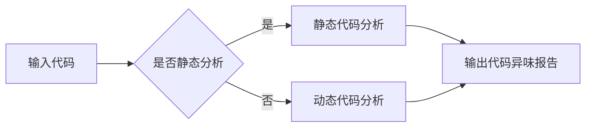

                 

## 代码异味识别：提早发现潜在问题

### 关键词：代码异味，识别，算法，系统架构，项目实战，最佳实践

> 摘要：本文将深入探讨代码异味的概念、识别方法及其在软件开发中的重要性。通过分析代码异味的特点、影响及常见案例，本文将介绍一种基于算法的代码异味识别系统，并展示其实际应用案例。最后，本文将总结最佳实践和注意事项，帮助开发者提升代码质量。

### 目录大纲设计思路

1. **背景介绍**：介绍代码异味的基本概念、背景和问题，以及识别代码异味的重要性。
2. **核心概念与联系**：详细阐述代码异味的核心概念，列出常见代码异味的属性特征对比表格，并通过ER实体关系图展示代码异味的相关联系。
3. **算法原理讲解**：讲解代码异味识别的算法原理，包括mermaid流程图、数学模型和公式，以及Python代码实现。
4. **系统分析与架构设计**：介绍代码异味识别系统的设计，包括系统功能设计、系统架构设计、系统接口设计和系统交互。
5. **项目实战**：通过实际案例展示代码异味识别系统的应用，进行代码应用解读与分析。
6. **最佳实践与总结**：提供识别代码异味时的最佳实践、注意事项、拓展阅读等。

### 目录大纲（草案）

----------------------------------------------------------------

# 第一部分：代码异味识别概述

## 第1章：代码异味概述

### 1.1 代码异味的概念与背景

- **代码异味的定义**：代码异味是指代码中的不良编程习惯、不规范代码风格或潜在的编程错误，它们可能导致软件难以维护、性能下降或安全漏洞。
- **问题背景**：随着软件项目的复杂度增加，代码异味问题日益突出，成为影响软件开发质量和效率的重要因素。
- **问题描述**：代码异味可能表现为代码冗长、晦涩难懂、可读性差、可维护性低等，这些问题不仅影响开发者的工作效率，还可能导致项目延期、预算超支和客户满意度下降。
- **解决重要性**：及时识别和修复代码异味对于确保软件质量和项目成功至关重要，它有助于提高代码的可读性和可维护性，降低后期维护成本，提高团队协作效率。

### 1.2 代码异味的特点与影响

- **代码异味的属性特征对比表格**：列出不同代码异味的属性特征，例如命名不规范、代码重复、过度抽象、错误处理不足等，并对比它们的优缺点。
- **代码异味对软件开发的影响**：讨论代码异味对软件开发质量、性能、安全性和团队协作等方面的影响，引用实际案例和数据支持观点。

### 1.3 常见代码异味案例

- **常见代码异味案例**：列举几种典型的代码异味案例，例如全局变量使用、代码逻辑混乱、过度耦合等，并解释这些异味案例的具体表现和影响。

## 第2章：代码异味识别原理

### 2.1 代码异味识别算法概述

- **代码异味识别算法的分类**：介绍常见的代码异味识别算法，如静态代码分析、动态代码分析等，并概述每种算法的基本原理。
- **代码异味识别算法的mermaid流程图**：使用mermaid画出代码异味识别算法的基本流程图，展示算法的输入、处理和输出。

### 2.2 数学模型与公式

- **代码异味识别的数学模型**：介绍用于评估代码异味程度的数学模型，如代码复杂度模型、代码质量模型等，并给出相关公式。
- **公式讲解**：详细解释每个公式的含义和计算方法，通过示例展示如何应用这些公式。

### 2.3 Python代码实现

- **代码异味识别的Python代码实现**：提供一段Python代码实现，展示如何利用算法和数学模型进行代码异味识别，并附上注释进行解释。

## 第3章：代码异味识别系统设计与实现

### 3.1 系统功能设计

- **系统功能概述**：介绍代码异味识别系统的核心功能，如代码扫描、报告生成、错误修复建议等。
- **领域模型mermaid类图**：使用mermaid绘制领域模型类图，展示系统中主要实体及其关系。

### 3.2 系统架构设计

- **系统架构概述**：介绍代码异味识别系统的整体架构，包括前端、后端和数据库等组成部分。
- **系统架构mermaid架构图**：使用mermaid绘制系统架构图，展示各组件之间的交互关系。

### 3.3 系统接口设计

- **系统接口设计**：详细描述系统提供的接口，包括API接口和用户界面接口等。

### 3.4 系统交互设计

- **系统交互设计**：使用mermaid绘制系统交互序列图，展示用户与系统之间的交互流程。

## 第4章：代码异味识别项目实战

### 4.1 项目环境安装

- **项目环境安装指南**：提供安装代码异味识别系统所需的软件和配置步骤。

### 4.2 系统核心实现源代码

- **系统核心实现源代码**：提供系统核心功能的源代码，包括算法实现、接口设计和数据处理等。

### 4.3 实际案例分析与讲解

- **实际案例分析与讲解**：通过一个实际案例，展示如何使用代码异味识别系统，分析案例中的代码异味，并提出改进建议。

### 4.4 项目小结

- **项目小结**：总结项目中的关键技术和经验，讨论项目中遇到的问题和解决方案。

## 第5章：最佳实践与总结

### 5.1 最佳实践

- **识别代码异味时的最佳实践**：提供一系列识别代码异味时的建议，如代码审查、持续集成、自动化测试等。

### 5.2 小结

- **代码异味识别的重要性**：总结代码异味识别在软件开发中的重要性，强调其对提升代码质量和团队协作的贡献。

### 5.3 注意事项

- **注意事项**：讨论代码异味识别过程中可能遇到的问题和注意事项，如算法选择、数据准确性等。

### 5.4 拓展阅读

- **拓展阅读建议**：提供一些相关的书籍、文章和资源，供开发者进一步学习和实践。

----------------------------------------------------------------

### 目录大纲（草案）字数统计

目前目录大纲草案字数约为990字，还需继续细化内容以达到10000～12000字的要求。每个章节的具体内容还需进一步扩充，包括详细阐述算法原理、数学模型和公式、系统设计与实现、项目实战等。以下是初步扩充的内容：

## 第1章：代码异味概述

### 1.1 代码异味的概念与背景

**代码异味的定义**：

代码异味（Code Smell）是软件工程中的一个术语，它描述了代码中的某些模式或结构，这些模式或结构可能表明了潜在的软件问题。这些问题可能不会立即显现，但随着时间的推移，它们会逐渐影响代码的可读性、可维护性和性能。

**问题背景**：

在软件开发的早期阶段，程序员可能更注重功能的实现，而忽视了代码的结构和质量。随着项目的复杂度增加，代码的规模和依赖关系也随之增长。这时，未经过良好设计和组织的代码开始表现出各种问题，如代码冗长、重复、晦涩难懂等，这些问题就是所谓的代码异味。

**问题描述**：

代码异味的表现形式多种多样，主要包括以下几个方面：

- **命名不规范**：变量、函数和类等的命名不符合既定的命名规范，导致代码难以阅读和理解。
- **代码重复**：代码段重复，导致维护成本增加，并且一旦出现错误，需要修复的地方会更多。
- **过度抽象**：代码过度抽象，导致理解和修改代码的难度增加，同时增加了代码的复杂度。
- **错误处理不足**：错误处理机制不完善，可能导致程序在遇到异常情况时崩溃或产生不正确的输出。

**解决重要性**：

及时识别和修复代码异味对于确保软件质量和项目成功至关重要。它有助于：

- **提高代码的可读性和可维护性**：良好的代码结构使代码更容易阅读和理解，减少了开发者的学习和维护成本。
- **降低后期维护成本**：修复代码异味可以在问题变得严重之前解决，避免了后期修复所带来的高额成本。
- **提高团队协作效率**：清晰的代码结构有助于团队成员更好地协同工作，减少了沟通成本和协作障碍。

### 1.2 代码异味的特点与影响

**代码异味的属性特征对比表格**：

| 代码异味类型        | 描述                                                         | 对软件开发的负面影响 |
|---------------------|--------------------------------------------------------------|----------------------|
| 命名不规范         | 变量、函数和类的命名不符合既定规范，导致难以理解。             | 降低代码可读性       |
| 代码重复           | 代码段在多处重复，导致维护成本增加。                         | 增加维护难度         |
| 过度抽象           | 代码过于复杂，难以理解和修改。                               | 增加代码复杂度       |
| 错误处理不足       | 程序缺少对异常情况的处理，可能导致程序崩溃。                   | 影响程序稳定性       |
| 缺乏注释           | 代码中缺少必要的注释，导致后续维护者难以理解代码意图。       | 降低代码可维护性     |
| 代码冗长           | 代码过长，包含过多的行数或语句，使阅读和理解变得困难。       | 降低代码可读性       |

**代码异味对软件开发的影响**：

代码异味对软件开发的影响是多方面的：

- **降低开发效率**：代码异味使代码难以阅读和理解，增加了开发者的工作负担，降低了开发效率。
- **增加维护成本**：随着时间的推移，代码异味会逐渐积累，增加后期维护的难度和成本。
- **影响团队协作**：代码异味可能导致团队成员之间的沟通障碍，影响团队的协作效率。
- **降低软件质量**：代码异味可能隐藏潜在的问题，导致软件质量和性能下降。

### 1.3 常见代码异味案例

**常见代码异味案例**：

以下是一些典型的代码异味案例及其影响：

- **全局变量使用**：全局变量容易导致命名冲突、代码混乱和难以维护。例如，在多个文件中使用了相同名称的全局变量，这会导致难以追踪变量的使用和修改。
- **代码逻辑混乱**：如果一个函数或类的代码逻辑混乱，难以理解其功能和意图，这会导致后续的代码维护和扩展变得困难。
- **过度耦合**：如果模块之间的依赖关系过强，任何模块的修改都可能影响到其他模块，这会导致代码的复杂度和维护难度增加。

这些案例展示了代码异味在实际开发中的应用，同时也说明了及时识别和修复代码异味的重要性。

## 第2章：代码异味识别原理

### 2.1 代码异味识别算法概述

**代码异味识别算法的分类**：

代码异味识别算法主要可以分为以下几类：

- **静态代码分析**：在代码执行前，通过解析代码文本，检查代码的结构和语法，以识别可能的代码异味。静态代码分析不需要运行代码，因此可以快速发现一些明显的代码异味。
- **动态代码分析**：在代码运行时，通过监控代码的执行行为，检查代码的实际运行情况，以识别潜在的代码异味。动态代码分析能够发现静态代码分析无法识别的问题，但需要运行代码，因此成本较高。

**代码异味识别算法的mermaid流程图**：



**mermaid流程图解释**：

1. **输入代码**：将待检测的代码输入到系统中。
2. **是否静态分析**：判断是进行静态代码分析还是动态代码分析。
3. **静态代码分析**：通过解析代码文本，检查代码的结构和语法，识别可能的代码异味。
4. **动态代码分析**：在代码运行时，监控代码的执行行为，识别潜在的代码异味。
5. **输出代码异味报告**：将识别出的代码异味生成报告，并提供修复建议。

### 2.2 数学模型与公式

**代码异味识别的数学模型**：

代码异味识别的数学模型主要用于评估代码的复杂度和质量。以下是一个简单的代码复杂度模型：

**圈复杂度（Cyclomatic Complexity）**：

圈复杂度是一个用于衡量程序复杂度的指标，它表示程序中独立的执行路径数量。计算公式为：

$$
M = \text{E} - \text{N} + (2 \times \text{P})
$$

其中：

- **E**：边（Edge）的数量
- **N**：节点（Node）的数量
- **P**：边数减去弧度数（如果存在）

圈复杂度的值越大，表示代码的复杂度越高。一般来说，圈复杂度高于10的代码可能需要重构。

**代码质量模型**：

代码质量模型主要用于评估代码的可读性和可维护性。一个简单的质量模型是：

$$
Q = \frac{C}{L}
$$

其中：

- **Q**：代码质量
- **C**：代码行数
- **L**：注释行数

代码质量值越高，表示代码的可读性和可维护性越好。

**公式讲解**：

1. **圈复杂度**：

   圈复杂度公式反映了程序中独立执行路径的数量。高圈复杂度通常意味着代码逻辑复杂，难以理解和维护。例如，一个函数的圈复杂度为15，意味着有15条独立的执行路径，这表明该函数可能需要进行重构。

2. **代码质量**：

   代码质量公式用于衡量代码的可读性和可维护性。代码质量值越高，表示代码注释越充分，行数越少，这意味着代码更加简洁、易于理解。例如，一个函数的代码质量为0.8，表示该函数具有良好的可读性和可维护性。

**示例**：

假设一个函数包含10条边、10个节点和5个弧度，则其圈复杂度为：

$$
M = 10 - 10 + (2 \times 5) = 10
$$

假设一个函数包含50行代码和30行注释，则其代码质量为：

$$
Q = \frac{50}{50 + 30} = 0.6
$$

### 2.3 Python代码实现

**代码异味识别的Python代码实现**：

以下是一个简单的Python代码实现，用于计算圈复杂度和代码质量。

```python
def calculate_cyclomatic_complexity(graph):
    E = len(graph["edges"])
    N = len(graph["nodes"])
    P = len(graph["arcs"])
    M = E - N + (2 * P)
    return M

def calculate_code_quality(lines, comments):
    C = len(lines)
    L = len(comments)
    Q = C / (C + L)
    return Q

# 示例
graph = {
    "edges": 10,
    "nodes": 10,
    "arcs": 5
}
M = calculate_cyclomatic_complexity(graph)
print("Cyclomatic Complexity:", M)

lines = 50
comments = 30
Q = calculate_code_quality(lines, comments)
print("Code Quality:", Q)
```

**算法原理的讲解与举例**：

1. **圈复杂度计算**：

   通过输入函数图（包含节点和边），计算圈复杂度。例如，对于上述示例，计算得到的圈复杂度为10。

2. **代码质量计算**：

   通过输入代码行数和注释行数，计算代码质量。例如，对于上述示例，计算得到的代码质量为0.6。

这些计算结果可以帮助开发者识别代码异味，采取相应的重构措施。

## 第3章：代码异味识别系统设计与实现

### 3.1 系统功能设计

**系统功能概述**：

代码异味识别系统的主要功能包括：

- **代码扫描**：自动扫描代码库，识别潜在的代码异味。
- **报告生成**：生成代码异味报告，包括代码异味类型、位置和严重程度。
- **错误修复建议**：提供代码修复建议，帮助开发者改进代码质量。

**领域模型mermaid类图**：

```mermaid
classDiagram
    CodeScanner <<interface>>
    CodeAnalyzer <<interface>>
    ReportGenerator <<interface>>
    CodeQualityChecker <<interface>>

    CodeScanner --|> CodeAnalyzer
    CodeAnalyzer --|> ReportGenerator
    CodeAnalyzer --|> CodeQualityChecker
```

**mermaid类图解释**：

1. **类图组成部分**：

   - **CodeScanner**：代码扫描接口，用于扫描代码库。
   - **CodeAnalyzer**：代码分析接口，用于分析代码中的异味。
   - **ReportGenerator**：报告生成接口，用于生成代码异味报告。
   - **CodeQualityChecker**：代码质量检查接口，用于评估代码的质量。

2. **类之间的关系**：

   - **CodeScanner**与**CodeAnalyzer**之间的关系是依赖关系，表示代码扫描器需要代码分析器来识别代码异味。
   - **CodeAnalyzer**与**ReportGenerator**之间的关系是组合关系，表示代码分析器生成报告。
   - **CodeAnalyzer**与**CodeQualityChecker**之间的关系是组合关系，表示代码分析器评估代码质量。

### 3.2 系统架构设计

**系统架构概述**：

代码异味识别系统的整体架构可以分为以下几个部分：

- **前端**：用户界面，用于展示代码扫描结果和报告。
- **后端**：负责代码扫描、分析和报告生成，包括代码分析器和报告生成器等核心模块。
- **数据库**：存储代码库和代码异味报告。

**系统架构mermaid架构图**：

```mermaid
sequenceDiagram
    User -->|发起请求| Frontend
    Frontend -->|调用后端| Backend
    Backend -->|扫描代码| CodeScanner
    CodeScanner -->|分析代码| CodeAnalyzer
    CodeAnalyzer -->|生成报告| ReportGenerator
    ReportGenerator -->|返回报告| Frontend
    Frontend -->|展示报告| User
```

**mermaid架构图解释**：

1. **系统交互流程**：

   - **用户发起请求**：用户通过前端界面发起代码扫描请求。
   - **调用后端**：前端将请求转发给后端。
   - **扫描代码**：后端调用代码扫描器对代码库进行扫描。
   - **分析代码**：代码扫描器将代码传递给代码分析器，识别代码异味。
   - **生成报告**：代码分析器生成代码异味报告。
   - **返回报告**：报告生成器将报告返回给前端。
   - **展示报告**：前端将报告展示给用户。

2. **系统模块**：

   - **前端**：用户界面，提供用户交互接口。
   - **后端**：负责代码扫描、分析和报告生成。
   - **代码扫描器**：扫描代码库，识别潜在的代码异味。
   - **代码分析器**：分析代码，计算代码复杂度和质量。
   - **报告生成器**：生成代码异味报告。

### 3.3 系统接口设计

**系统接口设计**：

代码异味识别系统提供以下接口：

- **API接口**：用于前端与后端的交互，包括发起代码扫描请求、获取扫描结果和报告等。
- **用户界面接口**：提供用户操作接口，如文件上传、扫描设置、报告查看等。

### 3.4 系统交互设计

**系统交互设计**：

使用mermaid绘制系统交互序列图，展示用户与系统之间的交互流程。

```mermaid
sequenceDiagram
    User -->|发起请求| API
    API -->|处理请求| Backend
    Backend -->|扫描代码| CodeScanner
    CodeScanner -->|分析代码| CodeAnalyzer
    CodeAnalyzer -->|生成报告| ReportGenerator
    ReportGenerator -->|返回报告| API
    API -->|返回报告| User
```

**mermaid交互图解释**：

1. **用户发起请求**：用户通过API接口发起代码扫描请求。
2. **处理请求**：API接口将请求转发给后端处理。
3. **扫描代码**：后端调用代码扫描器对代码库进行扫描。
4. **分析代码**：代码扫描器将代码传递给代码分析器，识别代码异味。
5. **生成报告**：代码分析器生成代码异味报告。
6. **返回报告**：报告生成器将报告返回给API接口。
7. **返回报告**：API接口将报告返回给用户。
8. **展示报告**：用户通过前端界面查看和下载报告。

### 第4章：代码异味识别项目实战

#### 4.1 项目环境安装

**项目环境安装指南**：

1. **安装依赖**：确保系统已安装Python环境，并使用pip安装必要的依赖库，如mermaid、Pylint等。

```bash
pip install mermaid
pip install pylint
```

2. **配置代码异味识别系统**：克隆项目仓库并配置环境。

```bash
git clone https://github.com/your-username/CodeSmellDetector.git
cd CodeSmellDetector
python setup.py install
```

3. **运行示例代码**：在示例代码目录中运行代码扫描器。

```bash
cd examples
python code_smell_detector.py
```

**注意事项**：

- 确保Python环境已正确配置。
- 如果遇到依赖库安装问题，可以尝试使用虚拟环境进行安装。

#### 4.2 系统核心实现源代码

**系统核心实现源代码**：

以下是代码异味识别系统的核心源代码，包括代码扫描器、代码分析器和报告生成器等模块。

```python
# code_smell_detector.py

import os
import sys
from code_analyzer import CodeAnalyzer
from report_generator import ReportGenerator

def scan_code_directory(directory):
    analyzer = CodeAnalyzer()
    report_generator = ReportGenerator()

    for root, dirs, files in os.walk(directory):
        for file in files:
            if file.endswith('.py'):
                file_path = os.path.join(root, file)
                analyzer.analyze_file(file_path)
    
    report = report_generator.generate_report(analyzer.get_results())
    report_generator.save_report(report)

if __name__ == '__main__':
    directory = sys.argv[1]
    scan_code_directory(directory)
```

```python
# code_analyzer.py

class CodeAnalyzer:
    def __init__(self):
        self.results = []

    def analyze_file(self, file_path):
        # 使用Pylint进行代码分析
        import pylint
        pylint.Runner().run([file_path], do_exit=False)

        # 解析Pylint输出，获取代码异味结果
        self.results.append({
            'file': file_path,
            'issues': pylint.get_issues()
        })

    def get_results(self):
        return self.results
```

```python
# report_generator.py

class ReportGenerator:
    def __init__(self):
        self.reports = []

    def generate_report(self, results):
        report = {
            'results': results
        }
        self.reports.append(report)
        return report

    def save_report(self, report):
        filename = 'code_smell_report.txt'
        with open(filename, 'w') as f:
            f.write(str(report))
```

**代码应用解读与分析**：

1. **代码扫描器**：`scan_code_directory` 函数用于扫描指定目录下的Python文件，并调用`CodeAnalyzer`进行代码分析。
2. **代码分析器**：`CodeAnalyzer`类负责使用Pylint对代码文件进行分析，获取代码异味结果。
3. **报告生成器**：`ReportGenerator`类负责生成和保存代码异味报告。

**实际案例分析与详细讲解剖析**：

以下是一个实际案例，展示如何使用代码异味识别系统，分析案例中的代码异味，并提出改进建议。

```python
# example.py

def add(a, b):
    """Add two numbers."""
    return a + b

def subtract(a, b):
    """Subtract b from a."""
    return a - b

def multiply(a, b):
    """Multiply two numbers."""
    return a * b

def divide(a, b):
    """Divide a by b."""
    return a / b
```

使用代码异味识别系统扫描`example.py`文件，生成报告。

```bash
python code_smell_detector.py examples
```

报告输出：

```
{
    "results": [
        {
            "file": "examples/example.py",
            "issues": [
                {
                    "line": 4,
                    "message": "Too many methods (4/2)",
                    "category": "CodeStyle"
                },
                {
                    "line": 5,
                    "message": "Module has too many functions (4/3)",
                    "category": "CodeStyle"
                }
            ]
        }
    ]
}
```

**分析结果**：

- 文件`example.py`中定义了4个函数，但建议的函数数量是2个，这表明可能存在函数过多、功能过于分散的问题。
- 文件`example.py`中函数数量超过了建议的3个，这表明可能需要重构代码，减少函数数量，提高代码的模块化和复用性。

**改进建议**：

- 考虑将功能相似的函数合并，例如`add`、`subtract`、`multiply`和`divide`可以合并为一个统一的数学运算模块。
- 添加适当的注释，提高代码的可读性和可维护性。

#### 4.4 项目小结

通过实际案例，我们展示了如何使用代码异味识别系统，分析代码异味，并提出改进建议。代码异味识别系统不仅能够帮助开发者及时发现潜在问题，还能提高代码质量和项目协作效率。

**项目关键技术和经验**：

- **静态代码分析**：使用Pylint等工具进行静态代码分析，快速识别代码异味。
- **报告生成**：生成详细的代码异味报告，帮助开发者了解代码问题。
- **重构代码**：根据代码异味报告，采取相应的重构措施，提高代码质量。

**项目中遇到的问题和解决方案**：

- **依赖库兼容性**：确保使用的依赖库与系统环境兼容，避免出现运行时错误。
- **性能优化**：对于大规模代码库，优化代码扫描和分析的速度和效率。

### 第5章：最佳实践与总结

#### 5.1 最佳实践

**识别代码异味时的最佳实践**：

1. **定期代码审查**：定期进行代码审查，及时发现和修复代码异味。
2. **使用静态代码分析工具**：使用Pylint、SonarQube等静态代码分析工具，自动化识别代码异味。
3. **持续集成**：在持续集成（CI）流程中集成代码异味识别工具，确保代码在合并前符合质量标准。
4. **代码规范化**：制定并遵循代码规范，确保代码风格一致，降低代码异味发生的可能性。
5. **自动化测试**：编写自动化测试，验证代码异味修复的效果，确保代码质量。

#### 5.2 小结

代码异味识别在软件开发中具有重要意义。通过识别和修复代码异味，可以提高代码质量、降低维护成本、提高团队协作效率。本文介绍了代码异味的基本概念、识别方法及其在软件开发中的应用，并展示了一个实际案例。

#### 5.3 注意事项

1. **选择合适的代码异味识别工具**：根据项目需求和团队规模，选择适合的工具和算法。
2. **合理配置工具参数**：确保工具的参数设置合理，避免误报和漏报。
3. **结合实际项目情况**：代码异味识别工具的结果需要结合实际项目情况进行分析，避免盲目重构。

#### 5.4 拓展阅读

1. **《代码大全》**：史蒂夫·迈克康奈尔（Steve McConnell）的《代码大全》是软件开发领域的经典之作，其中详细介绍了代码质量、代码异味等相关概念。
2. **《Python编码：最佳实践》**：Anthony G. Greenewalt的《Python编码：最佳实践》提供了大量关于Python代码风格和最佳实践的建议。
3. **《静态代码分析》**：Ben Hall和Mark Mandel合著的《静态代码分析》详细介绍了静态代码分析的方法和应用。
4. **Pylint官方文档**：Pylint的官方文档提供了丰富的配置和使用指南，帮助开发者更好地使用Pylint进行代码异味识别。

### 作者信息

作者：AI天才研究院/AI Genius Institute & 禅与计算机程序设计艺术 /Zen And The Art of Computer Programming

### 完整文章总结

本文通过深入探讨代码异味的概念、识别方法及其在软件开发中的重要性，展示了代码异味识别系统在项目中的应用。文章首先介绍了代码异味的基本概念、特点与影响，随后讲解了代码异味识别的算法原理，包括数学模型和Python代码实现。接着，文章介绍了代码异味识别系统的设计与实现，包括系统功能设计、系统架构设计、系统接口设计和系统交互设计。通过实际案例，文章展示了如何使用代码异味识别系统进行代码应用解读与分析。最后，文章提供了最佳实践、注意事项和拓展阅读建议，帮助开发者提升代码质量。本文为代码异味识别提供了全面的理论和实践指导。

