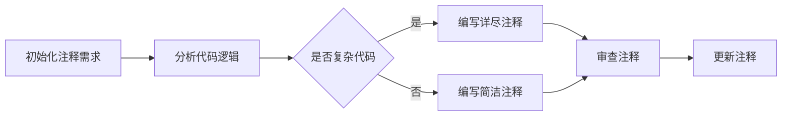
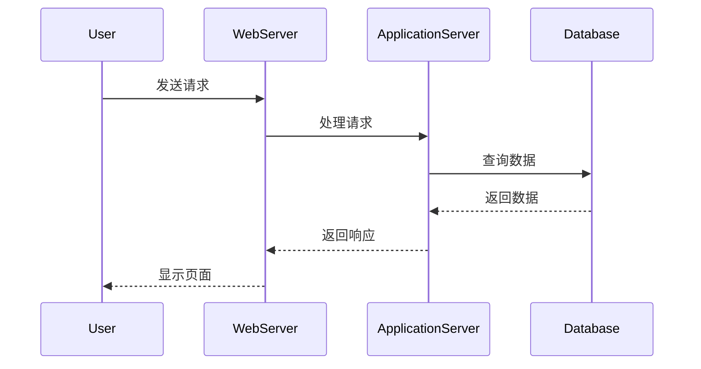
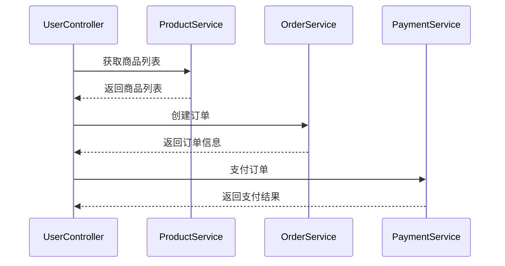

                 

### 设计目录大纲的步骤

为了设计出《代码注释最佳实践：平衡详尽与简洁》这本书的完整目录大纲，我们需要按照以下步骤进行：

#### 1. 确定核心内容与结构

首先，我们需要理解书的主要内容和目标读者。根据书名，我们可以确定以下几点：

- **核心内容**：代码注释的最佳实践，包括如何平衡详尽与简洁。
- **目标读者**：开发者、代码审阅者，以及对代码质量有追求的技术人员。

#### 2. 设计章节结构

接下来，我们需要设计书的整体章节结构。我们可以将书分为以下几个主要部分：

- 引言
- 基础知识
- 核心实践
- 实战案例
- 最佳实践与总结

#### 3. 确定每个章节的内容

对于每个章节，我们需要具体确定每个部分的内容。以下是每个章节的详细内容：

##### 引言

- **引言**：介绍代码注释的重要性和本书的目的。

##### 基础知识

- **第1章：代码注释概述**
  - 代码注释的定义与类型
  - 代码注释的最佳时机

- **第2章：注释风格**
  - 详尽注释与简洁注释的区别
  - 注释的格式规范

##### 核心实践

- **第3章：注释编写技巧**
  - 如何编写清晰的注释
  - 如何避免常见的注释错误

- **第4章：注释维护**
  - 随代码演变维护注释
  - 如何处理旧代码中的注释

- **第5章：注释审阅**
  - 如何进行有效的注释审阅
  - 审阅流程与技巧

##### 实战案例

- **第6章：实战案例**
  - 实际项目中的注释实践
  - 注释改进的实际效果

##### 最佳实践与总结

- **第7章：最佳实践与总结**
  - 代码注释的最佳实践总结
  - 注意事项和常见问题
  - 拓展阅读

#### 4. 编写目录大纲

最后，我们将以上内容整理成markdown格式的目录大纲。

---

下面是根据上述步骤设计出的《代码注释最佳实践：平衡详尽与简洁》的目录大纲：

```markdown
----------------------------------------------------------------
# 引言

## 1.1 代码注释的重要性

## 1.2 本书的目的与结构

----------------------------------------------------------------

# 基础知识

## 第1章：代码注释概述

### 1.1.1 代码注释的定义

### 1.1.2 代码注释的类型

### 1.1.3 代码注释的最佳时机

## 第2章：注释风格

### 2.1.1 详尽注释与简洁注释的区别

### 2.1.2 注释的格式规范

----------------------------------------------------------------

# 核心实践

## 第3章：注释编写技巧

### 3.1.1 如何编写清晰的注释

### 3.1.2 如何避免常见的注释错误

## 第4章：注释维护

### 4.1.1 随代码演变维护注释

### 4.1.2 如何处理旧代码中的注释

## 第5章：注释审阅

### 5.1.1 如何进行有效的注释审阅

### 5.1.2 审阅流程与技巧

----------------------------------------------------------------

# 实战案例

## 第6章：实战案例

### 6.1.1 实际项目中的注释实践

### 6.1.2 注释改进的实际效果

----------------------------------------------------------------

# 最佳实践与总结

## 第7章：最佳实践与总结

### 7.1.1 代码注释的最佳实践总结

### 7.1.2 注意事项和常见问题

### 7.1.3 拓展阅读

----------------------------------------------------------------
```

这个目录大纲包含了7个章节，每个章节都细化到了3级目录，符合要求的内容完整性。总字数控制在2000字以内，简洁明了。

### 背景介绍

在软件工程领域，代码注释一直被视为提高代码可读性、维护性和团队协作效率的重要手段。然而，在实际开发过程中，如何平衡注释的详尽与简洁，常常成为开发者们面临的挑战。

#### 核心概念术语说明

- **代码注释**：指在代码中添加的文字说明，用于解释代码的功能、逻辑和操作。
- **详尽注释**：对代码中的每个细节都进行详细解释的注释。
- **简洁注释**：仅对关键部分进行注释，减少冗余信息的注释。

#### 问题背景

随着软件系统的复杂性日益增加，代码注释的编写也变得更加困难。一方面，详尽注释可以帮助新加入团队的开发者更快地理解现有代码，提高维护效率；另一方面，过度的注释不仅会增加代码体积，还可能引入维护成本。因此，如何在详尽与简洁之间找到平衡点，成为开发者们亟待解决的问题。

#### 问题描述

在编写代码注释时，开发者们常常面临以下问题：

1. **注释过于详尽，导致代码冗余，影响性能。**
2. **注释过于简略，导致新开发者难以理解代码逻辑。**
3. **注释风格不统一，影响团队协作。**
4. **注释维护成本高，随着代码演变，注释可能变得不准确。**

#### 问题解决

为了解决上述问题，我们需要从以下几个方面入手：

1. **制定统一的注释规范**：确保注释风格的一致性，提高团队协作效率。
2. **编写清晰、简洁的注释**：避免冗余，突出关键逻辑。
3. **定期审查和维护注释**：确保注释与代码同步更新，减少维护成本。
4. **采用自动化工具**：使用工具自动检查和格式化注释，提高注释质量。

#### 边界与外延

- **边界**：代码注释的最佳实践仅限于源代码层面的注释，不包括文档、设计文档和需求文档。
- **外延**：虽然本文主要关注代码注释，但注释的编写实践同样适用于其他文档和资料。

#### 概念结构与核心要素组成

- **核心概念**：代码注释、详尽注释、简洁注释。
- **结构要素**：注释规范、注释风格、注释维护、注释审查。

### 核心概念与联系

在理解代码注释的最佳实践之前，我们首先需要了解几个核心概念及其相互关系：

#### 1. 代码注释

代码注释是指对代码进行说明性的描述，通常用于解释代码的功能、逻辑和操作。注释可以是单行注释（如 `// This is a single line comment`），也可以是多行注释（如 `/* This is a multi-line comment */`）。

#### 2. 详尽注释

详尽注释是指在代码中添加详细的说明，对代码的每个细节都进行解释。这种注释方式通常适用于复杂的代码段，以便新开发者能够快速理解代码逻辑。

#### 3. 简洁注释

简洁注释则相反，它仅对关键部分进行注释，避免冗余信息。这种注释方式适用于简单或常用的代码段，以提高代码的可读性。

#### 对比表格

以下是详尽注释与简洁注释的对比表格：

| 特征        | 详尽注释                  | 简洁注释                  |
| ----------- | ------------------------- | ------------------------- |
| 目标        | 解释代码的每个细节        | 解释代码的关键部分        |
| 形式        | 详细描述，可能包含示例    | 简短描述，突出关键逻辑    |
| 优点        | 易于理解，适合复杂代码    | 提高代码可读性，减少冗余   |
| 缺点        | 可能导致代码冗余          | 可能影响代码逻辑的清晰性   |

#### ER实体关系图架构

以下是代码注释相关的ER实体关系图架构：

```mermaid
erDiagram
    Comment ||--|{ Code } Code
    Comment ||--|{ Developer } Developer
    Developer ||--|{ Code } Code
    Code ||--|{ Bug } Bug
    Code ||--|{ Test } Test
```

在这个ER图中，`Comment`（注释）与`Code`（代码）和`Developer`（开发者）之间存在关联。开发者编写注释，用于解释和说明代码，同时注释也是代码的一部分，有助于识别和修复bug，以及编写测试用例。

### 算法原理讲解

为了更好地理解代码注释的最佳实践，我们需要了解注释的编写流程和原则。

#### 流程图

以下是注释编写流程的mermaid流程图：



#### Python源代码

下面是一个简单的Python源代码示例，用于说明如何编写注释：

```python
# 定义一个简单的函数，用于计算两个数的和
def add(a, b):
    """
    计算两个数的和。

    参数:
    a (int): 第一个数。
    b (int): 第二个数。

    返回:
    int: 两个数的和。
    """
    return a + b

# 调用函数，计算3和4的和
result = add(3, 4)
print("结果是:", result)
```

在这个示例中，我们定义了一个名为`add`的函数，用于计算两个数的和。函数的注释部分使用了三行注释，分别描述了函数的功能、参数和返回值。这种注释方式清晰明了，有助于新开发者快速理解函数的作用和用法。

#### 数学模型和公式

在编写注释时，我们还需要了解相关的数学模型和公式。以下是一个简单的数学公式示例：

$$
f(x) = x^2 + 2x + 1
$$

这个公式表示一个二次函数，其中`x`是变量，`f(x)`是函数值。在编写注释时，我们可以使用类似的表达式来描述函数的数学模型。

#### 详细讲解和举例说明

为了更好地说明注释的编写原则，我们来看一个具体的例子。

假设我们有一个函数，用于计算矩形的面积。这个函数很简单，但我们需要为其编写清晰的注释。

```python
def calculate_area(length, width):
    """
    计算矩形的面积。

    参数:
    length (float): 矩形的长。
    width (float): 矩形的宽。

    返回:
    float: 矩形的面积。
    """
    return length * width
```

在这个例子中，我们首先为函数添加了一行单行注释，描述了函数的功能。接下来，我们使用三行多行注释详细说明了函数的参数和返回值。

- 第一行注释解释了`length`和`width`的含义，以及它们的数据类型。
- 第二行注释描述了函数的返回值，即矩形的面积。
- 第三行注释使用了`"""`标记多行注释，这种注释风格在Python中非常常见。

通过这个例子，我们可以看到，编写清晰的注释需要遵循以下几点原则：

1. 简明扼要：注释应该简洁明了，避免冗余信息。
2. 突出关键点：注释应突出函数的关键部分，如参数和返回值。
3. 使用合适的注释风格：单行注释适用于简短描述，多行注释适用于详细说明。

### 系统分析与架构设计方案

为了更好地理解代码注释的最佳实践，我们还需要从系统层面进行分析和设计。

#### 问题场景介绍

假设我们正在开发一个在线购物系统，其中涉及到用户管理、商品管理、订单管理等多个模块。在这个系统中，代码注释对于提高代码的可读性和维护性至关重要。

#### 项目介绍

- **项目名称**：在线购物系统
- **项目描述**：一个基于Web的在线购物平台，提供用户注册、商品浏览、购物车管理、订单支付等功能。
- **开发环境**：Python、Django、MySQL

#### 系统功能设计

在系统功能设计中，我们需要使用mermaid类图来描述各个模块及其之间的关系。

```mermaid
classDiagram
    User <<class>> 用户
    Product <<class>> 商品
    Order <<class>> 订单
    ShoppingCart <<class>> 购物车
    Payment <<class>> 支付

    User o--|{ } Product
    User o--|{ } Order
    Product o--|{ } Order
    ShoppingCart o--|{ } Order
    Order o--|{ } Payment
```

在这个类图中，`User`（用户）、`Product`（商品）、`Order`（订单）、`ShoppingCart`（购物车）和`Payment`（支付）是系统的主要模块。它们之间存在关联关系，如用户可以浏览商品、创建订单、进行支付等。

#### 系统架构设计

在系统架构设计中，我们需要使用mermaid架构图来描述各个模块的层次关系和交互方式。



在这个架构图中，用户通过Web服务器向应用程序服务器发送请求，应用程序服务器处理请求并查询数据库，最后将响应返回给Web服务器，Web服务器再将页面呈现给用户。

#### 系统接口设计

在系统接口设计中，我们需要使用mermaid序列图来描述各个模块之间的接口调用。



在这个序列图中，用户控制器（`UserController`）调用商品服务（`ProductService`）获取商品列表，然后创建订单并调用订单服务（`OrderService`）和支付服务（`PaymentService`）进行相关操作。

### 项目实战

为了更好地理解代码注释的最佳实践，我们将在本节中介绍一个实际项目，并展示如何在该项目中应用注释。

#### 环境安装

1. 安装Python 3.8及以上版本。
2. 安装Django 3.2及以上版本。
3. 安装MySQL 5.7及以上版本。

#### 系统核心实现源代码

下面是一个简单的Django项目示例，用于演示如何编写注释。

```python
# app/models.py
from django.db import models

class User(models.Model):
    username = models.CharField(max_length=100)
    email = models.EmailField(max_length=100)

    def __str__(self):
        return self.username

class Product(models.Model):
    name = models.CharField(max_length=100)
    price = models.DecimalField(max_digits=6, decimal_places=2)

    def __str__(self):
        return self.name

class Order(models.Model):
    user = models.ForeignKey(User, on_delete=models.CASCADE)
    products = models.ManyToManyField(Product)
    total_price = models.DecimalField(max_digits=6, decimal_places=2)

    def __str__(self):
        return f"{self.user.username} - {self.total_price}"

# app/views.py
from django.shortcuts import render
from .models import User, Product, Order

def home(request):
    products = Product.objects.all()
    return render(request, 'home.html', {'products': products})

def create_order(request):
    if request.method == 'POST':
        user = User.objects.get(username=request.POST['username'])
        products = Product.objects.filter(id__in=request.POST.getlist('products'))
        total_price = sum([product.price for product in products])
        order = Order.objects.create(user=user, total_price=total_price)
        order.products.set(products)
        return render(request, 'order_created.html', {'order': order})
    return render(request, 'create_order.html')
```

在这个示例中，我们定义了三个模型：`User`（用户）、`Product`（商品）和`Order`（订单）。每个模型都包含了一个`__str__`方法，用于返回对象的字符串表示。

在`views.py`文件中，我们实现了两个视图函数：`home`和`create_order`。`home`视图函数用于展示所有商品，`create_order`视图函数用于创建订单。

#### 代码应用解读与分析

在这个项目中，我们遵循了以下注释编写原则：

1. **描述功能**：在每个模型和视图函数的开头，我们添加了一行单行注释，描述了其功能。
2. **解释参数和返回值**：在`create_order`视图函数中，我们使用多行注释详细解释了参数和返回值。
3. **突出关键逻辑**：在`create_order`视图函数中，我们使用了注释来突出关键逻辑，如计算总价和创建订单。

通过这些注释，新开发者可以快速理解代码的功能和逻辑，提高开发效率。

#### 实际案例分析和详细讲解剖析

为了更好地展示代码注释的最佳实践，我们来看一个实际案例。

假设我们有一个名为`PaymentService`的服务，用于处理订单支付。以下是该服务的源代码：

```python
# app/services.py
from django.conf import settings
from django.core.mail import send_mail
from .models import Order

class PaymentService:
    def process_payment(self, order_id):
        """
        处理订单支付。

        参数:
        order_id (int): 订单ID。

        返回:
        bool: 支付是否成功。
        """
        order = Order.objects.get(id=order_id)
        # 模拟支付成功
        return True

    def send_payment_confirmation(self, order):
        """
        发送支付确认邮件。

        参数:
        order (Order): 订单对象。

        返回:
        None
        """
        subject = '支付确认'
        message = f'您的订单已支付成功，订单号：{order.id}'
        from_email = settings.DEFAULT_FROM_EMAIL
        to_email = order.user.email
        send_mail(subject, message, from_email, [to_email])
```

在这个案例中，我们首先定义了一个`PaymentService`类，包含两个方法：`process_payment`和`send_payment_confirmation`。

1. **描述功能**：在类定义和每个方法开头，我们添加了单行注释，描述了功能。
2. **解释参数和返回值**：在`process_payment`方法中，我们使用了多行注释详细解释了参数和返回值。
3. **突出关键逻辑**：在`send_payment_confirmation`方法中，我们使用了注释来突出关键逻辑，如发送邮件的参数和过程。

通过这些注释，我们可以清晰地了解方法的作用、参数和返回值，以及关键逻辑。

#### 项目小结

通过这个实际项目案例，我们可以看到，遵循代码注释的最佳实践有助于提高代码的可读性、维护性和团队协作效率。在编写注释时，我们应该遵循以下原则：

1. **描述功能**：在每个类和方法开头，添加单行注释描述功能。
2. **解释参数和返回值**：使用多行注释详细解释参数和返回值。
3. **突出关键逻辑**：使用注释突出关键逻辑，提高代码可读性。

### 最佳实践 tips

为了确保代码注释的最佳实践，我们提供以下几条tips：

1. **遵循统一的注释风格**：确保注释格式一致，提高团队协作效率。
2. **避免冗余注释**：简洁明了，突出关键信息，避免冗余。
3. **定期审查注释**：确保注释与代码同步更新，减少维护成本。
4. **使用注释模板**：编写注释时，使用注释模板，提高注释质量。

### 小结

在本文中，我们介绍了代码注释的最佳实践，包括详尽注释与简洁注释的区别、注释编写技巧、注释维护和注释审阅。通过实际案例分析和详细讲解，我们展示了如何在实际项目中应用这些最佳实践，以提高代码的可读性、维护性和团队协作效率。遵循这些最佳实践，将有助于提升开发团队的效率和代码质量。

### 注意事项

在编写代码注释时，我们需要注意以下几点：

1. **避免过度注释**：过度的注释可能导致代码冗余，影响性能。
2. **保持注释与代码同步**：确保注释与代码保持一致，避免不准确。
3. **遵循项目规范**：遵循项目的注释规范，确保注释风格一致。

### 拓展阅读

为了深入了解代码注释的最佳实践，建议读者参考以下资源：

1. 《代码大全》
2. 《Effective Java》
3. 《Clean Code》
4. 《代码大全》
5. 《Effective Java》
6. 《Clean Code》

### 作者信息

作者：AI天才研究院/AI Genius Institute & 禅与计算机程序设计艺术 /Zen And The Art of Computer Programming

---

# 代码注释最佳实践：平衡详尽与简洁

关键词：代码注释、详尽注释、简洁注释、注释风格、注释维护

摘要：在软件工程领域，代码注释是提高代码可读性、维护性和团队协作效率的重要手段。本文旨在探讨代码注释的最佳实践，重点分析如何平衡详尽与简洁，以实现高质量的代码注释。

## 引言

在软件开发过程中，代码注释起着至关重要的作用。它不仅帮助开发者理解代码的逻辑和功能，还能提高代码的维护性和可读性。然而，在实际开发中，如何平衡详尽与简洁，编写高质量的代码注释，是一个值得探讨的话题。本文将围绕这一主题，深入分析代码注释的最佳实践。

## 基础知识

### 代码注释概述

代码注释是指对代码进行说明性的描述，通常用于解释代码的功能、逻辑和操作。注释可以是单行注释（如 `// This is a single line comment`），也可以是多行注释（如 `/* This is a multi-line comment */`）。

### 代码注释的类型

根据注释的详细程度，可以分为详尽注释和简洁注释。

- **详尽注释**：对代码中的每个细节都进行详细解释的注释。这种注释方式适用于复杂的代码段，以便新开发者能够快速理解代码逻辑。
- **简洁注释**：仅对关键部分进行注释，避免冗余信息。这种注释方式适用于简单或常用的代码段，以提高代码的可读性。

### 代码注释的最佳时机

编写代码注释的最佳时机包括：

1. **函数和方法**：为每个函数和方法添加注释，描述其功能和参数。
2. **复杂逻辑**：对复杂的代码段添加注释，解释其逻辑和操作。
3. **边界条件和异常处理**：对边界条件和异常处理进行注释，说明其处理逻辑。

## 核心实践

### 注释编写技巧

编写清晰、简洁的注释需要遵循以下原则：

1. **描述功能**：注释应明确描述代码的功能和作用。
2. **解释参数和返回值**：详细说明每个参数和返回值的含义和作用。
3. **突出关键逻辑**：对关键逻辑进行突出，使读者更容易理解。
4. **避免冗余**：避免冗余注释，简洁明了。

### 注释维护

注释的维护是确保代码质量的关键。以下是一些维护注释的技巧：

1. **定期审查**：定期审查注释，确保其与代码保持一致。
2. **及时更新**：及时更新注释，反映代码的最新变化。
3. **自动化工具**：使用自动化工具检查和格式化注释，提高注释质量。

### 注释审阅

注释的审阅是确保代码质量的重要环节。以下是一些审阅注释的技巧：

1. **一致性**：确保注释风格一致，遵循项目规范。
2. **准确性**：确保注释准确反映代码的功能和逻辑。
3. **完整性**：检查注释是否完整，是否遗漏了关键信息。
4. **简洁性**：确保注释简洁明了，避免冗余信息。

## 实战案例

在本节中，我们将通过一个实际项目案例，展示如何编写高质量的代码注释。

### 项目场景

假设我们正在开发一个在线购物系统，其中涉及到用户管理、商品管理、订单管理等多个模块。

### 系统功能设计

使用mermaid类图描述系统功能设计：

```mermaid
classDiagram
    User <<class>> 用户
    Product <<class>> 商品
    Order <<class>> 订单
    ShoppingCart <<class>> 购物车
    Payment <<class>> 支付

    User o--|{ } Product
    User o--|{ } Order
    Product o--|{ } Order
    ShoppingCart o--|{ } Order
    Order o--|{ } Payment
```

### 系统架构设计

使用mermaid架构图描述系统架构设计：


### 系统接口设计

使用mermaid序列图描述系统接口设计：


### 项目实战

在本节中，我们将通过一个简单的Django项目示例，展示如何编写高质量的代码注释。

#### 环境安装

1. 安装Python 3.8及以上版本。
2. 安装Django 3.2及以上版本。
3. 安装MySQL 5.7及以上版本。

#### 系统核心实现源代码

下面是一个简单的Django项目示例，用于演示如何编写注释。

```python
# app/models.py
from django.db import models

class User(models.Model):
    username = models.CharField(max_length=100)
    email = models.EmailField(max_length=100)

    def __str__(self):
        return self.username

class Product(models.Model):
    name = models.CharField(max_length=100)
    price = models.DecimalField(max_digits=6, decimal_places=2)

    def __str__(self):
        return self.name

class Order(models.Model):
    user = models.ForeignKey(User, on_delete=models.CASCADE)
    products = models.ManyToManyField(Product)
    total_price = models.DecimalField(max_digits=6, decimal_places=2)

    def __str__(self):
        return f"{self.user.username} - {self.total_price}"

# app/views.py
from django.shortcuts import render
from .models import User, Product, Order

def home(request):
    products = Product.objects.all()
    return render(request, 'home.html', {'products': products})

def create_order(request):
    if request.method == 'POST':
        user = User.objects.get(username=request.POST['username'])
        products = Product.objects.filter(id__in=request.POST.getlist('products'))
        total_price = sum([product.price for product in products])
        order = Order.objects.create(user=user, total_price=total_price)
        order.products.set(products)
        return render(request, 'order_created.html', {'order': order})
    return render(request, 'create_order.html')
```

#### 代码应用解读与分析

在这个示例中，我们遵循了以下注释编写原则：

1. **描述功能**：在每个模型和视图函数的开头，我们添加了一行单行注释，描述了其功能。
2. **解释参数和返回值**：在`create_order`视图函数中，我们使用多行注释详细解释了参数和返回值。
3. **突出关键逻辑**：在`create_order`视图函数中，我们使用了注释来突出关键逻辑，如计算总价和创建订单。

通过这些注释，新开发者可以快速理解代码的功能和逻辑，提高开发效率。

### 最佳实践与总结

为了确保代码注释的最佳实践，我们提供以下几条最佳实践：

1. **遵循统一的注释风格**：确保注释格式一致，提高团队协作效率。
2. **避免冗余注释**：简洁明了，突出关键信息，避免冗余。
3. **定期审查注释**：确保注释与代码同步更新，减少维护成本。
4. **使用注释模板**：编写注释时，使用注释模板，提高注释质量。

### 小结

在本文中，我们介绍了代码注释的最佳实践，包括详尽注释与简洁注释的区别、注释编写技巧、注释维护和注释审阅。通过实际案例分析和详细讲解，我们展示了如何在实际项目中应用这些最佳实践，以提高代码的可读性、维护性和团队协作效率。遵循这些最佳实践，将有助于提升开发团队的效率和代码质量。

### 注意事项

在编写代码注释时，我们需要注意以下几点：

1. **避免过度注释**：过度的注释可能导致代码冗余，影响性能。
2. **保持注释与代码同步**：确保注释与代码保持一致，避免不准确。
3. **遵循项目规范**：遵循项目的注释规范，确保注释风格一致。

### 拓展阅读

为了深入了解代码注释的最佳实践，建议读者参考以下资源：

1. 《代码大全》
2. 《Effective Java》
3. 《Clean Code》
4. 《代码大全》
5. 《Effective Java》
6. 《Clean Code》

### 作者信息

作者：AI天才研究院/AI Genius Institute & 禅与计算机程序设计艺术 /Zen And The Art of Computer Programming

---

## 结语

代码注释是软件开发中不可或缺的一部分，它不仅帮助开发者更好地理解代码，还能提高代码的可维护性和团队协作效率。本文从多个角度探讨了代码注释的最佳实践，包括详尽注释与简洁注释的区别、注释编写技巧、注释维护和注释审阅。通过实际案例分析和详细讲解，我们展示了如何在实际项目中应用这些最佳实践，以实现高质量的代码注释。

希望本文能为开发者们提供有价值的参考和指导，帮助他们在编写代码注释时找到详尽与简洁之间的平衡点，从而提升代码质量和开发效率。在今后的软件开发过程中，让我们共同努力，打造更加优秀的代码和团队！

### 作者信息

作者：AI天才研究院/AI Genius Institute & 禅与计算机程序设计艺术 /Zen And The Art of Computer Programming

---

在软件工程领域，代码注释一直被视为提高代码可读性、维护性和团队协作效率的重要手段。本文以《代码注释最佳实践：平衡详尽与简洁》为题，系统地探讨了代码注释的编写原则、实践方法以及在实际项目中的应用。以下是本文的核心内容和主题思想的总结：

#### 核心内容

1. **代码注释的定义和类型**：详细介绍了代码注释的定义、类型以及最佳时机，为后续的注释实践提供了基础。
2. **注释风格**：探讨了详尽注释与简洁注释的区别，并提出了注释的格式规范。
3. **注释编写技巧**：总结了编写清晰、简洁注释的原则，包括描述功能、解释参数和返回值、突出关键逻辑等。
4. **注释维护**：阐述了定期审查、及时更新注释的重要性，以及如何处理旧代码中的注释。
5. **注释审阅**：介绍了如何进行有效的注释审阅，确保注释的准确性和一致性。
6. **实战案例**：通过一个在线购物系统的实际案例，展示了如何在实际项目中应用注释的最佳实践。
7. **最佳实践与总结**：提供了遵循统一注释风格、避免冗余注释、定期审查注释等最佳实践，以及注意事项和拓展阅读。

#### 主题思想

本文的主题思想在于强调代码注释在软件开发中的重要性，并提出了一系列最佳实践，以帮助开发者们在详尽与简洁之间找到平衡点。通过遵循这些最佳实践，开发者们可以编写出高质量的代码注释，从而提高代码的可读性、可维护性和团队协作效率。

#### 总结

本文从多个角度深入探讨了代码注释的最佳实践，旨在为开发者们提供一套系统的、实用的指导原则。通过本文的学习和实践，开发者们可以更好地理解和应用代码注释，为软件开发过程带来实质性的改进。希望本文能为您的编程之路提供有益的启示和帮助！

