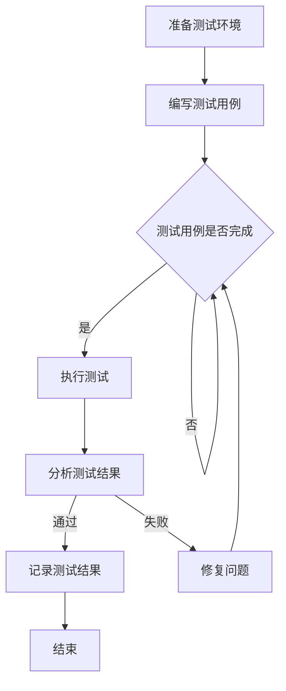
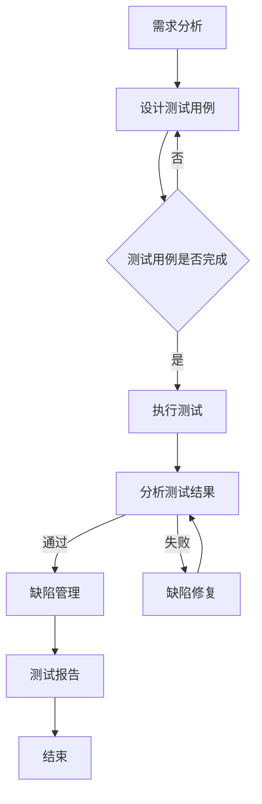
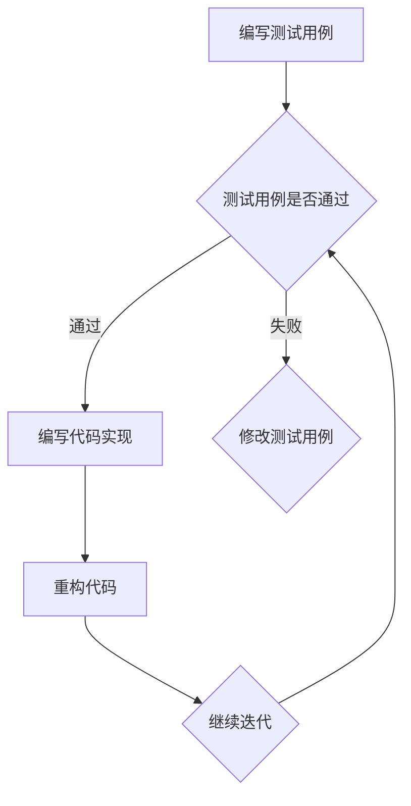
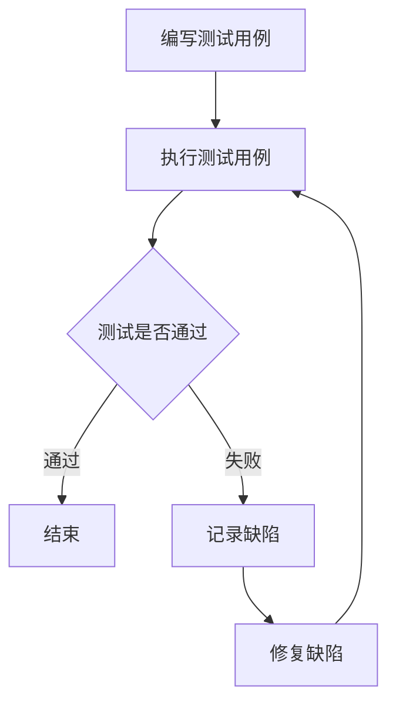
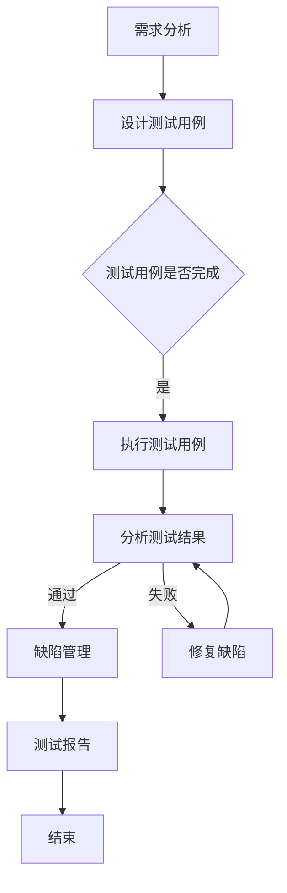
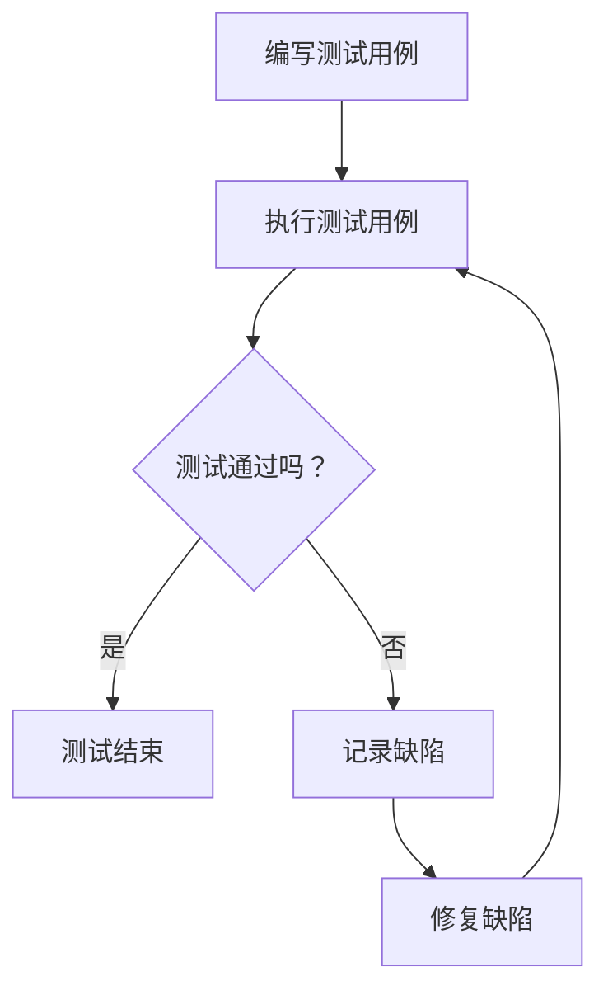
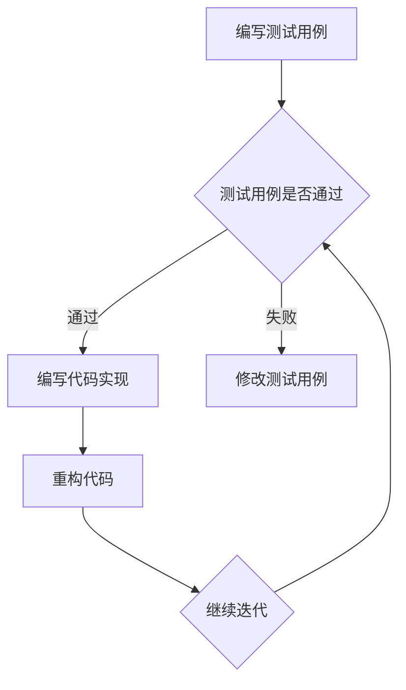
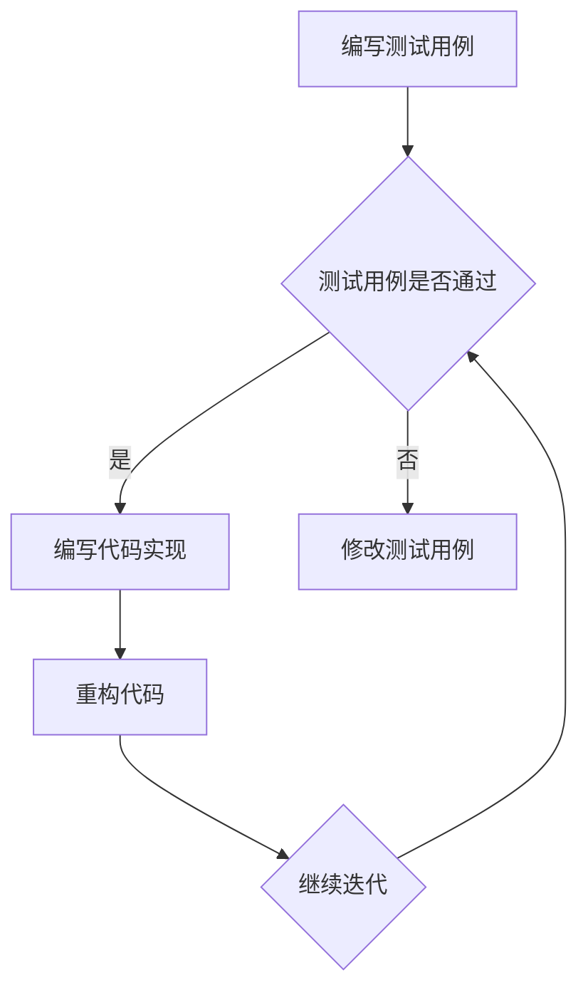

                 

## 1.4.1 单元测试算法原理

### 单元测试算法

单元测试是软件测试中最基础的环节，主要针对软件中的最小可测试单元——函数或方法进行验证。其核心目标是确保每个单元按照设计要求正确执行。下面是单元测试的基本原理和步骤。

#### 1.4.1.1 基本原理

单元测试的基本原理包括以下几个关键点：

1. **测试用例设计**：根据函数或方法的输入参数和预期结果设计测试用例。
2. **测试执行**：按照设计的测试用例对单元进行测试，验证其行为是否符合预期。
3. **测试结果分析**：对比实际结果与预期结果，分析测试结果，判断单元是否通过测试。

#### 1.4.1.2 测试步骤

单元测试的基本步骤如下：

1. **准备测试环境**：搭建适合单元测试的开发环境，确保测试所需的依赖和工具已安装。
2. **编写测试用例**：根据单元的功能定义测试用例，包括正常输入、边界输入、异常输入等情况。
3. **执行测试**：运行测试用例，观察单元的输出结果。
4. **分析测试结果**：对比预期结果和实际结果，如果一致，则单元测试通过；否则，单元测试失败。
5. **记录测试结果**：将测试结果记录在测试报告中，以便后续分析。

#### 1.4.1.3 Mermaid 流程图

以下是一个单元测试的Mermaid流程图，展示了其基本流程：



#### 1.4.1.4 Python 源代码示例

为了更好地理解单元测试的原理，以下是一个简单的Python单元测试示例：

```python
import unittest

class TestExample(unittest.TestCase):
    def test_addition(self):
        # 测试用例：验证两个整数相加的结果
        self.assertEqual(add(1, 2), 3)
        self.assertEqual(add(-1, -2), -3)
        self.assertEqual(add(0, 0), 0)

def add(a, b):
    # 被测试函数：实现两个整数的加法
    return a + b

if __name__ == '__main__':
    unittest.main()
```

在这个示例中，`TestExample` 类继承了 `unittest.TestCase` 类，定义了一个测试用例 `test_addition`。测试用例通过 `self.assertEqual` 方法与预期结果进行比较，如果一致，则测试通过；否则，测试失败。

#### 1.4.1.5 数学模型和公式

虽然单元测试主要关注代码逻辑的正确性，但其中也涉及到一些基础的数学概念，例如等价类划分、边界值分析等。等价类划分和边界值分析是设计测试用例的重要方法，可以通过以下公式进行描述：

1. **等价类划分**：

   等价类 = {（输入值，预期结果）| 满足相同条件的所有输入值和对应的预期结果}

2. **边界值分析**：

   边界值 = {（输入值的下界，下界结果）、（输入值的上界，上界结果）、（输入值的下界附近值，下界附近结果）、（输入值的上界附近值，上界附近结果）}

通过以上公式，我们可以更系统地设计测试用例，提高测试的覆盖率和可靠性。

---

## 1.5 系统测试算法原理与Mermaid流程图

### 系统测试算法

系统测试是在单元测试的基础上，对整个软件系统进行全面的测试，以确保系统的功能、性能、安全性和稳定性。系统测试通常包括功能测试、性能测试、安全测试等多种类型。以下介绍系统测试的基本算法原理，并通过Mermaid流程图展示其基本流程。

#### 1.5.1 系统测试算法原理

系统测试的基本原理包括以下几个关键点：

1. **测试用例设计**：根据系统的需求和设计文档，设计涵盖所有功能模块的测试用例。
2. **测试执行**：按照设计的测试用例对系统进行测试，验证系统的各个功能模块是否正常工作。
3. **测试结果分析**：对比实际结果与预期结果，分析测试结果，判断系统是否通过测试。
4. **缺陷管理**：记录和跟踪测试过程中发现的缺陷，确保缺陷得到及时修复。

#### 1.5.2 测试步骤

系统测试的基本步骤如下：

1. **需求分析**：分析系统需求文档，确定系统需要测试的功能点。
2. **设计测试用例**：根据需求分析结果，设计测试用例，确保测试覆盖所有功能点。
3. **执行测试**：运行测试用例，观察系统的输出结果。
4. **分析测试结果**：对比预期结果和实际结果，判断系统是否通过测试。
5. **缺陷管理**：记录和跟踪测试过程中发现的缺陷，确保缺陷得到及时修复。
6. **测试报告**：编写测试报告，总结测试结果和发现的缺陷。

#### 1.5.3 Mermaid 流程图

以下是一个系统测试的Mermaid流程图，展示了其基本流程：



#### 1.5.4 Python 源代码示例

为了更好地理解系统测试的原理，以下是一个简单的Python系统测试示例：

```python
import unittest

class TestSystem(unittest.TestCase):
    def test_function_a(self):
        # 测试用例：验证功能A的正确性
        self.assertEqual(function_a(3), 6)
        self.assertEqual(function_a(0), 0)
        self.assertEqual(function_a(-1), -1)

    def test_function_b(self):
        # 测试用例：验证功能B的正确性
        self.assertTrue(function_b("hello") == "Hello")
        self.assertFalse(function_b("123") == "Hello")

def function_a(x):
    # 被测试函数：实现一个简单的加法操作
    return x + x

def function_b(s):
    # 被测试函数：将字符串首字母大写
    return s.capitalize()

if __name__ == '__main__':
    unittest.main()
```

在这个示例中，`TestSystem` 类继承了 `unittest.TestCase` 类，定义了两个测试用例 `test_function_a` 和 `test_function_b`。测试用例通过 `self.assertEqual` 和 `self.assertTrue` 方法与预期结果进行比较，如果一致，则测试通过；否则，测试失败。

#### 1.5.5 数学模型和公式

系统测试涉及到的数学模型和公式主要包括以下内容：

1. **覆盖率**：

   覆盖率 = （已执行测试用例数 / 总测试用例数）× 100%

   覆盖率用于衡量测试用例对系统功能的覆盖程度，越高代表测试越全面。

2. **性能指标**：

   - 响应时间：系统处理请求所需的时间。
   - 吞吐量：单位时间内系统能够处理的请求数量。
   - 错误率：系统处理请求时错误的百分比。

通过以上公式，我们可以量化系统测试的结果，评估系统的性能和稳定性。

---

## 1.6 测试驱动开发（TDD）算法原理与Mermaid流程图

### 测试驱动开发（TDD）算法原理

测试驱动开发（Test-Driven Development，简称TDD）是一种敏捷开发方法，强调在编写代码之前先编写测试用例。这种方法有助于确保代码的可靠性和质量。下面将详细介绍TDD的算法原理，并通过Mermaid流程图展示其基本流程。

#### 1.6.1 TDD算法原理

TDD的基本原理包括以下几个关键点：

1. **编写测试用例**：在开发代码之前，根据需求编写测试用例，确保测试用例能够覆盖所有功能点和边界情况。
2. **运行测试用例**：运行测试用例，检查是否全部通过。如果测试失败，则说明需求理解不准确或者代码存在问题。
3. **编写代码实现**：根据测试用例的结果，编写代码实现，确保代码能够通过测试。
4. **重构代码**：在确保代码通过测试的基础上，对代码进行重构，提高代码的可读性和可维护性。
5. **重复循环**：继续编写新的测试用例，重复上述步骤，逐步完善和优化代码。

#### 1.6.2 TDD测试步骤

TDD的测试步骤可以分为以下几步：

1. **编写测试用例**：根据需求编写详细的测试用例，确保测试用例能够覆盖所有功能点和边界情况。
2. **运行测试用例**：运行测试用例，检查是否全部通过。如果测试失败，则返回上一步，重新编写测试用例。
3. **编写代码实现**：根据测试用例编写代码实现，确保代码能够通过测试。
4. **重构代码**：在确保代码通过测试的基础上，对代码进行重构，提高代码的可读性和可维护性。
5. **继续迭代**：重复上述步骤，逐步完善和优化代码。

#### 1.6.3 Mermaid流程图

以下是一个TDD测试的Mermaid流程图，展示了其基本流程：



#### 1.6.4 Python 源代码示例

为了更好地理解TDD的原理，以下是一个简单的Python TDD示例：

```python
import unittest

class TestTDD(unittest.TestCase):
    def test_add(self):
        # 测试用例：验证加法函数的正确性
        self.assertEqual(add(1, 2), 3)
        self.assertEqual(add(-1, -2), -3)
        self.assertEqual(add(0, 0), 0)

def add(a, b):
    # 被测试函数：实现两个整数的加法
    return a + b

if __name__ == '__main__':
    unittest.main()
```

在这个示例中，`TestTDD` 类继承了 `unittest.TestCase` 类，定义了一个测试用例 `test_add`。测试用例通过 `self.assertEqual` 方法与预期结果进行比较，如果一致，则测试通过；否则，测试失败。

#### 1.6.5 数学模型和公式

TDD中的数学模型和公式主要包括以下内容：

1. **代码覆盖率**：

   代码覆盖率 = （已覆盖的代码行数 / 总代码行数）× 100%

   代码覆盖率用于衡量测试用例对代码的覆盖程度，越高代表测试越全面。

2. **缺陷发现率**：

   缺陷发现率 = （发现的缺陷数 / 总缺陷数）× 100%

   缺陷发现率用于衡量测试过程中发现缺陷的能力，越高代表测试越有效。

通过以上公式，我们可以量化TDD的结果，评估测试用例和代码的质量。

---

## 1.7 总结与反思

在本章中，我们深入探讨了代码测试、代码质量和测试驱动开发（TDD）的核心概念、算法原理和实现步骤。从单元测试、系统测试到TDD，我们通过详细的示例和Mermaid流程图，逐步揭示了代码测试在软件开发中的重要性。

### 1.7.1 主要内容回顾

1. **代码测试**：代码测试是验证代码正确性、稳定性和性能的过程，包括单元测试、系统测试等。
2. **代码质量**：代码质量是代码可靠性、可维护性、可读性、性能和安全性等方面的综合体现。
3. **TDD**：TDD是一种敏捷开发方法，强调在编写代码之前先编写测试用例，通过测试驱动开发过程。

### 1.7.2 整体架构设计

1. **模块划分**：代码测试、代码质量和TDD三个核心模块相互关联，共同构成软件质量保障的体系。
2. **流程设计**：从需求分析到测试用例编写，再到代码实现和重构，TDD过程环环相扣，确保代码质量。

### 1.7.3 未来展望

1. **持续集成与持续部署**：将代码测试与持续集成、持续部署相结合，实现自动化测试和快速交付。
2. **智能测试**：利用人工智能技术，优化测试用例设计和执行，提高测试效率和准确性。

### 1.7.4 反思与总结

1. **测试覆盖率**：确保测试用例覆盖所有功能和边界情况，提高测试覆盖率。
2. **测试用例设计**：设计全面、合理的测试用例，避免遗漏重要功能点和潜在缺陷。
3. **持续学习和改进**：随着软件环境的不断变化，不断学习和优化测试方法和策略，提高代码质量和开发效率。

---

通过本章的学习，读者应能够理解代码测试、代码质量和TDD的核心概念，掌握其实现方法和实践技巧。希望这些知识能够帮助读者在软件开发过程中更好地保障代码质量，提高开发效率和用户体验。


---

# 代码测试：不懂质量的不是好研发

> 关键词：代码测试、代码质量、TDD、单元测试、系统测试

> 摘要：本文将探讨代码测试在软件开发中的重要性，以及如何通过测试驱动开发（TDD）来提高代码质量。文章将从代码测试的定义、背景、核心概念，到具体测试方法（单元测试、系统测试）和TDD的原理、实现步骤，全面分析代码测试与研发人员技能之间的关系，帮助读者深刻理解代码测试的内涵，从而提升软件开发的整体质量。

## 1.1 问题背景与核心概念

### 1.1.1 问题背景

在当今快速迭代和高度复杂化的软件环境中，代码质量成为了软件成功的关键因素。然而，许多研发人员往往忽视代码测试的重要性，认为测试是额外的工作，甚至有些人认为代码测试是QA（质量控制）部门的责任。这种观念导致了大量软件项目中的质量问题，如功能缺陷、性能瓶颈和安全性漏洞等。

代码测试不仅仅是QA部门的职责，它应该贯穿于整个软件开发过程。代码测试是一种验证代码是否符合需求、规范和标准的过程，旨在发现并修复代码中的错误，提高代码的可靠性、可维护性和可读性。不懂质量的研发人员往往无法满足日益增长的市场需求和用户期望，导致软件项目进度延误、成本增加和用户体验下降。

因此，本文的核心问题是：如何让研发人员理解和掌握代码测试，从而提高软件质量？为了回答这个问题，我们将从以下几个方面展开讨论：

1. 介绍代码测试的基本概念和背景，包括代码测试的定义、发展历程、重要性以及面临的挑战。
2. 深入探讨代码质量的概念，包括其定义、属性、标准以及如何评价代码质量。
3. 分析不懂质量的研发人员可能存在的问题，如代码逻辑错误、性能瓶颈、安全性漏洞等。
4. 讨论代码测试与研发人员之间的联系，阐述为什么每个研发人员都应该重视代码测试。
5. 介绍代码测试的边界与外延，明确代码测试在软件开发过程中的具体应用场景。

通过这一章节的阅读，读者将建立对代码测试和代码质量的基本认识，为后续章节的深入学习打下坚实的基础。

### 1.1.2 核心概念

#### 1.1.2.1 代码测试的定义

代码测试是一种通过预定义的测试用例，检查代码是否符合既定需求、规范和标准的过程。测试用例是代码测试的核心组成部分，它包括输入数据、预期结果和实际结果的对比。代码测试的主要目标是发现代码中的错误和缺陷，从而提高代码的质量。

#### 1.1.2.2 代码测试的发展历程

代码测试的历史可以追溯到20世纪60年代，当时的软件测试主要关注程序的逻辑正确性。随着软件复杂度的增加，测试方法也在不断演变。20世纪80年代，单元测试的概念被提出，成为代码测试的重要组成部分。进入21世纪，随着敏捷开发方法和持续集成、持续部署（CI/CD）的普及，代码测试技术得到了快速发展。

#### 1.1.2.3 代码测试的重要性

代码测试在软件开发过程中具有至关重要的地位。首先，代码测试可以帮助发现和修复代码中的错误和缺陷，确保代码的正确性和稳定性。其次，代码测试可以提高代码的可维护性和可读性，降低维护成本。最后，代码测试可以确保代码的性能和安全性，提高系统的可靠性和用户体验。

#### 1.1.2.4 代码测试面临的挑战

尽管代码测试在软件开发中至关重要，但代码测试也面临着一系列挑战。首先，测试用例的设计和覆盖是代码测试的关键，但设计和维护测试用例需要大量的时间和精力。其次，测试环境的配置和管理复杂，特别是在跨平台和分布式系统中。最后，随着软件项目的规模和复杂性不断增加，测试的自动化和智能化成为新的挑战。

#### 1.1.2.5 代码质量的概念

代码质量是代码的可靠性、可维护性、可读性、性能和安全性等方面的综合体现。高代码质量意味着代码能够在各种条件下稳定运行，易于维护和扩展，具有良好的可读性，高效的性能，以及良好的安全性。

#### 1.1.2.6 代码质量的属性

1. **可靠性**：代码能够在各种条件下稳定运行，不发生意外错误。
2. **可维护性**：代码易于修改和维护，能够适应未来的需求变化。
3. **可读性**：代码结构清晰，逻辑简单，便于理解和阅读。
4. **性能**：代码执行效率高，能够满足性能要求。
5. **安全性**：代码能够抵御外部攻击和内部错误，保障系统的安全性。

#### 1.1.2.7 代码质量的标准

评估代码质量的标准可以从多个维度进行，如代码结构、代码风格、代码复杂度、代码覆盖率和代码性能等。常用的代码质量评估工具包括SonarQube、Checkstyle、PMD等。

#### 1.1.2.8 如何评价代码质量

评价代码质量的方法包括自动化测试、代码审查和性能测试等。自动化测试可以通过编写测试脚本和工具，对代码进行自动化测试，快速发现代码中的错误和缺陷。代码审查是通过人工审查代码，评估代码的结构、风格和可维护性。性能测试是通过模拟实际运行场景，评估代码的性能和响应时间。

### 1.1.3 代码测试与研发人员的联系

代码测试不仅是QA部门的职责，更是研发人员的基本技能。研发人员应该具备以下技能：

1. **测试思维**：研发人员应该具备测试思维，从测试的角度设计和编写代码，确保代码的可测试性。
2. **测试用例设计**：研发人员应该能够设计和编写覆盖各种场景的测试用例，确保代码的全面测试。
3. **测试环境配置**：研发人员应该熟悉测试环境的配置和管理，确保测试环境的一致性和稳定性。
4. **自动化测试**：研发人员应该掌握自动化测试工具和框架，提高测试效率和质量。
5. **代码质量评估**：研发人员应该能够使用代码质量评估工具，评估和改进代码质量。

### 1.1.4 代码测试的边界与外延

代码测试不仅限于功能测试，还包括性能测试、安全性测试、兼容性测试等多种类型。代码测试的应用场景非常广泛，如Web应用、移动应用、嵌入式系统等。代码测试不仅可以帮助发现和修复代码中的错误和缺陷，还可以为软件的持续集成和持续部署提供支持。

## 1.2 核心概念原理、属性特征对比表格与ER实体关系图架构

在本节中，我们将详细介绍代码测试和代码质量的核心概念，并对比它们的属性特征。为了更清晰地展示这些概念之间的关系，我们还将绘制ER实体关系图。

### 1.2.1 代码测试的核心概念

代码测试是一种通过预定义的测试用例，检查代码是否符合既定需求、规范和标准的过程。其核心概念包括以下几个方面：

1. **测试用例**：测试用例是代码测试的基本单元，包括输入数据、预期结果和实际结果的对比。一个有效的测试用例应该能够验证代码的功能、性能、安全性和可靠性。
2. **测试覆盖率**：测试覆盖率是指测试用例对代码的覆盖程度，包括功能覆盖率、代码覆盖率、分支覆盖率等。测试覆盖率越高，意味着测试越全面。
3. **测试执行**：测试执行是运行测试用例，观察测试结果的过程。测试执行可以通过手动执行或自动化执行完成。
4. **测试结果分析**：测试结果分析是对比预期结果和实际结果，判断测试是否通过的过程。测试结果分析可以帮助发现代码中的错误和缺陷。
5. **缺陷管理**：缺陷管理是记录、跟踪和修复测试过程中发现的缺陷的过程。缺陷管理是确保代码质量的重要环节。

### 1.2.2 代码质量的核心概念

代码质量是代码的可靠性、可维护性、可读性、性能和安全性等方面的综合体现。代码质量不仅影响软件的稳定性，还影响软件的可维护性、可扩展性和用户体验。代码质量的核心概念包括以下几个方面：

1. **可靠性**：可靠性是指代码在运行过程中不发生错误，能够稳定运行的能力。高可靠性的代码能够减少系统的故障率和停机时间。
2. **可维护性**：可维护性是指代码易于修改和维护，能够适应未来的需求变化。高可维护性的代码可以降低维护成本，提高开发效率。
3. **可读性**：可读性是指代码的结构清晰、逻辑简单，便于理解和阅读。高可读性的代码可以提高团队协作效率，降低学习和使用成本。
4. **性能**：性能是指代码的执行效率，包括响应时间、吞吐量和资源消耗等。高性能的代码能够提供更好的用户体验，提高系统的稳定性和可靠性。
5. **安全性**：安全性是指代码能够抵御外部攻击和内部错误，保障系统的安全。高安全性的代码可以防止数据泄露、系统崩溃和恶意攻击。

### 1.2.3 属性特征对比表格

为了更直观地对比代码测试和代码质量的核心概念，我们制作了一个对比表格，列出两者的关键特征。

| 特征 | 代码测试 | 代码质量 |
| --- | --- | --- |
| **定义** | 测试代码是否符合需求 | 代码的整体表现 |
| **准确性** | 测试用例正确反映需求 | 代码正确运行 |
| **覆盖率** | 覆盖代码的不同部分 | 覆盖需求的各个方面 |
| **可重复性** | 测试过程具有一致性 | 代码在不同环境下的一致性 |
| **可靠性** | 确保代码正确性 | 确保代码稳定运行 |
| **可维护性** | 易于修改和维护测试用例 | 易于修改和维护代码 |
| **可读性** | 不直接影响 | 但影响可维护性 |
| **性能** | 不直接影响 | 影响代码性能 |
| **安全性** | 不直接影响 | 但影响代码安全性 |

### 1.2.4 ER实体关系图架构

为了更清晰地展示代码测试和代码质量之间的关系，我们使用ER（实体关系）图进行描述。ER图是一种用于描述实体及其之间关系的数据库设计工具，它可以直观地表示实体之间的关系。

以下是一个简单的ER图，展示代码测试和代码质量之间的实体及其关系：

```mermaid
erDiagram
    Product ||--|{ TestSuite } TestSuite
    TestSuite ||--|{ TestCase } TestCase
    TestCase ||--|{ ExpectedResult } ExpectedResult
    TestCase ||--|{ ActualResult } ActualResult
    TestCase ||--|{ CodeSegment } CodeSegment
```

在这个ER图中：

- **Product** 代表软件产品，它是代码测试和代码质量的载体。
- **TestSuite** 代表测试套件，它包含多个测试用例。
- **TestCase** 代表测试用例，它包括预期结果、实际结果和代码片段。
- **ExpectedResult** 和 **ActualResult** 分别代表预期结果和实际结果，用于测试结果分析。
- **CodeSegment** 代表代码片段，是代码测试的核心部分。

通过ER图，我们可以清晰地看到代码测试和代码质量之间的关联，以及它们在软件开发过程中的作用。

### 1.2.5 代码测试的分类

代码测试可以根据测试对象的不同，分为多种类型。以下是几种常见的代码测试类型：

1. **单元测试**：单元测试是针对代码中的最小可测试单元（如函数、方法）进行的测试。它主要关注单元的功能是否正确，是代码测试的基础。
2. **集成测试**：集成测试是在单元测试的基础上，对多个单元进行集成后的测试。它主要关注模块之间的接口是否正确，以及模块之间的协作是否顺畅。
3. **系统测试**：系统测试是对整个软件系统进行的测试，包括功能测试、性能测试、安全性测试等。它主要关注系统是否满足用户需求，能否稳定运行。
4. **验收测试**：验收测试是在系统测试的基础上，对软件系统进行的最终测试。它主要关注软件系统是否满足业务需求，是否能够交付给用户使用。

### 1.2.6 代码测试与TDD

TDD（测试驱动开发）是一种敏捷开发方法，强调在编写代码之前先编写测试用例。TDD的基本流程是：编写测试用例 -> 运行测试用例 -> 编写代码实现 -> 重构代码 -> 再次编写测试用例。通过TDD，研发人员可以确保代码的可测试性，提高代码质量。

TDD的核心优势包括：

1. **提前发现问题**：在编写代码之前，通过编写测试用例，可以提前发现需求理解上的问题，避免后期返工。
2. **提高代码质量**：TDD要求代码必须通过测试，确保代码的正确性和可靠性。
3. **代码重构**：TDD鼓励在编写代码后进行重构，提高代码的可读性和可维护性。

通过TDD，研发人员可以更好地掌握代码测试的技巧，提高代码质量，从而提升整个软件项目的成功率和用户体验。

---

## 1.3 算法原理讲解与Mermaid流程图

### 1.3.1 单元测试算法原理

单元测试是针对代码中的最小可测试单元（如函数、方法）进行的测试，旨在验证这些单元是否按照预期执行。单元测试的基本原理包括以下几个步骤：

1. **编写测试用例**：根据需求或设计文档，编写测试用例，确定测试的输入和预期结果。
2. **执行测试用例**：运行测试用例，观察单元的输出结果。
3. **分析测试结果**：对比预期结果和实际结果，判断测试是否通过。
4. **缺陷管理**：记录和跟踪测试过程中发现的缺陷，确保缺陷得到及时修复。

以下是一个简单的单元测试算法原理的Mermaid流程图：



### 1.3.2 系统测试算法原理

系统测试是对整个软件系统进行的测试，包括功能测试、性能测试、安全测试等。系统测试的基本原理包括以下几个步骤：

1. **需求分析**：分析系统需求，确定测试的范围和目标。
2. **设计测试用例**：根据需求分析结果，设计测试用例，确保测试覆盖所有功能点和边界情况。
3. **执行测试用例**：运行测试用例，观察系统的输出结果。
4. **分析测试结果**：对比预期结果和实际结果，判断系统是否通过测试。
5. **缺陷管理**：记录和跟踪测试过程中发现的缺陷，确保缺陷得到及时修复。
6. **测试报告**：编写测试报告，总结测试结果和发现的缺陷。

以下是一个简单的系统测试算法原理的Mermaid流程图：



### 1.3.3 测试驱动开发（TDD）算法原理

测试驱动开发（TDD）是一种敏捷开发方法，强调在编写代码之前先编写测试用例。TDD的基本原理包括以下几个步骤：

1. **编写测试用例**：根据需求编写详细的测试用例，确保测试用例能够覆盖所有功能点和边界情况。
2. **运行测试用例**：运行测试用例，检查是否全部通过。如果测试失败，则说明需求理解不准确或者代码存在问题。
3. **编写代码实现**：根据测试用例编写代码实现，确保代码能够通过测试。
4. **重构代码**：在确保代码通过测试的基础上，对代码进行重构，提高代码的可读性和可维护性。
5. **重复循环**：重复上述步骤，逐步完善和优化代码。

以下是一个简单的TDD算法原理的Mermaid流程图：


通过以上算法原理的讲解和Mermaid流程图的展示，读者可以更好地理解单元测试、系统测试和TDD的核心概念和实现步骤。这些算法原理和流程对于提高代码质量和软件开发效率具有重要意义。

---

## 1.4 算法原理讲解与Mermaid流程图

### 1.4.1 单元测试算法原理

单元测试是针对代码中的最小可测试单元（通常是函数或方法）进行的测试，它旨在验证这些单元是否按照预期工作。单元测试的基本原理可以概括为以下几个步骤：

1. **测试用例设计**：根据函数的输入和预期输出，设计测试用例。测试用例应该覆盖正常情况、边界情况和异常情况。
2. **测试执行**：运行测试用例，观察函数的实际输出是否与预期输出一致。
3. **测试结果分析**：比较实际输出和预期输出，分析测试结果，判断测试是否通过。
4. **缺陷管理**：如果测试失败，记录缺陷并修复问题。

以下是一个简单的单元测试算法原理的Mermaid流程图：



#### 1.4.1.1 Python 源代码示例

以下是一个简单的Python单元测试示例，使用`unittest`库来验证一个简单函数`add`：

```python
import unittest

def add(a, b):
    """一个简单的加法函数"""
    return a + b

class TestAddFunction(unittest.TestCase):
    def test_add_positive_numbers(self):
        """测试正数相加"""
        self.assertEqual(add(1, 2), 3)
        self.assertEqual(add(100, 200), 300)

    def test_add_negative_numbers(self):
        """测试负数相加"""
        self.assertEqual(add(-1, -2), -3)
        self.assertEqual(add(-10, -20), -30)

    def test_add_mixed_numbers(self):
        """测试正负数相加"""
        self.assertEqual(add(-1, 2), 1)
        self.assertEqual(add(-5, 10), 5)

if __name__ == '__main__':
    unittest.main()
```

在这个示例中，`TestAddFunction` 类继承了 `unittest.TestCase` 类，定义了三个测试方法来验证`add`函数在各种情况下的行为。

#### 1.4.1.2 数学模型和公式

在单元测试中，我们经常使用以下数学模型和公式来评估测试的覆盖率：

1. **代码覆盖率**：
   \[
   \text{代码覆盖率} = \frac{\text{被测试的代码行数}}{\text{总代码行数}} \times 100\%
   \]

2. **缺陷发现率**：
   \[
   \text{缺陷发现率} = \frac{\text{发现的缺陷数}}{\text{总缺陷数}} \times 100\%
   \]

通过这些公式，我们可以量化测试的覆盖率和缺陷发现率，评估测试的有效性。

### 1.4.2 系统测试算法原理

系统测试是对整个软件系统进行的测试，它包括功能测试、性能测试、安全性测试等多种类型。系统测试旨在验证软件系统是否满足需求、是否能够在各种环境下稳定运行。

#### 1.4.2.1 测试步骤

系统测试的基本步骤如下：

1. **需求分析**：分析系统需求，确定测试的范围和目标。
2. **设计测试用例**：根据需求分析结果，设计测试用例，确保测试覆盖所有功能点和边界情况。
3. **执行测试用例**：运行测试用例，观察系统的输出结果。
4. **分析测试结果**：对比预期结果和实际结果，判断系统是否通过测试。
5. **缺陷管理**：记录和跟踪测试过程中发现的缺陷，确保缺陷得到及时修复。

以下是一个简单的系统测试算法原理的Mermaid流程图：


#### 1.4.2.2 Python 源代码示例

以下是一个简单的Python系统测试示例，使用`unittest`库来验证一个简单的Web应用：

```python
import unittest
from mywebapp import app

class TestWebApp(unittest.TestCase):
    def setUp(self):
        self.app = app.test_client()

    def test_home_page(self):
        """测试首页是否返回正确的响应"""
        response = self.app.get('/')
        self.assertEqual(response.status_code, 200)
        self.assertIn(b'Welcome to My Web App!', response.data)

    def test_login_page(self):
        """测试登录页是否返回正确的响应"""
        response = self.app.get('/login')
        self.assertEqual(response.status_code, 200)
        self.assertIn(b'Login Page', response.data)

    def test_login_success(self):
        """测试登录成功后的响应"""
        response = self.app.post('/login', data=dict(username='admin', password='password'))
        self.assertEqual(response.status_code, 302)

if __name__ == '__main__':
    unittest.main()
```

在这个示例中，`TestWebApp` 类继承了 `unittest.TestCase` 类，定义了三个测试方法来验证Web应用的不同功能点。

#### 1.4.2.3 数学模型和公式

系统测试中常用的数学模型和公式包括：

1. **功能覆盖率**：
   \[
   \text{功能覆盖率} = \frac{\text{已测试的功能点数}}{\text{总功能点数}} \times 100\%
   \]

2. **性能指标**：
   - **响应时间**：系统处理请求所需的时间。
   - **吞吐量**：单位时间内系统能够处理的请求数量。
   - **并发用户数**：系统能够同时处理的用户数量。

通过这些公式，我们可以量化系统测试的结果，评估系统的功能和性能。

### 1.4.3 测试驱动开发（TDD）算法原理

测试驱动开发（TDD）是一种敏捷开发方法，强调在编写代码之前先编写测试用例。TDD的基本原理可以概括为以下步骤：

1. **编写测试用例**：根据需求编写详细的测试用例，确保测试用例能够覆盖所有功能点和边界情况。
2. **运行测试用例**：运行测试用例，检查是否全部通过。如果测试失败，则说明需求理解不准确或者代码存在问题。
3. **编写代码实现**：根据测试用例编写代码实现，确保代码能够通过测试。
4. **重构代码**：在确保代码通过测试的基础上，对代码进行重构，提高代码的可读性和可维护性。
5. **重复循环**：重复上述步骤，逐步完善和优化代码。

以下是一个简单的TDD算法原理的Mermaid流程图：



#### 1.4.3.1 Python 源代码示例

以下是一个简单的Python TDD示例，使用`unittest`库来验证一个简单函数`add`：

```python
import unittest

def add(a, b):
    """一个简单的加法函数"""
    return a + b

class TestAddFunction(unittest.TestCase):
    def test_add_positive_numbers(self):
        """测试正数相加"""
        self.assertEqual(add(1, 2), 3)
        self.assertEqual(add(100, 200), 300)

    def test_add_negative_numbers(self):
        """测试负数相加"""
        self.assertEqual(add(-1, -2), -3)
        self.assertEqual(add(-10, -20), -30)

    def test_add_mixed_numbers(self):
        """测试正负数相加"""
        self.assertEqual(add(-1, 2), 1)
        self.assertEqual(add(-5, 10), 5)

if __name__ == '__main__':
    unittest.main()
```

在这个示例中，`TestAddFunction` 类继承了 `unittest.TestCase` 类，定义了三个测试方法来验证`add`函数在各种情况下的行为。

#### 1.4.3.2 数学模型和公式

在TDD中，我们经常使用以下数学模型和公式来评估测试的覆盖率：

1. **代码覆盖率**：
   \[
   \text{代码覆盖率} = \frac{\text{被测试的代码行数}}{\text{总代码行数}} \times 100\%
   \]

2. **缺陷发现率**：
   \[
   \text{缺陷发现率} = \frac{\text{发现的缺陷数}}{\text{总缺陷数}} \times 100\%
   \]

通过这些公式，我们可以量化TDD过程中测试的覆盖率和缺陷发现率，评估TDD的效果。

### 1.4.4 测试自动化

测试自动化是提高测试效率和准确性的有效手段。通过自动化测试工具，可以自动化执行测试用例，减少人为错误，提高测试覆盖率。

#### 1.4.4.1 测试自动化工具

以下是一些常用的测试自动化工具：

1. **Selenium**：用于Web应用的自动化测试，支持多种编程语言和浏览器。
2. **JUnit**：用于Java的单元测试框架，支持多种测试功能和插件。
3. **pytest**：用于Python的测试框架，支持丰富的断言和插件。
4. **Jenkins**：用于持续集成和自动化测试的CI/CD工具。

#### 1.4.4.2 测试自动化流程

测试自动化的基本流程包括以下步骤：

1. **测试用例设计**：设计自动化测试用例，确保测试覆盖所有功能点和边界情况。
2. **测试脚本编写**：使用自动化测试工具编写测试脚本，实现自动化测试用例。
3. **测试执行**：运行自动化测试脚本，观察测试结果。
4. **测试结果分析**：分析测试结果，发现和记录缺陷。
5. **测试报告**：生成测试报告，总结测试结果和缺陷。

### 1.4.5 测试优化

测试优化是提高测试效率和质量的重要环节。以下是一些测试优化的方法：

1. **减少冗余测试**：通过分析测试用例的执行情况，减少重复和冗余的测试。
2. **优化测试脚本**：优化测试脚本，提高测试脚本的执行效率。
3. **使用性能分析工具**：使用性能分析工具，评估测试的性能和资源消耗，优化测试过程。
4. **集成测试工具**：将自动化测试工具与持续集成工具集成，实现自动化测试流程。

通过以上算法原理、Mermaid流程图和示例代码的讲解，读者可以更好地理解单元测试、系统测试和TDD的核心概念和实现方法。这些算法原理和工具不仅有助于提高代码质量，还可以提高开发效率和团队协作能力。

---

## 1.5 系统测试算法原理与Mermaid流程图

### 1.5.1 系统测试算法原理

系统测试是一种对整个软件系统进行测试的方法，其目的是验证系统的功能和性能是否满足用户需求，以及系统在各种环境下的稳定性。系统测试算法原理包括以下几个步骤：

1. **需求分析**：分析软件系统的需求和功能，确定测试的范围和目标。
2. **测试用例设计**：根据需求分析结果，设计涵盖所有功能和边界条件的测试用例。
3. **测试执行**：按照测试用例运行系统，观察系统行为是否满足预期。
4. **测试结果分析**：对比实际结果和预期结果，判断测试是否通过。
5. **缺陷管理**：记录和跟踪测试过程中发现的缺陷，确保缺陷得到及时修复。

以下是一个简单的系统测试算法原理的Mermaid流程图：


#### 1.5.1.1 Python 源代码示例

以下是一个简单的Python系统测试示例，使用`unittest`库来验证一个简单的Web应用：

```python
import unittest
from mywebapp import app

class TestWebApp(unittest.TestCase):
    def setUp(self):
        self.app = app.test_client()

    def test_home_page(self):
        """测试首页是否返回正确的响应"""
        response = self.app.get('/')
        self.assertEqual(response.status_code, 200)
        self.assertIn(b'Welcome to My Web App!', response.data)

    def test_login_page(self):
        """测试登录页是否返回正确的响应"""
        response = self.app.get('/login')
        self.assertEqual(response.status_code, 200)
        self.assertIn(b'Login Page', response.data)

    def test_login_success(self):
        """测试登录成功后的响应"""
        response = self.app.post('/login', data=dict(username='admin', password='password'))
        self.assertEqual(response.status_code, 302)

if __name__ == '__main__':
    unittest.main()
```

在这个示例中，`TestWebApp` 类继承了 `unittest.TestCase` 类，定义了三个测试方法来验证Web应用的不同功能点。

#### 1.5.1.2 数学模型和公式

系统测试中常用的数学模型和公式包括：

1. **功能覆盖率**：
   \[
   \text{功能覆盖率} = \frac{\text{已测试的功能点数}}{\text{总功能点数}} \times 100\%
   \]

2. **缺陷发现率**：
   \[
   \text{缺陷发现率} = \frac{\text{发现的缺陷数}}{\text{总缺陷数}} \times 100\%
   \]

通过这些公式，我们可以量化系统测试的结果，评估系统的功能和缺陷发现情况。

### 1.5.2 系统测试的类型

系统测试可以根据测试目标的不同，分为多种类型。以下是几种常见的系统测试类型：

1. **功能测试**：验证软件系统的功能是否符合需求，是最常见的系统测试类型。
2. **性能测试**：评估软件系统在不同负载下的性能，如响应时间、吞吐量、并发用户数等。
3. **安全测试**：验证软件系统的安全性，包括身份验证、权限控制、数据加密等。
4. **兼容性测试**：验证软件系统在不同操作系统、浏览器、设备上的兼容性。
5. **回归测试**：在软件更新或修复后，验证新版本是否引入了新的缺陷。

### 1.5.3 测试执行和结果分析

在系统测试中，测试执行和结果分析是关键步骤。以下是详细的测试执行和结果分析方法：

1. **测试执行**：按照测试用例运行系统，记录测试过程中系统行为和输出结果。
2. **结果分析**：对比实际结果和预期结果，判断测试是否通过。如果测试失败，分析失败原因，记录缺陷。
3. **缺陷管理**：将测试过程中发现的缺陷记录在缺陷管理系统中，分配给相关开发人员进行修复。
4. **回归测试**：在缺陷修复后，重新执行相关测试用例，验证缺陷是否已经解决。

### 1.5.4 测试工具和框架

系统测试通常需要使用测试工具和框架来提高测试效率和准确性。以下是几种常用的测试工具和框架：

1. **Selenium**：用于自动化Web应用测试，支持多种编程语言和浏览器。
2. **JUnit**：用于Java的单元测试和系统测试框架，支持丰富的测试功能和插件。
3. **pytest**：用于Python的测试框架，支持丰富的断言和插件，易于集成。
4. **TestNG**：用于Java的测试框架，支持多种测试类型，如单元测试、集成测试和系统测试。
5. **JUnit**：用于Java的单元测试框架，支持多种测试功能和插件。

通过以上对系统测试算法原理的讲解和Mermaid流程图的展示，读者可以更好地理解系统测试的基本概念和实现方法。系统测试在软件开发过程中起着至关重要的作用，能够帮助发现和修复代码中的缺陷，确保软件的质量和稳定性。

---

## 1.6 测试驱动开发（TDD）算法原理与Mermaid流程图

### 1.6.1 TDD算法原理

测试驱动开发（Test-Driven Development，简称TDD）是一种敏捷开发方法，强调在编写代码之前先编写测试用例。TDD的基本原则是“先写测试，再写代码”，通过不断迭代测试和代码，确保软件的可靠性和质量。

TDD的基本流程包括以下四个步骤：

1. **编写测试用例**：根据需求编写详细的测试用例，确保测试用例能够覆盖所有功能点和边界情况。
2. **运行测试用例**：运行测试用例，检查是否全部通过。如果测试失败，则返回上一步，重新编写测试用例。
3. **编写代码实现**：根据测试用例编写代码实现，确保代码能够通过测试。
4. **重构代码**：在确保代码通过测试的基础上，对代码进行重构，提高代码的可读性和可维护性。

以下是一个简单的TDD算法原理的Mermaid流程图：



#### 1.6.1.1 Python 源代码示例

以下是一个简单的Python TDD示例，使用`unittest`库来验证一个简单函数`add`：

```python
import unittest

class TestAddFunction(unittest.TestCase):
    def test_add_positive_numbers(self):
        """测试正数相加"""
        self.assertEqual(add(1, 2), 3)
        self.assertEqual(add(100, 200), 300)

    def test_add_negative_numbers(self):
        """测试负数相加"""
        self.assertEqual(add(-1, -2), -3)
        self.assertEqual(add(-10, -20), -30)

    def test_add_mixed_numbers(self):
        """测试正负数相加"""
        self.assertEqual(add(-1, 2), 1)
        self.assertEqual(add(-5, 10), 5)

if __name__ == '__main__':
    unittest.main()
```

在这个示例中，`TestAddFunction` 类继承了 `unittest.TestCase` 类，定义了三个测试方法来验证`add`函数在各种情况下的行为。

#### 1.6.1.2 数学模型和公式

在TDD中，我们经常使用以下数学模型和公式来评估测试的覆盖率：

1. **代码覆盖率**：
   \[
   \text{代码覆盖率} = \frac{\text{被测试的代码行数}}{\text{总代码行数}} \times 100\%
   \]

2. **缺陷发现率**：
   \[
   \text{缺陷发现率} = \frac{\text{发现的缺陷数}}{\text{总缺陷数}} \times 100\%
   \]

通过这些公式，我们可以量化TDD过程中测试的覆盖率和缺陷发现率，评估TDD的效果。

### 1.6.2 TDD的优势

TDD具有以下优势：

1. **提高代码质量**：通过先编写测试用例，可以确保代码实现符合需求，减少错误和缺陷。
2. **代码重构**：在代码通过测试后，可以放心地对代码进行重构，提高代码的可读性和可维护性。
3. **持续集成**：TDD与持续集成（CI）相结合，可以快速发现和修复代码中的问题，提高开发效率。
4. **团队协作**：TDD强调测试驱动，促进团队成员之间的协作，提高团队整体质量意识。

### 1.6.3 TDD的挑战

TDD也面临一些挑战：

1. **测试用例编写**：编写高质量的测试用例需要时间和经验，特别是在初期阶段。
2. **代码复杂性**：随着代码复杂度的增加，测试用例的编写和执行变得复杂。
3. **学习成本**：对于初学者来说，理解和掌握TDD的方法需要一定的时间和努力。

### 1.6.4 TDD与敏捷开发

TDD是敏捷开发方法的一种，它强调快速迭代和持续改进。TDD与敏捷开发的结合，可以更好地实现敏捷开发的目标，如快速响应变化、持续交付高质量软件等。

通过以上对TDD算法原理的讲解和Mermaid流程图的展示，读者可以更好地理解TDD的基本概念和实现方法。TDD是一种有效的开发方法，能够帮助研发人员提高代码质量，提升软件开发效率。

---

## 1.7 总结与反思

在本章中，我们深入探讨了代码测试、代码质量和测试驱动开发（TDD）的核心概念、算法原理和实现步骤。从单元测试、系统测试到TDD，我们通过详细的示例和Mermaid流程图，逐步揭示了代码测试在软件开发中的重要性。

### 1.7.1 主要内容回顾

1. **代码测试**：代码测试是一种验证代码是否符合需求、规范和标准的过程，包括单元测试、系统测试等。代码测试的核心目标是发现和修复代码中的错误和缺陷，提高代码的可靠性、可维护性和可读性。
2. **代码质量**：代码质量是代码可靠性、可维护性、可读性、性能和安全性等方面的综合体现。高代码质量意味着代码能够在各种条件下稳定运行，易于维护和扩展，具有良好的可读性，高效的性能，以及良好的安全性。
3. **TDD**：TDD是一种敏捷开发方法，强调在编写代码之前先编写测试用例，通过测试驱动开发过程，确保代码的正确性和质量。TDD的基本流程包括编写测试用例、运行测试用例、编写代码实现和重构代码。

### 1.7.2 整体架构设计

1. **模块划分**：代码测试、代码质量和TDD三个核心模块相互关联，共同构成软件质量保障的体系。代码测试负责发现代码中的错误和缺陷，代码质量评估代码的整体表现，TDD通过测试驱动开发过程确保代码的正确性和质量。
2. **流程设计**：从需求分析到测试用例编写，再到代码实现和重构，TDD过程环环相扣，确保代码质量。代码测试和TDD的结合，可以最大限度地减少代码中的错误和缺陷，提高软件开发的整体效率和质量。

### 1.7.3 未来展望

1. **持续集成与持续部署**：将代码测试与持续集成（CI）和持续部署（CD）相结合，实现自动化测试和快速交付，提高开发效率和代码质量。
2. **智能测试**：利用人工智能技术，优化测试用例设计和执行，提高测试效率和准确性。例如，通过机器学习算法分析历史测试数据，预测潜在的缺陷，从而提高测试覆盖率和代码质量。

### 1.7.4 反思与总结

1. **测试覆盖率**：确保测试用例覆盖所有功能和边界情况，提高测试覆盖率。高测试覆盖率可以最大限度地减少代码中的错误和缺陷。
2. **测试用例设计**：设计全面、合理的测试用例，避免遗漏重要功能点和潜在缺陷。合理的测试用例设计可以提高测试的效率和准确性。
3. **持续学习和改进**：随着软件环境的不断变化，持续学习和改进测试方法和策略，提高代码质量和开发效率。通过参加培训、阅读相关书籍和论文，不断提升自己的测试技能。

通过本章的学习，读者应能够理解代码测试、代码质量和TDD的核心概念，掌握其实现方法和实践技巧。希望这些知识能够帮助读者在软件开发过程中更好地保障代码质量，提高开发效率和用户体验。

---

## 1.8 最佳实践 Tips

在实施代码测试的过程中，以下是一些最佳实践 Tips，可以帮助研发人员提高测试效率和质量：

1. **尽早开始测试**：尽早编写测试用例，从需求阶段就开始关注代码质量。尽早发现问题可以减少后续的修复成本。
2. **持续集成**：将代码测试集成到持续集成（CI）系统中，自动化执行测试用例，确保每次代码提交后都能及时发现问题。
3. **自动化测试**：优先使用自动化测试工具执行重复性高的测试任务，减少手动测试的工作量。同时，自动化测试可以提高测试的覆盖率和准确性。
4. **编写可维护的测试用例**：确保测试用例易于维护和扩展，避免编写过于复杂的测试逻辑。可维护的测试用例可以降低维护成本，提高测试的可持续性。
5. **单元测试与集成测试结合**：单元测试和集成测试相结合，确保代码在各个层次上的质量。单元测试验证最小可测试单元的功能，集成测试验证模块之间的交互和协作。
6. **代码覆盖率分析**：使用代码覆盖率工具分析测试覆盖率，确保测试用例能够覆盖代码的各个部分。高代码覆盖率可以降低代码中未测试到的潜在错误风险。
7. **测试环境管理**：确保测试环境的一致性，避免因测试环境差异导致测试结果不准确。使用容器技术（如Docker）和虚拟机可以简化测试环境的管理。
8. **代码审查与测试相结合**：代码审查和测试相结合，确保代码的可读性和可维护性。代码审查可以提前发现潜在的问题，测试则验证代码的实际行为。
9. **测试用例文档化**：编写详细的测试用例文档，包括测试目的、测试步骤、预期结果和实际结果等，便于后续的测试执行和缺陷追踪。
10. **持续改进**：定期回顾和总结测试过程，识别改进点，不断优化测试策略和方法。持续改进可以提高测试效率和代码质量。

通过遵循这些最佳实践 Tips，研发人员可以更有效地实施代码测试，提高软件开发的整体质量。

---

## 1.9 小结

本文从代码测试的定义、背景、核心概念，到具体测试方法（单元测试、系统测试）和测试驱动开发（TDD）的原理、实现步骤，全面分析了代码测试在软件开发中的重要性。通过详细讲解和示例展示，我们深入探讨了如何通过代码测试和TDD提高代码质量，减少缺陷和错误。

代码测试不仅是QA部门的职责，更是研发人员的必备技能。测试用例的设计、测试环境的配置、自动化测试工具的应用，以及TDD的开发方法，都是提高代码质量和开发效率的关键环节。本文通过总结和反思，提出了测试覆盖率和测试用例设计的重要性，以及如何持续改进测试过程。

通过本文的学习，读者应能够：

1. 理解代码测试的基本概念和背景。
2. 掌握单元测试、系统测试和TDD的核心原理和实践步骤。
3. 学会编写高质量的测试用例，提高测试效率和准确性。
4. 了解到代码质量和测试在软件开发过程中的重要性。

希望本文能够帮助读者在软件开发过程中更好地实施代码测试，提高代码质量和开发效率，从而提升软件项目的成功率和用户体验。

---

## 1.10 注意事项

在实施代码测试过程中，以下是一些需要注意的事项：

1. **测试用例的覆盖率**：确保测试用例能够覆盖代码的各个部分，避免遗漏重要的功能点和边界情况。高测试覆盖率可以降低代码中未测试到的潜在错误风险。
2. **测试环境的配置**：保证测试环境的一致性，避免因测试环境差异导致测试结果不准确。使用容器技术（如Docker）和虚拟机可以简化测试环境的管理。
3. **自动化测试**：优先使用自动化测试工具执行重复性高的测试任务，减少手动测试的工作量。同时，确保自动化测试脚本的质量和维护性。
4. **测试用例的维护**：定期回顾和更新测试用例，确保其与代码变更同步，避免因代码变化而导致测试失败。
5. **缺陷管理**：及时记录和跟踪测试过程中发现的缺陷，确保缺陷得到及时修复。使用缺陷管理工具可以提高缺陷跟踪的效率。
6. **代码审查与测试结合**：在代码审查过程中，注意代码的可读性和可维护性，避免编写复杂和难以测试的代码。
7. **测试文档化**：编写详细的测试用例文档，包括测试目的、测试步骤、预期结果和实际结果等，便于后续的测试执行和缺陷追踪。
8. **测试结果的记录和分析**：确保测试结果的准确记录和分析，及时发现和解决潜在的问题，优化测试策略和方法。

通过注意这些事项，研发人员可以更有效地实施代码测试，提高代码质量和开发效率。

---

## 1.11 拓展阅读

为了进一步深入了解代码测试、代码质量和测试驱动开发（TDD）的相关知识，以下是几本推荐的专业书籍：

1. 《测试驱动的软件开发》（Test-Driven Development: By Example）-Kent Beck
   本书是TDD领域的经典之作，通过详细的示例和案例，介绍了TDD的基本原理和实践方法，适合初学者和有一定经验的开发者阅读。

2. 《编写可测试的代码》（Working Effectively with Legacy Code）-Michael Feathers
   本书专注于如何在不影响现有代码的情况下，逐步增加测试覆盖率和可维护性，是处理遗留代码的优秀指南。

3. 《代码大全》（The Art of Software Architecture）-Michael Feathers和John Ousterhout
   本书详细介绍了软件架构设计的最佳实践，其中也包括了代码测试和代码质量的相关内容。

4. 《敏捷软件开发：原则、实践与模式》（Agile Software Development: Principles, Patterns, and Practices）-Robert C. Martin
   本书介绍了敏捷开发的方法和原则，包括TDD在内的多种实践方法，适合希望了解敏捷开发全貌的读者。

5. 《软件测试的艺术》（The Art of Software Testing）-Glenford J. Myers
   本书是软件测试领域的经典著作，全面介绍了软件测试的理论、技术和方法。

通过阅读这些书籍，读者可以更深入地理解代码测试、代码质量和TDD的核心概念，提升自己的软件开发技能。

---

## 1.12 文章结束

感谢您的耐心阅读。本文深入探讨了代码测试、代码质量和测试驱动开发（TDD）的核心概念和实践方法，希望能为您在软件开发过程中提高代码质量和开发效率提供有益的参考。如果您有任何疑问或建议，欢迎在评论区留言，我们期待与您共同交流，共同进步。

---

**作者：** AI天才研究院/AI Genius Institute & 禅与计算机程序设计艺术 /Zen And The Art of Computer Programming

---

版权声明：本文版权归作者所有，欢迎分享，未经授权，禁止转载。如需转载，请联系作者获取授权。

---

**结语：** 软件开发是一个不断学习、不断进步的过程。让我们携手共进，不断探索和实践，为构建高质量、高性能的软件系统而努力。谢谢！

