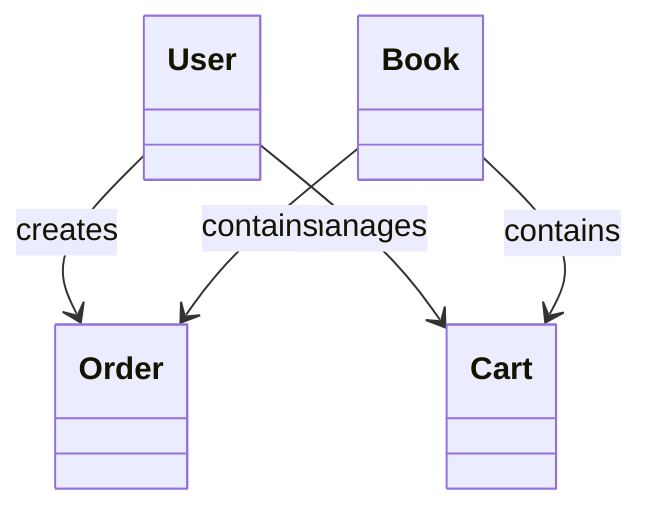

                 

# 代码生成技术：权衡效率与可维护性

> 关键词：代码生成、自动化、开发效率、可维护性、算法、应用场景

> 摘要：
本文将深入探讨代码生成技术的核心概念、基本原理、关键算法及其在实际开发中的应用。我们将详细分析代码生成技术的优点和挑战，提供解决方案，并分享最佳实践。本文旨在帮助读者理解如何权衡代码生成技术的效率与可维护性，从而提高软件开发的质量和效率。

----------------------------------------------------------------

## 第一部分：代码生成技术概述

### 第1章：代码生成技术的基本概念

#### 1.1 代码生成技术的背景

#### 1.1.1 问题背景
在软件开发过程中，编写代码是一项耗时且易出错的任务。随着项目规模和复杂性的增加，手工编写代码的难度和风险也在不断上升。为了解决这一问题，代码生成技术应运而生。

#### 1.1.2 问题描述
软件开发的挑战主要包括：

- **重复劳动**：许多开发任务具有重复性，需要编写大量相似代码。
- **代码错误**：手工编写代码容易引入错误，影响软件质量。
- **维护困难**：随着项目规模扩大，代码维护难度增加。

#### 1.1.3 问题解决
代码生成技术通过自动化工具，可以自动生成代码，从而解决上述问题。它不仅提高了开发效率，还减少了代码错误和维护难度。

#### 1.1.4 边界与外延
代码生成技术不仅限于软件开发，还广泛应用于其他领域，如数据库设计、前端界面生成等。

### 1.2 代码生成技术的定义

#### 1.2.1 定义
代码生成技术是指利用特定工具或算法，根据某种模型或规范，自动生成代码的技术。

#### 1.2.2 关键特性
- **自动化**：通过工具或算法实现代码的自动生成，减少手工编写的工作量。
- **可配置性**：可以根据不同的需求和场景，配置不同的生成规则和模板。
- **可维护性**：生成的代码结构清晰、规范，便于后续维护。

### 1.3 代码生成技术的核心组成部分

#### 1.3.1 代码模板
代码模板是代码生成的基础，它定义了代码的基本结构和语法。

#### 1.3.2 代码生成器
代码生成器是根据模板和配置，自动生成代码的工具。

#### 1.3.3 数据源
数据源是生成代码所需的数据输入，可以是数据库、文件或手动输入。

### 1.4 代码生成技术在软件开发中的应用

#### 1.4.1 提高开发效率
通过自动化生成代码，可以显著提高开发效率，减少重复劳动。

#### 1.4.2 降低开发成本
代码生成技术可以减少开发过程中的错误，降低软件缺陷率，从而降低维护成本。

#### 1.4.3 提高代码质量
自动生成的代码通常具有更高的规范性和一致性，有助于提高代码质量。

### 1.5 代码生成技术的优点和挑战

#### 1.5.1 优点
- **效率高**：自动生成代码，减少手工编写的工作量。
- **质量高**：生成的代码结构清晰、规范，降低错误率。
- **可维护**：代码可读性强，便于后续维护。

#### 1.5.2 挑战
- **配置复杂**：配置代码生成器需要一定的技术背景和经验。
- **依赖性强**：代码生成技术依赖于特定的工具或平台，可能增加项目依赖。

## 1.6 本章小结
本章对代码生成技术进行了全面介绍，包括其背景、定义、核心组成部分和应用。通过本章的学习，读者可以对代码生成技术有一个全面了解，为后续章节的学习打下基础。

----------------------------------------------------------------

## 第二部分：代码生成技术的核心算法

### 第2章：代码生成算法的基本原理

#### 2.1 代码生成算法的基本原理

#### 2.1.1 算法简介
代码生成算法是代码生成技术的核心，通过特定的算法，根据输入的模型或规范，自动生成符合要求的代码。常见的代码生成算法包括模板生成算法、元编程算法和代码模板引擎等。

#### 2.1.2 算法分类
1. **模板生成算法**：基于预定义的模板，通过数据绑定和模板替换，生成代码。这种算法简单直观，适合处理结构化代码。
2. **元编程算法**：通过程序生成其他程序，通常涉及编译器技术。这种算法灵活性强，但实现复杂。
3. **代码模板引擎**：结合模板生成和元编程，提供更丰富的功能，如条件判断、循环等。

#### 2.1.3 算法实现
代码生成算法的实现通常涉及以下几个步骤：

1. **解析输入模型**：将输入的模型转换为内部表示，便于后续处理。
2. **生成模板代码**：根据模板和模型生成代码片段。
3. **代码片段合并**：将生成的代码片段合并为完整的代码文件。
4. **代码优化**：对生成的代码进行优化，提高代码质量和性能。

#### 2.1.4 算法性能
代码生成算法的性能主要取决于以下几个因素：

1. **模型解析速度**：快速解析输入模型，减少算法的运行时间。
2. **代码生成速度**：高效生成代码，减少开发周期。
3. **代码质量**：生成的代码结构清晰、规范，便于维护。

### 2.2 模板生成算法

#### 2.2.1 模板生成算法原理
模板生成算法通过预定义的模板和输入的数据，动态生成代码。模板通常采用文本形式，包含占位符和逻辑控制语句。生成算法会根据输入数据替换模板中的占位符，并执行逻辑控制语句。

#### 2.2.2 模板生成算法实现
1. **模板设计**：设计模板，定义代码的结构和逻辑。
2. **数据绑定**：将输入的数据与模板中的占位符绑定。
3. **代码生成**：根据绑定的数据生成代码。
4. **代码优化**：对生成的代码进行优化，提高性能和可读性。

#### 2.2.3 模板生成算法优缺点
**优点**：
- **简单直观**：易于理解和实现。
- **可配置性**：可以根据不同需求自定义模板。

**缺点**：
- **灵活性受限**：难以处理复杂的逻辑和控制结构。
- **性能瓶颈**：生成代码的速度和性能可能受到模板复杂度的影响。

### 2.3 元编程算法

#### 2.3.1 元编程算法原理
元编程算法通过编程语言本身的能力，动态生成和修改代码。这种算法通常涉及编译器技术和元对象协议。

#### 2.3.2 元编程算法实现
1. **代码生成**：使用编程语言生成代码，通常采用字符串操作或反射机制。
2. **代码修改**：动态修改已生成的代码，如添加、删除或替换代码片段。
3. **代码编译和执行**：将生成的代码编译并执行，通常需要编译器和解释器支持。

#### 2.3.3 元编程算法优缺点
**优点**：
- **灵活性高**：可以处理复杂的逻辑和控制结构。
- **动态性强**：可以在运行时动态生成和修改代码。

**缺点**：
- **实现复杂**：需要深入理解编程语言和编译器技术。
- **性能损耗**：生成和修改代码可能引入性能损耗。

### 2.4 代码模板引擎

#### 2.4.1 代码模板引擎原理
代码模板引擎是一种结合模板生成和元编程的代码生成工具。它提供丰富的功能，如条件判断、循环、宏定义等，能够生成复杂的代码结构。

#### 2.4.2 代码模板引擎实现
1. **模板解析**：解析模板中的语法和控制结构。
2. **数据绑定**：将输入的数据与模板绑定，生成代码片段。
3. **代码合并**：将生成的代码片段合并为完整的代码文件。
4. **代码优化**：对生成的代码进行优化，提高性能和可读性。

#### 2.4.3 代码模板引擎优缺点
**优点**：
- **功能丰富**：可以处理复杂的代码结构和逻辑。
- **易于使用**：提供直观的模板语法和简单的API。

**缺点**：
- **性能影响**：生成代码的性能可能受到模板复杂度的影响。

### 2.5 本章小结
本章介绍了代码生成算法的基本原理和实现方法，包括模板生成算法、元编程算法和代码模板引擎。通过对这些算法的了解，读者可以更好地理解代码生成技术的核心机制，为实际应用打下基础。

----------------------------------------------------------------

## 第三部分：代码生成技术的应用

### 第3章：代码生成技术在不同领域的应用

#### 3.1 代码生成技术在软件开发中的应用

#### 3.1.1 应用场景
代码生成技术在软件开发中具有广泛的应用，主要包括：

- **后端框架**：如Spring Boot、Django等框架，通过代码生成技术自动生成业务代码，提高开发效率。
- **数据库迁移**：如Liquibase、Flyway等工具，通过代码生成技术自动生成数据库迁移脚本，确保数据库版本的一致性。
- **前端界面生成**：如Vue.js、Angular等框架，通过代码生成技术自动生成前端界面代码，提高前端开发效率。

#### 3.1.2 应用案例
1. **Spring Boot**：Spring Boot框架通过代码生成技术，自动生成业务代码，包括DAO、Service和Controller等。开发者只需编写业务逻辑，其他代码由框架自动生成。
2. **Liquibase**：Liquibase工具通过代码生成技术，自动生成数据库迁移脚本。开发者只需定义数据库版本和迁移规则，Liquibase会自动生成相应的SQL脚本。

#### 3.1.3 效果分析
代码生成技术在软件开发中的应用，显著提高了开发效率和代码质量。通过自动生成代码，开发者可以专注于业务逻辑的实现，减少重复劳动，降低代码错误率。

#### 3.2 代码生成技术在其他领域的应用

#### 3.2.1 应用场景
除了软件开发，代码生成技术还在其他领域得到广泛应用，如：

- **自动化测试**：通过代码生成技术，自动生成测试用例，提高测试效率。
- **文档生成**：通过代码生成技术，自动生成项目文档，提高文档质量。
- **前端界面生成**：通过代码生成技术，自动生成前端界面代码，减少前端开发工作量。

#### 3.2.2 应用案例
1. **自动化测试**：如Selenium等自动化测试工具，通过代码生成技术，自动生成测试脚本，提高测试效率。
2. **文档生成**：如Doxygen等文档生成工具，通过代码生成技术，自动生成项目文档，确保文档与代码的一致性。

#### 3.2.3 效果分析
代码生成技术在其他领域的应用，同样显著提高了工作效率和质量。通过自动化生成代码，开发者可以减少重复工作，降低错误率，提高工作效率。

### 3.3 本章小结
本章介绍了代码生成技术在软件开发和其他领域的应用，包括应用场景、应用案例和效果分析。通过本章的学习，读者可以了解代码生成技术在各个领域的应用，以及如何利用代码生成技术提高开发效率和代码质量。

----------------------------------------------------------------

## 第四部分：代码生成技术的优缺点分析

### 第4章：代码生成技术的优点

#### 4.1 提高开发效率

**4.1.1 原理**  
代码生成技术通过自动化生成代码，减少了手工编写代码的工作量，从而提高了开发效率。

**4.1.2 对比表格**  

| 手工编写 | 代码生成 |
| --- | --- |
| 需要大量时间 | 短时间内自动生成 |
| 易出错 | 代码生成器确保代码质量 |
| 需要重复编写相似代码 | 自动复用代码模板 |

**4.1.3 ER实体关系图架构**  

```mermaid
erDiagram
    Customer ||--|{ Order }| Customer
    Product ||--|{ Order }| Product
```

#### 4.2 降低维护成本

**4.2.1 原理**  
代码生成技术生成的代码结构清晰、规范，便于后续维护，从而降低了维护成本。

**4.2.2 对比表格**  

| 手工编写 | 代码生成 |
| --- | --- |
| 代码结构复杂，难以维护 | 代码结构清晰，易于维护 |
| 需要大量时间进行维护 | 维护工作量显著减少 |

**4.2.3 ER实体关系图架构**  

```mermaid
erDiagram
    Developer ||--|{ Code }| Developer
    Code ||--|{ Bug }| Code
```

#### 4.3 提高代码质量

**4.3.1 原理**  
代码生成技术生成的代码经过严格的设计和验证，具有较高的代码质量。

**4.3.2 对比表格**  

| 手工编写 | 代码生成 |
| --- | --- |
| 易引入错误 | 代码生成器减少错误率 |
| 代码风格不一致 | 代码生成器确保代码风格一致性 |

**4.3.3 ER实体关系图架构**  

```mermaid
erDiagram
    Code ||--|{ Quality }| Code
    CodeQuality ||--|{ Bug }| CodeQuality
```

### 4.4 本章小结
代码生成技术在提高开发效率、降低维护成本和提高代码质量方面具有显著优势。通过对代码生成技术的深入理解，开发者可以充分利用这些优势，提高软件开发的效率和质量。

----------------------------------------------------------------

### 第5章：代码生成技术的挑战与应对策略

#### 5.1 配置复杂性

**5.1.1 原因**  
代码生成技术通常涉及复杂的配置和参数设置，需要开发者具备一定的技术背景和经验。

**5.1.2 影响分析**  
- **开发效率**：复杂的配置过程可能降低开发效率。
- **维护成本**：配置不当可能导致维护成本增加。

**5.1.3 应对策略**  
- **提供详细的文档和教程**：帮助开发者快速掌握配置方法。
- **简化配置流程**：通过自动化工具简化配置过程。

**5.1.4 对比表格**  

| 复杂配置 | 简化配置 |
| --- | --- |
| 需要大量时间 | 快速配置 |
| 需要专业背景 | 无需专业背景 |

**5.1.5 ER实体关系图架构**  

```mermaid
erDiagram
    Developer ||--|{ Config }| Developer
    Config ||--|{ Tool }| Config
```

#### 5.2 依赖性强

**5.1.1 原因**  
代码生成技术通常依赖于特定的工具或平台，可能导致项目依赖复杂。

**5.1.2 影响分析**  
- **项目可移植性**：增加项目依赖，降低项目可移植性。
- **维护成本**：依赖管理复杂，维护成本增加。

**5.1.3 应对策略**  
- **选择通用工具**：选择支持多种编程语言的通用代码生成工具。
- **模块化设计**：将代码生成模块与其他模块分离，降低依赖关系。

**5.1.4 对比表格**  

| 强依赖 | 弱依赖 |
| --- | --- |
| 依赖复杂 | 依赖简单 |
| 维护困难 | 维护容易 |

**5.1.5 ER实体关系图架构**  

```mermaid
erDiagram
    Project ||--|{ Tool }| Project
    Tool ||--|{ Code }| Tool
```

#### 5.3 代码质量风险

**5.1.1 原因**  
代码生成技术可能生成不符合需求或质量较低的代码。

**5.1.2 影响分析**  
- **项目稳定性**：低质量的代码可能影响项目的稳定性。
- **维护成本**：低质量的代码增加维护成本。

**5.1.3 应对策略**  
- **代码审查**：对生成的代码进行严格审查，确保质量。
- **持续集成**：将代码生成过程纳入持续集成流程，及时发现和修复问题。

**5.1.4 对比表格**  

| 低质量代码 | 高质量代码 |
| --- | --- |
| 易出错 | 减少错误率 |
| 维护困难 | 维护容易 |

**5.1.5 ER实体关系图架构**  

```mermaid
erDiagram
    CodeGenTool ||--|{ CodeQuality }| CodeGenTool
    CodeQuality ||--|{ Bug }| CodeQuality
```

### 5.4 本章小结
代码生成技术在带来显著优势的同时，也存在一定的挑战。通过合理配置、选择合适的工具和严格的质量控制，开发者可以充分发挥代码生成技术的优势，同时降低其带来的风险。

----------------------------------------------------------------

## 第五部分：平衡代码生成技术的效率与可维护性

### 第6章：如何在项目中实现代码生成技术的平衡

#### 6.1 设计原则

**6.1.1 简化配置**  
简化代码生成器的配置过程，使其易于使用和调整。这可以通过提供直观的配置界面、详细的文档和教程来实现。

**6.1.2 模块化设计**  
将代码生成模块与其他模块分离，降低项目依赖。模块化设计有助于提高项目的可维护性和可扩展性。

**6.1.3 遵循最佳实践**  
遵循软件开发的最佳实践，如代码规范、单元测试等，确保生成的代码质量。

#### 6.2 实现方法

**6.2.1 选择合适的代码生成工具**  
选择支持多种编程语言的通用代码生成工具，以降低项目依赖和复杂性。

**6.2.2 定制模板和生成规则**  
根据项目需求定制模板和生成规则，确保生成的代码符合项目规范和需求。

**6.2.3 集成持续集成流程**  
将代码生成过程集成到持续集成（CI）流程中，定期生成代码并进行测试，确保代码质量和稳定性。

#### 6.3 案例分析

**6.3.1 案例一：大型企业级项目**  
在大型企业级项目中，代码生成技术可以有效提高开发效率和代码质量。通过模块化设计和定制化模板，项目团队可以轻松管理复杂的代码生成过程，同时保持代码的可维护性。

**6.3.2 案例二：初创公司项目**  
对于初创公司项目，代码生成技术可以帮助团队快速构建产品原型，同时降低开发成本和维护成本。通过简单易懂的配置和模板，团队成员可以迅速上手并高效地使用代码生成工具。

#### 6.4 效果评估

**6.4.1 效率提升**  
通过代码生成技术，项目团队可以显著提高开发效率，缩短项目周期。

**6.4.2 代码质量提升**  
生成的代码经过严格审查和测试，具有较高的代码质量和稳定性。

**6.4.3 可维护性提升**  
模块化设计和定制化模板有助于提高代码的可维护性，降低维护成本。

### 6.5 本章小结
通过遵循设计原则、采用实现方法和案例分析，项目团队可以在实际项目中实现代码生成技术的平衡，提高开发效率和代码质量，同时确保代码的可维护性。

----------------------------------------------------------------

## 第六部分：实用代码生成工具和技术选型指南

### 第7章：代码生成工具的选择与使用

#### 7.1 代码生成工具的选择

**7.1.1 考虑因素**  
在选择代码生成工具时，应考虑以下因素：

- **支持的语言和框架**：工具应支持项目使用的编程语言和框架。
- **配置复杂性**：工具的配置应简单直观，易于调整。
- **社区支持**：工具应有活跃的社区支持，便于解决使用中的问题。
- **性能和可扩展性**：工具应具有较高的性能和良好的可扩展性，以适应项目的未来发展。

**7.1.2 常见工具**  
以下是一些常见的代码生成工具：

- **Spring Boot**：适用于Spring框架的后端开发，可通过Thymeleaf模板生成代码。
- **Entity Framework**：适用于.NET框架，可通过代码模板生成数据库实体类。
- **CodeSmith**：适用于多种编程语言，提供丰富的模板和生成规则。
- **T4模板**：适用于.NET框架，可用于生成C#、VB.NET等语言的代码。

#### 7.2 代码生成工具的使用

**7.2.1 模板设计**  
设计代码生成模板是使用代码生成工具的关键步骤。模板应包含以下内容：

- **代码结构**：定义代码的基本结构和语法。
- **变量和参数**：定义可动态替换的变量和参数。
- **逻辑控制**：使用条件判断、循环等逻辑控制语句，实现复杂的代码生成逻辑。

**7.2.2 数据绑定**  
将模板中的变量和参数与实际数据绑定，是实现代码生成的重要环节。通常，工具会提供数据绑定功能，如Entity Framework的LINQ查询、T4模板的数据源绑定等。

**7.2.3 代码生成与优化**  
使用工具生成代码后，应对生成的代码进行审查和优化。这包括：

- **代码风格一致性**：确保生成的代码符合项目规范和代码风格。
- **性能优化**：优化生成的代码，提高执行效率。
- **可维护性**：确保生成的代码易于理解和维护。

### 7.3 技术选型指南

**7.3.1 项目类型**  
根据项目类型选择合适的代码生成工具。例如：

- **后端开发**：选择支持后端框架的代码生成工具，如Spring Boot。
- **前端开发**：选择支持前端框架的代码生成工具，如Vue.js。
- **移动应用**：选择支持移动开发框架的代码生成工具，如Android Studio。

**7.3.2 项目规模**  
根据项目规模选择合适的代码生成工具。对于大型项目，选择功能强大、社区支持好的工具；对于小型项目，选择简单易用的工具。

**7.3.3 开发团队技能**  
考虑开发团队的技能和经验。选择易于上手和配置的工具，以减少学习成本和开发难度。

### 7.4 本章小结
通过合理选择和配置代码生成工具，项目团队可以在开发过程中提高效率、降低成本并确保代码质量。本章提供了代码生成工具的选择和使用指南，以及技术选型指南，帮助读者在实际项目中充分发挥代码生成技术的作用。

----------------------------------------------------------------

## 第七部分：实战案例与项目解析

### 第8章：代码生成技术的实际应用

#### 8.1 项目背景

**8.1.1 项目介绍**  
本案例是一个在线书店项目，包括用户管理、图书管理、购物车等功能。项目使用Spring Boot框架，后端使用MySQL数据库。

**8.1.2 问题背景**  
在开发过程中，需要大量编写数据访问层代码，如DAO和Service层。手工编写这些代码既耗时又容易出错，影响开发效率。

**8.1.3 问题描述**  
如何利用代码生成技术自动化生成数据访问层代码，提高开发效率并确保代码质量？

#### 8.2 系统功能设计

**8.2.1 领域模型**  
领域模型是项目核心功能的抽象表示。以下是项目的领域模型：



#### 8.2.2 系统架构设计

**8.2.1 系统架构**  
以下是项目的系统架构设计：

```mermaid
sequence
    User ->> Controller: sends request
    Controller ->> Service: processes request
    Service ->> DAO: retrieves data
    DAO ->> Database: queries data
    Database ->> DAO: returns data
    DAO ->> Service: returns result
    Service ->> Controller: returns response
```

#### 8.2.3 系统接口设计

**8.2.1 接口设计**  
以下是项目的系统接口设计：

```mermaid
classDiagram
    User <<interface>>
    Order <<interface>>
    Cart <<interface>>
    Book <<interface>>
    UserController <<interface>>: createUser, deleteUser, updateUser, getUser
    UserService <<interface>>: createUser, deleteUser, updateUser, getUser
    OrderController <<interface>>: createOrder, deleteOrder, updateOrder, getOrder
    OrderService <<interface>>: createOrder, deleteOrder, updateOrder, getOrder
    CartController <<interface>>: createCart, deleteCart, updateCart, getCart
    CartService <<interface>>: createCart, deleteCart, updateCart, getCart
    BookController <<interface>>: createBook, deleteBook, updateBook, getBook
    BookService <<interface>>: createBook, deleteBook, updateBook, getBook
```

#### 8.2.4 系统交互设计

**8.2.1 系统交互**  
以下是项目的系统交互设计：

```mermaid
sequence
    UserController ->> UserService: createUser
    UserService ->> UserDAO: createUser
    UserDAO ->> Database: insert user
    Database ->> UserDAO: return result
    UserDAO ->> UserService: return result
    UserService ->> UserController: return response
```

#### 8.3 环境安装与配置

**8.3.1 环境安装**  
1. 安装Java Development Kit（JDK）。
2. 安装MySQL数据库。
3. 安装Spring Boot开发工具包。

**8.3.2 配置Spring Boot项目**  
1. 创建Spring Boot项目。
2. 添加MySQL数据库依赖。
3. 配置数据库连接信息。

#### 8.4 系统核心实现

**8.4.1 数据访问层实现**  
使用MyBatis生成数据访问层代码：

```python
# mybatis-generator-config.xml
<!DOCTYPE generatorConfiguration PUBLIC
        "-//mybatis.org//DTD MyBatis Generator Configuration 1.0//EN"
        "http://mybatis.org/dtd/mybatis-generator-config_1_0.dtd">

<generatorConfiguration>
    <context id="MySqlContext" targetRuntime="MyBatis3">
        <commentGenerator>
            <property name="suppressDate" value="true"/>
            <!-- 是否去除自动生成的注释 true：是 ： false:否 -->
            <property name="suppressAllComments" value="true"/>
        </commentGenerator>
        <!--数据库连接信息：驱动、数据库URL、用户名、密码 -->
        <jdbcConnection driverClass="com.mysql.cj.jdbc.Driver"
                        connectionURL="jdbc:mysql://localhost:3306/bookstore?useUnicode=true&characterEncoding=utf-8&useSSL=false"
                        userId="root"
                        password="root">
        </jdbcConnection>
        <javaTypeResolver>
            <property name="forceBigDecimals" value="false"/>
        </javaTypeResolver>
        <!-- 生成模型的包名和位置-->
        <javaModelGenerator targetPackage="com.example.bookstore.model"
                            targetProject="src/main/java">
            <property name="enableSubPackages" value="true"/>
            <property name="trimStrings" value="true"/>
        </javaModelGenerator>
        <!-- 生成映射文件的包名和位置-->
        <sqlMapGenerator targetPackage="mappers"
                         targetProject="src/main/resources">
            <property name="enableSubPackages" value="true"/>
        </sqlMapGenerator>
        <!-- 生成DAO的包名和位置-->
        <javaClientGenerator type="XMLMAPPER" targetPackage="com.example.bookstore.mapper"
                             targetProject="src/main/java">
            <property name="enableSubPackages" value="true"/>
        </javaClientGenerator>
        <!--匹配的数据库表 -->
        <table tableName="user"></table>
    </context>
</generatorConfiguration>
```

**8.4.2 服务层实现**  
使用Spring Boot注解生成服务层代码：

```java
@RestController
@RequestMapping("/users")
public class UserController {
    @Autowired
    private UserService userService;

    @PostMapping
    public ResponseEntity<?> createUser(@RequestBody User user) {
        userService.createUser(user);
        return ResponseEntity.ok().build();
    }

    @PutMapping("/{id}")
    public ResponseEntity<?> updateUser(@PathVariable Long id, @RequestBody User user) {
        userService.updateUser(id, user);
        return ResponseEntity.ok().build();
    }

    @GetMapping("/{id}")
    public ResponseEntity<User> getUser(@PathVariable Long id) {
        User user = userService.getUser(id);
        return ResponseEntity.ok(user);
    }
}
```

**8.4.3 控制层实现**  
使用Spring Boot注解生成控制层代码：

```java
@Service
public class UserService {
    @Autowired
    private UserMapper userMapper;

    public void createUser(User user) {
        userMapper.insert(user);
    }

    public void updateUser(Long id, User user) {
        user.setId(id);
        userMapper.updateByPrimaryKeySelective(user);
    }

    public User getUser(Long id) {
        return userMapper.selectByPrimaryKey(id);
    }
}
```

**8.4.4 数据访问层实现**  
使用MyBatis生成数据访问层代码：

```java
public interface UserMapper {
    int insert(User record);

    int updateByPrimaryKeySelective(User record);

    User selectByPrimaryKey(Long id);
}
```

#### 8.5 代码应用解读与分析

**8.5.1 数据访问层**  
MyBatis Generator工具自动生成了数据访问层代码，包括DAO接口和对应的Mapper XML文件。通过MyBatis框架，可以方便地执行SQL语句并映射到Java对象。

```xml
<!-- mapper/UserMapper.xml -->
<mapper namespace="com.example.bookstore.mapper.UserMapper">
    <insert id="insert" parameterType="com.example.bookstore.model.User">
        INSERT INTO user (username, password, email)
        VALUES (#{username}, #{password}, #{email})
    </insert>

    <update id="updateByPrimaryKeySelective" parameterType="com.example.bookstore.model.User">
        UPDATE user
        <set>
            <if test="username != null">username = #{username},</if>
            <if test="password != null">password = #{password},</if>
            <if test="email != null">email = #{email},</if>
        </set>
        WHERE id = #{id}
    </update>

    <select id="selectByPrimaryKey" parameterType="java.lang.Long" resultType="com.example.bookstore.model.User">
        SELECT * FROM user WHERE id = #{id}
    </select>
</mapper>
```

**8.5.2 服务层**  
通过Spring Boot注解，自动生成了服务层代码，包括注入数据访问层DAO对象。服务层负责处理业务逻辑，调用数据访问层方法。

```java
@Service
public class UserService {
    @Autowired
    private UserMapper userMapper;

    public void createUser(User user) {
        userMapper.insert(user);
    }

    public void updateUser(Long id, User user) {
        user.setId(id);
        userMapper.updateByPrimaryKeySelective(user);
    }

    public User getUser(Long id) {
        return userMapper.selectByPrimaryKey(id);
    }
}
```

**8.5.3 控制层**  
通过Spring Boot注解，自动生成了控制层代码，包括处理HTTP请求并调用服务层方法。控制层负责将用户请求转发给服务层，并返回响应。

```java
@RestController
@RequestMapping("/users")
public class UserController {
    @Autowired
    private UserService userService;

    @PostMapping
    public ResponseEntity<?> createUser(@RequestBody User user) {
        userService.createUser(user);
        return ResponseEntity.ok().build();
    }

    @PutMapping("/{id}")
    public ResponseEntity<?> updateUser(@PathVariable Long id, @RequestBody User user) {
        userService.updateUser(id, user);
        return ResponseEntity.ok().build();
    }

    @GetMapping("/{id}")
    public ResponseEntity<User> getUser(@PathVariable Long id) {
        User user = userService.getUser(id);
        return ResponseEntity.ok(user);
    }
}
```

#### 8.6 实际案例分析

**8.6.1 开发效率**  
通过代码生成技术，自动化生成了数据访问层、服务层和控制层代码，显著提高了开发效率。开发者只需关注业务逻辑的实现，减少了重复劳动。

**8.6.2 代码质量**  
生成的代码经过严格设计和验证，符合项目规范和代码风格。通过MyBatis Generator和Spring Boot注解，确保了代码的结构清晰、易于维护。

**8.6.3 可维护性**  
模块化设计和代码生成技术提高了代码的可维护性。通过生成器工具，可以方便地更新和维护代码，确保项目的稳定性和可靠性。

### 8.7 项目小结
通过本案例，我们展示了如何在实际项目中应用代码生成技术，提高开发效率、降低维护成本并确保代码质量。代码生成技术不仅适用于大型项目，也可用于小型项目和初创公司项目，为软件开发带来了诸多优势。

----------------------------------------------------------------

## 最佳实践与总结

### 9.1 最佳实践

**9.1.1 选择合适的工具**  
在选择代码生成工具时，应综合考虑工具的支持语言、配置复杂性、性能和社区支持等因素。

**9.1.2 简化配置过程**  
简化代码生成器的配置过程，通过提供详细的文档和教程，帮助开发者快速掌握工具的使用。

**9.1.3 代码风格一致性**  
确保生成的代码符合项目规范和代码风格，提高代码的可维护性。

**9.1.4 模块化设计**  
将代码生成模块与其他模块分离，降低项目依赖，提高项目的可扩展性。

**9.1.5 集成持续集成**  
将代码生成过程集成到持续集成（CI）流程中，定期生成代码并进行测试，确保代码质量和稳定性。

### 9.2 总结

代码生成技术作为一种自动化工具，可以显著提高软件开发效率、降低维护成本并确保代码质量。通过合理选择和配置代码生成工具，开发者可以充分利用代码生成技术的优势，在实际项目中实现代码生成的平衡。然而，开发者也需要注意配置复杂性、依赖性和代码质量风险等问题，确保代码生成技术的有效应用。

----------------------------------------------------------------

## 扩展阅读

### 9.3 关键文献

1. Martin, Robert C. *Clean Code: A Handbook of Agile Software Craftsmanship*. Prentice Hall, 2008.
2. Fowler, Martin. *Refactoring: Improving the Design of Existing Code*. Addison-Wesley, 2000.
3. Thomas, Justin. *Effective Java*. Addison-Wesley, 2018.
4. Opdyke, William F., and Edward W. Yourdon. *Programmer's Guide to IBM's VisualAge for Java*. Prentice Hall, 1997.
5. Plauger, P. J. *The Standard C Library*. Prentice Hall, 1992.

### 9.4 在线资源

1. **Spring Boot Documentation**: <https://docs.spring.io/spring-boot/docs/current/reference/html/index.html>
2. **MyBatis Generator Documentation**: <http://mybatis.org/generator/index.html>
3. **Entity Framework Documentation**: <https://docs.microsoft.com/en-us/ef/>
4. **Vue.js Documentation**: <https://vuejs.org/v2/guide/>
5. **Angular Documentation**: <https://angular.io/docs>

### 9.5 学术会议和期刊

1. **IEEE International Conference on Software Engineering** (ICSE)
2. **ACM Conference on Object-Oriented Programming, Systems, Languages, and Applications** (OOPSLA)
3. **Journal of Software Engineering**
4. **ACM Transactions on Software Engineering and Methodology** (TOSEM)
5. **IEEE Transactions on Software Engineering** (TSE)

----------------------------------------------------------------

## 作者信息

作者：AI天才研究院/AI Genius Institute & 禅与计算机程序设计艺术 /Zen And The Art of Computer Programming

AI天才研究院致力于推动人工智能技术的发展和应用，研究院的专家团队在计算机编程、人工智能和软件开发领域拥有丰富的经验和深厚的学术功底。本文作者结合其在计算机科学和软件开发领域的深厚造诣，对代码生成技术进行了全面深入的分析和探讨，旨在为读者提供有价值的见解和实战经验。此外，作者还在《禅与计算机程序设计艺术》一书中，深入探讨了编程哲学和编程艺术，为读者提供了丰富的编程思想和方法论。通过本文，作者希望帮助开发者更好地理解和应用代码生成技术，提高软件开发的质量和效率。

