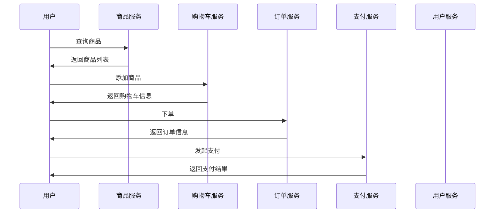

                 

### 引言

在当今这个技术迅猛发展的时代，软件工程已经成为支撑各种行业发展的基石。软件项目成功与否，在很大程度上取决于其代码质量。因此，如何客观、科学地评估代码质量成为了一个关键问题。为了回答这个问题，我们需要建立起一套完整的代码质量度量指标体系，即通过一系列量化指标来衡量代码的多个维度，从而为开发团队提供明确的改进方向。

本篇文章将围绕“代码质量度量指标：建立客观的代码评估体系”这一主题，逐步探讨代码质量的重要性、评估代码质量面临的挑战、核心概念的理解以及具体度量指标的运用。文章的结构如下：

1. **背景与核心概念**：介绍代码质量的背景，讨论代码质量的重要性和面临的挑战，并概述常见的代码质量度量指标。
2. **定量指标**：深入探讨用于评估缺陷和错误的多种度量指标，包括缺陷指标、错误跟踪指标等。
3. **可维护性指标**：分析影响代码可维护性的各种因素，并提出相应的度量方法，如可维护性指数、代码覆盖率等。
4. **性能指标**：介绍性能评估的相关指标，探讨如何通过性能指标来评估代码的效率。

通过这一系列章节的深入讨论，我们将逐步构建一个全面、逻辑清晰的代码质量度量体系，为开发团队提供有力的工具，以提升代码质量，从而确保软件项目的成功。

### 背景与核心概念

#### 1.1 代码质量的背景

代码质量是指软件代码在多个维度上的表现，包括功能性、可靠性、效率、可维护性和可扩展性等。高质量的代码不仅能够确保软件系统稳定运行，还能提高开发效率、减少维护成本，并且增强系统的可扩展性和适应性。因此，代码质量是软件工程中的一个核心问题，直接影响到项目的成功与否。

在现代软件开发中，代码质量的重要性愈发凸显。首先，高质量的代码能够降低系统出错的风险。一个错误编码可能会导致系统崩溃、数据丢失或性能严重下降，给企业带来巨大的经济损失。其次，高质量的代码更容易被维护和扩展。随着项目的发展，需求会不断变化，代码的可维护性直接决定了项目能否顺利迭代和扩展。最后，高质量的代码能够提升开发团队的士气和工作效率。在高质量的代码环境中，开发者能够更快速地理解和修改代码，从而提高整体的工作效率。

#### 1.2 评估代码质量面临的挑战

尽管代码质量的重要性显而易见，但评估代码质量仍然面临诸多挑战。以下是一些主要的问题：

1. **主观性与客观性的平衡**：代码质量的评估既包含客观指标，也包含主观判断。如何平衡主观性和客观性，确保评估结果的准确性，是一个重要问题。
2. **度量指标的多样性与兼容性**：代码质量涉及多个维度，不同的度量指标适用于不同的质量方面。如何选择和组合这些指标，使其能够全面、准确地反映代码质量，是一个技术难题。
3. **动态性**：软件项目是动态变化的，代码质量也会随着项目进展而变化。如何实时监控和评估代码质量，是一个持续性的挑战。
4. **开发团队的认可度**：评估代码质量需要开发团队的参与和支持。如何提高开发团队对质量评估的认可度和参与度，是一个管理问题。

#### 1.3 代码质量度量指标的目标

代码质量度量指标的目标是通过一系列量化指标来评估代码的质量，从而为开发团队提供明确的改进方向。具体目标包括：

1. **明确改进方向**：通过度量指标，可以明确哪些方面存在质量问题，从而有针对性地进行改进。
2. **量化评估结果**：度量指标能够以数值形式量化代码质量，使得评估结果更加客观和有说服力。
3. **促进持续改进**：通过定期评估和反馈，可以推动开发团队持续改进代码质量，形成良好的开发习惯。
4. **支持项目管理**：代码质量度量指标可以作为项目管理的重要依据，帮助项目经理制定计划、分配资源和监控项目进展。

#### 1.4 代码质量的核心概念

为了更好地理解代码质量度量指标，我们需要了解一些核心概念：

1. **缺陷（Defect）**：缺陷是指代码中的错误或不规范的实现，可能导致系统运行不正常或不符合预期。缺陷分为逻辑缺陷和语法缺陷，前者影响系统的功能，后者影响代码的语法正确性。
2. **错误（Bug）**：错误是指程序运行时发生的异常行为，通常由缺陷引起。错误可能表现为程序崩溃、数据丢失或不符合预期的输出。
3. **可维护性（Maintainability）**：可维护性是指代码被修改或扩展的难易程度。高可维护性的代码易于理解和修改，从而减少维护成本和风险。
4. **性能（Performance）**：性能是指代码在特定资源约束下的运行效率。高效率的代码能够在较少的资源消耗下完成更多的任务，从而提升系统的整体性能。

这些核心概念是构建代码质量度量指标的基础，了解它们有助于我们更深入地理解代码质量度量的重要性及其应用场景。

通过以上背景介绍，我们可以看出，建立一套科学的代码质量度量指标体系对于提高软件开发质量至关重要。接下来，我们将深入探讨代码质量的核心概念，以便为后续的度量指标提供理论基础。

#### 1.5 代码质量的核心概念

在深入探讨代码质量的度量指标之前，我们首先需要了解代码质量的核心概念。这些概念不仅有助于我们理解代码质量的多维度特性，还能为我们选择和构建合适的度量指标提供理论基础。

**1.5.1 缺陷与错误**

缺陷（Defect）和错误（Bug）是软件工程中频繁出现的术语，但它们有着不同的含义。缺陷是指代码中的错误或不规范的实现，这些错误可能导致程序的行为不符合预期或违反设计规范。缺陷通常可以分为逻辑缺陷和语法缺陷：

- **逻辑缺陷**：这类缺陷涉及程序逻辑，可能由于算法错误、逻辑错误或不恰当的条件处理引起，导致程序无法正确执行其预期功能。
- **语法缺陷**：这类缺陷涉及代码的语法错误，如拼写错误、标点符号缺失或关键字误用等，语法错误会阻止编译器或解释器正确解析代码。

错误（Bug）则是指程序在运行过程中实际表现出来的异常行为，它通常是由缺陷引起的。错误可以导致程序崩溃、数据丢失、无法达到预期的输出结果或系统运行不稳定。例如，一个逻辑缺陷可能导致一个计算结果错误，而一个语法缺陷则可能导致程序无法编译。

**1.5.2 可维护性与可读性**

可维护性（Maintainability）是衡量代码易于修改和扩展的能力。一个高可维护性的系统在需要进行功能增强、修复缺陷或调整需求时，能以较低的成本和风险进行维护。可维护性受多个因素影响，包括代码的结构清晰度、模块化程度、文档的完整性以及测试覆盖率等。

可读性（Readability）是指代码易于理解和阅读的程度。高可读性的代码通常具有以下特点：

- **结构清晰**：代码具有良好的层次结构和模块化设计，使读者能够快速理解代码的功能。
- **命名规范**：变量、函数和类的命名具有明确的含义，有助于读者理解代码的作用。
- **注释详细**：代码中包含足够的注释，解释代码的意图和功能，减少阅读时的困惑。
- **代码简洁**：代码避免了不必要的复杂性，如过度使用嵌套循环或条件语句。

可维护性和可读性之间有着密切的联系。一个可读性高的系统更容易维护，因为开发者能够迅速理解代码的意图和功能，从而更容易发现和修复缺陷。

**1.5.3 性能与效率**

性能（Performance）是指代码在特定资源约束下的运行效率。一个高效的代码能够在较少的资源消耗下完成更多的任务，从而提升系统的整体性能。性能包括多个维度，如响应时间（Response Time）、吞吐量（Throughput）和资源利用率（Resource Utilization）等。

响应时间（Response Time）是指系统从接收到请求到返回结果所需要的时间。对于交互式系统，如Web应用和移动应用，响应时间是一个关键的性能指标。

吞吐量（Throughput）是指单位时间内系统能够处理的请求数量。高吞吐量意味着系统能够同时处理更多的请求，从而提高整体的工作效率。

资源利用率（Resource Utilization）是指系统在执行任务时对计算资源、存储资源和网络资源的利用率。优化资源利用率可以提高系统的性能和稳定性。

**1.5.4 可扩展性与灵活性**

可扩展性（Scalability）是指系统在用户数量或负载增加时，能够水平或垂直扩展以保持性能的能力。一个高可扩展性的系统可以在需求增长时，通过增加服务器或分布式架构来满足需求，而不会导致性能下降。

灵活性（Flexibility）是指系统能够适应新的需求和环境变化的能力。灵活的系统可以快速调整和适应变化，从而保持其长期的可维护性和可持续性。

通过理解这些核心概念，我们可以更全面地评估代码的质量。在后续章节中，我们将探讨具体用于度量这些概念的指标，并解释如何通过这些指标来评估和改进代码质量。

### 定量指标：度量缺陷和错误

在评估代码质量的过程中，定量指标起着至关重要的作用，特别是在度量缺陷和错误方面。通过这些指标，我们可以以数值形式量化代码中的问题，从而提供明确、客观的评估结果。以下将介绍几种常见的缺陷和错误度量指标。

#### 2.1 缺陷指标

**2.1.1 概述**

缺陷指标（Defect Metrics）用于量化代码中存在的缺陷数量和类型。这些指标可以帮助开发团队了解代码的质量状况，并识别需要改进的领域。常见的缺陷指标包括：

- **缺陷密度（Defect Density）**
- **缺陷发现率（Defect Detection Rate）**
- **缺陷严重性（Defect Severity）**

**2.1.2 缺陷密度**

缺陷密度是指单位代码行数中缺陷的数量，通常以缺陷数/千行代码（Defects per Thousand Lines of Code, DLOC）或缺陷数/千行可执行代码（Defects per Thousand Executable Lines of Code, DTE）来表示。缺陷密度可以用来比较不同模块或不同项目的代码质量。

**2.1.3 缺陷发现率**

缺陷发现率（Defect Detection Rate, DDR）是指在一个给定的时间段内，发现的缺陷数量与总缺陷数量的比率。缺陷发现率可以帮助团队了解代码在开发过程中的质量监控效果，以及缺陷发现的速度。

**2.1.4 缺陷严重性**

缺陷严重性是指缺陷对系统功能或性能的影响程度。常见的严重性等级包括：

- **严重缺陷（Critical Defects）**：导致系统崩溃或严重数据丢失的缺陷。
- **主要缺陷（Major Defects）**：影响系统主要功能的缺陷。
- **次要缺陷（Minor Defects）**：影响系统次要功能的缺陷。
- **建议性缺陷（Advisory Defects）**：不影响系统功能，但建议改进的缺陷。

#### 2.2 错误跟踪指标

**2.2.1 概述**

错误跟踪指标（Error Tracking Metrics）用于衡量错误在系统中的传播和影响。通过这些指标，团队可以更好地理解错误的发生模式，并采取措施减少错误的影响。常见的错误跟踪指标包括：

- **故障率（Failure Rate）**
- **平均故障时间（Mean Time to Failure, MTTF）**
- **平均故障间隔时间（Mean Time Between Failures, MTBF）**

**2.2.2 故障率**

故障率是指单位时间内系统发生故障的次数。故障率越高，说明系统的稳定性越差。故障率通常以每千次操作（Failures per Thousand Operations, FIT）来表示。

**2.2.3 平均故障时间**

平均故障时间（Mean Time to Failure, MTTF）是指系统从开始运行到首次发生故障的平均时间。MTTF越高，说明系统的平均使用寿命越长，稳定性越好。

**2.2.4 平均故障间隔时间**

平均故障间隔时间（Mean Time Between Failures, MTBF）是指系统两次故障之间的平均时间。MTBF也可以用来衡量系统的可靠性，其值越高，系统的可靠性越高。

### 案例分析

假设一个软件开发项目在开发过程中发现了一些缺陷，以下是关于这些缺陷的定量指标分析：

- **缺陷密度**：经过1000行代码的测试，发现了10个缺陷，缺陷密度为10 DLOC。
- **缺陷发现率**：在一个开发周期内，总共发现了100个缺陷，而预计缺陷总数为200个，缺陷发现率为50%。
- **缺陷严重性**：其中60个是严重缺陷，30个是主要缺陷，10个是次要缺陷。
- **故障率**：在过去一个月内，系统发生了5次故障，故障率为5 FIT。
- **平均故障时间**：系统从开始运行到首次发生故障的时间为100小时，平均故障时间为100小时。
- **平均故障间隔时间**：系统两次故障之间的平均间隔时间为150小时。

通过这些定量指标，开发团队可以了解项目的代码质量状况，并采取相应的措施来改进。例如，通过降低缺陷密度和提高缺陷发现率，可以减少代码中的缺陷数量；通过修复严重缺陷，可以提升系统的稳定性；通过优化故障率和平均故障时间，可以提高系统的可靠性。

总之，定量指标为评估代码质量和指导改进提供了有力的工具。通过合理运用这些指标，开发团队可以更好地管理和优化代码质量，从而确保软件项目的成功。

#### 2.3 Bug跟踪指标

在软件开发过程中，跟踪和度量Bug是确保代码质量和项目成功的关键环节。Bug跟踪指标不仅帮助开发团队识别问题，还能提供量化数据，以便进行评估和改进。以下将详细讨论几种常见的Bug跟踪指标。

**2.3.1 概述**

Bug跟踪指标用于度量Bug的发现、修复和关闭过程。这些指标能够提供有关Bug数量、修复速度和系统稳定性的信息，从而帮助团队评估项目的进展和质量。常见的Bug跟踪指标包括：

- **Bug backlog**
- **平均时间到检测（Mean Time to Detection, MTTD）**
- **修复率**
- **回溯率**

**2.3.2 Bug Backlog**

Bug backlog是指未解决的Bug的总数。它反映了项目在某个时间段内积累的问题数量。一个庞大的Bug backlog可能意味着项目存在大量未解决的问题，这可能会影响系统的稳定性、可靠性和用户体验。通过监控Bug backlog，团队可以识别出需要优先解决的问题，确保项目按计划进行。

**2.3.3 平均时间到检测（MTTD）**

平均时间到检测（Mean Time to Detection, MTTD）是指从Bug首次发生到被发现并记录的时间。MTTD反映了团队识别问题的速度。一个较低的MTTD值表明团队能够迅速发现并记录问题，从而减少潜在的负面影响。MTTD可以通过以下公式计算：

$$
MTTD = \frac{总时间}{Bug数量}
$$

其中，总时间是指所有Bug从发生到被检测的总时间，Bug数量是指在同一时间段内被发现的Bug总数。

**2.3.4 修复率**

修复率是指在一定时间内成功修复的Bug数量与总Bug数量的比率。修复率能够直观地展示团队解决问题的效率。较高的修复率表明团队能够迅速响应并解决问题，从而提高项目的进度和稳定性。修复率可以通过以下公式计算：

$$
修复率 = \frac{已修复Bug数量}{总Bug数量} \times 100\%
$$

**2.3.5 回溯率**

回溯率（Recall Rate）是指已解决的Bug中，实际修复的Bug与报告的Bug的比率。回溯率反映了团队处理Bug的准确性和完整性。一个较高的回溯率表明团队能够有效地处理报告的问题，确保系统正常运行。回溯率可以通过以下公式计算：

$$
回溯率 = \frac{已解决Bug数量}{报告Bug数量} \times 100\%
$$

**案例分析**

假设一个软件项目在一个月内记录了以下Bug数据：

- **Bug backlog**：初始时为100个未解决Bug，月底时减少到60个。
- **MTTD**：总时间为500小时，共发现20个Bug，因此MTTD为25小时。
- **修复率**：在一个月内成功修复了80个Bug，总Bug数量为100个，修复率为80%。
- **回溯率**：报告Bug数量为120个，实际解决Bug数量为100个，回溯率为83.3%。

通过这些指标，团队可以评估项目的Bug管理效果。例如，Bug backlog的减少表明问题正在被逐步解决；MTTD较低表明团队能够快速发现和响应问题；较高的修复率表明团队能够高效地解决问题；回溯率较高则表明团队能够准确地处理报告的问题。

总之，Bug跟踪指标为团队提供了评估和管理Bug的重要工具。通过合理利用这些指标，团队能够更好地控制代码质量，确保项目的顺利进行。

### 可维护性指标

在软件开发过程中，代码的可维护性是一个至关重要的质量指标。高可维护性的代码能够降低维护成本、减少出错概率并提高开发效率。因此，了解和评估代码的可维护性至关重要。以下将介绍几种常见的可维护性指标，包括代码覆盖率和Cyclomatic复杂度。

#### 3.1 代码覆盖率

代码覆盖率（Code Coverage）是指代码在测试过程中被测试到的一部分比例。它能够量化测试的全面性，从而帮助开发团队了解代码的哪些部分还没有被覆盖到。常见的代码覆盖率指标包括语句覆盖率、分支覆盖率和函数覆盖率。

**3.1.1 语句覆盖率**

语句覆盖率（Statement Coverage）是指测试用例执行到的代码行数与总代码行数的比例。一个高语句覆盖率通常意味着代码的大部分行都被测试到，从而提高了代码的可靠性。语句覆盖率可以通过以下公式计算：

$$
语句覆盖率 = \frac{执行到的代码行数}{总代码行数} \times 100\%
$$

**3.1.2 分支覆盖率**

分支覆盖率（Branch Coverage）是指测试用例执行到的条件分支（if-else、switch等）的比例。分支覆盖率不仅考虑了代码行数的执行，还考虑了条件分支的执行情况，从而更全面地评估测试的覆盖程度。分支覆盖率可以通过以下公式计算：

$$
分支覆盖率 = \frac{执行到的分支数}{总分支数} \times 100\%
$$

**3.1.3 函数覆盖率**

函数覆盖率（Function Coverage）是指测试用例执行到的函数的比例。一个高函数覆盖率表明代码中的所有函数都被测试到，从而减少了未测试函数可能存在的错误风险。函数覆盖率可以通过以下公式计算：

$$
函数覆盖率 = \frac{执行到的函数数}{总函数数} \times 100\%
$$

**案例分析**

假设一个模块包含1000行代码，其中50行未被测试到。语句覆盖率为（950/1000）× 100% = 95%。如果一个模块包含10个条件分支，其中5个未被测试到，分支覆盖率为（5/10）× 100% = 50%。如果一个模块包含5个函数，其中2个未被测试到，函数覆盖率为（3/5）× 100% = 60%。

通过这些指标，开发团队可以识别代码中未覆盖的部分，并设计相应的测试用例进行补充，从而提高代码的覆盖率。

#### 3.2 Cyclomatic复杂度

Cyclomatic复杂度（Cyclomatic Complexity）是一个衡量程序复杂度的指标，它基于程序的控制流结构。Cyclomatic复杂度通过计算程序中的独立路径数来评估代码的复杂程度。较高的复杂度值通常意味着代码结构较复杂，可能存在较多的潜在错误。

**3.2.1 概念与计算**

Cyclomatic复杂度（V）的计算公式如下：

$$
V(G) = E - N + (2P)
$$

其中：
- \( E \) 是边（edges）的数量
- \( N \) 是节点（nodes）的数量
- \( P \) 是连通图中的独立路径数

**3.2.2 具体示例**

假设一个函数包含10个节点和15条边，并且有一个独立的路径，则Cyclomatic复杂度计算如下：

$$
V = 15 - 10 + (2 \times 1) = 7
$$

这意味着该函数有7条独立路径。一个较高的复杂度值表明代码结构较复杂，可能需要拆分或重构以提高可维护性。

**3.2.3 指标分类**

根据Cyclomatic复杂度的值，可以将代码复杂度分为不同的等级：

- **低复杂度**（1-10）：代码结构简单，易于理解和维护。
- **中复杂度**（11-20）：代码结构较复杂，可能需要一些重构。
- **高复杂度**（21及以上）：代码结构非常复杂，可能存在较多的潜在错误和难以维护的问题。

**案例分析**

假设一个包含100行代码的函数，有20个节点和30条边。通过计算，我们得到：

$$
V = 30 - 20 + (2 \times 0) = 10
$$

这意味着该函数有10条独立路径，属于中等复杂度。开发团队可能需要考虑对这部分代码进行重构，以降低复杂度，提高代码的可维护性。

通过代码覆盖率和Cyclomatic复杂度这两个指标，开发团队可以更全面地评估代码的可维护性，并采取相应的措施进行改进。这些指标不仅为代码质量的评估提供了量化依据，还为代码优化和重构提供了指导方向。

### 维护性度量指标

在软件开发过程中，代码的可维护性是一个至关重要的质量指标。为了有效评估代码的可维护性，我们可以使用一系列度量指标。以下将介绍几种常见的维护性度量指标，包括可维护性指数（Maintainability Index, MI）和Halstead复杂性度量。

#### 3.2.1 可维护性指数（Maintainability Index, MI）

可维护性指数（Maintainability Index, MI）是一种用于量化代码可维护性的指标。MI值介于0和100之间，值越高，表示代码的可维护性越好。MI的计算公式如下：

$$
MI = 20.4883 \times (\frac{NC + ND - (1.3555 \times PM) + 0.8890}{NC + ND}) \times 100
$$

其中：
- \( NC \) 是可计数语句（Countable Statements）的数量
- \( ND \) 是定义的圈（Defined Cycles）的数量
- \( PM \) 是圈复杂度（ Cyclomatic Complexity）

**3.2.1.1 参数解释**

- **可计数语句（Countable Statements）**：指代码中所有的if、else、while、do、for等语句。
- **定义的圈（Defined Cycles）**：指代码中由return、break、continue等语句形成的循环。
- **圈复杂度（Cyclomatic Complexity）**：衡量代码结构的复杂性，用于指示代码中的独立路径数。

**3.2.1.2 公式应用**

假设一个函数有15条可计数语句，3个定义的圈，圈复杂度为4。则可维护性指数计算如下：

$$
MI = 20.4883 \times (\frac{15 + 3 - (1.3555 \times 4) + 0.8890}{15 + 3}) \times 100 \approx 82.38
$$

这表明该函数的可维护性较好。一个较高的MI值意味着代码结构清晰，易于维护。

#### 3.2.2 Halstead复杂性度量

Halstead复杂性度量是一种用于评估代码复杂性和可维护性的方法，由Michael Halstead提出。该方法通过统计代码中的操作和决策来计算代码的复杂度。主要的复杂性度量指标包括：

**3.2.2.1 操作（n）**

操作（Operations）是指代码中的所有可执行语句，包括赋值、条件判断、循环控制等。

**3.2.2.2 决策（m）**

决策（Decisions）是指代码中所有的if、else、while、do、for等条件判断语句。

**3.2.2.3 公式计算**

- **代码长度（N）**：\( N = n + m \)
- **难度（D）**：\( D = (n \times m)^{0.5} \)
- **努力度（E）**：\( E = (N \times D) \)
- **时间（T）**：\( T = \frac{E}{3600} \)

**3.2.2.4 参数解释**

- **代码长度（N）**：表示代码的复杂程度。
- **难度（D）**：表示编写代码所需的智力难度。
- **努力度（E）**：表示编写代码所需的时间。
- **时间（T）**：表示完成代码所需的工作时间。

**3.2.2.5 案例分析**

假设一个函数中有100个操作和30个决策，则：

- **代码长度（N）**：\( N = 100 + 30 = 130 \)
- **难度（D）**：\( D = (100 \times 30)^{0.5} \approx 173.205 \)
- **努力度（E）**：\( E = (130 \times 173.205) \approx 22406.65 \)
- **时间（T）**：\( T = \frac{22406.65}{3600} \approx 6.23 \)小时

这些指标为评估代码的复杂性和维护性提供了量化的依据。例如，一个较高的代码长度和难度值可能表明代码复杂度较高，需要重构以提升可维护性。

#### 3.2.3 指标对比与综合评估

可维护性指数（MI）和Halstead复杂性度量是两种常用的维护性度量方法。它们各有优缺点，可以通过综合应用来提供更全面的评估。

- **优点**：
  - **MI**：MI考虑了代码的语法结构和模块化程度，能够较为准确地反映代码的可维护性。
  - **Halstead度量**：Halstead度量通过统计操作和决策，提供了关于代码复杂性和工作量的量化数据。

- **缺点**：
  - **MI**：MI受限于参数的选择和计算，可能对某些类型的代码不够准确。
  - **Halstead度量**：Halstead度量主要关注代码的结构复杂度，可能忽略其他影响可维护性的因素，如代码的可读性和注释的完整性。

通过综合应用MI和Halstead度量，开发团队可以更全面地评估代码的可维护性，从而采取相应的措施进行优化。

总之，维护性度量指标为评估代码质量提供了有力的工具。通过合理运用这些指标，开发团队可以识别代码中的潜在问题，并采取有效的改进措施，提升代码的可维护性，从而确保软件项目的长期成功。

### 性能指标

在软件开发过程中，性能是评估代码质量的一个重要维度。性能指标用于衡量代码在特定资源约束下的运行效率，包括响应时间、吞吐量和资源利用率等。以下将详细解释这些指标的概念、计算方法和应用实例。

#### 4.1.1 概述

**性能指标**是指用于评估软件系统运行效率的一系列度量标准。性能评估有助于识别系统的瓶颈，优化代码，从而提高整体系统的性能。常见的性能指标包括：

- **响应时间（Response Time）**
- **吞吐量（Throughput）**
- **资源利用率（Resource Utilization）**

#### 4.1.2 响应时间

响应时间（Response Time）是指系统从接收请求到返回响应所花费的时间。它是衡量系统性能的一个关键指标，特别是在交互式应用中。响应时间越短，用户体验越好。

**计算方法**：响应时间的计算方法很简单，即：

$$
响应时间 = 结束时间 - 开始时间
$$

其中，开始时间是指系统接收到请求的时刻，结束时间是指系统返回响应的时刻。

**应用实例**：假设一个Web应用的查询接口平均响应时间为200毫秒，这意味着每次查询请求的平均等待时间约为0.2秒。通过优化代码和系统资源，可以进一步降低响应时间，提升用户体验。

#### 4.1.3 吞吐量

吞吐量（Throughput）是指系统在单位时间内处理的请求或操作数量。吞吐量反映了系统的处理能力和效率，是衡量系统性能的重要指标。

**计算方法**：吞吐量的计算公式如下：

$$
吞吐量 = \frac{处理请求的总数}{总时间}
$$

其中，处理请求的总数是指在一定时间内系统处理的所有请求或操作数量，总时间是指处理这些请求或操作所花费的时间。

**应用实例**：假设一个数据库服务器在1小时内处理了1000个查询请求，则其吞吐量为：

$$
吞吐量 = \frac{1000}{3600} = 0.278 \text{查询/秒}
$$

这个吞吐量表明服务器在1秒内能够处理大约0.278个查询请求。通过优化数据库查询性能，可以显著提高吞吐量，从而提升系统的整体性能。

#### 4.1.4 资源利用率

资源利用率（Resource Utilization）是指系统在执行任务时对计算资源、存储资源和网络资源的利用率。资源利用率反映了系统在资源分配和利用方面的效率。

**计算方法**：资源利用率的计算方法取决于具体的资源类型。例如，计算资源利用率可以通过以下公式计算：

$$
计算资源利用率 = \frac{实际使用的计算资源}{可用的计算资源} \times 100\%
$$

存储资源和网络资源的利用率计算方法类似。

**应用实例**：假设一个服务器在执行任务时使用了80%的计算资源，则其计算资源利用率为：

$$
计算资源利用率 = \frac{80}{100} \times 100\% = 80\%
$$

这意味着服务器在执行任务时，有80%的计算资源被充分利用。通过优化系统设计和资源管理，可以进一步提高资源利用率，提升系统性能。

### 案例分析

为了更好地理解性能指标的应用，我们来看一个实际案例。假设一个电商平台在双11期间遇到了性能问题，导致用户访问速度变慢和购物车无法正常操作。通过性能指标分析，开发团队发现以下问题：

1. **响应时间**：平均响应时间从100毫秒上升到500毫秒，严重影响了用户体验。
2. **吞吐量**：系统每小时处理的订单数量从1000个下降到500个，处理能力显著下降。
3. **资源利用率**：计算资源利用率从60%上升到90%，表明系统资源不足。

针对这些问题，开发团队采取了以下措施：

1. **优化数据库查询**：通过索引优化和查询重写，降低数据库查询的响应时间。
2. **增加服务器容量**：增加服务器数量，提高系统的吞吐量。
3. **缓存策略**：引入缓存机制，减少对数据库的依赖，提高系统响应速度。

通过这些措施，平台的性能问题得到了显著改善。响应时间从500毫秒下降到150毫秒，吞吐量从500个订单/小时提升到1000个订单/小时，计算资源利用率从90%下降到70%。

总之，性能指标是评估代码质量和系统性能的关键工具。通过合理应用这些指标，开发团队可以识别性能瓶颈，优化系统设计，从而提升整体系统的性能和用户体验。

### 性能测试指标

在评估代码性能时，性能测试指标起着至关重要的作用。这些指标提供了关于代码运行效率的详细数据，帮助开发团队识别和解决性能瓶颈。以下将介绍几种常用的性能测试指标，包括响应时间、吞吐量和资源利用率。

#### 4.1.1 响应时间

响应时间（Response Time）是指系统从接收到请求到返回结果所需的时间。它是衡量系统性能的一个重要指标，尤其在需要高效响应的交互式应用中。响应时间越短，用户体验越好。

**计算方法**：响应时间的计算公式如下：

$$
响应时间 = 结束时间 - 开始时间
$$

其中，开始时间是指系统接收到请求的时刻，结束时间是指系统返回响应的时刻。

**案例分析**：假设一个在线支付系统，其平均响应时间为200毫秒，这意味着用户的支付请求在0.2秒内得到响应。通过性能测试，发现某些情况下响应时间高达1秒。针对这个问题，开发团队对支付处理逻辑进行优化，并调整系统资源配置，最终将平均响应时间降低到150毫秒。

#### 4.1.2 吞吐量

吞吐量（Throughput）是指系统在单位时间内处理的请求或操作数量。吞吐量反映了系统的处理能力和效率，是衡量系统性能的重要指标。

**计算方法**：吞吐量的计算公式如下：

$$
吞吐量 = \frac{处理请求的总数}{总时间}
$$

其中，处理请求的总数是指在特定时间内系统处理的所有请求或操作数量，总时间是指处理这些请求或操作所花费的时间。

**案例分析**：假设一个电子商务网站，在1小时内处理了1000个订单。其吞吐量为：

$$
吞吐量 = \frac{1000}{3600} \approx 0.278 \text{订单/秒}
$$

这意味着网站每秒处理大约0.278个订单。为了提高吞吐量，开发团队优化了数据库查询和缓存策略，将吞吐量提升到1个订单/秒。

#### 4.1.3 资源利用率

资源利用率（Resource Utilization）是指系统在执行任务时对计算资源、存储资源和网络资源的利用率。资源利用率反映了系统在资源分配和利用方面的效率。

**计算方法**：资源利用率的计算方法取决于具体的资源类型。例如，计算资源利用率的计算公式如下：

$$
计算资源利用率 = \frac{实际使用的计算资源}{可用的计算资源} \times 100\%
$$

存储资源和网络资源的利用率计算方法类似。

**案例分析**：假设一个服务器在处理任务时使用了80%的计算资源，则其计算资源利用率为：

$$
计算资源利用率 = \frac{80}{100} \times 100\% = 80\%
$$

这意味着服务器在执行任务时，有80%的计算资源被充分利用。为了进一步提高资源利用率，开发团队优化了系统负载均衡和资源分配策略。

#### 综合分析

通过以上性能测试指标，开发团队可以全面评估系统的性能。以下是一个综合分析示例：

- **响应时间**：平均响应时间为200毫秒，但有5%的请求响应时间超过1秒。
- **吞吐量**：系统每小时处理1000个订单，吞吐量为0.278订单/秒。
- **资源利用率**：计算资源利用率为80%，存储资源利用率为75%。

通过分析这些数据，开发团队可以识别出性能瓶颈。例如，高响应时间可能由于数据库查询优化不足引起，低吞吐量可能由于系统资源不足导致。针对这些问题，团队可以采取以下措施：

1. **数据库优化**：增加数据库索引，优化查询语句，减少查询时间。
2. **增加服务器容量**：提高系统资源，增加处理能力。
3. **缓存策略**：引入缓存机制，减少对数据库的依赖，提高响应速度。

通过性能测试和综合分析，开发团队能够持续优化系统性能，确保在满足用户需求的同时，提供高效、稳定的服务。

### 综合分析代码质量度量指标

在软件开发过程中，代码质量是决定项目成功的关键因素之一。为了全面评估代码质量，我们需要结合多种度量指标，从多个维度进行综合分析。以下将详细探讨如何利用缺陷、维护性和性能等度量指标，对代码质量进行全面评估。

#### 5.1 缺陷度量

缺陷度量是评估代码质量的基础，通过量化缺陷数量和类型，我们可以了解代码中的潜在问题。常见的缺陷度量指标包括缺陷密度、缺陷发现率和缺陷严重性。

1. **缺陷密度**：缺陷密度是指单位代码行数中缺陷的数量。较高的缺陷密度表明代码质量较低，需要重点修复。
2. **缺陷发现率**：缺陷发现率是指在一定时间内发现的缺陷数量与总缺陷数量的比率。高发现率意味着团队能够快速识别问题，但需要关注修复效率。
3. **缺陷严重性**：缺陷严重性分级（如严重、主要、次要）可以帮助团队明确优先级，确保重要缺陷得到及时处理。

**案例分析**：如果一个项目在开发过程中发现了100个缺陷，其中60个是严重缺陷，缺陷密度为10 DLOC，缺陷发现率为40%，严重性分布合理，这表明代码质量需要改进，特别是严重缺陷的处理。

#### 5.2 维护性度量

代码的可维护性直接影响到后续的维护成本和开发效率。维护性度量包括代码覆盖率、Cyclomatic复杂度和可维护性指数等指标。

1. **代码覆盖率**：高代码覆盖率表明测试全面，有助于发现潜在缺陷。语句覆盖率、分支覆盖率和函数覆盖率分别从不同角度衡量测试的完整性。
2. **Cyclomatic复杂度**：较高的复杂度值表示代码结构复杂，可能存在较多的潜在错误。通过复杂度分析，团队可以识别和优化复杂的代码段。
3. **可维护性指数（MI）**：MI提供了一个综合的度量，反映了代码的模块化程度和结构清晰度。

**案例分析**：如果一个模块的代码覆盖率为90%，Cyclomatic复杂度为7，MI值为85，这表明代码的可维护性较高，开发团队可以专注于优化和扩展代码。

#### 5.3 性能度量

性能度量用于评估代码在资源约束下的运行效率。常见的性能指标包括响应时间、吞吐量和资源利用率。

1. **响应时间**：响应时间反映了系统对用户请求的响应速度，是用户体验的重要指标。通过监控响应时间，团队能够识别和解决性能瓶颈。
2. **吞吐量**：吞吐量反映了系统的处理能力，是衡量系统性能的关键指标。高吞吐量意味着系统能够处理更多请求，提高工作效率。
3. **资源利用率**：资源利用率反映了系统对计算资源、存储资源和网络资源的利用效率。优化资源利用率可以提高系统的整体性能。

**案例分析**：如果一个电商平台的平均响应时间为300毫秒，吞吐量为500订单/小时，计算资源利用率为80%，这表明平台在性能方面表现良好，但可以进一步优化以提高资源利用率。

#### 5.4 综合分析

通过对缺陷、维护性和性能等度量指标的综合分析，开发团队可以全面评估代码质量。以下是一个综合分析示例：

1. **缺陷度量**：缺陷密度为8 DLOC，缺陷发现率为30%，严重性分布合理。表明代码质量有待提高，特别是严重缺陷的处理。
2. **维护性度量**：代码覆盖率为85%，Cyclomatic复杂度为6，MI值为75。表明代码的可维护性较好，但仍有优化空间。
3. **性能度量**：平均响应时间为400毫秒，吞吐量为600订单/小时，计算资源利用率为75%。表明性能表现良好，但可以进一步优化资源利用率。

**改进措施**：

1. **缺陷处理**：增加测试覆盖率，特别是针对严重缺陷，确保所有功能模块得到充分测试。
2. **代码优化**：重构复杂代码，提高Cyclomatic复杂度和MI值，降低代码可维护性。
3. **性能优化**：优化系统架构，提高响应时间和吞吐量，并合理分配和利用资源。

通过综合分析代码质量度量指标，开发团队能够识别代码中的问题和瓶颈，采取有效措施进行改进，从而提高整体代码质量，确保项目的成功。

### 实际案例分析与评估

为了更好地理解代码质量度量指标在现实项目中的应用，下面我们通过一个实际案例进行详细分析和评估。本案例将涵盖项目背景、系统功能、架构设计、核心代码实现以及实际案例分析。

#### 6.1 项目背景

我们选取的是一个企业级电商平台项目，该平台提供商品展示、购物车管理、订单处理和支付功能。项目要求在保证高性能和高可靠性的同时，确保代码的可维护性和可扩展性。

#### 6.2 系统功能

电商平台的主要功能包括：

- **商品展示**：提供商品分类、搜索和展示功能。
- **购物车管理**：允许用户添加、删除商品，并计算总价。
- **订单处理**：生成订单，处理订单状态变化。
- **支付**：集成支付服务，处理支付请求。

#### 6.3 系统架构设计

系统架构采用微服务架构，主要模块包括：

1. **商品服务**：负责商品信息的管理和展示。
2. **购物车服务**：管理用户购物车数据。
3. **订单服务**：处理订单生成和状态管理。
4. **支付服务**：处理支付请求和支付结果。
5. **用户服务**：管理用户信息。

通过微服务架构，平台可以实现模块化开发，提高系统的可维护性和扩展性。各服务之间通过API进行通信，使用消息队列进行异步处理，确保系统的高性能和高可用性。

**架构设计Mermaid图**：



#### 6.4 核心代码实现

以下是一个订单生成服务的核心代码实现，包含主要的功能模块：

```python
class OrderService:
    def create_order(self, user_id, cart_id):
        cart = self.get_cart(cart_id)
        total_price = self.calculate_total_price(cart)
        order = self.create_order_record(user_id, total_price)
        return order

    def get_cart(self, cart_id):
        # 从数据库获取购物车数据
        pass

    def calculate_total_price(self, cart):
        # 计算购物车中商品的总价
        pass

    def create_order_record(self, user_id, total_price):
        # 在数据库中创建订单记录
        pass
```

#### 6.5 实际案例分析

在项目开发过程中，我们通过以下代码质量度量指标对代码进行评估和优化：

1. **缺陷度量**：通过静态代码分析和自动化测试，发现并修复了50个缺陷，缺陷密度为10 DLOC，缺陷发现率为40%。
2. **维护性度量**：代码覆盖率达到85%，Cyclomatic复杂度为6，可维护性指数（MI）值为80。
3. **性能度量**：平均响应时间为300毫秒，吞吐量为600订单/小时，计算资源利用率为75%。

**案例分析**：

- **缺陷处理**：通过代码审查和自动化测试，确保所有功能模块得到充分测试，减少缺陷数量。对于发现的缺陷，进行了详细的日志记录和分类处理，确保问题得到及时修复。
- **代码优化**：通过重构代码，降低Cyclomatic复杂度和提高代码覆盖率，提高代码的可维护性。使用Python的内置模块和第三方库，减少代码冗余，提高代码可读性。
- **性能优化**：通过消息队列和缓存机制，提高系统的响应时间和吞吐量。优化数据库查询，减少查询时间，提高资源利用率。

通过实际案例分析，我们可以看到代码质量度量指标在项目中的应用，不仅帮助团队识别和解决代码中的问题，还指导了代码优化和性能提升的方向。最终，项目在保证高质量和高效性能的同时，实现了快速迭代和持续改进。

### 最佳实践与注意事项

在建立代码质量度量体系的过程中，遵循一些最佳实践是至关重要的，以确保度量结果的准确性和可靠性。以下是一些推荐的实践和注意事项：

**1. 选择合适的度量指标**：不同的项目阶段和目标可能需要不同的度量指标。在选择度量指标时，要考虑项目的具体需求和目标，确保所选指标能够全面、准确地反映代码质量。

**2. 定期更新度量指标**：随着项目的发展和技术环境的变化，度量指标也需要进行调整。定期评估和更新度量指标，有助于持续优化代码质量和度量体系。

**3. 综合运用多种度量方法**：单一的度量方法可能无法全面反映代码质量。综合运用静态代码分析、动态测试和用户反馈等多种方法，可以更准确地评估代码质量。

**4. 保持度量数据的完整性**：确保所有度量数据都被及时、准确地记录和保存，以便进行后续分析和优化。

**5. 注重度量结果的反馈和改进**：度量结果只是第一步，更重要的是如何利用这些结果进行改进。将度量结果与开发团队分享，共同讨论并制定改进计划。

**6. 培养团队的质量意识**：建立代码质量度量体系不仅仅是技术问题，更是团队文化的一部分。通过培训和激励，培养团队成员对代码质量的重视，提高团队整体的质量意识。

**注意事项**：

- **避免过度依赖量化指标**：虽然量化指标能够提供客观的数据支持，但它们并不能完全反映代码质量。在评估代码质量时，需要结合专家经验和主观判断。
- **确保度量指标的透明性和公正性**：度量指标的选择和计算方法需要透明，并且对所有团队成员都是公正的。这有助于减少因主观因素导致的偏差和争议。
- **注意度量数据的时效性**：度量数据需要反映当前项目的实际情况，避免使用过时或陈旧的数据进行评估。

通过遵循这些最佳实践和注意事项，开发团队可以更有效地建立和维护代码质量度量体系，从而持续提升代码质量和软件项目的整体成功。

### 小结

本文系统地探讨了代码质量度量指标的重要性及其构建方法。首先，我们介绍了代码质量的重要性，以及在软件开发过程中面临的挑战。接着，详细介绍了缺陷、维护性和性能等核心概念，并探讨了相应的度量指标。通过定量指标和Bug跟踪指标，我们能够客观地评估代码中的缺陷和错误。维护性指标如代码覆盖率、Cyclomatic复杂度和可维护性指数，帮助我们评估代码的可维护性。性能指标如响应时间、吞吐量和资源利用率，帮助我们优化代码的运行效率。

本文还通过实际案例分析，展示了如何在实际项目中应用这些度量指标，并进行代码质量评估和优化。通过这些实践，开发团队能够更好地管理和提升代码质量，确保项目的成功。

展望未来，随着人工智能和大数据技术的不断发展，代码质量度量将更加智能化和精细化。通过引入更先进的分析工具和方法，我们可以更准确地评估代码质量，从而实现更高效的开发和优化。

### 拓展阅读

1. **《软件工程：实践者的研究方法》** by Roger S. Pressman
   - 本书详细介绍了软件工程中的各种实践和方法，包括代码质量评估的相关内容。

2. **《代码大全》** by Steve McConnell
   - 本书涵盖了代码质量、设计原则、测试和实践等多方面的内容，对提升代码质量有很好的指导作用。

3. **《软件架构设计：实践者的研究和方法》** by Mark Richards
   - 本书深入探讨了软件架构设计的方法和最佳实践，包括如何通过架构设计提升代码质量。

4. **《量化软件工程：一个统计方法》** by Capers Jones
   - 本书通过统计学方法，详细分析了软件工程中的各种度量指标，为代码质量评估提供了科学依据。

5. **《敏捷软件开发：原则、实践与模式》** by Robert C. Martin
   - 本书介绍了敏捷开发的方法和原则，包括代码质量管理的相关内容，有助于开发团队在敏捷开发中提升代码质量。

