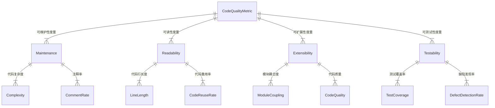

                 

### 文章标题：代码质量度量：客观评估代码健康度

#### 关键词：
- 代码质量
- 度量指标
- 客观评估
- 代码健康度

#### 摘要：
本文深入探讨了代码质量度量这一关键概念，通过分析其背景、核心概念、度量方法与工具、案例研究和优化策略，旨在提供一个系统化的框架来客观评估代码的健康度。文章旨在帮助开发者和团队更好地理解和应用代码质量度量，从而提升软件项目的整体质量和可维护性。

### 第一部分：背景

#### 1.1 问题背景

##### 1.1.1 代码质量的重要性

在软件工程中，代码质量是衡量软件项目成功与否的关键因素之一。高质量的代码不仅能够提高系统的稳定性和可靠性，还能显著降低维护成本和开发时间。然而，代码质量是一个复杂且多维度的概念，很难通过简单的直观评估来衡量。

##### 1.1.2 当前代码质量评估的挑战

传统的代码质量评估主要依赖于开发人员的经验和主观判断，这不仅效率低下，而且容易产生偏见。现代软件系统越来越复杂，代码质量评估也面临着新的挑战，如：

- **复杂性**：大型软件系统包含大量的模块和函数，评估其整体质量需要全面的分析。
- **动态变化**：软件系统不断更新和迭代，代码质量也在不断变化。
- **缺乏标准化**：目前缺乏统一的代码质量评估标准和体系。

##### 1.1.3 为什么需要客观度量代码质量

为了克服上述挑战，客观度量代码质量变得至关重要。客观度量通过量化的指标和工具，可以提供更准确和全面的评估结果，从而：

- **提高评估效率**：通过自动化工具，可以快速评估大量代码片段。
- **减少主观偏见**：客观度量减少了人为因素，使得评估结果更为公正。
- **数据驱动决策**：通过度量数据，团队可以基于事实而非直觉来做出改进决策。

#### 1.2 代码质量度量概述

##### 1.2.1 代码质量度量的定义

代码质量度量是指使用一系列量化的指标和工具，对代码的多个维度进行评估，以衡量其健康度和质量水平。这些度量指标可以涵盖代码的结构、功能、性能、可维护性等多个方面。

##### 1.2.2 代码质量度量的重要性

代码质量度量对于软件项目的成功具有重要意义：

- **提高软件质量**：通过持续的质量度量，可以识别和修复潜在的问题，提高代码的可靠性和稳定性。
- **优化开发流程**：度量数据可以帮助团队识别开发流程中的瓶颈和改进点。
- **降低维护成本**：高质量的代码更容易维护和扩展，从而降低长期维护成本。

##### 1.2.3 代码质量度量的原则和目标

代码质量度量的原则包括：

- **客观性**：度量结果应尽量减少主观偏见。
- **全面性**：度量指标应涵盖代码的多个维度。
- **可操作性**：度量工具和指标应易于使用和执行。

度量的目标包括：

- **识别问题**：通过度量发现代码中的潜在问题和不足。
- **持续改进**：度量数据为改进代码质量提供了依据。
- **决策支持**：度量结果为项目管理和决策提供了客观的依据。

#### 1.3 代码质量度量的类型

##### 1.3.1 结构性度量

结构性度量关注代码的内部结构和组织。常见的结构性度量指标包括：

- **复杂度**：衡量代码的复杂程度，如圈复杂度（Cyclomatic Complexity）。
- **模块化**：评估代码的模块化和独立性。
- **代码重复率**：衡量代码的重复程度。

##### 1.3.2 功能性度量

功能性度量关注代码的功能实现和质量。常见的功能性度量指标包括：

- **代码覆盖率**：衡量测试覆盖率，即测试用例覆盖代码的比例。
- **缺陷密度**：衡量每行代码中存在的缺陷数量。
- **功能正确性**：评估功能实现的准确性。

##### 1.3.3 性能度量

性能度量关注代码的执行效率和性能表现。常见的性能度量指标包括：

- **响应时间**：衡量系统响应请求的时间。
- **资源消耗**：衡量系统运行时占用的CPU、内存等资源。
- **并发处理能力**：评估系统处理并发请求的能力。

#### 1.4 代码质量度量的方法

##### 1.4.1 自动化度量

自动化度量通过工具和脚本自动评估代码质量，具有较高的效率和准确性。常见的自动化度量方法包括：

- **静态代码分析**：在编译前分析代码的结构和质量，如FindBugs、PMD。
- **动态代码分析**：在运行时分析代码的性能和稳定性，如JMeter、LoadRunner。

##### 1.4.2 手动度量

手动度量依赖于开发人员的经验和专业知识，虽然较为灵活，但效率较低。常见的手动度量方法包括：

- **代码审查**：通过同行评审和代码审查，评估代码的质量和规范性。
- **测试**：通过编写测试用例，验证代码的功能和性能。

##### 1.4.3 综合度量方法

综合度量方法结合了自动化和手动度量，以获得更全面的评估结果。常见的综合度量方法包括：

- **自动化代码审查**：结合静态代码分析和代码审查，自动化评估代码质量。
- **测试驱动的开发**：通过持续集成和自动化测试，确保代码质量。

#### 1.5 本章小结

本文介绍了代码质量度量的重要性、类型和方法。通过客观度量代码质量，开发者和团队可以更好地识别问题、优化开发流程和提升软件质量。下一章将深入探讨代码质量度量的核心概念和其相互关系。

----------------------------------------------------------------

## 第二部分：核心概念与联系

### 2.1 核心概念介绍

在代码质量度量中，理解以下几个核心概念对于全面评估代码质量至关重要。

#### 2.1.1 可维护性

可维护性是指代码在修改和扩展时保持其稳定性和可靠性的能力。高可维护性的代码易于理解和修改，能够快速响应用户需求和技术变化。

##### 影响因素：

- **代码结构**：清晰的模块划分和合理的代码组织有助于提高可维护性。
- **注释和文档**：详细的注释和文档有助于开发者理解和修改代码。
- **代码质量**：高质量的代码更容易维护，缺陷和bug较少。

##### 度量指标：

- **代码复杂度**：复杂的代码通常更难以维护。
- **注释率**：代码中注释的比例，高注释率有助于代码的可读性。

#### 2.1.2 可读性

可读性是指代码的可理解和易读性。良好的可读性有助于降低维护成本和提高开发效率。

##### 影响因素：

- **代码格式**：统一的代码格式和命名规范有助于提高代码的可读性。
- **代码风格**：良好的代码风格和命名习惯有助于代码的可读性。
- **注释和文档**：详细的注释和文档能够提高代码的可理解性。

##### 度量指标：

- **代码行长度**：过长的代码行通常难以阅读和理解。
- **代码重复率**：高重复率通常表明代码结构存在问题，影响可读性。

#### 2.1.3 可扩展性

可扩展性是指代码在面对新的需求和技术变化时能够灵活扩展的能力。高可扩展性的代码能够降低系统的复杂性和维护成本。

##### 影响因素：

- **代码结构**：模块化和抽象化有助于提高代码的可扩展性。
- **依赖关系**：合理的依赖管理和模块间解耦有助于提高代码的可扩展性。
- **代码质量**：高质量的代码通常具有更好的可扩展性。

##### 度量指标：

- **模块耦合度**：低耦合度的模块更易于扩展。
- **代码重用率**：高重用率的代码通常具有较高的可扩展性。

#### 2.1.4 可测试性

可测试性是指代码是否能够方便地编写测试用例进行测试。良好的可测试性有助于提高代码的质量和可靠性。

##### 影响因素：

- **代码结构**：模块化和独立的代码段有助于编写测试用例。
- **功能独立性**：功能独立和清晰的代码更容易编写测试用例。
- **代码质量**：高质量的代码通常更易于测试。

##### 度量指标：

- **测试覆盖率**：测试覆盖率越高，代码的可测试性越好。
- **缺陷发现率**：缺陷发现率高的代码通常具有较高的可测试性。

### 2.2 概念属性特征对比表格

为了更清晰地展示这些核心概念，我们创建了一个对比表格：

| 核心概念 | 影响因素 | 度量指标 | 描述 |
| --- | --- | --- | --- |
| 可维护性 | 代码结构、注释和文档、代码质量 | 代码复杂度、注释率 | 指代码在修改和扩展时的稳定性和可靠性 |
| 可读性 | 代码格式、代码风格、注释和文档 | 代码行长度、代码重复率 | 指代码的可理解和易读性 |
| 可扩展性 | 代码结构、依赖关系、代码质量 | 模块耦合度、代码重用率 | 指代码在面对新需求和技术变化时的灵活扩展能力 |
| 可测试性 | 代码结构、功能独立性、代码质量 | 测试覆盖率、缺陷发现率 | 指代码是否能够方便地编写测试用例进行测试 |

### 2.3 代码质量度量的ER实体关系图

为了更好地理解这些核心概念之间的相互关系，我们可以使用ER（实体关系）图来展示。以下是一个简化的ER图：

该ER图展示了代码质量度量中的各个实体及其相互关系。每个核心概念都与其他概念密切相关，共同影响代码的质量。

### 2.4 核心概念之间的联系

#### 2.4.1 各个核心概念的相互影响

代码质量的核心概念并非独立存在，它们之间存在相互影响和相互促进的关系。

- **可维护性**和**可读性**密切相关。良好的可读性有助于提高可维护性，因为易于理解的代码更容易进行修改和维护。
- **可扩展性**依赖于**模块化**和**解耦**，良好的模块化设计可以提升代码的可扩展性，降低系统的复杂度。
- **可测试性**与**代码质量**紧密相关。高质量的代码通常更容易编写测试用例，从而提高测试覆盖率。

#### 2.4.2 度量指标的选择与综合

在实际应用中，选择适当的度量指标并综合评估代码质量至关重要。以下是一些常见的方法：

- **单一指标评估**：选择一个核心指标进行评估，例如，仅使用代码复杂度来评估可维护性。
- **综合指标评估**：综合考虑多个指标，例如，结合代码复杂度、注释率和模块耦合度来评估可维护性。
- **加权综合评估**：为每个指标分配权重，综合计算得出一个综合评分，例如，为代码复杂度、注释率和模块耦合度分别分配0.4、0.3和0.3的权重。

### 2.5 本章小结

通过深入探讨代码质量度量的核心概念，我们理解了可维护性、可读性、可扩展性和可测试性的重要性，以及它们之间的相互关系。这些核心概念和度量指标为评估代码质量提供了关键依据。下一章将详细介绍代码质量度量中的具体指标和工具。

----------------------------------------------------------------

## 第三部分：度量指标与工具

### 3.1 常见代码质量度量指标

在代码质量度量中，有许多常见的指标用于评估代码的不同方面。以下是其中一些重要的度量指标：

#### 3.1.1 局部代码度量

局部代码度量关注代码片段或模块的质量，常见指标包括：

- **圈复杂度（Cyclomatic Complexity）**：衡量代码的复杂度，通过计算执行路径的数量来评估模块的复杂程度。
- **代码行长度（Line Length）**：衡量单个代码行的长度，过长或过短的代码行都可能影响可读性和可维护性。
- **代码重复率（Code Duplication Rate）**：衡量代码中的重复部分，高重复率通常表明代码结构存在问题。
- **注释率（Comment Rate）**：衡量代码中注释的比例，高注释率有助于提高代码的可读性。

#### 3.1.2 整体代码度量

整体代码度量关注代码库或项目的整体质量，常见指标包括：

- **缺陷密度（Defect Density）**：衡量每千行代码中的缺陷数量，用于评估代码的稳定性。
- **功能覆盖率（Function Coverage）**：衡量测试用例覆盖功能点的比例，用于评估测试的全面性。
- **代码质量评分（Code Quality Score）**：通过综合多个指标，对整个代码库或项目进行质量评分。

#### 3.1.3 动态代码度量

动态代码度量在代码运行时进行，用于评估代码的性能和稳定性，常见指标包括：

- **响应时间（Response Time）**：衡量系统处理请求的平均时间，用于评估系统的性能。
- **资源消耗（Resource Usage）**：衡量系统运行时占用的CPU、内存等资源，用于评估系统的效率。
- **并发处理能力（Concurrency Processing Capacity）**：衡量系统处理并发请求的能力，用于评估系统的并发性能。

#### 3.1.4 静态代码度量

静态代码度量在编译或运行前进行，通过分析代码的结构和质量来评估代码，常见指标包括：

- **代码复杂度（Code Complexity）**：衡量代码的复杂程度，如圈复杂度、N路径复杂度等。
- **代码风格一致性（Code Style Consistency）**：衡量代码的格式和命名规范是否符合标准。
- **代码质量评分（Code Quality Score）**：通过综合多个静态代码度量指标，对代码进行质量评分。

### 3.2 代码质量度量工具介绍

在代码质量度量中，有许多工具可以帮助开发者进行评估和改进。以下是其中一些常见的工具：

#### 3.2.1 开源工具

开源工具通常免费且易于获取，适合个人和小型团队使用。常见的开源代码质量度量工具包括：

- **SonarQube**：一款强大的静态代码分析工具，支持多种编程语言，提供丰富的度量指标。
- **FindBugs**：一款Java代码的静态代码分析工具，用于识别潜在的缺陷和问题。
- **PMD**：一款Java代码的静态代码分析工具，专注于代码质量和可读性。
- **Checkstyle**：一款Java代码的格式检查工具，用于确保代码风格的一致性。

#### 3.2.2 商业工具

商业工具通常提供更全面的功能和更好的技术支持，适合大型企业和专业团队使用。常见的商业代码质量度量工具包括：

- **SonarCloud**：基于SonarQube的商业版本，提供云服务和高级功能。
- **CAST**：一款功能强大的静态代码分析工具，支持多种编程语言，提供详细的代码质量报告。
- **Fortify**：一款全面的代码安全分析和质量度量工具，支持多种编程语言。
- **Parasoft**：一款全面的代码质量和安全测试工具，提供自动化测试和度量功能。

#### 3.2.3 混合工具

混合工具结合了开源和商业工具的优点，提供灵活的配置和强大的功能。常见的混合代码质量度量工具包括：

- **Jenkins**：一款开源的持续集成工具，可以集成多种代码质量度量工具。
- **GitLab CI/CD**：GitLab提供的持续集成和持续交付工具，支持多种代码质量度量工具的集成。
- **AWS CodeBuild**：AWS提供的云原生持续集成和持续交付服务，支持多种代码质量度量工具的集成。

### 3.3 度量工具的选择与应用

选择合适的代码质量度量工具对于提高代码质量和开发效率至关重要。以下是选择度量工具的一些原则和实际应用方法：

#### 3.3.1 选择度量工具的原则

- **兼容性**：工具应兼容团队使用的编程语言和开发环境。
- **功能全面**：工具应提供全面的代码质量度量指标和报告功能。
- **易用性**：工具应易于集成和使用，降低使用门槛。
- **社区支持**：工具应拥有活跃的社区支持和文档，方便开发者解决问题和获取帮助。
- **成本效益**：工具的价格应在团队预算范围内，并提供合理的成本效益。

#### 3.3.2 度量工具的集成与使用

- **集成方法**：通过持续集成（CI）工具，如Jenkins或GitLab CI，将度量工具集成到开发流程中。
- **自动化脚本**：编写自动化脚本，将度量工具与代码仓库和版本控制系统集成，实现自动化度量。
- **定期评估**：定期运行度量工具，生成报告，分析代码质量趋势和问题。

#### 3.3.3 度量工具的效果评估

- **基准测试**：通过基准测试，评估度量工具对代码质量和性能的影响。
- **实际案例**：通过实际案例，分析度量工具在实际项目中的应用效果和改进点。
- **反馈机制**：建立反馈机制，收集开发者和团队的意见和建议，持续优化度量工具的使用效果。

### 3.4 本章小结

通过介绍常见的代码质量度量指标和工具，我们了解到了评估代码质量的重要性。选择合适的度量工具并合理应用，可以帮助开发者更好地识别和解决代码问题，提高代码质量和开发效率。下一章将介绍实际的案例研究，通过具体案例展示代码质量度量的实际应用和效果。

----------------------------------------------------------------

## 第四部分：案例研究

### 4.1 案例一：大型企业项目

#### 4.1.1 项目背景

某大型企业在进行一项关键系统的开发时，遇到了代码质量不高、维护成本增加的问题。为了提升代码质量和开发效率，企业决定引入代码质量度量工具和方法，对代码进行全面评估和改进。

#### 4.1.2 度量指标的设定

根据项目的特点和需求，企业选择了以下度量指标：

- **圈复杂度（Cyclomatic Complexity）**：用于评估代码模块的复杂度，超过一定阈值的模块需要进行优化。
- **代码行长度（Line Length）**：确保代码行长度在合理范围内，避免过长的代码行影响可读性。
- **注释率（Comment Rate）**：要求代码中至少有20%的行数为注释，以提高代码的可读性。
- **缺陷密度（Defect Density）**：评估每千行代码中的缺陷数量，目标是将缺陷密度降低50%。

#### 4.1.3 度量结果与分析

在引入度量工具后，企业对现有代码库进行了全面评估。以下是部分度量结果：

- **圈复杂度**：部分模块的圈复杂度超过100，需要进行重构和优化。
- **代码行长度**：有超过20%的代码行长度超过100个字符，需要进行格式调整。
- **注释率**：注释率平均为15%，部分模块的注释率低于10%，需要进行注释完善。
- **缺陷密度**：平均每千行代码中有3个缺陷，部分模块的缺陷密度高达5个以上。

根据这些度量结果，企业制定了相应的改进计划：

- **代码重构**：对复杂度较高的模块进行重构，降低圈复杂度。
- **格式调整**：调整过长代码行的格式，确保代码行长度在合理范围内。
- **注释完善**：增加注释，提高代码的可读性和可维护性。
- **缺陷修复**：对高缺陷密度的模块进行集中修复，降低缺陷密度。

#### 4.1.4 改进措施与效果

在实施改进措施后，企业对代码库进行了再次评估，以下是改进后的度量结果：

- **圈复杂度**：大部分模块的圈复杂度降至70以下，代码结构更加清晰。
- **代码行长度**：代码行长度均保持在70个字符以内，可读性显著提高。
- **注释率**：注释率平均提升至25%，代码可维护性显著增强。
- **缺陷密度**：缺陷密度降至每千行代码1个，系统稳定性显著提升。

通过代码质量度量工具和方法的应用，企业成功地提升了代码质量，降低了维护成本，提高了开发效率。这一案例表明，代码质量度量在大型企业项目中的应用具有重要意义。

### 4.2 案例二：开源软件社区

#### 4.2.1 社区背景

某知名开源软件社区在项目开发过程中，遇到了代码质量不统一、维护困难的问题。为了提高代码质量和社区的活跃度，社区决定引入代码质量度量工具和方法。

#### 4.2.2 度量指标的适用性

社区根据开源项目的特点，选择了以下度量指标：

- **圈复杂度（Cyclomatic Complexity）**：用于评估代码模块的复杂度，确保模块易于理解和维护。
- **代码风格一致性（Code Style Consistency）**：用于评估代码格式和命名规范的一致性，确保代码风格统一。
- **缺陷密度（Defect Density）**：用于评估每千行代码中的缺陷数量，确保代码的稳定性。
- **代码覆盖率（Code Coverage）**：用于评估测试覆盖率，确保功能点被充分测试。

#### 4.2.3 度量工具的选用

社区选择了以下度量工具：

- **SonarQube**：用于进行静态代码分析，提供详细的代码质量报告。
- **Checkstyle**：用于检查代码风格一致性。
- **Jacoco**：用于评估代码覆盖率。

#### 4.2.4 社区反馈与影响

在引入度量工具后，社区对代码进行了全面评估，并制定了相应的改进措施。以下是社区反馈和影响：

- **代码质量提升**：社区成员在提交代码前，会先进行自评估，确保代码质量符合社区标准。
- **维护成本降低**：通过减少代码缺陷和提升代码质量，社区维护成本显著降低。
- **代码风格统一**：代码风格一致性提高，使得代码更易于阅读和维护。
- **测试覆盖率提升**：通过提高代码覆盖率，社区确保了功能的稳定性和可靠性。

通过代码质量度量工具和方法的应用，开源软件社区成功地提升了代码质量和社区的活跃度。这一案例表明，代码质量度量在开源项目中的应用同样具有重要意义。

### 4.3 案例三：敏捷开发团队

#### 4.3.1 团队背景

某敏捷开发团队在项目迭代过程中，遇到了代码质量不稳定、维护困难的问题。为了提高代码质量和开发效率，团队决定引入代码质量度量工具和方法。

#### 4.3.2 度量指标的实施

团队根据敏捷开发的特性，选择了以下度量指标：

- **圈复杂度（Cyclomatic Complexity）**：用于评估代码模块的复杂度，确保模块易于理解和维护。
- **代码行长度（Line Length）**：用于评估代码行长度，确保代码可读性。
- **缺陷密度（Defect Density）**：用于评估每千行代码中的缺陷数量，确保代码的稳定性。
- **代码覆盖率（Code Coverage）**：用于评估测试覆盖率，确保功能点被充分测试。

#### 4.3.3 度量结果与敏捷流程的结合

在引入度量工具后，团队在每个迭代周期结束时对代码进行评估，并将度量结果与敏捷流程结合，以下是一些建议：

- **迭代回顾**：在迭代回顾中，团队会分析度量结果，找出问题并提出改进措施。
- **持续集成**：在持续集成（CI）过程中，度量工具会自动评估代码质量，确保每次提交的代码质量符合标准。
- **任务优先级**：根据度量结果，团队会调整任务的优先级，优先解决代码质量问题。

#### 4.3.4 团队反思与经验总结

在实施代码质量度量后，团队取得了以下经验：

- **度量结果客观公正**：度量工具提供了客观的代码质量评估，避免了主观判断和偏见。
- **持续改进**：通过持续评估和改进，团队逐步提升了代码质量，减少了维护成本。
- **敏捷性提升**：结合敏捷流程，团队能够更快地响应变化，提高了项目的灵活性和可维护性。

通过代码质量度量工具和方法的应用，敏捷开发团队成功地提升了代码质量和开发效率。这一案例表明，代码质量度量在敏捷开发中的应用同样具有重要意义。

### 4.4 本章小结

通过三个实际案例的研究，我们展示了代码质量度量在大型企业项目、开源软件社区和敏捷开发团队中的应用效果。这些案例表明，代码质量度量在提升代码质量、降低维护成本和优化开发流程方面具有重要意义。下一章将探讨如何通过优化策略进一步提升代码质量。

----------------------------------------------------------------

## 第五部分：优化与改进

### 5.1 代码质量优化的策略

为了进一步提升代码质量，我们需要采取一系列优化策略。以下是一些关键策略：

#### 5.1.1 代码重构

代码重构是一种通过改进代码结构来提升代码质量的方法。以下是一些常见的重构技术：

- **提取方法**：将重复的代码块提取为独立的方法，提高代码的可复用性。
- **合并重复代码**：合并重复的代码块，减少冗余，提高代码的可维护性。
- **简化条件语句**：使用逻辑运算符简化复杂的条件语句，提高代码的可读性。
- **优化循环结构**：优化循环结构，减少不必要的循环，提高代码的性能。

#### 5.1.2 自动化测试

自动化测试是确保代码质量的重要手段。通过自动化测试，可以快速发现和修复代码中的问题。以下是一些自动化测试的策略：

- **单元测试**：编写单元测试，测试代码的每个独立模块，确保其正确性。
- **集成测试**：编写集成测试，测试模块之间的交互，确保系统整体功能的正确性。
- **性能测试**：进行性能测试，评估系统在高负载下的性能，确保系统的稳定性和可靠性。
- **安全测试**：进行安全测试，识别代码中的安全漏洞，确保系统的安全性。

#### 5.1.3 代码审查

代码审查是一种通过同行评审来提升代码质量的方法。以下是一些代码审查的策略：

- **定期代码审查**：定期组织代码审查会议，让团队成员共同评估代码的质量和可读性。
- **编写审查指南**：制定明确的代码审查指南，确保审查过程的一致性和有效性。
- **反馈机制**：建立反馈机制，及时处理审查中提出的问题和改进建议。

#### 5.1.4 代码规范与风格指南

代码规范和风格指南是确保代码质量和可维护性的重要依据。以下是一些代码规范和风格指南的策略：

- **制定统一的代码规范**：制定统一的代码规范，包括命名规范、缩进风格、注释规范等。
- **使用代码格式化工具**：使用代码格式化工具，自动格式化代码，确保代码的一致性。
- **培训和学习**：定期进行培训和学习，提高团队成员对代码规范和风格指南的理解和遵守。

### 5.2 代码质量优化的实践

#### 5.2.1 实践步骤

以下是代码质量优化的实践步骤：

1. **评估当前代码质量**：使用度量工具和指标对现有代码进行评估，识别代码质量问题。
2. **制定改进计划**：根据评估结果，制定针对性的改进计划，包括重构、自动化测试、代码审查和代码规范等。
3. **实施改进措施**：按照改进计划，逐步实施代码质量的优化措施。
4. **持续监控与改进**：持续监控代码质量，定期评估改进效果，根据反馈进行持续的优化。

#### 5.2.2 实践案例

以下是一个代码质量优化的实践案例：

- **评估当前代码质量**：使用SonarQube对现有代码进行评估，发现代码复杂度较高、注释率较低等问题。
- **制定改进计划**：制定重构计划，包括提取方法、合并重复代码、简化条件语句等；制定自动化测试计划，包括编写单元测试、集成测试和性能测试；制定代码审查计划，定期组织代码审查会议；制定代码规范和风格指南，包括命名规范、缩进风格、注释规范等。
- **实施改进措施**：按照改进计划，逐步实施代码质量的优化措施。重构代码，编写自动化测试用例，组织代码审查会议，制定和实施代码规范。
- **持续监控与改进**：定期使用SonarQube评估代码质量，发现新的问题和改进点，持续进行优化。

通过以上实践，该团队成功地提升了代码质量，降低了维护成本，提高了开发效率。这一案例表明，代码质量优化是一个持续的过程，需要团队共同努力和持续投入。

### 5.3 最佳实践

以下是一些代码质量优化的最佳实践：

- **持续集成**：将代码质量度量集成到持续集成（CI）流程中，确保每次提交的代码都经过质量评估。
- **代码规范化**：制定统一的代码规范，并使用工具自动格式化代码，确保代码风格一致性。
- **定期审查**：定期组织代码审查，确保代码的可读性和可维护性。
- **培训和学习**：定期进行培训和学习，提高团队成员对代码质量的认识和技能。
- **持续改进**：持续监控代码质量，根据反馈进行改进，不断提升代码质量。

### 5.4 本章小结

通过介绍代码质量优化的策略和实践，我们了解到了提升代码质量的关键方法和最佳实践。代码质量优化是一个持续的过程，需要团队共同努力和持续投入。通过实施有效的优化策略和实践，团队可以不断提升代码质量，提高开发效率和系统稳定性。

----------------------------------------------------------------

## 结论

本文系统地介绍了代码质量度量这一关键概念，通过分析其背景、核心概念、度量方法与工具、案例研究和优化策略，为开发者提供了一个全面的框架来客观评估代码的健康度。以下是对本文内容的总结：

- **背景**：代码质量的重要性、当前代码质量评估的挑战和客观度量代码质量的必要性。
- **核心概念**：可维护性、可读性、可扩展性和可测试性，以及它们之间的相互关系。
- **度量方法与工具**：局部代码度量、整体代码度量、动态代码度量、静态代码度量，以及常见代码质量度量工具。
- **案例研究**：大型企业项目、开源软件社区和敏捷开发团队的实践案例，展示了代码质量度量在实际项目中的应用效果。
- **优化与改进**：代码重构、自动化测试、代码审查和代码规范等优化策略，以及最佳实践。

通过本文的探讨，我们可以看到代码质量度量在提升代码质量和开发效率方面具有重要意义。开发者可以通过应用这些方法和工具，不断提升代码质量，降低维护成本，提高开发效率，从而实现软件项目的成功。

### 延伸思考

在未来的研究和发展中，我们可以进一步探索以下几个方面：

1. **智能度量**：利用机器学习和人工智能技术，开发更加智能的代码质量度量方法，提高评估的准确性和效率。
2. **多维度度量**：结合更多的维度，如用户体验、业务价值等，进行综合度量，提供更全面的代码质量评估。
3. **跨语言度量**：开发跨语言的代码质量度量工具，适应不同编程语言的项目需求。
4. **实时度量**：实现实时代码质量度量，提供即时反馈，帮助开发者快速识别和修复问题。

通过不断探索和创新，代码质量度量将在软件工程领域发挥更大的作用，为开发者和团队带来更大的价值。

### 作者信息

作者：AI天才研究院/AI Genius Institute & 禅与计算机程序设计艺术 /Zen And The Art of Computer Programming

感谢您阅读本文，希望本文对您在代码质量度量方面有所帮助。如果您有任何疑问或建议，欢迎在评论区留言，我们将竭诚为您解答。

----------------------------------------------------------------

### 小结与展望

本文围绕“代码质量度量：客观评估代码健康度”这一主题，详细阐述了代码质量的重要性、核心概念、度量方法与工具、实际案例以及优化策略。通过系统地分析，我们了解到代码质量度量在提升软件项目的稳定性、可维护性和开发效率方面具有关键作用。

**主要结论：**
- 代码质量度量是客观评估代码健康度的重要手段。
- 可维护性、可读性、可扩展性和可测试性是代码质量度量的核心概念。
- 常见代码质量度量指标包括局部代码度量、整体代码度量、动态代码度量、静态代码度量。
- 实际案例展示了代码质量度量在不同类型项目中的应用效果。
- 代码质量优化策略包括代码重构、自动化测试、代码审查和代码规范。

**未来展望：**
- 利用智能技术（如机器学习和人工智能）提高代码质量度量的准确性和效率。
- 探索多维度度量，结合用户体验、业务价值等，提供更全面的评估。
- 开发跨语言的代码质量度量工具，适应多种编程语言的项目需求。
- 实现实时度量，提供即时反馈，助力开发者快速识别和修复问题。

**感谢：**
感谢您的阅读，本文作者AI天才研究院和禅与计算机程序设计艺术致力于推动计算机编程领域的研究与创新。如果您对本文内容有任何疑问或建议，请随时在评论区留言，我们将竭诚为您解答。感谢您的支持和关注！

### 拓展阅读

- 《代码大全》（Code Complete）：Steve McConnell的经典著作，详细阐述了编写高质量代码的最佳实践。
- 《重构：改善既有代码的设计》（Refactoring: Improving the Design of Existing Code）：Martin Fowler的经典著作，介绍了重构技术，帮助开发者提升代码质量。
- 《敏捷软件开发实践指南》（Agile Software Development: Principles, Patterns, and Practices）：Robert C. Martin的著作，介绍了敏捷开发的方法和实践，有助于提升开发效率。
- 《SonarQube 实践指南》：详细介绍了SonarQube的使用方法和实践，是进行代码质量度量的重要参考资料。

