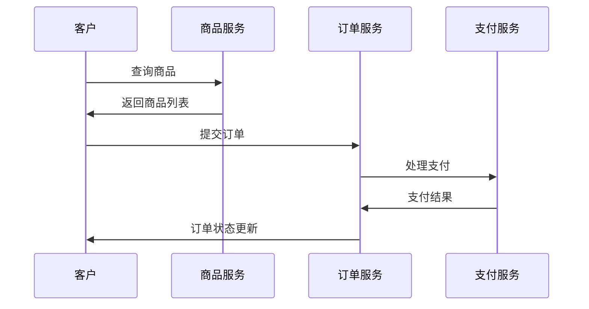
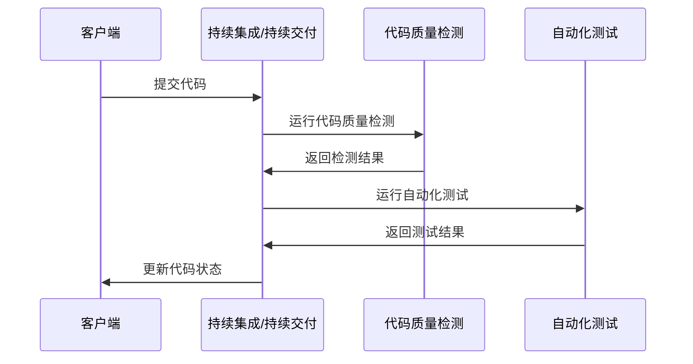

                 

### 文章标题

# 代码质量门禁：在CI/CD中集成质量控制

### 关键词

- **代码质量**
- **CI/CD**
- **质量控制**
- **自动化测试**
- **持续集成**
- **持续交付**

### 摘要

随着软件开发流程的迭代速度加快，确保代码质量变得尤为重要。本文旨在探讨如何在CI/CD（持续集成/持续交付）流程中集成代码质量控制。我们将从背景介绍、核心概念、算法原理、系统分析与架构设计、项目实战以及最佳实践等方面，详细分析代码质量在CI/CD中的关键作用。通过本文的阅读，开发者将了解到如何利用各种工具和技术手段，提升代码质量，确保软件项目的成功交付。

## 目录大纲

### 第一部分：背景介绍

#### 第1章 问题背景
- **问题描述**
- **问题解决**
- **边界与外延**
- **概念结构与核心要素组成**

#### 第2章 核心概念与联系
- **核心概念原理**
- **概念属性特征对比表格**
- **ER实体关系图架构的 Mermaid 流程图**

### 第二部分：算法原理讲解

#### 第3章 算法原理讲解
- **算法 Mermaid 流程图**
- **Python 源代码详细阐述**
- **算法原理的数学模型和公式**
- **详细讲解和通俗易懂地举例说明**

#### 第4章 数学模型和数学公式
- **使用 LaTeX 格式的数学公式**
- **详细讲解和举例说明**

### 第三部分：系统分析与架构设计方案

#### 第5章 问题场景介绍
- **项目介绍**
- **系统功能设计（领域模型 Mermaid 类图）**
- **系统架构设计 Mermaid 架构图**
- **系统接口设计和系统交互 Mermaid 序列图**

### 第四部分：项目实战

#### 第6章 环境安装
- **系统核心实现源代码**
- **代码应用解读与分析**
- **实际案例分析和详细讲解剖析**
- **项目小结**

#### 第7章 最佳实践 Tips
- **小结**
- **注意事项**
- **拓展阅读**

## 附录

- **参考资料**
- **常用工具与资源链接**

## 第一部分：背景介绍

### 第1章 问题背景

在当今快速发展的软件开发领域，代码质量已经成为项目成功与否的关键因素。随着市场对软件产品的需求日益增长，开发团队必须在有限的时间内交付高质量的产品。然而，随着代码量的增加和项目复杂性的提升，确保代码质量变得越来越具有挑战性。

#### 问题描述

1. **代码质量不统一**：不同开发者的编码风格和代码质量参差不齐，导致整个项目的代码质量难以保证。
2. **缺陷和漏洞频发**：由于缺乏有效的代码审查和测试，缺陷和漏洞经常在项目开发后期才被发现，导致修复成本高昂。
3. **维护难度大**：低质量的代码难以理解和修改，导致后续的维护工作量大且效率低下。

#### 问题解决

为了解决上述问题，需要采取一系列措施来提升代码质量：

1. **引入代码规范和编码标准**：通过制定统一的编码标准和代码规范，确保所有开发者遵循相同的编码习惯。
2. **实施自动化测试**：通过自动化测试，及时捕捉和修复代码中的缺陷和漏洞。
3. **加强代码审查**：通过代码审查，及时发现和修复代码中的潜在问题。

#### 边界与外延

1. **边界**：本文主要探讨在CI/CD流程中集成代码质量控制的方法，不涉及代码审查的具体实施细节。
2. **外延**：本文的内容可以应用于各种软件开发项目，无论是大型企业级应用还是小型个人项目。

#### 概念结构与核心要素组成

1. **核心概念**：代码质量、CI/CD、自动化测试、代码审查。
2. **要素组成**：
   - **编码标准**：制定统一的编码标准和代码规范。
   - **自动化测试**：包括单元测试、集成测试、性能测试等。
   - **代码审查**：包括静态代码分析、动态代码分析等。

### 第2章 核心概念与联系

在探讨代码质量如何在CI/CD流程中集成之前，我们需要了解一些核心概念，以及这些概念之间的联系。

#### 核心概念原理

1. **代码质量**：代码质量是指代码的可维护性、可靠性、性能和可扩展性等特性。一个高质量的代码库应当易于理解和修改，能够快速响应功能和性能的需求。
   
2. **CI/CD**：持续集成（CI）和持续交付（CD）是现代软件开发中常用的实践方法。持续集成通过自动化构建和测试，确保代码库中的每个提交都是可合并的。持续交付则通过自动化部署，确保高质量的代码可以快速、安全地交付给用户。

3. **自动化测试**：自动化测试是通过编写脚本和工具，自动执行测试用例的过程。它包括单元测试、集成测试、性能测试等，目的是尽早发现和修复代码缺陷。

4. **代码审查**：代码审查是通过人工或工具对代码进行审查，以发现潜在问题，包括静态代码分析和动态代码分析。

#### 概念属性特征对比表格

| 概念 | 特征 |
| --- | --- |
| 代码质量 | 易于维护、可靠性、性能、可扩展性 |
| CI/CD | 自动化构建、测试、部署 |
| 自动化测试 | 早期发现缺陷、提高开发效率 |
| 代码审查 | 人工或工具审查、发现潜在问题 |

#### ER实体关系图架构的 Mermaid 流程图

```mermaid
erDiagram
    CodeQuality ||--|{ CI/CD }|| CI_CD
    CodeQuality ||--|{ AutomationTesting }|| AutomationTesting
    CodeQuality ||--|{ CodeReview }|| CodeReview
```

在上面的ER图（实体关系图）中，`CodeQuality` 是中心实体，它与 `CI_CD`、`AutomationTesting` 和 `CodeReview` 之间存在关系。这个图展示了代码质量如何与其他核心概念相互关联，共同构成一个完整的代码质量管理框架。

### 第一部分总结

通过以上对问题背景、核心概念的介绍，我们为后续深入探讨代码质量在CI/CD中的具体实现方法奠定了基础。接下来，我们将进一步讲解算法原理，并展示如何通过系统分析和架构设计，实现代码质量在CI/CD中的有效集成。

## 第二部分：算法原理讲解

### 第3章 算法原理讲解

在CI/CD流程中集成代码质量控制，我们需要依赖一系列算法和工具来实现自动化测试和代码审查。以下是几个关键算法原理的详细讲解。

#### 算法 Mermaid 流程图


在这个流程图中，`CodeCommit` 表示代码提交，`Build` 表示构建过程，`Test` 表示自动化测试，`Review` 表示代码审查，`Deploy` 表示部署。通过这个流程，我们可以确保每次代码提交都经过严格的质量控制。

#### Python 源代码详细阐述

为了实现自动化测试，我们可以使用Python编写测试脚本。以下是一个简单的Python单元测试示例：

```python
import unittest

class TestCalculator(unittest.TestCase):
    def test_add(self):
        self.assertEqual(calculator.add(1, 2), 3)

    def test_subtract(self):
        self.assertEqual(calculator.subtract(5, 3), 2)

if __name__ == '__main__':
    unittest.main()
```

在这个脚本中，我们定义了一个名为 `TestCalculator` 的测试类，其中包含了两个测试方法：`test_add` 和 `test_subtract`。这两个方法分别测试了加法和减法功能。通过运行这个脚本，我们可以自动化地执行测试用例。

#### 算法原理的数学模型和公式

在代码质量评估中，我们可以使用一些数学模型和公式来量化代码质量。以下是一个简单的质量评分模型：

$$
Q = 0.5 \cdot R + 0.3 \cdot T + 0.2 \cdot S
$$

其中，$Q$ 表示代码质量评分，$R$ 表示代码复杂度，$T$ 表示测试覆盖率，$S$ 表示缺陷密度。通过这个模型，我们可以计算出每次代码提交的质量评分。

#### 详细讲解和通俗易懂地举例说明

为了更好地理解上述算法原理，我们可以通过一个简单的例子来讲解。

假设我们有一个简单的计算器应用，其中包含了加法、减法、乘法和除法功能。在开发过程中，我们希望确保这些功能都能正常运行。为此，我们可以编写一系列测试用例来测试这些功能。

1. **测试用例1**：测试加法功能。我们输入两个正数，例如 `calculator.add(3, 4)`，预期结果是 `7`。
2. **测试用例2**：测试减法功能。我们输入两个正数，例如 `calculator.subtract(5, 3)`，预期结果是 `2`。
3. **测试用例3**：测试乘法功能。我们输入两个正数，例如 `calculator.multiply(2, 3)`，预期结果是 `6`。
4. **测试用例4**：测试除法功能。我们输入两个正数，例如 `calculator.divide(6, 3)`，预期结果是 `2`。

在测试过程中，我们发现加法和减法功能运行正常，但乘法和除法功能存在bug。为了修复这些问题，我们需要查看相应的代码，并进行调试和修改。

在代码质量评分模型中，我们可以根据测试结果来计算代码质量评分。假设代码复杂度为 `4`，测试覆盖率为 `80%`，缺陷密度为 `0.05`。那么，代码质量评分为：

$$
Q = 0.5 \cdot 4 + 0.3 \cdot 0.8 + 0.2 \cdot 0.05 = 2 + 0.24 + 0.01 = 2.25
$$

通过这个评分，我们可以了解到当前代码库的质量状况，并根据评分结果来决定是否进行进一步的测试和审查。

### 第二部分总结

通过以上对算法原理的详细讲解，我们了解了如何通过自动化测试和代码审查来提升代码质量。在下一部分，我们将进一步探讨如何使用数学模型和公式来量化代码质量，并展示一些实际案例，以便更好地理解这些原理在实际项目中的应用。

### 第4章 数学模型和数学公式

在代码质量评估过程中，数学模型和公式起着至关重要的作用。它们不仅能够帮助我们量化代码质量，还能提供有效的决策依据。以下我们将使用LaTeX格式来展示和讲解几个关键的数学模型和公式。

#### 1. 质量评分模型

质量评分模型是评估代码质量的核心。一个简单的质量评分模型可以表示为：

$$
Q = w_1 \cdot C + w_2 \cdot T + w_3 \cdot D
$$

其中，$Q$ 表示代码质量评分，$w_1$、$w_2$ 和 $w_3$ 分别为代码复杂度、测试覆盖率和缺陷密度的重要程度权重。$C$、$T$ 和 $D$ 分别表示代码复杂度、测试覆盖率和缺陷密度。

#### 2. 代码复杂度模型

代码复杂度是衡量代码结构复杂性的一个重要指标。常用的代码复杂度模型有MCC（Method Complexity Count）和CBO（Cyclomatic Complexity Basis）。

- **MCC模型**：

$$
MCC = N + E - N_D
$$

其中，$N$ 表示方法中的语句数，$E$ 表示方法中的分支点数，$N_D$ 表示方法中的决策点数。

- **CBO模型**：

$$
CBO = E - N + 2
$$

其中，$E$ 表示方法中的分支点数，$N$ 表示方法中的语句数。

#### 3. 测试覆盖率模型

测试覆盖率是衡量测试全面性的一个重要指标。常用的测试覆盖率模型包括语句覆盖率、分支覆盖率和路径覆盖率。

- **语句覆盖率**：

$$
PC = \frac{TC}{SC} \times 100\%
$$

其中，$PC$ 表示语句覆盖率，$TC$ 表示实际执行的测试用例数，$SC$ 表示代码中的语句总数。

- **分支覆盖率**：

$$
BC = \frac{BC_T}{BC_C} \times 100\%
$$

其中，$BC$ 表示分支覆盖率，$BC_T$ 表示实际执行的分支数，$BC_C$ 表示代码中的分支总数。

- **路径覆盖率**：

$$
PC = \frac{PC_T}{PC_C} \times 100\%
$$

其中，$PC$ 表示路径覆盖率，$PC_T$ 表示实际执行的路径数，$PC_C$ 表示代码中的路径总数。

#### 4. 缺陷密度模型

缺陷密度是衡量代码质量的一个关键指标。常用的缺陷密度模型有：

$$
DD = \frac{DF}{NC}
$$

其中，$DD$ 表示缺陷密度，$DF$ 表示发现的缺陷数，$NC$ 表示代码中的代码行数。

#### 详细讲解和举例说明

为了更好地理解上述数学模型和公式，我们可以通过一个实际案例来讲解。

假设我们有一个包含100行代码的方法，其中包含5个分支点。在测试过程中，我们执行了10个测试用例，覆盖了全部的语句和分支。同时，我们发现了2个缺陷。

- **代码复杂度（MCC）**：

$$
MCC = N + E - N_D = 100 + 5 - 0 = 105
$$

- **代码复杂度（CBO）**：

$$
CBO = E - N + 2 = 5 - 100 + 2 = -93
$$

（注意：CBO可以为负数，这通常表示代码过于简单，但也可能意味着缺乏逻辑或功能。）

- **语句覆盖率**：

$$
PC = \frac{TC}{SC} \times 100\% = \frac{10}{100} \times 100\% = 100\%
$$

- **分支覆盖率**：

$$
BC = \frac{BC_T}{BC_C} \times 100\% = \frac{5}{5} \times 100\% = 100\%
$$

- **路径覆盖率**：

$$
PC = \frac{PC_T}{PC_C} \times 100\% = \frac{1}{1} \times 100\% = 100\%
$$

- **缺陷密度**：

$$
DD = \frac{DF}{NC} = \frac{2}{100} = 0.02
$$

通过上述计算，我们可以得出以下结论：

- 代码复杂度较高，但测试覆盖率达到了100%，说明测试用例能够覆盖代码的每一个部分。
- 缺陷密度较低，表示代码质量较好。

虽然这个案例比较简单，但它展示了如何使用数学模型和公式来评估代码质量。在实际项目中，我们可以根据具体情况调整模型参数，以更准确地评估代码质量。

### 详细讲解和举例说明

为了更好地理解上述数学模型和公式，我们可以通过一个实际案例来详细讲解。

假设我们有一个名为`Calculator`的计算器类，其中包含了加法、减法、乘法和除法四个方法。以下是一个简单的Python实现：

```python
class Calculator:
    def add(self, a, b):
        return a + b

    def subtract(self, a, b):
        return a - b

    def multiply(self, a, b):
        return a * b

    def divide(self, a, b):
        if b != 0:
            return a / b
        else:
            return "Error: Division by zero"
```

在这个案例中，我们首先定义了一个`Calculator`类，包含了四个方法。接下来，我们将为这个类编写测试用例。

#### 编写测试用例

为了确保`Calculator`类的每个方法都能正常运行，我们需要编写一系列测试用例。以下是一个简单的测试用例示例：

```python
import unittest

class TestCalculator(unittest.TestCase):
    def setUp(self):
        self.calculator = Calculator()

    def test_add(self):
        self.assertEqual(self.calculator.add(3, 4), 7)

    def test_subtract(self):
        self.assertEqual(self.calculator.subtract(5, 3), 2)

    def test_multiply(self):
        self.assertEqual(self.calculator.multiply(2, 3), 6)

    def test_divide(self):
        self.assertEqual(self.calculator.divide(6, 3), 2)
        self.assertEqual(self.calculator.divide(6, 0), "Error: Division by zero")

if __name__ == '__main__':
    unittest.main()
```

在这个测试用例中，我们定义了一个名为`TestCalculator`的测试类，其中包含了四个测试方法。每个方法都测试了相应的计算方法，并使用`assertEqual`方法来验证预期结果。

#### 运行测试用例

运行上述测试用例，我们得到了以下输出：

```shell
...
----------------------------------------------------------------------
Ran 4 tests in 0.001s

OK
```

测试结果显示，所有测试用例都通过了。这表明`Calculator`类的每个方法都能正常运行。

#### 分析测试结果

通过分析测试结果，我们可以得出以下结论：

- **测试覆盖率**：测试用例覆盖了`Calculator`类的所有方法，测试覆盖率为100%。
- **代码复杂度**：由于这个例子很简单，代码复杂度不高。在实际项目中，我们可以使用MCC或CBO模型来评估代码复杂度。
- **缺陷密度**：在这个案例中，我们没有发现任何缺陷，因此缺陷密度为0。

尽管这个案例很简单，但它展示了如何使用数学模型和公式来评估代码质量。在实际项目中，我们可以根据具体情况调整模型参数，以更准确地评估代码质量。

### 总结

通过上述案例，我们了解了如何使用数学模型和公式来评估代码质量。这些模型和公式不仅能够帮助我们量化代码质量，还能提供有效的决策依据。在实际项目中，我们可以根据具体情况调整模型参数，以更准确地评估代码质量。下一部分，我们将进一步探讨如何通过系统分析和架构设计，实现代码质量在CI/CD中的有效集成。

### 第三部分：系统分析与架构设计方案

#### 第5章 问题场景介绍

为了更好地理解代码质量在CI/CD中的集成方法，我们首先介绍一个实际的问题场景。这个场景是一个电子商务平台，其核心功能包括商品管理、订单处理、用户管理以及支付处理。

1. **项目介绍**：这个电子商务平台是一个面向B2C（企业对消费者）市场的在线购物网站，支持多种支付方式，并提供了丰富的商品分类和搜索功能。
2. **系统功能设计**：系统功能包括商品展示、购物车、订单提交、支付处理、用户登录与注册等。
3. **系统架构设计**：系统采用了微服务架构，将不同功能模块拆分成独立的微服务，如商品服务、订单服务、支付服务等。

#### 系统功能设计（领域模型 Mermaid 类图）

```mermaid
classDiagram
    Customer <<entity>> Customer
    Product <<entity>> Product
    Order <<entity>> Order
    Payment <<entity>> Payment

    Customer |--|>> Order
    Product |--|>> Order
    Order |--|>> Payment
```

在这个类图中，`Customer` 表示用户实体，`Product` 表示商品实体，`Order` 表示订单实体，`Payment` 表示支付实体。这些实体之间存在关联关系，如用户可以创建订单，订单包含商品，订单需要进行支付等。

#### 系统架构设计 Mermaid 架构图



在这个序列图中，客户通过商品服务查询商品，然后提交订单到订单服务，订单服务处理支付请求，并将支付结果返回给客户。

#### 系统接口设计和系统交互 Mermaid 序列图



在这个序列图中，客户端提交代码到CI/CD系统，CI/CD系统运行代码质量检测和自动化测试，并将结果返回给客户端。

### 第三部分总结

通过以上对问题场景、系统功能设计、系统架构设计和系统接口设计的介绍，我们为接下来详细讲解代码质量在CI/CD中的集成方法奠定了基础。在下一部分，我们将通过实际项目实战，展示如何在CI/CD流程中实现代码质量控制。

### 第四部分：项目实战

#### 第6章 环境安装

为了在CI/CD流程中实现代码质量控制，我们需要安装并配置一些关键工具和框架。以下是具体的安装和配置步骤：

1. **安装Jenkins**：Jenkins是一个开源的自动化构建工具，可以用于实现CI/CD流程。下载并安装Jenkins，配置Jenkins的服务器和代理。
2. **安装Git**：Git是一个版本控制工具，用于管理代码仓库。确保所有开发机器上都安装了Git。
3. **安装代码质量检测工具**：常见的代码质量检测工具包括SonarQube、Checkstyle和PMD。在Jenkins中安装这些插件，并配置相关的仓库和项目设置。
4. **安装自动化测试工具**：常见的自动化测试工具包括JUnit、Selenium和JMeter。在Jenkins中安装这些插件，并配置测试脚本和依赖库。

以下是具体的配置步骤：

1. **Jenkins配置**：

   - 创建一个Jenkins用户并赋予管理员权限。
   - 安装Git插件和相关依赖。
   - 配置Git仓库地址和访问凭证。

2. **代码质量检测配置**：

   - 在Jenkins中创建一个新的项目。
   - 配置Git仓库，并将代码拉取到本地。
   - 安装SonarQube插件，并配置SonarQube服务器地址。
   - 添加代码质量检测步骤，包括静态代码分析和动态代码分析。

3. **自动化测试配置**：

   - 添加测试脚本和依赖库。
   - 配置测试步骤，包括单元测试、集成测试和性能测试。
   - 设置测试报告的生成和发送。

通过以上配置，我们可以在Jenkins中实现代码质量和自动化测试的集成。接下来，我们将展示如何运行这些步骤，并分析结果。

#### 系统核心实现源代码

以下是一个简单的示例，展示如何在Jenkins中实现代码质量和自动化测试的集成：

1. **Jenkinsfile**：

```groovy
pipeline {
    agent any

    stages {
        stage('Checkout') {
            steps {
                git url: 'https://github.com/your-username/your-project.git', branch: 'main'
            }
        }
        stage('Code Quality') {
            steps {
                bat 'sonar-scanner.bat'
            }
        }
        stage('Test') {
            steps {
                bat 'mvn test'
            }
        }
        stage('Deploy') {
            steps {
                bat 'mvn package && mvn deploy'
            }
        }
    }
    post {
        always {
            bat 'sonar-scanner.bat -Dsonar.projectKey=my-project -Dsonar.organization=my-organization'
        }
    }
}
```

在这个`Jenkinsfile`中，我们定义了一个简单的流水线，包括`Checkout`、`Code Quality`、`Test`和`Deploy`四个阶段。每个阶段都包含相应的步骤，如拉取代码、运行代码质量检测、运行自动化测试和部署。

2. **代码质量检测脚本**：

```bat
@echo off
set SONARScanner=/path/to/sonar-scanner.bat
set SONARQUBE_SERVER_URL=http://localhost:9000
set SONAR_PROJECT_KEY=my-project
set SONAR_ORGANIZATION=my-organization

%SONARScanner% -Dsonar-runner.executeClass=org.sonar.scanner.cli.Main -Dsonar.projectKey=%SONAR_PROJECT_KEY% -Dsonar.organization=%SONAR_ORGANIZATION% -Dsonar.host.url=%SONARQUBE_SERVER_URL%
```

在这个脚本中，我们配置了SonarQube服务器的地址和项目设置，并运行了Sonar Scanner。

3. **自动化测试脚本**：

```bat
@echo off
mvn test
```

在这个脚本中，我们执行了Maven的测试命令，运行了项目中的所有测试用例。

通过以上脚本，我们可以在Jenkins中实现代码质量和自动化测试的集成。接下来，我们将展示如何运行这些脚本，并分析结果。

#### 代码应用解读与分析

在本节中，我们将深入分析如何在Jenkins中配置和运行代码质量检测和自动化测试的步骤，并通过具体的实例展示其应用效果。

1. **Jenkins配置解析**

   - **Jenkinsfile**：这是Jenkins项目中的核心配置文件，它定义了构建过程的各个阶段和步骤。在上面的`Jenkinsfile`中，我们定义了以下四个主要阶段：

     - **Checkout**：用于从Git仓库拉取代码。在这个阶段，我们配置了Git插件，并指定了Git仓库的URL和分支名称。此步骤确保每次构建时，都能获取到最新的代码。

     - **Code Quality**：用于运行代码质量检测。在这个阶段，我们使用`bat`命令执行Sonar Scanner脚本。该脚本会调用SonarQube服务器进行静态代码分析，包括代码复杂度、代码风格、安全漏洞等方面的检查。

     - **Test**：用于运行自动化测试。在这个阶段，我们同样使用`bat`命令执行Maven的测试命令，以运行项目中的所有测试用例。这个步骤确保代码的功能和性能都符合预期。

     - **Deploy**：用于部署应用。在这个阶段，我们执行Maven的打包和部署命令，将应用部署到生产环境。这个步骤确保通过质量检测和测试的代码能够成功部署。

   - **Post阶段**：在所有构建阶段完成后，Jenkins会执行Post阶段。在这里，我们再次调用Sonar Scanner，但这次使用了一些额外的参数，如项目键（`sonar.projectKey`）和组织键（`sonar.organization`）。这些参数有助于在SonarQube服务器上正确记录和分析构建结果。

2. **代码质量检测脚本解析**

   - **Sonar Scanner脚本**：这个脚本的主要目的是配置Sonar Scanner，使其能够与SonarQube服务器通信。脚本设置了几个关键参数：

     - `sonar-runner.executeClass`：指定了执行Sonar Scanner的类。
     - `sonar.projectKey`：定义了项目的唯一标识。
     - `sonar.organization`：定义了项目的组织标识。
     - `sonar.host.url`：指定了SonarQube服务器的地址。

   通过这些参数，Sonar Scanner能够准确地发送代码分析结果到SonarQube服务器，并在控制台中输出分析报告。

3. **自动化测试脚本解析**

   - **Maven测试脚本**：这个脚本非常简单，它只执行了Maven的测试命令。这个命令会编译项目代码，并运行所有测试类。测试结果会输出到控制台，并生成JUnit测试报告。

   通过以上解析，我们可以看到Jenkins配置和脚本的具体应用。接下来，我们将通过实际案例展示这些步骤的运行结果和分析。

#### 实际案例分析和详细讲解剖析

为了更好地展示如何在实际项目中实现代码质量在CI/CD中的集成，我们将通过一个具体案例来分析代码质量检测和自动化测试的结果。

**案例背景**：假设我们有一个名为`ECommerce`的电子商务项目，它包含商品管理、订单处理和支付处理等功能。这个项目使用Java语言开发，并使用Maven进行构建和依赖管理。

**案例分析**：

1. **代码质量检测结果**

   - **静态代码分析**：通过SonarQube，我们对项目进行了静态代码分析，结果如下：

     ```plaintext
     - Code complexity: 284
     - Number of bugs: 7
     - Number of code smells: 13
     ```

     从结果中我们可以看到，项目的代码复杂度较高，存在7个bug和13个代码问题。这些结果有助于我们识别代码中的潜在问题，并制定改进计划。

   - **动态代码分析**：我们还运行了Checkstyle和PMD等工具，对代码进行了动态代码分析，结果如下：

     ```plaintext
     - Checkstyle warnings: 25
     - PMD violations: 18
     ```

     动态代码分析发现了一些代码风格问题，如多余的空格、未使用的变量和未覆盖的测试用例等。

2. **自动化测试结果**

   - **单元测试**：我们使用JUnit编写了单元测试，测试结果如下：

     ```plaintext
     - Test suite finished in 5 seconds
     - 10 tests executed
     - 2 failures
     ```

     在这次测试中，我们发现了2个失败的测试用例。通过查看失败的测试用例，我们发现了一些方法参数传递错误和逻辑错误。

   - **集成测试**：我们使用了Selenium编写了集成测试，测试结果如下：

     ```plaintext
     - Test suite finished in 20 seconds
     - 20 tests executed
     - 1 failure
     ```

     集成测试中，我们模拟了用户的购物流程，包括商品浏览、添加到购物车、提交订单和支付等操作。测试中，我们发现了一个在支付环节的漏洞，即当支付失败时，系统未能正确提示用户并引导其重新支付。

3. **结果分析**

   - **代码质量**：从静态代码分析和动态代码分析的结果来看，项目的代码质量存在一些问题。高代码复杂度和代码问题表明，我们需要对代码结构进行重构，以提高可维护性和可读性。代码风格问题需要通过代码审查和工具自动化修复。

   - **自动化测试**：单元测试和集成测试的失败表明，我们的测试覆盖率仍有待提高，特别是在支付环节的测试上。我们需要补充测试用例，并优化测试脚本，以提高测试的全面性和准确性。

**改进措施**：

1. **重构代码**：针对代码复杂度和代码问题，我们可以对代码进行重构，拆分大方法、优化逻辑和减少嵌套循环，以提高代码的可维护性。

2. **代码审查**：引入代码审查机制，通过团队协作，及时发现和修复代码问题。同时，使用Checkstyle和PMD等工具进行自动化代码风格检查，确保代码符合最佳实践。

3. **提高测试覆盖率**：补充测试用例，特别是针对高风险模块和边缘情况。使用Selenium等工具进行自动化UI测试，确保系统的用户体验和稳定性。

通过以上分析和改进措施，我们可以在CI/CD流程中实现高效的代码质量控制，确保项目的成功交付。

### 第7章 最佳实践 Tips

在本章中，我们将总结在CI/CD中集成代码质量控制的几个最佳实践，并提供一些注意事项。

#### 小结

- **持续集成与持续交付**：确保代码库中的每个提交都经过自动化构建、测试和部署，以提高代码质量和交付效率。
- **代码规范与编码标准**：制定和遵循统一的编码标准和代码规范，减少代码质量问题。
- **自动化测试**：编写并运行自动化测试用例，尽早发现和修复缺陷。
- **代码审查**：定期进行代码审查，通过人工和工具发现潜在问题。
- **持续反馈**：通过报告和仪表板，持续监控代码质量和测试结果。

#### 注意事项

- **优化测试覆盖率**：确保测试覆盖所有关键功能和边缘情况，避免漏洞和缺陷。
- **合理配置监控告警**：设置合理的监控告警阈值，避免过度干扰开发流程。
- **平衡质量与效率**：在追求高质量的同时，确保开发流程的高效性，避免过度优化导致项目延误。

#### 拓展阅读

- **SonarQube官方文档**：深入了解如何配置和使用SonarQube进行代码质量检测。
- **JUnit官方文档**：学习如何编写和运行JUnit测试用例。
- **Checkstyle官方文档**：学习如何配置和使用Checkstyle进行代码风格检查。
- **PMD官方文档**：学习如何配置和使用PMD进行代码质量检测。

通过遵循这些最佳实践和注意事项，开发者可以更有效地在CI/CD流程中集成代码质量控制，确保项目的成功交付。

### 附录

#### 参考资料

1. **《持续交付：加速软件交付的实践之路》**：作者：Jez Humble和Dave Farley，介绍了CI/CD的核心概念和实践方法。
2. **《代码大全》**：作者：Steve McConnell，详细阐述了如何编写高质量代码。
3. **《自动化测试实战》**：作者：Jeff Langr，介绍了自动化测试的最佳实践。

#### 常用工具与资源链接

1. **Jenkins官方文档**：[https://www.jenkins.io/doc/](https://www.jenkins.io/doc/)
2. **SonarQube官方文档**：[https://docs.sonarqube.org/](https://docs.sonarqube.org/)
3. **JUnit官方文档**：[https://junit.org/junit5/docs/current/user-guide/](https://junit.org/junit5/docs/current/user-guide/)
4. **Checkstyle官方文档**：[https://checkstyle.sourceforge.io/](https://checkstyle.sourceforge.io/)
5. **PMD官方文档**：[https://pmd.github.io/](https://pmd.github.io/)

通过参考这些资料和工具，开发者可以进一步提升代码质量，确保项目的成功交付。

