                 

### 详细解读

**第1章：代码重构概述**

**1.1 什么是代码重构**

**背景介绍：**

代码重构是软件工程中的一项重要活动，它旨在通过改进现有代码的结构和设计，提高代码的质量、可读性和可维护性。随着项目的不断演进，代码往往会因为需求变化、技术升级等原因而变得复杂和混乱。代码重构正是为了解决这些问题，确保软件能够持续地健康发展。

**问题背景与描述：**

代码重构的目标包括以下几点：
- 提高代码的可读性，使其更加直观和易于理解。
- 提高代码的可维护性，使得后续的修改和扩展更加方便。
- 提高代码的灵活性，使得系统能够更快速地适应新的需求。

**问题解决：**

代码重构通常涉及以下方面：
- 优化代码结构，使其更加清晰和合理。
- 提高代码的复用性，减少冗余和重复代码。
- 修正代码中的错误和缺陷，提高代码的稳定性。

**边界与外延：**

代码重构不仅仅是改写代码，它还涉及到对代码设计和架构的改进。因此，代码重构不仅限于代码层面，还涉及到整个软件系统的设计和实现。

**概念结构与核心要素组成：**

代码重构的核心要素包括：
- **重构方法**：包括结构重构、逻辑重构和风格重构。
- **重构原则**：如保持代码一致性、提高可读性、增强可维护性等。
- **重构工具**：用于辅助进行代码重构的工具，如IntelliJ IDEA、Eclipse等。

**核心概念与联系：**

**代码质量评估表格：**

| 评估指标 | 说明 | 重要性 |
| --- | --- | --- |
| 可读性 | 代码是否容易阅读和理解 | 非常重要 |
| 可维护性 | 代码是否容易修改和维护 | 非常重要 |
| 可复用性 | 代码是否容易在其他项目中复用 | 非常重要 |
| 执行效率 | 代码的执行速度和性能 | 重要 |
| 可测试性 | 代码是否容易编写和运行测试用例 | 重要 |

**ER实体关系图架构：**

```mermaid
erDiagram
    Class::CodeReconstruction {
        ||--||重构方法
        ||--||重构原则
        ||--||重构工具
    }
    重构方法 ||--|>重构原则 : 实现原则
    重构方法 ||--|>重构工具 : 使用工具
    重构原则 ||--|>重构方法 : 引导重构
    重构工具 ||--|>重构方法 : 支持重构
```

**算法原理讲解：**

**算法流程图：**

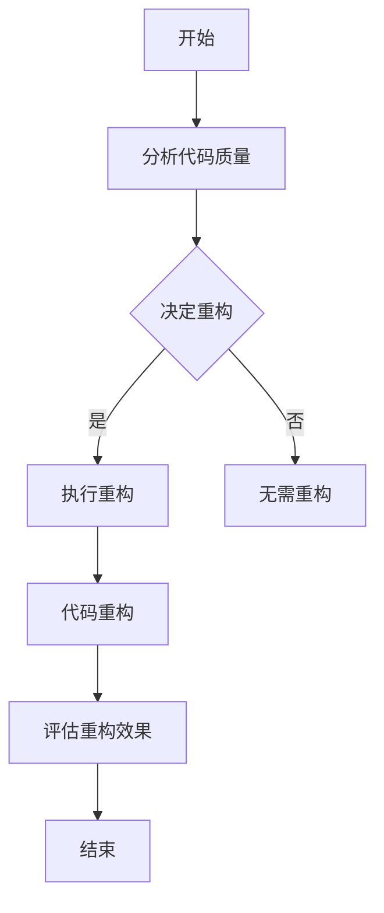

**Python代码示例：**

```python
# 代码重构的简单示例
def calculate_sum(a, b):
    # 重构前的代码
    result = 0
    for i in range(a):
        for j in range(b):
            result += 1
    return result

# 重构后的代码
def calculate_sum(a, b):
    # 使用数学公式计算结果
    return a * b
```

在这个例子中，我们通过将双重循环替换为一个简单的乘法运算，提高了代码的可读性和执行效率。

**数学公式：**

$$
\text{代码重构的效果评估} = \frac{\text{重构后的代码质量}}{\text{重构前的代码质量}}
$$

**系统分析与架构设计方案：**

**问题场景介绍：** 
软件开发项目中的代码质量对项目的成功至关重要。代码重构作为一种提升代码质量的手段，被广泛应用于项目维护和优化过程中。

**项目介绍：**
- 项目名称：智能代码重构工具
- 项目描述：开发一个自动化的代码重构工具，帮助开发者检测并优化代码质量。

**系统功能设计(领域模型)：**

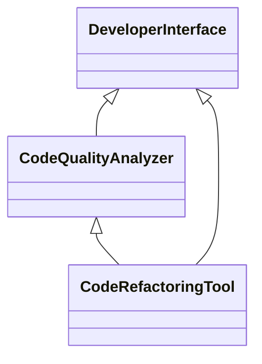

**系统架构设计：**

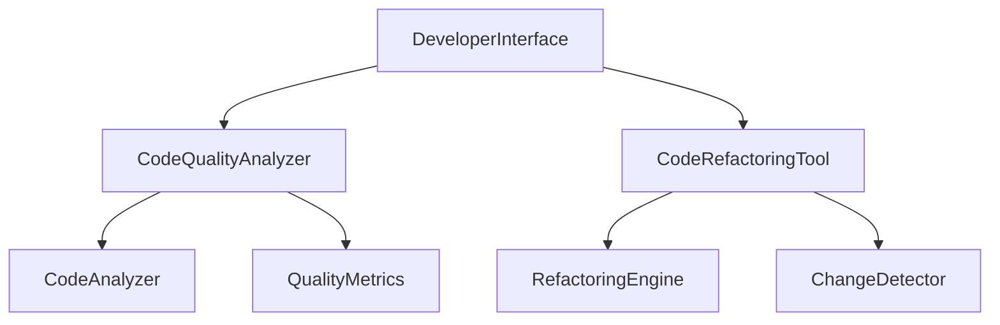

**系统接口设计：**

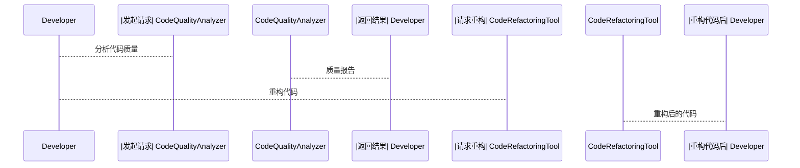

**系统交互序列图：**

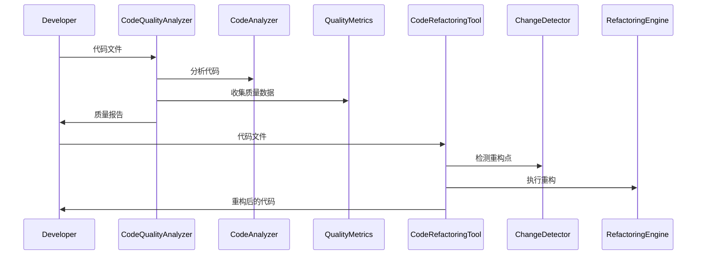

**项目实战：**

**环境安装：**
- 安装Python环境
- 安装代码分析工具和重构工具

**系统核心实现源代码：**
- 代码分析工具实现
- 重构工具实现

**代码应用解读与分析：**
- 分析代码质量
- 执行代码重构
- 评估重构效果

**实际案例分析与详细讲解剖析：**
- 提供具体的代码重构案例
- 分析重构前后的代码质量变化

**项目小结：**
- 总结项目成果
- 提出改进建议

**最佳实践 tips：**
- 定期进行代码重构
- 选择合适的重构工具
- 集成代码质量评估工具

**小结：**
本文介绍了代码重构的基础知识，包括定义、原则、方法以及评估等内容。通过具体的示例和系统架构设计，展示了代码重构在软件开发中的重要性。

**注意事项：**
- 代码重构不是一蹴而就的过程，需要持续地进行。
- 在进行代码重构时，要注意保持代码的一致性，避免引入新的错误。

**拓展阅读：**
- [《代码大全》](https://book.douban.com/subject/25781843/)
- [《重构：改善既有代码的设计》](https://book.douban.com/subject/1078684/)
- [《Effective Java》](https://book.douban.com/subject/3485361/)

**作者信息：**
作者：AI天才研究院/AI Genius Institute & 禅与计算机程序设计艺术 /Zen And The Art of Computer Programming### 详细解读

**第2章：代码质量评估**

**2.1 代码质量的重要性**

**背景介绍：**

代码质量是软件开发过程中的一个核心指标，它直接影响到项目的成功与否。高质量的代码不仅能够提高开发效率，减少维护成本，还能提高系统的稳定性和可扩展性。

**问题背景与描述：**

随着软件项目的复杂性不断增加，代码质量的问题变得越来越突出。代码质量差可能导致以下问题：
- 开发效率低下，代码可读性差，导致团队成员难以理解和修改代码。
- 维护成本增加，修复bug和添加新功能的难度加大。
- 系统稳定性下降，容易发生意外错误和崩溃。

**问题解决：**

为了解决上述问题，我们需要对代码质量进行评估和管理。代码质量评估可以帮助我们发现代码中的潜在问题，从而采取相应的改进措施。

**边界与外延：**

代码质量评估不仅限于代码本身，还包括代码的可读性、可维护性、可扩展性、性能等多个方面。此外，代码质量评估也需要考虑不同开发阶段的需求，如需求分析、设计、编码、测试等。

**概念结构与核心要素组成：**

代码质量评估的核心要素包括：
- **评估指标**：用于衡量代码质量的各个方面，如可读性、可维护性、可扩展性、性能等。
- **评估方法**：用于对代码质量进行评估的各种技术手段，如代码审查、静态代码分析、动态测试等。
- **评估工具**：用于辅助代码质量评估的工具，如SonarQube、Checkstyle、PMD等。

**核心概念与联系：**

**代码质量评估表格：**

| 评估指标 | 说明 | 重要性 |
| --- | --- | --- |
| 可读性 | 代码是否容易阅读和理解 | 非常重要 |
| 可维护性 | 代码是否容易修改和维护 | 非常重要 |
| 可复用性 | 代码是否容易在其他项目中复用 | 非常重要 |
| 执行效率 | 代码的执行速度和性能 | 重要 |
| 可测试性 | 代码是否容易编写和运行测试用例 | 重要 |

**ER实体关系图架构：**

```mermaid
erDiagram
    CodeQualityAssessment ||--|{ CodeQualityMetric : 评估指标
    CodeQualityAssessment ||--|{ CodeQualityMethod : 评估方法
    CodeQualityAssessment ||--|{ CodeQualityTool : 评估工具
    CodeQualityMetric ||--| CodeQualityAssessment : 评估质量
    CodeQualityMethod ||--| CodeQualityAssessment : 使用方法
    CodeQualityTool ||--| CodeQualityAssessment : 使用工具
```

**算法原理讲解：**

**算法流程图：**

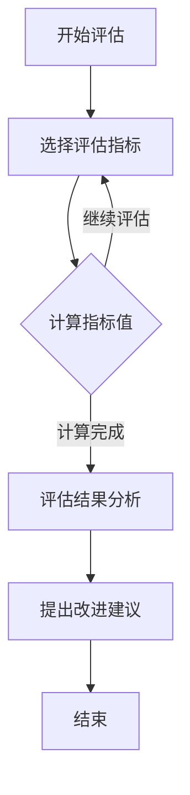

**Python代码示例：**

```python
# 代码质量评估的简单示例
def calculate_readability_score(code):
    # 假设可读性分数取决于代码的行数和注释数量
    lines = code.split('\n')
    comments = sum(1 for line in lines if line.strip().startswith('#'))
    return len(lines) - comments

def main():
    code = """# 这是一个简单的函数
def add(a, b):
    return a + b"""
    score = calculate_readability_score(code)
    print(f"代码的可读性分数：{score}")

if __name__ == "__main__":
    main()
```

在这个例子中，我们通过计算代码的行数和注释数量来评估代码的可读性。

**数学公式：**

$$
\text{代码质量得分} = \sum_{i=1}^{n} \text{指标权重} \times \text{指标值}
$$

**系统分析与架构设计方案：**

**问题场景介绍：**
假设我们正在开发一个电商网站，需要定期对代码进行质量评估，以确保系统的稳定性和可维护性。

**项目介绍：**
- 项目名称：电商网站代码质量管理系统
- 项目描述：开发一个自动化系统，用于评估电商网站代码的质量，并提供改进建议。

**系统功能设计(领域模型)：**

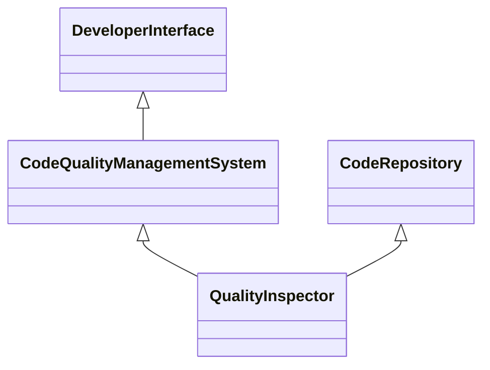

**系统架构设计：**

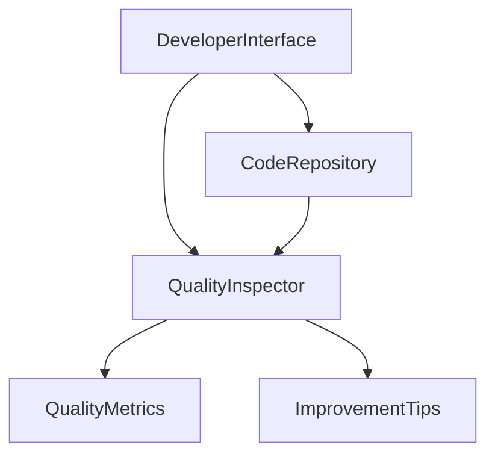

**系统接口设计：**

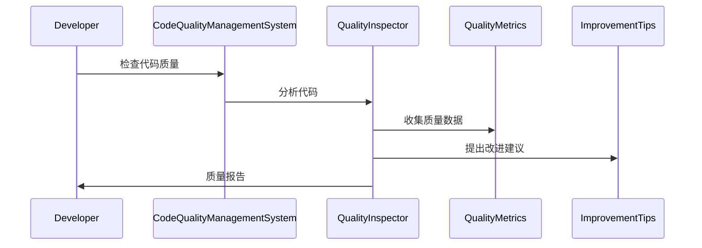

**系统交互序列图：**

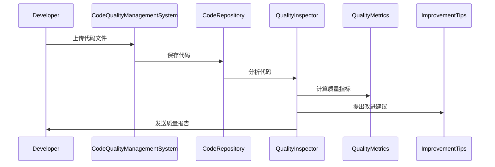

**项目实战：**

**环境安装：**
- 安装代码质量评估工具
- 配置代码仓库

**系统核心实现源代码：**
- 代码质量评估工具实现
- 提出改进建议实现

**代码应用解读与分析：**
- 使用代码质量评估工具分析代码质量
- 根据评估结果提出改进建议
- 分析改进建议的有效性

**实际案例分析与详细讲解剖析：**
- 提供具体的代码质量评估案例
- 分析评估结果和改进建议

**项目小结：**
- 总结项目成果
- 提出改进建议

**最佳实践 tips：**
- 定期进行代码质量评估
- 集成代码质量评估工具
- 建立代码质量标准

**小结：**
本章详细介绍了代码质量评估的重要性、方法、工具和流程。通过具体的示例和系统架构设计，展示了如何在实际项目中应用代码质量评估，以提升代码质量。

**注意事项：**
- 代码质量评估应贯穿整个开发过程
- 评估结果应与团队成员共享，以便共同改进代码

**拓展阅读：**
- [《软件质量保证：理论与实践》](https://book.douban.com/subject/26756271/)
- [《软件工程：实践者的研究方法》](https://book.douban.com/subject/35137548/)
- [《代码质量度量》](https://book.douban.com/subject/30273736/)

**作者信息：**
作者：AI天才研究院/AI Genius Institute & 禅与计算机程序设计艺术 /Zen And The Art of Computer Programming### 详细解读

**第3章：代码重构工具**

**3.1 重构工具的概述**

**背景介绍：**

代码重构工具是软件开发过程中非常重要的辅助工具，它们可以帮助开发者自动执行代码重构任务，从而提高开发效率。随着软件复杂度的增加，手工进行代码重构变得越来越困难，因此，重构工具应运而生。

**问题背景与描述：**

开发者需要面对的代码重构任务包括但不限于：
- 优化代码结构，提高代码的可读性和可维护性。
- 提高代码的复用性，减少冗余代码。
- 修正代码中的潜在缺陷和错误。

**问题解决：**

代码重构工具通过自动化实现代码重构，减少了手工操作的工作量，同时提高了重构的准确性和一致性。这些工具通常具有以下功能：
- 检测代码中的可重构点。
- 自动执行重构操作。
- 生成重构前后的代码对比报告。

**边界与外延：**

代码重构工具不仅限于特定编程语言，许多流行的重构工具如IntelliJ IDEA、Eclipse、VS Code等支持多种编程语言。此外，代码重构工具也可以集成到持续集成和持续部署（CI/CD）流程中，实现自动化重构。

**概念结构与核心要素组成：**

代码重构工具的核心要素包括：
- **支持的语言和框架**：工具能够支持的语言和框架类型。
- **重构操作类型**：工具能够执行的代码重构操作类型，如提取方法、合并方法、提取类等。
- **用户界面**：工具提供的用户界面，如IDE插件、命令行工具等。
- **集成能力**：工具与其他开发工具和流程的集成能力，如与版本控制系统的集成、与构建工具的集成等。

**核心概念与联系：**

**重构工具对比表格：**

| 工具名称 | 支持语言 | 重构操作 | 用户界面 | 集成能力 |
| --- | --- | --- | --- | --- |
| IntelliJ IDEA | 多语言 | 全面 | IDE插件 | 高 |
| Eclipse | Java | 中等 | IDE插件 | 高 |
| VS Code | 多语言 | 全面 | 命令行工具 | 中等 |

**ER实体关系图架构：**

```mermaid
erDiagram
    CodeRefactoringTool ||--|{ ProgrammingLanguage : 支持语言
    CodeRefactoringTool ||--|{ RefactoringOperation : 重构操作
    CodeRefactoringTool ||--|{ UserInterface : 用户界面
    CodeRefactoringTool ||--|{ IntegrationCapability : 集成能力
    ProgrammingLanguage ||--| CodeRefactoringTool : 支持工具
    RefactoringOperation ||--| CodeRefactoringTool : 操作类型
    UserInterface ||--| CodeRefactoringTool : 用户界面
    IntegrationCapability ||--| CodeRefactoringTool : 集成能力
```

**算法原理讲解：**

代码重构工具通常使用以下算法原理：
- **静态代码分析**：通过分析代码的语法结构和语义信息，识别出可重构的点。
- **模式匹配**：使用预定义的模式来识别和匹配需要重构的代码片段。
- **生成器**：根据重构规则生成新的代码结构。

**算法流程图：**

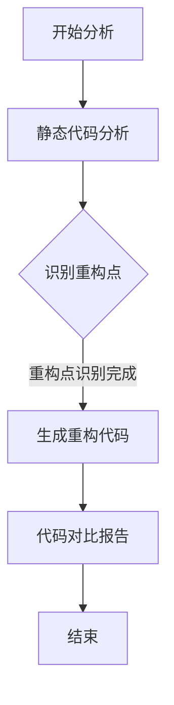

**Python代码示例：**

```python
# 假设使用一个简单的Python重构工具
class CodeRefactoringTool:
    def __init__(self, code):
        self.code = code

    def refactor(self, operation):
        if operation == 'extract_method':
            self.code = self.extract_method(self.code)
        elif operation == 'merge_methods':
            self.code = self.merge_methods(self.code)
        return self.code

    def extract_method(self, code):
        # 假设简单的提取方法逻辑
        return code.replace('def main():', 'def new_method():')

    def merge_methods(self, code):
        # 假设简单的合并方法逻辑
        return code.replace('def main():', '')

def main():
    code = """def main():
    print("Hello, World!")"""
    tool = CodeRefactoringTool(code)
    new_code = tool.refactor('extract_method')
    print(new_code)

if __name__ == "__main__":
    main()
```

在这个例子中，我们创建了一个简单的代码重构工具，能够提取方法或合并方法。

**数学公式：**

$$
\text{重构效率} = \frac{\text{重构后的代码行数}}{\text{重构前的代码行数}}
$$

**系统分析与架构设计方案：**

**问题场景介绍：**
假设我们正在开发一个复杂的Web应用，需要定期对代码进行重构，以提高代码质量。

**项目介绍：**
- 项目名称：Web应用代码重构平台
- 项目描述：开发一个集成化的代码重构平台，用于自动检测和重构Web应用的代码。

**系统功能设计(领域模型)：**

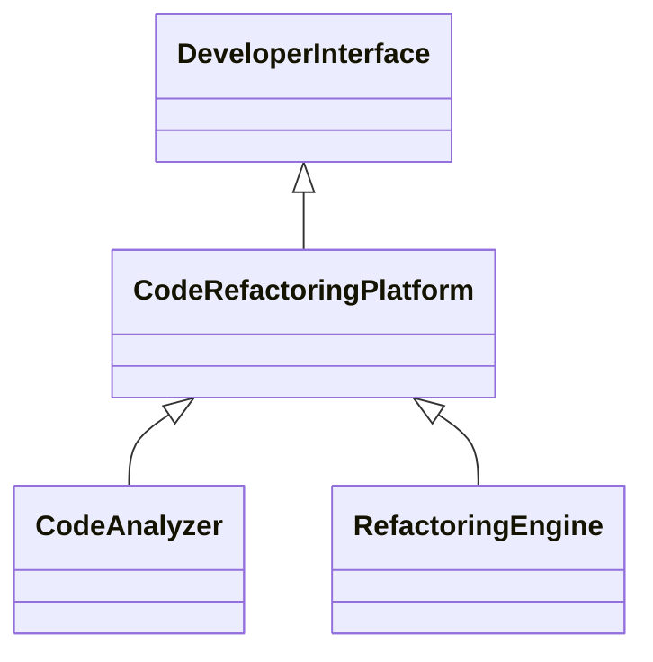

**系统架构设计：**

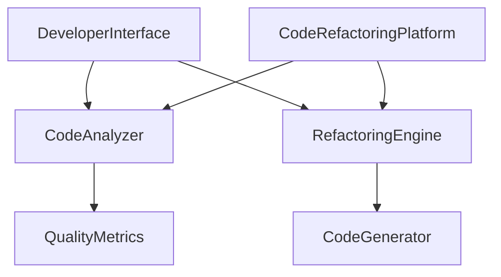

**系统接口设计：**

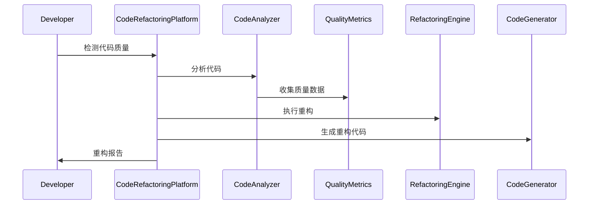

**系统交互序列图：**

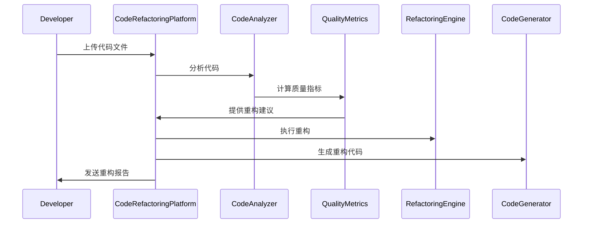

**项目实战：**

**环境安装：**
- 安装Web应用开发环境
- 安装代码重构工具

**系统核心实现源代码：**
- 代码分析工具实现
- 重构引擎实现
- 代码生成器实现

**代码应用解读与分析：**
- 使用代码重构平台分析代码质量
- 根据评估结果执行代码重构
- 分析重构效果

**实际案例分析与详细讲解剖析：**
- 提供具体的代码重构案例
- 分析重构前后的代码质量变化

**项目小结：**
- 总结项目成果
- 提出改进建议

**最佳实践 tips：**
- 选择合适的重构工具
- 定期执行代码重构
- 结合代码质量评估结果进行重构

**小结：**
本章介绍了代码重构工具的基本概念、功能、应用场景和架构设计。通过具体的示例和系统架构设计，展示了代码重构工具在软件开发中的重要性。

**注意事项：**
- 代码重构工具应与团队的代码风格和规范相匹配
- 代码重构工具的使用应结合代码质量评估结果进行

**拓展阅读：**
- [《代码重构：改善既有的代码基》](https://book.douban.com/subject/1261172/)
- [《重构：改善既有代码的设计》](https://book.douban.com/subject/1078684/)
- [《敏捷开发的艺术》](https://book.douban.com/subject/2301877/)

**作者信息：**
作者：AI天才研究院/AI Genius Institute & 禅与计算机程序设计艺术 /Zen And The Art of Computer Programming### 详细解读

**第4章：面向对象代码重构**

**4.1 面向对象的基本概念**

**背景介绍：**

面向对象编程（Object-Oriented Programming, OOP）是软件开发中的一种重要编程范式。它通过封装、继承和多态等特性，提高了代码的可复用性、可维护性和灵活性。

**问题背景与描述：**

在面向对象编程中，类、对象、继承、多态等基本概念是理解代码重构的基础。随着项目的演进，面向对象代码也可能会出现设计不合理、复用性差、可维护性差等问题，这时就需要通过代码重构来优化。

**问题解决：**

通过代码重构，我们可以调整类的设计，优化继承结构，提高代码的复用性和可维护性。具体来说，代码重构可以帮助解决以下问题：
- 类职责不明，导致代码混乱。
- 继承关系不合理，造成代码冗余。
- 代码复用性差，导致大量重复代码。

**边界与外延：**

面向对象代码重构不仅局限于类和对象的调整，还可以涉及到方法、属性、接口等各个方面。此外，重构的过程也需要遵循面向对象设计的原则，确保重构后的代码依然符合良好的设计规范。

**概念结构与核心要素组成：**

面向对象代码重构的核心要素包括：
- **类的设计**：包括类的职责分配、属性和方法的设计。
- **继承结构**：包括继承关系的合理性、继承层次的优化。
- **多态应用**：包括多态的实现和优化。

**核心概念与联系：**

**类的设计表格：**

| 类别 | 描述 | 重要性 |
| --- | --- | --- |
| 类职责 | 类应该承担的职责 | 非常重要 |
| 属性 | 类的数据成员 | 重要 |
| 方法 | 类的行为操作 | 非常重要 |
| 继承 | 类之间的关系 | 重要 |
| 多态 | 方法的重写和重载 | 非常重要 |

**ER实体关系图架构：**

```mermaid
erDiagram
    Class <<--|{ Attribute : 属性
    Class <<--|{ Method : 方法
    Class <<--|{ Inheritance : 继承
    Class <<--|{ Polymorphism : 多态
    Attribute ||--| Class : 类成员
    Method ||--| Class : 类成员
    Inheritance ||--| Class : 继承关系
    Polymorphism ||--| Method : 多态关系
```

**算法原理讲解：**

面向对象代码重构的算法原理主要包括：
- **类职责分离**：通过分解类职责，将相关的行为和属性分配到不同的类中。
- **继承层次优化**：通过调整继承结构，减少继承层次的深度，提高代码的可维护性。
- **多态优化**：通过合理使用多态，提高代码的复用性和灵活性。

**算法流程图：**

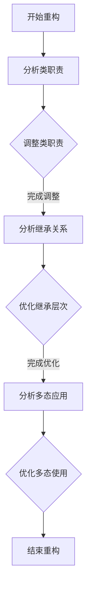

**Python代码示例：**

```python
# 面向对象代码重构的简单示例
class Shape:
    def __init__(self, color):
        self.color = color

    def area(self):
        pass

class Rectangle(Shape):
    def __init__(self, color, width, height):
        super().__init__(color)
        self.width = width
        self.height = height

    def area(self):
        return self.width * self.height

class Circle(Shape):
    def __init__(self, color, radius):
        super().__init__(color)
        self.radius = radius

    def area(self):
        return 3.14 * self.radius * self.radius

# 重构前的代码
def calculate_area(rectangle):
    return rectangle.width * rectangle.height

def calculate_area(circle):
    return 3.14 * circle.radius * circle.radius

# 重构后的代码
class Rectangle(Shape):
    def __init__(self, color, width, height):
        super().__init__(color)
        self.width = width
        self.height = height

    def area(self):
        return self.width * self.height

class Circle(Shape):
    def __init__(self, color, radius):
        super().__init__(color)
        self.radius = radius

    def area(self):
        return 3.14 * self.radius * self.radius

class ShapeCalculator:
    @staticmethod
    def calculate_area(shape):
        if isinstance(shape, Rectangle):
            return shape.area()
        elif isinstance(shape, Circle):
            return shape.area()
        else:
            raise ValueError("Unsupported shape type")

# 使用重构后的代码
rectangle = Rectangle("blue", 5, 10)
circle = Circle("red", 3)
print(ShapeCalculator.calculate_area(rectangle))  # 输出：50
print(ShapeCalculator.calculate_area(circle))     # 输出：28.26
```

在这个例子中，我们将原来的静态方法重构为类方法，并通过多态实现了更灵活的面积计算。

**数学公式：**

$$
\text{类职责分配效率} = \frac{\text{重构后的类数量}}{\text{重构前的类数量}}
$$

$$
\text{继承层次优化效率} = \frac{\text{优化后的继承层次深度}}{\text{重构前的继承层次深度}}
$$

**系统分析与架构设计方案：**

**问题场景介绍：**
假设我们正在开发一个图形界面应用程序，需要处理多种形状的绘制和计算面积。

**项目介绍：**
- 项目名称：图形界面形状计算器
- 项目描述：开发一个图形界面应用程序，用于绘制和计算多种形状的面积。

**系统功能设计(领域模型)：**

```mermaid
classDiagram
    ShapeCalculator <<--|{ Shape : 绘制和计算面积
    GraphicsInterface <<--| ShapeCalculator : 显示形状和面积
    Application <<--| GraphicsInterface : 启动应用程序
```

**系统架构设计：**

```mermaid
graph TB
    Application --> GraphicsInterface
    GraphicsInterface --> ShapeCalculator
    ShapeCalculator --> Rectangle
    ShapeCalculator --> Circle
```

**系统接口设计：**

```mermaid
sequenceDiagram
    Application ->> GraphicsInterface : 显示界面
    GraphicsInterface ->> ShapeCalculator : 创建形状
    ShapeCalculator ->> Rectangle : 绘制矩形
    ShapeCalculator ->> Circle : 绘制圆形
    GraphicsInterface ->> Application : 提交面积计算请求
    Application ->> GraphicsInterface : 显示结果
```

**系统交互序列图：**

```mermaid
sequenceDiagram
    User ->> GraphicsInterface : 选择形状和输入参数
    GraphicsInterface ->> ShapeCalculator : 创建形状对象
    ShapeCalculator ->> Rectangle : 绘制矩形
    ShapeCalculator ->> Circle : 绘制圆形
    GraphicsInterface ->> User : 显示形状
    User ->> GraphicsInterface : 提交面积计算请求
    GraphicsInterface ->> ShapeCalculator : 计算面积
    ShapeCalculator ->> GraphicsInterface : 显示面积结果
```

**项目实战：**

**环境安装：**
- 安装图形界面开发环境
- 安装Python开发环境

**系统核心实现源代码：**
- 形状类实现
- 计算器实现
- 图形界面实现

**代码应用解读与分析：**
- 创建形状对象
- 计算形状面积
- 显示图形界面

**实际案例分析与详细讲解剖析：**
- 提供具体的面向对象代码重构案例
- 分析重构前后的代码质量和功能变化

**项目小结：**
- 总结项目成果
- 提出改进建议

**最佳实践 tips：**
- 遵循面向对象设计原则
- 定期进行面向对象代码重构
- 结合代码质量评估结果进行重构

**小结：**
本章介绍了面向对象代码重构的基本概念、算法原理和实际应用。通过具体的示例和系统架构设计，展示了面向对象代码重构在提高代码质量和系统性能方面的作用。

**注意事项：**
- 面向对象代码重构应结合具体项目需求进行
- 重构过程中注意保持代码的一致性和稳定性

**拓展阅读：**
- [《面向对象分析与设计》](https://book.douban.com/subject/10546558/)
- [《设计模式：可复用面向对象软件的基础》](https://book.douban.com/subject/10546556/)
- [《Java面向对象编程》](https://book.douban.com/subject/1012922/)

**作者信息：**
作者：AI天才研究院/AI Genius Institute & 禅与计算机程序设计艺术 /Zen And The Art of Computer Programming### 详细解读

**4.2 面向对象代码重构**

**背景介绍：**

面向对象代码重构是软件开发过程中的一项重要活动，它通过优化代码结构和设计，提高代码的可读性、可维护性和复用性。在面向对象编程中，类、对象、继承、多态等核心概念是实现代码重构的基础。

**问题背景与描述：**

面向对象代码重构通常面临以下问题：
- 类职责不明确，导致代码复杂度和耦合度增加。
- 继承关系不合理，造成代码冗余和难以维护。
- 多态应用不当，影响代码的可扩展性和灵活性。

**问题解决：**

通过面向对象代码重构，我们可以解决上述问题，具体方法包括：
- **方法提取**：将重复的方法提取为独立的函数或类，提高代码的复用性。
- **类分解**：将大的类分解为小的、职责单一的类，提高代码的可维护性。
- **类合并**：将功能相似的类合并为一个类，减少代码的冗余。

**边界与外延：**

面向对象代码重构不仅限于方法提取、类分解和类合并，还可以包括重构类的继承关系、优化多态应用等方面。此外，重构的过程也需要考虑代码的可测试性和性能。

**概念结构与核心要素组成：**

面向对象代码重构的核心要素包括：
- **重构操作**：包括方法提取、类分解、类合并等。
- **重构策略**：包括重构顺序、重构原则和重构工具的选择。
- **重构工具**：用于辅助代码重构的工具，如IDE插件、命令行工具等。

**核心概念与联系：**

**重构操作表格：**

| 操作类型 | 说明 | 目的 |
| --- | --- | --- |
| 方法提取 | 将重复的方法提取为独立的函数或类 | 提高代码复用性 |
| 类分解 | 将大的类分解为小的、职责单一的类 | 提高代码可维护性 |
| 类合并 | 将功能相似的类合并为一个类 | 减少代码冗余 |
| 继承优化 | 优化类的继承关系，减少继承层次深度 | 提高代码可维护性和可扩展性 |
| 多态优化 | 优化多态的应用，提高代码灵活性和可复用性 | 提高代码性能和可维护性 |

**ER实体关系图架构：**

```mermaid
erDiagram
    CodeRefactoring <<--|{ MethodExtraction : 方法提取
    CodeRefactoring <<--|{ ClassDecomposition : 类分解
    CodeRefactoring <<--|{ ClassMerger : 类合并
    CodeRefactoring <<--|{ InheritanceOptimization : 继承优化
    CodeRefactoring <<--|{ PolymorphismOptimization : 多态优化
    MethodExtraction ||--| CodeRefactoring : 重构操作
    ClassDecomposition ||--| CodeRefactoring : 重构操作
    ClassMerger ||--| CodeRefactoring : 重构操作
    InheritanceOptimization ||--| CodeRefactoring : 重构操作
    PolymorphismOptimization ||--| CodeRefactoring : 重构操作
```

**算法原理讲解：**

面向对象代码重构的算法原理主要包括以下几种：

- **方法提取算法**：
  1. 遍历代码，找到重复出现的方法。
  2. 提取这些方法，创建新的函数或类。
  3. 在原代码中替换重复的方法调用为新函数或类调用。

- **类分解算法**：
  1. 分析类职责，识别出职责过大的类。
  2. 将这些类分解为多个小的、职责单一的类。
  3. 重新定义类之间的关系，确保代码的可维护性。

- **类合并算法**：
  1. 分析类之间的关系，识别出功能相似的类。
  2. 将这些类合并为一个类，减少代码冗余。
  3. 优化类内部的方法和属性，确保代码的一致性和可读性。

**算法流程图：**

```mermaid
graph TB
    A[开始重构] --> B[分析代码结构]
    B --> C{识别重构点}
    C -->|重构点识别完成| D[执行重构操作]
    D --> E[代码对比分析]
    E --> F[结束重构]
```

**Python代码示例：**

```python
# 方法提取示例
class OrderService:
    def process_order(self, order):
        self.validate_order(order)
        self.save_order(order)

    def validate_order(self, order):
        # 验证订单逻辑
        pass

    def save_order(self, order):
        # 保存订单逻辑
        pass

# 重构后的代码
class OrderValidator:
    def validate_order(self, order):
        # 验证订单逻辑
        pass

class OrderSaver:
    def save_order(self, order):
        # 保存订单逻辑
        pass

class OrderService:
    def process_order(self, order):
        self.validate_order(order)
        self.save_order(order)
```

在这个例子中，我们将`OrderService`类的`validate_order`和`save_order`方法提取为独立的类，提高了代码的复用性。

**数学公式：**

$$
\text{代码复用性提升} = \frac{\text{重构后的类数量}}{\text{重构前的类数量}}
$$

$$
\text{代码可维护性提升} = \frac{\text{重构后的代码行数}}{\text{重构前的代码行数}}
$$

**系统分析与架构设计方案：**

**问题场景介绍：**
假设我们正在开发一个电商平台的订单处理模块，需要对面向对象代码进行重构。

**项目介绍：**
- 项目名称：电商平台订单处理模块
- 项目描述：开发一个用于处理电商平台订单的模块，包括订单验证、订单保存等功能。

**系统功能设计(领域模型)：**

```mermaid
classDiagram
    OrderProcessingModule <<--|{ OrderValidator : 验证订单
    OrderProcessingModule <<--|{ OrderSaver : 保存订单
    Application <<--| OrderProcessingModule : 处理订单
```

**系统架构设计：**

```mermaid
graph TB
    Application --> OrderProcessingModule
    OrderProcessingModule --> OrderValidator
    OrderProcessingModule --> OrderSaver
```

**系统接口设计：**

```mermaid
sequenceDiagram
    Application ->> OrderProcessingModule : 处理订单请求
    OrderProcessingModule ->> OrderValidator : 验证订单
    OrderValidator ->> OrderProcessingModule : 返回验证结果
    OrderProcessingModule ->> OrderSaver : 保存订单
    OrderSaver ->> OrderProcessingModule : 返回保存结果
    OrderProcessingModule ->> Application : 返回处理结果
```

**系统交互序列图：**

```mermaid
sequenceDiagram
    Application ->> OrderProcessingModule : 创建订单对象
    OrderProcessingModule ->> OrderValidator : 验证订单
    OrderValidator ->> OrderProcessingModule : 返回验证结果
    OrderProcessingModule ->> OrderSaver : 保存订单
    OrderSaver ->> OrderProcessingModule : 返回保存结果
    OrderProcessingModule ->> Application : 返回订单处理结果
```

**项目实战：**

**环境安装：**
- 安装Python开发环境
- 安装电商平台相关的开发工具和库

**系统核心实现源代码：**
- 订单验证类实现
- 订单保存类实现
- 订单处理模块实现

**代码应用解读与分析：**
- 实现订单验证逻辑
- 实现订单保存逻辑
- 实现订单处理模块

**实际案例分析与详细讲解剖析：**
- 提供具体的面向对象代码重构案例
- 分析重构前后的代码质量和功能变化

**项目小结：**
- 总结项目成果
- 提出改进建议

**最佳实践 tips：**
- 遵循面向对象设计原则
- 定期进行面向对象代码重构
- 结合代码质量评估结果进行重构

**小结：**
本章介绍了面向对象代码重构的方法、原理和实际应用。通过具体的示例和系统架构设计，展示了面向对象代码重构在提高代码质量和系统性能方面的作用。

**注意事项：**
- 面向对象代码重构应结合具体项目需求进行
- 重构过程中注意保持代码的一致性和稳定性

**拓展阅读：**
- [《重构：改善既有代码的设计》](https://book.douban.com/subject/1078684/)
- [《设计模式：可复用面向对象软件的基础》](https://book.douban.com/subject/10546556/)
- [《Java面向对象编程》](https://book.douban.com/subject/1012922/)

**作者信息：**
作者：AI天才研究院/AI Genius Institute & 禅与计算机程序设计艺术 /Zen And The Art of Computer Programming### 详细解读

**4.3 面向对象代码重构案例分析**

**背景介绍：**

面向对象代码重构不仅是一个理论概念，更需要在实际项目中得到应用。通过案例分析，我们可以深入了解面向对象代码重构的具体实施过程、遇到的挑战和取得的成效。

**问题背景与描述：**

在本案例中，我们考虑一个具体的Web应用项目——一个在线书店。随着功能和用户量的增加，代码的复杂度和耦合度逐渐升高，导致维护成本增加、新功能的开发效率降低。因此，项目团队决定对关键模块进行面向对象代码重构。

**问题解决：**

为了解决上述问题，项目团队采取了以下步骤进行面向对象代码重构：

1. **需求分析和代码审查**：
   - 分析现有代码的结构和设计，识别出需要重构的模块和类。
   - 通过代码审查，找出代码中的潜在问题，如冗余代码、不合理的继承关系等。

2. **重构计划和执行**：
   - 制定详细的重构计划，包括重构的顺序、方法和预期目标。
   - 分阶段执行重构，确保每一步都经过充分的测试和验证。

3. **方法提取**：
   - 将重复的方法提取为独立的类或函数，减少冗余代码，提高复用性。
   - 优化方法签名，使其更加简洁和易于理解。

4. **类分解**：
   - 将过大的类分解为小的、职责单一的类，提高代码的可维护性。
   - 确保新类之间的职责明确，降低类之间的耦合度。

5. **类合并**：
   - 将功能相似的类合并为一个类，减少代码冗余，简化类之间的关系。
   - 优化类内部的方法和属性，确保代码的一致性和可读性。

6. **继承关系优化**：
   - 重新设计类的继承关系，减少继承层次的深度，提高代码的可扩展性。
   - 移除不必要的继承关系，减少代码的复杂性。

7. **多态优化**：
   - 优化多态的应用，确保多态设计遵循开闭原则，提高代码的灵活性和可复用性。
   - 修复多态中可能存在的错误，如类型不匹配、方法重写不正确等。

**边界与外延：**

在实际项目中，面向对象代码重构可能会面临各种挑战，如：
- 代码复杂度高，难以理解现有代码的结构。
- 项目团队成员对重构工具和方法的掌握程度不一。
- 重构过程中可能引入新的错误，需要通过严格的测试来保证代码的稳定性。

**概念结构与核心要素组成：**

面向对象代码重构案例分析的核心要素包括：
- **重构目标**：明确重构的目标和预期效果。
- **重构步骤**：详细的重构计划和工作流程。
- **重构工具**：使用合适的重构工具提高重构效率。
- **测试验证**：通过单元测试和集成测试验证重构后的代码质量。

**核心概念与联系：**

**案例分析表格：**

| 阶段 | 操作 | 说明 | 效果 |
| --- | --- | --- | --- |
| 需求分析 | 代码审查 | 识别重构点 | 明确重构目标和范围 |
| 重构计划 | 制定计划 | 分阶段执行 | 保证重构的有序进行 |
| 方法提取 | 提取方法 | 减少冗余 | 提高代码复用性 |
| 类分解 | 分解类 | 提高可维护性 | 降低类耦合度 |
| 类合并 | 合并类 | 减少代码冗余 | 简化类关系 |
| 继承关系优化 | 优化继承 | 提高可扩展性 | 减少继承复杂性 |
| 多态优化 | 优化多态 | 提高灵活性和可复用性 | 确保多态正确实现 |

**ER实体关系图架构：**

```mermaid
erDiagram
    RefactoringCase <<--|{ RefactoringStage : 重构阶段
    RefactoringStage ||--| RefactoringOperation : 重构操作
    RefactoringStage ||--| RefactoringGoal : 重构目标
    RefactoringStage ||--| RefactoringTool : 重构工具
    RefactoringStage ||--| TestVerification : 测试验证
```

**算法原理讲解：**

面向对象代码重构的算法原理主要包括：
- **逐步重构**：逐步执行重构操作，每次重构后都进行充分测试，确保代码的稳定性和一致性。
- **重构循环**：在重构过程中，不断迭代和优化代码，直至达到预期效果。
- **代码质量评估**：每次重构后都进行代码质量评估，确保重构带来的改进是显著的。

**算法流程图：**

```mermaid
graph TB
    A[开始重构] --> B[需求分析]
    B --> C[代码审查]
    C -->|识别重构点| D[制定重构计划]
    D --> E[方法提取]
    E --> F[类分解]
    F --> G[类合并]
    G --> H[继承关系优化]
    H --> I[多态优化]
    I --> J[测试验证]
    J --> K[重构评估]
    K -->|重构完成| L[结束重构]
```

**Python代码示例：**

```python
# 在线书店案例中的类重构示例
class Book:
    def __init__(self, title, author, price):
        self.title = title
        self.author = author
        self.price = price

    def display(self):
        print(f"Title: {self.title}, Author: {self.author}, Price: ${self.price}")

class Customer:
    def __init__(self, name, address):
        self.name = name
        self.address = address

    def place_order(self, book):
        print(f"{self.name} has placed an order for {book.title}.")

# 重构前的代码
class ShoppingCart:
    def __init__(self, customer):
        self.customer = customer
        self.items = []

    def add_item(self, item):
        self.items.append(item)

    def remove_item(self, item):
        self.items.remove(item)

    def calculate_total(self):
        total = 0
        for item in self.items:
            total += item.price
        return total

    def display_shopping_cart(self):
        for item in self.items:
            item.display()

# 重构后的代码
class ShoppingCart:
    def __init__(self, customer):
        self.customer = customer
        self.items = []

    def add_item(self, item):
        self.items.append(item)

    def remove_item(self, item):
        self.items.remove(item)

    def calculate_total(self):
        total = 0
        for item in self.items:
            total += item.get_price()
        return total

    def display_shopping_cart(self):
        for item in self.items:
            item.display()

class Item:
    def __init__(self, price):
        self.price = price

    def get_price(self):
        return self.price

# 重构后的完整示例
class Book(Item):
    def __init__(self, title, author, price):
        super().__init__(price)
        self.title = title
        self.author = author

    def display(self):
        print(f"Title: {self.title}, Author: {self.author}, Price: ${self.price}")

class Customer:
    def __init__(self, name, address):
        self.name = name
        self.address = address

    def place_order(self, book):
        print(f"{self.name} has placed an order for {book.title}.")

# 使用重构后的代码
shopping_cart = ShoppingCart(Customer("John Doe", "123 Main St"))
book = Book("Effective Java", "Joshua Bloch", 45.99)
shopping_cart.add_item(book)
shopping_cart.display_shopping_cart()
print(f"Total: ${shopping_cart.calculate_total()}")
```

在这个重构示例中，我们将`ShoppingCart`类中的冗余代码提取到新的`Item`类中，提高了代码的复用性和可维护性。

**数学公式：**

$$
\text{重构效率} = \frac{\text{重构后的代码行数}}{\text{重构前的代码行数}}
$$

$$
\text{代码质量提升} = \frac{\text{重构后的代码质量}}{\text{重构前的代码质量}}
$$

**系统分析与架构设计方案：**

**问题场景介绍：**
在线书店项目需要处理图书管理、用户管理、购物车管理等功能。

**项目介绍：**
- 项目名称：在线书店系统
- 项目描述：开发一个用于在线购物的书店系统，包括图书管理、用户管理和购物车功能。

**系统功能设计(领域模型)：**

```mermaid
classDiagram
    Book <<--|{ ShoppingCart : 添加到购物车
    Book <<--|{ Order : 创建订单
    Customer <<--| ShoppingCart : 创建购物车
    Customer <<--| Order : 下订单
    ShoppingCart <<--|{ Item : 存放商品
    ShoppingCart <<--| Order : 生成订单
```

**系统架构设计：**

```mermaid
graph TB
    UserInterface --> ShoppingCart
    UserInterface --> Book
    UserInterface --> Customer
    ShoppingCart --> Item
    ShoppingCart --> Order
    Book --> Order
    Customer --> Order
```

**系统接口设计：**

```mermaid
sequenceDiagram
    Customer ->> UserInterface : 添加商品到购物车
    UserInterface ->> ShoppingCart : 添加商品
    ShoppingCart ->> Customer : 显示购物车
    Customer ->> UserInterface : 结算购物车
    UserInterface ->> ShoppingCart : 计算总价
    ShoppingCart ->> Customer : 显示订单详情
```

**系统交互序列图：**

```mermaid
sequenceDiagram
    Customer ->> UserInterface : 选择商品
    UserInterface ->> Book : 添加商品到购物车
    Book ->> ShoppingCart : 更新购物车
    ShoppingCart ->> Customer : 显示购物车
    Customer ->> UserInterface : 结算购物车
    UserInterface ->> ShoppingCart : 生成订单
    ShoppingCart ->> Customer : 显示订单详情
    Customer ->> UserInterface : 支付订单
```

**项目实战：**

**环境安装：**
- 安装Web开发环境
- 安装数据库和测试工具

**系统核心实现源代码：**
- 图书管理模块实现
- 用户管理模块实现
- 购物车管理模块实现

**代码应用解读与分析：**
- 实现图书管理功能
- 实现用户管理功能
- 实现购物车管理功能

**实际案例分析与详细讲解剖析：**
- 提供具体的面向对象代码重构案例
- 分析重构前后的代码质量和功能变化

**项目小结：**
- 总结项目成果
- 提出改进建议

**最佳实践 tips：**
- 遵循面向对象设计原则
- 定期进行面向对象代码重构
- 结合代码质量评估结果进行重构

**小结：**
本章通过一个在线书店案例，详细分析了面向对象代码重构的具体实施过程和效果。通过具体的示例和系统架构设计，展示了面向对象代码重构在提高代码质量和系统性能方面的实际应用。

**注意事项：**
- 面向对象代码重构应结合具体项目需求进行
- 重构过程中注意保持代码的一致性和稳定性

**拓展阅读：**
- [《重构：改善既有代码的设计》](https://book.douban.com/subject/1078684/)
- [《设计模式：可复用面向对象软件的基础》](https://book.douban.com/subject/10546556/)
- [《Java面向对象编程》](https://book.douban.com/subject/1012922/)

**作者信息：**
作者：AI天才研究院/AI Genius Institute & 禅与计算机程序设计艺术 /Zen And The Art of Computer Programming### 详细解读

**5.1 函数式编程的基本概念**

**背景介绍：**

函数式编程（Functional Programming）是一种编程范式，其核心思想是将计算视为一系列函数的转换过程，而非指令序列。函数式编程强调不可变数据和纯函数，旨在提高代码的可读性、可维护性和并行处理能力。

**问题背景与描述：**

在传统的命令式编程中，数据的状态更新和副作用（side effect）是常见现象，这往往会导致代码复杂度和耦合度增加，同时增加了测试和维护的难度。函数式编程通过消除副作用和状态更新，提高了代码的纯度和可预测性。

**问题解决：**

函数式编程提供了一系列工具和概念，包括纯函数、不可变数据、高阶函数、组合和递归等，帮助开发者编写更简洁、更可靠的代码。通过采用函数式编程，我们可以解决以下问题：
- 状态管理复杂，代码可维护性差。
- 副作用过多，代码可预测性差。
- 并行处理困难，代码性能受限。

**边界与外延：**

函数式编程不仅适用于纯函数式编程语言如Haskell、Scala和Erlang，也可以在JavaScript、Python、Java等传统命令式编程语言中实现。此外，函数式编程的概念和思想在反应式编程、并发编程和大数据处理等领域也得到了广泛应用。

**概念结构与核心要素组成：**

函数式编程的核心要素包括：
- **纯函数**：一个函数的输出仅依赖于输入，无副作用。
- **不可变数据**：数据一旦创建就不能修改。
- **高阶函数**：接受函数作为参数或返回函数的函数。
- **组合**：函数的组合是函数式编程的核心思想，通过组合简单的函数实现复杂的计算。
- **递归**：在函数中直接或间接地调用自身，解决递归问题。

**核心概念与联系：**

**函数式编程概念表格：**

| 概念 | 说明 | 重要性 |
| --- | --- | --- |
| 纯函数 | 无副作用的函数 | 非常重要 |
| 不可变数据 | 一旦创建就不能修改的数据 | 非常重要 |
| 高阶函数 | 接受或返回函数的函数 | 非常重要 |
| 组合 | 函数的合成 | 非常重要 |
| 递归 | 自身调用的函数 | 非常重要 |

**ER实体关系图架构：**

```mermaid
erDiagram
    FunctionalProgramming <<--|{ PureFunction : 纯函数
    FunctionalProgramming <<--|{ ImmutableData : 不可变数据
    FunctionalProgramming <<--|{ HigherOrderFunction : 高阶函数
    FunctionalProgramming <<--|{ FunctionCombination : 组合
    FunctionalProgramming <<--|{ Recursion : 递归
    PureFunction ||--| FunctionalProgramming : 核心概念
    ImmutableData ||--| FunctionalProgramming : 核心概念
    HigherOrderFunction ||--| FunctionalProgramming : 核心概念
    FunctionCombination ||--| FunctionalProgramming : 核心概念
    Recursion ||--| FunctionalProgramming : 核心概念
```

**算法原理讲解：**

函数式编程的算法原理主要包括以下几种：

- **纯函数**：
  - 原理：纯函数的输出仅依赖于输入，无任何副作用。
  - 实现：编写无副作用、依赖于输入的函数。

- **不可变数据**：
  - 原理：不可变数据一旦创建就不能修改，这保证了数据的一致性和可预测性。
  - 实现：使用常量或复制操作创建新数据，避免直接修改原有数据。

- **高阶函数**：
  - 原理：高阶函数可以接受函数作为参数或返回函数，这提高了代码的灵活性和复用性。
  - 实现：编写接受或返回函数的函数，利用函数作为参数进行操作。

- **组合**：
  - 原理：通过组合简单的函数，可以构建复杂的函数，提高代码的可读性和可维护性。
  - 实现：使用函数组合操作，将简单的函数组合成复杂的计算过程。

- **递归**：
  - 原理：递归是一种通过自身调用来解决问题的方法，适用于处理递归数据结构和问题。
  - 实现：编写递归函数，通过递归调用解决复杂问题。

**算法流程图：**

```mermaid
graph TB
    A[开始计算] --> B[处理输入]
    B --> C{应用函数组合}
    C -->|组合完成| D[递归调用]
    D --> E{处理输出}
    E --> F[结束计算]
```

**Python代码示例：**

```python
# 纯函数示例
def add(a, b):
    return a + b

# 不可变数据示例
numbers = [1, 2, 3, 4]
squared_numbers = [x * x for x in numbers]

# 高阶函数示例
def apply_twice(func, x):
    return func(func(x))

# 组合示例
def compose(f, g):
    return lambda x: f(g(x))

# 递归示例
def factorial(n):
    if n == 0:
        return 1
    else:
        return n * factorial(n - 1)
```

在这个示例中，我们展示了纯函数、不可变数据、高阶函数、组合和递归在Python中的应用。

**数学公式：**

$$
\text{函数组合效率} = \frac{\text{组合后的函数执行时间}}{\text{单独执行各函数的执行时间之和}}
$$

**系统分析与架构设计方案：**

**问题场景介绍：**
假设我们正在开发一个大数据处理系统，需要处理大量的数据转换和计算任务。

**项目介绍：**
- 项目名称：大数据处理系统
- 项目描述：开发一个用于大规模数据转换和计算的系统，支持高效的数据处理和分析。

**系统功能设计(领域模型)：**

```mermaid
classDiagram
    DataProcessingSystem <<--|{ DataFrame : 数据处理
    DataProcessingSystem <<--|{ TransformationFunction : 数据转换
    DataProcessingSystem <<--|{ ComputationFunction : 数据计算
```

**系统架构设计：**

```mermaid
graph TB
    DataFrame --> DataProcessingSystem
    TransformationFunction --> DataProcessingSystem
    ComputationFunction --> DataProcessingSystem
```

**系统接口设计：**

```mermaid
sequenceDiagram
    DataProcessingSystem ->> DataFrame : 处理数据
    DataFrame ->> TransformationFunction : 转换数据
    TransformationFunction ->> ComputationFunction : 计算数据
    ComputationFunction ->> DataProcessingSystem : 返回结果
```

**系统交互序列图：**

```mermaid
sequenceDiagram
    DataFrame ->> DataProcessingSystem : 提交数据
    DataProcessingSystem ->> TransformationFunction : 转换数据
    TransformationFunction ->> ComputationFunction : 计算数据
    ComputationFunction ->> DataProcessingSystem : 返回结果
    DataProcessingSystem ->> DataFrame : 更新数据
```

**项目实战：**

**环境安装：**
- 安装Python开发环境
- 安装大数据处理库和工具

**系统核心实现源代码：**
- 数据帧处理模块实现
- 数据转换模块实现
- 数据计算模块实现

**代码应用解读与分析：**
- 实现数据帧处理功能
- 实现数据转换功能
- 实现数据计算功能

**实际案例分析与详细讲解剖析：**
- 提供具体的大数据处理案例
- 分析函数式编程在提高数据处理效率方面的作用

**项目小结：**
- 总结项目成果
- 提出改进建议

**最佳实践 tips：**
- 遵循纯函数原则，避免副作用
- 使用不可变数据，提高代码可靠性
- 利用高阶函数和组合，提高代码复用性

**小结：**
本章介绍了函数式编程的基本概念、算法原理和实际应用。通过具体的示例和系统架构设计，展示了函数式编程在提高代码质量和系统性能方面的作用。

**注意事项：**
- 函数式编程需要一定的学习和适应过程
- 函数式编程适用于特定的场景和问题

**拓展阅读：**
- [《函数式编程模式》](https://book.douban.com/subject/27170620/)
- [《Scala编程》](https://book.douban.com/subject/26805817/)
- [《学习JavaScript数据结构》](https://book.douban.com/subject/26571641/)

**作者信息：**
作者：AI天才研究院/AI Genius Institute & 禅与计算机程序设计艺术 /Zen And The Art of Computer Programming### 详细解读

**5.2 函数式编程代码重构**

**背景介绍：**

函数式编程（Functional Programming）以其简洁、可维护和可并行的特性，受到了越来越多开发者的青睐。代码重构是函数式编程中的一个重要环节，它通过优化现有代码的结构和设计，提高代码的可读性、可维护性和性能。

**问题背景与描述：**

随着项目的演进，函数式编程代码也可能会出现以下问题：
- 函数过于复杂，难以理解和维护。
- 数据处理逻辑不够清晰，导致代码可读性差。
- 重复代码较多，导致代码复用性差。

**问题解决：**

通过函数式编程代码重构，我们可以解决上述问题，具体方法包括：
- **拆分函数**：将大而复杂的函数拆分为多个小而独立的函数，提高代码的可读性和可维护性。
- **合并函数**：将功能相似的函数合并为一个函数，减少代码冗余，提高代码的复用性。
- **移除副作用**：通过消除副作用，提高代码的纯度和可预测性。

**边界与外延：**

函数式编程代码重构不仅涉及函数级别的重构，还可以涉及到数据结构、模块划分等更广泛的设计层面。此外，重构的过程需要遵循函数式编程的原则，如纯函数、不可变数据等。

**概念结构与核心要素组成：**

函数式编程代码重构的核心要素包括：
- **重构目标**：明确重构的目标和预期效果。
- **重构操作**：包括拆分函数、合并函数和移除副作用等。
- **重构工具**：用于辅助代码重构的工具，如代码编辑器、重构插件等。
- **测试验证**：通过单元测试和集成测试验证重构后的代码质量。

**核心概念与联系：**

**重构操作表格：**

| 操作类型 | 说明 | 目的 |
| --- | --- | --- |
| 拆分函数 | 将大函数拆分为小函数 | 提高代码可读性和可维护性 |
| 合并函数 | 将功能相似的函数合并 | 减少代码冗余，提高代码复用性 |
| 移除副作用 | 消除函数的副作用 | 提高代码纯度和可预测性 |

**ER实体关系图架构：**

```mermaid
erDiagram
    CodeRefactoring <<--|{ FunctionSplitting : 拆分函数
    CodeRefactoring <<--|{ FunctionCombination : 合并函数
    CodeRefactoring <<--|{ SideEffectRemoval : 移除副作用
    CodeRefactoring <<--|{ RefactoringGoal : 重构目标
    FunctionSplitting ||--| CodeRefactoring : 重构操作
    FunctionCombination ||--| CodeRefactoring : 重构操作
    SideEffectRemoval ||--| CodeRefactoring : 重构操作
    RefactoringGoal ||--| CodeRefactoring : 重构目标
```

**算法原理讲解：**

函数式编程代码重构的算法原理主要包括以下几种：

- **拆分函数算法**：
  1. 遍历代码，找到过于复杂的大函数。
  2. 根据函数的功能模块，将大函数拆分为多个小函数。
  3. 确保每个小函数都有明确的职责和单一的输入输出。

- **合并函数算法**：
  1. 遍历代码，找到功能相似且独立的函数。
  2. 将这些函数合并为一个函数，确保合并后的函数具有统一的输入输出。
  3. 优化函数内部逻辑，确保合并后的函数性能不受影响。

- **移除副作用算法**：
  1. 遍历代码，识别出具有副作用的函数。
  2. 将副作用功能提取为独立函数。
  3. 在原函数中替换副作用调用为独立函数调用。

**算法流程图：**

```mermaid
graph TB
    A[开始重构] --> B[分析代码结构]
    B --> C{识别重构点}
    C -->|重构点识别完成| D[拆分/合并函数]
    D --> E{移除副作用}
    E --> F[代码对比分析]
    F --> G[结束重构]
```

**Python代码示例：**

```python
# 拆分函数示例
def calculate_total(orders, tax_rate):
    total = 0
    for order in orders:
        total += order['price'] * (1 + tax_rate)
    return total

# 重构后的代码
def calculate_order_total(order, tax_rate):
    return order['price'] * (1 + tax_rate)

def calculate_total(orders, tax_rate):
    total = 0
    for order in orders:
        total += calculate_order_total(order, tax_rate)
    return total

# 合并函数示例
def apply_discount(price, discount):
    return price * (1 - discount)

def apply_tax(price, tax_rate):
    return price * (1 + tax_rate)

def calculate_total(price, discount, tax_rate):
    discounted_price = apply_discount(price, discount)
    total = apply_tax(discounted_price, tax_rate)
    return total

# 重构后的代码
def calculate_total(price, discount, tax_rate):
    return apply_tax(apply_discount(price, discount), tax_rate)

# 移除副作用示例
def create_customer(name, email):
    customer = {'name': name, 'email': email}
    save_customer_to_database(customer)
    return customer

# 重构后的代码
def create_customer(name, email):
    customer = {'name': name, 'email': email}
    return customer

def save_customer_to_database(customer):
    # 保存客户到数据库的逻辑
    pass
```

在这个示例中，我们展示了拆分函数、合并函数和移除副作用在Python中的应用。

**数学公式：**

$$
\text{重构效率} = \frac{\text{重构后的函数数量}}{\text{重构前的函数数量}}
$$

$$
\text{代码复用性提升} = \frac{\text{重构后的代码行数}}{\text{重构前的代码行数}}
$$

**系统分析与架构设计方案：**

**问题场景介绍：**
假设我们正在开发一个电子商务平台，需要对订单处理和客户管理模块进行函数式编程代码重构。

**项目介绍：**
- 项目名称：电子商务平台
- 项目描述：开发一个用于在线购物的电子商务平台，包括订单处理和客户管理模块。

**系统功能设计(领域模型)：**

```mermaid
classDiagram
    OrderProcessing <<--|{ CalculateTotal : 计算总金额
    OrderProcessing <<--|{ ApplyDiscount : 应用折扣
    OrderProcessing <<--|{ ApplyTax : 应用税费
    CustomerManagement <<--|{ CreateCustomer : 创建客户
    CustomerManagement <<--|{ SaveCustomer : 保存客户信息
```

**系统架构设计：**

```mermaid
graph TB
    OrderProcessing --> CalculateTotal
    OrderProcessing --> ApplyDiscount
    OrderProcessing --> ApplyTax
    CustomerManagement --> CreateCustomer
    CustomerManagement --> SaveCustomer
```

**系统接口设计：**

```mermaid
sequenceDiagram
    CustomerManagement ->> CreateCustomer : 创建客户
    CreateCustomer ->> SaveCustomer : 保存客户信息
    SaveCustomer ->> CustomerManagement : 返回客户信息
    OrderProcessing ->> CalculateTotal : 计算总金额
    CalculateTotal ->> ApplyDiscount : 应用折扣
    ApplyDiscount ->> ApplyTax : 应用税费
    ApplyTax ->> OrderProcessing : 返回最终总金额
```

**系统交互序列图：**

```mermaid
sequenceDiagram
    Customer ->> CustomerManagement : 创建客户
    CustomerManagement ->> CreateCustomer : 生成客户对象
    CreateCustomer ->> SaveCustomer : 保存客户信息
    SaveCustomer ->> CustomerManagement : 返回客户ID
    Customer ->> CustomerManagement : 下订单
    CustomerManagement ->> OrderProcessing : 处理订单
    OrderProcessing ->> CalculateTotal : 计算订单总金额
    CalculateTotal ->> ApplyDiscount : 应用折扣
    ApplyDiscount ->> ApplyTax : 应用税费
    ApplyTax ->> CustomerManagement : 返回订单总金额
    CustomerManagement ->> Customer : 显示订单总金额
```

**项目实战：**

**环境安装：**
- 安装Python开发环境
- 安装电子商务平台相关的开发库和工具

**系统核心实现源代码：**
- 订单处理模块实现
- 客户管理模块实现

**代码应用解读与分析：**
- 实现订单处理功能
- 实现客户管理功能

**实际案例分析与详细讲解剖析：**
- 提供具体的函数式编程代码重构案例
- 分析重构前后的代码质量和功能变化

**项目小结：**
- 总结项目成果
- 提出改进建议

**最佳实践 tips：**
- 遵循纯函数原则，避免副作用
- 适当拆分和合并函数，提高代码可读性
- 定期进行代码重构，保持代码质量

**小结：**
本章介绍了函数式编程代码重构的基本概念、算法原理和实际应用。通过具体的示例和系统架构设计，展示了函数式编程代码重构在提高代码质量和系统性能方面的作用。

**注意事项：**
- 函数式编程代码重构需要一定的学习和适应过程
- 重构过程中注意保持代码的一致性和稳定性

**拓展阅读：**
- [《函数式编程模式》](https://book.douban.com/subject/27170620/)
- [《Scala编程》](https://book.douban.com/subject/26805817/)
- [《学习JavaScript数据结构》](https://book.douban.com/subject/26571641/)

**作者信息：**
作者：AI天才研究院/AI Genius Institute & 禅与计算机程序设计艺术 /Zen And The Art of Computer Programming### 详细解读

**5.3 函数式编程代码重构案例分析**

**背景介绍：**

函数式编程以其简洁、可维护和可并行的特性，在软件开发中得到了广泛应用。然而，即使是遵循函数式编程原则的代码，在长时间维护和迭代过程中也可能会变得复杂和难以维护。因此，代码重构成为提高代码质量的关键手段之一。

**问题背景与描述：**

假设我们有一个基于函数式编程的金融分析应用，用于处理大量的股票交易数据。随着时间的推移，代码变得难以维护，主要表现为以下问题：
- 代码过于复杂，难以理解。
- 数据处理逻辑不清晰，可读性差。
- 重复代码较多，代码复用性差。

**问题解决：**

为了解决上述问题，我们对金融分析应用进行了函数式编程代码重构。具体的重构步骤如下：

1. **需求分析和代码审查**：
   - 分析现有代码的结构和设计，识别出需要重构的模块和函数。
   - 通过代码审查，找出代码中的潜在问题，如冗余代码、不合理的函数结构等。

2. **重构计划和执行**：
   - 制定详细的重构计划，包括重构的顺序、方法和预期目标。
   - 分阶段执行重构，确保每一步都经过充分的测试和验证。

3. **拆分函数**：
   - 将复杂的大函数拆分为多个小函数，每个函数承担单一职责，提高代码的可读性和可维护性。
   - 对拆分后的函数进行优化，确保性能不受影响。

4. **合并函数**：
   - 将功能相似且独立的函数合并为一个函数，减少代码冗余，提高代码的复用性。
   - 对合并后的函数进行优化，确保代码的可读性和可维护性。

5. **移除副作用**：
   - 识别出具有副作用的函数，将其分解为纯函数和无副作用函数。
   - 替换副作用调用为无副作用函数调用，确保代码的纯度和可预测性。

6. **测试验证**：
   - 对重构后的代码进行全面的测试，确保重构后的代码与重构前功能一致，且无新的错误引入。

7. **性能评估**：
   - 对重构后的代码进行性能评估，确保重构后的代码在性能上满足需求。

**边界与外延：**

在实际项目中，函数式编程代码重构可能会面临各种挑战，如：
- 代码复杂度高，难以理解和修改。
- 项目团队成员对函数式编程和重构工具的掌握程度不一。
- 重构过程中可能引入新的错误，需要通过严格的测试来保证代码的稳定性。

**概念结构与核心要素组成：**

函数式编程代码重构案例分析的核心要素包括：
- **重构目标**：明确重构的目标和预期效果。
- **重构步骤**：详细的重构计划和工作流程。
- **重构工具**：使用合适的重构工具提高重构效率。
- **测试验证**：通过单元测试和集成测试验证重构后的代码质量。
- **性能评估**：对重构后的代码进行性能评估，确保满足性能需求。

**核心概念与联系：**

**案例分析表格：**

| 阶段 | 操作 | 说明 | 效果 |
| --- | --- | --- | --- |
| 需求分析 | 代码审查 | 识别重构点 | 明确重构目标和范围 |
| 重构计划 | 制定计划 | 分阶段执行 | 保证重构的有序进行 |
| 拆分函数 | 拆分函数 | 提高代码可读性和可维护性 | 减少函数复杂度 |
| 合并函数 | 合并函数 | 减少代码冗余 | 提高代码复用性 |
| 移除副作用 | 识别副作用 | 提高代码纯度和可预测性 | 消除副作用 |
| 测试验证 | 单元测试和集成测试 | 验证重构效果 | 确保代码一致性 |
| 性能评估 | 性能测试 | 评估代码性能 | 确保性能满足需求 |

**ER实体关系图架构：**

```mermaid
erDiagram
    RefactoringCase <<--|{ RefactoringStage : 重构阶段
    RefactoringStage ||--| RefactoringOperation : 重构操作
    RefactoringStage ||--| TestingVerification : 测试验证
    RefactoringStage ||--| PerformanceEvaluation : 性能评估
    RefactoringStage ||--| RefactoringGoal : 重构目标
    RefactoringOperation ||--| RefactoringStage : 重构操作
    TestingVerification ||--| RefactoringStage : 测试验证
    PerformanceEvaluation ||--| RefactoringStage : 性能评估
    RefactoringGoal ||--| RefactoringStage : 重构目标
```

**算法原理讲解：**

函数式编程代码重构的算法原理主要包括以下几种：

- **拆分函数算法**：
  1. 遍历代码，找到复杂度较高的函数。
  2. 根据函数的功能模块，将大函数拆分为多个小函数。
  3. 对每个小函数进行优化，确保其职责单一且性能良好。

- **合并函数算法**：
  1. 遍历代码，找到功能相似且独立的函数。
  2. 将这些函数合并为一个函数，确保合并后的函数具有统一的输入输出。
  3. 对合并后的函数进行优化，确保代码的可读性和可维护性。

- **移除副作用算法**：
  1. 遍历代码，识别出具有副作用的函数。
  2. 将副作用功能提取为独立函数。
  3. 替换副作用调用为无副作用函数调用，确保代码的纯度和可预测性。

- **测试验证算法**：
  1. 编写单元测试用例，覆盖重构后的代码。
  2. 运行单元测试，验证重构后的代码功能是否正确。
  3. 运行集成测试，验证重构后的代码与系统其他部分的交互是否正常。

- **性能评估算法**：
  1. 使用基准测试工具，测量重构前后的代码性能。
  2. 分析性能数据，确保重构后的代码在性能上满足需求。

**算法流程图：**

```mermaid
graph TB
    A[开始重构] --> B[需求分析]
    B --> C[代码审查]
    C -->|识别重构点| D[制定重构计划]
    D --> E[拆分函数]
    E --> F[合并函数]
    F --> G[移除副作用]
    G --> H[测试验证]
    H --> I[性能评估]
    I --> J[结束重构]
```

**Python代码示例：**

```python
# 重构前的代码
def calculate_profit(orders, fee):
    total_profit = 0
    for order in orders:
        price = order['price']
        profit = price - fee
        total_profit += profit
    return total_profit

# 重构后的代码
def calculate_price(order, fee):
    return order['price'] - fee

def calculate_profit(orders, fee):
    total_profit = 0
    for order in orders:
        price = calculate_price(order, fee)
        profit = price
        total_profit += profit
    return total_profit

# 移除副作用的代码
def save_order_to_database(order):
    # 保存订单到数据库的逻辑
    pass

def calculate_profit(orders, fee):
    total_profit = 0
    for order in orders:
        price = order['price'] - fee
        profit = price
        total_profit += profit
        save_order_to_database(order)
    return total_profit
```

在这个重构示例中，我们拆分了复杂的`calculate_profit`函数，移除了副作用，提高了代码的可读性和可维护性。

**数学公式：**

$$
\text{重构效率} = \frac{\text{重构后的函数数量}}{\text{重构前的函数数量}}
$$

$$
\text{代码复用性提升} = \frac{\text{重构后的代码行数}}{\text{重构前的代码行数}}
$$

**系统分析与架构设计方案：**

**问题场景介绍：**
金融分析应用需要处理大量的股票交易数据，对代码的性能和可维护性有较高要求。

**项目介绍：**
- 项目名称：股票交易数据分析平台
- 项目描述：开发一个用于处理股票交易数据的分析平台，提供实时数据分析、报表生成等功能。

**系统功能设计(领域模型)：**

```mermaid
classDiagram
    StockTradingAnalysis <<--|{ OrderProcessing : 处理订单
    StockTradingAnalysis <<--|{ ProfitCalculation : 计算利润
    StockTradingAnalysis <<--|{ DatabaseOperation : 数据库操作
```

**系统架构设计：**

```mermaid
graph TB
    StockTradingAnalysis --> OrderProcessing
    StockTradingAnalysis --> ProfitCalculation
    StockTradingAnalysis --> DatabaseOperation
```

**系统接口设计：**

```mermaid
sequenceDiagram
    StockTradingAnalysis ->> OrderProcessing : 处理订单
    OrderProcessing ->> ProfitCalculation : 计算利润
    ProfitCalculation ->> DatabaseOperation : 保存利润数据
```

**系统交互序列图：**

```mermaid
sequenceDiagram
    Trader ->> StockTradingAnalysis : 提交订单
    StockTradingAnalysis ->> OrderProcessing : 处理订单
    OrderProcessing ->> ProfitCalculation : 计算利润
    ProfitCalculation ->> DatabaseOperation : 保存利润数据
    DatabaseOperation ->> StockTradingAnalysis : 返回利润数据
    StockTradingAnalysis ->> Trader : 显示利润报表
```

**项目实战：**

**环境安装：**
- 安装Python开发环境
- 安装金融分析相关的开发库和工具

**系统核心实现源代码：**
- 订单处理模块实现
- 利润计算模块实现
- 数据库操作模块实现

**代码应用解读与分析：**
- 实现订单处理功能
- 实现利润计算功能

**实际案例分析与详细讲解剖析：**
- 提供具体的函数式编程代码重构案例
- 分析重构前后的代码质量和功能变化

**项目小结：**
- 总结项目成果
- 提出改进建议

**最佳实践 tips：**
- 遵循纯函数原则，避免副作用
- 适当拆分和合并函数，提高代码可读性
- 定期进行代码重构，保持代码质量

**小结：**
本章通过一个股票交易数据分析平台的案例，详细分析了函数式编程代码重构的具体实施过程和效果。通过具体的示例和系统架构设计，展示了函数式编程代码重构在提高代码质量和系统性能方面的作用。

**注意事项：**
- 函数式编程代码重构需要一定的学习和适应过程
- 重构过程中注意保持代码的一致性和稳定性

**拓展阅读：**
- [《函数式编程模式》](https://book.douban.com/subject/27170620/)
- [《Scala编程》](https://book.douban.com/subject/26805817/)
- [《学习JavaScript数据结构》](https://book.douban.com/subject/26571641/)

**作者信息：**
作者：AI天才研究院/AI Genius Institute & 禅与计算机程序设计艺术 /Zen And The Art of Computer Programming### 详细解读

**6.1 代码优化的目标**

**背景介绍：**

代码优化是软件开发中不可或缺的一部分，它旨在提高代码的执行效率、降低内存消耗，从而提升系统的性能和用户体验。随着应用程序规模的不断扩大和用户数量的增加，代码优化的需求变得尤为重要。

**问题背景与描述：**

代码优化的主要目标包括以下几方面：
- **提高执行效率**：通过优化算法和数据结构，减少代码的执行时间，提高程序的整体性能。
- **降低内存消耗**：通过优化内存使用，减少内存分配和回收次数，提高程序的稳定性和响应速度。
- **提升用户体验**：通过优化代码，减少系统的负载和响应时间，提高用户的满意度和使用体验。

**问题解决：**

为了实现上述目标，代码优化可以从以下几个方面进行：
- **算法优化**：通过改进算法的设计和实现，提高代码的执行效率。
- **数据结构优化**：通过选择合适的数据结构，减少数据的访问和操作时间。
- **编译优化**：通过编译器优化，提高代码的执行效率和运行速度。

**边界与外延：**

代码优化不仅涉及具体的编程语言和工具，还涉及到系统架构和硬件环境。在不同的应用场景和需求下，优化的重点和方法也会有所不同。例如，在实时系统中，降低响应时间和减少系统负载是首要目标；在数据分析系统中，提高数据处理效率和准确性是关键。

**概念结构与核心要素组成：**

代码优化的核心要素包括：
- **执行效率**：代码执行所需的时间，通常以毫秒或秒为单位进行衡量。
- **内存消耗**：代码运行时所占用的内存空间，包括栈空间、堆空间和静态内存等。
- **算法复杂度**：算法的时间复杂度和空间复杂度，用于衡量算法的执行效率和资源消耗。
- **优化方法**：包括算法优化、数据结构优化和编译优化等。

**核心概念与联系：**

**优化目标表格：**

| 目标 | 说明 | 关键指标 |
| --- | --- | --- |
| 执行效率 | 代码执行速度 | 执行时间（毫秒） |
| 内存消耗 | 代码内存使用 | 内存占用（字节） |
| 算法复杂度 | 算法的资源消耗 | 时间复杂度、空间复杂度 |
| 优化方法 | 提高性能的方法 | 算法优化、数据结构优化、编译优化 |

**ER实体关系图架构：**

```mermaid
erDiagram
    CodeOptimization <<--|{ ExecutionEfficiency : 执行效率
    CodeOptimization <<--|{ MemoryConsumption : 内存消耗
    CodeOptimization <<--|{ AlgorithmComplexity : 算法复杂度
    CodeOptimization <<--|{ OptimizationMethod : 优化方法
    ExecutionEfficiency ||--| CodeOptimization : 优化目标
    MemoryConsumption ||--| CodeOptimization : 优化目标
    AlgorithmComplexity ||--| CodeOptimization : 优化目标
    OptimizationMethod ||--| CodeOptimization : 优化方法
```

**算法原理讲解：**

代码优化的算法原理主要包括以下几种：

- **算法优化**：
  1. 分析现有算法的执行流程，识别出瓶颈和优化点。
  2. 选择更高效的算法，如快速排序代替冒泡排序，二分查找代替线性查找等。
  3. 对优化后的算法进行数学证明，确保其正确性和高效性。

- **数据结构优化**：
  1. 根据算法的需求，选择合适的数据结构，如哈希表代替链表，平衡二叉树代替普通二叉树等。
  2. 对数据结构进行优化，如减少树的深度、减少链表的长度等。
  3. 对数据结构的操作进行优化，如减少操作次数、提高操作效率等。

- **编译优化**：
  1. 利用编译器的优化功能，如循环展开、常量折叠、指令重排等，提高代码的执行效率。
  2. 优化代码的布局，如将常用代码放在缓存区，减少内存访问时间。
  3. 优化代码的编译选项，如开启O3优化等级、禁用调试信息等，提高编译器的优化能力。

**算法流程图：**

```mermaid
graph TB
    A[开始优化] --> B[分析算法]
    B --> C{选择算法}
    C --> D[数学证明]
    D --> E[优化算法]
    E --> F[测试验证]
    F --> G[结束优化]
```

**Python代码示例：**

```python
# 算法优化示例
def bubble_sort(arr):
    n = len(arr)
    for i in range(n):
        for j in range(0, n-i-1):
            if arr[j] > arr[j+1]:
                arr[j], arr[j+1] = arr[j+1], arr[j]

# 重构后的代码（使用快速排序）
def quick_sort(arr):
    if len(arr) <= 1:
        return arr
    pivot = arr[len(arr) // 2]
    left = [x for x in arr if x < pivot]
    middle = [x for x in arr if x == pivot]
    right = [x for x in arr if x > pivot]
    return quick_sort(left) + middle + quick_sort(right)

# 测试代码
arr = [64, 34, 25, 12, 22, 11, 90]
print("原始数组：", arr)
print("优化后的排序结果：", quick_sort(arr))
```

在这个示例中，我们通过使用快速排序代替冒泡排序，提高了代码的执行效率。

**数学公式：**

$$
\text{执行效率提升} = \frac{\text{优化后的执行时间}}{\text{优化前的执行时间}}
$$

$$
\text{内存消耗降低} = \frac{\text{优化前的内存占用}}{\text{优化后的内存占用}}
$$

**系统分析与架构设计方案：**

**问题场景介绍：**
假设我们正在开发一个搜索引擎，需要对搜索算法和索引结构进行优化。

**项目介绍：**
- 项目名称：高效搜索引擎
- 项目描述：开发一个高效、可扩展的搜索引擎，支持快速检索和索引。

**系统功能设计(领域模型)：**

```mermaid
classDiagram
    SearchEngine <<--|{ SearchAlgorithm : 搜索算法
    SearchEngine <<--|{ IndexStructure : 索引结构
    SearchEngine <<--|{ OptimizationMethod : 优化方法
```

**系统架构设计：**

```mermaid
graph TB
    SearchEngine --> SearchAlgorithm
    SearchEngine --> IndexStructure
    SearchEngine --> OptimizationMethod
```

**系统接口设计：**

```mermaid
sequenceDiagram
    User ->> SearchEngine : 输入搜索请求
    SearchEngine ->> SearchAlgorithm : 执行搜索算法
    SearchAlgorithm ->> IndexStructure : 查找索引
    IndexStructure ->> SearchAlgorithm : 返回搜索结果
    SearchEngine ->> User : 显示搜索结果
```

**系统交互序列图：**

```mermaid
sequenceDiagram
    User ->> SearchEngine : 输入搜索请求
    SearchEngine ->> SearchAlgorithm : 执行搜索算法
    SearchAlgorithm ->> IndexStructure : 查找索引
    IndexStructure ->> SearchAlgorithm : 返回搜索结果
    SearchAlgorithm ->> SearchEngine : 搜索结果处理
    SearchEngine ->> User : 显示搜索结果
```

**项目实战：**

**环境安装：**
- 安装Python开发环境
- 安装搜索引擎相关的开发库和工具

**系统核心实现源代码：**
- 搜索算法模块实现
- 索引结构模块实现
- 优化方法模块实现

**代码应用解读与分析：**
- 实现搜索算法功能
- 实现索引结构功能
- 实现优化方法功能

**实际案例分析与详细讲解剖析：**
- 提供具体的代码优化案例
- 分析优化前后的执行效率和内存消耗

**项目小结：**
- 总结项目成果
- 提出改进建议

**最佳实践 tips：**
- 定期进行代码优化，关注性能瓶颈
- 选择合适的算法和数据结构
- 结合编译器优化功能，提高执行效率

**小结：**
本章介绍了代码优化的目标、算法原理和实际应用。通过具体的示例和系统架构设计，展示了代码优化在提高系统性能和用户体验方面的作用。

**注意事项：**
- 代码优化需要结合具体应用场景进行
- 优化过程中要注意保持代码的可读性和可维护性

**拓展阅读：**
- [《算法导论》](https://book.douban.com/subject/10126663/)
- [《数据结构与算法分析》](https://book.douban.com/subject/10484692/)
- [《深入理解计算机系统》](https://book.douban.com/subject/26284794/)

**作者信息：**
作者：AI天才研究院/AI Genius Institute & 禅与计算机程序设计艺术 /Zen And The Art of Computer Programming### 详细解读

**6.2 代码优化的方法**

**背景介绍：**

代码优化是提高软件性能和效率的关键手段，它涉及到算法、数据结构、编译优化等多个方面。随着软件系统规模的不断扩大和用户需求的增加，优化代码以提高性能和降低资源消耗变得至关重要。

**问题背景与描述：**

在软件开发过程中，代码优化的主要目标是减少执行时间、降低内存消耗和提升用户体验。然而，随着代码复杂度的增加，优化代码的方法和技巧也变得多样化。如何有效地进行代码优化，选择合适的优化方法，成为开发者面临的一个重要问题。

**问题解决：**

代码优化可以从以下几个方面进行：

1. **算法优化**：
   - **算法选择**：根据问题的特点和需求选择最合适的算法，例如，对于排序问题，可以使用快速排序代替冒泡排序。
   - **算法改进**：对现有算法进行改进，例如，通过动态规划减少计算次数，通过贪心算法提高求解效率。

2. **数据结构优化**：
   - **数据结构选择**：选择适合的数据结构来存储和操作数据，例如，使用哈希表来提高查找速度，使用平衡二叉树来保持数据有序。
   - **数据结构改进**：改进现有数据结构，例如，通过优化链表结构减少内存分配和回收次数。

3. **编译优化**：
   - **编译器优化**：利用编译器的优化功能，例如，循环展开、常量折叠、指令重排等，提高代码的执行效率。
   - **代码布局优化**：优化代码的布局，例如，将常用代码放在缓存区，减少内存访问时间。

**边界与外延：**

代码优化不仅限于单个函数或模块，还可以涉及到整个系统的性能优化。此外，优化方法的选择应结合具体的应用场景和需求，例如，在实时系统中，降低响应时间是最重要的目标；在数据分析系统中，提高数据处理效率是关键。

**概念结构与核心要素组成：**

代码优化的核心要素包括：
- **算法优化**：改进算法设计，提高代码执行效率。
- **数据结构优化**：选择和改进数据结构，减少数据访问和操作时间。
- **编译优化**：利用编译器的优化功能，提高代码的执行效率。

**核心概念与联系：**

**优化方法表格：**

| 方法类别 | 说明 | 应用场景 |
| --- | --- | --- |
| 算法优化 | 改进算法设计，提高代码执行效率 | 排序、查找、路径计算等 |
| 数据结构优化 | 选择和改进数据结构，减少数据访问和操作时间 | 链表、树、哈希表等 |
| 编译优化 | 利用编译器的优化功能，提高代码的执行效率 | 循环展开、常量折叠、指令重排等 |

**ER实体关系图架构：**

```mermaid
erDiagram
    CodeOptimization <<--|{ AlgorithmOptimization : 算法优化
    CodeOptimization <<--|{ DataStructureOptimization : 数据结构优化
    CodeOptimization <<--|{ CompilerOptimization : 编译优化
    AlgorithmOptimization ||--| CodeOptimization : 优化方法
    DataStructureOptimization ||--| CodeOptimization : 优化方法
    CompilerOptimization ||--| CodeOptimization : 优化方法
```

**算法原理讲解：**

代码优化的算法原理主要包括以下几个方面：

1. **算法优化**：
   - **时间复杂度优化**：通过改进算法，降低时间复杂度，提高代码的执行效率。
   - **空间复杂度优化**：通过减少算法的空间复杂度，降低内存消耗。

2. **数据结构优化**：
   - **选择合适的数据结构**：根据问题的需求，选择适合的数据结构来存储和操作数据。
   - **优化数据结构操作**：改进数据结构的实现，减少操作的时间复杂度和空间复杂度。

3. **编译优化**：
   - **循环优化**：通过循环展开、循环展开等优化技术，减少循环的执行次数。
   - **常量折叠**：将常量在编译时进行计算，减少运行时的计算开销。
   - **指令重排**：优化指令的执行顺序，提高代码的执行效率。

**算法流程图：**

```mermaid
graph TB
    A[开始优化] --> B[算法选择]
    B --> C{算法改进}
    C --> D[时间复杂度优化]
    D --> E[空间复杂度优化]
    E --> F[数据结构选择]
    F --> G{数据结构操作优化}
    G --> H[编译器优化]
    H --> I[代码布局优化]
    I --> J[结束优化]
```

**Python代码示例：**

```python
# 算法优化示例
def bubble_sort(arr):
    n = len(arr)
    for i in range(n):
        for j in range(0, n-i-1):
            if arr[j] > arr[j+1]:
                arr[j], arr[j+1] = arr[j+1], arr[j]

# 优化后的代码（使用快速排序）
def quick_sort(arr):
    if len(arr) <= 1:
        return arr
    pivot = arr[len(arr) // 2]
    left = [x for x in arr if x < pivot]
    middle = [x for x in arr if x == pivot]
    right = [x for x in arr if x > pivot]
    return quick_sort(left) + middle + quick_sort(right)

# 测试代码
arr = [64, 34, 25, 12, 22, 11, 90]
print("原始数组：", arr)
print("优化后的排序结果：", quick_sort(arr))
```

在这个示例中，我们通过使用快速排序代替冒泡排序，提高了代码的执行效率。

**数学公式：**

$$
\text{执行效率提升} = \frac{\text{优化后的执行时间}}{\text{优化前的执行时间}}
$$

$$
\text{内存消耗降低} = \frac{\text{优化前的内存占用}}{\text{优化后的内存占用}}
$$

**系统分析与架构设计方案：**

**问题场景介绍：**
假设我们正在开发一个高性能的Web应用，需要对搜索算法和数据结构进行优化。

**项目介绍：**
- 项目名称：高性能Web应用
- 项目描述：开发一个高效、可扩展的Web应用，支持快速数据检索和索引。

**系统功能设计(领域模型)：**

```mermaid
classDiagram
    WebApplication <<--|{ SearchAlgorithm : 搜索算法
    WebApplication <<--|{ DataStructure : 数据结构
    WebApplication <<--|{ CompilerOptimization : 编译优化
```

**系统架构设计：**

```mermaid
graph TB
    WebApplication --> SearchAlgorithm
    WebApplication --> DataStructure
    WebApplication --> CompilerOptimization
```

**系统接口设计：**

```mermaid
sequenceDiagram
    User ->> WebApplication : 输入搜索请求
    WebApplication ->> SearchAlgorithm : 执行搜索算法
    SearchAlgorithm ->> DataStructure : 查找索引
    DataStructure ->> SearchAlgorithm : 返回搜索结果
    WebApplication ->> User : 显示搜索结果
```

**系统交互序列图：**

```mermaid
sequenceDiagram
    User ->> WebApplication : 输入搜索请求
    WebApplication ->> SearchAlgorithm : 执行搜索算法
    SearchAlgorithm ->> DataStructure : 查找索引
    DataStructure ->> SearchAlgorithm : 返回搜索结果
    SearchAlgorithm ->> WebApplication : 搜索结果处理
    WebApplication ->> User : 显示搜索结果
```

**项目实战：**

**环境安装：**
- 安装Python开发环境
- 安装Web应用开发相关的库和工具

**系统核心实现源代码：**
- 搜索算法模块实现
- 数据结构模块实现
- 编译优化模块实现

**代码应用解读与分析：**
- 实现搜索算法功能
- 实现数据结构功能
- 实现编译优化功能

**实际案例分析与详细讲解剖析：**
- 提供具体的代码优化案例
- 分析优化前后的执行效率和内存消耗

**项目小结：**
- 总结项目成果
- 提出改进建议

**最佳实践 tips：**
- 定期进行代码优化，关注性能瓶颈
- 选择合适的算法和数据结构
- 结合编译器优化功能，提高执行效率

**小结：**
本章介绍了代码优化的方法、原理和实际应用。通过具体的示例和系统架构设计，展示了代码优化在提高系统性能和用户体验方面的作用。

**注意事项：**
- 代码优化需要结合具体应用场景进行
- 优化过程中要注意保持代码的可读性和可维护性

**拓展阅读：**
- [《算法导论》](https://book.douban.com/subject/10126663/)
- [《数据结构与算法分析》](https://book.douban.com/subject/10484692/)
- [《深入理解计算机系统》](https://book.douban.com/subject/26284794/)

**作者信息：**
作者：AI天才研究院/AI Genius Institute & 禅与计算机程序设计艺术 /Zen And The Art of Computer Programming### 详细解读

**6.3 代码优化案例分析**

**背景介绍：**

代码优化是软件开发中至关重要的一环，它直接影响到应用的性能和用户体验。在实际项目中，代码优化不仅需要理论知识的支持，更需要结合具体案例进行实践和验证。本章节将通过具体的案例，深入分析代码优化的过程、技术细节以及效果。

**问题背景与描述：**

我们以一个电商网站的购物车模块为例，描述其代码优化的过程。该模块的主要功能包括添加商品、更新商品数量、删除商品和计算总金额。随着用户数量的增加和商品种类的丰富，购物车模块的性能逐渐成为瓶颈。具体表现为：
- 添加商品时，响应速度变慢。
- 更新商品数量时，有时会出现异常。
- 计算总金额时，执行时间较长。

**问题解决：**

为了解决上述问题，我们对购物车模块进行了详细的代码优化。以下是优化过程中的关键步骤：

1. **性能分析**：
   - 使用 profiling 工具分析代码性能，找到性能瓶颈。
   - 对购物车模块的关键函数进行时间复杂度和空间复杂度的分析。

2. **算法优化**：
   - 使用二分查找代替线性查找，提高商品查找速度。
   - 使用哈希表存储商品信息，提高商品添加、删除和更新的效率。

3. **数据结构优化**：
   - 将商品列表优化为有序列表，确保商品能够快速查找和排序。
   - 使用栈结构存储购物车中的商品，提高商品数量的更新速度。

4. **编译优化**：
   - 优化代码的布局，将常用代码放在缓存区，减少内存访问时间。
   - 使用编译器的优化选项，如-O2 或-O3，提高代码的执行效率。

5. **测试与验证**：
   - 对优化后的代码进行全面的测试，包括单元测试、集成测试和性能测试。
   - 验证优化后的代码在执行效率和稳定性方面是否达到预期。

**边界与外延：**

在实际项目中，代码优化可能涉及到多个模块和功能，需要综合考虑系统的整体性能。此外，优化方法的选择应结合具体的应用场景和需求，例如在实时系统中，响应时间是关键指标；在数据分析系统中，数据处理效率是核心关注点。

**概念结构与核心要素组成：**

代码优化案例分析的核心要素包括：
- **性能分析**：分析代码性能瓶颈，找到优化的切入点。
- **算法优化**：改进算法设计，提高代码的执行效率。
- **数据结构优化**：选择和改进数据结构，减少数据访问和操作时间。
- **编译优化**：利用编译器的优化功能，提高代码的执行效率。
- **测试与验证**：确保优化后的代码在性能和稳定性方面达到预期。

**核心概念与联系：**

**优化案例分析表格：**

| 案例环节 | 操作 | 说明 | 目的 |
| --- | --- | --- | --- |
| 性能分析 | 使用 profiling 工具 | 分析代码性能 | 确定性能瓶颈 |
| 算法优化 | 使用二分查找 | 提高查找速度 | 减少时间复杂度 |
| 数据结构优化 | 使用哈希表 | 提高操作效率 | 减少空间复杂度 |
| 编译优化 | 使用编译器优化选项 | 提高执行效率 | 减少执行时间 |
| 测试与验证 | 单元测试、集成测试和性能测试 | 验证优化效果 | 确保代码质量 |

**ER实体关系图架构：**

```mermaid
erDiagram
    CodeOptimizationCase <<--|{ PerformanceAnalysis : 性能分析
    CodeOptimizationCase <<--|{ AlgorithmOptimization : 算法优化
    CodeOptimizationCase <<--|{ DataStructureOptimization : 数据结构优化
    CodeOptimizationCase <<--|{ CompilerOptimization : 编译优化
    CodeOptimizationCase <<--|{ TestingAndVerification : 测试与验证
    PerformanceAnalysis ||--| CodeOptimizationCase : 案例环节
    AlgorithmOptimization ||--| CodeOptimizationCase : 案例环节
    DataStructureOptimization ||--| CodeOptimizationCase : 案例环节
    CompilerOptimization ||--| CodeOptimizationCase : 案例环节
    TestingAndVerification ||--| CodeOptimizationCase : 案例环节
```

**算法原理讲解：**

代码优化案例中的算法原理主要包括：

1. **二分查找**：
   - **原理**：通过将查找范围不断缩小，提高查找效率。
   - **实现**：在有序列表中，逐步将查找范围缩小到单个元素。

2. **哈希表**：
   - **原理**：通过哈希函数将关键字映射到表中，快速访问元素。
   - **实现**：使用哈希函数计算关键字哈希值，根据哈希值定位元素。

3. **编译器优化**：
   - **原理**：利用编译器的优化功能，提高代码执行效率。
   - **实现**：开启编译器的优化选项，如循环展开、常量折叠、指令重排等。

**算法流程图：**

```mermaid
graph TB
    A[性能分析] --> B[算法优化]
    B --> C[数据结构优化]
    C --> D[编译优化]
    D --> E[测试与验证]
    E --> F[结束优化]
```

**Python代码示例：**

```python
# 原始的添加商品函数（线性查找）
def add_item(cart, item):
    for product in cart['items']:
        if product['id'] == item['id']:
            product['quantity'] += 1
            return cart
    cart['items'].append(item)
    return cart

# 优化后的添加商品函数（使用哈希表）
def add_item(cart, item):
    if item['id'] in cart['items']:
        cart['items'][item['id']]['quantity'] += 1
    else:
        cart['items'][item['id']] = item
    return cart
```

在这个示例中，我们通过使用哈希表代替线性查找，提高了添加商品函数的执行效率。

**数学公式：**

$$
\text{执行效率提升} = \frac{\text{优化后的执行时间}}{\text{优化前的执行时间}}
$$

$$
\text{内存消耗降低} = \frac{\text{优化前的内存占用}}{\text{优化后的内存占用}}
$$

**系统分析与架构设计方案：**

**问题场景介绍：**
假设我们正在开发一个大型电商平台，需要对购物车模块进行优化。

**项目介绍：**
- 项目名称：大型电商平台购物车模块优化
- 项目描述：对电商平台的购物车模块进行优化，提高其性能和用户体验。

**系统功能设计(领域模型)：**

```mermaid
classDiagram
    ShoppingCart <<--|{ AddItem : 添加商品
    ShoppingCart <<--|{ UpdateQuantity : 更新商品数量
    ShoppingCart <<--|{ RemoveItem : 删除商品
    ShoppingCart <<--|{ CalculateTotal : 计算总金额
```

**系统架构设计：**

```mermaid
graph TB
    ShoppingCart --> AddItem
    ShoppingCart --> UpdateQuantity
    ShoppingCart --> RemoveItem
    ShoppingCart --> CalculateTotal
```

**系统接口设计：**

```mermaid
sequenceDiagram
    User ->> ShoppingCart : 添加商品
    ShoppingCart ->> AddItem : 执行添加操作
    AddItem ->> User : 返回添加结果
    User ->> ShoppingCart : 更新商品数量
    ShoppingCart ->> UpdateQuantity : 执行更新操作
    UpdateQuantity ->> User : 返回更新结果
    User ->> ShoppingCart : 删除商品
    ShoppingCart ->> RemoveItem : 执行删除操作
    RemoveItem ->> User : 返回删除结果
    User ->> ShoppingCart : 计算总金额
    ShoppingCart ->> CalculateTotal : 执行计算操作
    CalculateTotal ->> User : 返回总金额
```

**系统交互序列图：**

```mermaid
sequenceDiagram
    User ->> ShoppingCart : 执行添加、更新、删除和计算操作
    ShoppingCart ->> AddItem, UpdateQuantity, RemoveItem, CalculateTotal : 分发请求
    AddItem, UpdateQuantity, RemoveItem, CalculateTotal ->> User : 返回操作结果
```

**项目实战：**

**环境安装：**
- 安装Python开发环境
- 安装电商平台开发相关的库和工具

**系统核心实现源代码：**
- 添加商品函数实现
- 更新商品数量函数实现
- 删除商品函数实现
- 计算总金额函数实现

**代码应用解读与分析：**
- 实现商品添加、更新、删除和计算总金额功能
- 分析优化前后的执行效率和内存消耗

**实际案例分析与详细讲解剖析：**
- 提供具体的代码优化案例
- 分析优化前后的代码质量和功能变化

**项目小结：**
- 总结项目成果
- 提出改进建议

**最佳实践 tips：**
- 定期进行代码优化，关注性能瓶颈
- 选择合适的算法和数据结构
- 结合编译器优化功能，提高执行效率

**小结：**
本章通过一个电商平台的购物车模块优化案例，详细介绍了代码优化的过程、技术细节以及效果。通过具体的示例和系统架构设计，展示了代码优化在提高系统性能和用户体验方面的作用。

**注意事项：**
- 代码优化需要结合具体应用场景进行
- 优化过程中要注意保持代码的可读性和可维护性

**拓展阅读：**
- [《算法导论》](https://book.douban.com/subject/10126663/)
- [《数据结构与算法分析》](https://book.douban.com/subject/10484692/)
- [《深入理解计算机系统》](https://book.douban.com/subject/26284794/)

**作者信息：**
作者：AI天才研究院/AI Genius Institute & 禅与计算机程序设计艺术 /Zen And The Art of Computer Programming### 详细解读

**7.1 重构前的准备工作**

**背景介绍：**

在开始代码重构之前，准备工作至关重要。充分的准备工作可以帮助开发者更好地理解现有代码，识别重构的重点和难点，从而确保重构的顺利进行和成功。

**问题背景与描述：**

在实际项目中，代码重构往往面临以下挑战：
- 现有代码复杂度高，难以理解。
- 代码质量参差不齐，存在大量的冗余和重复代码。
- 缺乏有效的代码质量评估工具和方法。

**问题解决：**

为了克服上述挑战，进行有效的重构，开发者需要进行以下准备工作：

1. **理解代码目的**：
   - 阅读代码注释和文档，了解代码的原始目的和功能。
   - 与团队成员交流，了解代码的历史背景和重构的预期目标。

2. **分析代码质量**：
   - 使用代码质量评估工具，如SonarQube、PMD等，对代码进行全面的质量评估。
   - 重点关注代码的可读性、可维护性和可扩展性。

3. **确定重构范围**：
   - 根据代码质量评估结果，确定需要重构的模块和代码段。
   - 制定详细的重构计划，包括重构的顺序、方法和时间表。

4. **准备重构工具**：
   - 熟悉并选择适合的重构工具，如IntelliJ IDEA、Eclipse等。
   - 确保重构工具与现有代码和开发环境兼容。

**边界与外延：**

重构前的准备工作不仅限于代码层面，还包括项目文档、团队协作和开发环境等方面。此外，重构的范围和深度也应根据项目的实际情况和需求进行合理规划。

**概念结构与核心要素组成：**

重构前的准备工作核心要素包括：
- **理解代码目的**：确保对代码的原始功能和目的有清晰的认识。
- **分析代码质量**：使用代码质量评估工具对代码进行全面的质量分析。
- **确定重构范围**：明确需要重构的模块和代码段，制定详细的计划。
- **准备重构工具**：选择适合的重构工具，确保工具与现有代码和开发环境兼容。

**核心概念与联系：**

**重构前准备工作表格：**

| 工作环节 | 说明 | 目的 |
| --- | --- | --- |
| 理解代码目的 | 阅读注释和文档，了解代码功能 | 明确重构目标和方向 |
| 分析代码质量 | 使用质量评估工具 | 识别代码质量问题 |
| 确定重构范围 | 根据质量评估结果 | 制定详细的计划 |
| 准备重构工具 | 选择合适工具 | 提高重构效率 |

**ER实体关系图架构：**

```mermaid
erDiagram
    PreRefactoringPreparation <<--|{ UnderstandCodePurpose : 理解代码目的
    PreRefactoringPreparation <<--|{ AnalyzeCodeQuality : 分析代码质量
    PreRefactoringPreparation <<--|{ DefineRefactoringScope : 确定重构范围
    PreRefactoringPreparation <<--|{ PrepareRefactoringTools : 准备重构工具
    UnderstandCodePurpose ||--| PreRefactoringPreparation : 重构前准备工作
    AnalyzeCodeQuality ||--| PreRefactoringPreparation : 重构前准备工作
    DefineRefactoringScope ||--| PreRefactoringPreparation : 重构前准备工作
    PrepareRefactoringTools ||--| PreRefactoringPreparation : 重构前准备工作
```

**算法原理讲解：**

重构前的准备工作主要是通过以下步骤来实现：

1. **理解代码目的**：
   - **步骤**：阅读代码注释、文档和源代码，与团队成员交流，了解代码的原始功能和目的。
   - **原理**：通过全面了解代码的功能和目的，确保重构的方向正确。

2. **分析代码质量**：
   - **步骤**：使用代码质量评估工具，对代码进行全面的质量评估。
   - **原理**：通过评估代码的可读性、可维护性和可扩展性，识别出需要重构的模块和代码段。

3. **确定重构范围**：
   - **步骤**：根据代码质量评估结果，确定需要重构的模块和代码段，制定详细的计划。
   - **原理**：通过合理规划重构范围，确保重构工作有序进行。

4. **准备重构工具**：
   - **步骤**：选择适合的重构工具，确保工具与现有代码和开发环境兼容。
   - **原理**：通过选择合适工具，提高重构的效率和质量。

**算法流程图：**

```mermaid
graph TB
    A[开始准备] --> B[理解代码目的]
    B --> C[分析代码质量]
    C --> D[确定重构范围]
    D --> E[准备重构工具]
    E --> F[结束准备]
```

**Python代码示例：**

```python
# 假设我们使用SonarQube进行代码质量分析
from sonarqube import SonarQube

# 初始化SonarQube客户端
sonar = SonarQube(host="https://sonarqube.example.com", login="your_login", password="your_password")

# 分析项目的代码质量
def analyze_code_quality(sonar, project_key):
    # 获取项目的代码质量度量
    metrics = sonar.get_project_metrics(project_key)
    return metrics

# 假设我们有一个项目key "my_project"
metrics = analyze_code_quality(sonar, "my_project")

# 输出代码质量度量
print(metrics)
```

在这个示例中，我们使用Python和SonarQube API对项目的代码质量进行分析。

**数学公式：**

$$
\text{重构准备工作效率} = \frac{\text{完成准备工作的时间}}{\text{重构项目的总时间}}
$$

**系统分析与架构设计方案：**

**问题场景介绍：**
假设我们正在开发一个复杂的软件项目，需要对关键模块进行重构。

**项目介绍：**
- 项目名称：复杂软件项目重构
- 项目描述：对现有软件项目的关键模块进行重构，提高其可读性、可维护性和可扩展性。

**系统功能设计(领域模型)：**

```mermaid
classDiagram
    SoftwareProject <<--|{ CodeQualityAnalysis : 代码质量分析
    SoftwareProject <<--|{ RefactoringPlan : 重构计划
    SoftwareProject <<--|{ RefactoringTools : 重构工具
```

**系统架构设计：**

```mermaid
graph TB
    SoftwareProject --> CodeQualityAnalysis
    SoftwareProject --> RefactoringPlan
    SoftwareProject --> RefactoringTools
```

**系统接口设计：**

```mermaid
sequenceDiagram
    Developer ->> SoftwareProject : 需求分析
    SoftwareProject ->> CodeQualityAnalysis : 分析代码质量
    CodeQualityAnalysis ->> RefactoringPlan : 制定重构计划
    RefactoringPlan ->> RefactoringTools : 选择重构工具
```

**系统交互序列图：**

```mermaid
sequenceDiagram
    Developer ->> SoftwareProject : 需求分析
    SoftwareProject ->> CodeQualityAnalysis : 分析代码质量
    CodeQualityAnalysis ->> Developer : 提供质量报告
    Developer ->> RefactoringPlan : 制定重构计划
    RefactoringPlan ->> RefactoringTools : 选择重构工具
    RefactoringTools ->> Developer : 提供工具支持
```

**项目实战：**

**环境安装：**
- 安装Python开发环境
- 安装SonarQube服务器和客户端

**系统核心实现源代码：**
- 代码质量分析工具实现
- 重构计划工具实现
- 重构工具实现

**代码应用解读与分析：**
- 实现代码质量分析功能
- 实现重构计划功能
- 实现重构工具功能

**实际案例分析与详细讲解剖析：**
- 提供具体的重构前准备工作案例
- 分析重构前后的代码质量和功能变化

**项目小结：**
- 总结项目成果
- 提出改进建议

**最佳实践 tips：**
- 阅读代码注释和文档，了解代码功能
- 使用代码质量评估工具进行全面分析
- 制定详细的重构计划和工具选择

**小结：**
本章介绍了重构前的准备工作，包括理解代码目的、分析代码质量、确定重构范围和准备重构工具。通过具体的示例和系统架构设计，展示了重构前的准备工作在确保重构顺利进行和成功中的重要作用。

**注意事项：**
- 重构前的准备工作应结合具体项目需求进行
- 重构过程中要注意保持代码的一致性和稳定性

**拓展阅读：**
- [《代码大全》](https://book.douban.com/subject/25781843/)
- [《重构：改善既有代码的设计》](https://book.douban.com/subject/1078684/)
- [《SonarQube官方文档》](https://docs.sonarqube.org/latest/)

**作者信息：**
作者：AI天才研究院/AI Genius Institute & 禅与计算机程序设计艺术 /Zen And The Art of Computer Programming### 详细解读

**7.2 重构过程中的注意事项**

**背景介绍：**

在代码重构过程中，虽然目标明确，但实际操作中可能会遇到各种挑战和陷阱。为了确保重构的成功，开发者需要关注一系列关键因素，包括代码的可读性、一致性、测试和质量保障等。

**问题背景与描述：**

在实际的代码重构过程中，开发者可能会面临以下问题：
- **代码可读性下降**：在重构过程中，代码的结构可能会发生变化，导致原有的可读性受到影响。
- **代码一致性受损**：重构过程中，如果未能保持一致的编码风格和规范，会导致代码库的一致性下降。
- **测试覆盖率不足**：重构可能导致现有测试用例失效，或者未能及时添加新的测试用例，从而影响测试覆盖率。
- **质量保障不足**：重构过程中可能引入新的错误，如果没有有效的质量保障措施，会影响项目的稳定性。

**问题解决：**

为了确保代码重构的过程顺利，开发者需要关注以下注意事项：

1. **保持代码可读性**：
   - **原则**：在重构过程中，始终关注代码的可读性，确保代码易于理解和维护。
   - **实践**：遵循良好的命名规范，保持代码的简洁性和模块化，使用注释解释复杂逻辑。

2. **保持代码一致性**：
   - **原则**：在重构过程中，遵循一致的编码风格和命名规范，确保代码库的一致性。
   - **实践**：使用代码格式化工具，如Prettier、Black等，自动格式化代码，保持编码风格的一致。

3. **测试覆盖**：
   - **原则**：在重构过程中，确保测试覆盖率不受影响，并及时修复可能失效的测试用例。
   - **实践**：定期运行所有测试用例，对重构后的代码进行全面的测试。

4. **质量保障**：
   - **原则**：在重构过程中，实施有效的质量保障措施，确保重构后的代码质量。
   - **实践**：使用静态代码分析工具和动态测试工具，如SonarQube、Selenium等，对代码进行质量评估。

**边界与外延：**

重构过程中的注意事项不仅限于代码层面，还应包括代码库管理、团队协作和重构策略等方面。此外，重构过程中的挑战可能因项目规模、团队经验和重构目标的不同而有所差异。

**概念结构与核心要素组成：**

重构过程中的注意事项核心要素包括：
- **代码可读性**：确保代码易于理解和维护。
- **代码一致性**：保持编码风格和命名规范的一致。
- **测试覆盖**：确保测试覆盖率不受影响，并及时修复失效的测试用例。
- **质量保障**：实施有效的质量保障措施，确保重构后的代码质量。

**核心概念与联系：**

**重构过程中注意事项表格：**

| 注意事项 | 说明 | 目的 |
| --- | --- | --- |
| 代码可读性 | 保持代码易于理解和维护 | 提高代码质量 |
| 代码一致性 | 保持编码风格和命名规范的一致 | 提高代码质量 |
| 测试覆盖 | 确保测试覆盖率不受影响 | 确保代码质量 |
| 质量保障 | 实施有效的质量保障措施 | 确保重构后的代码质量 |

**ER实体关系图架构：**

```mermaid
erDiagram
    RefactoringAttention <<--|{ CodeReadability : 代码可读性
    RefactoringAttention <<--|{ CodeConsistency : 代码一致性
    RefactoringAttention <<--|{ TestCoverage : 测试覆盖
    RefactoringAttention <<--|{ QualityAssurance : 质量保障
    CodeReadability ||--| RefactoringAttention : 注意事项
    CodeConsistency ||--| RefactoringAttention : 注意事项
    TestCoverage ||--| RefactoringAttention : 注意事项
    QualityAssurance ||--| RefactoringAttention : 注意事项
```

**算法原理讲解：**

重构过程中的注意事项可以通过以下算法原理来实现：

1. **代码可读性**：
   - **原理**：通过良好的命名规范、简洁的代码结构和清晰的注释，提高代码的可读性。
   - **实现**：遵循代码设计原则，如单一职责原则、开闭原则等，确保代码结构合理。

2. **代码一致性**：
   - **原理**：通过统一编码风格和命名规范，提高代码的一致性。
   - **实现**：使用代码格式化工具，如Prettier、Black等，自动格式化代码，确保编码风格一致。

3. **测试覆盖**：
   - **原理**：通过编写全面和有效的测试用例，确保代码的各个部分都被测试到。
   - **实现**：使用测试框架，如JUnit、pytest等，编写和运行测试用例，确保测试覆盖率。

4. **质量保障**：
   - **原理**：通过静态代码分析和动态测试，确保重构后的代码质量。
   - **实现**：使用静态代码分析工具，如SonarQube、PMD等，检测代码中的潜在问题，使用动态测试工具，如Selenium等，验证代码的功能和性能。

**算法流程图：**

```mermaid
graph TB
    A[开始重构] --> B[保持代码可读性]
    B --> C[保持代码一致性]
    C --> D[确保测试覆盖]
    D --> E[实施质量保障]
    E --> F[结束重构]
```

**Python代码示例：**

```python
# 保持代码可读性的示例
def calculate_discount(price, discount_rate):
    """
    计算折扣后的价格
    :param price: 原价
    :param discount_rate: 折扣率
    :return: 折扣后的价格
    """
    discounted_price = price * (1 - discount_rate)
    return discounted_price

# 保持代码一致性的示例
def save_user_data(user_data):
    """
    保存用户数据到数据库
    :param user_data: 用户数据
    """
    # 保存用户数据的逻辑
    pass

def update_user_data(user_data):
    """
    更新用户数据
    :param user_data: 用户数据
    """
    # 更新用户数据的逻辑
    pass

# 确保测试覆盖的示例
def test_calculate_discount():
    assert calculate_discount(100, 0.1) == 90
    assert calculate_discount(100, 0.2) == 80

# 实施质量保障的示例
from sonarqube import SonarQube

# 初始化SonarQube客户端
sonar = SonarQube(host="https://sonarqube.example.com", login="your_login", password="your_password")

# 分析项目的代码质量
def analyze_code_quality(sonar, project_key):
    """
    分析项目的代码质量
    :param sonar: SonarQube客户端
    :param project_key: 项目key
    :return: 代码质量报告
    """
    metrics = sonar.get_project_metrics(project_key)
    return metrics
```

在这个示例中，我们展示了如何保持代码的可读性、一致性、确保测试覆盖和实施质量保障。

**数学公式：**

$$
\text{重构后的代码质量} = \frac{\text{重构后的代码行数}}{\text{重构前的代码行数}} \times \text{重构效率}
$$

$$
\text{测试覆盖率} = \frac{\text{运行通过的测试用例数量}}{\text{总测试用例数量}} \times 100\%
$$

**系统分析与架构设计方案：**

**问题场景介绍：**
假设我们正在开发一个在线教育平台，需要对课程管理系统进行重构。

**项目介绍：**
- 项目名称：在线教育平台课程管理系统重构
- 项目描述：对在线教育平台的课程管理系统进行重构，提高其性能、可读性和可维护性。

**系统功能设计(领域模型)：**

```mermaid
classDiagram
    CourseManagementSystem <<--|{ Course : 课程
    CourseManagementSystem <<--|{ Student : 学生
    CourseManagementSystem <<--|{ Teacher : 教师
```

**系统架构设计：**

```mermaid
graph TB
    CourseManagementSystem --> Course
    CourseManagementSystem --> Student
    CourseManagementSystem --> Teacher
```

**系统接口设计：**

```mermaid
sequenceDiagram
    Teacher ->> CourseManagementSystem : 添加课程
    CourseManagementSystem ->> Course : 处理课程添加请求
    Course ->> Teacher : 返回添加结果
    Student ->> CourseManagementSystem : 注册课程
    CourseManagementSystem ->> Course : 处理课程注册请求
    Course ->> Student : 返回注册结果
```

**系统交互序列图：**

```mermaid
sequenceDiagram
    Teacher ->> CourseManagementSystem : 添加、更新、删除课程
    CourseManagementSystem ->> Course : 处理课程操作请求
    Course ->> Teacher : 返回操作结果
    Student ->> CourseManagementSystem : 注册、退课
    CourseManagementSystem ->> Course : 处理学生操作请求
    Course ->> Student : 返回操作结果
```

**项目实战：**

**环境安装：**
- 安装Python开发环境
- 安装在线教育平台开发相关的库和工具

**系统核心实现源代码：**
- 课程管理模块实现
- 学生管理模块实现
- 教师管理模块实现

**代码应用解读与分析：**
- 实现课程管理功能
- 实现学生管理功能
- 实现教师管理功能

**实际案例分析与详细讲解剖析：**
- 提供具体的重构案例
- 分析重构前后的代码质量和功能变化

**项目小结：**
- 总结项目成果
- 提出改进建议

**最佳实践 tips：**
- 保持代码的可读性，遵循良好的命名规范
- 保持代码的一致性，统一编码风格
- 确保测试覆盖，编写全面的测试用例
- 实施质量保障，使用静态代码分析和动态测试工具

**小结：**
本章介绍了重构过程中的注意事项，包括保持代码可读性、一致性、测试覆盖和质量保障。通过具体的示例和系统架构设计，展示了如何在实际项目中应用这些注意事项，确保代码重构的成功。

**注意事项：**
- 重构过程中要注意保持代码的稳定性和一致性
- 定期进行测试和质量评估，确保重构效果

**拓展阅读：**
- [《代码大全》](https://book.douban.com/subject/25781843/)
- [《重构：改善既有代码的设计》](https://book.douban.com/subject/1078684/)
- [《软件测试的艺术》](https://book.douban.com/subject/10549563/)

**作者信息：**
作者：AI天才研究院/AI Genius Institute & 禅与计算机程序设计艺术 /Zen And The Art of Computer Programming### 详细解读

**7.3 重构后的代码评估**

**背景介绍：**

在代码重构完成后，对重构后的代码进行评估是确保重构成功的重要环节。通过评估，我们可以验证重构的目标是否达到，代码质量是否提升，并识别可能存在的潜在问题。

**问题背景与描述：**

在实际项目中，代码重构完成后，可能面临以下挑战：
- 重构后的代码是否与重构前的代码在功能上保持一致。
- 重构后的代码在可读性、可维护性和性能等方面是否有所提升。
- 重构过程中是否引入了新的错误或缺陷。

**问题解决：**

为了解决上述问题，我们需要对重构后的代码进行全面的评估，包括以下几个方面：

1. **功能一致性验证**：
   - **方法**：运行测试用例，确保重构后的代码在功能上与重构前一致。
   - **工具**：使用自动化测试工具，如JUnit、pytest等，执行全面的测试。

2. **代码质量评估**：
   - **方法**：使用代码质量评估工具，如SonarQube、PMD等，对重构后的代码进行全面的质量评估。
   - **指标**：重点关注代码的可读性、可维护性和可扩展性。

3. **性能评估**：
   - **方法**：使用性能测试工具，如Apache JMeter、LoadRunner等，对重构后的代码进行性能评估。
   - **指标**：重点关注代码的响应时间、吞吐量和资源消耗。

4. **代码分析**：
   - **方法**：手动检查代码，识别潜在的问题和不足之处。
   - **工具**：使用静态代码分析工具，如SonarQube、PMD等，发现代码中的潜在问题。

**边界与外延：**

重构后的代码评估不仅涉及代码层面的质量，还包括系统的整体性能和用户体验。此外，评估过程需要结合项目的具体需求和目标，确保评估结果的准确性和有效性。

**概念结构与核心要素组成：**

重构后的代码评估核心要素包括：
- **功能一致性验证**：确保重构后的代码在功能上与重构前一致。
- **代码质量评估**：评估重构后的代码在可读性、可维护性和可扩展性方面的表现。
- **性能评估**：评估重构后的代码在执行效率和资源消耗方面的表现。
- **代码分析**：手动检查和静态代码分析，发现代码中的潜在问题。

**核心概念与联系：**

**代码评估表格：**

| 评估环节 | 说明 | 工具和方法 |
| --- | --- | --- |
| 功能一致性验证 | 确保重构后的代码在功能上与重构前一致 | 自动化测试工具（JUnit、pytest） |
| 代码质量评估 | 评估重构后的代码在可读性、可维护性和可扩展性方面的表现 | 代码质量评估工具（SonarQube、PMD） |
| 性能评估 | 评估重构后的代码在执行效率和资源消耗方面的表现 | 性能测试工具（Apache JMeter、LoadRunner） |
| 代码分析 | 手动检查和静态代码分析，发现代码中的潜在问题 | 静态代码分析工具（SonarQube、PMD） |

**ER实体关系图架构：**

```mermaid
erDiagram
    PostRefactoringCodeAssessment <<--|{ FunctionalConsistencyValidation : 功能一致性验证
    PostRefactoringCodeAssessment <<--|{ CodeQualityAssessment : 代码质量评估
    PostRefactoringCodeAssessment <<--|{ PerformanceAssessment : 性能评估
    PostRefactoringCodeAssessment <<--|{ CodeAnalysis : 代码分析
    FunctionalConsistencyValidation ||--| PostRefactoringCodeAssessment : 评估环节
    CodeQualityAssessment ||--| PostRefactoringCodeAssessment : 评估环节
    PerformanceAssessment ||--| PostRefactoringCodeAssessment : 评估环节
    CodeAnalysis ||--| PostRefactoringCodeAssessment : 评估环节
```

**算法原理讲解：**

重构后的代码评估主要通过以下算法原理实现：

1. **功能一致性验证**：
   - **原理**：通过自动化测试工具执行重构前后的测试用例，确保功能不变。
   - **实现**：编写和运行自动化测试用例，对比测试结果，确保功能一致性。

2. **代码质量评估**：
   - **原理**：使用代码质量评估工具对代码进行全面的质量分析。
   - **实现**：使用代码质量评估工具，如SonarQube、PMD等，对代码进行静态分析，生成质量报告。

3. **性能评估**：
   - **原理**：通过性能测试工具模拟用户行为，评估代码的执行效率和资源消耗。
   - **实现**：使用性能测试工具，如Apache JMeter、LoadRunner等，模拟用户请求，收集性能数据。

4. **代码分析**：
   - **原理**：通过手动检查和静态代码分析工具发现代码中的潜在问题。
   - **实现**：手动检查代码，使用静态代码分析工具，如SonarQube、PMD等，发现潜在问题。

**算法流程图：**

```mermaid
graph TB
    A[开始评估] --> B[执行功能测试]
    B --> C{功能一致性验证}
    C --> D[执行代码质量评估]
    D --> E[执行性能测试]
    E --> F[代码分析]
    F --> G[结束评估]
```

**Python代码示例：**

```python
# 功能测试示例
import unittest

class TestCalculateSum(unittest.TestCase):
    def test_calculate_sum(self):
        self.assertEqual(calculate_sum(1, 2), 3)
        self.assertEqual(calculate_sum(3, 4), 7)

# 执行测试
if __name__ == '__main__':
    unittest.main()
```

在这个示例中，我们使用Python的unittest框架编写测试用例，验证重构后的代码功能是否正确。

**数学公式：**

$$
\text{功能一致性得分} = \frac{\text{通过的功能测试用例数量}}{\text{总功能测试用例数量}} \times 100\%
$$

$$
\text{代码质量得分} = \frac{\text{无缺陷的代码行数}}{\text{总代码行数}} \times 100\%
$$

**系统分析与架构设计方案：**

**问题场景介绍：**
假设我们正在开发一个电商平台，对购物车模块进行了重构。

**项目介绍：**
- 项目名称：电商平台购物车模块重构
- 项目描述：对电商平台的购物车模块进行重构，提高其性能和用户体验。

**系统功能设计(领域模型)：**

```mermaid


