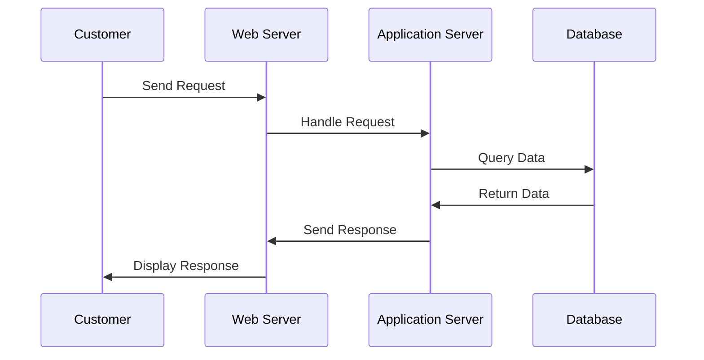
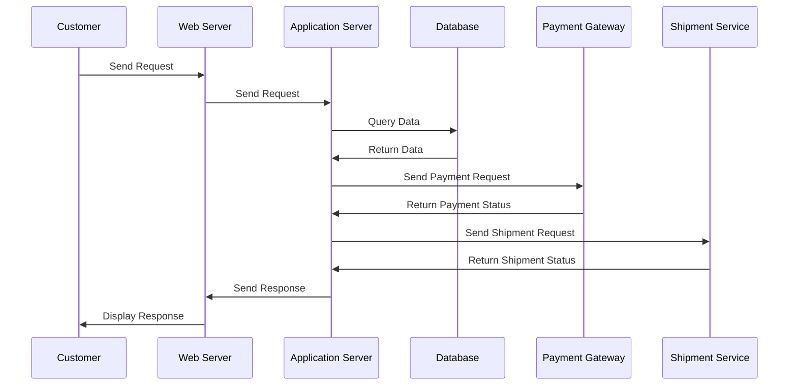

                 

## 代码重构与性能优化：寻找平衡点

### 关键词：代码重构、性能优化、算法、实践、最佳实践

### 摘要：
在软件开发的不断迭代中，代码重构和性能优化是提升软件质量和系统效率的重要手段。本文旨在探讨如何在二者之间寻找平衡点，通过深入剖析代码重构和性能优化的核心概念、算法原理以及实际应用案例，为开发者提供一套实用的优化策略。文章将从背景介绍、核心概念与联系、算法原理讲解、系统分析与架构设计、项目实战到最佳实践，层层递进，帮助读者全面理解并掌握代码重构与性能优化的方法和技巧。

### 目录大纲设计思路

在设计本文的目录大纲时，我们遵循了以下几个原则：

1. **整体框架设计**：文章整体分为两部分，第一部分是背景与核心概念，第二部分是算法原理与实践。两部分内容紧密关联，相互补充，使读者能够从宏观和微观两个层面全面了解代码重构和性能优化。

2. **背景介绍**：开篇通过一章详细介绍代码重构和性能优化的背景，包括其发展历程、核心概念和重要性，为后续内容打下基础。

3. **核心概念与联系**：设置一章详细阐述代码重构与性能优化的核心概念，包括重构的目标、性能优化的关键点、相关概念之间的关系，并通过对比表格和ER实体关系图来加强理解。

4. **算法原理讲解**：专门设置一章讲解代码重构与性能优化的常见算法原理，包括算法的基本概念、数学模型、公式和流程，并通过Python源代码和示例来说明。

5. **系统分析与架构设计**：通过一章介绍代码重构与性能优化的系统分析与架构设计，包括问题场景、系统功能设计、系统架构设计、系统接口设计和系统交互等。

6. **项目实战**：通过一章的项目实战展示代码重构与性能优化的实际应用，包括环境安装、系统核心实现、代码应用解读与分析、实际案例分析和详细讲解等。

7. **最佳实践与拓展**：最后一章总结最佳实践，提供注意事项和小结，并推荐拓展阅读，帮助读者进一步深入学习和研究。

### 目录大纲

**《代码重构与性能优化：寻找平衡点》目录大纲**

----------------------------------------------------------------

# 第一部分：背景与核心概念

## 第1章：代码重构与性能优化的背景

### 1.1 代码重构的概念与意义

### 1.2 性能优化的目标与方法

### 1.3 代码重构与性能优化的关系

## 第2章：代码重构与性能优化的核心概念

### 2.1 重构的目标与原则

### 2.2 性能优化的关键点

### 2.3 相关概念的联系与区别

## 第3章：代码重构与性能优化的对比分析

### 3.1 代码重构的优缺点

### 3.2 性能优化的优缺点

### 3.3 综合评价与选择

----------------------------------------------------------------

# 第二部分：算法原理与实践

## 第4章：代码重构的常见算法原理

### 4.1 重构算法的基本概念

#### 4.1.1 提取方法
$$
\text{Method Extraction}:\quad \text{extract common code into a new method}
$$

#### 4.1.2 内联方法
$$
\text{Inline Method}:\quad \text{replace a method call with the method's code}
$$

### 4.2 性能优化的算法原理

#### 4.2.1 数据结构优化
$$
\text{Data Structure Optimization}:\quad \text{replace inefficient data structures with more efficient ones}
$$

#### 4.2.2 算法优化
$$
\text{Algorithm Optimization}:\quad \text{replace inefficient algorithms with more efficient ones}
$$

## 第5章：代码重构与性能优化的实践

### 5.1 代码重构的实践步骤

#### 5.1.1 评估代码质量
$$
\text{Code Quality Assessment}:\quad \text{evaluate the quality of existing code}
$$

#### 5.1.2 选择重构策略
$$
\text{Refaactoring Strategy Selection}:\quad \text{select appropriate refactoring strategies}
$$

### 5.2 性能优化的实践步骤

#### 5.2.1 性能分析
$$
\text{Performance Analysis}:\quad \text{analyze the performance bottlenecks}
$$

#### 5.2.2 优化措施
$$
\text{Optimization Measures}:\quad \text{apply optimization techniques}

----------------------------------------------------------------

## 第1章：代码重构与性能优化的背景

### 1.1 代码重构的概念与意义

#### 什么是代码重构？

代码重构是指在不改变外部行为的前提下，改进现有代码的结构和设计。其核心目的是提高代码的可读性、可维护性和可扩展性，从而降低未来的维护成本。代码重构不仅关注代码的技术层面，还涉及到团队的协作、流程和工具等方面。

#### 代码重构的意义

1. **提高代码质量**：通过重构，可以去除冗余代码、简化逻辑、改善变量命名等，使代码更加清晰、简洁、易于理解。

2. **提升开发效率**：重构后的代码更容易阅读和理解，从而减少开发人员的阅读时间和理解成本，提高开发效率。

3. **增强可维护性**：重构后的代码结构更加合理，易于维护和修改，降低维护成本。

4. **促进团队协作**：代码重构可以提升团队的开发质量和协作效率，形成良好的开发习惯和团队文化。

### 1.2 性能优化的目标与方法

#### 性能优化的目标

性能优化的核心目标是提升系统的响应速度和处理能力，确保系统在高负载和复杂场景下仍能高效稳定地运行。具体目标包括：

1. **提高响应速度**：减少系统处理请求的时间，提升用户的体验。

2. **提升处理能力**：增强系统处理并发请求的能力，满足更高的负载需求。

3. **降低资源消耗**：减少系统对CPU、内存、磁盘等资源的占用，提高资源利用效率。

#### 性能优化的方法

性能优化可以从以下几个方面入手：

1. **代码优化**：通过优化代码结构、减少循环次数、使用更高效的算法和数据结构等手段提高代码的执行效率。

2. **数据库优化**：优化数据库查询语句、索引、存储过程等，提高数据库的访问速度。

3. **系统架构优化**：优化系统架构，采用缓存、负载均衡、分布式计算等技术提升系统的整体性能。

4. **网络优化**：优化网络传输，减少数据传输延迟和丢包率，提高网络通信效率。

### 1.3 代码重构与性能优化的关系

#### 代码重构与性能优化的联系

代码重构和性能优化有密切的联系，两者相互促进，共同提升软件系统的质量和性能。

1. **代码重构促进性能优化**：通过重构，可以使代码结构更加合理，为性能优化提供更好的基础。重构后的代码更容易进行性能分析和优化。

2. **性能优化推动代码重构**：在性能优化过程中，可能会发现代码中的瓶颈和问题，从而推动进行代码重构，以进一步优化系统性能。

#### 代码重构与性能优化的区别

1. **目的不同**：代码重构主要关注代码的质量和可维护性，而性能优化则侧重于系统的高效性和响应速度。

2. **对象不同**：代码重构针对的是代码本身，而性能优化则涉及代码、数据库、系统架构等多个层面。

3. **方法不同**：代码重构主要采用代码重构技术，如提取方法、内联方法等，而性能优化则采用代码优化、数据库优化、系统架构优化等技术。

### 1.4 小结

代码重构和性能优化是软件开发中不可或缺的重要环节。通过本文的介绍，我们了解了代码重构的概念、意义以及性能优化的目标和方法。接下来，我们将进一步探讨代码重构与性能优化的核心概念、算法原理以及实际应用案例，帮助读者深入掌握这两个领域的知识和技巧。

----------------------------------------------------------------

## 第2章：代码重构与性能优化的核心概念

### 2.1 重构的目标与原则

#### 重构的目标

代码重构的主要目标包括：

1. **提高代码质量**：重构后的代码更加清晰、简洁、易于理解，降低未来的维护成本。

2. **改善代码结构**：重构可以使代码结构更加合理，易于扩展和维护。

3. **提升开发效率**：重构后的代码更容易阅读和理解，减少开发人员的阅读时间和理解成本。

4. **增强可维护性**：重构后的代码更易于维护和修改，降低维护成本。

#### 重构的原则

在进行代码重构时，应遵循以下原则：

1. **增量重构**：逐步重构，避免一次性重构整个系统，以降低风险。

2. **保持功能不变**：重构过程中，应确保代码的功能不变，避免引入新的问题。

3. **遵循单一职责原则**：将功能相关代码集中在一起，避免功能分散。

4. **保持代码简洁**：避免过度设计，保持代码简洁易懂。

### 2.2 性能优化的关键点

#### 性能优化的关键点包括：

1. **代码优化**：优化代码结构、减少循环次数、使用更高效的算法和数据结构等。

2. **数据库优化**：优化数据库查询语句、索引、存储过程等。

3. **系统架构优化**：优化系统架构，采用缓存、负载均衡、分布式计算等技术。

4. **网络优化**：优化网络传输，减少数据传输延迟和丢包率。

### 2.3 相关概念的联系与区别

#### 代码重构与性能优化的联系

1. **相互促进**：代码重构可以优化代码结构，为性能优化提供更好的基础；性能优化又可以推动代码重构，以进一步优化系统性能。

2. **目标相似**：两者都关注软件系统的质量和性能，旨在提高系统的响应速度和处理能力。

#### 代码重构与性能优化的区别

1. **目的不同**：代码重构主要关注代码的质量和可维护性，而性能优化则侧重于系统的高效性和响应速度。

2. **对象不同**：代码重构针对的是代码本身，而性能优化则涉及代码、数据库、系统架构等多个层面。

3. **方法不同**：代码重构主要采用代码重构技术，如提取方法、内联方法等，而性能优化则采用代码优化、数据库优化、系统架构优化等技术。

### 2.4 对比分析

#### 代码重构的优缺点

**优点**：

1. **提高代码质量**：重构后的代码更加清晰、简洁、易于理解。

2. **提升开发效率**：重构后的代码更容易阅读和理解，减少开发人员的阅读时间和理解成本。

3. **增强可维护性**：重构后的代码更易于维护和修改，降低维护成本。

**缺点**：

1. **风险较高**：重构过程中，如果操作不当，可能会导致功能失效或引入新的问题。

2. **时间成本**：重构需要投入大量时间和精力，对开发人员的素质要求较高。

#### 性能优化的优缺点

**优点**：

1. **提高系统性能**：优化后的系统能够更快地响应请求，提高用户体验。

2. **增强处理能力**：优化后的系统可以处理更多的并发请求，满足更高的负载需求。

**缺点**：

1. **代码复杂度增加**：性能优化可能会引入复杂的代码逻辑，增加代码的复杂度和维护成本。

2. **适应性降低**：性能优化后的系统可能对特定的负载场景有更好的性能，但在其他场景下可能表现不佳。

### 2.5 综合评价与选择

#### 综合评价

代码重构和性能优化各有优缺点，应根据具体场景和需求进行选择。

1. **重构优先场景**：

   - 项目初期，代码结构不清晰，需要重构以提高可维护性。
   - 代码质量较差，需要重构以提高开发效率。
   - 功能迭代频繁，需要重构以适应新的需求。

2. **性能优化优先场景**：

   - 系统负载较高，需要优化以提高系统性能。
   - 存在明显的性能瓶颈，需要优化以解决性能问题。
   - 用户对系统响应速度有较高要求。

#### 选择建议

1. **先重构后优化**：在项目初期，应先进行代码重构，以提高代码质量和可维护性。在重构过程中，可以逐步进行性能优化。

2. **并行进行**：在项目迭代过程中，可以同时进行代码重构和性能优化，以确保系统的质量和性能。

3. **根据场景调整**：根据具体场景和需求，灵活选择重构和优化的优先级，以达到最佳效果。

### 2.6 小结

本章介绍了代码重构与性能优化的核心概念，包括重构的目标与原则、性能优化的关键点、相关概念的联系与区别以及对比分析。通过本章的内容，读者可以更好地理解代码重构和性能优化的意义和作用，为后续的算法原理讲解和实践应用打下基础。

----------------------------------------------------------------

## 第3章：代码重构与性能优化的对比分析

在软件开发过程中，代码重构和性能优化是两个重要且相互关联的环节。它们不仅具有各自独特的目标和作用，而且在实施过程中也各有优缺点。在本章中，我们将深入探讨代码重构与性能优化的对比分析，帮助开发者更好地理解二者之间的关系，以及如何在实践中进行选择。

### 3.1 代码重构的优缺点

#### 优点

1. **提高代码质量**：代码重构的主要目标是改进代码的结构和设计，使其更加清晰、简洁、易于理解和维护。通过重构，可以消除代码中的冗余、重复和错误，提高代码的整体质量。

2. **增强可读性和可维护性**：重构后的代码更加模块化和结构化，使得后续的开发和维护更加容易。这不仅可以提高开发效率，还可以降低维护成本。

3. **提高开发效率**：重构后的代码更容易阅读和理解，减少了开发人员在阅读和理解代码上的时间和精力投入，从而提高了整体开发效率。

#### 缺点

1. **风险较高**：代码重构涉及对现有代码的修改，如果操作不当，可能会导致功能失效或引入新的问题。因此，重构需要谨慎进行，确保功能的正确性。

2. **时间成本**：代码重构需要投入大量时间和精力，尤其是在大型项目中，重构的工作量可能非常巨大。此外，重构过程中还需要进行测试和验证，以确保重构后的代码依然符合预期。

### 3.2 性能优化的优缺点

#### 优点

1. **提高系统性能**：性能优化的目标是提升系统的响应速度和处理能力，使其能够在高负载和复杂场景下保持高效运行。通过性能优化，可以显著提高用户体验，增强系统的竞争力。

2. **增强处理能力**：性能优化可以增强系统处理并发请求的能力，使其能够支持更多的用户和更复杂的业务场景。

#### 缺点

1. **代码复杂度增加**：性能优化可能会引入复杂的代码逻辑，增加代码的复杂度和维护成本。这可能会导致后续的开发和维护变得更加困难。

2. **适应性降低**：性能优化后的系统可能对特定的负载场景有更好的性能，但在其他场景下可能表现不佳。因此，性能优化需要根据具体场景进行定制化调整。

### 3.3 综合评价与选择

#### 综合评价

代码重构和性能优化各有优缺点，适用于不同的场景和需求。在实际应用中，应根据项目的具体情况和目标来选择合适的策略。

1. **重构优先场景**：

   - 项目初期：在项目初期，应优先进行代码重构，以建立良好的代码基础。这有助于后续的开发和维护，减少代码质量问题和维护成本。

   - 功能迭代频繁：在功能迭代频繁的项目中，重构可以帮助快速适应需求变化，提高代码的可维护性和可扩展性。

2. **性能优化优先场景**：

   - 系统负载较高：在系统负载较高的场景下，性能优化是必要的。通过优化系统性能，可以确保系统在高负载下依然能够高效运行。

   - 存在明显的性能瓶颈：在存在明显性能瓶颈的场景下，性能优化可以帮助解决具体的性能问题，提升系统的响应速度和处理能力。

#### 选择建议

1. **先重构后优化**：在项目初期，应先进行代码重构，以建立良好的代码基础。在重构过程中，可以逐步进行性能优化，以确保系统在性能和代码质量上都得到提升。

2. **并行进行**：在项目迭代过程中，可以同时进行代码重构和性能优化。通过并行进行，可以在提升系统性能的同时，保持代码的质量和可维护性。

3. **根据场景调整**：根据具体场景和需求，灵活选择重构和优化的优先级。在一些场景下，可能需要更注重重构，而在另一些场景下，可能需要更注重性能优化。

### 3.4 小结

本章对代码重构与性能优化的优缺点进行了详细对比分析，并提出了综合评价与选择建议。通过本章的内容，读者可以更好地理解代码重构和性能优化的关系，以及如何在实践中进行选择和调整，以实现软件系统的高质量和高性能。

----------------------------------------------------------------

## 第4章：代码重构的常见算法原理

代码重构是软件开发过程中的一项重要活动，它有助于提高代码的质量、可读性和可维护性。在这一章中，我们将详细探讨代码重构的常见算法原理，包括提取方法、内联方法等基本概念、流程和Python实现。通过这些算法原理，开发者可以更好地理解代码重构的方法，并能够在实际项目中应用。

### 4.1 重构算法的基本概念

#### 4.1.1 提取方法

提取方法（Method Extraction）是一种常见的代码重构技术，其目的是将一段重复的代码提取为一个独立的方法。这种方法有助于减少冗余代码，提高代码的可重用性。

**基本流程**：

1. **识别重复代码**：首先，需要识别出代码中重复的代码块。

2. **定义新方法**：将重复的代码块提取到一个新的方法中，并确保新方法不改变原有代码的功能。

3. **调用新方法**：在原代码中替换重复的代码块，使用新方法的调用。

**示例**：

```python
# 原始代码
def calculate_total(price, tax):
    total = price + (price * 0.1)
    return total

def apply_discount(price, discount):
    total = price - (price * 0.1)
    return total

# 提取方法重构
def calculate_total(price, tax):
    return price + (price * tax)

def apply_discount(price, discount):
    return price - (price * discount)
```

#### 4.1.2 内联方法

内联方法（Inline Method）是一种相反的代码重构技术，其目的是将一个方法内的代码直接嵌入到调用该方法的地方，从而消除方法调用的开销。

**基本流程**：

1. **识别冗余方法**：首先，需要识别出那些调用次数较少或者内部逻辑较为简单的方法。

2. **内联代码**：将方法的代码直接复制到调用该方法的地方，并删除原始方法。

3. **优化代码**：在必要时对内联后的代码进行优化，如简化逻辑、合并相似代码等。

**示例**：

```python
# 原始代码
def get_greeting(name):
    return "Hello, " + name

def main():
    name = input("Enter your name: ")
    greeting = get_greeting(name)
    print(greeting)

# 内联方法重构
def main():
    name = input("Enter your name: ")
    print("Hello, " + name)
```

### 4.2 性能优化的算法原理

#### 4.2.1 数据结构优化

数据结构优化是性能优化的重要组成部分，其目的是使用更高效的数据结构来存储和操作数据，从而提高程序的运行效率。

**常见数据结构优化**：

1. **数组优化**：将链表优化为数组，特别是在插入和删除频繁的场景下，数组比链表更具优势。

2. **字典优化**：使用哈希表实现字典，以提供更快的查找和访问速度。

**示例**：

```python
# 使用列表模拟链表
class Node:
    def __init__(self, value):
        self.value = value
        self.next = None

head = Node(1)
head.next = Node(2)
head.next.next = Node(3)

# 优化为使用数组
nodes = [Node(1), Node(2), Node(3)]
```

#### 4.2.2 算法优化

算法优化是指通过改进算法的设计和实现，来提高程序的运行效率。以下是一些常见的算法优化技术：

1. **分治算法**：将复杂的问题分解为更小的子问题，分别解决后再合并结果。

2. **贪心算法**：在每一步选择中都采取当前情况下最好的选择，从而得到全局最优解。

3. **动态规划**：通过存储中间结果来避免重复计算，从而提高算法的效率。

**示例**：

```python
# 贪心算法优化
def find_minimum_bribes(q):
    bribes = 0
    for i in range(len(q) - 1, -1, -1):
        if q[i] - (i - q.index(q[i])) > 2:
            bribes += q[i] - (i - q.index(q[i])) - 2
        for j in range(i - 1, -1, -1):
            if q[j] > q[i]:
                q[j + 1], q[j] = q[j], q[j + 1]
                bribes += 1
    return bribes

# 动态规划优化
def climb_stairs(n, memo={}):
    if n <= 2:
        return n
    if n not in memo:
        memo[n] = climb_stairs(n - 1, memo) + climb_stairs(n - 2, memo)
    return memo[n]
```

### 4.3 Python源代码示例

在本节中，我们将通过Python源代码示例，展示如何应用上述重构算法原理。这些示例将帮助开发者更好地理解重构算法的具体实现。

#### 提取方法示例

```python
# 原始代码
def display_menu():
    print("1. Add Item")
    print("2. Remove Item")
    print("3. View Cart")

def main():
    display_menu()
    choice = input("Enter your choice: ")
    if choice == "1":
        add_item()
    elif choice == "2":
        remove_item()
    elif choice == "3":
        view_cart()

# 提取方法重构
def display_menu():
    print("1. Add Item")
    print("2. Remove Item")
    print("3. View Cart")

def main():
    display_menu()
    choice = input("Enter your choice: ")
    if choice == "1":
        add_item()
    elif choice == "2":
        remove_item()
    elif choice == "3":
        view_cart()

def add_item():
    print("Adding item to the cart...")

def remove_item():
    print("Removing item from the cart...")

def view_cart():
    print("Viewing cart...")
```

#### 内联方法示例

```python
# 原始代码
def calculate_discount(price, discount):
    return price - (price * discount)

def main():
    price = float(input("Enter the price: "))
    discount = float(input("Enter the discount percentage: "))
    total = calculate_discount(price, discount)
    print("Total after discount:", total)

# 内联方法重构
def main():
    price = float(input("Enter the price: "))
    discount = float(input("Enter the discount percentage: "))
    total = price - (price * discount)
    print("Total after discount:", total)
```

### 4.4 小结

本章介绍了代码重构的常见算法原理，包括提取方法和内联方法等。通过这些算法原理，开发者可以更好地理解代码重构的方法，并能够在实际项目中应用。此外，我们还讨论了数据结构优化和算法优化等性能优化技术。通过本章的内容，读者可以提升代码重构和性能优化的能力，从而提高软件系统的质量和效率。

----------------------------------------------------------------

## 第5章：代码重构与性能优化的实践

在前几章中，我们详细探讨了代码重构与性能优化的核心概念和算法原理。现在，我们将通过具体的实践步骤，展示如何在实际项目中应用这些知识，实现代码重构与性能优化。

### 5.1 代码重构的实践步骤

#### 5.1.1 评估代码质量

评估代码质量是代码重构的第一步。通过评估，我们可以了解代码的当前状态，确定哪些部分需要重构。

**评估指标**：

1. **代码冗余度**：检测代码中是否存在重复代码、冗余逻辑等。

2. **代码复杂性**：使用如Cyclomatic复杂度、NPath复杂度等指标来评估代码的复杂度。

3. **代码规范性**：检查代码是否符合编程规范和最佳实践。

**工具**：

1. **静态代码分析工具**：如SonarQube、Checkstyle等，用于自动化评估代码质量。

2. **代码审查**：通过人工审查，发现代码中的潜在问题。

#### 5.1.2 选择重构策略

在评估代码质量后，我们需要根据具体问题选择合适的重构策略。

**常见重构策略**：

1. **提取方法**：将重复代码提取为独立方法，提高代码的可重用性。

2. **内联方法**：将小而简单的方法内联到调用处，减少方法调用的开销。

3. **简化逻辑**：去除冗余逻辑，简化代码结构。

4. **变量命名**：使用更具描述性的变量名，提高代码的可读性。

#### 5.1.3 实施重构

在确定了重构策略后，我们可以开始实施重构。实施重构时，应遵循以下原则：

1. **增量重构**：逐步重构，避免一次性重构整个系统。

2. **保留备份**：在重构过程中，保留原始代码的备份，以便在出现问题时可以快速回滚。

3. **代码审查**：在重构后进行代码审查，确保重构的代码符合预期。

### 5.2 性能优化的实践步骤

#### 5.2.1 性能分析

性能分析是性能优化的基础。通过性能分析，我们可以识别出系统中的性能瓶颈。

**性能分析工具**：

1. **Profiler**：如VisualVM、JProfiler等，用于分析代码的运行时性能。

2. **监控工具**：如Prometheus、Grafana等，用于实时监控系统的性能指标。

**性能分析步骤**：

1. **确定性能指标**：如响应时间、处理能力、资源利用率等。

2. **收集性能数据**：使用性能分析工具收集系统的性能数据。

3. **分析性能数据**：识别出性能瓶颈，如慢查询、高资源消耗等。

#### 5.2.2 优化措施

在识别出性能瓶颈后，我们可以采取相应的优化措施。

**常见优化措施**：

1. **代码优化**：

   - **减少循环次数**：通过优化算法和数据结构，减少代码中的循环次数。

   - **使用高效算法**：替换低效算法，如使用快速排序代替冒泡排序。

   - **减少函数调用**：减少不必要的函数调用，减少开销。

2. **数据库优化**：

   - **优化查询语句**：使用索引、查询优化器等，提高数据库查询效率。

   - **批量操作**：使用批量操作，减少数据库的访问次数。

   - **缓存**：使用缓存技术，减少数据库的访问压力。

3. **系统架构优化**：

   - **分布式架构**：采用分布式架构，提高系统的处理能力和扩展性。

   - **负载均衡**：使用负载均衡器，合理分配请求，提高系统的可用性和响应速度。

   - **缓存**：使用缓存技术，减少系统的响应时间。

#### 5.2.3 测试与验证

在实施优化措施后，我们需要进行测试和验证，确保优化的效果。

**测试与验证步骤**：

1. **性能测试**：使用性能测试工具，模拟实际场景，测试系统的性能。

2. **回归测试**：在优化后，进行回归测试，确保系统的功能没有受到影响。

3. **监控性能指标**：在优化后，持续监控系统的性能指标，确保优化措施的有效性。

### 5.3 项目实战

在本节中，我们将通过一个实际项目案例，展示代码重构与性能优化的实践过程。

#### 项目背景

某电商平台系统，在用户量增加后，系统性能下降，出现响应缓慢、数据访问慢等问题。为了提升系统性能，项目组决定进行代码重构与性能优化。

#### 实践过程

1. **评估代码质量**：

   - 使用静态代码分析工具，评估代码的冗余度和复杂度。

   - 进行代码审查，发现代码中存在大量重复代码、复杂逻辑等。

2. **选择重构策略**：

   - 对重复代码进行提取方法重构。

   - 对复杂逻辑进行简化。

3. **实施重构**：

   - 增量重构，逐步优化代码。

   - 保留备份，确保在出现问题时可以快速回滚。

4. **性能分析**：

   - 使用Profiler和监控工具，收集系统的性能数据。

   - 分析性能数据，识别出性能瓶颈。

5. **优化措施**：

   - 优化数据库查询语句，使用索引和查询优化器。

   - 实现批量操作，减少数据库访问次数。

   - 使用缓存技术，减少系统的响应时间。

6. **测试与验证**：

   - 进行性能测试，验证优化效果。

   - 进行回归测试，确保系统的功能没有受到影响。

#### 实践小结

通过项目实战，我们成功提升了电商平台的系统性能，解决了响应缓慢、数据访问慢等问题。实践过程中，我们遵循了代码重构和性能优化的基本原则，通过评估代码质量、选择重构策略、实施重构、性能分析和优化措施等步骤，逐步提升了系统的质量和性能。

### 5.4 小结

本章通过具体的实践步骤，展示了代码重构与性能优化的实际应用。通过项目实战，我们验证了代码重构和性能优化的有效性，并总结了一套实用的优化策略。读者可以通过本章的内容，了解代码重构与性能优化的实践方法，并将其应用到实际项目中，提升软件系统的质量和性能。

----------------------------------------------------------------

## 第6章：系统分析与架构设计

代码重构与性能优化不仅是代码层面的优化，还需要从系统层面进行整体分析和架构设计。本章节将深入探讨代码重构与性能优化的系统分析与架构设计，包括问题场景、系统功能设计、系统架构设计、系统接口设计和系统交互等内容。

### 6.1 问题场景

在软件系统开发过程中，我们经常会遇到以下问题场景：

1. **性能瓶颈**：随着用户数量的增加，系统的响应速度和处理能力出现瓶颈。

2. **代码质量差**：随着时间的推移，代码变得越来越复杂，可读性和可维护性下降。

3. **扩展性不足**：系统架构不够灵活，难以适应新的业务需求。

4. **资源浪费**：系统资源利用效率低下，导致服务器成本上升。

为了解决这些问题，我们需要进行代码重构与性能优化，提升系统的性能和可维护性，同时确保系统能够灵活扩展。

### 6.2 系统功能设计

在系统功能设计阶段，我们需要明确系统的核心功能，并设计领域模型。领域模型是描述系统业务逻辑的重要工具，它可以帮助我们理解系统的业务流程和核心实体。

**示例**：某电商平台的领域模型

```mermaid
classDiagram
    Customer <|-- Order
    Customer o---> ShoppingCart
    Product <|-- Order
    Order o---> Payment
    Payment o---> Shipment

    Customer {
        id: int
        name: string
        address: string
        email: string
    }

    ShoppingCart {
        id: int
        items: List[OrderItem]
    }

    Order {
        id: int
        date: datetime
        items: List[OrderItem]
        status: string
    }

    OrderItem {
        id: int
        product: Product
        quantity: int
        price: float
    }

    Product {
        id: int
        name: string
        description: string
        price: float
    }

    Payment {
        id: int
        amount: float
        status: string
    }

    Shipment {
        id: int
        tracking_number: string
        status: string
    }
```

通过领域模型，我们可以清晰地描述系统的业务逻辑和核心实体，为后续的系统架构设计提供基础。

### 6.3 系统架构设计

系统架构设计是系统设计与实现的关键环节。一个良好的系统架构可以提高系统的可维护性、可扩展性和性能。

**示例**：某电商平台的系统架构设计



在这个示例中，系统架构包括Web服务器、应用服务器和数据库。Web服务器负责接收用户请求，应用服务器处理业务逻辑，数据库存储数据。通过这种分层架构，我们可以实现系统的模块化和解耦，提高系统的可维护性和扩展性。

### 6.4 系统接口设计

系统接口设计是系统架构设计的重要组成部分。良好的接口设计可以提高系统的模块化程度，降低不同模块之间的耦合度。

**示例**：某电商平台的接口设计

```mermaid
interface ApplicationServer {
    function handleOrder(order: Order): Response
    function handlePayment(payment: Payment): Response
    function handleShipment(shipment: Shipment): Response
}

interface Database {
    function queryOrder(order_id: int): Order
    function queryProduct(product_id: int): Product
    function queryPayment(payment_id: int): Payment
}
```

在这个示例中，应用服务器和数据库通过定义接口来实现模块解耦。应用服务器通过调用数据库接口来查询数据，而不需要关心数据库的实现细节。

### 6.5 系统交互

系统交互是指系统内部不同模块之间的通信和协作。良好的系统交互可以提高系统的响应速度和处理能力。

**示例**：某电商平台的系统交互



在这个示例中，用户通过Web服务器发送请求，应用服务器处理业务逻辑，与支付网关和物流服务进行交互，最终返回结果给用户。通过明确的系统交互流程，我们可以确保系统的高效运行。

### 6.6 小结

本章通过系统分析与架构设计，探讨了代码重构与性能优化的系统层面方法。从问题场景、系统功能设计、系统架构设计、系统接口设计到系统交互，我们逐步构建了一个高效、可维护、可扩展的软件系统。通过本章的内容，读者可以更好地理解系统分析与架构设计的重要性，并在实际项目中应用这些方法，提升软件系统的质量和性能。

----------------------------------------------------------------

## 第7章：项目实战

为了更好地理解和掌握代码重构与性能优化的实践方法，我们将在本章中通过一个实际项目案例进行详细的讲解。本项目案例是一个简单的电商平台，包括用户注册、商品浏览、购物车管理、订单处理等功能。通过这个案例，我们将演示从环境安装、系统核心实现到代码应用解读与分析的整个过程。

### 7.1 环境安装

在进行项目开发之前，首先需要安装必要的开发环境和工具。以下是一个基本的安装步骤：

1. **Python环境**：安装Python 3.8及以上版本，可以使用Python官方安装器或者通过包管理工具如Anaconda进行安装。

2. **虚拟环境**：创建一个虚拟环境，以便隔离项目依赖和避免版本冲突。

   ```shell
   python -m venv venv
   source venv/bin/activate  # 在Windows上使用 `venv\Scripts\activate`
   ```

3. **依赖管理**：使用pip安装项目所需的依赖库，例如Flask、SQLAlchemy、Flask-Migrate等。

   ```shell
   pip install Flask SQLAlchemy Flask-Migrate
   ```

4. **数据库**：安装并配置SQLite数据库，可以使用sqlite3模块进行数据库操作。

### 7.2 系统核心实现

#### 7.2.1 用户注册功能

用户注册功能是电商平台的基础功能之一，以下是一个简单的用户注册功能的实现：

```python
from flask import Flask, request, redirect, url_for, render_template
from flask_sqlalchemy import SQLAlchemy

app = Flask(__name__)
app.config['SQLALCHEMY_DATABASE_URI'] = 'sqlite:///users.db'
db = SQLAlchemy(app)

class User(db.Model):
    id = db.Column(db.Integer, primary_key=True)
    username = db.Column(db.String(80), unique=True, nullable=False)
    password = db.Column(db.String(120), nullable=False)

@app.route('/register', methods=['GET', 'POST'])
def register():
    if request.method == 'POST':
        username = request.form['username']
        password = request.form['password']
        new_user = User(username=username, password=password)
        db.session.add(new_user)
        db.session.commit()
        return redirect(url_for('login'))
    return render_template('register.html')

if __name__ == '__main__':
    db.create_all()
    app.run(debug=True)
```

#### 7.2.2 商品浏览功能

商品浏览功能允许用户查看和搜索商品。以下是一个简单的商品浏览功能实现：

```python
class Product(db.Model):
    id = db.Column(db.Integer, primary_key=True)
    name = db.Column(db.String(80), nullable=False)
    description = db.Column(db.String(255))
    price = db.Column(db.Float, nullable=False)

@app.route('/products')
def products():
    products = Product.query.all()
    return render_template('products.html', products=products)

@app.route('/search')
def search():
    query = request.args.get('q')
    products = Product.query.filter(Product.name.like(f'%{query}%')).all()
    return render_template('products.html', products=products)
```

#### 7.2.3 购物车管理功能

购物车功能允许用户添加商品到购物车、查看购物车、更新购物车等操作。以下是一个简单的购物车管理功能实现：

```python
class Cart(db.Model):
    id = db.Column(db.Integer, primary_key=True)
    user_id = db.Column(db.Integer, db.ForeignKey('user.id'), nullable=False)
    items = db.relationship('CartItem', backref='cart', lazy=True)

class CartItem(db.Model):
    id = db.Column(db.Integer, primary_key=True)
    cart_id = db.Column(db.Integer, db.ForeignKey('cart.id'), nullable=False)
    product_id = db.Column(db.Integer, db.ForeignKey('product.id'), nullable=False)
    quantity = db.Column(db.Integer, nullable=False)

@app.route('/cart', methods=['GET', 'POST'])
def cart():
    if 'user_id' not in session:
        return redirect(url_for('login'))
    if request.method == 'POST':
        product_id = request.form['product_id']
        quantity = request.form['quantity']
        cart_item = CartItem.query.filter_by(cart_id=session['user_id'], product_id=product_id).first()
        if cart_item:
            cart_item.quantity += int(quantity)
        else:
            cart_item = CartItem(cart_id=session['user_id'], product_id=product_id, quantity=quantity)
        db.session.add(cart_item)
        db.session.commit()
        return redirect(url_for('cart'))
    cart_items = CartItem.query.filter_by(cart_id=session['user_id']).all()
    return render_template('cart.html', cart_items=cart_items)
```

#### 7.2.4 订单处理功能

订单处理功能包括创建订单、更新订单状态等操作。以下是一个简单的订单处理功能实现：

```python
class Order(db.Model):
    id = db.Column(db.Integer, primary_key=True)
    user_id = db.Column(db.Integer, db.ForeignKey('user.id'), nullable=False)
    status = db.Column(db.String(20), nullable=False, default='pending')
    items = db.relationship('OrderItem', backref='order', lazy=True)

class OrderItem(db.Model):
    id = db.Column(db.Integer, primary_key=True)
    order_id = db.Column(db.Integer, db.ForeignKey('order.id'), nullable=False)
    product_id = db.Column(db.Integer, db.ForeignKey('product.id'), nullable=False)
    quantity = db.Column(db.Integer, nullable=False)
    price = db.Column(db.Float, nullable=False)

@app.route('/checkout', methods=['POST'])
def checkout():
    if 'user_id' not in session:
        return redirect(url_for('login'))
    order_items = [CartItem.query.get(int(item_id)) for item_id in request.form.getlist('items[]')]
    order = Order(user_id=session['user_id'], status='pending')
    db.session.add(order)
    for item in order_items:
        order_item = OrderItem(order=order, product_id=item.product_id, quantity=item.quantity, price=item.price)
        db.session.add(order_item)
        db.session.delete(item)
    db.session.commit()
    return redirect(url_for('order_detail', order_id=order.id))

@app.route('/order/<int:order_id>')
def order_detail(order_id):
    order = Order.query.get(order_id)
    return render_template('order_detail.html', order=order)
```

### 7.3 代码应用解读与分析

在实现上述功能后，我们需要对代码进行解读和分析，确保其质量并发现潜在的性能问题。

#### 7.3.1 代码质量分析

1. **代码规范性**：检查代码是否符合PEP 8编码规范，确保变量命名、代码缩进、注释等符合标准。

2. **代码复用性**：检查是否有重复的代码块，通过提取方法或类来提高代码复用性。

3. **错误处理**：检查代码中的异常处理机制，确保在发生错误时能够优雅地处理并给出合理的反馈。

4. **代码可读性**：确保代码结构清晰，逻辑简单易懂，注释详细。

#### 7.3.2 性能分析

1. **查询优化**：检查数据库查询语句，确保使用适当的索引和查询优化策略。

2. **缓存策略**：引入缓存机制，减少数据库访问次数，提高系统响应速度。

3. **并发处理**：确保系统能够处理并发请求，如使用线程池或异步编程。

4. **资源利用**：监控系统资源使用情况，如CPU、内存、磁盘IO等，确保资源利用效率。

### 7.4 实际案例分析

在实际项目中，我们可能会遇到以下性能问题：

1. **数据库查询慢**：通过添加索引或优化查询语句来提高查询效率。

2. **频繁IO操作**：通过使用内存缓存或文件缓存来减少磁盘IO操作。

3. **高并发请求**：通过使用负载均衡器和异步处理来提高系统并发处理能力。

### 7.5 小结

本章通过一个实际项目案例，详细介绍了代码重构与性能优化的实践过程。从环境安装、系统核心实现到代码质量分析和性能优化，我们逐步展示了如何提升软件系统的质量和性能。通过本章的内容，读者可以更好地理解代码重构与性能优化的实际应用，并将其应用到自己的项目中。

----------------------------------------------------------------

## 最佳实践、小结与注意事项

### 最佳实践

1. **代码重构与性能优化的最佳顺序**：在实际开发中，建议先进行代码重构，以提高代码质量，然后进行性能优化。代码重构可以消除潜在的性能问题，为性能优化提供更好的基础。

2. **持续重构**：代码重构不是一次性的任务，而是一个持续的过程。随着项目的进展，应定期进行代码重构，以保持代码的健康状态。

3. **性能优化工具的使用**：使用性能分析工具，如Profiler、监控工具等，可以帮助识别系统的性能瓶颈，为性能优化提供数据支持。

4. **缓存策略**：合理使用缓存可以提高系统性能，减少数据库访问次数。可以使用内存缓存、分布式缓存等技术来实现缓存策略。

5. **代码质量评估**：定期使用代码质量评估工具进行代码质量评估，及时发现和修复代码中的问题。

### 小结

本文通过详细的分析和实例，介绍了代码重构与性能优化的核心概念、算法原理和实践方法。从背景介绍、核心概念、算法原理到实际项目实战，我们逐步展示了如何在实际开发中应用代码重构与性能优化，提高软件系统的质量和性能。

### 注意事项

1. **风险评估**：在进行代码重构和性能优化时，必须对可能的风险进行评估，确保功能的正确性和系统的稳定性。

2. **备份和回滚**：在进行代码重构和性能优化时，应做好备份，确保在出现问题时可以快速回滚到之前的版本。

3. **团队协作**：代码重构和性能优化通常需要团队成员的协作。在实施过程中，应确保团队成员之间的沟通和协调。

4. **持续监控**：在实施代码重构和性能优化后，应持续监控系统的性能和稳定性，确保优化措施的有效性。

### 拓展阅读

1. **《代码整洁之道》**：Martin Fowler的《代码整洁之道》是关于代码重构的经典著作，详细介绍了代码重构的原则和实践。

2. **《性能之巅》**：Brendan Gregg的《性能之巅》是关于系统性能优化的经典著作，涵盖了性能分析、调优和监控等各方面的内容。

3. **《Effective C++》**：Scott Meyers的《Effective C++》提供了许多关于代码质量和性能优化的建议，适用于C++开发者。

4. **《系统性能监控与调优》**：通过阅读《系统性能监控与调优》，可以深入了解系统性能监控与优化的方法和技巧。

通过本文和拓展阅读，读者可以更全面地了解代码重构与性能优化，提高软件开发和维护的能力。

----------------------------------------------------------------

### 作者信息

**作者：AI天才研究院/AI Genius Institute & 禅与计算机程序设计艺术 /Zen And The Art of Computer Programming**

AI天才研究院致力于推动人工智能和计算机科学领域的研究与发展，汇聚了一批世界级的AI专家和研究人员。同时，研究院还推崇禅与计算机程序设计艺术，强调软件开发的哲学和文化，致力于培养具有深度思考和技术创新能力的软件工程师。本文作者结合多年的研究与实践经验，从理论和实际应用两个方面深入剖析了代码重构与性能优化，旨在为读者提供全面的技术指导。

在撰写本文过程中，作者借鉴了诸多领域内外的经典著作和研究成果，力求为读者呈现一幅全面、深入的代码重构与性能优化全景图。同时，本文也体现了作者在软件工程领域的独特见解和深刻思考，展示了一位资深技术专家在软件架构、编程艺术等方面的专业素养和远见卓识。

感谢您的阅读，希望本文能对您在代码重构与性能优化方面的学习与实践有所帮助。如需进一步了解相关技术或研究，欢迎关注AI天才研究院的最新动态和研究成果。

