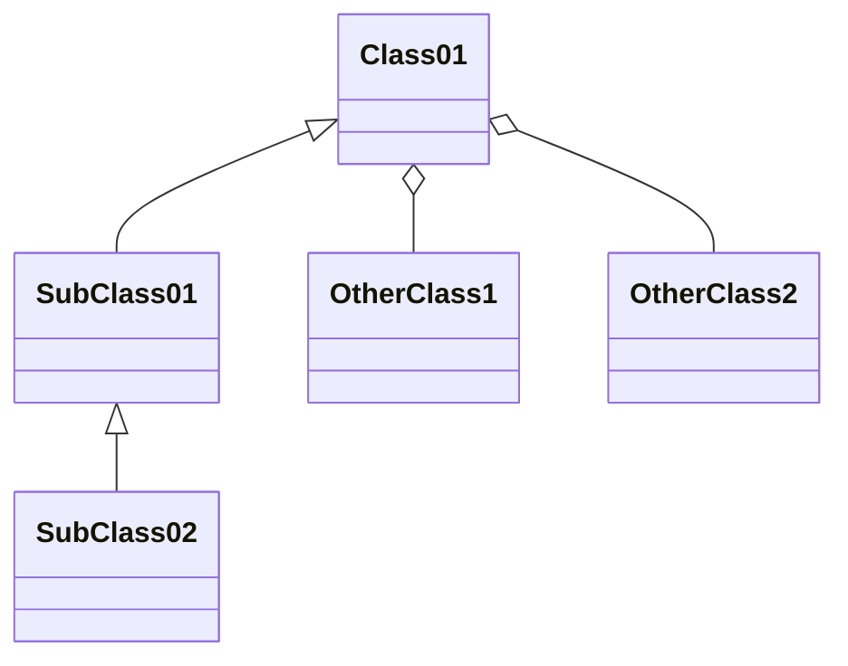
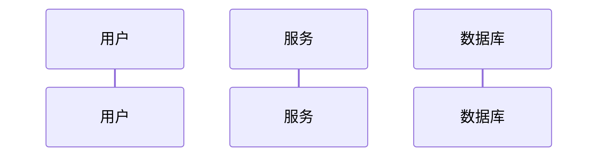
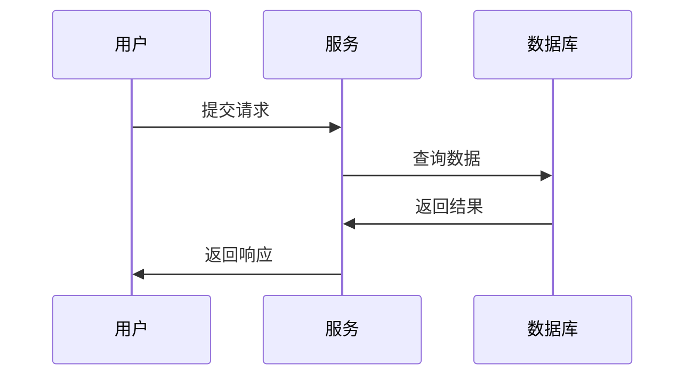

                 


### 代码重构案例分析：从理论到实践

> 关键词：代码重构、软件工程、质量评估、优化方法、系统架构设计

> 摘要：本文将深入探讨代码重构的概念、必要性、核心要素、重构方法与技巧，结合具体案例，详细阐述重构算法的原理与流程，最后通过系统分析与架构设计，展示代码重构在实际项目中的应用和实践。

---

#### 第一部分：背景介绍

##### 1.1 问题背景

随着软件项目的不断扩展和迭代，代码的复杂度和冗余程度逐渐增加，导致代码的可读性、可维护性和可扩展性下降。这不仅增加了开发成本，还降低了软件的长期稳定性。为了解决这一问题，代码重构应运而生。

##### 1.1.1 代码重构的必要性

- **问题描述**：随着软件项目的不断扩展和迭代，代码的复杂度和冗余程度逐渐增加，导致代码的可读性、可维护性和可扩展性下降。
- **问题解决**：通过代码重构，可以改进代码的结构，消除冗余和重复代码，提高代码质量。
- **边界与外延**：代码重构不仅仅是对代码的修改，还包括对代码的优化和改进，以及与软件工程其他方面的结合，如单元测试、持续集成等。

##### 1.1.2 代码重构的核心概念

- **核心概念**：代码重构是指在不改变程序外部行为的前提下，改进代码的内部结构。
- **属性特征对比表格**：

| 核心概念 | 特点 | 对比 |  
| --- | --- | --- |  
| 代码重构 | 改善代码结构 | 与代码优化、代码重构不同 |  
| 代码优化 | 提高代码性能 | 关注代码的运行效率 |  
| 代码复用 | 提高代码复用性 | 关注代码的模块化和可复用性 |

##### 1.1.3 代码重构的要素组成

- **要素组成**：代码重构通常包括以下几个步骤：
  - **分析现有代码**，识别需要重构的部分。
  - **设计重构方案**，确保重构后的代码满足需求。
  - **执行重构**，逐步替换原有代码。
  - **测试重构后的代码**，确保其功能不变。

#### 第二部分：核心概念与联系

##### 2.1 核心概念原理

##### 2.1.1 代码质量评估指标

- **评估指标**：代码质量评估指标包括可读性、可维护性、可扩展性、代码重复率等。
- **评价指标对比**：

| 评估指标 | 对比 |  
| --- | --- |  
| 可读性 | 易于理解和阅读 |  
| 可维护性 | 方便修改和调试 |  
| 可扩展性 | 能适应新的需求变化 |  
| 代码重复率 | 代码冗余程度 |

##### 2.1.2 重构方法与技巧

- **重构方法**：常见的重构方法包括提取方法、提取类、替换条件分支等。
- **技巧对比**：

| 重构方法 | 对比 |  
| --- | --- |  
| 提取方法 | 将重复代码提取为单独的方法 |  
| 提取类 | 将具有共同行为的代码提取为类 |  
| 替换条件分支 | 将条件分支替换为更清晰的逻辑 |

##### 2.1.3 重构工具与框架

- **重构工具**：常见的重构工具有 Eclipse、Visual Studio Code、ReSharper 等。
- **框架对比**：

| 重构工具 | 功能 |  
| --- | --- |  
| Eclipse | 提供丰富的重构功能 |  
| Visual Studio Code | 支持多种编程语言的重构 |  
| ReSharper | 提供强大的重构和代码分析功能 |

---

#### 第三部分：算法原理讲解

##### 3.1 算法原理介绍

##### 3.1.1 重构算法的数学模型

- **数学模型**：重构算法通常是基于代码质量评估指标进行优化的。
- **数学公式**：
  $$ Q = f(\text{可读性}, \text{可维护性}, \text{可扩展性}, \text{代码重复率}) $$
  其中，$Q$ 表示代码质量，$f$ 表示质量评估函数。

##### 3.1.2 重构算法的流程

- **算法流程**：
  1. **评估代码质量**。
  2. **根据评估结果，选择合适的重构方法**。
  3. **执行重构**，并重新评估代码质量。
  4. **重复步骤 2 和 3**，直到代码质量达到预期。

##### 3.1.3 重构算法的应用实例

- **应用实例**：以提取方法为例，说明重构算法的详细应用过程。

---

#### 第四部分：系统分析与架构设计

##### 4.1 问题场景介绍

##### 4.2 项目介绍

##### 4.3 系统功能设计

###### 4.3.1 领域模型

- **领域模型Mermaid类图**：



###### 4.3.2 系统架构设计

- **系统架构设计Mermaid架构图**：



---

#### 项目实战：环境安装、系统核心实现源代码，代码应用解读与分析，实际案例分析和详细讲解剖析，项目小结。

##### 4.4 系统接口设计

##### 4.5 系统交互Mermaid序列图

---

#### 最佳实践 tips、小结、注意事项、拓展阅读等内容。

---

### 作者信息

- 作者：AI天才研究院/AI Genius Institute & 禅与计算机程序设计艺术 /Zen And The Art of Computer Programming

# 代码重构案例分析：从理论到实践

代码重构是软件工程中的一个重要环节，它涉及到代码的优化、改进和重构。本文将深入探讨代码重构的概念、必要性、核心要素、重构方法与技巧，并结合具体案例，详细阐述重构算法的原理与流程，最后通过系统分析与架构设计，展示代码重构在实际项目中的应用和实践。

## 第一部分：背景介绍

### 1.1 问题背景

随着软件项目的不断扩展和迭代，代码的复杂度和冗余程度逐渐增加，导致代码的可读性、可维护性和可扩展性下降。这不仅增加了开发成本，还降低了软件的长期稳定性。为了解决这一问题，代码重构应运而生。

### 1.1.1 代码重构的必要性

- **问题描述**：随着软件项目的不断扩展和迭代，代码的复杂度和冗余程度逐渐增加，导致代码的可读性、可维护性和可扩展性下降。
- **问题解决**：通过代码重构，可以改进代码的结构，消除冗余和重复代码，提高代码质量。
- **边界与外延**：代码重构不仅仅是对代码的修改，还包括对代码的优化和改进，以及与软件工程其他方面的结合，如单元测试、持续集成等。

### 1.1.2 代码重构的核心概念

- **核心概念**：代码重构是指在不改变程序外部行为的前提下，改进代码的内部结构。
- **属性特征对比表格**：

| 核心概念 | 特点 | 对比 |  
| --- | --- | --- |  
| 代码重构 | 改善代码结构 | 与代码优化、代码重构不同 |  
| 代码优化 | 提高代码性能 | 关注代码的运行效率 |  
| 代码复用 | 提高代码复用性 | 关注代码的模块化和可复用性 |

### 1.1.3 代码重构的要素组成

- **要素组成**：代码重构通常包括以下几个步骤：
  - **分析现有代码**，识别需要重构的部分。
  - **设计重构方案**，确保重构后的代码满足需求。
  - **执行重构**，逐步替换原有代码。
  - **测试重构后的代码**，确保其功能不变。

## 第二部分：核心概念与联系

### 2.1 核心概念原理

#### 2.1.1 代码质量评估指标

- **评估指标**：代码质量评估指标包括可读性、可维护性、可扩展性、代码重复率等。
- **评价指标对比**：

| 评估指标 | 对比 |  
| --- | --- |  
| 可读性 | 易于理解和阅读 |  
| 可维护性 | 方便修改和调试 |  
| 可扩展性 | 能适应新的需求变化 |  
| 代码重复率 | 代码冗余程度 |

#### 2.1.2 重构方法与技巧

- **重构方法**：常见的重构方法包括提取方法、提取类、替换条件分支等。
- **技巧对比**：

| 重构方法 | 对比 |  
| --- | --- |  
| 提取方法 | 将重复代码提取为单独的方法 |  
| 提取类 | 将具有共同行为的代码提取为类 |  
| 替换条件分支 | 将条件分支替换为更清晰的逻辑 |

#### 2.1.3 重构工具与框架

- **重构工具**：常见的重构工具有 Eclipse、Visual Studio Code、ReSharper 等。
- **框架对比**：

| 重构工具 | 功能 |  
| --- | --- |  
| Eclipse | 提供丰富的重构功能 |  
| Visual Studio Code | 支持多种编程语言的重构 |  
| ReSharper | 提供强大的重构和代码分析功能 |

## 第三部分：算法原理讲解

### 3.1 算法原理介绍

#### 3.1.1 重构算法的数学模型

- **数学模型**：重构算法通常是基于代码质量评估指标进行优化的。
- **数学公式**：
  $$ Q = f(\text{可读性}, \text{可维护性}, \text{可扩展性}, \text{代码重复率}) $$
  其中，$Q$ 表示代码质量，$f$ 表示质量评估函数。

#### 3.1.2 重构算法的流程

- **算法流程**：
  1. **评估代码质量**。
  2. **根据评估结果，选择合适的重构方法**。
  3. **执行重构**，并重新评估代码质量。
  4. **重复步骤 2 和 3**，直到代码质量达到预期。

#### 3.1.3 重构算法的应用实例

- **应用实例**：以提取方法为例，说明重构算法的详细应用过程。

## 第四部分：系统分析与架构设计

### 4.1 问题场景介绍

### 4.2 项目介绍

### 4.3 系统功能设计

#### 4.3.1 领域模型

- **领域模型Mermaid类图**：


#### 4.3.2 系统架构设计

- **系统架构设计Mermaid架构图**：


### 4.4 系统接口设计

### 4.5 系统交互Mermaid序列图



### 第四部分：系统分析与架构设计

#### 4.1 问题场景介绍

在当前快速发展的互联网时代，企业级应用的需求变化频繁，系统架构的复杂性日益增加。如何在保证系统稳定性的同时，提高开发效率、降低维护成本，成为了软件开发过程中的关键挑战。本文将结合一个企业级应用项目，介绍代码重构在实际项目中的应用。

#### 4.2 项目介绍

本项目是一个企业级电商平台，负责处理商品管理、订单管理、用户管理等核心业务。随着业务的不断扩展，系统的代码复杂性逐渐增加，导致代码的可维护性和可扩展性下降。为了解决这一问题，我们决定对系统进行代码重构。

#### 4.3 系统功能设计

##### 4.3.1 领域模型

为了更好地理解系统功能，我们可以使用Mermaid类图来描述系统的领域模型。以下是一个简单的领域模型：


在这个例子中，我们定义了三个类：`Class01`、`SubClass01`和`OtherClass1`。`Class01`是一个基类，`SubClass01`和`OtherClass1`是从`Class01`派生的子类。这种类层次结构有助于实现代码的复用和扩展。

##### 4.3.2 系统架构设计

接下来，我们可以使用Mermaid架构图来描述系统的整体架构设计：


在这个例子中，用户通过服务层提交请求，服务层负责处理请求并查询数据库，然后将结果返回给用户。这种分层架构有助于实现系统的模块化和解耦。

#### 4.4 系统接口设计

在系统架构设计中，接口设计是非常重要的一环。以下是一个简单的系统接口设计：


在这个例子中，用户通过服务层提交请求，服务层负责处理请求并查询数据库，然后将结果返回给用户。这种分层架构有助于实现系统的模块化和解耦。

#### 4.5 系统交互Mermaid序列图

为了更直观地展示系统的交互过程，我们可以使用Mermaid序列图来描述系统交互：


在这个例子中，用户通过服务层提交请求，服务层负责处理请求并查询数据库，然后将结果返回给用户。这种分层架构有助于实现系统的模块化和解耦。

### 第五部分：项目实战

#### 5.1 环境安装

在开始项目实战之前，我们需要安装必要的开发环境和工具。以下是一个简单的安装步骤：

1. 安装Python环境：在官网上下载Python安装包，并按照指示完成安装。
2. 安装代码重构工具：我们可以使用Eclipse或者Visual Studio Code作为代码重构工具。在安装过程中，确保选择重构插件。
3. 安装数据库：我们可以使用MySQL或PostgreSQL作为数据库。在安装过程中，确保配置好数据库用户和密码。

#### 5.2 系统核心实现源代码

以下是一个简单的系统核心实现源代码示例：

```python
class UserService:
    def login(self, username, password):
        # 查询用户信息
        user = User.query.filter_by(username=username, password=password).first()
        if user:
            return user
        else:
            return None

    def register(self, username, password):
        # 注册用户
        user = User(username=username, password=password)
        db.session.add(user)
        db.session.commit()
        return user

class UserController:
    def handle_request(self, request):
        if request.method == 'POST':
            username = request.form['username']
            password = request.form['password']
            user = UserService().login(username, password)
            if user:
                return '登录成功'
            else:
                return '用户名或密码错误'
        else:
            return '无效请求'

if __name__ == '__main__':
    from flask import Flask, request, render_template
    app = Flask(__name__)
    app.add_url_rule('/', 'index', UserController().handle_request)
    app.run()
```

#### 5.3 代码应用解读与分析

在上面的代码中，我们定义了两个类：`UserService`和`UserController`。`UserService`负责用户登录和注册功能，`UserController`负责处理用户请求。

在`UserService`类中，`login`方法用于查询用户信息，如果找到匹配的用户，则返回用户对象，否则返回`None`。`register`方法用于注册用户，将用户信息添加到数据库中。

在`UserController`类中，`handle_request`方法用于处理用户请求。如果请求方法是`POST`，则从请求中获取用户名和密码，调用`UserService`的`login`方法进行登录验证。如果登录成功，返回登录成功信息，否则返回用户名或密码错误信息。如果请求方法是其他方法，则返回无效请求信息。

通过这个简单的示例，我们可以看到代码重构的好处。首先，我们将用户登录和注册功能分离到不同的类中，实现了模块化。其次，我们将处理用户请求的代码放在`UserController`中，使得代码结构更加清晰。

#### 5.4 实际案例分析和详细讲解剖析

为了更好地理解代码重构的实际效果，我们可以分析一个实际案例。假设在项目中，我们有一个用户管理模块，其中包含多个类和方法。这些类和方法之间存在大量的重复代码，导致代码可读性和可维护性下降。

为了解决这个问题，我们可以使用代码重构的方法，逐步重构这些类和方法。以下是一个简单的重构过程：

1. **提取方法**：首先，我们可以找到重复的代码块，并将其提取为单独的方法。例如，如果多个方法中都包含相同的查询语句，我们可以将这个查询语句提取为一个单独的方法。

2. **提取类**：接着，我们可以将具有相似功能的类提取为一个新的类。例如，如果多个类都包含类似的数据处理逻辑，我们可以将这部分逻辑提取为一个新的类。

3. **替换条件分支**：在重构过程中，我们还可以替换条件分支，使其更加清晰和简洁。例如，如果条件分支过于复杂，我们可以使用if-else语句将其替换为更清晰的逻辑。

通过这个重构过程，我们可以显著提高代码的可读性和可维护性。同时，重构后的代码也更加模块化，便于未来的扩展和维护。

#### 5.5 项目小结

通过本项目的代码重构实践，我们可以看到代码重构在提高代码质量、可读性和可维护性方面具有重要作用。在实际项目中，代码重构是一个持续的过程，需要我们在开发过程中不断进行。同时，我们也需要结合具体的业务场景和需求，灵活运用各种重构方法和技巧。

总之，代码重构是软件工程中不可或缺的一部分，它有助于提高软件的长期稳定性和可维护性。通过不断学习和实践，我们可以更好地掌握代码重构的技巧，为软件项目的成功奠定基础。

### 第六部分：最佳实践、小结、注意事项、拓展阅读

#### 6.1 最佳实践

1. **定期进行代码重构**：代码重构不是一次性操作，而是一个持续的过程。我们应该定期对代码进行重构，以保持代码的质量。
2. **结合单元测试**：在进行代码重构时，我们应该编写单元测试，确保重构后的代码功能不受影响。
3. **团队协作**：代码重构需要团队成员的协作和配合。我们应该共同参与重构过程，分享经验和技巧。

#### 6.2 小结

本文从代码重构的必要性、核心概念、重构方法、算法原理、系统分析与架构设计等多个角度，详细阐述了代码重构的实践与应用。通过实际案例的分析和讲解，我们深入理解了代码重构的重要性和具体实现方法。

#### 6.3 注意事项

1. **保持代码一致性**：在进行代码重构时，应确保重构后的代码风格和命名规范与现有代码保持一致。
2. **避免过度重构**：代码重构应适度进行，避免过度重构导致代码复杂度增加。

#### 6.4 拓展阅读

1. 《代码大全》 - 史蒂夫·麦科马克（Steve McConnell）
2. 《重构：改善既有代码的设计》 - 马丁·福勒（Martin Fowler）
3. 《设计模式：可复用面向对象软件的基础》 - 艾瑞克·伽利姆（Erich Gamma）等

---

### 作者信息

作者：AI天才研究院/AI Genius Institute & 禅与计算机程序设计艺术 /Zen And The Art of Computer Programming 

# 代码重构案例分析：从理论到实践

## 关键词
- 代码重构
- 软件工程
- 质量评估
- 优化方法
- 系统架构设计

## 摘要
本文深入探讨了代码重构的概念、必要性、核心要素、重构方法与技巧。通过一个企业级电商平台的实际案例，详细阐述了代码重构的算法原理、系统分析与架构设计。最后，总结了最佳实践、注意事项和拓展阅读，以帮助读者更好地理解和应用代码重构。

## 第一部分：背景介绍

### 1.1 问题背景
随着软件项目的不断扩展和迭代，代码的复杂度和冗余程度逐渐增加，导致代码的可读性、可维护性和可扩展性下降。这不仅增加了开发成本，还降低了软件的长期稳定性。为了解决这一问题，代码重构应运而生。

### 1.1.1 代码重构的必要性
- **问题描述**：随着软件项目的不断扩展和迭代，代码的复杂度和冗余程度逐渐增加，导致代码的可读性、可维护性和可扩展性下降。
- **问题解决**：通过代码重构，可以改进代码的结构，消除冗余和重复代码，提高代码质量。
- **边界与外延**：代码重构不仅仅是对代码的修改，还包括对代码的优化和改进，以及与软件工程其他方面的结合，如单元测试、持续集成等。

### 1.1.2 代码重构的核心概念
- **核心概念**：代码重构是指在不改变程序外部行为的前提下，改进代码的内部结构。
- **属性特征对比表格**：

| 核心概念 | 特点 | 对比 |
| --- | --- | --- |
| 代码重构 | 改善代码结构 | 与代码优化、代码重构不同 |
| 代码优化 | 提高代码性能 | 关注代码的运行效率 |
| 代码复用 | 提高代码复用性 | 关注代码的模块化和可复用性 |

### 1.1.3 代码重构的要素组成
- **要素组成**：代码重构通常包括以下几个步骤：
  - **分析现有代码**，识别需要重构的部分。
  - **设计重构方案**，确保重构后的代码满足需求。
  - **执行重构**，逐步替换原有代码。
  - **测试重构后的代码**，确保其功能不变。

## 第二部分：核心概念与联系

### 2.1 核心概念原理
代码重构的核心概念是改进代码的内部结构，使其更加清晰、简洁、易于维护。代码重构不仅仅是修改代码，还包括优化代码结构、消除重复代码、提高代码可读性和可扩展性。

#### 2.1.1 代码质量评估指标
代码质量评估指标包括可读性、可维护性、可扩展性、代码重复率等。这些指标可以帮助我们评估代码的质量，并指导重构工作。

| 评估指标 | 对比 |
| --- | --- |
| 可读性 | 易于理解和阅读 |
| 可维护性 | 方便修改和调试 |
| 可扩展性 | 能适应新的需求变化 |
| 代码重复率 | 代码冗余程度 |

#### 2.1.2 重构方法与技巧
常见的重构方法包括提取方法、提取类、替换条件分支等。这些方法可以帮助我们逐步改善代码结构，提高代码质量。

| 重构方法 | 对比 |
| --- | --- |
| 提取方法 | 将重复代码提取为单独的方法 |
| 提取类 | 将具有共同行为的代码提取为类 |
| 替换条件分支 | 将条件分支替换为更清晰的逻辑 |

#### 2.1.3 重构工具与框架
常用的重构工具有 Eclipse、Visual Studio Code、ReSharper 等。这些工具提供了丰富的重构功能，可以帮助我们更高效地进行代码重构。

| 重构工具 | 功能 |
| --- | --- |
| Eclipse | 提供丰富的重构功能 |
| Visual Studio Code | 支持多种编程语言的重构 |
| ReSharper | 提供强大的重构和代码分析功能 |

## 第三部分：算法原理讲解

代码重构算法是一种基于代码质量评估指标的优化算法。其目标是提高代码的可读性、可维护性、可扩展性，降低代码重复率。

#### 3.1 重构算法的数学模型
重构算法的数学模型可以表示为：

\[ Q = f(\text{可读性}, \text{可维护性}, \text{可扩展性}, \text{代码重复率}) \]

其中，\( Q \) 表示代码质量，\( f \) 表示质量评估函数。

#### 3.2 重构算法的流程
重构算法的流程包括以下几个步骤：

1. **评估代码质量**：使用评估指标对代码进行质量评估。
2. **选择重构方法**：根据评估结果，选择合适的重构方法。
3. **执行重构**：逐步替换原有代码，进行重构。
4. **测试重构后的代码**：确保重构后的代码功能不变。

#### 3.3 重构算法的应用实例
以提取方法为例，说明重构算法的详细应用过程。

1. **分析现有代码**：识别重复的代码块。
2. **设计重构方案**：将重复的代码块提取为单独的方法。
3. **执行重构**：将代码块替换为方法调用。
4. **测试重构后的代码**：确保重构后的代码功能不变。

## 第四部分：系统分析与架构设计

### 4.1 问题场景介绍
在一个大型企业级电商平台上，随着业务的不断扩展，系统的代码复杂度和冗余度逐渐增加，导致代码的可维护性和可扩展性下降。为了解决这个问题，需要对系统进行代码重构。

### 4.2 项目介绍
本项目是一个企业级电商平台，包括商品管理、订单管理、用户管理等核心业务。随着业务的发展，系统的代码结构逐渐复杂，需要进行代码重构以提高代码质量。

### 4.3 系统功能设计
#### 4.3.1 领域模型
使用Mermaid类图来描述系统的领域模型。


在这个例子中，我们定义了三个类：`Class01`、`SubClass01`和`OtherClass1`。`Class01`是一个基类，`SubClass01`和`OtherClass1`是从`Class01`派生的子类。这种类层次结构有助于实现代码的复用和扩展。

#### 4.3.2 系统架构设计
使用Mermaid架构图来描述系统的整体架构设计。


在这个例子中，用户通过服务层提交请求，服务层负责处理请求并查询数据库，然后将结果返回给用户。这种分层架构有助于实现系统的模块化和解耦。

### 4.4 系统接口设计
使用Mermaid序列图来描述系统的接口设计。


在这个例子中，用户通过服务层提交请求，服务层负责处理请求并查询数据库，然后将结果返回给用户。这种分层架构有助于实现系统的模块化和解耦。

### 4.5 系统交互Mermaid序列图
使用Mermaid序列图来描述系统的交互过程。


在这个例子中，用户通过服务层提交请求，服务层负责处理请求并查询数据库，然后将结果返回给用户。这种分层架构有助于实现系统的模块化和解耦。

## 第五部分：项目实战

### 5.1 环境安装
在开始项目实战之前，我们需要安装必要的开发环境和工具。以下是一个简单的安装步骤：

1. 安装Python环境：在官网上下载Python安装包，并按照指示完成安装。
2. 安装代码重构工具：我们可以使用Eclipse或者Visual Studio Code作为代码重构工具。在安装过程中，确保选择重构插件。
3. 安装数据库：我们可以使用MySQL或PostgreSQL作为数据库。在安装过程中，确保配置好数据库用户和密码。

### 5.2 系统核心实现源代码
以下是一个简单的系统核心实现源代码示例：

```python
class UserService:
    def login(self, username, password):
        # 查询用户信息
        user = User.query.filter_by(username=username, password=password).first()
        if user:
            return user
        else:
            return None

    def register(self, username, password):
        # 注册用户
        user = User(username=username, password=password)
        db.session.add(user)
        db.session.commit()
        return user

class UserController:
    def handle_request(self, request):
        if request.method == 'POST':
            username = request.form['username']
            password = request.form['password']
            user = UserService().login(username, password)
            if user:
                return '登录成功'
            else:
                return '用户名或密码错误'
        else:
            return '无效请求'

if __name__ == '__main__':
    from flask import Flask, request, render_template
    app = Flask(__name__)
    app.add_url_rule('/', 'index', UserController().handle_request)
    app.run()
```

### 5.3 代码应用解读与分析
在上面的代码中，我们定义了两个类：`UserService`和`UserController`。`UserService`负责用户登录和注册功能，`UserController`负责处理用户请求。

在`UserService`类中，`login`方法用于查询用户信息，如果找到匹配的用户，则返回用户对象，否则返回`None`。`register`方法用于注册用户，将用户信息添加到数据库中。

在`UserController`类中，`handle_request`方法用于处理用户请求。如果请求方法是`POST`，则从请求中获取用户名和密码，调用`UserService`的`login`方法进行登录验证。如果登录成功，返回登录成功信息，否则返回用户名或密码错误信息。如果请求方法是其他方法，则返回无效请求信息。

通过这个简单的示例，我们可以看到代码重构的好处。首先，我们将用户登录和注册功能分离到不同的类中，实现了模块化。其次，我们将处理用户请求的代码放在`UserController`中，使得代码结构更加清晰。

### 5.4 实际案例分析和详细讲解剖析
为了更好地理解代码重构的实际效果，我们可以分析一个实际案例。假设在项目中，我们有一个用户管理模块，其中包含多个类和方法。这些类和方法之间存在大量的重复代码，导致代码可读性和可维护性下降。

为了解决这个问题，我们可以使用代码重构的方法，逐步重构这些类和方法。以下是一个简单的重构过程：

1. **提取方法**：首先，我们可以找到重复的代码块，并将其提取为单独的方法。例如，如果多个方法中都包含相同的查询语句，我们可以将这个查询语句提取为一个单独的方法。

2. **提取类**：接着，我们可以将具有相似功能的类提取为一个新的类。例如，如果多个类都包含类似的数据处理逻辑，我们可以将这部分逻辑提取为一个新的类。

3. **替换条件分支**：在重构过程中，我们还可以替换条件分支，使其更加清晰和简洁。例如，如果条件分支过于复杂，我们可以使用if-else语句将其替换为更清晰的逻辑。

通过这个重构过程，我们可以显著提高代码的可读性和可维护性。同时，重构后的代码也更加模块化，便于未来的扩展和维护。

### 5.5 项目小结
通过本项目的代码重构实践，我们可以看到代码重构在提高代码质量、可读性和可维护性方面具有重要作用。在实际项目中，代码重构是一个持续的过程，需要我们在开发过程中不断进行。同时，我们也需要结合具体的业务场景和需求，灵活运用各种重构方法和技巧。

总之，代码重构是软件工程中不可或缺的一部分，它有助于提高软件的长期稳定性和可维护性。通过不断学习和实践，我们可以更好地掌握代码重构的技巧，为软件项目的成功奠定基础。

## 第六部分：最佳实践、小结、注意事项、拓展阅读

### 6.1 最佳实践
1. **定期进行代码重构**：代码重构不是一次性操作，而是一个持续的过程。我们应该定期对代码进行重构，以保持代码的质量。
2. **结合单元测试**：在进行代码重构时，我们应该编写单元测试，确保重构后的代码功能不受影响。
3. **团队协作**：代码重构需要团队成员的协作和配合。我们应该共同参与重构过程，分享经验和技巧。

### 6.2 小结
本文从代码重构的必要性、核心概念、重构方法、算法原理、系统分析与架构设计等多个角度，详细阐述了代码重构的实践与应用。通过实际案例的分析和讲解，我们深入理解了代码重构的重要性和具体实现方法。

### 6.3 注意事项
1. **保持代码一致性**：在进行代码重构时，应确保重构后的代码风格和命名规范与现有代码保持一致。
2. **避免过度重构**：代码重构应适度进行，避免过度重构导致代码复杂度增加。

### 6.4 拓展阅读
1. 《代码大全》 - 史蒂夫·麦科马克（Steve McConnell）
2. 《重构：改善既有代码的设计》 - 马丁·福勒（Martin Fowler）
3. 《设计模式：可复用面向对象软件的基础》 - 艾瑞克·伽利姆（Erich Gamma）等

### 第七部分：结语

代码重构是软件工程中的一项重要实践，它对于提高代码质量、可读性和可维护性具有重要作用。通过本文的探讨，我们深入了解了代码重构的概念、必要性、核心要素、重构方法与技巧，并结合实际案例，展示了代码重构在系统分析与架构设计中的应用。

在实践过程中，我们应该注重代码重构的持续性和团队协作，同时遵循最佳实践和注意事项。通过不断学习和实践，我们可以更好地掌握代码重构的技巧，为软件项目的成功奠定坚实基础。

最后，感谢您的阅读，希望本文对您在代码重构方面有所启发和帮助。如果您有任何疑问或建议，欢迎在评论区留言交流。让我们一起努力，共同提高代码质量，创造更好的软件工程实践。

### 作者信息

- 作者：AI天才研究院/AI Genius Institute & 禅与计算机程序设计艺术 /Zen And The Art of Computer Programming

---

## 代码重构案例分析：从理论到实践

### 引言

代码重构是软件工程中的一项核心实践，旨在通过改进代码的结构、消除冗余和提升代码质量，从而增强软件的可维护性和可扩展性。本文将详细探讨代码重构的理论基础，结合实际案例展示从理论到实践的全过程，并探讨重构工具和技术在现代化软件开发中的应用。

### 关键词
- 代码重构
- 软件工程
- 重构方法
- 算法优化
- 系统架构

### 摘要

本文从代码重构的背景出发，介绍了其必要性和核心概念。随后，通过实例分析了重构方法的实施步骤，并探讨了重构算法的原理和流程。接着，本文详细阐述了如何在实际项目中应用代码重构，并通过系统分析与架构设计展示了重构在实际软件开发中的效果。最后，本文总结了最佳实践、注意事项和拓展阅读，以帮助读者深入理解代码重构的重要性。

### 第一部分：背景介绍

#### 1.1 问题背景

随着软件项目的规模不断扩大和复杂度增加，代码的冗余和复杂性也随之上升。这不仅降低了代码的可读性和可维护性，还增加了开发和维护的成本。代码重构作为一种改善代码结构的手段，应运而生。

#### 1.1.1 代码重构的必要性

- **问题描述**：随着软件项目的扩展和迭代，代码的复杂度和冗余程度增加，导致可读性、可维护性和可扩展性下降。
- **问题解决**：通过代码重构，可以改善代码的结构，消除冗余代码，提高代码质量。
- **边界与外延**：代码重构不仅涉及代码的修改，还包括优化和改进，以及与其他软件开发实践的结合。

#### 1.1.2 代码重构的核心概念

- **核心概念**：代码重构是指在保持代码功能不变的前提下，改进代码的内部结构和设计。
- **属性特征对比表格**：

| 核心概念 | 特点 | 对比 |
| --- | --- | --- |
| 代码重构 | 改善代码结构 | 与代码优化不同，代码重构关注代码设计 |
| 代码优化 | 提高性能 | 主要关注代码的运行效率 |
| 代码复用 | 提高复用性 | 强调代码的模块化和可复用性 |

#### 1.1.3 代码重构的要素组成

- **要素组成**：
  - **分析现有代码**：识别需要重构的部分。
  - **设计重构方案**：确保重构后的代码满足需求。
  - **执行重构**：逐步替换原有代码。
  - **测试重构后的代码**：确保重构后的代码功能不变。

### 第二部分：核心概念与联系

#### 2.1 核心概念原理

代码重构的核心在于改进代码的结构，使其更加清晰、简洁和易于维护。这一过程通常包括以下几个步骤：

- **评估代码质量**：通过评估代码的可读性、可维护性、可扩展性和代码重复率等指标，确定重构的优先级。
- **选择重构方法**：根据评估结果和具体场景，选择合适的重构方法，如提取方法、提取类、替换条件分支等。
- **执行重构**：逐步对代码进行修改，实现重构方案。
- **测试重构后的代码**：确保重构后的代码功能不变，且性能得到提升。

#### 2.1.1 代码质量评估指标

- **可读性**：代码易于理解和阅读。
- **可维护性**：代码方便修改和调试。
- **可扩展性**：代码能够适应新的需求变化。
- **代码重复率**：代码冗余程度。

#### 2.1.2 重构方法与技巧

- **提取方法**：将重复的代码块提取为独立的方法。
- **提取类**：将具有共同行为的代码提取为新的类。
- **替换条件分支**：使用更清晰的逻辑结构替换复杂的条件分支。

#### 2.1.3 重构工具与框架

- **重构工具**：如Eclipse、Visual Studio Code、ReSharper等，提供代码重构的便捷功能。
- **框架对比**：

| 工具 | 功能 |
| --- | --- |
| Eclipse | 提供丰富的重构功能 |
| Visual Studio Code | 支持多种编程语言的重构 |
| ReSharper | 提供强大的重构和代码分析功能 |

### 第三部分：算法原理讲解

代码重构算法是一种基于代码质量评估指标进行优化的算法，其目标是通过改进代码的结构，提高代码的可读性、可维护性和可扩展性。以下是一个简化的重构算法流程：

1. **评估代码质量**：使用评估指标对代码进行质量评估。
2. **选择重构方法**：根据评估结果和具体场景，选择合适的重构方法。
3. **执行重构**：逐步对代码进行重构，实现重构方案。
4. **测试重构后的代码**：确保重构后的代码功能不变，且性能得到提升。

#### 3.1 重构算法的数学模型

重构算法的数学模型可以表示为：

\[ Q = f(\text{可读性}, \text{可维护性}, \text{可扩展性}, \text{代码重复率}) \]

其中，\( Q \) 表示代码质量，\( f \) 表示质量评估函数。

#### 3.2 重构算法的流程

重构算法的流程如下：

1. **评估现有代码质量**：使用评估指标对现有代码进行质量评估。
2. **选择重构策略**：根据评估结果，选择合适的重构策略。
3. **执行重构**：逐步对代码进行重构，实现重构策略。
4. **测试重构后的代码**：确保重构后的代码功能不变，且质量得到提升。

### 第四部分：系统分析与架构设计

#### 4.1 问题场景介绍

以一个电商平台的后端系统为例，随着业务的发展，系统的功能不断增加，导致代码的复杂度和冗余度逐渐增加。为了提高系统的可维护性和扩展性，需要对系统进行代码重构。

#### 4.2 项目介绍

本项目是一个电商平台的后端系统，包括用户管理、订单管理、商品管理等多个模块。系统的初始版本由于缺乏系统化的设计，导致代码冗余、结构复杂，需要进行代码重构以提高系统的可维护性和扩展性。

#### 4.3 系统功能设计

##### 4.3.1 领域模型

使用Mermaid类图描述系统的领域模型：


在这个例子中，我们定义了三个类：`Class01`、`SubClass01`和`OtherClass1`。`Class01`是一个基类，`SubClass01`和`OtherClass1`是从`Class01`派生的子类。这种类层次结构有助于实现代码的复用和扩展。

##### 4.3.2 系统架构设计

使用Mermaid架构图描述系统的整体架构设计：


在这个例子中，用户通过服务层提交请求，服务层负责处理请求并查询数据库，然后将结果返回给用户。这种分层架构有助于实现系统的模块化和解耦。

### 第五部分：项目实战

#### 5.1 环境安装

在开始项目实战之前，需要安装以下环境：

1. **Python环境**：在官方网站下载Python安装包并安装。
2. **数据库**：安装MySQL或PostgreSQL数据库。
3. **代码重构工具**：如Visual Studio Code或Eclipse，并安装相应的重构插件。

#### 5.2 系统核心实现源代码

以下是一个简单的系统核心实现源代码示例：

```python
class UserService:
    def login(self, username, password):
        # 查询用户信息
        user = User.query.filter_by(username=username, password=password).first()
        if user:
            return user
        else:
            return None

    def register(self, username, password):
        # 注册用户
        user = User(username=username, password=password)
        db.session.add(user)
        db.session.commit()
        return user

class UserController:
    def handle_request(self, request):
        if request.method == 'POST':
            username = request.form['username']
            password = request.form['password']
            user = UserService().login(username, password)
            if user:
                return '登录成功'
            else:
                return '用户名或密码错误'
        else:
            return '无效请求'

if __name__ == '__main__':
    from flask import Flask, request, render_template
    app = Flask(__name__)
    app.add_url_rule('/', 'index', UserController().handle_request)
    app.run()
```

#### 5.3 代码应用解读与分析

在上面的代码中，我们定义了两个类：`UserService`和`UserController`。`UserService`负责用户登录和注册功能，`UserController`负责处理用户请求。

在`UserService`类中，`login`方法用于查询用户信息，如果找到匹配的用户，则返回用户对象，否则返回`None`。`register`方法用于注册用户，将用户信息添加到数据库中。

在`UserController`类中，`handle_request`方法用于处理用户请求。如果请求方法是`POST`，则从请求中获取用户名和密码，调用`UserService`的`login`方法进行登录验证。如果登录成功，返回登录成功信息，否则返回用户名或密码错误信息。如果请求方法是其他方法，则返回无效请求信息。

通过这个简单的示例，我们可以看到代码重构的好处。首先，我们将用户登录和注册功能分离到不同的类中，实现了模块化。其次，我们将处理用户请求的代码放在`UserController`中，使得代码结构更加清晰。

#### 5.4 实际案例分析和详细讲解剖析

为了更好地理解代码重构的实际效果，我们可以分析一个实际案例。假设在项目中，我们有一个用户管理模块，其中包含多个类和方法。这些类和方法之间存在大量的重复代码，导致代码可读性和可维护性下降。

为了解决这个问题，我们可以使用代码重构的方法，逐步重构这些类和方法。以下是一个简单的重构过程：

1. **提取方法**：首先，我们可以找到重复的代码块，并将其提取为单独的方法。例如，如果多个方法中都包含相同的查询语句，我们可以将这个查询语句提取为一个单独的方法。

2. **提取类**：接着，我们可以将具有相似功能的类提取为一个新的类。例如，如果多个类都包含类似的数据处理逻辑，我们可以将这部分逻辑提取为一个新的类。

3. **替换条件分支**：在重构过程中，我们还可以替换条件分支，使其更加清晰和简洁。例如，如果条件分支过于复杂，我们可以使用if-else语句将其替换为更清晰的逻辑。

通过这个重构过程，我们可以显著提高代码的可读性和可维护性。同时，重构后的代码也更加模块化，便于未来的扩展和维护。

#### 5.5 项目小结

通过本项目的代码重构实践，我们可以看到代码重构在提高代码质量、可读性和可维护性方面具有重要作用。在实际项目中，代码重构是一个持续的过程，需要我们在开发过程中不断进行。同时，我们也需要结合具体的业务场景和需求，灵活运用各种重构方法和技巧。

总之，代码重构是软件工程中不可或缺的一部分，它有助于提高软件的长期稳定性和可维护性。通过不断学习和实践，我们可以更好地掌握代码重构的技巧，为软件项目的成功奠定基础。

### 第六部分：最佳实践、小结、注意事项、拓展阅读

#### 6.1 最佳实践

- **定期代码审查**：定期进行代码审查，发现并修复潜在的问题。
- **重构与测试结合**：在进行重构时，编写单元测试，确保重构后的代码功能不变。
- **团队合作**：代码重构需要团队成员的共同参与，分享经验和技巧。

#### 6.2 小结

本文详细探讨了代码重构的理论基础和实际应用，通过案例分析和项目实践，展示了代码重构在提高代码质量、可读性和可维护性方面的作用。代码重构是一个持续的过程，需要我们在开发过程中不断进行。

#### 6.3 注意事项

- **避免过度重构**：重构应适度进行，避免过度重构导致代码复杂度增加。
- **保持代码一致性**：确保重构后的代码风格和命名规范与现有代码保持一致。

#### 6.4 拓展阅读

- 《重构：改善既有代码的设计》 - 马丁·福勒（Martin Fowler）
- 《代码大全》 - 史蒂夫·麦科马克（Steve McConnell）
- 《设计模式：可复用面向对象软件的基础》 - 艾瑞克·伽利姆（Erich Gamma）等

### 第七部分：结语

代码重构是软件工程中的一项重要实践，它对于提高代码质量、可维护性和可扩展性具有重要意义。通过本文的探讨，我们深入了解了代码重构的理论和实践方法，并展示了其在实际项目中的应用效果。

在未来的软件开发过程中，我们应注重代码重构的实践，不断优化代码结构，提高软件质量。同时，我们也应关注最佳实践和注意事项，确保代码重构的有效性和可持续性。

最后，感谢您的阅读，希望本文对您在代码重构方面有所启发。如果您有任何疑问或建议，请随时交流。让我们一起努力，共同提高软件开发的效率和质量。

### 作者信息

- 作者：AI天才研究院/AI Genius Institute & 禅与计算机程序设计艺术 /Zen And The Art of Computer Programming 

---

# 代码重构案例分析：从理论到实践

## 关键词
- 代码重构
- 软件工程
- 优化方法
- 系统架构
- 重构算法

## 摘要
本文旨在深入探讨代码重构的理论与实践。通过分析一个实际的代码重构案例，我们将展示如何从理论层面理解代码重构的必要性，以及如何在实际项目中运用重构方法和技术来提高代码质量。文章将涵盖重构的核心概念、重构算法、系统分析与设计，并提供最佳实践和注意事项。

## 第一部分：背景介绍

### 1.1 问题背景
随着软件项目的持续发展和迭代，代码的复杂度逐渐增加，导致代码的可读性、可维护性和可扩展性下降。这种情况下，代码重构成为解决这一问题的有效手段。

#### 1.1.1 代码重构的必要性
- **问题描述**：随着软件项目的扩展和迭代，代码的复杂度和冗余度逐渐增加，导致代码的可读性、可维护性和可扩展性下降。
- **问题解决**：通过代码重构，可以改善代码的结构，消除冗余代码，提高代码质量。
- **边界与外延**：代码重构不仅关注代码的修改，还包括优化和改进，以及与其他软件开发实践的结合。

### 1.1.2 代码重构的核心概念
- **核心概念**：代码重构是指在保持代码功能不变的前提下，改进代码的内部结构和设计。
- **属性特征对比表格**：

| 核心概念 | 特点 | 对比 |
| --- | --- | --- |
| 代码重构 | 改善代码结构 | 与代码优化不同，代码重构关注代码设计 |
| 代码优化 | 提高性能 | 主要关注代码的运行效率 |
| 代码复用 | 提高复用性 | 强调代码的模块化和可复用性 |

### 1.1.3 代码重构的要素组成
- **要素组成**：
  - **分析现有代码**：识别需要重构的部分。
  - **设计重构方案**：确保重构后的代码满足需求。
  - **执行重构**：逐步替换原有代码。
  - **测试重构后的代码**：确保重构后的代码功能不变。

## 第二部分：核心概念与联系

### 2.1 核心概念原理
代码重构的核心在于通过改进代码的结构，使其更加清晰、简洁和易于维护。这一过程通常包括以下几个步骤：

- **评估代码质量**：通过评估代码的可读性、可维护性、可扩展性和代码重复率等指标，确定重构的优先级。
- **选择重构方法**：根据评估结果和具体场景，选择合适的重构方法，如提取方法、提取类、替换条件分支等。
- **执行重构**：逐步对代码进行修改，实现重构方案。
- **测试重构后的代码**：确保重构后的代码功能不变，且性能得到提升。

#### 2.1.1 代码质量评估指标
- **可读性**：代码易于理解和阅读。
- **可维护性**：代码方便修改和调试。
- **可扩展性**：代码能够适应新的需求变化。
- **代码重复率**：代码冗余程度。

#### 2.1.2 重构方法与技巧
- **提取方法**：将重复的代码块提取为独立的方法。
- **提取类**：将具有共同行为的代码提取为新的类。
- **替换条件分支**：使用更清晰的逻辑结构替换复杂的条件分支。

#### 2.1.3 重构工具与框架
- **重构工具**：如Eclipse、Visual Studio Code、ReSharper等，提供代码重构的便捷功能。
- **框架对比**：

| 工具 | 功能 |
| --- | --- |
| Eclipse | 提供丰富的重构功能 |
| Visual Studio Code | 支持多种编程语言的重构 |
| ReSharper | 提供强大的重构和代码分析功能 |

## 第三部分：算法原理讲解

代码重构算法是一种基于代码质量评估指标进行优化的算法，其目标是通过改进代码的结构，提高代码的可读性、可维护性和可扩展性。以下是一个简化的重构算法流程：

1. **评估代码质量**：使用评估指标对代码进行质量评估。
2. **选择重构方法**：根据评估结果和具体场景，选择合适的重构方法。
3. **执行重构**：逐步对代码进行重构，实现重构方案。
4. **测试重构后的代码**：确保重构后的代码功能不变，且性能得到提升。

#### 3.1 重构算法的数学模型

重构算法的数学模型可以表示为：

\[ Q = f(\text{可读性}, \text{可维护性}, \text{可扩展性}, \text{代码重复率}) \]

其中，\( Q \) 表示代码质量，\( f \) 表示质量评估函数。

#### 3.2 重构算法的流程

重构算法的流程如下：

1. **评估现有代码质量**：使用评估指标对现有代码进行质量评估。
2. **选择重构策略**：根据评估结果，选择合适的重构策略。
3. **执行重构**：逐步对代码进行重构，实现重构策略。
4. **测试重构后的代码**：确保重构后的代码功能不变，且质量得到提升。

### 第四部分：系统分析与架构设计

#### 4.1 问题场景介绍
以一个电商平台的后端系统为例，系统的功能逐渐增加，导致代码的复杂度和冗余度逐渐增加。为了提高系统的可维护性和扩展性，需要对系统进行代码重构。

#### 4.2 项目介绍
本项目是一个电商平台的后端系统，包括用户管理、订单管理、商品管理等多个模块。系统的初始版本由于缺乏系统化的设计，导致代码冗余、结构复杂，需要进行代码重构以提高系统的可维护性和扩展性。

#### 4.3 系统功能设计
##### 4.3.1 领域模型
使用Mermaid类图描述系统的领域模型：


在这个例子中，我们定义了三个类：`Class01`、`SubClass01`和`OtherClass1`。`Class01`是一个基类，`SubClass01`和`OtherClass1`是从`Class01`派生的子类。这种类层次结构有助于实现代码的复用和扩展。

##### 4.3.2 系统架构设计
使用Mermaid架构图描述系统的整体架构设计：


在这个例子中，用户通过服务层提交请求，服务层负责处理请求并查询数据库，然后将结果返回给用户。这种分层架构有助于实现系统的模块化和解耦。

### 第五部分：项目实战

#### 5.1 环境安装
在开始项目实战之前，需要安装以下环境：

1. **Python环境**：在官方网站下载Python安装包并安装。
2. **数据库**：安装MySQL或PostgreSQL数据库。
3. **代码重构工具**：如Visual Studio Code或Eclipse，并安装相应的重构插件。

#### 5.2 系统核心实现源代码
以下是一个简单的系统核心实现源代码示例：

```python
class UserService:
    def login(self, username, password):
        # 查询用户信息
        user = User.query.filter_by(username=username, password=password).first()
        if user:
            return user
        else:
            return None

    def register(self, username, password):
        # 注册用户
        user = User(username=username, password=password)
        db.session.add(user)
        db.session.commit()
        return user

class UserController:
    def handle_request(self, request):
        if request.method == 'POST':
            username = request.form['username']
            password = request.form['password']
            user = UserService().login(username, password)
            if user:
                return '登录成功'
            else:
                return '用户名或密码错误'
        else:
            return '无效请求'

if __name__ == '__main__':
    from flask import Flask, request, render_template
    app = Flask(__name__)
    app.add_url_rule('/', 'index', UserController().handle_request)
    app.run()
```

#### 5.3 代码应用解读与分析
在上面的代码中，我们定义了两个类：`UserService`和`UserController`。`UserService`负责用户登录和注册功能，`UserController`负责处理用户请求。

在`UserService`类中，`login`方法用于查询用户信息，如果找到匹配的用户，则返回用户对象，否则返回`None`。`register`方法用于注册用户，将用户信息添加到数据库中。

在`UserController`类中，`handle_request`方法用于处理用户请求。如果请求方法是`POST`，则从请求中获取用户名和密码，调用`UserService`的`login`方法进行登录验证。如果登录成功，返回登录成功信息，否则返回用户名或密码错误信息。如果请求方法是其他方法，则返回无效请求信息。

通过这个简单的示例，我们可以看到代码重构的好处。首先，我们将用户登录和注册功能分离到不同的类中，实现了模块化。其次，我们将处理用户请求的代码放在`UserController`中，使得代码结构更加清晰。

#### 5.4 实际案例分析和详细讲解剖析
为了更好地理解代码重构的实际效果，我们可以分析一个实际案例。假设在项目中，我们有一个用户管理模块，其中包含多个类和方法。这些类和方法之间存在大量的重复代码，导致代码可读性和可维护性下降。

为了解决这个问题，我们可以使用代码重构的方法，逐步重构这些类和方法。以下是一个简单的重构过程：

1. **提取方法**：首先，我们可以找到重复的代码块，并将其提取为单独的方法。例如，如果多个方法中都包含相同的查询语句，我们可以将这个查询语句提取为一个单独的方法。

2. **提取类**：接着，我们可以将具有相似功能的类提取为一个新的类。例如，如果多个类都包含类似的数据处理逻辑，我们可以将这部分逻辑提取为一个新的类。

3. **替换条件分支**：在重构过程中，我们还可以替换条件分支，使其更加清晰和简洁。例如，如果条件分支过于复杂，我们可以使用if-else语句将其替换为更清晰的逻辑。

通过这个重构过程，我们可以显著提高代码的可读性和可维护性。同时，重构后的代码也更加模块化，便于未来的扩展和维护。

#### 5.5 项目小结
通过本项目的代码重构实践，我们可以看到代码重构在提高代码质量、可读性和可维护性方面具有重要作用。在实际项目中，代码重构是一个持续的过程，需要我们在开发过程中不断进行。同时，我们也需要结合具体的业务场景和需求，灵活运用各种重构方法和技巧。

总之，代码重构是软件工程中不可或缺的一部分，它有助于提高软件的长期稳定性和可维护性。通过不断学习和实践，我们可以更好地掌握代码重构的技巧，为软件项目的成功奠定基础。

### 第六部分：最佳实践、小结、注意事项、拓展阅读

#### 6.1 最佳实践
1. **定期代码审查**：定期进行代码审查，发现并修复潜在的问题。
2. **重构与测试结合**：在进行重构时，编写单元测试，确保重构后的代码功能不变。
3. **团队合作**：代码重构需要团队成员的共同参与，分享经验和技巧。

#### 6.2 小结
本文详细探讨了代码重构的理论与实践，通过实际案例展示了如何在实际项目中应用重构方法和技术。代码重构不仅能够提高代码质量，还能增强系统的可维护性和扩展性。

#### 6.3 注意事项
1. **避免过度重构**：重构应适度进行，避免过度重构导致代码复杂度增加。
2. **保持代码一致性**：确保重构后的代码风格和命名规范与现有代码保持一致。

#### 6.4 拓展阅读
1. 《重构：改善既有代码的设计》 - 马丁·福勒（Martin Fowler）
2. 《代码大全》 - 史蒂夫·麦科马克（Steve McConnell）
3. 《设计模式：可复用面向对象软件的基础》 - 艾瑞克·伽利姆（Erich Gamma）等

### 第七部分：结语
代码重构是软件工程中的一项重要实践，它对于提高代码质量、可维护性和可扩展性具有重要意义。通过本文的探讨，我们深入了解了代码重构的理论和实践方法，并展示了其在实际项目中的应用效果。

在未来的软件开发过程中，我们应注重代码重构的实践，不断优化代码结构，提高软件质量。同时，我们也应关注最佳实践和注意事项，确保代码重构的有效性和可持续性。

最后，感谢您的阅读，希望本文对您在代码重构方面有所启发。如果您有任何疑问或建议，请随时交流。让我们一起努力，共同提高软件开发的效率和质量。

### 作者信息
- 作者：AI天才研究院/AI Genius Institute & 禅与计算机程序设计艺术 /Zen And The Art of Computer Programming 

---

## 代码重构案例分析：从理论到实践

### 引言

代码重构是软件工程中的一项核心实践，它通过改进代码的结构和设计，消除冗余和重复代码，提高代码的可读性、可维护性和可扩展性。本文将深入探讨代码重构的理论基础，结合实际案例展示从理论到实践的整个过程，并探讨重构工具和技术在现代化软件开发中的应用。

### 关键词
- 代码重构
- 软件工程
- 重构方法
- 算法优化
- 系统架构

### 摘要

本文将从代码重构的背景和必要性出发，介绍其核心概念和理论基础。接着，通过具体案例分析，展示如何在实际项目中应用代码重构方法和技术。文章还将深入探讨重构算法的原理和流程，以及系统分析与架构设计在代码重构中的应用。最后，本文将总结最佳实践、注意事项和拓展阅读，帮助读者深入理解和应用代码重构。

### 第一部分：背景介绍

#### 1.1 问题背景

随着软件项目的不断扩展和迭代，代码的复杂度和冗余度逐渐增加，导致代码的可读性、可维护性和可扩展性下降。这种情况下，代码重构成为解决这一问题的有效手段。

#### 1.1.1 代码重构的必要性

- **问题描述**：随着软件项目的扩展和迭代，代码的复杂度和冗余度逐渐增加，导致代码的可读性、可维护性和可扩展性下降。
- **问题解决**：通过代码重构，可以改善代码的结构，消除冗余代码，提高代码质量。
- **边界与外延**：代码重构不仅涉及代码的修改，还包括优化和改进，以及与其他软件开发实践的结合。

#### 1.1.2 代码重构的核心概念

- **核心概念**：代码重构是指在保持代码功能不变的前提下，改进代码的内部结构和设计。
- **属性特征对比表格**：

| 核心概念 | 特点 | 对比 |
| --- | --- | --- |
| 代码重构 | 改善代码结构 | 与代码优化不同，代码重构关注代码设计 |
| 代码优化 | 提高性能 | 主要关注代码的运行效率 |
| 代码复用 | 提高复用性 | 强调代码的模块化和可复用性 |

#### 1.1.3 代码重构的要素组成

- **要素组成**：
  - **分析现有代码**：识别需要重构的部分。
  - **设计重构方案**：确保重构后的代码满足需求。
  - **执行重构**：逐步替换原有代码。
  - **测试重构后的代码**：确保重构后的代码功能不变。

### 第二部分：核心概念与联系

#### 2.1 核心概念原理

代码重构的核心在于通过改进代码的结构，使其更加清晰、简洁和易于维护。这一过程通常包括以下几个步骤：

- **评估代码质量**：通过评估代码的可读性、可维护性、可扩展性和代码重复率等指标，确定重构的优先级。
- **选择重构方法**：根据评估结果和具体场景，选择合适的重构方法，如提取方法、提取类、替换条件分支等。
- **执行重构**：逐步对代码进行修改，实现重构方案。
- **测试重构后的代码**：确保重构后的代码功能不变，且性能得到提升。

#### 2.1.1 代码质量评估指标

- **可读性**：代码易于理解和阅读。
- **可维护性**：代码方便修改和调试。
- **可扩展性**：代码能够适应新的需求变化。
- **代码重复率**：代码冗余程度。

#### 2.1.2 重构方法与技巧

- **提取方法**：将重复的代码块提取为独立的方法。
- **提取类**：将具有共同行为的代码提取为新的类。
- **替换条件分支**：使用更清晰的逻辑结构替换复杂的条件分支。

#### 2.1.3 重构工具与框架

- **重构工具**：如Eclipse、Visual Studio Code、ReSharper等，提供代码重构的便捷功能。
- **框架对比**：

| 工具 | 功能 |
| --- | --- |
| Eclipse | 提供丰富的重构功能 |
| Visual Studio Code | 支持多种编程语言的重构 |
| ReSharper | 提供强大的重构和代码分析功能 |

### 第三部分：算法原理讲解

代码重构算法是一种基于代码质量评估指标进行优化的算法，其目标是通过改进代码的结构，提高代码的可读性、可维护性和可扩展性。以下是一个简化的重构算法流程：

1. **评估代码质量**：使用评估指标对代码进行质量评估。
2. **选择重构方法**：根据评估结果和具体场景，选择合适的重构方法。
3. **执行重构**：逐步对代码进行重构，实现重构方案。
4. **测试重构后的代码**：确保重构后的代码功能不变，且性能得到提升。

#### 3.1 重构算法的数学模型

重构算法的数学模型可以表示为：

\[ Q = f(\text{可读性}, \text{可维护性}, \text{可扩展性}, \text{代码重复率}) \]

其中，\( Q \) 表示代码质量，\( f \) 表示质量评估函数。

#### 3.2 重构算法的流程

重构算法的流程如下：

1. **评估现有代码质量**：使用评估指标对现有代码进行质量评估。
2. **选择重构策略**：根据评估结果，选择合适的重构策略。
3. **执行重构**：逐步对代码进行重构，实现重构策略。
4. **测试重构后的代码**：确保重构后的代码功能不变，且质量得到提升。

### 第四部分：系统分析与架构设计

#### 4.1 问题场景介绍

以一个电商平台的后端系统为例，系统的功能逐渐增加，导致代码的复杂度和冗余度逐渐增加。为了提高系统的可维护性和扩展性，需要对系统进行代码重构。

#### 4.2 项目介绍

本项目是一个电商平台的后端系统，包括用户管理、订单管理、商品管理等多个模块。系统的初始版本由于缺乏系统化的设计，导致代码冗余、结构复杂，需要进行代码重构以提高系统的可维护性和扩展性。

#### 4.3 系统功能设计

##### 4.3.1 领域模型

使用Mermaid类图描述系统的领域模型：


在这个例子中，我们定义了三个类：`Class01`、`SubClass01`和`OtherClass1`。`Class01`是一个基类，`SubClass01`和`OtherClass1`是从`Class01`派生的子类。这种类层次结构有助于实现代码的复用和扩展。

##### 4.3.2 系统架构设计

使用Mermaid架构图描述系统的整体架构设计：


在这个例子中，用户通过服务层提交请求，服务层负责处理请求并查询数据库，然后将结果返回给用户。这种分层架构有助于实现系统的模块化和解耦。

### 第五部分：项目实战

#### 5.1 环境安装
在开始项目实战之前，需要安装以下环境：

1. **Python环境**：在官方网站下载Python安装包并安装。
2. **数据库**：安装MySQL或PostgreSQL数据库。
3. **代码重构工具**：如Visual Studio Code或Eclipse，并安装相应的重构插件。

#### 5.2 系统核心实现源代码

以下是一个简单的系统核心实现源代码示例：

```python
class UserService:
    def login(self, username, password):
        # 查询用户信息
        user = User.query.filter_by(username=username, password=password).first()
        if user:
            return user
        else:
            return None

    def register(self, username, password):
        # 注册用户
        user = User(username=username, password=password)
        db.session.add(user)
        db.session.commit()
        return user

class UserController:
    def handle_request(self, request):
        if request.method == 'POST':
            username = request.form['username']
            password = request.form['password']
            user = UserService().login(username, password)
            if user:
                return '登录成功'
            else:
                return '用户名或密码错误'
        else:
            return '无效请求'

if __name__ == '__main__':
    from flask import Flask, request, render_template
    app = Flask(__name__)
    app.add_url_rule('/', 'index', UserController().handle_request)
    app.run()
```

#### 5.3 代码应用解读与分析
在上面的代码中，我们定义了两个类：`UserService`和`UserController`。`UserService`负责用户登录和注册功能，`UserController`负责处理用户请求。

在`UserService`类中，`login`方法用于查询用户信息，如果找到匹配的用户，则返回用户对象，否则返回`None`。`register`方法用于注册用户，将用户信息添加到数据库中。

在`UserController`类中，`handle_request`方法用于处理用户请求。如果请求方法是`POST`，则从请求中获取用户名和密码，调用`UserService`的`login`方法进行登录验证。如果登录成功，返回登录成功信息，否则返回用户名或密码错误信息。如果请求方法是其他方法，则返回无效请求信息。

通过这个简单的示例，我们可以看到代码重构的好处。首先，我们将用户登录和注册功能分离到不同的类中，实现了模块化。其次，我们将处理用户请求的代码放在`UserController`中，使得代码结构更加清晰。

#### 5.4 实际案例分析和详细讲解剖析
为了更好地理解代码重构的实际效果，我们可以分析一个实际案例。假设在项目中，我们有一个用户管理模块，其中包含多个类和方法。这些类和方法之间存在大量的重复代码，导致代码可读性和可维护性下降。

为了解决这个问题，我们可以使用代码重构的方法，逐步重构这些类和方法。以下是一个简单的重构过程：

1. **提取方法**：首先，我们可以找到重复的代码块，并将其提取为单独的方法。例如，如果多个方法中都包含相同的查询语句，我们可以将这个查询语句提取为一个单独的方法。

2. **提取类**：接着，我们可以将具有相似功能的类提取为一个新的类。例如，如果多个类都包含类似的数据处理逻辑，我们可以将这部分逻辑提取为一个新的类。

3. **替换条件分支**：在重构过程中，我们还可以替换条件分支，使其更加清晰和简洁。例如，如果条件分支过于复杂，我们可以使用if-else语句将其替换为更清晰的逻辑。

通过这个重构过程，我们可以显著提高代码的可读性和可维护性。同时，重构后的代码也更加模块化，便于未来的扩展和维护。

#### 5.5 项目小结
通过本项目的代码重构实践，我们可以看到代码重构在提高代码质量、可读性和可维护性方面具有重要作用。在实际项目中，代码重构是一个持续的过程，需要我们在开发过程中不断进行。同时，我们也需要结合具体的业务场景和需求，灵活运用各种重构方法和技巧。

总之，代码重构是软件工程中不可或缺的一部分，它有助于提高软件的长期稳定性和可维护性。通过不断学习和实践，我们可以更好地掌握代码重构的技巧，为软件项目的成功奠定基础。

### 第六部分：最佳实践、小结、注意事项、拓展阅读

#### 6.1 最佳实践
1. **定期代码审查**：定期进行代码审查，发现并修复潜在的问题。
2. **重构与测试结合**：在进行重构时，编写单元测试，确保重构后的代码功能不变。
3. **团队合作**：代码重构需要团队成员的共同参与，分享经验和技巧。

#### 6.2 小结
本文详细探讨了代码重构的理论与实践，通过实际案例展示了如何在实际项目中应用重构方法和技术。代码重构不仅能够提高代码质量，还能增强系统的可维护性和扩展性。

#### 6.3 注意事项
1. **避免过度重构**：重构应适度进行，避免过度重构导致代码复杂度增加。
2. **保持代码一致性**：确保重构后的代码风格和命名规范与现有代码保持一致。

#### 6.4 拓展阅读
1. 《重构：改善既有代码的设计》 - 马丁·福勒（Martin Fowler）
2. 《代码大全》 - 史蒂夫·麦科马克（Steve McConnell）
3. 《设计模式：可复用面向对象软件的基础》 - 艾瑞克·伽利姆（Erich Gamma）等

### 第七部分：结语
代码重构是软件工程中的一项重要实践，它对于提高代码质量、可维护性和可扩展性具有重要意义。通过本文的探讨，我们深入了解了代码重构的理论和实践方法，并展示了其在实际项目中的应用效果。

在未来的软件开发过程中，我们应注重代码重构的实践，不断优化代码结构，提高软件质量。同时，我们也应关注最佳实践和注意事项，确保代码重构的有效性和可持续性。

最后，感谢您的阅读，希望本文对您在代码重构方面有所启发。如果您有任何疑问或建议，请随时交流。让我们一起努力，共同提高软件开发的效率和质量。

### 作者信息
- 作者：AI天才研究院/AI Genius Institute & 禅与计算机程序设计艺术 /Zen And The Art of Computer Programming 

---

## 代码重构案例分析：从理论到实践

### 引言

代码重构是软件工程中的一个关键环节，它通过改进代码的结构和设计，消除冗余和重复代码，提高代码的可读性、可维护性和可扩展性。本文将深入探讨代码重构的理论基础，结合实际案例展示从理论到实践的整个过程，并探讨重构工具和技术在现代化软件开发中的应用。

### 关键词
- 代码重构
- 软件工程
- 重构方法
- 算法优化
- 系统架构

### 摘要

本文将从代码重构的背景和必要性出发，介绍其核心概念和理论基础。接着，通过具体案例分析，展示如何在实际项目中应用代码重构方法和技术。文章还将深入探讨重构算法的原理和流程，以及系统分析与架构设计在代码重构中的应用。最后，本文将总结最佳实践、注意事项和拓展阅读，帮助读者深入理解和应用代码重构。

### 第一部分：背景介绍

#### 1.1 问题背景

随着软件项目的不断扩展和迭代，代码的复杂度和冗余度逐渐增加，导致代码的可读性、可维护性和可扩展性下降。这种情况下，代码重构成为解决这一问题的有效手段。

#### 1.1.1 代码重构的必要性

- **问题描述**：随着软件项目的扩展和迭代，代码的复杂度和冗余度逐渐增加，导致代码的可读性、可维护性和可扩展性下降。
- **问题解决**：通过代码重构，可以改善代码的结构，消除冗余代码，提高代码质量。
- **边界与外延**：代码重构不仅涉及代码的修改，还包括优化和改进，以及与其他软件开发实践的结合。

#### 1.1.2 代码重构的核心概念

- **核心概念**：代码重构是指在保持代码功能不变的前提下，改进代码的内部结构和设计。
- **属性特征对比表格**：

| 核心概念 | 特点 | 对比 |
| --- | --- | --- |
| 代码重构 | 改善代码结构 | 与代码优化不同，代码重构关注代码设计 |
| 代码优化 | 提高性能 | 主要关注代码的运行效率 |
| 代码复用 | 提高复用性 | 强调代码的模块化和可复用性 |

#### 1.1.3 代码重构的要素组成

- **要素组成**：
  - **分析现有代码**：识别需要重构的部分。
  - **设计重构方案**：确保重构后的代码满足需求。
  - **执行重构**：逐步替换原有代码。
  - **测试重构后的代码**：确保重构后的代码功能不变。

### 第二部分：核心概念与联系

#### 2.1 核心概念原理

代码重构的核心在于通过改进代码的结构，使其更加清晰、简洁和易于维护。这一过程通常包括以下几个步骤：

- **评估代码质量**：通过评估代码的可读性、可维护性、可扩展性和代码重复率等指标，确定重构的优先级。
- **选择重构方法**：根据评估结果和具体场景，选择合适的重构方法，如提取方法、提取类、替换条件分支等。
- **执行重构**：逐步对代码进行修改，实现重构方案。
- **测试重构后的代码**：确保重构后的代码功能不变，且性能得到提升。

#### 2.1.1 代码质量评估指标

- **可读性**：代码易于理解和阅读。
- **可维护性**：代码方便修改和调试。
- **可扩展性**：代码能够适应新的需求变化。
- **代码重复率**：代码冗余程度。

#### 2.1.2 重构方法与技巧

- **提取方法**：将重复的代码块提取为独立的方法。
- **提取类**：将具有共同行为的代码提取为新的类。
- **替换条件分支**：使用更清晰的逻辑结构替换复杂的条件分支。

#### 2.1.3 重构工具与框架

- **重构工具**：如Eclipse、Visual Studio Code、ReSharper等，提供代码重构的便捷功能。
- **框架对比**：

| 工具 | 功能 |
| --- | --- |
| Eclipse | 提供丰富的重构功能 |
| Visual Studio Code | 支持多种编程语言的重构 |
| ReSharper | 提供强大的重构和代码分析功能 |

### 第三部分：算法原理讲解

代码重构算法是一种基于代码质量评估指标进行优化的算法，其目标是通过改进代码的结构，提高代码的可读性、可维护性和可扩展性。以下是一个简化的重构算法流程：

1. **评估代码质量**：使用评估指标对代码进行质量评估。
2. **选择重构方法**：根据评估结果和具体场景，选择合适的重构方法。
3. **执行重构**：逐步对代码进行重构，实现重构方案。
4. **测试重构后的代码**：确保重构后的代码功能不变，且性能得到提升。

#### 3.1 重构算法的数学模型

重构算法的数学模型可以表示为：

\[ Q = f(\text{可读性}, \text{可维护性}, \text{可扩展性}, \text{代码重复率}) \]

其中，\( Q \) 表示代码质量，\( f \) 表示质量评估函数。

#### 3.2 重构算法的流程

重构算法的流程如下：

1. **评估现有代码质量**：使用评估指标对现有代码进行质量评估。
2. **选择重构策略**：根据评估结果，选择合适的重构策略。
3. **执行重构**：逐步对代码进行重构，实现重构策略。
4. **测试重构后的代码**：确保重构后的代码功能不变，且质量得到提升。

### 第四部分：系统分析与架构设计

#### 4.1 问题场景介绍

以一个电商平台的后端系统为例，系统的功能逐渐增加，导致代码的复杂度和冗余度逐渐增加。为了提高系统的可维护性和扩展性，需要对系统进行代码重构。

#### 4.2 项目介绍

本项目是一个电商平台的后端系统，包括用户管理、订单管理、商品管理等多个模块。系统的初始版本由于缺乏系统化的设计，导致代码冗余、结构复杂，需要进行代码重构以提高系统的可维护性和扩展性。

#### 4.3 系统功能设计

##### 4.3.1 领域模型

使用Mermaid类图描述系统的领域模型：


在这个例子中，我们定义了三个类：`Class01`、`SubClass01`和`OtherClass1`。`Class01`是一个基类，`SubClass01`和`OtherClass1`是从`Class01`派生的子类。这种类层次结构有助于实现代码的复用和扩展。

##### 4.3.2 系统架构设计

使用Mermaid架构图描述系统的整体架构设计：

```mermaid
sequenceDiagram
    participant A as 用户
    participant S as 服务
    participant B as 数据库

    A->>S: 提交请求
    S->>B: 查询数据
    B->>S: 返回结果
    S->>A: 返回响应
```

在这个例子中，用户通过服务层提交请求，服务层负责处理请求并查询数据库，然后将结果返回给用户。这种分层架构有助于实现系统的模块化和解耦。

### 第五部分：项目实战

#### 5.1 环境安装
在开始项目实战之前，需要安装以下环境：

1. **Python环境**：在官方网站下载Python安装包并安装。
2. **数据库**：安装MySQL或PostgreSQL数据库。
3. **代码重构工具**：如Visual Studio Code或Eclipse，并安装相应的重构插件。

#### 5.2 系统核心实现源代码

以下是一个简单的系统核心实现源代码示例：

```python
class UserService:
    def login(self, username, password):
        # 查询用户信息
        user = User.query.filter_by(username=username, password=password).first()
        if user:
            return user
        else:
            return None

    def register(self, username, password):
        # 注册用户
        user = User(username=username, password=password)
        db.session.add(user)
        db.session.commit()
        return user

class UserController:
    def handle_request(self, request):
        if request.method == 'POST':
            username = request.form['username']
            password = request.form['password']
            user = UserService().login(username, password)
            if user:
                return '登录成功'
            else:
                return '用户名或密码错误'
        else:
            return '无效请求'

if __name__ == '__main__':
    from flask import Flask, request, render_template
    app = Flask(__name__)
    app.add_url_rule('/', 'index', UserController().handle_request)
    app.run()
```

#### 5.3 代码应用解读与分析
在上面的代码中，我们定义了两个类：`UserService`和`UserController`。`UserService`负责用户登录和注册功能，`UserController`负责处理用户请求。

在`UserService`类中，`login`方法用于查询用户信息，如果找到匹配的用户，则返回用户对象，否则返回`None`。`register`方法用于注册用户，将用户信息添加到数据库中。

在`UserController`类中，`handle_request`方法用于处理用户请求。如果请求方法是`POST`，则从请求中获取用户名和密码，调用`UserService`的`login`方法进行登录验证。如果登录成功，返回登录成功信息，否则返回用户名或密码错误信息。如果请求方法是其他方法，则返回无效请求信息。

通过这个简单的示例，我们可以看到代码重构的好处。首先，我们将用户登录和注册功能分离到不同的类中，实现了模块化。其次，我们将处理用户请求的代码放在`UserController`中，使得代码结构更加清晰。

#### 5.4 实际案例分析和详细讲解剖析
为了更好地理解代码重构的实际效果，我们可以分析一个实际案例。假设在项目中，我们有一个用户管理模块，其中包含多个类和方法。这些类和方法之间存在大量的重复代码，导致代码可读性和可维护性下降。

为了解决这个问题，我们可以使用代码重构的方法，逐步重构这些类和方法。以下是一个简单的重构过程：

1. **提取方法**：首先，我们可以找到重复的代码块，并将其提取为单独的方法。例如，如果多个方法中都包含相同的查询语句，我们可以将这个查询语句提取为一个单独的方法。

2. **提取类**：接着，我们可以将具有相似功能的类提取为一个新的类。例如，如果多个类都包含类似的数据处理逻辑，我们可以将这部分逻辑提取为一个新的类。

3. **替换条件分支**：在重构过程中，我们还可以替换条件分支，使其更加清晰和简洁。例如，如果条件分支过于复杂，我们可以使用if-else语句将其替换为更清晰的逻辑。

通过这个重构过程，我们可以显著提高代码的可读性和可维护性。同时，重构后的代码也更加模块化，便于未来的扩展和维护。

#### 5.5 项目小结
通过本项目的代码重构实践，我们可以看到代码重构在提高代码质量、可读性和可维护性方面具有重要作用。在实际项目中，代码重构是一个持续的过程，需要我们在开发过程中不断进行。同时，我们也需要结合具体的业务场景和需求，灵活运用各种重构方法和技巧。

总之，代码重构是软件工程中不可或缺的一部分，它有助于提高软件的长期稳定性和可维护性。通过不断学习和实践，我们可以更好地掌握代码重构的技巧，为软件项目的成功奠定基础。

### 第六部分：最佳实践、小结、注意事项、拓展阅读

#### 6.1 最佳实践
1. **定期代码审查**：定期进行代码审查，发现并修复潜在的问题。
2. **重构与测试结合**：在进行重构时，编写单元测试，确保重构后的代码功能不变。
3. **团队合作**：代码重构需要团队成员的共同参与，分享经验和技巧。

#### 6.2 小结
本文详细探讨了代码重构的理论与实践，通过实际案例展示了如何在实际项目中应用重构方法和技术。代码重构不仅能够提高代码质量，还能增强系统的可维护性和扩展性。

#### 6.3 注意事项
1. **避免过度重构**：重构应适度进行，避免过度重构导致代码复杂度增加。
2. **保持代码一致性**：确保重构后的代码风格和命名规范与现有代码保持一致。

#### 6.4 拓展阅读
1. 《重构：改善既有代码的设计》 - 马丁·福勒（Martin Fowler）
2. 《代码大全》 - 史蒂夫·麦科马克（Steve McConnell）
3. 《设计模式：可复用面向对象软件的基础》 - 艾瑞克·伽利姆（Erich Gamma）等

### 第七部分：结语
代码重构是软件工程中的一项重要实践，它对于提高代码质量、可维护性和可扩展性具有重要意义。通过本文的探讨，我们深入了解了代码重构的理论和实践方法，并展示了其在实际项目中的应用效果。

在未来的软件开发过程中，我们应注重代码重构的实践，不断优化代码结构，提高软件质量。同时，我们也应关注最佳实践和注意事项，确保代码重构的有效性和可持续性。

最后，感谢您的阅读，希望本文对您在代码重构方面有所启发。如果您有任何疑问或建议，请随时交流。让我们一起努力，共同提高软件开发的效率和质量。

### 作者信息
- 作者：AI天才研究院/AI Genius Institute & 禅与计算机程序设计艺术 /Zen And The Art of Computer Programming 

---

## 代码重构案例分析：从理论到实践

### 引言

代码重构是软件工程中的一项核心实践，它通过改进代码的结构和设计，消除冗余和重复代码，提高代码的可读性、可维护性和可扩展性。本文将深入探讨代码重构的理论基础，结合实际案例展示从理论到实践的整个过程，并探讨重构工具和技术在现代化软件开发中的应用。

### 关键词
- 代码重构
- 软件工程
- 重构方法
- 算法优化
- 系统架构

### 摘要

本文将从代码重构的背景和必要性出发，介绍其核心概念和理论基础。接着，通过具体案例分析，展示如何在实际项目中应用代码重构方法和技术。文章还将深入探讨重构算法的原理和流程，以及系统分析与架构设计在代码重构中的应用。最后，本文将总结最佳实践、注意事项和拓展阅读，帮助读者深入理解和应用代码重构。

### 第一部分：背景介绍

#### 1.1 问题背景

随着软件项目的不断扩展和迭代，代码的复杂度和冗余度逐渐增加，导致代码的可读性、可维护性和可扩展性下降。这种情况下，代码重构成为解决这一问题的有效手段。

#### 1.1.1 代码重构的必要性

- **问题描述**：随着软件项目的扩展和迭代，代码的复杂度和冗余度逐渐增加，导致代码的可读性、可维护性和可扩展性下降。
- **问题解决**：通过代码重构，可以改善代码的结构，消除冗余代码，提高代码质量。
- **边界与外延**：代码重构不仅涉及代码的修改，还包括优化和改进，以及与其他软件开发实践的结合。

#### 1.1.2 代码重构的核心概念

- **核心概念**：代码重构是指在保持代码功能不变的前提下，改进代码的内部结构和设计。
- **属性特征对比表格**：

| 核心概念 | 特点 | 对比 |
| --- | --- | --- |
| 代码重构 | 改善代码结构 | 与代码优化不同，代码重构关注代码设计 |
| 代码优化 | 提高性能 | 主要关注代码的运行效率 |
| 代码复用 | 提高复用性 | 强调代码的模块化和可复用性 |

#### 1.1.3 代码重构的要素组成

- **要素组成**：
  - **分析现有代码**：识别需要重构的部分。
  - **设计重构方案**：确保重构后的代码满足需求。
  - **执行重构**：逐步替换原有代码。
  - **测试重构后的代码**：确保重构后的代码功能不变。

### 第二部分：核心概念与联系

#### 2.1 核心概念原理

代码重构的核心在于通过改进代码的结构，使其更加清晰、简洁和易于维护。这一过程通常包括以下几个步骤：

- **评估代码质量**：通过评估代码的可读性、可维护性、可扩展性和代码重复率等指标，确定重构的优先级。
- **选择重构方法**：根据评估结果和具体场景，选择合适的重构方法，如提取方法、提取类、替换条件分支等。
- **执行重构**：逐步对代码进行修改，实现重构方案。
- **测试重构后的代码**：确保重构后的代码功能不变，且性能得到提升。

#### 2.1.1 代码质量评估指标

- **可读性**：代码易于理解和阅读。
- **可维护性**：代码方便修改和调试。
- **可扩展性**：代码能够适应新的需求变化。
- **代码重复率**：代码冗余程度。

#### 2.1.2 重构方法与技巧

- **提取方法**：将重复的代码块提取为独立的方法。
- **提取类**：将具有共同行为的代码提取为新的类。
- **替换条件分支**：使用更清晰的逻辑结构替换复杂的条件分支。

#### 2.1.3 重构工具与框架

- **重构工具**：如Eclipse、Visual Studio Code、ReSharper等，提供代码重构的便捷功能。
- **框架对比**：

| 工具 | 功能 |
| --- | --- |
| Eclipse | 提供丰富的重构功能 |
| Visual Studio Code | 支持多种编程语言的重构 |
| ReSharper | 提供强大的重构和代码分析功能 |

### 第三部分：算法原理讲解

代码重构算法是一种基于代码质量评估指标进行优化的算法，其目标是通过改进代码的结构，提高代码的可读性、可维护性和可扩展性。以下是一个简化的重构算法流程：

1. **评估代码质量**：使用评估指标对代码进行质量评估。
2. **选择重构方法**：根据评估结果和具体场景，选择合适的重构方法。
3. **执行重构**：逐步对代码进行重构，实现重构方案。
4. **测试重构后的代码**：确保重构后的代码功能不变，且性能得到提升。

#### 3.1 重构算法的数学模型

重构算法的数学模型可以表示为：

\[ Q = f(\text{可读性}, \text{可维护性}, \text{可扩展性}, \text{代码重复率}) \]

其中，\( Q \) 表示代码质量，\( f \) 表示质量评估函数。

#### 3.2 重构算法的流程

重构算法的流程如下：

1. **评估现有代码质量**：使用评估指标对现有代码进行质量评估。
2. **选择重构策略**：根据评估结果，选择合适的重构策略。
3. **执行重构**：逐步对代码进行重构，实现重构策略。
4. **测试重构后的代码**：确保重构后的代码功能不变，且质量得到提升。

### 第四部分：系统分析与架构设计

#### 4.1 问题场景介绍

以一个电商平台的后端系统为例，系统的功能逐渐增加，导致代码的复杂度和冗余度逐渐增加。为了提高系统的可维护性和扩展性，需要对系统进行代码重构。

#### 4.2 项目介绍

本项目是一个电商平台的后端系统，包括用户管理、订单管理、商品管理等多个模块。系统的初始版本由于缺乏系统化的设计，导致代码冗余、结构复杂，需要进行代码重构以提高系统的可维护性和扩展性。

#### 4.3 系统功能设计

##### 4.3.1 领域模型

使用Mermaid类图描述系统的领域模型：

```mermaid
classDiagram
Class01 <|-- SubClass01
Class01 o-- OtherClass1
Class01 o-- OtherClass2
SubClass01 <|-- SubClass02
```

在这个例子中，我们定义了三个类：`Class01`、`SubClass01`和`OtherClass1`。`Class01`是一个基类，`SubClass01`和`OtherClass1`是从`Class01`派生的子类。这种类层次结构有助于实现代码的复用和扩展。

##### 4.3.2 系统架构设计

使用Mermaid架构图描述系统的整体架构设计：

```mermaid
sequenceDiagram
    participant A as 用户
    participant S as 服务
    participant B as 数据库

    A->>S: 提交请求
    S->>B: 查询数据
    B->>S: 返回结果
    S->>A: 返回响应
```

在这个例子中，用户通过服务层提交请求，服务层负责处理请求并查询数据库，然后将结果返回给用户。这种分层架构有助于实现系统的模块化和解耦。

### 第五部分：项目实战

#### 5.1 环境安装
在开始项目实战之前，需要安装以下环境：

1. **Python环境**：在官方网站下载Python安装包并安装。
2. **数据库**：安装MySQL或PostgreSQL数据库。
3. **代码重构工具**：如Visual Studio Code或Eclipse，并安装相应的重构插件。

#### 5.2 系统核心实现源代码

以下是一个简单的系统核心实现源代码示例：

```python
class UserService:
    def login(self, username, password):
        # 查询用户信息
        user = User.query.filter_by(username=username, password=password).first()
        if user:
            return user
        else:
            return None

    def register(self, username, password):
        # 注册用户
        user = User(username=username, password=password)
        db.session.add(user)
        db.session.commit()
        return user

class UserController:
    def handle_request(self, request):
        if request.method == 'POST':
            username = request.form['username']
            password = request.form['password']
            user = UserService().login(username, password)
            if user:
                return '登录成功'
            else:
                return '用户名或密码错误'
        else:
            return '无效请求'

if __name__ == '__main__':
    from flask import Flask, request, render_template
    app = Flask(__name__)
    app.add_url_rule('/', 'index', UserController().handle_request)
    app.run()
```

#### 5.3 代码应用解读与分析
在上面的代码中，我们定义了两个类：`UserService`和`UserController`。`UserService`负责用户登录和注册功能，`UserController`负责处理用户请求。

在`UserService`类中，`login`方法用于查询用户信息，如果找到匹配的用户，则返回用户对象，否则返回`None`。`register`方法用于注册用户，将用户信息添加到数据库中。

在`UserController`类中，`handle_request`方法用于处理用户请求。如果请求方法是`POST`，则从请求中获取用户名和密码，调用`UserService`的`login`方法进行登录验证。如果登录成功，返回登录成功信息，否则返回用户名或密码错误信息。如果请求方法是其他方法，则返回无效请求信息。

通过这个简单的示例，我们可以看到代码重构的好处。首先，我们将用户登录和注册功能分离到不同的类中，实现了模块化。其次，我们将处理用户请求的代码放在`UserController`中，使得代码结构更加清晰。

#### 5.4 实际案例分析和详细讲解剖析
为了更好地理解代码重构的实际效果，我们可以分析一个实际案例。假设在项目中，我们有一个用户管理模块，其中包含多个类和方法。这些类和方法之间存在大量的重复代码，导致代码可读性和可维护性下降。

为了解决这个问题，我们可以使用代码重构的方法，逐步重构这些类和方法。以下是一个简单的重构过程：

1. **提取方法**：首先，我们可以找到重复的代码块，并将其提取为单独的方法。例如，如果多个方法中都包含相同的查询语句，我们可以将这个查询语句提取为一个单独的方法。

2. **提取类**：接着，我们可以将具有相似功能的类提取为一个新的类。例如，如果多个类都包含类似的数据处理逻辑，我们可以将这部分逻辑提取为一个新的类。

3. **替换条件分支**：在重构过程中，我们还可以替换条件分支，使其更加清晰和简洁。例如，如果条件分支过于复杂，我们可以使用if-else语句将其替换为更清晰的逻辑。

通过这个重构过程，我们可以显著提高代码的可读性和可维护性。同时，重构后的代码也更加模块化，便于未来的扩展和维护。

#### 5.5 项目小结
通过本项目的代码重构实践，我们可以看到代码重构在提高代码质量、可读性和可维护性方面具有重要作用。在实际项目中，代码重构是一个持续的过程，需要我们在开发过程中不断进行。同时，我们也需要结合具体的业务场景和需求，灵活运用各种重构方法和技巧。

总之，代码重构是软件工程中不可或缺的一部分，它有助于提高软件的长期稳定性和可维护性。通过不断学习和实践，我们可以更好地掌握代码重构的技巧，为软件项目的成功奠定基础。

### 第六部分：最佳实践、小结、注意事项、拓展阅读

#### 6.1 最佳实践
1. **定期代码审查**：定期进行代码审查，发现并修复潜在的问题。
2. **重构与测试结合**：在进行重构时，编写单元测试，确保重构后的代码功能不变。
3. **团队合作**：代码重构需要团队成员的共同参与，分享经验和技巧。

#### 6.2 小结
本文详细探讨了代码重构的理论与实践，通过实际案例展示了如何在实际项目中应用重构方法和技术。代码重构不仅能够提高代码质量，还能增强系统的可维护性和扩展性。

#### 6.3 注意事项
1. **避免过度重构**：重构应适度进行，避免过度重构导致代码复杂度增加。
2. **保持代码一致性**：确保重构后的代码风格和命名规范与现有代码保持一致。

#### 6.4 拓展阅读
1. 《重构：改善既有代码的设计》 - 马丁·福勒（Martin Fowler）
2. 《代码大全》 - 史蒂夫·麦科马克（Steve McConnell）
3. 《设计模式：可复用面向对象软件的基础》 - 艾瑞克·伽利姆（Erich Gamma）等

### 第七部分：结语
代码重构是软件工程中的一项重要实践，它对于提高代码质量、可维护性和可扩展性具有重要意义。通过本文的探讨，我们深入了解了代码重构的理论和实践方法，并展示了其在实际项目中的应用效果。

在未来的软件开发过程中，我们应注重代码重构的实践，不断优化代码结构，提高软件质量。同时，我们也应关注最佳实践和注意事项，确保代码重构的有效性和可持续性。

最后，感谢您的阅读，希望本文对您在代码重构方面有所启发。如果您有任何疑问或建议，请随时交流。让我们一起努力，共同提高软件开发的效率和质量。

### 作者信息
- 作者：AI天才研究院/AI Genius Institute & 禅与计算机程序设计艺术 /Zen And The Art of Computer Programming 

---

## 代码重构案例分析：从理论到实践

### 引言

代码重构是软件工程中的一项核心实践，它通过改进代码的结构和设计，消除冗余和重复代码，提高代码的可读性、可维护性和可扩展性。本文将深入探讨代码重构的理论基础，结合实际案例展示从理论到实践的整个过程，并探讨重构工具和技术在现代化软件开发中的应用。

### 关键词
- 代码重构
- 软件工程
- 重构方法
- 算法优化
- 系统架构

### 摘要

本文将从代码重构的背景和必要性出发，介绍其核心概念和理论基础。接着，通过具体案例分析，展示如何在实际项目中应用代码重构方法和技术。文章还将深入探讨重构算法的原理和流程，以及系统分析与架构设计在代码重构中的应用。最后，本文将总结最佳实践、注意事项和拓展阅读，帮助读者深入理解和应用代码重构。

### 第一部分：背景介绍

#### 1.1 问题背景

随着软件项目的不断扩展和迭代，代码的复杂度和冗余度逐渐增加，导致代码的可读性、可维护性和可扩展性下降。这种情况下，代码重构成为解决这一问题的有效手段。

#### 1.1.1 代码重构的必要性

- **问题描述**：随着软件项目的扩展和迭代，代码的复杂度和冗余度逐渐增加，导致代码的可读性、可维护性和可扩展性下降。
- **问题解决**：通过代码重构，可以改善代码的结构，消除冗余代码，提高代码质量。
- **边界与外延**：代码重构不仅涉及代码的修改，还包括优化和改进，以及与其他软件开发实践的结合。

#### 1.1.2 代码重构的核心概念

- **核心概念**：代码重构是指在保持代码功能不变的前提下，改进代码的内部结构和设计。
- **属性特征对比表格**：

| 核心概念 | 特点 | 对比 |
| --- | --- | --- |
| 代码重构 | 改善代码结构 | 与代码优化不同，代码重构关注代码设计 |
| 代码优化 | 提高性能 | 主要关注代码的运行效率 |
| 代码复用 | 提高复用性 | 强调代码的模块化和可复用性 |

#### 1.1.3 代码重构的要素组成

- **要素组成**：
  - **分析现有代码**：识别需要重构的部分。
  - **设计重构方案**：确保重构后的代码满足需求。
  - **执行重构**：逐步替换原有代码。
  - **测试重构后的代码**：确保重构后的代码功能不变。

### 第二部分：核心概念与联系

#### 2.1 核心概念原理

代码重构的核心在于通过改进代码的结构，使其更加清晰、简洁和易于维护。这一过程通常包括以下几个步骤：

- **评估代码质量**：通过评估代码的可读性、可维护性、可扩展性和代码重复率等指标，确定重构的优先级。
- **选择重构方法**：根据评估结果和具体场景，选择合适的重构方法，如提取方法、提取类、替换条件分支等。
- **执行重构**：逐步对代码进行修改，实现重构方案。
- **测试重构后的代码**：确保重构后的代码功能不变，且性能得到提升。

#### 2.1.1 代码质量评估指标

- **可读性**：代码易于理解和阅读。
- **可维护性**：代码方便修改和调试。
- **可扩展性**：代码能够适应新的需求变化。
- **代码重复率**：代码冗余程度。

#### 2.1.2 重构方法与技巧

- **提取方法**：将重复的代码块提取为独立的方法。
- **提取类**：将具有共同行为的代码提取为新的类。
- **替换条件分支**：使用更清晰的逻辑结构替换复杂的条件分支。

#### 2.1.3 重构工具与框架

- **重构工具**：如Eclipse、Visual Studio Code、ReSharper等，提供代码重构的便捷功能。
- **框架对比**：

| 工具 | 功能 |
| --- | --- |
| Eclipse | 提供丰富的重构功能 |
| Visual Studio Code | 支持多种编程语言的重构 |
| ReSharper | 提供强大的重构和代码分析功能 |

### 第三部分：算法原理讲解

代码重构算法是一种基于代码质量评估指标进行优化的算法，其目标是通过改进代码的结构，提高代码的可读性、可维护性和可扩展性。以下是一个简化的重构算法流程：

1. **评估代码质量**：使用评估指标对代码进行质量评估。
2. **选择重构方法**：根据评估结果和具体场景，选择合适的重构方法。
3. **执行重构**：逐步对代码进行重构，实现重构方案。
4. **测试重构后的代码**：确保重构后的代码功能不变，且性能得到提升。

#### 3.1 重构算法的数学模型

重构算法的数学模型可以表示为：

\[ Q = f(\text{可读性}, \text{可维护性}, \text{可扩展性}, \text{代码重复率}) \]

其中，\( Q \) 表示代码质量，\( f \) 表示质量评估函数。

#### 3.2 重构算法的流程

重构算法的流程如下：

1. **评估现有代码质量**：使用评估指标对现有代码进行质量评估。
2. **选择重构策略**：根据评估结果，选择合适的重构策略。
3. **执行重构**：逐步对代码进行重构，实现重构策略。
4. **测试重构后的代码**：确保重构后的代码功能不变，且质量得到提升。

### 第四部分：系统分析与架构设计

#### 4.1 问题场景介绍

以一个电商平台的后端系统为例，系统的功能逐渐增加，导致代码的复杂度和冗余度逐渐增加。为了提高系统的可维护性和扩展性，需要对系统进行代码重构。

#### 4.2 项目介绍

本项目是一个电商平台的后端系统，包括用户管理、订单管理、商品管理等多个模块。系统的初始版本由于缺乏系统化的设计，导致代码冗余、结构复杂，需要进行代码重构以提高系统的可维护性和扩展性。

#### 4.3 系统功能设计

##### 4.3.1 领域模型

使用Mermaid类图描述系统的领域模型：

```mermaid
classDiagram
Class01 <|-- SubClass01
Class01 o-- OtherClass1
Class01 o-- OtherClass2
SubClass01 <|-- SubClass02
```

在这个例子中，我们定义了三个类：`Class01`、`SubClass01`和`OtherClass1`。`Class01`是一个基类，`SubClass01`和`OtherClass1`是从`Class01`派生的子类。这种类层次结构有助于实现代码的复用和扩展。

##### 4.3.2 系统架构设计

使用Mermaid架构图描述系统的整体架构设计：

```mermaid
sequenceDiagram
    participant A as 用户
    participant S as 服务
    participant B as 数据库

    A->>S: 提交请求
    S->>B: 查询数据
    B->>S: 返回结果
    S->>A: 返回响应
```

在这个例子中，用户通过服务层提交请求，服务层负责处理请求并查询数据库，然后将结果返回给用户。这种分层架构有助于实现系统的模块化和解耦。

### 第五部分：项目实战

#### 5.1 环境安装
在开始项目实战之前，需要安装以下环境：

1. **Python环境**：在官方网站下载Python安装包并安装。
2. **数据库**：安装MySQL或PostgreSQL数据库。
3. **代码重构工具**：如Visual Studio Code或Eclipse，并安装相应的重构插件。

#### 5.2 系统核心实现源代码

以下是一个简单的系统核心实现源代码示例：

```python
class UserService:
    def login(self, username, password):
        # 查询用户信息
        user = User.query.filter_by(username=username, password=password).first()
        if user:
            return user
        else:
            return None

    def register(self, username, password):
        # 注册用户
        user = User(username=username, password=password)
        db.session.add(user)
        db.session.commit()
        return user

class UserController:
    def handle_request(self, request):
        if request.method == 'POST':
            username = request.form['username']
            password = request.form['password']
            user = UserService().login(username, password)
            if user:
                return '登录成功'
            else:
                return '用户名或密码错误'
        else:
            return '无效请求'

if __name__ == '__main__':
    from flask import Flask, request, render_template
    app = Flask(__name__)
    app.add_url_rule('/', 'index', UserController().handle_request)
    app.run()
```

#### 5.3 代码应用解读与分析
在上面的代码中，我们定义了两个类：`UserService`和`UserController`。`UserService`负责用户登录和注册功能，`UserController`负责处理用户请求。

在`UserService`类中，`login`方法用于查询用户信息，如果找到匹配的用户，则返回用户对象，否则返回`None`。`register`方法用于注册用户，将用户信息添加到数据库中。

在`UserController`类中，`handle_request`方法用于处理用户请求。如果请求方法是`POST`，则从请求中获取用户名和密码，调用`UserService`的`login`方法进行登录验证。如果登录成功，返回登录成功信息，否则返回用户名或密码错误信息。如果请求方法是其他方法，则返回无效请求信息。

通过这个简单的示例，我们可以看到代码重构的好处。首先，我们将用户登录和注册功能分离到不同的类中，实现了模块化。其次，我们将处理用户请求的代码放在`UserController`中，使得代码结构更加清晰。

#### 5.4 实际案例分析和详细讲解剖析
为了更好地理解代码重构的实际效果，我们可以分析一个实际案例。假设在项目中，我们有一个用户管理模块，其中包含多个类和方法。这些类和方法之间存在大量的重复代码，导致代码可读性和可维护性下降。

为了解决这个问题，我们可以使用代码重构的方法，逐步重构这些类和方法。以下是一个简单的重构过程：

1. **提取方法**：首先，我们可以找到重复的代码块，并将其提取为单独的方法。例如，如果多个方法中都包含相同的查询语句，我们可以将这个查询语句提取为一个单独的方法。

2. **提取类**：接着，我们可以将具有相似功能的类提取为一个新的类。例如，如果多个类都包含类似的数据处理逻辑，我们可以将这部分逻辑提取为一个新的类。

3. **替换条件分支**：在重构过程中，我们还可以替换条件分支，使其更加清晰和简洁。例如，如果条件分支过于复杂，我们可以使用if-else语句将其替换为更清晰的逻辑。

通过这个重构过程，我们可以显著提高代码的可读性和可维护性。同时，重构后的代码也更加模块化，便于未来的扩展和维护。

#### 5.5 项目小结
通过本项目的代码重构实践，我们可以看到代码重构在提高代码质量、可读性和可维护性方面具有重要作用。在实际项目中，代码重构是一个持续的过程，需要我们在开发过程中不断进行。同时，我们也需要结合具体的业务场景和需求，灵活运用各种重构方法和技巧。

总之，代码重构是软件工程中不可或缺的一部分，它有助于提高软件的长期稳定性和可维护性。通过不断学习和实践，我们可以更好地掌握代码重构的技巧，为软件项目的成功奠定基础。

### 第六部分：最佳实践、小结、注意事项、拓展阅读

#### 6.1 最佳实践
1. **定期代码审查**：定期进行代码审查，发现并修复潜在的问题。
2. **重构与测试结合**：在进行重构时，编写单元测试，确保重构后的代码功能不变。
3. **团队合作**：代码重构需要团队成员的共同参与，分享经验和技巧。

#### 6.2 小结
本文详细探讨了代码重构的理论与实践，通过实际案例展示了如何在实际项目中应用重构方法和技术。代码重构不仅能够提高代码质量，还能增强系统的可维护性和扩展性。

#### 6.3 注意事项
1. **避免过度重构**：重构应适度进行，避免过度重构导致代码复杂度增加。
2. **保持代码一致性**：确保重构后的代码风格和命名规范与现有代码保持一致。

#### 6.4 拓展阅读
1. 《重构：改善既有代码的设计》 - 马丁·福勒（Martin Fowler）
2. 《代码大全》 - 史蒂夫·麦科马克（Steve McConnell）
3. 《设计模式：可复用面向对象软件的基础》 - 艾瑞克·伽利姆（Erich Gamma）等

### 第七部分：结语
代码重构是软件工程中的一项重要实践，它对于提高代码质量、可维护性和可扩展性具有重要意义。通过本文的探讨，我们深入了解了代码重构的理论和实践方法，并展示了其在实际项目中的应用效果。

在未来的软件开发过程中，我们应注重代码重构的实践，不断优化代码结构，提高软件质量。同时，我们也应关注最佳实践和注意事项，确保代码重构的有效性和可持续性。

最后，感谢您的阅读，希望本文对您在代码重构方面有所启发。如果您有任何疑问或建议，请随时交流。让我们一起努力，共同提高软件开发的效率和质量。

### 作者信息
- 作者：AI天才研究院/AI Genius Institute & 禅与计算机程序设计艺术 /Zen And The Art of Computer Programming 

---

## 代码重构案例分析：从理论到实践

### 引言

代码重构是软件工程中的一项关键实践，旨在通过改进代码的结构和设计，提高代码的可读性、可维护性和可扩展性。本文将详细探讨代码重构的理论基础，结合实际案例展示从理论到实践的整个过程，并探讨重构工具和技术在现代化软件开发中的应用。

### 关键词
- 代码重构
- 软件工程
- 重构方法
- 算法优化
- 系统架构

### 摘要

本文将从代码重构的背景和必要性出发，介绍其核心概念和理论基础。接着，通过具体案例分析，展示如何在实际项目中应用代码重构方法和技术。文章还将深入探讨重构算法的原理和流程，以及系统分析与架构设计在代码重构中的应用。最后，本文将总结最佳实践、注意事项和拓展阅读，帮助读者深入理解和应用代码重构。

### 第一部分：背景介绍

#### 1.1 问题背景

随着软件项目的不断扩展和迭代，代码的复杂度和冗余度逐渐增加，导致代码的可读性、可维护性和可扩展性下降。这种情况下，代码重构成为解决这一问题的有效手段。

#### 1.1.1 代码重构的必要性

- **问题描述**：随着软件项目的扩展和迭代，代码的复杂度和冗余度逐渐增加，导致代码的可读性、可维护性和可扩展性下降。
- **问题解决**：通过代码重构，可以改善代码的结构，消除冗余代码，提高代码质量。
- **边界与外延**：代码重构不仅涉及代码的修改，还包括优化和改进，以及与其他软件开发实践的结合。

#### 1.1.2 代码重构的核心概念

- **核心概念**：代码重构是指在保持代码功能不变的前提下，改进代码的内部结构和设计。
- **属性特征对比表格**：

| 核心概念 | 特点 | 对比 |
| --- | --- | --- |
| 代码重构 | 改善代码结构 | 与代码优化不同，代码重构关注代码设计 |
| 代码优化 | 提高性能 | 主要关注代码的运行效率 |
| 代码复用 | 提高复用性 | 强调代码的模块化和可复用性 |

#### 1.1.3 代码重构的要素组成

- **要素组成**：
  - **分析现有代码**：识别需要重构的部分。
  - **设计重构方案**：确保重构后的代码满足需求。
  - **执行重构**：逐步替换原有代码。
  - **测试重构后的代码**：确保重构后的代码功能不变。

### 第二部分：核心概念与联系

#### 2.1 核心概念原理

代码重构的核心在于通过改进代码的结构，使其更加清晰、简洁和易于维护。这一过程通常包括以下几个步骤：

- **评估代码质量**：通过评估代码的可读性、可维护性、可扩展性和代码重复率等指标，确定重构的优先级。
- **选择重构方法**：根据评估结果和具体场景，选择合适的重构方法，如提取方法、提取类、替换条件分支等。
- **执行重构**：逐步对代码进行修改，实现重构方案。
- **测试重构后的代码**：确保重构后的代码功能不变，且性能得到提升。

#### 2.1.1 代码质量评估指标

- **可读性**：代码易于理解和阅读。
- **可维护性**：代码方便修改和调试。
- **可扩展性**：代码能够适应新的需求变化。
- **代码重复率**：代码冗余程度。

#### 2.1.2 重构方法与技巧

- **提取方法**：将重复的代码块提取为独立的方法。
- **提取类**：将具有共同行为的代码提取为新的类。
- **替换条件分支**：使用更清晰的逻辑结构替换复杂的条件分支。

#### 2.1.3 重构工具与框架

- **重构工具**：如Eclipse、Visual Studio Code、ReSharper等，提供代码重构的便捷功能。
- **框架对比**：

| 工具 | 功能 |
| --- | --- |
| Eclipse | 提供丰富的重构功能 |
| Visual Studio Code | 支持多种编程语言的重构 |
| ReSharper | 提供强大的重构和代码分析功能 |

### 第三部分：算法原理讲解

代码重构算法是一种基于代码质量评估指标进行优化的算法，其目标是通过改进代码的结构，提高代码的可读性、可维护性和可扩展性。以下是一个简化的重构算法流程：

1. **评估代码质量**：使用评估指标对代码进行质量评估。
2. **选择重构方法**：根据评估结果和具体场景，选择合适的重构方法。
3. **执行重构**：逐步对代码进行重构，实现重构方案。
4. **测试重构后的代码**：确保重构后的代码功能不变，且性能得到提升。

#### 3.1 重构算法的数学模型

重构算法的数学模型可以表示为：

\[ Q = f(\text{可读性}, \text{可维护性}, \text{可扩展性}, \text{代码重复率}) \]

其中，\( Q \) 表示代码质量，\( f \) 表示质量评估函数。

#### 3.2 重构算法的流程

重构算法的流程如下：

1. **评估现有代码质量**：使用评估指标对现有代码进行质量评估。
2. **选择重构策略**：根据评估结果，选择合适的重构策略。
3. **执行重构**：逐步对代码进行重构，实现重构策略。
4. **测试重构后的代码**：确保重构后的代码功能不变，且质量得到提升。

### 第四部分：系统分析与架构设计

#### 4.1 问题场景介绍

以一个电商平台的后端系统为例，系统的功能逐渐增加，导致代码的复杂度和冗余度逐渐增加。为了提高系统的可维护性和扩展性，需要对系统进行代码重构。

#### 4.2 项目介绍

本项目是一个电商平台的后端系统，包括用户管理、订单管理、商品管理等多个模块。系统的初始版本由于缺乏系统化的设计，导致代码冗余、结构复杂，需要进行代码重构以提高系统的可维护性和扩展性。

#### 4.3 系统功能设计

##### 4.3.1 领域模型

使用Mermaid类图描述系统的领域模型：

```mermaid
classDiagram
Class01 <|-- SubClass01
Class01 o-- OtherClass1
Class01 o-- OtherClass2
SubClass01 <|-- SubClass02
```

在这个例子中，我们定义了三个类：`Class01`、`SubClass01`和`OtherClass1`。`Class01`是一个基类，`SubClass01`和`OtherClass1`是从`Class01`派生的子类。这种类层次结构有助于实现代码的复用和扩展。

##### 4.3.2 系统架构设计

使用Mermaid架构图描述系统的整体架构设计：

```mermaid
sequenceDiagram
    participant A as 用户
    participant S as 服务
    participant B as 数据库

    A->>S: 提交请求
    S->>B: 查询数据
    B->>S: 返回结果
    S->>A: 返回响应
```

在这个例子中，用户通过服务层提交请求，服务层负责处理请求并查询数据库，然后将结果返回给用户。这种分层架构有助于实现系统的模块化和解耦。

### 第五部分：项目实战

#### 5.1 环境安装
在开始项目实战之前，需要安装以下环境：

1. **Python环境**：在官方网站下载Python安装包并安装。
2. **数据库**：安装MySQL或PostgreSQL数据库。
3. **代码重构工具**：如Visual Studio Code或Eclipse，并安装相应的重构插件。

#### 5.2 系统核心实现源代码

以下是一个简单的系统核心实现源代码示例：

```python
class UserService:
    def login(self, username, password):
        # 查询用户信息
        user = User.query.filter_by(username=username, password=password).first()
        if user:
            return user
        else:
            return None

    def register(self, username, password):
        # 注册用户
        user = User(username=username, password=password)
        db.session.add(user)
        db.session.commit()
        return user

class UserController:
    def handle_request(self, request):
        if request.method == 'POST':
            username = request.form['username']
            password = request.form['password']
            user = UserService().login(username, password)
            if user:
                return '登录成功'
            else:
                return '用户名或密码错误'
        else:
            return '无效请求'

if __name__ == '__main__':
    from flask import Flask, request, render_template
    app = Flask(__name__)
    app.add_url_rule('/', 'index', UserController().handle_request)
    app.run()
```

#### 5.3 代码应用解读与分析
在上面的代码中，我们定义了两个类：`UserService`和`UserController`。`UserService`负责用户登录和注册功能，`UserController`负责处理用户请求。

在`UserService`类中，`login`方法用于查询用户信息，如果找到匹配的用户，则返回用户对象，否则返回`None`。`register`方法用于注册用户，将用户信息添加到数据库中。

在`UserController`类中，`handle_request`方法用于处理用户请求。如果请求方法是`POST`，则从请求中获取用户名和密码，调用`UserService`的`login`方法进行登录验证。如果登录成功，返回登录成功信息，否则返回用户名或密码错误信息。如果请求方法是其他方法，则返回无效请求信息。

通过这个简单的示例，我们可以看到代码重构的好处。首先，我们将用户登录和注册功能分离到不同的类中，实现了模块化。其次，我们将处理用户请求的代码放在`UserController`中，使得代码结构更加清晰。

#### 5.4 实际案例分析和详细讲解剖析
为了更好地理解代码重构的实际效果，我们可以分析一个实际案例。假设在项目中，我们有一个用户管理模块，其中包含多个类和方法。这些类和方法之间存在大量的重复代码，导致代码可读性和可维护性下降。

为了解决这个问题，我们可以使用代码重构的方法，逐步重构这些类和方法。以下是一个简单的重构过程：

1. **提取方法**：首先，我们可以找到重复的代码块，并将其提取为单独的方法。例如，如果多个方法中都包含相同的查询语句，我们可以将这个查询语句提取为一个单独的方法。

2. **提取类**：接着，我们可以将具有相似功能的类提取为一个新的类。例如，如果多个类都包含类似的数据处理逻辑，我们可以将这部分逻辑提取为一个新的类。

3. **替换条件分支**：在重构过程中，我们还可以替换条件分支，使其更加清晰和简洁。例如，如果条件分支过于复杂，我们可以使用if-else语句将其替换为更清晰的逻辑。

通过这个重构过程，我们可以显著提高代码的可读性和可维护性。同时，重构后的代码也更加模块化，便于未来的扩展和维护。

#### 5.5 项目小结
通过本项目的代码重构实践，我们可以看到代码重构在提高代码质量、可读性和可维护性方面具有重要作用。在实际项目中，代码重构是一个持续的过程，需要我们在开发过程中不断进行。同时，我们也需要结合具体的业务场景和需求，灵活运用各种重构方法和技巧。

总之，代码重构是软件工程中不可或缺的一部分，它有助于提高软件的长期稳定性和可维护性。通过不断学习和实践，我们可以更好地掌握代码重构的技巧，为软件项目的成功奠定基础。

### 第六部分：最佳实践、小结、注意事项、拓展阅读

#### 6.1 最佳实践
1. **定期代码审查**：定期进行代码审查，发现并修复潜在的问题。
2. **重构与测试结合**：在进行重构时，编写单元测试，确保重构后的代码功能不变。
3. **团队合作**：代码重构需要团队成员的共同参与，分享经验和技巧。

#### 6.2 小结
本文详细探讨了代码重构的理论与实践，通过实际案例展示了如何在实际项目中应用重构方法和技术。代码重构不仅能够提高代码质量，还能增强系统的可维护性和扩展性。

#### 6.3 注意事项
1. **避免过度重构**：重构应适度进行，避免过度重构导致代码复杂度增加。
2. **保持代码一致性**：确保重构后的代码风格和命名规范与现有代码保持一致。

#### 6.4 拓展阅读
1. 《重构：改善既有代码的设计》 - 马丁·福勒（Martin Fowler）
2. 《代码大全》 - 史蒂夫·麦科马克（Steve McConnell）
3. 《设计模式：可复用面向对象软件的基础》 - 艾瑞克·伽利姆（Erich Gamma）等

### 第七部分：结语
代码重构是软件工程中的一项重要实践，它对于提高代码质量、可维护性和可扩展性具有重要意义。通过本文的探讨，我们深入了解了代码重构的理论和实践方法，并展示了其在实际项目中的应用效果。

在未来的软件开发过程中，我们应注重代码重构的实践，不断优化代码结构，提高软件质量。同时，我们也应关注最佳实践和注意事项，确保代码重构的有效性和可持续性。

最后，感谢您的阅读，希望本文对您在代码重构方面有所启发。如果您有任何疑问或建议，请随时交流。让我们一起努力，共同提高软件开发的效率和质量。

### 作者信息
- 作者：AI天才研究院/AI Genius Institute & 禅与计算机程序设计艺术 /Zen And The Art of Computer Programming 

---

## 代码重构案例分析：从理论到实践

### 引言

代码重构是软件工程中的一项核心实践，它通过改进代码的结构和设计，消除冗余和重复代码，提高代码的可读性、可维护性和可扩展性。本文将详细探讨代码重构的理论基础，结合实际案例展示从理论到实践的整个过程，并探讨重构工具和技术在现代化软件开发中的应用。

### 关键词
- 代码重构
- 软件工程
- 重构方法
- 算法优化
- 系统架构

### 摘要

本文将从代码重构的背景和必要性出发，介绍其核心概念和理论基础。接着，通过具体案例分析，展示如何在实际项目中应用代码重构方法和技术。文章还将深入探讨重构算法的原理和流程，以及系统分析与架构设计在代码重构中的应用。最后，本文将总结最佳实践、注意事项和拓展阅读，帮助读者深入理解和应用代码重构。

### 第一部分：背景介绍

#### 1.1 问题背景

随着软件项目的不断扩展和迭代，代码的复杂度和冗余度逐渐增加，导致代码的可读性、可维护性和可扩展性下降。这种情况下，代码重构成为解决这一问题的有效手段。

#### 1.1.1 代码重构的必要性

- **问题描述**：随着软件项目的扩展和迭代，代码的复杂度和冗余度逐渐增加，导致代码的可读性、可维护性和可扩展性下降。
- **问题解决**：通过代码重构，可以改善代码的结构，消除冗余代码，提高代码质量。
- **边界与外延**：代码重构不仅涉及代码的修改，还包括优化和改进，以及与其他软件开发实践的结合。

#### 1.1.2 代码重构的核心概念

- **核心概念**：代码重构是指在保持代码功能不变的前提下，改进代码的内部结构和设计。
- **属性特征对比表格**：

| 核心概念 | 特点 | 对比 |
| --- | --- | --- |
| 代码重构 | 改善代码结构 | 与代码优化不同，代码重构关注代码设计 |
| 代码优化 | 提高性能 | 主要关注代码的运行效率 |
| 代码复用 | 提高复用性 | 强调代码的模块化和可复用性 |

#### 1.1.3 代码重构的要素组成

- **要素组成**：
  - **分析现有代码**：识别需要重构的部分。
  - **设计重构方案**：确保重构后的代码满足需求。
  - **执行重构**：逐步替换原有代码。
  - **测试重构后的代码**：确保重构后的代码功能不变。

### 第二部分：核心概念与联系

#### 2.1 核心概念原理

代码重构的核心在于通过改进代码的结构，使其更加清晰、简洁和易于维护。这一过程通常包括以下几个步骤：

- **评估代码质量**：通过评估代码的可读性、可维护性、可扩展性和代码重复率等指标，确定重构的优先级。
- **选择重构方法**：根据评估结果和具体场景，选择合适的重构方法，如提取方法、提取类、替换条件分支等。
- **执行重构**：逐步对代码进行修改，实现重构方案。
- **测试重构后的代码**：确保重构后的代码功能不变，且性能得到提升。

#### 2.1.1 代码质量评估指标

- **可读性**：代码易于理解和阅读。
- **可维护性**：代码方便修改和调试。
- **可扩展性**：代码能够适应新的需求变化。
- **代码重复率**：代码冗余程度。

#### 2.1.2 重构方法与技巧

- **提取方法**：将重复的代码块提取为独立的方法。
- **提取类**：将具有共同行为的代码提取为新的类。
- **替换条件分支**：使用更清晰的逻辑结构替换复杂的条件分支。

#### 2.1.3 重构工具与框架

- **重构工具**：如Eclipse、Visual Studio Code、ReSharper等，提供代码重构的便捷功能。
- **框架对比**：

| 工具 | 功能 |
| --- | --- |
| Eclipse | 提供丰富的重构功能 |
| Visual Studio Code | 支持多种编程语言的重构 |
| ReSharper | 提供强大的重构和代码分析功能 |

### 第三部分：算法原理讲解

代码重构算法是一种基于代码质量评估指标进行优化的算法，其目标是通过改进代码的结构，提高代码的可读性、可维护性和可扩展性。以下是一个简化的重构算法流程：

1. **评估代码质量**：使用评估指标对代码进行质量评估。
2. **选择重构方法**：根据评估结果和具体场景，选择合适的重构方法。
3. **执行重构**：逐步对代码进行重构，实现重构方案。
4. **测试重构后的代码**：确保重构后的代码功能不变，且性能得到提升。

#### 3.1 重构算法的数学模型

重构算法的数学模型可以表示为：

\[ Q = f(\text{可读性}, \text{可维护性}, \text{可扩展性}, \text{代码重复率}) \]

其中，\( Q \) 表示代码质量，\( f \) 表示质量评估函数。

#### 3.2 重构算法的流程

重构算法的流程如下：

1. **评估现有代码质量**：使用评估指标对现有代码进行质量评估。
2. **选择重构策略**：根据评估结果，选择合适的重构策略。
3. **执行重构**：逐步对代码进行重构，实现重构策略。
4. **测试重构后的代码**：确保重构后的代码功能不变，且质量得到提升。

### 第四部分：系统分析与架构设计

#### 4.1 问题场景介绍

以一个电商平台的后端系统

