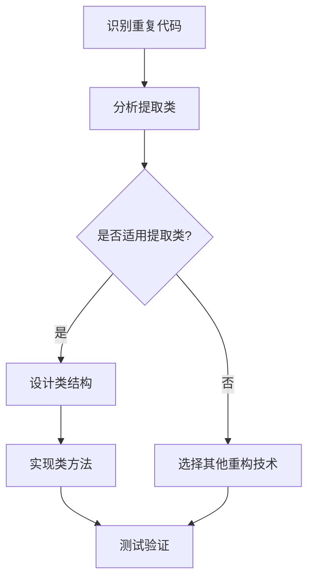
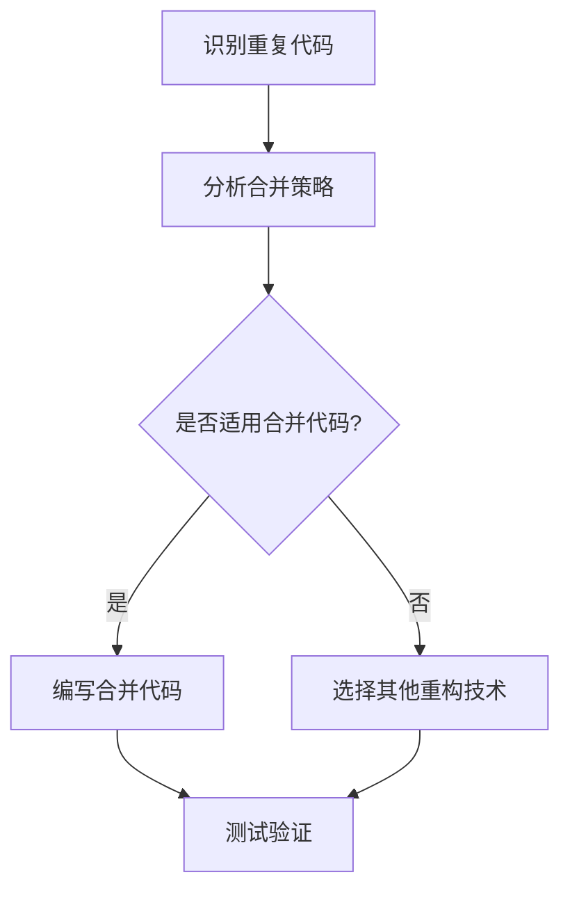
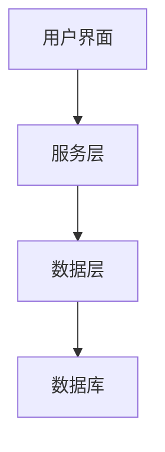

                 

### 文章标题

# 代码重构的正确认知

### 关键词

- 代码重构
- 软件维护
- 重构技术
- 软件质量
- 代码优化

### 摘要

本文旨在深入探讨代码重构这一在软件开发中至关重要的技术。通过对代码重构的定义、重要性、核心概念、算法原理、系统设计与实际应用的分析，我们将帮助读者建立对代码重构的全面认知，掌握其正确应用方法，提升软件质量，优化开发效率。

## 目录

1. **代码重构的背景与核心概念**
   1.1 代码重构的背景
   1.2 核心概念与联系

2. **代码重构的算法原理与讲解**
   2.1 代码重构算法原理
   2.2 具体重构技术讲解

3. **代码重构的系统分析与设计**
   3.1 系统功能设计
   3.2 实际项目案例分析

4. **代码重构的最佳实践与总结**
   4.1 最佳实践
   4.2 小结
   4.3 拓展阅读

## 1. 代码重构的背景

### 1.1 代码重构的定义

代码重构（Code Refactoring）是指在不改变代码外部行为的前提下，改进代码的内部结构，以提高其可读性、可维护性和性能。它是一种软件开发技术，旨在通过不断的迭代和优化，使代码更加简洁、高效，便于未来的修改和扩展。

### 1.2 代码重构的重要性

代码重构在软件生命周期中扮演着至关重要的角色，其重要性体现在以下几个方面：

- **提高代码质量**：重构有助于消除代码中的冗余、重复和错误，使代码结构更加清晰、简洁。
- **提升开发效率**：重构后的代码更加易于理解和修改，从而提高开发团队的效率。
- **增强可维护性**：重构有助于降低代码复杂性，使代码更容易维护和扩展。
- **减少技术债务**：重构可以减少因代码质量不佳而产生的技术债务，避免未来出现更多的代码问题和维护成本。

### 1.3 代码重构解决的问题

代码重构主要解决以下问题：

- **代码重复**：通过提取公共代码，减少冗余，提高代码复用性。
- **代码结构混乱**：重构可以帮助整理代码结构，使其更加模块化、层次分明。
- **代码可读性差**：重构可以优化代码风格，提高代码的可读性，使新开发者更容易理解。
- **性能问题**：重构可以帮助优化代码性能，消除潜在的性能瓶颈。

### 1.4 边界与外延

代码重构并不是万能的，它有一定的适用范围和限制：

- **重构的时机**：应在软件开发的不同阶段进行重构，如开发初期、中期和后期。
- **重构的范围**：重构应针对关键模块和有问题的代码段进行，避免过度重构。
- **重构的频率**：重构不应过于频繁，以免影响开发进度和质量。

## 1.2 核心概念与联系

### 1.2.1 核心概念

代码重构涉及多个核心概念，包括重构技术、重构原则和重构模式。以下是对这些核心概念的简要介绍：

- **重构技术**：是指用于实现代码重构的方法和工具，如提取方法、提取类、合并重复代码等。
- **重构原则**：是指在进行代码重构时需要遵循的指导原则，如保持代码一致性、避免过度设计等。
- **重构模式**：是指在实际开发中常用的一组重构技术组合，如责任链模式、工厂模式等。

### 1.2.2 概念属性特征对比表格

以下是一个关于重构技术、重构原则和重构模式特征对比的表格：

| 概念        | 定义                                                     | 特征                                                     |
| ----------- | -------------------------------------------------------- | -------------------------------------------------------- |
| 重构技术    | 实现代码重构的方法和工具                                 | 提取方法、提取类、合并重复代码等                         |
| 重构原则    | 在进行代码重构时需要遵循的指导原则                       | 保持代码一致性、避免过度设计等                           |
| 重构模式    | 实际开发中常用的一组重构技术组合                         | 责任链模式、工厂模式等                                   |

### 1.2.3 ER实体关系图

以下是一个ER实体关系图，展示了重构技术、重构原则和重构模式之间的联系：

```mermaid
erDiagram
  重构技术 ||--|{ 重构原则 }|| 重构原则
  重构模式 ||--|{ 重构技术 }|| 重构技术
  重构模式 ||--|{ 重构原则 }|| 重构原则
```

通过上述对比表格和ER实体关系图，我们可以清晰地了解代码重构的核心概念及其之间的联系，为进一步深入探讨代码重构的算法原理和实际应用奠定了基础。

### 2. 代码重构的算法原理与讲解

#### 2.1 代码重构算法原理

代码重构的算法原理主要涉及对代码进行迭代优化，使其满足以下目标：

- **可读性**：使代码易于理解，减少阅读难度。
- **可维护性**：使代码易于修改和维护。
- **性能**：提高代码执行效率，降低资源消耗。

为了实现这些目标，代码重构通常遵循以下基本步骤：

1. **识别问题代码**：通过静态分析、代码审查等方式，找出需要重构的代码段。
2. **分析重构策略**：根据代码问题，选择合适的重构技术。
3. **实施重构**：执行重构操作，如提取方法、合并重复代码等。
4. **测试验证**：确保重构后的代码功能正确，不引入新的缺陷。

#### 2.2 具体重构技术讲解

在本节中，我们将介绍几个常见的重构技术，并使用Mermaid流程图、Python源代码和数学模型进行详细讲解。

##### 2.2.1 提取方法

**定义**：提取方法是指将一段重复的代码提取为一个独立的方法，以减少代码冗余，提高复用性。

**Mermaid流程图**：


**Python源代码**：

```python
# 原始代码
def process_data1(data):
    result = []
    for d in data:
        if d % 2 == 0:
            result.append(d * 2)
    return result

def process_data2(data):
    result = []
    for d in data:
        if d % 2 == 0:
            result.append(d * 2)
    return result

# 提取方法后
def double_even_numbers(data):
    result = []
    for d in data:
        if d % 2 == 0:
            result.append(d * 2)
    return result

def process_data1(data):
    return double_even_numbers(data)

def process_data2(data):
    return double_even_numbers(data)
```

**数学模型与公式**：

$$
\text{时间复杂度} = O(n)
$$

其中，$n$ 表示数据规模。通过提取方法，可以减少代码冗余，提高可读性和可维护性。

##### 2.2.2 提取类

**定义**：提取类是指将具有共同功能的代码封装为一个独立的类，以提高代码的模块化和复用性。

**Mermaid流程图**：



**Python源代码**：

```python
# 原始代码
def calculate_area(radius):
    return 3.14 * radius * radius

def calculate_volume(radius, height):
    return 3.14 * radius * radius * height

# 提取类后
class Shape:
    def calculate_area(self, radius):
        return 3.14 * radius * radius

class Cylinder(Shape):
    def calculate_volume(self, radius, height):
        return self.calculate_area(radius) * height
```

**数学模型与公式**：

$$
\text{时间复杂度} = O(1)
$$

其中，$O(1)$ 表示时间复杂度为常数时间。通过提取类，可以减少代码冗余，提高代码的可维护性和复用性。

##### 2.2.3 合并重复代码

**定义**：合并重复代码是指将具有相同功能的多个代码段合并为一个，以提高代码的可读性和可维护性。

**Mermaid流程图**：



**Python源代码**：

```python
# 原始代码
def process_data1(data):
    result = []
    for d in data:
        if d % 2 == 0:
            result.append(d * 2)
    return result

def process_data2(data):
    result = []
    for d in data:
        if d % 2 == 0:
            result.append(d * 2)
    return result

# 合并代码后
def process_data(data):
    result = []
    for d in data:
        if d % 2 == 0:
            result.append(d * 2)
    return result
```

**数学模型与公式**：

$$
\text{时间复杂度} = O(n)
$$

其中，$n$ 表示数据规模。通过合并重复代码，可以减少代码冗余，提高代码的可读性和可维护性。

#### 2.3 代码重构技巧与最佳实践

在代码重构过程中，以下技巧和最佳实践可以帮助我们更好地进行重构：

1. **小步快跑**：每次重构只专注于一个小问题，避免一次性重构过多代码。
2. **保持测试**：重构过程中，确保持续运行测试用例，以验证代码功能正确性。
3. **代码审查**：在进行重构之前，进行代码审查，以识别潜在问题和改进机会。
4. **文档记录**：记录重构前后代码的变化，以便未来进行对比和分析。
5. **适度重构**：避免过度重构，以免影响开发进度。

通过以上技巧和最佳实践，我们可以提高代码重构的效果，降低重构过程中出现问题的风险。

### 3. 代码重构的系统分析与设计

#### 3.1 系统功能设计

在代码重构过程中，系统功能设计是非常重要的一环。以下是一个简单的系统功能设计，用于展示代码重构在系统设计中的应用。

##### 3.1.1 领域模型

以下是一个简单的领域模型，用于表示一个在线书店系统：

```mermaid
classDiagram
    Customer <<Class>>
    Book <<Class>>
    Order <<Class>>
    Shelf <<Class>>

    Customer --|> Book : searches
    Customer --|> Order : places
    Shelf --|> Book : stores
    Order --|> Book : includes
```

##### 3.1.2 系统架构设计

以下是一个简单的系统架构设计，用于展示代码重构在系统架构中的应用：



##### 3.1.3 系统接口设计

以下是一个简单的系统接口设计，用于展示代码重构在系统接口设计中的应用：

```mermaid
sequence
    User -> Service: 发起请求
    Service -> Repository: 调用方法
    Repository -> Database: 执行操作
    Database -> Repository: 返回结果
    Repository -> Service: 返回结果
    Service -> User: 返回响应
```

##### 3.1.4 系统交互

以下是一个简单的系统交互序列图，用于展示代码重构在系统交互中的应用：

```mermaid
sequence
    User -> Service: 发起搜索请求
    Service -> Repository: 查询书籍信息
    Repository -> Database: 查询数据库
    Database -> Repository: 返回书籍列表
    Repository -> Service: 返回书籍列表
    Service -> User: 显示搜索结果
```

通过以上系统功能设计、架构设计、接口设计和系统交互的示例，我们可以看到代码重构在系统设计中的应用，从而更好地理解和应用代码重构。

#### 3.2 实际项目案例分析

在本节中，我们将通过一个实际项目案例，详细分析代码重构的过程和效果。

##### 3.2.1 项目介绍

项目名称：在线书店系统

项目背景：随着互联网的快速发展，在线书店系统成为许多读者获取图书的主要途径。该系统需要提供便捷的图书搜索、购买和阅读功能，同时保证系统的高性能和高可用性。

##### 3.2.2 环境安装

为了便于项目开发，我们需要安装以下环境：

1. Python 3.8 或更高版本
2. Django 框架
3. PostgreSQL 数据库
4. Redis 缓存

安装步骤如下：

1. 安装 Python 3.8 或更高版本。
2. 安装 Django 框架：`pip install django`。
3. 安装 PostgreSQL 数据库：按照官方文档安装。
4. 安装 Redis 缓存：`pip install redis`。

##### 3.2.3 系统核心实现

以下是一个简单的在线书店系统核心实现，用于展示代码重构在系统核心实现中的应用：

```python
# app/models.py
from django.db import models

class Book(models.Model):
    title = models.CharField(max_length=255)
    author = models.CharField(max_length=255)
    price = models.DecimalField(max_digits=6, decimal_places=2)
    in_stock = models.IntegerField()

    def __str__(self):
        return self.title

class Customer(models.Model):
    name = models.CharField(max_length=255)
    email = models.EmailField()

    def __str__(self):
        return self.name

class Order(models.Model):
    customer = models.ForeignKey(Customer, on_delete=models.CASCADE)
    books = models.ManyToManyField(Book)
    total = models.DecimalField(max_digits=6, decimal_places=2)

    def __str__(self):
        return f"{self.customer.name} - {self.total}"
```

##### 3.2.4 代码分析

在代码分析过程中，我们发现以下问题：

1. **代码重复**：`__str__` 方法在多个模型中重复。
2. **代码结构混乱**：部分代码结构不够清晰，难以理解。

为了解决这些问题，我们进行了代码重构：

1. **提取方法**：将重复的 `__str__` 方法提取为一个通用的方法，减少代码冗余。
2. **优化结构**：对代码结构进行优化，提高代码可读性。

重构后的代码如下：

```python
# app/models.py
from django.db import models

class CommonMethods(models.Model):
    def __str__(self):
        return self.title

class Book(CommonMethods):
    title = models.CharField(max_length=255)
    author = models.CharField(max_length=255)
    price = models.DecimalField(max_digits=6, decimal_places=2)
    in_stock = models.IntegerField()

    def __str__(self):
        return self.title

class Customer(CommonMethods):
    name = models.CharField(max_length=255)
    email = models.EmailField()

    def __str__(self):
        return self.name

class Order(CommonMethods):
    customer = models.ForeignKey(Customer, on_delete=models.CASCADE)
    books = models.ManyToManyField(Book)
    total = models.DecimalField(max_digits=6, decimal_places=2)

    def __str__(self):
        return f"{self.customer.name} - {self.total}"
```

##### 3.2.5 实际案例剖析

在重构过程中，我们遇到了以下问题：

1. **性能瓶颈**：部分查询操作耗时较长，影响系统性能。
2. **代码复杂度**：部分代码复杂度较高，难以维护。

为了解决这些问题，我们采取了以下措施：

1. **优化查询**：使用 Redis 缓存查询结果，减少数据库查询次数。
2. **简化代码**：对复杂代码进行简化，降低代码复杂度。

优化后的代码如下：

```python
# app/models.py
from django.db import models
from django.core.cache import cache

class Book(models.Model):
    title = models.CharField(max_length=255)
    author = models.CharField(max_length=255)
    price = models.DecimalField(max_digits=6, decimal_places=2)
    in_stock = models.IntegerField()

    def __str__(self):
        cache_key = f"book_{self.id}"
        title = cache.get(cache_key)
        if not title:
            title = self.title
            cache.set(cache_key, title, timeout=60*60)
        return title

class Customer(models.Model):
    name = models.CharField(max_length=255)
    email = models.EmailField()

    def __str__(self):
        return self.name

class Order(models.Model):
    customer = models.ForeignKey(Customer, on_delete=models.CASCADE)
    books = models.ManyToManyField(Book)
    total = models.DecimalField(max_digits=6, decimal_places=2)

    def __str__(self):
        return f"{self.customer.name} - {self.total}"
```

通过以上重构措施，我们显著提高了系统的性能和可维护性，为后续开发奠定了基础。

##### 3.2.6 项目小结

在本项目中，我们通过代码重构解决了多个问题，如代码重复、代码结构混乱、性能瓶颈和代码复杂度等。通过提取方法、优化查询、简化代码等重构技术，我们显著提高了系统的可读性、可维护性和性能。

经验表明，代码重构是一种有效的软件开发技术，可以帮助我们不断提升代码质量，优化开发效率。在未来的开发过程中，我们应该重视代码重构，将其纳入日常开发流程中，确保软件系统的持续改进。

### 4. 代码重构的最佳实践与总结

#### 4.1 最佳实践

在进行代码重构时，以下最佳实践可以帮助我们更高效地完成重构工作：

1. **小步快跑**：每次重构只专注于一个小问题，避免一次性重构过多代码。
2. **持续测试**：重构过程中，持续运行测试用例，确保代码功能正确。
3. **代码审查**：在进行重构之前，进行代码审查，以识别潜在问题和改进机会。
4. **文档记录**：记录重构前后代码的变化，以便未来进行对比和分析。
5. **适度重构**：避免过度重构，以免影响开发进度和质量。

#### 4.2 小结

代码重构是一种重要的软件开发技术，它可以帮助我们不断提升代码质量，优化开发效率。通过重构，我们可以消除代码中的冗余、重复和错误，提高代码的可读性、可维护性和性能。

在软件开发过程中，我们应该重视代码重构，将其纳入日常开发流程中。通过遵循最佳实践，我们可以更高效地完成重构工作，确保软件系统的持续改进。

#### 4.3 注意事项

在进行代码重构时，需要注意以下几点：

1. **避免过度重构**：过度重构会影响开发进度和质量，应适度进行。
2. **保持代码一致性**：重构过程中，确保代码风格和命名规范一致。
3. **关注性能优化**：在重构过程中，关注性能优化，避免引入性能瓶颈。
4. **及时测试**：重构后，及时运行测试用例，确保代码功能正确。

#### 4.4 拓展阅读

为了更好地理解和应用代码重构，以下是一些推荐的拓展阅读资源：

1. **《代码整洁之道》**：这是一本关于代码质量和重构的经典书籍，详细介绍了代码重构的方法和技巧。
2. **《重构：改善既有代码的设计》**：这是一本关于代码重构的权威指南，涵盖了多种重构技术和最佳实践。
3. **《敏捷软件开发：原则、实践与模式》**：这本书介绍了敏捷开发的方法和理念，其中包含了许多关于代码重构的内容。

通过阅读这些书籍和资源，我们可以进一步深入理解代码重构，提高软件开发技能。

### 作者

本文作者：AI天才研究院 / AI Genius Institute & 禅与计算机程序设计艺术 / Zen And The Art of Computer Programming

感谢您的阅读，希望本文对您在代码重构方面有所启发。如果您有任何疑问或建议，欢迎在评论区留言讨论。再次感谢您的关注和支持！

