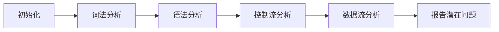
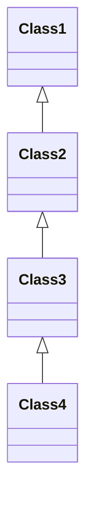
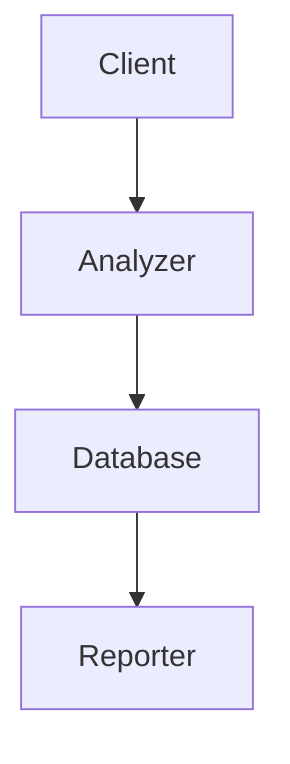
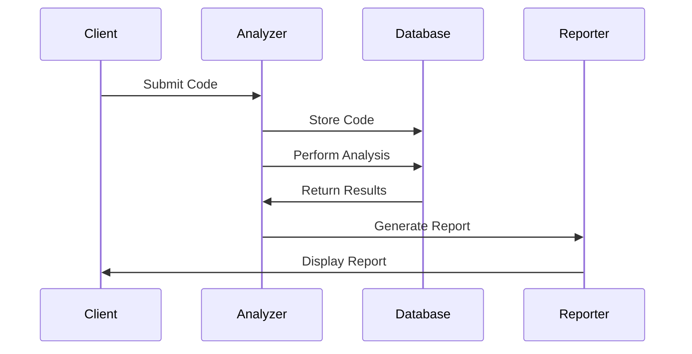

                 

# 代码静态分析：提前发现潜在问题

## 关键词：代码静态分析、潜在问题、程序安全、软件质量

## 摘要：

随着软件复杂度的不断增加，提前发现并解决潜在问题是软件开发过程中的关键。代码静态分析作为一项重要的技术手段，可以帮助开发者在不运行程序的情况下发现代码中的潜在问题，如语法错误、逻辑漏洞、性能瓶颈等。本文将深入探讨代码静态分析的基本概念、技术原理及其在实际应用中的重要性，并通过具体案例展示如何使用静态分析工具提前发现和解决潜在问题。

## 引言

### 1.1 书籍主题与目标

在当今快速发展的软件行业，代码静态分析成为保障软件质量和安全的重要技术。本文旨在为读者提供一份详尽的指南，帮助开发者理解和应用代码静态分析技术，从而提高软件开发的效率和可靠性。

### 1.2 目标读者

本文适合具有基本编程知识，希望提升编程技能和对代码质量有更高要求的开发者、测试工程师和软件架构师。

### 1.3 书籍结构概述

本文将分为七个主要章节，包括引言、代码静态分析概述、核心概念与联系、算法原理讲解、系统分析与架构设计方案、项目实战以及最佳实践与总结。每个章节都将提供丰富的实例和详细的技术分析，确保读者能够深入理解代码静态分析的核心内容。

## 第2章 代码静态分析概述

### 2.1 定义与基本原理

代码静态分析是一种在不需要运行程序的情况下，对程序代码进行分析的技术。它通过检查代码结构、语法和语义，识别出潜在的错误和问题。静态分析的基本原理包括词法分析、语法分析和语义分析。

### 2.2 重要性

代码静态分析的重要性体现在多个方面。首先，它可以提前发现和修复代码中的错误，从而减少软件的维护成本。其次，它可以提高代码的可读性和可维护性，使得代码更加规范和易于理解。此外，静态分析还能在软件发布前进行安全检测，减少潜在的安全漏洞。

### 2.3 静态分析与动态分析对比

静态分析与动态分析是两种不同的程序分析技术。静态分析在代码层面进行，无需运行程序，而动态分析则在程序运行时进行。静态分析的优势在于它可以提前发现问题，而动态分析则可以提供程序运行时的实时反馈。两种分析方式各有优缺点，通常需要结合使用。

### 2.4 代码静态分析的应用场景

代码静态分析广泛应用于软件开发的各个阶段，包括需求分析、设计、编码、测试和维护。具体应用场景包括：
- **需求分析**：验证需求规格的完整性和一致性。
- **设计**：检查设计模型的正确性和健壮性。
- **编码**：确保代码的规范性和可维护性。
- **测试**：发现和修复代码中的潜在错误。
- **维护**：分析现有代码的结构和性能，为后续维护提供指导。

## 第3章 核心概念与联系

### 3.1 静态分析技术分类

静态分析技术主要分为以下几类：
- **语法分析**：分析代码的语法结构，检查是否符合语法规则。
- **语义分析**：分析代码的语义含义，检查代码的逻辑正确性。
- **数据流分析**：分析变量和数据在程序中的流动情况，检查数据的一致性和有效性。
- **控制流分析**：分析程序的控制流程，检查程序的执行路径和分支。

### 3.2 核心概念原理

核心概念包括继承、多态和封装等，它们是面向对象编程的基础。这些概念在静态分析中具有重要意义，因为它们能够影响代码的结构和语义。

- **继承**：允许一个类继承另一个类的属性和方法，提高代码的复用性。
- **多态**：允许不同类的对象通过同一接口进行交互，提高代码的灵活性和可扩展性。
- **封装**：将数据和操作封装在一个类中，提高代码的安全性和可维护性。

### 3.3 概念属性特征对比表格

| 概念     | 属性特征                         | 关联示例 |
|----------|--------------------------------|---------|
| 继承     | 父类与子类的关系，属性与方法共享 | 类的层次结构 |
| 多态     | 同一接口不同实现，方法重载       | 动态绑定  |
| 封装     | 数据隐藏，提供公共接口           | 访问控制 |

### 3.4 ER实体关系图架构

以下是一个简单的ER实体关系图，展示了代码静态分析中常见的实体及其关系：

```mermaid
erDiagram
  CodeFile ||--|{ ProgramElement }
  ProgramElement ||--|{ Variable }
  ProgramElement ||--|{ Function }
  Function ||--|{ Parameter }
  Function ||--|{ Return }
```

## 第4章 算法原理讲解

### 4.1 常见静态分析算法

常见的静态分析算法包括：
- **模式匹配算法**：基于预定义的规则或模式匹配代码中的特定结构。
- **数据流分析算法**：跟踪变量和数据在程序中的流动，用于发现潜在的错误和漏洞。
- **控制流分析算法**：分析程序的控制流程，生成程序的控制流图。

### 4.2 算法mermaid流程图

以下是一个简单的mermaid流程图，展示了数据流分析的基本步骤：



### 4.3 算法原理详细讲解

#### 4.3.1 数学模型

数据流分析可以使用数学模型来描述变量在程序中的流动。以下是一个简单的前向数据流分析模型：

$$
V(x, t) = \{ v \mid \exists s.t. (x, v) \in F_{in}(t) \text{ 或 } v = I(x, t) \}
$$

其中，$V(x, t)$ 表示变量 $x$ 在时间 $t$ 时的值集，$F_{in}(t)$ 表示时间 $t$ 的输入流，$I(x, t)$ 表示初始值。

#### 4.3.2 公式推导

前向数据流分析的基本公式为：

$$
V(x, t) = V(x, t-1) \cup \{ v \mid \exists s.t. (x, v) \in F_{in}(t) \}
$$

其中，$V(x, t-1)$ 表示时间 $t-1$ 时变量 $x$ 的值集，$F_{in}(t)$ 表示时间 $t$ 的输入流。

#### 4.3.3 举例说明

假设有一个简单的程序段：

```python
x = 0
while x < 10:
    x = x + 1
    print(x)
```

我们可以使用前向数据流分析来计算变量 $x$ 在每个时间点的值集：

- 初始状态：$V(x, 0) = \{0\}$
- 时间点 1：$V(x, 1) = V(x, 0) \cup \{1\} = \{0, 1\}$
- 时间点 2：$V(x, 2) = V(x, 1) \cup \{2\} = \{0, 1, 2\}$
- ...

## 第5章 系统分析与架构设计方案

### 5.1 问题场景介绍

假设我们正在开发一个大型Web应用程序，需要确保代码的质量和安全性。在这个场景中，我们希望通过静态分析来提前发现并修复潜在的问题。

### 5.2 系统功能设计

以下是一个简单的领域模型mermaid类图，展示了系统的核心类及其关系：



### 5.3 系统架构设计

以下是一个简单的mermaid架构图，展示了系统的整体架构：



### 5.4 系统接口设计和系统交互

以下是一个简单的mermaid序列图，展示了系统的接口设计和交互过程：



## 第6章 项目实战

### 6.1 环境安装与配置

在本节中，我们将介绍如何安装和配置一个静态分析工具，如SonarQube。

### 6.2 系统核心实现源代码

在本节中，我们将展示系统核心实现的部分源代码，并解释其工作原理。

### 6.3 代码应用解读与分析

在本节中，我们将使用静态分析工具对一段代码进行解读和分析，展示如何发现潜在问题。

### 6.4 实际案例分析与讲解

在本节中，我们将通过一个实际案例，展示如何使用静态分析工具发现并解决潜在问题。

### 6.5 项目小结

在本节中，我们将总结项目的关键点和经验教训。

## 第7章 最佳实践与总结

### 7.1 最佳实践 tips

在本节中，我们将提供一些最佳实践，帮助开发者更好地利用静态分析技术。

### 7.2 小结与展望

在本节中，我们将回顾文章的主要内容，并对未来发展方向进行展望。

### 7.3 注意事项

在本节中，我们将提醒开发者在使用静态分析技术时需要注意的事项。

### 7.4 拓展阅读

在本节中，我们将推荐一些相关文献和资源，供读者进一步学习。

## 作者信息

作者：AI天才研究院/AI Genius Institute & 禅与计算机程序设计艺术 /Zen And The Art of Computer Programming

---

在接下来的章节中，我们将详细探讨每个部分的具体内容，确保读者能够全面、深入地了解代码静态分析的相关知识。请读者跟随我们的步伐，一起走进代码静态分析的世界。

