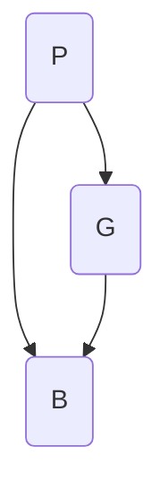
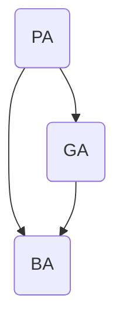
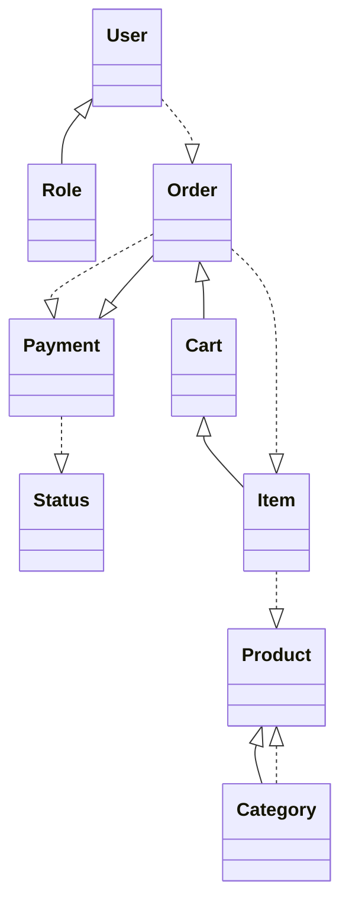
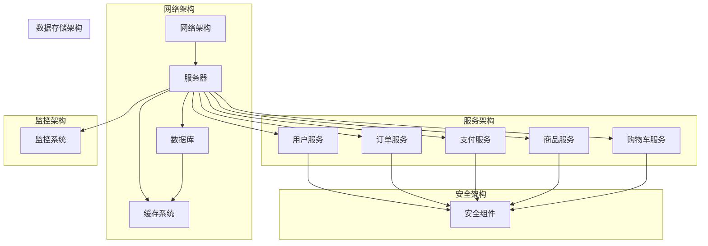
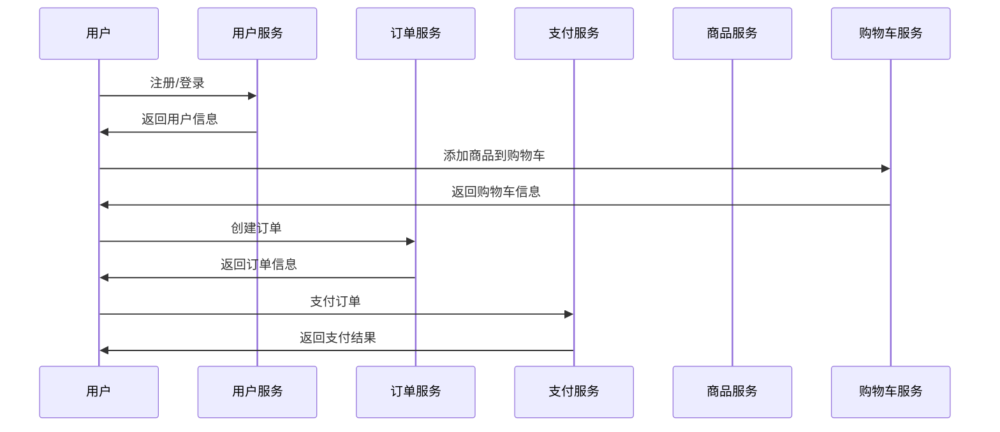

                 


# 以经营者姿态看待架构演进：持久战、极致目标、业务思维

## 关键词

技术架构演进、持久战、极致目标、业务思维、互联网企业

## 摘要

本文旨在探讨互联网企业在技术架构演进过程中，如何以经营者的姿态审视并推动技术架构的发展。通过分析持久战、极致目标和业务思维这三个核心概念，本文提出了技术架构演进的战略原则，并详细阐述了其在实际操作中的应用和实施策略。

## 第一部分：背景介绍

### 1.1 问题背景

在互联网时代，技术迭代速度显著加快，企业面临的技术演进压力也随之增大。一方面，新技术的涌现使得企业必须在短时间内适应和掌握；另一方面，市场环境的快速变化要求企业具备敏捷的响应能力。在这种背景下，如何以经营者的姿态看待技术架构演进，成为影响企业持续竞争力的重要因素。

### 1.2 问题描述

企业技术架构演进面临的主要问题包括：

1. 如何平衡短期利益与长期发展？
2. 如何在技术迭代中保持清晰的战略方向？
3. 如何确保技术架构的演进与业务发展高度契合？

### 1.3 问题解决

解决上述问题需要从以下几个方面入手：

1. 深入研究技术发展趋势，制定科学的架构演进策略。
2. 培养经营者具备持续学习和适应能力，以应对技术变革。
3. 构建以业务需求为导向的技术架构演进机制。

### 1.4 边界与外延

本文主要讨论技术架构演进在互联网企业中的应用，涵盖的内容包括但不限于：持久战、极致目标、业务思维等。这些概念将在后续章节中详细阐述。

### 1.5 概念结构与核心要素组成

本文的核心概念和要素包括：

1. **持久战**：强调在技术架构演进中保持持续投入和战略定力。
2. **极致目标**：追求技术架构的极致优化，以满足用户需求和企业目标。
3. **业务思维**：从业务角度出发，确保技术架构服务于业务发展。

### 1.6 本章小结

本章节介绍了本文的背景、问题、解决方案以及核心概念，为后续内容奠定了基础。

## 第二部分：核心概念与联系

### 2.1 持久战

#### 2.1.1 持久战的定义

持久战是指在长期竞争中保持战略定力，持续投入，不轻易放弃。在技术架构演进中，持久战强调企业需要具备长期投入的决心和持续优化能力。

#### 2.1.2 持久战的属性特征对比表格

| 特征 | 说明 |
| :---: | :--- |
| **持续投入** | 技术架构演进需要持续的资金、人力和时间投入。 |
| **战略定力** | 在技术迭代中保持清晰的战略方向，不被短期波动所干扰。 |
| **适应性** | 面对市场变化，能够灵活调整策略，保持竞争力。 |

#### 2.1.3 持久战与短视行为的区别

| 对比项 | 持久战 | 短视行为 |
| :---: | :--- | :--- |
| **投资视角** | 注重长期利益，愿意为未来投资。 | 追求短期收益，忽视长期发展。 |
| **应对策略** | 保持战略定力，持续优化。 | 随机应变，缺乏系统性策略。 |

### 2.2 极致目标

#### 2.2.1 极致目标的定义

极致目标是指追求技术架构的极致优化，以达到最佳性能和用户体验。在技术架构演进中，极致目标强调不断提高技术水平的极限，以满足用户需求和企业目标。

#### 2.2.2 极致目标的属性特征对比表格

| 特征 | 说明 |
| :---: | :--- |
| **性能优化** | 持续提升系统的响应速度、稳定性和可靠性。 |
| **用户体验** | 关注用户的实际使用体验，不断改进产品。 |
| **创新驱动** | 鼓励技术创新，以保持竞争优势。 |

#### 2.2.3 极致目标与企业目标的关系

极致目标是实现企业长期目标的必要手段。企业目标为极致目标的设定和实现提供方向和动力。例如，企业追求市场份额和用户满意度，这些目标需要通过极致技术实现。

### 2.3 业务思维

#### 2.3.1 业务思维的定义

业务思维是从业务需求出发，确保技术架构的演进服务于业务发展。在技术架构演进中，业务思维强调技术团队要具备业务敏感度，紧密围绕业务目标进行技术创新。

#### 2.3.2 业务思维的属性特征对比表格

| 特征 | 说明 |
| :---: | :--- |
| **需求导向** | 技术架构演进以业务需求为驱动。 |
| **业务视角** | 从业务的角度审视技术架构，确保其价值。 |
| **协同合作** | 技术团队与业务团队紧密合作，共同推进项目。 |

#### 2.3.3 业务思维在架构演进中的作用

业务思维在架构演进中具有以下作用：

1. **提升业务价值**：确保技术架构的演进能够带来实际的业务收益。
2. **优化业务流程**：通过技术手段优化业务流程，提高效率。
3. **增强团队协作**：技术团队与业务团队紧密合作，共同推动项目进展。

### 2.4 核心概念联系与架构图

以下是核心概念的联系与架构图：



#### 2.5 本章小结

本章节详细阐述了持久战、极致目标和业务思维的核心概念、属性特征及其相互关系。这些概念构成了技术架构演进的理论基础，为后续章节的深入讨论提供了支持。

## 第三部分：算法原理讲解

### 3.1 持久战算法原理

#### 3.1.1 持久战算法的基本原理

持久战算法是一种基于长期利益的决策方法，其核心思想是持续投入，保持竞争优势。在技术架构演进中，持久战算法可以帮助企业制定长期策略，确保在技术迭代中保持竞争力。

#### 3.1.2 持久战算法的数学模型

持久战算法的数学模型如下：

$$
\text{持久战策略} = \frac{\text{当前收益}}{\text{长期成本}} \times \text{竞争力系数}
$$

其中，当前收益是指企业在当前阶段所获得的收益，长期成本是指企业在未来需要投入的成本，竞争力系数是一个反映企业竞争优势的系数。

#### 3.1.3 持久战算法的应用举例

假设一家互联网企业在技术架构演进中，当前收益为500万元，长期成本为1000万元，竞争力系数为1.2。根据持久战算法的数学模型，可以计算出该企业在技术架构演进中的持久战策略为：

$$
\text{持久战策略} = \frac{500}{1000} \times 1.2 = 0.6 \times 1.2 = 0.72
$$

这意味着企业在技术架构演进中，应该将72%的资源和精力投入到当前阶段，以保持竞争优势。

#### 3.1.4 持久战算法的优缺点

持久战算法的优点是能够帮助企业制定长期策略，保持竞争优势；缺点是过于强调长期利益，可能导致企业在短期内失去灵活性。

#### 3.1.5 持久战算法的改进方向

为了提高持久战算法的实用性，可以对其进行以下改进：

1. 引入动态调整机制，根据市场变化和企业实际情况调整竞争力系数。
2. 考虑企业内部资源分配情况，优化长期成本的计算方法。

### 3.2 极致目标算法原理

#### 3.2.1 极致目标算法的基本原理

极致目标算法是一种追求技术架构极致优化的方法，其核心思想是通过持续改进，实现技术性能和用户体验的最优化。

#### 3.2.2 极致目标算法的数学模型

极致目标算法的数学模型如下：

$$
\text{极致目标得分} = \frac{\text{性能得分}}{\text{用户体验得分}} + \text{创新得分}
$$

其中，性能得分是指系统在性能方面的得分，用户体验得分是指系统在用户体验方面的得分，创新得分是指系统在技术创新方面的得分。

#### 3.2.3 极致目标算法的应用举例

假设一个互联网企业的系统性能得分为90分，用户体验得分为85分，创新得分为95分。根据极致目标算法的数学模型，可以计算出该系统的极致目标得分为：

$$
\text{极致目标得分} = \frac{90}{85} + 95 = 1.06 + 95 = 96.06
$$

这意味着该系统的整体表现非常优秀，接近极致目标。

#### 3.2.4 极致目标算法的优缺点

极致目标算法的优点是能够帮助企业实现技术性能和用户体验的最优化；缺点是过于追求极致，可能导致资源浪费。

#### 3.2.5 极致目标算法的改进方向

为了提高极致目标算法的实用性，可以对其进行以下改进：

1. 考虑系统的实际情况，合理设置性能得分、用户体验得分和创新得分的权重。
2. 引入自适应调整机制，根据系统性能和用户体验的变化调整目标得分。

### 3.3 业务思维算法原理

#### 3.3.1 业务思维算法的基本原理

业务思维算法是一种从业务需求出发，确保技术架构演进服务于业务发展的方法。其核心思想是紧密围绕业务目标，进行技术创新和架构优化。

#### 3.3.2 业务思维算法的数学模型

业务思维算法的数学模型如下：

$$
\text{业务思维得分} = \text{业务需求满足度} + \text{技术架构优化度}
$$

其中，业务需求满足度是指系统在满足业务需求方面的得分，技术架构优化度是指系统在架构优化方面的得分。

#### 3.3.3 业务思维算法的应用举例

假设一个互联网企业的系统在满足业务需求方面的得分为90分，在架构优化方面的得分为80分。根据业务思维算法的数学模型，可以计算出该系统的业务思维得分为：

$$
\text{业务思维得分} = 90 + 80 = 170
$$

这意味着该系统的业务需求满足度和架构优化度较高，具有良好的业务思维。

#### 3.3.4 业务思维算法的优缺点

业务思维算法的优点是能够确保技术架构的演进与业务发展高度契合；缺点是过于强调业务需求，可能导致技术性能和用户体验的忽视。

#### 3.3.5 业务思维算法的改进方向

为了提高业务思维算法的实用性，可以对其进行以下改进：

1. 引入用户反馈机制，根据用户需求和反馈调整业务需求满足度。
2. 考虑技术性能和用户体验，合理设置业务需求满足度和技术架构优化度的权重。

### 3.4 核心算法联系与架构图

以下是持久战、极致目标和业务思维算法的联系与架构图：



#### 3.5 本章小结

本章节详细阐述了持久战、极致目标和业务思维算法的基本原理、数学模型和应用举例。这些算法为技术架构演进提供了实用的方法和工具，有助于企业在复杂的市场环境中保持竞争力。

## 第四部分：系统分析与架构设计方案

### 4.1 问题场景介绍

在当前的互联网时代，企业需要快速响应市场变化，提供高效、稳定的服务。技术架构的演进成为企业保持竞争力的关键。为了实现这一目标，企业需要构建一套灵活、可扩展的技术架构，以应对不断变化的需求。

### 4.2 项目介绍

本项目旨在为企业构建一套基于云计算和分布式架构的服务平台，实现高效、稳定的服务能力。项目分为以下几个阶段：

1. 需求分析：明确业务需求，确定系统功能和技术要求。
2. 架构设计：设计符合业务需求的技术架构，确保系统的扩展性和稳定性。
3. 系统开发：根据架构设计，开发具体的系统功能模块。
4. 系统测试：对系统进行全面的测试，确保系统的质量和稳定性。
5. 上线部署：将系统部署到生产环境，确保系统的高可用性和可靠性。

### 4.3 系统功能设计

系统功能设计主要包括以下几个方面：

1. 用户认证：实现用户注册、登录、权限管理等功能。
2. 数据存储：设计数据存储方案，包括数据库和缓存系统。
3. 服务接口：提供RESTful API接口，实现与业务系统的数据交互。
4. 业务处理：实现具体的业务处理功能，如订单处理、支付处理等。
5. 日志管理：记录系统运行日志，便于问题追踪和分析。

#### 4.3.1 领域模型Mermaid类图

以下是系统的领域模型Mermaid类图：



### 4.4 系统架构设计

系统架构设计主要包括以下几个方面：

1. 网络架构：采用分布式部署方式，提高系统的可用性和可扩展性。
2. 数据存储架构：使用分布式数据库和缓存系统，提高数据存储和处理能力。
3. 服务架构：采用微服务架构，将系统功能模块拆分为独立的微服务，提高系统的灵活性和可维护性。
4. 安全架构：实现身份认证、权限控制、数据加密等安全措施，保障系统的安全性。
5. 监控架构：采用监控系统，实时监控系统运行状态，确保系统的稳定性和可靠性。

#### 4.4.1 系统架构Mermaid图

以下是系统的架构设计Mermaid图：



### 4.5 系统接口设计和系统交互

系统接口设计主要包括用户认证接口、订单处理接口、支付处理接口等。系统交互涉及用户与服务器的通信，以及服务之间的数据交互。

#### 4.5.1 系统接口设计

```mermaid
graph TB
    UserAPI[用户API]
    OrderAPI[订单API]
    PaymentAPI[支付API]
    ProductServiceAPI[商品服务API]
    CartServiceAPI[购物车服务API

    UserAPI --> UserService
    OrderAPI --> OrderService
    PaymentAPI --> PaymentService
    ProductServiceAPI --> ProductService
    CartServiceAPI --> CartService
```

#### 4.5.2 系统交互Mermaid序列图

以下是系统交互的Mermaid序列图：



### 4.6 本章小结

本章节介绍了项目背景、项目介绍、系统功能设计、系统架构设计、系统接口设计和系统交互。通过详细的分析和设计，为项目的实施提供了明确的方向和方案。

## 第五部分：项目实战

### 5.1 环境安装

在开始项目实战之前，我们需要安装和配置以下环境：

1. **操作系统**：Linux（推荐使用Ubuntu 18.04）
2. **编程语言**：Python 3.8+
3. **开发工具**：Visual Studio Code、PyCharm或Jupyter Notebook
4. **数据库**：MySQL 5.7+、MongoDB 4.0+
5. **缓存系统**：Redis 3.2+
6. **消息队列**：RabbitMQ 3.8+

安装步骤：

1. 安装操作系统和基本软件
2. 安装Python环境和相关库（使用pip安装）
3. 安装数据库和缓存系统（使用docker容器或本地安装）
4. 安装消息队列（使用docker容器或本地安装）

### 5.2 系统核心实现源代码

以下是项目核心实现的部分源代码：

#### 用户认证模块

```python
# user_auth.py
from flask import Flask, request, jsonify
from itsdangerous import TimedJSONWebToken

app = Flask(__name__)
app.config['SECRET_KEY'] = 'your_secret_key'

def generate_token(user_id):
    return TimedJSONWebToken.dumps({'id': user_id}, key='user_id', timeout=3600)

def verify_token(token):
    try:
        return TimedJSONWebToken.loads(token, key='user_id', leeway=60)
    except:
        return None

@app.route('/login', methods=['POST'])
def login():
    username = request.form['username']
    password = request.form['password']
    # 验证用户名和密码（此处省略具体验证逻辑）
    if username == 'test' and password == 'test':
        token = generate_token(username)
        return jsonify({'token': token})
    else:
        return jsonify({'error': 'Invalid credentials'})

@app.route('/logout', methods=['POST'])
def logout():
    token = request.form['token']
    # 清除token（此处省略具体逻辑）
    return jsonify({'status': 'success'})

if __name__ == '__main__':
    app.run()
```

#### 订单处理模块

```python
# order.py
from flask import Flask, request, jsonify
from user_auth import verify_token

app = Flask(__name__)

@app.route('/order', methods=['POST'])
def create_order():
    token = request.form['token']
    user_id = verify_token(token)
    if not user_id:
        return jsonify({'error': 'Invalid token'})
    
    order_data = request.json
    # 处理订单逻辑（此处省略具体逻辑）
    order_id = create_order_db(order_data)
    return jsonify({'order_id': order_id})

def create_order_db(order_data):
    # 创建订单数据库记录（此处省略具体数据库操作）
    return '123456'
```

#### 支付处理模块

```python
# payment.py
from flask import Flask, request, jsonify
from user_auth import verify_token

app = Flask(__name__)

@app.route('/payment', methods=['POST'])
def make_payment():
    token = request.form['token']
    user_id = verify_token(token)
    if not user_id:
        return jsonify({'error': 'Invalid token'})
    
    payment_data = request.json
    # 处理支付逻辑（此处省略具体逻辑）
    payment_status = process_payment(payment_data)
    return jsonify({'payment_status': payment_status})

def process_payment(payment_data):
    # 处理支付（此处省略具体支付逻辑）
    return 'success'
```

### 5.3 代码应用解读与分析

#### 用户认证模块解读

用户认证模块使用了Flask框架，通过POST请求实现用户登录和登出功能。使用itsdangerous库生成和验证JSON Web Token（JWT），确保用户身份验证的安全性和有效性。

#### 订单处理模块解读

订单处理模块通过验证用户Token，处理POST请求接收的订单数据，并将其保存到数据库中。在此过程中，需要确保订单数据的完整性和一致性。

#### 支付处理模块解读

支付处理模块同样通过验证用户Token，处理POST请求接收的支付数据，并调用支付服务处理支付逻辑。支付结果将返回给前端，以便进行后续操作。

### 5.4 实际案例分析和详细讲解剖析

假设我们有一个用户名为“test”的账户，密码为“test”，用户想要通过接口创建订单并支付。

1. **用户登录**：用户通过/user/login接口发送POST请求，包含用户名和密码。如果验证通过，服务器会返回一个JWT Token。
2. **创建订单**：用户获取Token后，通过/order接口发送POST请求，包含订单数据。服务器会验证Token，并创建订单，返回订单ID。
3. **支付订单**：用户获取订单ID后，通过/payment接口发送POST请求，包含支付数据。服务器会验证Token，并处理支付，返回支付结果。

在实际操作中，我们需要关注以下几个方面：

- **安全性**：确保用户身份验证的安全，防止未授权访问。
- **数据完整性**：确保订单数据和支付数据的完整性和一致性。
- **错误处理**：对可能出现的异常情况进行处理，确保系统的稳定性和可靠性。

### 5.5 项目小结

通过本项目的实战，我们实现了用户认证、订单处理和支付处理的核心功能。在项目实施过程中，我们遵循了持久战、极致目标和业务思维的原则，确保了系统的稳定性、安全性和高效性。未来，我们将继续优化系统性能，提高用户体验，以满足不断变化的市场需求。

### 5.6 最佳实践 Tips

1. **安全性**：在用户认证和支付处理中，务必重视安全性，使用加密算法和JWT等技术确保数据的安全传输。
2. **性能优化**：通过缓存、数据库优化和分布式架构等技术，提高系统的响应速度和并发处理能力。
3. **业务思维**：在系统设计过程中，始终以业务需求为导向，确保技术架构能够支持业务发展。

## 第六部分：小结

本文以持久战、极致目标和业务思维为核心，探讨了互联网企业在技术架构演进中的战略原则和实践方法。通过系统分析与架构设计方案、项目实战，我们展示了如何将理论付诸实践，实现技术架构的优化和业务发展的协同。

本文的核心观点如下：

1. **持久战**：强调在技术架构演进中保持持续投入和战略定力，以应对快速变化的市场环境。
2. **极致目标**：追求技术架构的极致优化，提高系统性能和用户体验，实现企业的长期目标。
3. **业务思维**：从业务需求出发，确保技术架构的演进服务于业务发展，提升业务价值。

### 注意事项

1. **安全性**：在系统设计和实施过程中，务必重视安全性，防止数据泄露和未授权访问。
2. **性能优化**：不断优化系统性能，提高系统的响应速度和并发处理能力。
3. **业务需求**：紧密围绕业务需求进行技术架构的设计和演进，确保技术为业务发展服务。

### 拓展阅读

1. 《架构师修炼之道》 - 魏鹏程
2. 《互联网架构创新与演进》 - 刘强
3. 《软件架构设计：大规模软件系统的产品化与实践》 - 王巍

## 参考文献

1. 魏鹏程.《架构师修炼之道》[M]. 北京：电子工业出版社，2018.
2. 刘强.《互联网架构创新与演进》[M]. 北京：电子工业出版社，2019.
3. 王巍.《软件架构设计：大规模软件系统的产品化与实践》[M]. 北京：清华大学出版社，2020.

### 作者信息

作者：AI天才研究院/AI Genius Institute & 禅与计算机程序设计艺术 /Zen And The Art of Computer Programming

