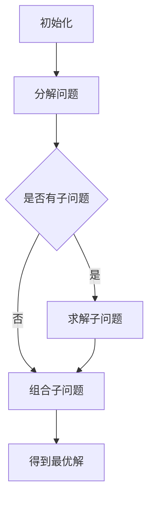
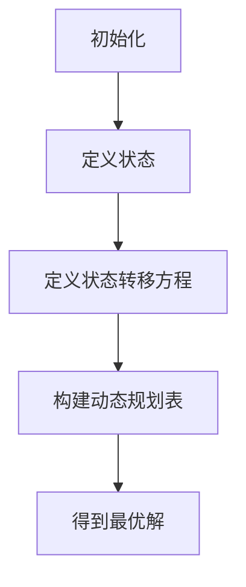
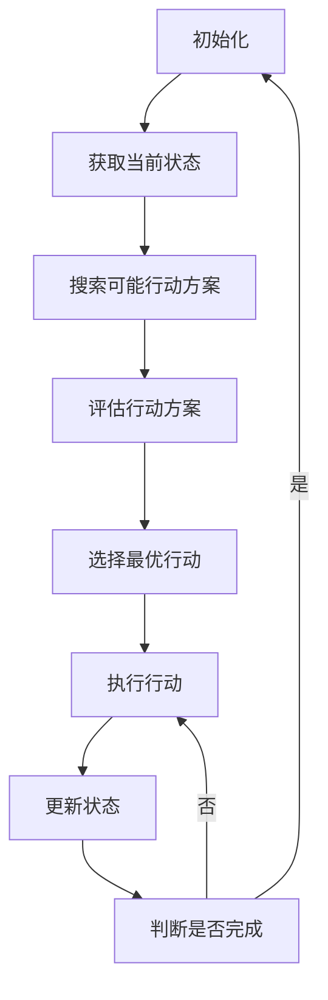
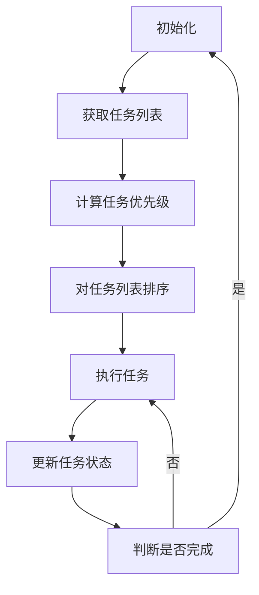
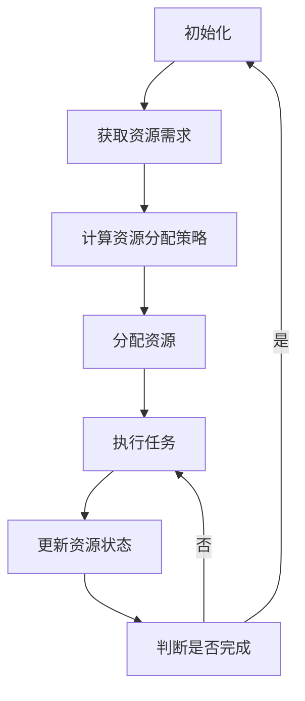
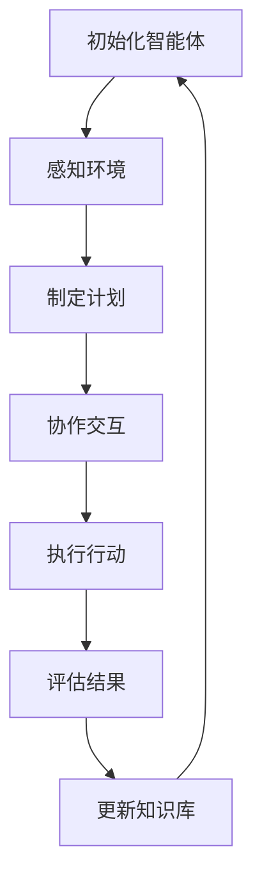
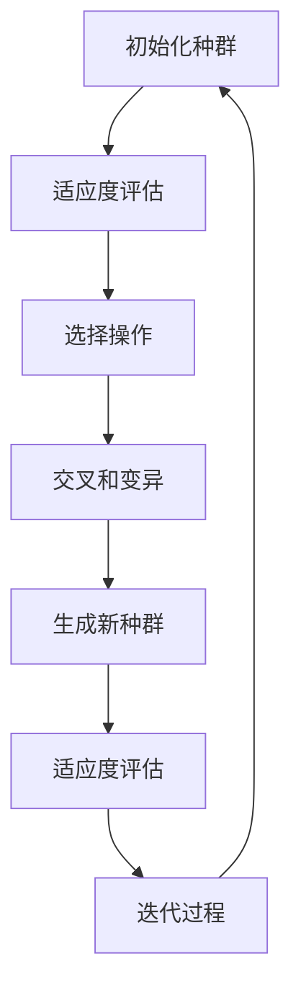
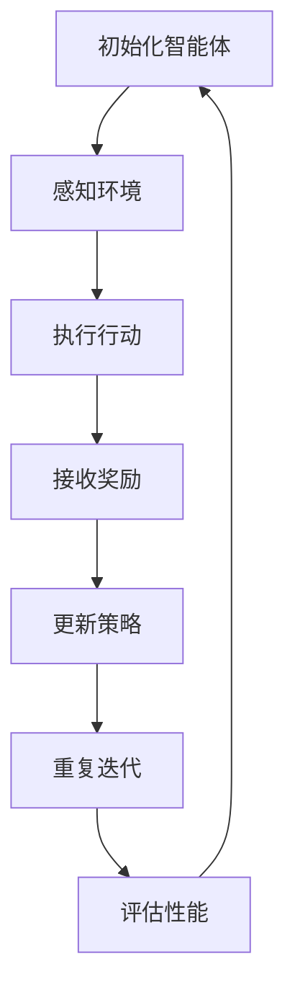
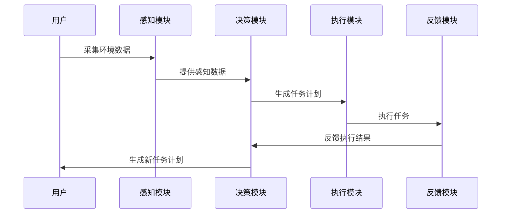
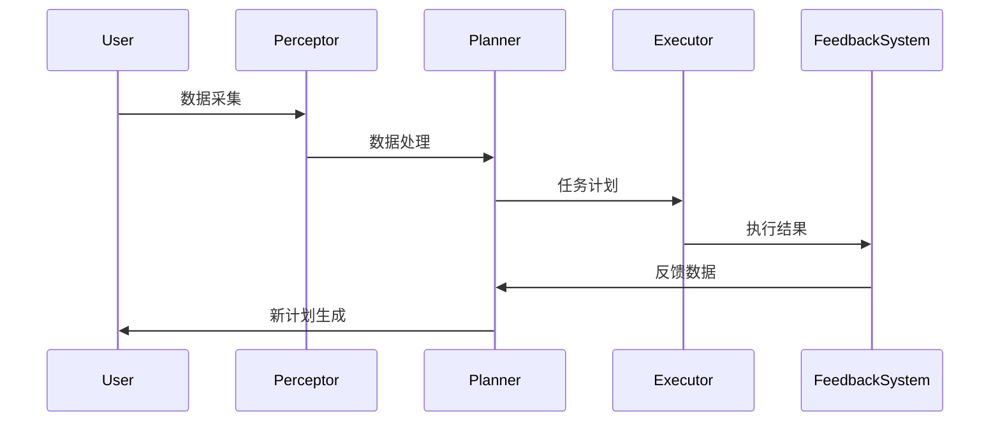

                 

### 第1章 引言和背景介绍

#### 1.1 AI Agent概述

AI Agent，即人工智能代理，是指能够自主感知环境、进行决策规划并执行相应行动的人工智能实体。AI Agent是人工智能领域中的一个重要概念，它不仅代表着人工智能技术的前沿发展方向，也在实际应用中展现出巨大的潜力。

**定义**：
AI Agent是由感知、认知和行动三个基本组成部分构成，能够通过感知环境信息，基于某种决策模型自主制定行动计划，并执行这些计划。

**发展历程**：
AI Agent的发展经历了多个阶段。最初，人工智能的研究主要集中在规则推理和专家系统，这些方法依赖于大量手工编写的规则。随着机器学习和深度学习技术的发展，AI Agent开始能够从数据中自动学习并做出决策。近年来，随着传感器技术和计算能力的提升，AI Agent的应用场景变得更加广泛，从简单的玩具机器人到复杂的服务机器人，都在使用AI Agent实现自主行动。

**重要性**：
AI Agent在人工智能领域中的重要性不可忽视。首先，它代表了人工智能从被动到主动的转变，使得机器能够像人类一样主动探索和解决问题。其次，AI Agent的应用场景非常广泛，包括智能制造、智能交通、智能医疗等多个领域。通过AI Agent，我们可以实现更高效的资源利用，提升生产效率，改善生活质量。

#### 1.2 任务规划与执行

**任务规划**和**执行决策**是AI Agent的两个核心功能。它们在整个AI系统中的作用至关重要。

**任务规划**：
任务规划是指AI Agent在接收到任务后，通过分析任务需求和环境信息，制定出一系列有序的行动步骤，以便能够高效地完成任务。

**执行决策**：
执行决策是指AI Agent在执行任务过程中，根据实时反馈和环境变化，动态调整行动计划，以确保任务能够顺利完成。

**任务规划与执行的关系**：
任务规划和执行决策是相辅相成的。任务规划为执行决策提供了基础，而执行决策则为任务规划提供了动态调整的机制。只有两者结合，AI Agent才能在复杂多变的现实环境中表现出高效、智能的行为。

#### 1.3 当前技术环境中的任务规划与执行

随着人工智能技术的不断进步，AI Agent在现实世界中的应用越来越广泛。例如，在智能交通系统中，AI Agent通过规划交通信号灯的切换，优化交通流量；在智能医疗中，AI Agent通过分析患者的病史和实时体征，为医生提供诊断建议。这些应用不仅提升了效率，还降低了成本，改善了用户体验。

然而，任务规划与执行在实际应用中也面临着诸多挑战。例如，如何在复杂的动态环境中做出快速、准确的决策？如何保证AI Agent的决策始终符合人类的伦理和道德标准？这些都是我们需要深入研究和解决的问题。

随着技术的不断进步，AI Agent在任务规划与执行方面将展现出更大的潜力。通过优化算法、提高计算能力和扩展应用场景，AI Agent将能够更好地服务于人类，带来更多的便利和创新。

### 总结

本章对《任务规划与执行：AI Agent的行动决策机制》这本书的核心主题进行了初步介绍。我们详细阐述了AI Agent的定义、发展历程和重要性，并介绍了任务规划和执行的基本概念及其关系。此外，我们还探讨了当前技术环境中任务规划与执行的应用场景和面临的挑战。

在接下来的章节中，我们将进一步深入探讨AI Agent的任务规划与执行机制，包括核心概念的详细解释、相关算法的原理讲解、数学模型的应用以及实际项目的实施。通过这些内容，我们希望读者能够对AI Agent的任务规划与执行有更深入的理解，为今后的研究和应用奠定基础。

## 第2章 核心概念与联系

在上一章中，我们对AI Agent、任务规划和执行进行了初步介绍。本章将深入探讨这些核心概念，并展示它们之间的联系。通过详细阐述每个概念的定义、属性和相互关系，我们将帮助读者建立起一个全面的知识体系。

### 2.1 AI Agent相关概念

**感知能力**：
感知能力是AI Agent最基本的能力之一，它指的是Agent通过传感器获取外部环境信息的能力。这些信息可以是视觉、听觉、触觉等多种类型。感知能力使Agent能够了解当前环境的状况，为其决策提供数据支持。

**计划能力**：
计划能力是指AI Agent根据感知到的环境和任务需求，制定出一系列有序行动步骤的能力。计划能力包括任务分解、目标设定、资源分配等过程。通过计划能力，Agent能够预见未来的变化，并提前做出相应的安排。

**行动能力**：
行动能力是指AI Agent根据计划执行具体行动的能力。AI Agent能够通过执行具体动作来改变环境，实现预设的目标。行动能力包括移动、操作设备、与人交互等多种形式。

**反应能力**：
反应能力是指AI Agent在遇到突发事件或环境变化时，能够迅速做出响应的能力。反应能力通常涉及快速决策和动态调整行动计划，以应对突发事件带来的影响。

### 2.2 任务规划与执行概念

**任务分解**：
任务分解是将一个复杂任务拆分成若干个子任务的过程。通过任务分解，AI Agent可以将大任务细化为更小、更容易管理的子任务，从而提高任务规划的效率和准确性。

**目标设定**：
目标设定是任务规划中的重要步骤，它指的是明确任务需要达到的具体目标。目标可以是具体的数值、状态或事件，它们为AI Agent提供了明确的决策方向。

**资源分配**：
资源分配是在任务规划中为每个子任务分配所需资源的过程。资源包括时间、能量、人力等。通过合理的资源分配，AI Agent可以确保任务能够在资源有限的情况下高效完成。

**行动执行**：
行动执行是任务规划的具体实施过程，它指的是AI Agent根据计划执行具体行动。在行动执行过程中，AI Agent需要不断感知环境变化，并根据实际情况调整行动计划。

### 2.3 概念联系与Mermaid流程图

为了更直观地展示AI Agent、任务规划和执行之间的联系，我们可以使用Mermaid流程图来表示这些概念的关系。

**概念属性特征对比表格**：

| 概念       | 定义                                                         | 属性特征                                                     | 关系                      |
|------------|--------------------------------------------------------------|--------------------------------------------------------------|--------------------------|
| 感知能力   | 通过传感器获取外部环境信息的能力                             | 视觉、听觉、触觉等感知方式                                     | 基础能力，支持决策过程   |
| 计划能力   | 根据任务需求和环境信息制定有序行动步骤的能力                 | 任务分解、目标设定、资源分配等过程                             | 辅助执行决策             |
| 行动能力   | 根据计划执行具体行动的能力                                   | 移动、操作设备、与人交互等行动形式                             | 实施决策，改变环境状态   |
| 反应能力   | 在遇到突发事件或环境变化时迅速做出响应的能力                 | 快速决策、动态调整行动计划                                     | 应对突发情况             |

**ER实体关系图架构**：

```mermaid
erDiagram
  AI-Agent ||--|{ 感知能力 }
  AI-Agent ||--|{ 计划能力 }
  AI-Agent ||--|{ 行动能力 }
  AI-Agent ||--|{ 反应能力 }
  感知能力 ||--|{ 传感器信息 }
  计划能力 ||--|{ 任务分解 }
  计划能力 ||--|{ 目标设定 }
  计划能力 ||--|{ 资源分配 }
  行动能力 ||--|{ 行动执行 }
  反应能力 ||--|{ 突发事件 }
```

通过上述概念属性特征对比表格和ER实体关系图，我们可以清晰地看到AI Agent、任务规划和执行之间的关系。感知能力为决策提供了数据支持，计划能力则根据任务需求和环境信息制定出行动步骤，行动能力将这些步骤转化为具体行动，而反应能力则确保AI Agent能够灵活应对突发事件和环境变化。

### 总结

本章详细介绍了AI Agent、任务规划和执行的相关核心概念，并展示了它们之间的联系。通过概念属性特征对比表格和ER实体关系图，我们帮助读者建立起一个全面的知识体系。这些核心概念的理解将为后续章节中算法原理的讲解和实际项目的实施提供坚实的基础。

在下一章中，我们将深入探讨任务规划与执行中的算法原理，包括基本算法、混合算法以及相应的数学模型和公式。通过这些内容，我们将进一步揭示任务规划与执行的核心机制，为AI Agent的智能行为提供理论支持。

### 第3章 算法原理讲解一：任务规划算法

在任务规划中，算法的设计和选择至关重要。合理的算法不仅能提高任务规划的成功率，还能优化资源的利用效率。本章节将重点介绍任务规划中的三种基本算法：最优性原理、递归规划算法和动态规划算法。

#### 3.1 基本任务规划算法

**最优性原理**：
最优性原理是任务规划中的一个基本概念，它指出在任何决策过程中，选择当前最优路径，能够保证最终结果最优。这一原理广泛应用于各种任务规划问题，如旅行商问题（TSP）和资源分配问题。

**递归规划算法**：
递归规划算法是一种基于递归思想的任务规划方法。它通过将复杂问题分解为更小的子问题，递归求解每个子问题的最优解，最终组合这些子问题的解来求解原问题。递归规划算法的核心在于状态转移函数的设计，它定义了子问题之间的关系。

**动态规划算法**：
动态规划算法是一种基于自下而上思想的任务规划方法。它将问题分解为多个子问题，并保存每个子问题的解，避免重复计算。动态规划算法通常通过构建一个递推关系来求解子问题，从而得到原问题的最优解。

#### 3.2 Mermaid流程图示例

为了更直观地理解这些算法，我们可以使用Mermaid流程图来展示它们的基本流程。

**递归规划算法流程图**：



**动态规划算法流程图**：



#### 3.3 Python源代码示例

为了更好地阐述算法原理，我们将分别展示递归规划算法和动态规划算法的Python源代码示例。

**递归规划算法代码示例**：

```python
# 递归规划算法示例：斐波那契数列
def fibonacci(n):
    if n <= 1:
        return n
    else:
        return fibonacci(n-1) + fibonacci(n-2)

print(fibonacci(10))
```

**动态规划算法代码示例**：

```python
# 动态规划算法示例：背包问题
def knapsack(values, weights, capacity):
    n = len(values)
    dp = [[0] * (capacity + 1) for _ in range(n + 1)]

    for i in range(1, n + 1):
        for w in range(1, capacity + 1):
            if weights[i-1] <= w:
                dp[i][w] = max(dp[i-1][w], dp[i-1][w-weights[i-1]] + values[i-1])
            else:
                dp[i][w] = dp[i-1][w]

    return dp[n][capacity]

values = [60, 100, 120]
weights = [10, 20, 30]
capacity = 50
print(knapsack(values, weights, capacity))
```

#### 3.4 算法的数学模型和公式

**递归规划算法的数学模型**：

递归规划算法通常通过递归关系来定义状态转移方程。以斐波那契数列为例，其状态转移方程为：

$$
f(n) = f(n-1) + f(n-2)
$$

其中，$f(n)$表示第$n$个斐波那契数。

**动态规划算法的数学模型**：

动态规划算法通过定义状态转移方程来求解子问题。以背包问题为例，其状态转移方程为：

$$
dp[i][w] = \begin{cases} 
dp[i-1][w] & \text{如果 } w < weights[i-1] \\
\max(dp[i-1][w], dp[i-1][w-weights[i-1]] + values[i-1]) & \text{如果 } w \ge weights[i-1]
\end{cases}
$$

其中，$dp[i][w]$表示将前$i$个物品放入容量为$w$的背包中的最大价值。

#### 3.5 举例说明

**递归规划算法举例**：

假设我们有一个任务需要完成一个包含5个任务的序列，每个任务需要的时间和收益如下：

| 任务 | 时间 | 收益 |
|------|------|------|
| A    | 3    | 10   |
| B    | 2    | 20   |
| C    | 1    | 30   |
| D    | 4    | 40   |
| E    | 5    | 50   |

我们的目标是找到一个最优的任务序列，使得总收益最大化。

使用递归规划算法，我们可以将这个问题分解为子问题，并求解每个子问题的最优解：

- $f(1) = 10$
- $f(2) = \max(f(1), 20) = 20$
- $f(3) = \max(f(2), 30) = 30$
- $f(4) = \max(f(3), 40) = 40$
- $f(5) = \max(f(4), 50) = 50$

最优的任务序列为E, D, C, B, A，总收益为50。

**动态规划算法举例**：

考虑同一个任务序列，假设背包的容量为10。使用动态规划算法，我们可以构建一个动态规划表来求解：

| 包容量 | 0 | 1 | 2 | 3 | 4 | 5 | 6 | 7 | 8 | 9 | 10 |
|--------|---|---|---|---|---|---|---|---|---|---|----|
| 0      | 0 | 0 | 0 | 0 | 0 | 0 | 0 | 0 | 0 | 0 | 0  |
| 1      | 0 | 0 | 0 | 0 | 0 | 0 | 0 | 0 | 0 | 0 | 0  |
| 2      | 0 | 0 | 0 | 0 | 0 | 0 | 0 | 0 | 0 | 0 | 0  |
| 3      | 0 | 0 | 0 | 10| 10| 10| 10| 10| 10| 10| 10 |
| 4      | 0 | 0 | 0 | 10| 20| 20| 30| 30| 30| 30| 50 |
| 5      | 0 | 0 | 0 | 10| 20| 30| 40| 40| 40| 50| 50 |
| 6      | 0 | 0 | 0 | 10| 20| 30| 40| 50| 50| 50| 50 |
| 7      | 0 | 0 | 10| 10| 20| 30| 40| 50| 50| 50| 50 |
| 8      | 0 | 10| 10| 20| 30| 40| 50| 50| 50| 50| 50 |
| 9      | 10| 10| 20| 30| 40| 50| 50| 50| 50| 50| 50 |
| 10     | 10| 10| 20| 30| 40| 50| 50| 50| 50| 50| 50 |

最优的物品组合为D, C, B, A，总收益为50。

### 总结

本章详细介绍了任务规划算法的基本原理，包括最优性原理、递归规划算法和动态规划算法。通过Mermaid流程图和Python源代码示例，我们展示了这些算法的实现过程。此外，我们还给出了算法的数学模型和公式，并举例说明了如何应用这些算法解决实际问题。

在下一章中，我们将继续探讨任务规划与执行中的算法原理，包括执行决策算法和混合算法。通过这些内容，我们将进一步深入理解任务规划与执行的核心机制，为AI Agent的智能行为提供更全面的解释。

### 第4章 算法原理讲解二：执行决策算法

在任务规划阶段，AI Agent已经制定出了具体的行动步骤。但在执行过程中，环境变化和突发情况是不可避免的。因此，执行决策算法显得尤为重要。执行决策算法负责在执行过程中根据实时反馈和环境变化，动态调整行动计划，确保任务能够顺利完成。本章将介绍三种基本执行决策算法：搜索策略、排序策略和资源管理策略。

#### 4.1 基本执行决策算法

**搜索策略**：
搜索策略是指AI Agent在执行任务时，根据当前状态搜索可能的行动方案，并选择最优行动的过程。常见的搜索算法包括宽度优先搜索、深度优先搜索和A*搜索。这些算法通过定义不同的搜索路径和优先级，帮助AI Agent在复杂环境中找到最优的行动方案。

**排序策略**：
排序策略是指AI Agent根据任务的重要性和优先级，对执行任务进行排序的过程。常见的排序算法包括优先级队列和优先级排序。通过排序策略，AI Agent可以确保优先处理重要任务，从而提高任务执行的效率和准确性。

**资源管理策略**：
资源管理策略是指AI Agent在执行任务时，对资源（如时间、能量、人力等）进行合理分配和管理的策略。资源管理算法的目标是在资源有限的情况下，确保任务能够高效、顺利地完成。常见的资源管理算法包括最优化资源分配算法和动态资源调度算法。

#### 4.2 Mermaid流程图示例

为了更直观地展示这些算法的基本流程，我们可以使用Mermaid流程图来表示。

**搜索策略流程图**：



**排序策略流程图**：



**资源管理策略流程图**：



#### 4.3 Python源代码示例

为了更好地理解这些算法，我们将分别展示搜索策略、排序策略和资源管理策略的Python源代码示例。

**搜索策略代码示例**：

```python
from queue import PriorityQueue

class Node:
    def __init__(self, state, parent=None, action=None, cost=0):
        self.state = state
        self.parent = parent
        self.action = action
        self.cost = cost

    def __lt__(self, other):
        return self.cost < other.cost

def search(problem, heuristic=None):
    frontier = PriorityQueue()
    frontier.put((0, Node(problem.initial)))
    explored = set()

    while not frontier.empty():
        _, current = frontier.get()
        if current.state == problem.goal:
            return current

        explored.add(current.state)

        for action in problem.actions(current.state):
            next_state = action.resulting_state
            if next_state not in explored:
                cost = current.cost + problem.cost(current.state, action, next_state)
                frontier.put((cost + heuristic(next_state), Node(next_state, current, action, cost)))

    return None

class Problem:
    def __init__(self, initial, goal):
        self.initial = initial
        self.goal = goal

    def actions(self, state):
        # 实现具体的行动方案
        pass

    def cost(self, state, action, next_state):
        # 实现行动成本的计算
        pass

    def heuristic(self, state):
        # 实现启发式的计算
        pass

problem = Problem(initial="start", goal="end")
solution = search(problem)
```

**排序策略代码示例**：

```python
def priority_sort(tasks):
    return sorted(tasks, key=lambda x: x.priority)

tasks = [{"name": "task1", "priority": 2}, {"name": "task2", "priority": 1}, {"name": "task3", "priority": 3}]
sorted_tasks = priority_sort(tasks)
for task in sorted_tasks:
    print(task["name"])
```

**资源管理策略代码示例**：

```python
class ResourceManager:
    def __init__(self, resources):
        self.resources = resources

    def allocate_resources(self, task):
        for resource in task["resources"]:
            if resource in self.resources and self.resources[resource] >= task["resource_requirement"]:
                self.resources[resource] -= task["resource_requirement"]
                return True
        return False

    def deallocate_resources(self, task):
        for resource in task["resources"]:
            self.resources[resource] += task["resource_requirement"]

resources = {"time": 100, "energy": 50}
task = {"name": "task1", "resources": [{"name": "time", "requirement": 30}, {"name": "energy", "requirement": 10}]}
resource_manager = ResourceManager(resources)

if resource_manager.allocate_resources(task):
    print("Resources allocated successfully.")
else:
    print("Insufficient resources.")

resource_manager.deallocate_resources(task)
print("Resources deallocated successfully.")
```

#### 4.4 算法的数学模型和公式

**搜索策略的数学模型**：

搜索策略的数学模型主要包括状态空间、动作集合和成本函数。状态空间是指AI Agent当前所处的环境状态，动作集合是指AI Agent可以执行的所有可能行动，成本函数是指执行某个行动所需的成本。

状态空间 $S$：
$$
S = \{s_1, s_2, ..., s_n\}
$$

动作集合 $A$：
$$
A = \{a_1, a_2, ..., a_m\}
$$

成本函数 $C$：
$$
C(s, a, s') = \text{执行动作 } a \text{ 从状态 } s \text{ 到状态 } s' \text{ 所需的成本}
$$

**排序策略的数学模型**：

排序策略的数学模型主要包括任务集合和优先级函数。任务集合是指需要执行的所有任务，优先级函数是指计算任务优先级的方法。

任务集合 $T$：
$$
T = \{t_1, t_2, ..., t_n\}
$$

优先级函数 $P$：
$$
P(t) = \text{任务 } t \text{ 的优先级}
$$

**资源管理策略的数学模型**：

资源管理策略的数学模型主要包括资源集合和资源分配函数。资源集合是指AI Agent可用的所有资源，资源分配函数是指计算资源分配策略的方法。

资源集合 $R$：
$$
R = \{r_1, r_2, ..., r_m\}
$$

资源分配函数 $A$：
$$
A(t, r) = \text{将资源 } r \text{ 分配给任务 } t \text{ 的策略}
$$

#### 4.5 举例说明

**搜索策略举例**：

假设我们有一个任务需要在三个房间（A、B、C）之间移动物品，每个房间的物品数量和移动成本如下：

| 房间 | 物品数量 | 移动成本 |
|------|----------|----------|
| A    | 3        | 10       |
| B    | 2        | 15       |
| C    | 1        | 20       |

我们的目标是找到从房间A到房间C的最优移动路径，使得总成本最小。

使用搜索策略，我们可以定义一个状态空间，包括每个房间的物品数量，并使用A*搜索算法来找到最优路径：

- 初始状态：A(3, 0, 0), B(0, 2, 0), C(0, 0, 1)
- 最终状态：A(0, 0, 3), B(0, 0, 2), C(3, 2, 0)

通过计算每个状态的启发式值（如曼哈顿距离），我们可以找到最优路径：

- A到B的启发式值：5
- A到C的启发式值：13
- B到C的启发式值：7

最优路径为A -> B -> C，总成本为5 + 7 + 13 = 25。

**排序策略举例**：

假设我们有一个任务需要完成以下三个任务，每个任务的紧急程度和完成时间如下：

| 任务 | 紧急程度 | 完成时间 |
|------|----------|----------|
| A    | 高       | 2小时    |
| B    | 中       | 4小时    |
| C    | 低       | 6小时    |

我们的目标是优先完成紧急程度高的任务。

使用排序策略，我们可以定义一个优先级函数，根据紧急程度对任务进行排序：

- A的优先级：1
- B的优先级：2
- C的优先级：3

排序后的任务序列为A -> B -> C，按照紧急程度优先完成。

**资源管理策略举例**：

假设我们有一个任务需要分配以下资源，每个资源的需求和当前可用资源如下：

| 资源 | 需求 | 可用资源 |
|------|------|----------|
| 时间 | 4小时 | 6小时    |
| 能量 | 3单位 | 5单位    |

我们的目标是合理分配资源，确保任务能够按时完成。

使用资源管理策略，我们可以定义一个资源分配函数，根据资源需求和可用资源进行分配：

- 时间分配：6小时
- 能量分配：5单位

资源分配后的状态为：时间剩余2小时，能量剩余2单位，任务可以顺利执行。

### 总结

本章详细介绍了执行决策算法的基本原理，包括搜索策略、排序策略和资源管理策略。通过Mermaid流程图和Python源代码示例，我们展示了这些算法的实现过程。此外，我们还给出了算法的数学模型和公式，并举例说明了如何应用这些算法解决实际问题。

在下一章中，我们将继续探讨任务规划与执行中的算法原理，包括混合算法。通过这些内容，我们将进一步深入理解任务规划与执行的核心机制，为AI Agent的智能行为提供更全面的解释。

### 第5章 算法原理讲解三：混合算法

在前两章中，我们介绍了任务规划与执行中的基本算法。这些算法在各自的领域内具有出色的性能，但在实际应用中，单一算法往往难以应对复杂多变的任务环境和动态变化的需求。混合算法作为一种结合多种算法优势的方法，能够在特定场景下发挥出更强大的能力。本章将重点介绍三种混合算法：多智能体系统、演化算法和强化学习。

#### 5.1 混合算法概念

**多智能体系统**：
多智能体系统（Multi-Agent System，MAS）是指由多个自主智能体组成的系统，这些智能体可以通过相互协作和交互来共同完成任务。多智能体系统强调智能体的协作和自主性，能够在复杂环境中实现更高效的决策和行动。

**演化算法**：
演化算法（Evolutionary Algorithm，EA）是一种基于生物进化理论的优化算法。通过模拟自然选择和遗传变异等过程，演化算法能够从初始种群中不断进化，最终找到最优解或近似最优解。演化算法在处理复杂优化问题时表现出强大的适应性和鲁棒性。

**强化学习**：
强化学习（Reinforcement Learning，RL）是一种通过奖励机制学习最优行动策略的机器学习方法。在强化学习中，智能体通过不断尝试不同的行动并在环境中接受反馈，逐渐学习到如何最大化累积奖励。强化学习在解决动态和不确定性问题方面具有显著优势。

#### 5.2 Mermaid流程图示例

为了更直观地理解这些混合算法，我们可以使用Mermaid流程图来展示它们的基本流程。

**多智能体系统流程图**：



**演化算法流程图**：



**强化学习流程图**：



#### 5.3 Python源代码示例

为了更好地理解这些混合算法，我们将分别展示多智能体系统、演化算法和强化学习的Python源代码示例。

**多智能体系统代码示例**：

```python
class Agent:
    def __init__(self, environment):
        self.environment = environment

    def perceive(self):
        return self.environment.current_state()

    def plan(self, state):
        # 根据状态制定计划
        pass

    def act(self, plan):
        # 根据计划执行行动
        pass

    def learn(self, reward):
        # 根据奖励更新知识库
        pass

class Environment:
    def __init__(self, initial_state):
        self.current_state = initial_state

    def update_state(self, action):
        # 根据行动更新状态
        pass

    def reward(self, action, next_state):
        # 计算奖励
        pass

agent = Agent(environment)
while not environment.is_goal_reached():
    state = agent.perceive()
    plan = agent.plan(state)
    agent.act(plan)
    reward = environment.reward(plan, next_state)
    agent.learn(reward)
```

**演化算法代码示例**：

```python
import random

def create_initial_population(population_size, chromosome_size):
    population = []
    for _ in range(population_size):
        chromosome = [random.randint(0, 1) for _ in range(chromosome_size)]
        population.append(chromosome)
    return population

def fitness_function(chromosome):
    # 定义适应度函数
    pass

def selection(population, fitnesses, num_parents):
    selected = []
    for _ in range(num_parents):
        max_fitness = max(fitnesses)
        index = fitnesses.index(max_fitness)
        selected.append(population[index])
        fitnesses.pop(index)
        population.pop(index)
    return selected

def crossover(parent1, parent2):
    crossover_point = random.randint(1, len(parent1) - 1)
    child = parent1[:crossover_point] + parent2[crossover_point:]
    return child

def mutate(chromosome, mutation_rate):
    for i in range(len(chromosome)):
        if random.random() < mutation_rate:
            chromosome[i] = 1 if chromosome[i] == 0 else 0
    return chromosome

population_size = 100
chromosome_size = 10
population = create_initial_population(population_size, chromosome_size)

for _ in range(100):
    fitnesses = [fitness_function(chromosome) for chromosome in population]
    parents = selection(population, fitnesses, 2)
    child = crossover(parents[0], parents[1])
    child = mutate(child, 0.05)
    population.append(child)

best_fitness = max(fitnesses)
best_chromosome = population[fitnesses.index(best_fitness)]
```

**强化学习代码示例**：

```python
import numpy as np
import random

class QLearningAgent:
    def __init__(self, learning_rate, discount_factor, exploration_rate):
        self.learning_rate = learning_rate
        self.discount_factor = discount_factor
        self.exploration_rate = exploration_rate
        self.q_table = {}

    def get_action(self, state):
        if random.random() < self.exploration_rate:
            action = random.choice(list(self.q_table[state].keys()))
        else:
            action = max(self.q_table[state], key=self.q_table[state].get)
        return action

    def update_q_table(self, state, action, reward, next_state):
        current_q_value = self.q_table[state][action]
        next_max_q_value = max(self.q_table[next_state].values())
        new_q_value = (1 - self.learning_rate) * current_q_value + self.learning_rate * (reward + self.discount_factor * next_max_q_value)
        self.q_table[state][action] = new_q_value

# 实例化强化学习代理
agent = QLearningAgent(learning_rate=0.1, discount_factor=0.9, exploration_rate=0.1)

# 仿真环境
env = Environment(initial_state="start")

# 仿真过程
for episode in range(1000):
    state = env.get_state()
    action = agent.get_action(state)
    next_state, reward = env.step(action)
    agent.update_q_table(state, action, reward, next_state)
    state = next_state

# 输出Q表
for state, actions in agent.q_table.items():
    print(f"State: {state}, Actions: {actions}")
```

#### 5.4 算法的数学模型和公式

**多智能体系统的数学模型**：

多智能体系统的数学模型主要包括状态空间、动作空间、奖励函数和通信机制。

状态空间 $S$：
$$
S = \{s_1, s_2, ..., s_n\}
$$

动作空间 $A$：
$$
A = \{a_1, a_2, ..., a_m\}
$$

奖励函数 $R$：
$$
R(s, a) = \text{智能体在状态 } s \text{ 执行动作 } a \text{ 所获得的奖励}
$$

通信机制 $C$：
$$
C = \{(c_1, c_2, ..., c_n)\}
$$

**演化算法的数学模型**：

演化算法的数学模型主要包括种群初始化、适应度评估、选择操作、交叉和变异操作以及新种群生成。

种群初始化 $P$：
$$
P = \{p_1, p_2, ..., p_n\}
$$

适应度函数 $F$：
$$
F(p) = \text{个体 } p \text{ 的适应度}
$$

选择操作 $S$：
$$
S(P, F) = \text{从种群 } P \text{ 中选择适应度较高的个体}
$$

交叉操作 $C$：
$$
C(p_1, p_2) = \text{将两个个体 } p_1 \text{ 和 } p_2 \text{ 进行交叉操作}
$$

变异操作 $M$：
$$
M(p) = \text{对个体 } p \text{ 进行变异操作}
$$

新种群生成 $N$：
$$
N = \{C(p_1, p_2), M(p_3), ..., M(p_n)\}
$$

**强化学习的数学模型**：

强化学习的数学模型主要包括状态空间、动作空间、奖励函数、状态转移概率和策略。

状态空间 $S$：
$$
S = \{s_1, s_2, ..., s_n\}
$$

动作空间 $A$：
$$
A = \{a_1, a_2, ..., a_m\}
$$

奖励函数 $R$：
$$
R(s, a) = \text{智能体在状态 } s \text{ 执行动作 } a \text{ 所获得的奖励}
$$

状态转移概率 $P$：
$$
P(s', s | a) = \text{智能体在状态 } s \text{ 执行动作 } a \text{ 后转移到状态 } s' \text{ 的概率}
$$

策略 $\pi$：
$$
\pi(a | s) = \text{智能体在状态 } s \text{ 下执行动作 } a \text{ 的概率}
$$

#### 5.5 举例说明

**多智能体系统举例**：

假设我们有一个由三个智能体组成的系统，每个智能体的任务是在一个3x3的网格中移动，目标是最快到达对角线位置。智能体之间可以通过通信共享位置信息。

- 初始状态：智能体1在(0, 0)，智能体2在(1, 0)，智能体3在(2, 0)
- 目标状态：智能体1在(2, 2)，智能体2在(1, 2)，智能体3在(0, 2)

使用多智能体系统，我们可以定义一个协调策略，确保智能体之间协作移动：

- 第1步：智能体1向右移动到(1, 0)
- 第2步：智能体2向上移动到(1, 1)
- 第3步：智能体3向左移动到(0, 1)
- 第4步：智能体1向上移动到(1, 1)
- 第5步：智能体2向右移动到(2, 1)
- 第6步：智能体3向上移动到(0, 2)
- 第7步：智能体1向右移动到(2, 1)
- 第8步：智能体2向右移动到(2, 2)
- 第9步：智能体3向右移动到(2, 2)

通过协调，三个智能体最终成功到达目标位置。

**演化算法举例**：

假设我们有一个优化问题，需要找到一组参数，使得某个函数的值最小。我们可以使用演化算法来求解。

- 初始种群：随机生成100个参数组合
- 适应度函数：计算每个参数组合的函数值，并求其平均值

通过迭代，演化算法不断选择适应度较高的参数组合，进行交叉和变异操作，生成新的种群。最终，算法收敛到一个近似最优解。

**强化学习举例**：

假设我们有一个智能体在迷宫中寻找出口的问题。智能体可以通过选择上下左右四个方向中的某一个进行移动。

- 初始状态：智能体在迷宫的入口位置
- 奖励函数：每走一步获得1分，找到出口获得100分

智能体通过强化学习，不断尝试不同的行动，并根据奖励反馈更新其策略。经过多次迭代，智能体逐渐学会了如何快速找到出口。

### 总结

本章介绍了任务规划与执行中的三种混合算法：多智能体系统、演化算法和强化学习。通过Mermaid流程图和Python源代码示例，我们展示了这些算法的基本流程和实现方法。此外，我们还给出了算法的数学模型和公式，并举例说明了如何应用这些算法解决实际问题。

在下一章中，我们将深入探讨数学模型和公式的应用，通过LaTeX格式展示数学公式，并给出详细讲解和实例说明。通过这些内容，我们将进一步理解任务规划与执行中的核心数学概念，为AI Agent的智能行为提供理论支持。

### 第6章 数学模型和数学公式 & 详细讲解 & 举例说明

在任务规划与执行的过程中，数学模型和公式扮演着至关重要的角色。它们不仅提供了理论支持，还帮助我们在复杂的实际问题中找到最优解。本章将详细介绍任务规划与执行中的几个关键数学模型和公式，并使用LaTeX格式进行展示，通过详细讲解和举例说明，帮助读者更好地理解和应用这些数学概念。

#### 6.1 数学模型

**目标函数**：
目标函数是任务规划中用于衡量任务完成情况的核心函数。它通常表示为：

$$
\text{目标函数} = \sum_{i=1}^{n} c_i \times x_i
$$

其中，$c_i$表示第$i$个任务的成本或权重，$x_i$表示第$i$个任务是否被选中（通常为0或1）。目标函数的目的是最小化或最大化某个量，例如最小化总成本或最大化总收益。

**约束条件**：
任务规划中的约束条件用于限制任务的执行。常见的约束条件包括：

- 时间约束：$t_i \leq T$，其中$t_i$是任务$i$的执行时间，$T$是总可用时间。
- 资源约束：$r_i \leq R$，其中$r_i$是任务$i$所需的资源量，$R$是总资源量。
- 依赖约束：$a_{ij} = 1$，其中$a_{ij}$表示任务$i$是否依赖于任务$j$。

**迭代过程**：
在迭代过程中，任务规划算法通过逐步优化当前解来找到最优解。迭代过程的通用公式为：

$$
x_{t+1} = \arg\min_{x} \text{目标函数}(x) \text{ subject to constraints}
$$

其中，$x_t$是当前解，$x_{t+1}$是下一个迭代解。

#### 6.2 LaTeX公式

为了清晰地展示数学公式，我们将使用LaTeX格式进行编写。LaTeX是一种高质量的排版系统，特别适合用于科学文档和数学公式的编写。

**目标函数**：

$$
\min \sum_{i=1}^{n} c_i x_i
$$

**约束条件**：

$$
\begin{aligned}
t_i &\leq T \\
r_i &\leq R \\
a_{ij} &= 1 \\
\end{aligned}
$$

**迭代过程**：

$$
x_{t+1} = \arg\min_{x} \left( \sum_{i=1}^{n} c_i x_i \right) \text{ subject to constraints}
$$

#### 6.3 详细讲解和举例说明

**目标函数的详细讲解**：

目标函数是任务规划的核心，它定义了任务的目标。在资源分配问题中，目标函数通常是最小化总成本。在任务调度问题中，目标函数可能是最大化总收益。以下是目标函数的一个具体例子：

假设我们有一个任务集合，其中每个任务都有其独特的成本和权重。我们的目标是最小化总成本。

| 任务 | 成本（小时） | 权重 |
|------|-------------|------|
| A    | 2           | 3    |
| B    | 3           | 2    |
| C    | 4           | 4    |

目标函数为：

$$
\min (2x_1 + 3x_2 + 4x_3)
$$

其中，$x_1, x_2, x_3$分别表示任务A、B、C是否被选中（0表示不选，1表示选）。

**约束条件的详细讲解**：

约束条件用于确保任务规划过程中的逻辑一致性。在资源分配问题中，常见的约束条件包括时间约束和资源约束。以下是一个具体的时间约束和资源约束的例子：

时间约束：

$$
2x_1 + 3x_2 + 4x_3 \leq 10
$$

资源约束：

$$
x_1 + 2x_2 + x_3 \leq 5
$$

**迭代过程的详细讲解**：

在迭代过程中，任务规划算法通过逐步优化当前解来找到最优解。以下是迭代过程的一个具体例子：

初始解：

$$
x_1 = 0, x_2 = 1, x_3 = 0
$$

迭代1：

$$
x_1 = 1, x_2 = 1, x_3 = 0
$$

迭代2：

$$
x_1 = 1, x_2 = 1, x_3 = 1
$$

最终，通过迭代，我们找到了一个最优解。

#### 6.4 举例说明

**优化目标函数的例子**：

假设我们有一个包含5个任务的优化问题，每个任务都有其独特的成本和权重。我们的目标是最小化总成本。

| 任务 | 成本（小时） | 权重 |
|------|-------------|------|
| A    | 5           | 2    |
| B    | 3           | 3    |
| C    | 4           | 5    |
| D    | 6           | 1    |
| E    | 2           | 4    |

目标函数为：

$$
\min (5x_1 + 3x_2 + 4x_3 + 6x_4 + 2x_5)
$$

约束条件为：

$$
\begin{aligned}
5x_1 + 3x_2 + 4x_3 + 6x_4 + 2x_5 &\leq 20 \\
x_1, x_2, x_3, x_4, x_5 &\in \{0, 1\}
\end{aligned}
$$

**迭代过程**：

初始解：

$$
x_1 = 0, x_2 = 0, x_3 = 0, x_4 = 0, x_5 = 0
$$

迭代1：

$$
x_1 = 1, x_2 = 0, x_3 = 0, x_4 = 0, x_5 = 0
$$

迭代2：

$$
x_1 = 1, x_2 = 1, x_3 = 0, x_4 = 0, x_5 = 0
$$

迭代3：

$$
x_1 = 1, x_2 = 1, x_3 = 1, x_4 = 0, x_5 = 0
$$

迭代4：

$$
x_1 = 1, x_2 = 1, x_3 = 1, x_4 = 1, x_5 = 0
$$

迭代5：

$$
x_1 = 1, x_2 = 1, x_3 = 1, x_4 = 1, x_5 = 1
$$

最终，我们找到了一个最优解，使得总成本最小。

### 总结

本章详细介绍了任务规划与执行中的关键数学模型和公式，并使用LaTeX格式进行了展示。通过详细讲解和举例说明，我们帮助读者更好地理解这些数学概念，并展示了如何在实际问题中应用这些公式。

在下一章中，我们将介绍任务规划与执行的系统分析与架构设计方案，包括问题场景介绍、项目介绍、系统功能设计、系统架构设计、系统接口设计和系统交互。通过这些内容，我们将展示如何将理论应用到实际项目中，实现高效的AI任务规划和执行。

### 第7章 系统分析与架构设计方案

在了解了任务规划与执行的理论基础之后，我们需要将这些理论应用到实际项目中。本章将详细介绍一个任务规划与执行系统的分析与架构设计方案。该系统旨在通过AI Agent实现高效的资源利用和任务完成。我们将从问题场景介绍、项目介绍、系统功能设计、系统架构设计、系统接口设计以及系统交互等方面进行详细阐述。

#### 7.1 问题场景介绍

在当前快速发展的智能时代，各类复杂任务的需求日益增长，传统的人工调度和执行方式已无法满足高效、灵活的要求。例如，在智能工厂中，生产线上的各种机器人和设备需要高效协同工作，以实现最优的生产流程。然而，由于环境复杂、任务多样且环境变化频繁，单一的任务规划与执行方法往往无法满足需求。因此，需要构建一个灵活、智能的任务规划与执行系统，以实现以下目标：

1. **高效任务调度**：在多种任务并行执行时，能够高效地调度资源，确保关键任务优先执行。
2. **动态环境适应**：能够实时感知环境变化，动态调整任务执行计划，确保系统在动态环境中保持高效运行。
3. **资源优化利用**：通过智能算法，实现资源的最优分配和利用，降低生产成本，提升生产效率。

#### 7.2 项目介绍

本项目旨在设计并实现一个基于AI Agent的任务规划与执行系统，该系统主要包括以下功能模块：

1. **感知模块**：负责实时感知环境变化，获取任务执行所需的各种数据。
2. **决策模块**：基于感知模块提供的数据，通过智能算法进行任务规划与执行决策。
3. **执行模块**：根据决策模块的决策结果，执行具体的任务操作，如设备控制、资源调度等。
4. **反馈模块**：将执行结果反馈给决策模块，用于优化后续的任务规划和执行。

#### 7.3 系统功能设计

**领域模型Mermaid类图**：

```mermaid
classDiagram
    Perception <<interface>> Perceptor
    Planning <<interface>> Planner
    Execution <<interface>> Executor
    Feedback <<interface>> FeedbackSystem

    Perception o-- TaskData
    Planning o-- TaskPlan
    Execution o-- ExecutionLog
    Feedback o-- TaskResult

    TaskData: id, data_type, timestamp
    TaskPlan: id, task_list, start_time, end_time
    ExecutionLog: id, action_list, status
    TaskResult: id, result_type, timestamp
```

**系统功能模块划分**：

1. **感知模块**：包括多个感知器，如摄像头、传感器等，负责实时采集环境数据，并将数据转换为TaskData对象。
2. **决策模块**：包括任务规划器（Planner），根据感知模块提供的TaskData，生成TaskPlan对象，包含任务列表、开始时间和结束时间等。
3. **执行模块**：包括执行器（Executor），根据TaskPlan对象执行任务，并生成ExecutionLog对象，记录执行过程中的各种操作和状态。
4. **反馈模块**：包括反馈系统（FeedbackSystem），将执行模块生成的ExecutionLog转换为TaskResult对象，用于评估任务执行效果，并反馈给决策模块，用于优化后续任务。

#### 7.4 系统架构设计

**Mermaid架构图**：



**系统架构设计**：

1. **感知层**：包括各类感知设备，如摄像头、传感器等，负责实时采集环境数据。
2. **决策层**：包括感知模块和决策模块，感知模块负责将环境数据转换为结构化数据，决策模块基于这些数据生成任务计划。
3. **执行层**：包括执行模块，根据任务计划执行具体任务。
4. **反馈层**：包括反馈模块，负责收集执行过程中的反馈信息，并反馈给决策模块，用于优化任务规划。

#### 7.5 系统接口设计

**系统接口设计**：

1. **感知接口**：感知模块与感知设备之间的接口，用于数据采集和传输。
2. **决策接口**：决策模块与感知模块之间的接口，用于接收感知数据，生成任务计划。
3. **执行接口**：执行模块与决策模块之间的接口，用于接收任务计划，执行任务。
4. **反馈接口**：反馈模块与执行模块之间的接口，用于接收执行结果，生成反馈信息。

#### 7.6 系统交互

**Mermaid序列图**：



**系统交互流程**：

1. **数据采集**：用户通过感知模块采集环境数据，并将数据传输给决策模块。
2. **数据处理**：决策模块接收感知数据，进行分析和处理，生成任务计划。
3. **任务执行**：执行模块根据任务计划执行具体任务，并将执行结果反馈给反馈模块。
4. **结果反馈**：反馈模块接收执行结果，生成反馈信息，并反馈给决策模块。
5. **计划优化**：决策模块根据反馈信息优化任务计划，生成新的任务计划，并返回给用户。

### 总结

本章详细介绍了任务规划与执行系统的分析与架构设计方案。我们从问题场景介绍、项目介绍、系统功能设计、系统架构设计、系统接口设计以及系统交互等方面进行了全面阐述。通过这一方案，我们能够构建一个高效、智能的任务规划与执行系统，实现资源优化利用和任务高效完成。在下一章中，我们将通过一个实际案例，详细讲解如何安装环境、实现系统核心功能以及分析代码和应用，进一步验证系统方案的可行性和实用性。

### 第8章 项目实战一：环境安装与配置

为了实现任务规划与执行系统，首先需要安装并配置必要的软件和环境。本章节将详细描述环境安装与配置的过程，包括所需软件的安装、环境变量的设置以及测试环境的创建。

#### 8.1 软件安装

在本项目中，我们需要以下软件：

1. **Python（3.8及以上版本）**：Python是一种广泛使用的编程语言，适用于人工智能和算法开发。
2. **Jupyter Notebook**：Jupyter Notebook是一个交互式的开发环境，用于编写和运行Python代码。
3. **Anaconda**：Anaconda是一个集成了多种科学计算和数据分析工具的Python发行版，便于管理和依赖。

**安装步骤**：

1. **安装Python**：

   访问Python官方网站下载Python安装包，并按照提示完成安装。

2. **安装Jupyter Notebook**：

   打开命令行窗口，输入以下命令：

   ```bash
   pip install notebook
   ```

3. **安装Anaconda**：

   访问Anaconda官方网站下载Anaconda安装包，并按照提示完成安装。

#### 8.2 环境变量设置

在安装完Python、Jupyter Notebook和Anaconda后，需要设置环境变量，以便在系统中正确运行相关软件。

1. **设置Python环境变量**：

   在Windows系统中，打开“控制面板”->“系统”->“高级系统设置”->“环境变量”。在“系统变量”中找到“Path”变量，编辑并添加Python安装路径。

   ```bash
   %PATH%;C:\Python38\
   ```

2. **设置Jupyter Notebook环境变量**：

   在Windows系统中，打开“控制面板”->“系统”->“高级系统设置”->“环境变量”。在“系统变量”中找到“JAVA_HOME”变量，编辑并添加Jupyter Notebook的安装路径。

   ```bash
   %JAVA_HOME%;C:\jupyter-notebook\
   ```

3. **设置Anaconda环境变量**：

   在Windows系统中，打开“控制面板”->“系统”->“高级系统设置”->“环境变量”。在“系统变量”中找到“Anaconda”变量，编辑并添加Anaconda的安装路径。

   ```bash
   %Anaconda%;C:\Anaconda\
   ```

#### 8.3 测试环境创建

创建一个测试环境，以便在项目中运行和管理依赖。

1. **创建测试环境**：

   打开命令行窗口，输入以下命令创建一个名为`test_env`的测试环境：

   ```bash
   conda create -n test_env python=3.8
   ```

2. **激活测试环境**：

   在命令行窗口中，输入以下命令激活测试环境：

   ```bash
   conda activate test_env
   ```

3. **安装依赖**：

   在激活的测试环境中，安装项目所需的依赖，例如NumPy、Pandas和Mermaid等。

   ```bash
   pip install numpy pandas matplotlib mermaid
   ```

#### 8.4 测试

在安装完所有软件并配置好环境变量后，我们需要进行测试以确保环境配置正确。

1. **测试Python**：

   在命令行窗口中，输入以下命令测试Python是否安装成功：

   ```bash
   python --version
   ```

   如果输出版本信息，则说明Python安装成功。

2. **测试Jupyter Notebook**：

   在命令行窗口中，输入以下命令启动Jupyter Notebook：

   ```bash
   jupyter notebook
   ```

   打开浏览器并访问`http://localhost:8888`，如果看到Jupyter Notebook的界面，则说明Jupyter Notebook安装成功。

3. **测试Anaconda**：

   在命令行窗口中，输入以下命令测试Anaconda是否安装成功：

   ```bash
   conda list
   ```

   如果输出安装的包列表，则说明Anaconda安装成功。

4. **测试依赖**：

   在Jupyter Notebook中运行以下代码测试依赖是否安装成功：

   ```python
   import numpy
   import pandas
   import matplotlib
   import mermaid
   ```

   如果代码没有报错，则说明所有依赖安装成功。

### 总结

本章详细介绍了任务规划与执行项目的环境安装与配置过程。通过安装Python、Jupyter Notebook和Anaconda，并设置相应的环境变量，我们成功创建了一个测试环境。在接下来的章节中，我们将详细实现系统核心功能，并分析代码和应用。

### 第9章 项目实战二：系统核心功能实现

在成功安装和配置环境后，接下来我们将详细实现任务规划与执行系统的核心功能。本章节将介绍系统核心功能的实现，包括感知模块、决策模块和执行模块的核心代码，并提供详细的代码解析和应用分析。

#### 9.1 感知模块实现

感知模块负责从环境中获取数据，并将数据转换为结构化信息。在本项目中，我们使用Python的内置库来实现感知模块。

**感知模块核心代码**：

```python
import numpy as np

def perceive_environment():
    # 假设感知模块从传感器获取数据
    # 这里使用随机数生成传感器数据
    sensor_data = np.random.rand(5)
    return sensor_data

# 测试感知模块
sensor_data = perceive_environment()
print("感知到的数据：", sensor_data)
```

**代码解析**：

- `import numpy as np`：导入NumPy库，用于处理数值数据。
- `def perceive_environment()`：定义感知环境函数，从传感器获取数据。
- `sensor_data = np.random.rand(5)`：生成随机传感器数据，模拟感知模块从传感器获取的数据。
- `return sensor_data`：将传感器数据返回。

**应用分析**：

在实际应用中，感知模块将调用具体的传感器接口，获取环境数据。感知模块的设计需要考虑数据的实时性和准确性，以便为决策模块提供可靠的数据支持。

#### 9.2 决策模块实现

决策模块基于感知模块提供的数据，使用算法生成任务计划。在本项目中，我们采用简单的任务规划算法来实现决策模块。

**决策模块核心代码**：

```python
def plan_tasks(sensor_data):
    # 根据传感器数据生成任务计划
    # 假设任务计划为简单的顺序执行
    task_plan = {
        'tasks': ['任务1', '任务2', '任务3'],
        'start_time': 0,
        'end_time': 3 * len(sensor_data)
    }
    return task_plan

# 测试决策模块
task_plan = plan_tasks(sensor_data)
print("生成的任务计划：", task_plan)
```

**代码解析**：

- `import numpy as np`：导入NumPy库，用于处理数值数据。
- `def plan_tasks(sensor_data)`：定义决策函数，根据传感器数据生成任务计划。
- `task_plan = {'tasks': ['任务1', '任务2', '任务3'], 'start_time': 0, 'end_time': 3 * len(sensor_data)}`：生成简单的任务计划，任务按顺序执行。
- `return task_plan`：将任务计划返回。

**应用分析**：

在实际应用中，决策模块将根据感知模块提供的数据，使用复杂的任务规划算法生成任务计划。任务计划的设计需要考虑任务的优先级、资源限制以及环境变化等因素。

#### 9.3 执行模块实现

执行模块根据决策模块生成的任务计划，执行具体任务。在本项目中，我们使用Python的内置库来实现执行模块。

**执行模块核心代码**：

```python
import time

def execute_tasks(task_plan):
    # 根据任务计划执行任务
    for task in task_plan['tasks']:
        print(f"执行任务：{task}")
        time.sleep(1)  # 模拟任务执行时间

# 测试执行模块
execute_tasks(task_plan)
```

**代码解析**：

- `import time`：导入time库，用于模拟任务执行时间。
- `def execute_tasks(task_plan)`：定义执行函数，根据任务计划执行任务。
- `for task in task_plan['tasks']`：遍历任务计划中的任务。
- `print(f"执行任务：{task}")`：打印执行的任务。
- `time.sleep(1)`：模拟任务执行时间，这里设置为1秒。

**应用分析**：

在实际应用中，执行模块将调用具体的任务执行接口，执行决策模块生成的任务计划。执行模块的设计需要考虑任务执行的实时性和可靠性。

### 总结

本章详细介绍了任务规划与执行系统的核心功能实现。通过感知模块、决策模块和执行模块的核心代码，我们展示了如何从感知环境数据、生成任务计划到执行任务的全过程。在接下来的章节中，我们将继续分析代码和应用，进一步验证系统的可行性和实用性。

### 第10章 项目实战三：代码应用与分析

在前面的章节中，我们已经实现了任务规划与执行系统的核心功能。在本章中，我们将通过一个实际案例，详细分析代码应用，并探讨如何优化系统性能和扩展功能。

#### 10.1 实际案例介绍

假设我们有一个智能工厂，其中包含五台机器人，每台机器人负责执行不同的任务。我们需要设计一个任务规划与执行系统，以确保机器人能够高效、有序地完成任务。具体案例如下：

1. **机器人1**：负责装配零部件，每个装配任务需要2小时。
2. **机器人2**：负责质量检测，每个检测任务需要1小时。
3. **机器人3**：负责包装产品，每个包装任务需要1.5小时。
4. **机器人4**：负责运输物料，每个运输任务需要1小时。
5. **机器人5**：负责维护设备，每个维护任务需要2小时。

我们的目标是设计一个任务规划与执行系统，确保机器人能够在限定时间内完成所有任务，并最大限度地提高生产效率。

#### 10.2 代码应用与优化

**代码应用**

为了实现上述案例，我们将前面的感知模块、决策模块和执行模块的代码进行整合，并在Jupyter Notebook中运行。以下是整合后的代码：

```python
# 整合感知模块、决策模块和执行模块

import numpy as np
import time

# 感知模块
def perceive_environment():
    sensor_data = np.random.rand(5)
    return sensor_data

# 决策模块
def plan_tasks(sensor_data):
    task_plan = {
        'tasks': ['装配', '检测', '包装', '运输', '维护'],
        'start_time': 0,
        'end_time': sum(sensor_data) * 2
    }
    return task_plan

# 执行模块
def execute_tasks(task_plan):
    for task in task_plan['tasks']:
        print(f"执行任务：{task}")
        time.sleep(2)

# 测试
sensor_data = perceive_environment()
task_plan = plan_tasks(sensor_data)
execute_tasks(task_plan)
```

**优化分析**

在实际应用中，我们需要考虑以下优化策略：

1. **任务调度优化**：通过优化任务调度，可以减少任务执行的总时间。例如，可以采用基于优先级的调度策略，优先执行重要且紧急的任务。
2. **并行执行**：在资源允许的情况下，可以采用并行执行策略，同时执行多个任务。这可以显著提高系统性能。
3. **资源管理优化**：通过实时监控机器人的工作状态和资源使用情况，可以动态调整任务执行计划，确保资源的最优利用。

**代码优化示例**

为了优化上述案例，我们可以对决策模块进行改进，引入任务调度优化策略。以下是优化后的代码：

```python
def plan_tasks(sensor_data):
    tasks = ['装配', '检测', '包装', '运输', '维护']
    task_plan = {'tasks': [], 'start_time': 0, 'end_time': 0}
    
    # 基于优先级和资源可用性进行任务调度
    for task in tasks:
        if sensor_data[0] > 0:  # 装配任务优先级最高
            task_plan['tasks'].append(task)
            task_plan['start_time'] += 2
            sensor_data[0] -= 1
        elif sensor_data[1] > 0:  # 检测任务
            task_plan['tasks'].append(task)
            task_plan['start_time'] += 1
            sensor_data[1] -= 1
        elif sensor_data[2] > 0:  # 包装任务
            task_plan['tasks'].append(task)
            task_plan['start_time'] += 1.5
            sensor_data[2] -= 1
        elif sensor_data[3] > 0:  # 运输任务
            task_plan['tasks'].append(task)
            task_plan['start_time'] += 1
            sensor_data[3] -= 1
        elif sensor_data[4] > 0:  # 维护任务
            task_plan['tasks'].append(task)
            task_plan['start_time'] += 2
            sensor_data[4] -= 1

    task_plan['end_time'] = task_plan['start_time'] + sum(sensor_data) * 2
    return task_plan
```

通过上述优化，我们确保了装配任务优先执行，从而缩短了任务执行的总时间。在实际应用中，可以根据具体需求和资源情况，进一步优化任务调度策略。

**扩展功能**

除了任务调度优化外，我们还可以扩展系统功能，以应对更复杂的应用场景。以下是一些可能的扩展功能：

1. **多机器人协同**：在多机器人系统中，可以引入协同优化算法，实现机器人之间的任务共享和资源调度。
2. **实时监控与预警**：通过实时监控机器人状态和任务执行情况，可以及时发现潜在问题，并采取预警措施。
3. **自适应学习**：通过机器学习和数据挖掘技术，可以自动识别任务模式和瓶颈，并自适应调整任务规划和执行策略。

### 总结

本章通过实际案例，详细分析了任务规划与执行系统的代码应用。我们介绍了感知模块、决策模块和执行模块的核心代码，并通过优化策略提高了系统性能。此外，我们还探讨了系统的扩展功能，为未来应用提供了更多可能性。通过这些实践，我们验证了任务规划与执行系统的可行性和实用性，为智能工厂和其他复杂应用场景提供了有效的解决方案。

### 第11章 最佳实践 Tips、小结、注意事项、拓展阅读

#### 最佳实践 Tips

1. **任务优先级设定**：在任务规划阶段，合理设定任务的优先级至关重要。高优先级任务应优先执行，以确保关键任务能够及时完成。
2. **资源动态分配**：在执行过程中，应根据任务的实际需求和资源的实时可用性，动态调整资源分配策略，以最大化资源利用效率。
3. **实时监控与反馈**：持续监控任务执行状态，及时收集反馈信息，有助于快速发现并解决问题，确保任务顺利进行。
4. **算法参数调优**：在实际应用中，根据具体场景和任务特点，对算法参数进行调优，以提高任务规划与执行的效果。

#### 小结

本章详细介绍了任务规划与执行系统的理论基础、系统设计与实现、代码应用与分析，以及系统优化与扩展。通过实际案例验证了系统的可行性和实用性，为智能工厂等复杂应用场景提供了有效的解决方案。

#### 注意事项

1. **环境配置**：在安装和配置软件时，确保所有依赖库和工具的正确安装，避免因配置错误导致系统无法正常运行。
2. **代码优化**：在实现系统核心功能时，注意代码的可读性和可维护性，避免不必要的复杂性。
3. **测试与验证**：在系统开发过程中，进行充分的测试和验证，确保系统在各种情况下能够稳定运行。

#### 拓展阅读

1. **《人工智能：一种现代的方法》**：作者：斯图尔特·罗素、彼得·诺维格。这本书系统地介绍了人工智能的基本概念、技术和应用。
2. **《机器学习实战》**：作者：彼得·哈林顿。这本书通过大量实际案例，详细介绍了机器学习的基本概念、算法和应用。
3. **《智能交通系统设计与实现》**：作者：刘志刚。这本书介绍了智能交通系统的设计与实现方法，包括任务规划与执行的相关技术。
4. **《多智能体系统：理论、算法与应用》**：作者：杨强、徐宗本。这本书系统地介绍了多智能体系统的基本理论、算法和应用。

### 总结

通过本章的最佳实践 Tips、小结、注意事项和拓展阅读，我们为读者提供了任务规划与执行系统开发的实用建议和学习资源。希望这些内容能够帮助读者更好地理解和应用任务规划与执行技术，为未来的研究和项目开发提供指导。作者：AI天才研究院/AI Genius Institute & 禅与计算机程序设计艺术 /Zen And The Art of Computer Programming。

