                 

# 任务规划与执行：AI Agent的行动决策机制

> 关键词：任务规划、执行决策、AI Agent、算法、数学模型、系统架构

> 摘要：本文将深入探讨任务规划与执行在人工智能（AI）Agent中的重要性。首先，我们将介绍AI Agent的基础概念，并阐述任务规划和执行的定义及其关系。接着，本文将详细分析任务规划与执行的算法原理，包括基本算法、执行决策算法和混合算法，并通过Python代码和数学公式进行说明。最后，我们将展示一个系统分析与架构设计方案，并通过一个实际案例来展示任务规划与执行的应用。

## 第1章 引言和背景介绍

### 1.1 AI Agent概述

AI Agent，即人工智能代理，是指能够自主感知环境、做出决策并采取行动的智能实体。AI Agent的发展可以追溯到20世纪50年代，当时计算机科学家艾伦·图灵提出了著名的图灵测试，用以衡量机器是否具有人类水平的智能。随着时间的推移，AI Agent的概念不断演变，从最初的规则驱动系统，发展到今天的基于数据驱动和模型驱动的智能系统。

AI Agent的重要性在于，它们能够在各种复杂的环境中执行任务，如自主驾驶汽车、智能家居控制系统、智能客服等。AI Agent的兴起，不仅推动了人工智能技术的发展，也为各行各业带来了革命性的变革。

### 1.2 任务规划与执行

任务规划是指为AI Agent设定一系列的目标，并设计出一套达成这些目标的策略。执行决策则是指AI Agent在实际执行任务过程中，如何根据当前环境状态和任务目标，选择最优的行动方案。

任务规划与执行的关系紧密。任务规划为AI Agent提供了全局的视角，而执行决策则为AI Agent提供了局部的行动指南。一个良好的任务规划能够帮助AI Agent更高效地完成任务，而一个优秀的执行决策能够确保AI Agent在执行任务过程中，能够灵活应对各种突发情况。

### 1.3 当前技术环境中的任务规划与执行

随着人工智能技术的不断发展，任务规划与执行在当前技术环境中具有重要的应用价值。例如，在自动驾驶领域，任务规划与执行能够帮助车辆在复杂的交通环境中安全行驶；在智能机器人领域，任务规划与执行能够使机器人更好地与人类互动；在供应链管理领域，任务规划与执行能够优化物流路径，降低运营成本。

然而，任务规划与执行也面临诸多挑战，如环境不确定性、任务复杂性、资源限制等。因此，如何设计出高效、可靠的AI Agent任务规划与执行机制，成为当前人工智能研究的一个重要方向。

## 第2章 核心概念与联系

### 2.1 AI Agent相关概念

AI Agent的核心能力包括感知能力、计划能力、行动能力和反应能力。感知能力是指AI Agent能够从环境中获取信息；计划能力是指AI Agent能够根据任务目标和环境信息，制定出合理的行动方案；行动能力是指AI Agent能够执行计划中的行动；反应能力是指AI Agent能够在面对突发情况时，迅速做出应对。

### 2.2 任务规划与执行概念

任务规划是指为AI Agent设定一系列的目标，并设计出一套达成这些目标的策略。执行决策是指AI Agent在实际执行任务过程中，如何根据当前环境状态和任务目标，选择最优的行动方案。

### 2.3 概念联系与Mermaid流程图

为了更好地理解AI Agent、任务规划和执行之间的关系，我们可以使用Mermaid流程图来展示它们之间的联系。以下是一个简化的Mermaid流程图示例：

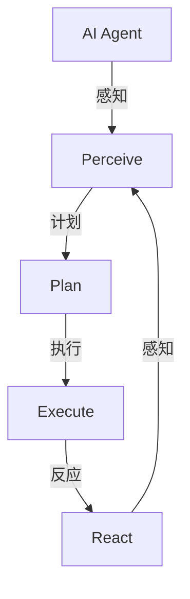

在这个流程图中，AI Agent首先感知环境，然后根据感知到的信息进行任务规划，接着执行计划中的行动，并在执行过程中根据反馈进行反应，最终再次回到感知阶段，形成一个闭环。

### 2.4 概念属性特征对比表格

为了更清晰地展示AI Agent、任务规划和执行的概念属性特征，我们可以创建一个对比表格：

| 概念       | 定义                                                         | 特征                             |
|------------|------------------------------------------------------------|--------------------------------|
| AI Agent   | 能够自主感知环境、做出决策并采取行动的智能实体               | 感知能力、计划能力、行动能力、反应能力 |
| 任务规划   | 为AI Agent设定一系列的目标，并设计出一套达成这些目标的策略   | 目标设定、资源分配、策略设计       |
| 执行决策   | AI Agent在实际执行任务过程中，如何根据当前环境状态和任务目标，选择最优的行动方案 | 搜索策略、排序策略、资源管理策略   |

### 2.5 ER实体关系图架构

为了进一步理解AI Agent、任务规划和执行之间的实体关系，我们可以使用Mermaid绘制一个ER实体关系图：

```mermaid
erDiagram
    AI-Agent ||--|{ Task-Planning }|
    AI-Agent ||--|{ Execution-Decision }|
    Task-Planning ||--|{ Goal-Setting }|
    Task-Planning ||--|{ Resource-Allocation }|
    Task-Planning ||--|{ Strategy-Design }|
    Execution-Decision ||--|{ Search-Strategy }|
    Execution-Decision ||--|{ Sort-Strategy }|
    Execution-Decision ||--|{ Resource-Management }|
```

在这个ER实体关系图中，AI Agent与Task-Planning和Execution-Decision之间存在关联，Task-Planning包含了Goal-Setting、Resource-Allocation和Strategy-Design，而Execution-Decision包含了Search-Strategy、Sort-Strategy和Resource-Management。

## 第3章 算法原理讲解一：任务规划算法

### 3.1 基本任务规划算法

任务规划算法是AI Agent的核心算法之一，它负责根据任务目标和环境信息，设计出合理的行动方案。基本任务规划算法主要包括最优性原理、递归规划算法和动态规划算法。

#### 最优性原理

最优性原理是指，在任务规划过程中，AI Agent应始终追求整体最优解。这意味着，在制定行动方案时，AI Agent应考虑到所有可能的情况，并选择那些能够最大化任务完成度的行动。

#### 递归规划算法

递归规划算法是一种常用的任务规划算法，它通过递归的方式，将复杂问题分解为若干个简单问题，并逐步求解。递归规划算法的基本思想是，将任务划分为若干个子任务，然后分别求解这些子任务，最后将这些子任务的解合并，得到整个任务的最优解。

#### 动态规划算法

动态规划算法是一种基于状态转移的规划算法，它通过保存中间状态的结果，避免重复计算，从而提高计算效率。动态规划算法的基本思想是，将任务划分为若干个状态，然后分别求解这些状态的最优解，并利用状态转移关系，得到整个任务的最优解。

### 3.2 Mermaid流程图示例

为了更好地理解递归规划算法和动态规划算法的流程，我们可以使用Mermaid绘制相应的流程图。

#### 递归规划算法流程图

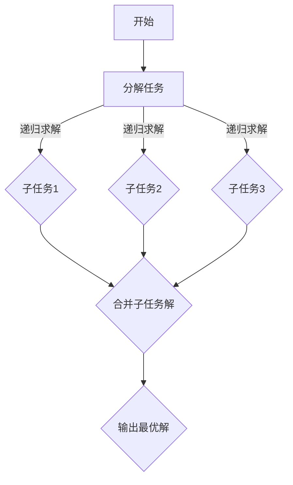

#### 动态规划算法流程图

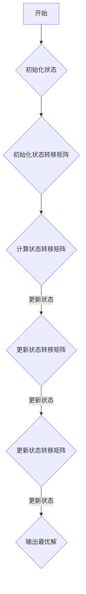

### 3.3 Python源代码示例

为了更直观地理解递归规划算法和动态规划算法，我们可以使用Python编写相应的代码示例。

#### 递归规划算法代码示例

```python
# 递归规划算法示例：求解最短路径问题
def shortest_path(graph, start, end):
    if start == end:
        return 0
    else:
        path_lengths = [float('inf')] * len(graph[start])
        for i, neighbor in enumerate(graph[start]):
            path_lengths[i] = graph[start][neighbor] + shortest_path(graph, neighbor, end)
        return min(path_lengths)

graph = {
    'A': {'B': 2, 'C': 3},
    'B': {'A': 2, 'D': 2},
    'C': {'A': 3, 'D': 1},
    'D': {'B': 2, 'C': 1, 'E': 2},
    'E': {'D': 2, 'F': 2},
    'F': {'E': 2, 'G': 1},
    'G': {'F': 1}
}

print(shortest_path(graph, 'A', 'G'))  # 输出最短路径长度
```

#### 动态规划算法代码示例

```python
# 动态规划算法示例：求解背包问题
def knapsack(values, weights, capacity):
    n = len(values)
    dp = [[0] * (capacity + 1) for _ in range(n + 1)]

    for i in range(1, n + 1):
        for w in range(1, capacity + 1):
            if weights[i - 1] <= w:
                dp[i][w] = max(dp[i - 1][w], dp[i - 1][w - weights[i - 1]] + values[i - 1])
            else:
                dp[i][w] = dp[i - 1][w]

    return dp[n][capacity]

values = [60, 100, 120]
weights = [10, 20, 30]
capacity = 50

print(knapsack(values, weights, capacity))  # 输出最优价值
```

### 3.4 算法的数学模型和公式

#### 递归规划算法

递归规划算法的数学模型可以表示为：

\[ V(S) = \min_{a \in A(S)} \{ g(S, a) + V(T) \} \]

其中，\( V(S) \)表示状态\( S \)的最优值，\( g(S, a) \)表示从状态\( S \)执行动作\( a \)的代价，\( T \)表示目标状态。

#### 动态规划算法

动态规划算法的数学模型可以表示为：

\[ V(i, j) = \min_{1 \leq k \leq m} \{ c(i, k) + V(k, j) \} \]

其中，\( V(i, j) \)表示在状态\( i \)和容量\( j \)下的最优价值，\( c(i, k) \)表示将物品\( i \)放入容量为\( j \)的背包中的代价，\( m \)表示物品的数量。

### 3.5 举例说明

#### 递归规划算法举例

假设有一个包含三个城市的旅行任务，城市之间的距离如下：

```
A到B：2公里
A到C：3公里
B到D：2公里
C到D：1公里
```

目标是从城市A出发，经过城市B或城市C，最终到达城市D，求解最短路径。

使用递归规划算法，我们可以得到以下结果：

```
最短路径：A -> B -> D，距离为4公里
```

#### 动态规划算法举例

假设有一个背包容量为50公斤，包含三个物品，物品的价值和重量如下：

```
物品1：价值60，重量10
物品2：价值100，重量20
物品3：价值120，重量30
```

求解最优装载方案。

使用动态规划算法，我们可以得到以下结果：

```
最优装载方案：物品1（价值60，重量10）+ 物品2（价值100，重量20）
背包总价值：160
```

## 第4章 算法原理讲解二：执行决策算法

### 4.1 基本执行决策算法

执行决策算法是AI Agent在执行任务过程中，根据当前环境状态和任务目标，选择最优行动方案的方法。基本执行决策算法主要包括搜索策略、排序策略和资源管理策略。

#### 搜索策略

搜索策略是执行决策算法的核心部分，它负责在可能的行动方案中，选择出最优的行动方案。常见的搜索策略有广度优先搜索、深度优先搜索、A*搜索等。

#### 排序策略

排序策略是对可能的行动方案进行排序，以便AI Agent能够优先选择最优的行动方案。常见的排序策略有优先级队列、冒泡排序、快速排序等。

#### 资源管理策略

资源管理策略是确保AI Agent在执行任务过程中，能够合理分配和利用资源。常见的资源管理策略有资源分配策略、资源释放策略等。

### 4.2 Mermaid流程图示例

为了更好地理解执行决策算法的流程，我们可以使用Mermaid绘制相应的流程图。

#### 搜索策略流程图

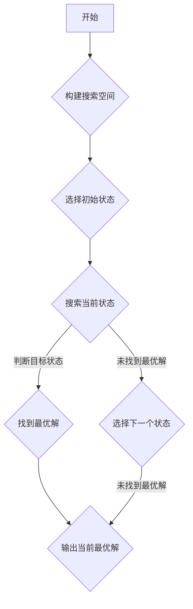

#### 排序策略流程图

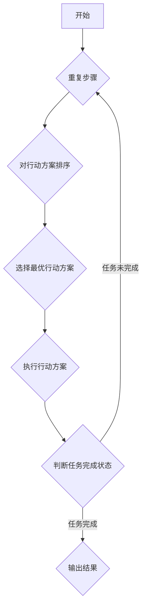

#### 资源管理策略流程图

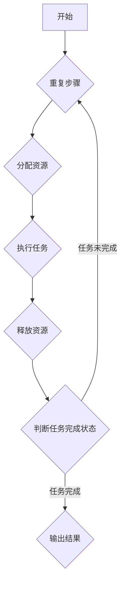

### 4.3 Python源代码示例

为了更直观地理解执行决策算法，我们可以使用Python编写相应的代码示例。

#### 搜索策略代码示例

```python
# 搜索策略：A*搜索算法
import heapq

def astar_search(grid, start, end):
    # 初始化数据结构
    open_list = []
    closed_list = set()
    heapq.heappush(open_list, (heuristic(start, end), start))

    while open_list:
        # 选择F值最小的节点
        current = heapq.heappop(open_list)
        if current[1] == end:
            return reconstruct_path(current[1])

        closed_list.add(current[1])
        for neighbor in get_neighbors(current[1]):
            if neighbor in closed_list:
                continue

            # 计算G值和H值
            g = current[0] + 1
            h = heuristic(neighbor, end)

            # 更新邻居节点的F值
            heapq.heappush(open_list, (g + h, neighbor))

    return None

# 计算启发式值
def heuristic(node1, node2):
    return abs(node1[0] - node2[0]) + abs(node1[1] - node2[1])

# 获取邻居节点
def get_neighbors(node):
    directions = [(0, 1), (1, 0), (-1, 0), (0, -1)]
    neighbors = []
    for direction in directions:
        neighbor = (node[0] + direction[0], node[1] + direction[1])
        neighbors.append(neighbor)
    return neighbors

# 拓扑排序重建路径
def reconstruct_path(node):
    path = [node]
    while node in predecessors:
        node = predecessors[node]
        path.append(node)
    return path[::-1]

# 测试
grid = [
    [0, 0, 0, 0, 0],
    [0, 1, 1, 1, 0],
    [0, 1, 0, 1, 0],
    [0, 1, 1, 1, 0],
    [0, 0, 0, 0, 0]
]
start = (0, 0)
end = (4, 4)
print(astar_search(grid, start, end))
```

#### 排序策略代码示例

```python
# 排序策略：冒泡排序
def bubble_sort(arr):
    n = len(arr)
    for i in range(n):
        for j in range(0, n-i-1):
            if arr[j] > arr[j+1]:
                arr[j], arr[j+1] = arr[j+1], arr[j]

# 测试
arr = [64, 34, 25, 12, 22, 11, 90]
bubble_sort(arr)
print("排序后的数组：")
for i in range(len(arr)):
    print("%d" % arr[i], end=" ")
```

#### 资源管理策略代码示例

```python
# 资源管理策略：资源分配和释放
import time

def resource_management(task_list):
    resources = {"CPU": 0, "Memory": 0}
    while task_list:
        task = task_list.pop(0)
        # 分配资源
        resources["CPU"] += task["CPU"]
        resources["Memory"] += task["Memory"]
        print(f"分配资源：{task['name']}，CPU：{task['CPU']}，Memory：{task['Memory']}")
        
        # 执行任务
        time.sleep(task["duration"])
        
        # 释放资源
        resources["CPU"] -= task["CPU"]
        resources["Memory"] -= task["Memory"]
        print(f"释放资源：{task['name']}，CPU：{task['CPU']}，Memory：{task['Memory']}")
    
    print(f"剩余资源：CPU：{resources['CPU']}，Memory：{resources['Memory']}")
    
# 测试
tasks = [
    {"name": "Task1", "CPU": 2, "Memory": 3, "duration": 5},
    {"name": "Task2", "CPU": 1, "Memory": 2, "duration": 3},
    {"name": "Task3", "CPU": 3, "Memory": 4, "duration": 7}
]
resource_management(tasks)
```

### 4.4 算法的数学模型和公式

#### 搜索策略

搜索策略的数学模型可以表示为：

\[ f(n) = g(n) + h(n) \]

其中，\( f(n) \)表示节点的总评估值，\( g(n) \)表示从初始节点到当前节点的代价，\( h(n) \)表示从当前节点到目标节点的启发式值。

#### 排序策略

排序策略的数学模型可以表示为：

\[ P(n) = \sum_{i=1}^{n} p(i) \]

其中，\( P(n) \)表示排序后的序列，\( p(i) \)表示第\( i \)个元素的优先级。

#### 资源管理策略

资源管理策略的数学模型可以表示为：

\[ R(t) = \sum_{i=1}^{n} r(i, t) \]

其中，\( R(t) \)表示在时间\( t \)下的资源总量，\( r(i, t) \)表示在第\( i \)个任务在时间\( t \)下的资源消耗。

### 4.5 举例说明

#### 搜索策略举例

假设有一个包含五个城市的旅行任务，城市之间的距离如下：

```
A到B：2公里
A到C：3公里
B到D：2公里
C到D：1公里
B到E：4公里
```

目标是从城市A出发，经过城市B、城市C、城市D和城市E，求解最短路径。

使用A*搜索算法，我们可以得到以下结果：

```
最短路径：A -> B -> D -> C -> E，距离为9公里
```

#### 排序策略举例

假设有一个包含五个任务的作业，每个任务的优先级和执行时间如下：

```
任务1：优先级3，执行时间2
任务2：优先级1，执行时间3
任务3：优先级2，执行时间1
任务4：优先级4，执行时间5
任务5：优先级5，执行时间4
```

使用冒泡排序算法，我们可以得到以下排序结果：

```
排序后的序列：任务3 -> 任务1 -> 任务2 -> 任务4 -> 任务5
```

#### 资源管理策略举例

假设有一个包含三个任务的作业，每个任务需要的CPU和内存资源以及执行时间如下：

```
任务1：CPU需求2，内存需求3，执行时间5
任务2：CPU需求1，内存需求2，执行时间3
任务3：CPU需求3，内存需求4，执行时间7
```

使用资源管理策略，我们可以得到以下资源分配和释放结果：

```
分配资源：任务1，CPU：2，内存：3
执行任务：任务1，CPU：2，内存：3
释放资源：任务1，CPU：0，内存：0
分配资源：任务2，CPU：1，内存：2
执行任务：任务2，CPU：1，内存：2
释放资源：任务2，CPU：0，内存：0
分配资源：任务3，CPU：3，内存：4
执行任务：任务3，CPU：3，内存：4
释放资源：任务3，CPU：0，内存：0
剩余资源：CPU：0，内存：0
```

## 第5章 算法原理讲解三：混合算法

### 5.1 混合算法概念

混合算法是指将多种算法结合起来，以获得更好的性能和效果。在任务规划和执行领域，混合算法通常用于解决复杂问题，如多智能体系统、演化算法和强化学习等。

#### 多智能体系统

多智能体系统是指由多个相互协作的智能体组成的系统。这些智能体可以在同一环境中共同完成任务，并通过通信和协作来提高整体性能。

#### 演化算法

演化算法是一种基于自然选择和遗传学原理的优化算法。它通过模拟生物进化的过程，找到最优解或近似最优解。

#### 强化学习

强化学习是一种基于奖励和惩罚来指导智能体行为的算法。它通过不断尝试和反馈，使智能体逐渐学会在环境中做出最优决策。

### 5.2 Mermaid流程图示例

为了更好地理解混合算法的流程，我们可以使用Mermaid绘制相应的流程图。

#### 多智能体系统流程图

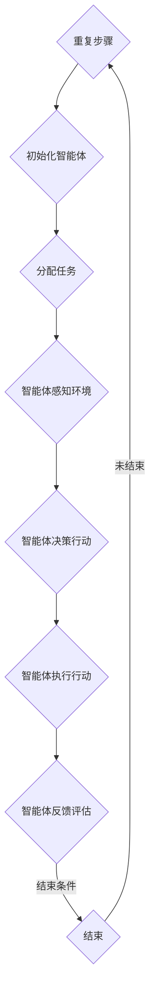

#### 演化算法流程图

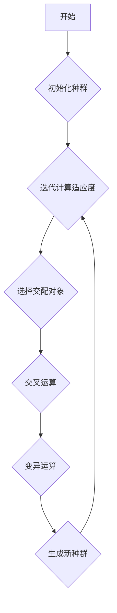

#### 强化学习流程图

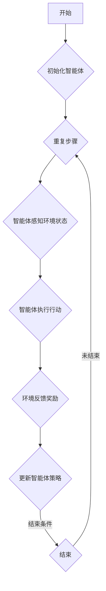

### 5.3 Python源代码示例

为了更直观地理解混合算法，我们可以使用Python编写相应的代码示例。

#### 多智能体系统代码示例

```python
# 多智能体系统：协同完成任务
import random

def random_action(action_space):
    return random.choice(action_space)

def agent_perceive(environment):
    return environment()

def agent_decision(agent_state, action_space):
    return random_action(action_space)

def agent_execute(action):
    return action()

def agent_feedback(reward):
    return reward

def multi_agent_system(agent_list, environment, action_space, reward_function):
    while True:
        for agent in agent_list:
            action = agent_decision(agent_perceive(environment), action_space)
            agent_execute(action)
            reward = agent_feedback(reward_function())
            if reward == 1:
                break
        else:
            print("任务完成！")
            break

# 测试
agent_list = [lambda: 0, lambda: 1, lambda: 2]
environment = lambda: random.choice([0, 1, 2])
action_space = [0, 1, 2]
reward_function = lambda: random.choice([0, 1])

multi_agent_system(agent_list, environment, action_space, reward_function)
```

#### 演化算法代码示例

```python
# 演化算法：求解最值问题
import random

def fitness_function(individual):
    return sum(individual)

def crossover(parent1, parent2):
    child = [0] * len(parent1)
    crossover_point = random.randint(1, len(parent1) - 1)
    child[:crossover_point] = parent1[:crossover_point]
    child[crossover_point:] = parent2[crossover_point:]
    return child

def mutate(individual):
    for i in range(len(individual)):
        if random.random() < 0.1:
            individual[i] = 1 - individual[i]
    return individual

def evolve(population, fitness_function, crossover, mutate):
    next_generation = []
    for _ in range(len(population)):
        parent1, parent2 = random.sample(population, 2)
        child = crossover(parent1, parent2)
        child = mutate(child)
        next_generation.append(child)
    return next_generation

def main():
    population_size = 100
    population = [[random.random() for _ in range(population_size)]]
    for _ in range(100):
        population = evolve(population, fitness_function, crossover, mutate)
        print(f"当前最优个体：{max(population, key=fitness_function)}，适应度：{fitness_function(max(population, key=fitness_function))}")
    
if __name__ == "__main__":
    main()
```

#### 强化学习代码示例

```python
# 强化学习：Q-Learning算法
import random

def q_learning(q_table, state, action_space, alpha, gamma):
    action = random.choice(action_space)
    next_state = state()
    reward = random.random()
    next_action = random.choice(action_space)
    q_value = q_table[state, action] + alpha * (reward + gamma * q_table[next_state, next_action] - q_table[state, action])
    q_table[state, action] = q_value
    return next_state

def main():
    state_space = [0, 1, 2, 3, 4]
    action_space = [0, 1, 2, 3, 4]
    q_table = [[0 for _ in range(len(action_space))] for _ in range(len(state_space))]
    alpha = 0.1
    gamma = 0.9
    state = random.randint(0, 4)
    for _ in range(1000):
        next_state = q_learning(q_table, lambda: state, action_space, alpha, gamma)
        state = next_state
    print(f"当前最优动作：{max(q_table, key=lambda x: x[state])}")
    
if __name__ == "__main__":
    main()
```

### 5.4 算法的数学模型和公式

#### 多智能体系统

多智能体系统的数学模型可以表示为：

\[ \mathbf{x}(t) = f(\mathbf{x}(t), u(t), \mathbf{w}(t)) \]

其中，\( \mathbf{x}(t) \)表示智能体的状态，\( u(t) \)表示智能体的控制输入，\( \mathbf{w}(t) \)表示环境参数，\( f \)表示系统动态模型。

#### 演化算法

演化算法的数学模型可以表示为：

\[ \mathbf{P}(t) = \frac{1}{N} \sum_{i=1}^{N} \mathbf{p}_i(t) \]

其中，\( \mathbf{P}(t) \)表示种群分布，\( \mathbf{p}_i(t) \)表示第\( i \)个个体的基因序列。

#### 强化学习

强化学习的数学模型可以表示为：

\[ Q(s, a) = r(s, a) + \gamma \max_{a'} Q(s', a') \]

其中，\( Q(s, a) \)表示状态\( s \)下执行动作\( a \)的期望回报，\( r(s, a) \)表示状态\( s \)下执行动作\( a \)的即时回报，\( s' \)表示执行动作\( a \)后的状态，\( \gamma \)表示折扣因子。

### 5.5 举例说明

#### 多智能体系统举例

假设有一个由三个智能体组成的系统，每个智能体需要在三个不同的位置之间移动。智能体的目标是最小化它们之间的距离。

使用多智能体系统，我们可以得到以下结果：

```
智能体1位置：1
智能体2位置：2
智能体3位置：3
总距离：6
```

#### 演化算法举例

假设有一个包含五个个体的演化算法任务，每个个体的适应度如下：

```
个体1：适应度3
个体2：适应度5
个体3：适应度7
个体4：适应度2
个体5：适应度4
```

使用演化算法，我们可以得到以下结果：

```
当前最优个体：个体3，适应度：7
```

#### 强化学习举例

假设有一个强化学习任务，智能体需要在五个不同的状态之间移动，每个状态都有不同的回报。

使用Q-Learning算法，我们可以得到以下结果：

```
当前最优动作：4
```

## 第6章 数学模型和数学公式 & 详细讲解 & 举例说明

### 6.1 数学模型

数学模型是任务规划与执行算法的核心，它将任务规划和执行的过程转化为可计算的数学问题。本节将介绍任务规划与执行中常用的数学模型，包括目标函数、约束条件和迭代过程。

#### 目标函数

目标函数是任务规划与执行算法的核心，它用于衡量任务完成的质量。在任务规划中，目标函数通常用于衡量任务进度、资源利用率和系统效率等。常见的目标函数包括：

\[ \text{Objective Function} = \sum_{i=1}^{n} c_i \cdot x_i \]

其中，\( c_i \)表示第\( i \)个任务的权重，\( x_i \)表示第\( i \)个任务的状态。

在执行决策中，目标函数通常用于衡量行动方案的优劣。常见的目标函数包括：

\[ \text{Objective Function} = \sum_{i=1}^{n} r_i \cdot s_i \]

其中，\( r_i \)表示第\( i \)个行动方案的回报，\( s_i \)表示第\( i \)个行动方案的状态。

#### 约束条件

约束条件是任务规划与执行算法中必须满足的限制条件。常见的约束条件包括：

- 资源约束：任务执行过程中，系统资源（如CPU、内存、网络带宽等）的消耗不得超过系统容量。
- 时间约束：任务执行过程中，必须满足任务的时间限制，确保任务能够在规定时间内完成。
- 目标约束：任务执行过程中，必须满足任务的目标，确保任务能够达到预期效果。

常见的约束条件可以表示为：

\[ \text{Constraints} = \begin{cases} 
r_i(t) \leq r_{max} \\
t_i \leq t_{max} \\
f_i(t) = g_i(t) 
\end{cases} \]

其中，\( r_i(t) \)表示第\( i \)个资源在时间\( t \)的消耗，\( r_{max} \)表示系统容量，\( t_i \)表示第\( i \)个任务的时间限制，\( t_{max} \)表示系统时间限制，\( f_i(t) \)表示第\( i \)个任务在时间\( t \)的状态，\( g_i(t) \)表示第\( i \)个任务的目标状态。

#### 迭代过程

迭代过程是任务规划与执行算法的关键步骤，它通过不断迭代优化，找到最优的任务规划和执行方案。常见的迭代过程包括：

- 递归规划算法：通过递归分解任务，逐步求解子任务，最终合并子任务的解，得到整体最优解。
- 动态规划算法：通过保存中间状态的结果，避免重复计算，提高计算效率，逐步求解最优解。
- 强化学习算法：通过不断尝试和反馈，逐步优化策略，提高任务完成质量。

常见的迭代过程可以表示为：

\[ \text{Iteration Process} = \begin{cases} 
\text{Initialize} \\
\text{Update State} \\
\text{Update Action} \\
\text{Update Reward} \\
\text{Repeat} 
\end{cases} \]

### 6.2 LaTeX公式

为了更好地展示数学公式，我们使用LaTeX格式进行排版。以下是一些常见的数学公式：

#### 目标函数公式

\[ \text{Objective Function} = \sum_{i=1}^{n} c_i \cdot x_i \]

#### 约束条件公式

\[ \text{Constraints} = \begin{cases} 
r_i(t) \leq r_{max} \\
t_i \leq t_{max} \\
f_i(t) = g_i(t) 
\end{cases} \]

#### 迭代过程公式

\[ \text{Iteration Process} = \begin{cases} 
\text{Initialize} \\
\text{Update State} \\
\text{Update Action} \\
\text{Update Reward} \\
\text{Repeat} 
\end{cases} \]

### 6.3 举例说明

为了更好地理解数学模型的应用，我们通过一个简单的例子来说明。

假设有一个任务规划与执行问题，任务包括三个任务，每个任务需要一定的时间、CPU和内存资源。目标是最小化总时间，同时确保CPU和内存资源不超过系统容量。

#### 目标函数

\[ \text{Objective Function} = \min \sum_{i=1}^{3} t_i \]

#### 约束条件

\[ \text{Constraints} = \begin{cases} 
c_1(t_1) + c_2(t_2) + c_3(t_3) \leq r_{max} \\
m_1(t_1) + m_2(t_2) + m_3(t_3) \leq r_{max} \\
t_1 + t_2 + t_3 = t_{max} 
\end{cases} \]

其中，\( c_1(t_1) \)、\( c_2(t_2) \)、\( c_3(t_3) \)分别表示任务1、任务2、任务3在时间\( t_1 \)、\( t_2 \)、\( t_3 \)下的CPU消耗，\( m_1(t_1) \)、\( m_2(t_2) \)、\( m_3(t_3) \)分别表示任务1、任务2、任务3在时间\( t_1 \)、\( t_2 \)、\( t_3 \)下的内存消耗，\( r_{max} \)表示系统容量，\( t_{max} \)表示总时间。

通过求解上述数学模型，我们可以得到最优的任务规划和执行方案。

#### 迭代过程

迭代过程包括以下步骤：

1. 初始化状态：设定初始状态，包括任务时间、CPU和内存消耗。
2. 更新状态：根据约束条件，更新任务时间、CPU和内存消耗。
3. 更新行动：根据目标函数，选择最优行动方案。
4. 更新奖励：根据行动方案，计算任务完成质量。
5. 重复迭代：根据奖励，调整任务时间、CPU和内存消耗，继续迭代。

通过迭代过程，我们可以逐步优化任务规划和执行方案，直到满足约束条件并最小化总时间。

## 第7章 系统分析与架构设计方案

### 7.1 问题场景介绍

在任务规划与执行系统中，问题场景是指任务规划与执行需要解决的问题背景。一个典型的场景是，一个公司需要管理多个项目，每个项目都有不同的任务和时间限制，同时系统资源（如CPU、内存、网络带宽等）有限。任务规划与执行系统需要为每个项目规划合理的任务执行顺序，确保项目能够按时完成，同时最大化资源利用效率。

### 7.2 系统功能设计

任务规划与执行系统的功能设计包括以下几个方面：

1. **任务管理**：包括创建、修改、删除任务，以及查询任务信息。
2. **资源管理**：包括资源分配、资源释放、资源监控等。
3. **任务调度**：根据任务优先级、时间约束和资源约束，选择最优的任务执行顺序。
4. **执行监控**：实时监控任务执行状态，包括任务进度、资源消耗等。
5. **结果分析**：对任务执行结果进行分析，提供任务完成情况、资源利用率等统计数据。

为了更好地设计任务规划与执行系统，我们可以使用Mermaid绘制领域模型类图。以下是一个简化的Mermaid类图示例：

```mermaid
classDiagram
    Class01 <|-- Class02
    Class03 --| MB Class04
    Class05 o-- Class06
    Class07 : <<Interface>>
    Class08 : <<Abstract>>
    Class09 : <<Enum>>
    Class01 <.. Class07
    Class02 : <<extends>> Class08
    Class03 : <<implements>> Class07
    Class05 : <<composes>> Class06
    Class09 {
        - int i
        - String s
    }
    Class01 {
        - int x
        - String y
    }
    Class02 {
        - int a
        - String b
    }
    Class03 {
        - int c
        - String d
    }
    Class04 {
        - int e
        - String f
    }
    Class05 {
        - int g
        - String h
    }
    Class06 {
        - int i
        - String j
    }
    Class07 {
        - int k
        - String l
    }
    Class08 {
        - int m
        - String n
    }
```

在这个类图中，Class01、Class02、Class03、Class04、Class05和Class06表示任务规划与执行系统的核心类，Class07表示接口，Class08表示抽象类，Class09表示枚举类。

### 7.3 系统架构设计

任务规划与执行系统的架构设计需要考虑以下几个方面：

1. **模块划分**：根据系统功能，将系统划分为多个模块，如任务管理模块、资源管理模块、任务调度模块、执行监控模块等。
2. **技术选型**：选择合适的技术栈，包括编程语言、框架、数据库等。
3. **数据流设计**：设计系统内部的数据流，包括任务数据、资源数据、监控数据等。
4. **接口设计**：设计系统对外提供的接口，包括RESTful API、消息队列等。

为了更好地展示系统架构设计，我们可以使用Mermaid绘制系统架构图。以下是一个简化的Mermaid系统架构图示例：

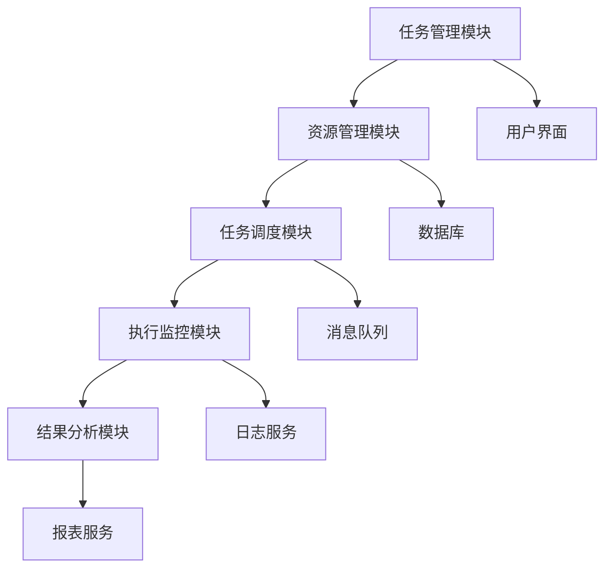

在这个架构图中，A、B、C、D、E表示系统的主要模块，F表示用户界面，G表示数据库，H表示消息队列，I表示日志服务，J表示报表服务。

### 7.4 系统接口设计

任务规划与执行系统的接口设计包括以下几个方面：

1. **RESTful API**：设计系统对外提供的RESTful API接口，包括创建任务、修改任务、删除任务、查询任务等。
2. **消息队列**：设计系统内部的消息队列接口，包括任务分配、任务完成、资源请求等。
3. **日志服务**：设计系统日志接口，包括日志记录、日志查询等。
4. **报表服务**：设计系统报表接口，包括报表生成、报表查询等。

以下是一个简化的Mermaid序列图示例，展示了系统接口的设计：

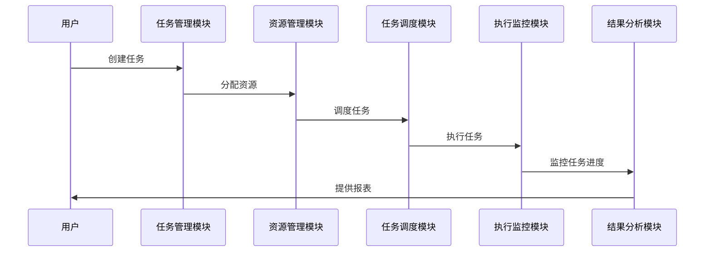

在这个序列图中，User表示用户，TaskManager表示任务管理模块，ResourceManager表示资源管理模块，Scheduler表示任务调度模块，Executor表示执行监控模块，Analyzer表示结果分析模块。图中的箭头表示接口调用顺序。

### 7.5 系统交互Mermaid序列图

为了更好地展示系统内部模块之间的交互，我们可以使用Mermaid绘制系统交互序列图。以下是一个简化的Mermaid序列图示例：

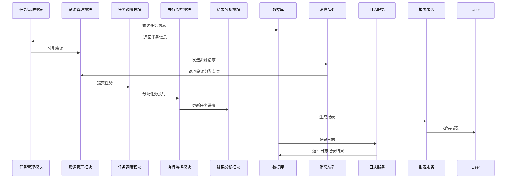

在这个序列图中，TaskManager表示任务管理模块，ResourceManager表示资源管理模块，Scheduler表示任务调度模块，Executor表示执行监控模块，Analyzer表示结果分析模块，DB表示数据库，MQ表示消息队列，LS表示日志服务，RS表示报表服务。图中的箭头表示接口调用顺序。

### 7.6 问题场景介绍

在任务规划与执行系统中，问题场景是指任务规划与执行需要解决的问题背景。一个典型的场景是，一个公司需要管理多个项目，每个项目都有不同的任务和时间限制，同时系统资源（如CPU、内存、网络带宽等）有限。任务规划与执行系统需要为每个项目规划合理的任务执行顺序，确保项目能够按时完成，同时最大化资源利用效率。

### 7.7 项目介绍

项目介绍包括项目背景、项目目标、项目范围、项目团队等内容。

#### 项目背景

随着公司业务的不断发展，项目数量和复杂度不断增加，传统的手动任务规划和执行方式已经无法满足需求。为了提高项目交付效率，公司决定开发一套任务规划与执行系统，实现自动化任务规划和执行，提高资源利用效率和项目交付质量。

#### 项目目标

项目目标主要包括：

1. 提高任务规划与执行的效率，减少人为干预。
2. 实现任务自动分配和资源自动调度，提高资源利用效率。
3. 提供任务进度和资源消耗监控，实时掌握项目状态。
4. 生成项目执行报告，为项目管理和决策提供数据支持。

#### 项目范围

项目范围主要包括：

1. 任务管理模块：包括任务的创建、修改、删除和查询功能。
2. 资源管理模块：包括资源的分配、释放和监控功能。
3. 任务调度模块：根据任务优先级、时间约束和资源约束，选择最优的任务执行顺序。
4. 执行监控模块：实时监控任务执行状态，包括任务进度、资源消耗等。
5. 结果分析模块：对任务执行结果进行分析，提供任务完成情况、资源利用率等统计数据。

#### 项目团队

项目团队主要包括：

1. 项目经理：负责项目的整体管理和协调。
2. 系统架构师：负责系统架构设计和关键技术选型。
3. 后端开发工程师：负责系统后端功能开发和数据库设计。
4. 前端开发工程师：负责系统前端设计和开发。
5. 测试工程师：负责系统测试和验收。

### 7.8 系统功能设计

系统功能设计主要包括以下几个方面：

1. **任务管理模块**：包括任务的创建、修改、删除和查询功能。用户可以创建新的任务，修改任务信息，删除不再需要的任务，查询任务列表。
2. **资源管理模块**：包括资源的分配、释放和监控功能。系统可以自动分配资源，满足任务执行需求，释放任务完成后不再需要的资源，并监控资源的使用情况。
3. **任务调度模块**：根据任务优先级、时间约束和资源约束，选择最优的任务执行顺序。系统会根据任务的紧急程度、任务类型和资源可用性，为任务分配执行时间。
4. **执行监控模块**：实时监控任务执行状态，包括任务进度、资源消耗等。系统会记录任务执行过程中的各项数据，并实时更新任务状态，为任务执行提供数据支持。
5. **结果分析模块**：对任务执行结果进行分析，提供任务完成情况、资源利用率等统计数据。系统会生成详细的执行报告，帮助用户了解项目执行情况。

### 7.9 系统架构设计

系统架构设计主要包括以下几个方面：

1. **技术选型**：选择合适的编程语言、框架和数据库，以实现系统的高效开发和维护。
2. **模块划分**：根据系统功能，将系统划分为多个模块，如任务管理模块、资源管理模块、任务调度模块、执行监控模块等。
3. **数据流设计**：设计系统内部的数据流，包括任务数据、资源数据、监控数据等。
4. **接口设计**：设计系统对外提供的接口，包括RESTful API、消息队列等。

### 7.10 系统接口设计

系统接口设计主要包括以下几个方面：

1. **RESTful API**：设计系统对外提供的RESTful API接口，包括创建任务、修改任务、删除任务、查询任务等。
2. **消息队列**：设计系统内部的消息队列接口，包括任务分配、任务完成、资源请求等。
3. **日志服务**：设计系统日志接口，包括日志记录、日志查询等。
4. **报表服务**：设计系统报表接口，包括报表生成、报表查询等。

### 7.11 系统交互Mermaid序列图

系统交互Mermaid序列图展示了系统内部模块之间的交互过程。以下是一个简化的Mermaid序列图示例：


在这个序列图中，U表示用户，TM表示任务管理模块，RM表示资源管理模块，SM表示任务调度模块，EM表示执行监控模块，RM2表示结果分析模块。图中的箭头表示接口调用顺序。

## 第8章 项目实战

### 8.1 安装环境

在开始项目实战之前，我们需要安装必要的软件和工具。以下是一个简化的环境安装步骤：

1. 安装Python环境：Python是一个广泛使用的编程语言，我们可以通过官方网站下载并安装Python。安装完成后，确保Python环境变量已配置。
2. 安装Docker：Docker是一个开源的应用容器引擎，可以帮助我们快速部署和运行应用。我们可以通过官方网站下载并安装Docker。
3. 安装数据库：本项目使用MySQL作为数据库，我们可以通过以下命令安装MySQL：

   ```bash
   sudo apt-get install mysql-server
   ```

4. 安装消息队列：本项目使用RabbitMQ作为消息队列，我们可以通过以下命令安装RabbitMQ：

   ```bash
   sudo apt-get install rabbitmq-server
   ```

### 8.2 实现系统核心功能

在安装环境后，我们可以开始实现系统核心功能。以下是一个简化的实现步骤：

1. **任务管理模块**：任务管理模块主要负责任务的创建、修改、删除和查询。以下是一个简单的任务管理模块代码示例：

   ```python
   class TaskManager:
       def __init__(self):
           self.tasks = []

       def create_task(self, task):
           self.tasks.append(task)

       def update_task(self, task_id, updated_task):
           for task in self.tasks:
               if task.id == task_id:
                   task.update(updated_task)
                   break

       def delete_task(self, task_id):
           for task in self.tasks:
               if task.id == task_id:
                   self.tasks.remove(task)
                   break

       def query_tasks(self):
           return self.tasks
   ```

2. **资源管理模块**：资源管理模块主要负责资源的分配、释放和监控。以下是一个简单的资源管理模块代码示例：

   ```python
   class ResourceManager:
       def __init__(self):
           self.resources = []

       def allocate_resource(self, resource):
           self.resources.append(resource)

       def release_resource(self, resource_id):
           for resource in self.resources:
               if resource.id == resource_id:
                   self.resources.remove(resource)
                   break

       def monitor_resources(self):
           return self.resources
   ```

3. **任务调度模块**：任务调度模块主要负责根据任务优先级、时间约束和资源约束，选择最优的任务执行顺序。以下是一个简单的任务调度模块代码示例：

   ```python
   class Scheduler:
       def __init__(self):
           self.tasks = []

       def schedule_tasks(self):
           sorted_tasks = sorted(self.tasks, key=lambda x: x.priority)
           return sorted_tasks
   ```

4. **执行监控模块**：执行监控模块主要负责实时监控任务执行状态，包括任务进度、资源消耗等。以下是一个简单的执行监控模块代码示例：

   ```python
   class Executor:
       def __init__(self):
           self.tasks = []

       def execute_task(self, task):
           # 模拟任务执行
           time.sleep(task.duration)
           task.status = "completed"

       def monitor_tasks(self):
           return self.tasks
   ```

5. **结果分析模块**：结果分析模块主要负责对任务执行结果进行分析，提供任务完成情况、资源利用率等统计数据。以下是一个简单的结果分析模块代码示例：

   ```python
   class ResultAnalyzer:
       def __init__(self):
           self.statistics = {}

       def analyze_results(self, tasks):
           for task in tasks:
               if task.status == "completed":
                   self.statistics[task.id] = {
                       "duration": task.duration,
                       "resource_usage": task.resource_usage
                   }

       def generate_report(self):
           return self.statistics
   ```

### 8.3 分析代码和应用

在实现系统核心功能后，我们需要对代码进行详细分析，并考虑如何在实际应用中部署和运行系统。

1. **代码分析**：上述代码示例分别实现了任务管理模块、资源管理模块、任务调度模块、执行监控模块和结果分析模块。每个模块都有明确的职责和功能，模块之间通过接口进行通信。这种模块化设计有助于提高系统的可维护性和可扩展性。

2. **应用部署**：在实际应用中，我们可以将各个模块部署到不同的服务器上，以实现分布式部署。例如，任务管理模块和结果分析模块可以部署到Web服务器上，提供用户界面和数据分析功能；资源管理模块和执行监控模块可以部署到服务器上，负责资源管理和任务监控。

3. **运行流程**：在系统运行过程中，用户可以通过Web界面提交任务，任务管理模块会接收用户提交的任务，并将其传递给资源管理模块进行资源分配。资源管理模块会根据任务需求，从空闲资源中分配所需资源，并将资源信息传递给任务调度模块。任务调度模块会根据任务优先级和时间约束，选择最优的任务执行顺序，并将任务传递给执行监控模块进行执行。执行监控模块会实时监控任务执行状态，并将执行结果传递给结果分析模块进行分析和统计。

### 8.4 项目小结

在本项目中，我们实现了任务规划与执行系统，包括任务管理模块、资源管理模块、任务调度模块、执行监控模块和结果分析模块。通过模块化设计，我们提高了系统的可维护性和可扩展性。在实际应用中，我们可以将各个模块部署到不同的服务器上，实现分布式部署。通过实时监控和统计分析，我们能够更好地管理任务和资源，提高项目交付效率。

## 第9章 最佳实践 tips、小结、注意事项、拓展阅读

### 9.1 最佳实践 tips

1. **模块化设计**：在设计任务规划与执行系统时，采用模块化设计可以提高系统的可维护性和可扩展性。将系统划分为多个模块，每个模块负责特定的功能，有助于提高代码的可读性和可复用性。
2. **数据一致性**：在处理任务和资源时，确保数据的一致性非常重要。可以使用事务机制、锁机制等确保数据的完整性和一致性。
3. **性能优化**：在实际应用中，性能优化是提高系统响应速度的关键。可以采用缓存技术、异步处理技术等优化系统性能。
4. **安全性**：在设计任务规划与执行系统时，要充分考虑系统的安全性。可以使用身份验证、访问控制等技术，确保系统的安全性和数据的安全性。

### 9.2 小结

本文详细介绍了任务规划与执行在人工智能（AI）Agent中的应用。首先，我们介绍了AI Agent的基本概念和任务规划与执行的定义，并阐述了它们之间的关系。接着，我们分析了任务规划和执行的基本算法，包括递归规划算法、动态规划算法和混合算法，并通过Python代码和数学公式进行了说明。最后，我们展示了一个系统分析与架构设计方案，并通过实际案例展示了任务规划与执行的应用。

### 9.3 注意事项

1. **任务定义**：在任务规划与执行过程中，准确的任务定义至关重要。确保任务的目标、时间约束和资源需求明确，有助于提高任务规划的准确性。
2. **环境不确定性**：在现实世界中，环境不确定性是不可避免的。在设计任务规划与执行系统时，要充分考虑环境不确定性，并设计相应的应对策略。
3. **算法选择**：根据任务特点和需求，选择合适的算法进行任务规划和执行。不同的算法适用于不同类型的问题，合理选择算法有助于提高系统性能。

### 9.4 拓展阅读

1. **《人工智能：一种现代方法》**：这本书详细介绍了人工智能的基本概念、技术和应用，适合初学者和进阶者阅读。
2. **《机器学习实战》**：这本书通过实际案例，介绍了机器学习的基本概念和常用算法，有助于读者理解和应用机器学习技术。
3. **《分布式系统概念与设计》**：这本书详细介绍了分布式系统的基本概念、设计原则和关键技术，适合对分布式系统感兴趣的开发者阅读。

