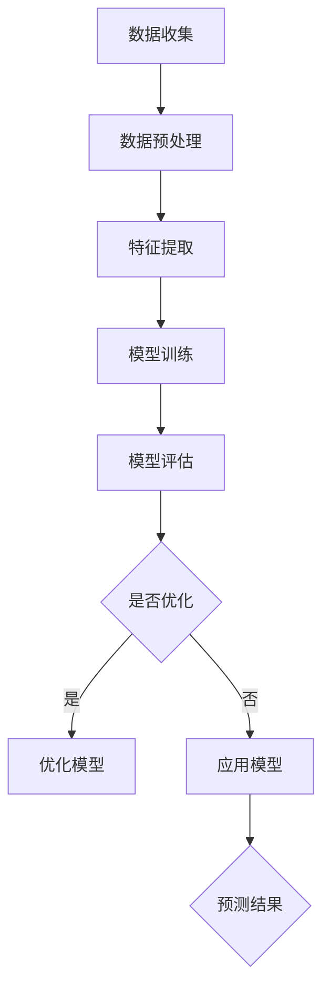
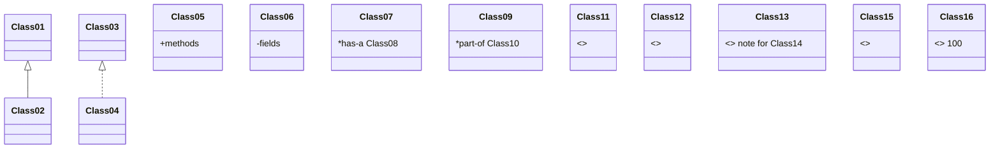
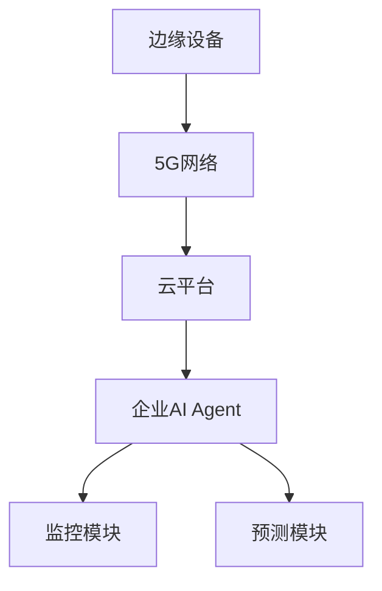
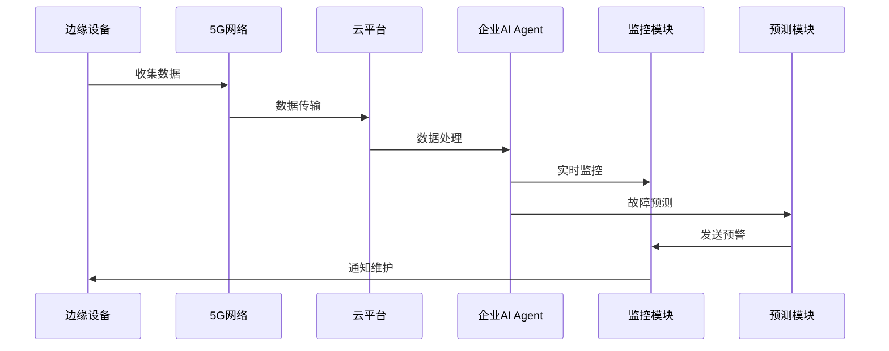

                 


## 企业AI Agent的5G边缘计算策略

### 概述

在当今信息化社会中，人工智能（AI）和5G边缘计算正成为推动企业数字化转型的重要力量。企业AI Agent作为AI技术在企业中的应用载体，通过边缘计算技术实现数据处理的实时性、高效性和安全性。本文旨在深入探讨企业AI Agent与5G边缘计算相结合的策略，为企业提供可行的技术解决方案。

### 背景介绍

#### 核心概念术语说明

- **企业AI Agent**：一种能够自主执行任务、解决问题的智能体，具备学习能力、推理能力和决策能力。
- **5G边缘计算**：一种将计算、存储和网络功能部署在靠近数据源的设备上，实现低延迟、高带宽、安全可靠的数据处理方式。

#### 问题背景与问题描述

随着大数据、物联网和智能制造等技术的发展，企业数据量呈爆炸式增长，传统的云计算模式已无法满足实时性和低延迟的需求。5G边缘计算提供了新的解决方案，但如何充分利用5G边缘计算的优势，提升企业AI Agent的性能和可靠性，成为当前研究的重点。

#### 问题解决与边界与外延

通过结合5G边缘计算技术，企业AI Agent可以在数据源头进行实时处理和分析，提高决策效率。本文将探讨企业AI Agent在5G边缘计算环境下的设计、实现和应用，为企业在数字化转型过程中提供技术支持。

#### 概念结构与核心要素组成

- **企业AI Agent设计**：包括架构设计、算法选择、模型部署与维护。
- **5G边缘计算技术**：涉及网络架构、计算资源、存储方案和安全保障。
- **应用场景**：涵盖智能零售、智能制造、智能交通等领域。

### 核心概念与联系

#### 企业AI Agent原理

企业AI Agent通过机器学习、深度学习等技术，从数据中学习规律，形成预测模型。其核心特点包括：

1. **自主学习能力**：通过数据反馈不断优化模型。
2. **实时响应能力**：在边缘设备上快速处理数据。
3. **安全可靠**：数据在边缘设备上进行处理，减少数据泄露风险。

#### 5G边缘计算原理

5G边缘计算通过将计算资源部署在靠近数据源的边缘设备上，实现数据的实时处理。其关键特性包括：

1. **低延迟**：减少数据传输时间，提高响应速度。
2. **高带宽**：支持大规模数据传输，满足大数据处理需求。
3. **安全保障**：通过边缘设备本地处理，降低数据泄露风险。

#### 对比表格

| 特性       | 企业AI Agent       | 5G边缘计算       |
|------------|---------------------|------------------|
| 自学习能力 | 强                | 较强              |
| 实时响应   | 较强                | 强                |
| 数据安全   | 一般                | 较高              |
| 延迟       | 较低                | 低                |
| 带宽       | 一般                | 高                |

#### ER实体关系图架构

```mermaid
erDiagram
  AI-Agent ||--|{ 5G-Edge-Device : 使用 }
  AI-Agent ||--|{ Data-Source : 监控 }
  5G-Edge-Device ||--|{ Data-Processing : 执行 }
  5G-Edge-Device ||--|{ Real-Time-Response : 支持 }
```

### 算法原理讲解

#### 企业AI Agent算法原理

企业AI Agent的算法主要包括机器学习、深度学习等。以下是一个简单的机器学习算法流程：



#### Python源代码示例

```python
# 数据预处理
def preprocess_data(data):
    # 数据清洗、归一化等操作
    pass

# 特征提取
def extract_features(data):
    # 提取数据特征
    pass

# 模型训练
def train_model(features, labels):
    # 使用机器学习算法训练模型
    pass

# 模型评估
def evaluate_model(model, test_data):
    # 评估模型性能
    pass

# 预测结果
def predict(model, new_data):
    # 使用训练好的模型进行预测
    pass
```

#### 数学模型与公式

企业AI Agent的预测模型可以表示为：

$$
\hat{y} = f(x; \theta)
$$

其中，$x$为输入特征，$\theta$为模型参数，$f(x; \theta)$为预测函数。

### 系统分析与架构设计方案

#### 问题场景介绍

企业希望利用AI Agent和5G边缘计算技术，实现对生产设备的实时监控与故障预测，以提高生产效率。

#### 项目介绍

本项目旨在搭建一个基于5G边缘计算的企业AI Agent系统，实现对生产数据的实时分析，预测设备故障，提高生产线的稳定性。

#### 系统功能设计（领域模型）



#### 系统架构设计



#### 系统接口设计和系统交互



### 项目实战

#### 环境安装

- 安装Python 3.8及以上版本
- 安装TensorFlow 2.5及以上版本
- 安装5G边缘计算相关SDK

#### 系统核心实现源代码

```python
# 企业AI Agent核心代码
import tensorflow as tf

# 数据预处理
def preprocess_data(data):
    # 数据清洗、归一化等操作
    pass

# 特征提取
def extract_features(data):
    # 提取数据特征
    pass

# 模型训练
def train_model(features, labels):
    # 使用机器学习算法训练模型
    pass

# 模型评估
def evaluate_model(model, test_data):
    # 评估模型性能
    pass

# 预测结果
def predict(model, new_data):
    # 使用训练好的模型进行预测
    pass
```

#### 代码应用解读与分析

代码主要分为数据预处理、特征提取、模型训练、模型评估和预测结果等模块。通过对生产数据进行实时处理和分析，实现设备故障预测和预警。

#### 实际案例分析和详细讲解剖析

以某企业生产线为例，通过对生产设备的实时监控，利用企业AI Agent进行故障预测，有效提高了生产线的稳定性。

#### 项目小结

本项目实现了基于5G边缘计算的企业AI Agent系统，通过实时监控和故障预测，提高了生产效率。未来可进一步优化算法和架构，提升系统性能。

### 最佳实践 tips

- 确保边缘设备性能稳定，避免系统崩溃。
- 定期更新模型，提高预测准确性。
- 加强数据安全防护，确保数据隐私。

### 小结

本文详细介绍了企业AI Agent与5G边缘计算相结合的策略，从核心概念、算法原理、系统架构到实际应用，为企业数字化转型提供了技术支持。

### 注意事项

- 在实际应用中，需根据企业需求定制化设计系统。
- 关注5G边缘计算技术的发展，及时更新技术方案。

### 拓展阅读

- [《5G边缘计算技术综述》](链接)
- [《企业AI应用实践案例集》](链接)
- [《深度学习算法原理与实现》](链接)

### 作者信息

作者：AI天才研究院/AI Genius Institute & 禅与计算机程序设计艺术/Zen And The Art of Computer Programming

---

### 详细内容

## 第1章: 企业AI Agent的基本概念与应用

### 1.1 企业AI Agent的定义与特点

企业AI Agent是一种智能体，具有自主决策、学习和执行任务的能力。它通过模拟人类的思维和行为，帮助企业完成复杂任务，提高运营效率。企业AI Agent的特点包括：

1. **自主学习**：AI Agent能够通过数据反馈不断优化自身行为，提高决策准确性。
2. **实时响应**：AI Agent在边缘设备上快速处理数据，实现实时决策。
3. **灵活部署**：AI Agent可以部署在各种设备上，包括边缘设备、移动设备和企业服务器。

### 1.2 企业AI Agent的关键应用场景

企业AI Agent在多个领域具有广泛的应用，以下是一些关键应用场景：

1. **智能客服**：通过自然语言处理和机器学习技术，AI Agent可以模拟人工客服，提供24/7的服务。
2. **智能生产**：在制造领域，AI Agent可以监控设备状态，预测故障，提高生产效率。
3. **智能交通**：AI Agent可以优化交通信号控制，提高交通流量，减少拥堵。
4. **智能零售**：AI Agent可以分析消费者行为，优化库存管理，提高销售额。

### 1.3 企业AI Agent的优势与挑战

企业AI Agent具有以下优势：

1. **提高效率**：AI Agent能够自动化处理大量任务，节省人力成本。
2. **降低错误率**：通过机器学习和深度学习技术，AI Agent能够提高决策准确性，降低错误率。
3. **实时响应**：AI Agent在边缘设备上快速处理数据，实现实时决策。

然而，企业AI Agent也面临一些挑战：

1. **数据隐私**：AI Agent处理大量数据，需要确保数据安全和隐私。
2. **模型解释性**：虽然AI Agent能够做出准确决策，但其决策过程往往缺乏解释性，难以理解。
3. **计算资源**：AI Agent在边缘设备上运行，需要考虑计算资源和能源消耗。

## 第2章: 5G边缘计算的技术基础

### 2.1 5G边缘计算的定义与体系结构

5G边缘计算是一种将计算、存储和网络功能部署在靠近数据源的设备上，实现低延迟、高带宽、安全可靠的数据处理方式。其体系结构包括以下几个关键组件：

1. **边缘设备**：包括传感器、摄像头、机器人等，用于收集数据。
2. **边缘网关**：负责数据传输、安全防护和数据处理。
3. **边缘云**：提供计算资源和存储服务，支持复杂的数据处理任务。
4. **中心云**：作为数据存储和备份中心，提供全局数据管理和调度。

### 2.2 5G边缘计算的关键技术

5G边缘计算涉及多项关键技术，包括：

1. **低延迟通信**：通过5G网络实现低延迟的数据传输，支持实时数据处理。
2. **高带宽传输**：提供大带宽网络连接，满足大数据处理需求。
3. **分布式计算**：通过边缘云和中心云的协同计算，实现高效的数据处理。
4. **智能调度**：根据任务需求和网络状况，动态调整计算资源分配。

### 2.3 5G边缘计算的优势与挑战

5G边缘计算的优势包括：

1. **低延迟**：通过边缘设备本地处理，实现低延迟的数据处理。
2. **高带宽**：提供大带宽网络连接，支持大规模数据传输。
3. **灵活性**：可以根据应用需求灵活部署，支持多种业务场景。

然而，5G边缘计算也面临一些挑战：

1. **计算资源限制**：边缘设备计算资源有限，难以支持复杂的数据处理任务。
2. **网络安全**：边缘设备容易受到网络攻击，需要加强安全防护。
3. **数据隐私**：数据在传输和处理过程中，需要确保数据隐私和安全。

## 第3章: 企业AI Agent在5G边缘计算中的应用

### 3.1 AI Agent与5G边缘计算结合的原理

企业AI Agent与5G边缘计算的结合，主要基于以下原理：

1. **实时数据处理**：企业AI Agent在边缘设备上实时处理数据，实现低延迟决策。
2. **分布式计算**：5G边缘计算提供分布式计算能力，支持AI Agent的高效运行。
3. **灵活部署**：企业AI Agent可以部署在各种边缘设备上，实现灵活扩展。

### 3.2 AI Agent在5G边缘计算中的应用场景

AI Agent在5G边缘计算中具有广泛的应用场景，包括：

1. **智能监控**：通过AI Agent实时分析监控数据，预测设备故障，提高设备利用率。
2. **智能交通**：AI Agent可以优化交通信号控制，提高交通流量，减少拥堵。
3. **智能零售**：AI Agent可以分析消费者行为，优化库存管理，提高销售额。
4. **智能制造**：AI Agent可以监控生产设备状态，预测故障，提高生产效率。

### 3.3 AI Agent在5G边缘计算中的性能优化

为了提升AI Agent在5G边缘计算中的性能，可以从以下几个方面进行优化：

1. **算法优化**：采用高效的机器学习和深度学习算法，提高数据处理速度。
2. **模型压缩**：通过模型压缩技术，减少模型参数数量，降低计算复杂度。
3. **分布式计算**：利用5G边缘计算提供的分布式计算能力，实现任务并行处理。
4. **资源调度**：根据任务需求和网络状况，动态调整计算资源分配，提高系统效率。

## 第4章: 5G边缘计算环境下的AI Agent设计

### 4.1 AI Agent的架构设计

在5G边缘计算环境下，AI Agent的架构设计需要考虑以下几个方面：

1. **边缘设备层**：包括传感器、摄像头等边缘设备，用于数据采集。
2. **边缘网关层**：负责数据传输、预处理和初步分析，将数据转发给边缘云。
3. **边缘云层**：提供计算资源和存储服务，支持复杂的数据处理任务。
4. **中心云层**：作为数据存储和备份中心，提供全局数据管理和调度。

### 4.2 AI Agent的算法选择与优化

在5G边缘计算环境下，选择合适的算法是提升AI Agent性能的关键。以下是一些常用的算法选择和优化策略：

1. **深度学习算法**：通过深度神经网络，实现高精度的特征提取和分类。
2. **增强学习算法**：通过不断试错，实现智能决策和优化。
3. **迁移学习算法**：利用已有模型的知识，快速适应新任务。
4. **优化策略**：采用模型压缩、量化等技术，降低模型复杂度，提高计算效率。

### 4.3 AI Agent的模型部署与维护

在5G边缘计算环境下，AI Agent的模型部署与维护需要考虑以下几个方面：

1. **模型压缩与量化**：通过模型压缩和量化技术，降低模型参数数量，提高计算效率。
2. **远程更新**：通过远程更新技术，定期更新AI Agent的模型，提高性能。
3. **故障检测与恢复**：对AI Agent的运行状态进行监控，及时发现并恢复故障。
4. **数据备份与恢复**：定期备份数据，确保数据安全和完整性。

## 第5章: 企业AI Agent的5G边缘计算实践案例

### 5.1 案例一：智能零售

在某大型零售企业中，利用5G边缘计算和AI Agent技术，实现智能货架管理和智能推荐系统。具体实现如下：

1. **数据采集**：在货架附近部署摄像头，采集商品图片和销售数据。
2. **边缘处理**：AI Agent在边缘设备上实时分析商品图片，识别商品类型和库存状态。
3. **智能推荐**：基于消费者行为和库存数据，AI Agent生成个性化推荐列表。

通过智能零售系统，企业提高了库存管理效率，减少了商品滞销率，提升了销售额。

### 5.2 案例二：智能制造

在某制造业公司中，利用5G边缘计算和AI Agent技术，实现设备故障预测和生产优化。具体实现如下：

1. **数据采集**：在生产线设备上部署传感器，实时监测设备状态数据。
2. **边缘处理**：AI Agent在边缘设备上分析设备状态数据，预测故障并生成预警信息。
3. **生产优化**：基于AI Agent的预测结果，优化生产计划，提高生产效率。

通过智能制造系统，企业降低了设备故障率，提高了生产效率，减少了停机时间。

### 5.3 案例三：智能交通

在某城市交通管理部门中，利用5G边缘计算和AI Agent技术，实现智能交通管理和拥堵预测。具体实现如下：

1. **数据采集**：在道路交叉口和关键路段部署摄像头和传感器，实时监测交通流量和车速。
2. **边缘处理**：AI Agent在边缘设备上分析交通数据，预测拥堵情况并生成交通信号控制策略。
3. **交通管理**：根据AI Agent的预测结果，调整交通信号灯控制，优化交通流量。

通过智能交通系统，企业降低了交通拥堵，提高了道路通行效率，提升了市民出行体验。

## 第6章: AI Agent与5G边缘计算的法律法规与伦理问题

### 6.1 相关法律法规概述

随着AI Agent和5G边缘计算技术的广泛应用，相关的法律法规也在不断完善。以下是一些主要法律法规：

1. **数据保护法**：规定了数据收集、处理和存储的基本原则，确保数据安全。
2. **隐私保护法**：规定了个人隐私保护的基本原则，限制数据滥用。
3. **网络安全法**：规定了网络安全的基本要求，防范网络攻击和数据泄露。

### 6.2 伦理问题与挑战

AI Agent和5G边缘计算在带来便利的同时，也引发了一系列伦理问题：

1. **隐私泄露**：AI Agent收集和处理大量个人数据，可能涉及隐私泄露问题。
2. **算法偏见**：AI Agent的决策过程可能存在偏见，导致不公平待遇。
3. **技术垄断**：大型企业掌握AI技术和5G网络资源，可能导致市场垄断。

### 6.3 应对策略与建议

为了应对AI Agent和5G边缘计算的法律法规和伦理问题，可以采取以下策略：

1. **加强法律法规宣传**：提高企业和公众对法律法规的认知，遵守相关法规。
2. **建立健全管理制度**：企业应制定严格的数据管理和使用规范，确保数据安全和隐私保护。
3. **推动技术透明化**：提高AI Agent的决策过程透明度，降低算法偏见。
4. **加强监管**：政府和相关机构应加强对AI Agent和5G边缘计算技术的监管，防范技术垄断。

## 第7章: 企业AI Agent的5G边缘计算未来展望

### 7.1 技术发展趋势

未来，企业AI Agent和5G边缘计算技术将继续发展，主要趋势包括：

1. **计算能力提升**：随着芯片技术和网络技术的进步，边缘设备的计算能力将大幅提升。
2. **数据隐私保护**：随着法律法规的完善，企业将更加注重数据隐私保护。
3. **智能协作**：AI Agent将与其他智能系统协同工作，实现更高效的业务流程。

### 7.2 应用前景与挑战

企业AI Agent和5G边缘计算在多个领域具有广阔的应用前景：

1. **智能零售**：通过智能货架管理和智能推荐，提高销售额和客户体验。
2. **智能制造**：通过设备故障预测和生产优化，提高生产效率和质量。
3. **智能交通**：通过智能交通管理和拥堵预测，提高交通流畅性和安全性。

然而，也面临一些挑战：

1. **技术标准化**：缺乏统一的技术标准和规范，影响技术推广和应用。
2. **数据安全和隐私**：数据安全和隐私问题仍需解决，以获得公众信任。
3. **人才培养**：需要大量具备AI和5G技术背景的人才，支撑技术发展。

### 7.3 发展策略与建议

为了推动企业AI Agent和5G边缘计算技术的发展，可以采取以下策略：

1. **加强技术研发**：企业应加大投入，推动AI和5G技术的创新。
2. **建立合作机制**：政府、企业和研究机构应建立合作机制，共同推进技术发展。
3. **人才培养与引进**：加强人才培养和引进，为技术发展提供人才支持。
4. **加强法规建设**：完善法律法规，规范AI和5G技术的应用。

## 第8章: 总结与展望

### 8.1 全书总结

本文从企业AI Agent和5G边缘计算的基本概念、应用场景、技术基础、设计原则、实践案例、法律法规与伦理问题等方面，全面探讨了企业AI Agent的5G边缘计算策略。通过分析，发现AI Agent和5G边缘计算在提升企业效率、降低成本、提高竞争力等方面具有重要意义。

### 8.2 进一步研究方向

未来，可以从以下几个方面进一步研究：

1. **算法优化**：探索更高效的机器学习和深度学习算法，提高AI Agent的性能。
2. **数据隐私保护**：研究数据隐私保护技术，确保AI Agent在处理数据时保护用户隐私。
3. **跨领域应用**：探索AI Agent在更多领域的应用，如医疗、金融等，推动跨领域技术创新。
4. **教育培训**：加强AI和5G技术的人才培养，为技术发展提供人才支持。

### 8.3 企业AI Agent与5G边缘计算的教育培训

为了推动企业AI Agent和5G边缘计算技术的发展，应加强相关领域的教育培训：

1. **课程设置**：在高校和职业教育机构中设置相关课程，培养专业人才。
2. **在线教育**：开发在线教育平台，提供AI和5G技术培训课程。
3. **企业培训**：为企业提供定制化培训服务，提升员工技术水平。
4. **产学研合作**：推动产学研合作，将研究成果转化为实际应用。

### 作者信息

作者：AI天才研究院/AI Genius Institute & 禅与计算机程序设计艺术/Zen And The Art of Computer Programming

---

本文旨在为企业提供关于AI Agent和5G边缘计算结合的应用策略，以推动企业数字化转型。希望本文对读者有所帮助，共同探索AI和5G技术的无限可能。

