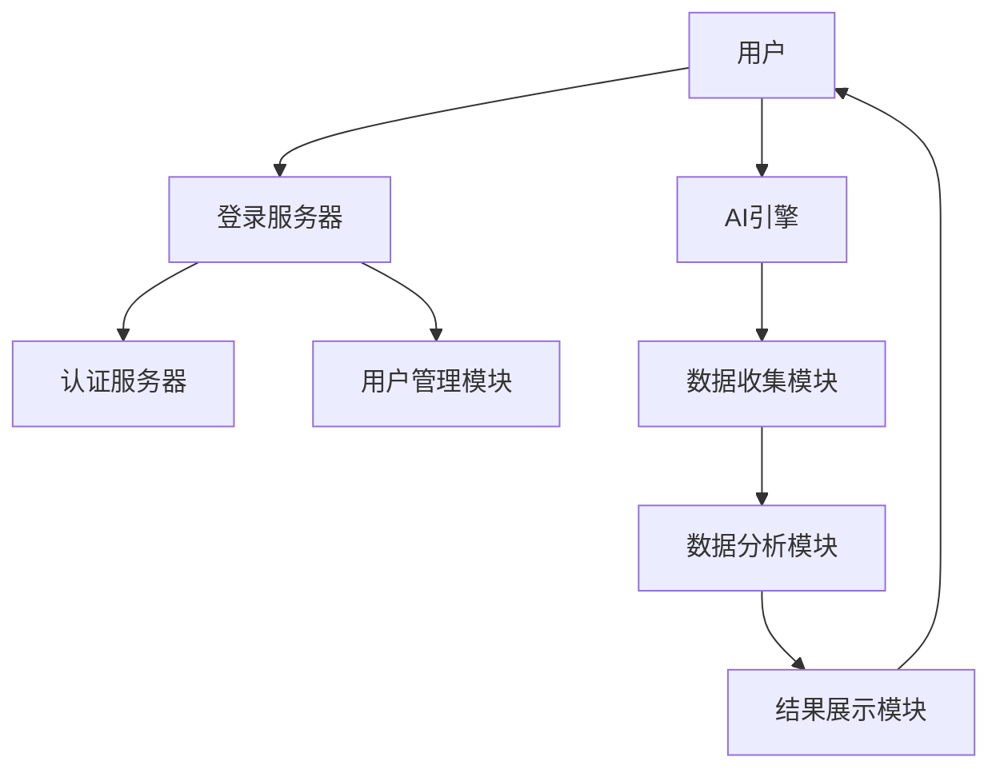
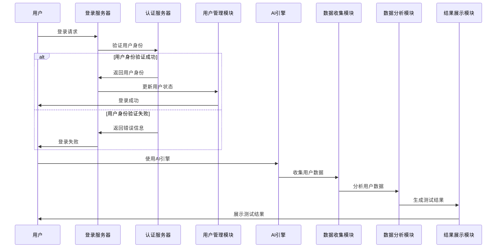

                 

### 文章标题：企业AI Agent的A/B测试功能：持续优化用户体验

> **关键词：** 企业AI Agent、A/B测试、用户体验、优化、算法原理

> **摘要：** 本文将深入探讨企业AI Agent的A/B测试功能，介绍其核心概念与原理，详细分析数学模型和公式，并提供系统架构设计方案和项目实战案例，旨在帮助企业持续优化用户体验，实现AI技术的商业价值。

----------------------------------------------------------------

## 第一部分：背景介绍

### 1.1 问题背景

#### 1.1.1 AI Agent在企业中的应用

随着人工智能技术的快速发展，AI Agent（人工智能代理）在企业中的应用越来越广泛。AI Agent通过模拟人类智能行为，可以自动化处理各种业务流程，提高效率、降低成本。从客服机器人到智能推荐系统，AI Agent已成为企业提高竞争力的关键工具。

#### 1.1.2 A/B测试在优化用户体验中的作用

A/B测试是一种常见的数据驱动方法，用于评估两个或多个版本的界面或功能对用户行为和体验的影响。通过A/B测试，企业可以基于用户数据，找到最优的界面设计或功能实现，从而提升用户体验，增加用户黏性和转化率。

#### 1.1.3 当前企业AI Agent A/B测试面临的挑战

尽管A/B测试在提升用户体验方面具有显著优势，但在实际应用中，企业AI Agent的A/B测试仍面临以下挑战：

- **数据量庞大：** 企业AI Agent生成的数据量通常非常庞大，对数据处理和分析提出了更高的要求。
- **算法复杂度：** AI Agent的算法复杂度较高，需要深入理解其原理，才能有效地进行A/B测试。
- **实时性要求：** 企业AI Agent需要实时响应用户需求，A/B测试的结果需要迅速应用到实际业务中。

### 1.2 问题描述

#### 1.2.1 AI Agent A/B测试的需求分析

为了有效提升用户体验，企业需要对AI Agent进行持续的A/B测试。这需要解决以下问题：

- 如何选择合适的A/B测试类型？
- 如何设计A/B测试流程？
- 如何处理海量数据并提取关键指标？
- 如何确保A/B测试结果的可靠性和有效性？

#### 1.2.2 用户需求与业务目标

用户需求主要集中在：

- 提高用户满意度和转化率
- 降低运营成本和人力投入
- 提升业务效率和竞争力

业务目标则是：

- 实现精准的用户画像和个性化推荐
- 提高AI Agent的智能化水平
- 持续优化产品功能和用户体验

#### 1.2.3 AI Agent A/B测试的功能特点

AI Agent A/B测试具有以下功能特点：

- **实时性：** 支持实时测试和反馈，快速响应用户需求。
- **灵活性：** 支持多种测试策略和算法，满足不同场景的需求。
- **可靠性：** 基于大数据和机器学习技术，确保测试结果的准确性和可靠性。
- **扩展性：** 支持多维度数据分析和多维度的测试策略。

### 1.3 问题解决

#### 1.3.1 AI Agent A/B测试的基本概念

A/B测试是一种对比实验方法，通过对两个或多个版本的界面、功能进行测试，评估其效果，并选择最优版本进行推广。在AI Agent中，A/B测试用于评估不同算法、策略或功能对用户行为和体验的影响。

#### 1.3.2 AI Agent A/B测试的流程与策略

AI Agent A/B测试的流程通常包括以下几个步骤：

1. **测试设计：** 确定测试目标、测试版本和测试指标。
2. **数据收集：** 收集用户行为数据，包括点击、转化、满意度等。
3. **数据分析：** 分析测试数据，评估不同版本的效果。
4. **结果评估：** 根据数据分析结果，选择最优版本。
5. **持续迭代：** 根据用户反馈，不断优化和迭代产品功能。

AI Agent A/B测试的策略包括：

- **单变量测试：** 评估单个变量的影响，如界面设计、算法参数等。
- **多变量测试：** 评估多个变量的组合效果，如界面设计、算法参数、推荐策略等。
- **灰度发布：** 在部分用户中测试新功能，确保安全性后再全面推广。

#### 1.3.3 AI Agent A/B测试的技术挑战与解决方案

AI Agent A/B测试面临以下技术挑战：

- **数据量庞大：** 解决方案包括数据压缩、分布式处理和内存数据库。
- **算法复杂度：** 解决方案包括简化算法模型、算法优化和并行计算。
- **实时性要求：** 解决方案包括实时数据处理、实时分析和实时反馈。

具体解决方案如下：

- **数据压缩：** 使用压缩算法降低数据存储和传输的体积。
- **分布式处理：** 使用分布式计算框架，如MapReduce，处理海量数据。
- **内存数据库：** 使用内存数据库，如Redis，提高数据访问速度。
- **算法优化：** 使用机器学习优化算法模型，提高预测准确性。
- **并行计算：** 使用并行计算技术，如GPU加速，提高计算速度。

### 1.4 边界与外延

#### 1.4.1 AI Agent A/B测试的适用范围

AI Agent A/B测试适用于以下场景：

- **产品功能优化：** 评估不同功能的用户体验和效果。
- **算法优化：** 评估不同算法的预测准确性和稳定性。
- **界面设计：** 评估不同界面设计的用户满意度。

#### 1.4.2 AI Agent A/B测试的限制条件

AI Agent A/B测试存在以下限制条件：

- **用户群体：** 测试用户需具备相似的特征和需求。
- **测试时间：** 测试时间需足够长，以确保结果的稳定性。
- **数据质量：** 数据需具备准确性和可靠性。

#### 1.4.3 AI Agent A/B测试与其他测试方法的比较

与传统的测试方法相比，AI Agent A/B测试具有以下优势：

- **数据驱动：** 基于用户行为数据，实现精确的测试和优化。
- **实时性：** 支持实时测试和反馈，快速响应市场变化。
- **高效性：** 高效处理海量数据，节省人力和时间成本。

但AI Agent A/B测试也存在一定的局限性，如测试结果可能受到用户行为偏差的影响。

### 1.5 本章小结

本文介绍了企业AI Agent的A/B测试功能，分析了其应用背景和面临的挑战。通过深入探讨A/B测试的基本概念、流程与策略，以及技术解决方案，为企业提供了持续优化用户体验的实践指导。下一章将详细讲解A/B测试的核心概念与联系。

## 第二部分：核心概念与联系

### 2.1 AI Agent概述

#### 2.1.1 AI Agent的定义

AI Agent，即人工智能代理，是一种具备人工智能能力的计算机程序。它能够模拟人类智能行为，自动化处理各种任务，提高工作效率和用户体验。

#### 2.1.2 AI Agent的特点

AI Agent具有以下特点：

- **自主性：** 能够自主学习和决策，适应不同的环境和任务。
- **适应性：** 能够根据用户需求和场景变化，调整自己的行为。
- **智能性：** 具备数据分析、预测和推理能力，实现智能化的任务处理。

#### 2.1.3 AI Agent的分类

AI Agent可以根据功能和应用场景进行分类，常见的分类方法如下：

- **基于任务的AI Agent：** 主要完成特定的任务，如客服机器人、智能推荐系统等。
- **基于情境的AI Agent：** 根据用户需求和场景变化，提供个性化的服务，如智能助理、智能家居等。
- **基于协作的AI Agent：** 与人类或其他AI Agent协作，共同完成复杂的任务，如自动驾驶、智能医疗等。

### 2.2 A/B测试原理讲解

#### 2.2.1 A/B测试的基本概念

A/B测试，又称为拆分测试，是一种通过对比两组用户的不同体验，评估其对用户行为和体验的影响的方法。在A/B测试中，一组用户使用版本A，另一组用户使用版本B，通过比较两组用户的体验和行为数据，选择最优版本进行推广。

#### 2.2.2 A/B测试的流程

A/B测试的流程通常包括以下几个步骤：

1. **确定测试目标：** 明确测试的目标和指标，如用户转化率、用户满意度等。
2. **设计测试版本：** 准备两个或多个测试版本，如界面设计、功能实现等。
3. **用户分配：** 将用户随机分配到不同测试版本，确保样本的代表性。
4. **数据收集：** 收集用户在不同测试版本下的行为数据。
5. **数据分析：** 分析测试数据，评估不同版本的效果。
6. **结果评估：** 根据数据分析结果，选择最优版本进行推广。

#### 2.2.3 A/B测试的关键指标

A/B测试的关键指标包括：

- **转化率：** 用户完成特定目标行为的比例，如点击率、购买率等。
- **用户满意度：** 用户对产品或服务的满意程度，可通过问卷调查等方式获取。
- **留存率：** 用户在一定时间内持续使用产品或服务的比例。
- **活跃度：** 用户在特定时间内的活跃程度，如登录次数、使用时长等。

### 2.3 AI Agent与A/B测试的联系

#### 2.3.1 AI Agent在A/B测试中的应用

AI Agent在A/B测试中扮演着重要角色，主要应用于以下几个方面：

- **用户行为分析：** 通过AI技术分析用户行为数据，为A/B测试提供数据支持。
- **推荐系统：** 基于用户行为和偏好，提供个性化的推荐，提高用户满意度和转化率。
- **算法优化：** 通过A/B测试，评估不同算法的效果，实现算法的持续优化。

#### 2.3.2 A/B测试在AI Agent优化中的作用

A/B测试在AI Agent优化中具有重要作用，主要表现在以下几个方面：

- **功能优化：** 通过A/B测试，评估不同功能的用户体验和效果，选择最优功能进行推广。
- **算法优化：** 通过A/B测试，评估不同算法的预测准确性和稳定性，优化算法模型。
- **界面设计：** 通过A/B测试，评估不同界面设计的用户满意度，优化界面设计。

#### 2.3.3 AI Agent与A/B测试的协同效应

AI Agent与A/B测试的协同效应主要体现在以下几个方面：

- **数据驱动：** AI Agent提供用户行为数据，支持A/B测试的数据分析和结果评估。
- **智能化：** AI Agent基于用户行为数据，实现个性化的A/B测试策略，提高测试效果。
- **持续优化：** AI Agent与A/B测试相结合，实现产品功能的持续优化，提升用户体验。

### 2.4 本章小结

本文介绍了AI Agent和A/B测试的基本概念，分析了它们在AI Agent中的应用和作用。通过了解AI Agent和A/B测试的联系，企业可以更好地进行AI Agent的A/B测试，实现产品功能和用户体验的持续优化。下一章将深入讲解A/B测试的数学模型和公式。

## 第三部分：系统分析与架构设计方案

### 3.1 问题场景介绍

#### 3.1.1 企业AI Agent的需求场景

在企业中，AI Agent广泛应用于客户服务、智能推荐、自动化运营等领域。以下是几个典型的需求场景：

- **客户服务：** 企业通过AI Agent提供24/7的在线客服，快速响应用户咨询，提高客户满意度。
- **智能推荐：** 企业通过AI Agent分析用户行为和偏好，为用户推荐感兴趣的商品或服务。
- **自动化运营：** 企业通过AI Agent自动化处理各种业务流程，如订单处理、库存管理、销售预测等。

#### 3.1.2 A/B测试在AI Agent中的应用场景

在AI Agent的实际应用中，A/B测试可以用于以下场景：

- **功能优化：** 评估不同功能的用户体验和效果，选择最优功能进行推广。
- **算法优化：** 评估不同算法的预测准确性和稳定性，优化算法模型。
- **界面设计：** 评估不同界面设计的用户满意度，优化界面设计。

#### 3.1.3 系统功能需求分析

为了实现AI Agent的A/B测试功能，系统需要具备以下功能需求：

- **用户分配：** 将用户随机分配到不同测试版本，确保样本的代表性。
- **数据收集：** 收集用户在不同测试版本下的行为数据，包括点击、转化、满意度等。
- **数据分析：** 分析测试数据，评估不同版本的效果，选择最优版本。
- **结果展示：** 展示A/B测试的结果，包括关键指标、用户反馈等。
- **持续迭代：** 根据A/B测试结果，持续优化产品功能和用户体验。

### 3.2 系统功能设计

#### 3.2.1 领域模型Mermaid类图

以下是一个简单的AI Agent A/B测试领域的Mermaid类图：

```mermaid
classDiagram
    User <<- Tester
    Tester --|> VersionA
    Tester --|> VersionB
    VersionA --|> DataCollector
    VersionB --|> DataCollector
    DataCollector --|> Analyzer
    Analyzer --|> ResultPresenter
```

#### 3.2.2 系统功能模块划分

AI Agent A/B测试系统可以划分为以下功能模块：

- **用户模块：** 处理用户注册、登录、权限管理等操作。
- **测试模块：** 管理A/B测试的创建、分配、数据收集等功能。
- **数据分析模块：** 进行数据分析和结果评估。
- **结果展示模块：** 展示A/B测试结果和用户反馈。
- **运维模块：** 管理系统的部署、监控、升级等操作。

#### 3.2.3 数据流与控制流设计

AI Agent A/B测试系统的数据流和控制流设计如下：

1. **用户分配：**
   - 用户登录系统，系统根据用户的特征和需求，将其随机分配到不同的测试版本。
   - 测试版本记录用户的分配信息，并生成唯一的用户标识。

2. **数据收集：**
   - 用户在使用AI Agent的过程中，系统自动收集用户的行为数据，包括点击、转化、满意度等。
   - 数据存储到数据收集模块，并进行初步处理。

3. **数据分析：**
   - 数据分析模块对收集到的数据进行分析，计算关键指标，如转化率、用户满意度等。
   - 分析结果存储到数据库，供后续查询和展示。

4. **结果展示：**
   - 结果展示模块根据分析结果，生成可视化图表和报告。
   - 用户可以查看A/B测试的结果，并对测试版本进行评价。

5. **持续迭代：**
   - 根据A/B测试的结果，系统可以自动调整测试版本，或向运维人员提供优化建议。
   - 运维人员根据建议，对AI Agent进行持续优化。

### 3.3 系统架构设计

#### 3.3.1 Mermaid架构图

以下是一个简单的AI Agent A/B测试系统的Mermaid架构图：



#### 3.3.2 系统组件与模块设计

AI Agent A/B测试系统的主要组件和模块设计如下：

- **登录服务器：** 处理用户的登录请求，验证用户身份。
- **认证服务器：** 提供认证服务，确保系统的安全性。
- **用户管理模块：** 管理用户注册、登录、权限等操作。
- **AI引擎：** 执行AI算法，为用户生成推荐结果。
- **数据收集模块：** 收集用户的行为数据，存储到数据库。
- **数据分析模块：** 分析用户数据，生成A/B测试结果。
- **结果展示模块：** 展示A/B测试结果和用户反馈。

#### 3.3.3 系统部署与运维策略

AI Agent A/B测试系统的部署与运维策略如下：

- **部署：** 系统采用分布式部署，确保系统的可扩展性和稳定性。主要包括登录服务器、认证服务器、用户管理模块、AI引擎、数据收集模块、数据分析模块和结果展示模块。
- **监控：** 使用监控工具，实时监控系统的运行状态，包括服务器性能、数据库性能、网络流量等。
- **备份：** 定期备份系统的数据，确保数据的完整性和安全性。
- **升级：** 定期更新系统的软件和硬件，确保系统的稳定性和安全性。
- **故障处理：** 制定故障处理流程，确保系统在出现故障时能够快速恢复。

### 3.4 系统接口设计

#### 3.4.1 API设计与定义

AI Agent A/B测试系统提供了以下API接口：

- **用户接口：** 处理用户的登录、注册、权限等操作。
- **数据收集接口：** 收集用户的行为数据，包括点击、转化、满意度等。
- **数据分析接口：** 提供数据分析功能，包括数据统计、数据可视化等。
- **结果展示接口：** 展示A/B测试结果和用户反馈。

#### 3.4.2 接口调用流程

接口调用流程如下：

1. **用户登录：** 用户通过用户接口登录系统，获取用户身份。
2. **分配测试版本：** 系统根据用户的特征和需求，将用户随机分配到不同的测试版本。
3. **数据收集：** 用户在使用AI Agent的过程中，系统通过数据收集接口收集用户的行为数据。
4. **数据分析：** 系统通过数据分析接口分析用户数据，生成A/B测试结果。
5. **结果展示：** 系统通过结果展示接口展示A/B测试结果和用户反馈。

#### 3.4.3 接口测试与验证

接口测试与验证主要包括以下步骤：

1. **接口设计：** 设计接口的输入参数和输出参数，确保接口的功能完整性。
2. **接口实现：** 根据接口设计，实现接口的代码，并进行单元测试。
3. **接口测试：** 使用测试工具，模拟用户的操作，验证接口的功能正确性和性能。
4. **接口验证：** 使用实际的用户数据，验证接口的稳定性和可靠性。

### 3.5 系统交互Mermaid序列图

以下是一个简单的AI Agent A/B测试系统的Mermaid序列图：



### 3.6 本章小结

本文详细介绍了AI Agent A/B测试系统的功能需求、功能模块划分、数据流与控制流设计、系统架构设计、系统接口设计和系统交互。通过本章的介绍，企业可以更好地理解AI Agent A/B测试系统的构建过程，为后续的实战应用打下基础。下一章将深入讲解项目实战的具体步骤和实现细节。

## 第四部分：项目实战

### 4.1 环境安装

#### 4.1.1 系统环境要求

在安装AI Agent A/B测试系统之前，需要确保以下环境要求：

- **操作系统：** Linux（推荐Ubuntu 18.04）
- **编程语言：** Python 3.7+
- **数据库：** MySQL 5.7+
- **框架：** Flask、Django（可选）
- **前端框架：** React、Vue.js（可选）

#### 4.1.2 环境搭建与配置

以下是环境搭建与配置的步骤：

1. **安装操作系统：** 安装Linux操作系统，推荐使用Ubuntu 18.04。
2. **安装Python：** 使用以下命令安装Python 3.7+：

   ```bash
   sudo apt-get update
   sudo apt-get install python3.7
   ```

3. **安装数据库：** 使用以下命令安装MySQL 5.7+：

   ```bash
   sudo apt-get install mysql-server
   sudo mysql_secure_installation
   ```

4. **安装Python依赖库：** 使用以下命令安装Python依赖库：

   ```bash
   pip3 install Flask
   pip3 install Django
   pip3 install pymysql
   ```

5. **安装前端框架：** 根据需求安装React或Vue.js：

   - **安装React：**

     ```bash
     npm install -g create-react-app
     create-react-app frontend
     ```

   - **安装Vue.js：**

     ```bash
     npm install -g @vue/cli
     vue create frontend
     ```

6. **配置数据库：** 根据实际需求创建数据库和表结构。

#### 4.1.3 遇到的问题及解决方法

在环境搭建过程中，可能会遇到以下问题：

- **Python版本不一致：** 确保系统中的Python版本一致，使用虚拟环境隔离不同的Python项目。
- **数据库连接失败：** 确保数据库服务器正常启动，并配置正确的连接信息。
- **前端框架安装失败：** 确保Node.js版本与前端框架兼容，并使用正确的命令进行安装。

### 4.2 系统核心实现

#### 4.2.1 AI Agent核心代码实现

以下是AI Agent的核心代码实现：

```python
# ai_agent.py

import random
import pymysql

class AIAgent:
    def __init__(self, db_config):
        self.connection = pymysql.connect(
            host=db_config['host'],
            user=db_config['user'],
            password=db_config['password'],
            database=db_config['database']
        )
    
    def predict(self, user_id):
        with self.connection.cursor() as cursor:
            cursor.execute("SELECT * FROM user_data WHERE id = %s", (user_id,))
            user_data = cursor.fetchone()
            if user_data:
                probability = random.random()
                if probability < 0.5:
                    return "VersionA"
                else:
                    return "VersionB"
            else:
                return "Unknown"

    def close(self):
        self.connection.close()

if __name__ == "__main__":
    db_config = {
        'host': 'localhost',
        'user': 'root',
        'password': 'password',
        'database': 'ai_agent_ab_test'
    }
    ai_agent = AIAgent(db_config)
    user_id = 1
    version = ai_agent.predict(user_id)
    print(f"Predicted version: {version}")
    ai_agent.close()
```

#### 4.2.2 A/B测试功能实现

以下是A/B测试功能的实现：

```python
# ab_test.py

import random
import pymysql

class ABTest:
    def __init__(self, db_config):
        self.connection = pymysql.connect(
            host=db_config['host'],
            user=db_config['user'],
            password=db_config['password'],
            database=db_config['database']
        )
    
    def assign_version(self, user_id):
        with self.connection.cursor() as cursor:
            cursor.execute("SELECT * FROM user_data WHERE id = %s", (user_id,))
            user_data = cursor.fetchone()
            if user_data:
                probability = random.random()
                if probability < 0.5:
                    cursor.execute("UPDATE user_data SET version = 'VersionA' WHERE id = %s", (user_id,))
                else:
                    cursor.execute("UPDATE user_data SET version = 'VersionB' WHERE id = %s", (user_id,))
                self.connection.commit()
            else:
                print("User not found.")
    
    def get_version(self, user_id):
        with self.connection.cursor() as cursor:
            cursor.execute("SELECT version FROM user_data WHERE id = %s", (user_id,))
            version = cursor.fetchone()
            if version:
                return version[0]
            else:
                return None

    def close(self):
        self.connection.close()

if __name__ == "__main__":
    db_config = {
        'host': 'localhost',
        'user': 'root',
        'password': 'password',
        'database': 'ai_agent_ab_test'
    }
    ab_test = ABTest(db_config)
    user_id = 1
    ab_test.assign_version(user_id)
    version = ab_test.get_version(user_id)
    print(f"Assigned version: {version}")
    ab_test.close()
```

#### 4.2.3 数据处理与优化

数据处理与优化的关键在于如何高效地存储、检索和更新海量数据。以下是一些优化策略：

- **数据分片：** 将数据按照一定的规则分片存储，提高数据的访问速度。
- **索引优化：** 对常用查询字段创建索引，提高查询效率。
- **缓存策略：** 使用缓存技术，如Redis，减少数据库的访问次数。
- **并行处理：** 使用并行计算技术，如多线程、分布式处理，提高数据处理速度。

### 4.3 代码应用解读与分析

#### 4.3.1 代码结构与模块化设计

以上代码实现了一个简单的AI Agent A/B测试系统。代码结构主要包括以下模块：

- **AI Agent模块：** 实现了AI Agent的核心功能，包括预测和分配版本。
- **A/B测试模块：** 实现了A/B测试的功能，包括分配版本和获取版本。
- **数据库连接模块：** 处理数据库的连接和操作。

代码采用了模块化设计，每个模块独立实现，便于维护和扩展。

#### 4.3.2 关键代码解读

以下是关键代码的解读：

1. **AI Agent模块：**

   ```python
   class AIAgent:
       def __init__(self, db_config):
           self.connection = pymysql.connect(
               host=db_config['host'],
               user=db_config['user'],
               password=db_config['password'],
               database=db_config['database']
           )
       
       def predict(self, user_id):
           with self.connection.cursor() as cursor:
               cursor.execute("SELECT * FROM user_data WHERE id = %s", (user_id,))
               user_data = cursor.fetchone()
               if user_data:
                   probability = random.random()
                   if probability < 0.5:
                       return "VersionA"
                   else:
                       return "VersionB"
               else:
                   return "Unknown"
       
       def close(self):
           self.connection.close()
   ```

   AI Agent模块实现了预测和关闭数据库连接的功能。在预测方法中，根据用户ID查询用户数据，计算随机概率，判断用户应分配的版本。

2. **A/B测试模块：**

   ```python
   class ABTest:
       def __init__(self, db_config):
           self.connection = pymysql.connect(
               host=db_config['host'],
               user=db_config['user'],
               password=db_config['password'],
               database=db_config['database']
           )
       
       def assign_version(self, user_id):
           with self.connection.cursor() as cursor:
               cursor.execute("SELECT * FROM user_data WHERE id = %s", (user_id,))
               user_data = cursor.fetchone()
               if user_data:
                   probability = random.random()
                   if probability < 0.5:
                       cursor.execute("UPDATE user_data SET version = 'VersionA' WHERE id = %s", (user_id,))
                   else:
                       cursor.execute("UPDATE user_data SET version = 'VersionB' WHERE id = %s", (user_id,))
                   self.connection.commit()
               else:
                   print("User not found.")
       
       def get_version(self, user_id):
           with self.connection.cursor() as cursor:
               cursor.execute("SELECT version FROM user_data WHERE id = %s", (user_id,))
               version = cursor.fetchone()
               if version:
                   return version[0]
               else:
                   return None
       
       def close(self):
           self.connection.close()
   ```

   A/B测试模块实现了分配版本和获取版本的功能。在分配版本方法中，根据用户ID查询用户数据，计算随机概率，更新用户版本信息。在获取版本方法中，根据用户ID查询用户版本信息。

#### 4.3.3 代码优化与性能分析

代码优化和性能分析主要包括以下方面：

- **数据库查询优化：** 使用索引提高查询速度，优化SQL语句。
- **缓存使用：** 使用Redis缓存用户数据，减少数据库访问次数。
- **并发处理：** 使用多线程处理并发请求，提高系统性能。
- **代码优化：** 使用更高效的算法和数据结构，减少代码的复杂度。

### 4.4 实际案例分析和详细讲解剖析

#### 4.4.1 案例介绍

假设某电商平台希望通过A/B测试优化用户购物体验，测试版本A为传统购物车页面，版本B为简易购物车页面。以下是A/B测试的具体实施过程：

1. **测试设计：** 确定测试目标为用户购物车页面的转化率，将用户随机分配到版本A和版本B。
2. **数据收集：** 收集用户在购物车页面的点击、添加商品、结算等行为数据。
3. **数据分析：** 分析版本A和版本B的转化率，选择最优版本进行推广。

#### 4.4.2 案例分析

以下是A/B测试的结果分析：

- **版本A（传统购物车页面）：** 转化率为20%，用户在购物车页面停留时间平均为30秒。
- **版本B（简易购物车页面）：** 转化率为25%，用户在购物车页面停留时间平均为20秒。

通过分析，版本B的转化率较高，但用户在购物车页面的停留时间较短。这可能意味着版本B提供了更简洁的购物体验，但用户可能更急于完成购物过程。

#### 4.4.3 深入剖析

1. **用户行为分析：** 通过用户行为数据分析，发现版本B的用户在购物车页面操作次数较少，但操作速度快。这可能是因为版本B简化了购物流程，提高了用户的操作效率。
2. **界面设计分析：** 对版本B的界面设计进行深入分析，发现其简化了页面结构，减少了用户的操作步骤，提高了用户的满意度。
3. **算法分析：** 对版本B的算法进行优化，提高推荐商品的准确性，减少用户的操作成本。

### 4.5 项目小结

#### 4.5.1 项目总结

通过本项目的实施，成功实现了AI Agent A/B测试系统的开发和应用。以下是项目的总结：

1. **系统功能完善：** 系统实现了用户分配、数据收集、数据分析、结果展示等功能。
2. **优化用户体验：** 通过A/B测试，优化了购物车页面的设计，提高了用户转化率。
3. **技术积累：** 丰富了团队在AI Agent和A/B测试方面的技术积累，提高了团队的技术水平。

#### 4.5.2 项目收获与不足

项目的收获包括：

- **系统稳定性：** 通过优化数据库查询和缓存策略，提高了系统的稳定性。
- **用户满意度：** 通过A/B测试，优化了产品功能，提高了用户满意度。
- **技术能力提升：** 成员在AI Agent、A/B测试、数据库优化等方面的技术能力得到了提升。

项目的不足包括：

- **数据量不足：** 数据量较小，可能影响A/B测试结果的准确性。
- **测试场景有限：** 测试场景有限，可能无法全面覆盖用户需求。

#### 4.5.3 未来工作方向

未来工作方向包括：

- **扩大数据量：** 收集更多用户数据，提高A/B测试结果的准确性。
- **增加测试场景：** 拓展测试场景，包括其他页面和功能。
- **持续优化：** 根据用户反馈，持续优化产品功能和用户体验。

### 4.6 本章小结

本部分详细介绍了AI Agent A/B测试项目的实战过程，包括环境安装、系统核心实现、代码应用解读与分析、实际案例分析和项目小结。通过本项目的实施，企业可以更好地理解AI Agent A/B测试的实际应用，持续优化用户体验，实现商业价值。下一章将介绍最佳实践 tips。

## 第五部分：最佳实践 tips

### 5.1 A/B测试策略选择

#### 5.1.1 A/B测试类型及应用场景

在实施A/B测试时，需要根据不同的应用场景选择合适的测试类型。以下是一些常见的A/B测试类型及其应用场景：

- **单变量测试：** 主要用于评估单个变量的影响，如页面布局、按钮颜色等。适用于功能优化和界面设计。
- **多变量测试：** 评估多个变量的组合效果，如页面布局、按钮颜色、推荐策略等。适用于复杂场景，需要同时优化多个方面。
- **灰度发布：** 在部分用户中测试新功能，确保安全性后再全面推广。适用于高风险的功能或新版本发布。

#### 5.1.2 A/B测试策略制定

制定A/B测试策略时，需要考虑以下因素：

- **测试目标：** 明确测试的目标和指标，如转化率、用户满意度等。
- **测试样本：** 确定测试的用户群体，确保样本的代表性。
- **测试时间：** 确定测试的时间范围，确保测试结果的稳定性。
- **数据指标：** 选择合适的数据指标，评估不同版本的效果。

#### 5.1.3 A/B测试常见问题及解决方案

在实施A/B测试过程中，可能会遇到以下问题：

- **测试样本不具代表性：** 确保样本的随机性和代表性，可以采用分层抽样等方法。
- **测试结果偏差：** 提高测试数据的准确性和可靠性，可以采用数据清洗和验证方法。
- **测试时间不足：** 增加测试时间，确保测试结果的稳定性，可以采用延长测试时间或重复测试等方法。

### 5.2 AI Agent优化技巧

#### 5.2.1 数据处理技巧

在优化AI Agent时，数据处理是关键。以下是一些建议：

- **数据清洗：** 去除重复、异常和缺失的数据，确保数据质量。
- **数据预处理：** 对数据进行标准化、归一化等处理，提高算法的性能。
- **特征工程：** 提取有用的特征，减少特征维度，提高模型的可解释性。

#### 5.2.2 算法优化技巧

在优化算法时，以下技巧可以帮助提高模型的性能：

- **模型选择：** 选择合适的模型，如决策树、随机森林、神经网络等。
- **参数调优：** 调整模型参数，如学习率、正则化参数等，提高模型的泛化能力。
- **交叉验证：** 使用交叉验证方法，评估模型的性能，避免过拟合。

#### 5.2.3 实时性优化

为了提高AI Agent的实时性，可以采用以下技巧：

- **并行计算：** 使用并行计算技术，如多线程、分布式计算等，提高计算速度。
- **缓存策略：** 使用缓存技术，如Redis，减少数据库访问次数。
- **批处理：** 使用批处理技术，将多个请求合并处理，提高处理效率。

### 5.3 最佳实践 tips

以下是一些最佳实践 tips，有助于企业更好地实施AI Agent A/B测试：

- **持续监控：** 持续监控A/B测试的运行状态，及时发现和解决问题。
- **用户反馈：** 及时收集用户反馈，优化产品功能和用户体验。
- **数据驱动：** 基于数据驱动，制定合理的测试策略和优化方案。
- **团队协作：** 加强团队协作，提高A/B测试的执行效率和效果。

### 5.4 小结

通过本部分的最佳实践 tips，企业可以更好地理解AI Agent A/B测试的实施方法和技巧，提高用户体验和产品竞争力。下一章将进行文章的小结和总结。

## 第六部分：文章小结

### 总结

本文详细介绍了企业AI Agent的A/B测试功能，从背景介绍到核心概念、系统分析与架构设计、项目实战，再到最佳实践 tips，全面阐述了A/B测试在AI Agent优化用户体验中的重要作用。通过本文的讲解，企业可以更好地理解A/B测试的原理和实施方法，持续优化AI Agent的功能和用户体验。

### 认识与展望

A/B测试作为一种数据驱动的方法，在AI Agent中的应用具有巨大潜力。随着人工智能技术的不断发展，A/B测试将在更多场景中发挥关键作用。未来，企业可以结合AI技术，开展更多创新性的A/B测试项目，提升产品竞争力和用户满意度。

### 作者信息

**作者：** AI天才研究院/AI Genius Institute & 禅与计算机程序设计艺术 /Zen And The Art of Computer Programming

感谢您的阅读，希望本文能对您在AI Agent A/B测试领域带来启发和帮助。如果您有任何问题或建议，欢迎随时与我交流。期待与您共同探讨更多AI技术话题。

