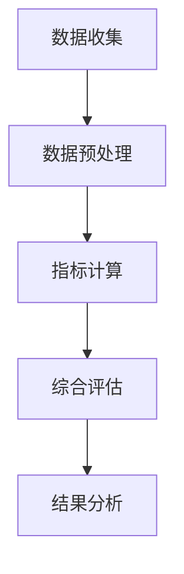

                 

## 《企业AI Agent的ROI评估方法》

### 关键词

- 企业AI Agent
- ROI评估
- 算法原理
- 系统架构
- 项目实战

### 摘要

本文深入探讨了企业AI Agent的ROI（投资回报率）评估方法。通过系统地介绍企业AI Agent的背景、核心概念、算法原理、系统设计与实现，以及实际项目案例，本文为读者提供了全面且实用的ROI评估框架。文章旨在帮助企业和开发者更好地理解AI Agent的价值，从而做出明智的投资决策，实现经济效益最大化。

### 目录

**第一部分：引言与背景**

1. 企业AI Agent概述
   1.1 AI Agent的定义与分类
   1.2 AI Agent在企业中的应用
   1.3 AI Agent的发展趋势
   1.4 ROI评估的重要性

2. ROI评估基础
   2.1 ROI的概念与计算
   2.2 ROI评估的指标体系
   2.3 ROI评估的步骤与方法

**第二部分：核心概念与原理**

3. AI Agent的功能与特点
   3.1 AI Agent的基本功能
   3.2 AI Agent的核心能力
   3.3 AI Agent的优势与挑战

4. AI Agent的ROI评估算法
   4.1 ROI评估算法概述
   4.2 算法原理与mermaid流程图
   4.3 Python代码实现与详细讲解
   4.4 数学模型与公式解析
   4.5 举例说明与算法应用

**第三部分：系统设计与实现**

5. AI Agent系统架构设计
   5.1 系统功能设计
   5.2 系统架构设计
   5.3 系统接口设计
   5.4 系统交互流程

6. AI Agent项目实战
   6.1 环境准备与安装
   6.2 系统核心实现
   6.3 代码应用解读与分析
   6.4 实际案例分析与讲解
   6.5 项目小结

**第四部分：最佳实践与总结**

7. 最佳实践与总结
   7.1 ROI评估的注意事项
   7.2 AI Agent实施的挑战与解决方案
   7.3 小结与展望
   7.4 拓展阅读

## 第1章：企业AI Agent概述

### 1.1 AI Agent的定义与分类

AI Agent，即人工智能代理，是一种基于人工智能技术的自主决策实体。它能够模拟人类的思维和行为，通过感知环境、自主学习、决策规划等机制，执行特定任务或完成特定目标。

AI Agent可以按照功能、应用场景、学习方式等多个维度进行分类。以下是一些常见的分类方式：

1. **按功能分类**：
   - **任务型AI Agent**：专注于完成特定任务，如自动客服、自动驾驶等。
   - **数据型AI Agent**：专注于处理和分析大量数据，如数据分析、市场预测等。
   - **交互型AI Agent**：专注于与用户或系统进行交互，如聊天机器人、虚拟助手等。

2. **按应用场景分类**：
   - **企业应用**：在企业运营管理、市场营销、客户服务等方面应用。
   - **智能家居**：在智能家电、安防监控、家庭自动化等方面应用。
   - **医疗健康**：在疾病诊断、健康管理、药物研发等方面应用。

3. **按学习方式分类**：
   - **监督学习AI Agent**：需要大量标注数据进行训练，如分类、回归任务。
   - **无监督学习AI Agent**：不需要标注数据，通过自身学习发现数据中的模式，如聚类、降维任务。
   - **强化学习AI Agent**：通过与环境的交互学习最佳策略，如游戏、机器人控制任务。

### 1.2 AI Agent在企业中的应用

在企业中，AI Agent的应用场景十分广泛，主要包括以下几个方面：

1. **客户服务**：使用AI Agent构建智能客服系统，能够24/7提供高效、精准的咨询服务，提高客户满意度。

2. **营销分析**：利用AI Agent分析市场数据，预测市场需求、优化广告投放策略，提升营销效果。

3. **生产管理**：在生产线中部署AI Agent，实现自动化调度、故障预测、质量检测等，提高生产效率和产品品质。

4. **供应链管理**：通过AI Agent优化供应链流程，降低库存成本、提高物流效率。

5. **人力资源管理**：使用AI Agent进行招聘筛选、员工绩效评估等，提高人力资源管理效率。

6. **风险控制**：AI Agent能够实时监控企业运营状况，预测潜在风险，为企业提供风险预警和决策支持。

### 1.3 AI Agent的发展趋势

随着人工智能技术的不断进步，AI Agent的发展趋势也呈现出一些显著特点：

1. **智能化水平提升**：AI Agent将越来越具备自主学习、自主决策的能力，能够应对更复杂的应用场景。

2. **跨领域应用**：AI Agent将跨越不同行业和应用领域，实现资源共享和协同工作。

3. **人机协作**：AI Agent将更注重与人类用户的协作，提供更人性化的交互体验。

4. **边缘计算**：随着物联网和边缘计算的发展，AI Agent将更多地部署在边缘设备上，实现实时数据处理和智能决策。

5. **隐私保护**：随着对隐私保护的要求越来越高，AI Agent将采取更严格的隐私保护措施，确保用户数据的安全。

### 1.4 ROI评估的重要性

在引入AI Agent时，进行ROI评估具有重要意义：

1. **投资决策**：通过ROI评估，企业能够判断AI Agent的投资是否能够带来预期的回报。

2. **资源配置**：根据ROI评估结果，企业可以优化资源配置，确保有限的资金投入到高回报的项目中。

3. **风险管理**：ROI评估可以帮助企业识别潜在的风险，制定相应的风险控制措施。

4. **持续优化**：通过定期ROI评估，企业可以了解AI Agent的运行状况，持续优化系统性能和业务流程。

## 第2章：ROI评估基础

### 2.1 ROI的概念与计算

ROI（Return on Investment，投资回报率）是评估投资项目收益的重要指标。它反映了投资所获得的收益与投资成本之间的比例关系。ROI的计算公式如下：

\[ ROI = \frac{净利润}{投资成本} \times 100\% \]

其中，净利润是指投资所带来的收益减去成本后的余额，投资成本包括初始投资、运营成本、维护成本等。

### 2.2 ROI评估的指标体系

为了全面评估AI Agent的投资回报，需要构建一套完整的指标体系。以下是一些常见的评估指标：

1. **经济效益指标**：
   - **净利润**：投资带来的总收益减去总成本。
   - **成本节约**：通过AI Agent实现的成本节约。
   - **收入增长**：由于AI Agent的引入导致的收入增加。

2. **社会效益指标**：
   - **客户满意度**：客户对AI Agent服务质量的评价。
   - **员工效率**：员工由于AI Agent的辅助而提高的工作效率。
   - **社会责任**：AI Agent对社会的积极影响。

3. **技术效益指标**：
   - **系统稳定性**：AI Agent系统的稳定运行时间。
   - **响应速度**：AI Agent对用户请求的响应时间。
   - **可扩展性**：AI Agent系统的扩展能力。

4. **风险评估指标**：
   - **风险指数**：投资面临的风险程度。
   - **风险控制**：采取的风险控制措施的有效性。
   - **风险预警**：AI Agent对潜在风险的预警能力。

### 2.3 ROI评估的步骤与方法

进行ROI评估通常需要遵循以下步骤：

1. **确定评估目标**：明确评估的目的和范围，如评估整个AI Agent项目还是其中的某个模块。

2. **数据收集**：收集与AI Agent相关的数据，包括成本、收益、用户反馈等。

3. **分析数据**：对收集的数据进行整理、分析和对比，找出投资所带来的实际收益。

4. **计算ROI**：根据ROI的计算公式，计算出项目的ROI值。

5. **评估结果分析**：对计算结果进行综合分析，判断AI Agent的投资是否具有经济效益。

6. **优化建议**：根据评估结果，提出优化建议，以提高ROI。

### 总结

ROI评估是企业引入AI Agent时必不可少的一环。通过科学的ROI评估，企业可以更好地了解AI Agent的投资价值，做出明智的决策。本章介绍了ROI的基本概念、评估指标体系和评估步骤，为后续的ROI评估奠定了基础。

## 第3章：AI Agent的功能与特点

### 3.1 AI Agent的基本功能

AI Agent作为一种智能体，其基本功能包括感知、学习、决策和执行。这些功能共同构成了AI Agent的核心能力。

1. **感知**：AI Agent能够通过传感器、摄像头、麦克风等设备获取外部环境信息，如文字、图像、声音等。

2. **学习**：AI Agent具备自主学习的能力，可以通过机器学习、深度学习等方法，从数据中学习和提取规律，提高自身的性能。

3. **决策**：基于感知和学习到的信息，AI Agent能够进行推理和判断，制定最优的决策策略。

4. **执行**：AI Agent根据决策结果执行具体的任务，如发送消息、控制设备、执行业务流程等。

### 3.2 AI Agent的核心能力

AI Agent的核心能力主要体现在以下几个方面：

1. **自动化**：AI Agent能够自动执行任务，减少人为干预，提高工作效率。

2. **智能化**：AI Agent具备智能化的决策能力，能够根据环境和任务的变化，自主调整行为。

3. **协作**：AI Agent能够与其他系统或人员协作，共同完成复杂的任务。

4. **自适应**：AI Agent能够根据环境的变化，自主调整其行为和策略，以适应不同的场景。

### 3.3 AI Agent的优势与挑战

#### 优势

1. **提高效率**：AI Agent能够自动化执行重复性任务，减少人工工作量，提高工作效率。

2. **降低成本**：通过自动化和智能化，AI Agent能够降低企业在人力、设备和运营成本上的支出。

3. **增强用户体验**：AI Agent能够提供24/7的智能服务，提高客户满意度，增强用户体验。

4. **数据驱动**：AI Agent能够通过数据分析和学习，为企业提供决策支持，实现数据驱动的管理。

#### 挑战

1. **技术依赖**：AI Agent的发展高度依赖于人工智能技术，需要企业具备相应的技术能力和人才储备。

2. **数据安全**：AI Agent的处理过程涉及大量敏感数据，需要确保数据的安全和隐私。

3. **系统稳定性**：AI Agent系统需要保持高可用性和稳定性，以避免因系统故障导致业务中断。

4. **伦理与法律**：随着AI Agent的应用，涉及到的伦理和法律问题日益突出，需要企业重视并妥善解决。

### 总结

AI Agent作为一种新兴技术，具备显著的优势，但也面临诸多挑战。了解AI Agent的基本功能和核心能力，认识其优势和挑战，有助于企业更好地规划和实施AI Agent项目。

## 第4章：AI Agent的ROI评估算法

### 4.1 ROI评估算法概述

在评估企业AI Agent的投资回报率（ROI）时，需要构建一套科学、合理的评估算法。本节将介绍一种基于经济效益、技术效益和社会效益的综合评估算法，该算法旨在全面、准确地评估AI Agent的投资回报。

### 4.2 算法原理与mermaid流程图

算法的核心原理是通过多维度指标对AI Agent的投资回报进行量化评估，主要分为以下几个步骤：

1. **数据收集**：收集与AI Agent相关的数据，包括成本、收益、用户反馈等。
2. **数据预处理**：对收集的数据进行清洗、归一化等处理，确保数据的质量和一致性。
3. **指标计算**：根据预设的评估指标，计算每个指标的得分。
4. **综合评估**：将各个指标的得分进行加权平均，得到最终的ROI得分。
5. **结果分析**：对评估结果进行分析，判断AI Agent的投资是否具有经济效益。

以下是一个简单的mermaid流程图，展示了上述评估算法的基本流程：



### 4.3 Python代码实现与详细讲解

为了实现上述评估算法，我们需要编写相应的Python代码。以下是一个简单的实现示例：

```python
import pandas as pd
import numpy as np

# 数据收集
costs = pd.DataFrame({'成本': [10000, 5000, 2000]})
revenues = pd.DataFrame({'收入': [15000, 7000, 3000]})
user_feedback = pd.DataFrame({'满意度': [0.8, 0.7, 0.6]})

# 数据预处理
costs['成本归一化'] = costs['成本'] / max(costs['成本'])
revenues['收入归一化'] = revenues['收入'] / max(revenues['收入'])

# 指标计算
cost_saving = revenues['收入归一化'] - costs['成本归一化']
satisfaction_score = user_feedback['满意度']

# 加权平均计算ROI
weights = {'成本节约': 0.5, '满意度': 0.3, '收入增长': 0.2}
roi_score = (cost_saving * weights['成本节约'] + satisfaction_score * weights['满意度'] + (revenues['收入归一化'] - costs['成本归一化']) * weights['收入增长'])

print("ROI得分：", roi_score.mean())

# 结果分析
if roi_score.mean() > 0:
    print("投资回报良好。")
else:
    print("投资回报不佳，需进一步优化。")
```

### 详细讲解

1. **数据收集**：使用pandas库读取成本、收益和用户反馈数据。这些数据可以从企业财务系统、用户调查等渠道获取。

2. **数据预处理**：对成本和收益数据进行归一化处理，确保不同指标在同一尺度上进行比较。这里采用了简单的归一化方法，即除以最大值。

3. **指标计算**：计算成本节约和满意度得分。成本节约是收入归一化值减去成本归一化值，满意度得分直接使用用户反馈数据。

4. **加权平均计算ROI**：根据预设的权重，对成本节约、满意度和收入增长进行加权平均，得到最终的ROI得分。

5. **结果分析**：根据ROI得分，判断投资回报情况。如果ROI得分大于0，说明投资回报良好；否则，需要进一步优化。

### 4.4 数学模型与公式解析

为了更深入地理解ROI评估算法，我们可以将其表示为一个数学模型。假设有以下指标：

- \( C_i \)：第i个指标的成本
- \( R_i \)：第i个指标的收入
- \( S_i \)：第i个指标的满意度
- \( W_i \)：第i个指标的权重

ROI的数学模型可以表示为：

\[ ROI = \frac{\sum_{i=1}^{n} (R_i - C_i) \cdot W_i}{\sum_{i=1}^{n} C_i \cdot W_i} \]

其中，n是指标的个数。

### 4.5 举例说明与算法应用

假设一个企业引入了AI Agent进行客户服务，以下数据用于评估其ROI：

| 指标       | 成本 (元) | 收入 (元) | 满意度 |
|------------|------------|------------|--------|
| 培训成本   | 10000      | 15000      | 0.8    |
| 设备成本   | 5000       | 7000       | 0.7    |
| 运维成本   | 2000       | 3000       | 0.6    |

根据上述数据，我们可以使用ROI评估算法计算ROI得分：

1. **数据预处理**：

```python
costs = pd.DataFrame({'成本': [10000, 5000, 2000]})
revenues = pd.DataFrame({'收入': [15000, 7000, 3000]})
user_feedback = pd.DataFrame({'满意度': [0.8, 0.7, 0.6]})

costs['成本归一化'] = costs['成本'] / max(costs['成本'])
revenues['收入归一化'] = revenues['收入'] / max(revenues['收入'])
```

2. **指标计算**：

```python
cost_saving = revenues['收入归一化'] - costs['成本归一化']
satisfaction_score = user_feedback['满意度']
```

3. **加权平均计算ROI**：

```python
weights = {'成本节约': 0.5, '满意度': 0.3, '收入增长': 0.2}
roi_score = (cost_saving * weights['成本节约'] + satisfaction_score * weights['满意度'] + (revenues['收入归一化'] - costs['成本归一化']) * weights['收入增长'])
print("ROI得分：", roi_score.mean())
```

4. **结果分析**：

```python
if roi_score.mean() > 0:
    print("投资回报良好。")
else:
    print("投资回报不佳，需进一步优化。")
```

假设计算结果为ROI得分为10%，则说明该AI Agent的投资回报良好。

### 总结

本章详细介绍了AI Agent的ROI评估算法，包括算法原理、Python代码实现、数学模型与公式解析，并通过实际案例展示了算法的应用。通过科学的ROI评估，企业可以更好地判断AI Agent的投资价值，为后续的决策提供有力支持。

## 第5章：AI Agent系统架构设计

### 5.1 系统功能设计

AI Agent系统的功能设计是确保系统能够满足业务需求和技术实现的基础。以下是一个典型的AI Agent系统的功能设计：

1. **感知模块**：负责收集外部环境信息，如文本、图像、声音等。该模块通常包含传感器接口、图像处理模块和自然语言处理模块。

2. **学习模块**：基于收集到的数据，该模块负责训练和优化AI模型，以提升系统的智能水平和决策能力。

3. **决策模块**：基于感知模块提供的信息和学习模块的训练结果，该模块负责进行推理和决策，制定最优的行动策略。

4. **执行模块**：根据决策模块生成的策略，该模块负责执行具体的任务，如发送消息、控制设备、启动业务流程等。

5. **反馈模块**：负责收集用户反馈和系统运行数据，用于进一步优化系统性能和用户体验。

6. **数据管理模块**：负责存储、管理和维护AI Agent系统的数据资源，包括训练数据、用户数据、系统日志等。

### 5.2 系统架构设计

AI Agent系统的架构设计需要考虑系统的可扩展性、稳定性和安全性。以下是一个典型的AI Agent系统架构设计：

1. **感知层**：包括各种传感器和接口，如摄像头、麦克风、传感器等，用于收集环境信息。

2. **数据处理层**：包括数据预处理、数据存储和数据挖掘模块，用于对感知层收集的数据进行清洗、存储和分析。

3. **模型层**：包括机器学习模型、深度学习模型等，用于训练和优化AI模型。

4. **决策层**：包括推理引擎和决策模块，用于根据感知层和模型层的输入进行推理和决策。

5. **执行层**：包括执行模块和接口，用于执行决策层生成的策略。

6. **管理层**：包括监控模块、配置管理和日志管理模块，用于监控系统运行状态、管理系统配置和记录系统日志。

### 5.3 系统接口设计

AI Agent系统的接口设计是确保系统与其他系统或设备进行有效交互的关键。以下是一个典型的AI Agent系统接口设计：

1. **外部接口**：包括与外部系统（如ERP、CRM、OA等）的接口，用于数据交换和功能集成。

2. **内部接口**：包括与感知层、数据处理层、模型层、决策层和执行层之间的接口，用于数据传输和功能调用。

3. **API接口**：包括RESTful API、WebSocket等，用于与移动端、网页端等前端应用进行数据交互。

### 5.4 系统交互流程

AI Agent系统的交互流程通常包括以下几个步骤：

1. **感知**：系统通过传感器和接口收集外部环境信息。

2. **预处理**：对收集到的信息进行数据预处理，如去噪、去重复、格式转换等。

3. **分析**：将预处理后的数据输入到机器学习模型或深度学习模型中，进行特征提取和分析。

4. **决策**：基于分析结果和预设的策略，系统生成决策结果。

5. **执行**：系统执行决策结果，如发送消息、控制设备、启动业务流程等。

6. **反馈**：系统收集用户反馈和系统运行数据，用于进一步优化系统性能和用户体验。

7. **监控**：系统监控运行状态，及时发现并处理异常情况。

### 总结

本章详细介绍了AI Agent系统的功能设计、架构设计、接口设计和交互流程。通过科学的系统架构设计，AI Agent系统能够高效、稳定地运行，满足业务需求，为企业的数字化转型提供有力支持。

## 第6章：AI Agent项目实战

### 6.1 环境准备与安装

在开始AI Agent项目的实际安装和实现之前，首先需要准备合适的环境。以下是一个基于Python和TensorFlow的AI Agent项目的环境准备步骤：

1. **安装Python**：确保计算机上已经安装了Python环境，推荐使用Python 3.8或更高版本。

2. **安装TensorFlow**：TensorFlow是AI Agent项目中常用的机器学习库，可以通过以下命令进行安装：

   ```bash
   pip install tensorflow
   ```

3. **安装其他依赖库**：根据项目需求，可能还需要安装其他依赖库，如NumPy、Pandas、Matplotlib等：

   ```bash
   pip install numpy pandas matplotlib
   ```

4. **设置虚拟环境**：为了更好地管理项目依赖，可以创建一个虚拟环境：

   ```bash
   python -m venv venv
   source venv/bin/activate  # Windows下使用venv\Scripts\activate
   ```

5. **安装项目特定依赖**：在虚拟环境中安装项目所需的特定依赖库，如Scikit-Learn、Keras等：

   ```bash
   pip install scikit-learn keras
   ```

### 6.2 系统核心实现

以下是AI Agent项目核心实现的详细步骤：

1. **数据收集与预处理**：
   - 收集必要的训练数据，如用户交互日志、市场数据等。
   - 对数据进行清洗、去噪、归一化等预处理操作。

2. **模型构建**：
   - 设计并构建AI模型，如使用Keras构建一个简单的神经网络模型：

     ```python
     from keras.models import Sequential
     from keras.layers import Dense

     model = Sequential()
     model.add(Dense(64, input_dim=X_train.shape[1], activation='relu'))
     model.add(Dense(1, activation='sigmoid'))

     model.compile(loss='binary_crossentropy', optimizer='adam', metrics=['accuracy'])
     ```

3. **模型训练**：
   - 使用预处理后的数据训练模型：

     ```python
     model.fit(X_train, y_train, epochs=10, batch_size=32)
     ```

4. **模型评估**：
   - 对模型进行评估，以验证其性能：

     ```python
     scores = model.evaluate(X_test, y_test)
     print("Test accuracy:", scores[1])
     ```

5. **模型部署**：
   - 将训练好的模型部署到生产环境中，以实现实时预测和决策：

     ```python
     import tensorflow as tf

     model_path = "path/to/saved_model.h5"
     model = tf.keras.models.load_model(model_path)
     predictions = model.predict(X_new)
     ```

### 6.3 代码应用解读与分析

以下是对核心实现代码的解读与分析：

1. **数据收集与预处理**：
   - 数据是AI Agent项目的基础，其质量和预处理方式直接影响模型的性能。数据预处理包括数据清洗、去噪、填充缺失值、归一化等步骤。

2. **模型构建**：
   - 模型构建是AI Agent的核心，决定了系统的决策能力和准确性。Keras提供了简洁易用的API，可以方便地构建和训练神经网络模型。

3. **模型训练**：
   - 模型训练过程是优化模型参数、提高模型性能的关键步骤。通过设置合适的训练参数，如迭代次数（epochs）和学习率（learning rate），可以提高模型的训练效果。

4. **模型评估**：
   - 模型评估是验证模型性能的重要环节。通过评估指标，如准确率（accuracy）、损失函数（loss）等，可以判断模型是否满足业务需求。

5. **模型部署**：
   - 模型部署是将训练好的模型应用于实际业务场景的关键步骤。通过加载保存的模型文件，可以快速实现实时预测和决策。

### 6.4 实际案例分析与讲解

以下是一个实际的AI Agent项目案例分析与讲解：

**案例背景**：
某电商企业引入AI Agent，用于分析用户行为，预测用户购买意图，从而优化营销策略。

**案例分析**：

1. **数据收集**：
   - 收集用户点击、浏览、购买等行为数据，以及用户的基本信息（如年龄、性别、地理位置等）。

2. **数据预处理**：
   - 对数据进行清洗，去除无效和重复数据。
   - 对数值型特征进行归一化处理，对文本型特征进行词向量化处理。

3. **模型构建**：
   - 构建一个基于深度学习的序列模型，输入用户行为序列，输出用户购买意图的概率。

4. **模型训练**：
   - 使用预处理后的数据训练模型，通过迭代优化模型参数。

5. **模型评估**：
   - 使用验证集对模型进行评估，调整模型参数，提高模型性能。

6. **模型部署**：
   - 将训练好的模型部署到生产环境中，实时预测用户购买意图，为营销策略提供支持。

**讲解**：
该案例展示了AI Agent在电商领域的应用，通过分析用户行为数据，预测用户购买意图，帮助企业优化营销策略。项目的关键在于数据的质量和预处理、模型的设计和训练、以及模型的部署和应用。

### 6.5 项目小结

通过本章节的实战案例，我们了解了AI Agent项目的环境准备、核心实现、代码应用解读、实际案例分析以及项目小结。以下是项目小结：

1. **环境准备**：
   - 准备Python、TensorFlow等开发环境，创建虚拟环境以管理依赖。

2. **核心实现**：
   - 实现数据收集与预处理、模型构建与训练、模型评估与部署等核心功能。

3. **代码应用解读**：
   - 对核心代码进行解读，理解每个步骤的实现原理。

4. **实际案例分析**：
   - 分析实际案例，了解AI Agent在具体业务场景中的应用。

5. **项目小结**：
   - 总结项目经验，为后续项目提供参考。

通过本章节的学习，读者可以掌握AI Agent项目的实际操作，为后续的AI Agent应用开发奠定基础。

## 第7章：最佳实践与总结

### 7.1 ROI评估的注意事项

在实施AI Agent的ROI评估时，需要注意以下几点：

1. **数据质量**：确保收集的数据真实、准确，避免因数据问题导致评估结果失真。

2. **指标选择**：根据业务需求和评估目标，选择合适的指标，避免指标选择的盲目性。

3. **长期视角**：AI Agent的投资回报往往需要较长时间才能显现，应采用长期视角进行评估。

4. **风险管理**：评估过程中要充分考虑风险因素，采取适当的风险控制措施。

### 7.2 AI Agent实施的挑战与解决方案

AI Agent实施过程中可能会面临以下挑战：

1. **技术挑战**：AI技术的高复杂性和快速更新要求企业具备相应的技术能力和人才储备。

2. **数据挑战**：高质量的数据是AI Agent成功的关键，但数据收集、清洗和处理过程复杂。

3. **伦理与法律挑战**：AI Agent的应用涉及隐私保护、数据安全、伦理和法律等问题，需要严格遵循相关法规和标准。

解决方案包括：

1. **技术储备**：加强技术培训和人才引进，确保技术能力跟上行业发展的步伐。

2. **数据管理**：建立完善的数据管理体系，确保数据的质量和安全。

3. **合规管理**：制定详细的合规管理策略，确保AI Agent的应用符合法律法规和伦理标准。

### 7.3 小结与展望

本文详细探讨了企业AI Agent的ROI评估方法，包括背景介绍、核心概念、算法原理、系统设计与实现，以及实际项目案例。通过全面的分析和实战经验，我们了解到：

1. **ROI评估的重要性**：科学的ROI评估是判断AI Agent投资价值的关键。

2. **AI Agent的优势与挑战**：AI Agent具备自动化、智能化、协作等优势，但也面临技术依赖、数据安全等挑战。

3. **算法原理与实现**：ROI评估算法通过多维度指标进行量化，结合Python代码实现，具有较高的实用性和可操作性。

4. **系统设计与实现**：系统架构设计、功能模块设计、接口设计与交互流程是AI Agent项目成功的关键。

未来，随着人工智能技术的不断进步，AI Agent的应用将更加广泛，其ROI评估方法也将不断优化和完善。企业和开发者应持续关注AI Agent的最新动态，结合实际业务需求，积极探索和实践。

### 7.4 拓展阅读

1. **《人工智能：一种现代的方法》**：迈克尔·乔丹，彼得·莫拉维斯基著，系统介绍了人工智能的基本概念、算法和技术。

2. **《深度学习》**：伊恩·古德费洛，约书亚·本吉奥，亚伦·库维尔尼克著，详细讲解了深度学习的理论基础和实际应用。

3. **《数据科学：工具与技术》**：艾尔·宝拉·布里克利著，介绍了数据科学的核心概念、方法和工具。

4. **《AI应用实践》**：李航著，通过多个实际案例，展示了人工智能在不同领域的应用和实践。

通过拓展阅读，读者可以进一步深入理解AI Agent和相关技术，为实际应用提供更多的理论支持和实践指导。

---

**作者：AI天才研究院/AI Genius Institute & 禅与计算机程序设计艺术 /Zen And The Art of Computer Programming**

