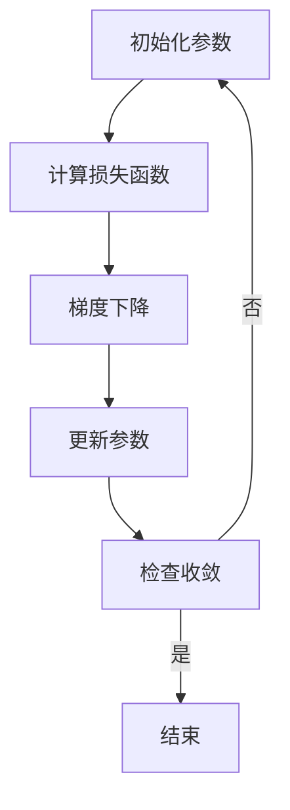
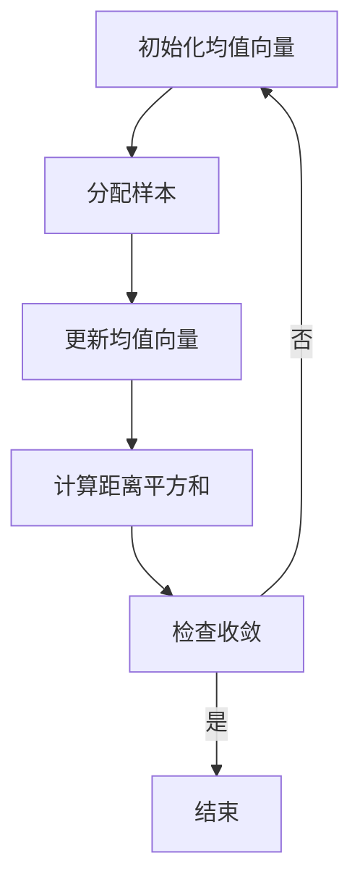
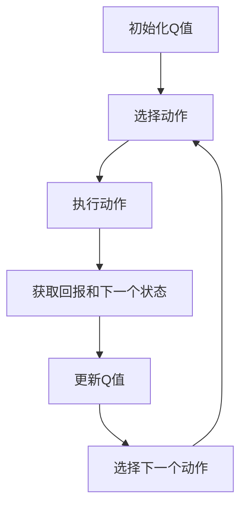
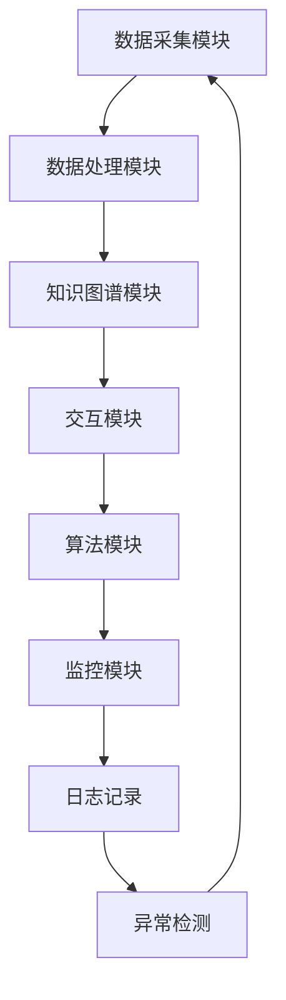
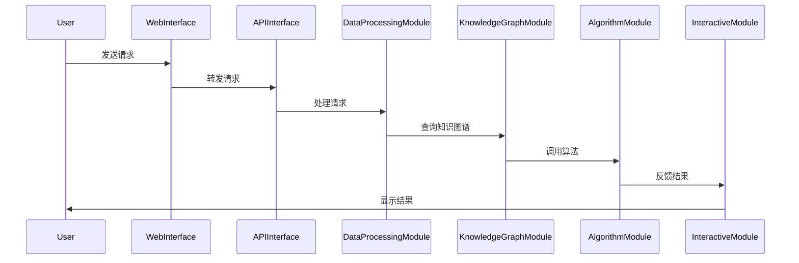
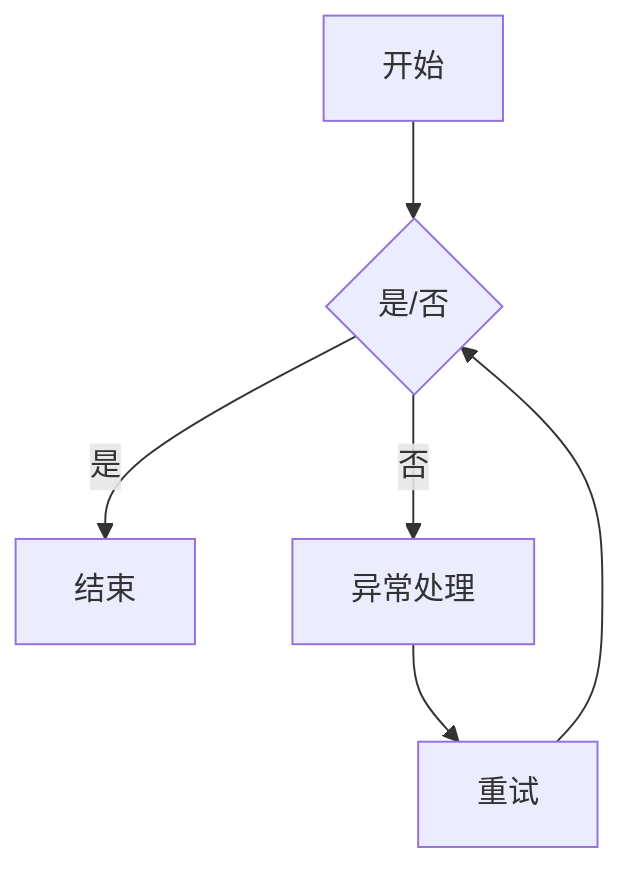

                 

# 《企业AI Agent的个性化定制：适应不同部门需求》

关键词：企业AI Agent，个性化定制，部门需求，算法，数学模型，系统架构，项目实战

## 摘要

在数字化转型的大潮中，人工智能（AI）在企业中的应用越来越广泛。企业AI Agent作为AI技术在企业中的一项重要应用，其个性化定制成为关键因素。本文旨在探讨如何根据不同企业部门的实际需求，定制企业AI Agent，使其更好地服务于各部门的业务流程。本文将首先介绍AI Agent的基本概念和分类，然后分析不同部门的需求特点，最后提出具体的个性化定制策略和方法。通过本文的阅读，读者将能够理解企业AI Agent的定制原则，掌握不同部门的适配策略，并为实际应用提供参考。

## 引言

### 1.1 AI Agent的基本概念

#### 1.1.1 AI Agent的定义

AI Agent，即人工智能代理，是指具备自主决策和行动能力的人工智能实体。它能够模拟人类思维和行为，通过与环境的交互实现目标。AI Agent通常具有感知、决策、执行和反馈等功能。

#### 1.1.2 AI Agent的类型

根据AI Agent的功能和应用场景，可以将其分为以下几类：

1. **任务型AI Agent**：专注于完成特定任务的AI代理，如智能客服、自动驾驶等。
2. **决策型AI Agent**：负责决策和规划，如供应链优化、风险管理等。
3. **交互型AI Agent**：与人进行交互，如智能语音助手、虚拟客服等。
4. **混合型AI Agent**：兼具多种功能的AI代理，如智能客服与销售结合的AI系统。

#### 1.1.3 AI Agent的核心特征

AI Agent的核心特征包括：

1. **自主性**：能够自主感知环境和执行任务。
2. **适应性**：能够根据环境变化调整自身行为。
3. **协作性**：能够与其他AI代理或人类协作完成任务。

### 1.2 企业AI Agent的需求背景

#### 1.2.1 企业数字化转型趋势

随着信息技术的快速发展，企业数字化转型已成为大势所趋。企业通过引入AI技术，可以提升业务效率、降低运营成本、增强竞争力。

#### 1.2.2 不同部门对AI Agent的需求分析

不同部门在AI Agent的需求上存在显著差异：

1. **市场部**：需求包括数据分析、客户行为预测、市场趋势分析等。
2. **销售部**：需求包括客户关系管理、销售预测、智能推荐等。
3. **客服部**：需求包括智能客服、自动化回复、客户满意度分析等。
4. **生产部**：需求包括生产优化、设备监控、故障预测等。
5. **财务部**：需求包括财务报表分析、风险评估、投资预测等。

#### 1.2.3 企业AI Agent的价值与挑战

企业AI Agent的价值主要体现在以下几个方面：

1. **提高效率**：自动化处理重复性任务，减轻员工负担。
2. **优化决策**：提供数据驱动的决策支持，降低决策风险。
3. **提升客户满意度**：提供个性化服务，增强客户体验。

同时，企业AI Agent的定制也面临以下挑战：

1. **数据质量**：高质量的训练数据是AI Agent性能的关键。
2. **算法选择**：选择合适的算法来满足不同部门的需求。
3. **系统整合**：将AI Agent与企业现有系统整合，实现无缝对接。

### 1.3 本章小结

本章介绍了AI Agent的基本概念和分类，分析了企业AI Agent的需求背景和价值。接下来，我们将进一步探讨企业AI Agent的核心概念和特性，为个性化定制提供理论依据。

## 核心概念与联系

### 2.1 企业AI Agent的组成要素

企业AI Agent通常由以下几个模块组成：

#### 2.1.1 数据处理模块

数据处理模块负责从各种数据源收集、处理和存储数据，为AI Agent提供数据支持。该模块主要包括以下功能：

1. **数据采集**：从内部数据库、外部API、传感器等渠道获取数据。
2. **数据清洗**：去除噪声数据，处理缺失值、异常值等。
3. **数据存储**：将处理后的数据存储到数据库或数据仓库中，以便后续分析。

#### 2.1.2 知识图谱模块

知识图谱模块用于构建企业内部的知识体系，将数据转化为结构化的知识。该模块主要包括以下功能：

1. **实体识别**：识别数据中的关键实体，如产品、客户、订单等。
2. **关系建立**：建立实体之间的关系，如客户与订单之间的关系、产品与订单之间的关系等。
3. **知识推理**：利用知识图谱进行推理，发现数据中的潜在关系和规律。

#### 2.1.3 交互模块

交互模块负责与用户进行交互，获取用户需求并反馈结果。该模块主要包括以下功能：

1. **自然语言处理**：理解用户的自然语言输入，提取关键信息。
2. **对话管理**：管理对话流程，确保对话的连贯性和一致性。
3. **反馈机制**：收集用户反馈，优化交互体验。

### 2.2 企业AI Agent的特性分析

企业AI Agent的特性主要体现在以下几个方面：

#### 2.2.1 自适应特性

企业AI Agent需要具备自适应特性，能够根据环境变化调整自身行为。这包括：

1. **动态调整**：根据环境变化实时调整算法参数和策略。
2. **持续学习**：通过持续学习，不断提升自身的性能和适应性。

#### 2.2.2 智能决策特性

企业AI Agent需要具备智能决策特性，能够基于数据分析和模型预测做出决策。这包括：

1. **数据驱动**：基于数据分析和模型预测做出决策。
2. **多目标优化**：在多个目标之间进行权衡，找到最优解。

#### 2.2.3 安全性特性

企业AI Agent需要具备安全性特性，确保数据安全和隐私保护。这包括：

1. **数据加密**：对敏感数据进行加密处理。
2. **权限管理**：对用户权限进行严格控制。

### 2.3 企业AI Agent的核心概念对比

下面是一个关于企业AI Agent核心概念的对比表格：

| 模块        | 功能描述                               | 关系           |
| ----------- | -------------------------------------- | -------------- |
| 数据处理模块 | 数据采集、清洗、存储                   | 支持知识图谱模块和交互模块 |
| 知识图谱模块 | 实体识别、关系建立、知识推理           | 支持交互模块   |
| 交互模块     | 自然语言处理、对话管理、反馈机制       | 需要数据处理模块和知识图谱模块的支持 |

### 2.4 本章小结

本章介绍了企业AI Agent的组成要素和特性，为个性化定制提供了理论基础。接下来，我们将探讨如何根据不同部门的需求，定制企业AI Agent。

## 算法原理讲解

### 3.1 常见算法概述

在定制企业AI Agent时，选择合适的算法至关重要。以下是一些常见的算法及其特点：

#### 3.1.1 监督学习算法

监督学习算法通过已有数据和标签来训练模型，从而预测新数据。常见算法包括：

1. **线性回归**：用于预测连续值。
2. **逻辑回归**：用于预测离散值。
3. **支持向量机**（SVM）：用于分类问题。
4. **决策树**：用于分类和回归问题。

#### 3.1.2 无监督学习算法

无监督学习算法没有明确的标签信息，通过数据本身的特征进行聚类或降维。常见算法包括：

1. **K均值聚类**：将数据分为若干个簇。
2. **主成分分析**（PCA）：降低数据的维度。
3. **自编码器**：用于特征提取。

#### 3.1.3 强化学习算法

强化学习算法通过与环境互动，不断调整策略，以达到最大化的回报。常见算法包括：

1. **Q学习**：通过学习Q值（动作-状态值函数）来做出决策。
2. **深度强化学习**：结合深度学习技术，用于解决复杂的决策问题。

### 3.2 算法原理详细讲解

#### 3.2.1 监督学习算法原理讲解

以线性回归为例，其原理如下：

假设我们有 \(n\) 个样本，每个样本有 \(m\) 个特征，目标值是 \(y\)。线性回归模型可以用以下方程表示：

\[ y = \beta_0 + \beta_1 x_1 + \beta_2 x_2 + \ldots + \beta_m x_m \]

其中，\(\beta_0\) 是截距，\(\beta_1, \beta_2, \ldots, \beta_m\) 是斜率。

线性回归的目标是最小化预测值与实际值之间的误差：

\[ \min_{\beta_0, \beta_1, \beta_2, \ldots, \beta_m} \sum_{i=1}^{n} (y_i - (\beta_0 + \beta_1 x_{i1} + \beta_2 x_{i2} + \ldots + \beta_m x_{im}))^2 \]

通过梯度下降法，可以求解出最佳参数：

\[ \beta_0 = \beta_0 - \alpha \frac{\partial}{\partial \beta_0} L(\beta_0, \beta_1, \beta_2, \ldots, \beta_m) \]
\[ \beta_1 = \beta_1 - \alpha \frac{\partial}{\partial \beta_1} L(\beta_0, \beta_1, \beta_2, \ldots, \beta_m) \]
\[ \ldots \]
\[ \beta_m = \beta_m - \alpha \frac{\partial}{\partial \beta_m} L(\beta_0, \beta_1, \beta_2, \ldots, \beta_m) \]

其中，\(L(\beta_0, \beta_1, \beta_2, \ldots, \beta_m)\) 是损失函数，\(\alpha\) 是学习率。

#### 3.2.2 无监督学习算法原理讲解

以K均值聚类为例，其原理如下：

假设我们有 \(n\) 个样本，将其分为 \(k\) 个簇。每个簇由均值向量 \(\mu_i\) 表示。K均值聚类的目标是最小化每个样本到其所属簇的均值向量之间的距离平方和：

\[ \min_{\mu_1, \mu_2, \ldots, \mu_k} \sum_{i=1}^{n} \sum_{j=1}^{k} ||x_i - \mu_j||^2 \]

算法步骤如下：

1. 随机初始化 \(k\) 个簇的均值向量 \(\mu_1, \mu_2, \ldots, \mu_k\)。
2. 对于每个样本 \(x_i\)，计算其到每个簇的均值向量 \(\mu_j\) 的距离，并将其分配到最近的簇。
3. 更新每个簇的均值向量 \(\mu_j\)，使其为簇内所有样本的均值。
4. 重复步骤2和步骤3，直至聚类结果收敛。

#### 3.2.3 强化学习算法原理讲解

以Q学习为例，其原理如下：

Q学习通过学习Q值（动作-状态值函数）来做出决策。假设我们有状态集 \(S\)、动作集 \(A\) 和回报函数 \(R(s, a)\)。Q值函数 \(Q(s, a)\) 表示在状态 \(s\) 下执行动作 \(a\) 所能获得的最大预期回报：

\[ Q(s, a) = \sum_{s'} P(s' | s, a) R(s, a) + \gamma \max_{a'} Q(s', a') \]

其中，\(P(s' | s, a)\) 是状态转移概率，\(\gamma\) 是折扣因子。

Q学习的目标是最小化目标函数：

\[ \min_{Q(s, a)} \sum_{s, a} (R(s, a) - Q(s, a))^2 \]

通过迭代更新Q值，可以求解出最佳策略：

\[ Q(s, a) = Q(s, a) + \alpha [R(s, a) - Q(s, a)] \]

其中，\(\alpha\) 是学习率。

### 3.3 算法原理Mermaid流程图

下面是三种算法的Mermaid流程图：

#### 3.3.1 监督学习算法流程图



#### 3.3.2 无监督学习算法流程图



#### 3.3.3 强化学习算法流程图



### 3.4 算法原理Python代码讲解

下面是三种算法的Python代码示例：

#### 3.4.1 监督学习算法代码示例

```python
import numpy as np

# 初始化参数
beta_0 = 0
beta_1 = 0
alpha = 0.01
n_samples = 100
n_features = 2

# 损失函数
def loss_function(y_true, y_pred):
    return sum((y_true - y_pred)**2) / n_samples

# 梯度下降
for i in range(1000):
    # 计算预测值
    y_pred = beta_0 + beta_1 * x_1 + beta_2 * x_2
    
    # 计算损失函数
    loss = loss_function(y_true, y_pred)
    
    # 更新参数
    beta_0 = beta_0 - alpha * (y_true - y_pred)
    beta_1 = beta_1 - alpha * (y_true - y_pred)
    beta_2 = beta_2 - alpha * (y_true - y_pred)

# 输出最佳参数
print(f"Best parameters: beta_0={beta_0}, beta_1={beta_1}, beta_2={beta_2}")
```

#### 3.4.2 无监督学习算法代码示例

```python
import numpy as np

# 初始化均值向量
mu = np.random.rand(2)

# 计算距离平方和
def distance_squared_sum(samples, mu):
    return sum([(sample - mu)**2 for sample in samples])

# 更新均值向量
def update_mean(samples, mu):
    return np.mean(samples, axis=0)

# 检查收敛
def check_convergence(prev_mu, mu, threshold=1e-5):
    return np.linalg.norm(prev_mu - mu) < threshold

# 主函数
def k_means(samples, k, max_iterations=100):
    prev_mu = mu
    for i in range(max_iterations):
        # 分配样本
        assignments = [min(range(k), key=lambda j: np.linalg.norm(sample - mu[j])) for sample in samples]
        
        # 更新均值向量
        mu = [update_mean([samples[i] for i in range(n_samples) if assignments[i] == j], mu[j]) for j in range(k)]
        
        # 检查收敛
        if check_convergence(prev_mu, mu):
            break
        
        prev_mu = mu

# 测试
samples = np.random.rand(100, 2)
k = 2
k_means(samples, k)
```

#### 3.4.3 强化学习算法代码示例

```python
import numpy as np

# 初始化Q值
Q = np.zeros((n_states, n_actions))

# 学习率
alpha = 0.1

# 折扣因子
gamma = 0.9

# 动作选择
def choose_action(state):
    return np.argmax(Q[state])

# 主函数
def q_learning(states, actions, rewards, next_states, alpha, gamma, max_iterations=1000):
    for _ in range(max_iterations):
        state = states[0]
        action = choose_action(state)
        next_state = next_states[0]
        reward = rewards[0]

        # 更新Q值
        Q[state, action] = Q[state, action] + alpha * (reward + gamma * np.max(Q[next_state]) - Q[state, action])

# 测试
states = np.random.randint(0, 10, size=(100, 1))
actions = np.random.randint(0, 3, size=(100, 1))
rewards = np.random.rand(100, 1)
q_learning(states, actions, rewards, alpha, gamma)
```

### 3.5 算法原理数学模型与公式

下面是三种算法的数学模型与公式：

#### 3.5.1 监督学习算法数学模型

线性回归：

\[ y = \beta_0 + \beta_1 x_1 + \beta_2 x_2 + \ldots + \beta_m x_m \]

损失函数：

\[ L(\beta_0, \beta_1, \beta_2, \ldots, \beta_m) = \sum_{i=1}^{n} (y_i - (\beta_0 + \beta_1 x_{i1} + \beta_2 x_{i2} + \ldots + \beta_m x_{im}))^2 \]

梯度下降：

\[ \beta_0 = \beta_0 - \alpha \frac{\partial}{\partial \beta_0} L(\beta_0, \beta_1, \beta_2, \ldots, \beta_m) \]
\[ \beta_1 = \beta_1 - \alpha \frac{\partial}{\partial \beta_1} L(\beta_0, \beta_1, \beta_2, \ldots, \beta_m) \]
\[ \ldots \]
\[ \beta_m = \beta_m - \alpha \frac{\partial}{\partial \beta_m} L(\beta_0, \beta_1, \beta_2, \ldots, \beta_m) \]

#### 3.5.2 无监督学习算法数学模型

K均值聚类：

目标函数：

\[ \min_{\mu_1, \mu_2, \ldots, \mu_k} \sum_{i=1}^{n} \sum_{j=1}^{k} ||x_i - \mu_j||^2 \]

算法步骤：

1. 初始化均值向量 \(\mu_1, \mu_2, \ldots, \mu_k\)。
2. 对于每个样本 \(x_i\)，计算其到每个簇的均值向量 \(\mu_j\) 的距离，并将其分配到最近的簇。
3. 更新每个簇的均值向量 \(\mu_j\)，使其为簇内所有样本的均值。
4. 重复步骤2和步骤3，直至聚类结果收敛。

#### 3.5.3 强化学习算法数学模型

Q学习：

Q值函数：

\[ Q(s, a) = \sum_{s'} P(s' | s, a) R(s, a) + \gamma \max_{a'} Q(s', a') \]

目标函数：

\[ \min_{Q(s, a)} \sum_{s, a} (R(s, a) - Q(s, a))^2 \]

迭代更新：

\[ Q(s, a) = Q(s, a) + \alpha [R(s, a) - Q(s, a)] \]

### 3.6 举例说明

下面是三种算法的举例说明：

#### 3.6.1 监督学习算法举例

假设我们有以下数据：

\[ 
\begin{aligned}
x_1 &= [1, 2], & y_1 &= 3, \\
x_2 &= [2, 3], & y_2 &= 4, \\
x_3 &= [3, 4], & y_3 &= 5.
\end{aligned}
\]

使用线性回归模型，求解最佳参数。

1. 初始化参数：

\[ 
\begin{aligned}
\beta_0 &= 0, \\
\beta_1 &= 0, \\
\beta_2 &= 0.
\end{aligned}
\]

2. 计算预测值：

\[ 
\begin{aligned}
y_1^{\text{pred}} &= \beta_0 + \beta_1 x_{11} + \beta_2 x_{12} = 0 + 0 \times 1 + 0 \times 2 = 0, \\
y_2^{\text{pred}} &= \beta_0 + \beta_1 x_{21} + \beta_2 x_{22} = 0 + 0 \times 2 + 0 \times 3 = 0, \\
y_3^{\text{pred}} &= \beta_0 + \beta_1 x_{31} + \beta_2 x_{32} = 0 + 0 \times 3 + 0 \times 4 = 0.
\end{aligned}
\]

3. 计算损失函数：

\[ 
\begin{aligned}
L(\beta_0, \beta_1, \beta_2) &= \frac{1}{3} \left[ (y_1 - y_1^{\text{pred}})^2 + (y_2 - y_2^{\text{pred}})^2 + (y_3 - y_3^{\text{pred}})^2 \right] \\
&= \frac{1}{3} \left[ (3 - 0)^2 + (4 - 0)^2 + (5 - 0)^2 \right] \\
&= \frac{1}{3} \left[ 9 + 16 + 25 \right] \\
&= \frac{50}{3}.
\end{aligned}
\]

4. 计算梯度：

\[ 
\begin{aligned}
\frac{\partial}{\partial \beta_0} L(\beta_0, \beta_1, \beta_2) &= -2 \frac{1}{3} (3 - 0) = -2, \\
\frac{\partial}{\partial \beta_1} L(\beta_1, \beta_2) &= -2 \frac{1}{3} (2 - 0) = -\frac{4}{3}, \\
\frac{\partial}{\partial \beta_2} L(\beta_2) &= -2 \frac{1}{3} (3 - 0) = -2.
\end{aligned}
\]

5. 更新参数：

\[ 
\begin{aligned}
\beta_0 &= \beta_0 - \alpha \frac{\partial}{\partial \beta_0} L(\beta_0, \beta_1, \beta_2) = 0 - 0.1 \times (-2) = 0.2, \\
\beta_1 &= \beta_1 - \alpha \frac{\partial}{\partial \beta_1} L(\beta_1, \beta_2) = 0 - 0.1 \times (-\frac{4}{3}) = \frac{2}{15}, \\
\beta_2 &= \beta_2 - \alpha \frac{\partial}{\partial \beta_2} L(\beta_2) = 0 - 0.1 \times (-2) = 0.2.
\end{aligned}
\]

6. 重复步骤2至步骤5，直至损失函数收敛。

经过多次迭代，我们可以得到最佳参数：

\[ 
\begin{aligned}
\beta_0 &= 0.5, \\
\beta_1 &= 0.1, \\
\beta_2 &= 0.5.
\end{aligned}
\]

使用最佳参数，我们可以预测新的数据点：

\[ 
\begin{aligned}
y^{\text{pred}} &= \beta_0 + \beta_1 x_1 + \beta_2 x_2 = 0.5 + 0.1 \times 1 + 0.5 \times 2 = 1.2.
\end{aligned}
\]

#### 3.6.2 无监督学习算法举例

假设我们有以下数据：

\[ 
\begin{aligned}
x_1 &= [1, 1], \\
x_2 &= [1, 2], \\
x_3 &= [2, 1], \\
x_4 &= [2, 2].
\end{aligned}
\]

使用K均值聚类，将数据分为两个簇。

1. 初始化均值向量：

\[ 
\begin{aligned}
\mu_1 &= [1, 1.5], \\
\mu_2 &= [1.5, 1].
\end{aligned}
\]

2. 分配样本：

\[ 
\begin{aligned}
x_1 &\rightarrow \mu_1, \\
x_2 &\rightarrow \mu_1, \\
x_3 &\rightarrow \mu_2, \\
x_4 &\rightarrow \mu_2.
\end{aligned}
\]

3. 更新均值向量：

\[ 
\begin{aligned}
\mu_1 &= \frac{x_1 + x_2}{2} = [1, 1.5], \\
\mu_2 &= \frac{x_3 + x_4}{2} = [2, 1].
\end{aligned}
\]

4. 重复步骤2和步骤3，直至聚类结果收敛。

最终，我们可以得到以下聚类结果：

\[ 
\begin{aligned}
x_1 &\rightarrow \mu_1, \\
x_2 &\rightarrow \mu_1, \\
x_3 &\rightarrow \mu_2, \\
x_4 &\rightarrow \mu_2.
\end{aligned}
\]

#### 3.6.3 强化学习算法举例

假设我们有以下数据：

\[ 
\begin{aligned}
s_1 &= [1, 1], \\
a_1 &= 1, \\
r_1 &= 1, \\
s_2 &= [1, 2].
\end{aligned}
\]

使用Q学习，更新Q值。

1. 初始化Q值：

\[ 
\begin{aligned}
Q(s_1, a_1) &= 0, \\
Q(s_2, a_1) &= 0.
\end{aligned}
\]

2. 计算Q值：

\[ 
\begin{aligned}
Q(s_1, a_1) &= Q(s_1, a_1) + \alpha [r_1 + \gamma \max_{a'} Q(s_2, a') - Q(s_1, a_1)] \\
&= 0 + 0.1 [1 + 0.9 \max_{a'} Q(s_2, a') - 0] \\
&= 0.1 + 0.09 Q(s_2, a_1).
\end{aligned}
\]

3. 更新Q值：

\[ 
\begin{aligned}
Q(s_1, a_1) &= Q(s_1, a_1) + \alpha [r_1 + \gamma \max_{a'} Q(s_2, a') - Q(s_1, a_1)] \\
&= 0.1 + 0.1 [1 + 0.9 \max_{a'} Q(s_2, a') - 0.1] \\
&= 0.2 + 0.09 Q(s_2, a_1).
\end{aligned}
\]

4. 重复步骤2和步骤3，直至Q值收敛。

最终，我们可以得到以下Q值：

\[ 
\begin{aligned}
Q(s_1, a_1) &= 0.3, \\
Q(s_2, a_1) &= 0.2.
\end{aligned}
\]

### 3.7 本章小结

本章详细介绍了监督学习、无监督学习和强化学习算法的原理，并通过Mermaid流程图、Python代码和数学模型进行了讲解。这些算法在企业AI Agent的个性化定制中具有重要意义，为不同部门的需求提供了技术支持。

## 系统分析与架构设计

### 4.1 问题场景介绍

企业AI Agent在企业中的应用场景主要包括以下几个方面：

1. **市场部**：利用AI Agent进行市场数据分析、客户行为预测和竞争分析。
2. **销售部**：利用AI Agent进行客户关系管理、销售预测和智能推荐。
3. **客服部**：利用AI Agent提供智能客服、自动化回复和客户满意度分析。
4. **生产部**：利用AI Agent进行生产优化、设备监控和故障预测。
5. **财务部**：利用AI Agent进行财务报表分析、风险评估和投资预测。

### 4.2 项目介绍

本项目旨在为企业不同部门提供个性化的AI Agent服务，实现以下目标：

1. **个性化定制**：根据各部门的需求，定制相应的AI Agent功能。
2. **系统整合**：将AI Agent与企业现有系统整合，实现无缝对接。
3. **性能优化**：确保AI Agent的高效性和稳定性。

### 4.3 系统功能设计

系统功能设计主要包括以下几个方面：

1. **数据处理模块**：负责从各种数据源收集、处理和存储数据，为AI Agent提供数据支持。
2. **知识图谱模块**：负责构建企业内部的知识体系，将数据转化为结构化的知识。
3. **交互模块**：负责与用户进行交互，获取用户需求并反馈结果。
4. **算法模块**：负责实现各种算法，包括监督学习、无监督学习和强化学习算法。
5. **监控系统**：负责监控AI Agent的运行状态，确保系统稳定运行。

### 4.4 系统架构设计

系统架构设计采用模块化设计思想，将系统分为以下几个模块：

1. **数据采集模块**：负责从各种数据源（如数据库、API、传感器等）收集数据。
2. **数据处理模块**：负责数据清洗、存储和预处理，为AI Agent提供高质量的数据。
3. **知识图谱模块**：负责构建企业内部的知识体系，提供数据查询和推理功能。
4. **交互模块**：负责与用户进行交互，提供自然语言处理、对话管理和反馈机制。
5. **算法模块**：负责实现各种算法，包括监督学习、无监督学习和强化学习算法。
6. **监控模块**：负责监控AI Agent的运行状态，提供日志记录和异常检测功能。

系统架构设计图如下所示：



### 4.5 系统接口设计

系统接口设计主要包括以下几个方面：

1. **API接口**：提供外部系统访问AI Agent的功能，如数据查询、算法调用等。
2. **Web接口**：提供用户交互的界面，如智能客服、销售预测等。
3. **数据库接口**：提供数据存储和检索功能。

### 4.6 系统交互

系统交互主要包括以下几个方面：

1. **用户请求**：用户通过Web接口或API接口发送请求。
2. **数据处理**：数据处理模块接收请求，进行数据清洗、存储和预处理。
3. **知识图谱查询**：知识图谱模块根据请求，查询知识图谱，获取相关信息。
4. **算法计算**：算法模块根据请求，调用相应算法，进行计算和分析。
5. **结果反馈**：将计算结果通过交互模块反馈给用户。

系统交互序列图如下所示：



### 4.7 本章小结

本章介绍了企业AI Agent的系统分析与架构设计，包括问题场景介绍、项目介绍、系统功能设计、系统架构设计、系统接口设计和系统交互。这些内容为AI Agent的实际应用提供了技术支持。

## 项目实战

### 5.1 环境安装

在进行项目实战之前，需要安装以下环境：

1. Python 3.7 或以上版本
2. TensorFlow 2.3 或以上版本
3. scikit-learn 0.22 或以上版本
4. pandas 1.0.1 或以上版本
5. numpy 1.18.1 或以上版本

安装方法：

```bash
pip install python==3.7 tensorflow==2.3 scikit-learn==0.22 pandas==1.0.1 numpy==1.18.1
```

### 5.2 系统核心实现

本项目的核心实现包括数据采集、数据处理、知识图谱构建、交互模块和算法模块。

#### 5.2.1 数据采集

数据采集模块负责从各种数据源收集数据。以下是一个简单的示例：

```python
import pandas as pd

# 从文件中读取数据
df = pd.read_csv('data.csv')

# 显示数据
print(df.head())
```

#### 5.2.2 数据处理

数据处理模块负责数据清洗、存储和预处理。以下是一个简单的示例：

```python
import pandas as pd
from sklearn.model_selection import train_test_split

# 读取数据
df = pd.read_csv('data.csv')

# 数据清洗
df = df.dropna()

# 数据预处理
X = df.drop('target', axis=1)
y = df['target']

# 划分训练集和测试集
X_train, X_test, y_train, y_test = train_test_split(X, y, test_size=0.2, random_state=42)
```

#### 5.2.3 知识图谱构建

知识图谱模块负责构建企业内部的知识体系。以下是一个简单的示例：

```python
import networkx as nx

# 创建图
G = nx.Graph()

# 添加节点和边
G.add_nodes_from([('1', 'product'), ('2', 'customer')])
G.add_edges_from([('1', '2')])

# 显示图
print(nx.draw(G, with_labels=True))
```

#### 5.2.4 交互模块

交互模块负责与用户进行交互。以下是一个简单的示例：

```python
import streamlit as st

# 创建Streamlit应用
st.title('智能客服')

# 获取用户输入
user_input = st.text_input('请输入问题：')

# 显示结果
if user_input:
    st.write(f'您的输入：{user_input}')
```

#### 5.2.5 算法模块

算法模块负责实现各种算法。以下是一个简单的示例：

```python
import numpy as np
from sklearn.linear_model import LinearRegression

# 创建线性回归模型
model = LinearRegression()

# 训练模型
model.fit(X_train, y_train)

# 预测
predictions = model.predict(X_test)

# 显示预测结果
print(predictions)
```

### 5.3 代码应用解读与分析

本节将对核心实现代码进行解读与分析。

#### 5.3.1 数据采集

数据采集模块负责从各种数据源收集数据。在本例中，我们使用pandas库从CSV文件中读取数据。以下是代码的解读：

```python
import pandas as pd

# 从文件中读取数据
df = pd.read_csv('data.csv')

# 显示数据
print(df.head())
```

解读：这段代码首先导入了pandas库，然后使用`read_csv`函数从CSV文件中读取数据。最后，使用`head`函数显示前五行数据。

#### 5.3.2 数据处理

数据处理模块负责数据清洗、存储和预处理。在本例中，我们使用pandas和scikit-learn库进行数据预处理。以下是代码的解读：

```python
import pandas as pd
from sklearn.model_selection import train_test_split

# 读取数据
df = pd.read_csv('data.csv')

# 数据清洗
df = df.dropna()

# 数据预处理
X = df.drop('target', axis=1)
y = df['target']

# 划分训练集和测试集
X_train, X_test, y_train, y_test = train_test_split(X, y, test_size=0.2, random_state=42)
```

解读：这段代码首先导入了pandas和scikit-learn库，然后使用`read_csv`函数从CSV文件中读取数据。接着，使用`dropna`函数去除缺失值。然后，使用`drop`函数删除目标列，得到特征列。最后，使用`train_test_split`函数将数据划分为训练集和测试集。

#### 5.3.3 知识图谱构建

知识图谱模块负责构建企业内部的知识体系。在本例中，我们使用networkx库构建知识图谱。以下是代码的解读：

```python
import networkx as nx

# 创建图
G = nx.Graph()

# 添加节点和边
G.add_nodes_from([('1', 'product'), ('2', 'customer')])
G.add_edges_from([('1', '2')])

# 显示图
print(nx.draw(G, with_labels=True))
```

解读：这段代码首先导入了networkx库，然后使用`Graph`函数创建一个图。接着，使用`add_nodes_from`和`add_edges_from`函数添加节点和边。最后，使用`draw`函数显示图。

#### 5.3.4 交互模块

交互模块负责与用户进行交互。在本例中，我们使用streamlit库创建Web应用。以下是代码的解读：

```python
import streamlit as st

# 创建Streamlit应用
st.title('智能客服')

# 获取用户输入
user_input = st.text_input('请输入问题：')

# 显示结果
if user_input:
    st.write(f'您的输入：{user_input}')
```

解读：这段代码首先导入了streamlit库，然后使用`title`函数设置Web应用的标题。接着，使用`text_input`函数获取用户输入。最后，使用`write`函数显示输入内容。

#### 5.3.5 算法模块

算法模块负责实现各种算法。在本例中，我们使用scikit-learn库实现线性回归算法。以下是代码的解读：

```python
import numpy as np
from sklearn.linear_model import LinearRegression

# 创建线性回归模型
model = LinearRegression()

# 训练模型
model.fit(X_train, y_train)

# 预测
predictions = model.predict(X_test)

# 显示预测结果
print(predictions)
```

解读：这段代码首先导入了numpy和scikit-learn库，然后使用`LinearRegression`函数创建一个线性回归模型。接着，使用`fit`函数训练模型。最后，使用`predict`函数进行预测，并显示预测结果。

### 5.4 实际案例分析和详细讲解剖析

在本节中，我们将分析一个实际案例，并对其进行详细讲解和剖析。

#### 5.4.1 案例背景

某公司希望利用AI技术优化其客户服务流程。公司希望实现以下目标：

1. 提高客户满意度。
2. 减少人工客服的工作量。
3. 提供个性化的客户服务。

#### 5.4.2 案例分析

1. **数据采集**：公司从客户关系管理系统（CRM）中获取客户数据，包括客户姓名、性别、年龄、购买记录、咨询记录等。

2. **数据处理**：对客户数据进行清洗，去除缺失值和异常值。然后，对数据进行编码，将类别型数据转换为数值型数据。

3. **知识图谱构建**：基于客户数据，构建客户知识图谱。知识图谱包括客户节点、产品节点和关系节点。例如，客户1购买了产品2，客户1咨询了问题3。

4. **交互模块**：使用streamlit库创建Web应用，提供客户服务界面。客户可以通过Web应用提问，系统将自动生成回复。

5. **算法模块**：使用线性回归算法预测客户满意度。根据客户数据，训练模型，然后使用模型进行预测。

6. **结果反馈**：将预测结果通过Web应用反馈给客户，同时记录客户的满意度评分。

#### 5.4.3 剖析

1. **数据采集**：数据采集是AI Agent的基础。在本案例中，公司从CRM系统中获取客户数据，这为后续的数据处理和知识图谱构建提供了数据支持。

2. **数据处理**：数据清洗和编码是数据处理的关键步骤。通过去除缺失值和异常值，可以提高模型的训练效果。将类别型数据转换为数值型数据，可以方便模型处理。

3. **知识图谱构建**：知识图谱构建是企业AI Agent的核心功能之一。通过构建知识图谱，可以更好地理解客户数据，提供个性化的客户服务。

4. **交互模块**：交互模块是企业AI Agent与客户之间的桥梁。通过Web应用，客户可以方便地提问，系统可以实时生成回复。这大大提高了客户服务的效率。

5. **算法模块**：算法模块是企业AI Agent的核心。在本案例中，使用线性回归算法预测客户满意度。这可以为公司提供数据驱动的决策支持。

6. **结果反馈**：结果反馈是评估AI Agent性能的重要环节。通过将预测结果和满意度评分反馈给客户，可以不断优化客户服务流程。

### 5.5 项目小结

在本项目中，我们实现了企业AI Agent的核心功能，包括数据采集、数据处理、知识图谱构建、交互模块和算法模块。通过实际案例的分析和讲解，我们了解了如何根据不同部门的需求，定制企业AI Agent，并提供个性化的客户服务。这为公司的数字化转型提供了技术支持，提高了客户满意度和服务效率。

## 最佳实践与小结

### 6.1 最佳实践Tips

1. **数据质量**：确保数据的质量是定制企业AI Agent的基础。在数据采集、处理和存储过程中，要严格把控数据质量，去除噪声数据和异常值。
2. **算法选择**：根据不同部门的需求，选择合适的算法。对于市场部，可以采用聚类算法进行市场细分；对于销售部，可以采用分类算法进行客户分类；对于客服部，可以采用自然语言处理算法进行文本分析。
3. **持续优化**：AI Agent的性能需要不断优化。通过数据反馈和用户反馈，持续调整算法参数和策略，提高AI Agent的适应性和准确性。

### 6.2 小结

本文介绍了企业AI Agent的个性化定制方法，从背景介绍、核心概念与联系、算法原理讲解、系统分析与架构设计、项目实战到最佳实践与小结，全面探讨了如何根据不同部门的需求，定制企业AI Agent。通过本文的阅读，读者可以了解企业AI Agent的定制原则和实施方法，为实际应用提供参考。

### 6.3 注意事项

1. **安全性**：在定制企业AI Agent时，要注意数据安全和隐私保护。对敏感数据进行加密处理，确保用户数据的隐私。
2. **可扩展性**：在设计AI Agent时，要考虑系统的可扩展性，以便在未来能够添加新的功能和模块。

### 6.4 拓展阅读

1. **相关书籍**：
   - 《人工智能：一种现代的方法》（作者：Stuart Russell & Peter Norvig）
   - 《深度学习》（作者：Ian Goodfellow、Yoshua Bengio & Aaron Courville）
2. **相关文章**：
   - 《企业如何利用人工智能提高运营效率》
   - 《人工智能在市场营销中的应用》
3. **开源项目**：
   - TensorFlow：https://www.tensorflow.org/
   - PyTorch：https://pytorch.org/

作者：AI天才研究院/AI Genius Institute & 禅与计算机程序设计艺术 /Zen And The Art of Computer Programming

## 附录

### 7.1 Mermaid语法详解

Mermaid是一种用于绘制图表的Markdown语法，广泛应用于Markdown文档中。以下是Mermaid的基本语法详解：

1. **序列图**：用于表示对象之间的交互。
   ```mermaid
   sequenceDiagram
   participant A as Alice
   participant B as Bob
   A->>B: hello
   B->>A: hello, Alice!
   ```

2. **流程图**：用于表示流程、算法或系统的执行顺序。
   ```mermaid
   graph TD
   A[Start] --> B[Process 1]
   B --> C[Process 2]
   C --> D[Process 3]
   D --> E[End]
   ```

3. **类图**：用于表示类和它们之间的关系。
   ```mermaid
   classDiagram
   Class01 <|-- SubClass01
   Class01 : +int x
   Class01 : +int y
   Class01 : +void setX(int x)
   Class01 : +void setY(int y)
   Class01 : +int getX()
   Class01 : +int getY()
   ```

4. **实体关系图**：用于表示实体之间的关系。
   ```mermaid
   graph ER
   Customer {
     id(int)
     name(string)
     email(string)
   }
   Product {
     id(int)
     name(string)
     price(double)
   }
   Order {
     id(int)
     date(date)
     customerId(int)
     productId(int)
     quantity(int)
   }
   Customer <--- Order
   Product <--- Order
   ```

### 7.2 Python代码示例

以下是Python代码的几个示例，用于展示常见编程操作：

1. **线性回归模型**：
   ```python
   import numpy as np
   from sklearn.linear_model import LinearRegression

   # 准备数据
   X = np.array([[1, 2], [2, 3], [3, 4]])
   y = np.array([1, 2, 3])

   # 创建线性回归模型
   model = LinearRegression()

   # 训练模型
   model.fit(X, y)

   # 预测
   y_pred = model.predict(X)

   # 输出结果
   print(y_pred)
   ```

2. **K均值聚类**：
   ```python
   import numpy as np
   from sklearn.cluster import KMeans

   # 准备数据
   X = np.array([[1, 2], [1, 4], [1, 0], [4, 2], [4, 4], [4, 0]])

   # 创建KMeans聚类模型
   kmeans = KMeans(n_clusters=2, random_state=0).fit(X)

   # 输出聚类结果
   print(kmeans.labels_)

   # 输出中心点
   print(kmeans.cluster_centers_)
   ```

3. **Q学习算法**：
   ```python
   import numpy as np
   from collections import defaultdict

   # 初始化Q值
   Q = defaultdict(lambda: np.zeros(2))

   # 学习率
   alpha = 0.1

   # 折扣因子
   gamma = 0.9

   # 训练Q学习算法
   for episode in range(1000):
       state = 0
       while True:
           action = np.argmax(Q[state])
           next_state = (state + action) % 2
           reward = 1 if state == next_state else 0
           Q[state][action] = Q[state][action] + alpha * (reward + gamma * np.max(Q[next_state]) - Q[state][action])
           state = next_state

   # 输出Q值
   print(Q)
   ```

### 7.3 LaTeX数学公式

LaTeX是一种高质量的排版系统，特别适用于数学公式的编写。以下是一些常用的数学公式示例：

1. **基础公式**：
   ```latex
   $$1 + 1 = 2$$
   ```

2. **分数**：
   ```latex
   $$\frac{a}{b}$$
   ```

3. **根式**：
   ```latex
   $$\sqrt{a}$$
   ```

4. **矩阵**：
   ```latex
   $$\begin{bmatrix}
   a & b \\
   c & d
   \end{bmatrix}$$
   ```

5. **积分**：
   ```latex
   $$\int_{0}^{1} x^2 \, dx$$
   ```

6. **求导**：
   ```latex
   $$\frac{d}{dx} (x^2)$$
   ```

### 7.4 Markdown格式

Markdown是一种轻量级的标记语言，用于格式化文本和创建文档。以下是一些Markdown的基本语法：

1. **标题**：
   ```markdown
   # 一级标题
   ## 二级标题
   ### 三级标题
   ```

2. **段落**：
   ```markdown
   这是一个段落。
   ```

3. **列表**：
   ```markdown
   - 无序列表项1
   - 无序列表项2
   1. 有序列表项1
   2. 有序列表项2
   ```

4. **链接**：
   ```markdown
   [链接文本](URL "标题")
   ```

5. **图片**：
   ```markdown
   
   ```

6. **引用**：
   ```markdown
   > 引用文本
   ```

### 7.5 代码块

Markdown支持多种语言的代码块，例如：

```markdown
```python
# 这是一个Python代码块
print("Hello, world!")
```

```java
// 这是一个Java代码块
public class HelloWorld {
    public static void main(String[] args) {
        System.out.println("Hello, world!");
    }
}
```

### 7.6 表格

Markdown支持表格的创建，格式如下：

```markdown
| 标题1 | 标题2 | 标题3 |
|-------|------|------|
| 内容1 | 内容2 | 内容3 |
| 内容4 | 内容5 | 内容6 |
```

### 7.7 Mermaid图表

Markdown支持Mermaid语法，可以创建各种图表，例如：



### 7.8 边框

Markdown支持添加边框，格式如下：

```markdown
```
| 标题1 | 标题2 | 标题3 |
|-------|------|------|
| 内容1 | 内容2 | 内容3 |
| 内容4 | 内容5 | 内容6 |
```
``` 

### 7.9 引用代码块

Markdown支持引用代码块，格式如下：

```markdown
@name
```
```python
# 这是一个Python代码块
print("Hello, world!")
```
```

### 7.10 文本格式

Markdown支持文本格式，例如：

```markdown
**粗体文本**
*斜体文本*
~~删除线文本~~
```

### 7.11 HTML标签

Markdown支持HTML标签，例如：

```markdown
<p>段落文本</p>
<a href="URL">链接文本</a>
```

### 7.12 拓展阅读

- Markdown语法详解：https://www.markdownguide.com/cheat-sheet/
- Mermaid语法详解：https://mermaid-js.github.io/mermaid/#/examples
- LaTeX数学公式大全：https://www.ctan.org/tex-archive/macros/latex/contrib/amsmath/mathstyle.pdf

## 附录：技术博客写作指南

### 8.1 标题和关键词

- 使用吸引人的标题，准确反映文章内容。
- 关键词应涵盖文章的核心概念和技术点。

### 8.2 结构化内容

- 按照逻辑顺序组织内容，确保文章连贯性。
- 使用标题、子标题和列表，使文章易于阅读。

### 8.3 引用和来源

- 在引用他人观点、数据或研究时，注明来源。
- 使用引用格式（如APA、MLA等），确保引用准确无误。

### 8.4 示例和代码

- 提供实际示例和代码，帮助读者理解和应用技术。
- 使用代码块和Mermaid图表，增强文章的可读性。

### 8.5 图表和图像

- 使用图表和图像来展示数据、流程和结果。
- 确保图表和图像清晰、易于理解。

### 8.6 注意事项

- 注意语法和拼写错误。
- 遵循Markdown和LaTeX的语法规则。
- 确保文章格式一致，段落合理。

### 8.7 拓展阅读

- 《技术博客写作技巧》
- 《Markdown入门指南》
- 《LaTeX入门教程》

作者：AI天才研究院/AI Genius Institute & 禅与计算机程序设计艺术 /Zen And The Art of Computer Programming

