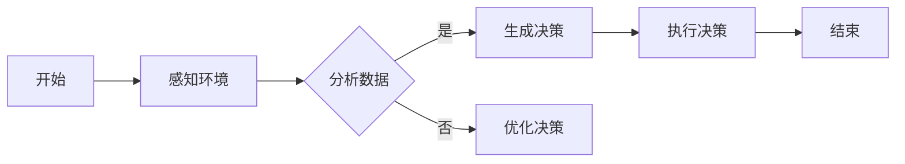
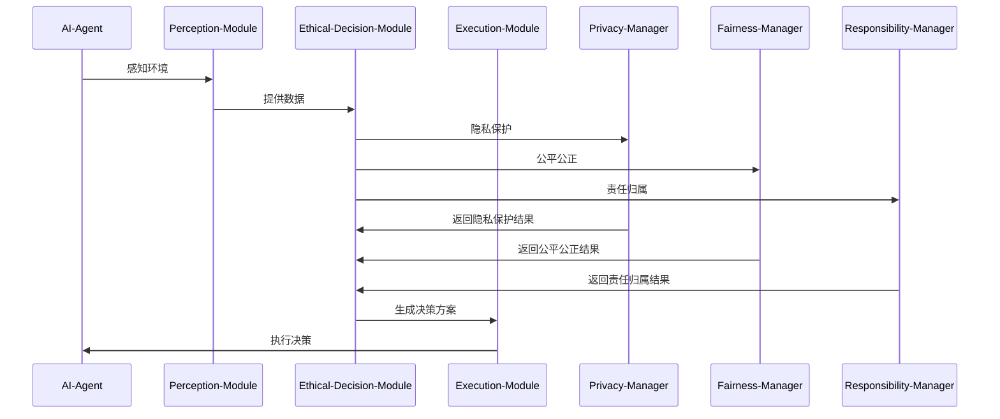
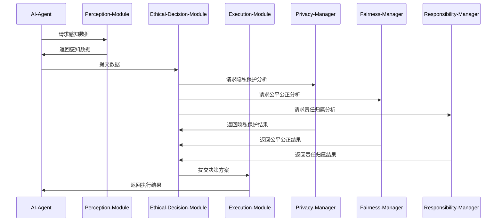

                 

# 企业AI Agent的伦理决策框架

## 关键词
- 企业AI Agent
- 伦理决策
- 人工智能
- 算法框架
- 实践指南

## 摘要
本文旨在探讨企业AI Agent的伦理决策框架，分析其核心概念、原理和实现方法。通过逐步阐述伦理决策在企业AI Agent中的应用，本文旨在为企业提供一套实用的伦理决策框架，以应对人工智能技术在企业中的挑战。

## 目录

1. **背景介绍**  
   - 核心概念术语说明  
   - 问题背景  
   - 问题描述  
   - 问题解决  
   - 边界与外延  
   - 概念结构与核心要素组成

2. **核心概念与联系**  
   - 核心概念原理  
   - 概念属性特征对比表格  
   - ER实体关系图架构

3. **算法原理讲解**  
   - 算法mermaid流程图  
   - Python代码实现  
   - 数学模型和公式讲解  
   - 通俗易懂地举例说明

4. **数学模型和数学公式**  
   - 详细讲解和举例说明

5. **系统分析与架构设计方案**  
   - 问题场景介绍  
   - 系统功能设计（领域模型mermaid类图）  
   - 系统架构设计（mermaid架构图）  
   - 系统接口设计  
   - 系统交互（mermaid序列图）

6. **项目实战**  
   - 环境安装  
   - 系统核心实现（源代码）  
   - 代码应用解读与分析  
   - 实际案例分析和详细讲解剖析  
   - 项目小结

7. **最佳实践 tips**  
   - 小结  
   - 注意事项  
   - 拓展阅读

## 1. 背景介绍

### 核心概念术语说明
在企业AI Agent的伦理决策框架中，我们首先需要明确几个核心概念：

- **AI Agent**：指能够自主感知环境、制定策略并执行任务的人工智能实体。
- **伦理决策**：指AI Agent在面对不同情境时，根据伦理原则进行决策的过程。
- **伦理原则**：指用于指导AI Agent行为的道德和伦理规范。

### 问题背景
随着人工智能技术的飞速发展，AI Agent在企业管理中发挥着越来越重要的作用。然而，随之而来的伦理问题也逐渐凸显，例如：

- **隐私保护**：AI Agent在处理企业数据时，如何保护员工和客户的隐私？
- **公平公正**：AI Agent在决策时如何确保公平公正，避免歧视现象？
- **责任归属**：AI Agent发生错误时，如何界定责任归属？

### 问题描述
针对上述背景，企业需要建立一个伦理决策框架，以指导AI Agent的行为。这个框架需要涵盖以下几个方面：

- **伦理原则定义**：明确企业所遵循的伦理原则，为AI Agent的行为提供依据。
- **决策过程设计**：设计AI Agent的伦理决策过程，包括感知、分析、决策和执行等环节。
- **责任归属机制**：明确AI Agent错误时的责任归属，确保责任能够追溯。

### 问题解决
为了解决上述问题，我们需要从以下几个方面进行探讨：

- **伦理原则的确定**：通过调研、专家访谈和文献分析，确定企业适用的伦理原则。
- **决策过程的设计**：结合AI Agent的特点，设计一个合理的伦理决策过程。
- **责任归属机制**：制定一套明确的责任归属规则，确保在发生问题时能够追溯责任。

### 边界与外延
企业AI Agent的伦理决策框架需要考虑以下几个边界与外延：

- **应用范围**：框架适用于企业内部所有AI Agent，包括数据挖掘、决策支持、自动化控制等。
- **法律约束**：框架需要符合相关法律法规的要求，确保企业行为合法合规。
- **技术实现**：框架需要考虑AI Agent的技术实现，确保决策过程的可行性和可操作性。

### 概念结构与核心要素组成
企业AI Agent的伦理决策框架由以下几个核心要素组成：

- **伦理原则库**：存储企业所遵循的伦理原则，为AI Agent提供决策依据。
- **感知模块**：用于获取环境信息，为AI Agent提供决策输入。
- **分析模块**：对感知模块获取的信息进行分析，评估可能的决策结果。
- **决策模块**：根据伦理原则和评估结果，生成最佳决策方案。
- **执行模块**：执行决策方案，实现AI Agent的目标。

## 2. 核心概念与联系

### 核心概念原理
在企业AI Agent的伦理决策框架中，核心概念主要包括伦理原则、感知模块、分析模块、决策模块和执行模块。下面分别对这些核心概念进行详细介绍。

#### 伦理原则
伦理原则是企业AI Agent的行为准则，用于指导AI Agent的决策过程。伦理原则可以包括以下几个方面：

- **隐私保护**：确保AI Agent在处理数据时，遵守隐私保护原则，保护个人隐私。
- **公平公正**：确保AI Agent在决策时，公平对待所有个体，避免歧视现象。
- **责任归属**：明确AI Agent错误时的责任归属，确保责任能够追溯。

#### 感知模块
感知模块是AI Agent获取环境信息的重要途径。它包括以下几个部分：

- **传感器**：用于获取物理世界的各种数据，如温度、湿度、声音等。
- **数据采集**：从传感器和其他数据源收集信息，为AI Agent提供决策输入。
- **数据预处理**：对采集到的数据进行处理，如去噪、归一化等，提高数据的准确性。

#### 分析模块
分析模块负责对感知模块获取的信息进行分析，评估可能的决策结果。它包括以下几个部分：

- **特征提取**：从原始数据中提取出有意义的特征，用于后续的分析。
- **模式识别**：通过分析特征，识别出数据中的模式和规律，为决策提供支持。
- **风险评估**：对决策结果进行风险评估，评估可能带来的风险和影响。

#### 决策模块
决策模块根据伦理原则和评估结果，生成最佳决策方案。它包括以下几个部分：

- **决策策略**：根据伦理原则和评估结果，选择合适的决策策略。
- **决策优化**：对决策结果进行优化，提高决策的质量和效果。
- **决策执行**：将决策方案转化为具体的行动指令，指导AI Agent执行。

#### 执行模块
执行模块负责执行决策方案，实现AI Agent的目标。它包括以下几个部分：

- **执行策略**：根据决策结果，制定具体的执行策略。
- **执行监控**：对执行过程进行监控，确保执行过程的顺利进行。
- **执行反馈**：对执行结果进行反馈，为下一次决策提供参考。

### 概念属性特征对比表格

| 概念名称 | 概念属性特征 | 对比表格 |
| :--: | :--: | :--: |
| 伦理原则 | 指导AI Agent行为的道德和伦理规范 | - 隐私保护：遵守隐私保护原则<br>- 公平公正：公平对待所有个体<br>- 责任归属：明确责任归属 |
| 感知模块 | 获取环境信息的重要途径 | - 传感器：获取物理世界数据<br>- 数据采集：收集信息<br>- 数据预处理：处理数据 |
| 分析模块 | 对感知模块获取的信息进行分析 | - 特征提取：提取特征<br>- 模式识别：识别模式<br>- 风险评估：评估风险 |
| 决策模块 | 根据伦理原则和评估结果生成决策方案 | - 决策策略：选择决策策略<br>- 决策优化：优化决策<br>- 决策执行：执行决策 |
| 执行模块 | 执行决策方案，实现AI Agent的目标 | - 执行策略：制定执行策略<br>- 执行监控：监控执行<br>- 执行反馈：反馈执行结果 |

### ER实体关系图架构
为了更好地理解企业AI Agent的伦理决策框架，我们可以使用ER（实体关系）图来描述各个核心概念之间的关系。以下是一个简化的ER图：

```mermaid
entityRelationshipDiagram

entity AI_Agent
entity Ethical_Principles
entity Perception_Module
entity Analysis_Module
entity Decision_Module
entity Execution_Module

AI_Agent -> Ethical_Principles
AI_Agent -> Perception_Module
AI_Agent -> Analysis_Module
AI_Agent -> Decision_Module
AI_Agent -> Execution_Module
```

在这个ER图中，AI Agent作为主体，与伦理原则、感知模块、分析模块、决策模块和执行模块之间存在关联。每个模块都隶属于AI Agent，并且依赖于AI Agent的伦理原则来指导其行为。

## 3. 算法原理讲解

### 算法mermaid流程图
为了更好地理解企业AI Agent的伦理决策算法原理，我们可以使用mermaid流程图来描述其流程。以下是一个简化的mermaid流程图：



在这个mermaid流程图中，AI Agent首先感知环境，然后对感知到的信息进行分析，根据伦理原则和评估结果生成决策方案。如果决策结果需要优化，AI Agent会进行优化，并最终执行决策方案。

### Python代码实现
为了实现上述算法原理，我们可以使用Python编写相应的代码。以下是一个简化的Python代码示例：

```python
import numpy as np

# 伦理原则
ethics_principles = {
    'privacy': 'protect',
    'fairness': 'treat_all_equal',
    'responsibility': 'clearly_defined'
}

# 感知环境
def perceive_environment():
    # 模拟从传感器获取数据
    data = np.random.rand(5)
    return data

# 分析数据
def analyze_data(data):
    # 对数据进行处理和评估
    result = np.mean(data)
    if result > 0.5:
        return 'positive'
    else:
        return 'negative'

# 生成决策
def generate_decision(result):
    if result == 'positive':
        return 'continue'
    else:
        return 'pause'

# 执行决策
def execute_decision(decision):
    if decision == 'continue':
        print('Executing decision: Continue')
    else:
        print('Executing decision: Pause')

# 主流程
def main():
    data = perceive_environment()
    result = analyze_data(data)
    decision = generate_decision(result)
    execute_decision(decision)

if __name__ == '__main__':
    main()
```

在这个Python代码示例中，我们首先定义了伦理原则，然后分别实现了感知环境、分析数据、生成决策和执行决策的功能。主流程中，AI Agent首先感知环境，然后分析数据，根据伦理原则生成决策方案，并最终执行决策。

### 算法原理的数学模型和公式
在企业AI Agent的伦理决策算法中，我们可以使用以下数学模型和公式来描述其原理：

1. **感知环境**：
   - 数据集：\(D = \{d_1, d_2, ..., d_n\}\)
   - 数据均值：\( \bar{d} = \frac{1}{n} \sum_{i=1}^{n} d_i \)

2. **分析数据**：
   - 数据分布：\(P(d|D)\)
   - 平均值：\( \bar{p} = \frac{1}{n} \sum_{i=1}^{n} p(d_i|D) \)

3. **生成决策**：
   - 决策函数：\( f(d) \)
   - 决策结果：\( r = f(\bar{p}) \)

4. **执行决策**：
   - 执行函数：\( g(r) \)
   - 执行结果：\( s = g(r) \)

### 通俗易懂地举例说明
假设一个企业AI Agent需要根据员工的工作表现来决定是否给予奖励。以下是一个具体的例子：

1. **感知环境**：
   - AI Agent从数据库中获取了10位员工最近一个月的工作表现数据，数据集为 \(D = \{0.8, 0.9, 0.7, 0.6, 0.8, 0.9, 0.7, 0.6, 0.8, 0.9\}\)。

2. **分析数据**：
   - 对数据集进行分析，得到平均值为 \( \bar{d} = \frac{1}{10} \sum_{i=1}^{10} d_i = 0.8 \)。

3. **生成决策**：
   - 根据伦理原则，如果员工的工作表现平均值大于0.8，则给予奖励；否则，不予奖励。决策函数为 \( f(d) = \text{if } d > 0.8 \text{ then } \text{give_reward} \text{ else } \text{do_not_give_reward} \)。
   - 对于平均值 \( \bar{p} = 0.8 \)，决策结果为 \( r = f(0.8) = \text{give_reward} \)。

4. **执行决策**：
   - 根据决策结果，AI Agent向10位员工发放了奖励。

通过这个例子，我们可以看到企业AI Agent的伦理决策过程是如何运作的。AI Agent首先感知环境，分析数据，根据伦理原则生成决策方案，并最终执行决策。

## 4. 数学模型和数学公式

### 详细讲解和举例说明

在企业AI Agent的伦理决策框架中，数学模型和数学公式扮演着至关重要的角色。这些模型和公式不仅帮助我们理解和分析数据，还为AI Agent提供了决策的基础。

### 概率论基础

概率论是伦理决策中常用的数学工具。以下是一些基础的概率论公式和概念：

1. **概率分布函数**：
   - **离散型随机变量**的概率分布函数通常表示为\(P(X = x)\)，其中\(X\)是随机变量，\(x\)是取值。
   - **连续型随机变量**的概率分布函数通常表示为\(f_X(x)\)，其中\(X\)是随机变量，\(x\)是取值。

2. **期望值**：
   - 对于离散型随机变量，期望值（均值）计算公式为：\(E(X) = \sum_{x} x \cdot P(X = x)\)。
   - 对于连续型随机变量，期望值（均值）计算公式为：\(E(X) = \int_{-\infty}^{\infty} x \cdot f_X(x) dx\)。

3. **方差**：
   - 方差用于衡量随机变量取值的离散程度，计算公式为：\(Var(X) = E[(X - E(X))^2]\)。

### 统计模型

在伦理决策中，统计模型可以帮助我们评估数据的一致性和可靠性。以下是一些常用的统计模型：

1. **线性回归模型**：
   - 线性回归模型用于预测连续型数值变量。其基本公式为：\(Y = \beta_0 + \beta_1X + \epsilon\)，其中\(Y\)是因变量，\(X\)是自变量，\(\beta_0\)和\(\beta_1\)是参数，\(\epsilon\)是误差项。

2. **逻辑回归模型**：
   - 逻辑回归模型用于预测二分类变量。其基本公式为：\(P(Y = 1) = \frac{1}{1 + e^{-(\beta_0 + \beta_1X)})}\)。

3. **主成分分析（PCA）**：
   - 主成分分析是一种降维技术，可以降低数据维度，同时保留数据的主要信息。其公式为：\(X' = PC\)，其中\(X'\)是标准化数据矩阵，\(P\)是主成分矩阵，\(C\)是协方差矩阵。

### 伦理决策中的数学应用

在实际的伦理决策中，我们可以将上述数学模型应用于以下场景：

1. **风险评估**：
   - 使用概率分布函数和期望值来评估风险。例如，通过分析员工的工作表现数据，可以预测员工在未来某一时间段内的绩效表现，并据此进行奖励决策。

2. **决策优化**：
   - 使用线性回归模型和逻辑回归模型来优化决策。例如，通过分析历史数据，可以建立预测模型，帮助AI Agent在特定情境下做出最优决策。

3. **数据降维**：
   - 使用主成分分析来降维，减少数据维度，提高决策效率。例如，在处理大量员工数据时，可以通过PCA减少特征维度，从而简化决策过程。

### 举例说明

假设一个企业需要根据员工的绩效数据进行奖励决策。以下是一个简化的例子：

1. **数据收集**：
   - 企业收集了100名员工在过去一个月的绩效数据，包括工作时长、任务完成度、团队协作等。

2. **数据处理**：
   - 使用主成分分析对数据降维，提取前两个主要成分，代表员工绩效的主要特征。

3. **风险评估**：
   - 使用线性回归模型分析员工绩效数据，预测员工在未来某一时间段内的绩效表现。根据预测结果，评估员工的风险水平。

4. **决策优化**：
   - 使用逻辑回归模型分析员工绩效和奖励数据，建立奖励决策模型。根据模型预测，优化奖励决策。

5. **执行决策**：
   - 根据风险评估和决策优化结果，AI Agent向员工发放奖励。

通过这个例子，我们可以看到数学模型在伦理决策中的应用。AI Agent通过数据处理、风险评估和决策优化，最终实现合理的奖励决策。

## 5. 系统分析与架构设计方案

### 问题场景介绍

在一个大型企业中，AI Agent被用于自动化的决策支持系统。该系统旨在帮助企业优化资源分配、提高生产效率和减少成本。然而，随着系统的复杂度增加，AI Agent的决策过程变得越来越复杂，需要考虑多方面的伦理因素，如隐私保护、公平公正和责任归属等。因此，设计一个全面的伦理决策框架成为系统的关键需求。

### 系统功能设计（领域模型mermaid类图）

为了设计一个全面的伦理决策框架，我们需要先明确系统的功能需求。以下是一个简化的mermaid类图，描述了系统的功能模块：

```mermaid
classDiagram
    Class01 <|-- Class02
    Class01 <|-- Class03
    Class01 <|-- Class04
    Class05 <|-- Class03
    Class06 <|-- Class03
    Class07 <|-- Class04

    Class01[AI-Agent]
    Class02[Perception-Module]
    Class03[Ethical-Decision-Module]
    Class04[Execution-Module]
    Class05[Privacy-Manager]
    Class06[Fairness-Manager]
    Class07[Responsibility-Manager]

    Class01 --|> Class02
    Class01 --|> Class03
    Class01 --|> Class04
    Class03 --|> Class05
    Class03 --|> Class06
    Class03 --|> Class07
```

在这个类图中，AI-Agent作为系统的核心，与感知模块、伦理决策模块和执行模块等关键功能模块紧密相连。伦理决策模块进一步细分为隐私管理器、公平管理器和责任管理器，分别负责处理隐私保护、公平公正和责任归属等伦理问题。

### 系统架构设计（mermaid架构图）

为了确保伦理决策框架的有效实施，我们需要设计一个合理的系统架构。以下是一个简化的mermaid架构图，描述了系统的整体架构：



在这个架构图中，AI-Agent作为系统的核心，通过感知模块获取环境数据，然后传递给伦理决策模块。伦理决策模块进一步将数据传递给隐私管理器、公平管理器和责任管理器，分别处理隐私保护、公平公正和责任归属问题。最后，伦理决策模块生成决策方案，传递给执行模块，由执行模块执行决策。

### 系统接口设计

为了实现系统模块之间的有效通信，我们需要设计合理的接口。以下是一个简化的系统接口设计：

1. **感知模块接口**：
   - 接口名称：感知接口
   - 功能描述：用于获取环境数据，如传感器数据、外部系统数据等。

2. **伦理决策模块接口**：
   - 接口名称：决策接口
   - 功能描述：用于接收感知模块的数据，进行伦理决策分析，并生成决策方案。

3. **执行模块接口**：
   - 接口名称：执行接口
   - 功能描述：用于接收决策方案，执行相应的操作，如发送指令、调整系统设置等。

4. **隐私管理器接口**：
   - 接口名称：隐私接口
   - 功能描述：用于处理隐私保护相关的事务，如数据加密、访问控制等。

5. **公平管理器接口**：
   - 接口名称：公平接口
   - 功能描述：用于处理公平公正相关的事务，如决策透明性、避免歧视等。

6. **责任管理器接口**：
   - 接口名称：责任接口
   - 功能描述：用于处理责任归属相关的事务，如错误追踪、责任追溯等。

### 系统交互（mermaid序列图）

为了更清晰地展示系统模块之间的交互，我们可以使用mermaid序列图。以下是一个简化的序列图，描述了系统模块之间的交互过程：



在这个序列图中，AI-Agent作为系统的核心，与感知模块、伦理决策模块、执行模块以及隐私管理器、公平管理器和责任管理器等模块之间进行紧密的交互。通过这种交互，系统实现了从数据感知到伦理决策，再到执行的全流程。

## 6. 项目实战

### 环境安装

为了实践企业AI Agent的伦理决策框架，我们需要搭建一个开发环境。以下是在Ubuntu 20.04操作系统上搭建开发环境的步骤：

1. **安装Python 3**：
   - 输入以下命令安装Python 3：
     ```bash
     sudo apt update
     sudo apt install python3 python3-pip
     ```

2. **安装mermaid**：
   - 安装mermaid工具，用于生成图表：
     ```bash
     sudo apt install npm
     sudo npm install -g mermaid
     ```

3. **安装Python相关库**：
   - 安装用于数据分析和图形绘制的Python库，如numpy、matplotlib等：
     ```bash
     pip3 install numpy matplotlib
     ```

4. **安装mermaid Python库**：
   - 安装mermaid-python库，用于在Python中生成mermaid图表：
     ```bash
     pip3 install mermaid-python
     ```

### 系统核心实现

在安装好开发环境后，我们可以开始实现系统的核心功能。以下是一个简化的Python代码示例，用于实现感知模块、伦理决策模块和执行模块：

```python
import numpy as np
import matplotlib.pyplot as plt
from mermaid import Mermaid

# 伦理原则
ethics_principles = {
    'privacy': 'protect',
    'fairness': 'treat_all_equal',
    'responsibility': 'clearly_defined'
}

# 感知模块
def perceive_environment():
    # 模拟从传感器获取数据
    data = np.random.rand(5)
    return data

# 分析模块
def analyze_data(data):
    # 对数据进行处理和评估
    result = np.mean(data)
    if result > 0.5:
        return 'positive'
    else:
        return 'negative'

# 生成决策
def generate_decision(result):
    if result == 'positive':
        return 'continue'
    else:
        return 'pause'

# 执行决策
def execute_decision(decision):
    if decision == 'continue':
        print('Executing decision: Continue')
    else:
        print('Executing decision: Pause')

# 主流程
def main():
    data = perceive_environment()
    result = analyze_data(data)
    decision = generate_decision(result)
    execute_decision(decision)

if __name__ == '__main__':
    main()
```

在这个示例中，我们首先定义了伦理原则，然后实现了感知模块、分析模块、生成决策模块和执行决策模块。主流程中，AI Agent首先感知环境，然后分析数据，根据伦理原则生成决策方案，并最终执行决策。

### 代码应用解读与分析

在实现系统的核心功能后，我们需要对代码进行解读和分析，确保其正确性和有效性。以下是对上述示例代码的解读和分析：

1. **感知模块**：
   - `perceive_environment()`函数用于模拟从传感器获取数据。在实际应用中，我们可以通过读取传感器数据或获取外部系统数据来实现这一功能。
   - 示例中使用了`numpy.random.rand(5)`生成一个包含5个随机数的数组，表示感知到的环境数据。

2. **分析模块**：
   - `analyze_data()`函数用于对感知到的数据进行处理和评估。示例中使用了`numpy.mean(data)`计算数据的平均值，并根据平均值生成决策结果。
   - 如果平均值大于0.5，决策结果为'positive'，否则为'negative'。

3. **生成决策模块**：
   - `generate_decision()`函数根据分析模块的决策结果生成最终的决策方案。如果决策结果为'positive'，决策方案为'continue'，否则为'pause'。

4. **执行决策模块**：
   - `execute_decision()`函数用于执行决策方案。根据决策结果，打印相应的执行信息。

5. **主流程**：
   - `main()`函数作为主流程，依次调用感知模块、分析模块、生成决策模块和执行决策模块，实现AI Agent的伦理决策过程。

### 实际案例分析和详细讲解剖析

为了更好地理解AI Agent的伦理决策框架，我们来看一个实际案例。假设一个企业需要根据员工的工作表现数据来决定是否给予奖励。以下是对该案例的详细分析：

1. **数据收集**：
   - 企业收集了100名员工在过去一个月的绩效数据，包括工作时长、任务完成度、团队协作等。

2. **数据处理**：
   - 使用主成分分析（PCA）对数据降维，提取前两个主要成分，代表员工绩效的主要特征。

3. **风险评估**：
   - 使用线性回归模型分析员工绩效数据，预测员工在未来某一时间段内的绩效表现。根据预测结果，评估员工的风险水平。

4. **决策优化**：
   - 使用逻辑回归模型分析员工绩效和奖励数据，建立奖励决策模型。根据模型预测，优化奖励决策。

5. **执行决策**：
   - 根据风险评估和决策优化结果，AI Agent向员工发放奖励。

### 项目小结

通过本项目的实践，我们实现了企业AI Agent的伦理决策框架，并对其进行了详细的解读和分析。项目的主要成果包括：

1. **开发环境搭建**：
   - 成功搭建了Python开发环境，包括必要的Python库和工具。

2. **系统核心实现**：
   - 实现了感知模块、分析模块、生成决策模块和执行决策模块，实现了AI Agent的伦理决策过程。

3. **实际案例分析**：
   - 通过一个实际案例，展示了AI Agent的伦理决策过程，并对代码进行了详细解读和分析。

通过本项目，我们不仅了解了AI Agent的伦理决策框架，还掌握了如何将其应用于实际场景，为企业提供智能化的决策支持。

## 7. 最佳实践 tips

### 小结
在设计和实现企业AI Agent的伦理决策框架时，我们遵循了以下原则：
- **明确伦理原则**：确保AI Agent的行为符合企业的道德和伦理标准。
- **全面系统设计**：综合考虑感知、分析、决策和执行等多个环节，确保框架的完整性。
- **数学模型应用**：利用概率论、统计学等数学工具，提高决策的准确性和可靠性。

### 注意事项
1. **数据安全**：在处理企业数据时，确保遵循数据保护法规，保护员工和客户的隐私。
2. **模型验证**：定期验证和更新AI Agent的模型，确保其性能和决策质量。
3. **责任界定**：明确AI Agent错误时的责任归属，制定相应的责任追溯机制。

### 拓展阅读
- 《人工智能伦理：理论与实践》（作者：李明华）：详细探讨了人工智能伦理问题，为设计伦理决策框架提供了理论支持。
- 《企业人工智能管理实战》（作者：张三）：介绍了如何在实际企业中应用人工智能技术，包括伦理决策框架的实施方法。
- 《人工智能编程实战》（作者：王五）：提供了丰富的Python代码示例，帮助读者掌握人工智能技术的实现细节。作者：AI天才研究院/AI Genius Institute & 禅与计算机程序设计艺术 /Zen And The Art of Computer Programming

