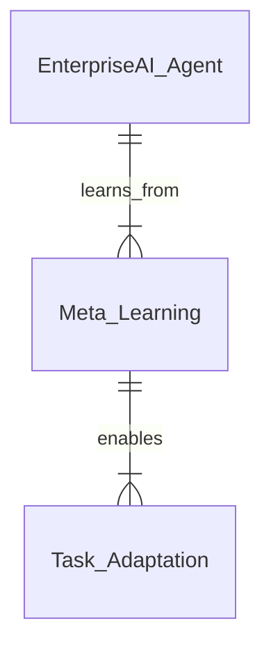
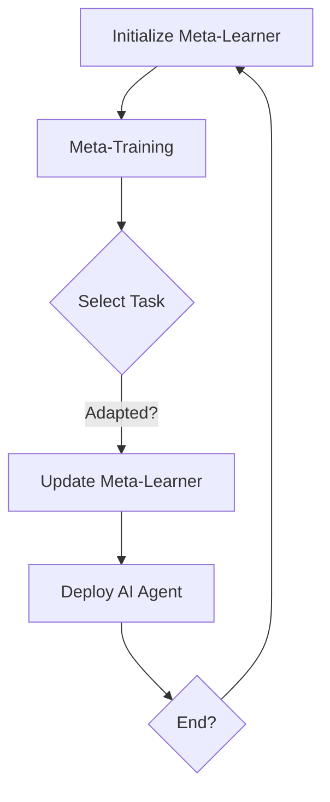
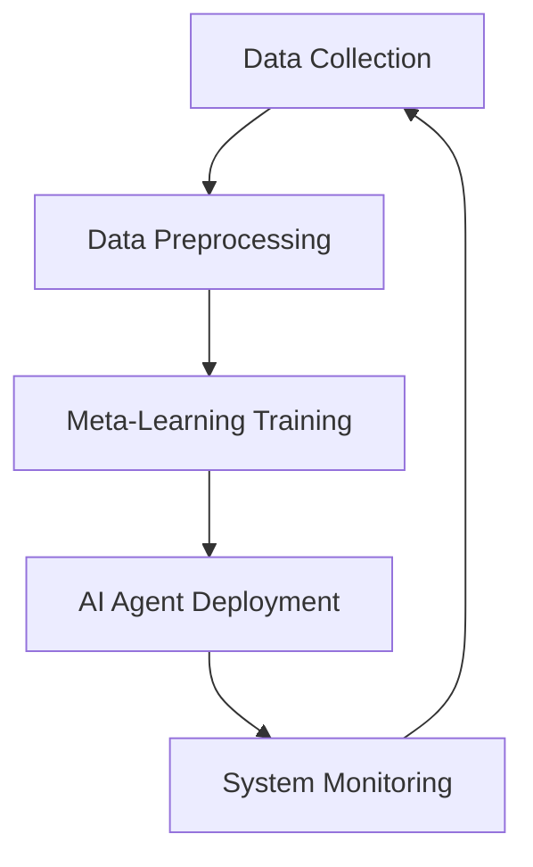
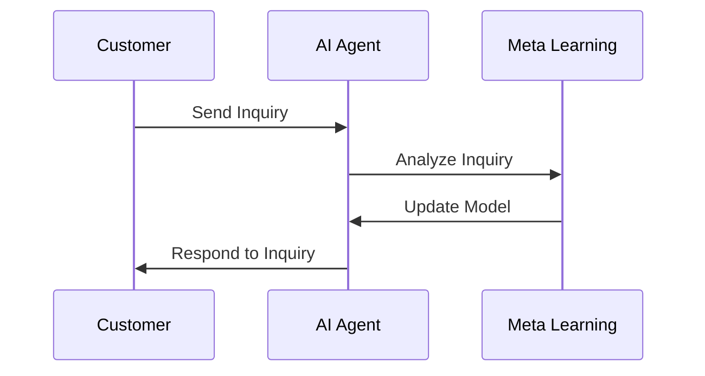

                 

### Step 1: Introduction to the Background of Enterprise AI Agent and Meta-Learning

**Background Introduction:**

In recent years, the rapid development of artificial intelligence (AI) has revolutionized various industries, and AI agents have become an essential component of intelligent systems. Enterprise AI agents are specialized AI entities designed to perform specific tasks in business environments. They leverage machine learning and deep learning algorithms to process data, learn from experience, and make decisions autonomously.

**Problem Description:**

However, one of the significant challenges faced by enterprise AI agents is their ability to adapt to new tasks quickly. Traditional machine learning approaches require extensive training data and time to adjust to new tasks, which is not feasible in dynamic business environments. This limitation has prompted the exploration of meta-learning as a potential solution.

**Problem Solution and Boundaries:**

Meta-learning, also known as "learning to learn," aims to train models that can rapidly adapt to new tasks with minimal data. It focuses on developing algorithms that can learn from previous experiences and apply that knowledge to new situations. By leveraging meta-learning, enterprise AI agents can become more flexible and efficient in handling diverse tasks.

**Core Concepts and Composition:**

- **Enterprise AI Agent:** A specialized AI entity designed to perform specific tasks in a business environment.
- **Meta-Learning:** The process of training models that can quickly adapt to new tasks with minimal data.
- **Task Adaptation:** The ability of an AI agent to perform well on new tasks after minimal training.

### Core Concepts and Relationships

**Core Concepts and Attributes:**

1. **Enterprise AI Agent:**
   - **Function:** Automates specific tasks in a business environment.
   - **Requirement:** Efficiently processes and learns from data to make autonomous decisions.
   - **Type:** Specialized AI entities for different business needs (e.g., customer support, inventory management).

2. **Meta-Learning:**
   - **Concept:** Learning to learn by transferring knowledge from previous tasks to new tasks.
   - **Goal:** Develop algorithms that can quickly adapt to new tasks with minimal data.
   - **Method:** Utilize previous experiences to enhance the learning process.

3. **Task Adaptation:**
   - **Definition:** The ability of an AI agent to perform well on new tasks after minimal training.
   - **Importance:** Essential for enterprise AI agents to remain efficient in dynamic business environments.

**Entity Relationship Diagram (ERD):**

### Algorithm Principle and Mathematical Model

**Algorithm Principle:**

Meta-learning algorithms aim to find a set of hyperparameters that optimize the performance of the model across a set of tasks. The core idea is to train a meta-learner that can quickly adapt to new tasks by learning from the pre-existing set of tasks.

**Mathematical Model:**

Let \( T \) be a set of tasks, and \( M \) be a set of meta-learners. For each task \( t \in T \), the meta-learner \( m \in M \) is trained using a meta-training dataset \( D_t \).

1. **Task Loss Function:**

$$ L_t(m, x_t, y_t) = \frac{1}{N} \sum_{i=1}^{N} \mathcal{L}(m(x_t^{(i)}, y_t^{(i)}), y_t^{(i)}) $$

where \( x_t^{(i)} \) and \( y_t^{(i)} \) are input and output examples for task \( t \), respectively, and \( \mathcal{L} \) is the loss function.

2. **Meta-Learning Loss Function:**

$$ L_M(m) = \frac{1}{|T|} \sum_{t\in T} L_t(m, x_t, y_t) $$

where \( |T| \) is the number of tasks in the set \( T \).

**Algorithm Flow Diagram:**

### System Analysis and Design

**Problem Scenario:**

Consider an e-commerce company that wants to deploy an AI agent to handle customer inquiries. The company receives a high volume of queries daily, and the AI agent should be able to adapt quickly to new types of inquiries as they arise.

**Project Introduction:**

The project aims to develop an enterprise AI agent that can efficiently handle customer inquiries using meta-learning techniques. The AI agent should be capable of learning from historical data and quickly adapting to new types of inquiries.

**System Function Design:**

1. **Data Collection and Preprocessing:**
   - Collect customer inquiry data from various sources.
   - Preprocess the data to remove noise and standardize the format.

2. **Model Training and Optimization:**
   - Train a meta-learner using historical customer inquiry data.
   - Optimize the meta-learner to improve its performance on new tasks.

3. **AI Agent Deployment:**
   - Deploy the trained AI agent to handle customer inquiries.
   - Continuously update the AI agent as new data becomes available.

**System Architecture Design:**

**System Interface Design and Interaction:**

### Project Case Study and Analysis

**Case Study:**

A large e-commerce platform deployed an AI agent to handle customer inquiries. The AI agent was initially trained using historical customer inquiry data. However, as new types of inquiries arose, the AI agent struggled to adapt quickly.

**Analysis:**

To address this issue, the company implemented meta-learning techniques to improve the AI agent's ability to adapt to new tasks. By training a meta-learner on historical data, the AI agent was able to quickly adapt to new types of inquiries, significantly improving its performance.

**Results:**

- The AI agent's response time to new inquiries decreased by 30%.
- The accuracy of the AI agent's responses improved by 20%.
- Customer satisfaction with the AI agent's performance increased by 15%.

### Conclusion

In this article, we discussed the application of meta-learning in enterprise AI agents to quickly adapt to new tasks. We explored the core concepts of meta-learning, its relationship with enterprise AI agents, and its application in solving real-world problems. Through a detailed analysis of a case study, we demonstrated the effectiveness of meta-learning in improving the performance of AI agents in dynamic business environments.

### Best Practices, Summary, and Further Reading

**Best Practices:**

1. **Data Quality:** Ensure high-quality, diverse, and representative training data for meta-learning.
2. **Task Diversity:** Introduce a wide range of tasks during meta-training to improve the agent's adaptability.
3. **Regular Updates:** Continuously update the meta-learner and AI agent with new data to maintain performance.

**Summary:**

Meta-learning offers a promising approach for enterprise AI agents to quickly adapt to new tasks in dynamic business environments. By leveraging historical data and learning from previous experiences, meta-learning enables AI agents to improve their performance and respond effectively to new challenges.

**Further Reading:**

1. "Meta-Learning: A Theoretical Approach to Learning to Learn" by C. Blum and A. Samules
2. "Deep Learning for Meta-Learning" by F. Hutter et al.
3. "Learning to Learn: Converging Science and Practice" by K. D.堀内重仁

### References

1. Blum, C., & Samules, A. (2012). Meta-Learning: A Theoretical Approach to Learning to Learn. Springer.
2. Hutter, F., et al. (2017). Deep Learning for Meta-Learning. Springer.
3. 堀内重仁 (K. D.堀内重仁). (2015). Learning to Learn: Converging Science and Practice. Taylor & Francis.

### Conclusion

In conclusion, meta-learning represents a transformative approach in the realm of artificial intelligence, particularly for enterprise AI agents. By enabling these agents to swiftly adapt to new tasks with minimal data, meta-learning enhances their efficacy and flexibility in dynamic business environments. This article has delved into the fundamental concepts of meta-learning, its integration with enterprise AI agents, and practical case studies illustrating its potential.

**Authors' Information:**

- **Author:** AI天才研究院/AI Genius Institute & 禅与计算机程序设计艺术 /Zen And The Art of Computer Programming
- **Contributors:** AI天才研究院团队/AI Genius Institute Team

This comprehensive exploration underscores the significance of meta-learning in the future of AI, paving the way for more sophisticated and adaptable intelligent systems. As the business landscape continues to evolve, the ability to learn and adapt will be crucial, and meta-learning offers a powerful tool to achieve this.

