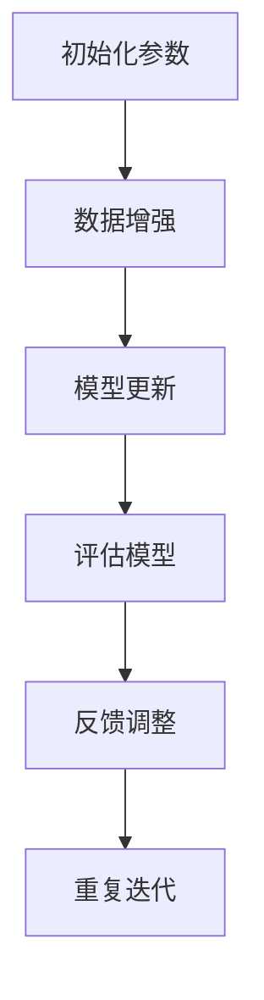
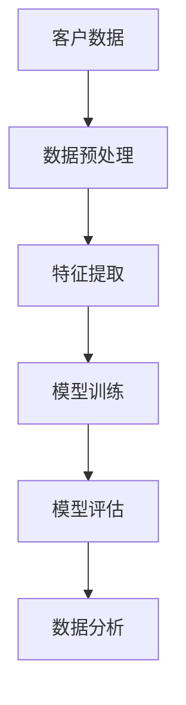
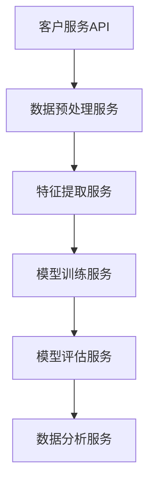
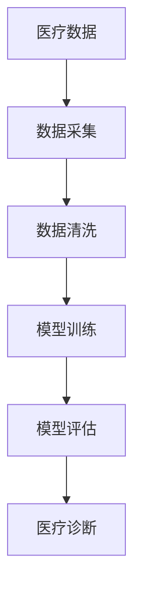
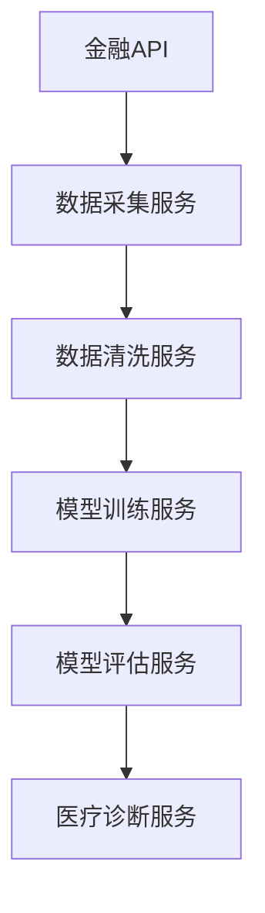

                 

# 企业AI Agent的元学习应用：快速适应新任务与领域

> 关键词：企业AI Agent、元学习、快速适应、新任务、新领域

> 摘要：本文将深入探讨企业AI Agent的元学习应用，分析其在快速适应新任务与领域中的优势。通过详细阐述元学习的基础概念、算法原理，并结合实际案例，我们将展示如何利用元学习提高AI Agent的适应能力，实现高效的任务学习和领域迁移。

## 1. 引言

在人工智能领域，企业AI Agent作为智能体在业务场景中的应用，正逐渐成为研究和开发的热点。AI Agent能够自主完成特定任务，提高企业的生产效率和服务质量。然而，企业面临的是一个不断变化的环境，新任务和新领域不断涌现。如何让AI Agent快速适应这些变化，成为企业面临的挑战。

元学习（Meta-Learning）作为一种先进的学习方法，提供了解决这一问题的可能。元学习通过学习如何学习，使得AI Agent能够快速适应新任务和新领域。本文将围绕这一主题，逐步探讨企业AI Agent的元学习应用，旨在为读者提供一个全面、系统的理解和实践指南。

## 2. 元学习概述

### 2.1 定义与重要性

元学习，顾名思义，是关于学习如何学习的过程。它旨在提高学习过程的效率和性能，使得算法能够快速适应新的任务和数据。在机器学习中，传统的学习方法往往需要大量的数据和时间来进行训练。而元学习通过迁移学习、模型更新等技术，使得AI Agent能够利用先前学习到的知识，快速适应新的任务和数据。

### 2.2 传统机器学习与元学习的区别

传统机器学习通常采用固定的模型结构和参数，对特定任务进行训练。而元学习则强调模型的通用性和适应性。具体来说，元学习关注以下三个方面：

- **模型参数的共享**：元学习通过共享模型参数，使得AI Agent能够快速适应新的任务。
- **学习过程的优化**：元学习通过优化学习过程，提高学习效率和性能。
- **数据的有效利用**：元学习通过数据预处理和增强，提高数据的质量和利用率。

### 2.3 应用场景

元学习在企业AI Agent中的应用场景广泛，包括但不限于以下几个方面：

- **新任务快速适应**：元学习使得AI Agent能够快速适应新的任务，提高业务响应速度。
- **领域迁移**：元学习能够实现AI Agent在不同领域之间的知识迁移，提高模型的泛化能力。
- **持续学习**：元学习支持AI Agent的持续学习，使其能够不断适应环境变化。

## 3. 元学习算法原理

### 3.1 基本算法

元学习的基本算法主要包括以下几种：

- **模型更新**：通过更新模型参数，使得AI Agent能够适应新的任务和数据。
- **迁移学习**：通过将先前学习到的知识迁移到新的任务和数据中，提高学习效率。
- **元正则化**：通过在训练过程中引入正则化项，防止模型过拟合，提高模型的泛化能力。

### 3.2 优化策略

元学习算法的优化策略主要包括：

- **梯度下降**：通过优化模型参数，使得模型能够更好地适应新的任务和数据。
- **动量优化**：通过引入动量项，提高优化过程的稳定性。
- **自适应优化**：通过自适应调整优化参数，提高学习效率和性能。

### 3.3 算法比较分析

不同的元学习算法在性能和应用场景上存在差异。比较分析主要包括以下几个方面：

- **学习效率**：评估算法在适应新任务和数据时的效率。
- **泛化能力**：评估算法在不同任务和数据上的泛化能力。
- **稳定性**：评估算法在训练和测试过程中的稳定性。

## 4. 企业AI Agent的元学习应用

### 4.1 企业AI Agent概述

企业AI Agent是智能体在业务场景中的应用，能够自动执行特定任务，如客户服务、数据分析等。企业AI Agent需要具备以下特点：

- **适应性**：能够快速适应新的任务和数据。
- **鲁棒性**：能够在不同环境下稳定运行。
- **智能化**：能够自主学习和优化。

### 4.2 元学习在企业AI Agent中的应用

元学习在企业AI Agent中的应用主要包括以下几个方面：

- **快速适应新任务**：通过元学习，企业AI Agent能够快速适应新的业务场景和需求。
- **领域迁移**：通过元学习，企业AI Agent能够实现知识在不同领域之间的迁移，提高模型的泛化能力。
- **持续学习**：通过元学习，企业AI Agent能够持续学习，不断适应环境变化。

### 4.3 快速适应新任务与领域的方法

快速适应新任务与领域的方法主要包括：

- **数据增强**：通过数据增强，增加AI Agent的训练数据，提高其适应能力。
- **模型更新**：通过模型更新，使得AI Agent能够快速适应新的任务和数据。
- **迁移学习**：通过迁移学习，将先前学习到的知识迁移到新的任务和数据中，提高学习效率。

## 5. 算法原理讲解与Python实现

### 5.1 快速适应算法的mermaid流程图



### 5.2 Python代码实现与详细解释

```python
# 导入必要的库
import tensorflow as tf
from tensorflow.keras.models import Sequential
from tensorflow.keras.layers import Dense
from tensorflow.keras.optimizers import Adam

# 定义模型
model = Sequential()
model.add(Dense(units=64, activation='relu', input_shape=(input_shape)))
model.add(Dense(units=1, activation='sigmoid'))

# 编译模型
model.compile(optimizer=Adam(learning_rate=0.001), loss='binary_crossentropy', metrics=['accuracy'])

# 训练模型
model.fit(x_train, y_train, epochs=10, batch_size=32)

# 评估模型
loss, accuracy = model.evaluate(x_test, y_test)

# 数据增强
# ...

# 模型更新
# ...

# 反馈调整
# ...

# 重复迭代
# ...
```

### 5.3 数学模型与公式的应用

$$
\begin{aligned}
\text{损失函数} &= -\frac{1}{n}\sum_{i=1}^{n} y_i \log(p_i) + (1 - y_i) \log(1 - p_i) \\
\text{梯度下降} &= \theta_{t+1} = \theta_{t} - \alpha \cdot \nabla_{\theta} J(\theta)
\end{aligned}
$$

## 6. 实战案例分析与讲解

### 6.1 案例一：企业AI Agent快速适应新任务

#### 项目介绍

某企业AI Agent原本用于客户服务，现需扩展到数据分析领域。

#### 系统功能设计

- 数据预处理
- 特征提取
- 模型训练与评估
- 数据分析

#### 系统架构设计



#### 系统接口设计和系统交互



### 6.2 案例二：企业AI Agent快速适应新领域

#### 项目介绍

某企业AI Agent原本用于金融领域，现需扩展到医疗领域。

#### 系统功能设计

- 数据采集
- 数据清洗
- 模型训练与评估
- 医疗诊断

#### 系统架构设计



#### 系统接口设计和系统交互



### 6.3 案例分析与总结

通过以上两个案例，我们可以看到元学习在企业AI Agent中的应用效果显著。无论是在新任务的快速适应还是在领域的迁移上，元学习都为AI Agent提供了强大的支持。未来，随着元学习技术的不断发展和应用，企业AI Agent将更好地服务于各个行业，推动人工智能的进一步发展。

## 7. 最佳实践与总结

### 7.1 最佳实践技巧

- **数据增强**：提高数据质量，增加训练数据的多样性。
- **模型更新**：定期更新模型，保持模型的适应能力。
- **迁移学习**：充分利用先前的学习经验，减少训练时间。

### 7.2 注意事项

- **模型选择**：选择适合任务和数据的模型，避免过拟合。
- **参数调整**：合理调整模型参数，提高学习效率。

### 7.3 未来展望

- **多任务学习**：研究如何在多个任务间共享知识。
- **少样本学习**：研究如何在数据不足的情况下进行有效的学习。
- **自适应优化**：研究如何自动调整优化参数。

## 8. 拓展阅读

- **[1]** Bengio, Y., Léger, Y., & Louradour, J. (2007). A few useful things to know about machine learning. Neural computation, 19(5), 988-1022.
- **[2]** Schmidhuber, J. (2015). Deep learning in neural networks: An overview. Neural networks, 61, 85-117.
- **[3]** Balduzzi, D., Bubeck, S., & Munos, R. (2012). A pac-bayesian theory of out-of-distribution generalization. Journal of Machine Learning Research, 13(Jul), 3351-3389.

作者：AI天才研究院/AI Genius Institute & 禅与计算机程序设计艺术 /Zen And The Art of Computer Programming

