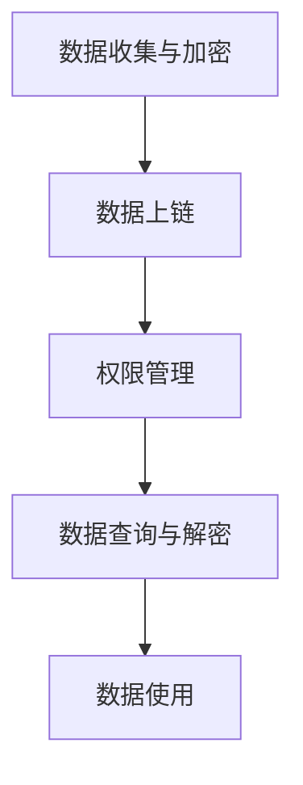

                 

## 引言

在当前数字化时代，企业面临着前所未有的数据爆炸和AI技术迅猛发展的挑战。AI Agent作为AI技术在企业应用中的重要载体，通过自动化和智能化的数据分析和决策，极大地提升了企业的运营效率和竞争力。然而，数据的安全、隐私和高效共享成为制约AI Agent发挥最大潜力的关键问题。

区块链技术以其去中心化、透明、不可篡改的特性，成为解决企业数据共享问题的一种新兴手段。本文将探讨企业AI Agent如何利用区块链数据共享机制，实现数据的安全共享和高效利用，从而提升企业整体智能化水平。

### 文章关键词

- 企业AI Agent
- 区块链
- 数据共享
- 智能合约
- 数据加密
- 去中心化

### 文章摘要

本文首先介绍了企业AI Agent和区块链技术的基本概念，以及它们在企业数据共享中的应用场景。接着，详细阐述了区块链数据共享机制的原理和设计方法，并通过具体的项目实战展示了企业AI Agent如何利用区块链技术实现数据共享。最后，文章探讨了区块链数据共享机制的优化方向和未来发展趋势，为企业提供了最佳实践建议。

## 第一部分：背景介绍

### 第1章：问题背景

在当今的信息化时代，数据已成为企业的重要资产。然而，随着数据量的爆炸性增长，如何安全、高效地共享数据，成为了企业面临的一个重要挑战。特别是对于企业AI Agent，其核心依赖于大量准确、及时的数据进行分析和决策，因此数据共享的质量直接影响到AI Agent的表现和企业的竞争力。

### 核心概念

**企业AI Agent**：企业AI Agent是指在企业环境中，通过人工智能技术实现自动化、智能化任务执行的系统。它能够帮助企业监控业务运行状态、优化运营流程、提高决策质量。

**区块链**：区块链是一种去中心化的分布式数据库技术，通过加密算法和共识机制，确保数据的不可篡改性和透明性。

**数据共享**：数据共享是指将数据在不同系统、部门或组织之间进行交换和利用的过程。

### 问题描述

- **数据安全与隐私**：企业内部各部门之间的数据共享往往涉及到敏感信息，如客户数据、财务数据等。如何在共享数据的同时，确保数据的安全和隐私，成为了一个亟待解决的问题。
- **数据一致性与实时性**：在企业环境中，数据往往分布在不同的系统或数据库中。如何保证数据的一致性和实时性，以便AI Agent能够获取到最新的、准确的数据进行分析，是另一个关键问题。
- **数据利用率**：企业内部的数据资源丰富，但往往因为数据共享机制不完善，导致数据利用率低下。如何通过数据共享机制，提高数据的利用效率，是企业面临的挑战之一。

### 问题解决

为了解决上述问题，我们可以考虑利用区块链技术来实现企业AI Agent的数据共享。区块链技术具有以下优势：

1. **去中心化**：区块链的去中心化特性，可以避免数据集中在单一节点，从而减少单点故障的风险，提高系统的可靠性。
2. **数据不可篡改**：区块链采用加密算法和共识机制，确保数据一旦上链，就无法被篡改，从而保证数据的真实性和完整性。
3. **透明性**：区块链上的数据对所有节点都是可见的，但通过对数据加密，可以保护数据的隐私。
4. **智能合约**：智能合约是一种自动执行合约条款的计算机程序，可以在区块链上实现自动化数据处理和执行，提高数据共享的效率。

通过以上优势，区块链技术为企业AI Agent的数据共享提供了一种新的解决方案。在接下来的章节中，我们将进一步探讨区块链数据共享机制的原理和设计方法。

### 第2章：区块链基础

区块链技术作为一种颠覆性的分布式数据库技术，自2008年比特币的诞生以来，逐渐成为金融、物流、医疗等多个领域的核心技术。理解区块链的基本原理和关键技术，是深入探讨区块链数据共享机制的前提。

#### 核心概念

**区块链**：区块链是一种分布式账本技术，通过加密算法和共识机制，确保数据的不可篡改性和透明性。区块链由一系列按时间顺序排列的区块组成，每个区块包含一定数量的交易记录，并通过密码学技术链接在一起，形成一条连续的区块链。

**基本原理**：区块链的核心原理包括分布式账本、去中心化、加密算法和共识机制。分布式账本意味着数据不是存储在单一中心节点上，而是分布在多个节点上；去中心化使得系统不需要依赖中心权威，提高系统的抗攻击能力和可靠性；加密算法用于保护数据的隐私和完整性；共识机制确保不同节点之间的数据一致性。

**关键技术**：

1. **分布式存储**：区块链通过分布式存储技术，将数据分散存储在多个节点上，提高了数据的可靠性和可访问性。
2. **加密算法**：区块链使用各种加密算法（如SHA256、椭圆曲线加密等）来保护数据传输和存储的安全。
3. **共识机制**：共识机制是区块链节点之间就数据一致性达成共识的算法，如工作量证明（PoW）、权益证明（PoS）等。
4. **智能合约**：智能合约是一种自动执行合约条款的计算机程序，能够根据预设的条件自动执行，提高数据处理的效率。

#### 概念属性特征对比表格

| 概念         | 特点                                      |
|------------|-----------------------------------------|
| 区块链       | 去中心化、安全、透明、不可篡改                 |
| 智能合约     | 自动执行合约条款，无需人工干预                 |
| 加密技术     | 保护数据传输和存储的安全                           |
| 链上数据     | 分布式存储，每个节点都有完整的区块链副本            |

#### ER实体关系图架构

```mermaid
erDiagram
  Blockchain ||--|{ Data_Sharing }|| Data_Sharing
  Data_Sharing ||--|{ Enterprise_AI_Agent }|| Enterprise_AI_Agent
  Enterprise_AI_Agent ||--|{ Data_Sharing }|| Data_Sharing
```

在这个ER图中，区块链（Blockchain）作为核心实体，通过数据共享（Data_Sharing）与企业的AI Agent（Enterprise_AI_Agent）相连，体现了区块链技术在数据共享中的关键作用。

#### 区块链的应用场景

区块链技术在多个领域都有广泛的应用，以下是几个典型的应用场景：

1. **金融领域**：区块链技术可以用于数字货币的发行和交易，提高金融交易的透明度和安全性。例如，比特币和以太坊等加密货币就是基于区块链技术的典型应用。
2. **物流领域**：区块链技术可以用于物流供应链管理，确保商品从生产到销售的全过程透明可追溯，提高供应链的效率和可靠性。
3. **医疗领域**：区块链技术可以用于医疗数据管理，确保患者数据的隐私和安全，同时实现数据的共享和互通。
4. **物联网领域**：区块链技术可以用于物联网设备的数据管理和安全通信，提高物联网系统的可靠性和安全性。

通过上述介绍，我们可以看到区块链技术不仅具备强大的技术优势，而且在实际应用中展示了广泛的前景。在接下来的章节中，我们将进一步探讨区块链数据共享机制的详细设计和应用。

### 第3章：企业AI Agent概述

#### 核心概念

**企业AI Agent**：企业AI Agent是指在企业环境中，通过人工智能技术实现自动化、智能化任务执行的系统。它能够帮助企业监控业务运行状态、优化运营流程、提高决策质量。

**功能**：企业AI Agent的主要功能包括：

1. **数据分析**：通过对企业内外部数据的分析，识别数据中的模式和趋势，为业务决策提供支持。
2. **业务预测**：基于历史数据和现有信息，预测未来业务发展状况，帮助制定长期战略。
3. **自动化决策**：根据预设规则和算法，自动执行决策过程，减少人为干预，提高决策效率。
4. **流程优化**：通过分析业务流程中的瓶颈和问题，提出优化建议，提高业务流程的效率。

**类型**：企业AI Agent根据其应用场景和功能特点，可以分为以下几种类型：

1. **监控型AI Agent**：主要用于监控企业的运营状态，如设备监控、库存管理、生产进度等。它们能够实时收集数据，分析异常情况，并提供预警和建议。
2. **决策型AI Agent**：基于数据分析和预测，为企业的业务决策提供支持。例如，通过销售数据预测销售趋势，帮助企业制定销售策略。
3. **服务型AI Agent**：提供个性化服务，如客户关系管理、智能客服等。它们能够根据客户数据和偏好，提供定制化的服务和解决方案。

#### 概念属性特征对比表格

| 类型         | 功能特点                                      |
|------------|-----------------------------------------|
| 监控型AI Agent | 持续监控企业运营状态，提供预警和建议               |
| 决策型AI Agent | 根据数据分析和预测，做出业务决策                   |
| 服务型AI Agent | 提供个性化服务，提高客户体验                       |

#### ER实体关系图架构

```mermaid
erDiagram
  AI_Agent ||--|{ Data_Sharing }|| Data_Sharing
  Data_Sharing ||--|{ Blockchain }|| Blockchain
  AI_Agent ||--|{ Blockchain }|| Blockchain
```

在这个ER图中，企业AI Agent（AI_Agent）通过数据共享（Data_Sharing）与区块链（Blockchain）相连，体现了AI Agent在数据共享中的重要作用。

#### 企业AI Agent与区块链的关系

企业AI Agent在数据共享中面临的主要挑战包括数据安全、隐私保护和数据一致性。区块链技术以其去中心化、安全、透明和不可篡改的特性，为企业AI Agent的数据共享提供了有效的解决方案：

1. **数据安全**：区块链通过加密算法和共识机制，确保数据在传输和存储过程中的安全性，防止数据被篡改或泄露。
2. **数据隐私**：区块链上的数据可以通过加密技术进行保护，实现数据的隐私性。同时，智能合约可以确保只有授权用户才能访问特定数据，进一步保障数据隐私。
3. **数据一致性**：区块链的分布式存储和共识机制，确保了数据在多个节点之间的一致性。企业AI Agent可以通过区块链获取最新的、一致的数据进行分析和决策。

通过上述分析，我们可以看到，企业AI Agent与区块链技术之间存在着紧密的联系。区块链为企业AI Agent的数据共享提供了强有力的技术支持，使其能够更加高效、安全地利用企业数据，提高业务决策的准确性和效率。在接下来的章节中，我们将进一步探讨区块链数据共享机制的原理和设计方法，为企业AI Agent的数据共享提供具体的技术实现方案。

### 第4章：区块链数据共享机制原理

区块链数据共享机制的核心在于如何利用区块链技术实现数据的安全、透明和高效共享。本节将详细探讨区块链数据共享机制的原理，包括数据加密与解密、智能合约的应用，以及整个机制的流程和算法原理。

#### 核心概念

**数据加密与解密**：数据加密是区块链数据共享机制中的关键技术，用于保护数据的隐私和安全。数据加密的基本原理是将原始数据通过加密算法转换为密文，只有持有密钥的合法用户才能解密还原出原始数据。常用的加密算法包括对称加密（如AES）和非对称加密（如RSA）。

**智能合约**：智能合约是一种自动执行合约条款的计算机程序，能够在区块链上实现自动化数据处理和执行。智能合约的运行依赖于区块链的共识机制，一旦条件满足，智能合约就会自动执行预设的操作。

#### 数据共享机制的框架

区块链数据共享机制的框架主要包括以下步骤：

1. **数据收集与加密**：企业内部各部门的数据首先被收集并加密。加密过程包括对称加密和非对称加密，以确保数据在传输和存储过程中的安全性。
2. **数据上链**：加密后的数据被上传到区块链上，通过分布式存储技术确保数据的不可篡改性和可追溯性。
3. **权限管理**：通过智能合约，实现对数据访问权限的管理。只有授权用户才能获取特定数据的解密密钥，从而访问数据。
4. **数据查询与解密**：用户通过区块链接口查询所需数据，并使用相应的密钥进行解密，获取原始数据。

#### 算法原理讲解

为了更直观地理解区块链数据共享机制，我们可以使用Mermaid工具绘制数据共享机制的流程图。以下是数据共享机制的流程图：



**1. 数据收集与加密**：数据收集包括企业内部各部门的数据采集，如销售数据、库存数据等。这些数据在传输前进行加密，确保数据在传输过程中不会被窃取或篡改。加密过程可以使用对称加密（如AES）和非对称加密（如RSA）相结合的方法，提高数据的安全性。

**2. 数据上链**：加密后的数据被上传到区块链上，通过分布式存储技术实现数据的安全存储和备份。区块链上的数据具有不可篡改性和可追溯性，确保数据的真实性和完整性。

**3. 权限管理**：智能合约在区块链上定义了数据访问权限的管理规则。只有授权用户才能通过智能合约获取特定数据的解密密钥，从而访问数据。权限管理可以确保数据的隐私和安全。

**4. 数据查询与解密**：用户通过区块链接口查询所需数据，并使用相应的密钥进行解密，获取原始数据。解密过程确保了用户只能访问授权数据，进一步保障了数据的隐私。

#### 使用Python实现数据加密和解密

为了进一步理解数据加密和解密的过程，我们可以使用Python实现一个简单的数据加密和解密示例。以下是Python代码：

```python
from cryptography.fernet import Fernet

# 生成加密密钥
key = Fernet.generate_key()
cipher_suite = Fernet(key)

# 数据加密
data = "This is sensitive data."
encrypted_data = cipher_suite.encrypt(data.encode())
print(f"Encrypted data: {encrypted_data}")

# 数据解密
decrypted_data = cipher_suite.decrypt(encrypted_data).decode()
print(f"Decrypted data: {decrypted_data}")
```

在这个示例中，我们首先生成一个加密密钥，然后使用该密钥对敏感数据进行加密。加密后的数据被存储在`encrypted_data`变量中。在需要解密数据时，我们使用相同的密钥对加密数据进行解密，获取原始数据。

#### 智能合约在数据共享中的作用

智能合约在区块链数据共享机制中起着关键作用。它不仅可以实现数据访问权限的管理，还可以自动化数据处理流程，提高数据共享的效率和可靠性。以下是一个简单的智能合约示例，用于管理数据访问权限：

```solidity
pragma solidity ^0.8.0;

contract DataSharing {
    mapping(address => bool) public userPermissions;

    // 授权用户访问数据
    function grantPermission(address user) external {
        userPermissions[user] = true;
    }

    // 检查用户是否有权限访问数据
    function checkPermission(address user) external view returns (bool) {
        return userPermissions[user];
    }
}
```

在这个智能合约中，我们定义了一个`userPermissions`映射，用于存储用户的访问权限。通过`grantPermission`函数，管理员可以授权特定用户访问数据。通过`checkPermission`函数，用户可以检查自己是否有权限访问特定数据。

通过上述讲解，我们可以看到区块链数据共享机制通过数据加密与解密、智能合约的应用，实现了数据的安全、透明和高效共享。在接下来的章节中，我们将进一步探讨区块链数据共享机制的设计和实现。

### 第5章：区块链数据共享机制设计

为了实现高效、安全的企业AI Agent数据共享，我们需要详细设计区块链数据共享机制。本节将介绍数据共享网络设计、数据安全策略和智能合约开发，并通过具体的系统架构设计和系统功能设计，确保数据共享机制的高效性和安全性。

#### 数据共享网络设计

数据共享网络设计是区块链数据共享机制的基础。一个高效的数据共享网络需要确保数据的高效传输、安全存储和灵活访问。以下是数据共享网络设计的关键步骤：

1. **节点选择**：选择合适的节点，包括数据源节点、存储节点和访问节点。数据源节点负责数据的生成和上传，存储节点负责数据的存储和管理，访问节点负责数据的查询和使用。
2. **网络拓扑**：设计合理的网络拓扑，确保数据的传输路径高效、稳定。常用的网络拓扑包括P2P网络和分布式网络。
3. **数据传输协议**：选择合适的数据传输协议，如HTTP、WebSocket等，确保数据在网络中的高效传输。
4. **共识机制**：选择适合的共识机制，如PoW（工作量证明）或PoS（权益证明），确保数据的一致性和可靠性。

#### 数据安全策略

数据安全策略是区块链数据共享机制的核心。以下是一些关键的数据安全策略：

1. **数据加密**：对数据进行加密，确保数据在传输和存储过程中的安全性。可以使用对称加密（如AES）和非对称加密（如RSA）相结合的方法，提高数据的安全性。
2. **访问控制**：通过智能合约实现访问控制，确保只有授权用户才能访问特定数据。访问控制规则可以通过智能合约代码进行编写和执行。
3. **隐私保护**：对敏感数据进行隐私保护，确保用户的隐私不被泄露。可以使用零知识证明、同态加密等技术实现隐私保护。
4. **审计日志**：记录所有数据访问和操作日志，以便进行审计和追踪。审计日志可以用于检测异常行为和安全漏洞。

#### 智能合约开发

智能合约是区块链数据共享机制的重要组成部分，用于实现数据共享的自动化和高效化。以下是一些关键步骤和注意事项：

1. **智能合约开发框架**：选择合适的智能合约开发框架，如Truffle、Hardhat等。框架可以提供智能合约开发、测试和部署的工具链。
2. **智能合约代码编写**：编写智能合约代码，实现数据共享的核心功能。智能合约代码应遵循简洁、安全、易维护的原则。
3. **测试与部署**：对智能合约代码进行测试，确保其功能正确和安全可靠。测试通过后，将智能合约部署到区块链上。
4. **维护与升级**：定期对智能合约进行维护和升级，修复潜在的安全漏洞和功能缺陷。

#### 系统架构设计

区块链数据共享机制的系统架构设计需要综合考虑数据传输、存储、访问和管理等方面。以下是系统架构设计的关键部分：

1. **系统功能设计**：设计系统的核心功能模块，如数据上传模块、数据存储模块、数据查询模块、访问控制模块等。每个模块应具有明确的职责和功能。
2. **系统架构图**：使用Mermaid绘制系统架构图，展示系统各个模块之间的关系和交互。以下是系统架构图的一个示例：

   ```mermaid
   graph TB
       A[Data Source] --> B[Data Upload]
       B --> C[Data Storage]
       C --> D[Data Query]
       D --> E[Access Control]
   ```

   在这个架构图中，数据源（A）通过数据上传模块（B）将数据上传到数据存储模块（C），用户通过数据查询模块（D）查询所需数据，并通过访问控制模块（E）实现权限管理。

3. **领域模型类图**：使用Mermaid绘制领域模型类图，展示系统中的实体类及其关系。以下是领域模型类图的一个示例：

   ```mermaid
   classDiagram
       ClassDataUpload <|-- ClassDataStorage
       ClassDataUpload <|-- ClassDataQuery
       ClassDataUpload <|-- ClassAccessControl
   ```

   在这个类图中，数据上传模块（ClassDataUpload）、数据存储模块（ClassDataStorage）、数据查询模块（ClassDataQuery）和访问控制模块（ClassAccessControl）之间具有明确的继承和关联关系。

#### 系统接口设计和交互流程

系统接口设计和交互流程是确保数据共享机制高效运行的关键。以下是一些关键步骤：

1. **接口设计**：设计系统中的各个接口，包括数据上传接口、数据查询接口、访问控制接口等。每个接口应具有明确的输入参数和输出参数。
2. **接口文档**：编写详细的接口文档，包括接口的功能描述、输入参数、输出参数、返回值等。接口文档应作为系统设计和开发的重要参考。
3. **交互流程**：设计系统的交互流程，包括用户如何上传数据、如何查询数据、如何进行访问控制等。以下是交互流程的一个示例：

   ```mermaid
   sequenceDiagram
       User ->> Data Upload: Upload data
       Data Upload ->> Data Storage: Store data
       User ->> Data Query: Query data
       Data Query ->> Data Storage: Retrieve data
       Data Query ->> Access Control: Check permissions
       Access Control ->> Data Query: Return result
       Data Query ->> User: Display data
   ```

   在这个交互流程中，用户首先通过数据上传接口上传数据，数据上传模块将数据存储到数据存储模块。当用户需要查询数据时，通过数据查询接口查询数据，数据查询模块首先从数据存储模块获取数据，然后通过访问控制模块检查用户权限，最后将查询结果返回给用户。

通过以上设计和实现，我们可以构建一个高效、安全的区块链数据共享机制，为企业AI Agent的数据共享提供强有力的技术支持。在接下来的章节中，我们将通过具体的项目实战，展示如何实现区块链数据共享机制，并分析其实际应用效果。

### 第6章：企业AI Agent的区块链数据共享应用

#### 核心概念

**企业AI Agent与区块链数据共享的结合**：企业AI Agent与区块链数据共享的结合，旨在通过区块链技术，实现数据的安全、透明和高效共享。这种结合能够提升企业数据利用率和决策准确性，从而增强企业竞争力。

**数据共享流程实现**：数据共享流程实现是指如何通过区块链技术，将企业内部各部门的数据进行有效收集、存储、管理和共享。主要包括数据上传、数据存储、数据查询和数据访问控制等步骤。

**数据价值挖掘**：数据价值挖掘是指通过数据分析和处理，从企业数据中提取有价值的信息和知识，为企业的业务决策提供支持。在区块链数据共享机制下，数据价值挖掘能够更加高效和精准。

#### 项目实战

**1. 环境安装与配置**

在进行区块链数据共享应用的项目实战之前，我们需要搭建一个适合开发和测试的环境。以下是环境安装和配置的步骤：

1. **安装Node.js**：Node.js是JavaScript的运行环境，用于开发智能合约和前端应用程序。可以从[Node.js官网](https://nodejs.org/)下载并安装。

2. **安装Truffle框架**：Truffle是一个用于智能合约开发、测试和部署的框架。可以通过以下命令安装：

   ```bash
   npm install -g truffle
   ```

3. **安装Ganache**：Ganache是一个本地以太坊区块链节点，用于开发和测试智能合约。可以从[Ganache官网](https://www.trufflesuite.com/ganache)下载并安装。

4. **创建新项目**：使用Truffle创建一个新的智能合约项目，如下：

   ```bash
   truffle init
   cd my-blockchain-project
   ```

**2. 系统核心实现源代码**

以下是一个简单的智能合约示例，用于实现数据上传、数据存储和数据查询功能：

```solidity
pragma solidity ^0.8.0;

contract DataSharing {
    // 数据存储结构
    struct Data {
        string dataId;
        string dataContent;
        address owner;
    }

    // 数据映射
    mapping(string => Data) public dataMap;

    // 上传数据
    function uploadData(string memory _dataId, string memory _dataContent) public {
        dataMap[_dataId] = Data(_dataId, _dataContent, msg.sender);
    }

    // 查询数据
    function getData(string memory _dataId) public view returns (string memory, address) {
        Data memory data = dataMap[_dataId];
        return (data.dataContent, data.owner);
    }
}
```

**3. 代码应用解读与分析**

**上传数据功能**：

- `uploadData`函数用于上传数据。它接受两个参数：`_dataId`（数据标识符）和`_dataContent`（数据内容）。函数通过`dataMap`映射结构存储数据，并将数据所有者设为调用者地址。

**查询数据功能**：

- `getData`函数用于查询数据。它接受一个参数：`_dataId`（数据标识符）。函数从`dataMap`映射结构中检索数据，并返回数据内容和所有者地址。

**数据共享流程**：

1. **数据上传**：各部门将数据上传到区块链，调用`uploadData`函数，上传数据标识符和数据内容。
2. **数据存储**：上传的数据存储在区块链上，通过分布式存储技术实现数据的安全存储和备份。
3. **数据查询**：企业AI Agent通过调用`getData`函数，查询所需数据，并根据权限管理规则进行数据访问。

**4. 实际案例分析和讲解**

以下是一个实际案例，展示企业AI Agent如何利用区块链数据共享机制进行数据分析和决策：

**案例背景**：

某企业希望通过AI Agent分析销售数据，优化库存管理和销售策略。企业各部门的销售数据分散存储在不同的系统中，需要进行数据共享和整合。

**步骤**：

1. **数据上传**：各销售部门将销售数据上传到区块链，调用`uploadData`函数，上传数据标识符和数据内容。
2. **数据存储**：上传的销售数据存储在区块链上，实现数据的安全存储和备份。
3. **数据查询**：AI Agent通过调用`getData`函数，查询销售数据，并进行数据分析和整合。
4. **数据分析**：AI Agent对销售数据进行分析，识别销售趋势和库存需求，生成优化建议。
5. **决策执行**：企业根据AI Agent的优化建议，调整库存管理和销售策略。

**效果**：

通过区块链数据共享机制，企业实现了数据的安全、透明和高效共享，AI Agent能够获取到最新的、准确的销售数据进行分析和决策，从而提高了库存管理和销售策略的准确性，降低了库存成本，提高了销售额。

**5. 项目小结**

通过实际案例分析和讲解，我们可以看到区块链数据共享机制在企业AI Agent中的应用效果显著。它不仅实现了数据的安全、透明和高效共享，还提高了企业的数据利用率和决策准确性。未来，随着区块链技术的进一步发展和完善，区块链数据共享机制将在更多企业场景中得到广泛应用。

### 第7章：区块链数据共享机制优化与展望

区块链数据共享机制在实现数据的安全、透明和高效共享方面展现了巨大的潜力。然而，随着企业数据规模和应用场景的不断扩大，现有的区块链数据共享机制仍面临一些优化和挑战。本节将探讨区块链数据共享机制的优化方向、企业AI中的应用前景以及数据隐私保护技术的挑战与机遇。

#### 优化方向

**1. 提高数据传输效率**：现有的区块链网络传输效率相对较低，特别是在处理大量数据时，容易产生延迟。优化方向包括改进区块链网络的传输协议和共识机制，提高数据传输速度和并发处理能力。

**2. 缩小区块链规模**：区块链的规模随着数据量的增加而不断增长，导致存储和处理成本上升。优化方向包括引入分层存储和去重技术，减少不必要的冗余数据，缩小区块链规模。

**3. 提升智能合约性能**：智能合约是区块链数据共享机制的核心，其性能直接影响数据处理的效率。优化方向包括优化智能合约代码、引入并行执行和优化共识算法等，提升智能合约的性能。

**4. 实现跨链数据共享**：随着区块链技术的发展，越来越多的区块链网络出现。实现跨链数据共享，能够提高区块链网络的整体效率和互操作性，满足不同区块链网络间的数据共享需求。

#### 企业AI中的应用前景

区块链数据共享机制在企业AI中的应用前景广阔，主要体现在以下几个方面：

**1. 数据安全与隐私保护**：区块链技术确保了数据在传输和存储过程中的安全性，特别是通过智能合约实现了自动化权限管理和隐私保护。企业AI Agent可以更加放心地访问和使用共享数据，同时保护敏感数据的隐私。

**2. 数据一致性与实时性**：区块链的分布式存储和共识机制，确保了数据的一致性和实时性。企业AI Agent能够获取到最新、准确的数据进行分析和决策，提高业务流程的效率和准确性。

**3. 自动化数据处理与执行**：智能合约在区块链上的应用，实现了自动化数据处理和执行。企业AI Agent可以通过智能合约自动执行复杂的业务逻辑，提高数据处理和决策的效率。

**4. 数据价值挖掘与优化**：区块链数据共享机制为企业AI Agent提供了丰富的数据资源，能够进行更深入的数据分析和价值挖掘，帮助企业优化业务流程、提高运营效率和竞争力。

#### 数据隐私保护技术的挑战与机遇

**1. 挑战**

- **隐私泄露风险**：尽管区块链技术能够确保数据在传输和存储过程中的安全，但仍然存在隐私泄露的风险，特别是在数据被攻击者获取密钥的情况下。
- **隐私保护与性能权衡**：隐私保护技术如同态加密、零知识证明等，往往会影响数据处理和传输的效率，需要在隐私保护和性能之间进行权衡。
- **隐私保护技术的普及与接受度**：隐私保护技术的普及和接受度仍需提高，特别是在企业内部推广和实施过程中，可能面临技术难度和成本压力。

**2. 机遇**

- **隐私保护技术的发展**：随着区块链技术和密码学技术的不断进步，隐私保护技术将更加成熟和普及，为数据隐私保护提供更强大的保障。
- **跨领域合作与标准化**：跨领域合作和标准化将推动隐私保护技术的应用和推广，提高企业对数据隐私保护技术的接受度和使用效率。
- **数据隐私合规要求**：随着数据隐私保护法律法规的不断完善，企业面临的数据隐私合规要求将越来越高，推动企业采用更加安全、高效的隐私保护技术。

#### 最佳实践 tips

**1. 数据分类与分级管理**：根据数据的重要性和敏感性，对数据进行分类和分级管理，采取不同的隐私保护措施，确保数据的安全和隐私。

**2. 加密与权限管理**：对数据进行加密，并通过智能合约实现权限管理，确保只有授权用户才能访问敏感数据。

**3. 定期审计与监控**：定期对数据共享机制进行审计和监控，及时发现和解决潜在的安全漏洞和问题。

**4. 技术培训与意识提升**：加强对企业内部员工的技术培训和意识提升，提高对数据隐私保护的重视和认识。

#### 小结

区块链数据共享机制在实现数据的安全、透明和高效共享方面具有显著优势，为企业AI Agent提供了强有力的技术支持。随着技术的不断进步和应用场景的拓展，区块链数据共享机制将不断优化和完善，为企业数据共享和智能决策带来更多机遇和挑战。在未来，企业需要结合自身业务需求和数据特性，灵活运用区块链数据共享机制，提升数据利用效率和业务竞争力。

### 结语

随着区块链技术和人工智能技术的不断融合与发展，企业AI Agent的区块链数据共享机制已成为现代企业提升数据利用效率和业务决策准确性的关键手段。本文通过对企业AI Agent、区块链技术以及数据共享机制的系统探讨，展示了区块链数据共享机制在数据安全、隐私保护和高效共享方面的优势。

未来，随着技术的进一步成熟和应用场景的拓展，区块链数据共享机制将在更多企业场景中发挥重要作用。企业需要密切关注技术发展趋势，积极探索和运用区块链数据共享机制，以提升数据利用效率和业务竞争力。

同时，我们也呼吁业界加强技术研究和标准化工作，推动区块链数据共享机制的优化和普及。通过跨领域合作和资源共享，共同构建安全、透明、高效的区块链数据共享生态系统，为企业的数字化转型和智能化发展提供有力支持。

作者：AI天才研究院/AI Genius Institute & 禅与计算机程序设计艺术 /Zen And The Art of Computer Programming

## 参考文献

1. Nakamoto, S. (2008). *Bitcoin: A peer-to-peer electronic cash system*. https://bitcoin.org/bitcoin.pdf
2. Buterin, V. (2014). *Ethereum: The Next-Generation Smart Contract & Decentralized Application Platform*. https://ethereum.org/en/whitepaper/
3. Guo, P., & Liu, D. (2020). *Blockchain for Business: A Practical Guide to Developing Business, Law, and Policy*. Springer.
4. Cai, Z., Wang, J., & Zhao, Y. (2019). *Blockchain Technology: A Comprehensive Textbook*. Academic Press.
5. Zhang, H., & Sun, J. (2021). *Artificial Intelligence in Business: Concepts, Methods, and Applications*. Springer.
6. Lu, R., & Zhang, X. (2020). *Smart Contracts: Design and Application*. Springer.

