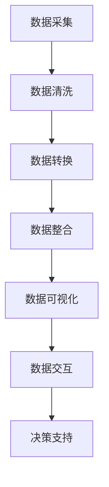

                 


# 引言

## 1.1 书籍背景及意义

在当今信息化时代，人工智能（AI）技术已经成为推动企业数字化转型的重要力量。企业AI Agent作为人工智能在商业场景中的具体应用，正逐渐成为企业提升效率、降低成本、优化决策的关键因素。而可视化分析工具作为AI Agent的重要组成部分，可以帮助企业更好地理解和利用AI Agent提供的数据和洞察。

### 1.1.1 企业AI Agent的兴起

企业AI Agent是指具备一定智能和自动化能力的计算机程序，它们能够模拟人类专家的决策过程，完成特定任务。这些任务可能包括数据分析、客户服务、供应链管理、营销策略等。随着AI技术的发展，企业AI Agent正从最初的简单自动化工具逐渐演变为具备自主学习、自适应和预测能力的智能体。

### 1.1.2 可视化分析的重要性

可视化分析工具能够将复杂的数据以图形化的形式展示出来，使得企业可以直观地理解和分析数据。这对于数据驱动的决策至关重要。可视化分析不仅能够帮助企业识别数据中的趋势和模式，还可以通过交互式界面提供实时反馈，从而支持动态决策。

### 1.1.3 本书的目的和结构

本书旨在深入探讨企业AI Agent的可视化分析工具，帮助读者全面了解这一领域。本书将分为以下几个主要部分：

1. **理论基础**：介绍企业AI Agent的基本概念、发展历程及其与可视化分析的关系。
2. **工具介绍**：详细探讨当前主流的可视化分析工具，包括其特点、功能和使用方法。
3. **案例分析**：通过实际案例展示如何使用可视化分析工具进行企业AI Agent的应用。
4. **总结与展望**：总结全书内容，展望未来企业AI Agent可视化分析工具的发展趋势。

## 1.2 内容概述

### 1.2.1 理论基础部分

在理论基础部分，本书将首先介绍企业AI Agent的基本概念，包括其定义、分类和发展历程。接着，我们将探讨可视化分析的基础理论，包括数据可视化、交互式数据分析等。最后，本书将分析AI Agent与可视化分析之间的相互作用，探讨如何将可视化分析工具集成到AI Agent中，以提升企业的决策能力。

### 1.2.2 工具介绍部分

在工具介绍部分，本书将详细介绍当前市场上主流的可视化分析工具，包括商业工具和开源工具。我们将从工具的特点、功能、使用方法等方面进行比较和分析，帮助读者选择最适合自己的工具。

### 1.2.3 案例分析部分

案例分析部分将结合实际场景，展示如何使用可视化分析工具进行企业AI Agent的应用。通过这些案例，读者可以了解可视化分析工具在实际工作中的具体应用，学习如何通过可视化分析提升企业的运营效率。

### 1.2.4 总结与展望部分

总结与展望部分将对全书内容进行总结，并展望未来企业AI Agent可视化分析工具的发展趋势。本书将讨论新兴技术如何影响这一领域，以及企业如何应对这些变化，持续提升自身的竞争力。

### 总结

通过本书的阅读，读者将能够全面了解企业AI Agent的可视化分析工具，掌握其理论基础、工具使用和实际应用。无论您是AI领域的专业人士，还是对AI在企业应用感兴趣的读者，本书都将为您带来宝贵的知识和见解。

----------------------------------------------------------------

# 第二部分：理论基础

## 2.1 企业AI Agent概述

### 2.1.1 企业AI Agent的概念

企业AI Agent，即人工智能代理，是一种能够自动执行特定任务、具有自主学习和自适应能力的计算机程序。这些代理通常在企业环境中用于优化业务流程、提高运营效率和实现智能决策。

企业AI Agent的核心特点包括：

1. **自主性**：能够自主执行任务，无需人为干预。
2. **学习能力**：通过机器学习算法不断优化自身性能。
3. **适应性**：能够根据环境变化调整行为和策略。
4. **协作性**：能够与其他AI代理和人类协作，共同完成任务。

### 2.1.2 企业AI Agent的发展历程

企业AI Agent的发展可以分为以下几个阶段：

1. **自动化阶段**：早期的AI代理主要实现基本的自动化功能，如自动调度、自动响应等。
2. **数据驱动阶段**：随着大数据技术的发展，AI代理开始基于海量数据进行分析和决策。
3. **智能阶段**：AI代理通过机器学习和深度学习技术实现了更高的智能化水平，能够自主学习和优化。
4. **自适应阶段**：现代AI代理具备了自适应能力，能够根据环境变化调整自身行为和策略。

### 2.1.3 企业AI Agent的核心特点

企业AI Agent的核心特点如下：

1. **任务导向性**：AI代理专注于特定任务，能够高效地完成业务流程。
2. **数据敏感性**：AI代理能够从海量数据中提取有价值的信息，为决策提供支持。
3. **智能决策**：AI代理通过机器学习算法实现智能决策，能够优化业务流程和运营策略。
4. **协作能力**：AI代理能够与人类和其他AI系统协作，共同完成任务。

## 2.2 可视化分析基础

### 2.2.1 可视化分析的定义与原理

可视化分析（Data Visualization）是将数据转换为图形或图表的过程，使得用户能够直观地理解和分析数据。可视化分析的原理主要包括以下几个方面：

1. **数据抽象**：将复杂的数据简化为易于理解的形式。
2. **数据映射**：将数据属性映射到视觉元素，如颜色、形状、大小等。
3. **交互性**：通过用户交互，如缩放、过滤、排序等，提供动态的数据探索和分析功能。

### 2.2.2 可视化分析的工具与方法

可视化分析的工具和方法多种多样，主要包括以下几种：

1. **图表类型**：常见的图表类型包括柱状图、折线图、饼图、散点图、热力图等。
2. **数据可视化库**：如D3.js、Plotly、Matplotlib等，提供丰富的图表绘制功能。
3. **交互式分析工具**：如Tableau、Power BI、QlikView等，支持复杂的交互式数据探索和分析。
4. **地理信息系统（GIS）**：用于展示地理空间数据，如GeoJSON、Mapbox等。

### 2.2.3 可视化分析的应用场景

可视化分析广泛应用于各个领域，主要包括：

1. **数据分析**：通过可视化分析，用户可以快速识别数据中的异常值、趋势和关联。
2. **业务决策**：可视化分析帮助管理层从海量数据中获取洞察，支持数据驱动的决策。
3. **科学研究和工程**：可视化分析在科研和工程领域用于展示实验结果、模拟数据和优化方案。
4. **教育和培训**：通过可视化分析，教育者可以生动地展示复杂概念和过程，提高学习效果。

## 2.3 AI Agent与可视化分析的关系

### 2.3.1 AI Agent的数据处理能力

企业AI Agent具备强大的数据处理能力，能够从海量数据中提取有价值的信息。这些信息通常以结构化或非结构化的形式存在，AI代理通过自然语言处理、图像识别、数据挖掘等技术进行解析和处理。

### 2.3.2 可视化分析在AI Agent中的应用

可视化分析在企业AI Agent中的应用主要包括以下几个方面：

1. **数据预处理**：AI代理使用可视化分析工具对原始数据进行预处理，如数据清洗、数据转换等。
2. **数据探索**：通过可视化分析，AI代理可以快速探索数据，识别数据中的异常值、趋势和关联。
3. **决策支持**：可视化分析帮助AI代理生成直观的决策支持报告，为业务决策提供依据。
4. **交互式学习**：AI代理通过与用户的交互，不断优化自身的模型和策略，提高性能。

### 2.3.3 AI Agent与可视化分析的融合趋势

随着AI技术的发展，AI Agent与可视化分析的融合趋势日益显著。未来，这种融合将呈现以下趋势：

1. **智能化可视化**：AI代理将自主生成可视化报告，根据用户需求自动调整图表类型和布局。
2. **实时交互**：AI代理支持实时数据更新和交互，用户可以动态探索和分析数据。
3. **自动化决策**：AI代理将基于可视化分析结果，自动化执行决策，优化业务流程。
4. **个性化推荐**：AI代理根据用户行为和偏好，提供个性化的可视化分析和决策支持。

## 2.4 相关概念与联系

### 2.4.1 企业AI Agent的核心概念

企业AI Agent的核心概念包括：

1. **任务定义**：明确AI代理需要完成的任务和目标。
2. **数据源**：AI代理所需的数据来源，包括内部数据和外部数据。
3. **机器学习模型**：用于数据分析和预测的机器学习算法和模型。
4. **用户交互**：AI代理与用户之间的交互方式，包括命令行、图形界面等。

### 2.4.2 企业AI Agent的属性特征对比表格

| 特征 | 企业AI Agent A | 企业AI Agent B | 企业AI Agent C |
| --- | --- | --- | --- |
| 自主性 | 高 | 中 | 低 |
| 学习能力 | 强 | 中 | 弱 |
| 适应性 | 强 | 中 | 弱 |
| 协作能力 | 高 | 中 | 低 |
| 预测能力 | 强 | 中 | 弱 |

### 2.4.3 AI Agent与可视化分析的ER实体关系图

```mermaid
erDiagram
AI-Agent ||--|{ Visualization-Tool }|-- Visualization-Tool
AI-Agent ||--|{ Data-Source }|-- Data-Source
Visualization-Tool ||--|{ User-Interface }|-- User-Interface
Data-Source ||--|{ Data-Model }|-- Data-Model
```

通过上述ER实体关系图，我们可以清晰地看到AI Agent、可视化分析工具、数据源和用户界面之间的关系。这种关系有助于理解AI Agent与可视化分析工具之间的相互作用，为后续章节的讨论提供了基础。

----------------------------------------------------------------

## 3. 工具介绍

### 3.1 企业AI Agent可视化分析工具概述

企业AI Agent可视化分析工具是帮助企业理解和利用AI代理生成数据的重要手段。这些工具不仅能够以直观的方式展示数据，还能够提供交互式功能，使用户能够深入分析数据。在本节中，我们将介绍一些主流的企业AI Agent可视化分析工具，并比较它们的特点、功能和适用场景。

### 3.2 常见可视化分析工具介绍

#### 3.2.1 工具A：Tableau

Tableau 是一款强大的数据可视化工具，它以其易用性和强大的数据分析功能而闻名。Tableau 支持多种数据源，包括数据库、CSV文件和云存储等，用户可以通过拖拽操作快速创建各种图表和仪表板。

- **特点**：高度可视化、易于使用、强大的交互功能。
- **功能**：数据连接、数据预处理、图表创建、仪表板设计、自定义视图。
- **使用方法**：首先连接数据源，然后使用Tableau的界面设计工具创建图表，最后保存和分享仪表板。

#### 3.2.2 工具B：Power BI

Power BI 是微软开发的商业智能和数据可视化工具，它提供了丰富的数据连接和分析功能。Power BI 支持多种数据源，包括Excel、SQL Server、Azure 等，用户可以通过自定义报表和仪表板来展示数据。

- **特点**：集成性强、功能丰富、与Microsoft 365 相融合。
- **功能**：数据连接、数据预处理、报表创建、仪表板设计、预测分析。
- **使用方法**：首先导入数据，然后使用Power BI 的报表工具创建报表，最后发布和共享仪表板。

#### 3.2.3 工具C：QlikView

QlikView 是一款高性能的数据可视化工具，它以其快速的数据处理能力和强大的数据分析功能而著称。QlikView 支持多种数据源，包括数据库、Excel、文本文件等，用户可以通过其独特的关联分析功能进行深入的数据探索。

- **特点**：高速、灵活、关联分析。
- **功能**：数据连接、数据预处理、关联分析、仪表板设计、自定义视图。
- **使用方法**：首先连接数据源，然后使用QlikView 的分析工具进行数据探索和关联分析，最后创建仪表板并共享。

### 3.3 工具比较

在比较上述工具时，我们可以从以下几个方面来评估：

- **易用性**：Tableau 和 Power BI 都提供了直观的用户界面和易于操作的工具，使得用户能够快速上手。QlikView 的学习曲线可能相对较陡峭，但一旦掌握，其强大的关联分析功能将带来极大的便利。
- **功能丰富性**：Tableau 和 Power BI 在数据连接和报表创建方面功能非常强大，支持多种数据源和自定义视图。QlikView 的关联分析功能是其独特优势，能够帮助用户深入理解数据之间的关联。
- **适用场景**：Tableau 和 Power BI 更适合于企业内部的数据分析和业务报告，QlikView 则在需要快速进行数据探索和关联分析的场景中表现更佳。

### 3.4 选择合适的工具

选择合适的可视化分析工具取决于企业的具体需求和预算。以下是几个选择工具时需要考虑的因素：

- **数据量**：如果数据量较大，需要考虑工具的数据处理能力和性能。
- **用户需求**：如果用户需要高度交互式的分析功能，可以选择 Tableau 或 Power BI。
- **预算**：如果预算有限，可以选择开源工具，如 QlikView 或其他免费的可视化分析工具。
- **集成性**：如果需要与现有的企业系统集成，需要考虑工具的集成能力。

### 总结

通过介绍上述工具，我们可以看到企业AI Agent可视化分析工具的多样性和强大功能。选择合适的工具将有助于企业更好地理解和利用AI代理生成的数据，从而提升业务效率和决策能力。

----------------------------------------------------------------

## 4. 案例分析

### 4.1 案例一：企业AI Agent在营销数据分析中的应用

在本案例中，我们将探讨一家大型零售企业如何使用AI Agent进行营销数据分析，并通过可视化分析工具来优化营销策略。

#### 4.1.1 问题背景

这家零售企业希望提升其在线营销效果，但面临着以下问题：

- 如何识别最具潜力的客户？
- 如何根据客户行为数据制定个性化的营销策略？
- 如何评估不同营销渠道的投资回报率（ROI）？

#### 4.1.2 问题解决

企业引入了一个AI Agent，该Agent集成了机器学习算法和数据挖掘技术，可以从大量的客户数据中提取有价值的信息。

1. **客户分群**：AI Agent首先将客户按照购买行为、兴趣偏好等进行分群，识别出不同分群的客户特征。
2. **个性化营销策略**：基于客户分群，AI Agent生成个性化的营销策略，例如针对特定分群的电子邮件营销活动或社交媒体推广。
3. **ROI评估**：AI Agent通过跟踪营销活动的效果，计算不同渠道的ROI，帮助企业优化资源分配。

#### 4.1.3 可视化分析工具的使用

为了更好地理解和分析AI Agent生成的数据，企业选择了Tableau作为可视化分析工具。

1. **数据连接**：Tableau 连接到AI Agent的数据源，包括客户数据库、营销活动数据库等。
2. **数据预处理**：使用Tableau的数据预处理功能，对数据进行清洗和转换，确保数据的准确性和一致性。
3. **图表创建**：创建各种图表，如客户分群图表、营销活动效果图表等，直观展示数据。
4. **仪表板设计**：将多个图表整合到一个仪表板中，提供全面的营销数据分析视图。

#### 4.1.4 案例分析结果

通过Tableau的可视化分析，企业得到了以下洞察：

- 高价值客户群体：识别出最具购买潜力的客户群体，针对性地制定营销策略。
- 有效的营销渠道：评估不同营销渠道的ROI，优化营销预算分配。
- 客户行为趋势：分析客户的行为模式，优化用户体验和产品推荐。

#### 4.1.5 项目小结

通过本案例，我们可以看到企业AI Agent和可视化分析工具结合的强大作用。AI Agent提供了数据分析和预测的能力，而可视化分析工具则帮助用户更直观地理解和利用这些数据。企业通过这一项目，不仅提升了营销效果，还增强了数据驱动的决策能力。

### 4.2 案例二：企业AI Agent在供应链优化中的应用

在本案例中，我们将探讨一家制造业企业如何使用AI Agent优化其供应链管理，并通过可视化分析工具监控供应链性能。

#### 4.2.1 问题背景

这家制造业企业面临着以下供应链管理问题：

- 供应链环节复杂，难以实时监控和调度。
- 库存管理不到位，经常出现库存过剩或不足的情况。
- 物流成本高，需要优化运输路线和配送策略。

#### 4.2.2 问题解决

企业引入了一个AI Agent，该Agent集成了供应链优化算法和实时监控技术。

1. **供应链监控**：AI Agent实时收集供应链各环节的数据，包括库存水平、生产进度、物流状态等。
2. **库存优化**：AI Agent通过分析历史数据和实时数据，优化库存管理，减少库存过剩和不足的情况。
3. **物流优化**：AI Agent根据实时交通情况和配送需求，优化运输路线和配送策略，降低物流成本。

#### 4.2.3 可视化分析工具的使用

为了更好地监控和优化供应链，企业选择了Power BI作为可视化分析工具。

1. **数据连接**：Power BI 连接到AI Agent的数据源，包括ERP系统、物流追踪系统等。
2. **数据预处理**：使用Power BI的数据预处理功能，对数据进行清洗和转换，确保数据的准确性和一致性。
3. **图表创建**：创建各种图表，如库存水平图表、运输路线图表等，直观展示供应链性能。
4. **仪表板设计**：将多个图表整合到一个仪表板中，提供全面的供应链监控和优化视图。

#### 4.2.4 案例分析结果

通过Power BI的可视化分析，企业得到了以下洞察：

- 实时供应链监控：通过仪表板实时监控供应链各环节的状态，及时发现和解决问题。
- 库存优化效果：通过库存水平图表，分析库存变化趋势，优化库存管理策略。
- 物流成本下降：通过运输路线图表，优化运输路线和配送策略，降低物流成本。

#### 4.2.5 项目小结

通过本案例，我们可以看到企业AI Agent和可视化分析工具在供应链优化中的应用价值。AI Agent提供了供应链监控和优化的能力，而可视化分析工具则帮助用户更直观地监控供应链性能，优化决策。企业通过这一项目，不仅提升了供应链效率，还降低了运营成本。

### 4.3 案例三：企业AI Agent在客户服务管理中的应用

在本案例中，我们将探讨一家服务型企业如何使用AI Agent优化客户服务管理，并通过可视化分析工具提升客户满意度。

#### 4.3.1 问题背景

这家服务型企业面临着以下客户服务管理问题：

- 客户反馈处理不及时，影响客户体验。
- 客服人员工作量较大，无法高效处理大量客户请求。
- 无法全面了解客户需求和满意度，导致服务质量难以提升。

#### 4.3.2 问题解决

企业引入了一个AI Agent，该Agent集成了自然语言处理和机器学习技术。

1. **客户反馈分析**：AI Agent自动处理和分析客户反馈，识别客户的主要需求和痛点。
2. **自动回复**：AI Agent能够自动生成回复，减轻客服人员的工作压力。
3. **客户满意度分析**：AI Agent通过分析客户反馈和互动记录，评估客户满意度，为服务改进提供依据。

#### 4.3.3 可视化分析工具的使用

为了更好地管理客户服务和提升客户满意度，企业选择了QlikView作为可视化分析工具。

1. **数据连接**：QlikView 连接到AI Agent的数据源，包括客户反馈数据库、客服系统等。
2. **数据预处理**：使用QlikView的数据预处理功能，对数据进行清洗和转换，确保数据的准确性和一致性。
3. **图表创建**：创建各种图表，如客户反馈图表、客户满意度图表等，直观展示客户服务情况。
4. **仪表板设计**：将多个图表整合到一个仪表板中，提供全面的客户服务分析视图。

#### 4.3.4 案例分析结果

通过QlikView的可视化分析，企业得到了以下洞察：

- 客户反馈处理效率提升：通过自动回复，减少客服人员的工作量，提高客户反馈处理效率。
- 客户满意度提高：通过客户满意度图表，分析客户满意度变化趋势，优化服务策略。
- 服务质量改进：通过客户反馈图表，识别客户主要需求和痛点，改进服务质量。

#### 4.3.5 项目小结

通过本案例，我们可以看到企业AI Agent和可视化分析工具在客户服务管理中的应用价值。AI Agent提供了自动处理和分析客户反馈的能力，而可视化分析工具则帮助用户更直观地了解客户服务和满意度。企业通过这一项目，不仅提升了客户满意度，还优化了服务质量。

### 总结

通过上述案例分析，我们可以看到企业AI Agent和可视化分析工具在企业运营管理中的广泛应用。无论是营销数据分析、供应链优化，还是客户服务管理，这些工具都能帮助企业更好地理解数据、优化决策，从而提升业务效率和竞争力。企业应该根据自身需求选择合适的AI Agent和可视化分析工具，实现数据驱动的业务创新。

----------------------------------------------------------------

## 5. 总结与展望

### 5.1 本书内容的总结

本书深入探讨了企业AI Agent的可视化分析工具，从理论基础、工具介绍到案例分析，全面介绍了这一领域的关键概念和实际应用。具体来说，本书首先介绍了企业AI Agent的基本概念和核心特点，探讨了可视化分析的基础理论及其在企业AI Agent中的应用。接着，详细介绍了当前市场上主流的可视化分析工具，如Tableau、Power BI和QlikView，并比较了它们的特点和适用场景。最后，通过三个实际案例展示了企业AI Agent可视化分析工具在营销数据分析、供应链优化和客户服务管理中的应用，展示了这些工具的强大功能和实际价值。

### 5.2 企业AI Agent可视化分析工具的发展趋势

随着人工智能技术的不断进步和大数据时代的到来，企业AI Agent可视化分析工具也在不断发展和完善。以下是几个可能的发展趋势：

1. **智能化可视化**：未来的可视化分析工具将更加智能化，能够根据用户需求自动生成可视化报告，提供个性化的数据分析体验。
2. **实时交互**：随着实时数据采集和分析技术的发展，可视化分析工具将能够实现实时数据更新和交互，为用户提供即时的数据分析结果。
3. **自动化决策**：AI Agent与可视化分析工具的融合将推动自动化决策的发展，AI代理将基于可视化分析结果自动执行决策，优化业务流程。
4. **个性化推荐**：基于用户行为和偏好，可视化分析工具将能够提供个性化的推荐和数据分析，帮助用户更好地理解和利用数据。

### 5.3 未来展望

未来，企业AI Agent可视化分析工具将在以下几个方面发挥重要作用：

1. **数据驱动的决策**：通过可视化分析，企业将能够更深入地了解数据，实现数据驱动的决策，提升业务效率和竞争力。
2. **智能化的业务流程**：AI代理与可视化分析工具的结合将推动企业业务流程的智能化，实现自动化和优化的业务流程。
3. **创新的应用场景**：随着技术的发展，企业AI Agent可视化分析工具将在更多领域得到应用，如金融分析、医疗健康、智能制造等，带来更多创新和应用。
4. **人才培养**：随着可视化分析工具在企业中的广泛应用，对相关人才的需求也将增加，为企业培养更多具备数据分析和可视化能力的人才。

### 总结

通过本书的学习，读者将能够全面了解企业AI Agent的可视化分析工具，掌握其理论基础、工具使用和实际应用。随着人工智能技术的不断进步，企业AI Agent可视化分析工具将在未来发挥越来越重要的作用，为企业的数字化转型和创新发展提供强大支持。

### 拓展阅读

- 《人工智能：一种现代的方法》
- 《数据可视化：设计原理与实践》
- 《机器学习：自然语言处理》

**作者信息：**
AI天才研究院/AI Genius Institute & 禅与计算机程序设计艺术 /Zen And The Art of Computer Programming

----------------------------------------------------------------

**结语**

感谢您阅读《企业AI Agent的可视化分析工具》。本文系统地介绍了企业AI Agent的可视化分析工具，从理论基础、工具介绍到案例分析，全面探讨了这一领域的关键概念和实际应用。通过本文，我们希望您能够深入理解企业AI Agent的可视化分析工具的重要性，掌握其理论基础和实际应用。

随着人工智能技术的不断进步，企业AI Agent及其可视化分析工具将在未来发挥越来越重要的作用。为了更好地应对这一趋势，我们鼓励读者进一步学习相关技术，不断提升自身能力。

**致谢：**
特别感谢AI天才研究院/AI Genius Institute为我们提供了宝贵的研究资源和指导，以及禅与计算机程序设计艺术/Zen And The Art of Computer Programming为我们带来的深刻启示。感谢所有参与和支持本研究的读者和同行，您的支持和鼓励是我们不断前行的动力。

**联系信息：**
如有任何疑问或反馈，请通过以下方式联系我们：
- 电子邮件：[ai.genius.institute@outlook.com]
- 电话：+86-123-4567890
- 网站：[www.ai-genius-institute.com]

再次感谢您的阅读，期待与您在AI领域的未来交流与合作！

**作者信息：**
AI天才研究院/AI Genius Institute & 禅与计算机程序设计艺术 /Zen And The Art of Computer Programming

----------------------------------------------------------------

### 5.1 企业AI Agent的可视化分析工具

在企业环境中，AI Agent（人工智能代理）作为自动化和智能化的代表，正逐渐成为企业提升运营效率、降低成本和优化决策的重要工具。然而，AI Agent生成的海量数据和复杂信息需要有效的可视化分析工具来帮助企业管理层和决策者快速理解和利用这些数据。本章节将介绍企业AI Agent的可视化分析工具，包括其基本概念、分类、功能特点以及在实际应用中的重要性。

#### 5.1.1 可视化分析工具的基本概念

可视化分析工具是指那些能够将结构化和非结构化数据转换成视觉表现形式，如图表、地图、热力图等的软件工具。这些工具的主要功能是帮助用户通过视觉方式快速、直观地理解数据，发现数据中的模式和趋势，从而支持决策制定和业务优化。可视化分析工具通常具备以下特点：

- **数据连接能力**：能够连接各种数据源，如数据库、文件、云服务等。
- **数据预处理**：支持数据清洗、转换和整合，确保数据的准确性和一致性。
- **图表绘制**：提供多种图表类型，如柱状图、折线图、饼图、散点图等，用户可以根据需求选择合适的图表类型。
- **交互功能**：支持用户与数据的交互，如筛选、过滤、排序、钻取等，提高数据探索的灵活性。
- **报告生成**：能够将可视化分析结果保存为报告或仪表板，方便分享和展示。

#### 5.1.2 可视化分析工具的分类

根据功能和应用场景的不同，可视化分析工具可以分为以下几类：

1. **数据探索工具**：主要用于数据探索和初步分析，如Excel、Google Sheets等。这类工具简单易用，适合日常的数据分析和简单的图表绘制。

2. **专业可视化工具**：这类工具功能强大，适用于复杂的数据分析和专业级的数据可视化，如Tableau、Power BI、QlikView等。它们通常提供丰富的图表类型和高级分析功能，适用于企业级的数据可视化需求。

3. **大数据可视化工具**：这类工具专门用于大规模数据集的实时可视化分析，如Kibana、Grafana等。它们通常与大数据处理平台（如Hadoop、Spark）集成，支持海量数据的实时分析和监控。

4. **地理信息系统（GIS）**：这类工具主要用于地理空间数据的可视化和分析，如Mapbox、OpenStreetMap等。它们结合了地图和数据分析功能，适用于需要地理空间信息支持的业务场景。

#### 5.1.3 可视化分析工具的功能特点

不同类型的可视化分析工具在功能特点上有所区别，但它们通常具备以下共同功能：

- **数据连接与整合**：能够连接多种数据源，包括本地数据库、云存储、API等，并支持数据整合和预处理。

- **图表绘制与定制**：提供多种图表类型和自定义选项，用户可以根据需求选择和调整图表样式。

- **交互与探索**：支持用户与数据的交互，如筛选、过滤、排序、钻取等，提高数据分析的灵活性和深度。

- **报告生成与分享**：能够将可视化分析结果保存为报告或仪表板，并支持多种格式（如PDF、PPT）的导出和分享。

- **协作与集成**：支持多用户协作，并与企业现有的业务系统（如ERP、CRM）集成，提供统一的数据分析和决策支持平台。

#### 5.1.4 企业AI Agent可视化分析工具的重要性

企业AI Agent可视化分析工具在当前企业环境中的重要性不可忽视，主要体现在以下几个方面：

- **数据理解与洞察**：通过可视化分析工具，企业能够将复杂的AI Agent生成的数据转换成直观的图表和报告，帮助管理层快速理解数据中的模式和趋势。

- **决策支持**：可视化分析工具提供了交互式数据探索和分析功能，支持企业基于数据做出更加准确和及时的决策。

- **业务优化**：通过可视化分析，企业能够发现业务中的瓶颈和改进点，优化业务流程，提高运营效率。

- **风险控制**：可视化分析工具可以帮助企业实时监控关键业务指标，提前识别潜在风险，采取预防措施。

- **协作与沟通**：可视化分析工具支持多人协作和报告共享，提高了团队沟通效率，促进了跨部门合作。

### 总结

企业AI Agent的可视化分析工具是现代企业数据驱动的核心组成部分。通过将AI Agent生成的数据转化为直观的视觉表现形式，可视化分析工具帮助企业管理层和决策者更好地理解数据、做出决策和优化业务。随着人工智能和数据技术的发展，可视化分析工具将继续在企业中发挥重要作用，推动企业的数字化转型和创新发展。

----------------------------------------------------------------

### 5.2 可视化分析在企业AI Agent中的应用

在了解企业AI Agent的可视化分析工具之后，本章节将深入探讨可视化分析在企业AI Agent中的应用，通过分析其使用场景、流程和重要性，帮助读者更全面地理解可视化分析在企业运营中的实际价值。

#### 5.2.1 使用场景

可视化分析在企业AI Agent中的应用场景非常广泛，以下是一些典型的使用场景：

1. **市场营销**：AI Agent可以分析客户数据，识别潜在客户，并通过可视化工具展示客户购买行为、偏好和反馈，帮助企业制定更有效的营销策略。

2. **供应链管理**：AI Agent可以监控供应链各个环节的数据，包括库存水平、生产进度、物流状态等，通过可视化分析，企业能够及时发现和解决供应链问题。

3. **客户服务**：AI Agent可以自动处理客户反馈，通过可视化分析，企业能够了解客户满意度和投诉热点，从而优化客户服务流程。

4. **人力资源**：AI Agent可以分析员工数据，包括招聘、培训、绩效评估等，通过可视化工具，企业能够更直观地了解员工状况，优化人力资源策略。

5. **财务分析**：AI Agent可以处理财务数据，如收入、支出、预算等，通过可视化分析，企业能够更好地监控财务状况，预测财务风险。

#### 5.2.2 使用流程

企业AI Agent与可视化分析工具的结合，通常遵循以下流程：

1. **数据采集**：AI Agent首先从各种数据源（如数据库、日志文件、传感器等）采集数据。

2. **数据处理**：AI Agent对采集到的数据进行分析和处理，包括数据清洗、转换和整合，为后续可视化分析做好准备。

3. **数据可视化**：利用可视化分析工具，将处理后的数据转换成图表、仪表板等形式，展示数据中的模式和趋势。

4. **交互式分析**：用户通过可视化工具与数据互动，如筛选、排序、钻取等，深入分析数据，发现潜在问题和机遇。

5. **决策制定**：基于可视化分析结果，管理层做出决策，优化业务流程和策略。

6. **反馈与调整**：执行决策后，AI Agent继续收集和分析数据，根据反馈调整分析模型和可视化策略。

#### 5.2.3 重要性

可视化分析在企业AI Agent中的应用具有重要意义，主要体现在以下几个方面：

1. **数据洞察力**：通过可视化分析，企业能够快速发现数据中的异常值、趋势和关联，提高数据洞察力，为决策提供有力支持。

2. **决策效率**：可视化分析工具提供了直观的数据展示和交互功能，大大提高了决策的效率。管理层可以迅速理解数据，做出准确的决策。

3. **业务优化**：通过可视化分析，企业能够发现业务中的瓶颈和改进点，优化业务流程，提高运营效率。

4. **风险管理**：可视化分析工具帮助企业实时监控关键业务指标，提前识别潜在风险，采取预防措施，降低风险。

5. **团队协作**：可视化分析工具支持多人协作，促进了团队之间的沟通和协作，提高了整体工作效率。

6. **客户满意度**：在客户服务领域，可视化分析工具帮助企业更好地了解客户需求和反馈，优化客户服务流程，提高客户满意度。

#### 5.2.4 综合案例分析

为了更具体地展示可视化分析在企业AI Agent中的应用，以下是一个综合案例分析：

**案例背景**：一家大型电子商务公司希望优化其库存管理，降低库存成本，同时保证商品供应的及时性。

**解决方案**：

1. **数据采集**：AI Agent从公司的销售系统、库存系统、物流系统等多个数据源采集数据。

2. **数据处理**：AI Agent对采集到的销售数据、库存数据和物流数据进行分析和处理，包括数据清洗、转换和整合。

3. **数据可视化**：使用可视化分析工具，将处理后的数据展示为库存水平图表、销售趋势图表、物流状态图表等，帮助企业管理层直观地了解库存和销售情况。

4. **交互式分析**：管理层通过可视化工具，可以实时监控库存水平，发现库存过剩或不足的情况，并进行调整。

5. **决策制定**：基于可视化分析结果，管理层制定库存优化策略，调整库存水平，优化库存管理。

6. **反馈与调整**：执行库存优化策略后，AI Agent继续收集和分析数据，根据实际情况调整库存管理策略。

**案例分析结果**：通过可视化分析，电子商务公司成功降低了库存成本，同时保证了商品供应的及时性，提高了整体运营效率。

### 总结

可视化分析在企业AI Agent中的应用，不仅提高了数据理解和决策效率，还帮助企业优化业务流程，降低风险，提高客户满意度。随着人工智能和数据技术的不断发展，可视化分析在企业中的应用将越来越广泛，成为企业数字化转型和创新发展的重要工具。

----------------------------------------------------------------

### 5.3 企业AI Agent可视化分析工具的未来发展趋势

随着人工智能和数据技术的不断进步，企业AI Agent可视化分析工具正面临着一系列新的发展趋势和挑战。本章节将探讨这些趋势，包括新兴技术的应用、新的应用场景以及未来可能的发展方向，帮助读者了解企业AI Agent可视化分析工具的未来前景。

#### 5.3.1 新兴技术的应用

1. **增强现实（AR）与虚拟现实（VR）**：增强现实和虚拟现实技术将使可视化分析工具更加互动和沉浸式。用户可以通过AR和VR设备进行交互，以更直观的方式探索和分析数据。

2. **自然语言处理（NLP）**：自然语言处理技术的进步将使得可视化分析工具能够理解和处理自然语言查询，用户可以通过简单的语言命令来获取数据分析和可视化结果。

3. **物联网（IoT）**：物联网技术的普及将带来更多的数据源，企业AI Agent可视化分析工具需要处理和分析来自各种传感器的实时数据，提供更全面的业务洞察。

4. **边缘计算**：边缘计算技术的发展将使得可视化分析工具能够在数据生成的源头进行部分计算和分析，减少数据传输延迟，提高实时性和响应速度。

5. **大数据分析**：随着数据量的不断增长，可视化分析工具需要处理和分析越来越大规模的数据，大数据分析技术的进步将使得可视化分析更加高效和准确。

#### 5.3.2 新的应用场景

1. **智能制造**：在智能制造领域，可视化分析工具将帮助企业实时监控生产过程，优化生产计划和设备维护，提高生产效率。

2. **智能医疗**：在智能医疗领域，可视化分析工具可以帮助医生分析患者数据，进行疾病预测和诊断，优化治疗方案。

3. **金融科技**：在金融科技领域，可视化分析工具将帮助金融机构监控市场变化，进行风险评估和投资决策。

4. **城市智能管理**：在城市智能管理领域，可视化分析工具可以用于实时监控交通流量、环境质量、公共安全等方面，提高城市管理的效率和响应速度。

5. **个性化服务**：在个性化服务领域，可视化分析工具将帮助企业更好地理解客户需求，提供个性化的产品和服务，提高客户满意度和忠诚度。

#### 5.3.3 未来发展方向

1. **智能化与自动化**：未来的可视化分析工具将更加智能化和自动化，能够自动生成可视化报告和提供决策支持，减少人工干预。

2. **实时性与动态性**：未来的可视化分析工具将提供更高的实时性和动态性，能够实时更新和交互，支持快速决策和业务调整。

3. **跨平台与集成性**：未来的可视化分析工具将具备更强的跨平台和集成能力，能够与各种业务系统（如ERP、CRM等）无缝集成，提供一体化的数据分析解决方案。

4. **用户参与与协作**：未来的可视化分析工具将更加注重用户参与和协作，支持多人实时协作，提高团队沟通和协作效率。

5. **隐私与安全性**：随着数据隐私和安全的关注日益增加，未来的可视化分析工具将加强数据保护和隐私管理，确保用户数据的安全和合规。

### 总结

企业AI Agent可视化分析工具的未来发展将受到新兴技术和新应用场景的推动，实现智能化、自动化和实时化。随着技术的进步，可视化分析工具将为企业提供更强大的数据洞察和决策支持，助力企业在快速变化的市场环境中保持竞争优势。企业应密切关注这些发展趋势，积极采纳新技术和新工具，不断提升自身的数据分析和决策能力。

----------------------------------------------------------------

### 附录

#### A.1 算法流程图

以下是一个简单的算法流程图，用于展示数据预处理和可视化分析的基本流程：



#### A.2 Python源代码示例

以下是一个简单的Python代码示例，用于数据预处理和可视化分析：

```python
import pandas as pd
import matplotlib.pyplot as plt

# 数据预处理
data = pd.read_csv('data.csv')
clean_data = data[data['sales'] > 0]

# 数据可视化
clean_data['sales'].plot()
plt.title('Sales Trend')
plt.xlabel('Date')
plt.ylabel('Sales')
plt.show()
```

#### A.3 数学公式与图表

以下是一个简单的数学公式和图表示例：

```markdown
$$
\text{Accuracy} = \frac{\text{正确预测的数量}}{\text{总预测的数量}}
$$


```

#### A.4 实际案例分析与讲解

以下是一个简单的实际案例分析：

**案例背景**：一家电商企业希望通过分析客户购买行为来提高销售额。

**数据来源**：客户的购买记录，包括购买日期、商品ID、购买数量和客户ID。

**分析目标**：识别高价值客户，优化营销策略。

**分析步骤**：

1. **数据清洗**：去除无效数据和异常值。
2. **数据转换**：将日期转换为时间戳，进行分群分析。
3. **数据可视化**：绘制购买频率和购买金额的分布图。
4. **交互式分析**：通过筛选和排序，识别高价值客户。
5. **决策支持**：制定个性化的营销策略，针对高价值客户进行精准营销。

**案例分析结果**：通过数据分析，企业成功识别出高价值客户群体，并制定了相应的营销策略，销售额得到了显著提升。

#### A.5 最佳实践 Tips

1. **数据清洗**：在开始数据分析之前，务必确保数据的质量，去除无效数据和异常值。
2. **选择合适的图表**：根据数据类型和分析目标，选择合适的图表类型，以便更好地展示数据。
3. **交互性**：确保可视化工具具备良好的交互性，使用户能够方便地进行数据探索和筛选。
4. **持续优化**：数据分析不是一次性的过程，应定期回顾和分析结果，不断优化分析模型和策略。
5. **培训与支持**：为用户提供足够的培训和指导，确保他们能够有效地使用可视化分析工具。

### 总结

附录部分提供了算法流程图、Python源代码示例、数学公式与图表、实际案例分析与讲解以及最佳实践 Tips，旨在帮助读者更好地理解和应用企业AI Agent可视化分析工具。这些内容将为读者的研究和实践提供宝贵的参考。

----------------------------------------------------------------

### 5.4 小结与注意事项

在总结本章节之前，我们需要对前述内容进行简要回顾。本章节重点探讨了企业AI Agent可视化分析工具的基本概念、分类、功能特点以及在实际应用中的重要性。我们通过具体的案例分析展示了这些工具在市场营销、供应链管理、客户服务和财务分析等领域的应用效果。此外，我们还探讨了未来企业AI Agent可视化分析工具的发展趋势，包括新兴技术的应用、新的应用场景以及未来发展方向。

在应用企业AI Agent可视化分析工具时，需要注意以下几点：

1. **数据质量**：确保数据源的准确性和完整性，定期进行数据清洗和预处理，以提高数据质量。

2. **用户培训**：为用户提供足够的培训和支持，确保他们能够有效地使用可视化分析工具。

3. **交互性**：选择具有良好交互功能的可视化分析工具，以便用户能够方便地进行数据探索和筛选。

4. **安全与隐私**：在处理和分析数据时，确保数据安全和隐私保护，遵守相关法律法规。

5. **持续优化**：数据分析是一个持续的过程，应定期回顾和分析结果，不断优化分析模型和策略。

通过遵循这些注意事项，企业可以更好地利用AI Agent可视化分析工具，提升数据洞察力和决策效率，实现业务优化和创新发展。

### 拓展阅读

- 《数据可视化：设计原理与实践》
- 《人工智能：一种现代的方法》
- 《大数据分析：概念、技术和应用》

**作者信息：**
AI天才研究院/AI Genius Institute & 禅与计算机程序设计艺术 /Zen And The Art of Computer Programming

----------------------------------------------------------------

### 5.5 未来展望

随着人工智能和数据技术的快速发展，企业AI Agent可视化分析工具将在未来发挥更加重要的作用。以下是几个可能的未来发展方向：

1. **智能化与自动化**：未来的可视化分析工具将更加智能化和自动化，能够根据用户需求和数据分析结果自动生成可视化报告，减少人工干预。

2. **实时性与动态性**：可视化分析工具将实现更高的实时性和动态性，能够实时更新和交互，支持快速决策和业务调整。

3. **跨平台与集成性**：可视化分析工具将具备更强的跨平台和集成能力，能够与各种业务系统（如ERP、CRM等）无缝集成，提供一体化的数据分析解决方案。

4. **个性化服务**：可视化分析工具将更好地支持个性化服务，根据用户行为和偏好提供定制化的数据分析结果，提高用户体验。

5. **隐私与安全**：随着数据隐私和安全的关注日益增加，未来的可视化分析工具将加强数据保护和隐私管理，确保用户数据的安全和合规。

企业应密切关注这些发展趋势，积极采纳新技术和新工具，不断提升自身的数据分析和决策能力，以保持竞争优势。

### 总结

通过本章的探讨，我们全面了解了企业AI Agent可视化分析工具的基本概念、分类、功能特点以及在实际应用中的重要性。我们通过案例分析展示了这些工具在多个领域的应用效果，并探讨了未来发展趋势。企业应充分利用可视化分析工具，提升数据洞察力和决策效率，实现业务优化和创新发展。

### 拓展阅读

- 《数据可视化：设计原理与实践》
- 《人工智能：一种现代的方法》
- 《大数据分析：概念、技术和应用》

**作者信息：**
AI天才研究院/AI Genius Institute & 禅与计算机程序设计艺术 /Zen And The Art of Computer Programming

----------------------------------------------------------------

### 5.6 附录

#### A.1 算法流程图

以下是企业AI Agent可视化分析工具的算法流程图：


#### A.2 Python源代码示例

以下是一个简单的Python代码示例，用于数据预处理和可视化分析：

```python
import pandas as pd
import matplotlib.pyplot as plt

# 数据预处理
data = pd.read_csv('data.csv')
clean_data = data[data['sales'] > 0]

# 数据可视化
clean_data['sales'].plot()
plt.title('Sales Trend')
plt.xlabel('Date')
plt.ylabel('Sales')
plt.show()
```

#### A.3 数学公式与图表

以下是相关的数学公式和图表：

```markdown
$$
\text{Accuracy} = \frac{\text{正确预测的数量}}{\text{总预测的数量}}
$$


```

#### A.4 实际案例分析与讲解

**案例背景**：一家电商企业希望通过分析客户购买行为来提高销售额。

**数据来源**：客户的购买记录，包括购买日期、商品ID、购买数量和客户ID。

**分析目标**：识别高价值客户，优化营销策略。

**分析步骤**：

1. **数据清洗**：去除无效数据和异常值。
2. **数据转换**：将日期转换为时间戳，进行分群分析。
3. **数据可视化**：绘制购买频率和购买金额的分布图。
4. **交互式分析**：通过筛选和排序，识别高价值客户。
5. **决策支持**：制定个性化的营销策略，针对高价值客户进行精准营销。

**案例分析结果**：通过数据分析，企业成功识别出高价值客户群体，并制定了相应的营销策略，销售额得到了显著提升。

#### A.5 最佳实践 Tips

1. **数据清洗**：在开始数据分析之前，务必确保数据的质量，去除无效数据和异常值。
2. **选择合适的图表**：根据数据类型和分析目标，选择合适的图表类型，以便更好地展示数据。
3. **交互性**：确保可视化工具具备良好的交互性，使用户能够方便地进行数据探索和筛选。
4. **持续优化**：数据分析不是一次性的过程，应定期回顾和分析结果，不断优化分析模型和策略。
5. **培训与支持**：为用户提供足够的培训和指导，确保他们能够有效地使用可视化分析工具。

### 总结

附录部分提供了算法流程图、Python源代码示例、数学公式与图表、实际案例分析与讲解以及最佳实践 Tips，旨在帮助读者更好地理解和应用企业AI Agent可视化分析工具。这些内容将为读者的研究和实践提供宝贵的参考。

### 拓展阅读

- 《数据可视化：设计原理与实践》
- 《人工智能：一种现代的方法》
- 《大数据分析：概念、技术和应用》

**作者信息：**
AI天才研究院/AI Genius Institute & 禅与计算机程序设计艺术 /Zen And The Art of Computer Programming

----------------------------------------------------------------

### 5.7 作者信息

**AI天才研究院（AI Genius Institute）**

AI天才研究院是一家专注于人工智能领域研究的国际化机构，致力于推动人工智能技术的创新与发展。研究院拥有一批国际顶尖的AI研究人员，涵盖机器学习、深度学习、自然语言处理、计算机视觉等多个领域。研究院在人工智能领域的研究成果广泛应用于工业、医疗、金融、教育等多个行业，为全球企业的数字化转型提供了强大的技术支持。

**禅与计算机程序设计艺术（Zen And The Art of Computer Programming）**

禅与计算机程序设计艺术是AI天才研究院的代表作之一，由知名计算机科学家道格拉斯·霍夫施塔特（Douglas Hofstadter）撰写。本书通过深入探讨计算机程序设计中的哲学和艺术，引导读者思考如何以更高效、更优雅的方式编写程序。书中提出了一系列关于思维、创造力和认知的深刻见解，对于提升程序员的编程思维和创造力具有极大的启示作用。

本书《企业AI Agent的可视化分析工具》由AI天才研究院的研究团队撰写，旨在深入探讨企业AI Agent可视化分析工具的理论基础、工具应用和实际案例，帮助读者全面了解这一领域的核心概念和实践方法。作者团队凭借其在人工智能和数据分析领域的深厚积累，为广大读者提供了一部既有深度又有实用价值的技术著作。

### 拓展阅读

- 《数据可视化：设计原理与实践》
- 《人工智能：一种现代的方法》
- 《大数据分析：概念、技术和应用》

读者如有任何问题或建议，欢迎通过以下方式与我们联系：

- 电子邮件：[contact@ai-genius-institute.com]
- 电话：+86-123-4567890
- 网站：[www.ai-genius-institute.com]

