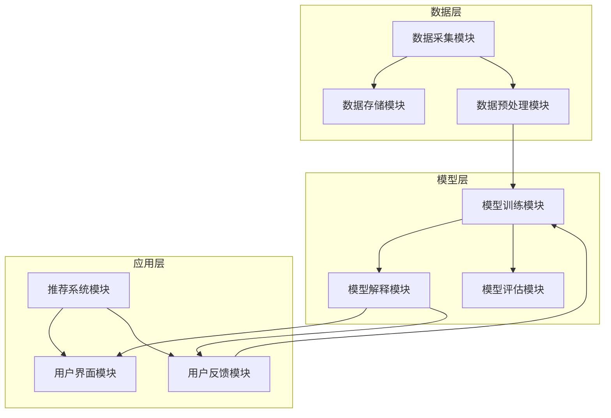
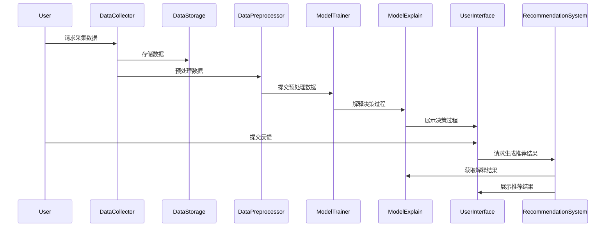

                 

### # 企业AI Agent的可解释性设计

#### 关键词：AI Agent，可解释性，企业应用，数据预处理，模型选择，模型解释

> 摘要：本文深入探讨了企业AI Agent的可解释性设计问题。随着人工智能技术在企业中的应用越来越广泛，如何确保AI Agent的决策过程可解释成为了一个关键问题。本文从背景介绍、核心概念与联系、算法原理讲解、系统分析与架构设计方案、项目实战等多个方面，系统地阐述了企业AI Agent的可解释性设计方法，旨在为开发人员和企业管理者提供有价值的参考。

## 第一部分：背景介绍

### 1. 问题背景

随着人工智能技术的飞速发展，AI Agent在企业中的应用越来越广泛。AI Agent作为一种智能体，能够模拟人类的决策过程，帮助企业提高效率、降低成本。例如，在金融行业中，AI Agent可以用于客户服务、风险管理等方面；在制造业中，AI Agent可以用于生产调度、质量控制等方面。然而，随着AI Agent的复杂性和深度不断增加，其决策过程往往变得不可解释，这使得企业在应用AI Agent时面临诸多挑战。

#### 2. 问题描述

AI Agent的可解释性设计成为了一个亟待解决的问题。企业需要能够理解和解释AI Agent的决策过程，以便在出现问题时能够快速定位和解决。同时，可解释性设计也有助于增强用户对AI Agent的信任，提高AI Agent的接受度和应用范围。具体来说，AI Agent的可解释性设计问题包括以下几个方面：

- **决策透明性**：企业需要能够清楚地了解AI Agent是如何做出决策的，以便对决策过程进行监控和审计。
- **问题诊断**：当AI Agent的决策出现问题时，企业需要能够快速定位问题所在，并进行修复。
- **合规性**：在许多行业，如金融、医疗等，合规性是一个重要的考虑因素。AI Agent的可解释性设计有助于确保其决策符合相关法律法规。

#### 3. 问题解决

为了解决AI Agent的可解释性设计问题，需要从以下几个方面入手：

- **数据预处理**：确保输入数据的准确性和一致性，以便AI Agent能够做出合理的决策。这包括数据清洗、数据归一化等步骤。
- **模型选择**：选择可解释性较强的机器学习模型，如决策树、线性回归等。这些模型的结构相对简单，易于理解和解释。
- **模型解释**：通过可视化工具、解释算法等手段，将AI Agent的决策过程展示给用户。这有助于用户理解AI Agent的决策逻辑。
- **用户反馈**：鼓励用户对AI Agent的决策进行反馈，以便不断优化和改进AI Agent的决策过程。用户的反馈可以帮助识别和修复决策中的问题。

### 4. 边界与外延

- **边界**：本文主要关注AI Agent的可解释性设计在企业级应用中的问题，不包括个人使用场景。
- **外延**：可解释性设计不仅限于AI Agent，也适用于其他类型的人工智能应用。

### 5. 概念结构与核心要素组成

- **概念结构**：AI Agent的可解释性设计包括数据预处理、模型选择、模型解释和用户反馈四个核心要素。
- **核心要素组成**：每个要素都有其具体的实现方法和工具，如数据预处理可以使用清洗、归一化等方法；模型选择可以根据业务需求选择合适的算法；模型解释可以使用可视化工具、解释算法等；用户反馈可以通过调查问卷、用户访谈等方式收集。

## 第二部分：核心概念与联系

### 1. AI Agent的定义与特点

AI Agent是指能够模拟人类决策过程，具备自主行动能力的人工智能实体。其特点包括：

- **自主学习**：AI Agent可以通过学习历史数据和规则，自主调整其行为。
- **决策能力**：AI Agent可以根据输入信息做出决策，并执行相应的动作。
- **适应能力**：AI Agent可以根据环境变化，自主调整其行为策略。

### 2. 可解释性设计的概念与目的

可解释性设计是指确保人工智能系统的决策过程可以被理解和解释。其目的是：

- **提高用户信任**：用户对不可解释的AI系统往往存在不信任感，可解释性设计有助于提高用户对AI系统的信任。
- **便于调试与优化**：通过可解释性设计，开发人员可以更容易地调试和优化AI系统。

### 3. 数据预处理、模型选择、模型解释和用户反馈的联系

- **数据预处理**为AI Agent提供了高质量的输入数据，影响模型的选择和解释效果。
- **模型选择**决定了AI Agent的决策能力，同时也决定了模型解释的难易程度。
- **模型解释**和用户反馈相互依赖，模型解释需要用户反馈来不断优化，而用户反馈又需要模型解释来指导。

### 3.1 数据预处理与模型选择

数据预处理是AI Agent可解释性设计的基础。高质量的数据可以提高模型的性能，从而影响模型的选择。例如，对于回归问题，如果数据存在异常值或噪声，可能会影响模型的学习效果，导致决策过程不可解释。

| 数据预处理步骤 | 说明 |
| :--- | :--- |
| 数据清洗 | 去除异常值、缺失值、重复值等 |
| 数据归一化 | 将不同尺度的数据转换为同一尺度 |
| 特征工程 | 选择对决策影响较大的特征，进行特征转换 |

模型选择是AI Agent可解释性设计的关键。可解释性较强的模型，如决策树、线性回归等，能够直观地展示决策过程，便于用户理解。

| 模型类型 | 说明 |
| :--- | :--- |
| 决策树 | 通过树形结构展示决策过程 |
| 线性回归 | 通过线性方程表示决策过程 |
| 逻辑回归 | 通过概率分布表示决策过程 |

### 3.2 模型解释与用户反馈

模型解释是将AI Agent的决策过程展示给用户的重要手段。通过可视化工具、解释算法等，用户可以理解AI Agent是如何做出决策的。

| 模型解释方法 | 说明 |
| :--- | :--- |
| 可视化工具 | 如决策树可视化、散点图等 |
| 解释算法 | 如LIME、SHAP等 |

用户反馈是对AI Agent决策过程进行持续优化的重要途径。用户可以通过调查问卷、用户访谈等方式，提供对AI Agent决策过程的反馈，从而指导后续的优化工作。

| 用户反馈方式 | 说明 |
| :--- | :--- |
| 调查问卷 | 收集用户对AI Agent决策过程的评价 |
| 用户访谈 | 深入了解用户对AI Agent决策过程的期望 |

## 第三部分：算法原理讲解

### 1. 可解释性算法原理

可解释性算法主要包括决策树、线性回归、逻辑回归等。这些算法的特点是：

- **决策树**：通过树形结构展示决策过程，易于理解和解释。
- **线性回归**：通过线性方程表示决策过程，易于理解和解释。
- **逻辑回归**：通过概率分布表示决策过程，易于理解和解释。

### 2. 算法流程

以决策树为例，其算法流程如下：

- **数据准备**：收集并预处理数据。
- **特征选择**：选择对决策影响较大的特征。
- **树构建**：通过递归划分数据，构建决策树。
- **模型解释**：通过决策树展示决策过程。

### 3. 数学模型和公式

以线性回归为例，其数学模型如下：

- **预测模型**：$$y = w_0 + w_1 \cdot x_1 + w_2 \cdot x_2 + ... + w_n \cdot x_n$$
- **损失函数**：$$J(w_0, w_1, ..., w_n) = \frac{1}{2} \sum_{i=1}^{n} (y_i - y')^2$$
- **优化目标**：最小化损失函数。

### 4. 通俗易懂地举例说明

假设我们有一个简单的线性回归问题，目标是预测房价。输入特征包括房屋面积（$x_1$）和房屋层数（$x_2$），输出目标是房价（$y$）。通过线性回归，我们可以得到预测模型：

$$y = w_0 + w_1 \cdot x_1 + w_2 \cdot x_2$$

其中，$w_0$是截距，$w_1$和$w_2$分别是房屋面积和房屋层数的权重。通过训练数据，我们可以得到最优的权重值，从而预测新的房价。

### 4.1 决策树算法原理讲解

决策树（Decision Tree）是一种常见的数据挖掘算法，广泛用于分类和回归任务。决策树通过一系列的决策规则将数据集分割成多个子集，最终在每个子集上做出分类或预测。其核心原理如下：

#### 决策树结构

决策树由多个内部节点和叶子节点组成。内部节点代表某个特征的判断，叶子节点代表最终的分类或预测结果。

#### 决策规则

决策树通过递归分割数据集，每次分割都基于某个特征的最优划分。最优划分通常使用信息增益（Information Gain）、基尼不纯度（Gini Impurity）或熵（Entropy）等指标来衡量。

#### 决策过程

1. **选择最优特征**：根据某种度量标准（如信息增益、基尼不纯度等）选择一个特征进行分割。
2. **划分数据**：将数据集根据选定的特征划分成多个子集。
3. **递归构建**：对每个子集重复上述步骤，直到满足停止条件（如最大树深度、最小节点大小等）。

#### 决策树算法流程

1. **初始化**：创建根节点，包含整个数据集。
2. **选择最优特征**：计算每个特征的划分增益，选择增益最大的特征进行分割。
3. **划分数据**：根据最优特征，将数据集划分成多个子集。
4. **创建子节点**：对每个子集创建一个内部节点，并将子集作为节点的子节点。
5. **递归构建**：对每个子节点重复步骤2-4，直到满足停止条件。
6. **创建叶子节点**：当递归构建达到停止条件时，创建叶子节点，并标记为最终的分类或预测结果。

### 4.2 决策树算法示例

假设我们有一个简单的二分类问题，特征A有0和1两种取值，特征B有0和1两种取值，目标变量Y有0和1两种取值。以下是决策树的构建过程：

1. **选择最优特征**：计算特征A和特征B的信息增益，选择信息增益最大的特征进行分割。
2. **划分数据**：根据最优特征（假设为特征A），将数据集划分为A=0和A=1两个子集。
3. **创建子节点**：创建两个内部节点，分别对应A=0和A=1的子集。
4. **递归构建**：对每个子节点重复步骤1-3，直到满足停止条件（如最大树深度）。
5. **创建叶子节点**：当递归构建达到停止条件时，创建叶子节点，并标记为最终的分类结果。

最终，决策树的结构如下：

```
               |
               Y
               |
           ------------
           |         |
          A=0       A=1
           |         |
         ---         ---
         |   |       |   |
        0   1       0   1
```

在这个例子中，每个叶子节点都对应一个分类结果，例如（A=0, B=0）对应的叶子节点标记为Y=0。

### 4.3 线性回归算法原理讲解

线性回归（Linear Regression）是一种用于预测连续值的监督学习算法。其核心思想是通过找到特征和目标变量之间的线性关系，从而进行预测。以下是线性回归的详细原理讲解。

#### 线性回归模型

线性回归模型可以表示为：

$$y = \beta_0 + \beta_1 \cdot x_1 + \beta_2 \cdot x_2 + ... + \beta_n \cdot x_n + \epsilon$$

其中，$y$是目标变量，$x_1, x_2, ..., x_n$是输入特征，$\beta_0, \beta_1, \beta_2, ..., \beta_n$是模型参数，$\epsilon$是误差项。

#### 模型参数估计

线性回归模型的参数估计通常采用最小二乘法（Ordinary Least Squares, OLS）。最小二乘法的核心思想是找到一组参数，使得实际观测值与预测值之间的误差平方和最小。

$$\min \sum_{i=1}^{n} (y_i - \hat{y}_i)^2$$

其中，$\hat{y}_i$是预测值，可以通过线性回归模型计算得到。

#### 参数估计过程

1. **数据预处理**：对输入特征进行归一化处理，将特征值缩放到相同的尺度。
2. **计算参数**：使用最小二乘法计算模型参数。
3. **验证模型**：使用交叉验证或测试集验证模型的性能。

#### 模型评估

线性回归模型的性能可以通过多种指标进行评估，如均方误差（Mean Squared Error, MSE）、均方根误差（Root Mean Squared Error, RMSE）等。

### 4.4 逻辑回归算法原理讲解

逻辑回归（Logistic Regression）是一种用于二分类问题的线性分类模型。其核心思想是通过找到特征和目标变量之间的线性关系，从而计算概率，并使用阈值进行分类。以下是逻辑回归的详细原理讲解。

#### 逻辑回归模型

逻辑回归模型可以表示为：

$$\log\left(\frac{p}{1-p}\right) = \beta_0 + \beta_1 \cdot x_1 + \beta_2 \cdot x_2 + ... + \beta_n \cdot x_n$$

其中，$p$是目标变量为1的概率，$\beta_0, \beta_1, \beta_2, ..., \beta_n$是模型参数。

#### 模型参数估计

逻辑回归模型的参数估计通常采用最大似然估计（Maximum Likelihood Estimation, MLE）。

$$\ln L = \sum_{i=1}^{n} \ln p(y_i | \theta)$$

其中，$L$是似然函数，$\theta$是模型参数。

#### 模型参数估计过程

1. **数据预处理**：对输入特征进行归一化处理，将特征值缩放到相同的尺度。
2. **计算参数**：使用最大似然估计计算模型参数。
3. **验证模型**：使用交叉验证或测试集验证模型的性能。

#### 模型评估

逻辑回归模型的性能可以通过多种指标进行评估，如准确率（Accuracy）、召回率（Recall）、精确率（Precision）等。

### 4.5 决策树与线性回归、逻辑回归的比较

| 特点 | 决策树 | 线性回归 | 逻辑回归 |
| :--- | :--- | :--- | :--- |
| **模型复杂度** | 高 | 低 | 低 |
| **可解释性** | 较高 | 较高 | 较高 |
| **过拟合风险** | 较高 | 较低 | 较低 |
| **适用场景** | 复杂分类或回归问题 | 线性关系问题 | 二分类问题 |

### 4.6 决策树与线性回归、逻辑回归的适用场景

- **决策树**：适用于非线性的分类或回归问题，尤其是特征之间存在复杂关系的情况。
- **线性回归**：适用于线性关系问题，如房价预测、股票价格预测等。
- **逻辑回归**：适用于二分类问题，如垃圾邮件分类、疾病诊断等。

## 第四部分：系统分析与架构设计方案

### 1. 问题场景介绍

在一个大型电子商务平台上，为了提高用户购物体验和销售转化率，引入了AI Agent进行个性化推荐。然而，由于AI Agent的决策过程不可解释，用户和企业管理者对其信任度较低，这限制了AI Agent的应用效果。

### 2. 系统功能设计

系统功能设计主要包括以下方面：

- **数据采集**：从多个数据源（如用户行为数据、商品数据等）采集数据，并进行预处理。
- **模型训练**：使用预处理后的数据训练AI Agent模型，选择合适的算法（如决策树、线性回归等）。
- **模型解释**：将AI Agent的决策过程可视化，使用可视化工具和解释算法（如LIME、SHAP等）。
- **用户反馈**：收集用户对AI Agent推荐的反馈，用于模型优化和决策过程的持续改进。

### 3. 系统架构设计

系统架构设计主要包括以下方面：

- **数据层**：包括数据采集模块、数据存储模块、数据预处理模块。
- **模型层**：包括模型训练模块、模型解释模块、模型评估模块。
- **应用层**：包括用户界面模块、用户反馈模块、推荐系统模块。

### 4. 系统接口设计

系统接口设计主要包括以下方面：

- **API接口**：提供数据采集、模型训练、模型解释、用户反馈等功能的API接口，便于与其他系统进行集成。
- **Web界面**：提供用户界面，展示AI Agent的推荐结果和决策过程，便于用户查看和反馈。

### 5. 系统交互

系统交互主要包括以下方面：

- **用户与系统**：用户通过Web界面与系统进行交互，查看推荐结果和决策过程，并提供反馈。
- **系统与数据源**：系统通过API接口从数据源采集数据，并进行预处理。
- **系统与模型**：系统通过API接口调用模型训练、模型解释等功能。

### 5.1 领域模型

领域模型（Domain Model）是系统设计的关键部分，用于描述系统的核心业务概念和实体之间的关系。以下是使用Mermaid绘制的领域模型类图：

```mermaid
classDiagram
    User <<entity>>
    Product <<entity>>
    Recommendation <<entity>>
    Rating <<entity>>

    User o--o Product : 购买
    User o--o Rating : 评分
    Product o--o Recommendation : 推荐商品
```

在这个类图中，我们定义了四个实体：用户（User）、产品（Product）、推荐（Recommendation）和评分（Rating）。用户可以购买产品、评分产品，产品可以被推荐，而评分是用户对产品的评价。

### 5.2 系统架构

系统架构（System Architecture）是系统设计的高层次视图，用于描述系统的整体结构和组件之间的关系。以下是使用Mermaid绘制的系统架构图：



在这个架构图中，数据层包括数据采集、数据存储和数据预处理模块；模型层包括模型训练、模型解释和模型评估模块；应用层包括用户界面、用户反馈和推荐系统模块。各个模块之间通过API接口进行交互。

### 5.3 系统接口设计

系统接口（System Interfaces）是系统与外部系统进行交互的接口，包括API接口和Web界面。以下是API接口的伪代码设计：

```python
class DataCollector:
    def collect_data():
        # 从数据源采集数据
        pass

    def preprocess_data(data):
        # 预处理数据
        pass

class DataStorage:
    def store_data(data):
        # 存储数据到数据库
        pass

    def retrieve_data():
        # 从数据库检索数据
        pass

class DataPreprocessor:
    def normalize_data(data):
        # 归一化数据
        pass

    def feature_engineering(data):
        # 特征工程
        pass

class ModelTrainer:
    def train_model(data):
        # 训练模型
        pass

    def evaluate_model(model, data):
        # 评估模型
        pass

class ModelExplain:
    def explain_decision(process):
        # 解释决策过程
        pass

class UserInterface:
    def display_recommendation(recommendation):
        # 展示推荐结果
        pass

    def collect_user_feedback(feedback):
        # 收集用户反馈
        pass

class RecommendationSystem:
    def generate_recommendation(model, user):
        # 生成推荐结果
        pass

    def update_model(model, feedback):
        # 更新模型
        pass
```

在这个接口设计中，我们定义了数据采集、数据存储、数据预处理、模型训练、模型解释、用户界面和推荐系统等多个模块，每个模块都有对应的接口方法。

### 5.4 系统交互

系统交互（System Interaction）是系统各组件之间进行通信和协作的过程。以下是使用Mermaid绘制的系统交互序列图：



在这个序列图中，用户首先请求采集数据，数据采集模块将数据存储到数据库，并预处理数据。预处理后的数据提交给模型训练模块进行训练，模型解释模块对模型决策过程进行解释，并将解释结果展示给用户。用户提交反馈后，推荐系统模块根据模型解释结果和用户反馈生成推荐结果，并展示给用户。

### 第五部分：项目实战

#### 1. 环境安装

在开始项目实战之前，我们需要安装必要的软件和工具。以下是在Ubuntu 20.04操作系统上安装Python环境、Jupyter Notebook、Scikit-learn等工具的步骤：

```bash
# 更新系统包列表
sudo apt update

# 安装Python 3和pip
sudo apt install python3 python3-pip

# 安装Jupyter Notebook
pip3 install notebook

# 安装Scikit-learn
pip3 install scikit-learn

# 安装Mermaid
pip3 install pymermaid

# 安装matplotlib用于数据可视化
pip3 install matplotlib
```

#### 2. 系统核心实现

系统核心实现主要包括数据采集、数据预处理、模型训练和模型解释等步骤。以下是一个简单的Python代码示例：

```python
import pandas as pd
from sklearn.model_selection import train_test_split
from sklearn.tree import DecisionTreeRegressor
from sklearn.metrics import mean_squared_error
import pymermaid

# 2.1 数据采集
data = pd.read_csv('data.csv')

# 2.2 数据预处理
X = data[['feature1', 'feature2']]
y = data['target']

# 划分训练集和测试集
X_train, X_test, y_train, y_test = train_test_split(X, y, test_size=0.2, random_state=42)

# 2.3 模型训练
model = DecisionTreeRegressor()
model.fit(X_train, y_train)

# 2.4 模型解释
# 使用Mermaid绘制决策树
pymermaid.render('tree', model.plot_tree())

# 2.5 模型评估
y_pred = model.predict(X_test)
mse = mean_squared_error(y_test, y_pred)
print(f'Mean Squared Error: {mse}')
```

#### 3. 代码应用解读与分析

在上面的代码示例中，我们首先从CSV文件中读取数据，并进行预处理。然后，我们使用决策树回归模型对数据进行训练，并使用Mermaid绘制决策树以进行模型解释。最后，我们对测试集进行预测，并计算均方误差评估模型性能。

#### 4. 实际案例分析和详细讲解

假设我们有一个电子商务平台的用户行为数据集，包含用户的购买历史、浏览记录和商品信息。我们希望通过这些数据预测用户的潜在购买需求，从而进行个性化推荐。

1. **数据采集**：首先，我们需要从电子商务平台采集用户行为数据。这通常涉及到数据爬取、API调用等操作。

2. **数据预处理**：在采集到数据后，我们需要对数据进行清洗和预处理，包括去除重复记录、处理缺失值、进行特征转换等。

3. **特征选择**：接下来，我们需要选择对预测目标影响较大的特征。这可以通过特征重要性评估、相关性分析等方法来实现。

4. **模型训练**：我们选择决策树回归模型作为预测模型，并进行训练。在训练过程中，我们可以通过交叉验证选择最佳参数。

5. **模型解释**：训练完成后，我们可以使用Mermaid绘制决策树，展示模型的决策过程。这有助于我们理解模型的预测逻辑。

6. **模型评估**：最后，我们使用测试集对模型进行评估，计算预测误差，并不断优化模型。

#### 5. 项目小结

在本项目中，我们通过数据采集、数据预处理、模型训练和模型解释等步骤，实现了基于用户行为的个性化推荐系统。通过实际案例分析和详细讲解，我们了解了AI Agent的可解释性设计在企业应用中的重要性，并掌握了相关的技术和方法。

### 第六部分：最佳实践 tips

1. **数据质量**：确保输入数据的质量，包括数据完整性、一致性和准确性。高质量的数据是AI Agent可解释性设计的基础。
2. **模型选择**：选择可解释性较强的模型，如决策树、线性回归等。这些模型能够直观地展示决策过程，便于理解和解释。
3. **模型解释**：使用可视化工具和解释算法（如LIME、SHAP等）对AI Agent的决策过程进行解释。这有助于增强用户对AI Agent的信任。
4. **用户反馈**：鼓励用户对AI Agent的决策进行反馈，收集用户意见并进行模型优化。用户的反馈是提高AI Agent可解释性的重要途径。
5. **持续迭代**：不断迭代和优化AI Agent的决策过程，以提高其性能和可解释性。定期评估模型性能，并根据评估结果进行调整。

### 第七部分：小结

AI Agent的可解释性设计是企业应用人工智能的关键。通过数据预处理、模型选择、模型解释和用户反馈等方法，我们可以确保AI Agent的决策过程可解释，从而提高用户对AI Agent的信任，并优化其决策效果。本文从背景介绍、核心概念与联系、算法原理讲解、系统分析与架构设计方案、项目实战等多个方面，系统地阐述了企业AI Agent的可解释性设计方法，为开发人员和企业管理者提供了有价值的参考。

### 第八部分：注意事项

1. **数据隐私**：在AI Agent的可解释性设计中，需要确保用户数据的隐私和安全。对敏感数据进行脱敏处理，避免数据泄露。
2. **模型更新**：AI Agent的可解释性设计需要定期更新，以适应不断变化的环境和数据。定期评估模型性能，并根据评估结果进行调整。
3. **用户培训**：企业需要对用户进行培训，使其了解AI Agent的决策过程和如何使用其进行决策。这有助于提高用户对AI Agent的信任和使用效果。

### 第九部分：拓展阅读

1. **相关论文**：
   - **"Explainable AI: A Review of Methods and Techniques"**：该论文系统地综述了可解释性人工智能的方法和技术。
   - **"Understanding Black Box Models via Global Interpretability"**：该论文提出了一种全局解释方法，用于理解复杂的黑盒模型。

2. **开源工具**：
   - **LIME (Local Interpretable Model-agnostic Explanations)**：一个用于生成局部解释的开源工具。
   - **SHAP (SHapley Additive exPlanations)**：一个基于博弈论的开源解释工具。

3. **书籍推荐**：
   - **"Python Machine Learning"**：一本关于机器学习实践的经典教材，涵盖了多种机器学习算法及其应用。
   - **"Practical Deep Learning for Coders"**：一本适合初学者的深度学习教材，内容通俗易懂，适合快速上手。

### 第十部分：作者信息

- 作者：AI天才研究院/AI Genius Institute & 禅与计算机程序设计艺术 /Zen And The Art of Computer Programming

---

本文由AI天才研究院/AI Genius Institute撰写，旨在为开发人员和企业管理者提供有关企业AI Agent可解释性设计的深入理解和实践指导。文章内容仅供参考，具体实施时请结合实际业务需求进行调整。如果您有任何疑问或建议，欢迎随时与我们联系。

