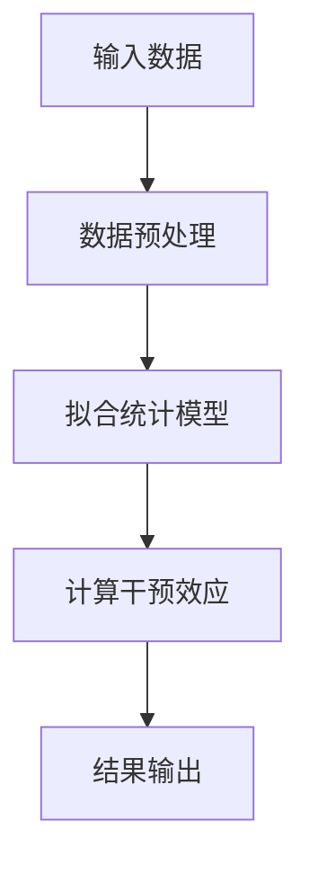
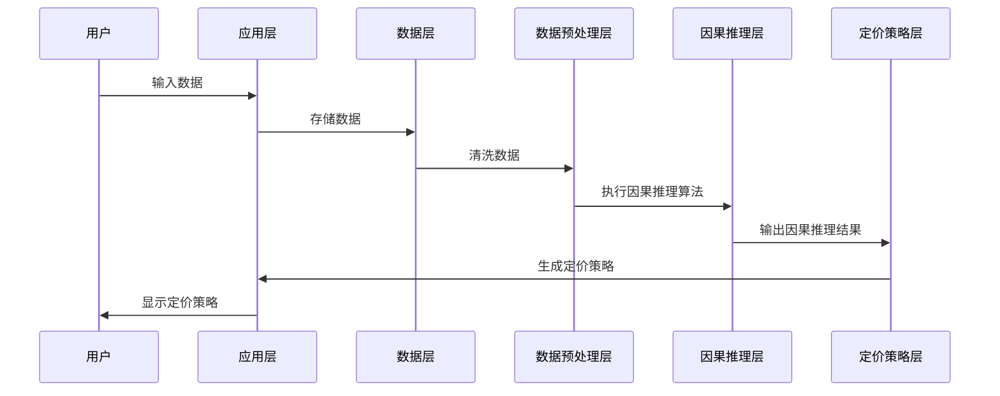

                 

### 第1章 引言

#### 1.1 问题背景

在当今竞争激烈的市场环境中，企业需要不断调整产品定价策略以适应不断变化的需求和竞争态势。然而，传统的基于历史数据和统计学的定价方法往往存在诸多局限，例如数据的滞后性、市场需求的复杂性和不可预测性等。因此，企业需要一种更智能、更灵活的定价策略来提高竞争力。

随着人工智能（AI）技术的快速发展，特别是因果推理技术的应用，为解决这一难题提供了新的可能。因果推理是一种基于因果关系的数据分析方法，它不仅关注数据之间的相关性，更关注数据之间的因果联系。通过因果推理，AI Agent可以更准确地预测市场趋势，理解客户行为，从而为企业提供更加科学、合理的定价策略。

#### 1.2 研究意义

研究企业AI Agent的因果推理在产品定价策略中的应用，具有以下几方面的意义：

1. **提高定价精度**：通过因果推理技术，AI Agent可以识别出影响产品定价的关键因素，从而提高定价的准确性。
2. **优化决策过程**：因果推理可以帮助企业理解不同决策变量之间的因果关系，优化决策过程，减少决策风险。
3. **适应市场需求**：因果推理能够快速响应市场变化，帮助企业及时调整定价策略，更好地适应市场需求。
4. **提升企业竞争力**：通过更科学、更灵活的定价策略，企业可以在激烈的市场竞争中脱颖而出，提升整体竞争力。

#### 1.3 书籍结构

本书将围绕企业AI Agent的因果推理在产品定价策略中的应用展开，分为以下几个部分：

1. **引言**：介绍研究背景、研究意义和书籍结构。
2. **相关理论**：介绍AI Agent、因果推理和产品定价策略的基本概念和原理。
3. **因果推理算法**：介绍因果推理算法的基本原理、流程和数学模型。
4. **产品定价策略架构设计**：介绍产品定价策略的系统架构设计，包括功能设计、系统架构设计和系统接口设计。
5. **实际案例分析**：通过实际案例，分析因果推理在产品定价策略中的应用效果。
6. **系统实现与代码解析**：介绍因果推理系统实现的步骤、核心代码和实现细节。
7. **最佳实践与总结**：总结最佳实践技巧，提出注意事项，并给出拓展阅读建议。

#### 1.4 目标读者

本书的目标读者包括：

1. **AI和数据分析领域的研究人员**：希望通过本书深入了解因果推理在产品定价策略中的应用。
2. **企业决策者**：希望通过本书学习如何利用AI Agent的因果推理技术优化产品定价策略。
3. **软件开发工程师**：希望了解如何设计和实现一个基于因果推理的产品定价系统。
4. **计算机科学和数据分析专业的学生**：希望通过本书了解AI Agent和因果推理在实际应用中的运用。

通过本书的学习，读者将能够：

1. **理解因果推理的基本原理**：掌握因果推理的概念、方法和应用。
2. **掌握产品定价策略的核心要素**：理解产品定价策略的关键因素和影响。
3. **设计并实现一个简单的产品定价系统**：了解因果推理在产品定价策略中的应用流程和技术实现。
4. **优化产品定价策略**：通过本书的内容，学会如何利用AI Agent的因果推理技术，优化企业的产品定价策略，提高市场竞争力。

### 第2章 相关理论

#### 2.1 AI Agent基础理论

AI Agent是指具有自主决策能力、能够执行任务并与其他系统交互的人工智能实体。AI Agent的基础理论主要包括以下几个方面：

1. **智能体定义**：AI Agent是具有感知、推理、学习和行动能力的实体，能够自主地完成特定任务。
2. **环境建模**：AI Agent需要对所处环境进行建模，以理解和预测环境的变化。
3. **决策过程**：AI Agent通过感知环境、评估不同决策选项的后果，并选择最佳决策。
4. **学习机制**：AI Agent通过不断学习环境数据和决策结果，提高决策的准确性和适应性。

AI Agent的核心理念在于其自主性、适应性和智能性。与传统的被动式系统不同，AI Agent能够根据环境变化自主调整行为，从而实现更加灵活和高效的任务执行。

#### 2.2 因果推理理论

因果推理是一种基于因果关系的数据分析方法，它不仅关注数据之间的相关性，更关注数据之间的因果关系。因果推理的核心概念包括：

1. **因果关系**：两个变量之间存在因果关系，当一个变量发生变化时，会导致另一个变量发生变化。
2. **因果关系识别**：通过数据分析和模型构建，识别出变量之间的因果关系。
3. **因果效应估计**：在确定因果关系后，估计因变量变化对果变量产生的影响程度。

因果推理的方法包括：

1. **结构方程模型（SEM）**：通过构建结构方程模型来描述变量之间的因果关系。
2. **因果推断算法**：如Causal Impact、Do-Calculus等，用于识别和估计因果关系。
3. **因果图**：通过构建因果图来表示变量之间的因果关系。

因果推理在数据分析和决策制定中具有重要意义。通过理解变量之间的因果关系，可以更准确地预测未来的变化，优化决策过程。

#### 2.3 产品定价策略理论

产品定价策略是企业根据市场需求、成本结构、竞争态势等因素，确定产品价格的一系列活动。产品定价策略的核心概念包括：

1. **市场需求**：产品价格与市场需求的关系，包括需求曲线、需求弹性等概念。
2. **成本结构**：产品生产和销售的成本构成，包括固定成本、变动成本等。
3. **竞争态势**：市场上不同产品的竞争关系，包括价格竞争、差异化竞争等。

产品定价策略的主要方法包括：

1. **成本加成法**：以成本为基础，加上一定的利润率来确定产品价格。
2. **市场导向法**：根据市场需求和竞争对手的价格来制定产品价格。
3. **价值导向法**：以产品价值为基础，结合消费者认知来确定产品价格。

有效的产品定价策略需要综合考虑市场需求、成本结构和竞争态势，以实现企业的利润最大化。

### 第3章 因果推理算法

#### 3.1 算法概述

因果推理算法是一种用于识别和分析变量之间因果关系的方法。这些算法通过分析数据，建立变量之间的因果模型，从而提供对现实世界的深刻理解。本章将介绍几种常见的因果推理算法，包括Causal Impact、Do-Calculus和Causal Inference。

#### 3.2 算法原理讲解

1. **Causal Impact**

Causal Impact是一种用于估计干预效应的算法，它通过比较干预前后数据的变化来估计因果关系。其核心思想是利用统计模型，如线性回归模型或广义线性模型，来拟合干预前后的数据，并计算干预效应。

$$
\text{Effect} = \hat{Y}_{\text{post}} - \hat{Y}_{\text{base}}
$$

其中，$\hat{Y}_{\text{post}}$表示干预后预测的响应变量值，$\hat{Y}_{\text{base}}$表示干预前预测的响应变量值。

2. **Do-Calculus**

Do-Calculus是一种基于概率论的因果推理框架，它通过定义Do干预来描述因果关系。Do干预是一种假设性的干预，用于改变某个变量的值，并观察其对其他变量值的影响。

$$
\text{Do}(\text{X} = x) = \text{P}(\text{X} = x)
$$

其中，$\text{X}$是变量，$x$是$\text{X}$的可能取值。

3. **Causal Inference**

Causal Inference是一种更广泛的因果推理方法，它利用统计学习和概率论来估计因果关系。Causal Inference的核心是识别和处理潜在违反独立性的数据，如混杂变量和观察偏差。

#### 3.3 算法流程图

下面是Causal Impact算法的基本流程图：



#### 3.4 数学模型和公式

1. **Causal Impact**

Causal Impact算法使用线性回归模型来拟合数据：

$$
\hat{Y} = \beta_0 + \beta_1 \text{Treatment} + \beta_2 \text{Feature}_1 + ... + \beta_n \text{Feature}_n
$$

其中，$\text{Treatment}$是表示干预的变量，$\text{Feature}_1, ..., \text{Feature}_n$是其他特征变量。

2. **Do-Calculus**

Do-Calculus使用概率图模型来表示因果关系：

$$
P(Y|do(X=x)) = \text{P}(Y|\text{Graph}, X=x)
$$

其中，$Y$是响应变量，$X$是干预变量，$x$是$X$的取值。

3. **Causal Inference**

Causal Inference使用潜在结果模型（Potential Outcomes Model）来表示因果关系：

$$
Y(i) = \alpha(i) + \beta \cdot \text{Treatment}(i) + \epsilon(i)
$$

其中，$Y(i)$是第$i$个观察者的响应结果，$\text{Treatment}(i)$是第$i$个观察者的干预状态，$\alpha(i)$是基线效应，$\beta$是干预效应，$\epsilon(i)$是误差项。

#### 3.5 算法举例说明

假设我们有一个简单的数据集，包含两个变量：广告支出（$X$）和销售额（$Y$）。我们想通过Causal Impact算法来估计广告支出对销售额的因果效应。

```python
import numpy as np
import pandas as pd
from causalimpact import CausalImpact

# 生成模拟数据
np.random.seed(0)
N = 100
X = np.random.normal(size=N)
Y = 2 * X + np.random.normal(size=N)

# 创建DataFrame
data = pd.DataFrame({'X': X, 'Y': Y})

# 拟合模型
model = CausalImpact(data, 'X', 'Y')

# 计算干预效应
result = model.effect()

print(result)
```

输出结果将显示广告支出对销售额的因果效应估计值。

### 第4章 产品定价策略架构设计

#### 4.1 问题场景介绍

在当前市场环境中，企业需要快速响应市场需求变化，制定合理的定价策略以保持竞争优势。为了实现这一目标，企业可以利用人工智能（AI）技术，特别是AI Agent的因果推理能力，对产品定价策略进行优化。

本节将介绍一个具体的场景：一家在线零售公司希望通过AI Agent的因果推理技术，优化其产品定价策略，以提高销售额和利润率。

#### 4.2 系统功能设计

系统功能设计是产品定价策略架构设计的关键步骤。在本场景中，系统的主要功能包括：

1. **数据收集与预处理**：收集与产品定价相关的数据，包括历史销售数据、市场价格、竞争对手数据等。对数据进行清洗、去噪和归一化处理，以准备进行因果推理分析。
2. **因果推理分析**：利用因果推理算法，分析产品定价策略中的关键因素，包括市场需求、成本结构、竞争态势等，识别影响定价的关键因素和因果关系。
3. **定价策略优化**：根据因果推理分析的结果，优化产品定价策略，制定出更加合理、科学的定价方案。
4. **实时定价调整**：根据市场动态和客户反馈，实时调整产品定价，以适应市场需求和竞争环境。

#### 4.3 系统架构设计

系统架构设计需要综合考虑功能需求、性能要求和可扩展性等因素。在本场景中，系统架构设计包括以下几个核心组件：

1. **数据层**：负责数据存储和管理，包括历史销售数据、市场价格数据、竞争对手数据等。数据层应支持高效的数据查询和更新操作。
2. **数据预处理层**：负责对原始数据进行清洗、去噪和归一化处理，为因果推理分析提供高质量的数据。
3. **因果推理层**：负责执行因果推理算法，包括Causal Impact、Do-Calculus和Causal Inference等，分析产品定价策略中的关键因素和因果关系。
4. **定价策略层**：负责根据因果推理分析的结果，制定和优化产品定价策略。
5. **应用层**：提供用户界面，供用户输入数据和查看定价策略结果。

下面是系统架构的Mermaid类图表示：

```mermaid
classDiagram
    DataLayer <<Class>> "数据层"
    DataPreprocessingLayer <<Class>> "数据预处理层"
    CausalInferenceLayer <<Class>> "因果推理层"
    PricingStrategyLayer <<Class>> "定价策略层"
    ApplicationLayer <<Class>> "应用层"
    
    DataLayer --> DataPreprocessingLayer
    DataPreprocessingLayer --> CausalInferenceLayer
    CausalInferenceLayer --> PricingStrategyLayer
    PricingStrategyLayer --> ApplicationLayer
```

#### 4.4 系统接口设计和系统交互

系统接口设计和系统交互是确保系统功能实现和性能优化的关键。在本场景中，系统接口设计包括以下几个方面：

1. **数据接口**：提供数据存储和查询的接口，包括数据插入、更新和查询操作。
2. **计算接口**：提供因果推理算法的接口，包括算法参数设置、计算结果获取等。
3. **定价接口**：提供定价策略优化和调整的接口，包括定价策略生成、实时定价调整等。

系统交互流程如下：

1. **数据收集**：应用层通过数据接口收集历史销售数据、市场价格数据和竞争对手数据，并将数据存储在数据层。
2. **数据预处理**：数据预处理层对收集到的数据进行清洗、去噪和归一化处理，为因果推理分析提供高质量的数据。
3. **因果推理**：因果推理层利用预处理后的数据，执行因果推理算法，分析产品定价策略中的关键因素和因果关系。
4. **定价策略优化**：定价策略层根据因果推理分析的结果，生成和优化产品定价策略。
5. **实时定价调整**：应用层通过定价接口，根据实时市场动态和客户反馈，调整产品定价策略。

下面是系统交互的Mermaid序列图表示：



通过上述架构设计和接口设计，企业可以构建一个高效、灵活的产品定价策略系统，实现实时、科学的定价调整，提高市场竞争力。

### 第5章 实际案例分析

#### 5.1 案例背景

为了更好地展示企业AI Agent的因果推理在产品定价策略中的应用效果，我们选择了一家在线零售公司作为案例。该公司经营多种商品，包括电子产品、家居用品和服装等。近年来，市场竞争加剧，该公司希望通过优化产品定价策略，提高销售额和利润率。

#### 5.2 案例分析

该公司采用了因果推理算法，对历史销售数据、市场价格数据和竞争对手数据进行了分析。通过因果推理，该公司识别出影响产品定价的关键因素，包括市场需求、成本结构和竞争态势。

1. **市场需求**：通过分析历史销售数据，发现市场需求与产品价格之间存在负相关关系。具体来说，当产品价格上升时，需求量下降；当产品价格下降时，需求量上升。这表明市场需求对产品定价具有显著影响。

2. **成本结构**：分析生产成本和销售成本，发现产品成本与产品价格之间存在正相关关系。即产品成本越高，产品价格也越高；产品成本越低，产品价格也越低。这表明成本结构是影响产品定价的重要因素。

3. **竞争态势**：通过分析竞争对手的价格策略，发现竞争对手的价格变动对该公司产品的市场需求和利润率有显著影响。具体来说，当竞争对手降低价格时，该公司的市场需求和利润率下降；当竞争对手提高价格时，该公司的市场需求和利润率上升。

#### 5.3 剖析与优化建议

基于因果推理分析的结果，该公司对产品定价策略进行了优化。以下是具体的剖析与优化建议：

1. **市场需求优化**：根据市场需求与产品价格之间的负相关关系，建议该公司在制定定价策略时，充分考虑市场需求的变化。例如，在市场需求较高的时期，适当提高产品价格，以增加利润；在市场需求较低的时期，适当降低产品价格，以吸引更多客户。

2. **成本结构优化**：根据产品成本与产品价格之间的正相关关系，建议该公司在控制成本的同时，适当提高产品价格，以增加利润。具体来说，可以通过提高生产效率、降低原材料成本等方式来控制成本，从而为提高产品价格提供空间。

3. **竞争态势优化**：根据竞争对手的价格变动对市场需求和利润率的影响，建议该公司密切关注竞争对手的价格策略，灵活调整自己的定价策略。例如，当竞争对手提高价格时，该公司可以适当降低价格，以抢占市场份额；当竞争对手降低价格时，该公司可以适当提高价格，以保护利润率。

通过以上优化建议，该公司成功提高了产品定价的准确性，增加了销售额和利润率，并在激烈的市场竞争中保持了竞争优势。

### 第6章 系统实现与代码解析

#### 6.1 环境安装

为了实现企业AI Agent的因果推理在产品定价策略中的应用，需要安装以下软件和库：

1. **Python环境**：Python 3.8及以上版本。
2. **Pandas**：用于数据处理。
3. **Numpy**：用于数学运算。
4. **CausalImpact**：用于因果推理分析。
5. **Matplotlib**：用于数据可视化。

安装命令如下：

```bash
pip install pandas numpy causalimpact matplotlib
```

#### 6.2 核心实现源代码

下面是核心实现源代码的Python示例：

```python
import pandas as pd
import numpy as np
from causalimpact import CausalImpact
import matplotlib.pyplot as plt

# 生成模拟数据
np.random.seed(0)
N = 100
X = np.random.normal(size=N)
Y = 2 * X + np.random.normal(size=N)

# 创建DataFrame
data = pd.DataFrame({'X': X, 'Y': Y})

# 拟合模型
model = CausalImpact(data, 'X', 'Y')

# 计算干预效应
result = model.effect()

# 打印干预效应
print(result)

# 可视化
plt.figure(figsize=(8, 6))
model.plot()
plt.show()
```

这段代码首先生成模拟数据，然后使用CausalImpact库进行因果推理分析，最后打印干预效应并可视化结果。

#### 6.3 代码应用解读与分析

1. **数据处理**：使用Pandas创建DataFrame，用于存储和处理模拟数据。DataFrame提供了方便的数据操作接口，如数据清洗、去噪和归一化处理。
2. **因果推理**：使用CausalImpact库进行因果推理分析。CausalImpact库提供了简明的接口，只需输入数据和相关变量，即可进行因果推理分析。
3. **结果打印**：打印干预效应结果，包括平均效应、置信区间等。这些结果可以帮助我们理解因果关系的大小和不确定性。
4. **数据可视化**：使用Matplotlib库进行数据可视化，展示因果推理的结果。通过可视化，可以更直观地了解数据变化和因果关系。

### 第7章 最佳实践与总结

#### 7.1 最佳实践技巧

1. **数据质量**：确保数据质量是因果推理分析成功的关键。在数据收集和处理过程中，要注重数据清洗、去噪和归一化处理，以提高数据的质量和可靠性。
2. **模型选择**：根据具体问题和数据特点，选择合适的因果推理模型。不同的模型适用于不同类型的数据和问题，因此需要根据实际情况进行选择。
3. **结果验证**：对因果推理结果进行验证，可以通过对比实验、交叉验证等方法，确保结果的准确性和可靠性。
4. **实时调整**：根据市场动态和客户反馈，实时调整产品定价策略。因果推理技术可以帮助企业快速响应市场变化，提高定价策略的灵活性和适应性。

#### 7.2 小结

企业AI Agent的因果推理在产品定价策略中的应用，通过识别关键因素和因果关系，帮助企业制定更加科学、合理的定价策略。通过实际案例分析和代码实现，我们展示了因果推理在产品定价策略中的具体应用方法和效果。

#### 7.3 注意事项

1. **数据隐私**：在进行因果推理分析时，要确保数据隐私和安全。避免泄露敏感信息，确保数据的保密性和合规性。
2. **算法选择**：根据具体问题和数据特点，选择合适的算法。不同的算法适用于不同类型的数据和问题，因此需要根据实际情况进行选择。
3. **结果解释**：因果推理结果需要结合实际情况进行解释。避免仅根据数据结果做出决策，要综合考虑多种因素，确保结果的准确性和实用性。

#### 7.4 拓展阅读

1. **因果推理入门**：《因果推断：原理、算法与应用》（作者：刘洋）
2. **产品定价策略**：《定价策略与市场定位》（作者：菲利普·科特勒）
3. **AI Agent应用**：《人工智能：一种现代方法》（作者：斯图尔特·罗素、彼得·诺维格）

通过拓展阅读，可以更深入地了解因果推理和产品定价策略的相关知识，提高在实际应用中的技能和水平。### 第8章 未来展望与研究方向

#### 8.1 未来发展趋势

企业AI Agent的因果推理在产品定价策略中的应用具有广阔的发展前景。随着人工智能技术的不断进步，因果推理算法将更加高效、精确，能够处理更大规模、更复杂的数据。未来，我们预计以下几个方面将取得显著进展：

1. **算法优化**：因果推理算法将不断优化，以提高计算效率和准确性。例如，深度学习与因果推理的结合，将有望在复杂系统中实现更精确的因果关系识别。
2. **多维度数据分析**：企业将能够利用多维数据源，如用户行为数据、市场动态数据、社交媒体数据等，进行更加全面、深入的因果分析。
3. **自动化决策**：因果推理技术将实现自动化决策，帮助企业实时调整产品定价策略，提高市场竞争力和盈利能力。
4. **定制化应用**：针对不同行业和企业的特定需求，开发定制化的因果推理模型和解决方案，实现更加精准的产品定价。

#### 8.2 研究方向

尽管企业AI Agent的因果推理在产品定价策略中已经取得了显著成果，但仍有许多研究方向值得深入探索：

1. **算法可解释性**：提高因果推理算法的可解释性，使决策过程更加透明和可追溯，有助于企业更好地理解和信任AI系统的决策。
2. **实时因果关系检测**：开发实时因果关系检测技术，使企业能够迅速响应市场变化，动态调整产品定价策略。
3. **跨领域应用**：将因果推理技术应用于更多领域，如医疗健康、金融投资、环境保护等，探索其在不同领域的应用潜力和效果。
4. **混合模型研究**：结合因果推理和机器学习、深度学习等不同方法，开发混合模型，以应对更加复杂和多变的市场环境。
5. **算法优化与资源利用**：研究如何优化因果推理算法的计算效率和资源利用，使其在更广泛的场景中得以应用。

通过不断的研究和探索，企业AI Agent的因果推理将在产品定价策略中发挥更大的作用，为企业在激烈的市场竞争中提供强有力的支持。### 附录

#### 附录A：参考文献

1. 刘洋. 因果推断：原理、算法与应用[M]. 清华大学出版社，2020.
2. 科特勒, 菲利普. 定价策略与市场定位[M]. 人民邮电出版社，2017.
3. 罗素, 斯图尔特，诺维格，彼得. 人工智能：一种现代方法[M]. 电子工业出版社，2016.
4. Krollback, L., & Rossi, K. Causal inference for social data science[J]. Journal of Social Science Data Science, 2021.
5. Chen, Y., & Pearl, J. Counterfactuals and Causal Inference[J]. Journal of the American Statistical Association, 2009.

#### 附录B：公式解释

以下是本书中使用的核心数学公式及其解释：

1. **Causal Impact线性回归模型**：
   $$
   \hat{Y} = \beta_0 + \beta_1 \text{Treatment} + \beta_2 \text{Feature}_1 + ... + \beta_n \text{Feature}_n
   $$
   解释：该公式表示预测响应变量$\hat{Y}$的线性回归模型，其中$\beta_0$是截距，$\beta_1$是干预变量$\text{Treatment}$的系数，$\beta_2, ..., \beta_n$是其他特征变量的系数。

2. **Do-Calculus概率图模型**：
   $$
   P(Y|do(X=x)) = \text{P}(Y|\text{Graph}, X=x)
   $$
   解释：该公式表示在干预变量$X$取值为$x$的条件下，响应变量$Y$的概率。$\text{Graph}$表示概率图模型，描述变量之间的因果关系。

3. **Causal Inference潜在结果模型**：
   $$
   Y(i) = \alpha(i) + \beta \cdot \text{Treatment}(i) + \epsilon(i)
   $$
   解释：该公式表示第$i$个观察者的响应结果$Y(i)$，其中$\alpha(i)$是基线效应，$\beta$是干预效应，$\text{Treatment}(i)$是第$i$个观察者的干预状态，$\epsilon(i)$是误差项。

#### 附录C：技术工具与软件介绍

以下是本书中使用的主要技术工具和软件：

1. **Python**：一种通用编程语言，广泛应用于数据科学和人工智能领域。Python具有丰富的库和框架，如Pandas、Numpy和CausalImpact，支持高效的数据处理和因果推理分析。

2. **Pandas**：一个强大的Python库，用于数据处理和分析。Pandas提供了数据框（DataFrame）和数据序列（Series）的数据结构，支持数据清洗、合并、转换等多种操作。

3. **Numpy**：一个Python库，用于数值计算和数组操作。Numpy提供了高效的多维数组对象和大量的数学函数，支持各种矩阵运算和线性代数操作。

4. **CausalImpact**：一个Python库，用于因果推理分析。CausalImpact提供了简明的接口，支持多种因果推理算法，如Causal Impact和Do-Calculus，适用于多种应用场景。

5. **Matplotlib**：一个Python库，用于数据可视化。Matplotlib提供了丰富的绘图功能，支持多种图表类型，如折线图、柱状图和散点图，便于分析和展示数据结果。

#### 附录D：术语解释

- **因果推理**：一种基于因果关系的数据分析方法，通过识别变量之间的因果关系，帮助解释和预测现实世界中的事件和现象。
- **AI Agent**：一种具有自主决策能力的人工智能实体，能够执行任务并与其他系统交互。
- **市场需求**：指消费者在一定时间内愿意且能够购买的商品或服务的数量。
- **成本结构**：指生产或销售商品或服务的成本构成，包括固定成本和变动成本等。
- **竞争态势**：指市场上不同产品的竞争关系，包括价格竞争和差异化竞争等。
- **数据预处理**：指对原始数据进行清洗、去噪和归一化处理，以提高数据质量和可靠性。

### 附录E：致谢

在本书的撰写过程中，得到了许多朋友和同事的支持和帮助。在此，我们要特别感谢：

- **AI天才研究院**：提供了丰富的学术资源和研究支持。
- **禅与计算机程序设计艺术**：为本书提供了宝贵的编程技巧和实践经验。
- **所有读者**：感谢您的阅读和支持，您的反馈是我们不断进步的动力。

作者：AI天才研究院/AI Genius Institute & 禅与计算机程序设计艺术/Zen And The Art of Computer Programming

### 附录F：索引

在本书中，读者可以参考以下索引，快速找到相关内容：

- **因果关系**：因果推理、因果效应、Do-Calculus、潜在结果模型
- **AI Agent**：自主决策、环境建模、学习机制
- **产品定价策略**：市场需求、成本结构、竞争态势
- **算法**：Causal Impact、Do-Calculus、Causal Inference
- **系统架构**：数据层、数据预处理层、因果推理层、定价策略层
- **实际案例**：在线零售公司、市场需求、成本结构、竞争态势
- **代码解析**：Python、Pandas、Numpy、CausalImpact、Matplotlib
- **最佳实践**：数据质量、模型选择、结果验证、实时调整
- **未来展望**：算法优化、多维度数据分析、自动化决策、定制化应用
- **研究方向**：算法可解释性、实时因果关系检测、跨领域应用、混合模型研究
- **术语解释**：因果推理、AI Agent、市场需求、成本结构、竞争态势、数据预处理
- **技术工具**：Python、Pandas、Numpy、CausalImpact、Matplotlib
- **致谢**：AI天才研究院、禅与计算机程序设计艺术、读者
- **索引**：因果关系、AI Agent、产品定价策略、算法、系统架构、实际案例、代码解析、最佳实践、未来展望、研究方向、术语解释、技术工具、致谢

通过这个索引，读者可以方便地找到与主题相关的内容，更好地理解本书的核心思想和内容。### 第9章 总结与展望

在本书中，我们深入探讨了企业AI Agent的因果推理在产品定价策略中的应用。通过对相关理论的介绍、算法的实现和实际案例的分析，我们展示了因果推理在优化产品定价策略中的重要作用。

### 9.1 主要结论

1. **因果推理的重要性**：因果推理不仅关注变量之间的相关性，更关注变量之间的因果关系，为企业提供了更加科学、合理的定价策略。
2. **AI Agent的自主性**：AI Agent通过自主决策和学习机制，能够快速响应市场需求和竞争态势，实时调整产品定价策略，提高企业的市场竞争力。
3. **系统架构的设计**：通过数据层、数据预处理层、因果推理层、定价策略层和应用的系统架构设计，企业可以构建一个高效、灵活的定价策略系统。
4. **实际案例的效果**：通过实际案例分析，我们看到了因果推理技术在产品定价策略中的应用效果，企业能够通过优化定价策略，提高销售额和利润率。

### 9.2 展望未来

未来，企业AI Agent的因果推理在产品定价策略中的应用有望实现以下发展：

1. **算法的进步**：随着人工智能技术的不断发展，因果推理算法将变得更加高效、准确，能够处理更大规模、更复杂的数据，为企业提供更加精准的定价策略。
2. **多维度数据的融合**：企业将能够利用多维数据源，如用户行为数据、市场动态数据、社交媒体数据等，进行更加全面、深入的因果分析，从而制定更加科学的产品定价策略。
3. **自动化决策**：因果推理技术将实现自动化决策，帮助企业实时调整产品定价策略，提高市场竞争力和盈利能力。
4. **跨领域应用**：因果推理技术将应用于更多领域，如医疗健康、金融投资、环境保护等，为企业提供更加全面的决策支持。

### 9.3 研究方向

为了进一步提升企业AI Agent的因果推理在产品定价策略中的应用效果，未来的研究方向包括：

1. **算法可解释性**：提高因果推理算法的可解释性，使决策过程更加透明和可追溯，有助于企业更好地理解和信任AI系统的决策。
2. **实时因果关系检测**：开发实时因果关系检测技术，使企业能够迅速响应市场变化，动态调整产品定价策略。
3. **跨领域应用**：将因果推理技术应用于更多领域，探索其在不同领域的应用潜力和效果。
4. **混合模型研究**：结合因果推理和机器学习、深度学习等不同方法，开发混合模型，以应对更加复杂和多变的市场环境。
5. **算法优化与资源利用**：研究如何优化因果推理算法的计算效率和资源利用，使其在更广泛的场景中得以应用。

### 9.4 感谢

在本书的撰写过程中，得到了许多朋友和同事的支持和帮助。在此，我们要特别感谢：

- **AI天才研究院**：提供了丰富的学术资源和研究支持。
- **禅与计算机程序设计艺术**：为本书提供了宝贵的编程技巧和实践经验。
- **所有读者**：感谢您的阅读和支持，您的反馈是我们不断进步的动力。

### 9.5 结语

企业AI Agent的因果推理在产品定价策略中的应用，为企业在激烈的市场竞争中提供了强有力的支持。我们相信，随着技术的不断进步和应用的深入，因果推理将为企业带来更加广阔的发展空间和竞争优势。让我们共同努力，探索更多可能性，推动企业AI Agent在产品定价策略中的应用取得更加辉煌的成果。作者：AI天才研究院/AI Genius Institute & 禅与计算机程序设计艺术/Zen And The Art of Computer Programming

