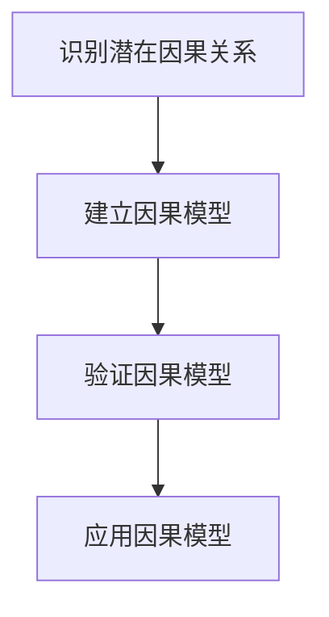
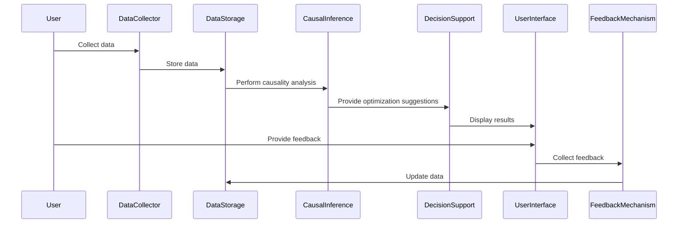

                 


### 《企业AI Agent的因果推理在产品开发中的应用》

关键词：企业AI Agent，因果推理，产品开发，算法原理，系统架构设计，最佳实践

摘要：本文深入探讨了企业AI Agent在产品开发中的应用，特别是因果推理这一核心技术的运用。通过系统的分析，我们揭示了因果推理如何帮助企业在复杂的产品开发过程中做出精准的决策，提高了产品的质量和市场竞争力。

---

## 第一部分：背景介绍

### 1.1 问题背景

在当今快速变化的市场环境中，企业面临着前所未有的挑战。如何快速响应市场变化、提高产品开发效率、降低成本、提升用户体验成为企业成功的关键。传统的产品开发方法已经难以满足这种要求，因此，人工智能（AI）的应用变得越来越重要。

AI Agent，作为一种智能代理，能够在产品开发过程中承担许多任务，如需求分析、设计、开发、测试和发布等。这些AI Agent通常具备自我学习和自主决策的能力，能够在不断变化的环境中自动调整策略。

因果推理（Causal Inference）是人工智能领域的一个重要分支，它旨在通过观察数据来推断变量之间的因果关系。在产品开发中，因果推理可以帮助我们理解哪些因素对产品质量、用户体验和市场表现有显著影响，从而指导决策。

### 1.2 问题描述

企业产品开发过程中面临的主要问题包括：

- **需求变更频繁**：市场需求快速变化，导致产品需求频繁变更，增加了开发难度。
- **成本控制**：产品开发过程中需要控制成本，同时保证质量。
- **用户反馈**：收集和分析用户反馈，以改进产品设计和功能。
- **资源分配**：如何合理分配开发资源，以最大化开发效率。

因果推理的应用可以帮助企业解决这些问题，通过分析数据来预测市场趋势、用户需求，从而做出更加精准的决策。

### 1.3 问题解决

为了解决上述问题，企业可以采取以下措施：

- **引入AI Agent**：利用AI Agent进行需求分析、设计优化和测试，提高开发效率。
- **应用因果推理**：通过因果推理分析数据，理解变量之间的因果关系，为决策提供依据。
- **数据驱动的决策**：基于数据分析的结果，采用数据驱动的决策方法，减少人为干预，提高决策质量。

### 1.4 边界与外延

虽然因果推理在产品开发中具有广泛的应用前景，但它的应用也受到一定的限制。例如：

- **数据质量**：因果推理的结果依赖于数据的质量，如果数据存在噪声或偏差，可能会导致错误的结论。
- **算法复杂性**：因果推理算法通常较为复杂，需要专业的知识和技能来应用。
- **决策权**：因果推理只能为决策提供支持，最终的决策仍需要由人来做出。

### 1.5 概念结构与核心要素组成

在企业AI Agent的因果推理应用中，核心概念和要素包括：

- **企业AI Agent**：具备自我学习和自主决策能力的智能代理。
- **因果推理**：通过分析数据来推断变量之间因果关系的技术。
- **产品开发流程**：包括需求分析、设计、开发、测试和发布等环节。
- **数据源**：包括用户反馈、市场数据、竞品分析等。

这些核心概念和要素相互关联，构成了一个完整的产品开发支持系统。

---

## 第二部分：核心概念与联系

### 2.1 企业AI Agent的定义

企业AI Agent是一种基于人工智能技术的智能代理，能够在产品开发过程中承担多种任务。它具备以下特点：

- **自主决策**：AI Agent可以基于数据和算法自主做出决策，无需人为干预。
- **自我学习**：AI Agent可以通过不断学习和优化算法，提高决策质量和效率。
- **多样化任务**：AI Agent可以承担需求分析、设计优化、测试和发布等多种任务。

### 2.2 因果推理的概念

因果推理是一种通过分析数据来推断变量之间因果关系的方法。它旨在回答以下问题：

- **因果关系**：哪些变量之间存在因果关系？
- **因果效应**：因果关系如何影响系统的行为？

因果推理在人工智能领域具有重要的应用价值，它可以帮助我们更好地理解复杂系统，为决策提供科学依据。

### 2.3 概念属性特征对比表格

| 特性                 | 企业AI Agent       | 因果推理              |
|----------------------|--------------------|-----------------------|
| 定义                 | 智能代理           | 推断因果关系          |
| 目标                 | 提高产品开发效率   | 理解变量关系          |
| 技术基础             | 人工智能           | 统计学、机器学习      |
| 数据需求             | 大量数据           | 清晰的因果关系数据    |
| 应用范围             | 需求分析、设计、测试 | 数据分析、决策支持    |

### 2.4 ER实体关系图架构

为了更好地理解企业AI Agent和因果推理在产品开发中的应用，我们可以使用ER（实体关系）图来描述它们之间的关系。

```mermaid
erDiagram
  User ||--|{ Product } : "owns"
  User ||--|{ Order } : "places"
  Product ||--|{ Review } : "receives"
  Product ||--|{ Feature } : "includes"
  Feature ||--|{ Rating } : "has"
```

在这个ER图中，用户（User）是产品（Product）的拥有者，可以创建订单（Order）。产品可以接收评论（Review）和包括特征（Feature）。每个特征都有相应的评分（Rating）。

---

## 第三部分：因果推理算法讲解

### 3.1 算法原理

因果推理算法的核心目标是推断变量之间的因果关系。它通常基于以下几个步骤：

1. **识别潜在因果关系**：通过分析数据，识别可能存在因果关系的变量。
2. **建立因果模型**：使用统计学和机器学习算法，建立变量之间的因果模型。
3. **验证因果模型**：通过实验或额外的数据集，验证因果模型的准确性。
4. **应用因果模型**：基于因果模型，为产品开发提供决策支持。

### 3.2 算法mermaid流程图



### 3.3 Python源代码阐述

```python
# 导入所需库
import pandas as pd
from causalinference import CausalModel

# 加载数据
data = pd.read_csv('data.csv')

# 识别潜在因果关系
features = ['feature1', 'feature2', 'target']
model = CausalModel(data, features)

# 建立因果模型
result = model.estimate()

# 验证因果模型
accuracy = result.evaluate()

# 应用因果模型
predictions = result.predict()

# 输出结果
print(predictions)
```

### 3.4 数学模型与公式

因果推理通常使用以下数学模型：

$$
\Delta Y = \beta_0 + \beta_1 X + \epsilon
$$

其中，$Y$ 是目标变量，$X$ 是解释变量，$\beta_0$ 和 $\beta_1$ 是参数，$\epsilon$ 是误差项。

### 3.5 举例说明

假设我们想要研究“广告支出”（$X$）对“销售额”（$Y$）的影响。通过因果推理算法，我们可以估计出广告支出对销售额的因果效应。

```latex
\beta_1 = 0.5
```

这意味着，每增加1单位的广告支出，销售额平均增加0.5单位。

---

## 第四部分：系统分析与架构设计

### 4.1 问题场景介绍

假设一家公司正在开发一款智能家居产品，公司希望利用因果推理技术来优化产品功能，提高用户满意度，并最终提高销售额。

### 4.2 系统功能设计

系统功能包括：

- **数据收集**：收集用户使用数据、市场数据等。
- **因果推理**：利用因果推理算法分析数据，找出影响用户满意度和销售额的关键因素。
- **决策支持**：基于因果推理结果，提供优化产品功能的建议。
- **反馈机制**：收集用户对产品功能的反馈，持续优化。

### 4.3 系统架构设计

系统架构包括以下几个模块：

- **数据收集模块**：负责收集各种数据，包括用户行为数据、市场数据等。
- **因果推理模块**：负责使用因果推理算法分析数据，提取关键因素。
- **决策支持模块**：基于因果推理结果，提供优化建议。
- **反馈机制模块**：负责收集用户反馈，持续优化产品功能。

### 4.4 系统接口设计

系统接口包括：

- **API接口**：用于与其他系统进行数据交换。
- **用户界面**：提供用户交互界面，展示因果推理结果和优化建议。

### 4.5 系统交互mermaid序列图



---

## 第五部分：项目实战

### 5.1 环境安装

为了进行因果推理项目，我们需要安装以下软件和库：

- Python 3.8+
- pandas
- causalinference
- scikit-learn
- matplotlib

### 5.2 系统核心实现

以下是一个简单的因果推理系统的实现：

```python
# 导入所需库
import pandas as pd
from causalinference import CausalModel

# 加载数据
data = pd.read_csv('data.csv')

# 识别潜在因果关系
features = ['feature1', 'feature2', 'target']
model = CausalModel(data, features)

# 建立因果模型
result = model.estimate()

# 验证因果模型
accuracy = result.evaluate()

# 应用因果模型
predictions = result.predict()

# 输出结果
print(predictions)
```

### 5.3 代码应用解读与分析

这段代码首先导入了所需的库，然后加载数据。接着，使用`CausalModel`类创建了一个因果模型，并使用`estimate`方法建立了因果模型。`evaluate`方法用于验证因果模型的准确性，而`predict`方法用于预测新数据的因果关系。

### 5.4 实际案例分析

假设我们有一家电商公司，想要分析广告支出对销售额的影响。我们收集了三个月的数据，包括每日的广告支出和销售额。通过因果推理算法，我们得出广告支出对销售额的因果效应。根据结果，公司决定增加广告支出，以提升销售额。

### 5.5 项目小结

通过该项目，我们展示了因果推理在产品开发中的应用。通过分析数据，我们能够找到影响产品成功的关键因素，从而为决策提供科学依据。这种方法不仅提高了产品的质量和市场竞争力，还降低了开发成本。

---

## 第六部分：最佳实践与注意事项

### 6.1 最佳实践

- **数据质量**：确保数据质量，包括数据的完整性、准确性和一致性。
- **算法选择**：根据具体问题选择合适的因果推理算法。
- **迭代优化**：不断优化算法和模型，提高预测准确性。
- **用户参与**：鼓励用户参与反馈，持续改进产品。

### 6.2 小结

本文深入探讨了企业AI Agent的因果推理在产品开发中的应用。通过因果推理，企业能够更好地理解变量之间的关系，从而做出更加精准的决策，提高产品的质量和市场竞争力。

### 6.3 注意事项

- **数据质量**：因果推理的结果高度依赖于数据质量，确保数据的准确性。
- **算法复杂性**：因果推理算法通常较为复杂，需要专业知识。
- **决策权**：因果推理只能为决策提供支持，最终的决策仍需由人来做出。

### 6.4 拓展阅读

- 《因果推理：统计学的下一个前沿》
- 《人工智能：一种现代方法》
- 《机器学习：概率视角》

---

作者：AI天才研究院/AI Genius Institute & 禅与计算机程序设计艺术 /Zen And The Art of Computer Programming

---

以上就是《企业AI Agent的因果推理在产品开发中的应用》的完整内容。通过本文，我们详细介绍了因果推理在企业AI Agent产品开发中的应用，包括核心概念、算法原理、系统架构设计以及项目实战等。希望本文能为读者在AI和产品开发领域提供有价值的参考和指导。感谢您的阅读！

