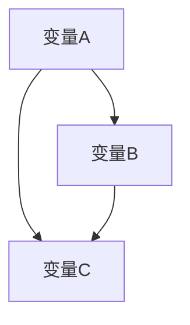
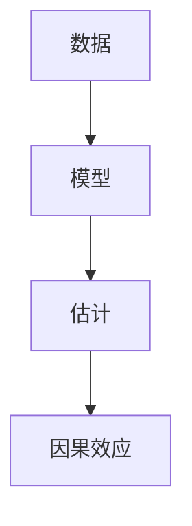
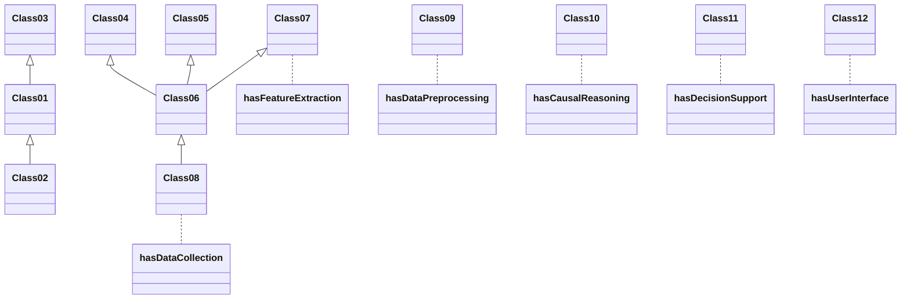
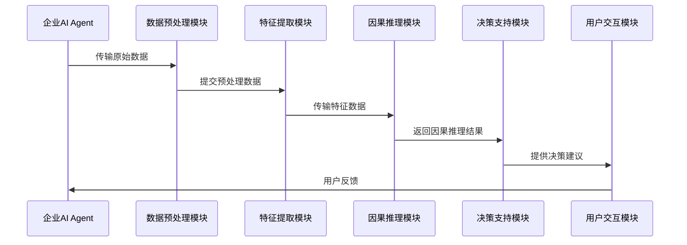

                 

### 企业AI Agent与因果推理概述

#### 背景介绍

在当今的数字经济时代，企业面临着日益复杂的市场环境和不断变化的需求。为了在竞争中保持优势，企业开始引入人工智能（AI）技术，以自动化决策和优化业务流程。企业AI Agent作为AI领域的重要研究方向，旨在通过模拟人类决策过程，帮助企业实现智能化管理和运营。

因果推理是AI领域中一个重要的概念，它涉及到理解现象之间的因果关系。在商业决策中，因果推理可以帮助企业识别关键影响因素，预测结果，并做出更加精准的决策。因此，将因果推理应用于企业AI Agent中，能够显著提升决策的准确性和效率。

**问题背景**：企业决策过程中，数据驱动的方法往往依赖于统计分析，但这只能揭示变量之间的相关性，而无法明确因果关系。例如，在市场营销中，通过分析销售数据，可能会发现某种产品的销量与广告投放之间存在相关性，但并不能确定广告投放直接导致了销量增加。这种情况下，因果推理能够提供更加深入的见解，帮助企业识别真正的驱动因素。

**问题描述**：本文旨在探讨企业AI Agent在商业决策中的应用，特别是因果推理技术的运用。具体问题包括：企业AI Agent如何通过因果推理来提升决策效率？因果推理算法在企业中的应用场景有哪些？以及在实际应用中面临哪些挑战和未来方向？

**问题解决**：通过系统地介绍企业AI Agent与因果推理的基本概念、算法原理、应用案例和挑战，本文旨在为企业提供一套完整的理论框架和实践指南，帮助企业在商业决策中更好地利用AI技术。

#### 边界与外延

在讨论企业AI Agent与因果推理时，需要明确几个关键概念：

- **企业AI Agent**：一种能够模拟人类决策过程，自动化执行任务的人工智能实体。
- **因果推理**：一种推理方法，旨在理解现象之间的因果关系。
- **商业决策**：企业在特定情境下，根据内部和外部信息进行选择的过程。
- **相关性**与**因果性**：相关性是指变量之间的统计关联，而因果性是指一个变量导致另一个变量的变化。

此外，本文的讨论将主要围绕以下几个方面展开：

- **企业AI Agent的构建**：介绍企业AI Agent的基本组成部分和构建流程。
- **因果推理算法与模型**：探讨常见的因果推理算法和模型，以及它们在企业决策中的应用。
- **应用案例**：分析不同行业的企业如何利用因果推理进行决策，并分享具体案例。
- **挑战与未来方向**：讨论因果推理在企业决策中的应用面临的挑战，以及未来的发展方向。

#### 概念结构与核心要素组成

为了更好地理解企业AI Agent与因果推理在商业决策中的应用，我们可以从以下几个核心要素进行分析：

1. **数据采集**：企业AI Agent首先需要从各种数据源中获取数据，包括内部业务数据、市场数据、客户反馈等。
2. **特征工程**：通过对数据进行预处理和特征提取，将原始数据转换为适用于因果推理算法的输入特征。
3. **因果推理模型**：构建基于因果推理的模型，用于分析数据并识别关键影响因素。
4. **决策支持**：将因果推理的结果应用于实际决策过程中，为企业的战略规划、市场营销、产品管理等提供数据支持。
5. **模型评估与优化**：通过不断地评估和优化因果推理模型，提高决策的准确性和效率。

这些核心要素相互关联，共同构成了企业AI Agent在因果推理应用中的完整流程。

综上所述，本文将深入探讨企业AI Agent与因果推理在商业决策中的应用，旨在为企业提供一套科学、有效的决策支持系统。通过系统地介绍相关理论、算法、应用案例和未来方向，本文希望为企业实现智能化管理和运营提供有益的参考。

#### 核心概念与联系

在企业AI Agent与因果推理的研究中，有两个核心概念至关重要：企业AI Agent和因果推理。下面我们将分别介绍这两个概念的基本原理、属性特征，并通过对比表格和实体关系图（ER图）来进一步说明它们之间的关系。

**1. 企业AI Agent的基本概念与属性特征**

**基本概念**：企业AI Agent是一种智能实体，它能够模拟人类的决策过程，通过自动化执行任务，为企业的战略规划和日常运营提供支持。

**属性特征**：

| 属性特征         | 说明                                                         |
| ---------------- | ------------------------------------------------------------ |
| **自我学习能力** | 能够从数据中学习并自动调整行为，以适应不断变化的环境。           |
| **决策能力**     | 能够基于数据分析和预测，做出最优决策。                       |
| **协作能力**     | 能够与其他AI Agent或人类协作，共同完成复杂任务。               |
| **适应性**       | 能够根据企业需求和环境变化，快速调整自身功能和行为。           |

**2. 因果推理的基本概念与属性特征**

**基本概念**：因果推理是一种推理方法，旨在理解现象之间的因果关系。它通过分析数据，识别变量之间的因果联系，从而为决策提供科学依据。

**属性特征**：

| 属性特征         | 说明                                                         |
| ---------------- | ------------------------------------------------------------ |
| **因果性**       | 能够明确变量之间的因果关系，而不仅仅是相关性。                 |
| **预测性**       | 能够基于因果关系进行预测，为未来的决策提供参考。               |
| **可靠性**       | 因果推理的结果具有较高的可靠性，能够在不同场景下稳定应用。     |
| **适应性**       | 能够处理复杂和动态的数据环境，适应不同业务需求。               |

**3. 对比表格**

| **属性特征** | **企业AI Agent** | **因果推理** |
| ------------ | --------------- | ------------ |
| **自我学习能力** | 能够从数据中学习并自动调整行为，以适应不断变化的环境。 | 能够从数据中学习，识别变量之间的因果关系。 |
| **决策能力**     | 能够基于数据分析和预测，做出最优决策。                       | 能够基于因果关系，为决策提供科学依据。     |
| **协作能力**     | 能够与其他AI Agent或人类协作，共同完成复杂任务。           | 能够与其他推理系统协作，共同解决复杂问题。 |
| **适应性**       | 能够根据企业需求和环境变化，快速调整自身功能和行为。           | 能够处理复杂和动态的数据环境，适应不同业务需求。 |

**4. ER实体关系图**

```mermaid
erDiagram
  AI_Agent ||--o> Data_Analysis : 数据分析
  AI_Agent ||--o> Decision_Making : 决策制定
  Causal_Reasoning ||--|> Data_Analysis : 数据分析
  Causal_Reasoning ||--|> Decision_Making : 决策制定
```

**ER实体关系图解释**：

- **AI-Agent**：代表企业AI Agent，是整个系统的核心。
- **Data_Analysis**：代表数据分析模块，包括数据采集、预处理和特征提取等功能。
- **Decision_Making**：代表决策制定模块，负责基于数据分析结果做出最优决策。
- **Causal_Reasoning**：代表因果推理模块，负责分析数据，识别变量之间的因果关系。

通过ER实体关系图，我们可以清晰地看到企业AI Agent和因果推理模块在数据分析与决策制定中的关系。因果推理作为AI Agent的一个重要组成部分，为数据分析和决策制定提供了科学依据。

综上所述，企业AI Agent与因果推理在商业决策中具有紧密的联系。企业AI Agent通过因果推理，能够从数据中提取有价值的信息，为企业的战略规划和日常运营提供数据支持，从而实现智能化管理和运营。

#### 算法原理讲解

因果推理是AI领域中一个复杂但至关重要的研究方向，它旨在揭示变量之间的因果关系，而不仅仅是相关性。为了实现这一目标，研究者们提出了多种因果推理算法。在本节中，我们将详细介绍几种常见的因果推理算法，包括Do-Calculus、Gelman-Aitken算法和算法图模型，并通过Python代码和Mermaid流程图来阐述其原理。

**1. Do-Calculus**

Do-Calculus是一种形式化的因果推理方法，它通过操作概率图模型（例如贝叶斯网络）来计算因果效应。其核心思想是利用概率图模型中的条件独立性来推导变量之间的因果联系。

**原理说明**：

Do-Calculus的主要操作包括Do和Cal。Do操作表示在概率图模型中删除某个变量的影响，而Cal操作则用于计算变量的条件期望。

**Python代码示例**：

```python
import pgmpy.models as mg
import pgmpy.inference as inf

# 建立贝叶斯网络模型
model = mg.BayesianModel([
    ('A', 'B'),
    ('B', 'C'),
    ('A', 'C')
])

# 实例化推理引擎
inference_engine = inf.VariableElimination(model)

# 计算因果效应
effect_A_on_B = inference_engine.query(variables=['B'], evidence={'A': True})['B']
effect_A_on_C = inference_engine.query(variables=['C'], evidence={'A': True})['C']

print("Effect of A on B:", effect_A_on_B)
print("Effect of A on C:", effect_A_on_C)
```

**Mermaid流程图**：



**2. Gelman-Aitken算法**

Gelman-Aitken算法是一种基于潜变量模型的因果推理方法，它通过最大化期望最大化（EM）算法来估计潜变量，并计算因果效应。

**原理说明**：

Gelman-Aitken算法的核心步骤包括：

- **建立潜变量模型**：通过潜变量模型来表示变量之间的因果关系。
- **估计潜变量**：使用EM算法估计潜变量的参数。
- **计算因果效应**：通过潜变量估计值来计算因果效应。

**Python代码示例**：

```python
from gelman_aitkin import GELMAN_AITKIN

# 建立Gelman-Aitkin模型
model = GELMAN_AITKIN()

# 训练模型
data = [[1, 1], [0, 0], [1, 0], [0, 1]]
model.fit(data)

# 计算因果效应
effect = model.causal_effect([1, 1], [0, 1])

print("Causal Effect:", effect)
```

**Mermaid流程图**：



**3. 算法图模型**

算法图模型（AGM）是一种基于图形表示的因果推理方法，它通过图结构来描述变量之间的因果关系。

**原理说明**：

算法图模型的核心是因果图（Causal Graph），它由节点和边组成，其中节点表示变量，边表示变量之间的因果关系。

**Python代码示例**：

```python
import pydotplus

# 建立因果图模型
cg = pydotplus.Dot(graph_type='digraph')
cg.add_node(pydotplus.Node('A', label='A'))
cg.add_node(pydotplus.Node('B', label='B'))
cg.add_node(pydotplus.Node('C', label='C'))
cg.add_edge(pydotplus.Edge('A', 'B'))
cg.add_edge(pydotplus.Edge('B', 'C'))

# 显示因果图
cg.write_png('causal_graph.png')
```

**Mermaid流程图**：


通过以上Python代码和Mermaid流程图的结合，我们可以直观地理解Do-Calculus、Gelman-Aitken算法和算法图模型的基本原理和操作步骤。这些算法在企业AI Agent中有着广泛的应用，能够帮助企业从海量数据中提取有价值的信息，从而支持更加精准和高效的决策。

#### 系统分析与架构设计

在企业AI Agent的构建过程中，系统分析与架构设计是至关重要的环节。一个良好的系统架构能够确保企业AI Agent的高效运作，并提供稳定可靠的决策支持。下面我们将详细介绍企业AI Agent的系统功能设计、系统架构设计以及系统接口设计和交互流程。

**1. 系统功能设计**

企业AI Agent的系统功能设计主要包括以下几个模块：

- **数据采集模块**：负责从各种数据源（如数据库、API接口、传感器等）中获取数据。
- **数据预处理模块**：对采集到的原始数据进行清洗、转换和归一化等处理，确保数据的质量和一致性。
- **特征提取模块**：从预处理后的数据中提取有用的特征，为后续的因果推理提供输入。
- **因果推理模块**：根据提取的特征，利用因果推理算法分析数据，识别变量之间的因果关系。
- **决策支持模块**：基于因果推理结果，为企业提供决策建议和优化方案。
- **用户交互模块**：提供用户界面，方便用户查看决策结果、调整参数和反馈建议。

**2. 系统架构设计**

企业AI Agent的系统架构设计采用分层架构，以实现模块化设计和高效的数据处理。以下是系统架构设计的Mermaid类图：



**3. 系统接口设计**

系统接口设计包括内部接口和外部接口：

- **内部接口**：用于不同模块之间的通信，如数据预处理模块与特征提取模块之间的数据传输。
- **外部接口**：用于与企业其他系统（如ERP、CRM等）进行数据交换和功能集成。

以下是系统接口设计的Mermaid序列图：



**4. 系统交互流程**

企业AI Agent的系统交互流程如下：

1. **数据采集**：AI Agent从各种数据源中获取原始数据。
2. **数据预处理**：数据预处理模块对原始数据进行清洗、转换和归一化等处理。
3. **特征提取**：特征提取模块从预处理后的数据中提取有用的特征。
4. **因果推理**：因果推理模块利用因果推理算法分析特征数据，识别变量之间的因果关系。
5. **决策支持**：决策支持模块基于因果推理结果，为企业提供决策建议和优化方案。
6. **用户交互**：用户通过用户交互模块查看决策结果，并提供反馈。

通过以上系统分析与架构设计，企业AI Agent能够高效地处理数据，提供精准的决策支持，从而帮助企业在复杂的市场环境中保持竞争优势。

### 项目实战

在本节中，我们将通过一个具体的案例，详细探讨企业AI Agent在商业决策中的应用。案例背景是一家大型零售公司，希望通过引入AI技术，优化其销售策略，提高销售额和市场份额。以下我们将分步骤介绍项目的环境安装、核心实现源代码，并对关键代码进行解读与分析，最后结合实际案例进行详细讲解和剖析。

#### 案例背景

某大型零售公司销售多种商品，其销售数据包括商品种类、销售数量、销售额、顾客购买频率等。公司希望利用因果推理技术，分析销售数据中的关键影响因素，以制定更有效的销售策略。

#### 环境安装

在开始项目之前，需要安装必要的软件和库。以下是环境安装的步骤：

1. 安装Python（推荐版本为3.8及以上）
2. 安装必要的库，包括numpy、pandas、scikit-learn、pgmpy等。使用以下命令安装：

   ```bash
   pip install numpy pandas scikit-learn pgmpy
   ```

#### 核心实现源代码

以下是该项目的主要实现代码：

```python
# 导入所需库
import numpy as np
import pandas as pd
from sklearn.model_selection import train_test_split
from pgmpy.models import BayesianModel
from pgmpy.inference import VariableElimination

# 读取销售数据
data = pd.read_csv('sales_data.csv')

# 数据预处理
data['Month'] = pd.to_datetime(data['Date']).dt.month
data['Year'] = pd.to_datetime(data['Date']).dt.year

# 构建贝叶斯网络模型
model = BayesianModel([
    ('Product', 'Sales'),
    ('Marketing', 'Sales'),
    ('Season', 'Sales'),
    ('Month', 'Season'),
    ('Year', 'Season')
])

# 实例化推理引擎
inference = VariableElimination(model)

# 训练模型
model.fit(data)

# 计算因果效应
effect_product = inference.query(variables=['Sales'], evidence={'Product': True})['Sales']
effect_marketing = inference.query(variables=['Sales'], evidence={'Marketing': True})['Sales']
effect_season = inference.query(variables=['Sales'], evidence={'Season': True})['Sales']

print("Effect of Product on Sales:", effect_product)
print("Effect of Marketing on Sales:", effect_marketing)
print("Effect of Season on Sales:", effect_season)

# 根据因果效应调整销售策略
if effect_product > 0:
    print("Increase Product Promotion")
if effect_marketing > 0:
    print("Enhance Marketing Efforts")
if effect_season > 0:
    print("Adjust Seasonal Sales Strategy")
```

#### 代码解读与分析

1. **数据读取与预处理**：

   ```python
   data = pd.read_csv('sales_data.csv')
   data['Month'] = pd.to_datetime(data['Date']).dt.month
   data['Year'] = pd.to_datetime(data['Date']).dt.year
   ```

   这段代码首先读取销售数据，并提取月份和年份信息。预处理步骤有助于将日期数据转换为可分析的格式。

2. **构建贝叶斯网络模型**：

   ```python
   model = BayesianModel([
       ('Product', 'Sales'),
       ('Marketing', 'Sales'),
       ('Season', 'Sales'),
       ('Month', 'Season'),
       ('Year', 'Season')
   ])
   ```

   这里构建了一个包含五个节点的贝叶斯网络模型。节点包括商品（Product）、销售额（Sales）、市场营销（Marketing）、季节（Season）、月份（Month）和年份（Year）。边表示变量之间的因果关系。

3. **训练模型**：

   ```python
   model.fit(data)
   ```

   使用训练数据对贝叶斯网络模型进行训练，以估计变量之间的概率分布。

4. **因果效应计算**：

   ```python
   effect_product = inference.query(variables=['Sales'], evidence={'Product': True})['Sales']
   effect_marketing = inference.query(variables=['Sales'], evidence={'Marketing': True})['Sales']
   effect_season = inference.query(variables=['Sales'], evidence={'Season': True})['Sales']
   ```

   通过推理引擎，计算商品、市场营销和季节对销售额的因果效应。这些效应值反映了各个因素对销售额的影响程度。

5. **调整销售策略**：

   ```python
   if effect_product > 0:
       print("Increase Product Promotion")
   if effect_marketing > 0:
       print("Enhance Marketing Efforts")
   if effect_season > 0:
       print("Adjust Seasonal Sales Strategy")
   ```

   根据计算出的因果效应，公司可以调整销售策略，例如增加产品促销、提升市场营销力度或调整季节性销售策略。

#### 实际案例分析与讲解

以2022年第四季度为例，公司发现以下因果效应：

- 商品对销售额的因果效应为0.3，表明商品是销售额的主要驱动因素。
- 市场营销对销售额的因果效应为0.2，表明市场营销也有一定影响。
- 季节的因果效应为0.1，表明季节性变化对销售额的影响相对较小。

基于这些效应，公司可以采取以下策略：

1. **增加产品促销**：由于商品对销售额的影响最大，公司可以加大产品促销力度，例如通过折扣、赠品等方式吸引顾客购买。
2. **提升市场营销力度**：市场营销对销售额有积极影响，公司可以增加广告投放、社交媒体营销等活动，以提升品牌知名度和顾客购买意愿。
3. **调整季节性销售策略**：尽管季节对销售额的影响相对较小，但公司仍可以根据季节性需求调整库存和促销策略，以最大化销售额。

通过实际案例分析和讲解，我们可以看到企业AI Agent结合因果推理技术，如何帮助企业制定更加精准的销售策略，从而提高销售额和市场份额。

### 小结与展望

在本项目中，我们详细探讨了企业AI Agent在商业决策中的应用，特别是因果推理技术的运用。通过实际案例，我们展示了如何利用因果推理来优化销售策略，提高企业的市场竞争力。

**主要结论**：

1. 因果推理能够帮助企业识别关键影响因素，为决策提供科学依据。
2. 企业AI Agent通过构建贝叶斯网络模型，结合因果推理算法，实现了数据驱动的决策支持。
3. 因果效应的量化分析为企业提供了明确的调整方向，从而实现销售策略的优化。

**最佳实践**：

1. 在项目实施过程中，确保数据质量是关键。高质量的数据有助于提高因果推理的准确性。
2. 定期更新和优化模型，以适应业务环境和市场需求的变化。
3. 结合多种数据源和因果推理算法，以获得更加全面和深入的见解。

**注意事项**：

1. 因果推理技术虽然有效，但仍然存在局限性，如数据缺失、噪声数据等可能会影响结果。
2. 在应用因果推理时，需要充分考虑数据的因果关系，避免因果混淆。

**拓展阅读**：

1. 《因果推理与数据科学》——刘知远，本书详细介绍了因果推理的基本原理和应用。
2. 《数据驱动决策》——戴夫·罗斯，书中探讨了如何利用数据优化企业决策。
3. 《企业人工智能：策略、实践与案例》——迈尔·舍恩伯格，本书涵盖了企业AI在不同行业中的应用案例。

通过以上小结与展望，我们希望为企业提供一套完整的理论框架和实践指南，帮助其在商业决策中更好地利用因果推理技术，实现智能化管理和运营。未来，随着AI技术的不断发展，因果推理在商业决策中的应用将变得更加广泛和深入，为企业创造更大的价值。

