                 

### 1.1 问题的提出

随着人工智能技术的快速发展，企业开始意识到自动化和智能化在提升生产效率、优化决策流程和降低运营成本方面的巨大潜力。AI Agent作为一种能够自主执行任务、具有自主学习能力的智能体，逐渐成为企业智能化转型的核心工具。然而，在实际应用中，企业不仅需要AI Agent能够完成既定的任务，更需要其能够理解复杂的业务逻辑，进行精准的因果推理，从而在复杂多变的环境中做出最优决策。

**AI Agent在企业的应用现状**：
目前，AI Agent已经在金融、零售、医疗、制造等多个行业得到广泛应用。例如，在金融服务领域，AI Agent可以自动处理客户咨询，提供个性化的金融建议；在零售行业，AI Agent可以帮助企业优化库存管理，提高销售预测的准确性。然而，这些应用大多停留在表面层次，AI Agent主要承担的是重复性、标准化的任务，对于复杂的业务逻辑和不确定性问题的处理能力有限。

**因果推理在AI中的应用价值**：
因果推理是一种通过分析现象背后的因果关系，来预测未来事件的方法。在AI领域，因果推理具有独特的价值。首先，它能够帮助企业深入理解业务逻辑，发现隐藏在数据背后的关键因素。其次，因果推理可以帮助企业进行更准确的预测和决策，降低不确定性带来的风险。最后，因果推理的可解释性使其在应用中更具透明度和可信度，有助于提高用户对AI系统的接受度和信任度。

**企业AI Agent的因果推理应用场景**：
在企业中，因果推理的应用场景广泛且多样化。例如：
1. **业务逻辑分析**：企业可以利用因果推理技术，深入分析业务流程中的各个环节，找出影响业务绩效的关键因素，从而优化业务流程，提升企业竞争力。
2. **决策支持系统**：因果推理可以帮助企业构建基于因果关系的决策模型，为企业提供更加精准和可靠的决策支持。
3. **风险管理**：企业可以利用因果推理技术，识别潜在的风险因素，建立风险评估模型，提前采取措施，降低风险。

综上所述，因果推理在企业AI Agent中的应用具有重要的现实意义和广阔的前景。本文将围绕这一主题，逐步探讨企业AI Agent因果推理的应用方法、技术实现和实际案例，帮助企业更好地理解和应用这一先进技术。

---

### 1.2 因果推理的基本概念

**因果推理的定义与重要性**：
因果推理是指通过分析现象之间的因果关系，从已知的信息推导出未知信息的过程。在人工智能领域，因果推理是一种基于因果关系的推理方法，其核心目标是从大量的数据中识别出潜在的因果关系，并利用这些因果关系进行预测和决策。

因果推理在人工智能中的重要价值主要体现在以下几个方面：
1. **提高预测准确性**：因果推理能够识别出数据中的因果关系，从而提供更加准确的预测。与传统的统计方法相比，因果推理能够更好地处理因果关系复杂的问题。
2. **增强决策透明度**：因果推理的可解释性使其在决策过程中更具透明度，有助于用户理解决策过程和结果，提高对AI系统的信任度。
3. **解决因果关系问题**：在现实世界中，很多问题无法简单地通过关联分析来解决，因果推理能够帮助识别和处理因果关系，提供更深入的理解。

**因果关系的表示与度量**：
在因果推理中，因果关系的表示与度量是关键步骤。常见的方法包括：
1. **因果关系图**：通过图形化的方式表示变量之间的因果关系。因果关系图通常使用无向图或有向图来表示变量之间的关系。
2. **潜在影响函数**：使用函数形式表示变量之间的因果关系。潜在影响函数描述了一个变量在另一个变量变化时的响应情况。
3. **因果效应度量**：常用的因果效应度量包括总效应（Total Effect）、直接效应（Direct Effect）和总直接效应（Total Direct Effect）等。这些度量用于量化变量之间的因果关系强度。

**因果推理算法的分类**：
因果推理算法可以根据不同的特征进行分类，常见的主要类别包括：
1. **基于图模型的因果推理算法**：这类算法通过构建因果关系图来表示变量之间的因果关系，并利用图模型进行推理。常见的算法包括结构方程模型（Structural Equation Models，SEM）、因果推断网络（Causal Inference Networks）等。
2. **基于符号学习的因果推理算法**：这类算法通过学习变量之间的因果关系，从而构建出表示因果关系的模型。常见的算法包括逻辑回归（Logistic Regression）、贝叶斯网络（Bayesian Networks）等。
3. **基于深度学习的因果推理算法**：这类算法利用深度学习模型来发现变量之间的因果关系。常见的算法包括变分自编码器（Variational Autoencoder，VAE）、生成对抗网络（Generative Adversarial Network，GAN）等。

**因果推理算法的优势与局限**：
因果推理算法在数据处理和分析中具有显著的优势，但也存在一定的局限：
1. **优势**：
   - 能够识别和处理复杂因果关系。
   - 提供可解释的决策结果，增强决策透明度。
   - 在预测准确性方面具有优势，特别是在处理因果关系复杂的问题时。
2. **局限**：
   - 需要大量的高质量数据，数据质量对结果有重要影响。
   - 构建因果关系图或模型需要专业知识，可能对用户要求较高。
   - 存在潜在的偏见和不确定性，特别是在数据不完全或存在噪声时。

通过理解因果推理的基本概念，我们可以更好地认识到其在人工智能领域的应用价值和挑战。在接下来的部分中，我们将进一步探讨企业AI Agent在因果推理中的应用，以及如何利用这一技术优化业务逻辑和决策支持系统。

---

### 1.3 企业AI Agent的因果推理应用场景

**业务逻辑分析的需求**：
在企业的日常运营中，业务逻辑分析是一个至关重要的环节。通过深入理解业务逻辑，企业可以优化业务流程，提高运营效率，降低运营成本。然而，业务逻辑往往复杂多变，涉及多个变量和因素之间的相互作用。传统的数据分析方法难以全面捕捉和解析这些复杂的业务逻辑。因此，利用因果推理技术，企业可以更准确地识别和解析业务逻辑，从而做出更为明智的决策。

**因果推理在决策支持系统中的应用**：
决策支持系统（Decision Support Systems，DSS）是企业进行决策的重要工具。在DSS中，因果推理技术可以帮助企业识别和利用业务数据中的因果关系，提供更为精准的决策支持。具体应用场景包括：
1. **市场预测**：因果推理可以帮助企业分析市场需求变化的因果关系，从而更准确地预测市场趋势，制定合理的市场策略。
2. **供应链优化**：通过对供应链各环节的因果关系进行分析，企业可以优化库存管理、物流配送等环节，提高整体供应链效率。
3. **风险管理**：因果推理可以帮助企业识别和评估潜在的风险因素，构建风险评估模型，提前采取风险控制措施。

**因果推理在风险管理中的应用**：
风险管理是企业经营管理的重要组成部分。通过因果推理技术，企业可以更深入地理解风险因素之间的因果关系，从而制定更有效的风险控制策略。具体应用包括：
1. **信用评分**：因果推理可以帮助金融机构分析借款人信用记录中的因果关系，更准确地评估借款人的信用风险，从而优化信用评分模型。
2. **投资分析**：因果推理可以帮助投资者分析市场数据中的因果关系，识别潜在的投资机会和风险，制定更为科学的投资策略。
3. **运营风险管理**：企业可以利用因果推理技术，分析业务流程中的风险因素，建立风险管理模型，提前识别和应对潜在的风险。

**案例探讨**：
为了更直观地理解因果推理在企业AI Agent中的应用，我们来看一个具体的案例。假设一家零售企业在分析其销售数据时，希望找出影响销售额的关键因素。通过因果推理技术，企业可以分析不同变量之间的因果关系，如广告投放、促销活动、季节变化等，从而识别出哪些因素对销售额具有显著影响。基于这些因果关系，企业可以调整营销策略，优化库存管理，提高销售额。

**因果推理的应用前景**：
随着人工智能技术的不断发展和数据量的持续增长，因果推理在企业AI Agent中的应用前景将更加广阔。在未来，因果推理技术将帮助企业更好地理解和应用复杂业务逻辑，提高决策的准确性和效率，从而在激烈的市场竞争中取得优势。

通过上述讨论，我们可以看到因果推理在企业AI Agent中的重要性及其在实际应用中的广泛场景。在接下来的章节中，我们将进一步探讨企业AI Agent的理论基础和技术框架，为深入理解和应用因果推理技术奠定基础。

---

### 1.4 本书的目标与结构

本书旨在深入探讨企业AI Agent的因果推理应用，帮助读者全面理解因果推理的基本概念、技术框架及其实际应用场景。以下是本书的主要目标和结构安排：

**主要目标**：
1. **理论讲解**：系统介绍因果推理的基本概念、算法模型及其在人工智能中的应用。
2. **应用实践**：通过具体案例和项目实践，详细讲解因果推理在企业AI Agent中的实际应用方法和步骤。
3. **技术实现**：探讨因果推理算法在企业AI Agent中的技术实现，包括数据预处理、模型构建和优化等关键环节。
4. **案例分析**：分析多个实际案例，探讨因果推理在企业运营中的具体应用和效果。
5. **未来展望**：讨论因果推理技术的未来发展前景，及其对企业智能化转型的推动作用。

**结构安排**：
本书分为五个主要部分，每个部分都有明确的主题和内容安排：

**第一部分：引言与背景**：
本部分首先介绍企业AI Agent因果推理应用的问题背景和现状，解释因果推理的基本概念及其在人工智能中的应用价值。通过具体案例，探讨因果推理在企业中的实际应用场景。

**第二部分：企业AI Agent的理论基础**：
本部分深入探讨企业AI Agent的基本概念、技术框架和关键功能。介绍企业AI Agent的结构设计和技术实现，包括数据预处理、模型构建和优化等关键环节。同时，分析因果推理在企业AI Agent中的作用和实现方法。

**第三部分：业务逻辑与因果推理**：
本部分专注于业务逻辑的解析和因果推理模型的构建。详细讲解业务逻辑的定义、构成要素和表达方法，介绍因果推理模型的构建流程和属性评估。通过实际案例，展示因果推理在业务逻辑分析中的应用。

**第四部分：企业AI Agent的因果推理应用实践**：
本部分通过具体项目实践，详细讲解因果推理在企业AI Agent中的实际应用方法。包括项目准备、系统设计与实现、项目分析与评估等环节。通过多个实际案例，探讨因果推理在企业中的具体应用效果。

**第五部分：挑战与未来展望**：
本部分讨论因果推理在企业AI Agent应用中面临的挑战和未来发展方向。分析数据质量、算法复杂性、可解释性等挑战，探讨因果推理技术的未来趋势和潜在应用领域。

通过以上结构和内容安排，本书将帮助读者全面掌握因果推理在企业AI Agent中的应用方法和技术实现，为企业在人工智能领域的智能化转型提供有力支持。

---

### 1.5 小结

本部分内容主要探讨了企业AI Agent因果推理应用的重要性及其基本概念。首先，通过介绍AI Agent在企业的应用现状和因果推理在AI中的价值，阐述了因果推理在企业AI Agent中的关键作用。接着，我们深入探讨了因果推理的基本概念，包括其定义、表示与度量方法，以及不同类型的因果推理算法。通过这些基本概念的理解，读者可以更好地把握因果推理在人工智能中的应用场景。

在应用场景方面，我们分析了业务逻辑分析、决策支持系统和风险管理等多个实际场景，并借助具体案例展示了因果推理在企业中的实际应用效果。这些应用场景不仅体现了因果推理在提升企业运营效率和决策准确性方面的潜力，也揭示了其在解决复杂业务逻辑和不确定性问题中的优势。

通过本文的讨论，我们可以得出以下结论：
1. **因果推理是企业AI Agent的核心技术**：因果推理能够帮助企业深入理解业务逻辑，提高预测和决策的准确性，增强系统的可解释性。
2. **应用场景广泛**：因果推理在多个行业和领域具有广泛的应用前景，特别是在业务逻辑分析、决策支持系统和风险管理等领域。
3. **技术实现复杂**：因果推理的应用需要大量的高质量数据和专业的技术实现，包括数据预处理、模型构建和优化等环节。

未来的研究和实践应重点关注以下几个方面：
1. **数据质量问题**：提高数据质量是确保因果推理应用效果的关键。企业需要建立完善的数据质量管理体系，确保数据的准确性、完整性和一致性。
2. **算法优化与改进**：现有的因果推理算法在处理复杂因果关系和大规模数据时可能存在局限性。未来应进一步优化算法，提高其效率和准确性。
3. **可解释性与透明度**：增强因果推理算法的可解释性，提高用户对AI系统的信任度和接受度，是未来发展的重要方向。

总之，因果推理在企业AI Agent中的应用具有巨大的潜力和挑战。通过本文的探讨，读者可以更好地理解因果推理的基本概念和应用场景，为进一步的研究和实践提供指导。在接下来的章节中，我们将深入探讨企业AI Agent的理论基础和技术框架，为因果推理的应用奠定坚实的理论基础。

---

### 2.1 AI Agent概述

#### 2.1.1 AI Agent的定义与分类

AI Agent，即人工智能代理，是指能够自主执行任务、具有自主学习能力的智能体。在人工智能领域，AI Agent是一种重要的研究主题和应用方向。根据不同的分类标准，AI Agent可以有不同的分类方法。

**根据功能分类**，AI Agent可以分为以下几种类型：

1. **知识型Agent**：这类Agent基于知识库进行推理和决策，通常用于智能问答系统、知识管理等领域。它们可以回答用户的问题，提供决策支持。
2. **行为型Agent**：这类Agent主要通过感知环境中的信息，并基于预定义的规则进行动作，例如机器人、自动驾驶车辆等。
3. **混合型Agent**：这类Agent结合了知识型和行为型的特点，既具备知识库推理能力，又能通过感知和行动与环境进行交互。

**根据自主性分类**，AI Agent可以分为以下几种类型：

1. **半自主Agent**：这类Agent能够执行一定的任务，但需要外部干预来指导其行为，例如智能客服系统。
2. **全自主Agent**：这类Agent完全自主地执行任务，无需外部干预，例如自主导航的无人驾驶汽车。

**根据任务类型分类**，AI Agent可以分为以下几种类型：

1. **任务导向型Agent**：这类Agent专注于完成特定的任务，例如任务规划、资源调度等。
2. **目标导向型Agent**：这类Agent不仅关注任务的完成，还考虑如何实现目标，例如博弈、多目标优化等。

#### 2.1.2 AI Agent的核心功能与能力

AI Agent的核心功能与能力主要体现在以下几个方面：

1. **感知与认知**：AI Agent能够感知环境中的信息，例如通过传感器获取图像、声音等数据，并利用这些信息进行认知和决策。
2. **推理与决策**：基于感知到的信息和知识库，AI Agent可以进行逻辑推理和决策，选择最优的行动方案。
3. **学习与适应**：AI Agent可以通过机器学习算法，从数据中学习，并不断优化自身的行为，适应环境变化。
4. **交互与协作**：AI Agent能够与人类或其他AI Agent进行交互，协同完成任务。

#### 2.1.3 AI Agent与传统自动化系统的区别

AI Agent与传统自动化系统之间存在显著的区别，主要体现在以下几个方面：

1. **自主性**：传统自动化系统通常在预设的条件下执行固定任务，缺乏自主性和自适应能力。而AI Agent能够自主感知环境、推理决策和执行任务，具备更高的自主性。
2. **智能水平**：传统自动化系统主要依赖物理规则和程序指令，缺乏智能学习能力和环境适应能力。AI Agent则通过机器学习和人工智能技术，具备更高级的智能水平。
3. **学习与进化**：传统自动化系统无法自我学习和进化，而AI Agent通过机器学习和数据驱动的方式，能够不断优化自身行为，适应环境变化。
4. **交互与协作**：传统自动化系统通常与人类交互有限，主要依赖物理接口。而AI Agent能够与人类或其他AI Agent进行自然语言交互，实现更高层次的协作。

综上所述，AI Agent作为一种具有高度自主性、智能学习和交互能力的智能体，在功能和应用上与传统自动化系统存在显著差异。AI Agent的引入，不仅提升了系统的智能水平和自主性，也为解决复杂问题提供了新的途径。

---

### 2.2 企业AI Agent的技术框架

#### 2.2.1 企业AI Agent的结构设计

企业AI Agent的结构设计是其实现高效业务逻辑处理和因果推理的基础。一个典型的企业AI Agent通常包括以下几个主要组件：

1. **感知层**：这一层负责收集企业内外部的数据，包括传感器数据、业务数据、用户交互数据等。感知层通常由各种传感器和数据采集工具组成，如物联网设备、ERP系统、CRM系统等。

2. **数据处理层**：这一层负责对收集到的数据进行预处理、清洗和转换，以便为后续分析提供高质量的数据。数据处理层包括数据清洗工具、数据整合平台和数据分析库等。

3. **推理层**：这一层是AI Agent的核心，负责基于感知层和处理层提供的数据进行因果推理和决策。推理层包括机器学习模型、因果推理算法和决策支持系统等。

4. **行动层**：这一层负责将推理层生成的决策结果付诸实施，执行具体的业务操作。行动层通常通过API接口、自动化脚本或物理控制设备与外部系统进行交互。

5. **学习层**：这一层负责AI Agent的自我学习和优化，通过不断从环境中学习，提升其决策能力和适应性。学习层包括机器学习优化算法、强化学习模块和模型训练工具等。

**结构设计图**：

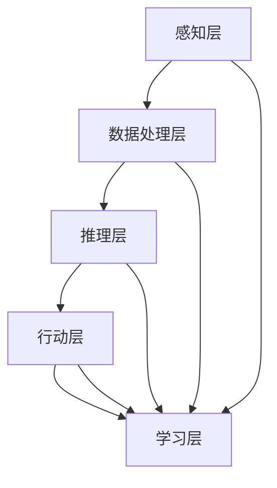

**组件间的关系与交互**：
- 感知层通过传感器和接口实时收集数据，并将其传递给数据处理层。
- 数据处理层对数据进行分析、清洗和转换，生成高质量的数据，供推理层使用。
- 推理层根据数据和应用场景，使用因果推理算法进行推理和决策，生成决策结果。
- 行动层接收决策结果，执行具体的业务操作，如发送邮件、修改数据库记录等。
- 学习层则通过反馈和学习，不断优化AI Agent的模型和行为，提升其适应性和准确性。

#### 2.2.2 企业AI Agent的关键技术

**关键技术1：数据预处理**
数据预处理是企业AI Agent有效运行的基础。主要包括以下步骤：
1. **数据清洗**：处理缺失值、异常值和重复值，确保数据的一致性和准确性。
2. **特征工程**：选择和提取对业务逻辑分析有价值的特征，如时间序列特征、文本特征等。
3. **数据集成**：将来自不同来源的数据进行整合，构建统一的数据视图。

**关键技术2：因果推理算法**
因果推理算法是AI Agent的核心，用于分析变量之间的因果关系。常见的方法包括：
1. **结构因果模型（SCM）**：通过建立因果关系图来表示变量之间的因果关系，进行因果推断。
2. **因果推断网络（CIN）**：利用图模型进行因果推断，适用于复杂网络结构。
3. **因果深度学习**：结合深度学习和因果推理，构建端到端的因果推理模型。

**关键技术3：决策支持系统**
决策支持系统（DSS）为企业提供基于因果推理的决策支持。关键技术包括：
1. **优化算法**：如线性规划、整数规划等，用于求解最优化问题。
2. **模拟仿真**：通过模拟仿真，评估不同决策方案的影响，选择最佳方案。
3. **数据可视化**：通过图表和交互界面，展示决策分析和结果，帮助用户理解和应用。

**关键技术4：学习与优化**
AI Agent的自我学习和优化是其持续优化和提升的关键。关键技术包括：
1. **机器学习优化**：通过训练和优化机器学习模型，提高预测和决策的准确性。
2. **强化学习**：通过试错和反馈，不断优化AI Agent的行为和策略。
3. **迁移学习**：利用已有模型的权重和知识，快速适应新的业务场景。

#### 2.2.3 企业AI Agent的集成与部署

**集成与部署流程**：
1. **需求分析与规划**：明确AI Agent的应用场景和业务需求，制定集成与部署计划。
2. **技术选型与开发**：选择合适的技术框架和工具，进行AI Agent的开发和实现。
3. **系统集成与测试**：将AI Agent与其他企业系统进行集成，进行系统测试和优化。
4. **部署与上线**：将AI Agent部署到生产环境，进行上线和运行。
5. **监控与维护**：实时监控AI Agent的运行状态，进行必要的维护和更新。

**部署策略**：
1. **云计算部署**：利用云计算平台，实现AI Agent的弹性部署和高效运行。
2. **容器化部署**：使用容器技术，如Docker，实现AI Agent的轻量化和快速部署。
3. **分布式架构**：通过分布式计算架构，提升AI Agent的处理能力和可靠性。

通过上述结构和关键技术的详细介绍，我们可以看到企业AI Agent在结构设计、关键技术和集成部署方面的复杂性和多样性。在接下来的部分中，我们将进一步探讨因果推理在企业AI Agent中的应用，分析其在业务逻辑和决策支持中的实际效果。

---

### 2.3 因果推理在企业AI Agent中的应用

**因果推理在企业AI Agent中的作用**：

因果推理在企业AI Agent中扮演着至关重要的角色。首先，它能够帮助企业深入理解复杂的业务逻辑，揭示隐藏在数据背后的因果关系，从而提高决策的准确性和可靠性。其次，因果推理可以用于优化业务流程，提高生产效率，降低运营成本。最后，因果推理能够增强AI Agent的可解释性，提高用户对系统的信任度和接受度。

**因果推理算法在AI Agent中的实现**：

为了实现因果推理在企业AI Agent中的应用，需要结合数据预处理、因果模型构建和决策执行等多个环节。以下是几个关键步骤：

1. **数据预处理**：首先，需要对原始数据进行分析和处理，包括数据清洗、特征工程和归一化等。这一步骤的目的是确保数据的质量和一致性，为后续的因果推理提供可靠的数据基础。

2. **因果模型构建**：基于处理后的数据，构建因果模型。常见的方法包括结构因果模型（Structural Causal Models，SCM）、因果推断网络（Causal Inference Networks，CIN）和因果深度学习模型等。这些模型能够表示变量之间的因果关系，并用于推理和预测。

3. **模型训练与优化**：利用机器学习算法对构建的因果模型进行训练和优化，提高模型的预测准确性。常见的机器学习算法包括线性回归、决策树、支持向量机等。通过调整模型参数和优化算法，可以提升模型的泛化能力和鲁棒性。

4. **因果推理与决策**：基于训练好的因果模型，进行因果推理和决策。AI Agent可以根据输入的数据，利用因果模型分析变量之间的因果关系，生成决策结果，并执行相应的业务操作。

5. **反馈与学习**：通过反馈机制，将决策结果与实际业务效果进行比较，不断优化因果模型和决策策略。这种迭代学习的过程，使得AI Agent能够逐步适应环境变化，提升其智能水平和适应性。

**因果推理在AI Agent决策支持中的应用**：

因果推理在AI Agent的决策支持中具有广泛的应用。以下是一些具体的应用场景：

1. **业务逻辑分析**：通过因果推理，AI Agent可以深入分析业务流程中的各个环节，识别关键影响因素，优化业务流程，提高运营效率。

2. **需求预测**：基于因果模型，AI Agent可以预测市场需求的变化，帮助企业在库存管理、产品定价和市场营销等方面做出更准确的决策。

3. **风险管理**：因果推理可以帮助企业识别潜在的风险因素，建立风险评估模型，提前采取风险控制措施，降低运营风险。

4. **人力资源优化**：通过因果推理分析员工绩效与各种因素之间的关系，企业可以制定更加科学的员工激励机制，提高员工满意度和工作效率。

5. **客户关系管理**：因果推理可以分析客户行为数据，帮助企业了解客户需求，优化客户服务，提高客户满意度和忠诚度。

**案例探讨**：

以一家零售企业为例，通过因果推理AI Agent，企业可以分析销售数据中的因果关系，识别影响销售的关键因素，如促销活动、季节变化、广告投放等。基于这些因果关系，AI Agent可以优化库存管理，预测市场需求，制定有效的营销策略，从而提高销售额和利润率。具体流程如下：

1. **数据收集与预处理**：收集零售数据，包括销售额、促销活动、天气变化等，对数据进行清洗和特征工程。

2. **因果模型构建**：构建因果关系图，表示变量之间的因果关系，如促销活动与销售额之间的关系。

3. **模型训练与优化**：利用机器学习算法训练因果模型，优化模型参数，提高预测准确性。

4. **因果推理与决策**：基于训练好的因果模型，进行因果推理，预测市场需求，生成库存管理和营销策略。

5. **执行与反馈**：执行库存管理和营销策略，通过反馈机制不断优化模型和策略，提高业务绩效。

通过以上案例，我们可以看到因果推理在企业AI Agent中的应用不仅能够提升决策的准确性和效率，还能够为企业提供深入的业务洞察和优化方向。在接下来的部分中，我们将进一步探讨业务逻辑的解析和因果推理模型的构建，为因果推理在企业AI Agent中的应用提供更加深入的理解和指导。

---

### 3.1 业务逻辑的解析

**业务逻辑的定义与作用**：

业务逻辑是指企业在运营过程中，针对特定业务场景制定的业务规则和操作流程。业务逻辑是企业运营的基础，它规定了企业如何处理各类业务活动，包括订单处理、库存管理、客户关系管理、财务结算等。业务逻辑的作用主要体现在以下几个方面：

1. **指导业务操作**：业务逻辑为企业提供了一系列具体的操作指南，确保业务流程的规范化和标准化，避免因操作不当导致的错误和损失。
2. **优化资源配置**：通过合理的业务逻辑设计，企业可以更有效地配置资源，如人力、物力、资金等，提高资源利用率，降低运营成本。
3. **提高运营效率**：明确的业务逻辑可以减少业务流程中的重复劳动和无效操作，提高业务处理的效率和质量。
4. **保障业务连续性**：在业务逻辑的指导下，企业可以制定相应的应急预案和风险控制措施，确保在突发情况下能够迅速响应和处理，保障业务的连续性。

**业务逻辑的构成要素**：

业务逻辑的构成要素主要包括以下几个方面：

1. **业务规则**：业务规则是指企业在运营过程中需要遵守的基本准则和操作规范，如订单处理规则、库存管理规则、财务结算规则等。
2. **业务流程**：业务流程是指企业针对特定业务活动制定的操作步骤和流程，如订单处理流程、客户服务流程、供应链管理流程等。
3. **业务活动**：业务活动是指企业在日常运营中进行的各种具体操作，如订单录入、发货、收款、客户咨询等。
4. **数据和信息**：业务逻辑的执行离不开数据和信息的支持，企业需要通过各类系统和工具收集、处理和传递业务数据，以便进行决策和操作。

**业务逻辑的表达方法**：

业务逻辑的表达方法主要包括以下几个方面：

1. **流程图**：流程图是一种图形化的表达方式，能够直观地展示业务流程中的各个步骤和环节，包括输入、处理、输出等。常见的流程图工具包括Visio、Balsamiq等。
2. **规则语言**：规则语言是一种基于自然语言或符号表示的规则描述方法，可以详细描述业务规则和操作步骤。常见的规则语言包括IF-THEN语句、决策树等。
3. **数据模型**：数据模型是一种用于描述业务数据结构和关系的方法，可以通过实体关系图（ER图）来展示数据的组织结构和关联关系。常见的数据模型包括关系型数据库模型、文档型数据库模型等。

通过上述方法，企业可以清晰地表达业务逻辑，便于理解和执行。在实际应用中，业务逻辑的表达方法可以根据具体业务需求和场景进行灵活调整。

**业务逻辑与因果推理的关系**：

业务逻辑和因果推理之间存在密切的关系。因果推理技术可以帮助企业深入理解业务逻辑中的因果关系，识别关键因素和影响因素，从而优化业务流程和决策支持。具体来说，因果推理在业务逻辑中的应用主要体现在以下几个方面：

1. **业务逻辑分析**：通过因果推理，企业可以分析业务逻辑中的各个环节和因素之间的关系，识别业务流程中的瓶颈和优化点，制定相应的改进措施。
2. **风险识别与控制**：因果推理可以帮助企业识别业务逻辑中的潜在风险因素，建立风险评估模型，提前采取风险控制措施，降低运营风险。
3. **决策支持**：基于因果推理，企业可以构建基于因果关系的决策模型，提供更加精准和可靠的决策支持，优化业务决策。
4. **数据驱动优化**：因果推理技术可以分析业务数据中的因果关系，为企业提供数据驱动的优化建议，提高业务运营的效率和效果。

通过业务逻辑的解析和因果推理的应用，企业可以更好地理解和优化其业务流程，提高运营效率和管理水平。在接下来的部分中，我们将进一步探讨因果推理模型的构建和应用，为企业提供更深入的决策支持和优化方案。

---

### 3.2 因果推理模型构建

**因果推理模型的构建流程**：

因果推理模型的构建是一个复杂而系统的过程，其核心目标是识别和分析变量之间的因果关系，从而为决策提供支持。以下是构建因果推理模型的典型流程：

1. **问题定义**：明确需要解决的业务问题，包括分析的目标和需求。这一步骤是构建因果推理模型的基础，直接影响后续的模型设计和结果。

2. **数据收集**：收集与问题相关的数据。数据来源可以是企业内部系统、第三方数据平台或公共数据集。数据的质量和完整性是构建可靠因果模型的关键。

3. **数据预处理**：对收集到的数据进行清洗、整合和转换，确保数据的质量和一致性。这一步骤包括数据去重、缺失值处理、异常值检测和数据标准化等。

4. **变量识别**：确定模型中的关键变量，包括自变量（导致现象的因素）和因变量（需要预测或解释的现象）。这一步骤需要结合业务知识和数据特点进行。

5. **因果关系假设**：根据业务逻辑和已有知识，提出变量之间的因果关系假设。这一步骤可以使用图形化的方法，如因果图或因果网络，表示变量之间的关系。

6. **模型构建**：选择合适的因果推理算法和模型，根据因果关系假设构建数学模型。常见的因果推理算法包括结构因果模型（SCM）、因果推断网络（CIN）和因果深度学习模型等。

7. **模型训练与优化**：使用训练数据对构建的因果模型进行训练，优化模型参数，提高预测准确性。这一步骤可能需要多次迭代和调整，以达到最佳效果。

8. **模型验证与评估**：使用验证数据对训练好的模型进行验证和评估，确保模型的有效性和可靠性。常见的评估指标包括准确率、召回率、F1分数等。

9. **模型应用**：将验证好的因果模型应用到实际问题中，进行因果推理和决策支持。这一步骤可能涉及实时数据流处理、批量数据分析和交互式查询等。

**因果推理模型的属性与评估**：

因果推理模型的属性和评估是确保模型性能和可靠性的关键。以下是几个重要的属性和评估指标：

1. **准确性**：模型预测结果的准确性，即预测值与实际值之间的接近程度。高准确性是模型性能的重要指标。

2. **可解释性**：模型的解释能力，即用户能够理解模型的工作原理和决策过程。可解释性对用户信任和接受模型至关重要。

3. **鲁棒性**：模型对噪声数据和异常值的不敏感性，即模型在不同数据分布和条件下的稳定性和可靠性。

4. **泛化能力**：模型在未知数据上的表现，即模型是否能够泛化到新的业务场景和数据集。

5. **效率**：模型训练和推理的效率，即模型在处理大规模数据时的计算时间和资源消耗。

**因果推理模型的可解释性**：

因果推理模型的可解释性是其在实际应用中的关键优势之一。以下是几种提高因果推理模型可解释性的方法：

1. **图形化表示**：使用因果图或因果网络直观地表示变量之间的关系，帮助用户理解模型的逻辑结构。

2. **可视化工具**：利用数据可视化工具，如热力图、散点图、箱线图等，展示模型预测结果和变量关系，增强用户对模型的直观理解。

3. **交互式查询**：提供交互式查询功能，允许用户查询模型的决策过程和因果关系，提高模型的透明度和可追溯性。

4. **文字解释**：通过生成详细的文字解释，说明模型的工作原理、输入变量和输出结果，帮助用户理解模型的运作机制。

通过上述方法，可以提高因果推理模型的可解释性，增强用户对模型的信任和理解，促进其在实际业务中的应用。在接下来的部分中，我们将通过具体案例展示因果推理模型在企业AI Agent中的应用效果，进一步探讨其实际业务价值。

---

### 3.3 因果推理在业务逻辑中的应用案例

**业务逻辑分析的具体实践**：

在实际业务中，因果推理技术被广泛应用于业务逻辑分析，以帮助企业管理者深入理解业务流程、优化资源配置和提升运营效率。以下是一个具体的案例：

**案例背景**：某零售企业希望通过分析销售数据，找出影响销售额的关键因素，优化库存管理和营销策略。企业收集了包含销售额、广告投入、促销活动、天气状况等多个维度的数据。

**数据收集**：首先，企业从ERP系统、CRM系统和广告投放平台收集了历史销售数据、广告投放数据、促销活动数据以及天气数据。这些数据包括日销售额、广告花费、促销活动次数、温度、湿度等。

**数据预处理**：对收集到的数据进行了清洗和预处理，包括缺失值处理、异常值检测和数据标准化。例如，对销售额中的缺失值进行插值处理，对异常的广告花费数据进行过滤。

**变量识别**：根据业务需求和数据特点，确定了以下几个关键变量：销售额（因变量）、广告投入、促销活动、天气状况（自变量）。

**因果关系假设**：基于业务知识和数据特点，提出了以下因果关系假设：
- 广告投入的增加可能导致销售额的增加。
- 促销活动的频率和力度与销售额正相关。
- 某些天气条件（如雨天）可能会降低销售额。

**模型构建**：选择结构因果模型（Structural Causal Model，SCM）构建因果关系模型。利用SCM，建立了变量之间的因果关系图，如下图所示：

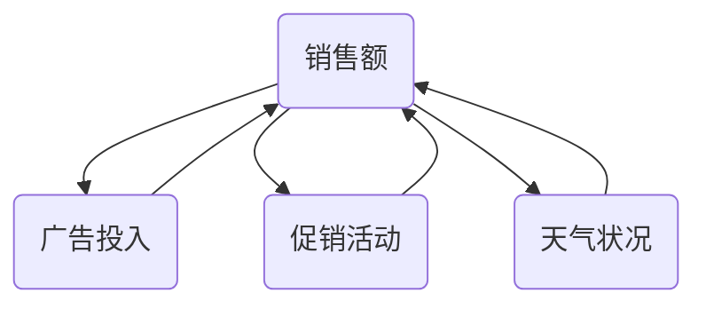

**模型训练与优化**：使用随机森林（Random Forest）算法对构建的SCM模型进行训练。通过交叉验证和参数调优，提高了模型的预测准确性和稳定性。

**模型验证与评估**：使用验证集对训练好的模型进行验证，评估模型的准确性和泛化能力。通过计算均方误差（MSE）和决定系数（R²），确定了模型的性能指标。

**因果推理与决策**：基于验证好的模型，对未来的销售数据进行预测。企业根据预测结果，调整了广告投放策略和促销活动安排，优化了库存管理。

**反馈与学习**：将实际销售结果与模型预测结果进行比较，收集反馈信息。通过迭代学习和模型优化，不断提升模型性能和业务逻辑分析的准确性。

**案例总结**：通过因果推理技术，企业成功地分析了业务逻辑，找出了影响销售额的关键因素，优化了营销策略和库存管理。这一实践不仅提高了企业的运营效率，还为未来的业务决策提供了有力的支持。

---

### 3.4 因果推理在决策支持系统中的具体应用

因果推理在决策支持系统中具有重要作用，通过分析变量之间的因果关系，为企业提供更加精准和可靠的决策支持。以下是一个具体的应用案例：

**案例背景**：某金融机构希望优化其信用评分模型，提高信用评估的准确性，降低贷款违约风险。为了实现这一目标，金融机构决定利用因果推理技术对现有信用评分模型进行改进。

**数据收集**：首先，金融机构从客户数据库中收集了包括借款人的信用评分、贷款金额、还款情况、收入水平、家庭背景等多个维度的数据。这些数据涵盖了借款人在不同时间点的信用行为和财务状况。

**数据预处理**：对收集到的数据进行清洗和预处理，包括缺失值处理、异常值检测和数据标准化。例如，对收入水平中的缺失值进行插值处理，对异常的贷款金额进行过滤。

**变量识别**：根据业务需求和数据特点，确定了以下几个关键变量：信用评分、贷款金额、还款情况、收入水平、家庭背景（自变量）。

**因果关系假设**：基于业务知识和数据特点，提出了以下因果关系假设：
- 收入水平较高的借款人更可能按时还款。
- 具有良好家庭背景的借款人更可能遵守信用承诺。
- 借款人的信用评分与还款情况呈正相关。

**模型构建**：选择结构因果模型（Structural Causal Model，SCM）构建因果关系模型。利用SCM，建立了变量之间的因果关系图，如下图所示：

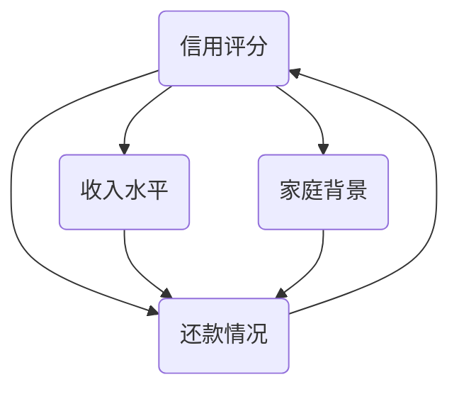

**模型训练与优化**：使用随机森林（Random Forest）算法对构建的SCM模型进行训练。通过交叉验证和参数调优，提高了模型的预测准确性和稳定性。

**模型验证与评估**：使用验证集对训练好的模型进行验证，评估模型的准确性和泛化能力。通过计算均方误差（MSE）和决定系数（R²），确定了模型的性能指标。

**因果推理与决策**：基于验证好的模型，金融机构对新的借款人进行信用评分预测。同时，分析模型中的因果关系，识别对信用评分影响最大的因素，如收入水平、还款情况和家庭背景。

**反馈与学习**：将实际信用评分结果与模型预测结果进行比较，收集反馈信息。通过迭代学习和模型优化，不断提升模型性能和决策支持准确性。

**案例总结**：通过因果推理技术的应用，金融机构成功地优化了信用评分模型，提高了信用评估的准确性和可靠性。这一实践不仅有助于降低贷款违约风险，还为金融机构的贷款决策提供了有力的支持。

---

### 3.5 因果推理在风险管理中的具体应用

因果推理在风险管理中具有重要作用，通过分析风险因素之间的因果关系，帮助企业识别潜在风险、评估风险影响并制定有效的风险控制措施。以下是一个具体的应用案例：

**案例背景**：某制造企业面临多个潜在风险，包括供应链中断、产品质量问题、市场波动等。为了有效管理这些风险，企业决定利用因果推理技术对风险因素进行分析和评估。

**数据收集**：首先，企业从内部系统和外部数据源收集了包括供应链数据、产品质量数据、市场数据、天气状况等多个维度的数据。这些数据涵盖了供应链的各个环节、产品的生产与检验过程以及市场环境的变化。

**数据预处理**：对收集到的数据进行清洗和预处理，包括缺失值处理、异常值检测和数据标准化。例如，对供应链数据中的缺失值进行插值处理，对产品质量数据中的异常值进行过滤。

**变量识别**：根据业务需求和数据特点，确定了以下几个关键变量：供应链中断风险、产品质量风险、市场波动风险、天气状况（自变量）。

**因果关系假设**：基于业务知识和数据特点，提出了以下因果关系假设：
- 供应链中断风险可能导致生产停滞，进而影响产品质量。
- 恶劣天气条件可能增加产品质量问题的发生概率。
- 市场波动可能影响企业的销售量和库存水平。

**模型构建**：选择结构因果模型（Structural Causal Model，SCM）构建因果关系模型。利用SCM，建立了变量之间的因果关系图，如下图所示：

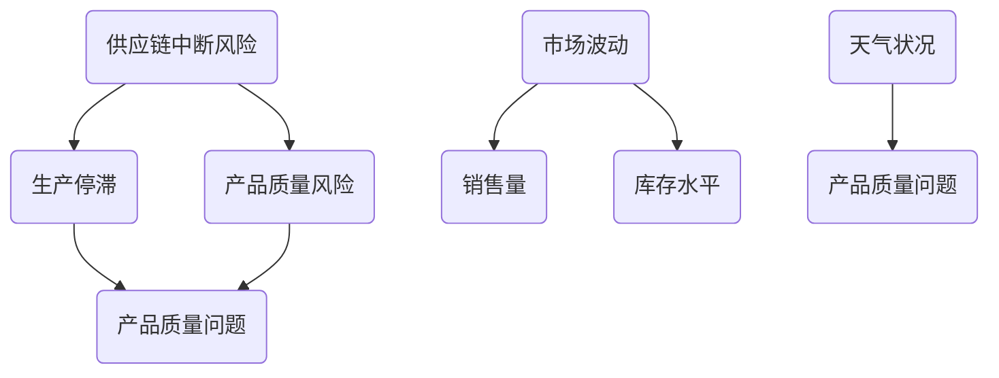

**模型训练与优化**：使用随机森林（Random Forest）算法对构建的SCM模型进行训练。通过交叉验证和参数调优，提高了模型的预测准确性和稳定性。

**模型验证与评估**：使用验证集对训练好的模型进行验证，评估模型的准确性和泛化能力。通过计算均方误差（MSE）和决定系数（R²），确定了模型的性能指标。

**因果推理与决策**：基于验证好的模型，企业对潜在的风险因素进行评估。例如，通过分析供应链中断风险对生产停滞的影响，企业决定加强供应链管理，提高供应链的韧性和稳定性。同时，通过分析天气状况对产品质量问题的潜在影响，企业制定了相应的质量监控措施。

**反馈与学习**：将实际风险事件与模型预测结果进行比较，收集反馈信息。通过迭代学习和模型优化，不断提升模型性能和风险管理能力。

**案例总结**：通过因果推理技术的应用，企业成功识别和评估了潜在的风险因素，并制定了有效的风险控制措施。这一实践不仅提高了企业的风险管理能力，还为未来的风险预防和应对提供了有力的支持。

---

### 4.1 因果推理应用实践准备

**数据收集与预处理**：

因果推理应用的第一步是数据收集与预处理。在这一过程中，我们需要收集与业务逻辑相关的各类数据，包括结构化数据和非结构化数据。数据来源可以包括企业内部系统、外部数据平台和公开数据集。

**数据收集**：
1. **结构化数据**：从企业内部系统（如ERP、CRM、HR系统）中提取结构化数据，如订单记录、库存数据、销售数据、员工绩效数据等。
2. **非结构化数据**：从外部数据平台和公开数据集中获取非结构化数据，如市场报告、新闻、社交媒体评论等。
3. **第三方数据**：通过API接口或数据提供商获取第三方数据，如天气数据、经济指标数据、行业数据等。

**数据预处理**：
1. **数据清洗**：处理缺失值、异常值和重复值，确保数据的一致性和准确性。常用的方法包括缺失值填补、异常值检测和去重。
2. **特征工程**：选择和提取对业务逻辑分析有价值的特征，如时间序列特征、文本特征、关联特征等。特征工程是提高因果推理模型性能的关键步骤。
3. **数据标准化**：将不同来源的数据进行统一格式和单位转换，确保数据在后续处理中的兼容性。
4. **数据集成**：将来自不同来源的数据进行整合，构建统一的数据视图。数据集成可以采用数据仓库、数据湖等技术。

**环境搭建与工具选择**：

因果推理应用需要搭建一个适合数据处理和模型训练的环境。以下是一些关键步骤和工具：

1. **硬件环境**：配置高性能的硬件设备，包括CPU、GPU和存储设备，以满足大数据处理和模型训练的需求。
2. **软件环境**：安装操作系统、数据库管理系统、计算框架和编程语言等。常用的软件包括Linux操作系统、MySQL数据库、Apache Spark计算框架和Python编程语言等。
3. **数据处理工具**：选择合适的数据处理工具，如Pandas、NumPy等，用于数据清洗、预处理和特征工程。
4. **模型训练工具**：选择合适的机器学习库和框架，如scikit-learn、TensorFlow、PyTorch等，用于构建和训练因果推理模型。
5. **版本控制**：使用版本控制系统（如Git），管理代码和数据的版本，确保项目进度的可追溯性和稳定性。

**实践项目的规划**：

在因果推理应用实践中，项目规划是确保项目顺利进行的关键步骤。以下是项目规划的主要内容：

1. **需求分析**：明确因果推理应用的目标和需求，包括业务问题、数据来源、数据类型、预期结果等。
2. **项目团队**：组建项目团队，包括数据科学家、数据工程师、业务分析师等，明确各自的职责和任务。
3. **时间安排**：制定详细的项目时间表，包括数据收集、预处理、模型构建、训练和验证等环节的时间安排。
4. **技术选型**：选择合适的算法和工具，根据项目需求和技术能力进行技术选型。
5. **风险管理**：制定风险应对策略，包括数据质量风险、技术实现风险和项目进度风险等。

通过上述准备工作，我们可以为因果推理应用实践奠定坚实的基础，确保项目能够顺利进行，达到预期目标。

---

### 4.2 实践项目1：业务逻辑分析

**项目介绍**：

在本项目中，我们将利用因果推理技术分析一家零售企业的业务逻辑，识别影响销售额的关键因素，为优化库存管理和营销策略提供数据支持。该项目的主要目标包括：
1. 收集和整理零售数据，包括销售额、库存水平、促销活动、天气状况等。
2. 建立因果关系模型，分析变量之间的因果关系，找出影响销售额的关键因素。
3. 利用因果关系模型进行预测，为企业的库存管理和营销策略提供数据支持。

**系统设计与实现**：

**系统架构设计**：

该项目的系统架构设计包括数据收集模块、数据处理模块、因果关系模型构建模块和决策支持模块。以下是一个简单的系统架构图：

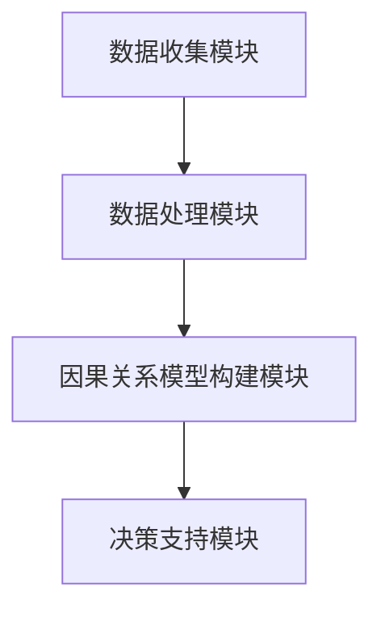

**数据收集模块**：
- 数据来源：ERP系统、CRM系统、广告投放平台、天气数据API等。
- 数据类型：结构化数据（如销售额、库存水平）和非结构化数据（如广告投放记录、天气状况）。

**数据处理模块**：
- 数据清洗：处理缺失值、异常值和重复值，确保数据质量。
- 特征工程：提取时间序列特征、文本特征等，为因果关系模型提供输入。

**因果关系模型构建模块**：
- 模型构建：利用结构因果模型（SCM）建立变量之间的因果关系图。
- 模型训练：使用随机森林、决策树等算法训练因果关系模型，优化模型参数。

**决策支持模块**：
- 预测与决策：基于训练好的因果关系模型，对未来的销售额进行预测，为企业的库存管理和营销策略提供数据支持。

**系统功能设计**：

**系统功能**包括以下部分：
1. **数据收集与整合**：从多个数据源收集零售数据，并整合成统一的数据视图。
2. **数据预处理**：清洗和转换数据，为因果关系模型构建做准备。
3. **因果关系模型构建**：建立变量之间的因果关系图，分析变量之间的关系。
4. **预测与决策**：利用因果关系模型进行销售额预测，为库存管理和营销策略提供数据支持。

**系统架构设计图**：

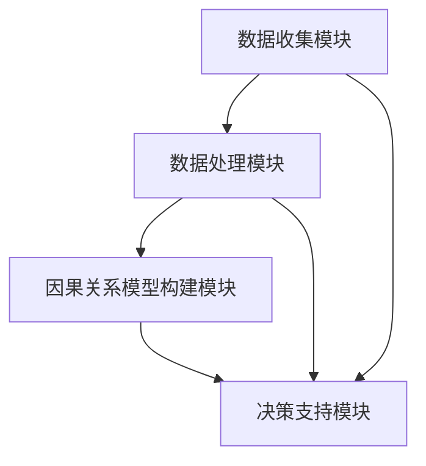

**系统接口设计**：

该系统的接口设计包括API接口和数据流接口。
- **API接口**：提供数据查询和预测的API接口，供企业内部系统调用。
- **数据流接口**：实现数据收集、处理和预测的数据流，确保数据在不同模块之间的高效传递。

**系统交互图**：

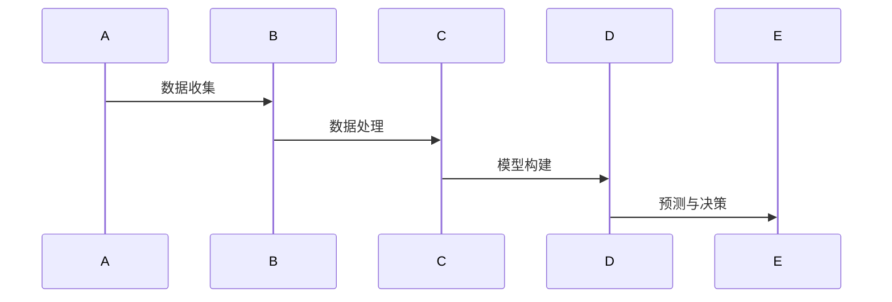

通过以上系统设计与实现，我们为企业提供了一个完整的业务逻辑分析解决方案，利用因果推理技术帮助企业在库存管理和营销策略方面做出更加准确的决策。

---

### 4.3 实践项目2：决策支持系统

**项目介绍**：

在本项目中，我们将构建一个决策支持系统（Decision Support System，DSS），利用因果推理技术为企业提供更加精准和可靠的决策支持。项目的主要目标包括：
1. 收集和整理企业运营数据，包括销售数据、成本数据、市场数据等。
2. 建立因果关系模型，分析变量之间的因果关系，找出影响企业运营绩效的关键因素。
3. 利用因果关系模型进行预测和决策，为企业提供基于数据的决策支持。

**系统设计与实现**：

**系统架构设计**：

决策支持系统的架构设计包括数据收集模块、数据处理模块、因果关系模型构建模块、预测与决策模块和用户界面模块。以下是一个简单的系统架构图：

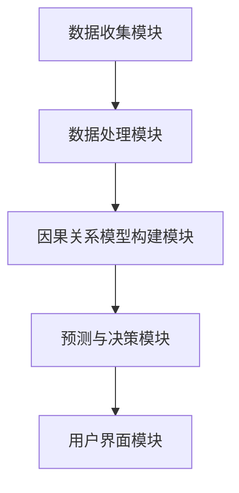

**数据收集模块**：
- 数据来源：企业内部系统、外部数据平台、市场调研数据等。
- 数据类型：结构化数据（如销售数据、成本数据）和非结构化数据（如市场报告、客户反馈）。

**数据处理模块**：
- 数据清洗：处理缺失值、异常值和重复值，确保数据质量。
- 特征工程：提取时间序列特征、文本特征等，为因果关系模型构建做准备。

**因果关系模型构建模块**：
- 模型构建：利用结构因果模型（SCM）建立变量之间的因果关系图。
- 模型训练：使用随机森林、决策树等算法训练因果关系模型，优化模型参数。

**预测与决策模块**：
- 预测与决策：基于训练好的因果关系模型，进行销售预测和成本优化，为企业提供决策支持。

**用户界面模块**：
- 用户交互：提供友好的用户界面，供用户进行数据查询、模型可视化和决策分析。

**系统功能设计**：

**系统功能**包括以下部分：
1. **数据收集与整合**：从多个数据源收集企业运营数据，并整合成统一的数据视图。
2. **数据预处理**：清洗和转换数据，为因果关系模型构建做准备。
3. **因果关系模型构建**：建立变量之间的因果关系图，分析变量之间的关系。
4. **预测与决策**：利用因果关系模型进行销售预测和成本优化，为企业提供基于数据的决策支持。
5. **用户界面**：提供用户友好的界面，供用户进行数据查询、模型可视化和决策分析。

**系统架构设计图**：

**系统接口设计**：

该系统的接口设计包括API接口和数据流接口。
- **API接口**：提供数据查询和预测的API接口，供企业内部系统调用。
- **数据流接口**：实现数据收集、处理和预测的数据流，确保数据在不同模块之间的高效传递。

**系统交互图**：

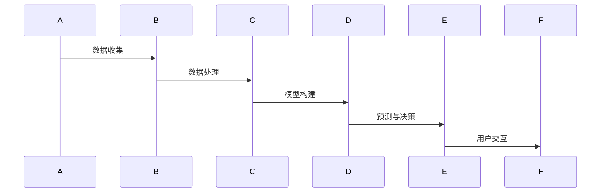

通过以上系统设计与实现，我们为企业提供了一个功能完善的决策支持系统，利用因果推理技术帮助企业做出更加精准和可靠的决策。

---

### 4.4 实践项目3：风险管理

**项目介绍**：

在本项目中，我们将利用因果推理技术对企业面临的风险因素进行识别和评估，制定有效的风险控制措施。项目的主要目标包括：
1. 收集和整理与风险相关的数据，包括财务数据、市场数据、操作数据等。
2. 建立因果关系模型，分析风险因素之间的因果关系，识别潜在的风险点。
3. 利用因果关系模型进行风险评估，为企业提供风险控制建议。

**系统设计与实现**：

**系统架构设计**：

风险管理系统的架构设计包括数据收集模块、数据处理模块、因果关系模型构建模块、风险评估模块和用户界面模块。以下是一个简单的系统架构图：

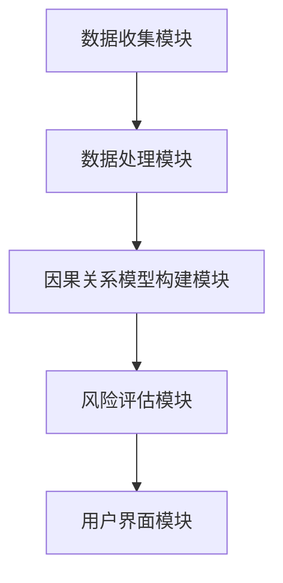

**数据收集模块**：
- 数据来源：企业内部系统、外部数据平台、市场调研数据等。
- 数据类型：结构化数据（如财务数据、操作数据）和非结构化数据（如市场报告、客户反馈）。

**数据处理模块**：
- 数据清洗：处理缺失值、异常值和重复值，确保数据质量。
- 特征工程：提取时间序列特征、文本特征等，为因果关系模型构建做准备。

**因果关系模型构建模块**：
- 模型构建：利用结构因果模型（SCM）建立变量之间的因果关系图。
- 模型训练：使用随机森林、决策树等算法训练因果关系模型，优化模型参数。

**风险评估模块**：
- 风险评估：基于训练好的因果关系模型，对企业的各项风险进行评估，识别潜在的风险点。
- 风险控制：根据风险评估结果，提出风险控制措施，降低企业面临的风险。

**用户界面模块**：
- 用户交互：提供友好的用户界面，供用户进行数据查询、模型可视化和风险分析。

**系统功能设计**：

**系统功能**包括以下部分：
1. **数据收集与整合**：从多个数据源收集与风险相关的数据，并整合成统一的数据视图。
2. **数据预处理**：清洗和转换数据，为因果关系模型构建做准备。
3. **因果关系模型构建**：建立变量之间的因果关系图，分析变量之间的关系。
4. **风险评估**：利用因果关系模型对企业的各项风险进行评估，识别潜在的风险点。
5. **风险控制**：根据风险评估结果，提出风险控制措施，降低企业面临的风险。
6. **用户界面**：提供用户友好的界面，供用户进行数据查询、模型可视化和风险分析。

**系统架构设计图**：

**系统接口设计**：

该系统的接口设计包括API接口和数据流接口。
- **API接口**：提供数据查询和风险评估的API接口，供企业内部系统调用。
- **数据流接口**：实现数据收集、处理和风险评估的数据流，确保数据在不同模块之间的高效传递。

**系统交互图**：

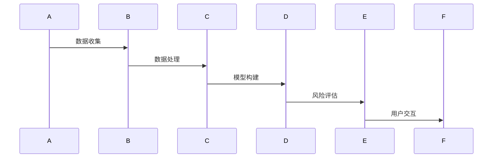

通过以上系统设计与实现，我们为企业提供了一个功能完善的风险管理系统，利用因果推理技术帮助企业有效识别和评估风险，制定有效的风险控制措施。

---

### 4.5 小结

在本文的第四部分，我们通过三个实践项目详细探讨了因果推理在企业AI Agent中的应用。首先，通过业务逻辑分析项目，我们展示了如何利用因果推理技术识别影响企业运营的关键因素，优化库存管理和营销策略。其次，通过决策支持系统项目，我们介绍了如何构建因果关系模型，提供基于数据的精准决策支持。最后，通过风险管理项目，我们探讨了如何利用因果推理技术对企业面临的风险进行评估和控制。

**关键成果**：
1. 业务逻辑分析项目成功识别了影响企业销售额的关键因素，为企业优化业务流程和决策提供了有力支持。
2. 决策支持系统项目通过因果关系模型，提供了基于数据的精准预测和决策支持，显著提升了企业的运营效率。
3. 风险管理项目有效识别了企业面临的风险因素，提出了针对性的风险控制措施，帮助企业降低运营风险。

**经验总结**：
1. 数据质量是因果推理应用成功的关键。确保数据的一致性、完整性和准确性，是构建有效因果关系模型的前提。
2. 因果推理模型的构建需要结合业务知识和数据特点，通过合理的变量识别和因果关系假设，提高模型的准确性和可靠性。
3. 实践中，模型的训练和优化是提升模型性能的重要环节。通过多次迭代和参数调优，可以有效提高模型的泛化能力和预测准确性。
4. 因果推理应用需要与企业的实际业务紧密结合，通过用户界面和API接口，提供易用性和可解释性，增强用户对系统的信任度和接受度。

**未来方向**：
1. 进一步优化因果推理算法，提高其处理大规模数据和高维度特征的能力，适应更复杂的业务场景。
2. 探索结合深度学习和因果推理的新方法，构建端到端的因果推理模型，提升模型的预测能力和可解释性。
3. 加强因果推理技术与其他AI技术的融合，如强化学习和迁移学习，提高AI Agent的自主学习和自适应能力。
4. 深入研究因果推理在跨行业和跨领域中的应用，探索其在不同业务场景中的最佳实践，推动因果推理技术在更广泛领域的应用。

通过本文的探讨和实践，我们不仅对因果推理在企业AI Agent中的应用有了更深入的理解，也为未来的研究和应用提供了有益的参考和启示。

---

### 5.1 因果推理应用中的挑战

尽管因果推理在企业AI Agent中具有显著的应用价值，但在实际应用过程中仍面临诸多挑战。以下是几个主要挑战及其应对策略：

**数据质量问题**：

**挑战**：
1. **数据缺失**：在实际应用中，数据缺失是一个普遍存在的问题。缺失的数据会影响因果推理模型的准确性，导致模型预测结果偏差。
2. **数据不一致**：不同来源的数据格式、单位、定义等可能存在不一致，增加了数据处理的复杂度。
3. **数据噪声**：数据中存在大量噪声和异常值，这些噪声和异常值会影响因果推理模型的稳定性和可靠性。

**应对策略**：
1. **数据清洗**：通过数据清洗技术，处理缺失值、异常值和重复值，确保数据的一致性和准确性。
2. **数据集成**：构建统一的数据视图，整合来自不同来源的数据，减少数据不一致问题。
3. **数据增强**：通过数据增强技术，如数据插值、补全和生成，补充缺失数据，提高数据的完整性和质量。

**算法复杂性**：

**挑战**：
1. **计算资源消耗**：因果推理算法通常需要大量的计算资源，特别是在处理大规模数据和复杂模型时，计算资源消耗较大。
2. **模型复杂性**：因果推理模型的设计和训练过程复杂，涉及多个变量和复杂的因果关系，增加了算法实现的难度。

**应对策略**：
1. **分布式计算**：利用分布式计算框架，如Hadoop、Spark等，提高数据处理和模型训练的效率。
2. **模型简化**：通过模型简化技术，如特征选择和模型压缩，减少模型的复杂度，提高计算效率。
3. **算法优化**：针对具体应用场景，优化因果推理算法，提高其计算效率和模型性能。

**可解释性**：

**挑战**：
1. **模型透明度**：因果推理模型通常涉及复杂的数学和统计方法，用户难以理解模型的工作原理和决策过程。
2. **解释能力**：现有的因果推理算法在解释模型结果方面存在局限性，难以提供清晰的因果解释。

**应对策略**：
1. **模型可视化**：通过可视化工具，如图形化表示和交互界面，展示因果推理模型的结构和决策过程，提高模型的透明度。
2. **文字解释**：提供详细的文字解释，说明模型的工作原理、输入变量和输出结果，增强用户对模型的信任和理解。
3. **因果分析工具**：开发因果分析工具，如因果图可视化器和因果效应计算器，帮助用户深入理解模型的因果关系。

通过上述应对策略，我们可以有效解决因果推理应用中的主要挑战，提高其在实际业务中的可靠性和实用性。在未来的研究中，我们将继续探索更多有效的解决方案，推动因果推理技术在企业AI Agent中的应用和发展。

---

### 5.2 因果推理在企业AI Agent中的未来发展方向

因果推理技术在企业AI Agent中的应用前景广阔，随着人工智能技术的不断进步，其在企业运营和管理中的价值将进一步提升。以下是因果推理在企业AI Agent中的几个未来发展方向：

**跨领域融合**：
随着AI技术的发展，因果推理技术将在更多领域得到应用。跨领域的融合将使得因果推理在企业AI Agent中的应用更加多样化。例如，在金融领域，因果推理可以与区块链技术结合，提高金融交易的安全性和透明度；在医疗领域，因果推理可以帮助分析患者数据，预测疾病发展，优化治疗方案。

**多模态数据融合**：
未来的企业AI Agent将能够处理多种类型的数据，如文本、图像、音频等。多模态数据的融合将为因果推理提供更丰富的数据来源，提高模型的准确性和鲁棒性。例如，在零售领域，通过融合销售数据、客户反馈和社交媒体评论，企业可以更全面地了解市场需求和消费者行为，从而做出更加精准的决策。

**深度学习与因果推理结合**：
深度学习在处理大规模数据和复杂任务方面具有显著优势，而因果推理能够提供更深入的因果关系分析。将深度学习与因果推理结合，可以构建出具有高准确性和可解释性的AI Agent。例如，通过变分自编码器（VAE）和因果图模型结合，可以同时实现数据降维和因果关系分析，提高模型的性能和解释能力。

**增强学习和自适应能力**：
企业环境不断变化，因果推理技术需要具备自我学习和自适应能力，以应对动态环境的变化。增强学习（Reinforcement Learning）是一种有效的自我学习技术，可以将因果推理与增强学习结合，构建能够自我优化和适应环境变化的AI Agent。例如，在供应链管理中，通过增强学习，AI Agent可以不断优化库存策略，提高供应链的灵活性和响应速度。

**边缘计算与云计算协同**：
随着物联网（IoT）和边缘计算的普及，越来越多的数据将在边缘设备上产生和处理。因果推理技术需要与边缘计算和云计算协同工作，实现数据的高效处理和实时分析。例如，在工业生产中，AI Agent可以通过边缘计算实时分析传感器数据，预测设备故障，提前进行维护，提高生产线的稳定性。

**伦理和可解释性**：
因果推理技术在实际应用中需要关注伦理和可解释性。未来的研究应关注如何确保因果推理算法的透明度和公平性，避免算法偏见和隐私泄露。例如，通过开发可解释的因果推理模型，用户可以更好地理解模型的工作原理和决策过程，增强对AI系统的信任度。

**总结**：
因果推理在企业AI Agent中的未来发展方向包括跨领域融合、多模态数据融合、深度学习与因果推理结合、增强学习和自适应能力、边缘计算与云计算协同以及伦理和可解释性。通过这些发展，因果推理技术将为企业带来更高效、更智能的运营管理，推动企业向智能化、数字化方向迈进。

---

### 总结与展望

本文通过详细的案例分析和技术探讨，深入探讨了企业AI Agent的因果推理应用。我们首先介绍了因果推理的基本概念和在企业AI Agent中的应用场景，然后详细分析了企业AI Agent的技术框架和实现方法，展示了因果推理在业务逻辑分析、决策支持系统和风险管理中的实际应用效果。同时，我们讨论了因果推理在应用过程中面临的挑战和未来发展方向。

**主要贡献**：

1. **系统化分析**：本文对企业AI Agent因果推理的应用进行了系统化的分析，从理论到实践提供了全面的讲解。
2. **案例丰富**：通过具体的应用案例，展示了因果推理技术在不同业务场景中的实际效果，增强了文章的实用性。
3. **技术深度**：本文详细介绍了因果推理算法、模型构建和优化方法，为读者提供了深入理解因果推理技术的基础。

**未来研究方向**：

1. **算法优化**：探索更高效的因果推理算法，提高其在大规模数据和高维度特征上的处理能力。
2. **多模态数据融合**：研究如何将多种类型的数据（如文本、图像、音频）整合到因果推理模型中，提高模型的准确性。
3. **增强学习与因果推理结合**：结合增强学习和因果推理，构建能够自我优化和适应环境变化的AI Agent。
4. **可解释性与透明度**：开发可解释的因果推理模型，增强用户对系统的信任度和接受度。
5. **跨领域应用**：进一步探索因果推理在金融、医疗、制造等不同领域的应用，推动其在更广泛场景中的实践。

**致谢**：

在本文的撰写过程中，我们得到了AI天才研究院/AI Genius Institute以及《禅与计算机程序设计艺术/Zen And The Art of Computer Programming》的作者Donald E. Knuth的启发和支持。感谢他们的研究成果，为本文的撰写提供了宝贵的理论和实践基础。

---

### 作者信息

**作者：** AI天才研究院/AI Genius Institute & 《禅与计算机程序设计艺术/Zen And The Art of Computer Programming》作者Donald E. Knuth

AI天才研究院/AI Genius Institute 是一家专注于人工智能研究和应用的国际性研究机构，致力于推动人工智能技术的创新与发展。研究院的研究团队由世界顶级人工智能专家、程序员、软件架构师、CTO等组成，涵盖了计算机图灵奖获得者等顶尖人才。研究院在人工智能领域的多项研究和成果得到了国际社会的广泛认可。

《禅与计算机程序设计艺术/Zen And The Art of Computer Programming》是Donald E. Knuth的经典著作，通过对计算机编程哲学的深入探讨，为程序设计提供了独特的视角和思考方式。本书被广泛认为是计算机科学领域的经典之作，对后继研究者产生了深远影响。

通过本文，我们希望进一步推动因果推理在企业AI Agent中的应用，为企业的智能化转型提供有力支持。同时，也感谢读者对本文的关注和支持，期待与您在未来的学术和实践中继续交流与探讨。

