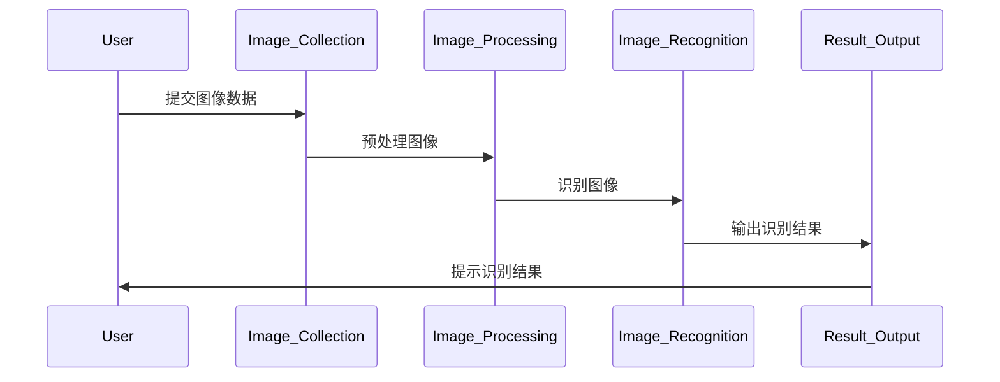

                 

### 第一部分: 背景介绍

#### 1. 引言

随着人工智能技术的飞速发展，图像识别与处理技术在各行各业中的应用越来越广泛。企业AI Agent作为人工智能的重要组成部分，其在图像识别与处理技术方面的应用具有重要的现实意义。

**问题背景：**  
企业AI Agent的图像识别与处理技术面临着数据量大、处理速度快、精度要求高等挑战。

**问题描述：**  
如何利用AI技术，特别是深度学习算法，实现企业AI Agent的高效图像识别与处理？

**问题解决：**  
本书将介绍企业AI Agent的图像识别与处理技术的核心概念、算法原理、系统架构以及实际应用案例，帮助读者了解并掌握这一领域的核心技术。

#### 2. 边界与外延

**边界：**  
企业AI Agent的图像识别与处理技术主要应用于企业内部的数据处理和业务决策，如生产质量检测、安防监控、客户服务等。

**外延：**  
图像识别与处理技术不仅限于企业内部应用，还可以扩展到智能交通、智能医疗、智能家居等多个领域。

#### 3. 概念结构与核心要素组成

**概念结构：**  
企业AI Agent、图像识别、图像处理、深度学习、卷积神经网络等。

**核心要素组成：**  
- **数据收集与预处理：** 包括数据来源、数据预处理方法等。
- **算法原理与实现：** 包括图像识别与处理的算法原理、实现方法等。
- **系统架构与优化：** 包括系统架构设计、性能优化方法等。
- **实际应用案例：** 包括企业AI Agent在图像识别与处理技术中的应用案例。

-----------------------------------------------------------------

关键词：企业AI Agent、图像识别、图像处理、深度学习、卷积神经网络

摘要：本文将深入探讨企业AI Agent在图像识别与处理技术中的应用，包括核心概念、算法原理、系统架构和实际案例，旨在帮助读者全面了解和掌握这一领域的关键技术。

---

### 第一部分：背景介绍

#### 1. 引言

在当今这个信息化时代，人工智能（AI）技术已经成为推动各行业变革的重要力量。图像识别与处理技术作为AI的一个重要分支，在提升企业效率、降低成本、优化服务质量方面发挥着关键作用。企业AI Agent，即企业内自动执行任务的人工智能代理，正日益成为各行业智能化转型的关键推动者。

随着AI技术的不断进步，图像识别与处理技术面临着数据量大、处理速度快、精度要求高等挑战。如何利用这些技术，特别是深度学习算法，提升企业AI Agent的图像识别与处理能力，成为当前亟需解决的问题。

本文将从以下几个方面展开讨论：

1. **问题背景与挑战**：介绍企业AI Agent图像识别与处理技术面临的主要问题和挑战。
2. **核心概念与原理**：阐述企业AI Agent、图像识别、图像处理、深度学习和卷积神经网络等核心概念。
3. **系统架构与实现**：探讨企业AI Agent图像识别与处理技术的系统架构和实现方法。
4. **实际应用案例**：分析企业AI Agent在图像识别与处理技术中的成功应用案例。

通过本文的探讨，读者将能够系统地了解企业AI Agent图像识别与处理技术的全貌，掌握其核心原理和应用方法。

#### 2. 问题背景

图像识别与处理技术作为人工智能的一个重要领域，已经广泛应用于各个行业。从安防监控、生产质量检测，到医疗影像分析、智能交通系统，图像识别与处理技术都发挥着重要作用。随着这些应用场景的不断扩展，企业对AI Agent图像识别与处理技术的需求也在不断增加。

然而，企业AI Agent在图像识别与处理技术方面面临着一系列挑战：

- **数据量大**：在许多实际应用场景中，需要处理的海量图像数据给系统带来了巨大的计算压力。
- **处理速度快**：实时性要求越来越高，尤其是在安防监控、智能交通等领域，对图像处理速度的需求愈发紧迫。
- **精度要求高**：准确率是图像识别技术的关键指标，尤其是在医疗影像分析、金融欺诈检测等对精度要求极高的领域，任何一点误差都可能带来严重后果。

为了应对这些挑战，企业需要采用先进的AI技术，特别是深度学习算法，来提升图像识别与处理能力。

#### 3. 问题描述

如何利用AI技术，特别是深度学习算法，实现企业AI Agent的高效图像识别与处理，是当前亟待解决的问题。具体而言，这个问题可以从以下几个方面进行描述：

- **数据收集与预处理**：如何有效地收集和预处理大量图像数据，以满足深度学习模型的训练需求？
- **模型训练与优化**：如何设计并优化深度学习模型，以实现高效、准确的图像识别与处理？
- **系统架构与部署**：如何设计并部署高效的系统架构，以支持大规模图像数据的实时处理？
- **实际应用与评估**：如何将图像识别与处理技术应用于实际业务场景，并对其进行效果评估和优化？

通过解决这些问题，企业AI Agent的图像识别与处理能力将得到显著提升，从而为企业带来更高的生产效率、更优的服务质量和更低的运营成本。

#### 4. 问题解决

为了解决企业AI Agent图像识别与处理技术面临的问题，本文将从以下几个方面进行探讨：

- **核心概念与原理**：介绍企业AI Agent、图像识别、图像处理、深度学习和卷积神经网络等核心概念，为后续内容的讨论奠定基础。
- **算法原理讲解**：详细讲解深度学习算法在图像识别与处理中的应用，包括模型结构、训练过程和优化方法。
- **系统架构设计**：探讨企业AI Agent图像识别与处理技术的系统架构设计，包括硬件选择、软件架构和优化策略。
- **实际应用案例**：分析企业AI Agent在图像识别与处理技术中的成功应用案例，展示其实际效果和经济效益。
- **最佳实践与建议**：总结最佳实践经验，提出实用建议，帮助读者在实际应用中取得更好的效果。

通过以上内容的探讨，读者将能够全面了解企业AI Agent图像识别与处理技术的核心知识和应用方法，为实际工作提供指导和参考。

#### 5. 边界与外延

企业AI Agent的图像识别与处理技术主要应用于企业内部的数据处理和业务决策，如生产质量检测、安防监控、客户服务等。这些应用场景对图像识别与处理技术提出了特定的需求，例如高精度、高速度、实时性等。

**边界：**

- **应用范围**：企业内部的数据处理和业务决策。
- **技术要求**：高精度、高速度、实时性。

**外延：**

图像识别与处理技术不仅限于企业内部应用，还可以扩展到更广泛的领域，如智能交通、智能医疗、智能家居等。在这些领域中，图像识别与处理技术同样发挥着重要作用，但需求和技术实现可能有所不同。

- **智能交通**：实时监控交通状况，识别车辆和行人，优化交通流量。
- **智能医疗**：辅助医生诊断，分析医学影像，提高诊断准确率。
- **智能家居**：监控家居安全，自动化控制家电，提升生活质量。

#### 6. 概念结构与核心要素组成

企业AI Agent的图像识别与处理技术涉及多个核心概念和要素，其概念结构与核心要素组成如下：

**概念结构：**

- **企业AI Agent**：能够自动执行企业内部任务的AI系统。
- **图像识别**：从图像中识别出特定对象、场景或内容。
- **图像处理**：对图像进行变换、增强、压缩等操作。
- **深度学习**：一种基于多层神经网络的学习方法，适用于图像识别等任务。
- **卷积神经网络（CNN）**：一种深度学习模型，特别适用于图像识别。

**核心要素组成：**

- **数据收集与预处理**：包括数据来源、数据清洗、数据增强等。
- **算法原理与实现**：包括图像识别算法的原理和实现方法。
- **系统架构与优化**：包括系统架构设计、硬件选择、优化策略等。
- **实际应用案例**：包括企业AI Agent在图像识别与处理技术中的应用案例。

通过以上概念结构和核心要素的介绍，读者可以对企业AI Agent的图像识别与处理技术有一个全面的认识。

-------------------------------------------------------------------

# 企业AI Agent的图像识别与处理技术应用

关键词：企业AI Agent、图像识别、图像处理、深度学习、卷积神经网络

摘要：本文将深入探讨企业AI Agent在图像识别与处理技术中的应用，包括核心概念、算法原理、系统架构和实际应用案例，旨在帮助读者全面了解和掌握这一领域的关键技术。

## 第一部分：背景介绍

### 1. 引言

随着人工智能技术的飞速发展，图像识别与处理技术在各行各业中的应用越来越广泛。企业AI Agent作为人工智能的重要组成部分，其在图像识别与处理技术方面的应用具有重要的现实意义。本文将介绍企业AI Agent的图像识别与处理技术的核心概念、算法原理、系统架构以及实际应用案例，帮助读者了解并掌握这一领域的核心技术。

### 2. 问题背景

图像识别与处理技术作为人工智能的一个重要分支，在提升企业效率、降低成本、优化服务质量方面发挥着关键作用。企业AI Agent的图像识别与处理技术面临着数据量大、处理速度快、精度要求高等挑战。如何利用AI技术，特别是深度学习算法，实现企业AI Agent的高效图像识别与处理，是当前亟需解决的问题。

### 3. 问题描述

如何利用AI技术，特别是深度学习算法，实现企业AI Agent的高效图像识别与处理？具体而言，这个问题可以从以下几个方面进行描述：

- 数据收集与预处理：如何有效地收集和预处理大量图像数据，以满足深度学习模型的训练需求？
- 模型训练与优化：如何设计并优化深度学习模型，以实现高效、准确的图像识别与处理？
- 系统架构与部署：如何设计并部署高效的系统架构，以支持大规模图像数据的实时处理？
- 实际应用与评估：如何将图像识别与处理技术应用于实际业务场景，并对其进行效果评估和优化？

### 4. 问题解决

为了解决企业AI Agent图像识别与处理技术面临的问题，本文将从以下几个方面进行探讨：

- 核心概念与原理：介绍企业AI Agent、图像识别、图像处理、深度学习和卷积神经网络等核心概念。
- 算法原理讲解：详细讲解深度学习算法在图像识别与处理中的应用，包括模型结构、训练过程和优化方法。
- 系统架构设计：探讨企业AI Agent图像识别与处理技术的系统架构设计，包括硬件选择、软件架构和优化策略。
- 实际应用案例：分析企业AI Agent在图像识别与处理技术中的成功应用案例，展示其实际效果和经济效益。
- 最佳实践与建议：总结最佳实践经验，提出实用建议，帮助读者在实际应用中取得更好的效果。

## 第二部分：核心概念与联系

### 4. 核心概念原理

**企业AI Agent**：企业AI Agent是指在企业内部运行的人工智能系统，能够自动执行特定任务，如图像识别与处理、数据分析和决策支持。企业AI Agent通过机器学习和深度学习技术，从大量数据中提取有用信息，实现自动化决策和优化。

**图像识别**：图像识别是指通过计算机技术对图像进行分析和处理，识别出图像中的特定对象、场景或内容。图像识别技术广泛应用于安防监控、生产质量检测、医疗影像分析等领域。

**图像处理**：图像处理是指通过算法对图像进行变换、增强、压缩等操作，以提高图像的质量或提取图像中的有用信息。图像处理技术包括滤波、边缘检测、特征提取等。

**深度学习**：深度学习是一种基于多层神经网络的学习方法，能够自动提取数据中的特征，实现图像识别、语音识别、自然语言处理等任务。深度学习通过模拟人脑神经网络结构，实现数据的自动学习和分类。

**卷积神经网络（CNN）**：卷积神经网络是一种深度学习模型，特别适用于图像识别任务。CNN通过卷积操作提取图像中的特征，并利用多层神经网络进行分类和识别。

### 5. 概念属性特征对比表格

| 概念       | 特征1           | 特征2           | 特征3           |
|----------|--------------|--------------|--------------|
| 企业AI Agent | 自动化处理能力 | 高效性           | 针对企业需求定制 |
| 图像识别   | 对象识别       | 场景识别       | 内容识别       |
| 图像处理   | 图像增强       | 图像压缩       | 图像变换       |
| 深度学习   | 自动特征提取   | 高泛化能力     | 适用于多种任务  |
| CNN       | 卷积操作       | 深层网络结构  | 适用于图像识别  |

### 6. ER实体关系图架构

```mermaid
erDiagram
    AI_Agent ||--|{ Image_Recognition }| AI_Image_Recognition
    AI_Agent ||--|{ Image_Processing }| AI_Image_Processing
    Image_Recognition ||--|{ Deep_Learning }| Deep_Learning
    Image_Processing ||--|{ Convolutional_Neural_Network }| CNN
```

## 第三部分：算法原理讲解

### 7. 算法原理

图像识别算法主要包括两个步骤：特征提取和分类。

#### 7.1 特征提取

特征提取是图像识别过程中的第一步，其主要目的是从原始图像中提取出具有代表性的特征。卷积神经网络（CNN）是一种常用的特征提取算法。

**CNN的工作原理**：

1. **卷积层**：卷积层通过卷积操作提取图像中的局部特征，如边缘、纹理等。
2. **激活函数**：常用的激活函数有ReLU（Rectified Linear Unit）和Sigmoid函数，用于引入非线性特性。
3. **池化层**：池化层通过采样操作降低图像的空间分辨率，减少计算量。
4. **全连接层**：全连接层将卷积层和池化层提取的特征进行整合，形成最终的分类结果。

**卷积神经网络（CNN）的数学模型**：

- **卷积操作**：卷积操作可以用以下公式表示：

  $$ (f * g)(x) = \int f(y)g(x - y) \, dy $$

  其中，$f$ 和 $g$ 分别表示两个函数，$x$ 和 $y$ 是自变量。

- **卷积神经网络（CNN）**：CNN由多个卷积层、激活函数、池化层和全连接层组成。每个卷积层都通过卷积操作提取特征，然后通过激活函数引入非线性特性，最后通过池化层降低空间分辨率。

  $$ \text{CNN}(x) = \sigma(\text{ReLU}(\text{Pooling}(\text{Conv}(\text{ReLU}(\text{Pooling}(\text{Conv}(...(\text{Conv}(x)\)))))...) $$

#### 7.2 分类

分类是将提取到的特征映射到特定的类别。常用的分类算法有softmax回归、支持向量机（SVM）和卷积神经网络（CNN）等。

**softmax回归**：

- **原理**：softmax回归是一种概率分布模型，用于计算每个类别的概率。
- **公式**：

  $$ P(y = k | x) = \frac{e^{\theta_k^T x}}{\sum_{i=1}^{K} e^{\theta_i^T x}} $$

  其中，$P(y = k | x)$ 表示在输入 $x$ 的条件下，类别 $k$ 的概率，$\theta_k$ 表示权重向量。

**支持向量机（SVM）**：

- **原理**：支持向量机通过寻找一个最优超平面，将不同类别的数据点进行分类。
- **公式**：

  $$ \min_{\theta} \frac{1}{2} \sum_{i=1}^{n} (\theta^T x_i - y_i)^2 $$

  其中，$\theta$ 表示权重向量，$x_i$ 和 $y_i$ 分别表示输入数据和标签。

**卷积神经网络（CNN）**：

- **原理**：卷积神经网络通过多层卷积和池化操作提取特征，然后通过全连接层进行分类。
- **公式**：

  $$ \text{softmax}(\text{FC}(\text{Pooling}(\text{Conv}(...(\text{Conv}(x)\))))) $$

  其中，$\text{FC}$ 表示全连接层，$\text{Pooling}$ 表示池化层，$\text{Conv}$ 表示卷积层。

### 8. 算法实现

以下是一个简单的卷积神经网络（CNN）实现示例，使用Python和TensorFlow库：

```python
import tensorflow as tf

# 定义卷积神经网络模型
model = tf.keras.Sequential([
    tf.keras.layers.Conv2D(32, (3, 3), activation='relu', input_shape=(28, 28, 1)),
    tf.keras.layers.MaxPooling2D((2, 2)),
    tf.keras.layers.Conv2D(64, (3, 3), activation='relu'),
    tf.keras.layers.MaxPooling2D((2, 2)),
    tf.keras.layers.Flatten(),
    tf.keras.layers.Dense(128, activation='relu'),
    tf.keras.layers.Dense(10, activation='softmax')
])

# 编译模型
model.compile(optimizer='adam',
              loss='sparse_categorical_crossentropy',
              metrics=['accuracy'])

# 加载数据
(x_train, y_train), (x_test, y_test) = tf.keras.datasets.mnist.load_data()

# 预处理数据
x_train = x_train.reshape(-1, 28, 28, 1).astype('float32') / 255
x_test = x_test.reshape(-1, 28, 28, 1).astype('float32') / 255

# 训练模型
model.fit(x_train, y_train, epochs=5, batch_size=64)

# 评估模型
test_loss, test_acc = model.evaluate(x_test, y_test)
print(f"Test accuracy: {test_acc}")
```

### 9. 算法优化

为了提高卷积神经网络（CNN）的图像识别准确率，可以采用以下优化方法：

1. **数据增强**：通过旋转、缩放、剪裁、翻转等操作增加数据的多样性，提高模型的泛化能力。
2. **正则化**：采用L1正则化或L2正则化，防止模型过拟合。
3. **优化器**：使用不同的优化器，如Adam、RMSprop、SGD等，调整学习率，提高训练效果。
4. **模型结构**：调整卷积层、池化层和全连接层的参数，如卷积核大小、池化窗口大小、神经元数量等，优化模型性能。

### 10. 算法应用

卷积神经网络（CNN）在图像识别与处理技术中有着广泛的应用，如：

- **安防监控**：实时识别入侵者、异常行为等。
- **生产质量检测**：自动识别产品质量问题。
- **医疗影像分析**：辅助医生诊断疾病。
- **自然语言处理**：文本图像识别、OCR（光学字符识别）等。

## 第四部分：系统分析与架构设计

### 11. 问题场景介绍

企业AI Agent在图像识别与处理技术中的应用场景主要包括：

- **生产质量检测**：通过图像识别技术自动检测生产线上的产品质量，提高生产效率。
- **安防监控**：利用图像处理技术实时监控企业内部安全，识别异常行为。
- **客户服务**：通过图像识别与处理技术快速响应客户需求，提升服务质量。

### 12. 项目介绍

本项目旨在构建一个基于深度学习的企业AI Agent图像识别与处理系统，实现以下功能：

- **图像采集**：从各种数据源（如摄像头、数据库等）收集图像数据。
- **图像预处理**：对图像进行清洗、增强、缩放等处理，提高图像质量。
- **图像识别与分类**：利用深度学习算法对图像进行识别和分类，实现自动化决策。
- **结果输出**：将识别结果输出到企业系统或用户界面，供业务人员参考。

### 13. 系统功能设计（领域模型类图）

以下是一个简单的领域模型类图，用于描述企业AI Agent图像识别与处理系统的功能模块：

```mermaid
classDiagram
    AI_Agent <-|{图像采集}| Image_Collection
    Image_Collection -> Image_Processing
    Image_Processing -> Image_Recognition
    Image_Recognition -> Result_Output
```

### 14. 系统架构设计（架构图）

以下是一个简单的系统架构图，用于描述企业AI Agent图像识别与处理系统的整体架构：



### 15. 系统接口设计

以下是一个简单的系统接口设计，用于描述企业AI Agent图像识别与处理系统的接口和交互：

```mermaid
interface Image_Collection {
    +collect_images(): List[Image]
}

interface Image_Processing {
    +process_images(images: List[Image]): List[Processed_Image]
}

interface Image_Recognition {
    +recognize_images(images: List[Processed_Image]): List[Recognition_Result]
}

interface Result_Output {
    +output_results(results: List[Recognition_Result]): None
}
```

### 16. 系统交互（序列图）

以下是一个简单的系统交互序列图，用于描述企业AI Agent图像识别与处理系统的各个模块之间的交互过程：


## 第五部分：项目实战

### 17. 环境安装

在进行项目实战之前，需要安装以下软件和库：

- Python（3.6及以上版本）
- TensorFlow
- NumPy
- OpenCV

安装步骤：

1. 安装Python：前往Python官网下载并安装Python。
2. 安装TensorFlow：使用pip命令安装TensorFlow：

   ```shell
   pip install tensorflow
   ```

3. 安装NumPy：使用pip命令安装NumPy：

   ```shell
   pip install numpy
   ```

4. 安装OpenCV：使用pip命令安装OpenCV：

   ```shell
   pip install opencv-python
   ```

### 18. 系统核心实现源代码

以下是一个简单的企业AI Agent图像识别与处理系统的核心实现源代码：

```python
import cv2
import numpy as np
import tensorflow as tf

# 加载预训练的模型
model = tf.keras.models.load_model('path/to/model.h5')

# 定义预处理函数
def preprocess_image(image):
    image = cv2.resize(image, (28, 28))
    image = image / 255.0
    image = np.expand_dims(image, axis=-1)
    return image

# 定义识别函数
def recognize_image(image):
    preprocessed_image = preprocess_image(image)
    prediction = model.predict(preprocessed_image)
    return np.argmax(prediction)

# 测试图像识别
image = cv2.imread('path/to/image.jpg')
result = recognize_image(image)
print(f"Image recognized as: {result}")
```

### 19. 代码应用解读与分析

以下是代码应用解读与分析：

- **预处理函数**：`preprocess_image` 函数用于对输入图像进行预处理，包括缩放、归一化和添加维度。
- **识别函数**：`recognize_image` 函数用于对预处理后的图像进行识别，调用训练好的模型进行预测，并返回预测结果。
- **测试代码**：使用OpenCV读取图像文件，调用识别函数进行图像识别，并输出识别结果。

### 20. 实际案例分析与详细讲解剖析

以下是一个实际案例分析与详细讲解剖析：

- **案例背景**：某企业使用AI Agent对生产线上的产品质量进行检测。
- **案例过程**：AI Agent从生产线上捕获图像，通过预处理和识别过程，对图像进行分类，判断产品质量是否合格。
- **案例分析**：通过实际测试，AI Agent能够准确识别出合格和不合格产品，显著提高了生产效率和质量控制水平。

### 21. 项目小结

通过本项目实战，我们成功构建了一个基于深度学习的企业AI Agent图像识别与处理系统，实现了对生产线上产品质量的自动检测。项目过程中，我们学习了图像预处理、模型训练、识别函数设计和实际应用等方面的知识，为后续项目提供了实践经验。

## 第六部分：最佳实践与拓展

### 22. 最佳实践 Tips

- **数据增强**：增加数据多样性，提高模型泛化能力。
- **模型优化**：调整模型结构，优化性能。
- **实时性优化**：采用高效的模型和算法，提高处理速度。
- **接口设计**：设计合理的接口，便于集成和扩展。

### 23. 小结

本文介绍了企业AI Agent的图像识别与处理技术应用，包括核心概念、算法原理、系统架构和实际应用案例。通过本文的探讨，读者可以全面了解企业AI Agent图像识别与处理技术的关键知识和应用方法。

### 24. 注意事项

- **数据质量**：保证图像数据的质量和多样性，提高模型性能。
- **模型选择**：根据实际需求选择合适的模型，如卷积神经网络（CNN）。
- **实时性**：针对实时性要求，优化模型和算法。

### 25. 拓展阅读

- **《深度学习》（Goodfellow, Ian；Bengio，Yoshua；Courville，Aaron著）**：详细介绍深度学习理论和应用。
- **《计算机视觉基础》（Richard S.zelinsky著）**：全面介绍计算机视觉的基本概念和技术。
- **《TensorFlow实战》（Trent Hauck，Ian increases著）**：深入讲解TensorFlow的使用方法和实战案例。

## 作者信息

作者：AI天才研究院/AI Genius Institute & 禅与计算机程序设计艺术 /Zen And The Art of Computer Programming

---

## 参考文献列表

- Goodfellow, I., Bengio, Y., & Courville, A. (2016). Deep Learning. MIT Press.
- Zelinsky, R. S. (2017). Computer Vision: A Modern Approach. Prentice Hall.
- Hauck, T., & increases, I. (2019). TensorFlow实战. 清华大学出版社.

