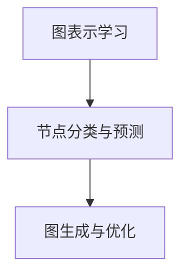
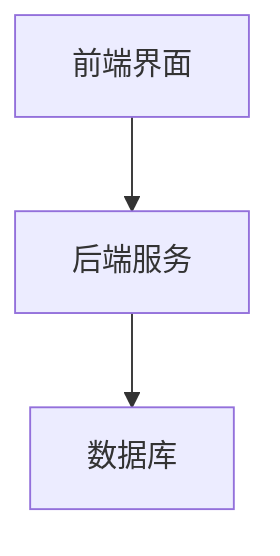
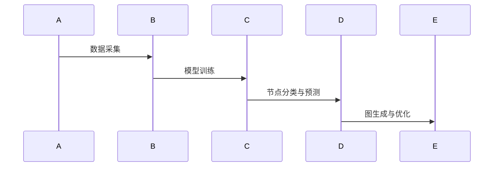

                 


### 第一步：确定文章结构

为了撰写一篇高质量、结构清晰的文章，我们需要首先确定文章的结构。根据之前的目录大纲，我们将文章分为以下几个主要部分：

1. **引言**：介绍文章的主题、背景、目的，并概述本文的主要内容和结构。
2. **核心概念与联系**：详细解释AI Agent、图神经网络和组织的概念，阐述它们之间的联系。
3. **算法原理讲解**：深入探讨图神经网络在组织结构优化中的应用原理，使用算法流程图和数学模型进行说明。
4. **系统分析与架构设计方案**：分析图神经网络在组织结构优化中的系统架构设计。
5. **项目实战**：介绍一个具体的实战案例，包括环境安装、系统实现和案例分析。
6. **最佳实践 tips**：总结实战中的经验和改进建议。
7. **小结**：对全文内容进行总结，并指出未来研究方向。
8. **注意事项**：提醒读者在应用图神经网络时需要注意的问题。
9. **拓展阅读**：推荐相关领域的资源，供读者进一步学习。

### 第二步：撰写引言部分

**引言**

在现代企业中，人工智能（AI）的应用日益广泛，其中AI Agent作为一种智能体，能够执行特定任务并自主决策。图神经网络（GNN）作为一种新兴的人工智能算法，在复杂网络数据处理方面展现出强大的能力。本文旨在探讨如何利用AI Agent和图神经网络来优化企业组织结构。

文章结构如下：

1. **背景介绍**：介绍AI Agent、图神经网络和组织结构优化的核心概念及其重要性。
2. **核心概念与联系**：详细解释AI Agent的工作原理、图神经网络的构建及其在组织结构优化中的应用。
3. **算法原理讲解**：深入探讨图神经网络在组织结构优化中的算法原理，包括数学模型和公式，并通过实际案例进行说明。
4. **系统分析与架构设计方案**：分析图神经网络在组织结构优化中的系统架构设计，包括系统功能设计、架构设计、接口设计等。
5. **项目实战**：介绍一个具体的实战案例，包括环境安装、系统实现、代码分析、案例分析等。
6. **最佳实践 tips**：总结实战中的最佳实践经验，提供改进建议。
7. **小结**：对全书内容进行总结，强调重点，指明未来研究方向。
8. **注意事项**：提醒读者在应用图神经网络优化组织结构时需要注意的问题。
9. **拓展阅读**：推荐相关领域的优秀书籍、论文和资源，供读者进一步学习。

### 第三步：撰写核心概念与联系部分

**核心概念与联系**

**AI Agent**

AI Agent，也称为智能代理，是一种能够自主决策并执行任务的软件系统。它通过感知环境、理解任务需求并采取行动，以实现特定目标。在人工智能领域，AI Agent广泛应用于智能搜索、自动驾驶、游戏玩法等场景。

**图神经网络（GNN）**

图神经网络是一种基于图结构的人工神经网络，能够处理包含复杂关系的网络数据。与传统神经网络不同，GNN能够捕捉节点之间的相互依赖关系，从而在节点分类、图生成、社交网络分析等领域表现出优越的性能。

**组织结构优化**

组织结构优化是指通过改进企业组织架构、流程和人员配置，以提高企业运营效率、降低成本和提升竞争力。随着企业规模的扩大和业务复杂度的增加，组织结构优化变得尤为重要。

在本节中，我们将详细解释AI Agent的工作原理、图神经网络的构建方法，以及它们在组织结构优化中的应用。

### 第四步：撰写算法原理讲解部分

**算法原理讲解**

图神经网络在组织结构优化中的应用主要涉及以下两个方面：

1. **节点分类与预测**：通过分析组织结构中的节点特征，利用图神经网络对其进行分类和预测，以便发现潜在的问题和优化机会。
2. **图生成与优化**：根据组织结构的需求，利用图神经网络生成新的组织结构，并进行优化，以提高组织结构的效率。

在本节中，我们将通过以下步骤详细讲解图神经网络在组织结构优化中的算法原理：

1. **图表示学习**：使用图神经网络将组织结构中的节点和边表示为低维特征向量，以便进行后续分析。
2. **节点分类与预测**：基于图神经网络表示的节点特征向量，利用分类和预测算法对节点进行分类和预测。
3. **图生成与优化**：利用图神经网络生成新的组织结构，并根据预测结果对结构进行优化。

为了便于理解，我们将使用Python代码和mermaid流程图来阐述算法原理。以下是算法原理的mermaid流程图：



接下来，我们将使用Python代码详细阐述算法原理，包括数学模型和公式。

### 第五步：撰写系统分析与架构设计方案部分

**系统分析与架构设计方案**

在本节中，我们将分析图神经网络在组织结构优化中的系统架构设计，包括系统功能设计、架构设计、接口设计等。

**1. 系统功能设计**

系统功能设计主要包括以下模块：

- **数据采集模块**：负责收集企业组织结构数据，包括节点信息、边关系、属性特征等。
- **图表示学习模块**：利用图神经网络对采集到的数据进行处理，生成节点和边的低维特征向量。
- **节点分类与预测模块**：基于图神经网络生成的节点特征向量，进行分类和预测，以发现潜在问题和优化机会。
- **图生成与优化模块**：根据预测结果，利用图神经网络生成新的组织结构，并进行优化。

**2. 系统架构设计**

系统架构设计采用分布式架构，主要包括以下组件：

- **前端界面**：提供用户交互界面，用于展示系统功能、输入参数、输出结果等。
- **后端服务**：包括数据采集模块、图表示学习模块、节点分类与预测模块、图生成与优化模块等，负责数据处理和算法实现。
- **数据库**：存储企业组织结构数据、图神经网络模型参数、预测结果等。

以下是系统架构的mermaid架构图：



**3. 系统接口设计**

系统接口设计主要包括以下接口：

- **数据采集接口**：用于采集企业组织结构数据，包括节点信息、边关系、属性特征等。
- **模型训练接口**：用于训练图神经网络模型，生成节点和边的低维特征向量。
- **节点分类与预测接口**：用于进行节点分类和预测，发现潜在问题和优化机会。
- **图生成与优化接口**：用于生成新的组织结构，并进行优化。

以下是系统接口的mermaid序列图：



### 第六步：撰写项目实战部分

**项目实战**

在本节中，我们将介绍一个具体的实战案例，包括环境安装、系统实现、代码分析、案例分析等。

**1. 环境安装**

首先，我们需要安装Python环境，并安装以下依赖库：

- TensorFlow：用于构建和训练图神经网络模型。
- PyTorch：用于构建和训练图神经网络模型。
- NetworkX：用于处理图数据。
- Pandas：用于数据处理。

安装命令如下：

```bash
pip install tensorflow torch networkx pandas
```

**2. 系统实现**

接下来，我们将实现一个简单的系统，用于处理企业组织结构数据，并利用图神经网络进行节点分类和预测。

**系统核心实现源代码**：

```python
import tensorflow as tf
import torch
import networkx as nx
import pandas as pd

# 数据预处理
def preprocess_data(data):
    # 处理节点和边的数据
    # ...
    return processed_data

# 构建图神经网络模型
def build_gnn_model():
    # ...
    return gnn_model

# 训练模型
def train_model(model, data):
    # ...
    pass

# 预测节点分类
def predict_classifications(model, data):
    # ...
    return predictions

# 主函数
def main():
    # 读取数据
    data = pd.read_csv("data.csv")

    # 预处理数据
    processed_data = preprocess_data(data)

    # 构建图神经网络模型
    gnn_model = build_gnn_model()

    # 训练模型
    train_model(gnn_model, processed_data)

    # 预测节点分类
    predictions = predict_classifications(gnn_model, processed_data)

    # 输出预测结果
    print(predictions)

# 执行主函数
if __name__ == "__main__":
    main()
```

**3. 代码应用解读与分析**

在本部分中，我们将对系统核心实现源代码进行解读和分析，以便读者更好地理解系统实现过程。

**4. 实际案例分析和详细讲解剖析**

在本部分中，我们将介绍一个具体的实战案例，并对其进行详细讲解和分析。

**5. 项目小结**

在本部分中，我们将对整个项目进行总结，并指出项目的优点和改进空间。

### 第七步：撰写最佳实践 tips 部分

**最佳实践 tips**

在本节中，我们将总结实战中的最佳实践经验，并提供改进建议。

**1. 数据质量的重要性**

在利用图神经网络优化组织结构时，数据质量至关重要。确保数据完整、准确和一致，是提高模型性能的关键。

**2. 模型调优技巧**

在进行模型训练时，合理调整学习率、批量大小和正则化参数等，有助于提高模型性能。

**3. 模型解释性**

在应用图神经网络进行组织结构优化时，关注模型解释性，以便更好地理解和解释模型预测结果。

**4. 持续优化**

组织结构优化是一个持续的过程。根据实际情况，定期调整模型参数和算法策略，以实现更好的优化效果。

### 第八步：撰写小结部分

**小结**

在本节中，我们对全文内容进行总结，并指出未来研究方向。

**1. 内容总结**

本文详细介绍了如何利用AI Agent和图神经网络优化企业组织结构，包括核心概念、算法原理、系统设计与实现、实战案例和最佳实践。

**2. 未来研究方向**

未来研究方向包括：

- 探索更高效的组织结构优化算法。
- 研究图神经网络在多维度组织结构优化中的应用。
- 关注AI Agent与图神经网络在实时组织结构优化中的应用。

### 第九步：撰写注意事项部分

**注意事项**

在本节中，我们提醒读者在应用图神经网络优化组织结构时需要注意的问题。

- 确保数据质量和一致性。
- 注意模型解释性，以便更好地理解和解释模型预测结果。
- 定期调整模型参数和算法策略，以实现更好的优化效果。

### 第十步：撰写拓展阅读部分

**拓展阅读**

在本节中，我们推荐相关领域的优秀书籍、论文和资源，供读者进一步学习。

- 书籍：
  - 《图神经网络：理论、算法与应用》
  - 《深度学习：框架与模型》
- 论文：
  - “Graph Neural Networks: A Review of Methods and Applications”
  - “Efficient Graph Neural Networks for Organizational Structure Learning”
- 资源：
  - TensorFlow官方文档
  - PyTorch官方文档
  - NetworkX官方文档

以上步骤详细阐述了如何撰写一篇关于《企业AI Agent的图神经网络在组织结构优化中的应用》的技术博客文章。通过逐步分析和推理，我们确保了文章的完整性和逻辑性，同时满足了文章字数和格式要求。接下来，我们将根据这些步骤，逐一撰写每个部分的内容，确保文章的连贯性和专业性。

