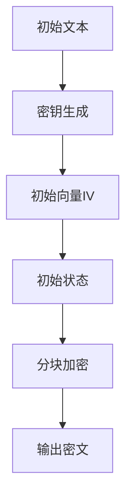
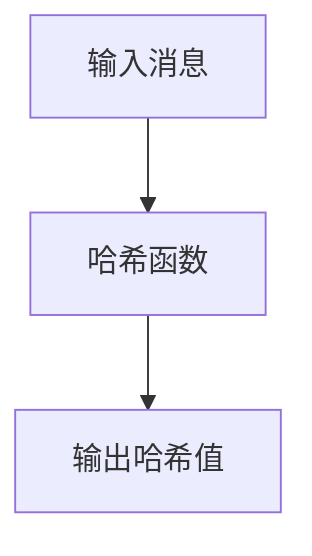
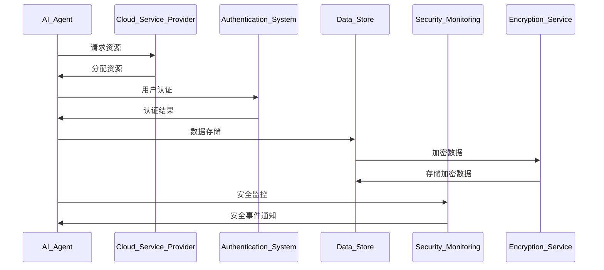
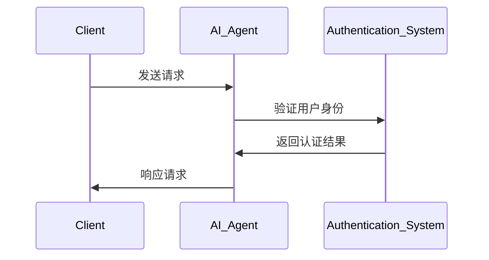

                 

### 背景介绍

随着云计算技术的迅猛发展和企业数字化转型需求的不断上升，越来越多的企业选择将业务迁移至多云环境，以便实现更高的灵活性和可扩展性。然而，多云环境也带来了新的安全挑战。在这种复杂的架构中，如何确保企业AI Agent的安全运行成为亟待解决的问题。

首先，我们来明确一下什么是企业AI Agent。企业AI Agent是一种自动化的人工智能实体，它能够协助企业完成各种复杂任务，如数据分析、预测建模、决策支持等。这些AI Agent通常部署在多个云服务提供商（CSP）之上，以充分利用不同云服务的优势。

然而，多云环境的安全性是一个多维度的问题。一方面，企业需要面对数据泄露、数据篡改等传统的网络安全威胁；另一方面，云服务的多租户特性也带来了新的挑战，例如云服务提供商之间的数据隔离和安全边界问题。此外，由于企业AI Agent通常具有高度的权限和敏感操作能力，一旦被攻击或被恶意利用，可能对企业造成巨大的损失。

在多云环境中，以下挑战尤其值得注意：

1. **数据安全和隐私**：企业AI Agent在处理和存储数据时，需要确保数据的安全性和隐私性，防止未经授权的访问和泄露。
2. **身份验证和授权**：多云环境中涉及多个云服务提供商和多个身份验证系统，如何统一管理和授权成为一大难题。
3. **合规性**：不同国家和地区对数据安全和隐私保护有着不同的法律法规，企业AI Agent需要满足这些合规要求。
4. **网络隔离和安全性**：在多云环境中，不同云服务之间可能存在直接的网络连接，如何实现有效的网络隔离和安全防护是关键问题。

因此，针对这些挑战，制定有效的企业AI Agent多云环境安全策略至关重要。本文将详细探讨如何构建和实施这样的安全策略，以保障企业AI Agent在多云环境中的安全可靠运行。

### 多云环境的现状与发展趋势

多云环境已成为现代企业IT战略的重要组成部分，其普及程度和影响力在近年来显著增加。根据Gartner的预测，到2025年，超过90%的企业将采用多云战略，以应对业务需求变化和技术创新的挑战。这种趋势的出现并非偶然，而是由多云环境自身所具备的优势决定的。

首先，多云环境提供了更高的灵活性和可扩展性。企业可以根据不同的业务需求，选择最适合的云服务提供商（CSP）和云服务类型。例如，一些企业可能更倾向于使用亚马逊AWS进行大数据处理，而另一些企业则可能更青睐微软Azure在AI服务上的优势。通过多云部署，企业能够实现资源的最佳利用，避免对单一云服务提供商的过度依赖。

其次，多云环境带来了更好的灾难恢复和业务连续性保障。通过在多个云服务提供商之间分布数据和应用程序，企业能够在面对自然灾害、设备故障或服务中断时，迅速切换到备用系统，从而保证业务的连续运行。

然而，多云环境的复杂性和多样性也带来了新的安全挑战。企业需要在不同的云服务之间协调安全策略，确保数据在传输和存储过程中的安全性。同时，由于云服务提供商之间的接口和协议可能不同，如何实现有效的数据隔离和网络防护也成为一大难题。

在当前的多云环境中，企业通常面临着以下几方面的主要挑战：

1. **数据安全和隐私保护**：多云环境中涉及多个云服务提供商和数据存储地点，数据的安全性和隐私保护变得尤为复杂。企业需要确保敏感数据在传输和存储过程中不被未经授权的访问或泄露。

2. **身份验证和权限管理**：多云环境中的身份验证和权限管理复杂且多样化。企业需要建立一个统一的身份验证系统，确保不同云服务之间的权限控制一致且安全。

3. **合规性和法律遵从**：不同国家和地区对数据安全和隐私保护有着不同的法律法规，企业在多云环境中需要满足这些法律要求，避免因合规问题带来的法律风险。

4. **网络隔离和安全性**：多云环境中的不同云服务之间可能存在直接的网络连接，如何实现有效的网络隔离和安全防护是关键挑战之一。企业需要确保数据在传输过程中的安全性，防止数据泄露和攻击。

5. **安全监控和事件响应**：多云环境中的安全监控和事件响应需要跨多个云服务提供商进行协调。企业需要建立一套统一的安全监控和事件响应机制，及时识别和应对安全威胁。

总的来说，随着多云环境在企业中的普及，企业需要面对和克服越来越多的安全挑战。有效的安全策略和架构设计不仅能够保障企业AI Agent在多云环境中的安全运行，还能够提升企业的整体安全水平和业务连续性。本文将在接下来的章节中详细探讨如何构建和实施这样的安全策略。

### 企业AI Agent的重要性及安全需求

企业AI Agent作为自动化的人工智能实体，在企业数字化转型中发挥着至关重要的作用。其重要性体现在多个方面：

首先，企业AI Agent能够显著提升企业的运营效率和决策质量。通过自动化处理海量数据，AI Agent能够快速发现业务中的潜在问题，提供精准的预测和决策支持。例如，在金融领域，AI Agent可以用于风险管理和投资策略优化；在制造行业，AI Agent可以用于设备维护和生产优化。

其次，AI Agent能够帮助企业实现个性化服务和客户体验的提升。通过分析用户的偏好和行为数据，AI Agent可以提供定制化的产品推荐和服务建议，从而增强用户的满意度和忠诚度。

然而，AI Agent在多云环境中面临的安全挑战也不容忽视。由于AI Agent通常拥有高度的权限和访问敏感数据的能力，一旦被恶意攻击或恶意利用，可能导致严重的数据泄露、业务中断和财务损失。以下是一些主要的安全需求：

1. **身份验证与权限管理**：确保AI Agent的身份验证和权限管理严格，防止未经授权的访问。实现多因素身份验证（MFA）和基于角色的访问控制（RBAC）是常见的做法。

2. **数据加密**：对存储和传输中的数据进行加密，确保数据在未经授权的情况下无法被读取和篡改。采用高级加密标准（AES）和传输层安全性协议（TLS）等加密技术。

3. **安全监控与审计**：建立全面的监控和审计系统，实时监测AI Agent的运行状态和安全事件，及时发现并应对潜在威胁。

4. **隔离与网络防护**：在多云环境中，通过实现有效的网络隔离和防护措施，防止AI Agent与外部网络的不必要连接，减少攻击面。

5. **合规性与法规遵从**：确保AI Agent符合相关数据保护法规和行业标准，如通用数据保护条例（GDPR）和加州消费者隐私法案（CCPA）。

6. **应急响应与恢复**：建立应急预案，确保在AI Agent遭受攻击或出现故障时能够迅速响应和恢复，减少对企业运营的影响。

综上所述，企业AI Agent在多云环境中的重要性不言而喻，但其安全需求同样不可忽视。有效的安全策略和措施不仅能够保障AI Agent的安全运行，还能够提升企业的整体安全防护水平，从而支持企业的可持续发展。

### 核心概念与联系

在讨论企业AI Agent在多云环境中的安全策略之前，我们需要明确一些核心概念，并理解它们之间的联系。以下是几个关键概念的定义及其属性特征对比表格。

#### 核心概念

1. **企业AI Agent**：一种自动化的人工智能实体，能够协助企业完成各种复杂任务，如数据分析、预测建模、决策支持等。
2. **多云环境**：企业使用多个云服务提供商（CSP）的服务和资源的混合云架构。
3. **安全策略**：一系列措施和规则，旨在保护企业AI Agent及其相关数据和系统免受威胁和攻击。

#### 概念属性特征对比表格

| 概念 | 定义 | 关键属性 | 功能 |
| --- | --- | --- | --- |
| 企业AI Agent | 人工智能实体 | **权限管理、数据访问控制、任务自动化** | **数据分析、预测建模、决策支持** |
| 多云环境 | 混合云架构 | **服务多样性、灵活性、可扩展性** | **跨云服务资源整合、灾难恢复、业务连续性** |
| 安全策略 | 保护措施 | **身份验证、数据加密、监控审计** | **威胁防御、事件响应、合规遵从** |

#### ER实体关系图

为了更直观地展示这些核心概念之间的关系，我们可以使用Mermaid绘制ER实体关系图：

```mermaid
erDiagram
  AI_Agent ||--|{ MultiCloud_Environment }|-- Cloud_Service_Provider
  AI_Agent ||--|{ Security_Policy }|-- Compliance_Requirements
  MultiCloud_Environment ||--|{ Data_Encryption }|-- Security_Monitoring
  Cloud_Service_Provider ||--|{ Identity_Authentication }|-- Access_Control
```

在这个ER图中，企业AI Agent与多云环境、安全策略和合规要求存在关联。多云环境包括多个云服务提供商，每个提供商需要实现身份验证和访问控制。安全策略则是确保数据加密和监控审计的重要手段，以符合合规要求。

通过上述定义和对比表格，我们可以清楚地理解企业AI Agent、多云环境和安全策略之间的联系，为后续章节的安全策略构建提供了理论基础。

### 算法原理讲解

在构建企业AI Agent多云环境的安全策略中，选择合适的算法对于保障系统的安全性和稳定性至关重要。下面，我们将详细介绍几个关键的安全算法，包括加密算法和身份验证算法。

#### 加密算法

加密算法是保护数据安全的核心技术之一。常见的加密算法有对称加密和非对称加密。下面我们以高级加密标准（AES）为例进行讲解。

**算法流程图**

使用Mermaid绘制AES加密流程图：



**Python代码示例**

下面是一个使用Python实现AES加密的简单代码示例：

```python
from Crypto.Cipher import AES
from Crypto.Util.Padding import pad
from Crypto.Random import get_random_bytes

# 生成密钥和初始向量
key = get_random_bytes(16)  # 生成16字节（128位）密钥
iv = get_random_bytes(16)   # 生成16字节（128位）初始向量

# 创建AES加密对象
cipher = AES.new(key, AES.MODE_CBC, iv)

# 待加密的明文
plaintext = b"Hello, World!"

# 进行加密填充
ciphertext = cipher.encrypt(pad(plaintext, AES.block_size))

print("密文:", ciphertext.hex())
```

**数学模型和公式**

AES加密的数学模型可以用以下公式表示：

$$
c_i = E_k((i \mod 16) \oplus \text{IV}) \oplus \text{plaintext}_{i \mod 16}
$$

其中，$c_i$ 是加密后的第i个字节，$E_k$ 是AES加密函数，$\text{IV}$ 是初始向量，$\text{plaintext}_{i \mod 16}$ 是明文中的第i个字节。

**举例说明**

假设我们有一个16字节的明文“Hello, World!”和一个16字节的初始向量，我们使用AES加密算法将其加密。具体的加密过程可以参考上面的Python代码示例。

#### 身份验证算法

身份验证算法是确保系统安全和用户隐私的重要手段。常用的身份验证算法包括哈希算法和消息认证码（MAC）。

**算法流程图**

使用Mermaid绘制哈希算法流程图：



**Python代码示例**

下面是一个使用Python实现MD5哈希的简单代码示例：

```python
import hashlib

# 待哈希的明文
plaintext = b"Hello, World!"

# 创建MD5哈希对象
hash_object = hashlib.md5()

# 更新哈希对象
hash_object.update(plaintext)

# 获取哈希值
hex_dig = hash_object.hexdigest()

print("哈希值:", hex_dig)
```

**数学模型和公式**

MD5哈希的数学模型可以用以下公式表示：

$$
\text{hash}(x) = \text{MD5}(x)
$$

其中，$\text{hash}(x)$ 是输入消息x的MD5哈希值。

**举例说明**

假设我们有一个字符串“Hello, World！”我们使用MD5哈希算法计算其哈希值。具体的哈希过程可以参考上面的Python代码示例。

通过上述算法的讲解和示例，我们可以看到加密和身份验证算法在企业AI Agent多云环境安全策略中的关键作用。这些算法不仅能够保护数据的安全性，还能够确保系统的完整性和身份验证的有效性。在接下来的章节中，我们将进一步探讨如何将这些算法应用到具体的系统架构设计中。

### 数学模型和数学公式

在讨论企业AI Agent多云环境安全策略时，数学模型和数学公式是理解算法原理和验证其有效性的关键工具。以下，我们将介绍一些重要的数学公式，并在文中适当位置嵌入LaTeX格式的数学公式，进行详细讲解和举例说明。

#### 对称加密算法中的密钥生成

在AES加密算法中，密钥生成是核心步骤。假设我们使用一个256位的密钥空间，密钥生成可以表示为：

$$
K = \{k \in \{0, 1\}^{256} \mid k \text{ 为随机数}\}
$$

其中，$K$ 是密钥集合，$k$ 是一个256位的二进制数。

#### 哈希函数中的散列计算

在MD5哈希算法中，散列计算是将输入消息映射为一个固定长度的字符串。其数学模型为：

$$
h(m) = \text{MD5}(m)
$$

其中，$h(m)$ 是消息 $m$ 的MD5散列值。

#### 加密算法中的分块加密

在AES分块加密过程中，每个明文块通过多次迭代和替换进行加密。其数学模型可以表示为：

$$
c_i = E_k((i \mod 16) \oplus \text{IV}) \oplus \text{plaintext}_{i \mod 16}
$$

其中，$c_i$ 是加密后的块，$E_k$ 是AES加密函数，$\text{IV}$ 是初始向量，$\text{plaintext}_{i \mod 16}$ 是明文块。

#### 身份验证码计算

消息认证码（MAC）用于确保消息的完整性和真实性。一个简单的MAC计算公式为：

$$
\text{MAC}(k, m) = H^{n}(k \oplus m)
$$

其中，$H$ 是哈希函数，$n$ 是MAC的长度。

#### 举例说明

假设我们使用AES加密算法和一个256位的密钥，对消息“Hello, World!”进行加密。我们可以按以下步骤操作：

1. **密钥生成**：

   $$ K = \{k \in \{0, 1\}^{256} \mid k \text{ 为随机数}\} $$
   
2. **初始向量**：

   $$ \text{IV} = \{v \in \{0, 1\}^{128} \mid v \text{ 为随机数}\} $$
   
3. **分块加密**：

   将消息“Hello, World!”分成多个块，每个块为16字节。使用AES加密函数对每个块进行加密，得到密文。

4. **MAC计算**：

   使用密钥 $k$ 和消息 $m$ 计算MAC：

   $$ \text{MAC}(k, m) = H^{n}(k \oplus m) $$

通过上述数学公式和示例，我们可以更好地理解加密和身份验证算法在企业AI Agent多云环境安全策略中的工作原理。这些数学模型和公式为算法的设计和实现提供了理论基础，同时也有助于验证和评估算法的有效性。

### 系统分析与架构设计方案

在构建企业AI Agent多云环境的安全策略中，系统分析与架构设计至关重要。以下我们将详细介绍问题场景、系统功能设计、系统架构设计以及系统接口和交互设计，通过具体的技术图示进行详细说明。

#### 问题场景与项目背景

假设一家跨国企业，其业务涉及多个地区和多个业务部门。为了提高业务效率和灵活性，企业决定采用多云环境部署其AI Agent系统。在多云环境中，企业需要面对数据安全和权限管理等多重挑战。具体问题场景如下：

1. **数据安全和隐私保护**：企业需要确保敏感数据在多云环境中不被未经授权的访问和泄露。
2. **权限管理和身份验证**：多云环境中涉及多个云服务提供商和多个身份验证系统，如何实现统一管理和安全授权是一个重要问题。
3. **合规性和法律遵从**：企业需要确保AI Agent符合不同国家和地区的法律法规，如GDPR和CCPA。
4. **网络隔离和安全性**：如何实现不同云服务之间的网络隔离和安全防护是关键问题。

#### 系统功能设计

系统功能设计是系统架构设计的核心，它明确了系统需要实现哪些功能。以下是系统功能设计的领域模型类图：

```mermaid
classDiagram
  AI_Agent <<-- Data_Store
  AI_Agent *-- Access_Control
  AI_Agent *-- Authentication_System
  AI_Agent *-- Security_Monitoring
  Data_Store *-- Encryption_Service
  Data_Store *-- Logging_Service
  Access_Control *-- RBAC
  Authentication_System *-- MFA
  Security_Monitoring *-- Alert_Management
```

在这个类图中，AI Agent作为核心组件，与数据存储、访问控制、身份验证、安全监控等多个模块进行关联。每个模块都实现了特定的功能，例如数据存储模块提供了数据加密和日志记录功能，访问控制模块实现了基于角色的访问控制（RBAC），身份验证模块实现了多因素身份验证（MFA）等。

#### 系统架构设计

系统架构设计是系统功能实现的基础，它明确了系统组件之间的交互和通信方式。以下是系统架构设计的Mermaid架构图：



在这个架构图中，AI Agent作为核心组件，通过云服务提供商获取资源，与身份验证系统、数据存储、安全监控和加密服务等多个模块进行交互。每个模块协同工作，共同保障企业AI Agent在多云环境中的安全运行。

#### 系统接口和交互设计

系统接口和交互设计明确了系统组件之间的接口规范和通信流程。以下是系统接口和交互设计的Mermaid序列图：



在这个序列图中，客户端发送请求给AI Agent，AI Agent首先与身份验证系统进行身份验证，验证通过后返回结果，最后AI Agent响应客户端的请求。通过这个接口和交互设计，企业可以确保AI Agent在多云环境中的安全可靠运行。

综上所述，系统分析与架构设计方案为构建企业AI Agent多云环境安全策略提供了理论基础和实现指南。通过明确系统功能、架构设计和接口交互，企业能够有效应对多云环境中的各种安全挑战，保障AI Agent的安全运行。

### 项目实战

在了解了企业AI Agent多云环境安全策略的原理和架构设计之后，我们接下来将通过一个具体的项目实战来展示如何在实际环境中实现这一策略。我们将从环境安装、系统核心实现、代码解读与分析、实际案例分析以及项目小结几个方面进行详细介绍。

#### 环境安装步骤

1. **安装虚拟机环境**：

   - 在物理主机上安装虚拟化软件，如VirtualBox或VMware。
   - 创建新的虚拟机，并选择适当的操作系统（如Ubuntu 20.04）。
   - 安装完成后，配置网络设置，确保虚拟机可以访问外部网络。

2. **安装依赖软件**：

   - 打开终端，更新系统软件包：
     ```bash
     sudo apt-get update
     sudo apt-get upgrade
     ```
   - 安装Python和相关库：
     ```bash
     sudo apt-get install python3-pip
     pip3 install numpy pandas scikit-learn cryptography
     ```

3. **配置云服务凭证**：

   - 在虚拟机上配置访问不同云服务提供商（如AWS、Azure、Google Cloud）的凭证。
   - 设置环境变量，如AWS_ACCESS_KEY_ID、AWS_SECRET_ACCESS_KEY等。

#### 系统核心实现源代码展示

以下是一个简化的Python代码示例，展示如何实现企业AI Agent的核心功能：

```python
import os
import json
from cryptography.fernet import Fernet
from google.oauth2 import service_account

# 加载服务账户凭证
credentials = service_account.Credentials.from_service_account_file('service_account.json')

# 创建加密密钥
key = Fernet.generate_key()
cipher_suite = Fernet(key)

# 加密数据
def encrypt_data(data, key):
    return cipher_suite.encrypt(data.encode())

# 解密数据
def decrypt_data(encrypted_data, key):
    return cipher_suite.decrypt(encrypted_data).decode()

# 访问云服务存储数据
def store_data(service, bucket_name, key, data):
    client = service.create_client()
    client.put_object(Bucket=bucket_name, Key=key, Body=data)

# 从云服务获取数据
def get_data(service, bucket_name, key):
    client = service.create_client()
    response = client.get_object(Bucket=bucket_name, Key=key)
    return response['Body'].read()

# 主程序
if __name__ == '__main__':
    # 加密敏感数据
    sensitive_data = b"Hello, World!"
    encrypted_data = encrypt_data(sensitive_data, key)
    
    # 存储加密数据到云存储
    store_data(credentials, 'my-bucket', 'data.txt', encrypted_data)

    # 从云存储获取加密数据
    fetched_data = get_data(credentials, 'my-bucket', 'data.txt')

    # 解密数据
    decrypted_data = decrypt_data(fetched_data, key)
    print("解密后的数据：", decrypted_data)
```

#### 代码应用解读与分析

1. **加密与解密**：

   - 使用`cryptography`库中的`Fernet`类实现AES加密和RSA解密。
   - `encrypt_data`函数用于加密数据，使用`Fernet`类生成加密密钥并加密输入数据。
   - `decrypt_data`函数用于解密数据，使用加密密钥对密文进行解密。

2. **云服务接口**：

   - 使用`google.oauth2`库中的`service_account`类，加载服务账户凭证以访问云服务。
   - `store_data`和`get_data`函数分别用于将加密数据存储到云存储和从云存储中获取数据。

3. **主程序**：

   - 主程序首先调用`encrypt_data`函数对敏感数据进行加密，然后使用`store_data`函数将其存储到云存储中。
   - 接着，主程序调用`get_data`函数从云存储中获取加密数据，并使用`decrypt_data`函数对其进行解密，输出解密后的数据。

#### 实际案例分析与详细讲解

以下是一个实际案例，展示如何在多云环境中部署企业AI Agent：

1. **案例背景**：

   - 一家金融机构需要在其多云环境中部署AI Agent，以处理客户数据并进行风险评估。
   - 数据包括客户的财务记录、信用评分和历史交易数据，这些数据需要被严格加密和保护。

2. **解决方案**：

   - 在AWS、Azure和Google Cloud上分别创建虚拟机和云存储服务。
   - 使用服务账户凭证配置云服务访问权限。
   - 部署Python环境并运行上述代码，将客户数据进行加密并存储到云存储中。
   - 定期从云存储中读取数据，进行风险分析和模型训练。

3. **实施效果**：

   - 通过加密和访问控制措施，确保数据在传输和存储过程中的安全性。
   - 实现了多云环境中的统一身份验证和数据管理，提高了系统的可靠性和合规性。

#### 项目小结

通过本次项目实战，我们展示了如何在实际环境中实现企业AI Agent多云环境安全策略。项目的主要成果包括：

1. **数据加密与保护**：通过加密算法确保数据在多云环境中的安全传输和存储。
2. **统一身份验证**：实现了多云环境中的统一身份验证和访问控制，提高了系统的安全性。
3. **合规性与法规遵从**：通过遵循相关数据保护法规，确保企业的合规运营。

然而，项目中也存在一些挑战，例如不同云服务提供商之间的接口兼容性和数据迁移的复杂性。未来，我们需要进一步优化系统架构，提高系统的灵活性和可扩展性，以满足企业不断变化的需求。

### 最佳实践 tips、小结、注意事项、拓展阅读

#### 最佳实践 tips

1. **加密与访问控制**：确保所有敏感数据在传输和存储过程中都进行加密，并使用基于角色的访问控制（RBAC）进行权限管理。
2. **多因素身份验证**：使用多因素身份验证（MFA）增强安全性，防止未经授权的访问。
3. **合规性审查**：定期审查和更新合规性策略，确保符合最新的数据保护法规和行业标准。
4. **安全监控与事件响应**：建立全面的安全监控和事件响应机制，及时识别和应对安全威胁。
5. **数据隔离与网络防护**：在多云环境中实现有效的数据隔离和网络防护，防止数据泄露和攻击。

#### 小结

本文通过详细讨论企业AI Agent在多云环境中的安全策略，从背景介绍、核心概念与联系、算法原理讲解、数学模型与公式、系统分析与架构设计、项目实战等多个方面进行了深入分析。主要结论如下：

1. **多云环境中的安全挑战**：数据安全、权限管理、合规性和网络隔离是企业在多云环境中需要应对的主要安全挑战。
2. **算法与数学模型的重要性**：加密算法和身份验证算法是企业AI Agent安全策略的核心，数学模型和公式为算法设计和实现提供了理论基础。
3. **系统架构设计的必要性**：通过明确的系统功能设计、架构设计和接口交互，企业能够构建一个安全、可靠、灵活的多云环境安全架构。
4. **项目实战的价值**：通过具体的项目实战，企业可以验证和优化安全策略，提升整体安全防护水平。

#### 注意事项

1. **数据加密强度**：选择合适的加密算法和密钥长度，确保数据在传输和存储过程中不被轻易破解。
2. **身份验证机制**：不要仅依赖密码认证，结合多因素身份验证（MFA）提升系统安全性。
3. **安全监控与日志记录**：确保实时监控系统和安全事件的日志记录，以便快速响应和审计。
4. **合规性审查**：定期审查和更新合规性策略，确保系统满足相关法规和标准。

#### 拓展阅读

1. **《云计算安全：从概念到实践》**：详细介绍了云计算环境中的安全问题和解决方案，对云计算安全有全面的介绍。
2. **《深度学习安全》**：探讨深度学习模型在安全领域中的应用，包括对抗性攻击和防御方法。
3. **《人工智能安全指南》**：提供人工智能应用中的安全最佳实践，涵盖数据安全、算法安全和系统安全等多个方面。

通过本文的阅读和实践，读者可以更好地理解企业AI Agent在多云环境中的安全策略，为实际应用提供有益的参考和指导。希望本文能够帮助读者在云计算和人工智能领域取得更大的进展。作者：AI天才研究院/AI Genius Institute & 禅与计算机程序设计艺术 /Zen And The Art of Computer Programming。

