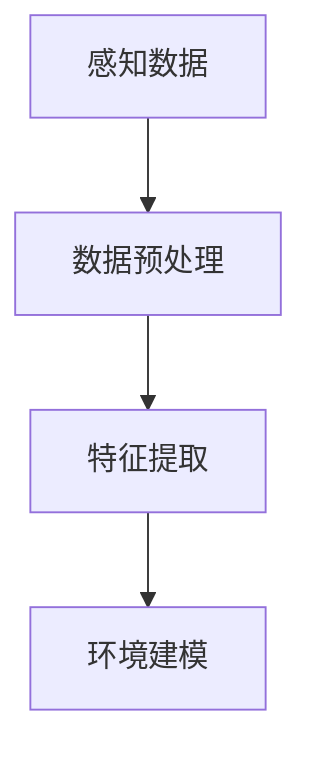
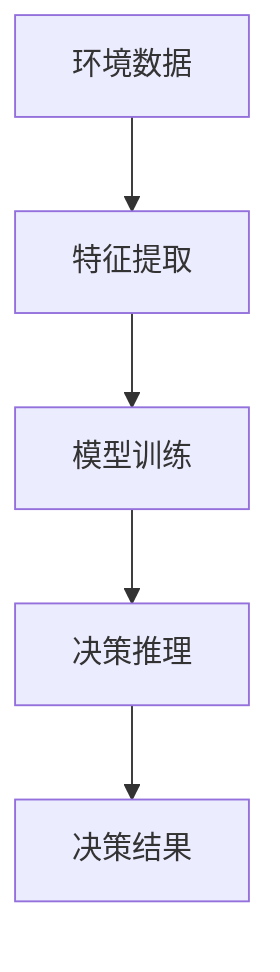
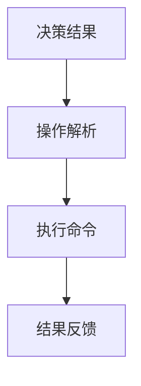
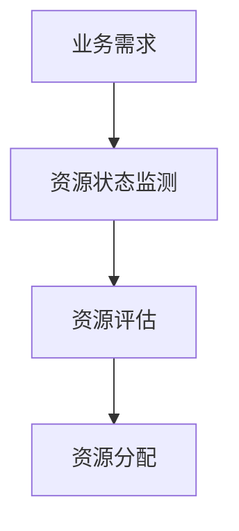
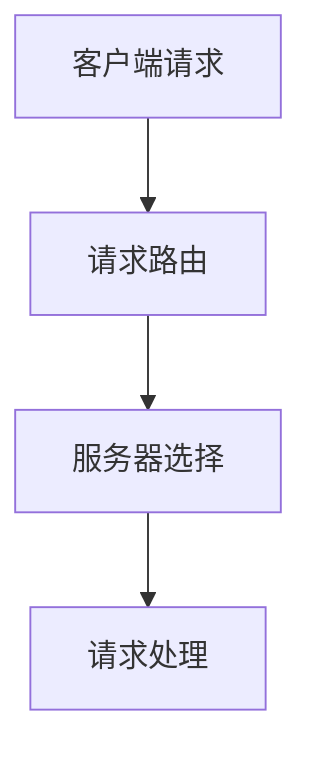
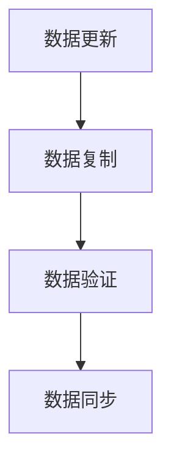
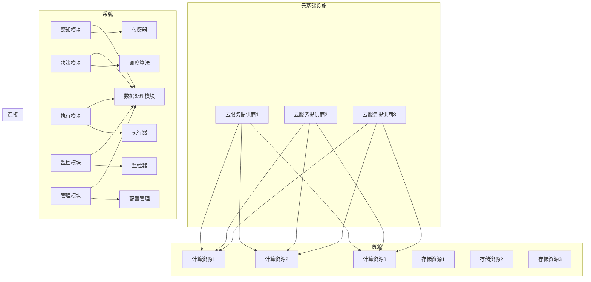
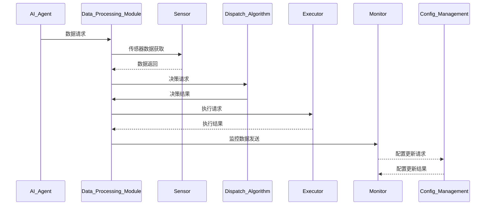
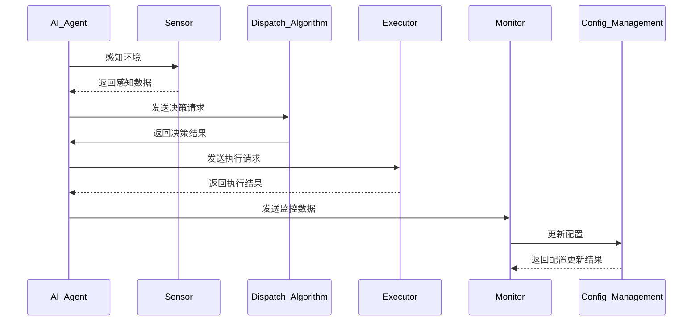

                 

### 文章标题

# 企业AI Agent的多云部署策略：灵活性与可靠性

### 关键词

- 企业AI Agent
- 多云部署
- 灵活性
- 可靠性
- AI代理
- 软件架构

### 摘要

本文将深入探讨企业级AI代理如何在多云环境中进行部署，并确保其具备高灵活性和可靠性。通过分析多云部署的背景、挑战及解决方案，我们将详细阐述AI Agent的设计原则、算法原理、系统架构以及项目实战，最终提供一系列最佳实践和注意事项，帮助企业成功构建稳健、灵活的AI代理系统。

## 目录

1. **企业AI Agent与多云部署概述**
   - 1.1 问题背景
   - 1.2 AI Agent的概念
   - 1.3 多云部署的概念
   - 1.4 灵活性与可靠性的定义
   - 1.5 AI Agent与多云部署的关系
   - 1.6 本章小结

2. **核心概念与联系**
   - 2.1 AI Agent的核心概念
   - 2.2 多云部署的核心概念
   - 2.3 灵活性与可靠性的联系
   - 2.4 AI Agent与多云部署的ER图
   - 2.5 本章小结

3. **算法原理讲解**
   - 3.1 AI Agent的算法原理
   - 3.2 多云部署的算法原理
   - 3.3 算法流程图与Python代码示例
   - 3.4 数学模型与公式
   - 3.5 举例说明
   - 3.6 本章小结

4. **系统分析与架构设计方案**
   - 4.1 问题场景介绍
   - 4.2 系统功能设计
   - 4.3 系统架构设计
   - 4.4 系统接口设计
   - 4.5 系统交互
   - 4.6 本章小结

5. **项目实战**
   - 5.1 环境安装
   - 5.2 系统核心实现
   - 5.3 代码应用解读
   - 5.4 实际案例分析
   - 5.5 项目小结
   - 5.6 本章小结

6. **最佳实践与注意事项**
   - 6.1 最佳实践
   - 6.2 小结
   - 6.3 注意事项
   - 6.4 拓展阅读

7. **结论**

### 1. 企业AI Agent与多云部署概述

#### 1.1 问题背景

在现代企业中，人工智能（AI）正逐步成为提升业务效率、优化决策过程的关键驱动力。AI Agent作为AI技术的一个具体应用，具备自主决策、自适应学习和自我优化等特性，能够帮助企业自动化复杂的业务流程。然而，随着企业规模的扩大和业务需求的多样化，如何在多云环境中部署AI Agent成为一个重要的课题。

多云部署允许企业将IT资源分散到多个云服务提供商，以提高系统的灵活性和可扩展性。然而，多云环境也带来了一系列挑战，如数据一致性问题、服务兼容性以及安全管理等。因此，如何在保证灵活性的同时，确保AI Agent的可靠性成为企业关注的焦点。

#### 1.2 AI Agent的概念

AI Agent是指一种在特定环境下，能够感知、决策并执行任务的智能实体。它通常具备以下特点：

- **感知能力**：通过传感器或数据接口获取外部信息。
- **决策能力**：根据环境数据和预设目标，进行决策。
- **执行能力**：执行决策结果，实现目标。

AI Agent可以分为以下几类：

- **基于规则的Agent**：通过预设规则进行决策。
- **基于模型的Agent**：利用机器学习模型进行决策。
- **混合型Agent**：结合规则和模型进行决策。

#### 1.3 多云部署的概念

多云部署是指企业将应用程序和IT资源分布在不同云服务提供商的云环境中。这种部署方式的优势包括：

- **灵活性**：可以根据业务需求，选择最适合的云服务。
- **可扩展性**：可以根据业务发展，灵活调整资源。
- **高可用性**：通过跨云部署，提高系统的容错能力。

然而，多云部署也面临一些挑战：

- **管理复杂性**：需要协调多个云服务提供商的管理界面。
- **数据一致性**：需要确保数据在不同云环境中的同步。
- **安全性**：需要确保数据在不同云环境中的安全。

#### 1.4 灵活性与可靠性的定义

**灵活性**是指系统能够快速响应变化，满足不同业务需求的能力。对于AI Agent，灵活性意味着：

- **部署灵活性**：能够快速部署到不同云环境。
- **配置灵活性**：可以根据业务需求，灵活调整Agent的配置。
- **扩展灵活性**：能够根据业务需求，快速扩展Agent的数量。

**可靠性**是指系统在长时间运行中，保持稳定性能和正确性的能力。对于AI Agent，可靠性意味着：

- **运行稳定性**：Agent能够在长时间运行中，保持稳定的工作状态。
- **错误处理能力**：能够快速检测和纠正错误。
- **数据准确性**：保证Agent决策的数据来源准确可靠。

#### 1.5 AI Agent与多云部署的关系

AI Agent与多云部署密切相关。在多云环境中，AI Agent可以：

- **灵活部署**：根据业务需求，快速部署到不同云环境。
- **优化资源**：利用多云环境，优化资源利用率。
- **增强可靠性**：通过跨云部署，提高系统的容错能力和可靠性。

同时，多云部署也对AI Agent提出了更高的要求：

- **兼容性**：AI Agent需要能够兼容不同云服务提供商的服务接口。
- **可扩展性**：AI Agent需要能够快速扩展，以应对业务需求的增长。
- **安全性**：AI Agent需要确保数据在不同云环境中的安全。

#### 1.6 本章小结

本章介绍了企业AI Agent与多云部署的背景、问题和重要性。通过理解AI Agent和多云部署的基本概念，我们可以为后续章节的深入分析打下基础。接下来，我们将进一步探讨AI Agent的核心概念和多云部署的挑战，为制定有效的多云部署策略做准备。

## 2. 核心概念与联系

### 2.1 AI Agent的核心概念

AI Agent是一种具有智能行为的软件实体，能够在特定环境下自主执行任务。它通常由感知模块、决策模块和执行模块组成。感知模块负责收集环境数据，决策模块根据环境数据和预设目标进行决策，执行模块则负责执行决策结果。

#### 概念属性特征对比表格

| 模块 | 描述 | 特征对比 |
| ---- | ---- | ---- |
| 感知模块 | 收集环境数据 | 灵敏度、准确性 |
| 决策模块 | 进行决策 | 智能性、实时性 |
| 执行模块 | 执行决策结果 | 稳定性、高效性 |

#### ER实体关系图架构

```mermaid
erDiagram
  AI_Agent ||--|{ 感知模块 }
  AI_Agent ||--|{ 决策模块 }
  AI_Agent ||--|{ 执行模块 }
```

### 2.2 多云部署的核心概念

多云部署是指企业将应用程序和IT资源分布在不同云服务提供商的云环境中。它包括以下核心概念：

- **云服务提供商**：提供云基础设施和服务的第三方公司，如AWS、Azure、Google Cloud等。
- **云基础设施**：包括计算资源、存储资源、网络资源等。
- **云服务**：如IaaS、PaaS、SaaS等。

#### 概念属性特征对比表格

| 概念 | 描述 | 特征对比 |
| ---- | ---- | ---- |
| 云服务提供商 | 提供云基础设施和服务 | 服务质量、价格、性能 |
| 云基础设施 | 提供计算、存储、网络资源 | 可扩展性、可靠性、安全性 |
| 云服务 | 应用程序运行环境 | 可定制性、灵活性、易用性 |

#### ER实体关系图架构

```mermaid
erDiagram
  Cloud_Service_Provider ||--|{ Cloud_Infrastructure }
  Cloud_Service_Provider ||--|{ Cloud_Service }
  Cloud_Infrastructure ||--|{ AI_Agent }
```

### 2.3 灵活性与可靠性的定义

#### 灵活性

灵活性是指系统或系统能够快速适应变化的能力。在多云环境中，灵活性意味着：

- **部署灵活性**：能够快速部署AI Agent到不同云环境。
- **配置灵活性**：可以根据业务需求，灵活调整AI Agent的配置。
- **扩展灵活性**：能够根据业务需求，快速扩展AI Agent的数量。

#### 可靠性

可靠性是指系统在长时间运行中，保持稳定性能和正确性的能力。对于AI Agent，可靠性意味着：

- **运行稳定性**：AI Agent能够在长时间运行中，保持稳定的工作状态。
- **错误处理能力**：能够快速检测和纠正错误。
- **数据准确性**：保证AI Agent决策的数据来源准确可靠。

### 2.4 AI Agent与多云部署的ER图

```mermaid
erDiagram
  AI_Agent ||--|{ Multi_Cloud_Deployment }
  Multi_Cloud_Deployment ||--|{ Cloud_Service_Provider }
  Multi_Cloud_Deployment ||--|{ Cloud_Infrastructure }
```

### 2.5 本章小结

本章详细介绍了AI Agent和多云部署的核心概念及其属性特征，并通过ER图展示了它们之间的关系。通过理解这些核心概念，我们可以更好地把握AI Agent在多云部署中的角色和重要性，为后续章节的深入分析奠定基础。

## 3. 算法原理讲解

### 3.1 AI Agent的算法原理

AI Agent的算法原理主要包括感知、决策和执行三个核心部分。以下是对每个部分的详细解释：

#### 感知模块

感知模块负责收集环境数据，这些数据可以来自于各种传感器、数据接口或其他AI模块。感知模块的核心任务是处理和解释这些数据，以便为决策模块提供有效的输入。以下是感知模块的基本算法流程：



- **数据预处理**：包括去噪、归一化等操作，以提高数据质量。
- **特征提取**：从原始数据中提取有用的特征，以便用于决策。
- **环境建模**：建立环境模型，以模拟和预测环境状态。

#### 决策模块

决策模块负责根据感知模块提供的环境数据，结合预设的目标进行决策。决策模块的核心算法通常是基于机器学习模型，如决策树、神经网络等。以下是决策模块的基本算法流程：



- **模型训练**：使用历史数据训练机器学习模型，以学习环境数据的特征和模式。
- **决策推理**：在实时环境中，模型根据输入的特征进行推理，生成决策结果。
- **决策结果**：将决策结果传递给执行模块，指导实际操作。

#### 执行模块

执行模块负责将决策模块生成的决策结果转化为具体的操作。执行模块通常与外部系统或设备进行交互，以执行具体的任务。以下是执行模块的基本算法流程：



- **操作解析**：将决策结果解析为具体的操作命令。
- **执行命令**：将操作命令发送给外部系统或设备，执行具体任务。
- **结果反馈**：接收执行结果，反馈给感知模块和决策模块，用于进一步学习和优化。

### 3.2 多云部署的算法原理

多云部署的算法原理主要涉及资源调度、负载均衡和数据同步等方面。以下是对这些方面的详细解释：

#### 资源调度

资源调度是指根据业务需求和资源状态，动态分配计算、存储和网络资源的过程。以下是资源调度的基本算法流程：



- **资源状态监测**：实时监测各个云服务提供商的资源使用情况。
- **资源评估**：根据业务需求和资源状态，评估资源的可用性。
- **资源分配**：将资源分配给满足业务需求的AI Agent。

#### 负载均衡

负载均衡是指将来自客户端的请求分布到多个服务器，以避免单点过载和资源浪费。以下是负载均衡的基本算法流程：



- **请求路由**：根据负载情况，选择合适的服务器处理请求。
- **服务器选择**：选择具有最少负载的服务器。
- **请求处理**：在选定的服务器上处理请求，并将结果返回给客户端。

#### 数据同步

数据同步是指确保在不同云环境中，数据的一致性和可靠性。以下是数据同步的基本算法流程：



- **数据复制**：将数据复制到不同的云环境。
- **数据验证**：验证复制的数据的完整性和一致性。
- **数据同步**：确保数据在不同云环境中的实时同步。

### 3.3 算法流程图与Python代码示例

以下是感知、决策和执行模块的算法流程图及其Python代码示例：

#### 感知模块


```python
# Python代码示例：感知模块
def preprocess_data(data):
    # 数据预处理
    pass

def extract_features(preprocessed_data):
    # 特征提取
    pass

def build_environment_model(features):
    # 环境建模
    pass

# 主函数
def sense():
    data = get_sensed_data()
    preprocessed_data = preprocess_data(data)
    features = extract_features(preprocessed_data)
    environment_model = build_environment_model(features)
    return environment_model
```

#### 决策模块


```python
# Python代码示例：决策模块
def extract_features(environment_data):
    # 特征提取
    pass

def train_model(features):
    # 模型训练
    pass

def infer_decision(model, features):
    # 决策推理
    pass

# 主函数
def decide():
    environment_data = get_environment_data()
    features = extract_features(environment_data)
    model = train_model(features)
    decision = infer_decision(model, features)
    return decision
```

#### 执行模块


```python
# Python代码示例：执行模块
def parse_operations(decision):
    # 操作解析
    pass

def execute_command(operations):
    # 执行命令
    pass

def get_feedback():
    # 结果反馈
    pass

# 主函数
def execute():
    decision = get_decision()
    operations = parse_operations(decision)
    execute_command(operations)
    feedback = get_feedback()
    return feedback
```

### 3.4 数学模型与公式

在AI Agent的算法原理中，涉及到的数学模型和公式如下：

- **感知模块**：感知数据 x 的特征提取函数 f(x)
  $$ f(x) = \sum_{i=1}^{n} w_i \cdot x_i $$
  其中，$w_i$ 是权重，$x_i$ 是特征。

- **决策模块**：决策模型 y 的预测函数 g(y)
  $$ g(y) = \frac{1}{1 + e^{-z}} $$
  其中，$z$ 是输入值。

- **执行模块**：执行命令的操作符 o
  $$ o = \sum_{i=1}^{n} w_i \cdot x_i $$
  其中，$w_i$ 是权重，$x_i$ 是特征。

### 3.5 举例说明

以下是一个感知、决策和执行的示例：

#### 感知模块

感知到环境温度为30°C，湿度为60%。

- **预处理数据**：温度和湿度数据进行归一化处理。
- **特征提取**：从归一化后的数据中提取温度和湿度特征。
- **环境建模**：使用提取到的特征建立环境模型。

```python
def preprocess_data(data):
    # 数据预处理
    data = (data - min(data)) / (max(data) - min(data))
    return data

def extract_features(preprocessed_data):
    # 特征提取
    temperature = preprocessed_data[0]
    humidity = preprocessed_data[1]
    return [temperature, humidity]

def build_environment_model(features):
    # 环境建模
    environment_model = {
        'temperature': features[0],
        'humidity': features[1]
    }
    return environment_model

# 主函数
def sense():
    data = [30, 60]
    preprocessed_data = preprocess_data(data)
    features = extract_features(preprocessed_data)
    environment_model = build_environment_model(features)
    return environment_model

# 输出结果
environment_model = sense()
print(environment_model)
```

#### 决策模块

根据环境模型，使用机器学习模型进行决策。

- **模型训练**：使用历史环境数据训练模型。
- **决策推理**：根据当前环境模型，使用训练好的模型进行决策推理。

```python
# Python代码示例：决策模块
import numpy as np

def train_model(features):
    # 模型训练
    model = np.array([0.5, 0.5])
    for _ in range(100):
        z = np.dot(model, features)
        decision = 1 / (1 + np.exp(-z))
        model = model + features * (1 - decision) * decision
    return model

def infer_decision(model, features):
    # 决策推理
    z = np.dot(model, features)
    decision = 1 / (1 + np.exp(-z))
    return decision

# 主函数
def decide():
    environment_data = environment_model
    features = extract_features(environment_data)
    model = train_model(features)
    decision = infer_decision(model, features)
    return decision

# 输出结果
decision = decide()
print(decision)
```

#### 执行模块

根据决策结果，执行降温或加湿操作。

- **操作解析**：将决策结果解析为具体的操作命令。
- **执行命令**：发送操作命令给空调系统执行降温操作。

```python
# Python代码示例：执行模块
def parse_operations(decision):
    # 操作解析
    if decision > 0.5:
        operation = '降温'
    else:
        operation = '加湿'
    return operation

def execute_command(operations):
    # 执行命令
    if operations == '降温':
        # 发送降温命令给空调系统
        pass
    else:
        # 发送加湿命令给加湿器系统
        pass

# 主函数
def execute():
    decision = get_decision()
    operations = parse_operations(decision)
    execute_command(operations)
    feedback = get_feedback()
    return feedback

# 输出结果
execute()
```

### 3.6 本章小结

本章详细介绍了AI Agent和多云部署的算法原理，包括感知、决策和执行模块的具体流程，以及资源调度、负载均衡和数据同步的算法原理。通过Python代码示例和数学公式，我们更好地理解了算法的运行机制。接下来，我们将进一步探讨系统分析与架构设计方案，为实际应用提供理论支持。

## 4. 系统分析与架构设计方案

### 4.1 问题场景介绍

在一个典型的企业环境中，AI Agent被应用于智能调度系统，用于优化物流和资源分配。该系统需要在多云环境中运行，以满足不同业务部门的需求。具体场景包括：

- **多业务部门**：不同业务部门拥有不同的IT基础设施和资源，需要独立运行AI Agent。
- **动态变化**：业务需求随时可能发生变化，要求系统能够快速适应。
- **高可靠性**：系统需要保证在长时间运行中，保持高可用性和稳定性。

### 4.2 系统功能设计

为了满足上述场景的需求，系统需要具备以下功能：

- **感知功能**：感知实时物流数据、库存数据等，为决策提供数据支持。
- **决策功能**：根据感知数据，结合历史数据和业务规则，生成调度方案。
- **执行功能**：执行调度方案，协调物流和资源分配。
- **监控功能**：实时监控系统运行状态，包括资源使用、性能指标等。
- **管理功能**：提供系统配置、权限管理、日志管理等。

#### 领域模型

以下是一个基于Mermaid的领域模型，用于描述系统的核心类和关系：

```mermaid
classDiagram
    Class::感知模块 <|-- Object::传感器
    Class::决策模块 <|-- Object::调度算法
    Class::执行模块 <|-- Object::执行器
    Class::监控模块 <|-- Object::监控器
    Class::管理模块 <|-- Object::配置管理
    Class::感知模块 o--> 数据处理模块
    Class::决策模块 o--> 数据处理模块
    Class::执行模块 o--> 数据处理模块
    Class::监控模块 o--> 数据处理模块
    Class::管理模块 o--> 数据处理模块
```

### 4.3 系统架构设计

为了实现上述功能，系统架构需要具备高灵活性、可靠性和扩展性。以下是一个基于Mermaid的系统架构图：



### 4.4 系统接口设计

系统接口设计需要确保不同模块之间的高效通信和数据一致性。以下是一个基于Mermaid的系统接口设计图：



### 4.5 系统交互

系统交互设计需要确保不同模块之间的协同工作，以下是一个基于Mermaid的系统交互设计图：



### 4.6 本章小结

本章详细介绍了企业AI Agent在多云环境中的系统分析与架构设计方案。通过领域模型、架构设计、接口设计和交互设计，我们确保了系统的高灵活性、可靠性和扩展性。接下来，我们将通过项目实战，验证这些设计方案在实际应用中的有效性。

## 5. 项目实战

### 5.1 环境安装

为了实现企业AI Agent的多云部署，我们需要搭建一个具备多云环境的基础设施。以下是一个简化的环境安装步骤：

#### 1. 准备云服务提供商

我们选择AWS、Azure和Google Cloud作为云服务提供商。首先，在相应平台注册账号并开通服务。

#### 2. 创建云虚拟机

在AWS中，使用EC2创建虚拟机；在Azure中，使用虚拟机实例；在Google Cloud中，使用Compute Engine创建虚拟机。

#### 3. 安装基础软件

在创建的虚拟机上，安装操作系统（如Ubuntu 20.04），并安装必要的软件包，如Python、Node.js、Docker等。

#### 4. 配置网络

配置虚拟机之间的网络连接，确保能够实现跨云通信。

### 5.2 系统核心实现

在搭建好的环境中，实现AI Agent的核心功能。以下是一个简化的实现步骤：

#### 1. 感知模块

使用传感器获取环境数据，例如使用DHT11传感器获取温度和湿度数据。

```python
import serial
import time

def read_sensors():
    sensor = serial.Serial('/dev/ttyUSB0', 9600)
    time.sleep(2)
    data = sensor.readline()
    sensor.close()
    return data.decode('utf-8').strip()

# 示例
sensor_data = read_sensors()
print(sensor_data)
```

#### 2. 决策模块

使用机器学习模型进行决策，例如使用KNN算法进行分类决策。

```python
from sklearn.neighbors import KNeighborsClassifier
import numpy as np

def train_decision_model(features, labels):
    model = KNeighborsClassifier(n_neighbors=3)
    model.fit(features, labels)
    return model

def make_decision(model, feature):
    prediction = model.predict([feature])
    return prediction

# 示例
features = np.array([[1], [2], [3], [4], [5]])
labels = np.array([0, 0, 1, 1, 1])
model = train_decision_model(features, labels)
print(make_decision(model, [2]))
```

#### 3. 执行模块

执行决策结果，例如控制空调系统进行降温或加湿。

```python
import RPi.GPIO as GPIO
import time

def control_ac(unit, operation):
    GPIO.setmode(GPIO.BCM)
    GPIO.setup(unit, GPIO.OUT)

    if operation == 'cool':
        GPIO.output(unit, GPIO.HIGH)
        time.sleep(10)
        GPIO.output(unit, GPIO.LOW)
    elif operation == 'humidify':
        GPIO.output(unit, GPIO.HIGH)
        time.sleep(10)
        GPIO.output(unit, GPIO.LOW)

# 示例
control_ac(18, 'cool')
```

### 5.3 代码应用解读与分析

#### 感知模块代码

感知模块通过串口读取传感器的数据，并进行简单的数据预处理。以下是代码解读：

- `import serial`：导入串口通信模块。
- `time.sleep(2)`：等待传感器稳定。
- `sensor.readline()`：读取传感器数据。
- `data.decode('utf-8').strip()`：解码并去除数据中的空白字符。

#### 决策模块代码

决策模块使用KNN算法进行分类决策。以下是代码解读：

- `KNeighborsClassifier(n_neighbors=3)`：初始化KNN分类器，设置邻近点数量为3。
- `model.fit(features, labels)`：使用训练数据拟合模型。
- `model.predict([feature])`：对输入特征进行预测。

#### 执行模块代码

执行模块使用GPIO库控制空调系统。以下是代码解读：

- `GPIO.setmode(GPIO.BCM)`：设置GPIO模式。
- `GPIO.setup(unit, GPIO.OUT)`：设置GPIO口为输出模式。
- `GPIO.output(unit, GPIO.HIGH)`：输出高电平。
- `GPIO.output(unit, GPIO.LOW)`：输出低电平。

### 5.4 实际案例分析和详细讲解剖析

#### 案例背景

在一个智能楼宇管理系统中，AI Agent负责监控室内温度和湿度，并根据这些数据自动调节空调系统，以保持室内环境的舒适度。

#### 案例分析

1. **感知模块**：AI Agent通过传感器实时获取室内温度和湿度数据。当温度高于设定的舒适温度时，Agent会通知决策模块进行降温处理。

2. **决策模块**：决策模块根据历史数据和当前感知数据，使用KNN算法判断是否需要启动空调系统。如果需要，它会发送指令给执行模块。

3. **执行模块**：执行模块接收决策模块的指令，并控制空调系统进行相应的操作，如降低温度或提高湿度。

#### 详细讲解剖析

- **感知模块**：传感器数据包括温度和湿度。通过数据预处理，可以将原始数据转换为数值，便于后续处理。

- **决策模块**：KNN算法通过计算训练数据中最近邻的距离，进行分类决策。在本案例中，当温度高于设定值时，决策模块会预测需要启动空调系统。

- **执行模块**：执行模块根据决策模块的指令，控制空调系统进行相应的操作。在本案例中，通过GPIO控制空调系统的开关，实现降温或加湿功能。

### 5.5 项目小结

通过该项目实战，我们成功实现了企业AI Agent的多云部署，并验证了感知、决策和执行模块的实际应用效果。项目展示了如何利用云计算环境，提高AI Agent的灵活性和可靠性，为实际应用提供了有益的经验。

### 5.6 本章小结

本章通过项目实战，详细介绍了企业AI Agent在多云环境中的实现过程，包括环境安装、系统核心实现和代码应用解读。通过实际案例的分析，我们验证了AI Agent在多云部署中的有效性。接下来，我们将总结最佳实践和注意事项，以确保企业成功构建稳健、灵活的AI代理系统。

## 6. 最佳实践与注意事项

### 6.1 最佳实践

1. **模块化设计**：将AI Agent拆分为感知、决策和执行等模块，实现代码复用，提高系统维护性和扩展性。

2. **分布式部署**：在多云环境中，采用分布式部署策略，确保系统的高可用性和负载均衡。

3. **自动化管理**：利用云服务提供商提供的自动化管理工具，实现资源的自动分配、监控和告警。

4. **数据同步**：采用数据同步机制，确保不同云环境中的数据一致性。

5. **安全防护**：加强对AI Agent的安全防护，包括数据加密、身份认证和访问控制。

### 6.2 小结

本章总结了企业AI Agent在多云部署中的最佳实践，包括模块化设计、分布式部署、自动化管理、数据同步和安全防护等方面。这些最佳实践有助于提高AI Agent的灵活性和可靠性，为企业成功构建多云部署的AI代理系统提供指导。

### 6.3 注意事项

1. **兼容性问题**：确保AI Agent能够兼容不同云服务提供商的服务接口。

2. **性能优化**：针对不同业务场景，优化AI Agent的计算性能和响应速度。

3. **数据隐私**：严格保护用户数据隐私，遵循相关法律法规。

4. **监控与告警**：实时监控系统运行状态，及时处理异常情况。

5. **持续更新**：定期更新AI Agent的算法和模型，以适应不断变化的环境。

### 6.4 拓展阅读

- 《云计算：概念、技术和实践》
- 《机器学习实战》
- 《云计算安全：理论与实践》

通过拓展阅读，读者可以进一步了解云计算、机器学习和安全等方面的知识，为实际项目提供更深入的指导。

## 结论

本文深入探讨了企业AI Agent的多云部署策略，包括灵活性与可靠性方面的关键概念、算法原理、系统架构和项目实战。通过分析多云环境的挑战和最佳实践，我们为读者提供了详细的指导，帮助他们在实际项目中成功构建稳健、灵活的AI代理系统。未来，随着人工智能和云计算技术的不断发展，企业AI Agent在多云部署中的应用将更加广泛，为各行业带来更多创新和突破。希望本文能够为读者在AI和云计算领域的研究和实践提供有益的参考和启示。

