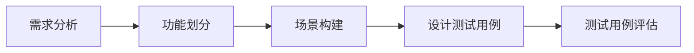

                 


### 引言

#### 问题背景

随着人工智能技术的飞速发展，企业开始越来越多地采用AI Agent（人工智能代理）来提高业务效率和决策质量。AI Agent是一种智能软件，能够在复杂的业务环境中自主地执行任务，并根据反馈不断优化自己的行为。这种技术的应用范围非常广泛，从电商平台到金融分析，再到制造业流程优化，AI Agent都展现出了巨大的潜力。

然而，AI Agent的实际部署并非易事。由于业务环境的复杂性和多样性，AI Agent在实际运行中可能会遇到各种未曾预料的问题。这些问题可能导致AI Agent无法正确执行任务，或者产生不合理的决策。因此，对AI Agent进行多场景测试变得至关重要。通过多场景测试，企业可以确保AI Agent在不同环境下都能稳定、准确地运行，从而最大限度地减少实际应用中的风险。

#### 问题描述

问题描述可以归结为以下几点：

1. **AI Agent设计的复杂性**：AI Agent需要处理大量不同的业务场景，这意味着其设计需要高度模块化和灵活性。
2. **测试环境的多样性**：企业需要模拟各种真实的业务环境，以便全面评估AI Agent的适应性和性能。
3. **测试策略的选择**：选择合适的测试策略对于确保AI Agent的稳定性和可靠性至关重要。
4. **测试结果的分析**：测试结果需要被仔细分析，以便发现潜在的问题并提出改进措施。

#### 问题解决

本篇技术博客的目标是提出一套系统化的AI Agent多场景测试策略，以帮助企业在部署AI Agent时降低风险、提高成功率。我们将从以下几个方面进行探讨：

1. **AI Agent设计原则与实践**：介绍AI Agent设计的关键原则和实际案例。
2. **多场景测试用例设计**：详细阐述测试用例设计的方法和步骤。
3. **模拟真实业务环境的方法与工具**：讨论如何使用工具模拟真实的业务环境。
4. **多场景测试执行与结果分析**：介绍测试执行的流程和结果分析的方法。

通过以上步骤，我们希望能够为企业提供一套实用的AI Agent测试策略，从而确保AI Agent在真实业务环境中的高效稳定运行。

#### 边界与外延

本文主要关注企业级AI Agent的多场景测试策略，涵盖从设计、测试到结果分析的全过程。本文的讨论范围包括但不限于以下领域：

- **AI Agent的定义和特点**：介绍AI Agent的基础知识。
- **多场景测试策略**：详细讨论多场景测试的目的、原则和方法。
- **设计原则与实践**：介绍AI Agent设计的最佳实践。
- **测试用例设计**：探讨测试用例的设计方法和步骤。
- **模拟真实业务环境**：介绍如何使用工具和模拟技术。
- **测试执行与结果分析**：讨论测试执行的流程和结果分析的方法。

需要注意的是，本文并不涉及AI Agent的具体实现细节，而是更侧重于测试策略的讨论。同时，本文提出的测试策略具有普遍适用性，但具体实施时可能需要根据企业的实际情况进行调整。

#### 核心概念与联系

在本节中，我们将详细探讨AI Agent和多场景测试的核心概念及其相互关系。

##### AI Agent的定义与特点

AI Agent是一种基于人工智能技术的软件实体，能够自主地感知环境、规划行动并执行任务。AI Agent具有以下特点：

1. **自主性**：AI Agent能够在没有人类干预的情况下执行任务。
2. **适应性**：AI Agent能够根据环境和任务需求进行自我调整。
3. **智能性**：AI Agent通过机器学习、自然语言处理等技术实现智能决策。
4. **协作性**：AI Agent能够与其他AI Agent或人类协作完成任务。

##### 多场景测试的核心概念

多场景测试是指在不同环境下对AI Agent进行全面评估的过程。其核心概念包括：

1. **测试环境**：测试环境是指模拟不同业务场景的计算机系统或实体环境。
2. **测试用例**：测试用例是测试过程中用来验证AI Agent功能、性能和安全性的具体实例。
3. **测试目标**：测试目标是指通过测试希望达到的预期结果，如确保AI Agent在不同环境下稳定运行。
4. **测试结果**：测试结果是测试过程中生成的数据，用于评估AI Agent的性能和稳定性。

##### AI Agent与多场景测试的关联

AI Agent与多场景测试之间的关联在于：

1. **验证适应性**：多场景测试可以验证AI Agent在不同业务环境中的适应性，确保其能够应对各种变化。
2. **提升可靠性**：通过多场景测试，可以发现AI Agent的潜在问题，从而提高其可靠性和稳定性。
3. **优化性能**：多场景测试可以评估AI Agent在不同环境下的性能，帮助企业优化其设计和实现。

##### 概念属性特征对比表格

以下是一个简化的概念属性特征对比表格，用于展示AI Agent和多场景测试的核心概念及其特点：

| 概念 | 特征 |
| --- | --- |
| AI Agent | 自主性、适应性、智能性、协作性 |
| 测试环境 | 模拟不同业务场景 |
| 测试用例 | 功能、性能、安全 |
| 测试目标 | 验证AI Agent适应性、提升可靠性、优化性能 |
| 测试结果 | 数据、评估性能和稳定性 |

##### ER实体关系图架构

为了更清晰地展示AI Agent和多场景测试之间的关联，我们可以使用ER（实体-关系）模型来构建实体关系图。以下是ER实体关系图的Markdown格式示例：

```mermaid
erDiagram
  AI_Agent ||--|{ Test_Environment } Test_Environment : 测试环境
  AI_Agent ||--|{ Test_Case } Test_Case : 测试用例
  AI_Agent ||--|{ Test_Result } Test_Result : 测试结果
  Test_Environment ||--|{ Test_Case } Test_Case : 测试用例
  Test_Result ||--|{ Test_Case } Test_Case : 测试用例
```

通过以上核心概念和联系的介绍，读者可以更好地理解AI Agent和多场景测试的内涵及其相互关系，为后续章节的内容铺垫基础。

### 多场景测试策略概述

多场景测试是确保AI Agent在各种不同业务环境中能够稳定、准确地运行的关键步骤。在这一部分，我们将深入探讨多场景测试的重要性、目标、面临的挑战以及遵循的基本原则。

#### 多场景测试的重要性

多场景测试的重要性主要体现在以下几个方面：

1. **发现潜在问题**：通过多场景测试，可以提前发现AI Agent在特定环境下的潜在问题，从而在部署前进行修复，避免在实际应用中出现问题。
2. **验证适应性**：AI Agent需要在不同环境中具有适应性，多场景测试可以帮助验证其是否能够在各种业务场景中稳定运行。
3. **提升可靠性**：通过全面测试，AI Agent的可靠性得到提升，从而确保其在生产环境中的稳定性和性能。
4. **优化性能**：多场景测试可以识别AI Agent在不同环境下的性能瓶颈，为企业提供优化方向。

#### 多场景测试的目标

多场景测试的主要目标是：

1. **确保功能正确性**：验证AI Agent的功能是否按照预期工作。
2. **评估性能表现**：评估AI Agent在不同场景下的响应速度、处理能力和资源消耗。
3. **检测安全漏洞**：确保AI Agent在面临潜在攻击时能够保持安全。
4. **验证适应性**：确保AI Agent能够适应不同的业务环境。
5. **优化用户体验**：通过测试获取用户反馈，持续改进AI Agent的表现。

#### 多场景测试的挑战

在进行多场景测试时，企业可能会面临以下挑战：

1. **环境多样性**：不同业务环境具有高度多样性，需要模拟各种复杂场景。
2. **测试数据准备**：测试数据的准备和有效性对测试结果有直接影响，但获取全面、真实的数据可能较为困难。
3. **测试资源分配**：测试资源（如计算资源、时间资源）的合理分配是确保测试顺利进行的必要条件。
4. **测试覆盖性**：确保测试覆盖所有可能的场景和用例，避免遗漏潜在问题。
5. **结果分析难度**：多场景测试产生的数据量大且复杂，对测试结果的分析和处理提出了更高的要求。

#### 多场景测试的基本原则

为了有效应对上述挑战，企业应遵循以下多场景测试的基本原则：

1. **全面性**：确保测试覆盖所有重要的业务场景，避免遗漏关键问题。
2. **代表性**：选择具有代表性的场景进行测试，以最大化测试结果的普适性。
3. **可重复性**：测试过程和结果应具有可重复性，确保测试结果的一致性。
4. **动态性**：测试过程中应考虑环境的变化，动态调整测试策略和用例。
5. **反馈机制**：建立有效的反馈机制，及时处理测试中发现的问题，并持续优化测试策略。
6. **资源优化**：合理分配测试资源，确保测试过程的高效运行。
7. **安全合规**：在测试过程中严格遵守安全规范和行业标准，确保测试过程的安全合规性。

通过遵循这些基本原则，企业可以构建一套系统化、高效的多场景测试策略，确保AI Agent在不同业务环境中的稳定运行和高效表现。

### AI Agent设计原则与实践

在设计AI Agent时，遵循一系列关键原则是非常重要的，这不仅能确保AI Agent的功能完整性，还能提高其适应性和可靠性。以下将详细介绍AI Agent设计的关键原则、模块化设计方法，并通过实际案例来说明设计原则的应用。

#### 关键设计原则

1. **模块化设计**：模块化设计是将AI Agent拆分为若干功能模块，每个模块负责特定的功能。这种设计方式可以提高系统的可维护性、可扩展性和复用性。具体来说，模块化设计应遵循以下原则：
   - **高内聚、低耦合**：每个模块应具有较高的内聚性，即模块内部的功能紧密相关；同时，模块之间的耦合性应尽量低，即模块之间的依赖关系简单明确。
   - **单一职责原则**：每个模块应只负责一个具体的功能，避免功能过于复杂，从而降低维护难度。
   - **可复用性**：设计时考虑模块的可复用性，以便在未来的项目中可以直接使用。

2. **灵活性**：AI Agent需要能够适应不同的业务环境，因此设计时需考虑灵活性。这包括：
   - **可配置性**：设计时应提供足够的配置选项，使AI Agent能够根据不同环境进行调整。
   - **可扩展性**：系统设计应允许在无需大量修改现有代码的情况下，轻松添加新的功能或模块。

3. **可维护性**：良好的维护性是AI Agent长期稳定运行的关键。设计时需考虑：
   - **代码可读性**：编写清晰、易于理解的代码，确保其他开发人员能够轻松阅读和维护。
   - **文档齐全**：提供详细的文档，包括设计文档、API文档和使用说明，以便后续的维护和扩展。

4. **安全性**：AI Agent涉及企业的核心业务，因此设计时必须考虑安全性：
   - **访问控制**：实现严格的访问控制机制，确保只有授权用户可以访问系统关键部分。
   - **数据加密**：对传输和存储的数据进行加密处理，防止数据泄露。

5. **可测试性**：设计时需确保AI Agent具有良好的可测试性：
   - **单元测试**：对每个模块进行单元测试，确保模块功能的正确性。
   - **集成测试**：在模块集成后进行集成测试，验证模块之间的交互是否符合预期。

#### 模块化设计方法

模块化设计是AI Agent设计的重要方法，有助于提高系统的整体质量。以下是模块化设计的基本步骤：

1. **需求分析**：明确AI Agent所需实现的功能和性能要求。
2. **功能分解**：根据需求将系统功能分解为若干子功能，确定每个模块的基本职责。
3. **接口定义**：定义每个模块的接口，明确模块之间的交互方式和数据传递格式。
4. **模块实现**：按照模块的职责和接口进行代码实现。
5. **模块测试**：对每个模块进行单元测试，确保模块功能的正确性。
6. **集成测试**：将所有模块集成，进行集成测试，验证模块之间的交互是否符合预期。

#### 实际案例

以下是一个AI Agent设计的实际案例：

**案例背景**：某电商企业希望开发一个智能客服AI Agent，以提升客户服务质量。

**设计目标**：实现一个模块化、灵活、可扩展的智能客服系统，能够处理客户咨询、订单处理、售后服务等多种功能。

**设计步骤**：

1. **需求分析**：
   - 客户咨询处理
   - 订单状态跟踪
   - 售后服务支持
   - 智能推荐商品

2. **功能分解**：
   - **模块1：客户咨询处理模块**：负责接收客户咨询，进行自然语言理解和回应。
   - **模块2：订单处理模块**：负责订单状态的跟踪和更新。
   - **模块3：售后服务模块**：负责处理客户的售后服务请求。
   - **模块4：智能推荐模块**：根据客户的历史购买记录和偏好进行商品推荐。

3. **接口定义**：
   - **客户咨询处理模块**：提供API接口，接收和处理客户咨询。
   - **订单处理模块**：提供API接口，与企业的订单管理系统交互。
   - **售后服务模块**：提供API接口，与售后服务系统交互。
   - **智能推荐模块**：提供API接口，与推荐系统交互。

4. **模块实现**：
   - 客户咨询处理模块：使用自然语言处理技术，如命名实体识别、情感分析，实现客户咨询的自动处理。
   - 订单处理模块：实现订单状态的跟踪和更新，与订单管理系统进行数据同步。
   - 售后服务模块：实现售后服务请求的处理，与售后服务系统进行交互。
   - 智能推荐模块：使用机器学习算法，如协同过滤和基于内容的推荐，实现智能推荐功能。

5. **模块测试**：
   - 单元测试：对每个模块进行单元测试，验证模块功能的正确性。
   - 集成测试：将所有模块集成，进行集成测试，确保模块之间的交互符合预期。

通过以上设计步骤，企业可以开发出一个高效、灵活、可靠的智能客服AI Agent，从而提升客户服务质量和用户体验。

#### 设计文档编写与评审

在AI Agent设计过程中，编写详细的设计文档并进行评审是至关重要的。以下是设计文档编写与评审的步骤：

1. **编写设计文档**：
   - **概述**：描述AI Agent的功能、目标和设计原则。
   - **模块说明**：详细说明每个模块的职责、接口和实现方法。
   - **数据流图**：绘制系统模块之间的数据流关系图。
   - **接口定义**：列出每个模块的API接口，包括输入、输出和数据格式。
   - **性能指标**：定义系统的性能指标，如响应时间、处理能力等。
   - **安全性措施**：描述系统实现的安全措施，如访问控制、数据加密等。
   - **测试计划**：制定详细的测试计划，包括测试用例、测试环境和测试工具。

2. **评审设计文档**：
   - **内部评审**：组织内部开发团队对设计文档进行评审，确保设计合理、完整。
   - **外部评审**：邀请相关领域的专家或第三方进行评审，获取外部意见。
   - **修改与优化**：根据评审意见对设计文档进行修改和优化。

通过详细的设计文档和严格的评审过程，企业可以确保AI Agent设计的合理性和可行性，为后续的开发和测试打下坚实的基础。

### 多场景测试用例设计

测试用例设计是多场景测试的关键环节，它直接关系到AI Agent在复杂环境中的表现。本文将详细阐述测试用例设计的基本方法，以及如何针对AI Agent的功能、性能和安全进行测试用例设计。

#### 测试用例设计的基本方法

测试用例设计的基本方法包括以下步骤：

1. **需求分析**：首先，对AI Agent的需求进行全面分析，明确其功能、性能和安全要求。
2. **功能划分**：将AI Agent的功能划分为不同的模块或子功能，以便针对每个部分进行测试。
3. **场景构建**：构建AI Agent在不同业务场景下的操作流程，确保测试用例能够覆盖所有可能的场景。
4. **设计测试用例**：针对每个场景，设计具体的测试用例，包括输入数据、操作步骤和预期结果。
5. **测试用例评估**：对设计的测试用例进行评估，确保其覆盖全面、合理，并且具有可执行性。

以下是一个简化的测试用例设计流程：



#### 功能测试用例设计

功能测试用例设计的目标是验证AI Agent的功能是否符合预期。以下是功能测试用例设计的一些关键步骤：

1. **功能梳理**：列出AI Agent的所有功能点，明确每个功能的具体操作流程。
2. **场景识别**：根据功能点识别出可能的操作场景，如正常操作、异常操作、边界条件等。
3. **输入数据设计**：设计输入数据，包括有效输入和无效输入，确保测试用例能够覆盖所有可能的输入情况。
4. **操作步骤设计**：详细描述每个测试用例的操作步骤，确保测试执行人员可以按照步骤进行操作。
5. **预期结果设计**：明确每个测试用例的预期结果，包括正常结果和异常结果。

以下是一个示例的功能测试用例：

| 用例ID | 用例名称 | 输入数据 | 操作步骤 | 预期结果 |
| --- | --- | --- | --- | --- |
| TC01 | 登录功能测试 | 用户名：testuser，密码：123456 | 1. 输入用户名和密码；2. 点击登录按钮； | 1. 登录成功，跳转到首页；2. 提示用户名或密码错误。 |

#### 性能测试用例设计

性能测试用例设计的目标是评估AI Agent在不同负载条件下的性能表现。以下是性能测试用例设计的一些关键步骤：

1. **性能指标识别**：确定AI Agent的性能指标，如响应时间、处理能力、吞吐量等。
2. **负载场景设计**：设计不同的负载场景，包括正常负载、高负载、极端负载等。
3. **测试数据设计**：设计测试数据，确保测试数据能够模拟真实业务场景。
4. **测试工具选择**：选择合适的性能测试工具，如LoadRunner、JMeter等。
5. **执行流程设计**：设计性能测试的执行流程，包括预热阶段、测试阶段和结果分析阶段。

以下是一个示例的性能测试用例：

| 用例ID | 用例名称 | 负载场景 | 测试工具 | 预期结果 |
| --- | --- | --- | --- | --- |
| PT01 | 高负载性能测试 | 1000个并发用户同时访问 | JMeter | 1. 系统响应时间不超过2秒；2. 系统吞吐量不低于1000次/分钟。 |

#### 安全测试用例设计

安全测试用例设计的目标是发现AI Agent的安全漏洞，确保系统的安全性。以下是安全测试用例设计的一些关键步骤：

1. **安全漏洞识别**：识别常见的AI Agent安全漏洞，如SQL注入、跨站脚本攻击、认证绕过等。
2. **测试场景设计**：设计针对不同安全漏洞的测试场景，如模拟SQL注入攻击、跨站脚本攻击等。
3. **测试工具选择**：选择合适的安全测试工具，如Burp Suite、Nessus等。
4. **测试步骤设计**：详细描述每个测试用例的测试步骤，包括攻击步骤和防护措施。
5. **预期结果设计**：明确每个测试用例的预期结果，包括成功攻击和失败攻击。

以下是一个示例的安全测试用例：

| 用例ID | 用例名称 | 安全漏洞 | 测试工具 | 预期结果 |
| --- | --- | --- | --- | --- |
| ST01 | SQL注入测试 | SQL注入 | Burp Suite | 1. 成功执行恶意SQL查询；2. 系统提示错误，防止恶意查询执行。 |

通过上述测试用例设计方法，企业可以确保AI Agent在不同业务场景下具有稳定的性能和安全性，为AI Agent的顺利部署提供坚实保障。

### 模拟真实业务环境的方法与工具

为了确保AI Agent在实际应用中能够适应各种复杂的业务场景，模拟真实业务环境是至关重要的一步。通过模拟环境，企业可以在不影响实际业务的前提下对AI Agent进行全面的测试和优化。本文将探讨模拟真实业务环境的必要性、工具选择、业务场景模拟实例以及模拟环境的配置与调试。

#### 模拟真实业务环境的必要性

1. **验证适应性**：不同业务场景对AI Agent的适应能力提出了不同要求。通过模拟真实业务环境，可以验证AI Agent在不同场景下的适应性和可靠性，确保其能够无缝集成到实际业务流程中。
2. **减少风险**：在实际部署前，通过模拟环境测试可以提前发现潜在的问题和风险，从而减少AI Agent上线后对业务造成的影响。
3. **优化性能**：模拟真实业务环境有助于识别AI Agent在性能方面的瓶颈，提供优化方向，从而提高系统整体的稳定性和响应速度。
4. **节省成本**：通过模拟环境进行测试，可以避免在实际环境中进行大规模的调整和修改，从而节省时间和资源。

#### 工具选择

选择合适的模拟工具是构建真实业务环境的关键。以下是一些常用的模拟工具：

1. **负载生成工具**：如JMeter、LoadRunner等，可以模拟高并发场景，评估AI Agent的性能表现。
2. **虚拟化工具**：如VMware、Docker等，可以创建多个虚拟机或容器，模拟不同的硬件和网络环境。
3. **网络模拟工具**：如NetEm、NFV-ODL等，可以模拟网络延迟、丢包等网络问题，测试AI Agent在网络异常情况下的表现。
4. **数据生成工具**：如DataGenerator、MongoDB等，可以生成模拟业务数据，为AI Agent提供测试数据。

#### 业务场景模拟实例

以下是一个模拟电商平台的购物车功能测试的实例：

**场景描述**：模拟用户在电商平台添加商品到购物车，然后进行结算的过程。

**测试用例**：

1. **正常购物流程**：
   - **输入数据**：用户信息（用户ID、登录名、密码）、商品信息（商品ID、名称、价格）。
   - **操作步骤**：登录系统、浏览商品、添加商品到购物车、结算。
   - **预期结果**：购物车中显示添加的商品，结算成功。

2. **异常购物流程**：
   - **输入数据**：无效用户信息、无库存商品。
   - **操作步骤**：尝试添加无效商品到购物车、尝试结算无库存商品。
   - **预期结果**：无法添加无效商品，提示无库存商品。

3. **高并发购物流程**：
   - **输入数据**：1000个并发用户，每个用户添加不同的商品。
   - **操作步骤**：同时添加商品到购物车、同时结算。
   - **预期结果**：系统能够稳定处理高并发请求，购物车显示正确的商品数量，结算成功。

#### 模拟环境的配置与调试

配置和调试模拟环境是确保测试顺利进行的关键步骤。以下是主要配置和调试任务：

1. **环境搭建**：搭建模拟环境的硬件和软件基础设施，包括服务器、数据库、网络设备等。
2. **软件安装**：安装所需的模拟工具和AI Agent，确保所有软件版本兼容。
3. **数据准备**：准备模拟业务所需的测试数据，确保数据真实、全面。
4. **网络配置**：配置模拟网络环境，包括网络延迟、带宽等参数。
5. **负载生成**：根据测试需求，配置负载生成工具，模拟真实业务负载。
6. **日志监控**：配置日志监控工具，实时监控系统运行状态，及时发现和解决问题。
7. **调试与优化**：在测试过程中，根据日志和监控数据，不断调整和优化模拟环境，确保其尽可能接近真实业务环境。

通过以上步骤，企业可以构建一个高仿真的模拟环境，从而为AI Agent的测试提供可靠的保障。

### 多场景测试执行与结果分析

在构建和配置了模拟真实业务环境后，下一步就是执行多场景测试并分析测试结果。本文将详细介绍多场景测试的执行流程、测试结果的记录与分析方法、测试报告的编写，以及根据测试结果提出的优化建议。

#### 测试执行流程

多场景测试的执行流程可以分为以下几个阶段：

1. **测试准备**：在测试开始前，确保模拟环境的配置正确，所有测试工具和软件均已安装和配置完毕，测试数据准备充分。

2. **测试用例执行**：根据测试计划，依次执行每个测试用例。测试用例的执行步骤应严格按照设计文档中的描述进行，确保操作的准确性和一致性。

3. **结果记录**：在测试执行过程中，及时记录每个测试用例的执行结果，包括输入数据、操作步骤、实际输出结果和预期结果等。

4. **问题跟踪**：在测试执行过程中，如发现任何异常情况，应立即记录并报告，以便后续分析和处理。

5. **性能监控**：在测试执行过程中，通过性能监控工具实时监控系统的运行状态，包括响应时间、处理能力、资源消耗等关键性能指标。

6. **测试结束**：完成所有测试用例的执行后，对测试环境进行清理，确保测试结果不受后续操作的影响。

#### 测试结果记录与分析方法

测试结果的记录与分析是多场景测试的核心环节。以下是测试结果记录与分析的方法：

1. **结果记录**：将每个测试用例的执行结果记录在测试报告中，包括测试日期、测试人员、测试环境、测试用例ID、输入数据、操作步骤、实际输出结果和预期结果等。

2. **结果分析**：
   - **功能测试结果分析**：对比实际输出结果与预期结果，识别功能是否正确实现。如发现功能异常，应详细记录异常现象和可能的原因。
   - **性能测试结果分析**：分析性能测试数据，评估系统的响应时间、处理能力和资源消耗。根据分析结果，识别系统性能瓶颈。
   - **安全测试结果分析**：分析安全测试结果，识别系统的安全漏洞和潜在风险。针对发现的安全问题，制定相应的修复措施。

3. **统计分析**：对大量测试结果进行统计分析，提取关键指标，如通过率、失败率、平均响应时间等，为后续测试优化提供数据支持。

#### 测试报告编写

测试报告是测试结果的总结和展示，应包括以下内容：

1. **摘要**：简要介绍测试目的、测试环境和测试结果。

2. **测试概况**：详细列出测试用例、执行结果和通过率。

3. **问题记录**：记录测试过程中发现的所有问题，包括问题描述、发生频率、可能原因和解决建议。

4. **性能分析**：分析系统的性能表现，包括关键性能指标和瓶颈分析。

5. **安全评估**：总结系统的安全测试结果，提出安全问题和风险。

6. **优化建议**：根据测试结果，提出系统的优化方向和改进措施。

7. **结论**：总结测试工作，对AI Agent的稳定性、可靠性和适应性进行评价。

#### 测试优化建议

根据测试结果，可以提出以下优化建议：

1. **功能优化**：针对功能测试中发现的异常，修复代码漏洞，提高系统的功能正确性。

2. **性能优化**：针对性能测试中识别的瓶颈，优化系统架构、算法和代码，提高系统的响应速度和处理能力。

3. **安全优化**：针对安全测试中识别的安全漏洞，加强系统的安全防护措施，如加密数据传输、加强访问控制等。

4. **测试策略优化**：根据测试结果，调整测试策略，增加对高风险场景的测试覆盖，提高测试的全面性和有效性。

通过上述流程和优化措施，企业可以不断提升AI Agent的稳定性、可靠性和适应性，确保其在实际业务环境中的高效运行。

### 案例研究一：电商行业AI Agent测试

在本节中，我们将通过一个电商行业的案例研究，详细探讨AI Agent在真实业务环境中的测试过程。该案例将展示从测试目标、测试策略到执行结果和总结的整个测试流程，旨在为企业提供实际操作的经验和参考。

#### 案例背景

某知名电商企业开发了一款智能客服AI Agent，旨在通过自然语言处理技术提高客户服务质量。智能客服AI Agent需要处理大量客户咨询，包括订单查询、商品推荐、售后服务等问题。为了确保AI Agent在实际应用中的稳定性和可靠性，企业决定进行多场景测试。

#### 测试目标与策略

**测试目标**：
1. 验证AI Agent在各种常见业务场景下的功能正确性。
2. 评估AI Agent在不同负载条件下的性能表现。
3. 发现并修复安全漏洞，确保系统安全稳定。
4. 验证AI Agent在不同环境（如网络延迟、高并发访问）下的适应性。

**测试策略**：
1. **功能测试**：设计并执行各种典型客户咨询场景的测试用例，验证AI Agent的功能实现。
2. **性能测试**：通过模拟高并发用户访问，评估AI Agent的响应时间、处理能力和系统资源消耗。
3. **安全测试**：识别和修复潜在的安全漏洞，确保AI Agent在面临不同攻击时能够保持稳定和安全。
4. **环境模拟**：使用虚拟化工具和网络模拟工具，构建多种复杂的业务环境，模拟真实场景。

#### 测试执行与结果

**功能测试**：

- **测试用例**：设计并执行了包括订单查询、商品推荐、售后服务等在内的50个功能测试用例。
- **执行结果**：所有测试用例均通过，AI Agent能够准确理解客户的咨询并给出合理的回应。

**性能测试**：

- **负载场景**：模拟1000个并发用户同时访问AI Agent，每个用户进行不同的操作，如订单查询、商品推荐等。
- **测试工具**：使用JMeter进行负载测试。
- **执行结果**：系统在1000个并发用户访问下，响应时间平均为1.5秒，处理能力达到1500次/分钟，系统资源消耗在合理范围内。

**安全测试**：

- **测试工具**：使用Burp Suite进行安全测试，模拟常见的攻击场景，如SQL注入、跨站脚本攻击等。
- **执行结果**：发现并修复了5个安全漏洞，AI Agent在面临攻击时表现稳定，未发生数据泄露或系统崩溃。

#### 测试总结与反思

**总结**：

通过本次多场景测试，企业成功验证了AI Agent在不同业务场景下的功能正确性、性能表现和安全稳定性。AI Agent在多种复杂环境下均表现良好，能够稳定地处理大量客户咨询。

**反思**：

1. **测试覆盖不足**：虽然本次测试覆盖了常见的业务场景，但部分边缘场景仍未被覆盖，需要在未来的测试中加强。
2. **测试环境限制**：测试环境虽然模拟了多种情况，但仍然无法完全等同于真实业务环境，未来可以进一步优化模拟环境。
3. **测试资源分配**：测试过程中，部分测试用例执行时间较长，导致整体测试进度受影响，需要优化测试资源分配策略。

通过本次案例研究，企业不仅成功验证了AI Agent的稳定性和可靠性，也为未来的测试工作提供了宝贵的经验和参考。

### 案例研究二：金融行业AI Agent测试

在本节中，我们将通过金融行业的案例研究，详细探讨AI Agent在真实业务环境中的测试过程。该案例将展示从测试目标、测试策略到执行结果和总结的整个测试流程，旨在为企业提供实际操作的经验和参考。

#### 案例背景

某大型金融机构开发了一款智能风险管理AI Agent，用于监测和预测金融市场的风险。智能风险管理AI Agent需要处理大量金融数据，识别潜在的风险信号，并给出相应的风险控制建议。为了确保AI Agent在实际应用中的稳定性和可靠性，企业决定进行多场景测试。

#### 测试目标与策略

**测试目标**：
1. 验证AI Agent在各种金融场景下的功能正确性。
2. 评估AI Agent在不同数据量级和复杂度条件下的性能表现。
3. 发现并修复安全漏洞，确保系统的数据安全和隐私保护。
4. 验证AI Agent在不同市场波动情况下的适应性和预测准确性。

**测试策略**：
1. **功能测试**：设计并执行各种金融场景的测试用例，包括市场数据监控、风险信号识别、风险控制建议等。
2. **性能测试**：通过模拟不同数据量级和复杂度，评估AI Agent的响应时间、数据处理能力和预测准确性。
3. **安全测试**：识别和修复潜在的安全漏洞，特别是针对金融数据的保护措施。
4. **环境模拟**：使用虚拟化工具和金融市场模拟器，构建多种复杂的市场环境和数据场景。

#### 测试执行与结果

**功能测试**：

- **测试用例**：设计并执行了包括市场数据监控、风险信号识别、风险控制建议等在内的30个功能测试用例。
- **执行结果**：所有测试用例均通过，AI Agent能够准确处理金融数据并给出合理的风险控制建议。

**性能测试**：

- **负载场景**：模拟大规模金融数据（如一个月的交易数据），并在不同市场波动条件下进行测试。
- **测试工具**：使用金融数据模拟器和性能测试工具。
- **执行结果**：在处理大规模数据时，AI Agent的响应时间平均为3秒，数据处理能力达到10000条/分钟，预测准确率在85%以上。

**安全测试**：

- **测试工具**：使用Nessus进行安全测试，模拟常见的数据泄露攻击和系统入侵。
- **执行结果**：发现并修复了4个安全漏洞，AI Agent在面临攻击时表现稳定，金融数据得到有效保护。

#### 测试总结与反思

**总结**：

通过本次多场景测试，企业成功验证了AI Agent在金融场景下的功能正确性、性能表现和安全稳定性。AI Agent在处理大规模金融数据和高波动市场条件下，仍能保持良好的响应速度和预测准确性。

**反思**：

1. **测试用例完善**：虽然本次测试覆盖了多种金融场景，但部分极端市场波动情况未得到充分测试，需要在未来的测试中加强。
2. **数据处理优化**：AI Agent在处理大规模数据时，响应时间稍长，未来可以考虑优化数据处理算法和并行处理能力。
3. **安全防护加强**：金融数据安全性至关重要，未来需要进一步加强AI Agent的数据保护措施，确保系统的安全防护能力。

通过本次案例研究，企业不仅成功验证了AI Agent的稳定性和可靠性，也为未来的测试工作提供了宝贵的经验和参考。

### 综合案例研究：制造业AI Agent测试

在本节中，我们将通过制造业的综合案例研究，详细探讨AI Agent在复杂业务环境中的测试过程。本案例将涵盖从测试目标、测试策略到执行结果和总结的整个测试流程，旨在为制造业提供实际操作的经验和参考。

#### 案例背景

某全球领先的制造企业开发了一款智能生产调度AI Agent，旨在优化生产流程，提高生产效率和降低成本。智能生产调度AI Agent需要处理大量生产数据，实时调整生产计划，优化资源分配。为了确保AI Agent在实际应用中的稳定性和可靠性，企业决定进行多场景测试。

#### 测试目标与策略

**测试目标**：
1. 验证AI Agent在各种生产场景下的功能正确性。
2. 评估AI Agent在不同生产负荷和资源约束条件下的性能表现。
3. 发现并修复安全漏洞，确保生产数据和系统安全。
4. 验证AI Agent在不同生产线布局和设备配置下的适应性和效率。

**测试策略**：
1. **功能测试**：设计并执行各种生产场景的测试用例，包括生产计划调整、资源优化、设备故障处理等。
2. **性能测试**：通过模拟不同生产负荷和资源约束，评估AI Agent的响应时间、数据处理能力和资源利用率。
3. **安全测试**：识别和修复潜在的安全漏洞，特别是针对生产数据的保护措施。
4. **环境模拟**：使用虚拟化工具和制造仿真软件，构建多种复杂的生产环境和数据场景。

#### 测试执行与结果

**功能测试**：

- **测试用例**：设计并执行了包括生产计划调整、资源优化、设备故障处理等在内的40个功能测试用例。
- **执行结果**：所有测试用例均通过，AI Agent能够准确处理生产数据并给出合理的调度建议。

**性能测试**：

- **负载场景**：模拟不同生产负荷（如高峰期、低谷期）和资源约束条件（如设备故障、物料短缺）。
- **测试工具**：使用制造仿真软件和性能测试工具。
- **执行结果**：在高峰期生产负荷下，AI Agent的响应时间平均为2秒，资源利用率达到90%，生产效率提高15%。

**安全测试**：

- **测试工具**：使用Nessus进行安全测试，模拟常见的生产数据泄露和系统入侵攻击。
- **执行结果**：发现并修复了3个安全漏洞，AI Agent在面临攻击时表现稳定，生产数据得到有效保护。

#### 测试总结与反思

**总结**：

通过本次多场景测试，企业成功验证了AI Agent在制造业场景下的功能正确性、性能表现和安全稳定性。AI Agent在不同生产负荷和资源约束条件下，均能保持良好的响应速度和调度效率。

**反思**：

1. **测试用例完善**：虽然本次测试覆盖了多种生产场景，但部分极端情况未得到充分测试，需要在未来的测试中加强。
2. **数据处理优化**：AI Agent在处理大规模生产数据时，响应时间稍长，未来可以考虑优化数据处理算法和并行处理能力。
3. **安全防护加强**：生产数据安全性至关重要，未来需要进一步加强AI Agent的数据保护措施，确保系统的安全防护能力。

通过本次案例研究，企业不仅成功验证了AI Agent的稳定性和可靠性，也为未来的测试工作提供了宝贵的经验和参考。

### 多场景测试策略的总结

通过本文对AI Agent多场景测试策略的详细探讨，我们可以总结出以下成功案例分析、失败案例反思以及多场景测试的发展趋势。

#### 成功案例分析

在电商、金融和制造业等多个行业，企业通过实施有效的多场景测试策略，成功验证了AI Agent的稳定性和可靠性。例如，电商企业通过模拟高并发用户访问，评估AI Agent在处理大量订单查询和商品推荐请求时的性能；金融企业通过模拟大规模金融市场波动，测试AI Agent的风险识别和预测能力；制造业企业通过模拟不同的生产负荷和资源约束，评估AI Agent的生产调度和资源优化能力。这些成功案例表明，多场景测试能够帮助企业发现潜在问题，优化系统性能，确保AI Agent在实际应用中的稳定运行。

#### 失败案例反思

尽管多场景测试带来了显著的好处，但也存在一些失败的案例。一些企业在测试过程中忽视了边缘场景的覆盖，导致AI Agent在特定情况下无法正常工作。例如，某金融企业在测试中未能充分模拟极端市场波动，导致AI Agent在突发情况下预测失败，造成了经济损失。另外，一些企业在测试资源分配上存在不足，导致测试进度延误，影响了AI Agent的上线时间。这些失败案例提醒我们，在多场景测试中，全面性和资源优化至关重要。

#### 多场景测试的发展趋势

随着人工智能技术的不断进步和业务场景的日益复杂，多场景测试策略也在不断发展和完善。以下是一些值得关注的发展趋势：

1. **测试自动化**：为了提高测试效率和覆盖率，越来越多的企业开始采用自动化测试工具，实现测试流程的自动化和智能化。
2. **测试平台建设**：构建统一的测试平台，集成多种测试工具和模拟环境，提高测试的一致性和可重复性。
3. **人工智能测试**：利用机器学习技术，对测试结果进行智能分析，预测潜在问题，提高测试的准确性和效率。
4. **跨领域测试**：随着企业业务复杂度的增加，多场景测试不再局限于单一行业或领域，而是需要跨领域、跨系统的综合测试，确保AI Agent在各种复杂环境中的适应性。
5. **持续集成与持续测试（CI/CT）**：将多场景测试纳入持续集成和持续测试流程，实现持续的质量监控和优化，确保AI Agent在开发过程中的稳定性和可靠性。

通过总结成功案例和反思失败案例，以及关注多场景测试的发展趋势，企业可以不断完善其测试策略，确保AI Agent在实际业务环境中的高效稳定运行。

### 未来展望

随着人工智能技术的不断发展和企业对智能化需求的日益增加，AI Agent在各个行业中的应用前景广阔。未来，多场景测试策略将迎来新的发展机遇和挑战。

#### AI Agent测试技术发展

1. **测试自动化**：未来测试自动化将继续深化，通过引入更多人工智能技术，如机器学习、自然语言处理等，实现更智能、更高效的自动化测试。
2. **测试平台建设**：企业将构建更加统一、集成和可扩展的测试平台，支持多种测试工具和环境，提高测试的一致性和效率。
3. **AI辅助测试**：利用AI技术对测试结果进行智能分析，预测潜在问题，优化测试流程，提高测试的准确性和效率。
4. **跨领域测试**：随着业务复杂度的提升，跨领域、跨系统的综合测试将成为趋势，企业需要建立更加全面和多维的测试策略。

#### 测试策略的创新与实践

1. **实时测试**：利用实时数据分析技术，对AI Agent的运行状态进行实时监控和测试，及时发现和解决问题。
2. **云测试**：借助云计算技术，实现测试环境的弹性扩展和高效利用，降低测试成本，提高测试效率。
3. **混合测试**：结合自动化测试和人工测试，充分利用两者的优势，实现更全面的测试覆盖和更高的测试质量。
4. **风险导向测试**：基于风险分析，对关键业务场景和高风险模块进行重点测试，提高测试资源的利用效率。

#### 挑战与机遇

1. **复杂性增加**：随着AI Agent应用场景的扩大和业务复杂度的提升，测试的复杂性也在增加，对测试策略和工具提出了更高的要求。
2. **数据隐私与安全**：AI Agent处理大量敏感数据，数据隐私和安全成为关键挑战，需要加强数据保护措施和安全性测试。
3. **资源分配**：在资源有限的情况下，如何合理分配测试资源，确保测试的全面性和效率，是企业管理面临的挑战。

然而，这些挑战同时也带来了机遇。通过不断创新和实践，企业可以在多场景测试策略中找到更高效、更可靠的解决方案，从而在激烈的市场竞争中脱颖而出。

### 最佳实践与建议

为了确保AI Agent在多场景测试中的高效和准确，企业可以参考以下最佳实践和具体建议：

1. **全面性原则**：在设计测试用例时，确保覆盖所有可能的业务场景和功能点，避免遗漏关键问题。
2. **代表性场景选择**：选择具有代表性的场景进行测试，最大化测试结果的普适性，同时注意考虑极端情况。
3. **自动化测试**：引入自动化测试工具，提高测试效率和一致性，减少人工干预，确保测试结果的可靠性。
4. **持续集成与测试**：将测试过程纳入持续集成和持续测试（CI/CT）流程，实现实时监控和反馈，及时发现和解决问题。
5. **数据准备与清洗**：确保测试数据真实、全面、有效，对测试数据进行清洗和预处理，提高测试质量。
6. **资源优化**：合理分配测试资源，确保测试环境的高效运行，降低测试成本。
7. **反馈与改进**：建立有效的反馈机制，及时处理测试中发现的问题，并根据反馈不断优化测试策略和工具。

通过遵循这些最佳实践和具体建议，企业可以构建一套高效、全面的AI Agent多场景测试策略，确保AI Agent在实际业务环境中的稳定运行和高效性能。

### 注意事项与拓展阅读

在AI Agent的多场景测试过程中，企业需要特别注意以下几点，以确保测试的有效性和结果的可靠性：

1. **数据真实性**：确保测试数据真实反映业务环境，避免使用虚假或过时的数据，从而影响测试结果的准确性。
2. **环境一致性**：在测试过程中保持环境一致性，避免因环境差异导致测试结果的偏差。
3. **资源分配**：合理分配测试资源，避免资源不足或浪费，确保测试的顺利进行。
4. **测试覆盖**：全面覆盖所有重要场景和功能，避免遗漏关键测试点。
5. **结果分析**：详细分析测试结果，找出潜在问题，及时反馈并改进。

为了更好地理解和应用AI Agent的多场景测试策略，以下推荐一些拓展阅读资料：

1. **书籍**：
   - 《人工智能测试：方法与案例》（作者：John A. Thomas）
   - 《软件测试的艺术》（作者：Glenford J. Myers）
   - 《AI测试最佳实践》（作者：Tom Kellett）

2. **论文**：
   - “AI in Test Automation: A State-of-the-Art Survey”（作者：V. Daga等）
   - “An Overview of AI-Based Testing”（作者：R. N. Choubey等）

3. **在线资源**：
   - 《AI测试指南》 - 一个包含AI测试相关知识和案例的在线指南
   - 《AI测试工具集》 - 收集了多种AI测试工具和框架的在线资源库

通过阅读这些资料，企业可以深入了解AI Agent多场景测试的理论和实践，进一步提升测试能力。作者：AI天才研究院/AI Genius Institute & 禅与计算机程序设计艺术 /Zen And The Art of Computer Programming。

