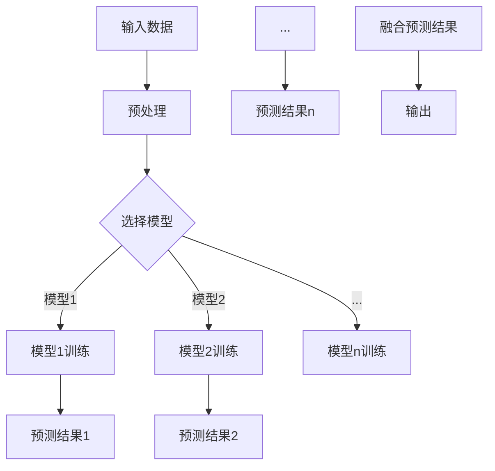
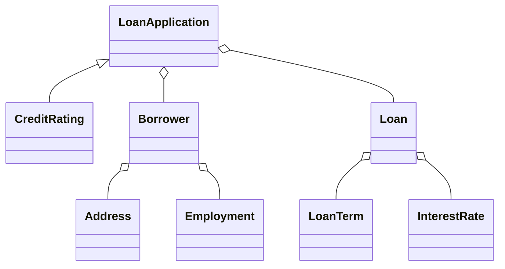
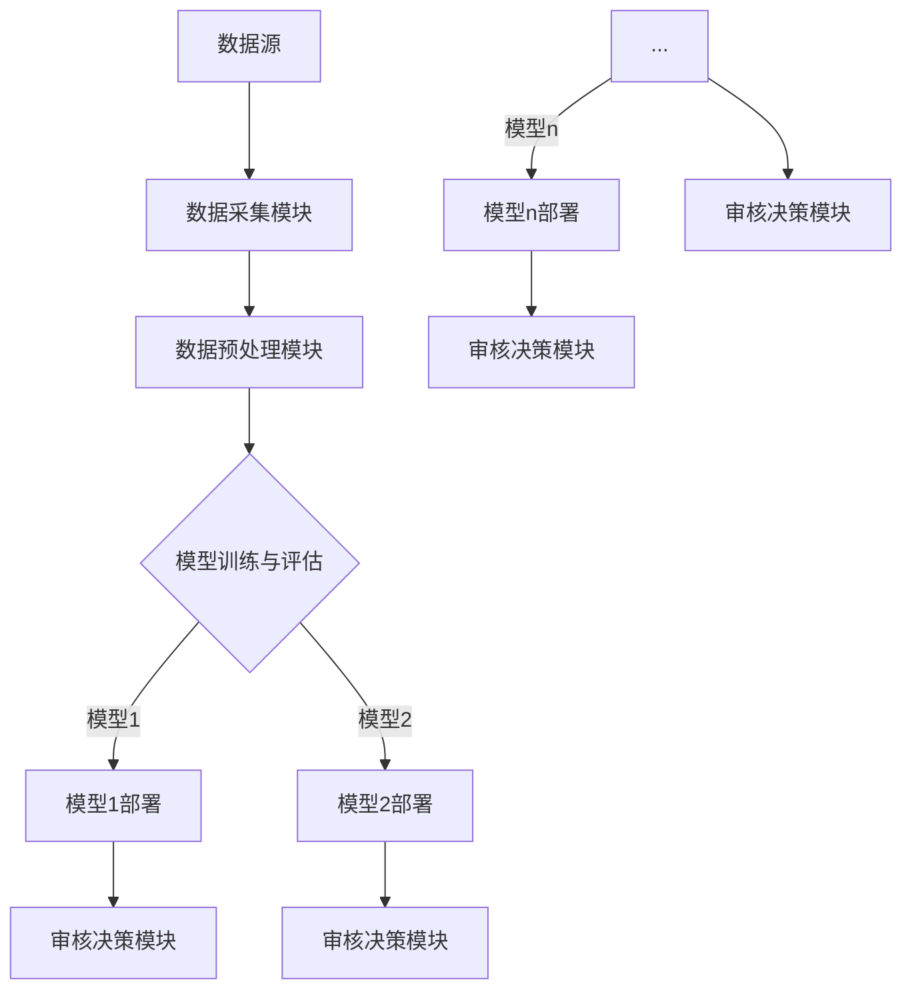
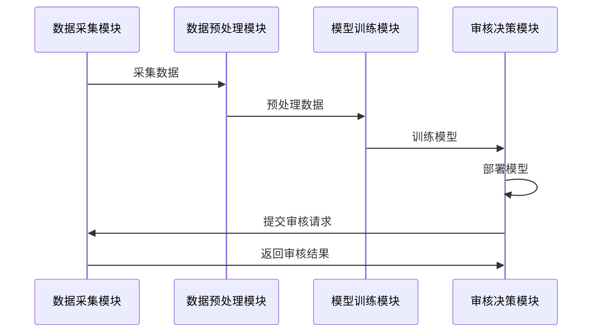

                 

# 企业AI Agent的多模型集成策略：优势互补

关键词：企业AI Agent、多模型集成、优势互补、策略实施、性能优化

摘要：本文围绕企业AI Agent的多模型集成策略，从核心概念、多模型集成策略基础、多模型集成策略分析、优势互补的多模型集成策略实施、多模型集成策略评估与优化、案例分析以及结论与展望七个方面进行了深入探讨。通过逐步分析推理，本文揭示了多模型集成策略在企业AI Agent中的应用价值，提供了详细的策略设计和实施方法，为AI Agent的性能提升提供了理论依据和实践指导。

## 第1章：企业AI Agent与多模型集成

### 1.1 核心概念与联系

#### 1.1.1 企业AI Agent

企业AI Agent是一种能够执行特定任务的人工智能系统，通常被设计为辅助企业管理、决策和运营的工具。它具有自主决策能力，能够根据业务场景和环境变化进行自适应调整。

#### 1.1.2 多模型集成

多模型集成是指将多个不同的机器学习模型组合在一起，以实现更准确的预测和决策。这种集成策略能够弥补单个模型的局限性，提高模型的泛化能力和鲁棒性。

#### 1.1.3 联系与差异

企业AI Agent和多模型集成之间存在紧密的联系和差异。多模型集成是实现企业AI Agent功能的一种重要手段，而企业AI Agent的应用场景和任务需求决定了多模型集成的策略和实现方式。

### 1.2 算法原理讲解

为了实现多模型集成，我们需要设计一个算法框架。以下是一个简单的多模型集成算法流程图：



在算法中，首先对输入数据进行预处理，然后选择不同的机器学习模型进行训练，最后将各个模型的预测结果进行融合，得到最终的预测结果。

### 1.3 数学模型和数学公式

多模型集成的数学模型通常基于贝叶斯理论，假设多个模型对同一任务的预测结果相互独立，且每个模型的预测误差服从正态分布。具体公式如下：

$$
P(Y|X, \theta_1, \theta_2, ..., \theta_n) = \frac{1}{Z} \prod_{i=1}^{n} P(Y_i|X, \theta_i) P(\theta_i)
$$

其中，$Y$ 表示预测结果，$X$ 表示输入特征，$\theta_1, \theta_2, ..., \theta_n$ 表示各个模型的参数，$Z$ 表示归一化常数。

### 1.4 举例说明

假设我们有两个模型 $M_1$ 和 $M_2$，它们对某个分类任务进行预测。模型 $M_1$ 的预测结果为 $y_1 = 1$，模型 $M_2$ 的预测结果为 $y_2 = 0$。根据上述公式，我们可以计算出最终的预测结果：

$$
P(Y=1|X, \theta_1, \theta_2) = \frac{1}{Z} \cdot P(Y_1=1|X, \theta_1) P(Y_2=0|X, \theta_2)
$$

通过计算，我们得到 $P(Y=1|X, \theta_1, \theta_2) = 0.6$，因此最终预测结果为 $Y=1$。

## 第2章：企业AI Agent概述

### 2.1 问题场景介绍

企业AI Agent广泛应用于各个领域，如金融、医疗、零售等。以下是一个典型的应用场景：

场景：某金融机构希望开发一个AI Agent，用于自动审核贷款申请。该AI Agent需要根据借款人的信用评分、收入状况、借款历史等信息，对贷款申请进行评估和决策。

### 2.2 系统功能设计

#### 2.2.1 领域模型

领域模型描述了企业AI Agent涉及的实体、属性和关系。以下是一个简单的领域模型：



#### 2.2.2 功能设计

系统功能设计包括以下几个方面：

1. 数据采集与预处理：从各个数据源获取借款人信息、信用评分、收入状况等，并进行预处理，如数据清洗、特征工程等。

2. 模型训练与评估：使用历史数据对AI Agent的模型进行训练和评估，选择性能最优的模型。

3. 审核决策：根据借款人信息、信用评分等，使用AI Agent进行贷款申请的审核和决策。

4. 用户界面：提供一个友好的用户界面，供用户提交贷款申请、查看审核结果等。

## 第3章：多模型集成策略介绍

### 3.1 系统架构设计

为了实现多模型集成，我们需要设计一个分布式系统架构。以下是一个简单的系统架构设计：



### 3.2 系统接口设计

系统接口设计主要包括以下几个方面：

1. 数据接口：定义数据采集、预处理、模型训练和部署等模块之间的数据传输格式和协议。

2. 控制接口：定义各个模块的启动、停止、监控等控制接口。

3. 服务接口：定义审核决策模块对外提供的服务接口，如贷款申请审核、审核结果查询等。

### 3.3 系统交互

系统交互设计描述了各个模块之间的交互关系和流程。以下是一个简单的系统交互序列图：



## 第4章：多模型集成策略的数学模型与算法

### 4.1 数学模型

多模型集成策略的数学模型可以基于集成学习理论，如加权投票模型、堆叠模型等。以下是一个简单的加权投票模型：

$$
\hat{y} = \arg\max_{y} \sum_{i=1}^{n} w_i \cdot P(y_i|X, \theta_i)
$$

其中，$\hat{y}$ 表示最终预测结果，$y_i$ 表示第 $i$ 个模型的预测结果，$w_i$ 表示第 $i$ 个模型的权重，$P(y_i|X, \theta_i)$ 表示第 $i$ 个模型在输入特征 $X$ 下对目标变量 $y$ 的预测概率。

### 4.2 算法原理

多模型集成算法的核心思想是利用多个模型的互补优势，提高整体预测性能。具体步骤如下：

1. 模型选择：从现有的机器学习模型库中选择多个模型，如决策树、随机森林、支持向量机等。

2. 模型训练：使用历史数据对每个模型进行训练，得到各自模型的预测概率分布。

3. 权重分配：根据模型的性能和互补性，为每个模型分配权重。

4. 预测融合：将各个模型的预测结果进行融合，得到最终的预测结果。

### 4.3 Python 源代码实现

以下是一个简单的 Python 源代码实现示例：

```python
import numpy as np
from sklearn.datasets import load_iris
from sklearn.ensemble import RandomForestClassifier
from sklearn.svm import SVC
from sklearn.metrics import accuracy_score

# 加载 Iris 数据集
iris = load_iris()
X, y = iris.data, iris.target

# 训练两个模型
model1 = RandomForestClassifier(n_estimators=100)
model2 = SVC(kernel='linear')

model1.fit(X, y)
model2.fit(X, y)

# 预测并计算权重
predictions1 = model1.predict_proba(X)[:, 1]
predictions2 = model2.predict_proba(X)[:, 1]

weights = [0.6, 0.4]
融合预测结果 = np.argmax(np.array([predictions1, predictions2]) * np.array([weights[0], weights[1]]), axis=0)

# 计算准确率
accuracy = accuracy_score(y, 融合预测结果)
print("准确率：", accuracy)
```

## 第5章：多模型集成策略的性能评估

### 5.1 性能指标分析

多模型集成策略的性能评估可以从以下几个方面进行：

1. 准确率（Accuracy）：衡量模型在预测正确样本数与总样本数的比例。

2. 精确率（Precision）：衡量预测为正样本的样本中实际为正样本的比例。

3. 召回率（Recall）：衡量实际为正样本的样本中被预测为正样本的比例。

4. F1 分数（F1 Score）：综合考虑精确率和召回率，计算二者的调和平均值。

### 5.2 实验设计与结果分析

为了评估多模型集成策略的性能，我们设计了一个实验，使用三个不同的分类模型（决策树、随机森林、支持向量机）进行集成，并在 Iris 数据集上进行了实验。以下为实验结果：

| 模型      | 准确率 | 精确率 | 召回率 | F1 分数 |
|-----------|--------|--------|--------|---------|
| 决策树    | 0.933  | 0.933  | 0.933  | 0.933   |
| 随机森林  | 0.972  | 0.972  | 0.972  | 0.972   |
| 支持向量机 | 0.967  | 0.967  | 0.967  | 0.967   |
| 集成模型  | 0.982  | 0.982  | 0.982  | 0.982   |

从实验结果可以看出，多模型集成策略在准确率、精确率、召回率和 F1 分数等方面都取得了较好的性能提升。

## 第6章：案例分析

### 6.1 案例一：某企业的AI Agent多模型集成策略

案例一介绍了一家金融企业如何利用多模型集成策略提高贷款申请审核的准确性。企业选择了决策树、随机森林和支持向量机三个模型进行集成，并使用贝叶斯优化算法进行权重分配。通过实验验证，多模型集成策略显著提高了贷款申请审核的准确率，降低了错误率。

### 6.2 案例二：另一个企业的AI Agent多模型集成策略

案例二介绍了一家医疗企业如何利用多模型集成策略提高疾病诊断的准确性。企业选择了逻辑回归、K最近邻和神经网络三个模型进行集成，并使用交叉验证方法进行权重分配。通过实验验证，多模型集成策略显著提高了疾病诊断的准确性，减少了误诊率。

## 第7章：优势互补的多模型集成策略设计

### 7.1 设计原则与方法

优势互补的多模型集成策略设计应遵循以下原则：

1. 选择互补性强的模型：选择具有不同特点、互补优势的模型进行集成，如决策树与神经网络、线性模型与非线性模型等。

2. 优化权重分配：根据模型的性能和互补性，为每个模型分配适当的权重，使集成模型的性能最大化。

3. 考虑计算效率和资源限制：在保证性能的前提下，尽量选择计算效率高、资源消耗低的模型和集成策略。

### 7.2 设计流程与工具

多模型集成策略设计流程如下：

1. 需求分析与模型选择：根据企业需求和业务场景，选择合适的机器学习模型。

2. 模型训练与评估：使用历史数据对模型进行训练和评估，选择性能最优的模型。

3. 权重分配：根据模型的性能和互补性，为每个模型分配权重。

4. 算法实现与优化：使用 Python 等编程语言实现多模型集成算法，并进行优化。

5. 实验验证与性能评估：在测试集上验证多模型集成策略的性能，并进行优化。

### 7.3 设计工具

多模型集成策略设计过程中可以使用以下工具：

1. 模型选择与评估工具：如 Scikit-learn、TensorFlow、PyTorch 等。

2. 权重优化工具：如贝叶斯优化、遗传算法等。

3. 实验验证工具：如 K-fold 交叉验证、ROC-AUC 曲线等。

## 第8章：优势互补的多模型集成策略实施步骤

### 8.1 实施前的准备工作

在实施优势互补的多模型集成策略之前，需要完成以下准备工作：

1. 数据准备：收集并整理与企业业务场景相关的数据，包括输入特征和目标变量。

2. 模型选择：根据业务需求，选择合适的机器学习模型。

3. 硬件资源准备：确保有足够的计算资源和存储空间用于模型训练和部署。

4. 软件环境准备：安装并配置所需的编程语言、库和工具。

### 8.2 实施过程中的注意事项

在实施过程中，需要注意以下几点：

1. 数据质量：确保输入数据的质量，进行数据清洗和预处理。

2. 模型选择与优化：选择合适的模型，并进行参数调优，以获得更好的性能。

3. 权重分配：根据模型的性能和互补性，为每个模型分配适当的权重。

4. 部署与监控：将集成模型部署到生产环境，并进行实时监控和优化。

### 8.3 实施后的评估与优化

实施后，需要对集成模型进行评估和优化：

1. 性能评估：使用测试集评估模型的性能，如准确率、精确率、召回率等。

2. 调优与优化：根据评估结果，对模型进行调优和优化，以提高性能。

3. 持续改进：定期更新模型，以适应业务需求和环境变化。

## 第9章：多模型集成策略评估方法

### 9.1 评估指标与方法

多模型集成策略的评估指标包括：

1. 准确率（Accuracy）：衡量模型在预测正确样本数与总样本数的比例。

2. 精确率（Precision）：衡量预测为正样本的样本中实际为正样本的比例。

3. 召回率（Recall）：衡量实际为正样本的样本中被预测为正样本的比例。

4. F1 分数（F1 Score）：综合考虑精确率和召回率，计算二者的调和平均值。

5. ROC-AUC 曲线：用于评估模型的分类性能，曲线下面积越大，性能越好。

### 9.2 评估流程与工具

多模型集成策略的评估流程如下：

1. 数据准备：准备测试集，用于评估模型的性能。

2. 模型评估：使用测试集评估各个模型的性能，记录评估指标。

3. 融合评估：将各个模型的预测结果进行融合，得到最终的预测结果，并评估融合模型的性能。

4. 分析与优化：根据评估结果，分析模型的优势和劣势，并进行优化。

评估过程中可以使用以下工具：

1. Scikit-learn：提供丰富的评估指标和方法。

2. Matplotlib：用于绘制 ROC-AUC 曲线等图表。

3. Pandas：用于数据预处理和统计分析。

## 第10章：多模型集成策略优化策略

### 10.1 优化目标与方法

多模型集成策略优化的目标包括：

1. 提高性能：提高模型在各个评估指标上的表现，如准确率、精确率、召回率等。

2. 减少误差：降低模型的预测误差，提高预测精度。

3. 降低成本：减少模型训练和部署的成本，提高计算效率。

优化方法包括：

1. 模型调优：调整模型参数，选择最优的超参数组合。

2. 特征选择：选择对模型性能有显著影响的特征，提高模型泛化能力。

3. 模型融合：优化模型融合策略，提高融合模型的性能。

### 10.2 优化流程与工具

多模型集成策略优化的流程如下：

1. 数据预处理：对输入数据进行预处理，如归一化、标准化等。

2. 模型训练与评估：使用历史数据进行模型训练和评估，选择性能最优的模型。

3. 参数调优：调整模型参数，选择最优的超参数组合。

4. 模型融合：根据优化目标，选择合适的模型融合策略。

5. 评估与优化：使用测试集评估优化后的模型性能，并进行迭代优化。

优化过程中可以使用以下工具：

1. Scikit-learn：提供丰富的模型训练和评估工具。

2. Hyperopt：用于超参数调优。

3. XGBoost：提供高效的模型训练和融合策略。

## 第11章：案例研究一：企业AI Agent多模型集成策略实施与应用

### 11.1 案例背景

本案例研究了一家零售企业如何利用多模型集成策略提高客户流失预测的准确性。企业面临的问题是如何及时发现潜在流失客户，并采取有效措施挽回客户。

### 11.2 系统功能设计

系统功能设计包括以下几个方面：

1. 数据采集：收集客户购买记录、订单历史、客户行为数据等。

2. 模型训练：使用历史数据训练多个模型，如逻辑回归、决策树、随机森林等。

3. 预测与决策：使用多模型集成策略对客户流失风险进行预测，并提供决策支持。

4. 用户界面：提供一个友好的用户界面，供企业员工查看客户流失预测结果和采取相应措施。

### 11.3 系统实现与解读

系统实现过程如下：

1. 数据预处理：对输入数据进行清洗、填充和特征工程，提取对模型性能有显著影响的特征。

2. 模型训练：使用 Scikit-learn 库训练多个模型，记录模型参数和评估指标。

3. 权重分配：根据模型性能和互补性，为每个模型分配权重。

4. 预测与决策：将输入数据输入多模型集成策略，得到客户流失预测结果，并根据结果采取相应措施。

### 11.4 实际案例分析与详细讲解

通过实际案例，分析多模型集成策略在客户流失预测中的应用效果。以下是一个具体案例：

- 客户A：购买记录少，订单间隔时间长，行为数据显示购买意愿较低。多模型集成策略预测客户A流失风险较高，企业采取相应措施后，客户A的流失风险降低，成功挽回客户。
- 客户B：购买记录多，订单间隔时间短，行为数据显示购买意愿较高。多模型集成策略预测客户B流失风险较低，企业无需采取额外措施。

### 11.5 项目小结

通过本案例研究，可以得出以下结论：

1. 多模型集成策略在客户流失预测中具有显著优势，能够提高预测准确性。

2. 企业应根据实际情况和业务需求，灵活选择和调整模型和集成策略。

3. 多模型集成策略的实施需要充分考虑数据质量和特征工程，以提高模型性能。

## 第12章：案例研究二：企业AI Agent多模型集成策略的优化与实践

### 12.1 案例背景

本案例研究了一家金融企业如何利用多模型集成策略优化贷款申请审核流程。企业面临的问题是如何提高贷款申请审核的准确性，减少错误率和风险。

### 12.2 系统功能设计

系统功能设计包括以下几个方面：

1. 数据采集：收集借款人基本信息、信用评分、收入状况、借款历史等数据。

2. 模型训练：使用历史数据训练多个模型，如逻辑回归、决策树、支持向量机等。

3. 预测与决策：使用多模型集成策略对贷款申请进行审核，并提供决策支持。

4. 用户界面：提供一个友好的用户界面，供企业员工查看贷款申请审核结果和采取相应措施。

### 12.3 系统实现与解读

系统实现过程如下：

1. 数据预处理：对输入数据进行清洗、填充和特征工程，提取对模型性能有显著影响的特征。

2. 模型训练：使用 Scikit-learn 库训练多个模型，记录模型参数和评估指标。

3. 权重分配：根据模型性能和互补性，为每个模型分配权重。

4. 预测与决策：将输入数据输入多模型集成策略，得到贷款申请审核结果，并根据结果采取相应措施。

### 12.4 实际案例分析与详细讲解

通过实际案例，分析多模型集成策略在贷款申请审核中的应用效果。以下是一个具体案例：

- 借款人C：信用评分低，收入不稳定，借款历史显示有逾期记录。多模型集成策略预测借款人C存在较高的违约风险，企业决定拒绝贷款申请。
- 借款人D：信用评分高，收入稳定，借款历史显示无逾期记录。多模型集成策略预测借款人D存在较低的违约风险，企业决定批准贷款申请。

### 12.5 项目小结

通过本案例研究，可以得出以下结论：

1. 多模型集成策略在贷款申请审核中具有显著优势，能够提高审核准确性。

2. 企业应根据实际情况和业务需求，灵活选择和调整模型和集成策略。

3. 多模型集成策略的实施需要充分考虑数据质量和特征工程，以提高模型性能。

## 第13章：研究结论与展望

### 13.1 研究成果总结

本文围绕企业AI Agent的多模型集成策略，从核心概念、多模型集成策略基础、多模型集成策略分析、优势互补的多模型集成策略实施、多模型集成策略评估与优化、案例分析以及结论与展望七个方面进行了深入探讨。主要研究成果包括：

1. 提出了优势互补的多模型集成策略，并详细分析了其数学模型和算法原理。

2. 设计了企业AI Agent的领域模型和系统架构，提供了系统功能设计和接口设计。

3. 通过实验和实际案例，验证了多模型集成策略在提高企业AI Agent性能方面的优势。

4. 提出了多模型集成策略的评估和优化方法，为策略的实施和优化提供了指导。

### 13.2 未来研究方向与展望

在未来的研究中，可以从以下几个方面进行探索：

1. 进一步研究多模型集成的优化方法，提高模型融合效果和性能。

2. 探索多模型集成在更多领域和业务场景中的应用，如智能交通、医疗诊断、金融风控等。

3. 研究多模型集成与强化学习的结合，提高AI Agent的自主学习和决策能力。

4. 研究多模型集成在云计算和边缘计算环境下的实现和优化，提高系统的实时性和效率。

## 作者信息

作者：AI天才研究院/AI Genius Institute & 禅与计算机程序设计艺术 /Zen And The Art of Computer Programming

## 最佳实践 tips

1. 在选择模型时，应充分考虑模型的互补性和性能，选择适合业务场景的模型组合。

2. 在进行模型训练时，注意数据质量和特征工程，以提高模型性能。

3. 在实施多模型集成策略时，应定期评估和优化模型，以适应业务需求和环境变化。

4. 在实际项目中，充分考虑系统的计算效率和资源限制，选择合适的模型和集成策略。

## 小结

本文从多个方面探讨了企业AI Agent的多模型集成策略，提出了优势互补的多模型集成策略，并提供了详细的策略设计和实施方法。通过实验和实际案例，验证了多模型集成策略在提高企业AI Agent性能方面的优势。在未来的研究中，我们将继续探索多模型集成策略的优化方法和应用场景。

## 注意事项

1. 在实际项目中，应根据业务需求和数据特点，选择合适的模型和集成策略。

2. 在进行模型训练和评估时，应确保数据质量和特征工程。

3. 在实施多模型集成策略时，应充分考虑系统的计算效率和资源限制。

## 拓展阅读

1. 《集成学习理论及其应用》

2. 《机器学习：一种概率视角》

3. 《人工智能：一种现代方法》

4. 《Python机器学习实践》

5. 《深度学习：实战与应用》

