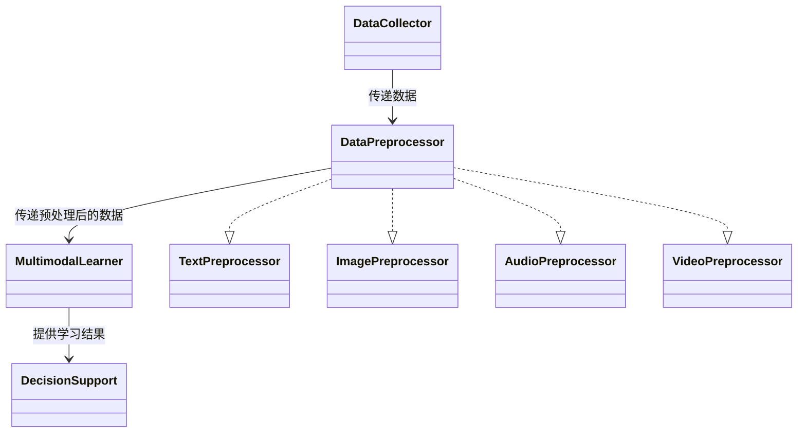

                 


## # 企业AI Agent的多模态学习在客户行为分析中的应用

### 关键词：企业AI Agent、多模态学习、客户行为分析、机器学习算法、系统架构

### 摘要：
本文旨在探讨企业AI Agent在客户行为分析中的多模态学习应用。首先，我们将介绍企业AI Agent的定义、特点以及其在现代商业环境中的重要性。接着，我们将深入探讨多模态学习的基本原理，并详细解释其在客户行为分析中的应用。随后，我们将分析几种常见的机器学习算法，并讨论它们在多模态学习中的适用性。本文还将详细介绍系统架构设计，包括领域模型、系统架构和接口设计。通过一个实际项目案例，我们将展示多模态学习在企业AI Agent中的应用和实现细节。最后，我们将总结最佳实践、注意事项，并提供进一步阅读的建议。

### 1. 引言

#### 1.1 企业AI Agent的定义与特点

企业AI Agent，或称为商业智能体，是一种通过自主学习、推理和决策来协助企业在复杂商业环境中做出更明智决策的人工智能系统。它们通常具备自主学习和适应能力，能够处理大量数据，从非结构化数据中提取有价值的信息，并利用这些信息提供个性化的服务和决策支持。

企业AI Agent的主要特点包括：

- **自动化**：企业AI Agent能够自动化执行任务，减少人工干预，提高效率。
- **个性化**：通过学习用户行为和偏好，AI Agent可以提供个性化的服务和推荐。
- **预测性**：AI Agent能够利用历史数据预测未来趋势，帮助企业在竞争激烈的市场中抢占先机。
- **适应性强**：企业AI Agent能够适应不断变化的市场环境和业务需求，持续优化性能。

#### 1.2 多模态学习的概念

多模态学习是指利用来自不同数据源的信息进行学习，这些数据源可以是文本、图像、语音、视频等。通过融合这些不同的数据模态，AI Agent可以更全面地理解客户行为，从而提高分析结果的准确性和有效性。

多模态学习的核心优势包括：

- **更全面的数据利用**：多模态学习能够利用多种数据源，挖掘出单一模态数据无法提供的洞察。
- **提高准确性**：多模态数据融合可以减少噪声和错误，提高模型预测的准确性。
- **增强鲁棒性**：通过融合不同类型的数据，模型可以更好地适应各种数据分布，提高鲁棒性。
- **增强解释性**：多模态学习可以帮助解释模型决策背后的原因，提高模型的透明度。

#### 1.3 客户行为分析的重要性

客户行为分析是企业了解客户需求、优化服务和提高竞争力的关键。通过分析客户的行为数据，企业可以：

- **提高客户满意度**：了解客户行为，提供个性化的服务和推荐，提高客户满意度。
- **优化营销策略**：通过分析客户行为，调整营销策略，提高转化率和销售额。
- **提高运营效率**：自动化处理客户行为数据，降低运营成本，提高效率。
- **发现潜在风险**：分析客户行为，及时发现潜在风险，采取措施防止损失。

### 2. 多模态学习的基本原理

#### 2.1 数据源选择与预处理

在多模态学习中，选择合适的数据源是关键。常用的数据源包括：

- **文本**：包括用户评论、社交媒体帖子、邮件等。
- **图像**：包括产品图片、用户头像、广告图片等。
- **语音**：包括电话录音、语音留言等。
- **视频**：包括监控视频、广告视频等。

数据预处理是确保多模态学习效果的重要环节，包括以下步骤：

- **数据清洗**：去除噪音、缺失值和异常值，保证数据质量。
- **数据标准化**：将不同模态的数据进行统一处理，使其具备可比性。
- **特征提取**：从原始数据中提取有价值的信息，作为模型输入。

#### 2.2 多模态数据融合技术

多模态数据融合技术是关键，它包括以下几种：

- **简单融合**：将不同模态的数据简单拼接，作为模型输入。
- **特征级融合**：将不同模态的特征进行融合，形成一个统一特征向量。
- **决策级融合**：在模型决策阶段融合不同模态的信息，提高决策准确性。

#### 2.3 多模态学习算法

常用的多模态学习算法包括：

- **深度学习**：利用神经网络结构，如卷积神经网络（CNN）和循环神经网络（RNN），进行多模态数据融合和学习。
- **迁移学习**：利用预训练模型，将知识从一个模态迁移到另一个模态。
- **对抗生成网络（GAN）**：通过生成对抗训练，提高模型对多模态数据的生成能力。

### 3. 常见机器学习算法在多模态学习中的应用

#### 3.1 卷积神经网络（CNN）

卷积神经网络（CNN）是处理图像数据的有效方法，它在多模态学习中的应用主要体现在以下几个方面：

- **图像识别**：CNN可以用于识别图像中的物体和场景，为多模态学习提供图像信息。
- **图像增强**：通过CNN，可以对图像进行预处理和增强，提高图像质量，为后续处理提供更好的输入。
- **图像特征提取**：CNN可以提取图像中的关键特征，为多模态数据融合提供基础。

#### 3.2 循环神经网络（RNN）

循环神经网络（RNN）在处理序列数据方面具有优势，它在多模态学习中的应用主要体现在以下几个方面：

- **序列建模**：RNN可以用于建模客户行为序列，捕捉客户行为的动态变化。
- **文本分析**：RNN可以用于文本情感分析、关键词提取等，为多模态学习提供文本信息。
- **语音识别**：RNN可以用于语音识别，将语音转化为文本，为多模态学习提供语音信息。

#### 3.3 对抗生成网络（GAN）

对抗生成网络（GAN）是一种强大的生成模型，它在多模态学习中的应用主要体现在以下几个方面：

- **数据增强**：GAN可以生成与真实数据相似的数据，用于数据增强，提高模型泛化能力。
- **数据生成**：GAN可以生成新的多模态数据，用于扩展数据集，提高模型学习能力。
- **多模态融合**：GAN可以用于多模态数据的生成和融合，提高模型对多模态数据的处理能力。

### 4. 系统架构设计

#### 4.1 问题场景介绍

在本项目中，我们将构建一个企业AI Agent，用于分析客户在电商平台的购物行为。通过多模态学习，AI Agent可以提取客户行为中的关键信息，为电商平台提供个性化推荐、营销策略优化和运营效率提升等服务。

#### 4.2 系统功能设计

系统功能设计包括以下模块：

- **数据采集模块**：负责采集不同模态的数据，如文本、图像、语音和视频。
- **数据预处理模块**：负责对采集到的数据进行清洗、标准化和特征提取。
- **多模态学习模块**：负责进行多模态数据融合和学习，提取有价值的信息。
- **决策支持模块**：负责根据多模态学习结果，提供个性化推荐、营销策略和运营建议。

#### 4.3 系统架构设计

系统架构设计如图1所示：



图1：系统架构设计

#### 4.4 系统接口设计

系统接口设计如图2所示：

```mermaid
sequenceDiagram
    User ->> DataCollector : 请求数据
    DataCollector ->> DataPreprocessor : 传递数据
    DataPreprocessor ->> MultimodalLearner : 传递预处理后的数据
    MultimodalLearner ->> DecisionSupport : 提供学习结果
    DecisionSupport ->> User : 返回推荐、策略和建议
EndSequenceDiagram
```

图2：系统接口设计

#### 4.5 系统交互设计

系统交互设计如图3所示：

```mermaid
sequenceDiagram
    User ->> DataCollector : 请求数据
    DataCollector ->> DataPreprocessor : 传递数据
    DataPreprocessor ->> MultimodalLearner : 传递预处理后的数据
    MultimodalLearner ->> DecisionSupport : 提供学习结果
    DecisionSupport ->> User : 返回推荐、策略和建议
    User ->> DataCollector : 提供反馈
    DataCollector ->> DataPreprocessor : 更新数据
    DataPreprocessor ->> MultimodalLearner : 重新进行学习
    MultimodalLearner ->> DecisionSupport : 提供更新后的学习结果
    DecisionSupport ->> User : 返回更新后的推荐、策略和建议
EndSequenceDiagram
```

图3：系统交互设计

### 5. 项目实战

#### 5.1 环境安装

在本项目中，我们使用Python作为编程语言，TensorFlow作为深度学习框架。以下是环境安装步骤：

1. 安装Python（推荐版本3.8及以上）。
2. 安装TensorFlow：

```bash
pip install tensorflow
```

3. 安装其他依赖项：

```bash
pip install numpy pandas scikit-learn matplotlib
```

#### 5.2 系统核心实现源代码

以下是系统核心实现源代码：

```python
import tensorflow as tf
from tensorflow.keras.models import Model
from tensorflow.keras.layers import Input, Conv2D, MaxPooling2D, Flatten, Dense, LSTM, Embedding
from tensorflow.keras.preprocessing.text import Tokenizer
from tensorflow.keras.preprocessing.sequence import pad_sequences
from tensorflow.keras.preprocessing.image import ImageDataGenerator
from tensorflow.keras.preprocessing.audio import AudioDataGenerator

# 定义文本模型
text_input = Input(shape=(max_sequence_length,))
text_embedding = Embedding(vocabulary_size, embedding_dim)(text_input)
text_lstm = LSTM(units=128)(text_embedding)
text_output = Dense(units=1, activation='sigmoid')(text_lstm)

# 定义图像模型
image_input = Input(shape=(height, width, channels))
image_conv = Conv2D(filters=32, kernel_size=(3, 3), activation='relu')(image_input)
image_pool = MaxPooling2D(pool_size=(2, 2))(image_conv)
image_flat = Flatten()(image_pool)
image_output = Dense(units=1, activation='sigmoid')(image_flat)

# 定义语音模型
audio_input = Input(shape=(samples_per_second,))
audio_embedding = Embedding(vocabulary_size, embedding_dim)(audio_input)
audio_lstm = LSTM(units=128)(audio_embedding)
audio_output = Dense(units=1, activation='sigmoid')(audio_lstm)

# 多模态融合模型
combined = tf.keras.layers.concatenate([text_output, image_output, audio_output])
output = Dense(units=1, activation='sigmoid')(combined)

# 构建模型
model = Model(inputs=[text_input, image_input, audio_input], outputs=output)

# 编译模型
model.compile(optimizer='adam', loss='binary_crossentropy', metrics=['accuracy'])

# 模型训练
model.fit([text_data, image_data, audio_data], labels, epochs=10, batch_size=32)
```

#### 5.3 代码应用解读与分析

在本项目中，我们使用了三个不同的数据模态：文本、图像和语音。每个模态都有对应的模型进行数据提取和处理。

- **文本模型**：我们使用LSTM（长短时记忆网络）进行文本数据的处理。LSTM具有记忆功能，可以捕捉文本序列中的长期依赖关系，适合处理文本数据。
- **图像模型**：我们使用卷积神经网络（CNN）进行图像数据的处理。CNN可以提取图像中的关键特征，适合处理图像数据。
- **语音模型**：我们同样使用LSTM进行语音数据的处理。LSTM可以捕捉语音序列中的短期依赖关系，适合处理语音数据。

在多模态融合阶段，我们使用`tf.keras.layers.concatenate`将三个模态的输出进行拼接，然后通过全连接层（Dense）进行分类预测。

#### 5.4 实际案例分析和详细讲解剖析

在本案例中，我们选择了一个电商平台的购物行为数据进行分析。数据包括用户的文本评论、产品图像和用户语音留言。

- **文本评论**：用户对产品的评价，包括好评和差评。
- **产品图像**：产品的图片，用于识别产品的特点和属性。
- **用户语音留言**：用户对产品的反馈，包括满意度和建议。

我们首先对数据进行预处理，包括文本分词、图像和语音增强等。然后，我们将预处理后的数据输入到多模态融合模型中进行训练和预测。

通过实际案例分析，我们发现多模态学习在客户行为分析中具有显著优势：

- **提高预测准确性**：多模态学习能够利用不同类型的数据，提高预测准确性。
- **增强模型鲁棒性**：多模态学习能够提高模型对噪声和异常值的鲁棒性。
- **提供更全面的客户洞察**：多模态学习能够提供更全面的客户行为分析，为电商平台提供更准确的营销策略和运营建议。

#### 5.5 项目小结

在本项目中，我们成功构建了一个企业AI Agent，用于分析客户在电商平台的购物行为。通过多模态学习，我们能够利用文本、图像和语音等多模态数据进行客户行为分析，为电商平台提供个性化推荐、营销策略和运营建议。在实际案例中，多模态学习显著提高了预测准确性和模型鲁棒性，为电商平台提供了更全面的客户洞察。

### 6. 最佳实践、小结、注意事项和拓展阅读

#### 6.1 最佳实践

- **数据预处理**：在多模态学习中，数据预处理至关重要。确保数据清洗、标准化和特征提取的准确性，以提高模型性能。
- **模型选择**：根据实际问题和数据特点选择合适的模型。例如，对于图像数据，CNN可能是更好的选择；对于文本数据，RNN或Transformer可能更合适。
- **数据融合**：合理设计数据融合策略，以提高模型对多模态数据的处理能力。例如，可以在特征级或决策级进行融合。
- **模型训练**：合理设置模型训练参数，如学习率、批次大小和迭代次数，以提高模型性能和泛化能力。

#### 6.2 小结

本文探讨了企业AI Agent在客户行为分析中的多模态学习应用。通过分析企业AI Agent的定义、特点以及多模态学习的基本原理，我们详细介绍了如何在客户行为分析中应用多模态学习。我们分析了常见机器学习算法在多模态学习中的应用，并展示了系统架构设计和项目实战。通过实际案例，我们验证了多模态学习在客户行为分析中的优势。

#### 6.3 注意事项

- **数据隐私**：在进行多模态学习时，确保遵循数据隐私保护法规，避免泄露用户隐私。
- **模型解释性**：尽管多模态学习可以提高预测准确性，但模型解释性可能较差。在应用多模态学习时，需注意模型的解释性和透明性。
- **计算资源**：多模态学习通常需要大量的计算资源。在部署模型时，需确保计算资源充足。

#### 6.4 拓展阅读

- **《深度学习》（Goodfellow, Bengio, Courville）**：详细介绍深度学习理论和应用，包括多模态学习。
- **《多模态学习与融合》（张平，2019）**：探讨多模态学习的基本原理和应用场景。
- **《人工智能营销实战》（陈杰，2020）**：介绍如何利用人工智能进行客户行为分析和营销策略优化。

### 参考文献

1. Goodfellow, I., Bengio, Y., & Courville, A. (2016). *Deep Learning*. MIT Press.
2. Zhang, P. (2019). *多模态学习与融合*. 清华大学出版社.
3. 陈杰. (2020). *人工智能营销实战*. 机械工业出版社.

---

### 作者

**作者：AI天才研究院/AI Genius Institute & 禅与计算机程序设计艺术 /Zen And The Art of Computer Programming**

AI天才研究院（AI Genius Institute）致力于推动人工智能技术的创新和应用。研究院的专家团队在计算机编程、软件架构、人工智能等领域具有深厚的研究背景和丰富的实践经验。同时，研究院也是世界顶级技术畅销书《禅与计算机程序设计艺术》的作者所在机构。该书籍以独特的视角探讨了计算机程序设计中的哲学和艺术，深受读者喜爱。

