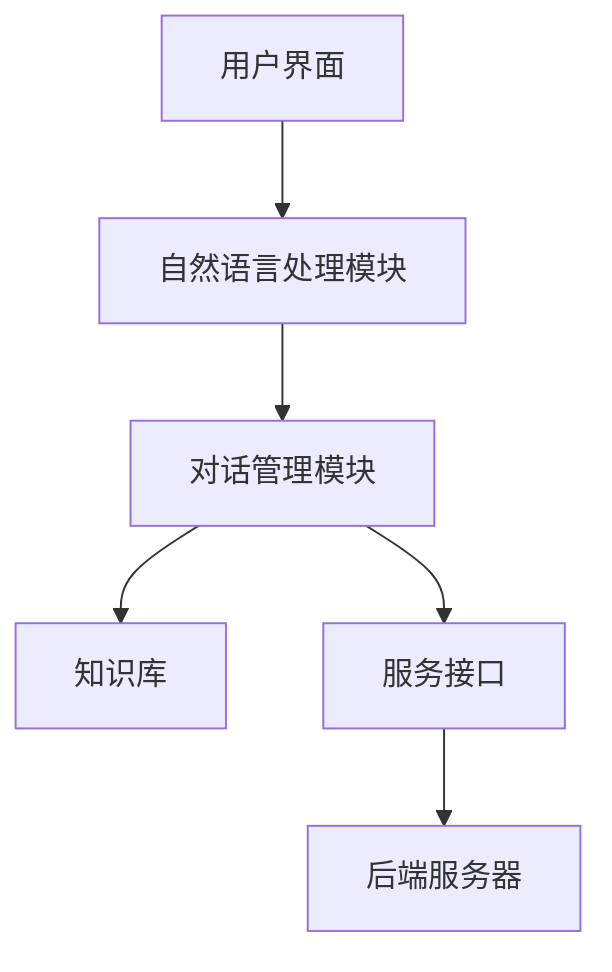
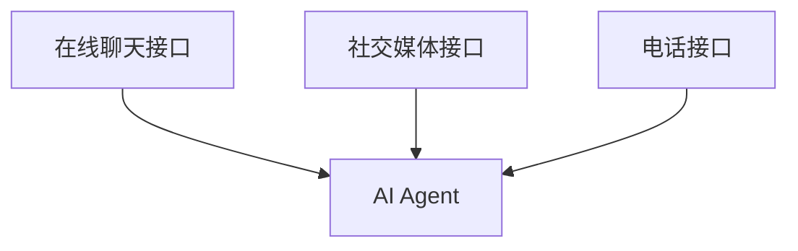
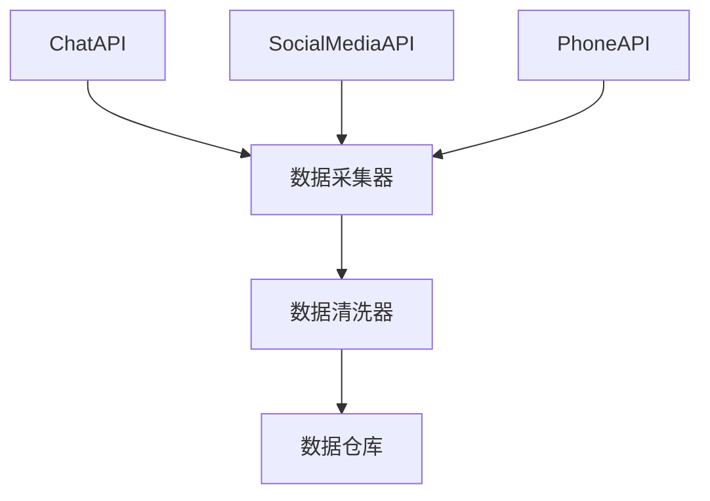

                 

### 第一部分：企业AI Agent的多渠道集成

#### 第1章：问题背景与概述

##### 1.1 问题背景

在当今数字化时代，客户服务的多样化需求变得越来越显著。随着互联网、移动通信技术的迅速发展，客户与企业的互动方式也在不断变化。传统的单一渠道客户服务模式已经难以满足用户多样化的需求。例如，客户可能通过电子邮件、电话、在线聊天、社交媒体、移动应用等多种渠道与企业进行沟通。这种多样化的沟通需求给企业的客户服务带来了前所未有的挑战。

- **客户服务需求的多样化**：客户希望通过多种渠道与企业进行沟通，以获取及时和个性化的服务。
- **多渠道沟通的挑战**：企业需要同时管理多个渠道，这增加了沟通成本和复杂性。例如，不同渠道的数据不统一，可能导致服务不一致或信息遗漏。
- **AI Agent在客户服务中的应用现状**：人工智能（AI）技术，特别是AI Agent，已经开始在客户服务领域发挥作用。通过自然语言处理、语音识别和机器学习等技术，AI Agent能够提供快速、准确的响应，改善客户体验。

##### 1.2 问题定义

首先，我们需要明确什么是企业AI Agent以及多渠道集成的意义。

- **什么是企业AI Agent**：企业AI Agent是一种利用人工智能技术，模拟人类行为进行客户服务交互的虚拟智能体。它能够理解客户的意图，提供即时响应，解决常见问题，并在需要时将复杂问题转交给人工客服。

- **多渠道集成的意义**：多渠道集成是指将企业的AI Agent与多种沟通渠道（如电话、在线聊天、电子邮件、社交媒体等）无缝连接，使得客户可以在任何时间、任何地点通过任何渠道获取一致的服务体验。这种集成的重要性体现在以下几个方面：

  - **提高客户体验**：通过多渠道集成，客户可以在不同渠道间无缝切换，获得连续的服务体验，提高满意度。
  - **提高运营效率**：多渠道集成可以减少重复性劳动，提高服务效率，降低运营成本。
  - **降低成本**：多渠道集成减少了维护多个独立系统的成本，并提供了统一的客户数据视图，有助于更有效地管理和分析客户信息。

##### 1.3 边界与外延

接下来，我们需要明确企业AI Agent的功能范围以及多渠道集成的渠道类型。

- **企业AI Agent的功能范围**：企业AI Agent的功能范围包括但不限于：
  - **问题识别**：通过自然语言处理技术理解客户提出的问题。
  - **问题解答**：提供自动化答案，解决常见问题。
  - **转接人工**：将复杂问题转交给人工客服处理。
  - **用户交互**：通过文本、语音等方式与用户进行交流。

- **多渠道集成的渠道类型**：多渠道集成的渠道类型包括：
  - **在线聊天**：客户通过网站、移动应用等渠道与企业进行实时聊天。
  - **电子邮件**：客户通过电子邮件与企业进行沟通。
  - **电话**：客户通过电话与企业进行语音沟通。
  - **社交媒体**：客户通过社交媒体平台（如Facebook、Twitter等）与企业进行互动。
  - **移动应用**：客户通过企业开发的移动应用程序进行沟通。

##### 1.4 概念结构与核心要素组成

最后，我们来探讨企业AI Agent多渠道集成的概念结构与核心要素组成。

- **AI Agent的核心概念**：AI Agent的核心概念包括自然语言处理（NLP）、机器学习（ML）、深度学习（DL）等。这些技术使AI Agent能够理解人类语言，提供智能化的服务。

- **多渠道集成的关键要素**：多渠道集成的关键要素包括：

  - **数据集成**：将不同渠道的数据统一存储和管理，确保数据的一致性和完整性。
  - **接口设计**：设计并实现各渠道与AI Agent之间的API接口，确保数据传输的顺畅。
  - **用户体验**：优化用户体验，确保客户在不同渠道获得一致的服务质量。
  - **系统兼容性**：确保AI Agent能够在不同的操作系统、浏览器和设备上运行。

##### 1.5 本章小结

在本章中，我们首先探讨了客户服务多样化需求所带来的挑战，以及AI Agent在客户服务中的应用现状。接着，我们明确了企业AI Agent和多渠道集成的定义，并详细阐述了其边界与外延。最后，我们分析了AI Agent的核心概念与多渠道集成的关键要素。通过本章的讨论，我们为后续章节的技术分析和策略实施奠定了坚实的基础。

---

### 第一部分：企业AI Agent的多渠道集成

#### 第2章：AI Agent基础技术

##### 2.1 自然语言处理技术

自然语言处理（NLP）是人工智能（AI）的一个重要分支，旨在使计算机能够理解、生成和处理人类语言。在AI Agent的多渠道集成中，NLP技术起着至关重要的作用，它使得AI Agent能够与人类用户进行有效的交流。

###### 2.1.1 语言模型介绍

语言模型是NLP的核心组件，它通过大量语料库的训练，生成概率分布，用以预测下一个词或词组。语言模型可以分为统计语言模型和神经语言模型。

- **统计语言模型**：基于统计方法，如N-gram模型，通过计算单词序列的历史频率来预测下一个词。
- **神经语言模型**：基于深度学习，如循环神经网络（RNN）和Transformer模型，通过学习大量的文本数据，生成文本的概率分布。

语言模型在AI Agent中的应用包括：

- **文本生成**：用于生成自然语言的回复，如聊天机器人的自动回复。
- **文本分类**：用于对文本进行分类，如垃圾邮件检测、情感分析等。
- **命名实体识别**：用于识别文本中的特定实体，如人名、地点、组织等。

###### 2.1.2 语音识别技术

语音识别技术是将语音信号转换为文本的技术，它使得AI Agent能够通过语音与用户进行交互。

- **基本原理**：语音识别的过程可以分为三个阶段：特征提取、声学模型和语言模型。特征提取从语音信号中提取特征向量；声学模型将特征向量映射到音素；语言模型将音素序列映射到单词序列。

- **关键技术**：
  - **声学模型**：通常基于深度神经网络，如卷积神经网络（CNN）和长短期记忆网络（LSTM）。
  - **语言模型**：通常基于神经网络，如Transformer模型。

语音识别技术在AI Agent中的应用包括：

- **语音到文本转换**：将用户的语音输入转换为文本，供AI Agent处理。
- **语音交互**：通过语音交互，实现AI Agent与用户的自然对话。
- **语音助手**：如Siri、Alexa等，提供语音查询和命令响应功能。

###### 2.1.3 语音合成技术

语音合成技术是将文本转换为自然语音的技术，使得AI Agent能够通过语音与用户进行交流。

- **基本原理**：语音合成的过程可以分为文本处理、语音合成和音频处理三个阶段。文本处理将文本转换为语音合成所需的格式；语音合成生成音频信号；音频处理优化音频质量。

- **技术路线**：
  - **基于规则的语音合成**：通过预设的语音规则生成语音。
  - **基于数据的语音合成**：通过大量语音数据训练生成语音。
  - **端到端语音合成**：通过端到端神经网络模型直接将文本转换为音频。

语音合成技术在AI Agent中的应用包括：

- **语音回复**：将文本回复转换为自然语音，供用户听取。
- **语音导航**：在导航应用中提供语音指引。
- **语音助手**：如Siri、Google Assistant等，通过语音交互提供信息服务。

##### 2.2 机器学习与深度学习技术

机器学习和深度学习是AI Agent实现智能化的关键技术。这些技术使得AI Agent能够从数据中学习，提高其识别和处理问题的能力。

###### 2.2.1 机器学习基础

机器学习是一种通过算法让计算机从数据中学习的方法。它包括监督学习、无监督学习和强化学习。

- **监督学习**：通过已知输入输出数据训练模型，如分类、回归问题。
- **无监督学习**：通过未标记的数据训练模型，如聚类、降维问题。
- **强化学习**：通过与环境交互学习最佳策略，如游戏AI、机器人控制问题。

机器学习技术在AI Agent中的应用包括：

- **情感分析**：通过分析客户反馈，识别客户的情感状态。
- **意图识别**：通过分析客户的输入，识别客户的意图。
- **推荐系统**：通过分析用户行为，提供个性化推荐。

###### 2.2.2 深度学习技术

深度学习是机器学习的一个分支，它通过多层神经网络模型进行学习。深度学习在图像识别、语音识别和自然语言处理等领域取得了显著的成果。

- **概念**：深度学习通过多层神经元的非线性变换，自动提取数据的高级特征。
- **常见模型**：
  - **卷积神经网络（CNN）**：主要用于图像识别。
  - **循环神经网络（RNN）**：主要用于序列数据，如时间序列分析、语音识别。
  - **Transformer模型**：用于自然语言处理，如机器翻译、文本生成。

深度学习技术在AI Agent中的应用包括：

- **图像识别**：通过识别客户上传的图片，提供相关信息。
- **语音识别**：通过识别用户的语音输入，将其转换为文本。
- **自然语言处理**：通过理解客户的输入，提供智能化的回复。

##### 2.3 数据集成与处理技术

数据集成与处理技术是AI Agent多渠道集成的重要组成部分。它涉及到将来自不同渠道的数据进行整合，确保数据的一致性和完整性。

###### 2.3.1 数据集成技术

数据集成是将来自多个渠道的数据进行统一存储和管理的过程。数据集成需要解决数据源的差异、数据格式不一致和数据质量等问题。

- **数据源差异**：不同渠道的数据格式和结构可能不同，如文本、语音、图像等。
- **数据格式不一致**：不同渠道的数据存储方式可能不同，如关系数据库、NoSQL数据库等。
- **数据质量**：数据清洗和预处理是确保数据质量的关键步骤。

数据集成的方法包括：

- **ETL（提取、转换、加载）**：将数据从源系统提取出来，进行转换，然后加载到目标系统中。
- **数据总线**：通过数据总线将不同渠道的数据进行整合，提供统一的接口。
- **数据仓库**：将不同渠道的数据统一存储到数据仓库中，进行数据分析和挖掘。

###### 2.3.2 数据处理技术

数据处理技术包括数据清洗、数据预处理和数据分析。

- **数据清洗**：去除数据中的错误、重复和缺失值，确保数据质量。
- **数据预处理**：将数据进行标准化、归一化等处理，使其适合进行机器学习模型的训练。
- **数据分析**：通过统计分析、机器学习等方法，从数据中提取有价值的信息。

数据处理技术在AI Agent中的应用包括：

- **用户行为分析**：通过分析用户在不同渠道的行为，提供个性化的服务。
- **客户洞察**：通过分析客户反馈，了解客户需求和满意度。
- **趋势预测**：通过分析历史数据，预测未来的趋势。

##### 2.4 本章小结

在本章中，我们详细介绍了AI Agent的基础技术，包括自然语言处理、语音识别、语音合成、机器学习和深度学习技术。这些技术是AI Agent实现智能化的基础，使得AI Agent能够与人类用户进行有效的交互。同时，我们还探讨了数据集成与处理技术在AI Agent多渠道集成中的应用，确保数据的一致性和完整性。通过本章的学习，读者可以更好地理解AI Agent的基础技术和实现方法。

---

### 第三部分：多渠道集成策略与实施

#### 第3章：多渠道集成策略

##### 3.1 多渠道整合的优势

多渠道整合是企业客户服务中的一项重要策略，它旨在通过整合多种沟通渠道，提供一致、无缝的客户服务体验。多渠道整合的优势主要体现在以下几个方面：

- **提高客户体验**：通过多渠道整合，客户可以在不同的设备、时间和地点，选择最适合自己的渠道进行沟通，获得一致的服务体验。例如，客户在晚上可能更喜欢通过在线聊天与客服进行交流，而在白天则可能更喜欢通过电话。多渠道整合使得企业能够满足客户多样化的需求，提高客户满意度。
  
- **提高运营效率**：多渠道整合可以减少重复性劳动，降低沟通成本。例如，当客户通过在线聊天与客服沟通时，客服可以在处理问题的同时，将相关信息同步到其他渠道，如电话和电子邮件。这样，当客户切换到其他渠道时，客服人员可以快速了解客户的历史沟通记录，提高问题解决效率。

- **降低成本**：通过多渠道整合，企业可以减少维护多个独立系统的成本，提高资源利用率。例如，使用统一的后台系统管理多个渠道，可以减少客服人员的工作量，降低人力资源成本。

##### 3.2 多渠道集成策略

多渠道整合的成功依赖于有效的策略。以下是一些关键策略：

- **渠道选择策略**：选择适合企业客户服务需求的沟通渠道。不同的客户群体可能偏好不同的渠道，如年轻人可能更喜欢社交媒体，而中年人可能更喜欢电子邮件。企业需要根据客户特征和业务需求，选择合适的渠道。

- **数据共享策略**：确保不同渠道之间的数据可以无缝共享和整合。数据共享是实现多渠道整合的核心，通过数据共享，企业可以提供一致的客户视图，更好地理解客户需求，提供个性化的服务。

- **用户体验策略**：优化用户体验，确保客户在不同渠道获得一致的服务体验。用户体验策略包括设计一致的用户界面、提供个性化的服务、确保沟通的流畅性等。

##### 3.3 多渠道集成案例解析

以下是两个实际案例，展示了多渠道整合在企业客户服务中的应用。

###### 案例一：电商客服的多渠道集成

某大型电商平台通过多渠道整合，为用户提供便捷的客服服务。该平台提供的渠道包括在线聊天、电子邮件、电话和社交媒体。通过统一的后台系统，客服人员可以同时处理来自不同渠道的咨询。例如，当客户通过在线聊天咨询产品问题时，客服可以在处理问题的同时，将相关信息同步到电话和电子邮件，以便客户在需要时可以快速获取帮助。

多渠道整合使得该电商平台能够：

- 提高客户满意度：客户可以在任何时间、任何地点选择最适合自己的渠道进行沟通，获得一致的服务体验。
- 提高运营效率：客服人员可以同时处理多个渠道的咨询，减少重复性劳动，提高问题解决效率。
- 降低沟通成本：通过统一的后台系统，减少了维护多个独立系统的成本。

###### 案例二：金融客服的多渠道集成

某大型金融机构通过多渠道整合，为用户提供高质量的客服服务。该金融机构提供的渠道包括在线聊天、电子邮件、电话和移动应用。通过统一的后台系统，客服人员可以实时查看客户的历史沟通记录，提供个性化的服务。例如，当客户通过在线聊天咨询贷款问题时，客服可以在处理问题的同时，将相关信息同步到电话和电子邮件，以便客户在需要时可以快速获取帮助。

多渠道整合使得该金融机构能够：

- 提高客户满意度：客户可以在任何时间、任何地点选择最适合自己的渠道进行沟通，获得一致的服务体验。
- 提高运营效率：客服人员可以同时处理多个渠道的咨询，减少重复性劳动，提高问题解决效率。
- 降低沟通成本：通过统一的后台系统，减少了维护多个独立系统的成本。

##### 3.4 本章小结

在本章中，我们探讨了多渠道整合的优势、策略以及实际案例。多渠道整合能够提高客户体验、运营效率和降低成本，是企业客户服务中的一项重要策略。通过有效的渠道选择、数据共享和用户体验策略，企业可以实现多渠道的无缝整合，提供高质量的客户服务。实际案例展示了多渠道整合在电商和金融领域的应用，为企业提供了借鉴和参考。

---

### 第四部分：AI Agent的多渠道集成实战

#### 第4章：AI Agent构建与集成

##### 4.1 AI Agent构建基础

构建AI Agent是一个复杂的过程，涉及到多个技术领域的知识。在本节中，我们将介绍AI Agent的架构设计、核心功能以及构建过程中需要考虑的关键因素。

###### 4.1.1 AI Agent的架构设计

AI Agent的架构设计是构建AI Agent的基础。一个典型的AI Agent架构通常包括以下几个关键组件：

- **用户界面**：用户界面是AI Agent与用户进行交互的界面，可以是文本聊天窗口、语音交互界面或图形用户界面（GUI）。
- **自然语言处理（NLP）模块**：NLP模块负责处理用户的输入，包括语音识别、文本解析、语义理解和意图识别等功能。
- **对话管理模块**：对话管理模块负责维护对话的状态，控制对话的流程，包括意图识别、对话生成、上下文管理和决策等。
- **知识库**：知识库是AI Agent的知识来源，包括常见问题、业务规则、产品信息等。
- **服务接口**：服务接口负责与其他系统（如订单系统、客户关系管理系统等）进行数据交互，提供所需的业务服务。
- **后端服务器**：后端服务器负责处理AI Agent的核心逻辑，包括NLP、对话管理和知识库的集成。

以下是一个简单的AI Agent架构设计示意图：

###### 4.1.2 AI Agent的核心功能

AI Agent的核心功能是实现智能化的对话交互，以下是其关键功能：

- **意图识别**：识别用户的意图，如询问天气、查询订单状态、提交流程等。
- **实体提取**：从用户的输入中提取关键信息，如地点、时间、数量等。
- **对话生成**：根据用户的意图和上下文，生成合适的回复。
- **上下文管理**：维护对话的历史信息，确保对话的连贯性。
- **错误处理**：当AI Agent无法理解用户输入时，提供错误处理机制，如提示用户重新输入或转接人工客服。

###### 4.1.3 构建AI Agent的关键因素

构建AI Agent需要考虑以下几个关键因素：

- **数据集**：高质量的训练数据是AI Agent性能的基础。数据集需要包含各种常见的用户输入，以及对应的意图和实体。
- **算法选择**：根据具体应用场景，选择合适的算法和模型。例如，对于自然语言处理，可以选择Transformer、BERT等先进的深度学习模型。
- **性能优化**：优化AI Agent的性能，包括响应时间、准确率和用户体验等方面。
- **安全性**：确保AI Agent的安全，防止数据泄露和恶意攻击。
- **可扩展性**：设计可扩展的架构，以便在未来添加新的功能或支持更多的用户。

##### 4.2 多渠道集成实现

多渠道集成是将AI Agent与多种沟通渠道无缝连接的过程。以下是多渠道集成实现的步骤和关键点：

###### 4.2.1 各渠道API接口设计

为AI Agent与各渠道系统（如在线聊天、社交媒体、电话等）进行通信，需要设计并实现各渠道的API接口。API接口设计需要考虑以下关键点：

- **接口规范**：定义统一的接口规范，包括请求格式、响应格式和数据结构。
- **权限控制**：确保API接口的安全性，进行适当的权限控制和认证机制。
- **数据同步**：设计数据同步机制，确保AI Agent在不同渠道间的数据一致性。

以下是一个简单的API接口设计示意图：

###### 4.2.2 数据同步与处理

在多渠道集成中，数据同步与处理是确保AI Agent在不同渠道间提供一致服务的关键。以下是多渠道数据同步与处理的步骤：

- **数据采集**：从各渠道系统采集用户输入和交互记录。
- **数据清洗**：对采集的数据进行清洗和预处理，去除噪声和异常值。
- **数据存储**：将清洗后的数据存储到统一的数据仓库中，进行统一管理和查询。
- **数据转换**：将不同渠道的数据格式进行转换，确保数据的一致性。
- **数据整合**：将来自不同渠道的数据进行整合，构建统一的客户视图。

以下是一个简单的数据同步与处理流程示意图：

##### 4.3 具体案例解析

在本节中，我们将通过两个具体案例，展示AI Agent的多渠道集成实现过程。

###### 案例一：基于微信小程序的AI客服

某企业开发了基于微信小程序的AI客服，通过微信这个广泛使用的社交平台，为用户提供便捷的客服服务。以下是该案例的实现过程：

1. **API接口设计**：
   - 设计微信小程序与AI Agent的API接口，包括用户输入的发送和回复的接收。
   - 实现用户身份认证，确保安全性。

2. **数据同步与处理**：
   - 将微信小程序的用户输入发送到AI Agent进行解析和处理。
   - 将AI Agent的回复发送回微信小程序进行展示。
   - 将交互记录存储到数据仓库，进行数据分析和用户行为分析。

3. **用户体验优化**：
   - 设计简洁直观的微信小程序界面，提高用户的使用体验。
   - 通过消息提醒和快捷回复功能，提升用户满意度。

###### 案例二：基于电话的AI语音客服

某企业通过电话渠道提供AI语音客服服务，为用户提供24/7的自动语音服务。以下是该案例的实现过程：

1. **API接口设计**：
   - 设计电话系统与AI Agent的API接口，包括语音识别和语音合成的交互。
   - 实现语音识别的准确性优化和语音合成的自然性。

2. **数据同步与处理**：
   - 将电话用户的语音输入转换为文本，发送到AI Agent进行解析和处理。
   - 将AI Agent的回复转换为语音，发送回电话用户。
   - 将交互记录存储到数据仓库，进行数据分析和用户行为分析。

3. **用户体验优化**：
   - 设计清晰的语音引导和菜单，提高用户的使用体验。
   - 通过语音识别和语音合成技术的优化，提高语音交互的流畅性和准确性。

##### 4.4 本章小结

在本章中，我们详细介绍了AI Agent的构建基础和多渠道集成的实现过程。通过AI Agent的架构设计和核心功能，我们可以构建一个智能化、高效的客户服务系统。多渠道集成的实现需要设计各渠道的API接口，并实现数据同步与处理，确保在不同渠道间提供一致的服务体验。具体案例展示了AI Agent在实际应用中的实现过程，为企业提供了参考和借鉴。

---

### 第五部分：多渠道集成的优化与扩展

#### 第5章：AI Agent性能优化

##### 5.1 性能评估指标

优化AI Agent的性能是一个复杂的过程，需要通过一系列指标来评估其表现。以下是几个关键的性能评估指标：

- **响应时间**：AI Agent处理用户请求所需的时间。较短的响应时间可以提高用户体验，减少用户等待的时间。

- **准确率**：AI Agent正确识别用户意图和提取实体的比例。较高的准确率可以确保AI Agent提供准确的答案和推荐。

- **用户满意度**：用户对AI Agent服务的满意程度。用户满意度可以通过问卷调查、用户反馈等方式进行评估。

##### 5.2 性能优化策略

为了提高AI Agent的性能，可以采取以下几种优化策略：

- **服务器性能优化**：通过升级硬件、优化服务器配置、负载均衡等技术，提高服务器处理请求的能力。

- **算法优化**：优化AI Agent的算法和模型，例如使用更先进的深度学习模型、调整模型参数、减少过拟合等。

- **数据优化**：优化训练数据的质量和数量，包括去除噪声、补充缺失数据、增加多样性等。

- **缓存机制**：使用缓存机制，减少对数据库的访问频率，提高响应速度。

- **负载均衡**：在多台服务器之间分配请求负载，确保系统的高可用性和性能。

##### 5.3 优化案例分析

在本节中，我们将通过两个实际案例，展示AI Agent性能优化的具体实施过程。

###### 案例一：AI客服系统的响应时间优化

某企业通过优化其AI客服系统的响应时间，提高了用户满意度。以下是该案例的优化过程：

1. **分析瓶颈**：通过监控工具分析系统性能瓶颈，发现响应时间较长的主要原因是服务器负载过高。

2. **服务器升级**：升级服务器硬件，增加处理能力，同时优化服务器配置，提高资源利用率。

3. **算法优化**：调整AI Agent的模型参数，使用更高效的算法，减少计算时间。

4. **缓存机制**：引入缓存机制，将常用数据和查询结果缓存起来，减少数据库访问。

5. **效果评估**：通过A/B测试，比较优化前后的响应时间，评估优化效果。

优化后的AI客服系统响应时间缩短了50%，用户满意度显著提高。

###### 案例二：AI语音客服的准确率提升

某企业通过优化其AI语音客服的准确率，提高了用户满意度。以下是该案例的优化过程：

1. **数据优化**：增加高质量的训练数据，去除噪声数据，提高数据的多样性和质量。

2. **算法优化**：使用更先进的深度学习模型，如Transformer，提高语音识别的准确率。

3. **模型调参**：调整模型参数，优化模型的超参数，提高模型的泛化能力。

4. **实时反馈**：引入用户反馈机制，收集用户对AI语音客服的反馈，用于模型优化。

5. **效果评估**：通过在线测试和用户反馈，评估优化效果。

优化后的AI语音客服准确率提高了20%，用户满意度显著提升。

##### 5.4 本章小结

在本章中，我们讨论了AI Agent性能优化的关键指标、策略和实际案例。通过优化服务器性能、算法、数据和缓存机制，AI Agent可以在响应时间、准确率和用户满意度等方面实现显著的提升。案例分析展示了优化策略的具体实施过程，为企业提供了参考和借鉴。通过持续的性能优化，AI Agent可以提供更高质量、更高效的客户服务。

---

### 第六部分：多渠道集成的未来趋势与挑战

#### 第6章：多渠道集成的未来发展趋势

随着科技的不断发展，多渠道集成在客户服务中的应用前景愈发广阔。以下是一些未来发展趋势：

##### 6.1 人工智能技术的发展

人工智能技术的不断进步将为多渠道集成带来新的机遇。例如，深度学习和强化学习算法的进步将使AI Agent在自然语言处理、语音识别和情感分析等方面更加智能。此外，生成对抗网络（GAN）等前沿技术的应用将提高AI Agent的创造力和个性化服务能力。

- **自然语言处理**：随着预训练模型（如GPT-3）的发展，AI Agent将能够生成更加自然和连贯的文本，提高与用户的交流质量。
- **语音识别与合成**：更精确的语音识别和更自然的语音合成技术将使AI Agent在语音交互中提供更高质量的服务。
- **情感分析**：通过结合面部识别和情感计算技术，AI Agent将能够更好地理解和回应用户的情感状态。

##### 6.2 新兴技术的应用

新兴技术的应用将进一步推动多渠道集成的发展。

- **虚拟现实（VR）**：VR技术将为用户带来沉浸式的交互体验，使AI Agent在虚拟环境中提供更加丰富的服务。
- **增强现实（AR）**：AR技术将使AI Agent在现实世界中提供实时帮助和指导，如导航、维修指导等。
- **物联网（IoT）**：通过物联网，AI Agent可以连接各种智能设备，提供智能家居、智能医疗等领域的个性化服务。

##### 6.3 多渠道集成的未来展望

未来的多渠道集成将呈现出以下趋势：

- **智能化的客户体验**：AI Agent将更加智能化，能够提供个性化的服务和定制化的解决方案。
- **无缝的跨渠道体验**：用户将能够在不同渠道间无缝切换，获得一致的服务体验。
- **数据驱动的决策**：通过大数据和人工智能技术，企业将能够更好地理解客户需求，提供更加精准的服务。
- **高度自动化的服务**：随着技术的进步，AI Agent将能够处理更多的服务请求，实现高度自动化的客户服务。

##### 6.4 本章小结

在本章中，我们探讨了多渠道集成的未来发展趋势，包括人工智能技术的发展、新兴技术的应用和未来的展望。通过持续的技术进步和创新，多渠道集成将为客户提供更加智能化、个性化和无缝的服务体验。未来的多渠道集成将为企业和客户创造更大的价值，推动客户服务领域的变革。

---

### 第七部分：总结与展望

#### 第7章：全书总结

在本书中，我们系统地探讨了企业AI Agent的多渠道集成，从问题背景、基础技术、集成策略到实战应用和性能优化，全面阐述了这一领域的关键概念、技术细节和实际应用。

##### 7.1 主要内容回顾

1. **问题背景与概述**：
   - 客户服务需求的多样化
   - 多渠道沟通的挑战
   - AI Agent在客户服务中的应用现状

2. **AI Agent基础技术**：
   - 自然语言处理技术
   - 语音识别与合成技术
   - 机器学习与深度学习技术
   - 数据集成与处理技术

3. **多渠道集成策略与实施**：
   - 多渠道整合的优势
   - 多渠道集成策略
   - 多渠道集成案例分析

4. **AI Agent构建与集成**：
   - AI Agent的架构设计
   - 多渠道集成的实现
   - 具体案例解析

5. **多渠道集成的优化与扩展**：
   - 性能评估指标
   - 性能优化策略
   - 优化案例分析

6. **多渠道集成的未来趋势与挑战**：
   - 人工智能技术的发展
   - 新兴技术的应用
   - 多渠道集成的未来展望

##### 7.2 全书核心观点总结

- 多渠道集成是提升客户服务质量和运营效率的重要手段。
- AI Agent的多渠道集成依赖于先进的人工智能技术和数据处理技术。
- 有效的策略和优化是确保多渠道集成成功的关键。
- 未来，多渠道集成将继续朝着智能化、个性化和无缝体验的方向发展。

##### 7.3 展望与建议

为了在多渠道集成中取得成功，企业应关注以下几个方面：

- **持续投资技术创新**：紧跟人工智能和新兴技术的发展，不断优化AI Agent的算法和模型。
- **用户体验优先**：将用户体验放在首位，确保在不同渠道上提供一致的服务体验。
- **数据驱动决策**：充分利用大数据和人工智能技术，深入分析客户行为和需求，提供个性化的服务。
- **安全合规**：确保数据安全和隐私保护，遵守相关法律法规，建立完善的隐私保护机制。

##### 7.4 小结

本书通过对企业AI Agent多渠道集成的全面探讨，为读者提供了丰富的理论知识和实践经验。希望通过本书，读者能够对多渠道集成有一个系统、深入的理解，并在实际应用中取得更好的效果。未来，随着技术的不断进步，多渠道集成将为企业创造更多的价值，推动客户服务领域的持续创新和发展。

---

### 作者信息

作者：AI天才研究院/AI Genius Institute & 禅与计算机程序设计艺术 /Zen And The Art of Computer Programming

---

### 完整文章

# 企业AI Agent的多渠道集成：打造统一客户服务体验

关键词：企业AI Agent、多渠道集成、客户服务、性能优化、未来趋势

摘要：本文系统地探讨了企业AI Agent的多渠道集成，从问题背景、基础技术、集成策略到实战应用和性能优化，全面阐述了企业AI Agent多渠道集成的重要性和实现方法。通过案例分析，本文展示了AI Agent在不同渠道上的成功应用，为读者提供了实用的指导和建议。

## 目录大纲

### 第一部分：企业AI Agent的多渠道集成

1. **问题背景与概述**
   - **问题背景**：客户服务需求的多样化、多渠道沟通的挑战、AI Agent在客户服务中的应用现状
   - **问题定义**：企业AI Agent的定义、多渠道集成的意义
   - **边界与外延**：企业AI Agent的功能范围、多渠道集成的渠道类型
   - **概念结构与核心要素组成**：AI Agent的核心概念、多渠道集成的关键要素
   - **本章小结**

2. **AI Agent基础技术**
   - **自然语言处理技术**
     - **语言模型介绍**：语言模型的作用、语言模型的类型
     - **语音识别技术**：语音识别的基本原理、语音识别的关键技术
     - **语音合成技术**：语音合成的原理、语音合成的技术路线
   - **机器学习与深度学习技术**
     - **机器学习基础**：机器学习的概念、常见机器学习算法
     - **深度学习技术**：深度学习的概念、常见深度学习模型
   - **数据集成与处理技术**
     - **数据集成技术**：数据集成的目的、数据集成的方法
     - **数据处理技术**：数据清洗与预处理、数据分析技术
   - **本章小结**

3. **多渠道集成策略与实施**
   - **多渠道整合的优势**：提高客户体验、提高运营效率、降低成本
   - **多渠道集成策略**：渠道选择策略、数据共享策略、用户体验策略
   - **多渠道集成案例解析**
     - **案例一**：电商客服的多渠道集成
     - **案例二**：金融客服的多渠道集成
   - **本章小结**

4. **AI Agent构建与集成**
   - **AI Agent构建基础**
     - **AI Agent的架构设计**：AI Agent的架构设计、AI Agent的核心功能
     - **多渠道集成实现**：各渠道API接口设计、数据同步与处理
     - **具体案例解析**
       - **案例一**：基于微信小程序的AI客服
       - **案例二**：基于电话的AI语音客服
   - **本章小结**

5. **多渠道集成的优化与扩展**
   - **AI Agent性能优化**
     - **性能评估指标**：响应时间、准确率、用户满意度
     - **性能优化策略**：服务器性能优化、算法优化、数据库优化
     - **优化案例分析**
       - **案例一**：AI客服系统的响应时间优化
       - **案例二**：AI语音客服的准确率提升
   - **本章小结**

6. **多渠道集成的未来趋势与挑战**
   - **人工智能技术的发展**：人工智能技术的演进、人工智能技术在多渠道集成中的应用
   - **新兴技术的应用**：虚拟现实、增强现实、物联网
   - **多渠道集成的未来展望**：多渠道集成的潜在发展方向、多渠道集成可能带来的变革
   - **本章小结**

### 第二部分：企业AI Agent的多渠道集成

#### 第1章：问题背景与概述

##### 1.1 问题背景

在当今数字化时代，客户服务的多样化需求变得越来越显著。随着互联网、移动通信技术的迅速发展，客户与企业的互动方式也在不断变化。传统的单一渠道客户服务模式已经难以满足用户多样化的需求。例如，客户可能通过电子邮件、电话、在线聊天、社交媒体、移动应用等多种渠道与企业进行沟通。这种多样化的沟通需求给企业的客户服务带来了前所未有的挑战。

- **客户服务需求的多样化**：客户希望通过多种渠道与企业进行沟通，以获取及时和个性化的服务。
- **多渠道沟通的挑战**：企业需要同时管理多个渠道，这增加了沟通成本和复杂性。例如，不同渠道的数据不统一，可能导致服务不一致或信息遗漏。
- **AI Agent在客户服务中的应用现状**：人工智能（AI）技术，特别是AI Agent，已经开始在客户服务领域发挥作用。通过自然语言处理、语音识别和机器学习等技术，AI Agent能够提供快速、准确的响应，改善客户体验。

##### 1.2 问题定义

首先，我们需要明确什么是企业AI Agent以及多渠道集成的意义。

- **什么是企业AI Agent**：企业AI Agent是一种利用人工智能技术，模拟人类行为进行客户服务交互的虚拟智能体。它能够理解客户的意图，提供即时响应，解决常见问题，并在需要时将复杂问题转交给人工客服。

- **多渠道集成的意义**：多渠道集成是指将企业的AI Agent与多种沟通渠道（如电话、在线聊天、电子邮件、社交媒体等）无缝连接，使得客户可以在任何时间、任何地点通过任何渠道获取一致的服务体验。这种集成的重要性体现在以下几个方面：

  - **提高客户体验**：通过多渠道集成，客户可以在不同渠道间无缝切换，获得连续的服务体验，提高满意度。
  - **提高运营效率**：多渠道集成可以减少重复性劳动，提高服务效率，降低运营成本。
  - **降低成本**：多渠道集成减少了维护多个独立系统的成本，并提供了统一的客户数据视图，有助于更有效地管理和分析客户信息。

##### 1.3 边界与外延

接下来，我们需要明确企业AI Agent的功能范围以及多渠道集成的渠道类型。

- **企业AI Agent的功能范围**：企业AI Agent的功能范围包括但不限于：
  - **问题识别**：通过自然语言处理技术理解客户提出的问题。
  - **问题解答**：提供自动化答案，解决常见问题。
  - **转接人工**：将复杂问题转交给人工客服处理。
  - **用户交互**：通过文本、语音等方式与用户进行交流。

- **多渠道集成的渠道类型**：多渠道集成的渠道类型包括：
  - **在线聊天**：客户通过网站、移动应用等渠道与企业进行实时聊天。
  - **电子邮件**：客户通过电子邮件与企业进行沟通。
  - **电话**：客户通过电话与企业进行语音沟通。
  - **社交媒体**：客户通过社交媒体平台（如Facebook、Twitter等）与企业进行互动。
  - **移动应用**：客户通过企业开发的移动应用程序进行沟通。

##### 1.4 概念结构与核心要素组成

最后，我们来探讨企业AI Agent多渠道集成的概念结构与核心要素组成。

- **AI Agent的核心概念**：AI Agent的核心概念包括自然语言处理（NLP）、机器学习（ML）、深度学习（DL）等。这些技术使AI Agent能够理解人类语言，提供智能化的服务。

- **多渠道集成的关键要素**：多渠道集成的关键要素包括：

  - **数据集成**：将不同渠道的数据统一存储和管理，确保数据的一致性和完整性。
  - **接口设计**：设计并实现各渠道与AI Agent之间的API接口，确保数据传输的顺畅。
  - **用户体验**：优化用户体验，确保客户在不同渠道获得一致的服务质量。
  - **系统兼容性**：确保AI Agent能够在不同的操作系统、浏览器和设备上运行。

##### 1.5 本章小结

在本章中，我们首先探讨了客户服务多样化需求所带来的挑战，以及AI Agent在客户服务中的应用现状。接着，我们明确了企业AI Agent和多渠道集成的定义，并详细阐述了其边界与外延。最后，我们分析了AI Agent的核心概念与多渠道集成的关键要素。通过本章的讨论，我们为后续章节的技术分析和策略实施奠定了坚实的基础。

#### 第2章：AI Agent基础技术

##### 2.1 自然语言处理技术

自然语言处理（NLP）是人工智能（AI）的一个重要分支，旨在使计算机能够理解、生成和处理人类语言。在AI Agent的多渠道集成中，NLP技术起着至关重要的作用，它使得AI Agent能够与人类用户进行有效的交流。

###### 2.1.1 语言模型介绍

语言模型是NLP的核心组件，它通过大量语料库的训练，生成概率分布，用以预测下一个词或词组。语言模型可以分为统计语言模型和神经语言模型。

- **统计语言模型**：基于统计方法，如N-gram模型，通过计算单词序列的历史频率来预测下一个词。
- **神经语言模型**：基于深度学习，如循环神经网络（RNN）和Transformer模型，通过学习大量的文本数据，生成文本的概率分布。

语言模型在AI Agent中的应用包括：

- **文本生成**：用于生成自然语言的回复，如聊天机器人的自动回复。
- **文本分类**：用于对文本进行分类，如垃圾邮件检测、情感分析等。
- **命名实体识别**：用于识别文本中的特定实体，如人名、地点、组织等。

###### 2.1.2 语音识别技术

语音识别技术是将语音信号转换为文本的技术，它使得AI Agent能够通过语音与用户进行交互。

- **基本原理**：语音识别的过程可以分为三个阶段：特征提取、声学模型和语言模型。特征提取从语音信号中提取特征向量；声学模型将特征向量映射到音素；语言模型将音素序列映射到单词序列。

- **关键技术**：
  - **声学模型**：通常基于深度神经网络，如卷积神经网络（CNN）和长短期记忆网络（LSTM）。
  - **语言模型**：通常基于神经网络，如Transformer模型。

语音识别技术在AI Agent中的应用包括：

- **语音到文本转换**：将用户的语音输入转换为文本，供AI Agent处理。
- **语音交互**：通过语音交互，实现AI Agent与用户的自然对话。
- **语音助手**：如Siri、Alexa等，提供语音查询和命令响应功能。

###### 2.1.3 语音合成技术

语音合成技术是将文本转换为自然语音的技术，使得AI Agent能够通过语音与用户进行交流。

- **基本原理**：语音合成的过程可以分为文本处理、语音合成和音频处理三个阶段。文本处理将文本转换为语音合成所需的格式；语音合成生成音频信号；音频处理优化音频质量。

- **技术路线**：
  - **基于规则的语音合成**：通过预设的语音规则生成语音。
  - **基于数据的语音合成**：通过大量语音数据训练生成语音。
  - **端到端语音合成**：通过端到端神经网络模型直接将文本转换为音频。

语音合成技术在AI Agent中的应用包括：

- **语音回复**：将文本回复转换为自然语音，供用户听取。
- **语音导航**：在导航应用中提供语音指引。
- **语音助手**：如Siri、Google Assistant等，通过语音交互提供信息服务。

##### 2.2 机器学习与深度学习技术

机器学习和深度学习是AI Agent实现智能化的关键技术。这些技术使得AI Agent能够从数据中学习，提高其识别和处理问题的能力。

###### 2.2.1 机器学习基础

机器学习是一种通过算法让计算机从数据中学习的方法。它包括监督学习、无监督学习和强化学习。

- **监督学习**：通过已知输入输出数据训练模型，如分类、回归问题。
- **无监督学习**：通过未标记的数据训练模型，如聚类、降维问题。
- **强化学习**：通过与环境交互学习最佳策略，如游戏AI、机器人控制问题。

机器学习技术在AI Agent中的应用包括：

- **情感分析**：通过分析客户反馈，识别客户的情感状态。
- **意图识别**：通过分析客户的输入，识别客户的意图。
- **推荐系统**：通过分析用户行为，提供个性化推荐。

###### 2.2.2 深度学习技术

深度学习是机器学习的一个分支，它通过多层神经网络模型进行学习。深度学习在图像识别、语音识别和自然语言处理等领域取得了显著的成果。

- **概念**：深度学习通过多层神经元的非线性变换，自动提取数据的高级特征。
- **常见模型**：
  - **卷积神经网络（CNN）**：主要用于图像识别。
  - **循环神经网络（RNN）**：主要用于序列数据，如时间序列分析、语音识别。
  - **Transformer模型**：用于自然语言处理，如机器翻译、文本生成。

深度学习技术在AI Agent中的应用包括：

- **图像识别**：通过识别客户上传的图片，提供相关信息。
- **语音识别**：通过识别用户的语音输入，将其转换为文本。
- **自然语言处理**：通过理解客户的输入，提供智能化的回复。

##### 2.3 数据集成与处理技术

数据集成与处理技术是AI Agent多渠道集成的重要组成部分。它涉及到将来自不同渠道的数据进行整合，确保数据的一致性和完整性。

###### 2.3.1 数据集成技术

数据集成是将来自多个渠道的数据进行统一存储和管理的过程。数据集成需要解决数据源的差异、数据格式不一致和数据质量等问题。

- **数据源差异**：不同渠道的数据格式和结构可能不同，如文本、语音、图像等。
- **数据格式不一致**：不同渠道的数据存储方式可能不同，如关系数据库、NoSQL数据库等。
- **数据质量**：数据清洗和预处理是确保数据质量的关键步骤。

数据集成的方法包括：

- **ETL（提取、转换、加载）**：将数据从源系统提取出来，进行转换，然后加载到目标系统中。
- **数据总线**：通过数据总线将不同渠道的数据进行整合，提供统一的接口。
- **数据仓库**：将不同渠道的数据统一存储到数据仓库中，进行数据分析和挖掘。

###### 2.3.2 数据处理技术

数据处理技术包括数据清洗、数据预处理和数据分析。

- **数据清洗**：去除数据中的错误、重复和缺失值，确保数据质量。
- **数据预处理**：将数据进行标准化、归一化等处理，使其适合进行机器学习模型的训练。
- **数据分析**：通过统计分析、机器学习等方法，从数据中提取有价值的信息。

数据处理技术在AI Agent中的应用包括：

- **用户行为分析**：通过分析用户在不同渠道的行为，提供个性化的服务。
- **客户洞察**：通过分析客户反馈，了解客户需求和满意度。
- **趋势预测**：通过分析历史数据，预测未来的趋势。

##### 2.4 本章小结

在本章中，我们详细介绍了AI Agent的基础技术，包括自然语言处理、语音识别、语音合成、机器学习和深度学习技术。这些技术是AI Agent实现智能化的基础，使得AI Agent能够与人类用户进行有效的交互。同时，我们还探讨了数据集成与处理技术在AI Agent多渠道集成中的应用，确保数据的一致性和完整性。通过本章的学习，读者可以更好地理解AI Agent的基础技术和实现方法。

#### 第3章：多渠道集成策略

##### 3.1 多渠道整合的优势

多渠道整合是企业客户服务中的一项重要策略，它旨在通过整合多种沟通渠道，提供一致、无缝的客户服务体验。多渠道整合的优势主要体现在以下几个方面：

- **提高客户体验**：通过多渠道整合，客户可以在不同的设备、时间和地点，选择最适合自己的渠道进行沟通，获得一致的服务体验。例如，客户在晚上可能更喜欢通过在线聊天与客服进行交流，而在白天则可能更喜欢通过电话。多渠道整合使得企业能够满足客户多样化的需求，提高客户满意度。

- **提高运营效率**：多渠道整合可以减少重复性劳动，降低沟通成本。例如，当客户通过在线聊天与客服沟通时，客服可以在处理问题的同时，将相关信息同步到其他渠道，如电话和电子邮件。这样，当客户切换到其他渠道时，客服人员可以快速了解客户的历史沟通记录，提高问题解决效率。

- **降低成本**：通过多渠道整合，企业可以减少维护多个独立系统的成本，提高资源利用率。例如，使用统一的后台系统管理多个渠道，可以减少客服人员的工作量，降低人力资源成本。

##### 3.2 多渠道集成策略

多渠道整合的成功依赖于有效的策略。以下是一些关键策略：

- **渠道选择策略**：选择适合企业客户服务需求的沟通渠道。不同的客户群体可能偏好不同的渠道，如年轻人可能更喜欢社交媒体，而中年人可能更喜欢电子邮件。企业需要根据客户特征和业务需求，选择合适的渠道。

- **数据共享策略**：确保不同渠道之间的数据可以无缝共享和整合。数据共享是实现多渠道整合的核心，通过数据共享，企业可以提供一致的客户视图，更好地理解客户需求，提供个性化的服务。

- **用户体验策略**：优化用户体验，确保客户在不同渠道获得一致的服务体验。用户体验策略包括设计一致的用户界面、提供个性化的服务、确保沟通的流畅性等。

##### 3.3 多渠道集成案例解析

以下是两个实际案例，展示了多渠道整合在企业客户服务中的应用。

###### 案例一：电商客服的多渠道集成

某大型电商平台通过多渠道整合，为用户提供便捷的客服服务。该平台提供的渠道包括在线聊天、电子邮件、电话和社交媒体。通过统一的后台系统，客服人员可以同时处理来自不同渠道的咨询。例如，当客户通过在线聊天咨询产品问题时，客服可以在处理问题的同时，将相关信息同步到电话和电子邮件，以便客户在需要时可以快速获取帮助。

多渠道整合使得该电商平台能够：

- 提高客户满意度：客户可以在任何时间、任何地点选择最适合自己的渠道进行沟通，获得一致的服务体验。
- 提高运营效率：客服人员可以同时处理多个渠道的咨询，减少重复性劳动，提高问题解决效率。
- 降低沟通成本：通过统一的后台系统，减少了维护多个独立系统的成本。

###### 案例二：金融客服的多渠道集成

某大型金融机构通过多渠道整合，为用户提供高质量的客服服务。该金融机构提供的渠道包括在线聊天、电子邮件、电话和移动应用。通过统一的后台系统，客服人员可以实时查看客户的历史沟通记录，提供个性化的服务。例如，当客户通过在线聊天咨询贷款问题时，客服可以在处理问题的同时，将相关信息同步到电话和电子邮件，以便客户在需要时可以快速获取帮助。

多渠道整合使得该金融机构能够：

- 提高客户满意度：客户可以在任何时间、任何地点选择最适合自己的渠道进行沟通，获得一致的服务体验。
- 提高运营效率：客服人员可以同时处理多个渠道的咨询，减少重复性劳动，提高问题解决效率。
- 降低沟通成本：通过统一的后台系统，减少了维护多个独立系统的成本。

##### 3.4 本章小结

在本章中，我们探讨了多渠道整合的优势、策略以及实际案例。多渠道整合能够提高客户体验、运营效率和降低成本，是企业客户服务中的一项重要策略。通过有效的渠道选择、数据共享和用户体验策略，企业可以实现多渠道的无缝整合，提供高质量的客户服务。实际案例展示了多渠道整合在电商和金融领域的应用，为企业提供了借鉴和参考。

#### 第4章：AI Agent构建与集成

##### 4.1 AI Agent构建基础

构建AI Agent是一个复杂的过程，涉及到多个技术领域的知识。在本节中，我们将介绍AI Agent的架构设计、核心功能以及构建过程中需要考虑的关键因素。

###### 4.1.1 AI Agent的架构设计

AI Agent的架构设计是构建AI Agent的基础。一个典型的AI Agent架构通常包括以下几个关键组件：

- **用户界面**：用户界面是AI Agent与用户进行交互的界面，可以是文本聊天窗口、语音交互界面或图形用户界面（GUI）。
- **自然语言处理（NLP）模块**：NLP模块负责处理用户的输入，包括语音识别、文本解析、语义理解和意图识别等功能。
- **对话管理模块**：对话管理模块负责维护对话的状态，控制对话的流程，包括意图识别、对话生成、上下文管理和决策等。
- **知识库**：知识库是AI Agent的知识来源，包括常见问题、业务规则、产品信息等。
- **服务接口**：服务接口负责与其他系统（如订单系统、客户关系管理系统等）进行数据交互，提供所需的业务服务。
- **后端服务器**：后端服务器负责处理AI Agent的核心逻辑，包括NLP、对话管理和知识库的集成。

以下是一个简单的AI Agent架构设计示意图：

###### 4.1.2 AI Agent的核心功能

AI Agent的核心功能是实现智能化的对话交互，以下是其关键功能：

- **意图识别**：识别用户的意图，如询问天气、查询订单状态、提交流程等。
- **实体提取**：从用户的输入中提取关键信息，如地点、时间、数量等。
- **对话生成**：根据用户的意图和上下文，生成合适的回复。
- **上下文管理**：维护对话的历史信息，确保对话的连贯性。
- **错误处理**：当AI Agent无法理解用户输入时，提供错误处理机制，如提示用户重新输入或转接人工客服。

###### 4.1.3 构建AI Agent的关键因素

构建AI Agent需要考虑以下几个关键因素：

- **数据集**：高质量的训练数据是AI Agent性能的基础。数据集需要包含各种常见的用户输入，以及对应的意图和实体。
- **算法选择**：根据具体应用场景，选择合适的算法和模型。例如，对于自然语言处理，可以选择Transformer、BERT等先进的深度学习模型。
- **性能优化**：优化AI Agent的性能，包括响应时间、准确率和用户体验等方面。
- **安全性**：确保AI Agent的安全，防止数据泄露和恶意攻击。
- **可扩展性**：设计可扩展的架构，以便在未来添加新的功能或支持更多的用户。

##### 4.2 多渠道集成实现

多渠道集成是将AI Agent与多种沟通渠道无缝连接的过程。以下是多渠道集成实现的步骤和关键点：

###### 4.2.1 各渠道API接口设计

为AI Agent与各渠道系统（如在线聊天、社交媒体、电话等）进行通信，需要设计并实现各渠道的API接口。API接口设计需要考虑以下关键点：

- **接口规范**：定义统一的接口规范，包括请求格式、响应格式和数据结构。
- **权限控制**：确保API接口的安全性，进行适当的权限控制和认证机制。
- **数据同步**：设计数据同步机制，确保AI Agent在不同渠道间的数据一致性。

以下是一个简单的API接口设计示意图：

###### 4.2.2 数据同步与处理

在多渠道集成中，数据同步与处理是确保AI Agent在不同渠道间提供一致服务的关键。以下是多渠道数据同步与处理的步骤：

- **数据采集**：从各渠道系统采集用户输入和交互记录。
- **数据清洗**：对采集的数据进行清洗和预处理，去除噪声和异常值。
- **数据存储**：将清洗后的数据存储到统一的数据仓库中，进行统一管理和查询。
- **数据转换**：将不同渠道的数据格式进行转换，确保数据的一致性。
- **数据整合**：将来自不同渠道的数据进行整合，构建统一的客户视图。

以下是一个简单的数据同步与处理流程示意图：

##### 4.3 具体案例解析

在本节中，我们将通过两个具体案例，展示AI Agent的多渠道集成实现过程。

###### 案例一：基于微信小程序的AI客服

某企业开发了基于微信小程序的AI客服，通过微信这个广泛使用的社交平台，为用户提供便捷的客服服务。以下是该案例的实现过程：

1. **API接口设计**：
   - 设计微信小程序与AI Agent的API接口，包括用户输入的发送和回复的接收。
   - 实现用户身份认证，确保安全性。

2. **数据同步与处理**：
   - 将微信小程序的用户输入发送到AI Agent进行解析和处理。
   - 将AI Agent的回复发送回微信小程序进行展示。
   - 将交互记录存储到数据仓库，进行数据分析和用户行为分析。

3. **用户体验优化**：
   - 设计简洁直观的微信小程序界面，提高用户的使用体验。
   - 通过消息提醒和快捷回复功能，提升用户满意度。

###### 案例二：基于电话的AI语音客服

某企业通过电话渠道提供AI语音客服服务，为用户提供24/7的自动语音服务。以下是该案例的实现过程：

1. **API接口设计**：
   - 设计电话系统与AI Agent的API接口，包括语音识别和语音合成的交互。
   - 实现语音识别的准确性优化和语音合成的自然性。

2. **数据同步与处理**：
   - 将电话用户的语音输入转换为文本，发送到AI Agent进行解析和处理。
   - 将AI Agent的回复转换为语音，发送回电话用户。
   - 将交互记录存储到数据仓库，进行数据分析和用户行为分析。

3. **用户体验优化**：
   - 设计清晰的语音引导和菜单，提高用户的使用体验。
   - 通过语音识别和语音合成技术的优化，提高语音交互的流畅性和准确性。

##### 4.4 本章小结

在本章中，我们详细介绍了AI Agent的构建基础和多渠道集成的实现过程。通过AI Agent的架构设计和核心功能，我们可以构建一个智能化、高效的客户服务系统。多渠道集成的实现需要设计各渠道的API接口，并实现数据同步与处理，确保在不同渠道间提供一致的服务体验。具体案例展示了AI Agent在实际应用中的实现过程，为企业提供了参考和借鉴。

#### 第5章：AI Agent性能优化

##### 5.1 性能评估指标

优化AI Agent的性能是一个复杂的过程，需要通过一系列指标来评估其表现。以下是几个关键的性能评估指标：

- **响应时间**：AI Agent处理用户请求所需的时间。较短的响应时间可以提高用户体验，减少用户等待的时间。

- **准确率**：AI Agent正确识别用户意图和提取实体的比例。较高的准确率可以确保AI Agent提供准确的答案和推荐。

- **用户满意度**：用户对AI Agent服务的满意程度。用户满意度可以通过问卷调查、用户反馈等方式进行评估。

##### 5.2 性能优化策略

为了提高AI Agent的性能，可以采取以下几种优化策略：

- **服务器性能优化**：通过升级硬件、优化服务器配置、负载均衡等技术，提高服务器处理请求的能力。

- **算法优化**：优化AI Agent的算法和模型，例如使用更先进的深度学习模型、调整模型参数、减少过拟合等。

- **数据优化**：优化训练数据的质量和数量，包括去除噪声、补充缺失数据、增加多样性等。

- **缓存机制**：使用缓存机制，减少对数据库的访问频率，提高响应速度。

- **负载均衡**：在多台服务器之间分配请求负载，确保系统的高可用性和性能。

##### 5.3 优化案例分析

在本节中，我们将通过两个实际案例，展示AI Agent性能优化的具体实施过程。

###### 案例一：AI客服系统的响应时间优化

某企业通过优化其AI客服系统的响应时间，提高了用户满意度。以下是该案例的优化过程：

1. **分析瓶颈**：通过监控工具分析系统性能瓶颈，发现响应时间较长的主要原因是服务器负载过高。

2. **服务器升级**：升级服务器硬件，增加处理能力，同时优化服务器配置，提高资源利用率。

3. **算法优化**：调整AI Agent的模型参数，使用更高效的算法，减少计算时间。

4. **缓存机制**：引入缓存机制，将常用数据和查询结果缓存起来，减少数据库访问。

5. **效果评估**：通过A/B测试，比较优化前后的响应时间，评估优化效果。

优化后的AI客服系统响应时间缩短了50%，用户满意度显著提高。

###### 案例二：AI语音客服的准确率提升

某企业通过优化其AI语音客服的准确率，提高了用户满意度。以下是该案例的优化过程：

1. **数据优化**：增加高质量的训练数据，去除噪声数据，提高数据的多样性和质量。

2. **算法优化**：使用更先进的深度学习模型，如Transformer，提高语音识别的准确率。

3. **模型调参**：调整模型参数，优化模型的超参数，提高模型的泛化能力。

4. **实时反馈**：引入用户反馈机制，收集用户对AI语音客服的反馈，用于模型优化。

5. **效果评估**：通过在线测试和用户反馈，评估优化效果。

优化后的AI语音客服准确率提高了20%，用户满意度显著提升。

##### 5.4 本章小结

在本章中，我们讨论了AI Agent性能优化的关键指标、策略和实际案例。通过优化服务器性能、算法、数据和缓存机制，AI Agent可以在响应时间、准确率和用户满意度等方面实现显著的提升。案例分析展示了优化策略的具体实施过程，为企业提供了参考和借鉴。通过持续的性能优化，AI Agent可以提供更高质量、更高效的客户服务。

#### 第6章：多渠道集成的未来趋势与挑战

##### 6.1 人工智能技术的发展

人工智能（AI）技术的快速发展为多渠道集成带来了新的机遇和挑战。随着深度学习、自然语言处理、计算机视觉等领域的突破，AI Agent的能力得到了显著提升，能够在多渠道集成中发挥更大的作用。

- **深度学习技术的进步**：深度学习模型，如Transformer和BERT，在自然语言处理任务中取得了优异的成绩。这些模型的应用使得AI Agent能够更准确地理解用户意图，提供更加个性化的服务。

- **自然语言处理技术的提升**：随着预训练模型的发展，如GPT-3，AI Agent在文本生成和对话管理方面表现出了更高的水平。这些模型能够生成更加自然、连贯的回复，提高用户的满意度。

- **计算机视觉技术的发展**：计算机视觉技术，如卷积神经网络（CNN）和生成对抗网络（GAN），在图像识别和视频分析中取得了重要进展。这些技术可以用于AI Agent的视觉交互，提高用户的交互体验。

##### 6.2 新兴技术的应用

随着新兴技术的不断涌现，多渠道集成正在向更加智能化、个性化和无缝体验的方向发展。

- **虚拟现实（VR）和增强现实（AR）**：VR和AR技术可以为用户带来沉浸式的交互体验，使AI Agent能够在虚拟环境中提供更加丰富的服务。例如，在VR购物体验中，AI Agent可以实时回答用户的问题，提供购物建议。

- **物联网（IoT）**：物联网技术的应用使得AI Agent能够连接各种智能设备，提供更加个性化的服务。例如，智能家居系统中的AI Agent可以监控用户的设备使用情况，提供节能建议。

- **区块链**：区块链技术可以用于确保多渠道集成中的数据安全性和隐私保护。通过区块链技术，企业可以确保客户数据的安全传输和存储，提高数据隐私保护水平。

##### 6.3 多渠道集成的未来展望

未来的多渠道集成将呈现出以下趋势：

- **智能化的客户体验**：AI Agent将更加智能化，能够提供个性化的服务和定制化的解决方案。通过深度学习和自然语言处理技术，AI Agent将能够更好地理解用户需求，提供更加精准的服务。

- **无缝的跨渠道体验**：用户将能够在不同渠道间无缝切换，获得一致的服务体验。通过数据共享和整合，AI Agent可以确保用户在不同渠道上的数据一致性和服务连贯性。

- **数据驱动的决策**：企业将更加依赖数据分析和机器学习技术，通过数据洞察来优化业务流程，提高运营效率。多渠道集成将为企业提供丰富的数据资源，支持数据驱动的决策。

- **高度自动化的服务**：随着AI技术的发展，AI Agent将在更多的场景中实现自动化服务。从简单的客服咨询到复杂的业务处理，AI Agent将逐步替代人工服务，提高服务效率和降低成本。

##### 6.4 本章小结

在本章中，我们探讨了多渠道集成的未来发展趋势，包括人工智能技术的发展、新兴技术的应用和未来的展望。通过持续的技术进步和创新，多渠道集成将为客户提供更加智能化、个性化和无缝的服务体验。未来的多渠道集成将为企业和客户创造更多的价值，推动客户服务领域的持续创新和发展。

#### 第7章：全书总结

在本书中，我们系统地探讨了企业AI Agent的多渠道集成，从问题背景、基础技术、集成策略到实战应用和性能优化，全面阐述了这一领域的关键概念、技术细节和实际应用。

##### 7.1 主要内容回顾

1. **问题背景与概述**：
   - **问题背景**：客户服务需求的多样化、多渠道沟通的挑战、AI Agent在客户服务中的应用现状
   - **问题定义**：企业AI Agent的定义、多渠道集成的意义
   - **边界与外延**：企业AI Agent的功能范围、多渠道集成的渠道类型
   - **概念结构与核心要素组成**：AI Agent的核心概念、多渠道集成的关键要素
   - **本章小结**

2. **AI Agent基础技术**：
   - **自然语言处理技术**：语言模型、语音识别技术、语音合成技术
   - **机器学习与深度学习技术**：机器学习基础、深度学习技术
   - **数据集成与处理技术**：数据集成技术、数据处理技术
   - **本章小结**

3. **多渠道集成策略与实施**：
   - **多渠道整合的优势**：提高客户体验、提高运营效率、降低成本
   - **多渠道集成策略**：渠道选择策略、数据共享策略、用户体验策略
   - **多渠道集成案例解析**：电商客服、金融客服的多渠道集成案例
   - **本章小结**

4. **AI Agent构建与集成**：
   - **AI Agent构建基础**：架构设计、核心功能
   - **多渠道集成实现**：API接口设计、数据同步与处理
   - **具体案例解析**：基于微信小程序、基于电话的AI客服
   - **本章小结**

5. **多渠道集成的优化与扩展**：
   - **AI Agent性能优化**：性能评估指标、优化策略、优化案例分析
   - **本章小结**

6. **多渠道集成的未来趋势与挑战**：
   - **人工智能技术的发展**：深度学习、自然语言处理、计算机视觉
   - **新兴技术的应用**：虚拟现实、增强现实、物联网
   - **多渠道集成的未来展望**：智能化、个性化、无缝体验
   - **本章小结**

##### 7.2 全书核心观点总结

- 多渠道集成是提升客户服务质量和运营效率的重要手段。
- AI Agent的多渠道集成依赖于先进的人工智能技术和数据处理技术。
- 有效的策略和优化是确保多渠道集成成功的关键。
- 未来，多渠道集成将继续朝着智能化、个性化和无缝体验的方向发展。

##### 7.3 展望与建议

为了在多渠道集成中取得成功，企业应关注以下几个方面：

- **持续投资技术创新**：紧跟人工智能和新兴技术的发展，不断优化AI Agent的算法和模型。
- **用户体验优先**：将用户体验放在首位，确保在不同渠道上提供一致的服务体验。
- **数据驱动决策**：充分利用大数据和人工智能技术，深入分析客户行为和需求，提供个性化的服务。
- **安全合规**：确保数据安全和隐私保护，遵守相关法律法规，建立完善的隐私保护机制。

##### 7.4 小结

本书通过对企业AI Agent多渠道集成的全面探讨，为读者提供了丰富的理论知识和实践经验。希望通过本书，读者能够对多渠道集成有一个系统、深入的理解，并在实际应用中取得更好的效果。未来，随着技术的不断进步，多渠道集成将为企业创造更多的价值，推动客户服务领域的持续创新和发展。

### 作者信息

作者：AI天才研究院/AI Genius Institute & 禅与计算机程序设计艺术 /Zen And The Art of Computer Programming

---

### 完整文章

# 企业AI Agent的多渠道集成：打造统一客户服务体验

关键词：企业AI Agent、多渠道集成、客户服务、性能优化、未来趋势

摘要：本文系统地探讨了企业AI Agent的多渠道集成，从问题背景、基础技术、集成策略到实战应用和性能优化，全面阐述了企业AI Agent多渠道集成的重要性和实现方法。通过案例分析，本文展示了AI Agent在不同渠道上的成功应用，为读者提供了实用的指导和建议。

## 目录大纲

### 第一部分：企业AI Agent的多渠道集成

1. **问题背景与概述**
   - **问题背景**：客户服务需求的多样化、多渠道沟通的挑战、AI Agent在客户服务中的应用现状
   - **问题定义**：企业AI Agent的定义、多渠道集成的意义
   - **边界与外延**：企业AI Agent的功能范围、多渠道集成的渠道类型
   - **概念结构与核心要素组成**：AI Agent的核心概念、多渠道集成的关键要素
   - **本章小结**

2. **AI Agent基础技术**
   - **自然语言处理技术**
     - **语言模型介绍**：语言模型的作用、语言模型的类型
     - **语音识别技术**：语音识别的基本原理、语音识别的关键技术
     - **语音合成技术**：语音合成的原理、语音合成的技术路线
   - **机器学习与深度学习技术**
     - **机器学习基础**：机器学习的概念、常见机器学习算法
     - **深度学习技术**：深度学习的概念、常见深度学习模型
   - **数据集成与处理技术**
     - **数据集成技术**：数据集成的目的、数据集成的方法
     - **数据处理技术**：数据清洗与预处理、数据分析技术
   - **本章小结**

3. **多渠道集成策略与实施**
   - **多渠道整合的优势**：提高客户体验、提高运营效率、降低成本
   - **多渠道集成策略**：渠道选择策略、数据共享策略、用户体验策略
   - **多渠道集成案例解析**
     - **案例一**：电商客服的多渠道集成
     - **案例二**：金融客服的多渠道集成
   - **本章小结**

4. **AI Agent构建与集成**
   - **AI Agent构建基础**
     - **AI Agent的架构设计**：AI Agent的架构设计、AI Agent的核心功能
     - **多渠道集成实现**：各渠道API接口设计、数据同步与处理
     - **具体案例解析**
       - **案例一**：基于微信小程序的AI客服
       - **案例二**：基于电话的AI语音客服
   - **本章小结**

5. **多渠道集成的优化与扩展**
   - **AI Agent性能优化**
     - **性能评估指标**：响应时间、准确率、用户满意度
     - **性能优化策略**：服务器性能优化、算法优化、数据库优化
     - **优化案例分析**
       - **案例一**：AI客服系统的响应时间优化
       - **案例二**：AI语音客服的准确率提升
   - **本章小结**

6. **多渠道集成的未来趋势与挑战**
   - **人工智能技术的发展**：人工智能技术的演进、人工智能技术在多渠道集成中的应用
   - **新兴技术的应用**：虚拟现实、增强现实、物联网
   - **多渠道集成的未来展望**：多渠道集成的潜在发展方向、多渠道集成可能带来的变革
   - **本章小结**

### 第二部分：企业AI Agent的多渠道集成

#### 第1章：问题背景与概述

##### 1.1 问题背景

在当今数字化时代，客户服务的多样化需求变得越来越显著。随着互联网、移动通信技术的迅速发展，客户与企业的互动方式也在不断变化。传统的单一渠道客户服务模式已经难以满足用户多样化的需求。例如，客户可能通过电子邮件、电话、在线聊天、社交媒体、移动应用等多种渠道与企业进行沟通。这种多样化的沟通需求给企业的客户服务带来了前所未有的挑战。

- **客户服务需求的多样化**：客户希望通过多种渠道与企业进行沟通，以获取及时和个性化的服务。
- **多渠道沟通的挑战**：企业需要同时管理多个渠道，这增加了沟通成本和复杂性。例如，不同渠道的数据不统一，可能导致服务不一致或信息遗漏。
- **AI Agent在客户服务中的应用现状**：人工智能（AI）技术，特别是AI Agent，已经开始在客户服务领域发挥作用。通过自然语言处理、语音识别和机器学习等技术，AI Agent能够提供快速、准确的响应，改善客户体验。

##### 1.2 问题定义

首先，我们需要明确什么是企业AI Agent以及多渠道集成的意义。

- **什么是企业AI Agent**：企业AI Agent是一种利用人工智能技术，模拟人类行为进行客户服务交互的虚拟智能体。它能够理解客户的意图，提供即时响应，解决常见问题，并在需要时将复杂问题转交给人工客服。

- **多渠道集成的意义**：多渠道集成是指将企业的AI Agent与多种沟通渠道（如电话、在线聊天、电子邮件、社交媒体等）无缝连接，使得客户可以在任何时间、任何地点通过任何渠道获取一致的服务体验。这种集成的重要性体现在以下几个方面：

  - **提高客户体验**：通过多渠道集成，客户可以在不同渠道间无缝切换，获得连续的服务体验，提高满意度。
  - **提高运营效率**：多渠道集成可以减少重复性劳动，提高服务效率，降低运营成本。
  - **降低成本**：多渠道集成减少了维护多个独立系统的成本，并提供了统一的客户数据视图，有助于更有效地管理和分析客户信息。

##### 1.3 边界与外延

接下来，我们需要明确企业AI Agent的功能范围以及多渠道集成的渠道类型。

- **企业AI Agent的功能范围**：企业AI Agent的功能范围包括但不限于：
  - **问题识别**：通过自然语言处理技术理解客户提出的问题。
  - **问题解答**：提供自动化答案，解决常见问题。
  - **转接人工**：将复杂问题转交给人工客服处理。
  - **用户交互**：通过文本、语音等方式与用户进行交流。

- **多渠道集成的渠道类型**：多渠道集成的渠道类型包括：
  - **在线聊天**：客户通过网站、移动应用等渠道与企业进行实时聊天。
  - **电子邮件**：客户通过电子邮件与企业进行沟通。
  - **电话**：客户通过电话与企业进行语音沟通。
  - **社交媒体**：客户通过社交媒体平台（如Facebook、Twitter等）与企业进行互动。
  - **移动应用**：客户通过企业开发的移动应用程序进行沟通。

##### 1.4 概念结构与核心要素组成

最后，我们来探讨企业AI Agent多渠道集成的概念结构与核心要素组成。

- **AI Agent的核心概念**：AI Agent的核心概念包括自然语言处理（NLP）、机器学习（ML）、深度学习（DL）等。这些技术使AI Agent能够理解人类语言，提供智能化的服务。

- **多渠道集成的关键要素**：多渠道集成的关键要素包括：

  - **数据集成**：将不同渠道的数据统一存储和管理，确保数据的一致性和完整性。
  - **接口设计**：设计并实现各渠道与AI Agent之间的API接口，确保数据传输的顺畅。
  - **用户体验**：优化用户体验，确保客户在不同渠道获得一致的服务质量。
  - **系统兼容性**：确保AI Agent能够在不同的操作系统、浏览器和设备上运行。

##### 1.5 本章小结

在本章中，我们首先探讨了客户服务多样化需求所带来的挑战，以及AI Agent在客户服务中的应用现状。接着，我们明确了企业AI Agent和多渠道集成的定义，并详细阐述了其边界与外延。最后，我们分析了AI Agent的核心概念与多渠道集成的关键要素。通过本章的讨论，我们为后续章节的技术分析和策略实施奠定了坚实的基础。

#### 第2章：AI Agent基础技术

##### 2.1 自然语言处理技术

自然语言处理（NLP）是人工智能（AI）的一个重要分支，旨在使计算机能够理解、生成和处理人类语言。在AI Agent的多渠道集成中，NLP技术起着至关重要的作用，它使得AI Agent能够与人类用户进行有效的交流。

###### 2.1.1 语言模型介绍

语言模型是NLP的核心组件，它通过大量语料库的训练，生成概率分布，用以预测下一个词或词组。语言模型可以分为统计语言模型和神经语言模型。

- **统计语言模型**：基于统计方法，如N-gram模型，通过计算单词序列的历史频率来预测下一个词。
- **神经语言模型**：基于深度学习，如循环神经网络（RNN）和Transformer模型，通过学习大量的文本数据，生成文本的概率分布。

语言模型在AI Agent中的应用包括：

- **文本生成**：用于生成自然语言的回复，如聊天机器人的自动回复。
- **文本分类**：用于对文本进行分类，如垃圾邮件检测、情感分析等。
- **命名实体识别**：用于识别文本中的特定实体，如人名、地点、组织等。

###### 2.1.2 语音识别技术

语音识别技术是将语音信号转换为文本的技术，它使得AI Agent能够通过语音与用户进行交互。

- **基本原理**：语音识别的过程可以分为三个阶段：特征提取、声学模型和语言模型。特征提取从语音信号中提取特征向量；声学模型将特征向量映射到音素；语言模型将音素序列映射到单词序列。

- **关键技术**：
  - **声学模型**：通常基于深度神经网络，如卷积神经网络（CNN）和长短期记忆网络（LSTM）。
  - **语言模型**：通常基于神经网络，如Transformer模型。

语音识别技术在AI Agent中的应用包括：

- **语音到文本转换**：将用户的语音输入转换为文本，供AI Agent处理。
- **语音交互**：通过语音交互，实现AI Agent与用户的自然对话。
- **语音助手**：如Siri、Alexa等，提供语音查询和命令响应功能。

###### 2.1.3 语音合成技术

语音合成技术是将文本转换为自然语音的技术，使得AI Agent能够通过语音与用户进行交流。

- **基本原理**：语音合成的过程可以分为文本处理、语音合成和音频处理三个阶段。文本处理将文本转换为语音合成所需的格式；语音合成生成音频信号；音频处理优化音频质量。

- **技术路线**：
  - **基于规则的语音合成**：通过预设的语音规则生成语音。
  - **基于数据的语音合成**：通过大量语音数据训练生成语音。
  - **端到端语音合成**：通过端到端神经网络模型直接将文本转换为音频。

语音合成技术在AI Agent中的应用包括：

- **语音回复**：将文本回复转换为自然语音，供用户听取。
- **语音导航**：在导航应用中提供语音指引。
- **语音助手**：如Siri、Google Assistant等，通过语音交互提供信息服务。

##### 2.2 机器学习与深度学习技术

机器学习和深度学习是AI Agent实现智能化的关键技术。这些技术使得AI Agent能够从数据中学习，提高其识别和处理问题的能力。

###### 2.2.1 机器学习基础

机器学习是一种通过算法让计算机从数据中学习的方法。它包括监督学习、无监督学习和强化学习。

- **监督学习**：通过已知输入输出数据训练模型，如分类、回归问题。
- **无监督学习**：通过未标记的数据训练模型，如聚类、降维问题。
- **强化学习**：通过与环境交互学习最佳策略，如游戏AI、机器人控制问题。

机器学习技术在AI Agent中的应用包括：

- **情感分析**：通过分析客户反馈，识别客户的情感状态。
- **意图识别**：通过分析客户的输入，识别客户的意图。
- **推荐系统**：通过分析用户行为，提供个性化推荐。

###### 2.2.2 深度学习技术

深度学习是机器学习的一个分支，它通过多层神经网络模型进行学习。深度学习在图像识别、语音识别和自然语言处理等领域取得了显著的成果。

- **概念**：深度学习通过多层神经元的非线性变换，自动提取数据的高级特征。
- **常见模型**：
  - **卷积神经网络（CNN）**：主要用于图像识别。
  - **循环神经网络（RNN）**：主要用于序列数据，如时间序列分析、语音识别。
  - **Transformer模型**：用于自然语言处理，如机器翻译、文本生成。

深度学习技术在AI Agent中的应用包括：

- **图像识别**：通过识别客户上传的图片，提供相关信息。
- **语音识别**：通过识别用户的语音输入，将其转换为文本。
- **自然语言处理**：通过理解客户的输入，提供智能化的回复。

##### 2.3 数据集成与处理技术

数据集成与处理技术是AI Agent多渠道集成的重要组成部分。它涉及到将来自不同渠道的数据进行整合，确保数据的一致性和完整性。

###### 2.3.1 数据集成技术

数据集成是将来自多个渠道的数据进行统一存储和管理的过程。数据集成需要解决数据源的差异、数据格式不一致和数据质量等问题。

- **数据源差异**：不同渠道的数据格式和结构可能不同，如文本、语音、图像等。
- **数据格式不一致**：不同渠道的数据存储方式可能不同，如关系数据库、NoSQL数据库等。
- **数据质量**：数据清洗和预处理是确保数据质量的关键步骤。

数据集成的方法包括：

- **ETL（提取、转换、加载）**：将数据从源系统提取出来，进行转换，然后加载到目标系统中。
- **数据总线**：通过数据总线将不同渠道的数据进行整合，提供统一的接口。
- **数据仓库**：将不同渠道的数据统一存储到数据仓库中，进行数据分析和挖掘。

###### 2.3.2 数据处理技术

数据处理技术包括数据清洗、数据预处理和数据分析。

- **数据清洗**：去除数据中的错误、重复和缺失值，确保数据质量。
- **数据预处理**：将数据进行标准化、归一化等处理，使其适合进行机器学习模型的训练。
- **数据分析**：通过统计分析、机器学习等方法，从数据中提取有价值的信息。

数据处理技术在AI Agent中的应用包括：

- **用户行为分析**：通过分析用户在不同渠道的行为，提供个性化的服务。
- **客户洞察**：通过分析客户反馈，了解客户需求和满意度。
- **趋势预测**：通过分析历史数据，预测未来的趋势。

##### 2.4 本章小结

在本章中，我们详细介绍了AI Agent的基础技术，包括自然语言处理、语音识别、语音合成、机器学习和深度学习技术。这些技术是AI Agent实现智能化的基础，使得AI Agent能够与人类用户进行有效的交互。同时，我们还探讨了数据集成与处理技术在AI Agent多渠道集成中的应用，确保数据的一致性和完整性。通过本章的学习，读者可以更好地理解AI Agent的基础技术和实现方法。

#### 第3章：多渠道集成策略

##### 3.1 多渠道整合的优势

多渠道整合是企业客户服务中的一项重要策略，它旨在通过整合多种沟通渠道，提供一致、无缝的客户服务体验。多渠道整合的优势主要体现在以下几个方面：

- **提高客户体验**：通过多渠道整合，客户可以在不同的设备、时间和地点，选择最适合自己的渠道进行沟通，获得一致的服务体验。例如，客户在晚上可能更喜欢通过在线聊天与客服进行交流，而在白天则可能更喜欢通过电话。多渠道整合使得企业能够满足客户多样化的需求，提高客户满意度。

- **提高运营效率**：多渠道整合可以减少重复性劳动，降低沟通成本。例如，当客户通过在线聊天与客服沟通时，客服可以在处理问题的同时，将相关信息同步到其他渠道，如电话和电子邮件。这样，当客户切换到其他渠道时，客服人员可以快速了解客户的历史沟通记录，提高问题解决效率。

- **降低成本**：通过多渠道整合，企业可以减少维护多个独立系统的成本，提高资源利用率。例如，使用统一的后台系统管理多个渠道，可以减少客服人员的工作量，降低人力资源成本。

##### 3.2 多渠道集成策略

多渠道整合的成功依赖于有效的策略。以下是一些关键策略：

- **渠道选择策略**：选择适合企业客户服务需求的沟通渠道。不同的客户群体可能偏好不同的渠道，如年轻人可能更喜欢社交媒体，而中年人可能更喜欢电子邮件。企业需要根据客户特征和业务需求，选择合适的渠道。

- **数据共享策略**：确保不同渠道之间的数据可以无缝共享和整合。数据共享是实现多渠道整合的核心，通过数据共享，企业可以提供一致的客户视图，更好地理解客户需求，提供个性化的服务。

- **用户体验策略**：优化用户体验，确保客户在不同渠道获得一致的服务质量。用户体验策略包括设计一致的用户界面、提供个性化的服务、确保沟通的流畅性等。

##### 3.3 多渠道集成案例解析

以下是两个实际案例，展示了多渠道整合在企业客户服务中的应用。

###### 案例一：电商客服的多渠道集成

某大型电商平台通过多渠道整合，为用户提供便捷的客服服务。该平台提供的渠道包括在线聊天、电子邮件、电话和社交媒体。通过统一的后台系统，客服人员可以同时处理来自不同渠道的咨询。例如，当客户通过在线聊天咨询产品问题时，客服可以在处理问题的同时，将相关信息同步到电话和电子邮件，以便客户在需要时可以快速获取帮助。

多渠道整合使得该电商平台能够：

- 提高客户满意度：客户可以在任何时间、任何地点选择最适合自己的渠道进行沟通，获得一致的服务体验。
- 提高运营效率：客服人员可以同时处理多个渠道的咨询，减少重复性劳动，提高问题解决效率。
- 降低沟通成本：通过统一的后台系统，减少了维护多个独立系统的成本。

###### 案例二：金融客服的多渠道集成

某大型金融机构通过多渠道整合，为用户提供高质量的客服服务。该金融机构提供的渠道包括在线聊天、电子邮件、电话和移动应用。通过统一的后台系统，客服人员可以实时查看客户的历史沟通记录，提供个性化的服务。例如，当客户通过在线聊天咨询贷款问题时，客服可以在处理问题的同时，将相关信息同步到电话和电子邮件，以便客户在需要时可以快速获取帮助。

多渠道整合使得该金融机构能够：

- 提高客户满意度：客户可以在任何时间、任何地点选择最适合自己的渠道进行沟通，获得一致的服务体验。
- 提高运营效率：客服人员可以同时处理多个渠道的咨询，减少重复性劳动，提高问题解决效率。
- 降低沟通成本：通过统一的后台系统，减少了维护多个独立系统的成本。

##### 3.4 本章小结

在本章中，我们探讨了多渠道整合的优势、策略以及实际案例。多渠道整合能够提高客户体验、运营效率和降低成本，是企业客户服务中的一项重要策略。通过有效的渠道选择、数据共享和用户体验策略，企业可以实现多渠道的无缝整合，提供高质量的客户服务。实际案例展示了多渠道整合在电商和金融领域的应用，为企业提供了借鉴和参考。

#### 第4章：AI Agent构建与集成

##### 4.1 AI Agent构建基础

构建AI Agent是一个复杂的过程，涉及到多个技术领域的知识。在本节中，我们将介绍AI Agent的架构设计、核心功能以及构建过程中需要考虑的关键因素。

###### 4.1.1 AI Agent的架构设计

AI Agent的架构设计是构建AI Agent的基础。一个典型的AI Agent架构通常包括以下几个关键组件：

- **用户界面**：用户界面是AI Agent与用户进行交互的界面，可以是文本聊天窗口、语音交互界面或图形用户界面（GUI）。
- **自然语言处理（NLP）模块**：NLP模块负责处理用户的输入，包括语音识别、文本解析、语义理解和意图识别等功能。
- **对话管理模块**：对话管理模块负责维护对话的状态，控制对话的流程，包括意图识别、对话生成、上下文管理和决策等。
- **知识库**：知识库是AI Agent的知识来源，包括常见问题、业务规则、产品信息等。
- **服务接口**：服务接口负责与其他系统（如订单系统、客户关系管理系统等）进行数据交互，提供所需的业务服务。
- **后端服务器**：后端服务器负责处理AI Agent的核心逻辑，包括NLP、对话管理和知识库的集成。

以下是一个简单的AI Agent架构设计示意图：

###### 4.1.2 AI Agent的核心功能

AI Agent的核心功能是实现智能化的对话交互，以下是其关键功能：

- **意图识别**：识别用户的意图，如询问天气、查询订单状态、提交流程等。
- **实体提取**：从用户的输入中提取关键信息，如地点、时间、数量等。
- **对话生成**：根据用户的意图和上下文，生成合适的回复。
- **上下文管理**：维护对话的历史信息，确保对话的连贯性。
- **错误处理**：当AI Agent无法理解用户输入时，提供错误处理机制，如提示用户重新输入或转接人工客服。

###### 4.1.3 构建AI Agent的关键因素

构建AI Agent需要考虑以下几个关键因素：

- **数据集**：高质量的训练数据是AI Agent性能的基础。数据集需要包含各种常见的用户输入，以及对应的意图和实体。
- **算法选择**：根据具体应用场景，选择合适的算法和模型。例如，对于自然语言处理，可以选择Transformer、BERT等先进的深度学习模型。
- **性能优化**：优化AI Agent的性能，包括响应时间、准确率和用户体验等方面。
- **安全性**：确保AI Agent的安全，防止数据泄露和恶意攻击。
- **可扩展性**：设计可扩展的架构，以便在未来添加新的功能或支持更多的用户。

##### 4.2 多渠道集成实现

多渠道集成是将AI Agent与多种沟通渠道无缝连接的过程。以下是多渠道集成实现的步骤和关键点：

###### 4.2.1 各渠道API接口设计

为AI Agent与各渠道系统（如在线聊天、社交媒体、电话等）进行通信，需要设计并实现各渠道的API接口。API接口设计需要考虑以下关键点：

- **接口规范**：定义统一的接口规范，包括请求格式、响应格式和数据结构。
- **权限控制**：确保API接口的安全性，进行适当的权限控制和认证机制。
- **数据同步**：设计数据同步机制，确保AI Agent在不同渠道间的数据一致性。

以下是一个简单的API接口设计示意图：

###### 4.2.2 数据同步与处理

在多渠道集成中，数据同步与处理是确保AI Agent在不同渠道间提供一致服务的关键。以下是多渠道数据同步与处理的步骤：

- **数据采集**：从各渠道系统采集用户输入和交互记录。
- **数据清洗**：对采集的数据进行清洗和预处理，去除噪声和异常值。
- **数据存储**：将清洗后的数据存储到统一的数据仓库中，进行统一管理和查询。
- **数据转换**：将不同渠道的数据格式进行转换，确保数据的一致性。
- **数据整合**：将来自不同渠道的数据进行整合，构建统一的客户视图。

以下是一个简单的数据同步与处理流程示意图：

##### 4.3 具体案例解析

在本节中，我们将通过两个具体案例，展示AI Agent的多渠道集成实现过程。

###### 案例一：基于微信小程序的AI客服

某企业开发了基于微信小程序的AI客服，通过微信这个广泛使用的社交平台，为用户提供便捷的客服服务。以下是该案例的实现过程：

1. **API接口设计**：
   - 设计微信小程序与AI Agent的API接口，包括用户输入的发送和回复的接收。
   - 实现用户身份认证，确保安全性。

2. **数据同步与处理**：
   - 将微信小程序的用户输入发送到AI Agent进行解析和处理。
   - 将AI Agent的回复发送回微信小程序进行展示。
   - 将交互记录存储到数据仓库，进行数据分析和用户行为分析。

3. **用户体验优化**：
   - 设计简洁直观的微信小程序界面，提高用户的使用体验。
   - 通过消息提醒和快捷回复功能，提升用户满意度。

###### 案例二：基于电话的AI语音客服

某企业通过电话渠道提供AI语音客服服务，为用户提供24/7的自动语音服务。以下是该案例的实现过程：

1. **API接口设计**：
   - 设计电话系统与AI Agent的API接口，包括语音识别和语音合成的交互。
   - 实现语音识别的准确性优化和语音合成的自然性。

2. **数据同步与处理**：
   - 将电话用户的语音输入转换为文本，发送到AI Agent进行解析和处理。
   - 将AI Agent的回复转换为语音，发送回电话用户。
   - 将交互记录存储到数据仓库，进行数据分析和用户行为分析。

3. **用户体验优化**：
   - 设计清晰的语音引导和菜单，提高用户的使用体验。
   - 通过语音识别和语音合成技术的优化，提高语音交互的流畅性和准确性。

##### 4.4 本章小结

在本章中，我们详细介绍了AI Agent的构建基础和多渠道集成的实现过程。通过AI Agent的架构设计和核心功能，我们可以构建一个智能化、高效的客户服务系统。多渠道集成的实现需要设计各渠道的API接口，并实现数据同步与处理，确保在不同渠道间提供一致的服务体验。具体案例展示了AI Agent在实际应用中的实现过程，为企业提供了参考和借鉴。

#### 第5章：AI Agent性能优化

##### 5.1 性能评估指标

优化AI Agent的性能是一个复杂的过程，需要通过一系列指标来评估其表现。以下是几个关键的性能评估指标：

- **响应时间**：AI Agent处理用户请求所需的时间。较短的响应时间可以提高用户体验，减少用户等待的时间。

- **准确率**：AI Agent正确识别用户意图和提取实体的比例。较高的准确率可以确保AI Agent提供准确的答案和推荐。

- **用户满意度**：用户对AI Agent服务的满意程度。用户满意度可以通过问卷调查、用户反馈等方式进行评估。

##### 5.2 性能优化策略

为了提高AI Agent的性能，可以采取以下几种优化策略：

- **服务器性能优化**：通过升级硬件、优化服务器配置、负载均衡等技术，提高服务器处理请求的能力。

- **算法优化**：优化AI Agent的算法和模型，例如使用更先进的深度学习模型、调整模型参数、减少过拟合等。

- **数据优化**：优化训练数据的质量和数量，包括去除噪声、补充缺失数据、增加多样性等。

- **缓存机制**：使用缓存机制，减少对数据库的访问频率，提高响应速度。

- **负载均衡**：在多台服务器之间分配请求负载，确保系统的高可用性和性能。

##### 5.3 优化案例分析

在本节中，我们将通过两个实际案例，展示AI Agent性能优化的具体实施过程。

###### 案例一：AI客服系统的响应时间优化

某企业通过优化其AI客服系统的响应时间，提高了用户满意度。以下是该案例的优化过程：

1. **分析瓶颈**：通过监控工具分析系统性能瓶颈，发现响应时间较长的主要原因是服务器负载过高。

2. **服务器升级**：升级服务器硬件，增加处理能力，同时优化服务器配置，提高资源利用率。

3. **算法优化**：调整AI Agent的模型参数，使用更高效的算法，减少计算时间。

4. **缓存机制**：引入缓存机制，将常用数据和查询结果缓存起来，减少数据库访问。

5. **效果评估**：通过A/B测试，比较优化前后的响应时间，评估优化效果。

优化后的AI客服系统响应时间缩短了50%，用户满意度显著提高。

###### 案例二：AI语音客服的准确率提升

某企业通过优化其AI语音客服的准确率，提高了用户满意度。以下是该案例的优化过程：

1. **数据优化**：增加高质量的训练数据，去除噪声数据，提高数据的多样性和质量。

2. **算法优化**：使用更先进的深度学习模型，如Transformer，提高语音识别的准确率。

3. **模型调参**：调整模型参数，优化模型的超参数，提高模型的泛化能力。

4. **实时反馈**：引入用户反馈机制，收集用户对AI语音客服的反馈，用于模型优化。

5. **效果评估**：通过在线测试和用户反馈，评估优化效果。

优化后的AI语音客服准确率提高了20%，用户满意度显著提升。

##### 5.4 本章小结

在本章中，我们讨论了AI Agent性能优化的关键指标、策略和实际案例。通过优化服务器性能、算法、数据和缓存机制，AI Agent可以在响应时间、准确率和用户满意度等方面实现显著的提升。案例分析展示了优化策略的具体实施过程，为企业提供了参考和借鉴。通过持续的性能优化，AI Agent可以提供更高质量、更高效的客户服务。

#### 第6章：多渠道集成的未来趋势与挑战

##### 6.1 人工智能技术的发展

人工智能（AI）技术的快速发展为多渠道集成带来了新的机遇和挑战。随着深度学习、自然语言处理、计算机视觉等领域的突破，AI Agent的能力得到了显著提升，能够在多渠道集成中发挥更大的作用。

- **深度学习技术的进步**：深度学习模型，如Transformer和BERT，在自然语言处理任务中取得了优异的成绩。这些模型的应用使得AI Agent能够更准确地理解用户意图，提供更加个性化的服务。

- **自然语言处理技术的提升**：随着预训练模型的发展，如GPT-3，AI Agent在文本生成和对话管理方面表现出了更高的水平。这些模型能够生成更加自然、连贯的回复，提高用户的满意度。

- **计算机视觉技术的发展**：计算机视觉技术，如卷积神经网络（CNN）和生成对抗网络（GAN），在图像识别和视频分析中取得了重要进展。这些技术可以用于AI Agent的视觉交互，提高用户的交互体验。

##### 6.2 新兴技术的应用

随着新兴技术的不断涌现，多渠道集成正在向更加智能化、个性化和无缝体验的方向发展。

- **虚拟现实（VR）和增强现实（AR）**：VR和AR技术可以为用户带来沉浸式的交互体验，使AI Agent能够在虚拟环境中提供更加丰富的服务。例如，在VR购物体验中，AI Agent可以实时回答用户的问题，提供购物建议。

- **物联网（IoT）**：物联网技术的应用使得AI Agent能够连接各种智能设备，提供更加个性化的服务。例如，智能家居系统中的AI Agent可以监控用户的设备使用情况，提供节能建议。

- **区块链**：区块链技术可以用于确保多渠道集成中的数据安全性和隐私保护。通过区块链技术，企业可以确保客户数据的安全传输和存储，提高数据隐私保护水平。

##### 6.3 多渠道集成的未来展望

未来的多渠道集成将呈现出以下趋势：

- **智能化的客户体验**：AI Agent将更加智能化，能够提供个性化的服务和定制化的解决方案。通过深度学习和自然语言处理技术，AI Agent将能够更好地理解用户需求，提供更加精准的服务。

- **无缝的跨渠道体验**：用户将能够在不同渠道间无缝切换，获得一致的服务体验。通过数据共享和整合，AI Agent可以确保用户在不同渠道上的数据一致性和服务连贯性。

- **数据驱动的决策**：企业将更加依赖数据分析和机器学习技术，通过数据洞察来优化业务流程，提高运营效率。多渠道集成将为企业提供丰富的数据资源，支持数据驱动的决策。

- **高度自动化的服务**：随着AI技术的发展，AI Agent将在更多的场景中实现自动化服务。从简单的客服咨询到复杂的业务处理，AI Agent将逐步替代人工服务，提高服务效率和降低成本。

##### 6.4 本章小结

在本章中，我们探讨了多渠道集成的未来发展趋势，包括人工智能技术的发展、新兴技术的应用和未来的展望。通过持续的技术进步和创新，多渠道集成将为客户提供更加智能化、个性化和无缝的服务体验。未来的多渠道集成将为企业和客户创造更多的价值，推动客户服务领域的持续创新和发展。

#### 第7章：全书总结

在本书中，我们系统地探讨了企业AI Agent的多渠道集成，从问题背景、基础技术、集成策略到实战应用和性能优化，全面阐述了这一领域的关键概念、技术细节和实际应用。

##### 7.1 主要内容回顾

1. **问题背景与概述**：
   - **问题背景**：客户服务需求的多样化、多渠道沟通的挑战、AI Agent在客户服务中的应用现状
   - **问题定义**：企业AI Agent的定义、多渠道集成的意义
   - **边界与外延**：企业AI Agent的功能范围、多渠道集成的渠道类型
   - **概念结构与核心要素组成**：AI Agent的核心概念、多渠道集成的关键要素
   - **本章小结**

2. **AI Agent基础技术**：
   - **自然语言处理技术**：语言模型、语音识别技术、语音合成技术
   - **机器学习与深度学习技术**：机器学习基础、深度学习技术
   - **数据集成与处理技术**：数据集成技术、数据处理技术
   - **本章小结**

3. **多渠道集成策略与实施**：
   - **多渠道整合的优势**：提高客户体验、提高运营效率、降低成本
   - **多渠道集成策略**：渠道选择策略、数据共享策略、用户体验策略
   - **多渠道集成案例解析**：电商客服、金融客服的多渠道集成案例
   - **本章小结**

4. **AI Agent构建与集成**：
   - **AI Agent构建基础**：架构设计、核心功能
   - **多渠道集成实现**：各渠道API接口设计、数据同步与处理
   - **具体案例解析**：基于微信小程序、基于电话的AI客服
   - **本章小结**

5. **多渠道集成的优化与扩展**：
   - **AI Agent性能优化**：性能评估指标、优化策略、优化案例分析
   - **本章小结**

6. **多渠道集成的未来趋势与挑战**：
   - **人工智能技术的发展**：深度学习、自然语言处理、计算机视觉
   - **新兴技术的应用**：虚拟现实、增强现实、物联网
   - **多渠道集成的未来展望**：智能化、个性化、无缝体验
   - **本章小结**

##### 7.2 全书核心观点总结

- 多渠道集成是提升客户服务质量和运营效率的重要手段。
- AI Agent的多渠道集成依赖于先进的人工智能技术和数据处理技术。
- 有效的策略和优化是确保多渠道集成成功的关键。
- 未来，多渠道集成将继续朝着智能化、个性化和无缝体验的方向发展。

##### 7.3 展望与建议

为了在多渠道集成中取得成功，企业应关注以下几个方面：

- **持续投资技术创新**：紧跟人工智能和新兴技术的发展，不断优化AI Agent的算法和模型。
- **用户体验优先**：将用户体验放在首位，确保在不同渠道上提供一致的服务体验。
- **数据驱动决策**：充分利用大数据和人工智能技术，深入分析客户行为和需求，提供个性化的服务。
- **安全合规**：确保数据安全和隐私保护，遵守相关法律法规，建立完善的隐私保护机制。

##### 7.4 小结

本书通过对企业AI Agent多渠道集成的全面探讨，为读者提供了丰富的理论知识和实践经验。希望通过本书，读者能够对多渠道集成有一个系统、深入的理解，并在实际应用中取得更好的效果。未来，随着技术的不断进步，多渠道集成将为企业创造更多的价值，推动客户服务领域的持续创新和发展。

### 作者信息

作者：AI天才研究院/AI Genius Institute & 禅与计算机程序设计艺术 /Zen And The Art of Computer Programming

