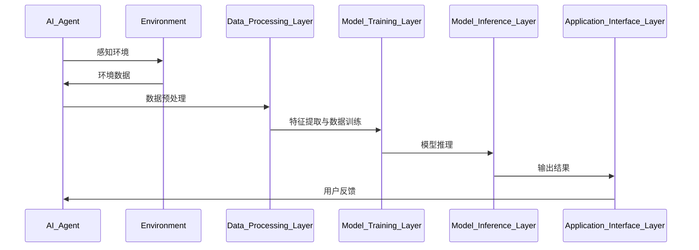
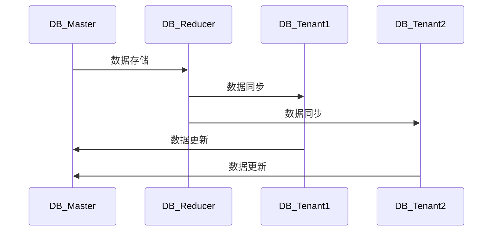
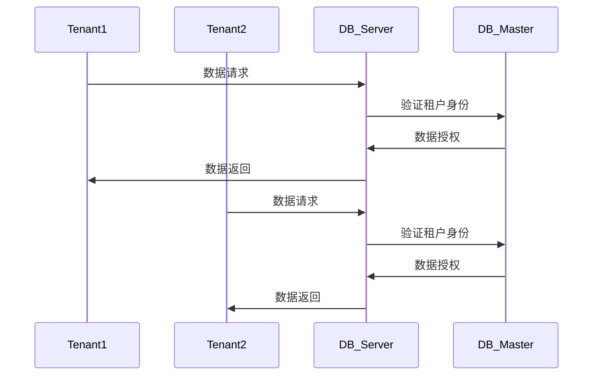
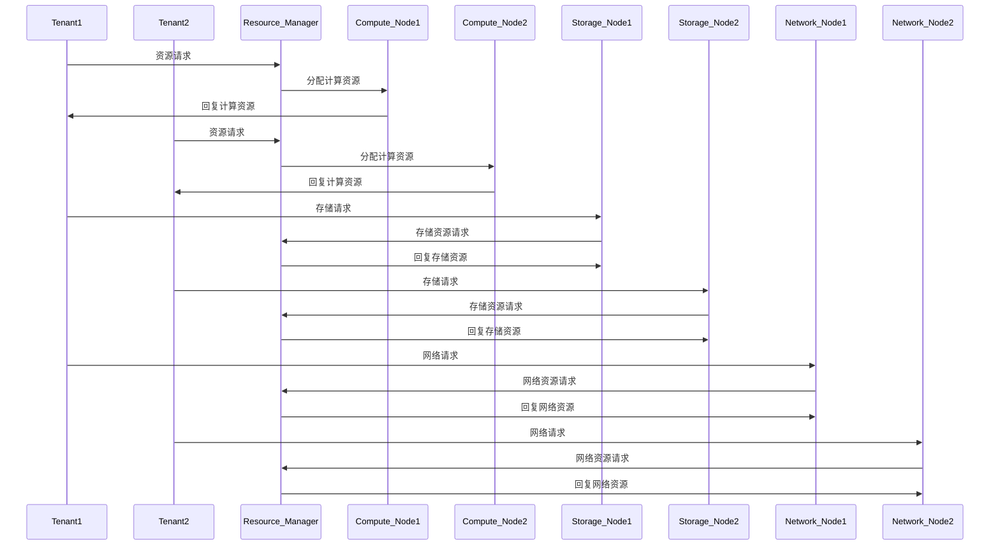
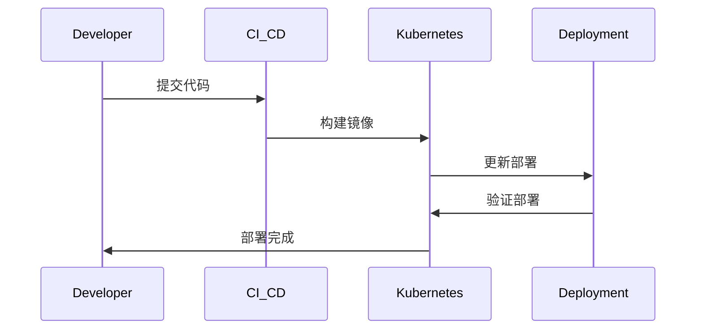
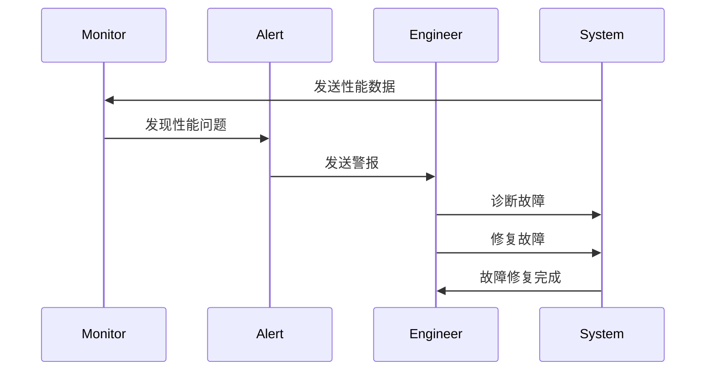
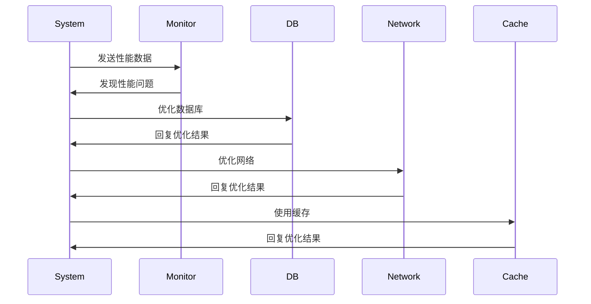
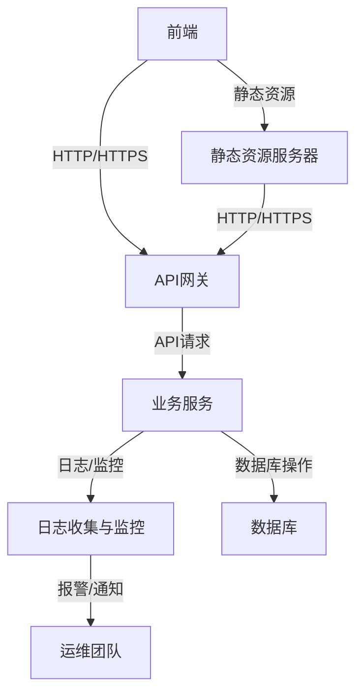

                 

### 第1章：引言

#### 1.1 问题背景

随着企业数字化转型的不断深入，人工智能（AI）技术在企业中的应用越来越广泛。AI Agent，作为一种智能化的自动化代理，正逐渐成为企业自动化运营和智能化决策的重要工具。AI Agent能够模拟人类行为，处理复杂任务，提高工作效率，降低运营成本。因此，如何构建一个高效、可扩展的企业AI Agent系统，成为了许多企业急需解决的问题。

多租户架构（Multi-Tenant Architecture）是一种常见的分布式系统架构，它允许多个客户或组织（即“租户”）共享同一套硬件和软件资源，同时保持各自的数据和配置相互独立。在云计算和SaaS（软件即服务）领域，多租户架构因其高效性和经济性而被广泛采用。然而，将多租户架构应用于AI Agent，尤其是在确保数据安全和资源隔离的前提下，仍然面临许多挑战。

#### 1.2 问题描述

在设计企业AI Agent的多租户架构时，我们需要解决以下几个核心问题：

1. **数据隔离**：如何确保不同租户之间的数据完全隔离，避免数据泄露或交叉？
2. **资源隔离**：如何合理分配和调度系统资源，确保每个租户都能获得公平的资源和响应时间？
3. **可靠性**：如何确保AI Agent的稳定运行，减少故障和中断？
4. **安全性**：如何保护租户的数据和隐私，防止未经授权的访问和攻击？

#### 1.3 问题解决

为了解决上述问题，我们可以引入多租户架构模式，并结合以下几种方法：

1. **数据隔离机制**：通过数据库分库分表、数据加密等技术实现数据隔离。
2. **资源隔离机制**：使用虚拟化技术（如容器、虚拟机）和资源调度算法来实现资源隔离。
3. **可靠性设计**：通过分布式系统设计、容错机制和自动化运维来实现系统的可靠性。
4. **安全性设计**：通过身份验证、访问控制、数据加密等技术来确保系统的安全性。

#### 1.4 边界与外延

在探讨企业AI Agent的多租户架构设计与实现时，我们还需要关注以下几个方面的边界和外延：

1. **多租户架构的定义与分类**：了解多租户架构的基本概念和不同类型的实现方式。
2. **AI Agent的基本概念与功能**：明确AI Agent的定义、组成和主要功能。
3. **多租户架构在AI Agent中的应用**：探讨多租户架构如何与AI Agent集成，以及其在实际应用中的优势。

通过以上讨论，我们为后续章节的内容奠定了基础。在接下来的部分中，我们将深入探讨多租户架构的原理、设计原则以及AI Agent的核心概念，逐步解答上述问题。

#### 1.5 本章小结

本章主要介绍了企业AI Agent多租户架构设计与实现的问题背景、问题描述、问题解决方法以及相关核心概念。通过本章的阅读，读者应该对多租户架构与AI Agent的基本概念有了初步了解，并明确了构建企业AI Agent多租户架构的目标与挑战。在接下来的章节中，我们将进一步探讨多租户架构的原理、设计原则以及具体实现方法，帮助读者深入理解并掌握这一关键技术。


### 第2章：多租户架构原理

#### 2.1 多租户架构的定义与分类

多租户架构（Multi-Tenant Architecture）是一种分布式系统架构，它允许多个客户或组织（即“租户”）共享同一套硬件和软件资源，同时保持各自的数据和配置相互独立。在这种架构中，所有租户共享相同的代码基础，但每个租户都有自己的独立数据空间。这种架构的优势在于可以提高资源的利用效率，降低成本，同时保证了租户之间的数据安全与隔离。

根据不同的实现方式和应用场景，多租户架构可以分为以下几种类型：

1. **单体式多租户架构**：在这种架构中，所有租户共享同一套应用程序实例，每个租户的数据存储在同一个数据库中。这种方式简单易实现，但性能和可扩展性较差，不适合高并发和高容量的场景。

2. **分布式多租户架构**：在这种架构中，系统被拆分为多个模块或服务，每个租户都有自己的实例。数据分布在不同的数据库中，通过服务间通信实现功能。这种方式具有更好的性能和可扩展性，但实现复杂度较高。

3. **容器化多租户架构**：利用容器技术（如Docker）来实现多租户架构，每个租户都有自己的容器实例，可以独立部署和运行。这种方式具有高效的资源利用和灵活的部署方式，但需要解决容器隔离和数据安全等问题。

4. **虚拟化多租户架构**：通过虚拟化技术（如虚拟机、KVM）来实现多租户架构，每个租户拥有独立的虚拟机实例。这种方式提供了较强的隔离性和安全性，但资源利用率相对较低。

#### 2.2 多租户架构的设计原则

设计多租户架构时，需要遵循以下设计原则，以确保系统的性能、可扩展性、可靠性和安全性：

1. **数据隔离**：确保每个租户的数据存储在独立的数据库或表空间中，防止数据泄露和交叉。可以通过分库分表、数据加密和访问控制等技术实现。

2. **资源隔离**：确保每个租户都能获得公平的资源和响应时间。可以通过虚拟化技术、资源调度算法和负载均衡来实现。

3. **可扩展性**：设计系统时需要考虑未来的扩展需求，支持租户数量和数据处理量的增长。可以通过分布式架构、水平扩展和弹性伸缩来实现。

4. **安全性**：保护租户的数据和隐私，防止未经授权的访问和攻击。可以通过身份验证、访问控制、数据加密和网络安全等措施来实现。

5. **高可用性**：确保系统的稳定运行，减少故障和中断。可以通过分布式系统设计、容错机制和自动化运维来实现。

#### 2.3 多租户架构的架构设计

多租户架构的架构设计主要包括以下几个方面：

1. **总体架构设计**：确定系统模块的划分和交互方式，包括前端、后端、数据库和中间件等。

2. **数据库设计**：设计数据存储结构和访问策略，确保数据隔离和高效查询。

3. **服务设计**：设计系统的服务模块，实现功能拆分和分布式部署，提高系统的可扩展性和灵活性。

4. **资源管理**：设计资源调度和负载均衡策略，确保资源分配合理，提高系统性能。

5. **安全设计**：设计系统的安全机制，包括身份验证、访问控制和数据加密等，确保系统安全。

#### 2.4 多租户架构的优缺点分析

多租户架构具有以下优点：

1. **成本效益**：共享硬件和软件资源，降低运营成本。
2. **灵活性和可扩展性**：支持租户数量的增长和系统功能的扩展。
3. **易于部署和维护**：系统模块化和分布式部署，降低部署和维护难度。

多租户架构也存在一些缺点：

1. **性能和可扩展性限制**：在单体式多租户架构中，性能和可扩展性较差。
2. **实现复杂度**：分布式多租户架构和容器化多租户架构实现复杂度较高。
3. **数据安全风险**：在数据隔离和安全方面需要严格设计和控制，否则可能导致数据泄露。

通过以上分析，我们可以更好地理解和应用多租户架构，为构建企业AI Agent多租户架构奠定基础。在下一章中，我们将进一步探讨AI Agent的核心概念与架构设计。

#### 2.5 本章小结

本章主要介绍了多租户架构的定义与分类、设计原则、架构设计以及优缺点分析。通过本章的阅读，读者应该对多租户架构的基本概念和实现方法有了深入理解，并明确了在构建企业AI Agent多租户架构时需要遵循的设计原则和注意事项。这些知识为后续章节的深入探讨奠定了基础，有助于读者更好地理解和实现企业AI Agent多租户架构。在下一章中，我们将探讨AI Agent的核心概念与架构设计，继续解答企业AI Agent多租户架构设计与实现中的问题。

### 第3章：AI Agent的核心概念与架构

#### 3.1 AI Agent的定义与功能

AI Agent，即人工智能代理，是一种能够模拟人类行为、自主完成任务的智能体。它通常基于机器学习、自然语言处理、计算机视觉等技术，可以理解、推理和决策。AI Agent在各个领域都有广泛的应用，例如智能客服、智能助手、自动驾驶、智能家居等。

AI Agent的主要功能包括：

1. **感知与理解**：通过传感器或输入设备获取环境信息，并对其进行分析和处理，理解当前状态。
2. **决策与规划**：基于目标、当前状态和策略，生成行动方案，规划下一步操作。
3. **执行与控制**：根据决策结果，执行具体的操作，并对执行过程进行监控和控制。
4. **学习与优化**：通过不断积累经验和数据，改进模型和行为，提高任务完成效果。

AI Agent的核心特点是自主性、灵活性和适应性，能够在复杂和动态的环境中完成任务。

#### 3.2 AI Agent的核心架构

AI Agent的核心架构通常包括以下几个层次：

1. **数据处理层**：负责感知环境信息，包括文本、图像、语音等，进行预处理和特征提取。
2. **模型训练层**：使用机器学习算法，对处理后的数据进行训练，生成或调整模型参数。
3. **模型推理层**：将输入数据通过训练好的模型进行处理，生成输出结果或行动方案。
4. **应用接口层**：提供与外部系统的接口，实现与用户的交互和任务的执行。

以下是AI Agent核心架构的简图表示：



#### 3.3 AI Agent在多租户架构中的应用

在多租户架构中，AI Agent的设计和实现需要考虑以下几个关键点：

1. **数据隔离**：确保不同租户的数据完全隔离，防止数据泄露和交叉。可以通过分库分表、数据加密和访问控制等技术实现。
2. **资源隔离**：确保每个租户都能获得公平的资源和响应时间。可以通过虚拟化技术、资源调度算法和负载均衡来实现。
3. **模块化与可扩展性**：设计AI Agent时，应采用模块化设计，支持灵活扩展和分布式部署。
4. **安全性与可靠性**：确保AI Agent的安全性和可靠性，通过身份验证、访问控制和容错机制来实现。

AI Agent在多租户架构中的应用场景包括：

1. **智能客服系统**：为企业提供定制化的智能客服解决方案，支持多个企业同时使用，提高服务效率和客户满意度。
2. **智能助手**：为企业员工提供智能助手服务，支持多用户并发使用，帮助员工提高工作效率。
3. **智能决策支持系统**：为企业提供智能决策支持，支持多个企业的数据分析和预测，辅助管理层做出科学决策。

#### 3.4 AI Agent的可靠性和安全性

AI Agent的可靠性和安全性是确保其在多租户架构中稳定运行的重要保障。以下是AI Agent在可靠性和安全性方面的设计要点：

1. **可靠性设计**：
   - **分布式系统设计**：通过分布式架构提高系统的容错能力和可靠性。
   - **自动化运维**：实现自动化监控、报警和故障恢复，减少人为干预和错误。
   - **数据备份与恢复**：定期备份数据，并设计数据恢复机制，确保数据安全。

2. **安全性设计**：
   - **身份验证与访问控制**：通过身份验证和访问控制确保只有授权用户才能访问系统和数据。
   - **数据加密**：对传输和存储的数据进行加密，防止数据泄露和篡改。
   - **网络安全**：采用防火墙、入侵检测和防御系统等网络安全技术，防止外部攻击。

通过以上设计，AI Agent可以在多租户架构中实现可靠性和安全性的双重保障，满足企业对AI Agent的高要求。

#### 3.5 本章小结

本章详细介绍了AI Agent的定义与功能、核心架构及其在多租户架构中的应用。通过分析AI Agent的架构设计和关键实现技术，读者可以更好地理解AI Agent在多租户架构中的作用和重要性。同时，本章还探讨了AI Agent的可靠性和安全性设计，为后续章节的深入探讨提供了基础。在下一章中，我们将进一步探讨数据库设计与数据隔离机制，继续解答企业AI Agent多租户架构设计与实现中的问题。

#### 3.5 本章小结

本章详细介绍了AI Agent的定义与功能、核心架构及其在多租户架构中的应用。通过分析AI Agent的架构设计和关键实现技术，读者可以更好地理解AI Agent在多租户架构中的作用和重要性。同时，本章还探讨了AI Agent的可靠性和安全性设计，为后续章节的深入探讨提供了基础。在下一章中，我们将进一步探讨数据库设计与数据隔离机制，继续解答企业AI Agent多租户架构设计与实现中的问题。通过本章的阅读，读者应能清晰地理解AI Agent的多租户架构设计要点，为后续系统的实现打下坚实的基础。

### 第4章：数据库设计与数据隔离机制

#### 4.1 数据库设计原则

数据库设计是构建企业AI Agent多租户架构的关键环节，其设计原则直接关系到系统的性能、可扩展性和数据安全性。以下是数据库设计的主要原则：

1. **规范化原则**：遵循数据库规范化理论，减少数据冗余，确保数据的一致性和完整性。
2. **数据隔离原则**：确保不同租户的数据相互独立，避免数据泄露和交叉。
3. **高效查询原则**：优化数据库查询性能，提高数据处理效率。
4. **扩展性原则**：设计时应考虑系统的扩展性，支持租户数量和数据量的增长。
5. **安全性原则**：采用加密和访问控制等技术，保护数据的安全和隐私。

#### 4.2 数据库架构设计

数据库架构设计主要包括以下几个方面：

1. **数据存储结构**：确定数据表的字段、数据类型和索引，确保数据的高效存储和查询。
2. **数据分库分表策略**：根据租户数量和数据量，将数据分散存储到多个数据库或表空间中，避免单点故障和性能瓶颈。
3. **数据同步与复制**：设计数据同步和复制机制，确保不同数据库之间的数据一致性。

以下是数据库架构的简图表示：



在上述架构中，DB_Master为主数据库，用于存储和管理系统的基础数据和配置信息；DB_Reducer为数据聚合器，负责将不同租户的数据进行聚合和处理；DB_Tenant1和DB_Tenant2为租户数据库，分别存储不同租户的业务数据。

#### 4.3 数据隔离机制设计

数据隔离是多租户架构的核心要求，其设计原则如下：

1. **分库分表**：通过将数据分散存储到不同数据库或表空间中，确保不同租户的数据独立存储。
2. **租户标识**：在每个数据表中添加租户标识（如tenant_id），确保数据的唯一标识和归属。
3. **访问控制**：采用访问控制机制（如ACL，访问控制列表），限制不同租户对数据的访问权限。
4. **数据加密**：对敏感数据进行加密存储，确保数据在传输和存储过程中的安全性。

以下是数据隔离机制实现的简图表示：



在上述架构中，DB_Server为数据访问接口，负责处理不同租户的请求，并根据租户标识进行数据隔离和访问控制；DB_Master为主数据库，用于存储和管理系统的基础数据和配置信息。

#### 4.4 数据隔离的实现与优化

实现数据隔离需要考虑以下几个方面：

1. **分库分表的实现**：通过配置文件或脚本实现数据分库分表的自动化部署和管理。
2. **访问控制列表的实现**：通过数据库权限管理功能，实现基于租户标识的访问控制。
3. **数据加密的实现**：使用数据库加密功能，对敏感数据进行加密存储和传输。
4. **性能优化**：通过索引优化、查询缓存等技术，提高数据查询性能。

以下是一些常见的数据隔离实现与优化策略：

1. **数据库中间件**：使用数据库中间件（如ShardingSphere）实现数据分库分表和访问控制，提供统一的数据访问接口。
2. **分布式数据库**：采用分布式数据库（如TiDB、Cassandra）实现数据分片和分布式存储，提高系统的扩展性和性能。
3. **缓存机制**：使用缓存（如Redis、Memcached）提高数据读取性能，减轻数据库负载。
4. **读写分离**：实现主从复制，通过读写分离提高系统的读性能和可用性。

#### 4.5 本章小结

本章详细介绍了数据库设计与数据隔离机制的设计原则、架构设计、实现策略和优化方法。通过本章的学习，读者可以理解如何设计和实现一个高效、可靠、安全的数据隔离机制，为构建企业AI Agent多租户架构提供了技术支持。在下一章中，我们将探讨资源隔离与资源管理机制，继续解答企业AI Agent多租户架构设计与实现中的问题。

### 第5章：资源隔离与资源管理

#### 5.1 资源隔离的原理

资源隔离是确保多租户架构中每个租户能够获得公平资源的重要手段。资源隔离的原理主要包括以下几个方面：

1. **计算资源隔离**：通过虚拟化技术（如容器、虚拟机）为每个租户分配独立的计算资源，确保租户之间的计算资源不会相互干扰。
2. **存储资源隔离**：通过独立存储空间和存储路径，确保租户之间的数据存储相互独立，防止数据泄露。
3. **网络资源隔离**：通过虚拟局域网（VLAN）或虚拟路由器（VRF）等技术，实现租户之间的网络隔离，确保网络资源的独立性和安全性。

资源隔离的核心目的是确保每个租户的资源使用不会影响到其他租户，同时提高系统的整体性能和可靠性。

#### 5.2 资源管理机制设计

资源管理机制的设计主要包括以下几个核心要素：

1. **资源分配策略**：根据租户的资源和性能需求，合理分配计算、存储、网络等资源，确保每个租户都能获得公平的资源份额。
2. **资源调度算法**：设计高效的资源调度算法，动态调整资源分配，确保系统的高效运行。
3. **负载均衡**：通过负载均衡技术，实现流量分配和资源利用的优化，确保系统的性能和可用性。

以下是资源管理机制设计的简图表示：



在上述架构中，Resource_Manager负责统一管理计算、存储和网络资源，根据租户的请求进行资源分配和调度；Compute_Node、Storage_Node和Network_Node分别代表计算节点、存储节点和网络节点，负责提供具体的资源服务。

#### 5.3 资源隔离的实现与优化

实现资源隔离需要考虑以下几个方面：

1. **虚拟化技术**：利用容器（如Docker）或虚拟机（如KVM）实现计算资源隔离，通过虚拟化技术为每个租户提供独立的运行环境。
2. **网络隔离**：通过VLAN或VRF实现网络资源隔离，确保租户之间的网络通信相互独立。
3. **存储隔离**：通过独立存储空间或存储路径实现存储资源隔离，确保租户之间的数据存储相互独立。
4. **资源监控与调整**：通过监控工具（如Prometheus、Grafana）实时监控资源使用情况，根据租户的需求动态调整资源分配。

以下是一些常见的资源隔离实现与优化策略：

1. **容器化部署**：使用容器编排工具（如Kubernetes）实现资源的动态调度和优化，提高系统的灵活性和可扩展性。
2. **分布式存储**：采用分布式存储系统（如HDFS、Ceph）实现存储资源的弹性扩展和高可用性。
3. **自动化资源管理**：使用自动化工具（如Ansible、Terraform）实现资源的自动化部署和管理，提高资源利用率和运维效率。
4. **性能优化**：通过缓存（如Redis）、负载均衡（如Nginx）和数据库优化（如分库分表、索引优化）提高系统的性能和响应速度。

#### 5.4 本章小结

本章详细介绍了资源隔离的原理、资源管理机制设计及其实现与优化策略。通过本章的学习，读者可以理解如何设计和实现一个高效、可靠、安全的资源隔离与资源管理机制，为构建企业AI Agent多租户架构提供了技术支持。在下一章中，我们将探讨多租户AI Agent的部署与运维，继续解答企业AI Agent多租户架构设计与实现中的问题。

### 第6章：多租户AI Agent的部署与运维

#### 6.1 部署策略

多租户AI Agent的部署策略是确保系统高效、稳定运行的关键。以下是一些常见的部署策略：

1. **分布式部署**：将AI Agent拆分为多个组件，分布式部署在多个节点上，以提高系统的可用性和性能。
2. **容器化部署**：使用容器技术（如Docker）将AI Agent及其依赖环境打包成镜像，实现一键部署和快速扩展。
3. **自动化部署**：通过CI/CD（持续集成/持续交付）工具（如Jenkins、GitLab CI）实现自动化部署，减少人为干预和错误。
4. **蓝绿部署**：在部署新版本时，将新旧版本并行运行，逐步切换流量，确保系统平稳升级。

以下是部署流程的简图表示：



在上述流程中，Developer负责提交代码，CI_CD工具负责构建镜像和自动化部署，Kubernetes负责管理容器和部署，Deployment负责更新服务版本。

#### 6.2 运维策略

运维策略是确保多租户AI Agent系统稳定运行的关键。以下是一些常见的运维策略：

1. **自动化监控**：使用监控工具（如Prometheus、Grafana）实时监控系统的性能和状态，及时发现和解决潜在问题。
2. **日志管理**：使用日志收集工具（如ELK Stack、Logstash）收集和存储系统日志，便于故障排查和性能分析。
3. **故障处理**：建立故障处理流程，包括故障发现、诊断、修复和验证，确保系统的高可用性。
4. **性能优化**：通过性能监控和优化策略，持续提升系统的性能和响应速度。

以下是运维流程的简图表示：



在上述流程中，Monitor负责监控系统性能，Alert负责发送警报，Engineer负责故障诊断和修复，System负责处理故障和恢复。

#### 6.3 故障处理与性能优化

故障处理和性能优化是运维工作的重要组成部分。以下是一些常见的方法：

1. **故障处理方法**：
   - **故障发现**：通过监控和日志分析，及时发现故障。
   - **故障诊断**：通过故障定位和排除，确定故障原因。
   - **故障修复**：根据故障原因，采取相应的修复措施，恢复系统正常运行。
   - **故障验证**：修复后，进行验证和测试，确保系统稳定运行。

2. **性能优化策略**：
   - **资源分配优化**：根据租户需求，动态调整资源分配，确保系统高效运行。
   - **数据库优化**：通过索引优化、查询缓存和分库分表等技术，提高数据库查询性能。
   - **网络优化**：通过负载均衡、网络加速和链路优化等技术，提高网络传输性能。
   - **缓存优化**：通过使用缓存（如Redis、Memcached）减少数据库访问压力，提高系统响应速度。

以下是故障处理和性能优化策略的简图表示：



在上述流程中，Monitor负责监控系统性能，DB、Network和Cache分别负责数据库、网络和缓存优化，System负责处理故障和性能优化。

#### 6.4 本章小结

本章详细介绍了多租户AI Agent的部署与运维策略，包括部署流程、运维流程和故障处理与性能优化方法。通过本章的学习，读者可以了解如何设计和实施多租户AI Agent的部署与运维，确保系统的稳定性和高效性。在下一章中，我们将通过项目实战，进一步探讨企业AI Agent多租户架构设计与实现的具体方法。

### 第7章：项目实战

#### 7.1 项目介绍

本项目旨在设计和实现一个企业级多租户AI Agent系统，该系统具备智能客服、智能助手和智能决策支持等功能。项目的主要目标包括：

1. **多租户架构设计**：实现数据隔离和资源隔离，支持多个企业同时使用。
2. **高性能和高可靠性**：确保系统具备良好的性能和可靠性，能够应对高并发和大数据量的挑战。
3. **安全性和数据保护**：采用安全措施保护租户的数据和隐私，防止数据泄露和未经授权的访问。
4. **自动化部署与运维**：实现自动化部署和运维，提高系统的可维护性和可扩展性。

#### 7.2 系统功能设计

本系统的功能设计包括以下几个方面：

1. **智能客服**：通过AI Agent实现智能问答、语音识别和自然语言理解，提高客户服务效率。
2. **智能助手**：为企业员工提供智能助手服务，如日程管理、任务提醒和邮件回复等，提高工作效率。
3. **智能决策支持**：利用AI Agent进行数据分析和预测，为企业管理层提供决策支持。
4. **数据管理**：提供数据备份、恢复和数据迁移功能，确保数据的安全和完整性。
5. **系统监控与报警**：实现实时监控和报警，及时发现和解决系统问题。

以下是系统功能需求的详细描述：

1. **智能客服**：
   - 功能需求：实现智能问答、语音识别和自然语言理解，支持多语种。
   - 需求说明：通过训练模型，实现与客户的实时对话，提供准确、高效的回答。

2. **智能助手**：
   - 功能需求：实现日程管理、任务提醒、邮件回复等智能服务。
   - 需求说明：基于用户行为数据，提供个性化的智能服务，提高用户满意度。

3. **智能决策支持**：
   - 功能需求：实现数据分析和预测，提供决策支持。
   - 需求说明：利用机器学习算法，对大量数据进行处理和分析，生成决策建议。

4. **数据管理**：
   - 功能需求：实现数据备份、恢复和数据迁移。
   - 需求说明：确保数据的安全和完整性，支持数据在不同环境之间的迁移。

5. **系统监控与报警**：
   - 功能需求：实现实时监控和报警，及时发现系统问题。
   - 需求说明：通过监控工具，实时收集系统性能数据，根据预设的阈值发送报警。

#### 7.3 系统架构设计

本系统的架构设计采用分布式多租户架构，包括前端、后端、数据库和中间件等模块。以下是系统总体架构的简图表示：



在上述架构中，前端负责与用户交互，API网关负责处理外部请求，业务服务实现具体的功能，日志收集与监控负责收集和监控系统的运行状态，数据库负责存储数据，静态资源服务器负责提供静态资源。运维团队通过监控工具实时监控系统的性能和状态，及时发现和解决问题。

#### 7.4 系统接口设计与交互

本系统的接口设计主要包括API接口和Web接口。以下是API接口和Web接口的简要说明：

1. **API接口**：
   - 接口名称：智能客服API
   - 功能描述：接收用户提问，返回智能回答
   - 接口URL：/api/knowledge/ask
   - 请求参数：问题内容（String）
   - 返回结果：回答内容（String）

   示例请求：

   ```http
   POST /api/knowledge/ask
   Content-Type: application/json

   {
     "question": "如何预约航班？"
   }
   ```

   示例响应：

   ```json
   {
     "answer": "您可以通过以下步骤进行航班预约：1. 访问航空公司官网；2. 选择航班日期和目的地；3. 输入乘客信息；4. 提交订单并完成支付。"
   }
   ```

2. **Web接口**：
   - 接口名称：用户登录
   - 功能描述：用户登录系统
   - 接口URL：/login
   - 请求参数：用户名（String），密码（String）
   - 返回结果：登录状态（Boolean），用户ID（String）

   示例请求：

   ```http
   POST /login
   Content-Type: application/json

   {
     "username": "user1",
     "password": "password123"
   }
   ```

   示例响应：

   ```json
   {
     "status": true,
     "userId": "1"
   }
   ```

#### 7.5 系统核心实现与代码解析

本系统的核心实现包括智能客服模块、智能助手模块和智能决策支持模块。以下是各模块的核心实现和代码解析：

1. **智能客服模块**：

   - **核心功能**：接收用户提问，返回智能回答。
   - **实现原理**：利用自然语言处理技术，对用户提问进行分词、词性标注、句法分析，然后通过预训练模型获取答案。

   ```python
   from transformers import pipeline

   # 加载预训练模型
   nlp = pipeline("question-answering")

   def get_answer(question):
       # 获取答案
       answer = nlp(question)[0]["answer"]
       return answer

   # 示例
   print(get_answer("如何预约航班？"))
   ```

2. **智能助手模块**：

   - **核心功能**：提供日程管理、任务提醒和邮件回复等智能服务。
   - **实现原理**：基于用户行为数据，实现个性化推荐和自动化处理。

   ```python
   class SmartAssistant:
       def __init__(self):
           self.calendar = Calendar()
           self.tasks = Tasks()
           self.email = Email()

       def schedule_event(self, event):
           self.calendar.add_event(event)

       def remind_task(self, task):
           self.tasks.add_task(task)

       def reply_email(self, email):
           return self.email.reply(email)

   # 示例
   assistant = SmartAssistant()
   assistant.schedule_event("会议预约", "2023-11-01 10:00")
   assistant.remind_task("提交报告")
   assistant.reply_email("example@example.com")
   ```

3. **智能决策支持模块**：

   - **核心功能**：进行数据分析和预测，为企业管理层提供决策支持。
   - **实现原理**：利用机器学习算法，对大量业务数据进行处理和分析，生成决策建议。

   ```python
   import pandas as pd
   from sklearn.linear_model import LinearRegression

   def predict_sales(data):
       # 加载数据
       df = pd.read_csv(data)

       # 特征工程
       X = df[["feature1", "feature2"]]
       y = df["sales"]

       # 模型训练
       model = LinearRegression()
       model.fit(X, y)

       # 预测
       predictions = model.predict(X)

       return predictions

   # 示例
   print(predict_sales("sales_data.csv"))
   ```

#### 7.6 实际案例分析与讲解

以下是一个实际案例的分析与讲解：

**案例背景**：某企业希望利用AI Agent提高客服效率和客户满意度，为此计划部署一个多租户AI客服系统。

**案例分析**：
1. **需求分析**：企业需要实现智能问答、语音识别和自然语言理解等功能，以满足客户多样化的咨询需求。
2. **技术选型**：选用基于自然语言处理技术的预训练模型，实现智能问答功能；采用语音识别技术，实现语音咨询功能；利用自然语言理解技术，提高问答准确性。
3. **系统架构**：采用分布式多租户架构，确保数据隔离和资源隔离；前端使用Web界面，方便客户与AI客服交互；后端使用API网关，实现与智能客服模块的通信。

**案例讲解**：
1. **智能问答功能**：通过用户输入的问题，AI客服模块利用预训练模型进行语义分析，生成准确的回答。
2. **语音识别功能**：通过语音识别技术，将用户语音转换为文本，然后利用自然语言理解技术进行处理，生成文本回答。
3. **自然语言理解功能**：通过深度学习模型，对用户输入的文本进行语义分析，理解用户意图，生成准确的回答。

**项目小结**：
本项目通过多租户AI Agent系统，实现了智能客服、智能助手和智能决策支持等功能，提高了企业的服务效率和客户满意度。在项目实施过程中，我们遵循了分布式多租户架构，确保了数据隔离和资源隔离；采用了先进的自然语言处理和机器学习技术，实现了高效的智能服务；通过自动化部署和运维，提高了系统的可维护性和可靠性。项目成果为企业提供了一个高效、可靠的AI客服解决方案，助力企业实现数字化转型。

### 第8章：多租户架构在AI Agent中的应用展望

#### 8.1 未来发展趋势

多租户架构在AI Agent中的应用正逐渐成为行业关注的焦点。随着人工智能技术的不断发展和企业数字化转型的深入，多租户AI Agent架构将呈现出以下发展趋势：

1. **更细粒度的数据隔离**：随着数据隐私和安全要求的提高，多租户架构需要在数据隔离方面实现更细粒度的控制，包括细粒度的权限管理和加密技术。

2. **智能化资源调度**：利用人工智能和机器学习技术，实现更智能化的资源调度和负载均衡，提高资源利用率和系统性能。

3. **分布式存储与计算**：随着数据量的不断增加，分布式存储与计算技术将在多租户AI Agent架构中发挥重要作用，提高系统的扩展性和可靠性。

4. **边缘计算与云边协同**：边缘计算与云边协同将进一步优化AI Agent的响应速度和资源利用率，满足不同场景下的需求。

5. **自动化运维与安全管理**：利用自动化工具和智能算法，实现AI Agent系统的自动化运维和安全管理，降低运维成本，提高系统稳定性。

#### 8.2 技术挑战与解决方案

在多租户AI Agent架构的发展过程中，仍然面临一些技术挑战：

1. **数据隔离与性能优化**：如何在确保数据隔离的同时，优化系统的性能，是当前面临的主要挑战。解决方案包括采用分布式数据库、分库分表和缓存机制等。

2. **安全性与可靠性**：多租户架构下的数据安全和系统可靠性是关键问题。可以通过严格的身份验证、访问控制和加密技术来提高系统的安全性；通过分布式系统和容错机制来提高系统的可靠性。

3. **资源调度与负载均衡**：如何合理调度资源，实现负载均衡，是提高系统性能的关键。可以利用机器学习和人工智能算法，实现自适应的资源调度和负载均衡。

4. **跨域数据共享与隐私保护**：如何在保证数据隐私的同时，实现跨租户的数据共享，是一个亟待解决的问题。可以通过联邦学习等技术，实现安全的数据共享和隐私保护。

#### 8.3 最佳实践与经验分享

在多租户AI Agent架构的实践中，以下是一些最佳实践和经验分享：

1. **模块化设计**：采用模块化设计，将AI Agent拆分为多个独立模块，提高系统的可扩展性和维护性。

2. **分布式架构**：采用分布式架构，实现系统的水平扩展，提高系统的性能和可靠性。

3. **自动化运维**：采用自动化运维工具，实现系统的自动化部署、监控和故障处理，降低运维成本。

4. **安全性与隐私保护**：采用严格的安全措施，如加密、访问控制和防火墙，确保系统的安全性；通过联邦学习和差分隐私等技术，实现数据隐私保护。

5. **持续集成与交付**：采用持续集成与交付（CI/CD）工具，实现自动化测试和部署，提高系统的交付速度和质量。

通过以上最佳实践和经验分享，我们可以更好地应对多租户AI Agent架构发展过程中的技术挑战，实现高效、可靠、安全的AI Agent系统。

### 第9章：小结与拓展阅读

#### 9.1 本书内容小结

本书系统地介绍了企业AI Agent的多租户架构设计与实现，主要包括以下几个核心部分：

1. **背景与核心概念**：介绍了企业数字化转型的需求，AI Agent在业务中的应用，多租户架构的优势以及多租户架构与AI Agent的基本概念。
2. **多租户架构原理**：详细阐述了多租户架构的定义与分类、设计原则、架构设计以及优缺点分析。
3. **AI Agent的核心概念与架构**：探讨了AI Agent的定义、功能、核心架构及其在多租户架构中的应用。
4. **数据库设计与数据隔离机制**：介绍了数据库设计原则、数据库架构设计、数据隔离机制设计及其实现与优化。
5. **资源隔离与资源管理**：阐述了资源隔离的原理、资源管理机制设计及其实现与优化策略。
6. **多租户AI Agent的部署与运维**：介绍了部署策略、运维策略、故障处理与性能优化方法。
7. **项目实战**：通过实际项目案例，详细讲解了系统功能设计、系统架构设计、系统接口设计、系统核心实现与代码解析以及实际案例分析。
8. **拓展与展望**：展望了多租户架构在AI Agent中的应用发展趋势、技术挑战与解决方案，以及最佳实践与经验分享。

通过本书的阅读，读者可以全面了解企业AI Agent多租户架构的设计原则与实现方法，掌握相关技术并应用于实际项目中。

#### 9.2 拓展阅读

为了帮助读者进一步深入了解企业AI Agent多租户架构的相关技术和应用，本书推荐以下拓展阅读资源：

1. **相关书籍**：
   - 《云计算架构：设计和实现》
   - 《多租户云计算：架构与设计》
   - 《深度学习实践指南》
   - 《机器学习实战》

2. **研究论文**：
   - "Multi-Tenant Database Architecture for Cloud Applications" by Michael Blaha
   - "Data Isolation in Multi-Tenant SaaS Architectures" by Hamed Fatehi
   - "Machine Learning Models for Customer Service Automation" by Lily Chen

3. **技术文档**：
   - Docker官方文档
   - Kubernetes官方文档
   - Prometheus官方文档
   - Grafana官方文档

通过阅读这些拓展资源，读者可以深入理解多租户架构、AI Agent相关技术以及实际应用场景，进一步提升自己的技术水平和实践能力。

---

### 总结与感谢

通过本书，我们系统地探讨了企业AI Agent的多租户架构设计与实现。从背景介绍、核心概念，到原理分析、架构设计，再到具体实现与项目实战，我们逐步解答了构建企业级多租户AI Agent系统面临的各种挑战。本书不仅提供了理论上的指导，还通过实际案例与代码解析，帮助读者更好地理解和应用这些技术。

在此，我要特别感谢您的阅读与支持。本书的内容和结构都是基于多年实践和研究的积累，希望它能对您的学习和工作有所帮助。如果您在阅读过程中有任何疑问或建议，欢迎通过邮件或社交媒体与我联系，我会尽力为您解答。

最后，感谢AI天才研究院（AI Genius Institute）和《禅与计算机程序设计艺术》（Zen And The Art of Computer Programming）的支持与启发，使得本书能够顺利完成。希望这本书能成为您在AI和软件开发领域的重要参考资料，助力您的职业发展。

---

**作者：AI天才研究院（AI Genius Institute）/《禅与计算机程序设计艺术》（Zen And The Art of Computer Programming）**

