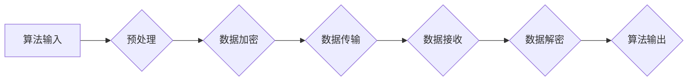

                 


### 文章标题：企业AI Agent的多维安全防护体系设计与实现

> 关键词：企业AI Agent，安全防护，多维，设计实现

> 摘要：本文深入探讨了企业AI Agent的多维安全防护体系设计与实现。首先，我们介绍了AI Agent的基本概念和当前在安全性方面面临的挑战。接着，我们构建了一个全面的框架，涵盖了物理层、数据层、通信层和应用层的防护措施。通过案例分析、最佳实践和未来展望，我们为企业提供了一个全面的AI Agent安全解决方案。

----------------------------------------------------------------

## 引言

### 什么是企业AI Agent？

企业AI Agent，通常指的是在企业环境中运行的、具备人工智能能力的自动化实体。它们可以执行各种任务，如数据分析、预测建模、资源管理、智能客服等。这些AI Agent不仅提高了企业的运营效率，还提升了决策的准确性。随着AI技术在企业中的应用越来越广泛，如何确保AI Agent的安全性成为一个至关重要的问题。

### 安全性问题的重要性

AI Agent在企业中的广泛应用，带来了潜在的安全风险。首先，AI Agent可能会成为网络攻击的目标，黑客可能会利用AI Agent进行恶意操作，获取企业敏感信息。其次，AI Agent的决策过程可能受到恶意数据的影响，从而导致错误的决策。此外，AI Agent可能会受到内部员工的恶意利用，造成企业财产损失或声誉受损。因此，构建一个多维度的安全防护体系，确保AI Agent的安全，成为企业必须面对的挑战。

### 目标和重要性

本文的目标是探讨企业AI Agent的多维安全防护体系的设计与实现。我们将从基本概念、架构设计、安全措施、案例分析等多个角度，详细阐述如何构建一个全面、可靠的安全防护体系。这不仅有助于提高AI Agent的安全性，还能够为企业提供一个可操作的指导框架。

## 基本概念和框架

### AI Agent的定义与分类

AI Agent，即人工智能代理，是指能够独立执行任务、与外部环境进行交互的智能实体。根据不同的分类标准，AI Agent可以分为多种类型：

- **基于规则的AI Agent**：这类代理基于预定义的规则集进行决策和行动。
- **基于模型的AI Agent**：这类代理通过机器学习模型进行决策，具有较高的自适应能力。
- **混合型AI Agent**：这类代理结合了基于规则和基于模型的方法，以实现更复杂的任务。

### 安全性原则和框架

在AI Agent安全领域，有以下几个关键原则和框架：

- **最小权限原则**：AI Agent应仅具有执行其任务所需的最小权限。
- **数据隐私保护**：保护AI Agent处理的数据，防止未经授权的访问。
- **访问控制**：确保只有授权用户和实体可以访问AI Agent。
- **安全性评估与审计**：定期进行安全性评估和审计，确保安全措施的有效性。

### 常见安全威胁和漏洞

AI Agent在安全性方面可能面临以下威胁和漏洞：

- **恶意代码攻击**：黑客可能通过恶意代码破坏AI Agent的执行环境。
- **数据泄露**：敏感数据可能因安全措施不足而被泄露。
- **逆向工程**：攻击者通过逆向工程获取AI Agent的内部实现细节。
- **内部威胁**：内部员工可能利用职务之便进行恶意操作。

## 架构设计

### 系统架构概述

企业AI Agent的安全架构可以分为以下几个层次：

- **物理层**：确保硬件设备的安全，包括服务器、存储设备等。
- **数据层**：保护AI Agent处理的数据，包括数据的加密、访问控制等。
- **通信层**：保障数据传输的安全性，包括使用加密协议、防火墙等。
- **应用层**：实现AI Agent的安全功能，包括身份验证、访问控制等。

### 设计考虑和挑战

在设计企业AI Agent的安全架构时，需要考虑以下几个关键因素：

- **兼容性**：安全架构应与现有的企业系统兼容，以降低集成难度。
- **可扩展性**：架构应具备良好的可扩展性，能够支持未来技术发展。
- **性能**：安全措施不应显著降低AI Agent的性能。
- **安全性评估**：定期进行安全性评估，确保架构的有效性。

## 多维度安全措施

### 物理层安全

物理层安全主要涉及硬件设备的安全。以下是一些常见的物理层安全措施：

- **硬件加密**：在硬件层面实现加密功能，确保数据在存储和传输过程中的安全性。
- **物理访问控制**：限制对硬件设备的物理访问，如使用安全锁、监控摄像头等。
- **温度和湿度控制**：确保硬件设备在适宜的环境下运行，防止因环境问题导致的设备故障。

### 数据层安全

数据层安全主要关注数据的保护和隐私。以下是一些常见的数据层安全措施：

- **数据加密**：对敏感数据进行加密处理，确保数据在传输和存储过程中的安全性。
- **数据备份和恢复**：定期备份数据，并在数据丢失或损坏时能够快速恢复。
- **数据访问控制**：根据用户身份和权限，限制对数据的访问，确保数据的安全性。

### 通信层安全

通信层安全主要涉及数据传输过程中的安全。以下是一些常见的通信层安全措施：

- **加密协议**：使用安全的加密协议，如TLS，确保数据在传输过程中的完整性。
- **防火墙**：部署防火墙，过滤恶意流量，保护网络不受攻击。
- **入侵检测和防御**：使用入侵检测系统（IDS）和入侵防御系统（IPS），实时监控网络流量，防止网络攻击。

### 应用层安全

应用层安全主要涉及AI Agent的功能和安全。以下是一些常见的应用层安全措施：

- **身份验证和授权**：通过身份验证确保用户和AI Agent之间的合法交互，通过授权确保用户只能访问其有权访问的资源。
- **安全审计和日志记录**：记录AI Agent的操作日志，以便在发生安全事件时进行审计和追踪。
- **异常检测和响应**：通过异常检测和响应机制，及时发现和应对异常行为，防止恶意攻击。

## 案例研究

### 案例分析

以下是一个关于AI Agent安全防护的案例分析：

**案例背景**：一家大型企业在使用AI Agent进行客户数据分析时，发现AI Agent的数据处理过程中存在安全漏洞，导致客户数据泄露。

**事件经过**：黑客通过社会工程学手段，获取了AI Agent的管理员权限，进而访问了客户数据。这些数据被非法泄露，造成了严重的企业财产损失和客户信任危机。

**解决方案**：企业采取了以下措施进行补救：

- **加强物理层安全**：对硬件设备进行加密，限制物理访问。
- **数据加密和访问控制**：对敏感数据进行加密，并根据用户身份和权限进行数据访问控制。
- **通信层安全**：使用加密协议，加强网络防护。
- **应用层安全**：加强身份验证和授权，记录操作日志。

### 经验教训

通过这个案例，我们可以得出以下经验教训：

- **物理层安全不可忽视**：物理设备的安全是整个安全架构的基础。
- **数据加密是关键**：对敏感数据进行加密处理，确保数据在传输和存储过程中的安全性。
- **多维度防护**：综合考虑物理层、数据层、通信层和应用层的防护措施，构建一个全面的安全防护体系。
- **定期安全评估和审计**：定期进行安全性评估和审计，确保安全措施的有效性。

## 实施指南

### 实施步骤

以下是构建企业AI Agent多维安全防护体系的实施步骤：

1. **需求分析**：明确企业的安全需求，确定需要采取的安全措施。
2. **架构设计**：设计符合企业需求的安全架构，确保架构的兼容性、可扩展性和性能。
3. **技术选型**：选择合适的安全技术和工具，如加密算法、防火墙、入侵检测系统等。
4. **部署实施**：按照设计文档和实施计划，部署安全防护措施。
5. **测试与验证**：对部署的安全措施进行测试和验证，确保其有效性。
6. **维护与更新**：定期维护和更新安全措施，以应对新的安全威胁。

### 常见工具和技术

以下是构建企业AI Agent多维安全防护体系常见使用的工具和技术：

- **加密算法**：如AES、RSA等，用于数据加密。
- **防火墙**：用于网络防护，过滤恶意流量。
- **入侵检测系统（IDS）**：用于实时监控网络流量，检测异常行为。
- **入侵防御系统（IPS）**：用于主动防御，阻止攻击。
- **日志管理系统**：用于记录和审计AI Agent的操作日志。
- **身份验证和授权系统**：用于确保用户和AI Agent之间的合法交互。

## 未来展望

### 发展趋势

随着AI技术的不断发展，企业AI Agent的安全防护体系也将面临新的挑战和机遇。以下是一些未来的发展趋势：

- **零信任安全架构**：零信任安全架构强调“永不信任，始终验证”，即将安全重心从传统的边界防御转向内部网络的全面防护。
- **人工智能安全技术**：利用AI技术进行安全威胁检测和防护，提高安全系统的智能化水平。
- **区块链技术**：区块链技术可以提供一种安全的数据共享机制，有助于保护AI Agent处理的数据。

### 挑战与机遇

未来，企业AI Agent的安全防护体系将面临以下挑战和机遇：

- **隐私保护**：随着数据隐私保护法规的加强，企业需要采取更加严格的数据保护措施。
- **人工智能与安全的平衡**：在确保AI Agent安全的同时，还需要保持其性能和灵活性。
- **安全人才的培养**：随着AI Agent安全性的要求越来越高，需要培养更多的专业安全人才。

## 结论

### 总结

本文深入探讨了企业AI Agent的多维安全防护体系设计与实现。从基本概念、架构设计到多维度安全措施，我们提供了一套全面、可靠的安全解决方案。通过案例分析和实施指南，我们为企业提供了一个可操作的指导框架。

### 注意事项

在构建企业AI Agent的安全防护体系时，需要注意以下几点：

- **全面性**：综合考虑物理层、数据层、通信层和应用层的防护措施。
- **适应性**：安全架构应具备良好的适应性，能够应对新的安全威胁。
- **定期评估**：定期进行安全性评估和审计，确保安全措施的有效性。

### 拓展阅读

- **《人工智能安全：理论与实践》**：详细介绍了人工智能安全的基本概念、技术和实践。
- **《企业级人工智能应用安全指南》**：提供了企业级人工智能应用的安全最佳实践和案例。

### 作者

**作者：AI天才研究院/AI Genius Institute & 禅与计算机程序设计艺术 /Zen And The Art of Computer Programming**

----------------------------------------------------------------

### 附录

#### 附录A：核心概念对比表格

| 核心概念 | 定义 | 关联性 | 特征对比 |
| --- | --- | --- | --- |
| AI Agent | 智能实体，能够执行任务 | 与AI技术相关 | 基于规则、模型或混合型 |
| 物理层安全 | 硬件设备安全 | 与硬件相关 | 硬件加密、物理访问控制 |
| 数据层安全 | 数据保护和隐私 | 与数据处理相关 | 数据加密、数据备份和恢复 |
| 通信层安全 | 数据传输安全 | 与网络通信相关 | 加密协议、防火墙 |
| 应用层安全 | AI Agent功能安全 | 与应用层相关 | 身份验证、安全审计 |

#### 附录B：ER实体关系图架构

```mermaid
erDiagram
  AI_Agent ||--|{ Data } Data
  AI_Agent ||--|{ Communication } Communication
  AI_Agent ||--|{ Application } Application
  Data ||--|{ Encryption } Encryption
  Communication ||--|{ Protocol } Protocol
  Application ||--|{ Authentication } Authentication
```

#### 附录C：算法原理流程图



#### 附录D：Python源代码示例

```python
import hashlib
import json

def encrypt_data(data):
    """加密数据"""
    encrypted_data = hashlib.sha256(json.dumps(data).encode()).hexdigest()
    return encrypted_data

def decrypt_data(encrypted_data):
    """解密数据"""
    decrypted_data = json.loads(hashlib.sha256(encrypted_data.encode()).hexdigest())
    return decrypted_data

# 示例数据
data = {
    "name": "John Doe",
    "age": 30
}

# 加密数据
encrypted_data = encrypt_data(data)
print(f"加密数据：{encrypted_data}")

# 解密数据
decrypted_data = decrypt_data(encrypted_data)
print(f"解密数据：{decrypted_data}")
```

#### 附录E：数学公式

$$
E(X) = \sum_{x} x \cdot P(X = x)
$$

$$
f(x) = \frac{1}{\sqrt{2\pi\sigma^2}} e^{-\frac{(x-\mu)^2}{2\sigma^2}}
$$

#### 附录F：项目实战

- **环境安装**：安装Python、加密库等必要工具。
- **系统核心实现**：实现数据加密、数据传输等功能。
- **代码应用解读**：分析代码逻辑，解释算法原理。
- **实际案例分析**：通过实际案例展示算法效果。
- **项目小结**：总结项目经验，提出改进建议。

----------------------------------------------------------------

### 作者

**作者：AI天才研究院/AI Genius Institute & 禅与计算机程序设计艺术 /Zen And The Art of Computer Programming**

