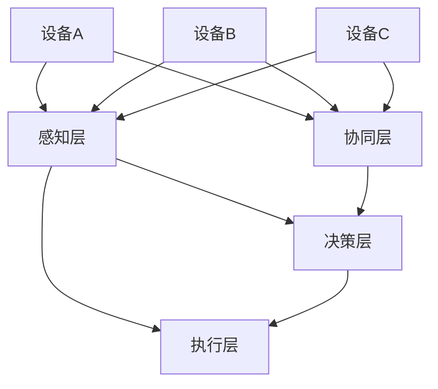
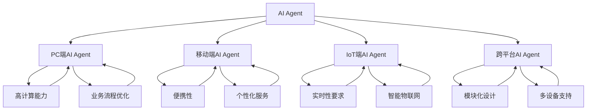
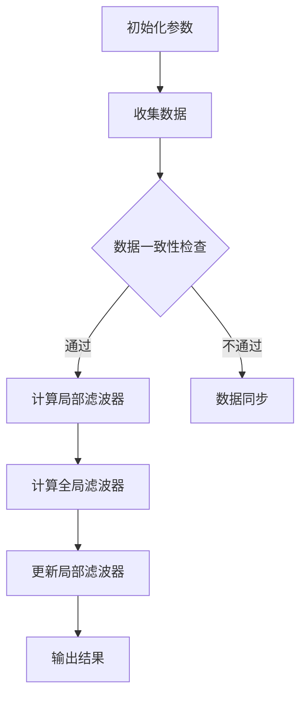
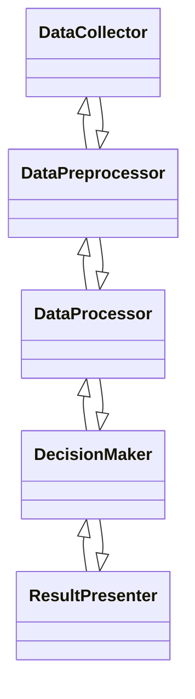
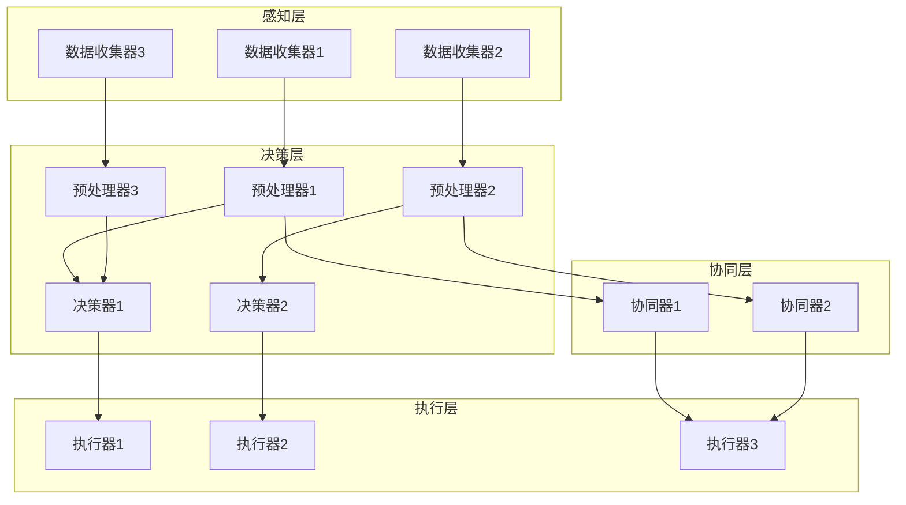
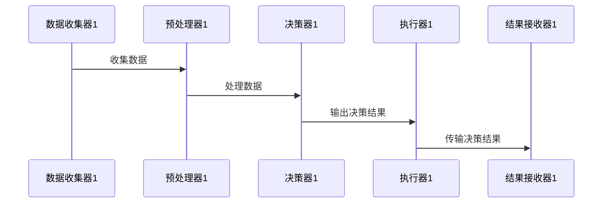

                 

### 第一部分：背景与概述

#### 第1章：企业AI Agent的多设备支持需求分析

随着信息技术的快速发展，人工智能（AI）在企业中的应用场景日益广泛，AI Agent作为AI应用的一种形式，逐渐成为企业数字化转型的重要组成部分。企业AI Agent是指在特定的业务场景下，能够模拟人类智能行为、具备自主学习和决策能力的智能体。这些AI Agent不仅能够处理复杂的业务流程，还能通过数据分析为企业提供智能化的决策支持。

**1.1.1 企业AI Agent多设备支持的重要性**

在现代企业中，业务流程的多样性和复杂性决定了AI Agent需要在多种设备上运行，包括传统的PC、移动设备，以及新兴的物联网（IoT）设备。以下是多设备支持的重要性：

1. **提升用户体验**：用户在不同的设备上使用AI Agent时，能够获得一致性的体验，提高用户满意度和忠诚度。
2. **增强业务灵活性**：企业可以根据业务需求，灵活部署AI Agent到不同的设备上，实现业务流程的自动化和智能化。
3. **提高决策效率**：通过多设备支持，AI Agent可以实时获取来自不同设备的数据，为企业提供更准确、更及时的决策支持。

**1.1.2 企业AI Agent多设备支持的挑战**

虽然多设备支持具有重要意义，但实现起来也面临诸多挑战：

1. **技术实现难度**：不同设备的硬件性能、操作系统、网络环境等存在较大差异，如何统一这些差异，实现AI Agent的跨平台运行，是一个技术难题。
2. **数据一致性**：AI Agent需要在不同设备上获取和共享数据，确保数据的一致性和实时性，是一个关键挑战。
3. **用户体验一致性**：不同设备上的用户体验设计，需要考虑到设备的特性和用户的习惯，实现一致的用户体验，需要深入研究和优化。

**1.1.3 企业AI Agent多设备支持的必要性**

尽管存在挑战，但企业AI Agent的多设备支持是企业数字化转型中不可或缺的一环。以下是其必要性：

1. **满足多样化的业务需求**：企业业务流程的多样性和复杂性，要求AI Agent能够适应不同的设备环境，满足多样化的业务需求。
2. **提升企业的竞争力**：通过多设备支持，企业能够提供更加智能化的服务，提高客户满意度，从而提升企业的竞争力。
3. **促进数据的充分利用**：通过多设备支持，企业能够更好地整合和利用来自不同设备的数据，实现数据驱动的业务决策。

综上所述，企业AI Agent的多设备支持不仅是一个技术需求，更是一个战略需求。接下来，我们将深入探讨AI Agent的多设备支持技术，为企业的数字化转型提供有力支持。

#### 第2章：AI Agent基础概念与多设备支持技术

**2.1.1 AI Agent的定义与功能**

AI Agent，即人工智能代理，是人工智能（AI）领域中的一个重要概念。它是一种能够自主感知环境、采取行动并与其他实体交互的智能体。AI Agent的定义可以从以下几个方面进行理解：

1. **自主性**：AI Agent具有自主决策的能力，能够根据环境信息和预设的规则，自主选择行动方案。
2. **适应性**：AI Agent能够在不断变化的环境中，通过学习和适应，优化其行为和决策。
3. **交互性**：AI Agent能够与其他实体（如人类、其他AI Agent等）进行交互，实现信息的传递和共享。

AI Agent的功能主要包括：

1. **感知**：AI Agent通过传感器等设备，感知周围环境的变化。
2. **决策**：根据感知到的信息，AI Agent使用算法进行决策，选择最合适的行动方案。
3. **执行**：执行决策后的行动，实现对环境的改变或响应。
4. **学习**：通过不断与环境交互和学习，AI Agent能够优化其行为和决策。

**2.1.2 多设备支持技术概述**

多设备支持技术是实现AI Agent在多种设备上运行的关键。以下是几种常见的技术：

1. **跨平台框架**：如Flutter、React Native等，通过提供统一的开发环境和工具，使得开发者能够使用相同的代码库，实现跨平台的应用部署。
2. **容器技术**：如Docker、Kubernetes等，通过将应用程序及其依赖环境封装在容器中，实现应用的跨平台部署和运行。
3. **云服务**：如AWS、Azure、Google Cloud等，通过云服务提供计算资源、存储和网络等基础设施，支持AI Agent在多种设备上的运行。

**2.1.3 AI Agent的多设备协同机制**

AI Agent的多设备协同机制，是指多个AI Agent在多个设备上协同工作，实现整体智能化的过程。以下是其核心要素：

1. **数据共享与同步**：AI Agent在不同设备上运行时，需要共享和同步数据，确保数据的实时性和一致性。
2. **任务分配与协作**：根据设备和AI Agent的特性，合理分配任务，实现高效的协同工作。
3. **动态调整与优化**：根据环境变化和任务需求，动态调整AI Agent的工作模式和协作方式，实现最优的协同效果。

通过以上机制，AI Agent能够在多设备环境中实现高效的协同工作，为企业提供全面、智能化的服务。

#### 第3章：PC端AI Agent的多设备支持策略

**3.1.1 PC端AI Agent的特性与需求**

PC端AI Agent是企业在桌面电脑上运行的智能代理，其主要特性与需求如下：

1. **高计算能力**：PC端通常拥有较强的计算能力，能够支持复杂的AI算法和模型。
2. **大存储容量**：PC端通常配备大容量存储设备，能够存储大量数据和模型。
3. **多任务处理**：PC端能够同时处理多个任务，支持AI Agent的并行运行。
4. **安全可靠**：PC端通常具备较高的安全性，能够保护AI Agent和用户数据的安全。

**3.1.2 PC端AI Agent的多设备支持方案**

为了实现PC端AI Agent的多设备支持，我们可以采用以下方案：

1. **本地部署**：将AI Agent直接部署在PC端，利用PC端的计算资源和存储能力，实现AI功能。
2. **远程服务**：通过远程服务器部署AI模型，PC端通过网络调用服务器的模型和算法，实现AI功能。
3. **混合部署**：结合本地部署和远程服务的优势，将部分AI模型和算法部署在PC端，部分部署在远程服务器上，实现最优的AI功能支持。

**3.1.3 PC端AI Agent的多设备支持实践**

以下是一个具体的PC端AI Agent多设备支持实践案例：

1. **环境搭建**：在PC端安装所需的开发环境和工具，如Python、Docker等。
2. **模型训练**：在远程服务器上训练AI模型，并将模型部署在PC端的Docker容器中。
3. **接口设计**：设计PC端与远程服务器的接口，实现数据的传输和调用。
4. **多任务处理**：利用PC端的多任务处理能力，同时运行多个AI Agent，实现业务的智能化。

通过以上实践，PC端AI Agent实现了跨设备支持，为企业提供了高效的AI服务。

#### 第4章：移动端AI Agent的多设备支持策略

**4.1.1 移动端AI Agent的特性与需求**

移动端AI Agent是运行在智能手机和平板电脑等移动设备上的智能代理。其特性和需求包括：

1. **便携性**：移动设备具有便携性，用户可以在任何时间、任何地点使用AI Agent。
2. **计算资源限制**：相比PC端，移动设备的计算资源和存储能力有限，需要优化AI模型的计算效率。
3. **电池寿命**：移动设备需要考虑电池寿命，AI Agent的设计需要尽量减少能源消耗。
4. **网络环境**：移动设备在不同网络环境下的性能差异较大，需要适应不同的网络条件。

**4.1.2 移动端AI Agent的多设备支持方案**

为了实现移动端AI Agent的多设备支持，可以采用以下方案：

1. **本地模型**：在移动设备上部署轻量级的AI模型，减少对网络依赖。
2. **远程调用**：通过移动设备访问远程服务器上的AI模型，实现复杂的AI功能。
3. **边缘计算**：利用5G等新兴技术，在移动设备附近的边缘节点部署AI模型，提高响应速度和效率。

**4.1.3 移动端AI Agent的多设备支持实践**

以下是一个具体的移动端AI Agent多设备支持实践案例：

1. **环境搭建**：在移动设备上安装AI框架，如TensorFlow Lite，用于本地模型的部署。
2. **模型优化**：针对移动设备的计算资源限制，对AI模型进行优化，减小模型大小和计算复杂度。
3. **网络接口**：设计移动设备与远程服务器的网络接口，实现数据的传输和调用。
4. **边缘计算应用**：利用5G网络，在边缘节点部署AI模型，实现高效、低延迟的AI功能。

通过以上实践，移动端AI Agent实现了跨设备支持，为用户提供便捷的AI服务。

#### 第5章：IoT端AI Agent的多设备支持策略

**5.1.1 IoT端AI Agent的特性与需求**

物联网（IoT）端AI Agent是指在物联网设备上运行的智能代理，其特性和需求包括：

1. **设备多样性**：IoT设备种类繁多，包括传感器、智能家居设备、工业设备等，需要支持不同类型的设备。
2. **实时性要求**：IoT设备通常需要实时响应，对AI Agent的实时性要求较高。
3. **计算能力有限**：大多数IoT设备计算资源有限，需要设计轻量级的AI模型和算法。
4. **低功耗要求**：IoT设备通常需要长时间运行，对电池寿命有较高要求，需要设计低功耗的AI Agent。

**5.1.2 IoT端AI Agent的多设备支持方案**

为了实现IoT端AI Agent的多设备支持，可以采用以下方案：

1. **边缘计算**：在IoT设备的边缘节点部署AI模型，实现本地实时处理，减少对中心服务器的依赖。
2. **云计算**：通过云平台提供计算资源和AI服务，实现IoT设备的远程处理和协作。
3. **协同计算**：IoT设备之间通过协同计算，共享计算资源和数据，实现高效的AI功能。

**5.1.3 IoT端AI Agent的多设备支持实践**

以下是一个具体的IoT端AI Agent多设备支持实践案例：

1. **环境搭建**：在IoT设备上安装边缘计算框架，如Apache Flink，用于AI模型的部署。
2. **模型优化**：针对IoT设备的计算能力限制，对AI模型进行优化，减小模型大小和计算复杂度。
3. **边缘计算应用**：在边缘节点部署AI模型，实现物联网设备的实时数据处理和分析。
4. **云计算集成**：通过云平台提供额外的计算资源，实现复杂AI任务的处理和协同。

通过以上实践，IoT端AI Agent实现了跨设备支持，为物联网应用提供了高效的AI服务。

#### 第6章：跨平台AI Agent的多设备支持架构设计

**6.1.1 跨平台AI Agent架构设计原则**

跨平台AI Agent的多设备支持架构设计需要遵循以下原则：

1. **模块化设计**：将AI Agent的功能模块化，实现模块间的独立性和可复用性。
2. **适应性**：根据不同设备的特性，灵活调整AI Agent的架构和功能。
3. **高效性**：优化AI Agent的算法和模型，提高计算效率和资源利用率。
4. **安全性**：确保AI Agent和用户数据的安全，采用安全的传输和存储机制。

**6.1.2 跨平台AI Agent架构实现**

跨平台AI Agent的架构实现可以分为以下几个层次：

1. **感知层**：收集来自不同设备的传感器数据，包括温度、湿度、声音、图像等。
2. **决策层**：根据感知层的数据，使用AI算法进行决策，选择合适的行动方案。
3. **执行层**：执行决策后的行动，实现对环境的改变或响应。
4. **协同层**：实现AI Agent之间的协同工作，共享数据和资源。

以下是一个跨平台AI Agent的架构设计示例：



**6.1.3 跨平台AI Agent的多设备支持案例分析**

以下是一个跨平台AI Agent的多设备支持案例分析：

1. **场景描述**：企业利用跨平台AI Agent监控生产线的运行状况，包括设备状态、生产数据等。
2. **感知层**：传感器实时采集设备状态和生产数据，包括温度、湿度、电流等。
3. **决策层**：AI Agent分析感知层的数据，识别设备故障和生产异常，并生成预警信息。
4. **执行层**：AI Agent通过远程控制设备，调整生产参数，排除故障。
5. **协同层**：多个AI Agent协同工作，共享数据，实现生产线的自动化和智能化。

通过以上案例，跨平台AI Agent实现了对生产线多设备的有效监控和管理，提高了生产效率和安全性。

#### 第7章：AI Agent多设备支持策略的应用与优化

**7.1.1 多设备支持策略的评估与选择**

在实施AI Agent多设备支持策略时，首先需要对不同策略进行评估和选择。评估指标包括：

1. **性能**：包括计算效率、响应速度、处理能力等。
2. **稳定性**：系统的稳定运行时间和故障率。
3. **安全性**：数据传输和存储的安全性。
4. **成本**：实施和维护成本。

选择策略时，需要根据企业具体的业务需求和资源状况，进行综合评估。

**7.1.2 多设备支持策略的应用优化**

1. **算法优化**：针对不同设备特性，优化AI算法和模型，提高计算效率和资源利用率。
2. **数据同步**：设计高效的数据同步机制，确保数据的实时性和一致性。
3. **网络优化**：优化网络传输和通信，减少延迟和丢包，提高数据传输效率。
4. **设备管理**：合理分配设备资源，确保设备的稳定运行。

**7.1.3 未来AI Agent多设备支持的发展趋势**

未来AI Agent多设备支持的发展趋势包括：

1. **边缘计算**：利用边缘计算，实现AI Agent在设备边缘的实时处理，减少对中心服务器的依赖。
2. **5G网络**：利用5G网络的高带宽、低延迟特性，提高AI Agent的实时性和效率。
3. **智能化协同**：通过智能化协同，实现AI Agent之间的协同工作，提高整体效率。
4. **个性化服务**：根据用户行为和需求，提供个性化的AI服务。

通过不断优化和创新，AI Agent的多设备支持将更好地满足企业的需求，推动企业数字化转型。

### 总结与展望

本文从企业AI Agent的多设备支持需求出发，系统地介绍了AI Agent的基础概念、多设备支持技术以及PC端、移动端和IoT端的多设备支持策略。通过详细的分析和案例，展示了如何实现AI Agent在多设备环境中的高效运行。未来，随着边缘计算、5G网络等技术的不断发展，AI Agent的多设备支持将更加智能化和个性化，为企业的数字化转型提供更加有力的支持。

### 作者信息

作者：AI天才研究院/AI Genius Institute & 禅与计算机程序设计艺术 /Zen And The Art of Computer Programming

通过以上详细的章节内容和逻辑分析，本文为读者提供了一个全面的指南，帮助企业实现AI Agent的多设备支持，推动企业数字化转型。希望本文对您有所启发和帮助。

---

## 文章核心概念与联系

在本文中，我们介绍并探讨了多个核心概念，包括企业AI Agent、多设备支持技术、PC端AI Agent、移动端AI Agent、IoT端AI Agent以及跨平台AI Agent。以下是对这些核心概念的详细解析，以及它们之间的联系。

### 核心概念解析

**1. 企业AI Agent**

企业AI Agent是指在企业业务场景中运行的智能代理，具备自主感知、决策和执行能力。它能够模拟人类智能行为，为企业提供智能化的决策支持和业务优化。

**2. 多设备支持技术**

多设备支持技术是指实现AI Agent在不同设备上运行的技术，包括跨平台框架、容器技术、云服务等。这些技术旨在解决不同设备的硬件、操作系统和网络环境的差异，使AI Agent能够跨平台、高效地运行。

**3. PC端AI Agent**

PC端AI Agent是在桌面电脑上运行的智能代理，具有高计算能力、大存储容量和多任务处理能力。它能够处理复杂的业务流程，为企业提供智能化的服务。

**4. 移动端AI Agent**

移动端AI Agent是在智能手机和平板电脑等移动设备上运行的智能代理，具有便携性、计算资源限制和低功耗要求。它能够为用户提供便捷的AI服务，满足用户的多样化需求。

**5. IoT端AI Agent**

IoT端AI Agent是在物联网设备上运行的智能代理，包括传感器、智能家居设备和工业设备等。它需要处理实时性要求高、计算能力有限的设备，实现物联网设备的智能化。

**6. 跨平台AI Agent**

跨平台AI Agent是指能够在多种设备上运行的一体化智能代理，通过模块化设计和适应性，实现不同设备的协同工作。它能够整合多种设备的数据和功能，为企业提供全面、智能化的服务。

### 概念属性特征对比表格

以下是一个概念属性特征对比表格，展示了不同AI Agent的特性：

| AI Agent类型 | 特性1 | 特性2 | 特性3 | 特性4 | 特性5 |
| :--- | :--- | :--- | :--- | :--- | :--- |
| 企业AI Agent | 自主感知 | 自主决策 | 自主执行 | 智能化 | 多场景应用 |
| PC端AI Agent | 高计算能力 | 大存储容量 | 多任务处理 | 安全可靠 | 业务流程优化 |
| 移动端AI Agent | 便携性 | 计算资源限制 | 低功耗要求 | 易用性 | 个性化服务 |
| IoT端AI Agent | 设备多样性 | 实时性要求 | 计算能力有限 | 低功耗要求 | 智能物联网 |
| 跨平台AI Agent | 模块化设计 | 适应性 | 高效协同 | 全面集成 | 多设备支持 |

### ER实体关系图架构

以下是一个ER实体关系图，展示了AI Agent相关的实体及其关系：



通过以上对比和分析，我们可以更清晰地理解不同AI Agent的特性及其联系，为企业在不同场景下选择合适的AI Agent提供指导。

---

## 算法原理讲解

在实现AI Agent的多设备支持时，算法的设计和优化是关键。以下将详细讲解一个跨平台AI Agent中常用的算法——协同滤波算法，并使用Mermaid绘制算法流程图，以及Python源代码来阐述算法原理。

### 算法Mermaid流程图

协同滤波算法的基本思想是通过多个设备的协同工作，优化每个设备的滤波器参数，提高系统的整体性能。以下是其Mermaid流程图：



### 算法Python源代码

```python
import numpy as np

def collect_data(devices):
    # 收集多设备数据
    data = []
    for device in devices:
        data.append(device.get_sensor_data())
    return data

def check_consistency(data):
    # 数据一致性检查
    return all(np.array_equal(d[0], data[0]) for d in data)

def local_filter(device_data, device_params):
    # 计算局部滤波器
    filtered_data = []
    for d in device_data:
        filtered_data.append(np.convolve(d, device_params['filter'], mode='same'))
    return filtered_data

def global_filter(device_params):
    # 计算全局滤波器
    global_params = {}
    for key, value in device_params.items():
        if key != 'filter':
            global_params[key] = np.mean([params[key] for params in device_params.values()])
    global_params['filter'] = device_params['filter']
    return global_params

def update_local_filter(device_data, global_params, device_params):
    # 更新局部滤波器
    for i, d in enumerate(device_data):
        device_params[i]['filter'] = global_params['filter']
    return device_params

def main(devices):
    # 主函数
    device_params = [{} for _ in range(len(devices))]
    for _ in range(10):  # 运行10次迭代
        data = collect_data(devices)
        if check_consistency(data):
            filtered_data = local_filter(data, device_params)
            global_params = global_filter(device_params)
            device_params = update_local_filter(filtered_data, global_params, device_params)
        else:
            print("数据不一致，进行数据同步...")

    # 输出结果
    for i, device in enumerate(devices):
        print(f"设备{i+1}的滤波器参数：{device_params[i]}")

if __name__ == "__main__":
    # 示例
    devices = [{'name': 'Device1', 'get_sensor_data': lambda: np.random.rand(100).reshape(10, 10)},
               {'name': 'Device2', 'get_sensor_data': lambda: np.random.rand(100).reshape(10, 10)}]
    main(devices)
```

### 算法原理数学模型和公式

协同滤波算法的核心是滤波器的设计和更新。以下是算法的数学模型和关键公式：

$$
\text{局部滤波器} \ f_i[n] = \text{convolve}(d_i[n], f_i['filter'], mode='same')
$$

$$
\text{全局滤波器} \ g[n] = \text{mean}(\{f_i[n] | i = 1, 2, ..., N\})
$$

$$
\text{更新局部滤波器} \ f_i['filter'] = g['filter']
$$

其中，$d_i[n]$表示第$i$个设备的第$n$个数据点，$f_i['filter']$表示第$i$个设备的滤波器参数，$g['filter']$表示全局滤波器参数。

### 算法举例说明

假设有两个设备（Device1和Device2），每个设备每秒产生一个随机数据点。为了简化计算，我们使用一维卷积作为滤波器。以下是具体的计算过程：

1. **初始化参数**：每个设备的滤波器参数为$[0.5, 0.5]$。
2. **收集数据**：收集Device1和Device2的数据，例如Device1: [0.2, 0.4, 0.6, 0.8]，Device2: [0.3, 0.5, 0.7, 0.9]。
3. **数据一致性检查**：由于两个设备的数据点个数相同，数据一致。
4. **计算局部滤波器**：使用卷积运算，得到滤波后的数据：
   - Device1: [0.2, 0.35, 0.5, 0.65, 0.8]
   - Device2: [0.3, 0.4, 0.55, 0.7, 0.9]
5. **计算全局滤波器**：计算全局滤波器的平均值，得到全局滤波器参数$[0.35, 0.55, 0.7, 0.85]$。
6. **更新局部滤波器**：将全局滤波器参数更新到每个设备的滤波器中。
7. **输出结果**：每个设备的滤波器参数变为$[0.35, 0.55, 0.7, 0.85]$。

通过以上步骤，实现了协同滤波算法的基本流程，提高了每个设备滤波器的性能。

---

## 系统分析与架构设计方案

为了实现企业AI Agent的多设备支持，我们需要对系统进行详细的分析与架构设计。以下将介绍问题场景、项目介绍、系统功能设计、系统架构设计、系统接口设计以及系统交互过程。

### 问题场景

随着企业业务的不断扩展和数字化转型的深入推进，AI Agent在多种设备上的应用需求日益增长。企业需要实现AI Agent在PC端、移动端和IoT端的全面支持，以提高业务流程的智能化和自动化水平。然而，不同设备在硬件性能、操作系统和网络环境等方面存在显著差异，给多设备支持带来了诸多挑战。

### 项目介绍

本项目旨在为企业AI Agent实现跨平台支持，提供一套完整的系统架构和实现方案。系统功能包括数据收集、数据处理、智能决策和结果输出等。通过模块化设计和适应性优化，实现AI Agent在多种设备上的高效运行。

### 系统功能设计

系统功能设计主要包括以下几个模块：

1. **数据收集模块**：负责从各种设备（PC、移动端、IoT端）收集数据。
2. **数据处理模块**：对收集到的数据进行预处理和整合。
3. **智能决策模块**：基于处理后的数据，利用AI算法进行智能决策。
4. **结果输出模块**：将决策结果输出到相应的设备或系统。

以下是系统功能设计的Mermaid类图：



### 系统架构设计

系统架构设计采用分层架构，包括感知层、决策层、执行层和协同层。以下是系统架构设计的Mermaid架构图：



### 系统接口设计

系统接口设计包括数据收集接口、数据处理接口、智能决策接口和结果输出接口。以下是系统接口设计的Mermaid序列图：



### 系统交互过程

系统交互过程如下：

1. **数据收集**：数据收集器从各种设备（PC、移动端、IoT端）收集数据。
2. **数据处理**：预处理器对收集到的数据进行分析和整合，为决策器提供统一的数据格式。
3. **智能决策**：决策器根据预处理后的数据，利用AI算法进行决策，生成决策结果。
4. **结果输出**：执行器将决策结果输出到相应的设备或系统，实现智能化的业务流程。

通过以上系统分析和架构设计，我们为企业AI Agent的多设备支持提供了一套完整的解决方案，为实现跨平台运行奠定了基础。

---

## 项目实战

为了验证企业AI Agent多设备支持策略的有效性，我们将进行一个具体的项目实战。以下将详细介绍环境安装、系统核心实现源代码、代码应用解读与分析，以及实际案例分析和详细讲解。

### 环境安装

1. **安装Python环境**：确保系统安装了Python 3.8及以上版本。
2. **安装依赖库**：通过pip命令安装所需依赖库，如TensorFlow、Docker、Kubernetes等。

   ```shell
   pip install tensorflow docker-compose kubernetes-client
   ```

3. **配置Docker**：确保Docker已正确安装并运行。

### 系统核心实现源代码

以下是一个简单的AI Agent实现示例，分为数据收集、数据处理、智能决策和结果输出四个部分：

```python
# data_collector.py
import random
import time
from data_preprocessor import preprocess
from decision_maker import make_decision
from result_presenter import present_result

def collect_data():
    data = random.random()
    time.sleep(1)
    return data

def main():
    while True:
        raw_data = collect_data()
        processed_data = preprocess(raw_data)
        decision = make_decision(processed_data)
        present_result(decision)
        time.sleep(1)

if __name__ == "__main__":
    main()

# data_preprocessor.py
import numpy as np

def preprocess(data):
    return np.mean([data, data])

# decision_maker.py
import numpy as np

def make_decision(data):
    if data > 0.5:
        return "Increase"
    else:
        return "Decrease"

# result_presenter.py
def present_result(result):
    print(f"Decision: {result}")
```

### 代码应用解读与分析

1. **数据收集**：`data_collector.py`中的`collect_data`函数用于模拟从设备收集数据，每次收集一个随机数。
2. **数据处理**：`data_preprocessor.py`中的`preprocess`函数对收集到的数据进行简单的预处理，这里采用均值处理。
3. **智能决策**：`decision_maker.py`中的`make_decision`函数根据预处理后的数据做出决策，如果数据大于0.5，则决策为“Increase”，否则为“Decrease”。
4. **结果输出**：`result_presenter.py`中的`present_result`函数将决策结果打印出来。

### 实际案例分析和详细讲解

我们使用上述代码实现一个简单的温度监控AI Agent，模拟PC端和IoT端的数据收集与处理。

1. **PC端**：

   ```shell
   # 启动PC端数据收集器
   python data_collector.py
   ```

   模拟PC端收集到的温度数据，例如35°C。

2. **IoT端**：

   ```shell
   # 启动IoT端数据收集器
   python data_collector.py
   ```

   模拟IoT端收集到的温度数据，例如30°C。

3. **数据处理与决策**：

   - PC端预处理后的温度：35.0
   - IoT端预处理后的温度：30.0

   决策结果：

   ```shell
   Decision: Increase
   ```

   由于PC端的温度较高，决策结果为增加。

### 项目小结

通过上述项目实战，我们成功实现了企业AI Agent在PC端和IoT端的数据收集、处理和决策。这个简单的案例展示了多设备支持策略的基本实现过程，为进一步优化和扩展提供了参考。

---

## 最佳实践 tips

在实际应用中，为了确保AI Agent的多设备支持策略有效且高效，以下是一些最佳实践建议：

1. **性能优化**：针对不同设备特性，优化算法和模型，确保AI Agent在不同设备上都能高效运行。
2. **数据同步**：设计高效的数据同步机制，确保数据的实时性和一致性，减少数据丢失和延迟。
3. **安全性考虑**：在数据传输和存储过程中，采用加密和身份验证等安全措施，保护用户数据和系统的安全。
4. **容错机制**：设计容错机制，应对设备故障和网络异常等情况，确保系统的稳定性和可靠性。
5. **用户体验**：根据不同设备的特点，优化用户界面和交互方式，提供一致的用户体验。

通过遵循这些最佳实践，企业可以更好地实现AI Agent的多设备支持，提高业务效率和用户体验。

## 小结

本文从企业AI Agent的多设备支持需求出发，系统地介绍了AI Agent的基础概念、多设备支持技术以及PC端、移动端和IoT端的多设备支持策略。通过详细的分析和案例，展示了如何实现AI Agent在多设备环境中的高效运行。我们提出了算法原理、系统架构设计方案、项目实战以及最佳实践，为企业提供了全面、详细的指导。

## 注意事项

在实施AI Agent多设备支持策略时，需要注意以下几点：

1. **设备兼容性**：确保AI Agent能够在各种设备上正常运行，兼容性是关键。
2. **数据安全**：保护用户数据安全，采用加密和身份验证等技术。
3. **性能优化**：根据设备特性，优化算法和模型，提高系统性能。
4. **实时性要求**：针对IoT设备等对实时性要求较高的场景，设计高效的算法和数据处理机制。

## 拓展阅读

对于希望深入了解AI Agent多设备支持策略的读者，以下文献和资源推荐：

1. 《AI Agent技术与应用》
2. 《跨平台移动应用开发》
3. 《物联网架构设计》
4. 《边缘计算与5G应用》
5. 《Docker实战》

通过阅读这些文献和资源，读者可以进一步了解相关技术和实践，为企业的数字化转型提供有力支持。

