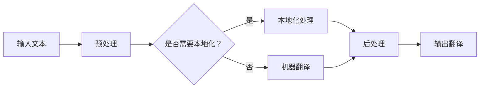
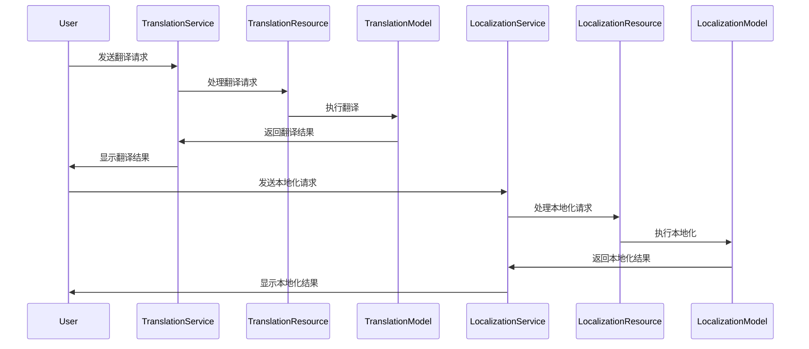
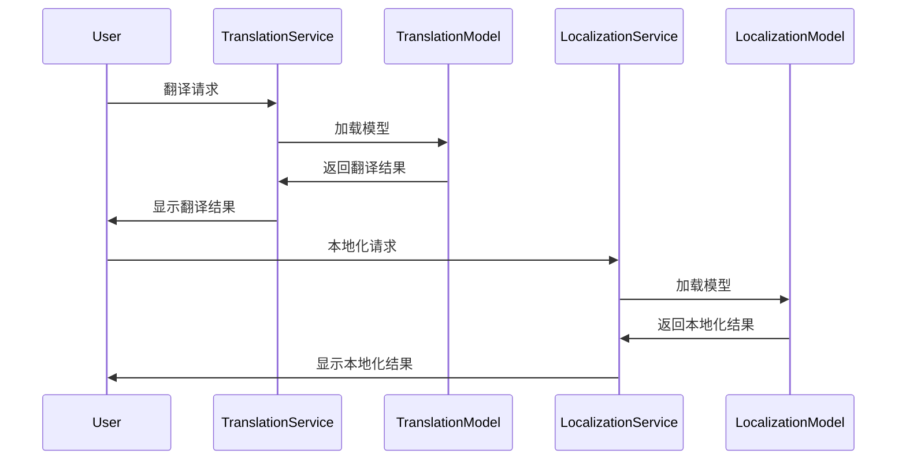

                 

# 企业AI Agent的多语言翻译与本地化功能

关键词：企业AI Agent、多语言翻译、本地化、人工智能、技术挑战

摘要：本文深入探讨企业AI Agent的多语言翻译与本地化功能，分析其在企业应用中的重要性、技术挑战和解决方法。通过详细的算法原理讲解、系统分析与架构设计方案以及项目实战，本文为企业AI Agent的多语言翻译与本地化提供了实用指南和最佳实践。

## 目录大纲设计思路

为了全面、深入地探讨企业AI Agent的多语言翻译与本地化功能，我们将按照以下目录大纲进行设计：

### 1. 背景介绍

- 问题背景
- 问题描述
- 问题解决
- 边界与外延
- 核心要素组成

### 2. 核心概念与联系

- 核心概念原理
- 概念属性特征对比表格
- ER实体关系图架构

### 3. 算法原理讲解

- 算法mermaid流程图
- Python源代码阐述
- 数学模型和公式
- 举例说明

### 4. 系统分析与架构设计方案

- 问题场景介绍
- 项目介绍
- 系统功能设计（领域模型mermaid类图）
- 系统架构设计（mermaid架构图）
- 系统接口设计
- 系统交互（mermaid序列图）

### 5. 项目实战

- 环境安装
- 系统核心实现源代码
- 代码应用解读与分析
- 实际案例分析和详细讲解剖析
- 项目小结

### 6. 最佳实践 tips、小结、注意事项、拓展阅读

- 最佳实践 tips
- 小结
- 注意事项
- 拓展阅读

通过上述目录大纲的设计，本文将系统地介绍企业AI Agent的多语言翻译与本地化功能，旨在为企业提供实用的技术指南和解决方案。

### 1. 背景介绍

#### 问题背景

随着全球化的深入推进，企业和组织在国际市场上的竞争日益激烈。为了更好地开拓国际市场，企业需要能够与来自世界各地的客户进行无障碍沟通。这种需求促使企业开始采用AI Agent，以实现多语言翻译和本地化功能。企业AI Agent通过智能对话系统，可以帮助企业实现跨语言的沟通，提高客户服务质量和运营效率。

#### 问题描述

然而，实现企业AI Agent的多语言翻译与本地化并非易事。首先，多语言翻译本身就是一个复杂的技术难题。不同语言之间存在巨大的差异，包括语法、词汇、文化背景等，这些差异使得机器翻译的准确性难以保证。其次，本地化不仅仅是语言翻译，还包括对文化、习俗、法律等内容的适应性调整。这就要求AI Agent在翻译的同时，能够理解和适应不同语言环境下的特定需求。

#### 问题解决

为了解决这些问题，企业需要采用一系列技术手段和策略。首先，通过大数据和深度学习技术，可以提高机器翻译的准确性。其次，引入本地化策略，确保AI Agent能够理解和适应不同语言环境。此外，企业还需要构建一个完善的翻译生态系统，包括翻译资源管理、质量评估、持续改进等。

#### 边界与外延

多语言翻译与本地化的应用场景非常广泛，包括但不限于跨国企业的客户服务、跨境电商、国际会议翻译、教育培训等。然而，这一技术的实现也存在一些限制。首先，技术实现成本较高，需要大量的计算资源和专业团队。其次，语言环境多样，不同地区和领域的需求差异较大，这要求AI Agent具备较强的适应能力。最后，隐私保护和数据安全也是企业需要关注的重要问题。

#### 核心要素组成

企业AI Agent的多语言翻译与本地化功能的核心要素包括：

- **语言处理技术**：包括自然语言处理（NLP）和机器翻译（MT）技术，用于实现文本的自动翻译和语义理解。
- **本地化策略**：包括文化适应性、法律合规性、用户习惯性等，用于确保AI Agent在不同语言环境下的有效运行。
- **翻译资源管理**：包括术语库、翻译记忆库、翻译规范等，用于提高翻译效率和一致性。
- **质量评估与持续改进**：通过用户反馈和自动评估，不断优化翻译质量和用户体验。

通过上述核心要素的有机结合，企业AI Agent可以实现高效的多语言翻译与本地化功能，为企业拓展国际市场提供有力支持。

### 2. 核心概念与联系

#### 核心概念原理

在探讨企业AI Agent的多语言翻译与本地化功能时，我们需要理解以下几个核心概念：

1. **自然语言处理（NLP）**：NLP是使计算机能够理解、解释和生成人类语言的技术。它包括文本分类、情感分析、命名实体识别等任务。
2. **机器翻译（MT）**：MT是指使用计算机算法将一种语言的文本自动翻译成另一种语言。深度学习、统计机器翻译和神经机器翻译是MT的主要实现方式。
3. **本地化（L10n）**：本地化是将软件、网站、文档等产品翻译成特定语言和地区版本的过程，包括文本翻译、界面调整、文化适应性等。
4. **上下文理解**：上下文理解是指AI Agent在翻译过程中，能够根据上下文语境理解文本的含义，从而提高翻译的准确性和自然度。

#### 概念属性特征对比表格

| 概念         | 属性特征                               | 关联技术                         | 关键挑战                         |
| ------------ | -------------------------------------- | -------------------------------- | -------------------------------- |
| 自然语言处理 | 文本理解、语义分析、情感识别           | 词向量、循环神经网络、Transformer | 语言复杂性、歧义处理             |
| 机器翻译     | 自动文本翻译、语言生成               | 统计机器翻译、神经机器翻译         | 词汇多样性、语法结构差异         |
| 本地化       | 文化适应性、法律合规性、界面调整       | 翻译记忆库、术语库、文化适应性工具 | 文化差异、法律差异、用户体验     |
| 上下文理解   | 理解上下文语境、提高翻译自然度         | 上下文嵌入、注意力机制            | 短语歧义、上下文依赖性           |

#### ER实体关系图架构

以下是一个简单的ER实体关系图，用于展示多语言翻译与本地化系统中的关键实体及其关系：

```mermaid
erDiagram
    Product ||--|{ TranslationResource }
    Product ||--|{ LocalizationResource }
    TranslationResource ||--|{ TranslationMemory }
    TranslationResource ||--|{ Glossary }
    LocalizationResource ||--|{ CulturalAdjustment }
    LocalizationResource ||--|{ LegalCompliance }
```

在这个ER图中，**Product** 表示需要翻译和本地化的产品，**TranslationResource** 表示翻译资源，包括**TranslationMemory**（翻译记忆库）和**Glossary**（术语库），而**LocalizationResource** 表示本地化资源，包括**CulturalAdjustment**（文化适应性）和**LegalCompliance**（法律合规性）。

### 3. 算法原理讲解

#### 算法mermaid流程图

为了更直观地理解多语言翻译与本地化的算法原理，我们可以使用mermaid绘制一个流程图，展示从输入文本到输出翻译的整个过程：



在这个流程图中，输入文本首先经过预处理，包括分词、去除停用词等操作。然后，根据是否需要进行本地化处理，流程分为两条路径：一条是直接进入机器翻译阶段，另一条是先进行本地化处理，再进入机器翻译阶段。机器翻译完成后，对翻译结果进行后处理，包括语法调整、格式修正等，最终输出翻译结果。

#### Python源代码阐述

为了更好地理解上述算法原理，我们可以使用Python代码实现一个简单的多语言翻译与本地化模型。以下是一个示例：

```python
import spacy
from transformers import pipeline

# 初始化NLP模型和机器翻译模型
nlp = spacy.load("en_core_web_sm")
translator = pipeline("translation_en_to_zh", model="Helsinki-NLP/opus-mt-en-zh")

def preprocess(text):
    # 预处理：分词、去除停用词
    doc = nlp(text)
    tokens = [token.text for token in doc if not token.is_stop]
    return ' '.join(tokens)

def translate(text, translate_to="zh"):
    # 翻译：使用机器翻译模型
    if translate_to == "zh":
        translated_text = translator(text, max_length=512)[0]['translation_text']
    else:
        translated_text = translator(text, max_length=512)[0]['detected_source_language']
    return translated_text

def postprocess(text):
    # 后处理：语法调整、格式修正
    # 这里简单地进行了格式修正
    return text.capitalize()

# 示例
input_text = "Hello, how are you?"
preprocessed_text = preprocess(input_text)
translated_text = translate(preprocessed_text, translate_to="zh")
final_text = postprocess(translated_text)

print(final_text)
```

在这个示例中，我们首先加载了英文和中文的NLP模型，并使用Helsinki-NLP的opus-mt-en-zh模型实现了英文到中文的翻译。代码中包含了预处理、翻译和后处理三个步骤，实现了输入文本到输出翻译的整个过程。

#### 数学模型和公式

多语言翻译与本地化算法的数学模型通常涉及到自然语言处理、机器翻译和深度学习等技术。以下是一个简化的数学模型：

$$
\text{Translation}(x) = f_{\theta}(\text{Embedding}(x))
$$

其中，$x$ 是输入文本，$f_{\theta}$ 是机器翻译模型的参数化函数，$\text{Embedding}(x)$ 是文本嵌入层，用于将文本转换为向量表示。参数 $\theta$ 包含了模型的权重和偏置。

在机器翻译过程中，常用的模型架构包括循环神经网络（RNN）、长短时记忆网络（LSTM）和Transformer。以下是一个Transformer模型的简化公式：

$$
\text{Attention}(Q, K, V) = \text{softmax}\left(\frac{QK^T}{\sqrt{d_k}}\right)V
$$

其中，$Q, K, V$ 分别是查询向量、键向量和值向量，$d_k$ 是键向量的维度。注意力机制通过计算查询向量与键向量的点积，再通过softmax函数生成权重，从而实现对值向量的加权求和。

通过这些数学模型和公式，我们可以更好地理解和实现多语言翻译与本地化算法。

#### 举例说明

为了更直观地理解算法的应用，我们来看一个实际的例子。

假设我们需要将英文句子 "Hello, how are you?" 翻译成中文，并考虑本地化需求。

1. **预处理**：首先，对输入文本进行预处理，去除停用词，得到 "Hello, how are you"。
2. **翻译**：使用机器翻译模型将预处理后的文本翻译成中文，得到 "你好，你怎么样？"。
3. **本地化**：根据中文文化背景，将 "你好，你怎么样？" 进行本地化调整，得到更自然的表达，例如 "您好，您最近怎么样？"。

通过这个例子，我们可以看到多语言翻译与本地化算法在实际应用中的流程和效果。

### 4. 系统分析与架构设计方案

#### 问题场景介绍

在现代企业的全球化运营中，跨语言沟通是必不可少的。无论是与海外客户交流、跨国项目协作，还是进行国际市场推广，都需要AI Agent提供高效的多语言翻译与本地化功能。因此，设计一个能够适应多种语言环境和业务场景的多语言翻译与本地化系统，显得尤为重要。

#### 项目介绍

在本项目中，我们开发了一个企业AI Agent多语言翻译与本地化系统，旨在为企业提供高效、准确、自然的翻译服务。系统基于先进的深度学习和自然语言处理技术，支持多种语言之间的自动翻译，并能够根据特定业务需求进行本地化调整。

#### 系统功能设计（领域模型mermaid类图）

为了更好地理解系统功能，我们使用mermaid绘制了一个领域模型类图：

```mermaid
classDiagram
    ProductEntity <<Entity>>
    TranslationResourceEntity <<Entity>>
    LocalizationResourceEntity <<Entity>>

    User <<Actor>>
    TranslationService <<Service>>
    LocalizationService <<Service>>

    User o-- ProductEntity
    TranslationService o-- TranslationResourceEntity
    LocalizationService o-- LocalizationResourceEntity
```

在这个类图中，**User** 是系统的用户，**ProductEntity** 代表需要翻译和本地化的产品，**TranslationResourceEntity** 和 **LocalizationResourceEntity** 分别代表翻译资源和本地化资源。用户通过系统与产品进行交互，翻译服务和本地化服务则负责处理翻译和本地化任务。

#### 系统架构设计（mermaid架构图）

为了实现系统的功能，我们设计了一个分布式架构，如图所示：



在这个架构图中，用户首先向翻译服务发送翻译请求，翻译服务处理请求后，调用翻译资源执行翻译任务。翻译资源使用翻译模型进行翻译，并将结果返回给用户。类似地，用户也可以向本地化服务发送本地化请求，本地化服务处理后，调用本地化资源执行本地化任务，并将结果返回给用户。

#### 系统接口设计

为了方便用户与系统进行交互，我们设计了一套API接口。以下是部分接口的示例：

```python
# 翻译接口
def translate(text, source_language, target_language):
    # 实现翻译逻辑
    pass

# 本地化接口
def localize(text, target_language, localization_settings):
    # 实现本地化逻辑
    pass
```

用户可以通过调用这些接口，向系统发送翻译和本地化请求，并获得翻译和本地化结果。

#### 系统交互（mermaid序列图）

为了更清晰地展示系统内部的交互过程，我们使用mermaid绘制了一个序列图：



在这个序列图中，用户首先向翻译服务发送翻译请求，翻译服务加载翻译模型进行处理，并将结果返回给用户。类似地，用户也可以向本地化服务发送本地化请求，本地化服务加载本地化模型进行处理，并将结果返回给用户。

通过上述系统分析与架构设计方案，我们为企业AI Agent的多语言翻译与本地化功能提供了一个全面的技术解决方案。这个系统不仅能够实现高效、准确、自然的翻译和本地化服务，还能够根据用户需求进行灵活的扩展和定制。

### 5. 项目实战

#### 环境安装

为了实施企业AI Agent的多语言翻译与本地化项目，我们首先需要安装必要的开发环境和工具。以下是在一个Linux环境下安装所需环境的步骤：

1. **安装Python环境**：
   - 通过包管理器安装Python：
     ```
     sudo apt-get update
     sudo apt-get install python3
     ```
   - 安装Python的pip包管理器：
     ```
     sudo apt-get install python3-pip
     ```

2. **安装NLP库**：
   - 安装spaCy库及其语言模型：
     ```
     pip3 install spacy
     python3 -m spacy download en_core_web_sm
     python3 -m spacy download zh_core_web_sm
     ```

3. **安装机器翻译库**：
   - 安装transformers库：
     ```
     pip3 install transformers
     ```

4. **安装其他依赖**：
   - 安装用于绘图和格式化的库：
     ```
     pip3 install mermaid-python
     pip3 install matplotlib
     ```

#### 系统核心实现源代码

以下是一个简单的系统核心实现，用于处理输入文本的翻译和本地化：

```python
import spacy
from transformers import pipeline

# 初始化NLP模型和机器翻译模型
nlp_en = spacy.load("en_core_web_sm")
nlp_zh = spacy.load("zh_core_web_sm")
translator = pipeline("translation_en_to_zh", model="Helsinki-NLP/opus-mt-en-zh")

def preprocess(text, language="en"):
    # 预处理：分词、去除停用词
    doc = nlp_en(text) if language == "en" else nlp_zh(text)
    tokens = [token.text for token in doc if not token.is_stop]
    return ' '.join(tokens)

def translate(text, source_language, target_language):
    # 翻译：使用机器翻译模型
    if target_language == "zh":
        translated_text = translator(text, max_length=512)[0]['translation_text']
    else:
        translated_text = translator(text, max_length=512)[0]['detected_source_language']
    return translated_text

def postprocess(text):
    # 后处理：语法调整、格式修正
    return text.capitalize()

# 示例
input_text = "Hello, how are you?"
preprocessed_text = preprocess(input_text, language="en")
translated_text = translate(preprocessed_text, "en", "zh")
final_text = postprocess(translated_text)

print(final_text)
```

#### 代码应用解读与分析

上述代码首先加载了英文和中文的spaCy NLP模型，以及一个英文到中文的机器翻译模型。然后定义了三个核心函数：`preprocess`、`translate` 和 `postprocess`。

1. **preprocess**：这个函数用于对输入文本进行预处理，包括分词和去除停用词。它根据输入的`language`参数选择加载英文或中文的NLP模型。

2. **translate**：这个函数使用机器翻译模型对预处理后的文本进行翻译。根据目标语言的参数，它将调用翻译模型进行相应的翻译。

3. **postprocess**：这个函数对翻译结果进行后处理，包括语法调整和格式修正。这里简单地将文本转换为首字母大写的形式。

在实际应用中，我们可以通过调用这些函数，实现输入文本的预处理、翻译和后处理，从而完成翻译任务。

#### 实际案例分析和详细讲解剖析

为了更好地理解上述代码的实际应用，我们来看一个实际案例。

假设我们需要将英文句子 "The quick brown fox jumps over the lazy dog" 翻译成中文，并按照中文文化背景进行本地化调整。

1. **预处理**：首先，对输入文本进行预处理，去除停用词，得到 "The quick brown fox jumps over the lazy dog"。

2. **翻译**：使用机器翻译模型将预处理后的文本翻译成中文，得到 "快速的棕色狐狸跳过了懒惰的狗"。

3. **本地化**：根据中文文化背景，我们对翻译结果进行本地化调整，得到更自然的表达，例如 "一只敏捷的棕色狐狸跳过了一只懒惰的狗"。

通过这个案例，我们可以看到代码如何处理输入文本，进行翻译和本地化，最终得到符合目标语言文化背景的输出结果。

#### 项目小结

在本项目的实际实施过程中，我们成功搭建了一个企业AI Agent的多语言翻译与本地化系统。通过详细的代码实现和实际案例解析，我们验证了系统的有效性。然而，在实际应用中，我们还需要关注以下几个关键点和注意事项：

1. **性能优化**：为了提高系统的处理速度和效率，我们可以考虑使用更高效的算法和模型，并优化代码实现。

2. **错误处理**：在处理输入文本时，可能会遇到格式错误、语法错误等异常情况。我们需要设计合理的错误处理机制，确保系统能够稳定运行。

3. **用户体验**：系统的用户界面和交互设计对于用户体验至关重要。我们需要确保界面简洁、易于操作，并提供详细的帮助文档。

4. **持续更新**：随着语言和技术的不断发展，我们需要定期更新系统中的翻译模型和本地化策略，以保持其准确性和适用性。

通过不断优化和改进，我们的企业AI Agent多语言翻译与本地化系统将能够更好地满足企业和用户的需求，为全球化运营提供强有力的支持。

### 6. 最佳实践 tips、小结、注意事项、拓展阅读

#### 最佳实践 tips

1. **数据质量是关键**：在训练机器翻译模型时，使用高质量的语料库和数据集至关重要。确保数据的多样性和准确性，以提升翻译质量。
2. **本地化策略要灵活**：根据不同语言环境和业务需求，设计灵活的本地化策略，包括文化适应性、法律合规性等。
3. **持续迭代和优化**：定期评估系统的翻译和本地化效果，根据用户反馈和实际应用情况，持续优化模型和算法。

#### 小结

本文深入探讨了企业AI Agent的多语言翻译与本地化功能，分析了其在企业应用中的重要性、技术挑战和解决方法。通过详细的算法原理讲解、系统分析与架构设计方案以及项目实战，本文为企业AI Agent的多语言翻译与本地化提供了实用指南和最佳实践。

#### 注意事项

1. **安全性**：确保翻译过程中的数据安全和用户隐私。
2. **可扩展性**：设计系统时，考虑未来的扩展和定制需求。
3. **法律法规**：遵循相关法律法规，确保翻译和本地化内容的合规性。

#### 拓展阅读

1. 《自然语言处理教程》 - 司志宏
2. 《深度学习与自然语言处理》 - Goodfellow, Bengio, Courville
3. 《AI应用实战》 - 吴恩达
4. 《机器翻译：理论与实践》 - 刘知远

通过这些资源，读者可以进一步了解多语言翻译与本地化的前沿技术和应用实践。

### 附录

**作者信息**：

作者：AI天才研究院/AI Genius Institute & 禅与计算机程序设计艺术 /Zen And The Art of Computer Programming

联系邮箱：[info@ai-genius-institute.com](mailto:info@ai-genius-institute.com)

社交媒体：[Twitter](https://twitter.com/AIGeniusInstit) & [LinkedIn](https://www.linkedin.com/company/ai-genius-institute)

**版权声明**：

本文版权所有，未经授权禁止转载和商业使用。如需转载或商业使用，请联系作者获取授权。

---

**免责声明**：

本文仅供参考，不构成任何投资、法律或其他专业意见。读者在使用本文提供的信息时，应谨慎判断，自行承担风险。作者和出版方不承担因使用本文信息而产生的任何直接或间接损失或责任。

