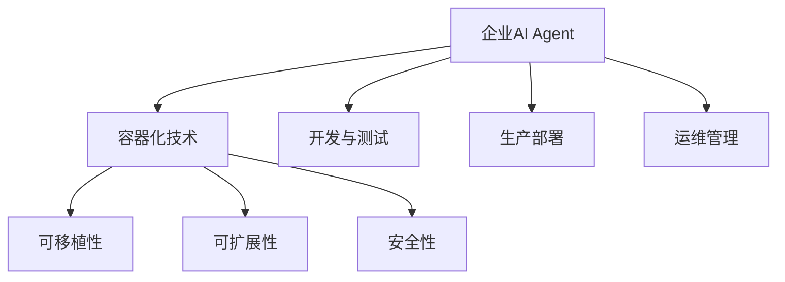

                 

# 企业AI Agent的容器化部署策略

## 关键词

- **企业AI Agent**
- **容器化技术**
- **部署策略**
- **性能优化**
- **安全策略**

## 摘要

本文旨在探讨企业AI Agent的容器化部署策略。首先，我们介绍了企业AI Agent和容器化技术的基本概念，阐述了它们在企业级应用中的重要性。接着，我们详细分析了容器技术的原理与工具，以及AI Agent的工作原理和应用场景。随后，我们重点讨论了企业AI Agent的容器化部署策略，包括单机部署和集群部署的方法。在此基础上，我们通过实际案例展示了部署过程，并分析了部署过程中的关键问题和解决方案。最后，我们探讨了部署后的性能优化策略和安全防护措施，并总结了文章的主要观点，提出了未来可能的发展方向和挑战。

## 第一部分：背景与核心概念

### 1.1 企业AI Agent与容器化技术概述

#### 1.1.1 企业AI Agent的定义与作用

企业AI Agent是一种具备自主学习、推理和决策能力的人工智能实体，它能够在企业环境中自主执行任务、优化流程和提供智能服务。企业AI Agent的核心功能包括：

1. **任务执行**：根据预设的目标和规则，自动执行具体的任务。
2. **数据分析和决策**：基于历史数据和实时数据，进行分析和决策，为业务提供支持。
3. **优化和改进**：通过不断学习和优化，提高企业运营效率和效益。

企业AI Agent在企业中具有广泛的应用，如智能客服、自动化供应链管理、智能金融风控等。

#### 1.1.2 容器化技术的基本概念

容器化是一种轻量级虚拟化技术，它将应用程序及其依赖环境打包成一个独立的容器，实现应用与宿主系统的隔离和部署的灵活性。容器化的核心概念包括：

1. **容器**：容器是一个轻量级的运行时环境，包含了应用程序及其依赖的环境变量和库文件。
2. **容器镜像**：容器镜像是一个静态的文件系统，包含了应用程序的运行环境和依赖，是容器的模板。
3. **容器引擎**：容器引擎负责创建、管理和运行容器，如Docker和Kubernetes等。

#### 1.1.3 企业级AI Agent容器化部署的重要性

容器化技术为企业AI Agent的部署提供了诸多优势：

1. **灵活性和可移植性**：容器化使得企业AI Agent可以在不同的操作系统和硬件环境中轻松部署，提高系统的可移植性和灵活性。
2. **快速部署和扩展**：容器化技术简化了应用部署和扩展的过程，使得企业AI Agent可以快速上线并支持动态扩展。
3. **隔离性和安全性**：容器技术提供了强大的隔离机制，确保企业AI Agent与其他应用程序和系统资源之间的安全隔离。

### 1.2 核心概念联系与关系图

#### 1.2.1 企业AI Agent与容器化技术的结合

企业AI Agent与容器化技术之间的联系主要体现在以下几个方面：

1. **容器化技术为AI Agent提供了可移植和可扩展的运行环境**。
2. **容器化技术简化了AI Agent的部署和管理过程**。
3. **容器化技术提供了强大的隔离机制，确保了AI Agent与其他应用程序和系统的安全性**。

#### 1.2.2 容器化技术在企业AI Agent中的应用场景

容器化技术在企业AI Agent中的应用场景包括：

1. **开发与测试**：容器化技术使得企业AI Agent的开发和测试过程更加便捷和高效。
2. **生产部署**：容器化技术简化了企业AI Agent的生产部署，提高了系统的可靠性和稳定性。
3. **运维管理**：容器化技术提供了强大的运维管理功能，使得企业AI Agent的运维更加高效和自动化。

### 1.2.3 企业AI Agent与容器化技术的Mermaid关系图



## 第二部分：容器化技术基础

### 2.1 容器技术原理与工具

#### 2.1.1 容器技术概述

容器技术是一种轻量级的虚拟化技术，它通过隔离操作系统内核，实现应用程序及其依赖环境的封装。容器技术的核心特点包括：

1. **轻量级**：容器不需要完整的操作系统，只需要封装应用程序及其依赖环境，从而大大降低了系统的资源占用。
2. **高效性**：容器通过共享宿主机的操作系统内核，实现了高效的资源利用，同时降低了部署和管理的复杂度。
3. **可移植性**：容器化技术使得应用程序可以在不同的操作系统和硬件环境中轻松部署，提高了系统的可移植性。

#### 2.1.2 容器与传统虚拟化的区别

容器与传统虚拟化技术存在以下区别：

1. **资源占用**：容器只需要共享宿主机的操作系统内核，而传统虚拟化需要为每个虚拟机分配独立的操作系统和硬件资源。
2. **性能开销**：容器技术由于不需要额外的操作系统开销，因此具有更高的性能和效率。
3. **部署与扩展**：容器化技术简化了应用程序的部署和扩展过程，而传统虚拟化技术则相对复杂。

#### 2.1.3 容器技术的核心组件

容器技术的核心组件包括：

1. **容器**：容器是应用程序的运行时环境，包含了应用程序及其依赖的环境变量和库文件。
2. **容器镜像**：容器镜像是一个静态的文件系统，包含了应用程序的运行环境和依赖，是容器的模板。
3. **容器引擎**：容器引擎负责创建、管理和运行容器，如Docker和Kubernetes等。

### 2.2 Docker技术详解

#### 2.2.1 Docker的基本原理

Docker是一种开源的容器引擎，它通过将应用程序及其依赖环境打包成一个容器镜像，实现了应用程序的快速部署和灵活管理。Docker的基本原理包括：

1. **容器镜像**：容器镜像是一个静态的文件系统，包含了应用程序的运行环境和依赖。通过Dockerfile，可以定义和构建容器镜像。
2. **容器**：容器是应用程序的运行时环境，通过Docker命令创建和运行。容器与容器镜像之间是一对多的关系。
3. **容器编排**：Docker通过Docker Compose和Docker Swarm等工具，实现了容器集群的编排和管理。

#### 2.2.2 Docker镜像与容器

1. **容器镜像**：容器镜像是一个静态的文件系统，包含了应用程序的运行环境和依赖。容器镜像是容器的基础，通过Dockerfile定义和构建。
2. **容器**：容器是应用程序的运行时环境，通过Docker命令创建和运行。容器镜像与容器之间是一对多的关系。

#### 2.2.3 Docker命令与用法

1. **构建容器镜像**：通过Dockerfile定义和构建容器镜像。例如：
    ```bash
    docker build -t <镜像名称>:<标签> .
    ```
2. **运行容器**：通过Docker命令创建和运行容器。例如：
    ```bash
    docker run -d -p <宿主端口>:<容器端口> <镜像名称>:<标签>
    ```
3. **管理容器**：通过Docker命令管理容器，如启动、停止、重启、删除等。例如：
    ```bash
    docker start <容器ID或名称>
    docker stop <容器ID或名称>
    docker restart <容器ID或名称>
    docker rm <容器ID或名称>
    ```

### 2.3 Kubernetes入门

#### 2.3.1 Kubernetes的概念与架构

Kubernetes是一种开源的容器编排平台，用于自动化部署、扩展和管理容器化应用程序。Kubernetes的核心概念包括：

1. **Pod**：Pod是Kubernetes中的最小部署单元，包含了应用程序的一个或多个容器。Pod负责管理容器的生命周期和资源分配。
2. **部署（Deployment）**：部署用于管理Pod的创建和更新，确保应用程序的稳定运行。
3. **服务（Service）**：服务用于暴露Pod，使得外部访问应用程序。服务通过负载均衡将流量分配给不同的Pod。
4. **存储卷（Volume）**：存储卷用于持久化应用程序数据，确保数据在容器重启和销毁后仍然存在。
5. **配置和管理（ConfigMaps和Secrets）**：ConfigMaps和Secrets用于管理应用程序的配置信息，确保配置的隔离和安全性。

Kubernetes的架构包括：

1. **Master节点**：Master节点负责集群的管理和控制。主要组件包括Kube-Apiserver、Kube-Scheduler、Kube-Controller-Manager等。
2. **Worker节点**：Worker节点负责运行Pod，执行应用程序的运行任务。主要组件包括Docker、Kubelet、Kube-Proxy等。

#### 2.3.2 Kubernetes核心组件介绍

1. **Kube-Apiserver**：Kube-Apiserver是Kubernetes的API服务器，负责接收和处理集群的各种请求，如创建、更新和删除资源。
2. **Kube-Scheduler**：Kube-Scheduler是Kubernetes的调度器，负责将Pod调度到合适的Worker节点上。
3. **Kube-Controller-Manager**：Kube-Controller-Manager是Kubernetes的控制器管理器，负责监控集群的状态，并确保各个资源按照预期运行。
4. **Kubelet**：Kubelet是Kubernetes的节点代理，负责在Worker节点上运行Pod，并确保Pod的状态与预期一致。
5. **Kube-Proxy**：Kube-Proxy是Kubernetes的网络代理，负责将流量转发到正确的Pod。

#### 2.3.3 Kubernetes的部署与管理

1. **部署Kubernetes集群**：
    - **单机部署**：通过Minikube等工具在单机上部署Kubernetes集群。
    - **多机部署**：通过kubeadm等工具在多机上部署Kubernetes集群。
2. **管理Kubernetes集群**：
    - **命令行工具**：使用kubectl命令行工具进行Kubernetes集群的管理，如创建、更新和删除资源。
    - **图形界面**：使用Kubernetes Dashboard等图形界面工具进行Kubernetes集群的管理。

## 第三部分：AI Agent技术基础

### 3.1 AI Agent的基本概念

AI Agent是一种具备自主学习、推理和决策能力的人工智能实体。AI Agent的核心概念包括：

1. **感知**：AI Agent通过传感器获取环境信息，如图像、声音、文本等。
2. **推理**：AI Agent基于感知到的信息，进行逻辑推理和决策，以实现对环境的理解和响应。
3. **行动**：AI Agent根据推理结果，执行相应的行动，以实现目标。

### 3.2 AI Agent的工作原理

AI Agent的工作原理可以分为以下几个步骤：

1. **感知**：AI Agent通过传感器获取环境信息，如图像、声音、文本等。
2. **特征提取**：AI Agent对感知到的信息进行特征提取，将其转化为可用于推理的数值表示。
3. **推理与决策**：AI Agent基于提取到的特征，使用机器学习算法进行推理和决策，以实现对环境的理解和响应。
4. **行动**：AI Agent根据推理结果，执行相应的行动，以实现目标。

### 3.3 AI Agent的应用场景

AI Agent在多个领域具有广泛的应用，主要包括：

1. **智能客服**：AI Agent可以自动处理客户的咨询和投诉，提供24/7的客服服务。
2. **自动驾驶**：AI Agent可以实时感知道路环境，进行决策和行动，实现自动驾驶。
3. **工业自动化**：AI Agent可以监控和优化工业生产过程，提高生产效率和产品质量。

## 第四部分：部署策略与方法

### 4.1 单机部署策略

单机部署是指在一个物理或虚拟机上进行企业AI Agent的部署。单机部署的优势在于简单、快速和低成本，但存在资源限制和高风险性。

#### 4.1.1 单机部署的优势与限制

1. **优势**：
    - **简单快速**：单机部署无需配置复杂的网络和集群环境，部署过程简单快速。
    - **低成本**：单机部署无需购买额外的硬件设备，成本较低。
    - **易于测试**：单机部署便于测试和验证AI Agent的功能和性能。

2. **限制**：
    - **资源限制**：单机部署受限于物理或虚拟机的硬件资源，可能无法支持大规模的AI Agent部署。
    - **高风险性**：单机部署在系统故障或宕机时，可能导致AI Agent的不可用。

#### 4.1.2 单机部署的流程与步骤

1. **环境准备**：准备单机部署所需的操作系统、容器引擎（如Docker）和Kubernetes等。
2. **安装Docker**：在单机上安装Docker，以便部署和管理容器化应用程序。
3. **构建容器镜像**：编写Dockerfile，构建企业AI Agent的容器镜像。
4. **运行容器**：使用Docker命令运行企业AI Agent容器，配置容器端口和资源限制。
5. **监控与维护**：使用Docker命令监控容器状态，定期进行系统维护和更新。

### 4.2 集群部署策略

集群部署是指在企业环境中部署多个物理或虚拟机，组成一个分布式集群，以支持大规模的企业AI Agent部署。集群部署具有高可用性、高扩展性和高可靠性。

#### 4.2.1 集群部署的优势与挑战

1. **优势**：
    - **高可用性**：集群部署可以通过故障转移和负载均衡，确保AI Agent的持续可用。
    - **高扩展性**：集群部署可以根据需求动态扩展资源，支持大规模的AI Agent部署。
    - **高可靠性**：集群部署通过冗余和备份，提高了系统的可靠性和稳定性。

2. **挑战**：
    - **复杂性和管理难度**：集群部署需要复杂的网络和集群配置，管理难度较大。
    - **性能优化**：集群部署需要考虑网络延迟和负载均衡，进行性能优化。
    - **安全性**：集群部署需要确保数据安全和系统安全，防范攻击和故障。

#### 4.2.2 集群部署的架构设计

1. **Kubernetes集群架构**：Kubernetes集群由Master节点和Worker节点组成。Master节点负责集群的管理和控制，包括Kube-Apiserver、Kube-Scheduler、Kube-Controller-Manager等。Worker节点负责运行Pod，执行应用程序的运行任务。

2. **集群网络**：集群网络用于连接Master节点和Worker节点，以及容器和容器之间的通信。常用的集群网络方案包括Calico、Flannel和Weave等。

3. **存储卷**：存储卷用于持久化应用程序数据，确保数据在容器重启和销毁后仍然存在。常用的存储卷方案包括NFS、Ceph和GlusterFS等。

#### 4.2.3 Kubernetes在集群部署中的应用

1. **部署和管理Pod**：使用Kubernetes部署和管理Pod，确保Pod的稳定运行。通过Deployment和StatefulSet等资源，实现Pod的创建、更新和删除。

2. **服务发现和负载均衡**：使用Kubernetes Service暴露Pod，实现服务发现和负载均衡。通过NodePort、LoadBalancer和Ingress等资源，实现外部访问和流量分配。

3. **监控和日志管理**：使用Kubernetes监控和日志管理工具，如Prometheus和Grafana等，实现对集群和应用程序的监控和日志分析。

### 4.2.4 Kubernetes集群的部署与管理

1. **部署Kubernetes集群**：
    - **单机部署**：通过Minikube等工具在单机上部署Kubernetes集群。
    - **多机部署**：通过kubeadm等工具在多机上部署Kubernetes集群。

2. **管理Kubernetes集群**：
    - **命令行工具**：使用kubectl命令行工具进行Kubernetes集群的管理，如创建、更新和删除资源。
    - **图形界面**：使用Kubernetes Dashboard等图形界面工具进行Kubernetes集群的管理。

## 第五部分：部署实践

### 5.1 部署案例一：单机部署

#### 5.1.1 环境安装与配置

1. **安装Docker**：
    - 在Ubuntu 20.04操作系统上，通过以下命令安装Docker：
        ```bash
        sudo apt-get update
        sudo apt-get install docker.io
        sudo systemctl start docker
        sudo systemctl enable docker
        ```

2. **安装Kubernetes**：
    - 在Ubuntu 20.04操作系统上，通过以下命令安装Kubernetes：
        ```bash
        sudo apt-get update
        sudo apt-get install -y apt-transport-https ca-certificates curl
        curl -s https://packages.cloud.google.com/apt/doc/apt-key.gpg | sudo apt-key add -
        echo "deb https://apt.kubernetes.io/ kubernetes-xenial main" | sudo tee -a /etc/apt/sources.list.d/kubernetes.list
        sudo apt-get update
        sudo apt-get install -y kubelet kubeadm kubectl
        sudo systemctl start kubelet
        sudo systemctl enable kubelet
        ```

3. **配置Kubernetes集群**：
    - 通过以下命令初始化Kubernetes集群：
        ```bash
        sudo kubeadm init --pod-network-cidr=10.244.0.0/16
        ```

    - 配置kubectl工具，以非root用户执行Kubernetes命令：
        ```bash
        mkdir -p $HOME/.kube
        sudo cp -i /etc/kubernetes/admin.conf $HOME/.kube/config
        sudo chown $(id -u):$(id -g) $HOME/.kube/config
        ```

#### 5.1.2 部署流程与操作

1. **部署Nginx服务**：
    - 通过以下命令部署Nginx服务：
        ```bash
        kubectl create deployment nginx --image=nginx:latest
        kubectl scale deployment nginx --replicas=3
        ```

2. **查看Nginx服务**：
    - 通过以下命令查看Nginx服务的状态：
        ```bash
        kubectl get pods
        kubectl get deployment nginx
        ```

3. **访问Nginx服务**：
    - 通过以下命令获取Nginx服务的访问IP和端口：
        ```bash
        kubectl get svc nginx
        ```

    - 使用浏览器访问Nginx服务，如：
        ```bash
        curl <Nginx服务IP>:<Nginx服务端口>
        ```

#### 5.1.3 部署后的性能测试

1. **负载测试**：
    - 使用工具（如ApacheBench）进行负载测试，模拟多用户访问Nginx服务。
        ```bash
        ab -n 1000 -c 100 http://<Nginx服务IP>:<Nginx服务端口>/index.html
        ```

2. **性能监控**：
    - 使用工具（如Prometheus和Grafana）监控Kubernetes集群和Nginx服务的性能指标。

### 5.2 部署案例二：集群部署

#### 5.2.1 集群环境搭建

1. **准备多台虚拟机**：
    - 准备3台虚拟机，配置如下：
        - 主机1（Master节点）：192.168.1.101
        - 主机2（Worker节点）：192.168.1.102
        - 主机3（Worker节点）：192.168.1.103

2. **安装操作系统**：
    - 在每台虚拟机上安装Ubuntu 20.04操作系统。

3. **配置主机名**：
    - 修改每台虚拟机的`/etc/hosts`文件，添加以下内容：
        ```bash
        192.168.1.101 k8s-master
        192.168.1.102 k8s-worker1
        192.168.1.103 k8s-worker2
        ```

    - 修改每台虚拟机的`/etc/hostname`文件，设置相应的主机名。

#### 5.2.2 部署Kubernetes集群

1. **初始化Master节点**：
    - 在Master节点（k8s-master）上执行以下命令：
        ```bash
        kubeadm init --pod-network-cidr=10.244.0.0/16
        ```

    - 记录下以下命令的输出：
        ```bash
        kubectl config configure --user=k8s-admin --cluster=kubernetes --server=https://<k8s-master-ip>:6443
        ```

2. **安装网络插件**：
    - 在Master节点上安装Calico网络插件：
        ```bash
        kubectl apply -f https://docs.projectcalico.org/manifests/calico.yaml
        ```

3. **初始化Worker节点**：
    - 在每台Worker节点上执行以下命令：
        ```bash
        sudo kubeadm join <k8s-master-ip>:6443 --token <token> --discovery-token-ca-cert-hash sha256:<hash>
        ```

    - 确认节点加入成功：
        ```bash
        kubectl get nodes
        ```

4. **配置kubectl工具**：
    - 在Master节点上配置kubectl工具：
        ```bash
        mkdir -p $HOME/.kube
        sudo cp -i /etc/kubernetes/admin.conf $HOME/.kube/config
        sudo chown $(id -u):$(id -g) $HOME/.kube/config
        ```

#### 5.2.3 部署后的集群管理

1. **部署Nginx服务**：
    - 在集群中部署Nginx服务：
        ```bash
        kubectl create deployment nginx --image=nginx:latest
        kubectl scale deployment nginx --replicas=3
        ```

2. **查看集群状态**：
    - 查看集群的节点状态：
        ```bash
        kubectl get nodes
        ```

    - 查看集群的服务和Pod状态：
        ```bash
        kubectl get svc
        kubectl get pods
        ```

3. **访问Nginx服务**：
    - 获取Nginx服务的访问IP和端口：
        ```bash
        kubectl get svc nginx
        ```

    - 使用浏览器访问Nginx服务，如：
        ```bash
        curl <Nginx服务IP>:<Nginx服务端口>
        ```

## 第六部分：性能优化与安全策略

### 6.1 性能监控与优化

性能监控和优化是企业AI Agent容器化部署的关键环节。以下是一些常用的性能优化策略：

1. **资源分配**：合理分配容器资源，包括CPU、内存、存储和网络等，确保容器有足够的资源进行高效的运行。
2. **负载均衡**：使用Kubernetes的负载均衡功能，将流量分配到不同的容器实例，提高系统的吞吐量和稳定性。
3. **缓存策略**：使用缓存技术，如Redis或Memcached，减少对后端服务的访问次数，降低系统的响应时间。
4. **数据库优化**：针对AI Agent使用的数据库，进行索引优化、查询优化和分库分表等操作，提高数据库的查询效率和性能。

### 6.2 安全防护措施

安全防护是企业AI Agent容器化部署的重要保障。以下是一些常用的安全防护措施：

1. **容器镜像安全**：确保容器镜像的安全，使用官方镜像仓库，对镜像进行签名验证，避免使用未经验证的镜像。
2. **网络隔离**：使用Kubernetes的网络隔离功能，限制容器之间的通信，防止容器间的恶意攻击。
3. **访问控制**：使用Kubernetes的RBAC（基于角色的访问控制）功能，限制对集群资源的访问权限，确保只有授权用户可以访问和操作集群资源。
4. **安全审计**：定期进行安全审计，检查集群的安全配置和运行状态，及时发现和解决潜在的安全问题。

## 第七部分：总结与展望

### 7.1 总结

本文探讨了企业AI Agent的容器化部署策略，包括容器化技术基础、AI Agent技术基础、部署策略与方法、部署实践、性能优化与安全策略等内容。通过本文的介绍，读者可以了解企业AI Agent和容器化技术的基本概念，掌握容器化技术在企业AI Agent部署中的应用，并学会单机部署和集群部署的方法。同时，本文还介绍了性能优化与安全策略，为读者提供了部署企业AI Agent的实用技巧。

### 7.2 展望

随着人工智能技术的不断发展，企业AI Agent的应用场景将越来越广泛。未来，企业AI Agent的容器化部署策略将面临以下挑战和机遇：

1. **容器化技术发展**：容器化技术将不断演进，支持更高效的资源利用和更灵活的部署方式，为企业AI Agent的部署提供更好的支持。
2. **AI Agent能力提升**：AI Agent将具备更强的自主学习、推理和决策能力，能够更好地适应复杂的应用场景，提高企业的运营效率和竞争力。
3. **安全与隐私保护**：随着企业AI Agent的应用日益普及，安全与隐私保护将成为重要议题。未来，需要加强对AI Agent的安全防护，确保数据的安全和隐私。

## 作者信息

- 作者：AI天才研究院/AI Genius Institute & 禅与计算机程序设计艺术 /Zen And The Art of Computer Programming

