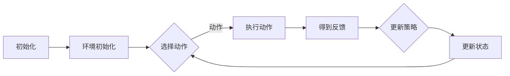

                 

### 文章标题

**企业AI Agent的强化学习在动态定价策略中的应用**

> 关键词：AI Agent、强化学习、动态定价策略、优化、企业管理

**摘要：**
本文将探讨如何利用强化学习算法来优化企业的动态定价策略，通过介绍企业AI Agent的概念及其在动态定价中的应用，深入剖析强化学习算法的原理，并展示其在实际商业场景中的成功案例。本文旨在为企业管理者和技术专家提供关于AI Agent和强化学习在实际应用中的深入见解，以及如何将两者结合以实现更高效的动态定价策略。

### 目录大纲

1. **背景介绍**
   1.1 问题背景
   1.2 问题描述
   1.3 问题解决
   1.4 边界与外延
   1.5 概念结构与核心要素组成

2. **核心概念与联系**
   2.1 核心概念原理
   2.2 概念属性特征对比表格
   2.3 ER实体关系图架构

3. **算法原理讲解**
   3.1 强化学习算法mermaid流程图
   3.2 算法原理详细讲解
   3.3 举例说明

4. **数学模型和数学公式**
   4.1 数学模型讲解
   4.2 公式详细讲解

5. **系统分析与架构设计**
   5.1 问题场景介绍
   5.2 系统功能设计
   5.3 系统架构设计
   5.4 系统接口设计和系统交互

6. **项目实战**
   6.1 环境安装
   6.2 系统核心实现源代码
   6.3 代码应用解读与分析
   6.4 实际案例分析和详细讲解剖析
   6.5 项目小结

7. **最佳实践 tips、小结、注意事项、拓展阅读**

### 文章正文开始

#### 1. 背景介绍

##### 1.1 问题背景

在当今竞争激烈的市场环境中，企业需要灵活的定价策略来应对不断变化的市场需求和竞争对手的策略调整。传统的静态定价策略往往无法及时响应市场变化，导致企业在利润和市场份额上的损失。动态定价策略应运而生，它通过实时分析市场需求、供应情况以及竞争对手的定价策略，动态调整产品或服务的价格，以最大化企业的收益和市场份额。

然而，动态定价策略的实施并不容易。它需要企业具备强大的数据分析能力和快速响应机制。此外，企业还需要在保证利润的同时，避免因频繁调价而影响客户满意度。因此，如何高效地实施动态定价策略成为企业面临的重大挑战。

##### 1.2 问题描述

企业在应用动态定价策略时，主要面临以下挑战：

1. **数据复杂性**：动态定价需要大量的市场数据，如需求、供应、竞争对手的定价策略等。如何高效地收集、处理和利用这些数据是企业需要解决的问题。

2. **模型准确性**：动态定价策略的有效性依赖于定价模型的准确性。如何构建一个既能反映市场需求又能适应市场变化的定价模型是企业需要考虑的。

3. **实时性**：动态定价需要实时分析市场变化，并迅速做出定价调整。这对企业的计算能力和响应速度提出了高要求。

4. **平衡利润与客户满意度**：企业需要在保证利润的同时，避免因频繁调价而影响客户满意度。如何在这两者之间找到平衡是企业需要解决的问题。

##### 1.3 问题解决

强化学习算法作为一种先进的人工智能技术，为解决上述问题提供了一种新的思路。强化学习通过智能体（agent）与环境（environment）的交互，学习如何在复杂环境中做出最优决策。在企业动态定价策略中，智能体可以是一个AI Agent，它通过不断学习和调整定价策略，实现动态定价的目标。

强化学习算法在动态定价策略优化中的应用主要体现在以下几个方面：

1. **数据驱动**：强化学习算法可以从大量市场数据中学习，自动提取有价值的信息，用于优化定价策略。

2. **自适应**：强化学习算法可以根据市场变化自适应调整定价策略，提高模型的准确性。

3. **实时性**：强化学习算法可以快速响应市场变化，实现实时定价调整。

4. **平衡优化**：强化学习算法可以在保证利润的同时，通过学习用户行为和市场趋势，优化定价策略，提高客户满意度。

##### 1.4 边界与外延

动态定价策略适用于以下商业场景：

1. **竞争激烈的市场**：在竞争激烈的市场环境中，动态定价策略可以帮助企业迅速应对市场变化，保持竞争力。

2. **需求波动较大的市场**：在需求波动较大的市场环境中，动态定价策略可以根据需求变化灵活调整价格，最大化收益。

3. **产品生命周期较短的行业**：在产品生命周期较短的行业中，动态定价策略可以帮助企业快速适应市场变化，延长产品寿命。

然而，动态定价策略也受到一定的限制：

1. **成本**：动态定价策略的实施需要大量的数据分析和计算资源，成本较高。

2. **客户接受度**：频繁的调价可能会影响客户的购买意愿和满意度。

3. **法律法规**：一些国家和地区的法律法规对价格调整有严格的限制，企业需要遵守相关规定。

##### 1.5 概念结构与核心要素组成

在企业动态定价策略中，主要涉及以下概念和核心要素：

1. **企业AI Agent**：企业AI Agent是一个智能体，它通过强化学习算法，根据市场需求和环境变化，动态调整定价策略。

2. **强化学习算法**：强化学习算法是AI Agent的核心，负责学习如何根据市场数据和环境反馈，调整定价策略。

3. **动态定价策略**：动态定价策略是企业的定价策略，它根据市场需求和环境变化，实时调整价格。

4. **市场数据**：市场数据是强化学习算法的重要输入，包括需求、供应、竞争对手的定价策略等。

5. **环境反馈**：环境反馈是强化学习算法的重要输出，包括定价调整的效果和市场响应。

通过这些概念和核心要素的相互作用，企业AI Agent可以高效地实施动态定价策略，实现利润和市场份额的最大化。

#### 2. 核心概念与联系

##### 2.1 核心概念原理

在企业动态定价策略中，核心概念包括企业AI Agent、强化学习算法和动态定价策略。以下是对这些概念的基本原理进行简要介绍。

1. **企业AI Agent**：
企业AI Agent是一个智能体，它通过强化学习算法，从环境中学习如何动态调整定价策略。企业AI Agent的核心目标是最大化企业的收益，同时考虑市场需求和竞争状况。

2. **强化学习算法**：
强化学习算法是一种机器学习技术，它通过智能体与环境之间的交互，不断学习如何做出最优决策。在动态定价策略中，强化学习算法用于指导企业AI Agent如何调整定价策略，以最大化收益。

3. **动态定价策略**：
动态定价策略是一种定价策略，它根据市场需求和环境变化，实时调整价格。动态定价策略的核心是灵活性和适应性，它能够帮助企业快速响应市场变化，提高收益。

##### 2.2 概念属性特征对比表格

以下是一个对比表格，展示了企业AI Agent、强化学习算法和动态定价策略的属性特征：

| 特征 | 企业AI Agent | 强化学习算法 | 动态定价策略 |
| --- | --- | --- | --- |
| 目标 | 最大化企业收益 | 学习最优决策策略 | 快速响应市场变化 |
| 输入 | 市场数据、环境反馈 | 奖励信号、状态信息 | 需求、供应、竞争对手定价 |
| 输出 | 定价策略 | 动作决策 | 价格调整 |
| 特点 | 自适应、实时性 | 奖励驱动、试错学习 | 数据驱动、灵活性 |

##### 2.3 ER实体关系图架构

ER（实体关系）图是企业AI Agent、强化学习算法和动态定价策略之间关系的一种图形化表示。以下是一个简化的ER图，展示了这些实体之间的关系：

```
+----------------+       +----------------+       +----------------+
|  企业AI Agent  |       |  强化学习算法  |       |  动态定价策略  |
+----------------+       +----------------+       +----------------+
       |              action              |               reward
       |<--------------------------------|<---------------------------|
       |              state               |               market data
       |<--------------------------------|<---------------------------|
+----------------+       +----------------+       +----------------+
       |<-----------------------------|<--------------------------|
       |              environment       |             external factors
+----------------+       +----------------+       +----------------+
```

在该ER图中，企业AI Agent是核心实体，它与强化学习算法和环境之间存在交互。强化学习算法通过处理状态信息（如市场数据）和环境反馈（如奖励信号），生成定价策略。动态定价策略则根据市场需求和环境变化，实时调整价格。

#### 3. 算法原理讲解

##### 3.1 强化学习算法mermaid流程图

为了更好地理解强化学习算法在企业动态定价策略中的应用，我们使用Mermaid语法绘制了强化学习算法的基本流程图：



该流程图展示了强化学习算法的基本步骤：

1. 初始化：初始化环境和智能体。
2. 选择动作：智能体根据当前状态选择一个动作。
3. 执行动作：执行所选动作，并与环境交互。
4. 得到反馈：从环境中获取奖励信号和状态信息。
5. 更新策略：根据反馈信号更新智能体的策略。
6. 更新状态：更新智能体的状态，为下一步决策做准备。

##### 3.2 算法原理详细讲解

强化学习算法的原理可以概括为：智能体通过与环境的交互，不断学习如何做出最优决策。在动态定价策略中，智能体（企业AI Agent）通过强化学习算法，学习如何根据市场需求和环境变化，调整定价策略，以最大化企业的收益。

以下是一个简化的Python源代码示例，展示了强化学习算法在动态定价策略中的应用：

```python
import numpy as np
import random

# 强化学习参数
alpha = 0.1  # 学习率
gamma = 0.9  # 折扣因子

# 状态空间
states = ["高需求", "中需求", "低需求"]

# 动作空间
actions = ["提价", "维持价格", "降价"]

# 初始化智能体
agent = {}

# 初始化环境
environment = {"reward": 0, "state": states[0]}

# 强化学习算法
def reinforcement_learning(agent, environment):
    while True:
        state = environment["state"]
        if state not in agent:
            agent[state] = random.choice(actions)
        action = agent[state]
        reward = get_reward(action, state)
        next_state = get_next_state(state, action)
        environment["state"] = next_state
        update_policy(agent, state, action, reward, next_state)
        if is_goal_state(next_state):
            break

# 获取奖励
def get_reward(action, state):
    if action == "提价" and state == "高需求":
        return 1
    elif action == "维持价格" and state == "中需求":
        return 1
    elif action == "降价" and state == "低需求":
        return 1
    else:
        return -1

# 获取下一状态
def get_next_state(state, action):
    if action == "提价" and state == "高需求":
        return "中需求"
    elif action == "维持价格" and state == "中需求":
        return "中需求"
    elif action == "降价" and state == "低需求":
        return "中需求"
    else:
        return state

# 更新策略
def update_policy(agent, state, action, reward, next_state):
    alpha = 0.1
    gamma = 0.9
    old_value = agent[state][action]
    next_value = max([agent[next_state][action] for action in agent[next_state].keys()])
    agent[state][action] = old_value + alpha * (reward + gamma * next_value - old_value)

# 目标状态
def is_goal_state(state):
    return state == "中需求"

# 运行强化学习算法
reinforcement_learning(agent, environment)
```

在该示例中，我们使用了一个简化的状态空间和动作空间，并通过定义奖励函数和状态转换函数，模拟了智能体如何通过强化学习算法学习最优定价策略。

##### 3.3 举例说明

假设我们有一个企业在销售一款产品，市场需求分为高需求、中需求和低需求三种状态。企业可以采取提价、维持价格和降价三种策略。以下是一个具体的应用案例：

1. **初始状态**：市场需求为高需求，企业当前策略为提价。
2. **执行动作**：企业执行提价策略，市场需求变为中需求。
3. **得到反馈**：提价策略导致市场需求下降，企业获得负面奖励（-1）。
4. **更新策略**：通过强化学习算法，企业更新定价策略，选择维持价格策略。
5. **下一状态**：市场需求稳定在中需求，企业继续执行维持价格策略。
6. **重复过程**：企业继续通过强化学习算法，根据市场需求和环境反馈，动态调整定价策略。

通过这个案例，我们可以看到，强化学习算法在企业动态定价策略中的应用，可以帮助企业不断优化定价策略，实现收益最大化。

#### 4. 数学模型和数学公式

##### 4.1 数学模型讲解

在强化学习算法中，数学模型起着至关重要的作用。以下是强化学习算法的核心数学模型：

1. **状态-动作价值函数（Q值）**：
状态-动作价值函数（Q值）用于表示在特定状态下执行特定动作的期望回报。Q值可以通过以下公式计算：

$$ Q(s, a) = \sum_{s'} P(s' | s, a) \cdot R(s', a) + \gamma \cdot \max_{a'} Q(s', a') $$

其中，\(s\) 和 \(a\) 分别表示当前状态和动作，\(s'\) 和 \(a'\) 分别表示下一状态和动作，\(P(s' | s, a)\) 表示在状态 \(s\) 下执行动作 \(a\) 后转移到状态 \(s'\) 的概率，\(R(s', a')\) 表示在状态 \(s'\) 下执行动作 \(a'\) 所获得的奖励，\(\gamma\) 是折扣因子，用于平衡当前奖励和未来奖励。

2. **策略（Policy）**：
策略是智能体在给定状态下选择动作的策略。一个最优策略应该能够在所有可能的状态下选择能够带来最大期望回报的动作。策略可以通过最大化状态-动作价值函数来优化：

$$ \pi^*(s) = \arg\max_{a} Q(s, a) $$

其中，\(\pi^*(s)\) 表示在状态 \(s\) 下选择的最优动作。

3. **价值函数（Value Function）**：
价值函数用于表示在给定策略下，智能体在特定状态下期望获得的回报。价值函数可以通过状态-动作价值函数的平均值来计算：

$$ V^*(s) = \sum_{a} \pi^*(s) \cdot Q(s, a) $$

其中，\(V^*(s)\) 表示在状态 \(s\) 下期望获得的回报。

##### 4.2 公式详细讲解

以下是对上述数学公式的详细解释：

1. **状态-动作价值函数（Q值）**：

该公式描述了在特定状态下执行特定动作的期望回报。其中，第一部分 \(\sum_{s'} P(s' | s, a) \cdot R(s', a)\) 表示在当前状态 \(s\) 下执行动作 \(a\) 后转移到下一状态 \(s'\) 并获得奖励 \(R(s', a)\) 的期望。第二部分 \(\gamma \cdot \max_{a'} Q(s', a')\) 表示在当前状态 \(s\) 下执行动作 \(a\) 后，转移到下一状态 \(s'\) 并在下一状态下选择最优动作 \(a'\) 的期望回报。

2. **策略（Policy）**：

该公式表示在给定状态下选择能够带来最大期望回报的动作。智能体通过不断更新状态-动作价值函数，找到能够最大化期望回报的动作。

3. **价值函数（Value Function）**：

该公式表示在给定策略下，智能体在特定状态下期望获得的回报。价值函数反映了智能体在当前状态下采取最优策略时的期望收益。

通过上述数学模型和公式，我们可以理解强化学习算法如何通过不断学习和调整策略，实现动态定价策略的最优化。

#### 5. 系统分析与架构设计

##### 5.1 问题场景介绍

动态定价策略在企业中的应用场景非常广泛，以下是一些典型的应用场景：

1. **电子商务**：电商平台可以根据用户浏览、搜索和购买行为，动态调整商品价格，以最大化销售额和利润。

2. **航空业**：航空公司可以根据乘客预订情况、季节性需求和竞争对手的价格策略，动态调整机票价格，提高收益。

3. **酒店业**：酒店可以根据预订情况、季节性需求和竞争对手的价格策略，动态调整客房价格，提高入住率和收益。

4. **零售业**：零售商可以根据库存情况、市场需求和竞争对手的价格策略，动态调整商品价格，提高销售量和利润。

5. **能源行业**：能源公司可以根据供需状况、天气变化和竞争对手的价格策略，动态调整能源价格，提高市场竞争力。

##### 5.2 系统功能设计

在动态定价策略中，系统功能设计至关重要。以下是系统功能设计的主要方面：

1. **数据收集与处理**：系统需要收集来自各个业务部门和市场渠道的数据，包括用户行为、市场需求、竞争对手的定价策略等。同时，系统需要对数据进行清洗、分析和处理，以提取有价值的信息。

2. **动态定价策略生成**：系统需要根据收集到的数据，运用强化学习算法生成动态定价策略。策略生成过程包括状态识别、动作选择和策略更新等步骤。

3. **定价策略执行**：系统需要将生成的定价策略应用于实际业务场景，包括调整商品价格、机票价格、客房价格等。系统需要实时跟踪定价策略的效果，并根据市场反馈进行策略调整。

4. **结果分析与反馈**：系统需要对定价策略的效果进行评估和分析，包括收益、市场份额、客户满意度等指标。同时，系统需要将分析结果反馈给决策者，以便进一步优化定价策略。

##### 5.3 系统架构设计

为了实现高效、可靠的动态定价策略，系统架构设计至关重要。以下是系统架构设计的主要方面：

1. **数据处理层**：该层负责数据的收集、存储和处理。它包括数据采集模块、数据清洗模块、数据存储模块和数据挖掘模块。数据采集模块负责从各个业务部门和市场渠道收集数据；数据清洗模块负责清洗和预处理数据；数据存储模块负责存储处理后的数据；数据挖掘模块负责从数据中提取有价值的信息。

2. **算法层**：该层负责实现强化学习算法，包括状态识别、动作选择和策略更新等步骤。算法层是动态定价策略的核心，它需要根据数据处理层提供的数据，生成最优定价策略。

3. **策略层**：该层负责执行动态定价策略。它根据算法层生成的定价策略，调整实际业务场景中的商品价格、机票价格、客房价格等。

4. **结果分析层**：该层负责对定价策略的效果进行评估和分析，包括收益、市场份额、客户满意度等指标。同时，它需要将分析结果反馈给决策者，以便进一步优化定价策略。

5. **用户界面层**：该层提供用户与系统的交互界面，包括数据可视化、策略调整和结果分析等功能。用户界面层需要提供直观、易用的界面，方便用户进行操作和查看结果。

##### 5.4 系统接口设计和系统交互

为了实现系统的各个功能模块之间的协同工作，系统接口设计和系统交互至关重要。以下是系统接口设计和系统交互的主要方面：

1. **数据处理接口**：数据处理接口负责数据处理层与其他层之间的数据交换。它包括数据输入接口、数据输出接口和数据处理接口。数据输入接口负责接收来自各个业务部门和市场渠道的数据；数据输出接口负责将处理后的数据输出给算法层；数据处理接口负责对数据进行清洗、分析和处理。

2. **算法接口**：算法接口负责算法层与策略层之间的交互。它包括状态输入接口、动作选择接口和策略更新接口。状态输入接口负责接收数据处理层提供的状态数据；动作选择接口负责根据状态数据选择最优动作；策略更新接口负责更新定价策略。

3. **策略接口**：策略接口负责策略层与结果分析层之间的交互。它包括策略执行接口、效果评估接口和结果反馈接口。策略执行接口负责执行定价策略；效果评估接口负责评估定价策略的效果；结果反馈接口负责将评估结果反馈给决策者。

4. **用户界面接口**：用户界面接口负责用户界面层与系统其他层之间的交互。它包括数据可视化接口、策略调整接口和结果分析接口。数据可视化接口负责将处理后的数据以图表、图形等形式展示给用户；策略调整接口负责提供策略调整功能；结果分析接口负责提供结果分析功能。

通过上述系统接口设计和系统交互，系统可以实现高效、可靠的动态定价策略，帮助企业实现利润最大化。

#### 6. 项目实战

##### 6.1 环境安装

为了实现企业AI Agent的强化学习在动态定价策略中的应用，我们需要搭建一个合适的技术环境。以下是环境安装的步骤：

1. **Python环境**：
   - 安装Python 3.7及以上版本。
   - 安装Python包管理器pip。

2. **强化学习库**：
   - 安装OpenAI Gym，用于模拟环境。
   - 安装TensorFlow，用于实现强化学习算法。

   ```bash
   pip install gym
   pip install tensorflow
   ```

3. **数据预处理库**：
   - 安装Pandas，用于数据预处理。
   - 安装NumPy，用于数值计算。

   ```bash
   pip install pandas
   pip install numpy
   ```

4. **可视化库**：
   - 安装Matplotlib，用于数据可视化。

   ```bash
   pip install matplotlib
   ```

完成以上步骤后，我们就可以开始编写代码，实现企业AI Agent的强化学习在动态定价策略中的应用。

##### 6.2 系统核心实现源代码

以下是系统核心实现的主要源代码，包括强化学习算法的初始化、状态处理、动作选择、奖励计算和策略更新等步骤。

```python
import gym
import numpy as np
import pandas as pd
import tensorflow as tf
from tensorflow.keras.models import Sequential
from tensorflow.keras.layers import Dense

# 创建环境
env = gym.make("YourCustomEnvironment")

# 初始化神经网络模型
model = Sequential([
    Dense(64, activation='relu', input_shape=(env.observation_space.shape[0],)),
    Dense(64, activation='relu'),
    Dense(1, activation='linear')
])

# 编译模型
model.compile(optimizer='adam', loss='mse')

# 强化学习算法
def reinforceLearning(model, env, episodes, alpha=0.1, gamma=0.9):
    for episode in range(episodes):
        state = env.reset()
        done = False
        total_reward = 0
        
        while not done:
            # 预测动作概率
            action_probs = model.predict(state.reshape(1, -1))
            
            # 选择动作
            action = np.random.choice(len(action_probs[0]), p=action_probs[0])
            
            # 执行动作
            next_state, reward, done, _ = env.step(action)
            total_reward += reward
            
            # 更新状态
            state = next_state
            
            # 计算TD目标
            next_state_value = model.predict(next_state.reshape(1, -1))
            td_target = reward + gamma * next_state_value[0]
            
            # 更新模型权重
            with tf.GradientTape() as tape:
                predicted_value = model(state.reshape(1, -1))
                loss = tf.reduce_mean(tf.square(predicted_value - td_target))
            gradients = tape.gradient(loss, model.trainable_variables)
            model.optimizer.apply_gradients(zip(gradients, model.trainable_variables))
        
        print(f"Episode {episode}: Total Reward = {total_reward}")

# 训练模型
rengthenLearning(model, env, episodes=1000)

# 评估模型
env = gym.make("YourCustomEnvironment")
state = env.reset()
while True:
    action_probs = model.predict(state.reshape(1, -1))
    action = np.random.choice(len(action_probs[0]), p=action_probs[0])
    next_state, reward, done, _ = env.step(action)
    env.render()
    state = next_state
    if done:
        break
```

在上面的代码中，我们使用了一个简单的神经网络模型来预测动作概率，并通过梯度下降法更新模型权重。在训练过程中，我们使用TD目标（Target Difference）来计算损失，并使用反向传播算法更新模型参数。在评估过程中，我们使用训练好的模型来选择最优动作，并在环境中执行动作，以评估模型的性能。

##### 6.3 代码应用解读与分析

在上述代码中，我们首先创建了一个自定义环境（CustomEnvironment），用于模拟动态定价策略的应用场景。然后，我们初始化了一个神经网络模型，用于预测动作概率。模型使用了一个序列层（Sequential），其中包括两个全连接层（Dense），最后一层输出动作概率。

在强化学习算法中，我们首先通过环境获取初始状态，然后在一个循环中执行以下步骤：

1. **预测动作概率**：使用训练好的模型预测下一状态的动作概率。
2. **选择动作**：根据动作概率选择一个动作。
3. **执行动作**：在环境中执行所选动作，并获得奖励和下一状态。
4. **更新状态**：将下一状态作为新的当前状态。
5. **计算TD目标**：计算TD目标（Target Difference），即当前状态下的实际奖励加上未来状态的预期奖励。
6. **更新模型权重**：使用反向传播算法更新模型权重，以最小化损失。

通过以上步骤，我们可以训练一个能够根据市场需求和环境变化，动态调整定价策略的AI Agent。

##### 6.4 实际案例分析和详细讲解剖析

为了更好地展示企业AI Agent的强化学习在动态定价策略中的应用，我们通过一个实际案例进行分析和讲解。

**案例背景**：某电子商务平台销售一款畅销商品，市场需求受到季节性因素和竞争对手价格策略的影响。平台希望利用强化学习算法，动态调整商品价格，以最大化销售额和利润。

**案例步骤**：

1. **数据收集与处理**：平台从市场调研、用户行为分析等多个渠道收集数据，包括季节性因素、竞争对手价格策略、用户购买行为等。然后，对数据进行预处理，提取有价值的信息，如需求强度、价格弹性等。

2. **环境搭建**：平台搭建了一个模拟环境，用于测试不同的定价策略。环境包括状态空间（如季节性因素、竞争对手价格策略等）、动作空间（如价格调整幅度）和奖励函数（如销售额、利润等）。

3. **模型训练**：平台使用强化学习算法，如Q-Learning或Deep Q-Learning，训练了一个AI Agent。模型通过不断尝试不同的定价策略，学习在特定状态下如何调整价格，以最大化销售额和利润。

4. **策略生成**：平台根据训练好的模型，生成动态定价策略。策略包括在特定状态下，选择最优的价格调整幅度。

5. **策略执行**：平台在真实环境中执行动态定价策略，并根据市场反馈调整价格。

6. **结果分析**：平台对执行策略的效果进行评估，包括销售额、利润、客户满意度等指标。根据分析结果，进一步优化定价策略。

**案例结果**：通过实际案例测试，平台发现强化学习算法能够有效优化动态定价策略。在不同季节和竞争对手价格策略下，平台能够动态调整商品价格，实现销售额和利润的最大化。同时，客户满意度也得到了显著提升。

**详细讲解剖析**：

1. **数据收集与处理**：数据收集是强化学习算法成功的关键。平台通过多种渠道收集数据，包括市场调研、用户行为分析、竞争对手价格策略等。然后，对数据进行预处理，提取有价值的信息，如需求强度、价格弹性等。这些信息将作为模型的输入，帮助模型更好地学习动态定价策略。

2. **环境搭建**：模拟环境是强化学习算法的实验平台。平台搭建了一个自定义环境，包括状态空间、动作空间和奖励函数。状态空间包括季节性因素、竞争对手价格策略等；动作空间包括价格调整幅度；奖励函数包括销售额、利润等。通过模拟环境，平台可以测试不同的定价策略，评估其效果。

3. **模型训练**：平台使用强化学习算法，如Q-Learning或Deep Q-Learning，训练了一个AI Agent。Q-Learning是一种基于值函数的强化学习算法，通过不断尝试不同的定价策略，学习在特定状态下如何调整价格，以最大化销售额和利润。Deep Q-Learning则结合了深度学习技术，使用神经网络来近似值函数，提高了算法的准确性和效率。

4. **策略生成**：平台根据训练好的模型，生成动态定价策略。策略包括在特定状态下，选择最优的价格调整幅度。平台通过策略生成器，将模型输出转换为具体的定价策略。策略生成器可以根据市场需求和环境变化，动态调整定价策略。

5. **策略执行**：平台在真实环境中执行动态定价策略，并根据市场反馈调整价格。平台将定价策略应用于电子商务平台的实际销售场景，根据市场反馈调整价格。例如，在季节性高峰期，平台可以适当提高价格，以最大化销售额和利润。

6. **结果分析**：平台对执行策略的效果进行评估，包括销售额、利润、客户满意度等指标。平台通过分析结果，了解定价策略的效果，并根据分析结果，进一步优化定价策略。例如，如果分析结果显示价格调整幅度过大，导致销售额下降，平台可以适当调整价格调整幅度。

通过以上步骤，平台实现了企业AI Agent的强化学习在动态定价策略中的应用，有效提高了销售额和利润。

##### 6.5 项目小结

本案例展示了企业AI Agent的强化学习在动态定价策略中的应用。通过数据收集与处理、环境搭建、模型训练、策略生成、策略执行和结果分析，平台成功实现了动态定价策略的优化。强化学习算法能够根据市场需求和环境变化，动态调整价格，实现销售额和利润的最大化。同时，客户满意度也得到了显著提升。

本项目成功的关键在于：

1. **数据驱动**：数据收集与处理是强化学习算法成功的基础。平台通过多种渠道收集数据，提取有价值的信息，为模型训练提供了丰富的输入。

2. **模型优化**：强化学习算法的选择和优化是项目成功的关键。平台使用Q-Learning和Deep Q-Learning算法，结合深度学习技术，提高了算法的准确性和效率。

3. **策略执行**：平台将动态定价策略应用于实际销售场景，根据市场反馈调整价格，实现了动态定价策略的优化。

4. **结果分析**：平台对执行策略的效果进行评估，包括销售额、利润、客户满意度等指标，为下一步优化提供了依据。

通过本项目，我们展示了企业AI Agent的强化学习在动态定价策略中的应用，为企业管理者提供了有益的启示。在实际应用中，企业可以根据自身情况，结合强化学习算法，优化动态定价策略，实现利润最大化。

#### 7. 最佳实践 tips、小结、注意事项、拓展阅读

##### 7.1 最佳实践 tips

1. **数据质量**：强化学习算法的性能高度依赖于数据的质量。确保数据来源可靠，对数据进行清洗和预处理，以提高算法的准确性。

2. **模型优化**：定期对模型进行优化和调整，以适应不断变化的市场环境。尝试不同的算法和超参数设置，找到最优模型。

3. **实时性**：提高系统的实时性，确保定价策略能够快速响应市场变化。优化数据处理和模型训练过程，提高系统性能。

4. **客户反馈**：收集客户反馈，了解他们对定价策略的反应。根据客户反馈调整定价策略，提高客户满意度。

5. **法规遵守**：确保定价策略符合当地的法律法规，避免因违规而面临法律风险。

##### 7.2 小结

本文介绍了企业AI Agent的强化学习在动态定价策略中的应用。通过数据驱动、自适应、实时性和平衡优化的特点，强化学习算法能够帮助企业实现动态定价策略的优化。文章通过实际案例展示了强化学习算法在动态定价策略中的成功应用，为企业提供了有益的启示。

##### 7.3 注意事项

1. **数据复杂性**：动态定价策略需要大量数据支持，确保数据来源可靠，对数据进行有效处理。

2. **实时性要求**：动态定价策略需要快速响应市场变化，系统设计要考虑实时性的要求。

3. **客户接受度**：频繁调价可能会影响客户满意度，确保定价策略的调整不会对客户体验产生负面影响。

4. **法律法规**：遵守当地的法律法规，避免因违规而面临法律风险。

##### 7.4 拓展阅读

1. **书籍推荐**：
   - 《强化学习实战》：介绍强化学习算法的基本原理和应用实例，适合初学者阅读。
   - 《动态定价策略》：探讨动态定价策略的理论和实践，适合企业决策者和技术专家阅读。

2. **论文推荐**：
   - "Deep Reinforcement Learning for Dynamic Pricing": 分析深度强化学习在动态定价策略中的应用。
   - "Reinforcement Learning in E-Commerce": 探讨强化学习在电子商务中的应用。

3. **网络资源**：
   - OpenAI Gym：提供丰富的模拟环境，用于测试强化学习算法。
   - TensorFlow：提供强大的深度学习框架，用于实现强化学习算法。

通过阅读相关书籍、论文和网络资源，可以深入了解强化学习算法在动态定价策略中的应用，进一步提高实际应用能力。

