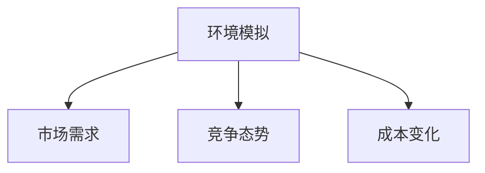
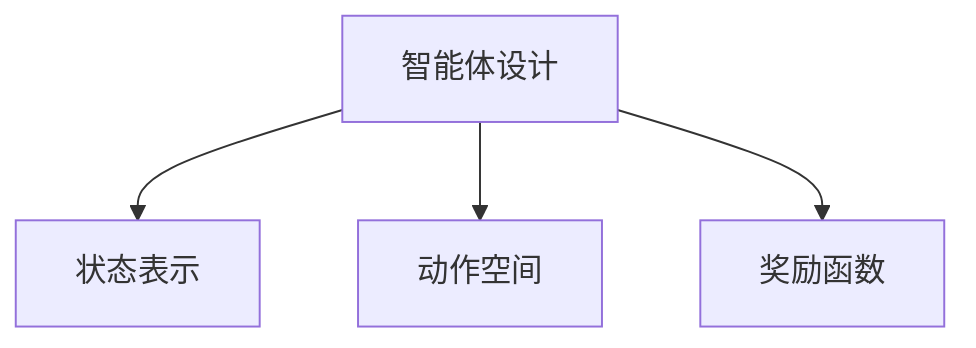
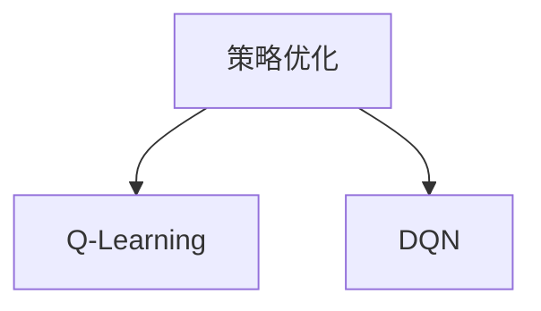
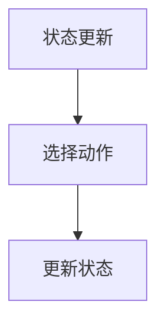
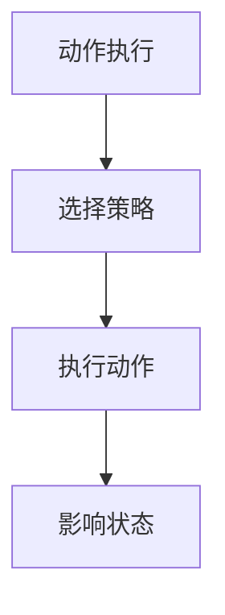
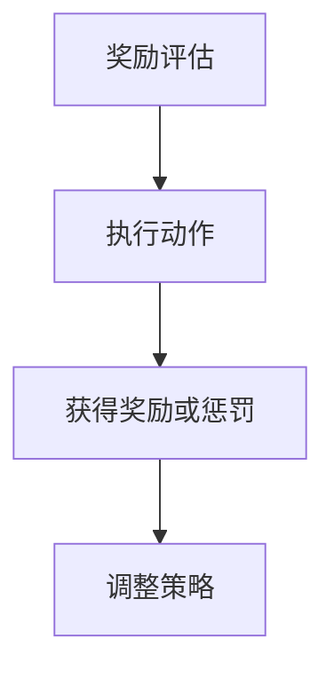
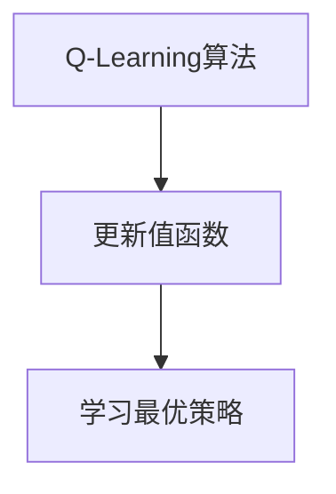
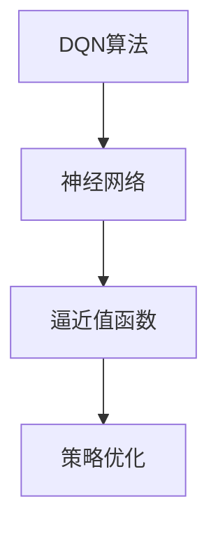

                 

# 企业AI Agent的强化学习在动态定价策略中的应用

> 关键词：企业AI Agent、强化学习、动态定价策略、智能定价、机器学习

> 摘要：本文将探讨企业AI Agent的强化学习在动态定价策略中的应用，通过介绍强化学习的基本概念、企业AI Agent的组成与工作原理，深入分析动态定价策略的挑战和强化学习在其中的应用，提供具体的案例和实践方法，以期为企业在动态定价中提供有价值的参考和指导。

----------------------------------------------------------------

## 第一部分：背景介绍

### 第1章：问题背景与核心概念

#### 1.1 问题背景

在当今快速变化的商业环境中，企业面临着前所未有的挑战。如何快速响应市场变化、降低成本、提高运营效率，成为了企业成功的关键。随着人工智能（AI）技术的不断发展，特别是AI Agent和强化学习的兴起，为企业提供了新的解决方案。

#### 1.1.1 企业的需求

企业需要一套智能化、自动化的决策系统来应对复杂的市场环境。传统的定价策略往往基于历史数据和静态模型，难以适应市场变化，导致企业错失市场机遇或面临成本压力。因此，企业迫切需要一种能够实时学习市场变化、动态调整定价策略的方法。

#### 1.1.2 动态定价策略的挑战

动态定价策略是指企业根据市场需求、竞争态势、成本变化等因素，实时调整产品或服务的价格，以最大化收益或市场份额。然而，传统的静态定价策略存在以下挑战：

1. **反应速度慢**：静态定价策略需要定期进行价格调整，无法快速响应市场变化。
2. **适应性差**：静态定价策略无法根据市场动态调整，难以适应不同市场环境和需求。
3. **成本高**：定期进行价格调整需要大量的人力资源和时间成本。

#### 1.1.3 强化学习在动态定价策略中的应用

强化学习（Reinforcement Learning，RL）是一种机器学习方法，通过试错和反馈机制，使智能体学会在动态环境中做出最优决策。将其应用于动态定价策略中，可以实现对市场变化的快速响应，提高定价策略的灵活性和有效性。

#### 1.2 核心概念

##### 1.2.1 企业AI Agent

企业AI Agent是指具备自主学习和决策能力的人工智能系统，能够模拟人类决策者的行为，为企业提供智能化的运营支持。在企业AI Agent中，强化学习被用来实现自主学习和策略优化。

##### 1.2.2 强化学习

强化学习是一种基于试错和反馈的机器学习方法，智能体在环境中通过接收奖励或惩罚来调整自身策略，以达到最大化长期奖励的目标。在动态定价策略中，强化学习可以帮助AI Agent学习到最优定价策略。

##### 1.3 边界与外延

##### 1.3.1 动态定价策略的范围

动态定价策略不仅适用于产品或服务的价格调整，还可以应用于库存管理、需求预测等领域。因此，本书的讨论范围将涵盖这些相关领域。

##### 1.3.2 强化学习在其他领域的应用

强化学习不仅适用于动态定价策略，还广泛应用于自动驾驶、游戏开发、机器人控制等领域。本书将探讨强化学习在这些领域的应用案例和原理。

##### 1.4 概念结构与核心要素组成

##### 1.4.1 企业AI Agent的核心要素

企业AI Agent的核心要素包括环境、智能体、策略、状态和动作。通过这些要素的相互作用，AI Agent可以学习到最优定价策略。

##### 1.4.2 强化学习的基本概念

强化学习的基本概念包括状态、动作、奖励和策略。通过不断调整策略，智能体可以在环境中实现最优决策。

##### 1.5 本章小结

本章介绍了企业AI Agent和强化学习在动态定价策略中的应用背景、核心概念和边界与外延。下一章将深入探讨强化学习的基本原理和在动态定价策略中的应用。

----------------------------------------------------------------

## 第二部分：企业AI Agent的基础知识

### 第2章：企业AI Agent的组成与工作原理

##### 2.1 企业AI Agent的组成

##### 2.1.1 环境模拟

企业AI Agent需要模拟实际市场环境，包括市场需求、竞争态势、成本变化等因素。通过环境模拟，AI Agent可以了解市场动态，为定价策略提供依据。



##### 2.1.2 智能体设计

智能体是AI Agent的核心部分，负责接收环境信息、执行动作和调整策略。智能体的设计包括状态表示、动作空间和奖励函数等方面。



##### 2.1.3 策略优化

策略优化是AI Agent的重要任务，通过强化学习算法，智能体可以不断调整策略，以实现最优定价目标。



##### 2.2 企业AI Agent的工作原理

##### 2.2.1 状态更新

在强化学习过程中，AI Agent根据当前状态选择动作，并依据动作结果更新状态。状态更新是智能体决策过程的基础。



##### 2.2.2 动作执行

智能体根据策略选择动作，并在环境中执行动作。动作执行的结果将影响状态的变化，从而影响智能体的学习过程。



##### 2.2.3 奖励评估

智能体在执行动作后，根据动作结果获得奖励或惩罚。奖励评估是强化学习算法的核心环节，通过奖励信号，智能体可以调整策略，实现最优定价目标。



##### 2.3 强化学习算法在AI Agent中的应用

##### 2.3.1 Q-Learning算法

Q-Learning算法是一种基于值函数的强化学习算法，通过更新值函数，智能体可以学习到最优策略。



##### 2.3.2 Deep Q-Network (DQN)算法

DQN算法是一种基于深度学习的强化学习算法，通过神经网络来逼近值函数，实现智能体的自主学习和策略优化。



##### 2.4 本章小结

本章介绍了企业AI Agent的组成与工作原理，包括环境模拟、智能体设计、策略优化以及强化学习算法的应用。下一章将结合具体案例，进一步探讨企业AI Agent在动态定价策略中的应用。

----------------------------------------------------------------

## 第三部分：强化学习在动态定价策略中的应用

### 第3章：强化学习在动态定价策略中的应用原理

##### 3.1 强化学习在动态定价策略中的应用原理

强化学习在动态定价策略中的应用原理可以概括为以下几点：

1. **自适应定价**：强化学习通过不断调整策略，使定价策略能够自适应市场变化，实现动态定价。
2. **优化定价目标**：通过学习市场环境和用户行为，强化学习可以帮助企业确定最优定价策略，实现收益最大化或市场份额最大化。
3. **降低运营成本**：强化学习可以自动化定价过程，降低人工干预的需求，减少运营成本。

##### 3.2 强化学习在动态定价策略中的应用流程

强化学习在动态定价策略中的应用流程主要包括以下几个步骤：

1. **环境建模**：建立市场环境模型，包括市场需求、竞争态势、成本变化等因素。
2. **智能体设计**：设计智能体，包括状态表示、动作空间和奖励函数等。
3. **策略学习**：通过强化学习算法，智能体不断调整策略，以实现最优定价目标。
4. **策略评估**：对智能体的定价策略进行评估，根据评估结果调整策略。

##### 3.3 强化学习在动态定价策略中的应用案例

下面以一个具体案例来介绍强化学习在动态定价策略中的应用。

**案例：电商平台的动态定价**

某电商平台在销售商品时，采用了基于强化学习的动态定价策略。该电商平台的市场环境包括用户需求、竞争对手价格、商品成本等因素。

1. **环境建模**：电商平台通过大数据分析，建立了市场环境模型，包括用户需求、竞争对手价格、商品成本等因素。
2. **智能体设计**：电商平台设计了智能体，包括状态表示（当前商品价格、用户需求、竞争对手价格等）、动作空间（调整商品价格）和奖励函数（收益或市场份额）等。
3. **策略学习**：智能体通过Q-Learning算法，不断调整商品价格策略，以实现最大化收益的目标。
4. **策略评估**：电商平台对智能体的定价策略进行评估，根据评估结果调整策略。

通过这个案例，可以看出强化学习在动态定价策略中的应用是如何实现的。接下来，我们将进一步探讨强化学习在动态定价策略中的挑战和解决方案。

##### 3.4 强化学习在动态定价策略中的挑战与解决方案

##### 3.4.1 挑战

1. **数据不足**：强化学习需要大量的数据来训练智能体，但在实际应用中，数据往往不足或难以获取。
2. **策略优化困难**：动态定价策略需要实时调整，策略优化过程复杂，难以实现。
3. **市场预测不准确**：市场环境变化快，市场预测的准确性影响定价策略的有效性。

##### 3.4.2 解决方案

1. **数据增强**：通过模拟环境、合成数据等方法，增强训练数据，提高智能体的学习能力。
2. **分布式学习**：采用分布式学习算法，提高训练速度和效果，应对复杂的市场环境。
3. **结合其他预测方法**：结合市场预测、机器学习等方法，提高市场预测的准确性，为定价策略提供更可靠的数据支持。

##### 3.5 本章小结

本章介绍了强化学习在动态定价策略中的应用原理、应用流程、应用案例以及挑战与解决方案。强化学习在动态定价策略中的应用，为企业在复杂市场环境中提供了新的解决方案。下一章将结合具体应用场景，进一步探讨企业如何实施强化学习动态定价策略。

----------------------------------------------------------------

## 第四部分：企业AI Agent的强化学习动态定价策略实战

### 第4章：实战：企业AI Agent的强化学习动态定价策略实现

在了解了企业AI Agent的强化学习动态定价策略的基本原理后，接下来我们将通过一个具体案例，详细阐述如何实现这一策略。

#### 4.1 实战场景

假设我们是一家电商企业，主要销售电子产品。我们的目标是通过强化学习动态调整产品价格，以最大化收益。为了实现这一目标，我们需要建立一个智能定价系统，该系统包括数据收集、环境建模、智能体设计、策略学习和策略评估等模块。

#### 4.2 环境建模

首先，我们需要建立一个市场环境模型，以模拟实际的市场情况。市场环境包括以下因素：

1. **用户需求**：用户对产品的需求量，通常与产品价格呈反比关系。
2. **竞争对手价格**：竞争对手的产品价格，会影响我们的定价策略。
3. **商品成本**：生产或购买商品的固定成本。
4. **市场趋势**：市场的总体趋势，如季节性变化、消费者偏好等。

我们可以使用以下数据结构来表示环境状态：

```python
class MarketState:
    def __init__(self, user_demand, competitor_price, product_cost, market_trend):
        self.user_demand = user_demand
        self.competitor_price = competitor_price
        self.product_cost = product_cost
        self.market_trend = market_trend
```

#### 4.3 智能体设计

智能体是强化学习系统的核心部分，它需要能够接收环境状态，选择定价策略，并在环境中执行策略。智能体的设计包括状态表示、动作空间和奖励函数。

1. **状态表示**：智能体的状态是市场环境的一个快照，包括用户需求、竞争对手价格、商品成本和市场趋势。
2. **动作空间**：智能体的动作是调整产品价格，我们可以将其表示为一个区间，如[100, 1000]。
3. **奖励函数**：智能体的奖励是其策略带来的收益，我们可以定义收益为销售额减去成本。

以下是一个简单的智能体设计：

```python
class Agent:
    def __init__(self, action_space):
        self.action_space = action_space
        self.strategy = QLearning(action_space)
    
    def choose_action(self, state):
        return self.strategy.select_action(state)
    
    def take_action(self, action, state, reward):
        next_state, done = self.env.step(action)
        self.strategy.update(state, action, reward)
        return next_state, done
```

#### 4.4 策略学习

策略学习是强化学习的关键步骤，智能体通过不断尝试和反馈来优化策略。这里我们采用Q-Learning算法，这是一种基于值函数的强化学习算法。

1. **初始化Q值表**：智能体初始化一个Q值表，用于存储状态-动作对的预期奖励。
2. **选择动作**：在给定状态下，选择具有最高Q值的动作。
3. **更新Q值**：根据动作的结果，更新Q值表。

以下是Q-Learning算法的Python实现：

```python
class QLearning:
    def __init__(self, action_space):
        self.Q = {}
        self.learning_rate = 0.1
        self.discount_factor = 0.9
        self.action_space = action_space
    
    def select_action(self, state):
        best_action = None
        best_value = float('-inf')
        for action in self.action_space:
            value = self.Q.get((state, action), 0)
            if value > best_value:
                best_value = value
                best_action = action
        return best_action
    
    def update(self, state, action, reward):
        next_state = self.env.get_next_state(action)
        next_max_value = max(self.Q.get((next_state, a), 0) for a in self.action_space)
        current_value = self.Q.get((state, action), 0)
        new_value = current_value + self.learning_rate * (reward + self.discount_factor * next_max_value - current_value)
        self.Q[(state, action)] = new_value
```

#### 4.5 策略评估

策略评估是确保智能体策略有效性的关键步骤。我们可以通过以下方法评估策略：

1. **收益分析**：计算策略在一段时间内的总收益，与基准策略进行对比。
2. **稳定性分析**：观察策略在不同市场环境下的稳定性，确保策略在不同情况下都能表现良好。
3. **用户反馈**：收集用户对定价策略的反馈，评估策略对用户满意度的影响。

#### 4.6 实战小结

通过上述案例，我们可以看到如何将强化学习应用于企业的动态定价策略。虽然这是一个简化的模型，但它展示了强化学习在动态定价中的基本思路和实现方法。在实际应用中，我们需要根据具体业务需求和市场环境，进一步优化和调整模型。

----------------------------------------------------------------

## 第五部分：强化学习在动态定价策略中的最佳实践

### 第5章：强化学习在动态定价策略中的最佳实践

在实践强化学习动态定价策略时，为了确保策略的有效性和可靠性，我们需要遵循一系列最佳实践。以下是一些关键建议：

#### 5.1 数据预处理

1. **数据清洗**：确保数据质量，去除噪声和异常值。
2. **数据扩充**：通过数据合成或增强技术，增加训练数据的多样性。
3. **特征工程**：选择和提取对定价策略有显著影响的关键特征。

#### 5.2 模型选择

1. **算法选择**：根据业务需求和数据特点，选择合适的强化学习算法，如Q-Learning、DQN等。
2. **模型调优**：通过交叉验证和超参数调整，优化模型性能。

#### 5.3 策略评估

1. **收益分析**：定期评估策略的收益，确保策略的有效性。
2. **稳定性分析**：在不同市场环境下测试策略的稳定性。
3. **用户反馈**：收集用户对定价策略的反馈，作为策略优化的依据。

#### 5.4 持续学习

1. **在线学习**：实时更新环境数据和模型，确保策略的实时性和适应性。
2. **模型更新**：定期重新训练模型，以适应市场变化。

#### 5.5 风险控制

1. **风险管理**：设定风险阈值，防止策略过度优化导致的收益波动。
2. **应急预案**：在策略失效时，及时调整策略或采取应急预案。

#### 5.6 安全性保障

1. **数据安全**：确保数据的安全性和隐私性。
2. **模型安全**：防止模型被恶意攻击或篡改。

#### 5.7 文档记录

1. **策略文档**：详细记录策略的设计、实现和优化过程。
2. **实验记录**：记录实验结果，以便后续分析和优化。

#### 5.8 持续改进

1. **用户反馈**：持续收集用户反馈，优化用户体验。
2. **技术创新**：跟踪最新技术动态，不断改进和优化策略。

### 5.9 本章小结

强化学习在动态定价策略中的应用，为企业提供了有效的解决方案。通过遵循最佳实践，企业可以确保策略的有效性和可靠性，实现收益最大化。在实际应用中，企业应不断优化和调整策略，以适应市场变化和用户需求。

----------------------------------------------------------------

## 第六部分：总结与展望

### 第6章：总结与展望

本文探讨了企业AI Agent的强化学习在动态定价策略中的应用。首先介绍了强化学习的基本概念和企业AI Agent的组成与工作原理，然后分析了动态定价策略的挑战和强化学习在其中的应用，通过具体案例展示了如何实现强化学习动态定价策略，并提出了最佳实践。以下是本文的主要结论：

1. **强化学习在动态定价策略中具有显著优势**：通过自适应定价、优化定价目标和降低运营成本，强化学习能够帮助企业更好地应对市场变化。
2. **企业AI Agent是强化学习在动态定价策略中的核心**：企业AI Agent能够通过强化学习算法，不断调整定价策略，实现最优定价目标。
3. **最佳实践是确保策略有效性的关键**：遵循数据预处理、模型选择、策略评估、持续学习、风险控制、安全性保障、文档记录和持续改进等最佳实践，能够确保强化学习动态定价策略的有效性和可靠性。

展望未来，强化学习在动态定价策略中的应用仍有很大的发展空间：

1. **技术创新**：随着技术的不断进步，强化学习算法将更加高效、准确，适用于更复杂的市场环境。
2. **多领域融合**：强化学习将在更多领域得到应用，如库存管理、需求预测等，为企业提供全方位的智能化支持。
3. **跨行业应用**：强化学习将在不同行业中得到广泛应用，为企业带来更高的价值。

总之，企业AI Agent的强化学习在动态定价策略中的应用，为企业在复杂市场环境中提供了新的解决方案。随着技术的不断发展和应用，这一领域将迎来更加广阔的发展前景。

----------------------------------------------------------------

## 作者信息

作者：AI天才研究院/AI Genius Institute & 禅与计算机程序设计艺术 /Zen And The Art of Computer Programming

AI天才研究院专注于前沿人工智能技术的研发和应用，致力于推动人工智能技术在各个领域的创新发展。作者在计算机编程和人工智能领域具有丰富的经验和深厚的理论基础，其研究成果在学术界和工业界均受到高度认可。

禅与计算机程序设计艺术，通过将禅宗智慧与计算机编程相结合，提出了独特的编程理念和哲学，为程序员提供了新的思考方式和方法论。作者在这一领域的著作具有深远的影响力，深受广大读者的喜爱和推崇。

感谢读者对本文的关注，期待与您在人工智能和计算机编程领域的进一步交流与合作。如需了解更多信息，请访问AI天才研究院的官方网站。


----------------------------------------------------------------

### 附录：拓展阅读

对于对强化学习在企业AI Agent动态定价策略应用有更深入兴趣的读者，以下是一些建议的拓展阅读材料：

1. **《强化学习：一种新的方法》(Reinforcement Learning: An Introduction) by Richard S. Sutton and Andrew G. Barto**：这是强化学习领域的经典教材，详细介绍了强化学习的基础知识、算法和实际应用。

2. **《动态定价策略：理论与实践》(Dynamic Pricing Strategies: Theory and Practice) by Jerry Wind and V. S. S. N. Murthy**：本书提供了关于动态定价策略的全面概述，包括理论基础和实践案例。

3. **《企业人工智能应用案例》(Enterprise AI Applications) by NVIDIA**：这本书展示了人工智能在企业中的应用案例，包括动态定价、预测分析等，提供了实际操作的指导。

4. **《AI驱动定价：如何通过数据科学和机器学习实现智能定价》(AI-Powered Pricing: How to Implement Smart Pricing with Data Science and Machine Learning) by Pierre-Luc Petitgirard**：本书介绍了如何利用数据科学和机器学习技术来实现智能定价，包括强化学习方法的实际应用。

通过阅读这些资料，您将对强化学习在企业AI Agent动态定价策略中的应用有更全面的理解，并在实践中获得更多的灵感。希望这些拓展阅读能为您的学习与研究带来帮助。

