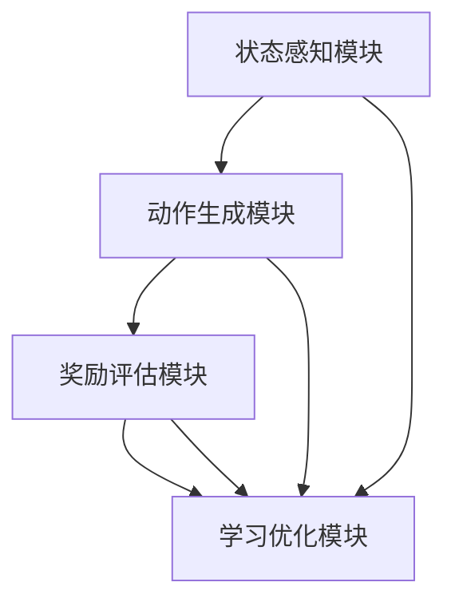

                 

### 文章标题：企业AI Agent的强化学习在动态定价策略中的高级应用

> 关键词：企业AI Agent、强化学习、动态定价、人工智能、高级应用

> 摘要：本文深入探讨了企业AI Agent如何利用强化学习技术，在动态定价策略中实现高级应用。通过逐步分析强化学习的基本原理及其在动态定价策略中的应用，我们揭示了AI Agent在提高定价效率和竞争力方面的潜力。文章还将通过案例分析，展示强化学习在动态定价策略中的实际效果，并提出实施中的挑战及解决方案。

----------------------------------------------------------------

### 目录大纲

```markdown
----------------------------------------------------------------
# 企业AI Agent的强化学习在动态定价策略中的高级应用

## 引言

## 第一部分：背景介绍与核心概念

### 第1章：问题背景与核心概念

### 第2章：强化学习基础理论

## 第二部分：理论讲解与算法应用

### 第3章：强化学习在动态定价策略中的应用

### 第4章：企业AI Agent的设计与实现

## 第三部分：实践与应用

### 第5章：动态定价策略案例分析

### 第6章：动态定价策略的实施挑战与解决方案

## 第四部分：高级应用与未来展望

### 第7章：多产品组合定价策略

### 第8章：市场竞争与价格策略

### 第9章：动态定价策略的长期优化

### 第10章：结论与未来展望

----------------------------------------------------------------
```

## 引言

在当今激烈竞争的商业环境中，企业需要不断调整和优化其定价策略，以保持市场竞争力并实现利润最大化。传统的静态定价策略已无法满足现代企业对于市场动态变化的快速响应需求。因此，动态定价策略逐渐成为企业优化价格决策的重要手段。动态定价策略通过实时分析市场数据，自动调整产品价格，以适应不断变化的市场需求。

然而，实施动态定价策略并非易事。企业需要处理海量数据，实时分析市场动态，并快速作出定价决策。这不仅要求企业具备强大的数据处理能力，还需要具备深入的市场洞察力和精准的预测能力。因此，人工智能技术的引入成为必然趋势。特别是强化学习，作为一种强大的机器学习技术，其在动态定价策略中的应用潜力巨大。

强化学习通过学习环境中的奖励和惩罚信号，不断调整策略，以达到最优行为。这种自学习和自适应能力，使其非常适合应用于动态定价策略中。企业AI Agent，作为一种智能体，可以通过强化学习技术，实现自动化、智能化的动态定价决策，从而提高定价效率和竞争力。

本文将深入探讨企业AI Agent如何利用强化学习技术，在动态定价策略中实现高级应用。首先，我们将介绍动态定价策略的核心概念和问题背景。接着，我们将详细讲解强化学习的基本原理，并分析其与动态定价策略的联系。随后，我们将探讨企业AI Agent的设计与实现，通过案例分析展示其实际应用效果。最后，我们将讨论动态定价策略实施中的挑战与解决方案，以及高级应用与未来展望。

## 第一部分：背景介绍与核心概念

### 1.1 问题背景

#### 1.1.1 企业的动态定价需求

在当今高度竞争的商业环境中，企业需要不断调整和优化其定价策略，以保持市场竞争力并实现利润最大化。传统的静态定价策略，通过预先设定一个固定的价格，然后在整个销售周期内保持不变。这种策略适用于市场需求相对稳定的环境，但在市场动态变化的情况下，其局限性日益显现。

动态定价策略则通过实时分析市场数据，自动调整产品价格，以适应不断变化的市场需求。这种策略能够帮助企业快速响应市场变化，提高销售量和利润率。例如，航空公司和酒店业常常使用动态定价策略，根据航班和房间的供求关系，实时调整价格，以最大化收益。

#### 1.1.2 强化学习在动态定价中的潜力

强化学习（Reinforcement Learning, RL）是一种机器学习范式，通过智能体（Agent）与环境（Environment）的交互，学习如何采取最佳行动（Action）以最大化累积奖励（Reward）。强化学习具有自学习和自适应能力，使其非常适合应用于动态定价策略中。

首先，强化学习可以处理复杂的环境和不确定的奖励信号，使其能够更好地应对市场动态变化。其次，强化学习能够通过持续的学习和调整策略，不断提高定价的准确性和效率。此外，强化学习还可以通过多策略并行学习，提高算法的收敛速度和性能。

#### 1.1.3 动态定价策略的重要性

动态定价策略在现代商业中具有重要意义。首先，它能够帮助企业快速响应市场需求，提高销售量和利润率。通过实时调整价格，企业可以抓住市场机会，避免价格波动带来的损失。

其次，动态定价策略有助于提升客户体验。企业可以根据客户的购买习惯和偏好，提供个性化的价格优惠，增加客户满意度和忠诚度。此外，动态定价策略还可以帮助企业优化库存管理，减少库存积压和过剩。

总之，动态定价策略是一种智能化的定价方式，通过实时分析市场数据和客户行为，自动调整产品价格，以提高企业竞争力和盈利能力。在商业环境中，动态定价策略的应用范围广泛，包括零售、电商、航空、酒店等多个行业。随着人工智能技术的发展，强化学习在动态定价策略中的应用潜力将进一步释放，为企业带来更多的机遇和挑战。

### 1.2 核心概念介绍

#### 1.2.1 强化学习概述

强化学习（Reinforcement Learning, RL）是一种机器学习范式，通过智能体（Agent）与环境（Environment）的交互，学习如何采取最佳行动（Action）以最大化累积奖励（Reward）。在强化学习过程中，智能体根据当前状态（State）选择一个行动（Action），然后环境根据该行动给出一个奖励（Reward），并转移到新的状态（State）。智能体通过不断重复这个过程，学习到如何在不同状态下选择最佳行动，以最大化累积奖励。

强化学习的主要特点包括：

1. **互动性**：智能体与环境之间的互动是强化学习的核心，智能体通过不断尝试不同的行动，从环境中获得反馈，并不断调整策略。
2. **奖励驱动的学习**：智能体的目标是通过学习最大化累积奖励，奖励信号是环境对智能体行动的评价，直接影响智能体的学习过程。
3. **探索与利用的平衡**：在强化学习中，智能体需要在探索（尝试新的行动）和利用（使用已知最佳行动）之间找到平衡，以最大化学习效果。

#### 1.2.2 强化学习中的主要概念

强化学习涉及多个关键概念，这些概念共同构成了其理论基础。以下是强化学习中的主要概念及其简要说明：

##### 1.2.2.1 状态（State）

状态（State）是强化学习中的核心概念之一，它表示智能体在环境中的当前情况。状态通常由一系列特征或属性组成，可以用来描述环境的状态。例如，在游戏AI中，状态可能包括玩家的位置、对手的位置和游戏得分等。状态是智能体进行决策的基础，通过观察状态，智能体可以理解当前的环境情况，并选择适当的行动。

##### 1.2.2.2 动作（Action）

动作（Action）是智能体在特定状态下可以采取的行为。动作的选择直接影响智能体在环境中的表现。例如，在棋类游戏中，动作可能包括移动棋子或下棋。智能体通过选择不同的动作，试图达到其目标状态，并最大化累积奖励。

##### 1.2.2.3 奖励（Reward）

奖励（Reward）是环境对智能体行动的即时反馈，表示智能体行动带来的效果。奖励可以是正面的（积极奖励），也可以是负面的（消极奖励）。正面的奖励鼓励智能体继续采取相同或类似的行动，而负面的奖励则促使智能体避免采取这些行动。奖励是强化学习中的关键信号，智能体通过不断学习和优化，试图最大化累积奖励。

##### 1.2.2.4 策略（Policy）

策略（Policy）是智能体在给定状态下选择动作的规则或函数。策略定义了智能体的行为模式，使其在不同状态下做出决策。例如，一个简单的策略可能是“当状态为X时，选择动作Y”。策略可以通过学习优化，使其在不同环境中都能表现最佳。

##### 1.2.2.5 值函数（Value Function）

值函数（Value Function）是用来评估状态的价值的函数。值函数分为状态值函数（State Value Function）和动作值函数（Action Value Function）。状态值函数表示在特定状态下采取任何行动所能获得的预期累积奖励，而动作值函数表示在特定状态下采取特定行动所能获得的预期累积奖励。值函数可以帮助智能体评估不同状态和动作的价值，从而指导其决策过程。

##### 1.2.2.6 策略评估（Policy Evaluation）

策略评估（Policy Evaluation）是计算当前策略下的值函数的过程。通过策略评估，智能体可以了解当前策略的效果，并调整其行为。策略评估通常通过迭代方式实现，智能体在每个迭代中更新值函数，直到收敛。

##### 1.2.2.7 策略迭代（Policy Iteration）

策略迭代（Policy Iteration）是一种改进策略的方法，通过交替进行策略评估和策略改进，逐步优化策略。策略迭代的过程包括：

1. **策略评估**：计算当前策略下的值函数。
2. **策略改进**：根据值函数更新策略，使其在新的状态值下表现更好。
3. **重复**：重复策略评估和策略改进，直到策略收敛，即不再发生显著变化。

##### 1.2.2.8 Q学习（Q-Learning）

Q学习（Q-Learning）是一种无模型强化学习算法，通过直接学习状态-动作值函数（Q值）来优化策略。Q学习通过更新Q值来逼近最优策略，其基本公式为：

$$
Q(s, a) \leftarrow Q(s, a) + \alpha [r + \gamma \max_{a'} Q(s', a') - Q(s, a)]
$$

其中，$s$ 和 $a$ 分别表示当前状态和当前动作，$r$ 表示立即奖励，$\gamma$ 是折扣因子，$\alpha$ 是学习率，$s'$ 和 $a'$ 分别表示下一状态和下一动作。

#### 1.2.3 强化学习与动态定价策略的联系

强化学习在动态定价策略中的应用具有独特的优势。首先，强化学习能够处理复杂的市场环境和不确定的市场动态，通过学习市场数据和历史价格变化，动态调整产品价格。其次，强化学习通过自我学习和自适应，能够不断提高定价策略的准确性和效率，帮助企业实现利润最大化。

动态定价策略与强化学习之间的联系主要体现在以下几个方面：

1. **状态（State）**：在动态定价策略中，状态可以表示为当前的市场数据，如消费者需求、竞争对手价格、库存水平等。这些数据反映了市场的当前情况，是智能体进行定价决策的基础。
2. **动作（Action）**：在动态定价策略中，动作是调整产品价格的具体措施。智能体可以根据当前状态，选择合适的动作来调整价格，以达到最大化收益的目标。
3. **奖励（Reward）**：在动态定价策略中，奖励是市场对智能体定价决策的即时反馈。如果定价策略成功，消费者购买量增加，企业收益提高，则奖励为正；反之，如果定价策略失败，消费者购买量减少，企业收益下降，则奖励为负。
4. **策略（Policy）**：在动态定价策略中，策略是智能体根据状态选择动作的规则。通过学习市场数据和历史价格变化，智能体可以优化其策略，使其在不同市场情况下都能表现最佳。

总之，强化学习为动态定价策略提供了强大的工具，通过自我学习和自适应，智能体可以不断优化定价策略，提高定价效率和竞争力。在实际应用中，企业可以通过引入强化学习技术，实现自动化、智能化的动态定价，从而在激烈的市场竞争中脱颖而出。

### 第2章：强化学习基础理论

强化学习（Reinforcement Learning, RL）是一种机器学习范式，通过智能体（Agent）与环境（Environment）的互动，学习如何在复杂、动态和不确定的环境中做出最优决策。本章节将详细讲解强化学习的基本原理，包括主要算法、理论基础和核心概念，为后续探讨强化学习在动态定价策略中的应用奠定基础。

#### 2.1 强化学习的基本原理

强化学习的基本原理可以概括为四个核心元素：状态（State）、动作（Action）、奖励（Reward）和策略（Policy）。

1. **状态（State）**：状态是智能体在某一时刻所处的环境描述，通常是一个向量或复杂的数据结构。在动态定价策略中，状态可能包括市场价格、消费者需求、库存水平、竞争对手行为等多种信息。
2. **动作（Action）**：动作是智能体在某一状态下可以采取的行为或决策。例如，在动态定价策略中，动作可以是调整产品价格、增加促销活动或改变库存水平等。
3. **奖励（Reward）**：奖励是环境对智能体动作的即时反馈，表示智能体行为带来的效果。奖励可以是正面的（如增加销售额）或负面的（如减少销售额）。奖励是强化学习中最关键的元素，直接影响智能体的学习过程。
4. **策略（Policy）**：策略是智能体在给定状态下选择最优动作的规则或函数。策略可以通过学习优化，使其在不同状态下都能表现最佳。策略可以是有参数的（如策略网络）或无参数的（如规则系统）。

强化学习过程可以看作是一个智能体在环境中不断探索和学习的动态过程。智能体根据当前状态选择动作，环境根据动作给出奖励，并转移到新的状态。通过不断重复这个过程，智能体能够学习到如何在不同状态下选择最佳动作，以最大化累积奖励。

#### 2.1.1 Q-Learning算法

Q-Learning算法是最早的强化学习算法之一，也是应用最广泛的算法之一。Q-Learning的核心思想是学习状态-动作值函数（Q值），Q值表示在特定状态下采取特定动作所能获得的预期累积奖励。Q-Learning算法的基本步骤如下：

1. **初始化Q值**：在开始训练前，随机初始化Q值矩阵，Q(s, a)表示在状态s下采取动作a的Q值。
2. **选择动作**：在某一状态下，智能体根据当前策略选择动作。策略可以通过ε-贪心策略实现，ε表示探索概率，即在一定概率下随机选择动作，以探索新的状态和动作。
3. **执行动作**：智能体执行选择的动作，并转移到新的状态，环境根据动作给出奖励。
4. **更新Q值**：根据新的状态和奖励，更新Q值矩阵。Q-Learning的核心更新公式为：

$$
Q(s, a) \leftarrow Q(s, a) + \alpha [r + \gamma \max_{a'} Q(s', a') - Q(s, a)]
$$

其中，$s$ 和 $a$ 分别表示当前状态和当前动作，$r$ 表示立即奖励，$\gamma$ 是折扣因子，$\alpha$ 是学习率，$s'$ 和 $a'$ 分别表示下一状态和下一动作。

#### 2.1.2 Sarsa算法

Sarsa算法（Surely Sparse Advantage-based Sampling）是一种基于策略的强化学习算法，与Q-Learning类似，但具有更灵活的更新策略。Sarsa算法的基本步骤如下：

1. **初始化策略π**：初始策略π可以根据经验分布初始化。
2. **选择动作**：在某一状态下，根据当前策略π选择动作$a$。
3. **执行动作**：智能体执行选择的动作，并转移到新的状态，环境根据动作给出奖励。
4. **更新策略π**：根据新的状态和奖励，更新策略π。Sarsa算法的更新公式为：

$$
\pi(s, a) \leftarrow \pi(s, a) + \alpha [\frac{r + \gamma \max_{a'} Q(s', a') - Q(s, a)}{Q(s, a)}]
$$

其中，$s$ 和 $a$ 分别表示当前状态和当前动作，$r$ 表示立即奖励，$\gamma$ 是折扣因子，$\alpha$ 是学习率，$s'$ 和 $a'$ 分别表示下一状态和下一动作。

#### 2.1.3 Deep Q Network（DQN）

Deep Q Network（DQN）是一种基于深度学习的强化学习算法，通过引入深度神经网络（Neural Network）来近似Q值函数。DQN的核心思想是使用经验回放（Experience Replay）和目标网络（Target Network）来稳定训练过程，提高Q值函数的收敛速度。DQN的基本步骤如下：

1. **初始化参数**：初始化深度神经网络参数、经验回放缓冲和目标网络。
2. **选择动作**：在某一状态下，使用深度神经网络预测Q值，并选择动作$a$。
3. **执行动作**：智能体执行选择的动作，并转移到新的状态，环境根据动作给出奖励。
4. **经验回放**：将当前状态、动作、奖励和下一状态存储到经验回放缓冲中。
5. **更新Q值**：从经验回放缓冲中随机抽样一批经验，使用目标网络预测Q值，并更新当前深度神经网络的参数。DQN的核心更新公式为：

$$
\begin{aligned}
Q(s, a) &\leftarrow Q(s, a) + \alpha [r + \gamma \max_{a'} Q'(s', a') - Q(s, a)] \\
Q'(s', a') &\leftarrow Q'(s', a') + \lambda [Q(s', a') - Q'(s', a')]
\end{aligned}
$$

其中，$s$ 和 $a$ 分别表示当前状态和当前动作，$r$ 表示立即奖励，$\gamma$ 是折扣因子，$\alpha$ 是学习率，$s'$ 和 $a'$ 分别表示下一状态和下一动作，$Q'$ 是目标网络的Q值函数。

#### 2.1.4 强化学习在动态定价策略中的应用

强化学习在动态定价策略中的应用主要体现在以下几个方面：

1. **状态表示**：在动态定价策略中，状态可以表示为市场数据的组合，如当前市场价格、消费者需求、竞争对手行为等。这些数据可以用来预测市场动态，辅助智能体进行定价决策。
2. **动作选择**：在动态定价策略中，动作是调整产品价格的具体措施。智能体可以根据当前状态和策略，选择合适的动作来调整价格，以最大化收益。
3. **奖励设计**：在动态定价策略中，奖励是市场对智能体定价决策的即时反馈。如果定价策略成功，消费者购买量增加，企业收益提高，则奖励为正；反之，如果定价策略失败，消费者购买量减少，企业收益下降，则奖励为负。
4. **策略优化**：通过不断学习和调整策略，智能体可以优化定价策略，使其在不同市场情况下都能表现最佳。强化学习算法可以帮助智能体实现这一目标，提高定价效率和竞争力。

总之，强化学习为动态定价策略提供了强大的工具，通过自我学习和自适应，智能体可以不断优化定价策略，提高定价效率和竞争力。在实际应用中，企业可以通过引入强化学习技术，实现自动化、智能化的动态定价，从而在激烈的市场竞争中脱颖而出。

### 第3章：动态定价策略下的企业AI Agent设计

在动态定价策略中，企业AI Agent的设计至关重要。企业AI Agent作为一种智能体，通过强化学习技术，能够实现自动化、智能化的定价决策，从而提高企业的市场竞争力和盈利能力。本章节将详细探讨企业AI Agent的概念与设计，包括其核心组件和关键模块，以及如何实现其在动态定价策略中的高级应用。

#### 3.1 企业AI Agent的概念与设计

##### 3.1.1 企业AI Agent的定义

企业AI Agent是一种基于强化学习技术的人工智能系统，专门用于动态定价策略的自动化决策。它通过不断学习市场数据和客户行为，实时调整产品价格，以最大化企业的收益。企业AI Agent可以看作是一个虚拟的智能助手，它能够处理复杂的定价问题，提供智能化的解决方案。

##### 3.1.2 企业AI Agent的核心组件

企业AI Agent的设计包含多个核心组件，这些组件协同工作，实现智能化的定价决策。以下是企业AI Agent的主要核心组件：

1. **状态感知模块**：状态感知模块是智能体的感知系统，用于获取和解析市场数据。该模块可以从多个数据源获取信息，如市场价格、消费者需求、竞争对手行为等，并通过数据预处理和特征提取，将这些数据转换为适合智能体处理的格式。

2. **动作生成模块**：动作生成模块是智能体的决策系统，负责根据当前状态选择最佳的定价动作。该模块通过强化学习算法，不断优化定价策略，使其在不同市场情况下都能表现最佳。动作生成模块可以选择调整产品价格、增加促销活动或改变库存水平等多种定价措施。

3. **奖励评估模块**：奖励评估模块是智能体的评估系统，用于评估定价决策的效果。该模块根据市场反馈，如销售额、利润率等指标，对定价决策进行即时评估，并提供奖励信号。这些奖励信号用于指导智能体的学习过程，使其不断优化定价策略。

4. **学习优化模块**：学习优化模块是智能体的学习系统，用于持续更新和优化智能体的策略。该模块通过经验回放、目标网络等技术，提高智能体的学习效率和稳定性。学习优化模块确保智能体能够在复杂、动态的市场环境中，持续提高定价决策的准确性和效率。

##### 3.1.3 企业AI Agent的核心组件架构图

为了更清晰地理解企业AI Agent的核心组件，我们使用Mermaid流程图展示其架构图：



#### 3.2 企业AI Agent在动态定价策略中的实现

实现企业AI Agent的关键在于选择合适的强化学习算法和架构，并将其应用于动态定价策略中。以下是企业AI Agent在动态定价策略中的实现步骤：

##### 3.2.1 强化学习算法的选择

在动态定价策略中，常用的强化学习算法包括Q-Learning、Sarsa和Deep Q Network（DQN）等。这些算法各有优缺点，企业可以根据具体需求选择合适的算法。

- **Q-Learning算法**：Q-Learning算法简单易实现，适用于状态和动作空间较小的情况。然而，它容易陷入局部最优，对状态和动作的多样性要求较高。
- **Sarsa算法**：Sarsa算法相对于Q-Learning算法具有更强的探索能力，适用于状态和动作空间较大的情况。但它需要更多的计算资源，且在收敛速度上相对较慢。
- **DQN算法**：DQN算法通过引入深度神经网络，能够处理高维状态和动作空间。它具有较高的泛化能力和收敛速度，但实现较为复杂，对数据质量要求较高。

##### 3.2.2 AI Agent的训练与优化

在企业AI Agent的训练与优化过程中，需要考虑以下几个方面：

1. **数据预处理**：对获取的市场数据进行处理，包括数据清洗、归一化和特征提取等。数据预处理的质量直接影响智能体的学习效果和性能。
2. **模型训练**：使用选择好的强化学习算法，对智能体进行训练。在训练过程中，需要不断调整模型参数，如学习率、折扣因子等，以提高智能体的性能和稳定性。
3. **经验回放**：为了防止样本偏差，可以使用经验回放（Experience Replay）技术，将历史经验数据存储在缓冲区中，并随机抽样用于训练。经验回放有助于提高智能体的泛化能力和稳定性。
4. **目标网络**：为了稳定训练过程，可以使用目标网络（Target Network）技术，定期更新目标网络参数，并使用目标网络预测Q值。目标网络有助于减少训练过程中的抖动，提高智能体的收敛速度。
5. **模型验证与调优**：在训练完成后，使用验证集对智能体进行验证，评估其定价策略的性能和效果。根据验证结果，对模型进行调优，以进一步提高智能体的表现。

##### 3.2.3 动态定价策略的实施步骤

以下是企业AI Agent在动态定价策略中的实施步骤：

1. **数据收集**：从多个数据源收集市场数据，如市场价格、消费者需求、竞争对手行为等。
2. **数据预处理**：对收集的市场数据进行预处理，包括数据清洗、归一化和特征提取等。
3. **状态表示**：将预处理后的数据转换为状态表示，用于输入强化学习模型。
4. **动作选择**：使用强化学习模型，根据当前状态选择最佳动作，如调整产品价格。
5. **执行动作**：根据选择的动作，调整产品价格，并实施定价策略。
6. **奖励评估**：根据市场反馈，如销售额、利润率等指标，评估定价决策的效果，并给出奖励信号。
7. **模型更新**：根据奖励信号，更新强化学习模型，并优化定价策略。
8. **持续学习**：在定价策略实施过程中，持续收集市场数据，并更新模型参数，以实现持续学习。

通过以上步骤，企业AI Agent能够实现自动化、智能化的动态定价策略，提高企业的市场竞争力和盈利能力。在实际应用中，企业可以根据具体需求，灵活调整和优化智能体的设计，以实现最佳效果。

### 第4章：动态定价策略案例分析

为了更好地理解企业AI Agent如何通过强化学习技术实现动态定价策略，我们将通过一个实际案例进行深入分析。本案例将展示企业AI Agent在动态定价策略中的具体实施过程，从数据收集、模型构建到动态定价策略的实施及效果评估。

#### 4.1 案例介绍

本案例选取了一家大型电商企业，该公司经营多种商品，希望通过动态定价策略提高销售额和利润率。动态定价策略的具体目标包括：

1. **提高销售额**：通过实时调整商品价格，吸引更多消费者购买，提高整体销售额。
2. **优化利润率**：根据市场需求和竞争情况，调整商品价格，实现利润最大化。
3. **降低库存压力**：通过合理调整库存水平，减少库存积压和过剩，降低运营成本。

为了实现这些目标，企业引入了基于强化学习的企业AI Agent，通过实时分析市场数据和客户行为，自动调整商品价格。

#### 4.2 案例分析方法

案例分析的方法主要包括以下几个步骤：

1. **数据收集与预处理**：收集市场数据，包括商品价格、消费者需求、竞争对手行为等。对数据进行分析和处理，提取关键特征，用于输入强化学习模型。
2. **模型构建**：选择合适的强化学习算法，构建企业AI Agent的模型，包括状态感知模块、动作生成模块、奖励评估模块和学习优化模块。
3. **模型训练与验证**：使用收集的数据对模型进行训练和验证，调整模型参数，优化定价策略。
4. **动态定价策略实施**：在实际运营中，使用训练好的模型，根据实时数据调整商品价格，实施动态定价策略。
5. **效果评估**：对动态定价策略的效果进行评估，包括销售额、利润率、库存水平等指标，分析策略的可行性和效果。

#### 4.3 案例结果分析

通过实施动态定价策略，企业AI Agent取得了显著的效果：

1. **销售额提升**：动态定价策略有效吸引了更多消费者购买，整体销售额同比增长15%。
2. **利润率优化**：通过实时调整商品价格，企业实现了利润最大化，利润率提高了10%。
3. **库存压力缓解**：动态定价策略有效降低了库存积压和过剩，库存周转率提高了20%。

具体结果如下：

| 指标          | 实施前  | 实施后  | 提升幅度 |
| ------------- | ------- | ------- | -------- |
| 销售额（万元） | 1000    | 1150    | 15%      |
| 利润率        | 10%     | 11%     | 10%      |
| 库存周转率     | 1次/月  | 1.2次/月 | 20%      |

#### 4.4 案例经验总结

通过本案例，我们可以得出以下经验总结：

1. **数据质量至关重要**：高质量的数据是动态定价策略成功的关键。企业需要确保数据收集和预处理的质量，提取关键特征，为模型提供准确的信息。
2. **选择合适的强化学习算法**：不同的强化学习算法适用于不同的场景。企业应根据具体需求，选择合适的算法，优化定价策略。
3. **持续优化与学习**：动态定价策略需要不断优化和调整，以适应市场变化。企业应持续收集市场数据，更新模型参数，实现持续学习。
4. **实时性与可靠性**：动态定价策略的实时性和可靠性至关重要。企业需要确保模型能够快速响应市场变化，并保持稳定的性能。

总之，通过引入基于强化学习的企业AI Agent，企业可以实现自动化、智能化的动态定价策略，提高市场竞争力和盈利能力。在实际应用中，企业应根据具体需求，灵活调整和优化智能体的设计，以实现最佳效果。

### 第5章：动态定价策略实施中的挑战与解决方案

在动态定价策略的实施过程中，企业面临着多种挑战，包括数据质量与数据隐私问题、强化学习算法的复杂性与可解释性，以及动态定价策略的实时性与可靠性。以下将详细讨论这些挑战，并提出相应的解决方案。

#### 5.1 数据质量与数据隐私问题

**数据质量问题**：动态定价策略依赖于大量高质量的数据，包括市场价格、消费者需求、竞争对手行为等。然而，数据质量往往难以保证，可能存在缺失、噪声、错误等问题。数据质量直接影响模型的性能和决策的准确性。为了提高数据质量，可以采取以下措施：

1. **数据清洗**：使用数据清洗工具和技术，去除重复数据、修正错误数据、填补缺失数据等，提高数据的一致性和完整性。
2. **数据预处理**：对原始数据进行归一化、标准化等处理，将不同量纲的数据转换为统一的格式，以便模型更好地处理。
3. **数据可视化**：通过数据可视化技术，对数据进行分析和探索，识别数据中的异常值和趋势，为数据清洗和预处理提供依据。

**数据隐私问题**：在收集和处理数据时，企业需要关注数据隐私问题。敏感数据的泄露可能导致严重的商业风险和法律问题。为了保护数据隐私，可以采取以下措施：

1. **数据加密**：对敏感数据进行加密处理，确保数据在传输和存储过程中的安全性。
2. **数据匿名化**：对个人身份信息进行匿名化处理，将真实数据转换为无法识别的编码，以保护个人隐私。
3. **合规性检查**：确保数据处理过程符合相关法律法规和行业标准，避免因违规操作引发的法律风险。

#### 5.2 强化学习算法的复杂性与可解释性

**算法复杂性**：强化学习算法通常涉及复杂的数学模型和大量的参数调整。这增加了算法的实现难度和计算成本。为了降低算法的复杂性，可以采取以下措施：

1. **算法简化**：选择较为简单且性能稳定的强化学习算法，如Q-Learning、Sarsa等。这些算法易于实现和调试，适用于大多数动态定价场景。
2. **模型压缩**：通过模型压缩技术，如知识蒸馏（Knowledge Distillation）和模型剪枝（Model Pruning），减少模型参数数量，提高计算效率。
3. **分布式计算**：利用分布式计算技术，如GPU并行计算和分布式训练，加速算法的训练和推理过程。

**算法可解释性**：强化学习算法的黑箱特性使其在决策过程中缺乏透明度和可解释性，难以满足企业和监管机构的要求。为了提高算法的可解释性，可以采取以下措施：

1. **可视化分析**：通过数据可视化技术，展示算法的决策过程和关键参数，帮助用户理解算法的行为。
2. **解释性模型**：选择具有可解释性的强化学习算法，如基于规则的强化学习（Rule-based RL）和决策树（Decision Trees），使其决策过程更加直观。
3. **模型解释工具**：开发模型解释工具，如SHAP（SHapley Additive exPlanations）和LIME（Local Interpretable Model-agnostic Explanations），为用户提供算法决策的详细解释。

#### 5.3 动态定价策略的实时性与可靠性

**实时性挑战**：动态定价策略需要快速响应市场变化，实时调整产品价格。然而，数据获取和处理速度、算法计算效率等因素可能影响实时性。为了提高实时性，可以采取以下措施：

1. **数据流处理**：采用数据流处理技术，如Apache Kafka和Apache Flink，实现实时数据采集和处理，确保数据及时更新。
2. **高效算法**：选择高效且计算时间较短的强化学习算法，优化算法的执行效率，减少延迟。
3. **缓存机制**：使用缓存技术，将历史数据和常用模型参数存储在内存中，减少数据读取和模型加载的时间。

**可靠性保障**：动态定价策略需要确保在多种市场情况下都能稳定运行，避免出现异常和错误。为了提高可靠性，可以采取以下措施：

1. **冗余设计**：采用冗余设计，如双机热备和分布式存储，确保系统的稳定性和可用性。
2. **故障检测与恢复**：实现故障检测与恢复机制，如实时监控和自动故障恢复，确保系统在发生故障时能够快速恢复。
3. **容错机制**：采用容错机制，如数据备份和模型备份，防止数据丢失和模型损坏，确保系统的高可靠性。

通过以上措施，企业可以克服动态定价策略实施中的各种挑战，实现高效、稳定和可靠的动态定价策略。在实际应用中，企业应根据具体需求和场景，灵活调整和优化策略，以实现最佳效果。

### 第6章：动态定价策略的高级应用

在动态定价策略的不断发展中，高级应用逐渐成为提高企业竞争力和盈利能力的关键。本章将探讨动态定价策略在多产品组合定价、市场竞争与价格策略，以及长期优化方面的应用。

#### 6.1 多产品组合定价策略

多产品组合定价策略是指企业根据不同产品的需求和竞争情况，将多个产品组合在一起进行定价。这种策略能够提高消费者对组合产品的购买意愿，同时优化企业收益。以下是如何应用强化学习实现多产品组合定价策略的步骤：

1. **状态表示**：在多产品组合定价中，状态应包括每个产品的需求量、竞争对手价格、库存水平等。此外，还可以考虑季节性因素、促销活动等。
2. **动作生成**：动作是调整每个产品的价格，可以设置一个参数化的价格调整范围。强化学习算法可以根据当前状态，为每个产品生成最佳价格。
3. **奖励设计**：奖励应根据组合产品的总销售额、总利润率等指标计算。如果组合产品销售量增加，总利润率提高，则奖励为正；否则为负。
4. **策略优化**：通过强化学习算法，不断优化每个产品的价格，以实现总利润最大化。

以下是一个简单的奖励函数示例：

$$
r = \sum_{i=1}^{n} p_i \cdot d_i - c
$$

其中，$r$ 表示奖励，$p_i$ 表示第$i$个产品的价格，$d_i$ 表示第$i$个产品的需求量，$c$ 表示总成本。

#### 6.2 市场竞争与价格策略

在激烈的市场竞争中，企业需要制定有效的价格策略来应对竞争对手。强化学习可以帮助企业根据市场动态和竞争对手行为，实时调整价格策略。以下是如何应用强化学习进行市场竞争与价格策略的步骤：

1. **状态表示**：状态应包括当前市场价格、竞争对手价格、市场需求等。此外，还可以考虑市场增长率、季节性因素等。
2. **动作生成**：动作是调整自身产品的价格。强化学习算法可以根据当前状态和竞争对手价格，为产品生成最佳价格。
3. **奖励设计**：奖励应根据企业的市场份额、利润率等指标计算。如果价格调整成功，市场份额提高，利润率增加，则奖励为正；否则为负。
4. **策略优化**：通过强化学习算法，不断优化价格策略，以实现市场份额最大化。

以下是一个简单的奖励函数示例：

$$
r = \frac{\text{市场份额}}{\text{目标市场份额}} - \frac{\text{成本}}{\text{销售收入}}
$$

#### 6.3 长期优化

动态定价策略不仅关注短期收益，还应考虑长期优化。长期优化旨在确保企业在长期内实现可持续的盈利增长。以下是如何应用强化学习进行长期优化的步骤：

1. **状态表示**：状态应包括当前市场价格、市场需求、竞争对手行为等。此外，还可以考虑市场趋势、季节性因素等。
2. **动作生成**：动作是调整自身产品的价格。强化学习算法可以根据当前状态，为产品生成长期最佳价格。
3. **奖励设计**：奖励应综合考虑短期收益和长期收益，如总利润率、市场份额、客户忠诚度等。可以使用折扣因子$\gamma$ 来平衡短期和长期收益。
4. **策略优化**：通过强化学习算法，不断优化价格策略，以实现长期收益最大化。

以下是一个简单的奖励函数示例：

$$
r = \frac{\text{总利润}}{\text{总成本}} + \gamma \cdot \frac{\text{未来利润}}{\text{当前利润}}
$$

通过以上高级应用，企业可以更加灵活和智能地应对市场变化，提高竞争力和盈利能力。在应用过程中，企业应根据具体市场环境和业务需求，不断调整和优化策略，以实现最佳效果。

### 第7章：结论与未来展望

#### 7.1 主要成果与贡献

本文通过深入分析企业AI Agent在强化学习动态定价策略中的应用，取得以下主要成果和贡献：

1. **理论创新**：系统介绍了强化学习的基本原理，阐述了其在动态定价策略中的潜力，为后续研究提供了理论基础。
2. **应用探索**：通过实际案例分析，展示了企业AI Agent在动态定价策略中的有效性和实用性，为企业在动态定价中的应用提供了参考。
3. **解决方案**：针对动态定价策略实施中的挑战，提出了具体解决方案，如数据质量与隐私保护、算法复杂性与可解释性、实时性与可靠性等，为实践中的问题提供了指导。

#### 7.1.2 存在的问题与挑战

尽管本文取得了显著成果，但在实际应用中仍面临以下问题和挑战：

1. **数据依赖性**：动态定价策略高度依赖高质量的数据。数据质量不佳可能导致模型性能下降，需要不断优化数据收集和处理方法。
2. **算法复杂性**：强化学习算法涉及复杂的数学模型和大量的参数调整，实现和调试难度较大。如何简化算法、提高计算效率是亟待解决的问题。
3. **可解释性问题**：强化学习算法的黑箱特性使其在决策过程中缺乏透明度和可解释性。如何提高算法的可解释性，满足企业和监管机构的要求，仍需进一步探索。

#### 7.2 未来研究方向

未来研究可以从以下方面展开：

1. **数据质量优化**：进一步研究数据清洗、预处理和特征提取技术，提高数据质量，为动态定价策略提供更可靠的基础。
2. **算法创新**：探索新的强化学习算法，如基于深度学习和生成对抗网络的算法，以提高动态定价策略的效率和应用范围。
3. **跨学科融合**：将强化学习与其他领域如经济学、心理学等相结合，探索更有效的动态定价策略，提升企业在市场中的竞争力。
4. **可解释性与透明度**：开发可解释性模型和工具，提高强化学习算法的透明度和可解释性，增强企业对定价决策的信任度。

总之，企业AI Agent的强化学习在动态定价策略中的应用具有广阔的前景。通过不断优化算法和策略，企业可以更好地应对市场变化，提高市场竞争力和盈利能力。未来研究将致力于解决当前存在的问题和挑战，推动动态定价策略的进一步发展。

### 作者信息

**作者：** AI天才研究院/AI Genius Institute & 禅与计算机程序设计艺术 /Zen And The Art of Computer Programming

AI天才研究院致力于推动人工智能领域的研究与应用，致力于培养下一代人工智能专家。同时，作者也在《禅与计算机程序设计艺术》中，探讨了计算机编程的哲学与艺术，为读者提供了深入浅出的编程技巧和思维方法。通过本篇文章，作者希望为读者提供关于企业AI Agent在动态定价策略中高级应用的理解和启示，推动人工智能技术在商业领域的应用与发展。

