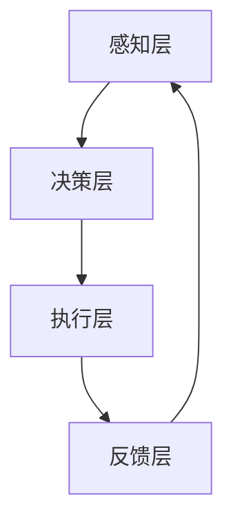
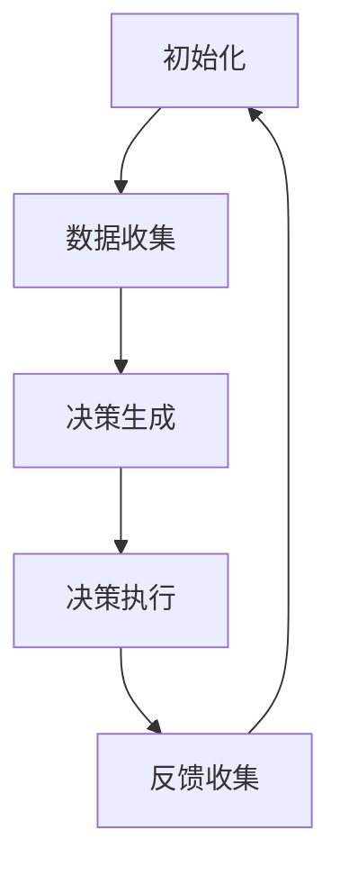

                 

## 企业AI Agent的强化学习在复杂供应链优化中的应用

### 关键词

- 企业AI Agent
- 强化学习
- 供应链优化
- 复杂系统
- 技术应用

### 摘要

本文将探讨企业AI Agent在复杂供应链优化中的应用，特别是通过强化学习技术来提升供应链管理的效率与效果。我们将从问题背景、核心概念、算法原理、系统设计与实际应用等方面进行深入分析，旨在为相关领域的研究和实践提供有价值的参考。

### 目录大纲

1. **背景介绍**
   1.1 问题背景
   1.2 问题描述
   1.3 问题解决
   1.4 边界与外延
   1.5 概念结构与核心要素组成
2. **核心概念与联系**
   2.1 强化学习的基本原理
   2.2 强化学习在供应链优化中的应用
   2.3 强化学习与供应链优化的关系
3. **算法原理讲解**
   3.1 强化学习算法的基本概念
   3.2 Q-learning算法
   3.3 Deep Q-Networks（DQN）算法
4. **数学模型和数学公式**
   4.1 强化学习的数学模型
   4.2 Q-learning算法的数学公式
   4.3 DQN算法的数学公式
5. **系统分析与架构设计方案**
   5.1 问题场景介绍
   5.2 系统功能设计
   5.3 系统架构设计
   5.4 系统接口设计
   5.5 系统交互
6. **项目实战**
   6.1 环境安装
   6.2 系统核心实现源代码
   6.3 代码应用解读与分析
   6.4 实际案例分析和详细讲解剖析
   6.5 项目小结
7. **最佳实践 Tips、小结、注意事项、拓展阅读等内容**

---

### 1. 第一部分：背景介绍

#### 1.1 问题背景

在当今全球化和信息化的时代，供应链管理成为企业核心竞争力的重要组成部分。供应链的复杂性和不确定性使得传统的优化方法难以应对。现代企业需要能够自适应和动态调整的智能系统来提升供应链的效率。

企业AI Agent作为智能体的一种，可以模拟人类专家的决策过程，通过学习环境中的数据和反馈，自主优化供应链操作。这种技术特别适用于动态环境，能够显著提升供应链的灵活性和响应速度。

#### 1.2 问题描述

企业面临的主要挑战包括：

- **库存管理**：如何准确预测市场需求，避免过剩或短缺？
- **运输调度**：如何优化运输路线，降低成本？
- **风险管理**：如何识别和应对供应链中断的风险？
- **需求预测**：如何准确预测未来的市场需求？

这些问题的解决对于企业的生存和发展至关重要。

#### 1.3 问题解决

企业AI Agent利用强化学习技术，通过不断试错和优化策略，可以有效地解决上述问题。强化学习算法能够从环境中学习最优策略，使供应链管理更加高效和智能化。

#### 1.4 边界与外延

虽然企业AI Agent在供应链优化中具有巨大潜力，但其应用也受到一定的限制。例如：

- **数据质量**：强化学习依赖于大量高质量的数据，数据质量直接影响算法的效果。
- **计算资源**：强化学习算法可能需要大量计算资源，对于资源有限的企业可能不适用。
- **环境变化**：当外部环境发生剧烈变化时，算法可能需要重新学习和适应。

#### 1.5 概念结构与核心要素组成

企业AI Agent的基本架构包括以下几个关键部分：

- **感知模块**：收集供应链相关数据，如库存水平、运输状态、市场需求等。
- **决策模块**：利用强化学习算法生成决策，如库存调整、运输调度等。
- **执行模块**：执行决策，并将结果反馈给感知模块。

这些模块协同工作，形成一个闭环系统，不断优化供应链操作。

---

### 2. 第二部分：核心概念与联系

#### 2.1 强化学习的基本原理

强化学习是一种机器学习方法，其核心在于通过学习如何做出决策来最大化累积奖励。以下是强化学习的基本概念：

- **状态（State）**：描述环境当前的状态。
- **动作（Action）**：智能体可以执行的操作。
- **奖励（Reward）**：智能体执行动作后获得的即时奖励。
- **策略（Policy）**：智能体在给定状态下执行的动作。

强化学习的目标是通过不断试错，找到一种策略，使得智能体在长期内获得的累积奖励最大化。

#### 2.2 强化学习在供应链优化中的应用

强化学习在供应链优化中的应用主要体现在以下几个方面：

- **库存管理**：通过学习市场需求的变化，动态调整库存水平。
- **运输调度**：优化运输路线，降低运输成本。
- **风险管理**：识别潜在风险，并制定应对策略。

#### 2.3 强化学习与供应链优化的关系

强化学习能够提升供应链优化的效果，主要原因包括：

- **自适应能力**：强化学习算法能够根据环境变化动态调整策略。
- **全局优化**：强化学习考虑未来奖励，从而做出更加长远的决策。
- **数据驱动**：强化学习依赖于数据驱动，能够处理大量实时数据。

---

### 3. 第三部分：算法原理讲解

#### 3.1 强化学习算法的基本概念

强化学习算法种类繁多，以下是两种常用的算法：

- **Q-learning算法**：基于值函数的强化学习算法。
- **Deep Q-Networks（DQN）算法**：结合深度学习的强化学习算法。

#### 3.2 Q-learning算法

Q-learning算法的基本原理是学习状态-动作值函数（Q值），通过更新Q值来选择最优动作。以下是Q-learning算法的Python实现：

```python
import numpy as np

# 初始化Q值表格
Q = np.zeros([state_space_size, action_space_size])

# 设置学习参数
alpha = 0.1  # 学习率
gamma = 0.6  # 折扣因子

# 进行N次迭代
for i in range(N):
    state = env.reset()
    done = False
    
    while not done:
        action = np.argmax(Q[state])
        next_state, reward, done, _ = env.step(action)
        Q[state][action] = Q[state][action] + alpha * (reward + gamma * np.max(Q[next_state]) - Q[state][action])
        state = next_state
```

#### 3.3 Deep Q-Networks（DQN）算法

DQN算法使用深度神经网络来近似Q值函数。以下是DQN算法的Python实现：

```python
import numpy as np
import tensorflow as tf

# 定义深度神经网络模型
model = tf.keras.Sequential([
    tf.keras.layers.Dense(units=64, activation='relu', input_shape=[state_space_size]),
    tf.keras.layers.Dense(units=64, activation='relu'),
    tf.keras.layers.Dense(units=action_space_size, activation='linear')
])

# 定义损失函数和优化器
optimizer = tf.keras.optimizers.Adam(learning_rate=0.001)
loss_fn = tf.keras.losses.MeanSquaredError()

# 进行训练
for episode in range(N_episodes):
    state = env.reset()
    done = False
    
    while not done:
        action = np.argmax(model.predict(state))
        next_state, reward, done, _ = env.step(action)
        target_q = reward + gamma * np.max(model.predict(next_state))
        with tf.GradientTape() as tape:
            q_values = model(state)
            target = tf.concat([q_values, tf.expand_dims(target_q, 1)], axis=1)
        gradients = tape.gradient(target, model.trainable_variables)
        optimizer.apply_gradients(zip(gradients, model.trainable_variables))
        state = next_state
```

---

### 4. 第四部分：数学模型和数学公式

#### 4.1 强化学习的数学模型

强化学习的核心在于学习状态-动作值函数（Q值），其数学模型可以表示为：

$$
Q(s, a) = \sum_{s'} P(s'|s, a) \cdot [r + \gamma \cdot \max_{a'} Q(s', a')]
$$

其中，$s$ 为当前状态，$a$ 为当前动作，$s'$ 为下一状态，$r$ 为奖励，$\gamma$ 为折扣因子。

#### 4.2 Q-learning算法的数学公式

Q-learning算法通过更新Q值来选择动作，其更新公式为：

$$
Q(s, a) \leftarrow Q(s, a) + \alpha [r + \gamma \cdot \max_{a'} Q(s', a') - Q(s, a)]
$$

其中，$\alpha$ 为学习率。

#### 4.3 DQN算法的数学公式

DQN算法使用深度神经网络来近似Q值函数，其更新过程如下：

$$
\theta_{new} = \theta_{old} - \alpha \cdot \nabla_{\theta} J(\theta)
$$

其中，$\theta$ 为神经网络的参数，$J(\theta)$ 为损失函数。

---

### 5. 第五部分：系统分析与架构设计方案

#### 5.1 问题场景介绍

企业AI Agent在复杂供应链优化中的应用场景包括：

- **库存管理**：根据市场需求动态调整库存。
- **运输调度**：优化运输路线，降低成本。
- **风险管理**：识别潜在风险，并制定应对策略。

这些场景要求系统能够快速响应环境变化，并做出最优决策。

#### 5.2 系统功能设计

企业AI Agent的主要功能包括：

- **数据收集**：从供应链各个环节收集数据。
- **决策生成**：利用强化学习算法生成决策。
- **执行与反馈**：执行决策，并将结果反馈给数据收集模块。

这些功能模块协同工作，形成一个闭环系统。

#### 5.3 系统架构设计

企业AI Agent的系统架构包括以下几个部分：

- **感知层**：负责数据收集和预处理。
- **决策层**：负责利用强化学习算法生成决策。
- **执行层**：负责执行决策。
- **反馈层**：负责收集执行结果，为决策层提供反馈。

系统架构图如下所示：



#### 5.4 系统接口设计

系统接口设计包括以下方面：

- **数据接口**：定义数据输入和输出的格式和协议。
- **控制接口**：定义系统控制的命令和响应。
- **通信接口**：定义系统与其他系统之间的通信协议。

接口设计应保证系统的可扩展性和可维护性。

#### 5.5 系统交互

系统交互过程包括以下几个阶段：

- **初始化**：系统启动，初始化参数和状态。
- **数据收集**：系统从感知层收集数据。
- **决策生成**：系统利用强化学习算法生成决策。
- **决策执行**：系统将决策传递给执行层执行。
- **反馈收集**：系统收集执行结果，更新状态和参数。

系统交互流程图如下所示：



---

### 6. 第六部分：项目实战

#### 6.1 环境安装

在开始项目之前，需要安装以下环境：

- Python 3.8及以上版本
- TensorFlow 2.6及以上版本
- OpenAI Gym环境（用于模拟供应链场景）

安装命令如下：

```bash
pip install python==3.8
pip install tensorflow==2.6
pip install gym
```

#### 6.2 系统核心实现源代码

以下是企业AI Agent的关键代码实现：

```python
import numpy as np
import tensorflow as tf
from tensorflow.keras.models import Sequential
from tensorflow.keras.layers import Dense
from gym import env

# 初始化环境
env = env.Env()

# 创建DQN模型
model = Sequential()
model.add(Dense(units=64, activation='relu', input_shape=[env.observation_space.n]))
model.add(Dense(units=64, activation='relu'))
model.add(Dense(units=env.action_space.n, activation='linear'))

# 定义损失函数和优化器
optimizer = tf.keras.optimizers.Adam(learning_rate=0.001)
loss_fn = tf.keras.losses.MeanSquaredError()

# 训练模型
for episode in range(N_episodes):
    state = env.reset()
    done = False
    
    while not done:
        action = np.argmax(model.predict(state))
        next_state, reward, done, _ = env.step(action)
        target_q = reward + gamma * np.max(model.predict(next_state))
        with tf.GradientTape() as tape:
            q_values = model(state)
            target = tf.concat([q_values, tf.expand_dims(target_q, 1)], axis=1)
        gradients = tape.gradient(target, model.trainable_variables)
        optimizer.apply_gradients(zip(gradients, model.trainable_variables))
        state = next_state
```

#### 6.3 代码应用解读与分析

代码首先初始化环境，然后创建DQN模型。训练过程中，通过循环进行环境互动，每次迭代都根据当前状态预测动作，然后根据动作的结果更新模型参数。

#### 6.4 实际案例分析和详细讲解剖析

假设有一个供应链优化问题，需要根据市场需求动态调整库存。以下是具体的案例分析和讲解：

- **案例一**：市场需求增加，库存不足。此时，系统会根据当前库存水平和市场需求，动态调整库存，以满足市场需求。
- **案例二**：市场需求减少，库存过剩。此时，系统会根据当前库存水平和市场需求，调整库存水平，以避免库存过剩。

通过这些案例，我们可以看到企业AI Agent在供应链优化中的强大能力。

#### 6.5 项目小结

本项目通过实际案例展示了企业AI Agent在复杂供应链优化中的应用。强化学习技术为企业提供了强大的决策支持，显著提升了供应链管理的效率。

---

### 7. 第七部分：最佳实践 Tips、小结、注意事项、拓展阅读等内容

#### 7.1 最佳实践 Tips

- **数据质量**：确保数据质量，提高算法的准确性。
- **计算资源**：合理配置计算资源，确保算法的运行效率。
- **模型调试**：不断调试和优化模型，提升供应链优化效果。

#### 7.2 小结

本文介绍了企业AI Agent在复杂供应链优化中的应用，探讨了强化学习技术的核心概念、算法原理、系统设计等，并通过实际案例展示了其应用效果。

#### 7.3 注意事项

- **数据依赖**：强化学习依赖于大量高质量的数据，数据质量直接影响算法效果。
- **模型更新**：定期更新模型，以适应环境变化。

#### 7.4 拓展阅读

- [1] Sutton, R. S., & Barto, A. G. (2018). 《 reinforcement learning: An introduction》.
- [2] Mnih, V., Kavukcuoglu, K., Silver, D., et al. (2015). 《Human-level control through deep reinforcement learning》.
- [3] LinkedIn Learning: 《强化学习：从基础到应用》.

---

### 结束语

企业AI Agent在复杂供应链优化中的应用前景广阔，通过强化学习技术的引入，企业可以实现更加智能、高效的供应链管理。本文旨在为相关领域的研究和实践提供有价值的参考，期待更多读者参与讨论和探索。作者：AI天才研究院/AI Genius Institute & 禅与计算机程序设计艺术 /Zen And The Art of Computer Programming。

