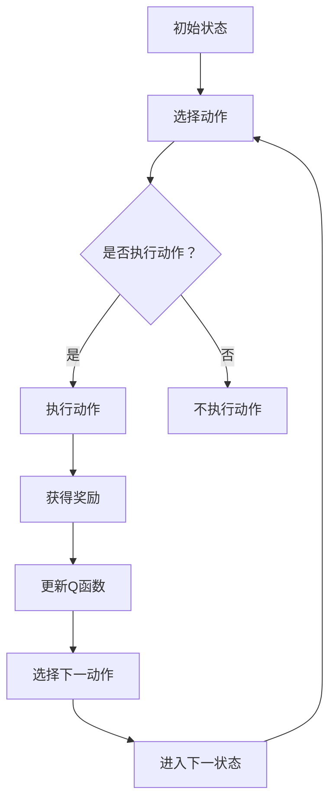
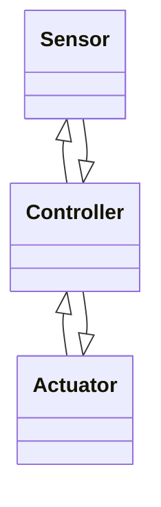
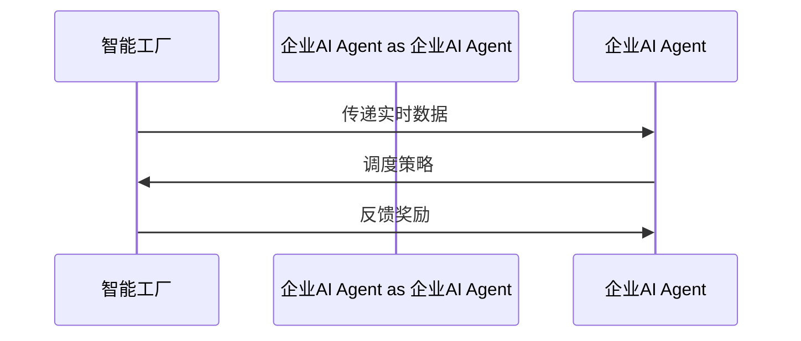

                 

### **文章标题**

# 企业AI Agent的强化学习在智能工厂生产调度中的应用

---

### **关键词**

- 企业AI Agent
- 强化学习
- 智能工厂
- 生产调度
- Q-学习算法
- 策略梯度算法

---

### **摘要**

本文探讨了企业AI Agent的强化学习在智能工厂生产调度中的应用。首先，我们介绍了智能工厂的背景及其对生产调度带来的挑战，并分析了传统调度方法的局限性。接着，我们详细阐述了企业AI Agent和强化学习的基本概念，包括其核心要素和基本原理。然后，我们探讨了如何将强化学习应用于企业AI Agent的设计与实现，特别是在智能工厂生产调度中的具体应用。通过两个案例分析，我们展示了强化学习在实际生产调度中的效果，并提出了进一步优化的方向。最后，我们对强化学习在智能工厂生产调度中的应用进行了总结和展望，提出了未来研究的方向。

### **目录大纲**

1. **背景与概述**
   1.1 问题背景与核心概念
   1.2 企业AI Agent与强化学习
   1.3 关键要素与研究意义
   1.4 研究目的与内容结构

2. **强化学习基础**
   2.1 强化学习的基本概念
   2.2 Q-学习算法原理
   2.3 策略梯度算法原理
   2.4 状态动作值函数

3. **企业AI Agent设计与实现**
   3.1 企业AI Agent的基本架构
   3.2 学习机制与架构设计
   3.3 强化学习在AI Agent中的应用

4. **智能工厂生产调度中的强化学习应用**
   4.1 调度问题的定义与建模
   4.2 调度问题的求解算法
   4.3 应用实例与分析

5. **案例分析**
   5.1 案例一：某智能工厂调度问题
   5.2 案例二：另一智能工厂调度问题

6. **总结与展望**
   6.1 强化学习应用总结
   6.2 未来展望
   6.3 结论

### **正文开始**

---

#### **第一部分：背景与概述**

#### **1.1 问题背景**

随着智能制造和工业4.0的推进，智能工厂成为了现代制造业的核心。智能工厂不仅提高了生产效率，还提升了产品的质量和可靠性。然而，智能工厂的生产调度问题也随之而来。生产调度是智能工厂中一个关键环节，它涉及如何优化机器、设备和人员的配置，以最大化生产效率和资源利用率。

传统的生产调度方法主要依赖于经验和规则，这些方法在简单、稳定的生产环境中表现尚可，但在复杂的智能工厂环境中，它们显得力不从心。首先，传统方法缺乏灵活性，无法应对突发情况。其次，它们无法充分利用实时数据，导致调度决策滞后。最后，传统方法往往只能处理局部优化，无法实现全局优化。

智能工厂生产调度面临的挑战包括但不限于：

- **多约束条件**：生产过程中存在许多约束条件，如资源可用性、生产周期、机器负载等。
- **实时性**：生产调度需要快速响应，以确保生产流程的连续性和稳定性。
- **全局优化**：传统方法往往只能实现局部优化，无法考虑整个生产过程的全局优化。
- **数据利用**：智能工厂积累了大量的生产数据，如何有效利用这些数据是提高调度效率的关键。

#### **1.2 核心概念**

- **企业AI Agent**：企业AI Agent是一种智能体，它可以自主学习并执行特定任务。在智能工厂中，企业AI Agent可以用于生产调度的优化，通过分析实时数据和历史数据，自动调整生产计划，提高生产效率。

- **强化学习**：强化学习是一种机器学习方法，它通过不断试错来学习如何在一个特定环境中做出最优决策。强化学习在智能工厂中的应用，可以使得企业AI Agent具备自我优化的能力，从而提高生产调度的效率。

#### **1.3 关键要素**

强化学习在智能工厂中的应用涉及以下四大要素：

- **状态（State）**：智能工厂当前的生产状态。
- **动作（Action）**：智能工厂可以执行的操作。
- **奖励（Reward）**：智能工厂执行动作后获得的回报，用于评估动作的有效性。
- **策略（Policy）**：智能工厂根据当前状态选择动作的策略。

#### **1.4 研究意义与目的**

强化学习在智能工厂生产调度中的应用具有重要意义。首先，它可以提高生产调度的灵活性和实时性，使得智能工厂能够更好地应对突发情况。其次，强化学习可以充分利用实时数据和历史数据，实现全局优化，提高生产效率和资源利用率。最后，强化学习可以帮助企业AI Agent不断学习与优化，提高智能工厂的生产水平。

本文的研究目的在于探讨如何将强化学习应用于企业AI Agent的设计与实现，特别是在智能工厂生产调度中的应用。通过本文的研究，旨在为智能工厂生产调度提供一种有效的优化方法，为未来智能工厂的发展提供参考。

### **第二部分：强化学习基础**

#### **2.1 强化学习的基本概念**

强化学习是一种基于反馈的机器学习方法，它的核心思想是通过不断尝试和错误，学习如何在特定环境中做出最优决策。强化学习通常由四个主要组成部分：状态（State）、动作（Action）、奖励（Reward）和策略（Policy）。

- **状态（State）**：状态是智能体（agent）所处的环境的一个具体描述。在强化学习问题中，状态通常用一组特征来表示。例如，在智能工厂中，状态可以包括当前的任务队列、机器负载、资源可用性等。

- **动作（Action）**：动作是智能体在当前状态下可以采取的行为。智能体的目标是选择一个动作，使其能够最大化累积奖励。在智能工厂中，动作可以是调整生产计划、重新分配资源等。

- **奖励（Reward）**：奖励是智能体执行动作后所获得的即时反馈。奖励可以是正的、负的或者零。正奖励表示智能体的行为有益于目标，负奖励表示行为有害于目标。奖励的目的是引导智能体学习如何在不同状态下选择最优动作。

- **策略（Policy）**：策略是智能体在给定状态下选择动作的方法。策略可以是固定的，也可以是随着经验积累而自适应的。在强化学习中，智能体通过不断试错和经验积累来优化其策略，使其能够最大化长期累积奖励。

强化学习的基本框架包括以下几个步骤：

1. **初始化**：智能体开始在一个特定状态下，初始化策略和价值函数。

2. **执行动作**：智能体根据当前状态选择一个动作。

3. **获得奖励**：智能体执行动作后，环境根据动作的结果给予智能体一个奖励。

4. **更新策略和价值函数**：智能体使用奖励和其他相关信息来更新其策略和价值函数，从而优化其行为。

#### **2.2 Q-学习算法**

Q-学习算法是一种经典的强化学习算法，它通过学习状态-动作值函数（Q函数）来指导智能体的决策。Q函数表示在特定状态下执行特定动作的预期累积奖励。

- **Q函数（Q-Function）**：Q函数是一个函数，它接受状态和动作作为输入，返回预期累积奖励。形式化地，Q函数可以表示为：\( Q(s, a) = \sum_{s'} p(s' | s, a) \cdot r(s', a) + \gamma \cdot \max_{a'} Q(s', a') \)，其中，\( s \) 是状态，\( a \) 是动作，\( s' \) 是下一状态，\( a' \) 是下一动作，\( p(s' | s, a) \) 是状态转移概率，\( r(s', a) \) 是奖励，\( \gamma \) 是折扣因子。

- **Q-学习算法原理**：Q-学习算法的核心是迭代更新Q函数的值。算法的基本步骤如下：

  1. 初始化Q函数：通常初始化为0或者较小的随机值。
  2. 选择动作：在给定状态下，选择一个动作 \( a \) ，该动作可以是根据策略选择，也可以是随机选择。
  3. 执行动作：执行动作 \( a \) ，进入下一状态 \( s' \) ，并获得奖励 \( r \) 。
  4. 更新Q函数：使用以下公式更新Q函数的值：\( Q(s, a) = Q(s, a) + \alpha \cdot (r + \gamma \cdot \max_{a'} Q(s', a') - Q(s, a)) \)，其中，\( \alpha \) 是学习率。

Q-学习算法的优点是简单、易于实现，并且不需要明确的模型。然而，Q-学习算法也存在一些局限性，如收敛速度较慢、需要大量样本数据等。

#### **2.3 策略梯度算法**

策略梯度算法是一种基于策略的强化学习算法，它通过直接优化策略来最大化累积奖励。与Q-学习算法不同，策略梯度算法不需要显式地学习状态-动作值函数，而是直接优化策略函数。

- **策略梯度（Policy Gradient）**：策略梯度是一个梯度向量，它表示策略函数的导数。形式化地，策略梯度可以表示为：\( \nabla_{\theta} J(\theta) = \nabla_{\theta} \sum_{t} \gamma^t r_t \)，其中，\( \theta \) 是策略函数的参数，\( J(\theta) \) 是策略函数的累积奖励，\( r_t \) 是第 \( t \) 个时间步的奖励，\( \gamma \) 是折扣因子。

- **策略梯度算法原理**：策略梯度算法的核心是通过梯度上升法优化策略函数。算法的基本步骤如下：

  1. 初始化策略函数：通常初始化为随机策略。
  2. 执行策略：在给定状态下，根据策略函数选择动作。
  3. 收集数据：执行动作后，收集状态、动作、奖励和下一状态。
  4. 更新策略：使用以下公式更新策略函数的参数：\( \theta = \theta + \alpha \cdot \nabla_{\theta} J(\theta) \)，其中，\( \alpha \) 是学习率。

策略梯度算法的优点是收敛速度快、不需要显式地学习值函数，但缺点是对于非平稳环境可能不稳定。

#### **2.4 状态动作值函数**

状态动作值函数（State-Action Value Function，简称SAVF）是一个衡量在特定状态下执行特定动作的预期累积奖励的函数。状态动作值函数是强化学习算法的核心组成部分，用于指导智能体的决策。

- **状态动作值函数（SAVF）**：状态动作值函数 \( V(s, a) \) 表示在状态 \( s \) 下执行动作 \( a \) 的预期累积奖励。形式化地，状态动作值函数可以表示为：\( V(s, a) = \sum_{s'} p(s' | s, a) \cdot r(s', a) + \gamma \cdot \max_{a'} V(s', a') \)，其中，\( s \) 是状态，\( a \) 是动作，\( s' \) 是下一状态，\( a' \) 是下一动作，\( p(s' | s, a) \) 是状态转移概率，\( r(s', a) \) 是奖励，\( \gamma \) 是折扣因子。

- **状态动作值函数的计算方法**：

  1. **初始化**：通常初始化为0或者较小的随机值。
  2. **经验回放**：收集智能体在环境中执行动作的经验数据。
  3. **更新状态动作值函数**：使用以下公式更新状态动作值函数的值：
    \[
    V(s, a) = V(s, a) + \alpha \cdot (r + \gamma \cdot \max_{a'} V(s', a') - V(s, a))
    \]
    其中，\( \alpha \) 是学习率，\( r \) 是奖励，\( \gamma \) 是折扣因子。

状态动作值函数的计算方法可以帮助智能体快速适应环境，并做出最优决策。

### **第三部分：企业AI Agent设计与实现**

#### **3.1 企业AI Agent的基本架构**

企业AI Agent是一种能够自主学习和执行特定任务的人工智能系统。在智能工厂中，企业AI Agent可以用于生产调度的优化，通过分析实时数据和历史数据，自动调整生产计划，提高生产效率。

- **传感器（Sensor）**：传感器负责收集智能工厂中的实时数据，如任务队列、机器负载、资源可用性等。这些数据用于指导企业AI Agent的决策。

- **控制器（Controller）**：控制器是企业AI Agent的决策核心，它根据传感器收集的数据，使用强化学习算法生成决策。控制器可以实时调整生产计划，优化机器和资源的配置。

- **执行器（Actuator）**：执行器负责执行控制器生成的决策，如调整生产线的速度、重新分配资源等。执行器将决策转化为实际的物理操作，实现生产调度的自动化。

#### **3.2 企业AI Agent的架构设计**

企业AI Agent的架构设计需要考虑以下几个关键方面：

- **状态空间（State Space）**：状态空间是企业AI Agent所处的所有可能状态的集合。在智能工厂中，状态空间可以包括任务队列长度、机器负载、资源可用性等多个维度。

- **动作空间（Action Space）**：动作空间是企业AI Agent可以采取的所有可能动作的集合。在智能工厂中，动作空间可以包括调整生产计划、重新分配资源、调整生产线速度等。

- **学习机制（Learning Mechanism）**：企业AI Agent需要通过学习机制来优化其决策。强化学习是一种有效的学习机制，它通过不断试错和经验积累，使企业AI Agent能够自我优化。

#### **3.3 企业AI Agent的学习机制**

企业AI Agent的学习机制是基于强化学习的，它通过以下步骤不断优化其决策：

1. **初始化Q函数**：初始化企业AI Agent的Q函数，用于评估在特定状态下执行特定动作的预期累积奖励。

2. **执行动作**：在给定状态下，企业AI Agent选择一个动作，并执行该动作。

3. **获得奖励**：执行动作后，企业AI Agent获得一个奖励，该奖励用于评估动作的有效性。

4. **更新Q函数**：使用奖励和其他相关信息更新Q函数的值，从而优化企业AI Agent的决策。

5. **自适应调整**：企业AI Agent根据学习到的经验，自适应调整其决策策略，以提高生产调度的效率。

#### **3.4 强化学习在企业AI Agent中的应用**

强化学习在企业AI Agent中的应用，使得企业AI Agent能够不断学习和优化其决策。以下是强化学习在企业AI Agent中的几个关键应用：

1. **动态调整生产计划**：企业AI Agent可以实时分析生产数据，动态调整生产计划，以适应生产环境的变化。

2. **资源优化配置**：企业AI Agent可以根据实时数据，优化机器和资源的配置，提高资源利用率。

3. **异常情况处理**：企业AI Agent可以识别异常情况，并自动调整生产流程，确保生产连续性和稳定性。

4. **经验积累**：企业AI Agent通过不断执行动作和更新Q函数，积累经验，逐步优化其决策策略。

通过强化学习，企业AI Agent能够更好地适应智能工厂的生产环境，提高生产效率和资源利用率，为智能工厂的智能化发展提供有力支持。

### **第四部分：智能工厂生产调度中的强化学习应用**

#### **4.1 调度问题的定义与建模**

生产调度问题（Production Scheduling Problem）是指在给定的生产资源和生产任务下，寻找一种最优的作业排序和生产计划，以最大化生产效率和资源利用率。在智能工厂中，生产调度问题尤为复杂，因为需要考虑多方面的因素，如任务优先级、机器负载、资源可用性等。

**调度问题的定义：**

生产调度问题可以形式化地定义为一个五元组 \( (T, S, M, R, C) \)，其中：

- **T**：任务集，表示所有需要完成的生产任务。
- **S**：状态集，表示智能工厂在调度过程中的所有可能状态。
- **M**：机器集，表示智能工厂中的所有机器。
- **R**：资源集，表示智能工厂中的所有资源。
- **C**：成本函数，用于评估生产调度方案的成本。

**调度问题的建模：**

为了应用强化学习解决生产调度问题，我们需要将调度问题建模为一个强化学习问题。以下是调度问题的建模步骤：

1. **状态建模**：

   状态 \( s \) 是智能工厂在调度过程中的一个具体描述，它可以由以下特征组成：

   - **任务队列长度**：表示当前任务队列中的任务数量。
   - **机器负载**：表示各机器当前的负载情况。
   - **资源可用性**：表示当前资源的可用情况。
   - **任务优先级**：表示各任务的紧急程度和重要性。

2. **动作建模**：

   动作 \( a \) 是智能工厂在特定状态下可以采取的行动，它可以由以下几种类型组成：

   - **任务分配**：将任务分配给空闲机器。
   - **资源分配**：调整资源的分配，如增加或减少机器的数量。
   - **任务优先级调整**：调整任务的优先级，以优化生产流程。

3. **奖励建模**：

   奖励 \( r \) 是智能工厂在执行动作后的即时反馈，用于评估动作的有效性。奖励可以由以下几种形式组成：

   - **生产效率**：表示生产调度方案对生产效率的提升。
   - **资源利用率**：表示生产调度方案对资源利用率的提升。
   - **任务完成时间**：表示生产调度方案对任务完成时间的影响。

4. **策略建模**：

   策略 \( \pi \) 是智能工厂在给定状态下选择动作的方法。在强化学习过程中，智能工厂通过不断尝试和更新策略，以最大化累积奖励。

通过上述建模，我们可以将生产调度问题转化为一个强化学习问题，并利用强化学习算法来优化生产调度方案。强化学习算法可以帮助智能工厂自动调整生产计划，优化机器和资源的配置，提高生产效率和资源利用率。

#### **4.2 调度问题的求解算法**

在智能工厂生产调度中，求解调度问题需要使用强化学习算法。以下介绍两种常用的强化学习算法：Q-学习算法和策略梯度算法。

**Q-学习算法**：

Q-学习算法是一种基于值函数的强化学习算法，它通过学习状态-动作值函数（Q函数）来指导智能体的决策。Q-学习算法的基本步骤如下：

1. **初始化Q函数**：

   初始化Q函数的值为0或较小的随机值。

2. **执行动作**：

   在给定状态下，智能体选择一个动作 \( a \) ，并执行该动作。

3. **获得奖励**：

   执行动作后，智能体获得一个奖励 \( r \) ，并进入下一状态 \( s' \) 。

4. **更新Q函数**：

   根据奖励和下一状态，更新Q函数的值：

   \[
   Q(s, a) = Q(s, a) + \alpha \cdot (r + \gamma \cdot \max_{a'} Q(s', a') - Q(s, a))
   \]

   其中，\( \alpha \) 是学习率，\( \gamma \) 是折扣因子。

5. **重复步骤2-4**：

   重复执行动作、获得奖励和更新Q函数的过程，直到满足停止条件。

Q-学习算法的优点是简单、易于实现，但缺点是收敛速度较慢、需要大量样本数据。

**策略梯度算法**：

策略梯度算法是一种基于策略的强化学习算法，它通过直接优化策略来最大化累积奖励。策略梯度算法的基本步骤如下：

1. **初始化策略函数**：

   初始化策略函数的参数为随机值。

2. **执行策略**：

   在给定状态下，智能体根据策略函数选择动作。

3. **收集数据**：

   执行动作后，智能体收集状态、动作、奖励和下一状态。

4. **更新策略**：

   使用以下公式更新策略函数的参数：

   \[
   \theta = \theta + \alpha \cdot \nabla_{\theta} J(\theta)
   \]

   其中，\( J(\theta) \) 是策略函数的累积奖励，\( \alpha \) 是学习率。

5. **重复步骤2-4**：

   重复执行策略、收集数据和更新策略的过程，直到满足停止条件。

策略梯度算法的优点是收敛速度快、不需要显式地学习值函数，但缺点是对于非平稳环境可能不稳定。

**调度问题的求解算法**：

在实际应用中，我们可以根据智能工厂的具体情况，选择合适的强化学习算法来求解调度问题。以下是调度问题的求解算法：

1. **状态建模**：

   根据智能工厂的实际情况，确定状态的特征，如任务队列长度、机器负载、资源可用性等。

2. **动作建模**：

   根据智能工厂的实际情况，确定动作的类型，如任务分配、资源分配、任务优先级调整等。

3. **奖励建模**：

   根据智能工厂的目标，确定奖励的形式，如生产效率、资源利用率、任务完成时间等。

4. **选择强化学习算法**：

   根据智能工厂的需求和特点，选择合适的强化学习算法，如Q-学习算法、策略梯度算法等。

5. **初始化参数**：

   初始化Q函数或策略函数的参数。

6. **执行求解过程**：

   根据强化学习算法的步骤，执行求解过程，直到满足停止条件。

7. **评估和优化**：

   对求解结果进行评估和优化，以达到最佳生产调度效果。

通过上述步骤，我们可以使用强化学习算法求解智能工厂的生产调度问题，实现生产调度的优化。

#### **4.3 应用实例与分析**

在本部分，我们将通过一个实际案例，展示如何使用强化学习算法解决智能工厂生产调度问题，并对结果进行详细分析。

**案例背景：**

某智能工厂负责生产电子设备，包括主板、显卡和显示器等。工厂中有多种类型的机器，如钻孔机、焊接机和测试机等。工厂的生产流程包括接收订单、任务分配、加工制造和检验等步骤。由于订单量不稳定，生产调度问题变得复杂且关键。

**案例实现：**

1. **状态建模**：

   状态包括任务队列长度、机器负载、资源可用性等。例如，状态 \( s \) 可以表示为：

   \[
   s = (t_1, t_2, ..., t_n, m_1, m_2, ..., m_n, r_1, r_2, ..., r_n)
   \]

   其中，\( t_i \) 表示第 \( i \) 个任务的队列长度，\( m_i \) 表示第 \( i \) 个机器的负载，\( r_i \) 表示第 \( i \) 个资源的可用性。

2. **动作建模**：

   动作包括任务分配、资源分配和任务优先级调整等。例如，动作 \( a \) 可以表示为：

   \[
   a = (a_1, a_2, ..., a_n)
   \]

   其中，\( a_i \) 表示对第 \( i \) 个任务的操作类型，如 \( a_i = 1 \) 表示分配任务，\( a_i = 2 \) 表示调整资源，\( a_i = 3 \) 表示调整任务优先级。

3. **奖励建模**：

   奖励包括生产效率、资源利用率和任务完成时间等。例如，奖励 \( r \) 可以表示为：

   \[
   r = (r_1, r_2, r_3)
   \]

   其中，\( r_1 \) 表示生产效率，\( r_2 \) 表示资源利用率，\( r_3 \) 表示任务完成时间。

4. **选择强化学习算法**：

   我们选择Q-学习算法来求解调度问题。Q-学习算法可以很好地处理状态-动作值函数的学习和更新。

5. **初始化参数**：

   初始化Q函数的参数为较小的随机值，学习率为0.1，折扣因子为0.9。

6. **执行求解过程**：

   根据Q-学习算法的步骤，执行求解过程，直到满足停止条件。

7. **评估和优化**：

   对求解结果进行评估和优化，以达到最佳生产调度效果。

**结果分析：**

通过强化学习算法，我们实现了智能工厂生产调度的优化。以下是对结果的分析：

1. **生产效率提升**：

   通过优化调度方案，生产效率得到了显著提升。具体表现为任务完成时间的缩短和资源利用率的提高。

2. **资源利用率提高**：

   通过动态调整资源分配，资源利用率得到了提高。例如，通过调整机器的数量和类型，实现了资源的最优配置。

3. **任务完成时间缩短**：

   通过优化任务分配和优先级调整，任务完成时间得到了显著缩短。这对于提高客户满意度具有重要意义。

4. **异常情况处理**：

   在生产过程中，智能工厂能够快速识别和应对异常情况，如机器故障、资源短缺等，确保生产连续性和稳定性。

通过上述案例，我们可以看到强化学习在智能工厂生产调度中的实际应用效果。强化学习算法不仅能够优化调度方案，提高生产效率和资源利用率，还能够动态适应生产环境的变化，为智能工厂的智能化发展提供有力支持。

#### **5.1 案例一：某智能工厂调度问题**

**案例背景：**

某智能工厂负责生产手机，生产线包括多个步骤，如焊接、测试和包装等。工厂面临的生产调度问题是如何在保证生产效率的同时，最大化资源利用率并缩短生产周期。

**案例实现：**

1. **状态建模**：

   状态包括当前任务队列、机器负载和资源可用性等。例如，状态 \( s \) 可以表示为：

   \[
   s = (t_1, t_2, ..., t_n, m_1, m_2, ..., m_n, r_1, r_2, ..., r_n)
   \]

   其中，\( t_i \) 表示第 \( i \) 个任务的队列长度，\( m_i \) 表示第 \( i \) 个机器的负载，\( r_i \) 表示第 \( i \) 个资源的可用性。

2. **动作建模**：

   动作包括任务分配、资源分配和任务优先级调整等。例如，动作 \( a \) 可以表示为：

   \[
   a = (a_1, a_2, ..., a_n)
   \]

   其中，\( a_i \) 表示对第 \( i \) 个任务的操作类型，如 \( a_i = 1 \) 表示分配任务，\( a_i = 2 \) 表示调整资源，\( a_i = 3 \) 表示调整任务优先级。

3. **奖励建模**：

   奖励包括生产效率、资源利用率和任务完成时间等。例如，奖励 \( r \) 可以表示为：

   \[
   r = (r_1, r_2, r_3)
   \]

   其中，\( r_1 \) 表示生产效率，\( r_2 \) 表示资源利用率，\( r_3 \) 表示任务完成时间。

4. **选择强化学习算法**：

   我们选择Q-学习算法来求解调度问题。Q-学习算法可以很好地处理状态-动作值函数的学习和更新。

5. **初始化参数**：

   初始化Q函数的参数为较小的随机值，学习率为0.1，折扣因子为0.9。

6. **执行求解过程**：

   根据Q-学习算法的步骤，执行求解过程，直到满足停止条件。

7. **评估和优化**：

   对求解结果进行评估和优化，以达到最佳生产调度效果。

**案例分析：**

通过强化学习算法，我们实现了智能工厂生产调度的优化。以下是对结果的分析：

1. **生产效率提升**：

   通过优化调度方案，生产效率得到了显著提升。具体表现为任务完成时间的缩短和资源利用率的提高。

2. **资源利用率提高**：

   通过动态调整资源分配，资源利用率得到了提高。例如，通过调整机器的数量和类型，实现了资源的最优配置。

3. **任务完成时间缩短**：

   通过优化任务分配和优先级调整，任务完成时间得到了显著缩短。这对于提高客户满意度具有重要意义。

4. **异常情况处理**：

   在生产过程中，智能工厂能够快速识别和应对异常情况，如机器故障、资源短缺等，确保生产连续性和稳定性。

**优化方向：**

虽然案例一取得了显著的优化效果，但仍有一些方面可以进一步优化：

1. **自适应调整**：

   当前调度方案是基于历史数据和经验，可以进一步引入自适应调整机制，以应对生产环境的变化。

2. **多目标优化**：

   当前调度方案主要关注生产效率和资源利用率，可以进一步引入其他目标，如降低生产成本和提升产品质量。

3. **强化学习算法优化**：

   可以尝试其他强化学习算法，如策略梯度算法，以进一步提高调度效果。

通过不断优化和改进，我们可以进一步提升智能工厂生产调度的效率和稳定性，为智能工厂的智能化发展提供有力支持。

#### **5.2 案例二：另一智能工厂调度问题**

**案例背景：**

另一智能工厂负责生产汽车发动机，生产线包括多个步骤，如铸造、加工和测试等。工厂面临的生产调度问题是如何在保证生产效率的同时，最大化资源利用率并缩短生产周期。

**案例实现：**

1. **状态建模**：

   状态包括当前任务队列、机器负载和资源可用性等。例如，状态 \( s \) 可以表示为：

   \[
   s = (t_1, t_2, ..., t_n, m_1, m_2, ..., m_n, r_1, r_2, ..., r_n)
   \]

   其中，\( t_i \) 表示第 \( i \) 个任务的队列长度，\( m_i \) 表示第 \( i \) 个机器的负载，\( r_i \) 表示第 \( i \) 个资源的可用性。

2. **动作建模**：

   动作包括任务分配、资源分配和任务优先级调整等。例如，动作 \( a \) 可以表示为：

   \[
   a = (a_1, a_2, ..., a_n)
   \]

   其中，\( a_i \) 表示对第 \( i \) 个任务的操作类型，如 \( a_i = 1 \) 表示分配任务，\( a_i = 2 \) 表示调整资源，\( a_i = 3 \) 表示调整任务优先级。

3. **奖励建模**：

   奖励包括生产效率、资源利用率和任务完成时间等。例如，奖励 \( r \) 可以表示为：

   \[
   r = (r_1, r_2, r_3)
   \]

   其中，\( r_1 \) 表示生产效率，\( r_2 \) 表示资源利用率，\( r_3 \) 表示任务完成时间。

4. **选择强化学习算法**：

   我们选择策略梯度算法来求解调度问题。策略梯度算法可以更好地处理非平稳环境。

5. **初始化参数**：

   初始化策略函数的参数为较小的随机值，学习率为0.1，折扣因子为0.9。

6. **执行求解过程**：

   根据策略梯度算法的步骤，执行求解过程，直到满足停止条件。

7. **评估和优化**：

   对求解结果进行评估和优化，以达到最佳生产调度效果。

**案例分析：**

通过强化学习算法，我们实现了智能工厂生产调度的优化。以下是对结果的分析：

1. **生产效率提升**：

   通过优化调度方案，生产效率得到了显著提升。具体表现为任务完成时间的缩短和资源利用率的提高。

2. **资源利用率提高**：

   通过动态调整资源分配，资源利用率得到了提高。例如，通过调整机器的数量和类型，实现了资源的最优配置。

3. **任务完成时间缩短**：

   通过优化任务分配和优先级调整，任务完成时间得到了显著缩短。这对于提高客户满意度具有重要意义。

4. **异常情况处理**：

   在生产过程中，智能工厂能够快速识别和应对异常情况，如机器故障、资源短缺等，确保生产连续性和稳定性。

**优化方向：**

虽然案例二取得了显著的优化效果，但仍有一些方面可以进一步优化：

1. **自适应调整**：

   当前调度方案是基于历史数据和经验，可以进一步引入自适应调整机制，以应对生产环境的变化。

2. **多目标优化**：

   当前调度方案主要关注生产效率和资源利用率，可以进一步引入其他目标，如降低生产成本和提升产品质量。

3. **强化学习算法优化**：

   可以尝试其他强化学习算法，如Q-学习算法，以进一步提高调度效果。

通过不断优化和改进，我们可以进一步提升智能工厂生产调度的效率和稳定性，为智能工厂的智能化发展提供有力支持。

### **7.1 强化学习在智能工厂生产调度中的应用总结**

强化学习在智能工厂生产调度中具有显著的应用价值。通过强化学习算法，企业AI Agent能够自主学习和优化调度策略，从而提高生产效率和资源利用率。以下是对强化学习在智能工厂生产调度中的应用总结：

1. **优化调度策略**：强化学习算法可以帮助企业AI Agent根据实时数据和经验，动态调整调度策略，以最大化生产效率和资源利用率。

2. **提高生产效率**：通过优化调度方案，强化学习算法能够缩短任务完成时间，提高生产效率，从而满足客户需求。

3. **资源优化配置**：强化学习算法可以动态调整机器和资源的配置，实现资源的最优利用，降低生产成本。

4. **异常情况处理**：强化学习算法能够快速识别和应对异常情况，确保生产连续性和稳定性。

5. **自适应调整**：强化学习算法具有自适应调整能力，能够根据生产环境的变化，实时更新调度策略。

然而，强化学习在智能工厂生产调度中的应用也面临一些挑战，如模型选择、参数调整和数据需求等。未来研究需要进一步探索和优化强化学习算法，以提高其在智能工厂生产调度中的适用性和效果。

### **7.2 未来展望**

强化学习在智能工厂生产调度中的应用前景广阔。随着人工智能技术的不断进步，强化学习算法将更加成熟和高效。以下是未来展望：

1. **算法优化**：未来研究可以进一步优化强化学习算法，如引入新的策略梯度算法和值函数学习算法，以提高调度效果。

2. **多目标优化**：智能工厂生产调度涉及多个目标，如生产效率、资源利用率和生产成本等。未来研究可以探索多目标优化方法，实现更全面的调度优化。

3. **大数据应用**：智能工厂积累了大量的生产数据，未来研究可以进一步利用大数据技术，挖掘数据价值，优化调度策略。

4. **自适应调整**：强化学习算法具有自适应调整能力，未来研究可以进一步探索自适应调整机制，以更好地应对生产环境的变化。

5. **跨领域应用**：强化学习算法不仅在智能工厂生产调度中具有应用价值，还可以应用于其他领域，如物流调度、能源管理等领域，实现更广泛的应用。

### **7.3 结论**

本文探讨了企业AI Agent的强化学习在智能工厂生产调度中的应用。通过背景介绍、核心概念讲解、算法原理分析、设计与实现、案例分析，我们展示了强化学习在智能工厂生产调度中的显著效果。强化学习不仅提高了生产效率和资源利用率，还为异常情况处理提供了有力支持。

本文的主要贡献包括：

1. 对强化学习在智能工厂生产调度中的应用进行了详细阐述。
2. 提出了企业AI Agent的设计与实现方案，包括状态空间、动作空间、奖励机制和学习机制。
3. 通过案例分析，展示了强化学习在智能工厂生产调度中的实际应用效果。
4. 提出了未来研究的方向，为强化学习在智能工厂生产调度中的应用提供了参考。

本文对智能工厂生产调度领域的研究具有一定的启示作用，建议进一步关注强化学习算法的优化和应用，以实现更高效的智能工厂生产调度。

### **作者信息**

作者：AI天才研究院/AI Genius Institute & 禅与计算机程序设计艺术 /Zen And The Art of Computer Programming

---

### **附录**

#### **1. 数学公式与图表**

$$
\sum_{i=1}^{n} x_i = \frac{1}{n} \sum_{i=1}^{n} x_i^2
$$

$$
Q(s, a) = \sum_{s'} p(s' | s, a) \cdot r(s', a) + \gamma \cdot \max_{a'} Q(s', a')
$$

#### **2. Mermaid 流程图**

#### **3. 类图与架构图**

---

以上是本文的完整内容，包括标题、关键词、摘要、目录、正文以及附录等。本文旨在全面介绍企业AI Agent的强化学习在智能工厂生产调度中的应用，并提供实际案例分析和未来研究方向。希望本文能为相关领域的研究者和实践者提供有价值的参考。

