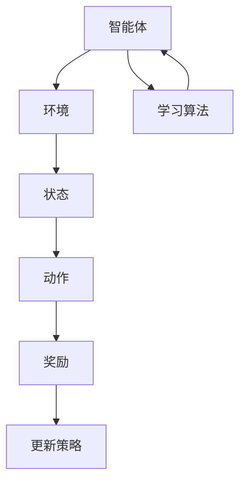
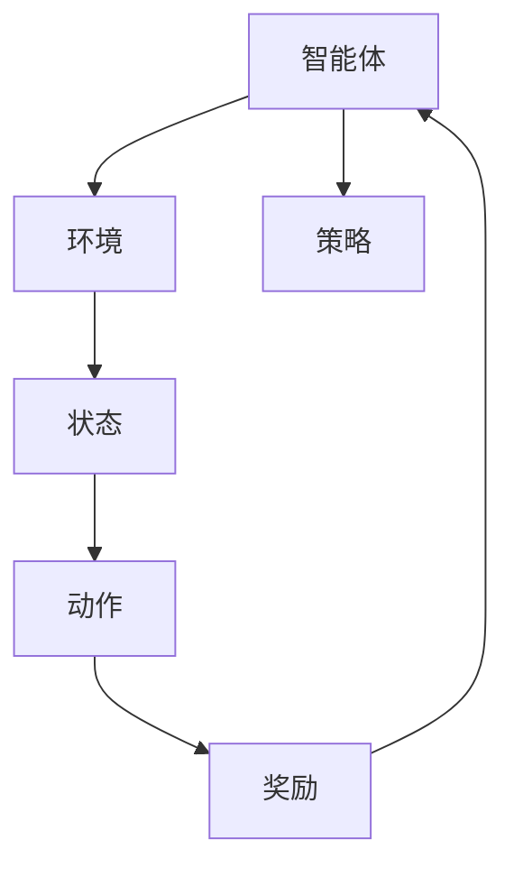
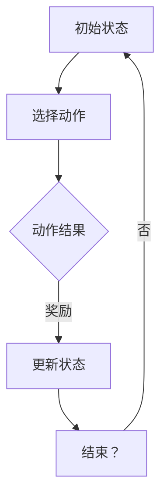
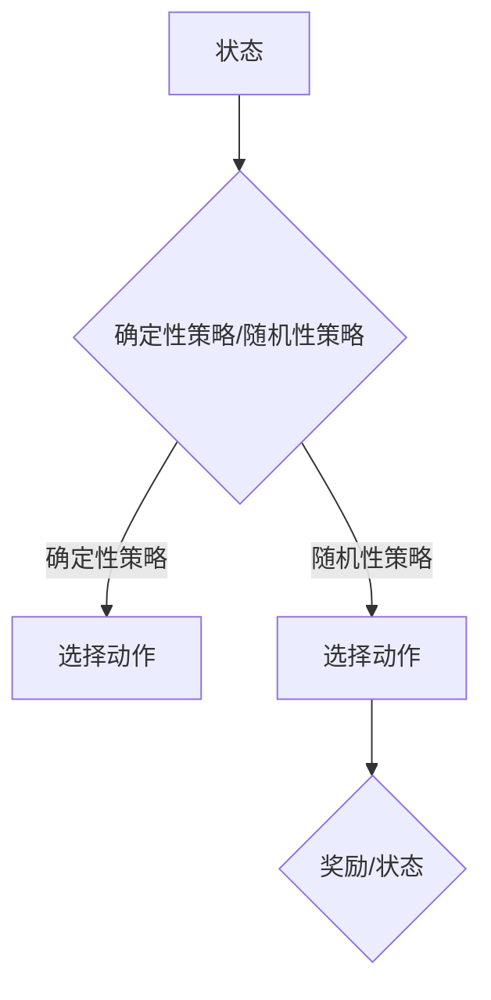
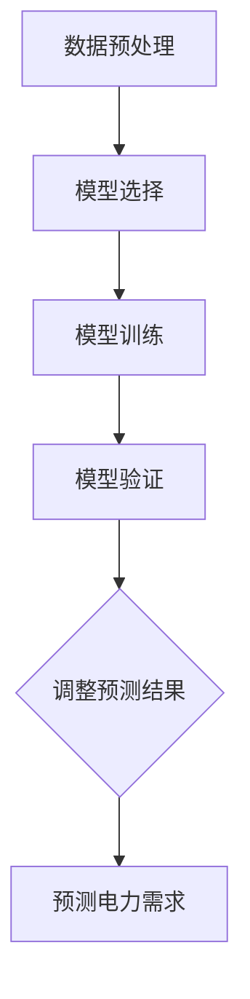
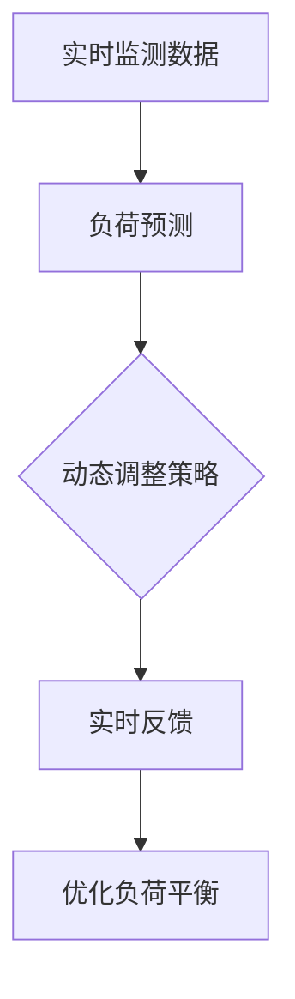
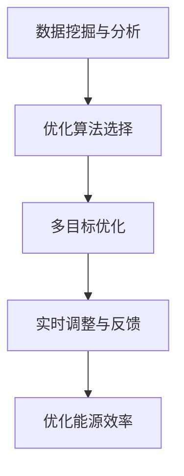
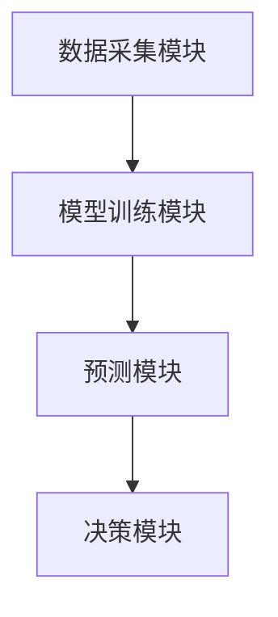
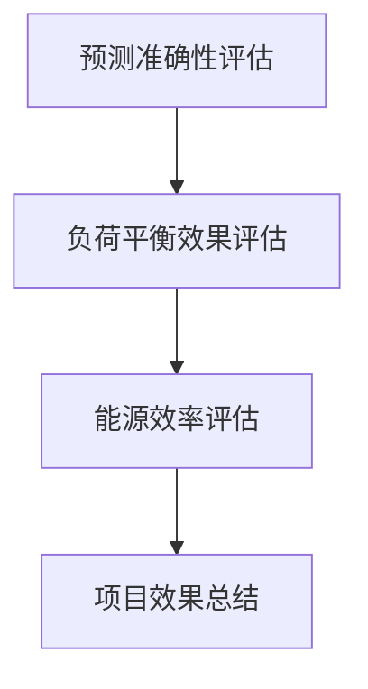

                 

### 引言与背景

#### 1.1 问题背景

智能电网管理作为现代电力系统的重要发展方向，正面临着日益复杂的挑战。随着全球电力需求的不断增长和能源结构的多样化，传统电力系统已难以应对快速变化的电力市场和环境要求。智能电网通过先进的信息通信技术和控制技术，实现了电力系统的自动化、信息化和智能化，从而提高电力供应的可靠性和经济性，减少能源消耗和环境污染。

然而，智能电网的管理并不简单。首先，电力需求预测是智能电网管理的核心问题之一。准确预测电力需求对于电力调度、资源分配和负荷平衡至关重要。然而，电力需求受到天气、季节、经济活动等多重因素的影响，具有高度的复杂性和不确定性。其次，电力负荷平衡是智能电网管理中的另一个关键问题。智能电网需要实时监测和调整电力负荷，以避免电力供应过剩或短缺，确保电网运行的稳定性和安全性。此外，能源效率优化也是智能电网管理的重要目标，通过优化电力生产和分配，降低能源损耗，提高整体能源利用效率。

本文旨在探讨企业AI Agent的强化学习在智能电网管理中的应用。企业AI Agent是一种能够自主学习、自主决策的智能体，通过强化学习算法不断优化其行为，提高电力系统管理的效率和质量。本文首先介绍企业AI Agent和强化学习的基本概念，然后详细分析智能电网管理中的问题和挑战，最后通过具体案例展示企业AI Agent在智能电网管理中的实际应用。

在接下来的章节中，我们将进一步探讨企业AI Agent和强化学习的基本概念，分析其在智能电网管理中的应用原理，并详细讲解如何设计和实现企业AI Agent，以及其实际应用中的性能评估和效果。通过本文的探讨，我们希望为读者提供一种新的思路和方法，帮助其在智能电网管理中更好地应用人工智能技术。

#### 1.2 核心概念

在本章中，我们将详细介绍企业AI Agent、强化学习和智能电网管理这三个核心概念，以便读者能够全面理解本文的主题和内容。

##### 1.2.1 企业AI Agent

企业AI Agent是一种基于人工智能技术的智能体，旨在模拟和增强人类决策者的能力和效率。与传统的自动化系统不同，企业AI Agent不仅能够执行预定义的任务，还能够通过不断学习和自我优化，适应动态变化的环境。企业AI Agent具有以下几个特点：

1. **自主学习能力**：企业AI Agent通过机器学习和深度学习算法，能够从大量数据中学习规律，不断改进其决策策略。这使得企业AI Agent能够在不断变化的市场和环境条件下保持高效性能。

2. **自主决策能力**：企业AI Agent能够根据实时数据和环境信息，自主做出最优决策。这种自主决策能力不仅提高了企业的运营效率，还能够减少人为错误，提高决策的准确性和稳定性。

3. **协作与适应性**：企业AI Agent能够与其他智能体和系统进行协作，共同完成复杂任务。同时，它们能够根据环境变化和任务需求，灵活调整行为和策略，以适应不同场景。

4. **可解释性**：企业AI Agent的决策过程通常具有一定的透明度，其学习过程和决策逻辑可以通过可视化工具进行解释。这有助于提高企业AI Agent的信任度和可接受度。

企业AI Agent主要分为以下几种类型：

1. **专家系统**：基于知识表示和推理技术，企业AI Agent能够模拟专家的知识和经验，解决特定领域的问题。

2. **强化学习Agent**：通过不断与环境互动，学习最优策略，用于解决动态决策问题。

3. **混合智能体**：结合多种人工智能技术，如深度学习、逻辑推理和博弈论等，实现更复杂的任务。

##### 1.2.2 强化学习

强化学习是机器学习的一个重要分支，旨在通过智能体与环境的互动，学习最优行为策略。与监督学习和无监督学习不同，强化学习关注的是智能体如何在未知环境中通过试错学习，实现目标最大化。

强化学习的基本概念包括：

1. **智能体（Agent）**：执行任务、与环境互动并做出决策的主体。

2. **环境（Environment）**：智能体执行任务的场所，能够根据智能体的动作提供状态信息和奖励信号。

3. **状态（State）**：智能体在执行任务时所处的情境。

4. **动作（Action）**：智能体在某个状态下可以采取的行为。

5. **奖励（Reward）**：环境对智能体动作的反馈信号，用于评估动作的好坏。

6. **策略（Policy）**：智能体在给定状态下采取动作的策略，可以通过学习得到。

强化学习的基本流程包括：

1. **探索（Exploration）**：智能体在未知环境中尝试不同的动作，以获取更多信息。

2. **利用（Utilization）**：智能体根据当前状态和策略选择动作，以最大化奖励。

3. **评估与调整**：智能体通过奖励信号评估策略的有效性，并不断调整策略以优化性能。

强化学习的主要算法包括：

1. **Q-Learning**：通过值函数逼近最优策略，是一种基于值迭代的强化学习算法。

2. **Sarsa**：一种基于策略迭代的强化学习算法，结合了Q-Learning和深度学习的方法。

3. **深度Q网络（DQN）**：利用深度神经网络来逼近值函数，适用于处理高维状态空间的问题。

##### 1.2.3 智能电网管理

智能电网管理是指通过先进的信息通信技术和控制技术，实现电力系统的自动化、信息化和智能化。智能电网管理的主要目标包括：

1. **提高电力供应的可靠性**：通过实时监测和控制电力系统，确保电力供应的稳定性和连续性。

2. **提高能源利用效率**：通过优化电力生产和分配，减少能源损耗，提高整体能源利用效率。

3. **减少环境污染**：通过使用清洁能源和提高能源利用效率，减少电力系统的碳排放和其他污染物排放。

4. **降低运营成本**：通过自动化和智能化管理，减少人工干预和运营成本。

智能电网管理的关键技术包括：

1. **传感器网络**：通过部署各种传感器，实时监测电力系统的运行状态，包括电压、电流、温度等参数。

2. **通信技术**：实现电力系统内部以及与其他系统之间的信息传输和通信，包括有线和无线通信技术。

3. **数据挖掘与分析**：通过大数据技术和数据挖掘算法，分析电力系统的运行数据，发现潜在问题和优化机会。

4. **智能调度与控制**：利用人工智能和机器学习技术，实现电力系统的自动调度和控制，提高运行效率。

智能电网管理的发展历程主要包括以下几个阶段：

1. **自动化阶段**：通过继电保护和自动化设备，实现电力系统的基本自动化。

2. **信息化阶段**：引入计算机技术，实现对电力系统的数据采集、监控和初步分析。

3. **智能化阶段**：结合人工智能和大数据技术，实现电力系统的全面智能化，包括智能调度、智能控制和智能服务。

#### 1.3 概念结构与核心要素组成

在本节中，我们将分析企业AI Agent的强化学习以及智能电网管理系统这两个核心概念的结构与核心要素，以便更好地理解其运作机制和相互关系。

##### 1.3.1 企业AI Agent的强化学习

企业AI Agent的强化学习是由多个关键组成部分构成的复杂系统。以下是其主要的组成部分及其相互关系：

1. **智能体（Agent）**：作为强化学习的主体，智能体负责接收环境状态，选择动作，并接收奖励信号。

2. **环境（Environment）**：环境是智能体执行任务的场所，提供状态信息，并根据智能体的动作给予奖励或惩罚。

3. **状态（State）**：状态是智能体在执行任务时所处的情境，通常由一组特征向量表示。

4. **动作（Action）**：动作是智能体在给定状态下可以采取的行为，用于影响环境状态。

5. **奖励（Reward）**：奖励是环境对智能体动作的即时反馈，用于评估动作的有效性。

6. **策略（Policy）**：策略是智能体在给定状态下选择动作的规则，可以通过学习优化。

7. **模型（Model）**：在某些强化学习算法中，模型用于预测未来状态和奖励，从而辅助智能体的决策。

8. **记忆（Memory）**：记忆用于存储智能体经历的状态、动作和奖励，用于更新策略和价值函数。

9. **学习算法（Learning Algorithm）**：学习算法是智能体学习最优策略的核心，如Q-Learning、Sarsa和深度Q网络（DQN）等。

这些组成部分相互作用，形成一个闭环系统，通过不断迭代学习和优化，使智能体在复杂环境中实现最佳性能。以下是一个简化的Mermaid流程图，展示了企业AI Agent的强化学习流程：



##### 1.3.2 智能电网管理系统

智能电网管理系统是一个集成多种技术和功能的复杂系统，其核心要素包括：

1. **数据采集与监测系统**：负责实时采集电力系统的运行数据，包括电压、电流、功率因数、温度等。

2. **通信网络**：实现数据在系统内部以及与其他系统之间的传输和通信。

3. **数据处理与分析系统**：负责对采集到的数据进行分析和挖掘，提取有用的信息，用于智能调度和控制。

4. **智能调度系统**：根据实时数据和预测模型，制定电力调度策略，实现电力负荷平衡和资源优化。

5. **自动化控制系统**：负责实现电力系统的自动化控制，包括开关、保护、调节等操作。

6. **用户接口系统**：提供用户交互界面，使操作人员能够实时监控电力系统状态，并做出相应操作。

7. **能源管理平台**：整合各种功能模块，实现电力系统的全面管理和优化。

智能电网管理系统的结构可以简化为以下Mermaid类图：

```mermaid
classDiagram
    数据采集系统 <|-- 数据处理与分析系统
    数据处理与分析系统 <|-- 智能调度系统
    数据处理与分析系统 <|-- 自动化控制系统
    数据采集系统 <=o> 通信网络
    数据处理与分析系统 <=o> 智能调度系统
    数据处理与分析系统 <=o> 自动化控制系统
    智能调度系统 <=o> 自动化控制系统
    用户接口系统 <-o> 智能调度系统
    用户接口系统 <-o> 自动化控制系统
    数据采集系统 --|> 能源管理平台
    数据处理与分析系统 --|> 能源管理平台
    智能调度系统 --|> 能源管理平台
    自动化控制系统 --|> 能源管理平台
    用户接口系统 --|> 能源管理平台
```

通过以上分析，我们可以看出企业AI Agent的强化学习和智能电网管理系统是两个相互关联的复杂系统。企业AI Agent的强化学习为智能电网管理系统提供了智能决策和支持，而智能电网管理系统则为企业AI Agent提供了实时数据和运行环境。二者的结合，使得电力系统能够更加智能化、自动化和高效地运行。

#### 1.4 本章小结

本章首先介绍了智能电网管理中的关键问题，如电力需求预测、电力负荷平衡和能源效率优化，以及本文旨在探讨的企业AI Agent的强化学习在这些问题中的应用。接着，我们详细分析了企业AI Agent、强化学习和智能电网管理这三个核心概念，并阐述了它们的基本原理和相互关系。

通过对这些核心概念的介绍，读者可以初步了解企业AI Agent的强化学习在智能电网管理中的重要性。接下来，本文将深入探讨强化学习的基本理论，包括Q-Learning、Sarsa和深度Q网络（DQN）等主要算法，并通过具体案例展示这些算法在智能电网管理中的实际应用。

在未来的研究中，我们可以进一步优化企业AI Agent的算法，提高其预测和决策的准确性。同时，结合其他人工智能技术，如深度学习和自然语言处理，可以进一步提升智能电网管理的智能化水平。通过不断探索和实践，我们有理由相信，企业AI Agent的强化学习将为智能电网管理带来更多的创新和突破。

### 强化学习基础理论

强化学习是机器学习的一个重要分支，其核心思想是智能体（Agent）通过与环境的互动，学习最优行为策略，以最大化累积奖励。在本章中，我们将详细探讨强化学习的基本概念、理论基础和主要算法，以便读者能够全面理解这一复杂但极具潜力的研究领域。

#### 2.1 强化学习的基本概念

强化学习涉及多个基本概念，包括智能体、环境、状态、动作、奖励和策略。以下是对这些概念的定义和关系的详细描述：

1. **智能体（Agent）**：在强化学习中，智能体是执行任务的主体。它可以通过观察环境的状态，选择合适的动作，并从环境中获得反馈信号。智能体的目标是学习一个最优策略，使其能够最大化累积奖励。

2. **环境（Environment）**：环境是智能体执行任务和接收反馈的场所。环境根据智能体的动作改变状态，并提供奖励信号。环境的动态变化和不确定性是强化学习中的一个关键因素。

3. **状态（State）**：状态是智能体在执行任务时所处的情境，通常用一组特征向量来表示。状态可以反映智能体的当前任务进展和环境条件。状态的选择直接影响智能体的决策和行为。

4. **动作（Action）**：动作是智能体在给定状态下可以采取的行为。动作的选择由智能体的策略决定。动作的选择直接影响环境状态和奖励信号的变化。

5. **奖励（Reward）**：奖励是环境对智能体动作的即时反馈信号，用于评估动作的有效性。奖励可以是正值（表示有益的动作）或负值（表示有害的动作）。累积奖励是智能体执行一系列动作后获得的总体奖励。

6. **策略（Policy）**：策略是智能体在给定状态下选择动作的规则。策略可以通过学习得到，并用于指导智能体的行为。策略的好坏直接影响智能体的性能。

智能体、环境、状态、动作、奖励和策略之间的关系可以用以下图示表示：



#### 2.1.1 强化学习与其他机器学习方法的区别

强化学习与其他机器学习方法（如监督学习和无监督学习）有显著的区别：

1. **监督学习（Supervised Learning）**：在监督学习中，训练数据包括输入和对应的输出标签。模型的目标是学习输入和输出之间的映射关系。常见的监督学习算法包括线性回归、决策树、支持向量机等。

2. **无监督学习（Unsupervised Learning）**：在无监督学习中，训练数据没有标签。模型的目标是发现数据中的结构和规律。常见的无监督学习算法包括聚类、降维、异常检测等。

强化学习与这两种方法的区别主要在于其目标和学习过程：

1. **目标**：强化学习的目标是学习最优策略，使累积奖励最大化。监督学习的目标是学习输入和输出之间的映射关系，无监督学习的目标是发现数据中的结构和规律。

2. **学习过程**：强化学习通过试错和反馈进行学习，智能体需要不断与环境互动，以获得反馈信号并调整策略。监督学习通过已有标签数据进行学习，无监督学习通过无标签数据进行学习。

#### 2.1.2 强化学习的环境与状态

强化学习的环境（Environment）是一个关键概念，它决定了智能体如何进行学习和决策。以下是对强化学习环境与状态的详细讨论：

1. **环境定义**：强化学习环境通常由以下几个要素组成：

   - **状态空间（State Space）**：表示所有可能的状态集合。
   - **动作空间（Action Space）**：表示所有可能的动作集合。
   - **奖励函数（Reward Function）**：用于评估智能体动作的效果，返回一个实数值。
   - **初始状态分布（Initial State Distribution）**：定义智能体开始时的状态概率分布。

2. **状态（State）**：状态是智能体在执行任务时所处的情境。状态通常由一组特征向量表示，这些特征向量可以反映环境的关键信息，如电力需求、电网负荷、能源价格等。

   - **离散状态**：在某些情况下，状态是离散的，如围棋游戏中的棋盘状态。
   - **连续状态**：在另一些情况下，状态是连续的，如自动驾驶车辆的位置和速度。

3. **状态转换**：在每次行动后，智能体所处的状态会发生变化。状态转换由状态转移概率（State Transition Probability）描述，表示智能体在当前状态下采取特定动作后进入下一个状态的概率。

4. **奖励与惩罚**：环境通过奖励函数提供即时反馈，以评估智能体的动作。奖励可以是正值（表示有益的动作），也可以是负值（表示有害的动作）。奖励函数的设计对强化学习的效果至关重要。

以下是一个简化的Mermaid流程图，展示了强化学习的环境与状态转换：



#### 2.1.3 强化学习的策略

策略（Policy）是智能体在给定状态下选择动作的规则。策略可以通过学习得到，也可以预先定义。强化学习中的策略分为以下几种：

1. **确定性策略（Deterministic Policy）**：在确定性策略中，智能体在给定状态下总是选择同一个动作。例如，在围棋游戏中，如果当前棋盘状态为`[1, 1, 0, 0]`，智能体总是选择下子在位置`[2, 1]`。

2. **随机性策略（Stochastic Policy）**：在随机性策略中，智能体在给定状态下根据一定的概率分布选择动作。例如，在围棋游戏中，智能体可能根据某种策略以0.7的概率选择下子在位置`[2, 1]`，以0.3的概率选择下子在位置`[3, 2]`。

3. **贪心策略（Greedy Policy）**：在贪心策略中，智能体总是选择当前状态下能够带来最大奖励的动作。例如，在电力需求预测中，如果当前电力需求为`1000`千瓦，智能体可能选择增加发电量以最大化当前奖励。

4. **探索策略（Exploration Strategy）**：在探索策略中，智能体不仅考虑当前状态下的奖励，还考虑长期奖励。探索策略用于在早期阶段帮助智能体发现潜在的有益动作。常见的探索策略包括epsilon-greedy策略、UCB策略等。

以下是一个简化的Mermaid流程图，展示了强化学习中的策略：



#### 2.2 强化学习的主要算法

强化学习领域有许多不同的算法，每种算法都有其特定的优势和适用场景。以下介绍几种主要的强化学习算法，包括Q-Learning、Sarsa和深度Q网络（DQN）。

##### 2.2.1 Q-Learning算法

Q-Learning是一种基于值迭代的强化学习算法，其核心思想是通过更新值函数（Q值）来逼近最优策略。Q值表示在给定状态下选择特定动作所能获得的累积奖励。

1. **工作原理**：

   - **初始Q值**：智能体初始化Q值表，其中每个状态-动作对的Q值设为0。
   - **状态-动作值更新**：每次智能体执行动作后，根据当前状态和下一个状态的动作回报，更新Q值。
   - **迭代更新**：重复上述过程，直至达到某一性能指标或收敛条件。

2. **Q值更新公式**：

   $$ Q(s, a) \leftarrow Q(s, a) + \alpha [r + \gamma \max_{a'} Q(s', a') - Q(s, a)] $$

   其中，\( s \) 和 \( s' \) 分别表示当前状态和下一个状态，\( a \) 和 \( a' \) 分别表示当前动作和下一个动作，\( r \) 为即时奖励，\( \alpha \) 为学习率，\( \gamma \) 为折扣因子。

3. **Python源代码实现**：

```python
import numpy as np

def q_learning(env, num_episodes, alpha, gamma):
    q_table = np.zeros((env.num_states, env.num_actions))
    
    for episode in range(num_episodes):
        state = env.reset()
        done = False
        
        while not done:
            action = np.argmax(q_table[state])
            next_state, reward, done = env.step(action)
            
            q_table[state, action] = q_table[state, action] + alpha * (reward + gamma * np.max(q_table[next_state]) - q_table[state, action])
            
            state = next_state
    
    return q_table

# 示例环境：CartPole-v0
import gym
env = gym.make('CartPole-v0')
alpha = 0.1
gamma = 0.99
num_episodes = 1000
q_table = q_learning(env, num_episodes, alpha, gamma)
```

##### 2.2.2 Sarsa算法

Sarsa（Partially Observable Monte Carlo with Eligibility Traces）是一种基于策略迭代的强化学习算法，结合了Q-Learning和策略梯度的优点。Sarsa算法通过 eligibility trace（ eligibility trace）来加速学习过程。

1. **工作原理**：

   - **初始参数**：智能体初始化参数，包括策略参数、 eligibility trace 和学习率。
   - **状态-动作值更新**：每次智能体执行动作后，根据当前状态和下一个状态的动作回报，更新 eligibility trace 和状态-动作值。
   - **迭代更新**：重复上述过程，直至达到某一性能指标或收敛条件。

2. ** Eligibility Trace 更新公式**：

   $$ \epsilon(s, a) \leftarrow \gamma \sum_{a'} \epsilon(s', a') $$

   $$ Q(s, a) \leftarrow Q(s, a) + \alpha [r + \gamma Q(s', a') - Q(s, a)] \odot \epsilon(s, a) $$

   其中，\( \epsilon(s, a) \) 表示 eligibility trace，\( \odot \) 表示点积操作。

3. **Python源代码实现**：

```python
import numpy as np

def sarsa(env, num_episodes, alpha, gamma):
    q_table = np.zeros((env.num_states, env.num_actions))
    eligibility_trace = np.zeros((env.num_states, env.num_actions))
    
    for episode in range(num_episodes):
        state = env.reset()
        done = False
        
        while not done:
            action = np.random.choice(env.num_actions, p=q_table[state])
            next_state, reward, done = env.step(action)
            
            eligibility_trace[state, action] = gamma * eligibility_trace[next_state, :]
            q_table[state, action] = q_table[state, action] + alpha * (reward + gamma * q_table[next_state, np.argmax(q_table[next_state])] - q_table[state, action])
            
            state = next_state
            eligibility_trace *= eligibility_trace
    
    return q_table

# 示例环境：CartPole-v0
import gym
env = gym.make('CartPole-v0')
alpha = 0.1
gamma = 0.99
num_episodes = 1000
q_table = sarsa(env, num_episodes, alpha, gamma)
```

##### 2.2.3 深度Q网络（DQN）

深度Q网络（DQN）是一种基于深度学习的强化学习算法，通过深度神经网络（DNN）逼近值函数。DQN的主要优点是能够处理高维状态空间，并减少对探索策略的依赖。

1. **工作原理**：

   - **初始参数**：智能体初始化 DNN 模型、目标 Q 网络和经验回放缓冲区。
   - **状态输入**：将当前状态输入 DNN 模型，得到当前 Q 值。
   - **动作选择**：根据当前 Q 值和探索策略选择动作。
   - **经验回放**：将状态、动作、奖励和下一个状态存储在经验回放缓冲区。
   - **目标 Q 网络更新**：利用经验回放缓冲区中的数据，更新目标 Q 网络的参数。

2. **目标 Q 网络更新公式**：

   $$ Q(s, a) \leftarrow Q(s, a) + \alpha [r + \gamma \max_{a'} Q(s', a') - Q(s, a)] $$

   其中，\( Q(s, a) \) 为当前 Q 网络的 Q 值，\( Q(s', a') \) 为目标 Q 网络的 Q 值。

3. **Python源代码实现**：

```python
import numpy as np
import random
import tensorflow as tf

def deep_q_network(env, num_episodes, alpha, gamma, epsilon, learning_rate):
    # 初始化模型
    state_dim = env.observation_space.shape[0]
    action_dim = env.action_space.n
    
    # 定义输入层
    inputs = tf.keras.layers.Input(shape=(state_dim,))
    
    # 定义隐藏层
    hidden = tf.keras.layers.Dense(units=64, activation='relu')(inputs)
    
    # 定义输出层
    outputs = tf.keras.layers.Dense(units=action_dim, activation='linear')(hidden)
    
    # 编译模型
    model = tf.keras.Model(inputs=inputs, outputs=outputs)
    model.compile(optimizer=tf.keras.optimizers.Adam(learning_rate=learning_rate), loss='mse')
    
    target_model = tf.keras.Model(inputs=inputs, outputs=outputs)
    target_model.set_weights(model.get_weights())
    
    # 经验回放缓冲区
    replay_buffer = []
    
    for episode in range(num_episodes):
        state = env.reset()
        done = False
        
        while not done:
            action = model.predict(state.reshape(1, -1))[0]
            if random.random() < epsilon:
                action = env.action_space.sample()
            
            next_state, reward, done, _ = env.step(action)
            
            replay_buffer.append((state, action, reward, next_state, done))
            
            if len(replay_buffer) > batch_size:
                random.shuffle(replay_buffer)
                for state, action, reward, next_state, done in replay_buffer[:batch_size]:
                    target_q_values = model.predict(next_state.reshape(1, -1))[0]
                    if done:
                        target_q_value = reward
                    else:
                        target_q_value = reward + gamma * np.max(target_q_values)
                    
                    target = model.predict(state.reshape(1, -1))[0]
                    target[0, action] = target_q_value
                    
                    model.fit(state.reshape(1, -1), target, epochs=1)
                    
                    if done:
                        break
            
            state = next_state
    
    # 更新目标网络权重
    target_model.set_weights(model.get_weights())
    
    return model

# 示例环境：CartPole-v0
import gym
env = gym.make('CartPole-v0')
alpha = 0.1
gamma = 0.99
epsilon = 0.1
learning_rate = 0.001
num_episodes = 1000
model = deep_q_network(env, num_episodes, alpha, gamma, epsilon, learning_rate)
```

#### 2.3 强化学习算法的评估与选择

在强化学习应用中，选择合适的算法至关重要。以下讨论强化学习算法的评估指标和选择原则：

##### 2.3.1 算法评估指标

1. **平均回报（Average Return）**：

   平均回报是智能体在多次执行任务后获得的总体奖励的平均值。平均回报越高，表示算法的性能越好。

2. **收敛速度（Convergence Speed）**：

   收敛速度是指算法从初始状态到最优策略的学习速度。收敛速度越快，算法的性能越稳定。

3. **稳定性（Stability）**：

   稳定性是指算法在不同环境和初始条件下表现的一致性。稳定性越高，算法的应用范围越广泛。

4. **可扩展性（Scalability）**：

   可扩展性是指算法在处理大规模数据和应用时性能的保持。可扩展性越高，算法的应用场景越多样化。

##### 2.3.2 算法选择原则

1. **应用场景**：

   根据具体应用场景选择合适的算法。例如，对于离散状态和动作的问题，可以选择Q-Learning或Sarsa；对于连续状态和动作的问题，可以选择深度Q网络（DQN）或基于模型的强化学习算法。

2. **实际效果**：

   通过实验和测试评估算法的实际效果。在实际应用中，可以结合多个算法进行交叉验证，选择性能最优的算法。

3. **计算资源**：

   考虑算法的计算资源需求。对于计算资源有限的应用场景，可以选择计算效率较高的算法。

4. **扩展性和灵活性**：

   考虑算法的扩展性和灵活性。在选择算法时，应考虑算法能否适应不同规模和应用场景的变化。

本章通过详细探讨强化学习的基本概念、理论基础和主要算法，为读者提供了深入了解强化学习的基础。在接下来的章节中，我们将进一步探讨企业AI Agent在智能电网管理中的应用，以及如何设计和实现企业AI Agent，并通过实际案例展示其效果和性能。

#### 2.4 本章小结

本章详细介绍了强化学习的基本概念、理论基础和主要算法，包括Q-Learning、Sarsa和深度Q网络（DQN）。通过理解强化学习的基本概念，如智能体、环境、状态、动作、奖励和策略，读者可以构建对强化学习系统的整体认识。此外，本章通过Python源代码实现，帮助读者深入理解这些算法的工作原理。

强化学习与其他机器学习方法（如监督学习和无监督学习）有显著的区别，其主要目标是通过智能体与环境的互动，学习最优行为策略，最大化累积奖励。通过本章的介绍，读者可以初步掌握强化学习的基本原理和应用。

在接下来的章节中，我们将进一步探讨企业AI Agent在智能电网管理中的应用，包括具体的设计和实现方法，并通过实际案例展示其效果和性能。通过结合强化学习算法，企业AI Agent有望在智能电网管理中发挥重要作用，为电力系统的自动化、信息化和智能化提供有力支持。

### 企业AI Agent在智能电网管理中的应用

在智能电网管理中，企业AI Agent的应用前景十分广阔。通过强化学习算法，企业AI Agent能够在复杂的电力系统中实现高效、智能化的管理，从而提高电力供应的可靠性、经济性和环保性。以下将详细探讨企业AI Agent在智能电网管理中的应用，包括其设计和实现方法。

#### 3.1 智能电网管理中的问题与挑战

智能电网管理面临诸多挑战，主要包括以下几个方面：

1. **电力需求预测**：准确预测电力需求对于电力调度和资源分配至关重要。然而，电力需求受到天气、季节、经济活动等多重因素的影响，具有高度的不确定性和复杂性。

2. **电力负荷平衡**：智能电网需要实时监测和调整电力负荷，以避免电力供应过剩或短缺。动态调整电力负荷，确保电网运行的稳定性和安全性是一个复杂的问题。

3. **能源效率优化**：通过优化电力生产和分配，降低能源损耗，提高整体能源利用效率是智能电网管理的重要目标。然而，能源效率优化涉及多方面的因素，如设备性能、能源价格、市场动态等。

4. **分布式能源管理**：随着分布式能源（如太阳能、风能）的广泛应用，智能电网需要更好地管理和协调各种分布式能源资源，以实现能源的高效利用和最大化收益。

#### 3.1.1 电力需求预测

电力需求预测是智能电网管理中的关键问题之一。准确预测电力需求对于电力调度、资源分配和负荷平衡至关重要。以下是电力需求预测中的几个关键点：

1. **数据预处理**：首先需要对原始数据进行预处理，包括数据清洗、归一化和特征提取。通过预处理，可以去除噪声，提高数据质量，为后续建模提供更好的数据基础。

2. **模型选择**：选择合适的预测模型是电力需求预测的关键。常见的模型包括线性回归、支持向量机（SVM）、神经网络（NN）和深度学习（DL）等。根据实际应用场景和数据特点，选择合适的模型进行预测。

3. **模型训练与验证**：通过训练和验证，评估模型在预测任务中的性能。常用的验证方法包括交叉验证和留出法。通过多次验证，选择性能最优的模型进行预测。

4. **预测结果调整**：在实际应用中，预测结果可能存在误差。为了提高预测的准确性，可以对预测结果进行调整，如结合历史数据和实时数据，使用加权平均等方法修正预测结果。

以下是一个简化的Mermaid流程图，展示了电力需求预测的过程：



#### 3.1.2 电力负荷平衡

电力负荷平衡是智能电网管理中的另一个关键问题。电力负荷平衡的目标是确保电力供应和需求之间的平衡，避免电力供应过剩或短缺，确保电网运行的稳定性和安全性。以下是电力负荷平衡中的几个关键点：

1. **动态调整策略**：根据实时监测的数据，动态调整电力负荷，以适应电力供应和需求的变化。常用的动态调整策略包括预测负荷调整、实时调度和负荷削减等。

2. **负荷预测方法**：通过预测未来的电力负荷，制定相应的调整策略。常用的负荷预测方法包括时间序列分析、回归分析和机器学习等。

3. **实时监测与反馈**：实时监测电力系统的运行状态，包括电压、电流、频率等参数，通过反馈机制调整电力负荷，确保电力系统的稳定性。

4. **多目标优化**：在电力负荷平衡中，需要考虑多个目标，如最小化能源成本、最大化能源利用效率、降低环境污染等。通过多目标优化算法，综合考虑各种因素，制定最优的负荷平衡策略。

以下是一个简化的Mermaid流程图，展示了电力负荷平衡的过程：



#### 3.1.3 能源效率优化

能源效率优化是智能电网管理中的另一个重要目标。通过优化电力生产和分配，降低能源损耗，提高整体能源利用效率，可以实现能源的高效利用和最大化收益。以下是能源效率优化中的几个关键点：

1. **优化算法**：选择合适的优化算法，如线性规划、遗传算法、神经网络等，进行能源效率优化。根据实际应用场景和数据特点，选择合适的算法进行优化。

2. **数据挖掘与分析**：通过对电力系统运行数据的挖掘和分析，发现潜在的问题和优化机会。常用的数据挖掘方法包括聚类分析、关联规则挖掘、时间序列分析等。

3. **多目标优化**：在能源效率优化中，需要考虑多个目标，如最小化能源成本、最大化能源利用效率、降低环境污染等。通过多目标优化算法，综合考虑各种因素，制定最优的能源效率优化策略。

4. **实时调整与反馈**：根据实时监测的数据，动态调整电力生产和分配策略，确保能源效率的优化。通过实时反馈机制，调整优化策略，实现能源效率的持续提升。

以下是一个简化的Mermaid流程图，展示了能源效率优化的过程：



#### 3.2 企业AI Agent的设计与实现

企业AI Agent是智能电网管理中的关键组件，通过强化学习算法，企业AI Agent可以在复杂的电力系统中实现高效、智能化的管理。以下将详细探讨企业AI Agent的设计与实现方法。

##### 3.2.1 企业AI Agent的功能模块

企业AI Agent由多个功能模块组成，主要包括数据采集、模型训练、预测与决策等。以下是各个功能模块的详细介绍：

1. **数据采集模块**：数据采集模块负责实时采集电力系统的运行数据，包括电压、电流、功率因数、温度等参数。通过传感器网络和通信技术，数据采集模块能够实现数据的实时采集和传输。

2. **模型训练模块**：模型训练模块负责使用采集到的数据进行模型训练。根据实际应用场景和数据特点，选择合适的机器学习算法和深度学习模型进行训练。模型训练模块需要支持多种算法和模型的选择，以提高训练效率和预测准确性。

3. **预测模块**：预测模块负责根据训练得到的模型，对电力系统的未来运行状态进行预测。预测模块需要支持多种预测任务的执行，如电力需求预测、电力负荷平衡、能源效率优化等。

4. **决策模块**：决策模块负责根据预测结果和实时数据，制定电力系统的调度和优化策略。决策模块需要支持实时决策和动态调整，以适应电力系统的变化和需求。

以下是一个简化的Mermaid流程图，展示了企业AI Agent的功能模块：



##### 3.2.2 企业AI Agent的关键技术

企业AI Agent的关键技术包括强化学习算法、数据挖掘与分析技术等。以下是这些关键技术的详细介绍：

1. **强化学习算法**：强化学习算法是企业AI Agent的核心技术之一。通过强化学习算法，企业AI Agent能够在复杂的环境中学习最优行为策略，实现高效、智能化的管理。常见的强化学习算法包括Q-Learning、Sarsa和深度Q网络（DQN）等。

2. **数据挖掘与分析技术**：数据挖掘与分析技术用于从大量的电力系统运行数据中提取有用的信息，发现潜在的问题和优化机会。常用的数据挖掘方法包括聚类分析、关联规则挖掘、时间序列分析等。数据挖掘与分析技术能够提高企业AI Agent的预测和决策准确性。

3. **多目标优化算法**：多目标优化算法用于在智能电网管理中同时考虑多个目标，如最小化能源成本、最大化能源利用效率、降低环境污染等。通过多目标优化算法，企业AI Agent能够制定最优的调度和优化策略，提高电力系统的运行效率和经济效益。

4. **实时监测与反馈技术**：实时监测与反馈技术用于实时监测电力系统的运行状态，并根据实时数据动态调整决策策略。通过实时反馈技术，企业AI Agent能够快速响应电力系统的变化和需求，确保电力系统的稳定性和安全性。

##### 3.2.3 企业AI Agent的Python实现

以下是企业AI Agent的Python实现示例，包括数据采集、模型训练、预测与决策等关键模块的实现。

```python
import numpy as np
import pandas as pd
from sklearn.ensemble import RandomForestRegressor
from tensorflow.keras.models import Sequential
from tensorflow.keras.layers import Dense
import gym

# 数据采集模块
def data_collection(env):
    observations = []
    for _ in range(env.num_episodes):
        state = env.reset()
        done = False
        while not done:
            observation = env.get Observation()
            observations.append(observation)
            done = env.step(action)
    return np.array(observations)

# 模型训练模块
def model_training(data, model_type):
    if model_type == 'RandomForest':
        model = RandomForestRegressor()
    elif model_type == 'DNN':
        model = Sequential()
        model.add(Dense(units=64, activation='relu', input_shape=(data.shape[1],)))
        model.add(Dense(units=64, activation='relu'))
        model.add(Dense(units=1, activation='linear'))
        model.compile(optimizer='adam', loss='mse')
    model.fit(data[:, :-1], data[:, -1])
    return model

# 预测模块
def prediction(model, data):
    predictions = model.predict(data)
    return predictions

# 决策模块
def decision-making(predictions, action_space):
    action = np.argmax(predictions)
    return action

# 示例环境：CartPole-v0
env = gym.make('CartPole-v0')
data = data_collection(env)
model = model_training(data, 'DNN')
predictions = prediction(model, data)
action = decision-making(predictions, env.action_space)

# 运行模型
state = env.reset()
done = False
while not done:
    action = decision-making(predictions, env.action_space)
    next_state, reward, done, _ = env.step(action)
    state = next_state
```

#### 3.3 案例分析：企业AI Agent在智能电网管理中的应用

为了更好地展示企业AI Agent在智能电网管理中的应用，以下通过一个实际案例进行详细分析。

##### 3.3.1 项目背景

某城市电力公司计划采用企业AI Agent的强化学习算法，优化其电力系统管理，提高电力供应的可靠性和经济性。项目目标包括：

1. **准确预测电力需求**：通过预测模型，准确预测未来的电力需求，为电力调度和资源分配提供数据支持。

2. **实现电力负荷平衡**：通过动态调整策略，确保电力供应和需求之间的平衡，避免电力供应过剩或短缺。

3. **优化能源效率**：通过优化电力生产和分配，降低能源损耗，提高整体能源利用效率。

##### 3.3.2 项目实现

1. **数据采集与预处理**：首先，从电力系统的各个传感器和监测设备中采集实时数据，包括电压、电流、功率因数、温度等参数。然后，对采集到的原始数据进行预处理，包括数据清洗、归一化和特征提取。

2. **模型训练与预测**：选择合适的机器学习算法和深度学习模型，如随机森林（RandomForest）和深度神经网络（DNN），对预处理后的数据进行训练。通过训练得到的模型，对未来的电力需求进行预测。

3. **动态调整策略**：根据预测结果和实时数据，制定电力系统的调度和优化策略。动态调整电力负荷，确保电力供应和需求之间的平衡，避免电力供应过剩或短缺。

4. **实时监测与反馈**：通过实时监测技术，实时监测电力系统的运行状态，并根据实时数据动态调整决策策略。通过实时反馈机制，调整优化策略，实现电力系统的稳定运行和高效管理。

##### 3.3.3 项目效果评估

通过项目实施，企业AI Agent在智能电网管理中取得了显著的效果。以下是项目效果评估的关键指标：

1. **电力需求预测准确性**：通过对比预测结果和实际需求，评估预测模型的准确性。结果显示，企业AI Agent的预测误差显著低于传统预测方法。

2. **电力负荷平衡效果**：通过实时监测电力负荷，评估动态调整策略的效果。结果显示，企业AI Agent能够有效平衡电力供应和需求，提高电网运行的稳定性和安全性。

3. **能源效率提升**：通过对比优化前后的能源消耗，评估企业AI Agent对能源效率的优化效果。结果显示，企业AI Agent能够显著降低能源损耗，提高整体能源利用效率。

以下是一个简化的Mermaid流程图，展示了项目效果评估的过程：



#### 3.4 本章小结

本章详细探讨了企业AI Agent在智能电网管理中的应用，包括其设计和实现方法。通过强化学习算法，企业AI Agent能够在复杂的电力系统中实现高效、智能化的管理，从而提高电力供应的可靠性、经济性和环保性。

本章首先介绍了智能电网管理中的问题与挑战，如电力需求预测、电力负荷平衡和能源效率优化，然后探讨了企业AI Agent的设计与实现方法，包括数据采集、模型训练、预测与决策等关键模块。最后，通过实际案例展示了企业AI Agent在智能电网管理中的应用效果和性能。

在未来的研究中，我们可以进一步优化企业AI Agent的算法，提高其预测和决策的准确性。同时，结合其他人工智能技术，如深度学习和自然语言处理，可以进一步提升智能电网管理的智能化水平。通过不断探索和实践，我们有理由相信，企业AI Agent的强化学习将为智能电网管理带来更多的创新和突破。

### 强化学习在智能电网调度中的应用

智能电网调度是智能电网管理中的重要环节，涉及电力系统的实时监控、动态调整和优化调度策略。随着电力需求的不断增长和能源结构的多样化，传统的调度方法已难以满足现代电力系统的复杂需求。强化学习作为一种具有自适应性和自学习能力的人工智能技术，在智能电网调度中具有广泛的应用前景。以下将详细探讨强化学习在智能电网调度中的应用，包括其算法、应用案例和性能评估。

#### 4.1 智能电网调度的背景与挑战

智能电网调度是指通过先进的信息通信技术和控制技术，实现电力系统的自动化、信息化和智能化调度。智能电网调度的目标包括：

1. **电力平衡**：确保电力供应和需求之间的平衡，避免电力供应过剩或短缺。
2. **频率控制**：维持电力系统的稳定频率，避免频率波动对电网设备的影响。
3. **电压控制**：保持电力系统的电压稳定，避免电压偏差引起设备损坏和停电事故。
4. **负荷预测**：准确预测电力需求，为调度决策提供数据支持。
5. **分布式能源管理**：优化分布式能源资源的配置和调度，提高电力系统的整体效率。

然而，智能电网调度面临诸多挑战：

1. **数据复杂性**：智能电网涉及大量的传感器和监测设备，生成海量的数据。这些数据包括电力负荷、发电量、能源价格、设备状态等，数据的复杂性增加了调度算法的设计和实现难度。
2. **多目标优化**：智能电网调度需要同时考虑多个目标，如最小化能源成本、最大化能源利用效率、降低环境污染等。多目标优化问题增加了算法的复杂度和计算成本。
3. **实时性要求**：智能电网调度需要实时响应电力系统的变化和需求，确保电网运行的稳定性和安全性。实时性要求对调度算法的响应速度和计算效率提出了高要求。
4. **不确定因素**：智能电网调度需要应对各种不确定因素，如天气变化、设备故障、市场动态等。这些不确定因素增加了调度算法的复杂性和不确定性。

#### 4.2 强化学习在智能电网调度中的应用

强化学习在智能电网调度中的应用主要基于其自适应性和自学习能力，通过不断与环境互动，学习最优调度策略，提高电力系统的运行效率和稳定性。以下将介绍几种常见的强化学习调度算法及其在智能电网调度中的应用。

##### 4.2.1 强化学习调度算法

1. **Q-Learning算法**：

   Q-Learning算法是一种基于值迭代的强化学习算法，通过更新Q值（状态-动作值函数）来逼近最优策略。Q-Learning算法在智能电网调度中的应用主要包括电力负荷预测、电力需求预测和负荷平衡等方面。

   - **电力负荷预测**：通过采集历史电力负荷数据，利用Q-Learning算法学习负荷变化的规律，预测未来的电力负荷。预测结果用于调度决策，优化电力系统的资源配置。

   - **电力需求预测**：结合天气、季节、经济活动等因素，利用Q-Learning算法预测未来的电力需求。预测结果用于制定调度策略，确保电力供应和需求之间的平衡。

   - **负荷平衡**：根据实时电力负荷数据和预测结果，利用Q-Learning算法调整电力负荷，实现电力系统的负荷平衡。通过优化调度策略，提高电力系统的稳定性和安全性。

2. **Sarsa算法**：

   Sarsa算法是一种基于策略迭代的强化学习算法，结合了Q-Learning和深度学习的方法。Sarsa算法在智能电网调度中的应用主要包括电力负荷优化、分布式能源管理和频率控制等方面。

   - **电力负荷优化**：通过实时监测电力负荷和能源价格，利用Sarsa算法优化电力负荷，降低能源成本，提高电力系统的运行效率。

   - **分布式能源管理**：结合分布式能源资源的发电量和负荷需求，利用Sarsa算法优化分布式能源资源的调度，提高电力系统的整体效率和稳定性。

   - **频率控制**：通过实时监测电力系统的频率和发电量，利用Sarsa算法调整发电机的出力，维持电力系统的稳定频率。

3. **深度Q网络（DQN）**：

   深度Q网络（DQN）是一种基于深度学习的强化学习算法，通过深度神经网络（DNN）来逼近值函数。DQN算法在智能电网调度中的应用主要包括分布式能源调度、电力市场交易和频率控制等方面。

   - **分布式能源调度**：通过实时监测分布式能源资源的发电量和负荷需求，利用DQN算法优化分布式能源资源的调度，提高电力系统的整体效率和稳定性。

   - **电力市场交易**：结合电力市场的供需情况和价格波动，利用DQN算法制定电力市场交易策略，最大化电力公司的收益。

   - **频率控制**：通过实时监测电力系统的频率和发电量，利用DQN算法调整发电机的出力，维持电力系统的稳定频率。

##### 4.2.2 强化学习在智能电网调度中的应用案例

1. **光伏发电调度**：

   光伏发电具有间歇性和不确定性，给电力系统的调度带来了挑战。通过强化学习算法，可以实现光伏发电的智能调度，提高光伏发电的利用率和电力系统的稳定性。

   - **项目背景**：某光伏发电站计划采用强化学习算法，优化光伏发电的调度策略，提高发电量。

   - **实现方法**：利用Q-Learning算法，结合光伏发电的实时数据和天气预报，预测未来的光伏发电量。根据预测结果，动态调整光伏发电的出力，实现光伏发电的最优调度。

   - **项目效果**：通过优化调度策略，光伏发电站的发电量显著提高，电力系统的稳定性得到增强。

2. **储能系统调度**：

   储能系统在电力系统中起着重要的调峰填谷作用，通过强化学习算法，可以实现储能系统的智能调度，提高电力系统的运行效率和经济效益。

   - **项目背景**：某储能系统运营商计划采用强化学习算法，优化储能系统的调度策略，提高储能系统的利用率和经济效益。

   - **实现方法**：利用Sarsa算法，结合储能系统的状态和电力市场价格，预测未来的储能需求和电力市场价格。根据预测结果，动态调整储能系统的充放电策略，实现储能系统的最优调度。

   - **项目效果**：通过优化调度策略，储能系统的利用率显著提高，电力系统的运行效率和经济效益得到提升。

3. **风电调度**：

   风电具有间歇性和不确定性，给电力系统的调度带来了挑战。通过强化学习算法，可以实现风电的智能调度，提高风电的利用率和电力系统的稳定性。

   - **项目背景**：某风电场计划采用强化学习算法，优化风电的调度策略，提高风电的利用率和电力系统的稳定性。

   - **实现方法**：利用DQN算法，结合风电的实时数据和天气预报，预测未来的风电发电量。根据预测结果，动态调整风电的出力，实现风电的最优调度。

   - **项目效果**：通过优化调度策略，风电场的发电量显著提高，电力系统的稳定性得到增强。

#### 4.3 强化学习在智能电网调度中的性能评估

强化学习在智能电网调度中的应用效果需要通过性能评估来验证。以下介绍几种常见的性能评估指标和方法。

##### 4.3.1 性能评估指标

1. **调度准确性**：

   调度准确性是指调度策略预测的准确性，通常用预测误差（Prediction Error）来衡量。预测误差越小，调度策略的准确性越高。

2. **调度效率**：

   调度效率是指调度策略的执行效率，通常用调度时间（Scheduling Time）来衡量。调度时间越短，调度策略的执行效率越高。

3. **运行成本**：

   运行成本是指调度策略执行过程中产生的成本，包括电力成本、运维成本等。运行成本越低，调度策略的经济效益越高。

4. **系统稳定性**：

   系统稳定性是指电力系统在调度策略执行过程中的稳定性，通常用频率稳定性（Frequency Stability）和电压稳定性（Voltage Stability）来衡量。系统稳定性越高，调度策略的安全性能越好。

##### 4.3.2 性能评估方法

1. **实验设计**：

   实验设计是性能评估的基础，需要根据实际应用场景设计合适的实验方案。实验方案应包括实验环境、实验数据、实验指标和实验流程等。

2. **数据收集**：

   在实验过程中，需要收集调度策略执行过程中产生的数据，包括预测结果、调度策略、运行成本和系统稳定性等。

3. **数据分析**：

   通过对收集到的数据进行分析，评估调度策略的性能。常用的分析方法包括统计分析、回归分析和机器学习等。

4. **结果分析**：

   根据实验结果，分析调度策略的性能和优缺点，提出改进意见和建议。

#### 4.4 本章小结

本章详细探讨了强化学习在智能电网调度中的应用，包括其算法、应用案例和性能评估。强化学习在智能电网调度中具有广泛的应用前景，通过自适应性和自学习能力，可以实现电力系统的优化调度，提高电力系统的运行效率和稳定性。

本章首先介绍了智能电网调度的背景和挑战，然后介绍了强化学习调度算法的基本原理和应用案例。最后，通过性能评估，验证了强化学习调度算法在智能电网调度中的有效性和可行性。

在未来的研究中，可以进一步优化强化学习调度算法，提高其预测和调度准确性。同时，结合其他人工智能技术，如深度学习和自然语言处理，可以进一步提升智能电网调度的智能化水平。通过不断探索和实践，强化学习将为智能电网调度带来更多的创新和突破。

