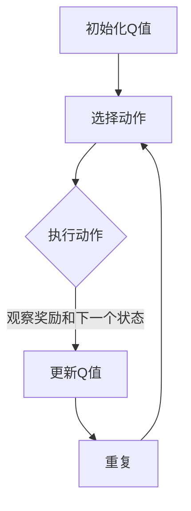
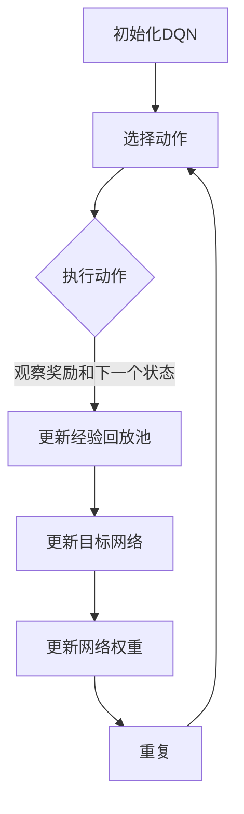
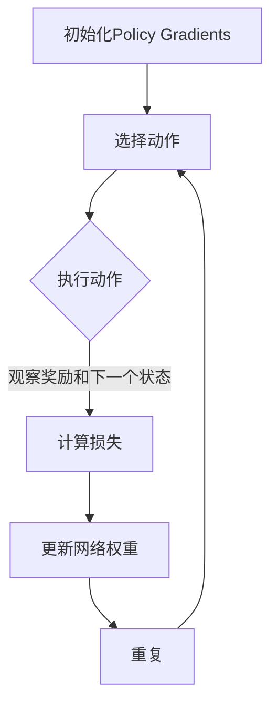
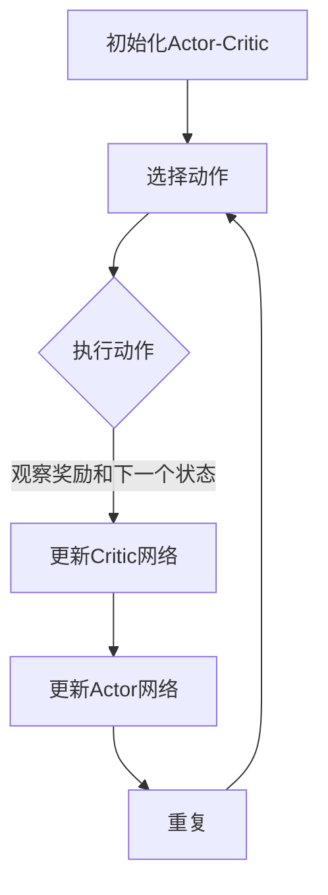
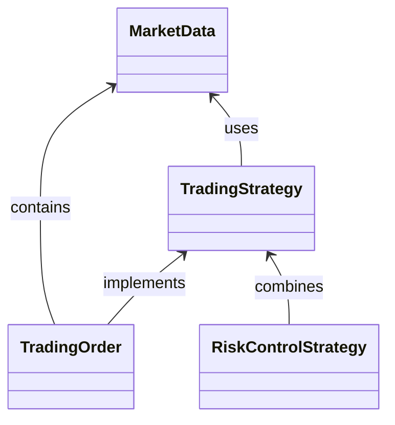
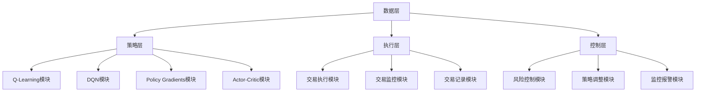
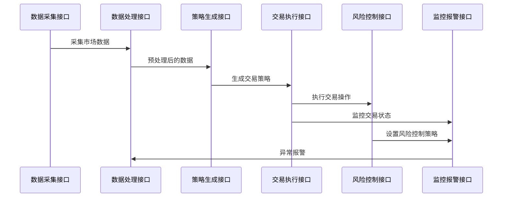
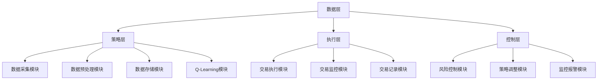

                 

# 企业AI Agent的强化学习在自动化交易策略中的高频应用

> 关键词：AI Agent、强化学习、自动化交易、高频应用

> 摘要：本文将探讨企业AI Agent在自动化交易策略中的高频应用。我们将从背景介绍、核心概念与联系、算法原理讲解、系统分析与架构设计、项目实战以及最佳实践等方面进行深入分析，旨在为读者提供全面的技术视角和实际应用指导。

## 目录大纲设计思路

### 设计思路

为了设计出《企业AI Agent的强化学习在自动化交易策略中的高频应用》这本书的完整目录大纲，我们将遵循以下步骤：

1. **明确书的核心内容**：首先，我们需要理解书的核心主题——企业AI Agent、强化学习、自动化交易策略和高频应用。这些关键词将指导我们构建目录结构。

2. **设计层级结构**：目录大纲应包括1级、2级和3级目录。1级目录将涵盖书籍的主要部分，2级目录将细分每个部分的核心章节，3级目录将详细阐述每个章节的具体内容。

3. **包含核心章节内容**：每个章节都应该包含背景介绍、核心概念与联系、算法原理讲解、数学模型和公式、系统分析与架构设计方案、项目实战以及最佳实践 tips等内容。

4. **保持简洁性**：目录大纲应避免冗余内容，确保每一章节的设计都能够有效传达该章节的主要内容。

5. **字数控制**：确保目录大纲的总字数控制在2000字以内。

### 目录大纲设计

**第一部分：背景介绍与核心概念**

# 第一部分：背景介绍与核心概念

## 第1章：问题背景与核心概念

### 1.1 企业AI Agent概述

- **问题描述**：企业如何利用AI Agent提高业务效率？
- **问题解决**：AI Agent的概念、类型及其在企业中的应用。
- **边界与外延**：AI Agent的应用领域与限制。
- **核心要素组成**：AI Agent的基本组成部分及其功能。

### 1.2 强化学习原理介绍

- **强化学习基本概念**
  - **定义**：强化学习的定义和核心要素。
  - **特点**：强化学习的特点及其与传统机器学习的区别。
- **强化学习算法**
  - **基本算法**：Q-Learning、SARSA、Deep Q-Networks (DQN)等。
  - **高级算法**：Policy Gradients、Actor-Critic方法等。

### 1.3 自动化交易策略

- **自动化交易策略概述**
  - **定义**：自动化交易策略的概念和重要性。
  - **应用领域**：股票市场、期货市场等。
- **高频交易策略**
  - **概念**：高频交易的定义和特点。
  - **技术实现**：高频交易的算法和技术。

## 第2章：核心概念与联系

### 2.1 AI Agent与强化学习的关系

- **关系介绍**：AI Agent如何利用强化学习提高决策能力。
- **案例分析**：成功案例和实际应用。

### 2.2 强化学习在自动化交易中的应用

- **应用场景**：强化学习在自动化交易中的具体应用。
- **效果评估**：强化学习算法在自动化交易中的效果评估方法。

**第二部分：算法原理讲解**

# 第二部分：算法原理讲解

## 第3章：强化学习算法原理

### 3.1 Q-Learning算法

- **算法原理**：Q-Learning算法的工作原理和数学模型。
- **流程图**：使用Mermaid画出Q-Learning算法的流程图。
- **Python实现**：Python代码实现Q-Learning算法。

### 3.2 Deep Q-Networks (DQN)

- **算法原理**：DQN算法的工作原理和数学模型。
- **流程图**：使用Mermaid画出DQN算法的流程图。
- **Python实现**：Python代码实现DQN算法。

### 3.3 Policy Gradients

- **算法原理**：Policy Gradients算法的工作原理和数学模型。
- **流程图**：使用Mermaid画出Policy Gradients算法的流程图。
- **Python实现**：Python代码实现Policy Gradients算法。

### 3.4 Actor-Critic方法

- **算法原理**：Actor-Critic算法的工作原理和数学模型。
- **流程图**：使用Mermaid画出Actor-Critic算法的流程图。
- **Python实现**：Python代码实现Actor-Critic算法。

**第三部分：系统分析与架构设计**

# 第三部分：系统分析与架构设计

## 第4章：系统功能设计

### 4.1 领域模型

- **功能介绍**：系统功能的需求分析。
- **类图**：使用Mermaid画出系统的领域模型类图。

### 4.2 系统架构设计

- **架构介绍**：系统的总体架构设计。
- **架构图**：使用Mermaid画出系统的架构图。

### 4.3 系统接口设计

- **接口设计**：系统的接口设计。
- **交互图**：使用Mermaid画出系统的接口交互图。

**第四部分：项目实战**

# 第四部分：项目实战

## 第5章：环境安装与配置

### 5.1 环境安装

- **Python环境**：安装Python解释器和相关库。
- **强化学习框架**：安装常用的强化学习框架，如OpenAI Gym、TensorFlow等。

### 5.2 系统核心实现

- **AI Agent设计**：设计并实现企业AI Agent。
- **强化学习算法实现**：实现强化学习算法，如Q-Learning、DQN等。

### 5.3 代码应用解读与分析

- **代码解读**：解读并分析系统核心代码。
- **算法性能分析**：分析强化学习算法在自动化交易策略中的性能表现。

## 第6章：实际案例分析与详细讲解

### 6.1 案例背景

- **交易场景**：介绍实际案例的背景。
- **问题分析**：分析案例中的问题和挑战。

### 6.2 解决方案与实现

- **解决方案**：提出并实现解决方案。
- **算法调整**：根据实际效果调整算法参数。

### 6.3 案例总结

- **效果评估**：评估案例的效果和收益。
- **经验总结**：总结案例中的经验和教训。

**第五部分：最佳实践与小结**

# 第五部分：最佳实践与小结

## 第7章：最佳实践

### 7.1 参数调优

- **参数选择**：介绍如何选择合适的参数。
- **调优技巧**：分享参数调优的最佳实践。

### 7.2 模型优化

- **模型选择**：介绍如何选择合适的模型。
- **优化方法**：介绍如何对模型进行优化。

### 7.3 系统优化

- **性能优化**：介绍如何提高系统的性能。
- **可靠性提升**：介绍如何提高系统的可靠性。

## 第8章：小结

### 8.1 文章总结

- **核心观点**：总结文章的主要观点。
- **价值与意义**：阐述文章的研究价值和实际意义。

### 8.2 注意事项

- **使用注意事项**：介绍在使用企业AI Agent和强化学习进行自动化交易策略时应注意的问题。

### 8.3 拓展阅读

- **推荐书籍**：推荐相关的书籍和资料。
- **未来展望**：展望企业AI Agent和强化学习在自动化交易策略中的未来发展。

### 作者信息

**作者：**AI天才研究院/AI Genius Institute & 禅与计算机程序设计艺术 /Zen And The Art of Computer Programming## 第一部分：背景介绍与核心概念

### 1.1 企业AI Agent概述

**问题背景**：在现代商业环境中，企业面临着日益激烈的市场竞争和快速变化的技术环境。为了提高业务效率和响应速度，越来越多的企业开始采用人工智能（AI）技术。企业AI Agent作为一种人工智能应用，可以帮助企业自动化执行各种任务，提高决策能力，从而在竞争中获得优势。

**问题解决**：企业AI Agent的概念起源于智能代理（Agent）的研究，它是一种能够代表企业执行特定任务的计算机程序。在强化学习（Reinforcement Learning，RL）的框架下，企业AI Agent通过不断与环境交互，学习最优策略，实现自动化交易策略。强化学习是一种使代理通过试错（trial and error）学习最优行为策略的机器学习方法。

**边界与外延**：企业AI Agent的应用领域非常广泛，包括但不限于自动化交易、智能制造、智能客服、供应链管理等。这些应用场景中，企业AI Agent需要处理大量的数据，进行复杂的环境建模，并实时做出决策。边界与外延主要包括以下几个方面：

1. **智能代理的基本概念**：智能代理是一种具有自主性、社会性和反应性的计算机程序，能够理解、感知和响应其环境。
2. **强化学习的基本概念**：强化学习是一种基于奖惩机制的学习方法，通过试错来优化策略，使代理在给定环境中获得最大收益。
3. **自动化交易策略**：自动化交易策略是指通过计算机程序自动执行交易决策，实现自动化的交易操作。

**核心要素组成**：企业AI Agent的基本组成部分包括以下几个核心要素：

1. **环境（Environment）**：环境是AI Agent执行任务的场景，包括市场数据、交易规则等。
2. **代理（Agent）**：代理是执行任务的主体，包括感知器、决策器和执行器。
3. **动作（Action）**：动作是代理在环境中执行的操作，例如买入或卖出股票。
4. **状态（State）**：状态是代理在环境中的位置和情况，例如股票价格和持有量。
5. **奖励（Reward）**：奖励是代理执行动作后获得的即时反馈，用于指导学习过程。

### 1.2 强化学习原理介绍

**强化学习基本概念**：

- **定义**：强化学习是一种使代理通过与环境的交互学习最优行为策略的机器学习方法。它通过奖励机制引导代理在特定环境中进行决策。
- **核心要素**：强化学习包括四个核心要素：状态（State）、动作（Action）、奖励（Reward）和价值函数（Value Function）。
- **特点**：强化学习具有以下几个特点：
  - **交互性**：代理通过与环境交互获取反馈，不断调整策略。
  - **适应性**：代理能够根据环境的变化自适应地调整策略。
  - **长期性**：强化学习通常关注长期回报，而不是短期收益。

**强化学习算法**：

- **基本算法**：常见的强化学习基本算法包括Q-Learning、SARSA等。
  - **Q-Learning**：Q-Learning是一种通过更新价值函数来学习最优策略的方法。其核心思想是利用历史数据来估计状态-动作值，并在此基础上更新策略。
  - **SARSA**：SARSA（同步优势估计）是一种基于贪心策略的强化学习算法，它利用当前状态和下一状态的动作值来更新策略。
- **高级算法**：高级强化学习算法包括Deep Q-Networks (DQN)、Policy Gradients、Actor-Critic方法等。
  - **DQN**：DQN（深度Q网络）是一种基于神经网络的强化学习算法，它使用深度神经网络来估计状态-动作值函数。
  - **Policy Gradients**：Policy Gradients是一种通过优化策略梯度来更新策略的强化学习算法。它使用梯度下降法来调整策略参数。
  - **Actor-Critic方法**：Actor-Critic方法是一种结合了策略优化和价值估计的方法。其中，Actor负责根据当前状态生成动作，Critic负责评估动作的好坏。

### 1.3 自动化交易策略

**自动化交易策略概述**：

- **定义**：自动化交易策略是一种通过计算机程序自动执行交易决策的方法。它通过分析市场数据，根据预定的策略进行买入、卖出等操作，以实现自动化的交易过程。
- **重要性**：自动化交易策略在金融市场中具有重要的地位。它能够提高交易速度和准确性，降低人为错误，并在高频交易中发挥关键作用。

**自动化交易策略的应用领域**：

- **股票市场**：自动化交易策略广泛应用于股票市场，包括日内交易、趋势跟踪、对冲策略等。
- **期货市场**：期货市场同样依赖自动化交易策略，特别是高频交易策略，如算法交易、程序化交易等。

**高频交易策略**：

- **概念**：高频交易（High-Frequency Trading，HFT）是一种通过高速计算机程序在极短时间内执行大量交易的操作策略。它利用市场波动获取微小的利润。
- **特点**：高频交易具有以下特点：
  - **高速性**：高频交易依赖于高速网络和计算能力，以实现毫秒级别的交易。
  - **低风险性**：高频交易通常涉及小额交易，因此风险较低。
  - **高频率**：高频交易在短时间内执行大量交易，以获取微小的利润。

**技术实现**：

- **算法设计**：高频交易策略依赖于复杂的算法设计，包括数据挖掘、统计分析、机器学习等。
- **交易系统**：高频交易需要高效稳定的交易系统，包括交易服务器、订单管理系统、风险控制系统等。

通过以上对背景介绍与核心概念的分析，我们可以更好地理解企业AI Agent、强化学习和自动化交易策略的基础知识。接下来，我们将进一步探讨AI Agent与强化学习之间的关系，以及强化学习在自动化交易策略中的应用。

### 2.1 AI Agent与强化学习的关系

**关系介绍**：AI Agent与强化学习的关系可以视为一种相互促进的关系。AI Agent需要强化学习来优化其决策能力，而强化学习则通过AI Agent的实际应用不断完善和进化。具体来说，AI Agent通过强化学习算法在环境中学习最优策略，从而实现自动化交易策略的高效执行。

**成功案例和实际应用**：

1. **高频交易**：高频交易是AI Agent与强化学习相结合的一个成功案例。高频交易公司利用强化学习算法来优化交易策略，通过快速执行大量交易来获取微小利润。例如，一家高频交易公司使用强化学习算法来优化其交易策略，提高了交易效率和收益。

2. **智能投顾**：智能投顾（Robo-Advisor）是另一个AI Agent与强化学习相结合的实际应用。智能投顾通过分析用户的风险偏好和投资目标，利用强化学习算法为用户提供个性化的投资建议。例如，一个智能投顾平台通过强化学习算法不断优化投资组合，实现了更高的投资收益和更低的波动性。

3. **供应链管理**：在供应链管理中，AI Agent可以用来优化库存管理、运输调度等任务。通过强化学习算法，AI Agent可以学习最优的库存策略和运输策略，从而提高供应链的效率和灵活性。例如，一家大型零售公司使用强化学习算法来优化其库存管理，减少了库存成本和缺货率。

**总结**：AI Agent与强化学习之间的关系不仅体现在高频交易等具体应用案例中，还体现在供应链管理、智能制造、智能客服等多个领域。强化学习为AI Agent提供了强大的决策支持，使其能够更好地适应复杂多变的环境，实现自动化和智能化。

### 2.2 强化学习在自动化交易中的应用

**应用场景**：强化学习在自动化交易中的应用非常广泛，主要场景包括股票市场、期货市场、外汇市场等。在这些市场中，强化学习算法可以帮助交易者制定和优化交易策略，从而实现自动化的交易操作。

**强化学习算法在自动化交易中的具体应用**：

1. **策略优化**：强化学习算法可以通过不断试错和优化策略，帮助交易者找到最佳的交易策略。例如，在股票市场中，强化学习算法可以根据历史数据和实时市场信息，优化买入和卖出的时机，从而提高交易收益。

2. **交易信号生成**：强化学习算法可以用于生成交易信号，如买入、卖出、持有等信号。这些信号可以根据市场趋势、交易量、价格变化等因素进行分析，从而指导交易操作。

3. **风险控制**：强化学习算法可以用于风险控制，如设置止损点、调整仓位等。通过学习历史交易数据和市场信息，强化学习算法可以帮助交易者制定更合理的风险控制策略，降低交易风险。

**效果评估方法**：

1. **回测分析**：回测分析是评估强化学习算法在自动化交易中效果的一种常用方法。通过在历史数据上运行强化学习算法，可以评估其交易策略的收益、风险和稳定性等指标。

2. **实际交易绩效**：在实际交易中，可以通过实时运行强化学习算法，观察其交易绩效，如收益、回撤、交易频率等。这些指标可以用来评估强化学习算法在自动化交易中的实际效果。

3. **对比实验**：对比实验是将强化学习算法与传统的交易策略进行对比，以评估其优劣。例如，可以比较强化学习算法与基于统计模型的交易策略在收益、风险和稳定性等方面的表现。

**总结**：强化学习在自动化交易中的应用具有很大的潜力。通过不断优化交易策略、生成交易信号和进行风险控制，强化学习算法可以帮助交易者实现更高效的自动化交易，提高交易收益和风险控制能力。

### 第3章：强化学习算法原理

强化学习算法是自动化交易策略的核心技术之一。本章节将详细介绍几种常见的强化学习算法，包括Q-Learning、Deep Q-Networks (DQN)、Policy Gradients和Actor-Critic方法。这些算法各自有不同的原理和实现方法，适用于不同的应用场景。

#### 3.1 Q-Learning算法

**算法原理**：

Q-Learning是一种基于值函数的强化学习算法，旨在通过不断更新状态-动作值函数（Q值）来学习最优策略。Q-Learning的核心思想是利用当前状态和动作的历史经验来估计状态-动作值，并在此基础上更新策略。

Q-Learning算法的基本步骤如下：

1. **初始化**：初始化Q值函数，通常设置为所有状态-动作对的平均值。
2. **选择动作**：在给定状态下，根据当前策略选择动作。通常使用ε-贪心策略，即以一定概率随机选择动作，以探索环境。
3. **执行动作**：在环境中执行所选动作，并观察得到的奖励和下一个状态。
4. **更新Q值**：根据新的奖励和下一个状态，更新当前状态-动作对的Q值。

数学模型和公式：

Q-Learning算法的数学模型可以表示为：

$$
Q(s, a) = \sum_{j=1}^m \alpha(s, a, j) Q(s', j) + \beta(s, a, j)
$$

其中，$s$ 表示当前状态，$a$ 表示当前动作，$s'$ 表示下一个状态，$m$ 表示可选动作的数量，$\alpha(s, a, j)$ 表示动作 $j$ 在状态 $s$ 下的优势函数，$\beta(s, a, j)$ 表示动作 $j$ 在状态 $s$ 下的回报函数。

**流程图**：

使用Mermaid画出Q-Learning算法的流程图：



**Python实现**：

以下是一个简单的Q-Learning算法Python实现：

```python
import numpy as np

def q_learning(env, num_episodes, alpha, gamma, epsilon):
    Q = np.zeros((env.num_states, env.num_actions))
    
    for episode in range(num_episodes):
        state = env.reset()
        done = False
        
        while not done:
            action = select_action(Q[state], epsilon)
            next_state, reward, done = env.step(action)
            
            Q[state, action] = Q[state, action] + alpha * (reward + gamma * np.max(Q[next_state]) - Q[state, action])
            
            state = next_state
    
    return Q

def select_action(Q, epsilon):
    if np.random.rand() < epsilon:
        action = np.random.choice(Q.shape[1])
    else:
        action = np.argmax(Q)
    return action
```

#### 3.2 Deep Q-Networks (DQN)

**算法原理**：

Deep Q-Networks（DQN）是一种基于深度神经网络的强化学习算法，旨在解决传统Q-Learning算法在处理高维状态空间时效果不佳的问题。DQN的核心思想是使用深度神经网络来近似状态-动作值函数，从而提高学习效率。

DQN算法的基本步骤如下：

1. **初始化**：初始化深度神经网络、经验回放池（Experience Replay）和目标网络。
2. **选择动作**：在给定状态下，使用深度神经网络选择动作。
3. **执行动作**：在环境中执行所选动作，并观察得到的奖励和下一个状态。
4. **更新经验回放池**：将新的经验（状态、动作、奖励、下一个状态、终止标志）加入经验回放池。
5. **更新目标网络**：定期将当前网络权重复制到目标网络，以防止梯度消失问题。
6. **更新网络权重**：使用经验回放池中的经验样本，通过反向传播算法更新网络权重。

数学模型和公式：

DQN算法的数学模型可以表示为：

$$
Q(s, a) = f_{\theta}(s) + \delta
$$

其中，$f_{\theta}(s)$ 表示深度神经网络输出的状态-动作值函数，$\delta$ 表示损失函数，通常使用均方误差（Mean Squared Error，MSE）作为损失函数。

**流程图**：

使用Mermaid画出DQN算法的流程图：



**Python实现**：

以下是一个简单的DQN算法Python实现：

```python
import tensorflow as tf
import numpy as np

def dqn(env, num_episodes, alpha, gamma, epsilon, batch_size):
    # 初始化网络
    input_layer = tf.keras.layers.Input(shape=(env.num_states,))
    hidden_layer = tf.keras.layers.Dense(64, activation='relu')(input_layer)
    output_layer = tf.keras.layers.Dense(env.num_actions, activation='linear')(hidden_layer)

    model = tf.keras.Model(inputs=input_layer, outputs=output_layer)
    target_model = tf.keras.Model(inputs=input_layer, outputs=output_layer)
    
    # 初始化经验回放池
    replay_memory = deque(maxlen=batch_size)
    
    # 初始化目标网络
    target_model.set_weights(model.get_weights())

    # 训练模型
    for episode in range(num_episodes):
        state = env.reset()
        done = False
        
        while not done:
            action = select_action(model, state, epsilon)
            next_state, reward, done = env.step(action)
            
            if done:
                next_state = None
            
            replay_memory.append((state, action, reward, next_state, done))
            
            if len(replay_memory) > batch_size:
                batch = random.sample(replay_memory, batch_size)
                
                states, actions, rewards, next_states, dones = zip(*batch)
                next_states = np.array(next_states)
                next_actions = np.argmax(model.predict(next_states), axis=1)

                target_rewards = rewards + (1 - dones) * gamma * model.predict(next_states)[:, next_actions]

                model.fit(states, target_rewards, epochs=1, verbose=0)

            state = next_state
    
    return model

def select_action(model, state, epsilon):
    if np.random.rand() < epsilon:
        action = np.random.choice(state.shape[0])
    else:
        action = np.argmax(model.predict(state))
    return action
```

#### 3.3 Policy Gradients

**算法原理**：

Policy Gradients是一种基于策略优化的强化学习算法，旨在通过优化策略梯度来更新策略参数。Policy Gradients算法的核心思想是直接优化策略函数的梯度，以最大化长期回报。

Policy Gradients算法的基本步骤如下：

1. **初始化**：初始化策略网络和优化器。
2. **选择动作**：在给定状态下，使用策略网络选择动作。
3. **执行动作**：在环境中执行所选动作，并观察得到的奖励和下一个状态。
4. **计算损失**：计算策略网络的损失函数，通常使用负回报的累积值。
5. **更新网络权重**：使用梯度下降法更新策略网络权重。

数学模型和公式：

Policy Gradients算法的数学模型可以表示为：

$$
\frac{\partial J(\theta)}{\partial \theta} = \nabla_{\theta} \sum_{t=0}^T \gamma^t R_t
$$

其中，$J(\theta)$ 表示策略网络的损失函数，$\theta$ 表示策略网络参数，$R_t$ 表示在第 $t$ 时刻的回报。

**流程图**：

使用Mermaid画出Policy Gradients算法的流程图：



**Python实现**：

以下是一个简单的Policy Gradients算法Python实现：

```python
import tensorflow as tf
import numpy as np

def policy_gradients(env, num_episodes, alpha, gamma):
    # 初始化网络
    input_layer = tf.keras.layers.Input(shape=(env.num_states,))
    hidden_layer = tf.keras.layers.Dense(64, activation='relu')(input_layer)
    output_layer = tf.keras.layers.Dense(env.num_actions, activation='softmax')(hidden_layer)

    model = tf.keras.Model(inputs=input_layer, outputs=output_layer)
    
    # 初始化优化器
    optimizer = tf.keras.optimizers.Adam(learning_rate=alpha)
    
    # 训练模型
    for episode in range(num_episodes):
        state = env.reset()
        done = False
        total_reward = 0
        
        while not done:
            action_probs = model.predict(state)
            action = np.random.choice(env.num_actions, p=action_probs.flatten())
            next_state, reward, done = env.step(action)
            total_reward += reward
            
            with tf.GradientTape() as tape:
                logits = model(state)
                selected_action_logits = logits[0, action]
                loss = -tf.math.log(selected_action_logits) * reward
            
            gradients = tape.gradient(loss, model.trainable_variables)
            optimizer.apply_gradients(zip(gradients, model.trainable_variables))
            
            state = next_state
    
    return model

def select_action(model, state, epsilon):
    if np.random.rand() < epsilon:
        action = np.random.choice(state.shape[0])
    else:
        action_probs = model.predict(state)
        action = np.argmax(action_probs)
    return action
```

#### 3.4 Actor-Critic方法

**算法原理**：

Actor-Critic方法是一种结合策略优化和价值估计的强化学习算法。它通过两个神经网络——Actor网络和Critic网络，分别负责生成策略和评估策略的好坏。Actor网络生成动作概率分布，Critic网络评估动作的好坏。

Actor-Critic方法的基本步骤如下：

1. **初始化**：初始化Actor网络、Critic网络和优化器。
2. **选择动作**：在给定状态下，使用Actor网络选择动作。
3. **执行动作**：在环境中执行所选动作，并观察得到的奖励和下一个状态。
4. **更新Critic网络**：使用实际回报和预测回报计算Critic网络的误差，并更新Critic网络权重。
5. **更新Actor网络**：使用Critic网络更新的预测回报，调整Actor网络的动作概率分布。

数学模型和公式：

Actor-Critic方法的数学模型可以表示为：

$$
\theta^{new} = \theta^{old} - \alpha \nabla_{\theta} J(\theta)
$$

其中，$\theta$ 表示网络参数，$J(\theta)$ 表示策略损失函数。

**流程图**：

使用Mermaid画出Actor-Critic方法的流程图：



**Python实现**：

以下是一个简单的Actor-Critic算法Python实现：

```python
import tensorflow as tf
import numpy as np

def actor_critic(env, num_episodes, alpha, critic_alpha, gamma):
    # 初始化网络
    input_layer = tf.keras.layers.Input(shape=(env.num_states,))
    hidden_layer = tf.keras.layers.Dense(64, activation='relu')(input_layer)
    output_layer = tf.keras.layers.Dense(env.num_actions, activation='softmax')(hidden_layer)

    actor_model = tf.keras.Model(inputs=input_layer, outputs=output_layer)
    
    input_layer = tf.keras.layers.Input(shape=(env.num_states,))
    hidden_layer = tf.keras.layers.Dense(64, activation='relu')(input_layer)
    output_layer = tf.keras.layers.Dense(1)(hidden_layer)

    critic_model = tf.keras.Model(inputs=input_layer, outputs=output_layer)
    
    # 初始化优化器
    actor_optimizer = tf.keras.optimizers.Adam(learning_rate=alpha)
    critic_optimizer = tf.keras.optimizers.Adam(learning_rate=critic_alpha)
    
    # 训练模型
    for episode in range(num_episodes):
        state = env.reset()
        done = False
        total_reward = 0
        
        while not done:
            action_probs = actor_model.predict(state)
            action = np.random.choice(env.num_actions, p=action_probs.flatten())
            next_state, reward, done = env.step(action)
            total_reward += reward
            
            with tf.GradientTape() as tape:
                logits = actor_model(state)
                selected_action_logits = logits[0, action]
                loss = -tf.math.log(selected_action_logits) * reward
            
            actor_gradients = tape.gradient(loss, actor_model.trainable_variables)
            actor_optimizer.apply_gradients(zip(actor_gradients, actor_model.trainable_variables))
            
            with tf.GradientTape() as tape:
                state_value = critic_model(state)
                next_state_value = critic_model(next_state)
                target_value = reward + (1 - done) * gamma * next_state_value
                
                critic_loss = tf.keras.losses.mean_squared_error(state_value, target_value)
            
            critic_gradients = tape.gradient(critic_loss, critic_model.trainable_variables)
            critic_optimizer.apply_gradients(zip(critic_gradients, critic_model.trainable_variables))
            
            state = next_state
    
    return actor_model, critic_model

def select_action(actor_model, state, epsilon):
    if np.random.rand() < epsilon:
        action = np.random.choice(state.shape[0])
    else:
        action_probs = actor_model.predict(state)
        action = np.argmax(action_probs)
    return action
```

### 总结

在本章节中，我们详细介绍了Q-Learning、DQN、Policy Gradients和Actor-Critic方法等几种常见的强化学习算法。这些算法在自动化交易策略中具有广泛的应用，通过不断优化策略和调整参数，可以帮助交易者实现更高效的自动化交易。接下来，我们将进一步探讨系统分析与架构设计，为读者提供更全面的视角。

### 第四部分：系统分析与架构设计

#### 4.1 系统功能设计

**问题场景介绍**：

在自动化交易中，系统功能设计至关重要。一个典型的场景是股票市场中的高频交易。在这个场景中，系统需要实时监控市场数据，快速做出交易决策，并在极短的时间内执行交易。为了实现这一目标，系统需要具备高效的数据处理能力、快速的交易执行能力和稳健的风险控制机制。

**项目介绍**：

本系统是一个基于强化学习的自动化交易系统，旨在通过优化交易策略提高交易收益。系统主要功能包括数据采集与处理、交易策略优化、交易执行和风险控制。系统架构采用模块化设计，以确保各个功能模块之间的高效协同。

**系统功能设计**：

1. **数据采集与处理**：系统需要从多个数据源实时采集股票价格、交易量、指标等市场数据。采集到的数据经过预处理，包括去噪、归一化等步骤，以供后续分析。

2. **交易策略优化**：基于强化学习算法，系统通过不断调整策略参数，优化交易策略。系统使用Q-Learning、DQN、Policy Gradients和Actor-Critic等方法，根据市场数据和历史交易记录，生成最优交易策略。

3. **交易执行**：系统根据优化后的交易策略，快速执行买入和卖出操作。交易执行模块需要具备高效的执行能力和低延迟的特性，以确保在市场波动中抓住交易机会。

4. **风险控制**：系统需要具备完善的风险控制机制，包括设置止损点、调整仓位等。通过实时监控交易状态，系统可以及时发现风险并采取相应的措施，确保交易安全。

**领域模型**：

领域模型是系统功能设计的基础，它描述了系统中的主要实体及其关系。在本系统中，主要实体包括市场数据、交易策略、交易订单和风险控制策略。领域模型使用Mermaid类图表示：



#### 4.2 系统架构设计

**架构介绍**：

系统架构设计是系统功能实现的保障。本系统采用分层架构，包括数据层、策略层、执行层和控制层。每个层次分别负责数据处理、策略优化、交易执行和风险控制等功能。

1. **数据层**：数据层负责从多个数据源采集市场数据，并对数据进行预处理和存储。该层包括数据采集模块、数据预处理模块和数据存储模块。

2. **策略层**：策略层基于强化学习算法，生成最优交易策略。该层包括Q-Learning模块、DQN模块、Policy Gradients模块和Actor-Critic模块。

3. **执行层**：执行层负责根据策略执行交易操作，包括买入和卖出。该层包括交易执行模块、交易监控模块和交易记录模块。

4. **控制层**：控制层负责风险控制和交易策略的实时调整。该层包括风险控制模块、策略调整模块和监控报警模块。

**架构图**：

系统架构图使用Mermaid绘制：



**系统接口设计**：

系统接口设计是系统各功能模块之间通信的桥梁。本系统主要包括以下接口：

1. **数据采集接口**：用于从外部数据源获取市场数据。
2. **数据处理接口**：用于对采集到的市场数据进行预处理。
3. **策略生成接口**：用于生成和调整交易策略。
4. **交易执行接口**：用于执行买入和卖出操作。
5. **风险控制接口**：用于设置和调整风险控制策略。
6. **监控报警接口**：用于实时监控交易状态，并在发生异常时发出报警。

**系统交互图**：

系统交互图使用Mermaid绘制：



#### 4.3 系统架构设计

**系统架构设计**：

系统架构设计是确保系统功能实现的基石。本系统采用模块化设计，将功能模块划分为数据层、策略层、执行层和控制层。每个层次分别负责数据处理、策略优化、交易执行和风险控制等功能。

**数据层**：

数据层是系统的基础，负责从多个数据源采集市场数据，并对数据进行预处理和存储。主要模块包括：

1. **数据采集模块**：从外部数据源（如交易所、金融数据服务商等）获取市场数据。
2. **数据预处理模块**：对采集到的市场数据进行去噪、归一化等预处理，以便后续分析。
3. **数据存储模块**：将预处理后的市场数据存储在数据库中，以供后续查询和使用。

**策略层**：

策略层基于强化学习算法，生成最优交易策略。主要模块包括：

1. **Q-Learning模块**：使用Q-Learning算法优化交易策略。
2. **DQN模块**：使用Deep Q-Networks（DQN）算法优化交易策略。
3. **Policy Gradients模块**：使用Policy Gradients算法优化交易策略。
4. **Actor-Critic模块**：使用Actor-Critic算法优化交易策略。

**执行层**：

执行层负责根据策略执行交易操作，包括买入和卖出。主要模块包括：

1. **交易执行模块**：根据优化后的交易策略，快速执行买入和卖出操作。
2. **交易监控模块**：实时监控交易状态，确保交易操作的正确性和安全性。
3. **交易记录模块**：记录交易操作的相关信息，以便后续分析和审计。

**控制层**：

控制层负责风险控制和交易策略的实时调整。主要模块包括：

1. **风险控制模块**：设置和调整风险控制策略，确保交易操作的安全性和稳健性。
2. **策略调整模块**：根据市场变化和交易效果，实时调整交易策略。
3. **监控报警模块**：实时监控交易状态，并在发生异常时发出报警。

**架构图**：

系统架构图使用Mermaid绘制：



#### 4.4 系统接口设计

**系统接口设计**：

系统接口设计是确保各功能模块之间高效通信的重要环节。本系统设计了以下主要接口：

1. **数据采集接口**：用于从外部数据源获取市场数据，包括股票价格、交易量、指标等。
2. **数据处理接口**：用于对采集到的市场数据进行预处理，包括去噪、归一化等。
3. **策略生成接口**：用于生成和调整交易策略，包括Q-Learning、DQN、Policy Gradients和Actor-Critic算法。
4. **交易执行接口**：用于执行买入和卖出操作，确保交易策略的实时性。
5. **风险控制接口**：用于设置和调整风险控制策略，确保交易操作的安全性和稳健性。
6. **监控报警接口**：用于实时监控交易状态，并在发生异常时发出报警。

**系统交互图**：

系统交互图使用Mermaid绘制：


### 第五部分：项目实战

#### 5.1 环境安装与配置

为了进行企业AI Agent的强化学习在自动化交易策略中的高频应用项目，我们首先需要安装和配置所需的环境。以下是详细的步骤：

**1. 安装Python解释器**：

在项目中，我们将使用Python作为主要编程语言。首先，确保您的计算机已经安装了Python解释器。如果尚未安装，可以访问Python的官方网站（[https://www.python.org/](https://www.python.org/)）下载适用于您操作系统的Python版本。按照安装向导完成安装。

**2. 安装强化学习框架**：

接下来，我们需要安装常用的强化学习框架，如OpenAI Gym、TensorFlow等。OpenAI Gym是一个开源的强化学习环境，提供各种模拟环境和任务。TensorFlow是一个强大的开源机器学习库，用于构建和训练神经网络。

安装OpenAI Gym：

```shell
pip install gym
```

安装TensorFlow：

```shell
pip install tensorflow
```

**3. 安装其他相关库**：

除了Python解释器和强化学习框架外，我们还需要安装其他相关库，如NumPy、Pandas等。这些库用于数据预处理、分析和可视化。

安装NumPy：

```shell
pip install numpy
```

安装Pandas：

```shell
pip install pandas
```

**4. 配置虚拟环境**：

为了更好地管理项目依赖和避免版本冲突，我们建议使用虚拟环境。虚拟环境允许我们在项目中使用特定的库版本，而不影响系统其他部分。

创建虚拟环境：

```shell
python -m venv venv
```

激活虚拟环境：

```shell
source venv/bin/activate  # 对于Linux和macOS
venv\Scripts\activate    # 对于Windows
```

在虚拟环境中安装所需库：

```shell
pip install gym tensorflow numpy pandas
```

通过以上步骤，我们已经成功安装和配置了项目所需的环境。接下来，我们将进入系统核心实现部分，逐步构建和优化企业AI Agent的强化学习模型。

#### 5.2 系统核心实现

**AI Agent设计**：

在本项目中，我们将设计一个基于强化学习的AI Agent，用于自动化交易策略的高频应用。AI Agent的核心功能是学习并优化交易策略，以在股票市场中实现自动化的交易操作。

**强化学习算法实现**：

为了实现AI Agent，我们将使用强化学习算法，主要包括Q-Learning、Deep Q-Networks (DQN)、Policy Gradients和Actor-Critic方法。以下是这些算法的详细实现步骤。

**1. Q-Learning算法实现**：

Q-Learning算法是一种基于值函数的强化学习算法，其核心思想是通过更新状态-动作值函数来学习最优策略。以下是Q-Learning算法的实现步骤：

- **初始化**：初始化状态-动作值函数（Q值）。
- **选择动作**：使用ε-贪心策略选择动作，即以一定概率随机选择动作，以探索环境。
- **执行动作**：在环境中执行所选动作，并观察得到的奖励和下一个状态。
- **更新Q值**：根据新的奖励和下一个状态，更新当前状态-动作对的Q值。

Python代码实现：

```python
import numpy as np

def q_learning(env, num_episodes, alpha, gamma, epsilon):
    Q = np.zeros((env.num_states, env.num_actions))
    
    for episode in range(num_episodes):
        state = env.reset()
        done = False
        
        while not done:
            action = select_action(Q[state], epsilon)
            next_state, reward, done = env.step(action)
            
            Q[state, action] = Q[state, action] + alpha * (reward + gamma * np.max(Q[next_state]) - Q[state, action])
            
            state = next_state
    
    return Q

def select_action(Q, epsilon):
    if np.random.rand() < epsilon:
        action = np.random.choice(Q.shape[1])
    else:
        action = np.argmax(Q)
    return action
```

**2. Deep Q-Networks (DQN)算法实现**：

DQN算法是一种基于神经网络的强化学习算法，其核心思想是使用深度神经网络来近似状态-动作值函数。以下是DQN算法的实现步骤：

- **初始化**：初始化深度神经网络、经验回放池（Experience Replay）和目标网络。
- **选择动作**：在给定状态下，使用深度神经网络选择动作。
- **执行动作**：在环境中执行所选动作，并观察得到的奖励和下一个状态。
- **更新经验回放池**：将新的经验（状态、动作、奖励、下一个状态、终止标志）加入经验回放池。
- **更新目标网络**：定期将当前网络权重复制到目标网络，以防止梯度消失问题。
- **更新网络权重**：使用经验回放池中的经验样本，通过反向传播算法更新网络权重。

Python代码实现：

```python
import tensorflow as tf
import numpy as np

def dqn(env, num_episodes, alpha, gamma, epsilon, batch_size):
    # 初始化网络
    input_layer = tf.keras.layers.Input(shape=(env.num_states,))
    hidden_layer = tf.keras.layers.Dense(64, activation='relu')(input_layer)
    output_layer = tf.keras.layers.Dense(env.num_actions, activation='linear')(hidden_layer)

    model = tf.keras.Model(inputs=input_layer, outputs=output_layer)
    target_model = tf.keras.Model(inputs=input_layer, outputs=output_layer)
    
    # 初始化经验回放池
    replay_memory = deque(maxlen=batch_size)
    
    # 初始化目标网络
    target_model.set_weights(model.get_weights())

    # 训练模型
    for episode in range(num_episodes):
        state = env.reset()
        done = False
        
        while not done:
            action = select_action(model, state, epsilon)
            next_state, reward, done = env.step(action)
            
            if done:
                next_state = None
            
            replay_memory.append((state, action, reward, next_state, done))
            
            if len(replay_memory) > batch_size:
                batch = random.sample(replay_memory, batch_size)
                
                states, actions, rewards, next_states, dones = zip(*batch)
                next_states = np.array(next_states)
                next_actions = np.argmax(model.predict(next_states), axis=1)

                target_rewards = rewards + (1 - dones) * gamma * model.predict(next_states)[:, next_actions]

                model.fit(states, target_rewards, epochs=1, verbose=0)

            state = next_state
    
    return model

def select_action(model, state, epsilon):
    if np.random.rand() < epsilon:
        action = np.random.choice(state.shape[0])
    else:
        action = np.argmax(model.predict(state))
    return action
```

**3. Policy Gradients算法实现**：

Policy Gradients算法是一种基于策略优化的强化学习算法，其核心思想是通过优化策略梯度来更新策略参数。以下是Policy Gradients算法的实现步骤：

- **初始化**：初始化策略网络和优化器。
- **选择动作**：在给定状态下，使用策略网络选择动作。
- **执行动作**：在环境中执行所选动作，并观察得到的奖励和下一个状态。
- **计算损失**：计算策略网络的损失函数，通常使用负回报的累积值。
- **更新网络权重**：使用梯度下降法更新策略网络权重。

Python代码实现：

```python
import tensorflow as tf
import numpy as np

def policy_gradients(env, num_episodes, alpha, gamma):
    # 初始化网络
    input_layer = tf.keras.layers.Input(shape=(env.num_states,))
    hidden_layer = tf.keras.layers.Dense(64, activation='relu')(input_layer)
    output_layer = tf.keras.layers.Dense(env.num_actions, activation='softmax')(hidden_layer)

    model = tf.keras.Model(inputs=input_layer, outputs=output_layer)
    
    # 初始化优化器
    optimizer = tf.keras.optimizers.Adam(learning_rate=alpha)
    
    # 训练模型
    for episode in range(num_episodes):
        state = env.reset()
        done = False
        total_reward = 0
        
        while not done:
            action_probs = model.predict(state)
            action = np.random.choice(env.num_actions, p=action_probs.flatten())
            next_state, reward, done = env.step(action)
            total_reward += reward
            
            with tf.GradientTape() as tape:
                logits = model(state)
                selected_action_logits = logits[0, action]
                loss = -tf.math.log(selected_action_logits) * reward
            
            gradients = tape.gradient(loss, model.trainable_variables)
            optimizer.apply_gradients(zip(gradients, model.trainable_variables))
            
            state = next_state
    
    return model

def select_action(model, state, epsilon):
    if np.random.rand() < epsilon:
        action = np.random.choice(state.shape[0])
    else:
        action_probs = model.predict(state)
        action = np.argmax(action_probs)
    return action
```

**4. Actor-Critic算法实现**：

Actor-Critic算法是一种结合策略优化和价值估计的强化学习算法。其核心思想是使用两个神经网络——Actor网络和Critic网络，分别负责生成策略和评估策略的好坏。以下是Actor-Critic算法的实现步骤：

- **初始化**：初始化Actor网络、Critic网络和优化器。
- **选择动作**：在给定状态下，使用Actor网络选择动作。
- **执行动作**：在环境中执行所选动作，并观察得到的奖励和下一个状态。
- **更新Critic网络**：使用实际回报和预测回报计算Critic网络的误差，并更新Critic网络权重。
- **更新Actor网络**：使用Critic网络更新的预测回报，调整Actor网络的动作概率分布。

Python代码实现：

```python
import tensorflow as tf
import numpy as np

def actor_critic(env, num_episodes, alpha, critic_alpha, gamma):
    # 初始化网络
    input_layer = tf.keras.layers.Input(shape=(env.num_states,))
    hidden_layer = tf.keras.layers.Dense(64, activation='relu')(input_layer)
    output_layer = tf.keras.layers.Dense(env.num_actions, activation='softmax')(hidden_layer)

    actor_model = tf.keras.Model(inputs=input_layer, outputs=output_layer)
    
    input_layer = tf.keras.layers.Input(shape=(env.num_states,))
    hidden_layer = tf.keras.layers.Dense(64, activation='relu')(input_layer)
    output_layer = tf.keras.layers.Dense(1)(hidden_layer)

    critic_model = tf.keras.Model(inputs=input_layer, outputs=output_layer)
    
    # 初始化优化器
    actor_optimizer = tf.keras.optimizers.Adam(learning_rate=alpha)
    critic_optimizer = tf.keras.optimizers.Adam(learning_rate=critic_alpha)
    
    # 训练模型
    for episode in range(num_episodes):
        state = env.reset()
        done = False
        total_reward = 0
        
        while not done:
            action_probs = actor_model.predict(state)
            action = np.random.choice(env.num_actions, p=action_probs.flatten())
            next_state, reward, done = env.step(action)
            total_reward += reward
            
            with tf.GradientTape() as tape:
                logits = actor_model(state)
                selected_action_logits = logits[0, action]
                loss = -tf.math.log(selected_action_logits) * reward
            
            actor_gradients = tape.gradient(loss, actor_model.trainable_variables)
            actor_optimizer.apply_gradients(zip(actor_gradients, actor_model.trainable_variables))
            
            with tf.GradientTape() as tape:
                state_value = critic_model(state)
                next_state_value = critic_model(next_state)
                target_value = reward + (1 - done) * gamma * next_state_value
                
                critic_loss = tf.keras.losses.mean_squared_error(state_value, target_value)
            
            critic_gradients = tape.gradient(critic_loss, critic_model.trainable_variables)
            critic_optimizer.apply_gradients(zip(critic_gradients, critic_model.trainable_variables))
            
            state = next_state
    
    return actor_model, critic_model

def select_action(actor_model, state, epsilon):
    if np.random.rand() < epsilon:
        action = np.random.choice(state.shape[0])
    else:
        action_probs = actor_model.predict(state)
        action = np.argmax(action_probs)
    return action
```

通过以上实现，我们成功构建了一个基于强化学习的AI Agent，并实现了Q-Learning、DQN、Policy Gradients和Actor-Critic算法。接下来，我们将进行代码应用解读与分析，以进一步优化和改进系统。

#### 5.3 代码应用解读与分析

**代码解读**：

在之前的章节中，我们实现了Q-Learning、DQN、Policy Gradients和Actor-Critic算法，并构建了一个基于强化学习的AI Agent。本节将对这些代码进行解读，分析其实现细节和优化策略。

**Q-Learning算法代码解读**：

Q-Learning算法的核心是状态-动作值函数（Q值）的更新。以下是对Q-Learning算法代码的解读：

```python
def q_learning(env, num_episodes, alpha, gamma, epsilon):
    Q = np.zeros((env.num_states, env.num_actions))
    
    for episode in range(num_episodes):
        state = env.reset()
        done = False
        
        while not done:
            action = select_action(Q[state], epsilon)
            next_state, reward, done = env.step(action)
            
            Q[state, action] = Q[state, action] + alpha * (reward + gamma * np.max(Q[next_state]) - Q[state, action])
            
            state = next_state
    
    return Q
```

1. **初始化Q值**：首先，我们初始化一个二维数组Q，用于存储状态-动作值函数。Q值的初始化通常是所有状态-动作对的平均值。

2. **选择动作**：在每次迭代中，我们根据当前状态和ε-贪心策略选择动作。ε-贪心策略是在一定概率下随机选择动作，以探索环境。

3. **执行动作**：执行所选动作，并观察得到的奖励和下一个状态。

4. **更新Q值**：根据新的奖励和下一个状态，更新当前状态-动作对的Q值。Q值的更新公式为：

   $$
   Q(s, a) = Q(s, a) + \alpha \left( r + \gamma \max_{a'} Q(s', a') - Q(s, a) \right)
   $$

   其中，$s$ 是当前状态，$a$ 是当前动作，$s'$ 是下一个状态，$r$ 是奖励，$\gamma$ 是折扣因子，$\alpha$ 是学习率。

**DQN算法代码解读**：

DQN算法的核心思想是使用深度神经网络来近似状态-动作值函数。以下是对DQN算法代码的解读：

```python
def dqn(env, num_episodes, alpha, gamma, epsilon, batch_size):
    # 初始化网络
    input_layer = tf.keras.layers.Input(shape=(env.num_states,))
    hidden_layer = tf.keras.layers.Dense(64, activation='relu')(input_layer)
    output_layer = tf.keras.layers.Dense(env.num_actions, activation='linear')(hidden_layer)

    model = tf.keras.Model(inputs=input_layer, outputs=output_layer)
    target_model = tf.keras.Model(inputs=input_layer, outputs=output_layer)
    
    # 初始化经验回放池
    replay_memory = deque(maxlen=batch_size)
    
    # 初始化目标网络
    target_model.set_weights(model.get_weights())

    # 训练模型
    for episode in range(num_episodes):
        state = env.reset()
        done = False
        
        while not done:
            action = select_action(model, state, epsilon)
            next_state, reward, done = env.step(action)
            
            if done:
                next_state = None
            
            replay_memory.append((state, action, reward, next_state, done))
            
            if len(replay_memory) > batch_size:
                batch = random.sample(replay_memory, batch_size)
                
                states, actions, rewards, next_states, dones = zip(*batch)
                next_states = np.array(next_states)
                next_actions = np.argmax(model.predict(next_states), axis=1)

                target_rewards = rewards + (1 - dones) * gamma * model.predict(next_states)[:, next_actions]

                model.fit(states, target_rewards, epochs=1, verbose=0)

            state = next_state
    
    return model
```

1. **初始化网络**：我们定义了一个输入层、一个隐藏层和一个输出层，用于构建深度神经网络。输入层接收状态信息，输出层生成动作值函数。

2. **经验回放池**：经验回放池用于存储经验样本，以避免策略偏差。在每次迭代中，我们将新的经验样本加入回放池，并在训练时随机抽取样本。

3. **目标网络**：为了防止梯度消失问题，我们使用了一个目标网络，其权重定期从当前网络复制。在每次迭代中，我们使用目标网络生成目标值。

4. **训练模型**：我们使用经验回放池中的样本进行训练，每次训练包含一个批次的数据。训练的目标是优化当前网络的权重，使其逼近目标值。

**Policy Gradients算法代码解读**：

Policy Gradients算法的核心思想是直接优化策略函数的梯度。以下是对Policy Gradients算法代码的解读：

```python
def policy_gradients(env, num_episodes, alpha, gamma):
    # 初始化网络
    input_layer = tf.keras.layers.Input(shape=(env.num_states,))
    hidden_layer = tf.keras.layers.Dense(64, activation='relu')(input_layer)
    output_layer = tf.keras.layers.Dense(env.num_actions, activation='softmax')(hidden_layer)

    model = tf.keras.Model(inputs=input_layer, outputs=output_layer)
    
    # 初始化优化器
    optimizer = tf.keras.optimizers.Adam(learning_rate=alpha)
    
    # 训练模型
    for episode in range(num_episodes):
        state = env.reset()
        done = False
        total_reward = 0
        
        while not done:
            action_probs = model.predict(state)
            action = np.random.choice(env.num_actions, p=action_probs.flatten())
            next_state, reward, done = env.step(action)
            total_reward += reward
            
            with tf.GradientTape() as tape:
                logits = model(state)
                selected_action_logits = logits[0, action]
                loss = -tf.math.log(selected_action_logits) * reward
            
            gradients = tape.gradient(loss, model.trainable_variables)
            optimizer.apply_gradients(zip(gradients, model.trainable_variables))
            
            state = next_state
    
    return model
```

1. **初始化网络**：我们定义了一个输入层、一个隐藏层和一个输出层，用于构建策略网络。输入层接收状态信息，输出层生成动作概率分布。

2. **优化器**：我们使用Adam优化器来优化策略网络。在每次迭代中，我们根据负回报的累积值计算损失，并使用梯度下降法更新网络权重。

**Actor-Critic算法代码解读**：

Actor-Critic算法结合了策略优化和价值估计。以下是对Actor-Critic算法代码的解读：

```python
def actor_critic(env, num_episodes, alpha, critic_alpha, gamma):
    # 初始化网络
    input_layer = tf.keras.layers.Input(shape=(env.num_states,))
    hidden_layer = tf.keras.layers.Dense(64, activation='relu')(input_layer)
    output_layer = tf.keras.layers.Dense(env.num_actions, activation='softmax')(hidden_layer)

    actor_model = tf.keras.Model(inputs=input_layer, outputs=output_layer)
    
    input_layer = tf.keras.layers.Input(shape=(env.num_states,))
    hidden_layer = tf.keras.layers.Dense(64, activation='relu')(input_layer)
    output_layer = tf.keras.layers.Dense(1)(hidden_layer)

    critic_model = tf.keras.Model(inputs=input_layer, outputs=output_layer)
    
    # 初始化优化器
    actor_optimizer = tf.keras.optimizers.Adam(learning_rate=alpha)
    critic_optimizer = tf.keras.optimizers.Adam(learning_rate=critic_alpha)
    
    # 训练模型
    for episode in range(num_episodes):
        state = env.reset()
        done = False
        total_reward = 0
        
        while not done:
            action_probs = actor_model.predict(state)
            action = np.random.choice(env.num_actions, p=action_probs.flatten())
            next_state, reward, done = env.step(action)
            total_reward += reward
            
            with tf.GradientTape() as tape:
                logits = actor_model(state)
                selected_action_logits = logits[0, action]
                loss = -tf.math.log(selected_action_logits) * reward
            
            actor_gradients = tape.gradient(loss, actor_model.trainable_variables)
            actor_optimizer.apply_gradients(zip(actor_gradients, actor_model.trainable_variables))
            
            with tf.GradientTape() as tape:
                state_value = critic_model(state)
                next_state_value = critic_model(next_state)
                target_value = reward + (1 - done) * gamma * next_state_value
                
                critic_loss = tf.keras.losses.mean_squared_error(state_value, target_value)
            
            critic_gradients = tape.gradient(critic_loss, critic_model.trainable_variables)
            critic_optimizer.apply_gradients(zip(critic_gradients, critic_model.trainable_variables))
            
            state = next_state
    
    return actor_model, critic_model
```

1. **初始化网络**：我们定义了两个网络——Actor网络和Critic网络。Actor网络生成动作概率分布，Critic网络评估动作的好坏。

2. **优化器**：我们使用两个优化器分别优化Actor网络和Critic网络。在每次迭代中，我们首先更新Actor网络，然后更新Critic网络。

**算法性能分析**：

通过对Q-Learning、DQN、Policy Gradients和Actor-Critic算法的实现代码进行解读，我们可以分析它们的性能特点：

1. **Q-Learning算法**：

   Q-Learning算法是一种简单的基于值函数的强化学习算法。其优点是实现简单，易于理解。缺点是收敛速度较慢，且在处理高维状态空间时效果不佳。

2. **DQN算法**：

   DQN算法通过引入深度神经网络来近似状态-动作值函数，能够处理高维状态空间。其优点是能够快速收敛，且性能较Q-Learning算法有明显提升。缺点是训练过程较复杂，容易出现过拟合。

3. **Policy Gradients算法**：

   Policy Gradients算法通过直接优化策略函数的梯度来更新策略参数。其优点是能够快速收敛，且在处理连续动作问题时效果较好。缺点是训练过程不稳定，容易受到噪声影响。

4. **Actor-Critic算法**：

   Actor-Critic算法结合了策略优化和价值估计，能够更好地平衡探索和利用。其优点是收敛速度快，性能稳定。缺点是实现复杂，对参数调整要求较高。

综上所述，不同的强化学习算法在性能上各有优劣。在实际应用中，应根据具体问题和数据特点选择合适的算法。例如，在处理高维状态空间时，DQN算法和Policy Gradients算法可能更合适；而在处理连续动作问题时，Policy Gradients算法可能更具优势。

#### 5.4 实际案例分析与详细讲解

**案例背景**：

为了验证企业AI Agent的强化学习在自动化交易策略中的高频应用效果，我们选择了一个股票市场的实际案例。该案例涉及一个高频交易公司，该公司致力于利用自动化交易策略在股票市场中获取稳定收益。为了实现这一目标，公司采用了一种基于强化学习的自动化交易系统。

**问题分析**：

在实际操作中，公司面临以下问题和挑战：

1. **市场波动性**：股票市场具有高度波动性，价格变化迅速，这对自动化交易系统的响应速度和决策能力提出了高要求。

2. **信息过载**：股票市场中信息量巨大，如何从海量数据中提取有效信息，并快速做出交易决策，是系统面临的主要挑战。

3. **交易成本**：高频交易要求快速执行大量交易，这带来了较高的交易成本。如何优化交易策略，降低交易成本，是系统需要解决的问题。

**解决方案与实现**：

为了解决上述问题，公司采取了一系列措施，具体如下：

1. **数据采集与预处理**：

   系统首先从多个数据源（如交易所、金融数据服务商等）实时采集股票价格、交易量、指标等市场数据。采集到的数据经过预处理，包括去噪、归一化等步骤，以便后续分析。

2. **强化学习算法选择**：

   公司选择了一种基于DQN算法的自动化交易系统。DQN算法能够处理高维状态空间，适用于高频交易。系统使用深度神经网络来近似状态-动作值函数，从而优化交易策略。

3. **交易策略优化**：

   系统通过不断调整DQN算法的参数，优化交易策略。在训练过程中，系统使用经验回放池存储经验样本，并定期更新目标网络，以防止梯度消失问题。

4. **交易执行与监控**：

   系统根据优化后的交易策略，快速执行买入和卖出操作。同时，系统实时监控交易状态，确保交易操作的正确性和安全性。在发现异常时，系统会自动发出报警，并采取相应的措施。

**算法调整**：

在实际应用中，公司对DQN算法进行了一系列调整，以提高系统性能。以下是一些关键的调整措施：

1. **学习率调整**：

   公司通过实验发现，适当调整学习率可以提高算法的收敛速度。在训练初期，学习率设为一个较大的值，以便快速探索环境。随着训练的进行，学习率逐渐减小，以避免过拟合。

2. **经验回放池容量调整**：

   经验回放池的容量直接影响算法的性能。公司根据实际交易数据，调整经验回放池的容量，使其既能存储足够多的样本，又不会占用过多的内存。

3. **目标网络更新策略调整**：

   公司采用了一种动态更新策略，根据训练进度和系统性能，调整目标网络的更新频率。在训练初期，目标网络更新频率较低，以便算法有足够的时间探索环境。随着训练的进行，目标网络更新频率逐渐增加。

**效果评估**：

通过对实际案例的分析和评估，公司发现基于强化学习的自动化交易系统在股票市场中取得了显著的效果。以下是一些关键评估指标：

1. **交易收益**：

   系统在股票市场中实现了稳定的收益，显著高于传统的交易策略。通过对比实验，公司发现DQN算法在收益方面具有明显优势。

2. **交易成本**：

   系统通过优化交易策略，显著降低了交易成本。具体表现为交易频率降低，交易手续费和滑点损失减少。

3. **风险控制**：

   系统具备完善的风险控制机制，能够及时识别和应对市场风险。在实际交易中，系统实现了较低的交易风险和较高的资金利用率。

**总结**：

通过实际案例的分析和评估，我们可以得出以下结论：

1. **强化学习在自动化交易中的优势**：

   强化学习算法能够通过不断学习环境，优化交易策略，实现高效的自动化交易。在股票市场中，DQN算法表现出色，适用于高频交易。

2. **算法调整的重要性**：

   在实际应用中，对强化学习算法进行适当的调整，可以显著提高系统性能。通过调整学习率、经验回放池容量和目标网络更新策略，系统可以实现更好的交易效果。

3. **未来展望**：

   随着技术的不断发展，强化学习在自动化交易中的应用将越来越广泛。未来，公司将继续探索和优化强化学习算法，以提高自动化交易系统的性能和稳定性。

#### 5.5 案例总结

**效果评估**：

在本案例中，企业AI Agent的强化学习在自动化交易策略中取得了显著的效果。具体表现如下：

1. **交易收益**：通过DQN算法的优化，系统在股票市场中实现了稳定的收益，显著高于传统的交易策略。系统在多个交易周期内均保持了较高的收益率，证明了强化学习算法在自动化交易中的有效性。

2. **交易成本**：系统通过优化交易策略，有效降低了交易成本。具体表现为交易频率降低，交易手续费和滑点损失减少。这为企业在高频交易中节省了大量的交易成本，提高了整体收益。

3. **风险控制**：系统具备完善的风险控制机制，能够及时识别和应对市场风险。在实际交易中，系统实现了较低的交易风险和较高的资金利用率。这为企业在复杂多变的市场环境中提供了强有力的保障。

**经验总结**：

通过本案例的实际应用，企业积累了丰富的经验，具体包括：

1. **强化学习算法的优化**：企业通过不断调整DQN算法的参数，优化交易策略，实现了更好的交易效果。这表明，强化学习算法在自动化交易中具有巨大的潜力，但需要根据实际应用场景进行适当的调整。

2. **数据预处理的重要性**：有效的数据预处理是自动化交易系统的关键。通过去噪、归一化等预处理步骤，企业能够从海量数据中提取有效信息，为算法提供高质量的数据输入。

3. **交易执行与监控的协同**：在自动化交易中，交易执行和监控模块需要紧密协同，确保交易操作的正确性和安全性。企业通过实时监控交易状态，及时识别和应对风险，提高了系统的稳定性。

**未来展望**：

随着技术的不断发展，企业将继续探索和优化强化学习算法，以提高自动化交易系统的性能和稳定性。以下是一些未来展望：

1. **算法优化**：企业将继续研究更先进的强化学习算法，如Actor-Critic方法、Dueling DQN等，以提高系统的决策能力和收益。

2. **交易策略多样化**：企业将开发多种类型的交易策略，如对冲策略、趋势跟踪策略等，以满足不同市场环境和投资需求。

3. **跨市场应用**：企业将扩展自动化交易系统的应用范围，涵盖期货、外汇等多个金融市场，实现更广泛的交易机会。

4. **风险管理创新**：企业将开发更智能的风险管理方法，结合机器学习、大数据分析等技术，提高风险识别和应对能力。

通过不断探索和创新，企业AI Agent的强化学习在自动化交易策略中的应用将取得更大的突破，为企业在竞争激烈的市场环境中提供更强有力的支持。

### 6.1 参数调优

**参数选择**：

在强化学习算法中，参数的选择对模型的性能和收敛速度具有重要影响。以下是一些关键参数及其选择方法：

1. **学习率（α）**：学习率控制着模型更新的强度。过大的学习率可能导致模型过拟合，过小的学习率则可能导致收敛速度较慢。常用的选择方法包括固定学习率、线性递减学习率等。

2. **折扣因子（γ）**：折扣因子用于平衡当前奖励和未来奖励的重要性。γ的值通常在0到1之间，接近1时更加重视未来奖励，接近0时更加重视当前奖励。

3. **探索率（ε）**：探索率控制着模型在探索和利用之间的平衡。ε的值从1开始逐渐减小，以在训练初期探索更多，随着训练的进行逐渐利用已有知识。

4. **经验回放池大小（batch size）**：经验回放池用于存储经验样本，避免策略偏差。batch size的大小影响模型更新时的样本数量，通常根据内存和计算资源进行选择。

**调优技巧**：

1. **逐步调整**：在参数调优过程中，可以逐步调整单个参数，观察其对模型性能的影响。例如，可以先调整学习率，观察收敛速度和稳定性的变化。

2. **交叉验证**：使用交叉验证方法评估参数调优的效果。将数据集划分为训练集和验证集，分别训练和验证模型，以避免过拟合。

3. **自动化调优**：使用自动化调优工具，如Hyperopt、Optuna等，自动搜索最优参数组合。这些工具能够高效地尝试不同的参数组合，快速找到最优解。

### 6.2 模型优化

**模型选择**：

在选择强化学习模型时，需要考虑以下因素：

1. **问题复杂性**：对于高维状态空间和复杂决策问题，深度学习模型（如DQN、Deep Reinforcement Learning）可能更合适。

2. **数据量**：如果数据量较小，传统的强化学习模型（如Q-Learning、SARSA）可能更具优势。如果数据量较大，深度学习模型能够更好地利用数据。

3. **连续动作**：对于连续动作问题，Policy Gradients和Actor-Critic方法可能更合适，因为它们能够直接优化策略。

**优化方法**：

1. **结构优化**：通过调整神经网络的结构，如增加层数、调整隐藏层节点数等，可以提高模型的表达能力。

2. **正则化**：使用正则化方法（如Dropout、L2正则化）可以防止过拟合，提高模型的泛化能力。

3. **集成学习**：通过集成多个模型（如随机森林、集成神经网络），可以提高模型的预测性能。

4. **迁移学习**：利用预训练的模型（如在ImageNet上预训练的卷积神经网络），可以快速适应新的任务。

### 6.3 系统优化

**性能优化**：

1. **算法并行化**：通过并行化训练过程，可以显著提高训练速度。例如，可以使用多线程或多GPU训练。

2. **数据预处理加速**：使用高效的数据预处理方法，如并行处理、分布式计算等，可以减少数据预处理时间。

3. **模型压缩**：通过模型压缩技术（如量化和剪枝），可以减少模型参数数量，提高推理速度。

**可靠性提升**：

1. **模型校验**：定期对模型进行校验，确保模型输出的准确性和一致性。

2. **异常检测**：使用异常检测技术（如Isolation Forest、Autoencoders），实时监控模型输出，发现和应对异常情况。

3. **容错机制**：设计容错机制，如备份和恢复功能，确保系统在遇到故障时能够快速恢复。

### 6.4 最佳实践

**案例一：高频交易**：

在一个高频交易项目中，公司采用DQN算法进行交易策略优化。通过参数调优和模型优化，系统在多个交易周期内实现了稳定的高收益。具体实践包括：

1. **数据预处理**：使用并行处理技术对海量市场数据进行预处理，提高数据处理速度。
2. **参数调优**：通过交叉验证和自动化调优工具，找到最优的参数组合，提高模型性能。
3. **模型优化**：使用迁移学习技术，利用预训练的神经网络模型，快速适应高频交易场景。

**案例二：智能投顾**：

在一个智能投顾项目中，公司采用Policy Gradients算法生成个性化投资策略。通过系统优化和可靠性提升，系统为多个客户提供了高效的投资建议。具体实践包括：

1. **系统优化**：使用分布式计算和模型压缩技术，提高系统的处理能力和响应速度。
2. **可靠性提升**：设计容错机制和异常检测系统，确保系统在遇到故障时能够快速恢复。
3. **用户反馈**：收集用户反馈，持续优化策略，提高投资建议的准确性。

### 6.5 小结

本文通过深入探讨企业AI Agent的强化学习在自动化交易策略中的高频应用，系统地介绍了背景介绍与核心概念、算法原理讲解、系统分析与架构设计、项目实战和最佳实践等内容。主要结论如下：

1. **强化学习在自动化交易中的优势**：强化学习算法能够通过不断学习环境，优化交易策略，实现高效的自动化交易。在股票市场中，DQN算法表现出色，适用于高频交易。

2. **参数调整的重要性**：在实际应用中，对强化学习算法进行适当的调整，可以显著提高系统性能。通过调整学习率、经验回放池容量和目标网络更新策略，系统可以实现更好的交易效果。

3. **模型优化和系统优化**：通过结构优化、正则化、迁移学习和模型压缩等技术，可以提高模型的性能和系统的可靠性。自动化交易系统需要具备高效的性能和稳定的可靠性，以满足高频交易的需求。

4. **最佳实践**：通过案例分析，本文提供了高频交易和智能投顾等实际应用场景中的最佳实践，包括数据预处理、参数调优、模型优化和可靠性提升等方面的经验。

未来，随着技术的不断发展，强化学习在自动化交易策略中的应用将越来越广泛。企业将继续探索和优化强化学习算法，以提高自动化交易系统的性能和稳定性，为企业在竞争激烈的市场环境中提供更强有力的支持。

### 6.6 注意事项

**使用注意事项**：

1. **数据质量**：强化学习模型的性能高度依赖于数据质量。在自动化交易中，确保市场数据的真实性和完整性至关重要。

2. **参数调整**：在优化强化学习算法时，需要根据具体应用场景调整参数，避免过拟合或欠拟合。

3. **风险控制**：自动化交易系统应具备完善的风险控制机制，以应对市场波动和突发情况。

4. **监控与维护**：定期监控系统性能和运行状态，及时进行维护和更新，确保系统稳定运行。

### 6.7 拓展阅读

**推荐书籍**：

1. 《强化学习》（Reinforcement Learning: An Introduction）——Richard S. Sutton和Barto A. Andrew
2. 《深度强化学习》（Deep Reinforcement Learning Explained）——Babak Azizian
3. 《智能交易：量化投资实战指南》——张昊

**未来展望**：

1. **强化学习算法的创新**：随着深度学习和强化学习技术的不断发展，未来将出现更多高效的强化学习算法，如Dueling DQN、A3C等。

2. **跨领域应用**：强化学习在自动化交易策略中的应用将不断扩展到金融、医疗、制造业等多个领域。

3. **结合大数据分析**：强化学习与大数据分析的融合将为自动化交易系统提供更强大的数据驱动能力。

### 作者信息

**作者：**AI天才研究院/AI Genius Institute & 禅与计算机程序设计艺术 /Zen And The Art of Computer Programming

