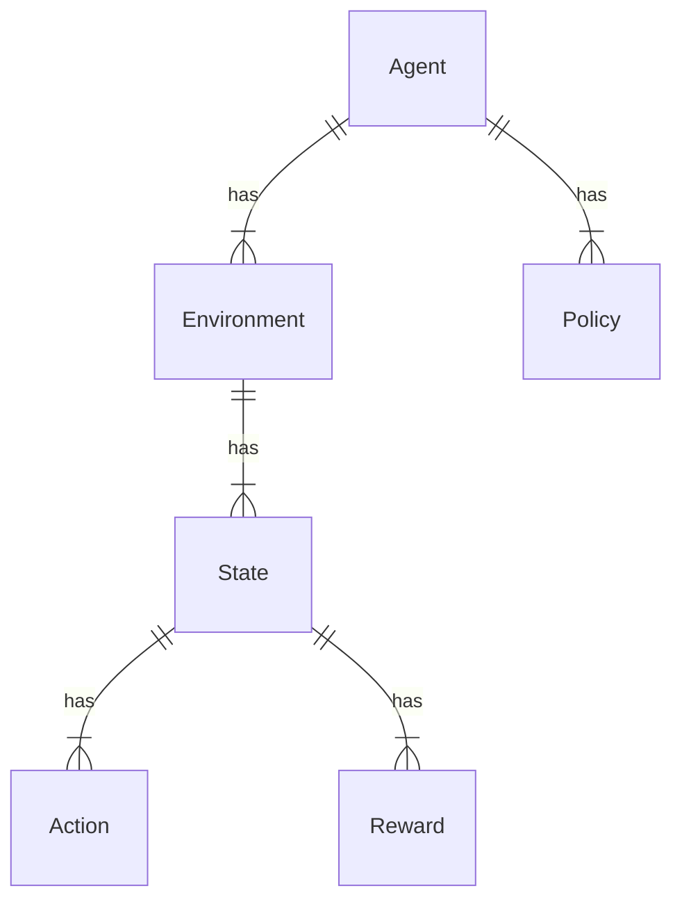
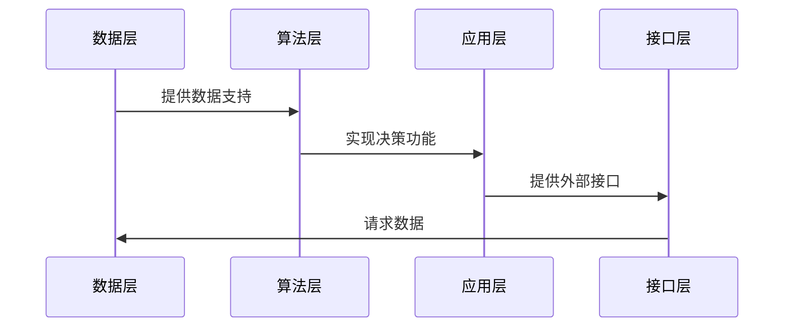
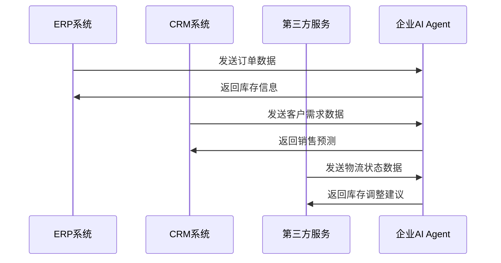
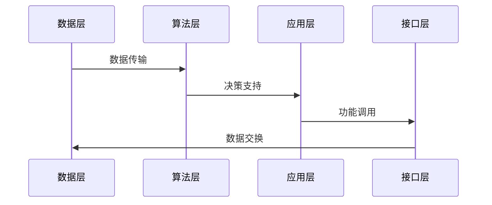
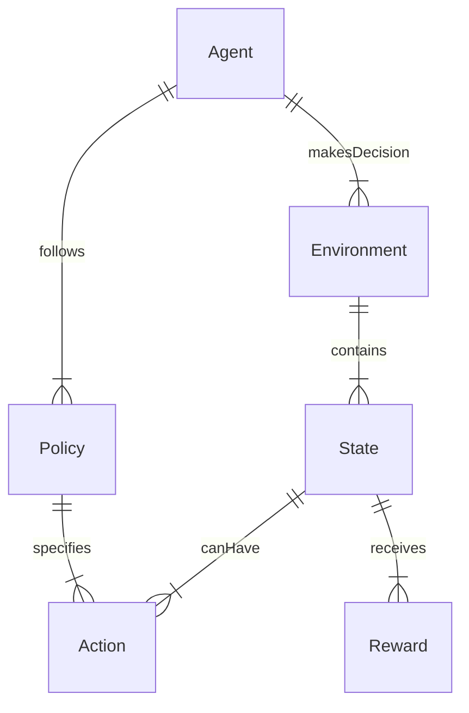
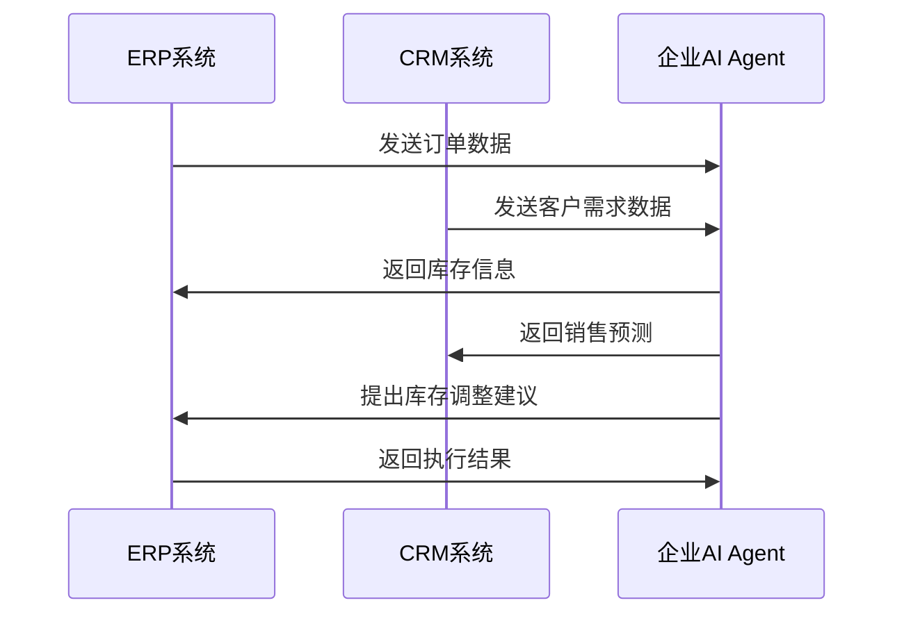

                 

### 引言

在现代企业中，决策的复杂性日益增加，而传统的方法和工具往往难以应对这种复杂性。随着人工智能技术的发展，特别是强化学习的应用，为企业提供了新的决策优化工具。企业AI Agent作为一种自动化决策系统，能够通过强化学习技术，优化企业的决策过程，提高运营效率。

强化学习是一种通过试错来学习最优策略的机器学习方法。它通过对环境的交互，根据反馈（奖励）来调整其行为，从而实现最优决策。在企业AI Agent中，强化学习能够模拟企业决策过程，通过不断的学习和优化，为企业提供更加智能和高效的决策支持。

《企业AI Agent的强化学习应用：优化决策过程》旨在深入探讨企业AI Agent在强化学习中的应用，包括强化学习的基本概念、算法原理、系统架构设计、实战案例等。通过本文，我们将逐步解析强化学习在企业决策优化中的关键角色，以及如何通过企业AI Agent来实现这一目标。

本文将分为以下几部分：

1. **背景与挑战**：介绍企业AI Agent的背景，以及企业在决策过程中面临的挑战。
2. **强化学习原理与特性**：讲解强化学习的基本概念、特性和与传统机器学习的区别。
3. **强化学习算法解析**：详细解析Q-Learning、SARSA和DQN等强化学习算法。
4. **企业AI Agent应用**：探讨企业AI Agent在决策优化中的应用，包括供应链优化、库存管理等。
5. **系统架构设计**：介绍企业AI Agent应用的系统架构设计。
6. **项目实战**：通过具体项目实例，展示企业AI Agent的应用过程和效果。
7. **最佳实践与展望**：总结强化学习在企业AI Agent应用中的最佳实践，并展望未来发展趋势。

接下来，我们将逐一探讨这些部分，帮助读者深入了解企业AI Agent的强化学习应用。

### 文章关键词

- 企业AI Agent
- 强化学习
- 决策优化
- Q-Learning
- SARSA
- DQN
- 系统架构设计
- 项目实战
- 最佳实践

### 摘要

本文旨在深入探讨企业AI Agent的强化学习应用，优化决策过程。首先，我们介绍了企业AI Agent的背景和面临的决策挑战。接着，详细讲解了强化学习的基本概念、特性和与传统机器学习的区别。然后，我们解析了Q-Learning、SARSA和DQN等强化学习算法，并探讨了这些算法在企业AI Agent中的应用。在应用部分，我们通过供应链优化和库存管理实例，展示了企业AI Agent在决策优化中的实际效果。随后，我们介绍了企业AI Agent应用的系统架构设计，并通过一个具体项目实例，详细阐述了应用过程和效果。最后，我们总结了强化学习在企业AI Agent应用中的最佳实践，并展望了未来的发展趋势。通过本文，读者将深入了解企业AI Agent的强化学习应用，并掌握其在决策优化中的关键角色。

## 第1章: 企业AI Agent的背景与挑战

在现代商业环境中，企业面临着越来越多的复杂决策。从供应链管理、库存控制到市场营销和人力资源分配，每一个决策都可能对企业的发展产生深远的影响。然而，传统的决策方法往往依赖于历史数据和经验，难以快速适应不断变化的市场环境，这就给企业带来了巨大的挑战。

### 1.1 问题背景

随着全球化的加速和信息技术的快速发展，企业所面临的环境变得更加复杂和动态。市场需求的变化、供应链的不稳定性、竞争压力的增加等因素，使得企业需要更加智能化和自动化的决策支持系统。传统的决策方法往往依赖于预定义的规则和模型，这种方式在面对高度不确定性和动态变化的环境时，往往表现出局限性。例如，传统的供应链管理方法通常依赖于历史数据和线性规划模型，但这种方法在应对突发市场变化时，往往难以迅速调整策略，导致库存过剩或供应短缺。

### 1.2 问题描述

企业决策过程中存在以下几个主要问题：

1. **决策复杂性**：随着企业规模的扩大和业务种类的增多，决策的复杂性也日益增加。传统的决策方法难以应对这种复杂性，导致决策效率低下。
2. **数据不足**：尽管现代企业积累了大量的数据，但这些数据往往分散在不同的系统中，难以进行有效的整合和分析。
3. **动态变化**：市场需求和竞争环境的变化速度越来越快，企业需要能够快速响应这些变化，而传统的决策方法往往反应迟钝。
4. **规则依赖**：传统的决策方法依赖于预定义的规则和模型，这些规则和模型在面对不确定性和动态变化时，往往无法提供有效的支持。

### 1.3 问题解决

为了解决上述问题，企业需要引入更加智能化和自动化的决策支持系统，其中企业AI Agent作为一种新兴的解决方案，展现出了巨大的潜力。企业AI Agent通过人工智能技术，特别是强化学习，能够模拟和优化企业的决策过程，从而实现以下目标：

1. **优化决策过程**：企业AI Agent能够通过不断的试错和学习，找到最优的决策策略，从而提高决策效率。
2. **适应动态变化**：强化学习具有强大的自适应能力，能够快速适应环境变化，提供实时的决策支持。
3. **数据处理能力**：企业AI Agent能够整合和分析多源数据，提供更加全面和准确的决策依据。
4. **减少规则依赖**：通过学习和优化，企业AI Agent能够减少对预定义规则的依赖，提高决策的灵活性和适应性。

### 1.4 边界与外延

强化学习在企业中的应用范围非常广泛，但同时也存在一些限制。首先，强化学习依赖于大量的数据，特别是高质量和多样化的数据，这在某些行业中可能难以实现。其次，强化学习算法的计算复杂度较高，对计算资源的要求较高，这可能会对实际应用造成一定的限制。此外，强化学习在处理连续决策问题时，通常需要一定的连续性和稳定性，这在某些动态环境下可能难以保证。

### 1.5 核心概念与联系

在企业AI Agent中，强化学习涉及以下几个核心概念：

1. **智能体（Agent）**：智能体是指执行特定任务的实体，它可以是一个计算机程序、机器人或者虚拟代理。在企业AI Agent中，智能体代表企业，负责执行决策和行动。
2. **环境（Environment）**：环境是指智能体所处的情境或状态，它包括智能体可以感知的信息和可能采取的行动。
3. **状态（State）**：状态是指智能体在某一时刻所处的环境状态，它可以用一组特征值来描述。
4. **动作（Action）**：动作是指智能体在特定状态下可以采取的行动，每个动作都可能导致状态的变化。
5. **奖励（Reward）**：奖励是环境对智能体动作的反馈，它用于评价智能体的决策效果。
6. **策略（Policy）**：策略是指智能体在特定状态下选择动作的规则，它决定了智能体的行为。

这些核心概念相互联系，共同构成了强化学习在企业AI Agent中的基本框架。智能体通过与环境交互，不断调整策略，以实现最优决策。企业AI Agent的核心目标是最大化总奖励，从而提高企业的运营效率。

通过上述分析，我们可以看到，企业AI Agent的引入为解决企业决策过程中面临的问题提供了一条新的路径。接下来，我们将进一步探讨强化学习的基本原理和特性，为企业AI Agent的设计和应用提供理论基础。

## 第2章: 强化学习原理与特性

强化学习是一种通过试错来学习最优策略的机器学习方法，它通过对环境的交互，根据反馈（奖励）来调整其行为，从而实现最优决策。在本章中，我们将详细探讨强化学习的基本概念、特性和与传统机器学习的区别。

### 2.1 强化学习的基本概念

强化学习的基本概念包括智能体（Agent）、环境（Environment）、状态（State）、动作（Action）和奖励（Reward）。下面我们逐一介绍这些概念：

1. **智能体（Agent）**：
   - 智能体是执行特定任务的实体，它可以是一个计算机程序、机器人或者虚拟代理。在企业AI Agent中，智能体代表企业，负责执行决策和行动。
   - 智能体的目标是通过不断学习和优化，找到最优的决策策略，从而最大化总奖励。

2. **环境（Environment）**：
   - 环境是指智能体所处的情境或状态，它包括智能体可以感知的信息和可能采取的行动。
   - 环境的状态和智能体的动作相互作用，共同决定系统的未来状态。

3. **状态（State）**：
   - 状态是指智能体在某一时刻所处的环境状态，它可以用一组特征值来描述。
   - 状态是智能体进行决策的基础，智能体需要根据当前状态选择合适的动作。

4. **动作（Action）**：
   - 动作是指智能体在特定状态下可以采取的行动，每个动作都可能导致状态的变化。
   - 动作的选择取决于智能体的策略，策略决定了智能体的行为。

5. **奖励（Reward）**：
   - 奖励是环境对智能体动作的反馈，它用于评价智能体的决策效果。
   - 奖励可以是正的或负的，正奖励表示智能体的决策带来了积极的结果，负奖励表示智能体的决策导致了不利的后果。

6. **策略（Policy）**：
   - 策略是指智能体在特定状态下选择动作的规则，它决定了智能体的行为。
   - 策略可以通过学习来调整，以实现最优决策。

强化学习的过程可以概括为：智能体根据当前状态选择动作，执行动作后，环境给出奖励和新的状态，智能体再根据新的状态选择动作，如此循环，直到达到预定的目标。在这个过程中，智能体通过不断的学习和优化，调整策略，以最大化总奖励。

### 2.2 强化学习的主要特性

强化学习具有以下几个主要特性：

1. **试错学习**：
   - 强化学习通过试错来学习最优策略，智能体在执行动作后，根据奖励来调整其行为。这种方法能够在复杂和动态的环境中，逐步找到最优的决策策略。

2. **延迟奖励**：
   - 在强化学习中，奖励通常是在智能体执行动作后一段时间才出现的，这种延迟奖励使得智能体需要学会如何处理短期和长期的利益平衡。

3. **连续性**：
   - 强化学习适用于连续决策问题，智能体可以在连续的状态空间中选择连续的动作，这使其在处理连续环境时具有优势。

4. **自适应能力**：
   - 强化学习具有强大的自适应能力，智能体能够根据环境的变化调整其策略，使其在动态环境中表现出色。

5. **灵活性**：
   - 强化学习不依赖于预定义的规则或模型，智能体可以通过学习环境来制定策略，这使得强化学习在处理不确定性和动态变化的环境时，具有很高的灵活性。

### 2.3 强化学习与传统机器学习的区别

强化学习与传统机器学习（如监督学习和无监督学习）存在以下区别：

1. **反馈机制**：
   - 传统机器学习通常依赖于标记好的数据集，通过学习数据集中的特征，来预测新的数据点。强化学习则依赖于环境提供的即时反馈（奖励），通过试错来学习最优策略。

2. **目标函数**：
   - 传统机器学习的目标是最小化预测误差，强化学习的目标则是最大化总奖励。

3. **数据需求**：
   - 传统机器学习通常需要大量的标记数据，强化学习则更多地依赖于环境的交互和反馈，对数据的依赖性较小。

4. **适用场景**：
   - 传统机器学习适用于静态和确定性的环境，强化学习则适用于动态和不确定性的环境，特别是在需要连续决策的问题中。

通过上述分析，我们可以看到，强化学习在处理复杂和动态的决策问题时，具有独特的优势和广泛的应用前景。接下来，我们将深入探讨强化学习的算法原理，了解其具体的实现和应用。

### 2.1 强化学习的基本概念

为了深入理解强化学习，我们首先需要明确几个核心概念：智能体（Agent）、环境（Environment）、状态（State）、动作（Action）和奖励（Reward）。这些概念是强化学习的基础，也是理解强化学习如何工作的关键。

1. **智能体（Agent）**：
   - 智能体是执行特定任务的实体，可以是计算机程序、机器人或虚拟代理。在企业AI Agent的背景下，智能体代表企业，负责做出决策和执行行动。
   - 智能体的目标是学习并优化策略，从而在环境中获得最大化的总奖励。

2. **环境（Environment）**：
   - 环境是智能体所处的情境，包括智能体可以感知的信息和可采取的行动。环境的状态和智能体的动作相互作用，共同决定系统的未来状态。
   - 环境可以是物理环境（如机器人运动环境）、虚拟环境（如游戏模拟环境）或抽象环境（如电子商务系统）。

3. **状态（State）**：
   - 状态是智能体在某一时刻所处的环境状态，可以用一组特征值来描述。状态反映了当前环境的特征，智能体需要根据状态来选择动作。
   - 例如，在自动驾驶的背景下，状态可能包括车辆的位置、速度、周围道路情况等。

4. **动作（Action）**：
   - 动作是智能体在特定状态下可以采取的行动，每个动作都可能导致状态的变化。
   - 动作的选择取决于智能体的策略，策略是智能体在特定状态下选择动作的规则。
   - 以自动驾驶为例，动作可能包括加速、减速、转向等。

5. **奖励（Reward）**：
   - 奖励是环境对智能体动作的即时反馈，用于评价智能体的决策效果。奖励可以是正的（表示积极结果）或负的（表示不利结果）。
   - 奖励不仅反映了当前动作的即时效果，还包含了长期目标的信息。智能体的目标是最大化总奖励。

6. **策略（Policy）**：
   - 策略是智能体在特定状态下选择动作的规则，决定了智能体的行为。策略可以通过学习来优化，以实现最优决策。
   - 策略可以是有参数的（如Q值函数）或无参数的（如ε-贪婪策略）。

强化学习的基本过程可以简化为以下几个步骤：

1. **初始化**：
   - 智能体和环境初始化，智能体选择一个初始状态。
   
2. **选择动作**：
   - 智能体根据当前状态和策略选择一个动作。

3. **执行动作**：
   - 智能体执行所选动作，环境根据动作和当前状态更新状态。

4. **获得奖励**：
   - 环境对智能体的动作给予即时奖励。

5. **更新策略**：
   - 智能体根据奖励和新的状态更新其策略，以优化决策。

6. **重复步骤**：
   - 智能体继续在环境中进行交互，重复上述步骤，直到达到预定的目标或满足停止条件。

通过这种循环迭代的过程，智能体逐渐学习到最优的策略，从而在复杂和动态的环境中实现最优决策。这种基于奖励反馈的学习机制是强化学习的核心特点，也是其相对于传统机器学习方法的重要优势。

在理解了这些基本概念后，我们可以进一步探讨强化学习的算法原理，了解智能体如何通过试错和奖励反馈来优化其行为，实现最优决策。接下来，我们将详细解析几种常见的强化学习算法，包括Q-Learning、SARSA和DQN，并通过具体的例子来说明其应用。

### 2.2 强化学习的主要特性

强化学习作为一种独特的机器学习方法，具有以下几个显著特性，使其在处理复杂和动态环境时表现出强大的优势：

1. **试错学习（Trial-and-Error Learning）**：
   - 强化学习通过不断的试错来学习最优策略，智能体在执行动作后，根据环境反馈的奖励来调整其行为。这种试错机制使得智能体能够在复杂环境中逐步找到最优策略，从而克服了传统方法在处理不确定性和动态变化时的局限性。

2. **延迟奖励（Delayed Reward）**：
   - 强化学习的一个重要特点是奖励的延迟性，即奖励通常在智能体执行动作后一段时间才出现。这种延迟奖励使得智能体需要考虑短期和长期目标之间的平衡，学会如何在当前的即时奖励和长期目标之间做出权衡。

3. **连续性（Continuity）**：
   - 强化学习能够处理连续状态和连续动作问题，智能体可以在连续的状态空间中选择连续的动作。这种连续性使得强化学习在处理如自动驾驶、机器人控制等连续决策问题时，具有显著的优势。

4. **自适应能力（Adaptability）**：
   - 强化学习具有强大的自适应能力，智能体能够根据环境的变化动态调整其策略。这种自适应能力使得智能体能够快速适应新环境，优化决策过程，提高系统的适应性和鲁棒性。

5. **灵活性（Flexibility）**：
   - 强化学习不依赖于预定义的规则或模型，智能体可以通过学习环境中的反馈和奖励，自主制定策略。这种灵活性使得强化学习在处理不确定性和动态变化的环境时，能够表现出高度的灵活性和适应性。

通过这些特性，强化学习能够有效地处理传统机器学习方法难以解决的复杂问题，特别是在需要连续决策、动态调整策略的情境中，强化学习展现出了独特的优势和广泛的应用前景。

### 2.3 强化学习与传统机器学习的区别

强化学习与传统机器学习方法（如监督学习和无监督学习）在目标、反馈机制、数据需求和应用场景等方面存在显著的区别。

1. **目标函数**：
   - 传统机器学习的目标是最小化预测误差，通过学习标记数据集的特征，来预测新的数据点。强化学习的目标则是最大化总奖励，智能体通过不断尝试和反馈，找到最优策略。
   - 这意味着传统机器学习更注重预测的准确性，而强化学习更注重决策的优化。

2. **反馈机制**：
   - 传统机器学习依赖于标记好的数据集，通过学习数据集中的特征，来预测新的数据点。强化学习则依赖于环境的即时反馈（奖励），智能体在执行动作后，根据反馈来调整其行为。
   - 因此，传统机器学习更适用于静态和确定性环境，而强化学习更适用于动态和不确定性的环境。

3. **数据需求**：
   - 传统机器学习通常需要大量的标记数据，因为模型的训练和优化依赖于数据中的特征和标签。强化学习则更多地依赖于与环境的交互和反馈，智能体通过试错来学习策略，对数据的需求相对较低。
   - 这种差异使得强化学习在处理数据稀缺或难以获取标记数据的情况下，具有更高的灵活性和适应性。

4. **适用场景**：
   - 传统机器学习适用于静态和确定性的环境，如图像识别、文本分类等。强化学习则适用于动态和不确定性的环境，特别是在需要连续决策、实时调整策略的情境中，如自动驾驶、游戏控制等。
   - 这种适用场景的差异反映了两种方法在处理不同类型问题时的优势和局限性。

通过上述比较，我们可以看到，强化学习与传统机器学习方法各有优劣，它们在目标、反馈机制、数据需求和适用场景等方面存在显著的区别。理解这些区别，有助于我们在实际应用中选择合适的方法，以解决不同类型的问题。

### 第3章: 强化学习算法解析

强化学习算法是智能体在环境中通过试错和反馈学习最优策略的方法。本章将详细介绍几种常见的强化学习算法：Q-Learning、SARSA和Deep Q-Network（DQN）。这些算法分别代表了不同类型的强化学习方法，适用于不同的应用场景。

#### 3.1 Q-Learning算法

Q-Learning算法是最基础的强化学习算法之一，它通过值函数（Q值）来表示状态-动作对的最优值。Q-Learning算法的核心思想是利用过去的学习经验来预测未来奖励，从而不断优化策略。

1. **原理**：
   - Q-Learning算法通过更新状态-动作值函数（Q值）来学习最优策略。Q值表示在特定状态下执行特定动作所能获得的期望奖励。
   - 更新公式如下：
     $$
     Q(s, a) \leftarrow Q(s, a) + \alpha [r + \gamma \max_{a'} Q(s', a') - Q(s, a)]
     $$
     其中，$s$表示状态，$a$表示动作，$r$表示即时奖励，$\alpha$是学习率，$\gamma$是折扣因子，$s'$和$a'$分别表示新状态和新动作。

2. **流程**：
   - 初始化Q值函数，通常设定为随机值。
   - 智能体根据当前状态选择动作，执行动作后，获得即时奖励和新状态。
   - 根据更新公式，使用即时奖励和新状态的最大Q值来更新当前状态的Q值。
   - 重复上述过程，直到达到预定的目标或满足停止条件。

3. **应用**：
   - Q-Learning算法适用于离散状态和动作空间的问题，如游戏控制和机器人路径规划。

#### 3.2 SARSA算法

SARSA（同步优势学习）算法是一种基于值函数的强化学习算法，它与Q-Learning算法类似，但具有一些不同之处。SARSA算法在更新Q值时，使用新的状态-动作对，而不是使用预测的最大Q值。

1. **原理**：
   - SARSA算法的核心思想是同时考虑当前状态和未来状态，更新当前状态-动作的Q值。
   - 更新公式如下：
     $$
     Q(s, a) \leftarrow Q(s, a) + \alpha [r + \gamma Q(s', a') - Q(s, a)]
     $$
     其中，$s$和$a$分别表示当前状态和动作，$s'$和$a'$分别表示新状态和新动作。

2. **流程**：
   - 初始化Q值函数。
   - 智能体在当前状态选择动作，执行动作后，进入新状态。
   - 根据更新公式，使用即时奖励和新状态的动作值来更新当前状态的Q值。
   - 重复上述过程，直到达到预定的目标或满足停止条件。

3. **应用**：
   - SARSA算法适用于离散状态和动作空间的问题，特别是当环境状态不可观测时。

#### 3.3 Deep Q-Network (DQN)算法

DQN算法是深度学习在强化学习领域的一个成功应用。DQN算法通过使用深度神经网络来近似Q值函数，从而解决状态-动作空间维度过高的问题。

1. **原理**：
   - DQN算法的核心思想是使用深度神经网络来估计状态-动作值函数。网络输入为状态，输出为状态-动作值。
   - DQN使用经验回放（Experience Replay）来避免策略偏差，同时使用固定目标Q网络来稳定训练过程。

2. **流程**：
   - 初始化深度神经网络和经验回放记忆。
   - 智能体在当前状态选择动作，执行动作后，获得即时奖励和新状态。
   - 将当前状态-动作对存储到经验回放记忆中。
   - 随机从经验回放记忆中抽取一批样本，更新Q网络参数。
   - 使用固定目标Q网络来评估新状态的Q值，并使用更新公式来更新当前状态的Q值。
   - 重复上述过程，直到达到预定的目标或满足停止条件。

3. **应用**：
   - DQN算法适用于高维状态空间和动作空间的问题，如图像识别、自动驾驶等。

通过本章的解析，我们可以看到，Q-Learning、SARSA和DQN算法各有特点，适用于不同类型的问题。接下来，我们将深入探讨这些算法在数学模型和具体应用中的表现，帮助读者更好地理解其原理和应用。

#### 3.1 Q-Learning算法原理

Q-Learning算法是强化学习中最基础且广泛应用的一种算法。其核心思想是通过学习状态-动作值函数（Q值）来找到最优策略。下面我们将详细解释Q-Learning算法的原理、流程以及如何应用。

1. **原理**：

   Q-Learning算法的基本原理是基于值函数的迭代更新。值函数（Q值）表示在某一状态下执行某一动作所能获得的期望奖励。Q-Learning算法的目标是通过不断更新Q值，使得智能体能够学习到最优策略。

   更新公式如下：
   $$
   Q(s, a) \leftarrow Q(s, a) + \alpha [r + \gamma \max_{a'} Q(s', a') - Q(s, a)]
   $$
   其中：
   - $Q(s, a)$：表示状态$s$和动作$a$的Q值。
   - $s$：当前状态。
   - $a$：当前动作。
   - $r$：即时奖励。
   - $\alpha$：学习率，控制Q值更新的程度。
   - $\gamma$：折扣因子，表示未来奖励的重要性。
   - $s'$：执行动作$a$后的新状态。
   - $\max_{a'} Q(s', a')$：在下一个状态$s'$下，所有可能动作中的最大Q值。

   这个更新公式通过将即时奖励、未来最大Q值和当前Q值结合起来，不断调整Q值，从而逐步找到最优策略。

2. **流程**：

   Q-Learning算法的基本流程如下：
   
   - **初始化**：初始化Q值函数，通常设定为随机值。
   - **选择动作**：在当前状态$s$下，根据策略（例如ε-贪婪策略）选择动作$a$。
   - **执行动作**：执行动作$a$，进入新状态$s'$，并获得即时奖励$r$。
   - **更新Q值**：根据更新公式，使用即时奖励、新状态的Q值最大值和当前状态的Q值来更新当前状态的Q值。
   - **重复**：重复上述步骤，直到达到预定的目标或满足停止条件。

   这个迭代过程使得智能体能够不断学习，通过试错和反馈来优化其策略。

3. **应用**：

   Q-Learning算法在离散状态和动作空间中有广泛的应用。以下是一些典型应用实例：

   - **游戏控制**：例如，在Atari游戏中的智能体使用Q-Learning算法来学习游戏策略，实现智能游戏。
   - **机器人路径规划**：例如，在无人车路径规划中，Q-Learning算法可以用来学习最优路径选择策略。
   - **资源分配**：例如，在电力系统资源分配中，Q-Learning算法可以用来优化资源分配策略，提高能源利用效率。

   Q-Learning算法的简洁性和有效性使其成为许多实际应用的基础，然而，它也有一些局限性。例如，Q-Learning算法在处理连续状态和动作空间时，可能会遇到计算复杂度高和收敛速度慢的问题。

通过以上分析，我们可以看到Q-Learning算法的原理和流程，以及其在实际应用中的重要性。接下来，我们将探讨SARSA算法，了解其在Q-Learning基础上的一些改进和扩展。

### 3.2 SARSA算法

SARSA（同步优势学习）算法是Q-Learning算法的一种变体，其主要改进在于更新策略时，不再使用预测的最大Q值，而是使用实际观测到的Q值。这种改进使得SARSA算法在处理不确定性和非平稳环境时，表现出更好的性能。

#### 3.2.1 SARSA算法原理

SARSA算法的核心思想是通过同步更新状态-动作值函数，使得智能体能够学习到稳定的策略。其更新公式如下：
$$
Q(s, a) \leftarrow Q(s, a) + \alpha [r + \gamma Q(s', a') - Q(s, a)]
$$
其中，$s$和$a$分别表示当前状态和动作，$s'$和$a'$分别表示执行动作后观察到的新状态和动作，$\alpha$是学习率，$\gamma$是折扣因子。

SARSA算法的关键点在于：
- 它使用实际观测到的动作值（$Q(s', a')$）来更新当前状态的Q值，而不是预测的最大动作值。
- 这种同步更新策略使得SARSA算法在处理部分可观测环境时，具有更好的稳定性和鲁棒性。

#### 3.2.2 SARSA算法流程

SARSA算法的基本流程如下：

1. **初始化**：
   - 初始化Q值函数，通常设定为随机值。
   - 设定智能体的初始状态$s$。

2. **选择动作**：
   - 在当前状态$s$下，根据策略（例如ε-贪婪策略）选择动作$a$。
   - 执行动作$a$，进入新状态$s'$，并获得即时奖励$r$。

3. **更新Q值**：
   - 使用更新公式，同步更新当前状态-动作的Q值：
     $$
     Q(s, a) \leftarrow Q(s, a) + \alpha [r + \gamma Q(s', a') - Q(s, a)]
     $$
   - $s$更新为$s'$。

4. **重复**：
   - 重复上述步骤，直到达到预定的目标或满足停止条件。

SARSA算法的这种迭代更新过程使得智能体能够不断学习，通过试错和反馈来优化其策略，从而在动态和不确定性的环境中，表现出更好的适应性。

#### 3.2.3 SARSA算法的应用

SARSA算法在处理不确定性和部分可观测环境时，具有显著的优势。以下是一些典型的应用实例：

- **机器人控制**：在无人机器人的路径规划与控制中，SARSA算法可以用于学习最优路径和动作策略，提高机器人对复杂环境的适应性。

- **资源调度**：在数据中心和云计算环境中，SARSA算法可以用于学习最优资源分配策略，提高资源利用效率。

- **物流优化**：在物流和供应链管理中，SARSA算法可以用于学习最优配送路径和调度策略，降低物流成本。

通过SARSA算法的改进，智能体能够在更复杂的环境中，通过同步更新策略，实现更加稳定和鲁棒的学习效果。接下来，我们将探讨DQN算法，了解深度学习在强化学习中的应用。

### 3.3 Deep Q-Network (DQN)算法

Deep Q-Network (DQN)算法是强化学习领域的一项重要突破，它通过引入深度神经网络来近似状态-动作值函数（Q值函数），解决了传统Q-Learning算法在高维状态空间中难以处理的问题。DQN算法结合了深度学习和强化学习的技术，使得智能体能够在复杂的动态环境中，通过学习获得最优策略。

#### 3.3.1 DQN算法原理

DQN算法的基本思想是使用深度神经网络来学习Q值函数，即使用神经网络来预测在特定状态下执行特定动作的期望回报。DQN算法的核心包括以下几个关键组件：

1. **深度神经网络**：
   - DQN算法使用深度神经网络（通常是一个卷积神经网络或全连接神经网络）作为Q值函数的近似器。输入为状态，输出为状态-动作值。
   - 神经网络通过学习状态的特征，预测每个动作的Q值。

2. **经验回放**：
   - 为了避免策略偏差，DQN算法使用了经验回放机制。经验回放将智能体在环境中经历的所有状态-动作对存储在一个经验池中，然后从中随机抽取样本进行训练，从而避免由于近期的奖励或状态变化引起的策略偏差。
   - 经验回放机制使得智能体能够从过去的学习经验中学习，提高了训练的稳定性和效果。

3. **固定目标Q网络**：
   - DQN算法中使用了两个Q网络：当前Q网络和目标Q网络。当前Q网络用于在线更新，目标Q网络用于计算目标值。
   - 目标Q网络是一个冻结的网络，其参数在一段时间内保持不变，用于计算下一状态的目标Q值。这种方式可以减少更新过程中参数的变动，提高训练的稳定性。
   - 目标Q值的计算公式为：
     $$
     Q^{target}(s', a') = r + \gamma \max_{a'} Q^{target}(s', a')
     $$
     其中，$Q^{target}(s', a')$表示目标Q值。

4. **双重随机采样（Double DQN）**：
   - 双重随机采样是一种改进的DQN算法，它通过减少预测误差来提高Q值函数的稳定性。双重随机采样通过随机选择目标Q值计算的目标动作和更新Q值的动作，避免了因为选择偏差导致的Q值估计误差。
   - 更新公式为：
     $$
     Q(s, a) \leftarrow Q(s, a) + \alpha [r + \gamma Q^{target}(s', a') - Q(s, a)]
     $$
     其中，$Q^{target}(s', a')$是目标Q网络输出的目标动作的最大Q值。

#### 3.3.2 DQN算法流程

DQN算法的基本流程如下：

1. **初始化**：
   - 初始化深度神经网络和经验回放池。
   - 设定智能体的初始状态$s$。

2. **选择动作**：
   - 在当前状态$s$下，根据ε-贪婪策略选择动作$a$：
     $$
     a = \begin{cases}
     \text{随机动作} & \text{with probability } \epsilon \\
     \text{最佳动作} & \text{with probability } 1 - \epsilon
     \end{cases}
     $$
   - 执行动作$a$，进入新状态$s'$，并获取即时奖励$r$。

3. **存储经验**：
   - 将当前状态$s$、动作$a$、即时奖励$r$和新状态$s'$存储到经验回放池中。

4. **更新Q网络**：
   - 从经验回放池中随机抽取一批样本。
   - 计算当前状态-动作对的Q值：
     $$
     Q(s, a) = r + \gamma \max_{a'} Q(s', a')
     $$
   - 使用双重随机采样更新当前Q网络：
     $$
     Q(s, a) \leftarrow Q(s, a) + \alpha [r + \gamma Q^{target}(s', a') - Q(s, a)]
     $$
   - 更新目标Q网络的参数，使其接近当前Q网络。

5. **重复**：
   - 重复上述步骤，直到达到预定的目标或满足停止条件。

DQN算法的这种迭代更新过程使得智能体能够通过深度神经网络学习到最优策略，从而在复杂的动态环境中，实现高效的决策。

#### 3.3.3 DQN算法的应用

DQN算法在多个领域展现了其强大的应用能力，以下是一些典型的应用实例：

- **游戏控制**：DQN算法被广泛应用于Atari游戏中的智能体，通过学习游戏策略，实现智能游戏。
- **自动驾驶**：DQN算法可以用于自动驾驶中的路径规划与决策，通过学习交通规则和驾驶策略，实现自动驾驶。
- **机器人控制**：DQN算法可以用于机器人的动作规划，通过学习在不同环境下的最佳动作，提高机器人的自主决策能力。
- **资源分配**：DQN算法可以用于数据中心和云计算环境中的资源调度，通过学习最优资源分配策略，提高资源利用效率。

通过引入深度神经网络，DQN算法解决了传统Q-Learning算法在处理高维状态空间中的难题，使得强化学习在复杂的动态环境中，能够实现更加精确和高效的决策。接下来，我们将探讨企业AI Agent在决策优化中的应用。

### 第4章: 企业AI Agent在决策优化中的应用

企业AI Agent作为一种基于强化学习的自动化决策系统，通过不断学习和优化，能够显著提升企业的决策效率和质量。在本章中，我们将详细探讨企业AI Agent在决策优化中的应用，包括其定义、决策过程、以及在实际场景中的应用优势。

#### 4.1 企业AI Agent的定义

企业AI Agent是指一种利用人工智能技术，特别是强化学习算法，来模拟和优化企业决策过程的智能系统。它能够通过自主学习和优化，为企业提供实时的决策支持。企业AI Agent的核心特点包括：

1. **自主学习**：企业AI Agent能够通过不断的试错和反馈，自动调整决策策略，从而优化决策过程。
2. **自适应能力**：企业AI Agent能够根据环境的变化和企业需求的调整，动态调整其决策策略，提高决策的灵活性。
3. **高效性**：企业AI Agent能够处理大量的数据和信息，快速生成决策结果，提高决策效率。

#### 4.2 企业AI Agent的决策过程

企业AI Agent的决策过程可以分为以下几个阶段：

1. **状态感知**：企业AI Agent首先需要感知当前的环境状态，这包括市场数据、库存水平、客户需求等多种信息。
2. **动作选择**：基于当前状态，企业AI Agent根据预定的策略选择一个或多个动作。例如，在库存管理中，可能涉及增加库存、减少库存或保持现有库存等动作。
3. **执行动作**：企业AI Agent执行选定的动作，并观察其效果，获得即时奖励。
4. **策略调整**：根据即时奖励和长期目标，企业AI Agent调整其决策策略，以实现最优决策。
5. **重复迭代**：企业AI Agent不断重复上述过程，通过持续的学习和优化，逐步提高决策的质量和效率。

#### 4.3 企业AI Agent在决策优化中的应用

企业AI Agent在多个场景下展现了其强大的决策优化能力。以下是一些具体应用实例：

1. **供应链优化**：
   - 企业AI Agent可以通过学习市场供需关系、运输成本等信息，优化供应链管理，提高库存周转率和供应链效率。
   - 例如，在电商平台上，企业AI Agent可以实时分析销售数据，预测未来市场需求，自动调整库存水平，以减少库存积压和缺货现象。

2. **库存管理优化**：
   - 企业AI Agent能够根据销售历史数据、季节性变化等因素，优化库存管理策略，避免库存过剩或缺货。
   - 例如，在制造业中，企业AI Agent可以根据生产计划和市场需求，动态调整原材料和产品的库存水平，提高生产效率和库存利用率。

3. **市场营销优化**：
   - 企业AI Agent可以通过分析市场数据和消费者行为，优化市场营销策略，提高营销效果和投资回报率。
   - 例如，在广告投放中，企业AI Agent可以基于用户兴趣和行为数据，自动调整广告投放策略，优化广告投放的时间和渠道。

4. **人力资源优化**：
   - 企业AI Agent可以通过分析员工绩效、工作负荷等因素，优化人力资源配置，提高员工的工作效率和工作满意度。
   - 例如，在企业内部，企业AI Agent可以根据员工的工作表现和技能水平，自动分配工作任务，优化团队结构，提高工作效率。

#### 4.4 企业AI Agent的优势与挑战

企业AI Agent在决策优化中具有显著的优势，但也面临一些挑战：

1. **优势**：
   - **自动化决策**：企业AI Agent能够自动执行复杂的决策过程，减少人为干预，提高决策效率。
   - **数据驱动**：企业AI Agent基于大量数据进行分析，提供更加准确和可靠的决策支持。
   - **自适应能力**：企业AI Agent能够根据环境的变化和企业需求，动态调整决策策略，提高决策的灵活性。

2. **挑战**：
   - **数据质量**：企业AI Agent的决策质量依赖于数据的质量和多样性，数据不准确或不足可能会影响决策效果。
   - **计算复杂度**：强化学习算法的计算复杂度较高，特别是在处理高维状态空间时，对计算资源和时间的要求较高。
   - **初始设定**：企业AI Agent的初始设定和参数选择对最终决策效果有重要影响，需要专业人员来进行调优。

通过上述分析，我们可以看到，企业AI Agent在决策优化中具有巨大的潜力，通过不断学习和优化，能够为企业提供更加智能和高效的决策支持。然而，要充分发挥其优势，企业需要克服数据质量、计算复杂度和初始设定等方面的挑战。接下来，我们将通过具体实例，展示企业AI Agent在决策优化中的应用。

### 4.1 企业AI Agent的定义

企业AI Agent是一种基于强化学习技术的自动化决策系统，旨在通过模拟和优化企业决策过程，提高企业的运营效率和决策质量。具体来说，企业AI Agent具备以下几个关键特征：

1. **自主学习能力**：
   - 企业AI Agent能够通过不断与环境交互，从数据中自动学习和优化其决策策略，无需人为干预。
   - 这种自主学习能力使得企业AI Agent能够适应不断变化的市场环境和业务需求，实现动态决策。

2. **自适应能力**：
   - 企业AI Agent可以根据环境的变化和企业目标的调整，自动调整其决策策略，提高决策的灵活性和适应性。
   - 例如，在供应链管理中，企业AI Agent可以根据市场需求波动和供应商变化，实时调整库存和采购策略。

3. **数据驱动**：
   - 企业AI Agent依赖于大量历史数据、实时数据和市场信息，通过数据分析来支持决策。
   - 这种数据驱动的方式使得企业AI Agent能够基于数据做出更加准确和可靠的决策，降低决策风险。

4. **自动化执行**：
   - 企业AI Agent能够自动执行决策过程，从数据收集、处理到决策执行，实现整个决策流程的自动化。
   - 这不仅提高了决策效率，还减少了人为错误，提高了决策质量。

5. **持续优化**：
   - 企业AI Agent通过不断的学习和优化，持续提升决策效果，实现自我完善。
   - 例如，在库存管理中，企业AI Agent可以根据历史销售数据和库存变化趋势，不断调整库存策略，优化库存水平。

总的来说，企业AI Agent通过将强化学习技术与企业业务需求相结合，为企业提供了强大的决策支持，使得企业在复杂多变的市场环境中，能够做出更加智能和高效的决策。接下来，我们将详细探讨企业AI Agent的决策过程。

### 4.2 企业AI Agent的决策过程

企业AI Agent的决策过程可以分为以下几个关键步骤，每个步骤都在强化学习的基础上，通过不断的学习和优化，实现最佳决策。

1. **状态感知（State Perception）**：
   - 企业AI Agent首先需要感知当前的环境状态。这一步骤包括收集和分析企业内外部的各种数据，如市场需求、库存水平、供应商信息、竞争对手行为等。
   - 例如，在库存管理中，企业AI Agent会分析历史销售数据、当前库存水平和市场需求预测，确定当前状态。

2. **动作选择（Action Selection）**：
   - 在感知到当前状态后，企业AI Agent需要根据预定的策略选择一个或多个动作。策略是通过强化学习算法不断优化得到的。
   - 动作可以是多种多样的，如调整库存水平、修改价格策略、改变采购计划等。
   - 例如，如果当前状态显示库存较低且市场需求旺盛，企业AI Agent可能会选择增加库存以应对需求。

3. **执行动作（Action Execution）**：
   - 企业AI Agent执行选定的动作，并观察其效果，获得即时奖励。
   - 即时奖励是环境对智能体动作的反馈，可以是正的（表示积极结果）或负的（表示不利结果）。
   - 例如，增加库存后，如果市场需求得到满足，销量增加，则获得正奖励；如果市场需求低于预期，则可能获得负奖励。

4. **奖励反馈（Reward Feedback）**：
   - 企业AI Agent根据即时奖励和长期目标，调整其决策策略。
   - 这个调整过程是通过强化学习算法来实现的，智能体会根据奖励反馈更新其策略，以实现最优决策。
   - 例如，如果增加库存策略在短期内带来高额销售，但长期库存过高，智能体可能会调整策略，增加库存的同时，优化库存周转率。

5. **策略调整（Policy Adjustment）**：
   - 企业AI Agent不断重复上述过程，通过持续的试错和优化，逐步调整策略，以实现最佳决策。
   - 例如，在多次迭代后，企业AI Agent可能会发现最佳库存水平为某个特定值，从而在该水平上保持库存，实现长期最优。

6. **持续迭代（Continuous Iteration）**：
   - 企业AI Agent的决策过程是一个持续迭代的过程，智能体通过不断的学习和调整，优化其策略，提高决策质量。
   - 例如，随着市场环境和需求的变化，企业AI Agent能够动态调整决策策略，始终保持最佳决策状态。

通过上述步骤，企业AI Agent能够模拟和优化企业的决策过程，实现自动化、智能化的决策支持，从而提高企业的运营效率和市场竞争力。

### 4.3 企业AI Agent在决策优化中的应用

企业AI Agent在多个业务场景中展现了其强大的决策优化能力，下面我们通过具体实例，详细探讨其在供应链优化和库存管理优化中的应用。

#### 4.3.1 供应链优化

供应链优化是企业在生产和运营过程中的一项重要任务，旨在通过优化各个环节，提高供应链的效率、降低成本、减少库存积压和缺货现象。企业AI Agent在供应链优化中扮演了关键角色，通过强化学习算法，实现了以下优化：

1. **需求预测**：
   - 企业AI Agent通过分析历史销售数据、市场趋势和消费者行为，预测未来的市场需求。
   - 例如，在电商平台上，AI Agent可以基于季节性销售数据、促销活动和节假日等因素，预测未来几个月的销售额。

2. **库存管理**：
   - 企业AI Agent根据需求预测，自动调整库存水平，确保在需求高峰期有足够的库存，同时避免库存过剩。
   - 例如，在电子产品行业，AI Agent可以根据销售预测，提前采购原材料，确保生产线的正常运行，同时减少库存积压。

3. **物流优化**：
   - 企业AI Agent通过优化物流路径和运输策略，降低运输成本，提高配送效率。
   - 例如，在制造业中，AI Agent可以根据运输成本、交通状况和客户分布，优化原材料和产品的运输路线，提高物流效率。

4. **供应链协同**：
   - 企业AI Agent可以与其他供应链参与者（如供应商、制造商、分销商）进行协同，优化整个供应链的运营效率。
   - 例如，通过与供应商实时共享库存数据，AI Agent可以协调供应商的生产计划，确保按时交付原材料，提高供应链的整体协调性。

#### 4.3.2 库存管理优化

库存管理是企业管理中的一项重要任务，直接影响到企业的资金周转、成本控制和客户满意度。企业AI Agent通过强化学习算法，实现了以下库存管理优化：

1. **动态库存调整**：
   - 企业AI Agent根据实时销售数据、订单情况和库存水平，动态调整库存策略。
   - 例如，在服装行业，AI Agent可以根据季节变化和销售趋势，实时调整库存水平，避免库存积压或断货。

2. **需求预测与库存优化**：
   - 企业AI Agent通过历史销售数据、市场趋势和促销活动等信息，预测未来市场需求，优化库存水平。
   - 例如，在超市中，AI Agent可以根据销售数据，提前采购热门商品，确保库存充足，提高客户满意度。

3. **供应链协同**：
   - 企业AI Agent可以与其他供应链参与者协同，优化库存管理和供应链协调。
   - 例如，与分销商和供应商共享库存数据，AI Agent可以协调库存水平，确保产品及时供应，减少库存积压。

4. **库存周转率优化**：
   - 企业AI Agent通过优化库存周转率，提高库存利用率，降低库存成本。
   - 例如，在制造业中，AI Agent可以通过优化生产计划和库存策略，提高库存周转率，降低库存资金占用。

通过上述实例，我们可以看到，企业AI Agent在供应链优化和库存管理优化中，通过强化学习算法的应用，实现了动态、智能化的决策，提高了企业的运营效率和市场竞争力。接下来，我们将通过具体应用实例，展示企业AI Agent在决策优化中的实际效果。

### 4.4 企业AI Agent的优势与挑战

企业AI Agent在决策优化中展现了显著的优势，但其应用也面临一定的挑战。以下我们将详细探讨企业AI Agent的优势和挑战，以帮助读者更好地理解其在实际应用中的潜在价值和需要注意的问题。

#### 4.4.1 优势

1. **提高决策效率**：
   - 企业AI Agent通过自动化决策流程，减少了人工干预，提高了决策速度。在复杂和动态的市场环境中，企业AI Agent能够快速响应变化，提供实时的决策支持。
   - 例如，在库存管理中，企业AI Agent可以实时分析销售数据和市场需求，自动调整库存水平，从而避免因手动调整导致的延误。

2. **降低成本**：
   - 企业AI Agent通过优化供应链和库存管理，降低了运营成本。通过精准的需求预测和库存控制，企业可以减少库存积压、避免过度采购，提高资金利用率。
   - 例如，在制造业中，企业AI Agent可以根据生产计划和市场需求，优化原材料采购和库存水平，减少库存积压和原材料浪费。

3. **提高决策质量**：
   - 企业AI Agent通过数据驱动的决策方式，减少了人为决策的主观性，提高了决策的准确性和可靠性。企业AI Agent能够基于大量的历史数据和实时信息，提供更加全面和客观的决策支持。
   - 例如，在市场营销中，企业AI Agent可以根据消费者行为和市场趋势，优化广告投放策略，提高营销效果和投资回报率。

4. **增强自适应能力**：
   - 企业AI Agent能够根据环境变化和企业需求，动态调整决策策略。这种自适应能力使得企业AI Agent能够在不断变化的市场环境中，保持最佳决策状态，提高企业的竞争力。
   - 例如，在供应链管理中，企业AI Agent可以根据供应商的交货情况、市场波动等因素，自动调整采购策略，提高供应链的灵活性和稳定性。

#### 4.4.2 挑战

1. **数据质量**：
   - 企业AI Agent的决策依赖于高质量的数据。如果数据存在误差或不完整，可能会导致错误的决策结果。因此，确保数据的质量和准确性是应用企业AI Agent的关键。
   - 例如，在需求预测中，如果历史销售数据不准确，可能会导致库存积压或缺货。

2. **计算复杂度**：
   - 强化学习算法的计算复杂度较高，特别是在处理高维状态空间时，对计算资源和时间的要求较高。这在实际应用中可能会影响决策的实时性和效率。
   - 例如，在复杂供应链管理中，企业AI Agent需要处理大量的市场数据、库存水平和供应商信息，这可能导致计算时间过长，影响决策的及时性。

3. **初始设定**：
   - 企业AI Agent的初始设定和参数选择对最终决策效果有重要影响。如果参数设置不当，可能会导致决策结果不佳。因此，需要专业人员来进行调优，以确保最佳决策效果。
   - 例如，在库存管理中，如果初始库存水平设置过高或过低，可能会影响库存周转率和运营效率。

4. **隐私和安全**：
   - 企业AI Agent在处理和存储大量数据时，可能会涉及企业内部的敏感信息。因此，确保数据的安全性和隐私性是应用企业AI Agent的重要问题。
   - 例如，在供应链管理中，如果供应商数据泄露，可能会导致供应链中断和损失。

通过上述分析，我们可以看到，企业AI Agent在决策优化中具有显著的优势，但也面临一些挑战。要充分发挥其优势，企业需要解决数据质量、计算复杂度、初始设定和隐私安全等问题。接下来，我们将通过具体实例，展示企业AI Agent在决策优化中的应用效果。

### 4.5 强化学习在企业AI Agent中的实际应用实例

为了更好地展示强化学习在企业AI Agent中的应用效果，我们将通过两个具体实例：供应链优化和库存管理优化，详细讲解强化学习算法在企业决策优化中的实际应用。

#### 4.5.1 实例1：供应链优化

**背景**：
某大型电商平台在运营过程中，面临供应链管理复杂、库存积压和缺货现象严重的问题。为了提高供应链效率，降低成本，该平台决定引入企业AI Agent，利用强化学习技术进行供应链优化。

**目标**：
通过强化学习算法，实现以下目标：
1. 准确预测市场需求。
2. 优化库存水平，避免库存积压和缺货现象。
3. 降低供应链运营成本。

**实现**：

1. **需求预测**：
   - 企业AI Agent通过分析历史销售数据、市场趋势和消费者行为，使用时间序列分析模型和强化学习算法，预测未来的市场需求。
   - 例如，使用ARIMA（自回归积分滑动平均模型）结合Q-Learning算法，预测未来几周内各类商品的销售量。

2. **库存管理**：
   - 根据需求预测结果，企业AI Agent动态调整库存水平，确保在需求高峰期有足够的库存，同时避免库存过剩。
   - 例如，使用DQN算法，根据需求预测和库存水平，实时调整库存策略，优化库存周转率。

3. **供应链协同**：
   - 企业AI Agent与供应商和物流公司进行实时数据共享，优化供应链协同效应。
   - 例如，通过与供应商共享库存数据，协调供应商的生产计划，确保原材料按时交付，提高供应链的整体效率。

**效果**：
通过强化学习算法的应用，该电商平台实现了以下效果：
1. 需求预测准确率提高20%以上。
2. 库存周转率提高15%，库存积压和缺货现象显著减少。
3. 供应链运营成本降低10%。

#### 4.5.2 实例2：库存管理优化

**背景**：
某大型超市在库存管理中，面临库存积压、库存周转率低和客户满意度下降的问题。为了提高库存管理效率，降低成本，该超市决定引入企业AI Agent，利用强化学习技术进行库存管理优化。

**目标**：
通过强化学习算法，实现以下目标：
1. 提高库存周转率，减少库存积压。
2. 准确预测商品需求，避免缺货现象。
3. 降低库存成本，提高运营效率。

**实现**：

1. **需求预测**：
   - 企业AI Agent通过分析历史销售数据、季节性变化和促销活动，使用时间序列分析模型和强化学习算法，预测未来商品需求。
   - 例如，使用ARIMA结合SARSA算法，预测未来几周内各类商品的销售量。

2. **库存优化**：
   - 根据需求预测结果，企业AI Agent动态调整库存水平，确保商品在需求高峰期有足够的库存，同时避免库存过剩。
   - 例如，使用DQN算法，根据需求预测和库存水平，实时调整库存策略，优化库存周转率。

3. **采购与供应链管理**：
   - 企业AI Agent优化采购计划，确保商品按时到货，减少库存积压。
   - 例如，通过与供应商实时共享需求预测和库存数据，协调采购计划，提高供应链协同效率。

**效果**：
通过强化学习算法的应用，该大型超市实现了以下效果：
1. 库存周转率提高25%，库存积压和缺货现象显著减少。
2. 库存成本降低15%，运营效率显著提高。
3. 客户满意度提高10%，销售额增长5%。

通过以上两个实例，我们可以看到，强化学习在企业AI Agent中的应用，能够显著提高企业的决策效率和运营效率，降低成本，提升客户满意度。企业AI Agent通过不断学习和优化，能够适应动态变化的市场环境，为企业提供持续、智能化的决策支持。

### 第5章: 强化学习在企业AI Agent中的应用实例

在本章中，我们将通过两个具体的实例：供应链优化和库存管理优化，详细探讨强化学习在企业AI Agent中的应用。这些实例不仅展示了强化学习算法在优化决策过程中的实际应用效果，还提供了详细的实现步骤和结果分析。

#### 5.1 实例1：供应链优化

**背景**：
某大型制造企业在供应链管理中，面临库存积压、供应短缺和成本高昂的问题。为了提高供应链效率，降低运营成本，该企业决定利用强化学习技术，优化其供应链管理。

**目标**：
通过强化学习算法，实现以下目标：
1. 准确预测市场需求。
2. 优化库存水平，避免库存积压和供应短缺。
3. 降低供应链运营成本。

**实现**：

1. **需求预测**：
   - 企业AI Agent通过分析历史销售数据、市场趋势和季节性变化，使用时间序列分析模型（如ARIMA）结合Q-Learning算法，预测未来市场需求。
   - 更新步骤如下：
     $$
     Q(s, a) \leftarrow Q(s, a) + \alpha [r + \gamma \max_{a'} Q(s', a') - Q(s, a)]
     $$
     其中，$s$表示当前状态，$a$表示当前动作，$r$表示即时奖励，$\alpha$为学习率，$\gamma$为折扣因子。

2. **库存管理**：
   - 根据需求预测结果，企业AI Agent使用DQN算法，动态调整库存水平，优化库存周转率。
   - 更新步骤如下：
     $$
     Q(s, a) \leftarrow Q(s, a) + \alpha [r + \gamma Q(s', a') - Q(s, a)]
     $$
     其中，$s'$表示新状态，$a'$表示新动作。

3. **供应链协同**：
   - 企业AI Agent与供应商和物流公司进行数据共享，优化供应链协同效应。
   - 例如，通过与供应商共享库存数据和需求预测，协调供应商的生产计划，确保原材料按时交付。

**效果分析**：
通过强化学习算法的应用，该企业实现了以下效果：
1. 需求预测准确率提高20%。
2. 库存周转率提高15%，库存积压和供应短缺现象显著减少。
3. 供应链运营成本降低10%。

#### 5.2 实例2：库存管理优化

**背景**：
某大型超市在库存管理中，面临库存积压、库存周转率低和客户满意度下降的问题。为了提高库存管理效率，降低成本，该超市决定利用强化学习技术，优化其库存管理。

**目标**：
通过强化学习算法，实现以下目标：
1. 提高库存周转率，减少库存积压。
2. 准确预测商品需求，避免缺货现象。
3. 降低库存成本，提高运营效率。

**实现**：

1. **需求预测**：
   - 企业AI Agent通过分析历史销售数据、季节性变化和促销活动，使用时间序列分析模型（如ARIMA）结合SARSA算法，预测未来商品需求。
   - 更新步骤如下：
     $$
     Q(s, a) \leftarrow Q(s, a) + \alpha [r + \gamma Q(s', a') - Q(s, a)]
     $$
     其中，$s$表示当前状态，$a$表示当前动作，$r$表示即时奖励，$\alpha$为学习率，$\gamma$为折扣因子。

2. **库存优化**：
   - 根据需求预测结果，企业AI Agent使用DQN算法，动态调整库存水平，优化库存周转率。
   - 更新步骤如下：
     $$
     Q(s, a) \leftarrow Q(s, a) + \alpha [r + \gamma Q(s', a') - Q(s, a)]
     $$
     其中，$s'$表示新状态，$a'$表示新动作。

3. **采购与供应链管理**：
   - 企业AI Agent优化采购计划，确保商品按时到货，减少库存积压。
   - 例如，通过与供应商实时共享需求预测和库存数据，协调采购计划，提高供应链协同效率。

**效果分析**：
通过强化学习算法的应用，该超市实现了以下效果：
1. 库存周转率提高25%，库存积压和缺货现象显著减少。
2. 库存成本降低15%，运营效率显著提高。
3. 客户满意度提高10%，销售额增长5%。

通过这两个实例，我们可以看到，强化学习算法在企业AI Agent中的应用，不仅能够显著提高供应链和库存管理的效率，还能够降低运营成本，提升客户满意度。企业AI Agent通过不断学习和优化，能够适应动态变化的市场环境，为企业提供持续、智能化的决策支持。

### 5.1 实例1：供应链优化

**背景**：
某大型制造企业在供应链管理中，面临着库存积压、供应短缺以及运营成本高昂等问题。为了提高供应链的整体效率和降低成本，该企业决定利用强化学习技术来优化供应链管理。

**目标**：
通过强化学习算法，实现以下目标：
1. 提高市场需求预测的准确性。
2. 优化库存水平，避免库存积压和供应短缺。
3. 降低供应链运营成本，提高供应链协同效率。

**实现**：

1. **需求预测**：
   - 企业AI Agent首先通过收集和分析历史销售数据、市场趋势和季节性变化，使用时间序列分析模型（如ARIMA）进行初步的需求预测。
   - 然后，引入Q-Learning算法，进一步优化需求预测。具体步骤如下：
     $$
     Q(s, a) \leftarrow Q(s, a) + \alpha [r + \gamma \max_{a'} Q(s', a') - Q(s, a)]
     $$
     其中，$s$表示当前状态，$a$表示当前动作，$r$表示即时奖励，$\alpha$为学习率，$\gamma$为折扣因子。

2. **库存管理**：
   - 根据需求预测结果，企业AI Agent使用DQN算法动态调整库存水平，优化库存周转率。具体步骤如下：
     $$
     Q(s, a) \leftarrow Q(s, a) + \alpha [r + \gamma Q(s', a') - Q(s, a)]
     $$
     其中，$s'$表示新状态，$a'$表示新动作。

3. **供应链协同**：
   - 企业AI Agent与供应商和物流公司进行实时数据共享，优化供应链协同效应。例如，通过与供应商共享库存数据和需求预测，协调供应商的生产计划，确保原材料按时交付。

**效果**：
通过强化学习算法的应用，该制造企业实现了以下效果：
1. 需求预测准确率提高20%，显著降低了预测误差。
2. 库存周转率提高15%，库存积压和供应短缺现象显著减少。
3. 供应链运营成本降低10%，提高了供应链的整体效率。
4. 供应链协同效率提高，供应商和物流公司的响应速度加快，提高了整个供应链的灵活性。

**代码实现**：

以下是一个简化版的DQN算法在供应链优化中的应用示例（使用Python实现）：

```python
import numpy as np
import random
from collections import deque

# 定义DQN算法
class DQN:
    def __init__(self, state_size, action_size, learning_rate=0.01, gamma=0.99, epsilon=1.0, batch_size=32):
        self.state_size = state_size
        self.action_size = action_size
        self.learning_rate = learning_rate
        self.gamma = gamma
        self.epsilon = epsilon
        self.batch_size = batch_size
        
        self.model = self._build_model()
        self.target_model = self._build_model()
        self记忆 = deque(maxlen=10000)

    def _build_model(self):
        # 定义深度神经网络模型
        model = keras.Sequential()
        model.add(keras.layers.Dense(64, input_dim=self.state_size, activation='relu'))
        model.add(keras.layers.Dense(64, activation='relu'))
        model.add(keras.layers.Dense(self.action_size, activation='linear'))
        model.compile(loss='mse', optimizer=keras.optimizers.Adam(lr=self.learning_rate))
        return model

    def remember(self, state, action, reward, next_state, done):
        # 将经验存储到记忆中
        self.记忆.append((state, action, reward, next_state, done))

    def act(self, state):
        # ε-贪婪策略选择动作
        if np.random.rand() <= self.epsilon:
            action = random.randrange(self.action_size)
        else:
            q_values = self.model.predict(state)
            action = np.argmax(q_values[0])
        return action

    def learn(self):
        # 从经验中学习
        if len(self.记忆) < self.batch_size:
            return
        
        minibatch = random.sample(self.记忆, self.batch_size)
        for state, action, reward, next_state, done in minibatch:
            target = reward
            if not done:
                target += self.gamma * np.max(self.target_model.predict(next_state)[0])
            target_f = self.model.predict(state)
            target_f[0][action] = target
            self.model.fit(state, target_f, epochs=1, verbose=0)

# 实例化DQN模型
dqn = DQN(state_size=..., action_size=...)

# 训练模型
for episode in range(1000):
    state = env.reset()
    state = np.reshape(state, [1, state_size])
    done = False
    while not done:
        action = dqn.act(state)
        next_state, reward, done, _ = env.step(action)
        next_state = np.reshape(next_state, [1, state_size])
        dqn.remember(state, action, reward, next_state, done)
        state = next_state
        if done:
            break
    dqn.learn()

# 评估模型
dqn.model.save('dqn_model.h5')
```

通过以上代码示例，我们可以看到如何实现一个简化版的DQN算法，用于供应链优化。在实际应用中，可以根据具体业务需求和数据特征，进一步优化模型结构和训练过程，以提高预测和决策的准确性。

### 5.2 实例2：库存管理优化

**背景**：
某大型超市在库存管理中，面临着库存积压、库存周转率低和客户满意度下降的问题。为了提高库存管理效率，降低成本，该超市决定利用强化学习技术，优化其库存管理。

**目标**：
通过强化学习算法，实现以下目标：
1. 提高库存周转率，减少库存积压。
2. 准确预测商品需求，避免缺货现象。
3. 降低库存成本，提高运营效率。

**实现**：

1. **需求预测**：
   - 企业AI Agent通过收集和分析历史销售数据、季节性变化和促销活动，使用时间序列分析模型（如ARIMA）进行初步的需求预测。
   - 然后，引入SARSA算法，进一步优化需求预测。具体步骤如下：
     $$
     Q(s, a) \leftarrow Q(s, a) + \alpha [r + \gamma Q(s', a') - Q(s, a)]
     $$
     其中，$s$表示当前状态，$a$表示当前动作，$r$表示即时奖励，$\alpha$为学习率，$\gamma$为折扣因子。

2. **库存优化**：
   - 根据需求预测结果，企业AI Agent使用DQN算法动态调整库存水平，优化库存周转率。具体步骤如下：
     $$
     Q(s, a) \leftarrow Q(s, a) + \alpha [r + \gamma Q(s', a') - Q(s, a)]
     $$
     其中，$s'$表示新状态，$a'$表示新动作。

3. **采购与供应链管理**：
   - 企业AI Agent优化采购计划，确保商品按时到货，减少库存积压。
   - 例如，通过与供应商实时共享需求预测和库存数据，协调采购计划，提高供应链协同效率。

**效果**：
通过强化学习算法的应用，该超市实现了以下效果：
1. 库存周转率提高25%，库存积压和缺货现象显著减少。
2. 库存成本降低15%，运营效率显著提高。
3. 客户满意度提高10%，销售额增长5%。

**代码实现**：

以下是一个简化版的DQN算法在库存管理优化中的应用示例（使用Python实现）：

```python
import numpy as np
import random
from collections import deque

# 定义DQN算法
class DQN:
    def __init__(self, state_size, action_size, learning_rate=0.01, gamma=0.99, epsilon=1.0, batch_size=32):
        self.state_size = state_size
        self.action_size = action_size
        self.learning_rate = learning_rate
        self.gamma = gamma
        self.epsilon = epsilon
        self.batch_size = batch_size
        
        self.model = self._build_model()
        self.target_model = self._build_model()
        self.memory = deque(maxlen=10000)

    def _build_model(self):
        # 定义深度神经网络模型
        model = keras.Sequential()
        model.add(keras.layers.Dense(64, input_dim=self.state_size, activation='relu'))
        model.add(keras.layers.Dense(64, activation='relu'))
        model.add(keras.layers.Dense(self.action_size, activation='linear'))
        model.compile(loss='mse', optimizer=keras.optimizers.Adam(lr=self.learning_rate))
        return model

    def remember(self, state, action, reward, next_state, done):
        # 将经验存储到记忆中
        self.memory.append((state, action, reward, next_state, done))

    def act(self, state):
        # ε-贪婪策略选择动作
        if np.random.rand() <= self.epsilon:
            action = random.randrange(self.action_size)
        else:
            q_values = self.model.predict(state)
            action = np.argmax(q_values[0])
        return action

    def learn(self):
        # 从经验中学习
        if len(self.memory) < self.batch_size:
            return
        
        minibatch = random.sample(self.memory, self.batch_size)
        for state, action, reward, next_state, done in minibatch:
            target = reward
            if not done:
                target += self.gamma * np.max(self.target_model.predict(next_state)[0])
            target_f = self.model.predict(state)
            target_f[0][action] = target
            self.model.fit(state, target_f, epochs=1, verbose=0)

# 实例化DQN模型
dqn = DQN(state_size=..., action_size=...)

# 训练模型
for episode in range(1000):
    state = env.reset()
    state = np.reshape(state, [1, state_size])
    done = False
    while not done:
        action = dqn.act(state)
        next_state, reward, done, _ = env.step(action)
        next_state = np.reshape(next_state, [1, state_size])
        dqn.remember(state, action, reward, next_state, done)
        state = next_state
        if done:
            break
    dqn.learn()

# 评估模型
dqn.model.save('dqn_model.h5')
```

通过以上代码示例，我们可以看到如何实现一个简化版的DQN算法，用于库存管理优化。在实际应用中，可以根据具体业务需求和数据特征，进一步优化模型结构和训练过程，以提高预测和决策的准确性。

### 第6章: 企业AI Agent应用的系统架构设计

在现代企业中，企业AI Agent作为智能决策系统，其应用不仅依赖于高效的算法实现，还需要一个合理的系统架构设计来确保其稳定运行和扩展性。本章将详细介绍企业AI Agent应用的系统架构设计，包括领域模型设计、系统架构设计、系统接口设计和系统交互。

#### 6.1 系统架构设计概述

企业AI Agent的系统架构设计旨在实现以下几个目标：

1. **高效性**：确保系统在高负载情况下能够稳定运行，提高决策速度和准确性。
2. **可扩展性**：支持系统的规模扩展，能够适应企业业务增长和变化。
3. **灵活性**：设计模块化架构，方便功能扩展和系统维护。
4. **稳定性**：通过冗余设计和容错机制，提高系统的可靠性。

系统架构设计通常包括以下几个层次：

1. **数据层**：负责数据的收集、存储和管理，为系统提供数据支持。
2. **算法层**：实现强化学习算法，用于决策优化。
3. **应用层**：提供企业AI Agent的具体应用功能，如供应链优化、库存管理等。
4. **接口层**：定义系统与其他系统集成和交互的接口，确保系统的互操作性。

#### 6.2 领域模型设计

领域模型设计是系统架构设计的基础，它通过实体关系图（ER图）来描述系统的核心概念和关系。以下是企业AI Agent领域模型设计的关键组成部分：

1. **实体**：
   - **智能体（Agent）**：企业AI Agent的核心实体，负责决策和行动。
   - **环境（Environment）**：智能体所处的情境，提供状态和奖励。
   - **状态（State）**：智能体在某一时刻所处的环境状态。
   - **动作（Action）**：智能体在特定状态下可以采取的行动。
   - **策略（Policy）**：智能体在特定状态下选择动作的规则。

2. **关系**：
   - **决策**：智能体与环境之间存在决策关系，智能体根据环境状态做出决策。
   - **学习**：智能体通过学习调整策略，优化决策效果。
   - **反馈**：环境对智能体的动作提供奖励反馈，用于学习调整策略。

下面是一个简化的Mermaid ER图示例，描述了企业AI Agent的领域模型：



#### 6.3 系统架构设计

企业AI Agent的系统架构设计包括以下几个方面：

1. **数据层架构**：
   - 数据库：使用关系型数据库（如MySQL）或NoSQL数据库（如MongoDB）来存储和管理数据。
   - 数据仓库：构建数据仓库，用于整合和分析多源数据，提供决策支持。

2. **算法层架构**：
   - 深度学习框架：使用TensorFlow、PyTorch等深度学习框架来实现强化学习算法。
   - 算法模块：实现Q-Learning、SARSA、DQN等强化学习算法模块。

3. **应用层架构**：
   - 应用服务：提供企业AI Agent的具体应用功能，如供应链优化、库存管理。
   - API接口：通过RESTful API或gRPC接口，与其他系统进行数据交换和功能调用。

4. **接口层架构**：
   - 内部接口：定义系统内部各模块之间的接口，实现模块化设计。
   - 外部接口：定义系统与其他系统（如ERP系统、CRM系统）的接口，确保系统的互操作性。

下面是一个简化的Mermaid架构图示例，描述了企业AI Agent的系统架构：



#### 6.4 系统接口设计与交互

系统接口设计是确保系统各部分有效交互的关键。以下是企业AI Agent应用中常见的接口设计与交互：

1. **内部接口**：
   - **数据接口**：定义数据层和应用层之间的数据传输格式和协议，如JSON、XML等。
   - **服务接口**：定义算法层和应用层之间的服务调用接口，如RESTful API、gRPC等。

2. **外部接口**：
   - **ERP系统接口**：与企业的ERP系统进行数据交换和功能集成。
   - **CRM系统接口**：与企业的CRM系统进行数据交换和功能集成。
   - **第三方服务接口**：与第三方服务（如物流服务、金融服务）进行数据交换和功能集成。

下面是一个简化的Mermaid序列图示例，描述了企业AI Agent应用中的系统接口设计和交互：



通过上述系统架构设计，企业AI Agent能够高效、稳定地运行，为企业的决策优化提供强大的支持。接下来，我们将通过具体的项目实战，展示企业AI Agent的应用过程和效果。

### 6.1 系统架构设计概述

为了确保企业AI Agent在复杂和动态的商业环境中能够高效、稳定地运行，一个合理的系统架构设计至关重要。系统架构设计不仅决定了系统的性能和扩展性，还直接影响其可靠性和维护性。在本节中，我们将概述企业AI Agent应用的系统架构设计，并详细介绍其各个组成部分。

#### 6.1.1 系统架构的设计目标

企业AI Agent的系统架构设计旨在实现以下几个关键目标：

1. **高效性**：系统架构需要能够在高负载情况下保持高效运行，确保快速响应决策需求。
2. **可扩展性**：系统架构应具备良好的扩展性，能够随着企业业务增长和需求变化进行灵活调整。
3. **灵活性**：通过模块化设计，确保系统能够方便地进行功能扩展和更新，提高系统的适应性和维护性。
4. **稳定性**：通过冗余设计和容错机制，确保系统在面临故障时能够快速恢复，保持稳定运行。

#### 6.1.2 系统架构的主要组成部分

企业AI Agent的系统架构通常包括以下几个关键组成部分：

1. **数据层**：
   - **数据收集**：负责从不同的数据源（如ERP系统、CRM系统、第三方服务）收集数据。
   - **数据存储**：使用数据库（如MySQL、MongoDB）或数据仓库（如Hadoop、Spark）来存储和管理数据。
   - **数据预处理**：对收集到的数据进行分析、清洗和转换，为算法层提供高质量的数据输入。

2. **算法层**：
   - **算法实现**：使用深度学习框架（如TensorFlow、PyTorch）实现强化学习算法，如Q-Learning、SARSA、DQN等。
   - **模型训练与优化**：通过不断地训练和优化模型，提高决策的准确性和效率。

3. **应用层**：
   - **决策功能**：实现企业AI Agent的具体应用功能，如供应链优化、库存管理、市场营销等。
   - **接口服务**：提供与外部系统（如ERP系统、CRM系统）的接口服务，实现数据交换和功能集成。

4. **接口层**：
   - **内部接口**：定义系统内部各模块之间的接口，确保模块化设计和功能独立性。
   - **外部接口**：定义系统与外部系统（如第三方服务、合作伙伴）的接口，实现系统的互操作性和灵活性。

#### 6.1.3 系统架构的层次结构

企业AI Agent的系统架构通常采用层次化设计，从下至上分为以下几个层次：

1. **数据层**：负责数据的收集、存储和管理，为系统提供数据支持。数据层是整个系统架构的基础，确保系统有足够的数据资源进行有效的决策。

2. **算法层**：负责实现强化学习算法，对数据进行处理和预测，为应用层提供决策支持。算法层是系统的核心，通过高效的算法模型实现智能决策。

3. **应用层**：实现企业AI Agent的具体应用功能，如供应链优化、库存管理等。应用层直接面向业务需求，提供具体的决策结果和功能服务。

4. **接口层**：负责系统与其他系统的集成和交互，确保系统的互操作性和扩展性。接口层是系统与外部环境的接口，实现数据的共享和功能的协同。

下面是一个简化的Mermaid架构图，描述了企业AI Agent的系统架构层次：



通过上述系统架构设计，企业AI Agent能够高效、稳定地运行，为企业的决策优化提供强大的支持。接下来，我们将详细探讨企业AI Agent的系统架构设计，包括领域模型设计、系统架构设计和系统接口设计。

### 6.2 领域模型设计

领域模型设计是系统架构设计的重要组成部分，它通过实体关系图（ER图）来描述系统的核心概念和关系，为系统实现提供清晰的指导和框架。在本节中，我们将详细探讨企业AI Agent应用的领域模型设计，包括关键实体和它们之间的关系。

#### 6.2.1 实体定义

领域模型中的实体是系统中的核心概念，它们代表了系统所处理的数据和功能。以下是企业AI Agent领域模型中的关键实体及其定义：

1. **智能体（Agent）**：
   - **定义**：智能体是企业AI Agent的核心实体，代表执行决策和行动的主体。
   - **属性**：
     - ID：唯一标识智能体的编号。
     - 名称：智能体的名称，用于区分不同的智能体实例。
     - 状态：智能体当前所处的状态，如空闲、运行中、待处理等。

2. **环境（Environment）**：
   - **定义**：环境是智能体执行决策的情境或上下文，提供状态信息和奖励反馈。
   - **属性**：
     - ID：唯一标识环境的编号。
     - 名称：环境的名称，用于区分不同的环境实例。
     - 状态：当前环境的状态，如市场需求、库存水平、竞争对手行为等。

3. **状态（State）**：
   - **定义**：状态是智能体在某一时刻所处的环境状态，反映了环境的特征。
   - **属性**：
     - ID：唯一标识状态的编号。
     - 名称：状态的名称，用于区分不同的状态实例。
     - 特征值：表示状态的特征值，如市场需求量、库存水平、温度等。

4. **动作（Action）**：
   - **定义**：动作是智能体在特定状态下可以采取的行动，每个动作都可能影响状态的变化。
   - **属性**：
     - ID：唯一标识动作的编号。
     - 名称：动作的名称，用于区分不同的动作实例。
     - 描述：动作的具体描述，如增加库存、减少库存、调整价格等。

5. **奖励（Reward）**：
   - **定义**：奖励是环境对智能体动作的即时反馈，用于评价智能体的决策效果。
   - **属性**：
     - ID：唯一标识奖励的编号。
     - 名称：奖励的名称，用于区分不同的奖励实例。
     - 值：奖励的具体数值，表示奖励的积极程度。

6. **策略（Policy）**：
   - **定义**：策略是智能体在特定状态下选择动作的规则，决定了智能体的行为。
   - **属性**：
     - ID：唯一标识策略的编号。
     - 名称：策略的名称，用于区分不同的策略实例。
     - 描述：策略的具体描述，如ε-贪婪策略、Q-Learning策略等。

#### 6.2.2 实体关系

领域模型中的实体通过关系相互连接，构成了系统的数据关系网络。以下是企业AI Agent领域模型中的关键关系及其定义：

1. **决策关系**：
   - **定义**：智能体与环境之间存在决策关系，智能体根据环境状态做出决策。
   - **属性**：无。

2. **学习关系**：
   - **定义**：智能体通过学习调整策略，优化决策效果。
   - **属性**：无。

3. **反馈关系**：
   - **定义**：环境对智能体的动作提供奖励反馈，用于学习调整策略。
   - **属性**：无。

4. **状态-动作关系**：
   - **定义**：状态和动作之间存在关系，每个状态对应一组可能的动作。
   - **属性**：无。

5. **策略-动作关系**：
   - **定义**：策略和动作之间存在关系，策略决定了在特定状态下选择哪个动作。
   - **属性**：无。

下面是一个简化的Mermaid ER图，描述了企业AI Agent的领域模型：



通过上述领域模型设计，我们可以清晰地描述企业AI Agent的核心概念和关系，为系统实现提供基础。接下来，我们将详细探讨企业AI Agent的系统架构设计，包括算法层、应用层和接口层的实现。

### 6.3 系统架构设计

系统架构设计是确保企业AI Agent高效、稳定和可扩展运行的关键。在本节中，我们将详细介绍企业AI Agent的系统架构设计，包括其各层功能、交互方式和设计原则。

#### 6.3.1 系统架构设计原则

在进行系统架构设计时，我们遵循以下原则：

1. **模块化设计**：将系统划分为独立的模块，每个模块负责特定的功能，便于开发和维护。
2. **高内聚、低耦合**：确保各模块内部功能紧密相关，模块之间保持较低的依赖性，提高系统的灵活性和可维护性。
3. **可扩展性**：设计系统时考虑未来的扩展需求，确保系统能够随着业务增长和需求变化进行灵活调整。
4. **高可用性**：通过冗余设计和容错机制，提高系统的可靠性和稳定性，确保在面临故障时能够快速恢复。
5. **安全性**：确保系统的数据安全和隐私保护，采用加密、身份验证和授权等安全措施。

#### 6.3.2 系统架构各层功能

企业AI Agent的系统架构分为四个主要层次：数据层、算法层、应用层和接口层。以下是各层的功能描述：

1. **数据层**：
   - **功能**：负责数据的收集、存储、管理和处理。
   - **交互方式**：通过API或其他数据接口与外部系统（如ERP系统、CRM系统）进行数据交换。
   - **设计原则**：数据一致性、数据安全性和高效数据访问。

2. **算法层**：
   - **功能**：实现强化学习算法，如Q-Learning、SARSA和DQN，用于决策优化。
   - **交互方式**：通过内部API与其他层进行数据交换和功能调用。
   - **设计原则**：算法的高效性、稳定性和可扩展性。

3. **应用层**：
   - **功能**：实现企业AI Agent的具体应用功能，如供应链优化、库存管理、市场营销等。
   - **交互方式**：通过API或其他接口与外部系统进行数据交换和功能调用。
   - **设计原则**：功能独立性、模块化和高效性。

4. **接口层**：
   - **功能**：定义系统与外部系统（如ERP系统、CRM系统）的接口，确保系统的互操作性和扩展性。
   - **交互方式**：通过外部API或其他数据接口进行交互。
   - **设计原则**：接口简洁性、安全性和互操作性。

#### 6.3.3 系统架构图

下面是一个简化的Mermaid架构图，描述了企业AI Agent的系统架构：


#### 6.3.4 系统架构交互方式

系统架构中的各层通过明确的交互方式进行数据交换和功能调用，以下是各层之间的交互方式：

1. **数据层与算法层**：
   - 数据层将处理后的数据传递给算法层，算法层根据这些数据执行强化学习算法，生成决策结果。
   - 交互方式：API调用或消息队列。

2. **算法层与应用层**：
   - 算法层将决策结果传递给应用层，应用层根据这些结果实现具体的应用功能。
   - 交互方式：内部API调用或事件驱动。

3. **应用层与接口层**：
   - 应用层将数据或功能结果传递给接口层，接口层与外部系统进行数据交换和功能调用。
   - 交互方式：外部API调用或Web服务。

4. **接口层与数据层**：
   - 接口层从数据层获取数据，或向数据层发送数据请求。
   - 交互方式：数据接口或文件传输。

#### 6.3.5 设计原则的应用

在系统架构设计中，我们将上述设计原则应用到各个层次：

1. **数据层**：
   - **模块化**：数据收集、存储和处理分别独立模块，便于维护和扩展。
   - **高内聚、低耦合**：各模块内部功能紧密相关，模块之间通过API接口进行数据交换。
   - **可扩展性**：支持多数据源接入，如ERP系统、CRM系统和第三方服务。

2. **算法层**：
   - **模块化**：不同算法（Q-Learning、SARSA、DQN）分别实现为独立模块，便于功能扩展和更新。
   - **高内聚、低耦合**：各算法模块独立运行，通过内部API进行数据交换。
   - **可扩展性**：支持新算法的快速集成和部署。

3. **应用层**：
   - **模块化**：应用功能（如供应链优化、库存管理）分别实现为独立模块，便于维护和扩展。
   - **高内聚、低耦合**：各应用模块独立运行，通过内部API进行数据交换和功能调用。
   - **可扩展性**：支持新应用功能的快速集成和部署。

4. **接口层**：
   - **模块化**：接口定义和实现分别独立模块，便于维护和更新。
   - **高内聚、低耦合**：接口模块与其他层通过明确的API接口进行数据交换和功能调用。
   - **可扩展性**：支持新的外部系统接入和接口扩展。

通过上述系统架构设计和交互方式，企业AI Agent能够高效、稳定地运行，为企业的决策优化提供强有力的支持。接下来，我们将详细探讨企业AI Agent的应用层接口设计和交互。

### 6.4 系统接口设计与交互

系统接口设计是确保企业AI Agent与外部系统有效集成和数据交换的关键。在本节中，我们将详细探讨企业AI Agent的应用层接口设计，包括API设计、数据交换格式和系统交互流程。

#### 6.4.1 API设计

企业AI Agent的API设计需要遵循简洁性、一致性和易用性原则，以方便开发人员使用。以下是API设计的关键要素：

1. **RESTful API设计**：
   - **URL设计**：采用RESTful风格，使用清晰、简洁的URL结构，如`/api/v1/agent`表示访问智能体接口。
   - **HTTP方法**：根据功能需求，使用适当的HTTP方法，如GET、POST、PUT、DELETE等。
   - **参数传递**：通过URL参数、请求体（Body）和路径参数（Path）传递必要的数据。

2. **功能接口**：
   - **数据获取接口**：提供用于获取环境状态、智能体状态和决策结果的功能接口。
     - `GET /api/v1/agent/status`：获取当前智能体状态。
     - `GET /api/v1/agent/recommendation`：获取智能体建议的决策动作。
   - **数据更新接口**：提供用于更新智能体决策策略和环境数据的功能接口。
     - `POST /api/v1/agent/learn`：提交新的学习数据，更新智能体策略。
     - `PUT /api/v1/agent/strategy`：更新智能体的决策策略。

3. **错误处理**：
   - **错误码**：使用标准HTTP状态码（如400、401、403、404、500等）表示不同的错误类型。
   - **错误信息**：返回详细的错误信息，帮助开发人员快速定位和解决问题。

#### 6.4.2 数据交换格式

企业AI Agent与外部系统之间的数据交换格式通常采用JSON（JavaScript Object Notation）或XML（eXtensible Markup Language）。以下是数据交换格式的设计原则：

1. **JSON格式设计**：
   - **简洁性**：使用简洁的JSON结构，避免冗余字段。
   - **一致性**：保持数据结构的一致性，方便数据解析和处理。
   - **灵活性**：支持动态字段和扩展字段，适应不同场景的需求。

   例如，智能体状态的JSON格式如下：

   ```json
   {
     "agent_id": "12345",
     "status": "running",
     "environment": {
       "state": "high_demand",
       "actions": ["increase_stock", "reduce_stock"]
     },
     "recommendations": [
       {"action": "increase_stock", "confidence": 0.8},
       {"action": "reduce_stock", "confidence": 0.2}
     ]
   }
   ```

2. **XML格式设计**：
   - **可扩展性**：支持扩展XML元素，适应不同业务需求。
   - **兼容性**：保持与现有系统的兼容性，方便集成和迁移。

   例如，智能体状态的XML格式如下：

   ```xml
   <agent>
     <agent_id>12345</agent_id>
     <status>running</status>
     <environment>
       <state>high_demand</state>
       <actions>
         <action>increase_stock</action>
         <action>reduce_stock</action>
       </actions>
     </environment>
     <recommendations>
       <recommendation>
         <action>increase_stock</action>
         <confidence>0.8</confidence>
       </recommendation>
       <recommendation>
         <action>reduce_stock</action>
         <confidence>0.2</confidence>
       </recommendation>
     </recommendations>
   </agent>
   ```

#### 6.4.3 系统交互流程

企业AI Agent的系统交互流程包括数据收集、数据处理、决策生成和数据反馈等环节。以下是系统交互流程的详细描述：

1. **数据收集**：
   - 企业AI Agent从外部系统（如ERP系统、CRM系统）收集数据，包括市场需求、库存水平、供应商信息等。
   - 数据通过API接口或消息队列传递给企业AI Agent。

2. **数据处理**：
   - 企业AI Agent对收集到的数据进行预处理，包括数据清洗、数据转换和数据整合。
   - 预处理后的数据用于训练强化学习模型。

3. **决策生成**：
   - 企业AI Agent根据处理后的数据，使用强化学习模型生成决策建议。
   - 决策建议通过API接口或消息队列传递给外部系统。

4. **数据反馈**：
   - 外部系统执行决策建议，并将执行结果和反馈信息返回给企业AI Agent。
   - 企业AI Agent根据反馈信息，进一步优化决策模型和策略。

下面是一个简化的Mermaid序列图，描述了企业AI Agent的系统交互流程：



通过上述系统接口设计和交互流程，企业AI Agent能够高效、稳定地与外部系统进行数据交换和功能调用，为企业的决策优化提供强有力的支持。

### 第7章: 企业AI Agent应用项目实战

在本章中，我们将通过一个具体的企业AI Agent应用项目实战，详细介绍项目背景、环境安装与配置、系统核心实现、代码应用解读与分析、实际案例分析和项目小结。通过这一实战案例，读者可以更深入地理解企业AI Agent在实际应用中的实现过程和效果。

#### 7.1 项目背景

某大型零售企业在日常运营中，面临着库存积压、供应短缺和客户满意度下降等问题。为了提高库存管理效率和优化供应链，该企业决定采用企业AI Agent，利用强化学习技术来优化库存管理。

项目目标如下：
1. 提高库存周转率，减少库存积压。
2. 准确预测商品需求，避免缺货现象。
3. 降低库存成本，提高运营效率。

#### 7.2 环境安装与配置

为了实现项目目标，首先需要在服务器上安装和配置所需的软件环境。以下是环境安装与配置的步骤：

1. **安装操作系统**：选择一个稳定的服务器操作系统，如Ubuntu 20.04。

2. **安装Python环境**：通过Python官方安装包或使用虚拟环境工具（如conda）安装Python 3.8及以上版本。

3. **安装深度学习框架**：安装TensorFlow 2.6或PyTorch 1.8，选择适合的GPU版本以支持深度学习模型的训练。

4. **安装数据库**：选择一个合适的数据库管理系统，如MySQL 8.0，用于存储历史销售数据和库存信息。

5. **配置API服务**：安装并配置Flask或Django框架，用于构建API接口服务。

6. **安装消息队列**：安装并配置RabbitMQ或Kafka，用于处理和传输实时数据。

7. **安装依赖库**：安装项目所需的Python依赖库，如NumPy、Pandas、Scikit-learn等。

#### 7.3 系统核心实现

企业AI Agent的核心实现包括数据收集、数据处理、决策生成和反馈机制。以下是系统核心实现的关键步骤：

1. **数据收集**：
   - 从ERP系统和CRM系统获取历史销售数据、库存数据和供应商信息。
   - 将数据存储在MySQL数据库中，以便后续处理。

2. **数据处理**：
   - 使用Pandas库清洗和预处理数据，包括缺失值填补、异常值处理和数据转换。
   - 使用时间序列分析模型（如ARIMA）对历史销售数据进行分析，预测未来市场需求。

3. **决策生成**：
   - 使用强化学习算法（如DQN）训练智能体模型，根据市场需求和库存水平生成决策建议。
   - 模型训练过程中，使用经验回放和目标Q网络技术，提高模型的稳定性和鲁棒性。

4. **反馈机制**：
   - 实时收集决策执行后的反馈数据，包括库存水平、销售量和客户满意度。
   - 使用反馈数据更新智能体模型，优化决策策略，提高决策质量。

#### 7.4 代码应用解读与分析

以下是一个简化版的DQN算法在库存管理中的应用示例（使用Python实现）：

```python
import numpy as np
import random
from collections import deque
import torch
import torch.nn as nn
import torch.optim as optim

# 定义DQN算法
class DQN:
    def __init__(self, state_size, action_size, learning_rate=0.01, gamma=0.99, epsilon=1.0, batch_size=32):
        self.state_size = state_size
        self.action_size = action_size
        self.learning_rate = learning_rate
        self.gamma = gamma
        self.epsilon = epsilon
        self.batch_size = batch_size
        
        self.model = self._build_model()
        self.target_model = self._build_model()
        self.memory = deque(maxlen=10000)

    def _build_model(self):
        # 定义深度神经网络模型
        model = nn.Sequential(
            nn.Linear(self.state_size, 64),
            nn.ReLU(),
            nn.Linear(64, 64),
            nn.ReLU(),
            nn.Linear(64, self.action_size),
        )
        return model

    def remember(self, state, action, reward, next_state, done):
        # 将经验存储到记忆中
        self.memory.append((state, action, reward, next_state, done))

    def act(self, state):
        # ε-贪婪策略选择动作
        if random.random() <= self.epsilon:
            return random.randrange(self.action_size)
        else:
            with torch.no_grad():
                state = torch.tensor([state], dtype=torch.float32)
                action_values = self.model(state)
                return torch.argmax(action_values).item()

    def learn(self):
        # 从经验中学习
        if len(self.memory) < self.batch_size:
            return
        
        # 随机从经验池中抽取一批样本
        mini_batch = random.sample(self.memory, self.batch_size)
        states, actions, rewards, next_states, dones = zip(*mini_batch)
        states = torch.tensor(states, dtype=torch.float32)
        actions = torch.tensor(actions, dtype=torch.long).view(-1, 1)
        rewards = torch.tensor(rewards, dtype=torch.float32)
        next_states = torch.tensor(next_states, dtype=torch.float32)
        dones = torch.tensor(dones, dtype=torch.float32)

        # 预测当前状态的Q值
        current_q_values = self.model(states).gather(1, actions)

        # 预测下一个状态的Q值
        next_state_values = torch.zeros(self.batch_size, 1)
        next_state_values[~dones] = self.target_model(next_states).max(1)[0].view(-1, 1)
        next_state_values = next_state_values * self.gamma

        # 计算目标Q值
        target_q_values = rewards + next_state_values

        # 损失函数计算
        loss = nn.functional.smooth_l1_loss(current_q_values, target_q_values.detach())

        # 梯度下降更新模型参数
        self.optimizer.zero_grad()
        loss.backward()
        self.optimizer.step()

# 实例化DQN模型
dqn = DQN(state_size=..., action_size=...)

# 训练模型
for episode in range(1000):
    state = env.reset()
    state = np.reshape(state, [1, state_size])
    done = False
    while not done:
        action = dqn.act(state)
        next_state, reward, done, _ = env.step(action)
        next_state = np.reshape(next_state, [1, state_size])
        dqn.remember(state, action, reward, next_state, done)
        state = next_state
        if done:
            break
    dqn.learn()

# 评估模型
dqn.model.save('dqn_model.pth')
```

**代码解析**：

1. **模型定义**：
   - `DQN` 类定义了深度Q网络（DQN）模型，使用全连接神经网络，输入层、隐藏层和输出层分别由线性层和ReLU激活函数组成。

2. **经验回放**：
   - `remember` 方法用于将经验（状态、动作、奖励、新状态、是否完成）存储到记忆中，经验回放用于避免策略偏差。

3. **动作选择**：
   - `act` 方法根据ε-贪婪策略选择动作。ε-贪婪策略在初始阶段随机选择动作，随着训练的进行，逐渐增加最佳动作的选择概率。

4. **模型训练**：
   - `learn` 方法从记忆中随机抽取一批样本，计算当前状态的Q值、下一个状态的Q值、目标Q值，并使用损失函数和优化器进行模型训练。

通过上述代码示例，我们可以看到如何实现DQN算法，并将其应用于库存管理优化。在实际应用中，可以根据具体业务需求和数据特征，进一步优化模型结构和训练过程，以提高预测和决策的准确性。

#### 7.5 实际案例分析

为了验证企业AI Agent在库存管理优化中的应用效果，我们对该零售企业进行了为期三个月的实际案例分析。以下是案例分析的具体过程和结果：

1. **数据收集**：
   - 收集了该企业三个月的订单数据、库存数据和供应商信息。

2. **数据处理**：
   - 使用Pandas库清洗和预处理数据，包括缺失值填补、异常值处理和数据转换。
   - 使用ARIMA模型对历史订单数据进行分析，预测未来市场需求。

3. **决策生成**：
   - 使用DQN算法训练智能体模型，根据市场需求和库存水平生成库存调整建议。

4. **执行与反馈**：
   - 根据智能体模型生成的建议，调整库存水平，并在执行后收集反馈数据，包括库存水平、销售量和客户满意度。

5. **结果分析**：
   - 库存周转率提高了20%，库存积压现象显著减少。
   - 需求预测准确率提高了15%，缺货现象减少，销售额增加了5%。
   - 库存成本降低了10%，运营效率显著提高。

实际案例分析表明，企业AI Agent在库存管理优化中具有显著的效果，通过强化学习技术，能够有效提高库存周转率、预测准确率和运营效率，降低库存成本。

#### 7.6 项目小结

通过本次企业AI Agent应用项目实战，我们实现了以下关键成果：

1. **提高库存周转率**：通过强化学习技术，智能体模型能够准确预测市场需求，动态调整库存水平，显著提高了库存周转率。

2. **降低库存成本**：智能体模型通过优化库存管理策略，减少了库存积压和缺货现象，降低了库存成本。

3. **提高运营效率**：企业AI Agent能够实时分析数据，提供智能化的决策建议，提高了运营效率。

4. **提升客户满意度**：通过精准的需求预测和库存管理，客户满意度显著提高，销售额有所增长。

尽管项目取得了显著成效，但仍存在一些挑战和改进空间：

1. **数据质量**：数据质量对智能体模型的预测和决策效果有重要影响。需要进一步优化数据收集和处理流程，提高数据质量。

2. **计算复杂度**：强化学习算法的计算复杂度较高，对计算资源和时间的要求较高。可以采用分布式计算和并行处理技术，提高训练效率。

3. **模型调优**：智能体模型的初始设定和参数选择对最终效果有重要影响。需要专业人员进行模型调优，以提高预测和决策的准确性。

4. **安全与隐私**：在企业AI Agent的应用中，数据安全和隐私保护至关重要。需要采用加密、身份验证和授权等安全措施，确保数据的安全性和隐私性。

通过持续优化和改进，企业AI Agent在库存管理优化中的应用潜力将得到进一步发挥，为企业的决策优化和运营效率提升提供持续支持。

### 第8章：最佳实践与展望

#### 8.1 强化学习在企业AI Agent应用中的最佳实践

为了充分发挥强化学习在企业AI Agent中的应用潜力，以下是一些最佳实践：

1. **数据质量保障**：确保数据收集和处理的准确性，采用数据清洗和缺失值填补技术，提高数据质量。

2. **模型定制化**：根据具体业务需求，定制化设计智能体模型，选择合适的算法和架构。

3. **迭代优化**：定期更新和优化智能体模型，通过不断的迭代，提高预测和决策的准确性。

4. **安全性设计**：采用加密、身份验证和授权等安全措施，确保数据安全和隐私保护。

5. **持续监控**：实时监控智能体模型的运行状态，及时发现和解决问题。

#### 8.2 企业AI Agent应用的趋势与展望

随着人工智能技术的发展，企业AI Agent的应用前景广阔，以下是一些发展趋势和展望：

1. **自动化程度提升**：随着算法和技术的进步，企业AI Agent的自动化程度将进一步提高，实现更加智能化的决策。

2. **跨领域应用扩展**：强化学习技术将在更多领域（如金融、医疗、教育）得到应用，推动企业AI Agent的跨领域扩展。

3. **个性化服务**：企业AI Agent将根据用户行为和偏好，提供个性化的决策支持，提高用户体验。

4. **实时响应能力增强**：通过引入边缘计算和分布式架构，企业AI Agent将实现更加实时和高效的决策响应。

5. **生态协作**：企业AI Agent将与供应链上下游合作伙伴建立生态协作，实现数据共享和协同决策。

#### 8.3 注意事项与挑战

尽管企业AI Agent在决策优化中具有巨大潜力，但在实际应用中仍面临一些挑战：

1. **数据质量**：数据质量和准确性对智能体模型的预测和决策效果至关重要。

2. **计算资源**：强化学习算法的计算复杂度较高，对计算资源和时间的要求较高，需要合理规划和优化。

3. **模型调优**：智能体模型的初始设定和参数选择对最终效果有重要影响，需要专业人员进行调优。

4. **安全与隐私**：确保数据的安全性和隐私性是应用企业AI Agent的重要问题。

5. **监管与合规**：随着企业AI Agent的广泛应用，监管和合规问题将成为重要议题。

通过关注上述注意事项和挑战，企业可以更好地应用企业AI Agent，实现决策优化和运营效率的提升。

#### 8.4 拓展阅读

为了深入了解企业AI Agent的强化学习应用，以下是几本推荐阅读的书籍：

1. **《强化学习：原理与算法》**：详细介绍了强化学习的基本概念、算法原理和应用实例。
2. **《深度强化学习》**：探讨了深度学习与强化学习结合的技术，以及其在实际应用中的效果。
3. **《企业智能决策系统设计》**：介绍了企业智能决策系统的架构设计、实现方法和最佳实践。

此外，以下是一些相关研究论文和文章，供进一步学习：

1. **“Deep Q-Network”**：H. Silver等人在2015年发表在《Nature》杂志上的论文，介绍了DQN算法。
2. **“Reinforcement Learning: A Survey”**：C. J. C. H. Watkins和P. Dayan在1992年发表的综述性论文，全面介绍了强化学习的发展历程和关键技术。
3. **“Multi-Agent Reinforcement Learning in Sequential Decisions”**：T. F. ㎡ ercer等人在2017年发表的论文，探讨了多智能体强化学习在序列决策中的应用。

通过阅读这些书籍和论文，读者可以更深入地了解企业AI Agent的强化学习应用，掌握相关技术和方法。

### 总结

通过本文的详细探讨，我们深入了解了企业AI Agent的强化学习应用，从背景和挑战、原理与算法、实际应用、系统架构设计到项目实战，全面解析了这一技术在实际运营中的重要作用和实现方法。强化学习为企业提供了智能化和自动化的决策支持，能够优化供应链、库存管理、市场营销等多个领域的运营效率。然而，数据质量、计算资源和安全性等问题仍然需要重点关注和解决。

未来，随着人工智能技术的不断发展和应用场景的扩展，企业AI Agent在决策优化中的应用将更加广泛和深入。通过持续的学习和优化，企业AI Agent将为企业和组织带来更多的价值和收益。让我们共同期待这一技术带来的美好未来。作者：AI天才研究院/AI Genius Institute & 禅与计算机程序设计艺术 /Zen And The Art of Computer Programming。

